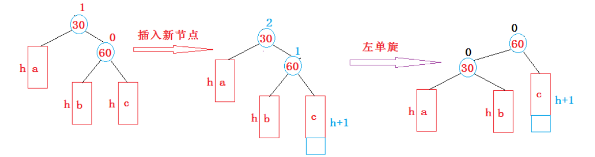
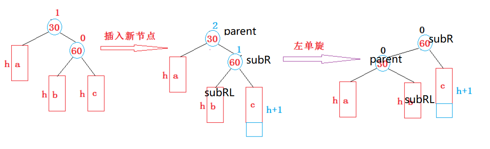
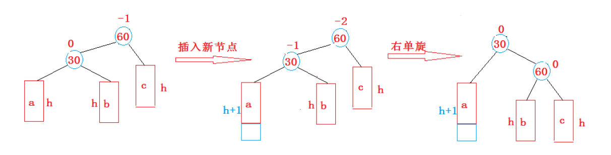
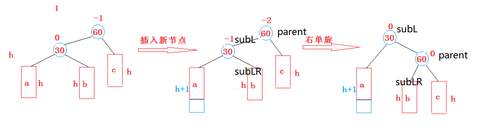
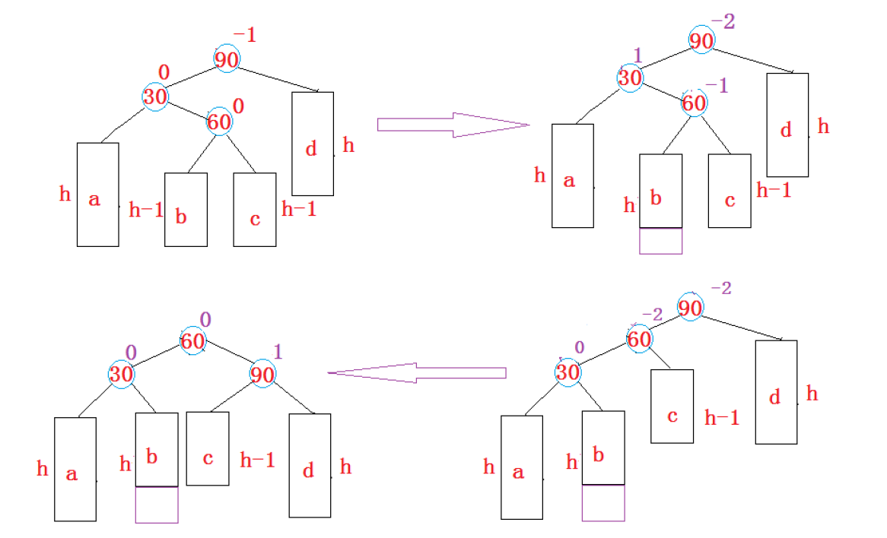
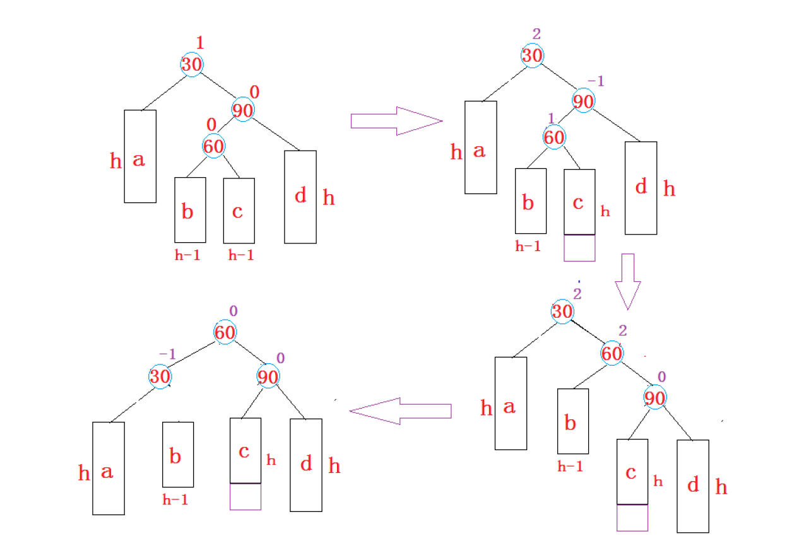

## AVL树的概念
AVL树（英语：AVL tree）是计算机科学中最早被发明的自平衡二叉查找树。在AVL树中，任一节点对应的两棵子树的最大高度差为1，因此它也被称为高度平衡树。查找、插入和删除在平均和最坏情况下的时间复杂度都是 𝑂(log𝑛)。增加和删除元素的操作则可能需要借由一次或多次树旋转，以实现树的重新平衡。AVL树得名于它的发明者格奥尔吉·阿杰尔松-韦利斯基和叶夫根尼·兰迪斯，他们在1962年的论文《An algorithm for the organization of information》中公开了这一数据结构。

节点的平衡因子是它的左子树的高度减去它的右子树的高度（有时相反）。带有平衡因子1、0或 -1的节点被认为是平衡的。带有平衡因子 -2或2的节点被认为是不平衡的，并需要重新平衡这个树。平衡因子可以直接存储在每个节点中，或从可能存储在节点中的子树高度计算出来。

一棵AVL树或者是空树，或者是具有以下性质的二叉搜索树：

+ 它的左右子树都是AVL树
+ 左右子树高度之差(简称平衡因子)的绝对值不超过1(-1/0/1)

如：平衡因子 = 右子树-左子树

非AVL树：  


+ 在平衡之后：


如果一棵二叉搜索树是高度平衡的，它就是AVL树。如果它有n个结点，其高度可保持在  
，搜索时间复杂度O()。

## AVL树节点的定义
```cpp
template<class K, class V>
struct AVLTreeNode
{
	AVLTreeNode<K, V>* _left;
	AVLTreeNode<K, V>* _right;
	AVLTreeNode<K, V>* _parent;

	int _bf; // 平衡因子

	std::pair<K, V> _kv;

	AVLTreeNode(const std::pair<K, V>& kv)
		:_left(nullptr)
		, _right(nullptr)
		, _parent(nullptr)
		, _bf(0)
		, _kv(kv)
	{}
};
```

## AVL树的插入
AVL树就是在二叉搜索树的基础上引入了平衡因子，因此AVL树也可以看成是二叉搜索树。那么  
AVL树的插入过程可以分为两步：

1. 按照二叉搜索树的方式插入新节点
2. 调整节点的平衡因子
    1. 插入到父亲的左边，父亲平衡因子--
    2. 插入到父亲的右边，父亲平衡因子++
    3. 父亲 bf 平衡因子 == 0，父亲所在子树高度不变，不用继续往上更新，插入结束
    4. 父亲 bf 平衡因子 == 1 或者 -1，父亲所在子树高度变了，必须往上更新
    5. 父亲 bf 更新后 == 2 或者 -2 ，父亲所在的子树已经不平衡，需要旋转处理

更新后不可能出现其他值，插入之前树是AVL树，平衡因子要么是`1，-1，0，++，--`

```cpp
bool Insert(const std::pair<K, V>& kv)
{
    if (_root == nullptr)
    {
        _root = new Node(kv);
        return true;
    }
    
    Node* parent = nullptr;
    Node* cur = _root;
    while (cur)
    {
        if (cur->_kv.first < kv.first)
        {
            parent = cur;
            cur = cur->_right;
        }
        else if (cur->_kv.first > kv.first)
        {
            parent = cur;
            cur = cur->_left;
        }
        else
        {
            return false;
        }
    }

    // 到这里找到位置了，可以插入
    cur = new Node(kv);
    if (cur->_kv.first < parent->_kv.first)
        parent->_left = cur;
    else
        parent->_right = cur;
    // 更新
    cur->_parent = parent;

    // 更新平衡因子
    while (parent) // 一直更新到空为止
    {
        if (cur == parent->_left)
            parent->_bf--;
        else
            parent->_bf++;
        
        // 如果正好平衡就结束
        if (parent->_bf == 0)
            break;
        else if (parent->_bf == 1 || parent->_bf == -1)
        {
            // 需要往上继续更新
            cur = parent;
            parent = parent->_parent;
        }
        else if (parent->_bf == 2 || parent->_bf == -2)
        {
            // 需要旋转
            if (parent->_bf == -2 && cur->_bf == -1) // 右单旋
                RotateR(parent);
            else if (parent->_bf == 2 && cur->_bf == 1) // 左单旋
                RotateL(parent);
            else if (parent->_bf == -2 && cur->_bf == 1) // 左右双旋
                RotateLR(parent);
            else if (parent->_bf == 2 && cur->_bf == -1) // 右左双旋
                RotateRL(parent);
            else
                assert(false);
            break;
        }
        else
        {
            assert(false);
        }
    }
    // 完成
    return true;
}
```

## AVL树的旋转
如果在一棵原本是平衡的AVL树中插入一个新节点，可能造成不平衡，此时必须调整树的结构，使之平衡化。根据节点插入位置的不同，AVL树的旋转分为**四种**：

假如以pParent为根的子树不平衡，即pParent的平衡因子为2或者-2，分以下情况考虑

1. pParent的平衡因子为2，说明pParent的右子树高，设pParent的右子树的根为pSubR
    1. 当pSubR的平衡因子为1时，执行左单旋
    2. 当pSubR的平衡因子为-1时，执行右左双旋
2. pParent的平衡因子为-2，说明pParent的左子树高，设pParent的左子树的根为pSubL
    1. 当pSubL的平衡因子为-1是，执行右单旋
    2. 当pSubL的平衡因子为1时，执行左右双旋
3. 旋转完成后，原pParent为根的子树个高度降低，已经平衡，不需要再向上更新。

### 右子树的右侧---右右：左单旋


左单旋的步骤如下：

1. 让subR的左子树作为parent的右子树。
2. 让parent作为subR的左子树。
3. 让subR作为整个子树的根。
4. 更新平衡因子。



```cpp
//左单旋
void RotateL(Node* parent)
{
    Node* subR = parent->_right;
    Node* subRL = subR->_left;

    // 1、建立subR和parent之间的关系
    parent->_right = subRL;
    subR->_left = parent;

    // 2、建立parent和subRL之间的关系
    if (subRL)
        subRL->_parent = parent;

    Node* parentParent = parent->_parent;
    parent->_parent = subR;

    // 3、建立parentParent和subR之间的关系
    if (parentParent == nullptr)
    {
        //subR的_parent指向需改变
        _root = subR;
        subR->_parent = nullptr;
    }
    else
    {
        if (parentParent->_left == parent)
            parentParent->_left = subR;
        else
            parentParent->_right = subR;
        subR->_parent = parentParent;
    }
    // 4、更新平衡因子
    subR->_bf = parent->_bf = 0;
}
```

### 左子树的左侧---左左：右单旋


上图在插入前，AVL树是平衡的，新节点插入到30的左子树(注意：此处不是左孩子)中，30左子树增加了一层，导致以60为根的二叉树不平衡，要让60平衡，只能将60左子树的高度减少一层，右子树增加一层，即将左子树往上提，这样60转下来，因为60比30大，只能将其放在30的右子树，而如果30有右子树，右子树根的值一定大于30，小于60，只能将其放在60的左子树，旋转完成后，更新节点的平衡因子即可。在旋转过程中，有以下几种情况需要考虑：

1. 30节点的右孩子可能存在，也可能不存在
2. 60可能是根节点，也可能是子树
    1. 如果是根节点，旋转完成后，要更新根节点
    2. 如果是子树，可能是某个节点的左子树，也可能是右子树



右单旋的步骤如下：

1. 让subL的右子树作为parent的左子树。
2. 让parent作为subL的右子树。
3. 让subL作为整个子树的根。
4. 更新平衡因子。

```cpp
// 右单旋
void RotateR(Node* parent)
{
    Node* subL = parent->_left;
    Node* subLR = subL->_right;

    //1、建立subL和parent之间的关系
    subL->_right = parent;
    parent->_left = subLR;

    //2、建立parent和subLR之间的关系
    if (subLR)
        subLR->_parent = parent;
    Node* parentParent = parent->_parent;
    parent->_parent = subL;

    //3、建立parentParent和subL之间的关系
    if (parentParent == nullptr)
    {
        _root = subL;
        subL->_parent = nullptr;
    }
    else
    {
        if (parentParent->_left == parent)
            parentParent->_left = subL;
        else
            parentParent->_right= subL;
        subL->_parent = parentParent;
    }
    //4、更新平衡因子
    subL->_bf = parent->_bf = 0;
}
```

### 左子树的右侧---左右：先左单旋再右单旋


将双旋变成单旋后再旋转，即：**先对30进行左单旋，然后再对90进行右单旋**，旋转完成后再考虑平衡因子的更新。

左右双旋的步骤如下：

1. 以subL为旋转点进行左单旋。
2. 以parent为旋转点进行右单旋。
3. 更新平衡因子。

```cpp
//左右双旋
void RotateLR(Node* parent)
{
    Node* subL = parent->_left;
    Node* subLR = subL->_right;
    int bf = subLR->_bf; //subLR不可能为nullptr，因为subL的平衡因子是1

    //1、以subL为旋转点进行左单旋
    RotateL(subL);

    //2、以parent为旋转点进行右单旋
    RotateR(parent);

    //3、更新平衡因子
    if (bf == 1)
    {
        subLR->_bf = 0;
        subL->_bf = -1;
        parent->_bf = 0;
    }
    else if (bf == -1)
    {
        subLR->_bf = 0;
        subL->_bf = 0;
        parent->_bf = 1;
    }
    else if (bf == 0)
    {
        subLR->_bf = 0;
        subL->_bf = 0;
        parent->_bf = 0;
    }
    else
    {
        assert(false); //在旋转前树的平衡因子就有问题
    }
}
```

### 右子树的左侧---右左：先右单旋再左单旋


右左双旋的步骤如下：

1. 以subR为旋转点进行右单旋。
2. 以parent为旋转点进行左单旋。
3. 更新平衡因子。

```cpp
//右左双旋
void RotateRL(Node* parent)
{
    Node* subR = parent->_right;
    Node* subRL = subR->_left;
    int bf = subRL->_bf;

    //1、以subR为轴进行右单旋
    RotateR(subR);

    //2、以parent为轴进行左单旋
    RotateL(parent);

    //3、更新平衡因子
    if (bf == 1)
    {
        subRL->_bf = 0;
        parent->_bf = -1;
        subR->_bf = 0;
    }
    else if (bf == -1)
    {
        subRL->_bf = 0;
        parent->_bf = 0;
        subR->_bf = 1;
    }
    else if (bf == 0)
    {
        subRL->_bf = 0;
        parent->_bf = 0;
        subR->_bf = 0;
    }
    else
    {
        assert(false); //在旋转前树的平衡因子就有问题
    }
}
```

## AVL树的验证
AVL树是在二叉搜索树的基础上加入了平衡性的限制，因此要验证AVL树，可以分两步：

1. 验证其为二叉搜索树如果中序遍历可得到一个有序的序列，就说明为二叉搜索树。
2. 验证其为平衡树每个节点子树高度差的绝对值不超过1(注意节点中如果没有平衡因子)节点的平衡因子是否计算正确。

```cpp
bool IsBalanceTree()
{
    return _IsBalanceTree(root);
}

bool _IsBalanceTree(Node* root)
{
    // 空树也是AVL树
    if (nullptr == root)
        return true;
    // 计算pRoot结点的平衡因子：即pRoot左右子树的高度差
    int leftHeight = _Height(root->_left);
    int rightHeight = _Height(root->_right);
    int diff = rightHeight - leftHeight;
    // 如果计算出的平衡因子与pRoot的平衡因子不相等，或者
    // pRoot平衡因子的绝对值超过1，则一定不是AVL树
    if (abs(diff) >= 2)
    {
        cout << root->_kv.first << "高度差异常" << endl;
        return false;
    }
    if (root->_bf != diff)
    {
        cout << root->_kv.first << "平衡因子异常" << endl;
        return false;
    }
    // pRoot的左和右如果都是AVL树，则该树一定是AVL树
    return _IsBalanceTree(root->_left) && _IsBalanceTree(root->_right);
}
```

## AVL树的查找
AVL树的查找函数与二叉搜索树的查找方式一模一样，逻辑如下：

1. 若树为空树，则查找失败，返回nullptr。
2. 若key值小于当前结点的值，则应该在该结点的左子树当中进行查找。
3. 若key值大于当前结点的值，则应该在该结点的右子树当中进行查找。
4. 若key值等于当前结点的值，则查找成功，返回对应结点。

```cpp
//查找函数
Node* Find(const K& key)
{
    Node* cur = _root;
    while (cur)
    {
        if (key < cur->_kv.first) //key值小于该结点的值
        {
            cur = cur->_left; //在该结点的左子树当中查找
        }
        else if (key > cur->_kv.first) //key值大于该结点的值
        {
            cur = cur->_right; //在该结点的右子树当中查找
        }
        else //找到了目标结点
        {
            return cur; //返回该结点
        }
    }
    return nullptr; //查找失败
}
```

## AVL树的修改
### 修改函数一
```cpp
//修改函数
bool Modify(const K& key, const V& value)
{
    Node* ret = Find(key);
    if (ret == nullptr) //未找到指定key值的结点
    {
        return false;
    }
    ret->_kv.second = value; //修改结点的value
    return true;
}
```

### 修改函数二
+ 若待插入结点的键值key在map当中不存在，则结点插入成功，并返回插入后结点的指针和true。
+ 若待插入结点的键值key在map当中已经存在，则结点插入失败，并返回map当中键值为key的结点的指针和false。

```cpp
//插入函数
pair<Node*, bool> Insert(const pair<K, V>& kv)
{
    if (_root == nullptr) //若AVL树为空树，则插入结点直接作为根结点
    {
        _root = new Node(kv);
        return make_pair(_root, true); //插入成功，返回新插入结点和true
    }
    //1、按照二叉搜索树的插入方法，找到待插入位置
    Node* cur = _root;
    Node* parent = nullptr;
    while (cur)
    {
        if (kv.first < cur->_kv.first) //待插入结点的key值小于当前结点的key值
        {
            //往该结点的左子树走
            parent = cur;
            cur = cur->_left;
        }
        else if (kv.first > cur->_kv.first) //待插入结点的key值大于当前结点的key值
        {
            //往该结点的右子树走
            parent = cur;
            cur = cur->_right;
        }
        else //待插入结点的key值等于当前结点的key值
        {
            //插入失败（不允许key值冗余）
            return make_pair(cur, false); //插入失败，返回已经存在的结点和false
        }
    }

    //2、将待插入结点插入到树中
    cur = new Node(kv); //根据所给值构造一个新结点
    Node* newnode = cur; //记录新插入的结点
    if (kv.first < parent->_kv.first) //新结点的key值小于parent的key值
    {
        //插入到parent的左边
        parent->_left = cur;
        cur->_parent = parent;
    }
    else //新结点的key值大于parent的key值
    {
        //插入到parent的右边
        parent->_right = cur;
        cur->_parent = parent;
    }

    //3、更新平衡因子，如果出现不平衡，则需要进行旋转
    while (cur != _root) //最坏一路更新到根结点
    {
        if (cur == parent->_left) //parent的左子树增高
        {
            parent->_bf--; //parent的平衡因子--
        }
        else if (cur == parent->_right) //parent的右子树增高
        {
            parent->_bf++; //parent的平衡因子++
        }
        //判断是否更新结束或需要进行旋转
        if (parent->_bf == 0) //更新结束（新增结点把parent左右子树矮的那一边增高了，此时左右高度一致）
        {
            break; //parent树的高度没有发生变化，不会影响其父结点及以上结点的平衡因子
        }
        else if (parent->_bf == -1 || parent->_bf == 1) //需要继续往上更新平衡因子
        {
            //parent树的高度变化，会影响其父结点的平衡因子，需要继续往上更新平衡因子
            cur = parent;
            parent = parent->_parent;
        }
        else if (parent->_bf == -2 || parent->_bf == 2) //需要进行旋转（此时parent树已经不平衡了）
        {
            if (parent->_bf == -2)
            {
                if (cur->_bf == -1)
                {
                    RotateR(parent); //右单旋
                }
                else //cur->_bf == 1
                {
                    RotateLR(parent); //左右双旋
                }
            }
            else //parent->_bf == 2
            {
                if (cur->_bf == -1)
                {
                    RotateRL(parent); //右左双旋
                }
                else //cur->_bf == 1
                {
                    RotateL(parent); //左单旋
                }
            }
            break; //旋转后就一定平衡了，无需继续往上更新平衡因子(旋转后树高度变为插入之前了)
        }
        else
        {
            assert(false); //在插入前树的平衡因子就有问题
        }
    }

    return make_pair(newnode, true); //插入成功，返回新插入结点和true
}
```

### 重载[ ]
1. 调用插入函数插入键值对。
2. 拿出从插入函数获取到的结点。
3. 返回该结点value的引用。
+ 如果key不在树中，则先插入键值对`<key, V()>`，然后返回该键值对中`value`的引用。
+ 如果key已经在树中，则返回键值为`key`结点`value`的引用。

```cpp
//operator[]重载
V& operator[](const K& key)
{
    //调用插入函数插入键值对
    pair<Node*, bool> ret = Insert(make_pair(key, V()));
    //拿出从插入函数获取到的结点
    Node* node = ret.first;
    //返回该结点value的引用
    return node->_kv.second;
}
```

## AVL树的删除
删除方法和二叉搜索树相同

1. 先找到待删除的结点。
2. 若找到的待删除结点的左右子树均不为空，则需要使用**替换法**进行删除。

```cpp
//删除函数
bool Erase(const K& key)
{
    //用于遍历二叉树
    Node* parent = nullptr;
    Node* cur = _root;
    //用于标记实际的删除结点及其父结点
    Node* delParentPos = nullptr;
    Node* delPos = nullptr;
    while (cur)
    {
        if (key < cur->_kv.first) //所给key值小于当前结点的key值
        {
            //往该结点的左子树走
            parent = cur;
            cur = cur->_left;
        }
        else if (key > cur->_kv.first) //所给key值大于当前结点的key值
        {
            //往该结点的右子树走
            parent = cur;
            cur = cur->_right;
        }
        else //找到了待删除结点
        {
            if (cur->_left == nullptr) //待删除结点的左子树为空
            {
                if (cur == _root) //待删除结点是根结点
                {
                    _root = _root->_right; //让根结点的右子树作为新的根结点
                    if (_root)
                        _root->_parent = nullptr;
                    delete cur; //删除原根结点
                    return true; //根结点无祖先结点，无需进行平衡因子的更新操作
                }
                else
                {
                    delParentPos = parent; //标记实际删除结点的父结点
                    delPos = cur; //标记实际删除的结点
                }
                break; //删除结点有祖先结点，需更新平衡因子
            }
            else if (cur->_right == nullptr) //待删除结点的右子树为空
            {
                if (cur == _root) //待删除结点是根结点
                {
                    _root = _root->_left; //让根结点的左子树作为新的根结点
                    if (_root)
                        _root->_parent = nullptr;
                    delete cur; //删除原根结点
                    return true; //根结点无祖先结点，无需进行平衡因子的更新操作
                }
                else
                {
                    delParentPos = parent; //标记实际删除结点的父结点
                    delPos = cur; //标记实际删除的结点
                }
                break; //删除结点有祖先结点，需更新平衡因子
            }
            else //待删除结点的左右子树均不为空
            {
                //替换法删除
                //寻找待删除结点右子树当中key值最小的结点作为实际删除结点
                Node* minParent = cur;
                Node* minRight = cur->_right;
                while (minRight->_left)
                {
                    minParent = minRight;
                    minRight = minRight->_left;
                }
                cur->_kv.first = minRight->_kv.first; //将待删除结点的key改为minRight的key
                cur->_kv.second = minRight->_kv.second; //将待删除结点的value改为minRight的value
                delParentPos = minParent; //标记实际删除结点的父结点
                delPos = minRight; //标记实际删除的结点
                break; //删除结点有祖先结点，需更新平衡因子
            }
        }
    }
    if (delParentPos == nullptr) //delParentPos没有被修改过，说明没有找到待删除结点
    {
        return false;
    }

    //记录待删除结点及其父结点（用于后续实际删除）
    Node* del = delPos;
    Node* delP = delParentPos;

    //更新平衡因子
    while (delPos != _root) //最坏一路更新到根结点
    {
        if (delPos == delParentPos->_left) //delParentPos的左子树高度降低
        {
            delParentPos->_bf++; //delParentPos的平衡因子++
        }
        else if (delPos == delParentPos->_right) //delParentPos的右子树高度降低
        {
            delParentPos->_bf--; //delParentPos的平衡因子--
        }
        //判断是否更新结束或需要进行旋转
        if (delParentPos->_bf == 0)//需要继续往上更新平衡因子
        {
            //delParentPos树的高度变化，会影响其父结点的平衡因子，需要继续往上更新平衡因子
            delPos = delParentPos;
            delParentPos = delParentPos->_parent;
        }
        else if (delParentPos->_bf == -1 || delParentPos->_bf == 1) //更新结束
        {
            break; //delParent树的高度没有发生变化，不会影响其父结点及以上结点的平衡因子
        }
        else if (delParentPos->_bf == -2 || delParentPos->_bf == 2) //需要进行旋转（此时delParentPos树已经不平衡了）
        {
            if (delParentPos->_bf == -2)
            {
                if (delParentPos->_left->_bf == -1)
                {
                    Node* tmp = delParentPos->_left; //记录delParentPos右旋转后新的根结点
                    RotateR(delParentPos); //右单旋
                    delParentPos = tmp; //更新根结点
                }
                else if(delParentPos->_left->_bf == 1)
                {
                    Node* tmp = delParentPos->_left->_right; //记录delParentPos左右旋转后新的根结点
                    RotateLR(delParentPos); //左右双旋
                    delParentPos = tmp; //更新根结点
                }
                else //delParentPos->_left->_bf == 0
                {
                    Node* tmp = delParentPos->_left; //记录delParentPos右旋转后新的根结点
                    RotateR(delParentPos); //右单旋
                    delParentPos = tmp; //更新根结点
                    //平衡因子调整
                    delParentPos->_bf = 1;
                    delParentPos->_right->_bf = -1;
                    break; //更正
                }
            }
            else //delParentPos->_bf == 2
            {
                if (delParentPos->_right->_bf == -1)
                {
                    Node* tmp = delParentPos->_right->_left; //记录delParentPos右左旋转后新的根结点
                    RotateRL(delParentPos); //右左双旋
                    delParentPos = tmp; //更新根结点
                }
                else if(delParentPos->_right->_bf == 1)
                {
                    Node* tmp = delParentPos->_right; //记录delParentPos左旋转后新的根结点
                    RotateL(delParentPos); //左单旋
                    delParentPos = tmp; //更新根结点
                }
                else //delParentPos->_right->_bf == 0
                {
                    Node* tmp = delParentPos->_right; //记录delParentPos左旋转后新的根结点
                    RotateL(delParentPos); //左单旋
                    delParentPos = tmp; //更新根结点
                    //平衡因子调整
                    delParentPos->_bf = -1;
                    delParentPos->_left->_bf = 1;
                    break; //更正
                }
            }
            //delParentPos树的高度变化，会影响其父结点的平衡因子，需要继续往上更新平衡因子
            delPos = delParentPos;
            delParentPos = delParentPos->_parent;
            //break; //error
        }
        else
        {
            assert(false); //在删除前树的平衡因子就有问题
        }
    }
    //进行实际删除
    if (del->_left == nullptr) //实际删除结点的左子树为空
    {
        if (del == delP->_left) //实际删除结点是其父结点的左孩子
        {
            delP->_left = del->_right;
            if (del->_right)
                del->_right->_parent = delP;
        }
        else //实际删除结点是其父结点的右孩子
        {
            delP->_right = del->_right;
            if (del->_right)
                del->_right->_parent = delP;
        }
    }
    else //实际删除结点的右子树为空
    {
        if (del == delP->_left) //实际删除结点是其父结点的左孩子
        {
            delP->_left = del->_left;
            if (del->_left)
                del->_left->_parent = delP;
        }
        else //实际删除结点是其父结点的右孩子
        {
            delP->_right = del->_left;
            if (del->_left)
                del->_left->_parent = delP;
        }
    }
    delete del; //实际删除结点
    return true;
}
```

## AVL树的性能
AVL树是一棵绝对平衡的二叉搜索树，其要求每个节点的左右子树高度差的绝对值都不超过1，这样可以保证查询时高效的时间复杂度，即。但是如果要对AVL树做一些结构修改的操作，性能非常低下，比如：插入时要维护其绝对平衡，旋转的次数比较多，更差的是在删除时，有可能一直要让旋转持续到根的位置。因此：如果需要一种查询高效且有序的数据结构，而且数据的个数为静态的(即不会改变)，可以考虑AVL树，但一个结构经常修改，就不太适合。

```cpp
#include "AVL.h"
#include <vector>
// 测试代码
void TestAVLTree1()
{
	AVLTree<int, int> t;
	// 常规的测试用例
	//int a[] = { 16, 3, 7, 11, 9, 26, 18, 14, 15 };
	// 特殊的带有双旋场景的测试用例
	int a[] = { 4, 2, 6, 1, 3, 5, 15, 7, 16, 14 };
	for (auto e : a)
	{
		t.Insert({ e, e });
	}
	t.InOrder();

	std::cout << t.IsBalanceTree() << std::endl;
}

// 插入一堆随机值，测试平衡，顺便测试一下高度和性能等
void TestAVLTree2()
{
	const int N = 100000000;
	vector<int> v;
	v.reserve(N);
	srand((unsigned int)time(0));

	for (size_t i = 0; i < N; i++)
		v.push_back(rand() + i);

	// 插入值
	//////////////////////////////////////////////////////
	size_t begin1 = clock();
	AVLTree<int, int> t;
	for (size_t i = 0; i < v.size(); ++i)
		t.Insert(make_pair(v[i], v[i]));
	size_t end1 = clock();
	cout << "Insert:" << end1 - begin1 << endl;
	//////////////////////////////////////////////////////

	// 检查是否平衡
	cout << t.IsBalanceTree() << endl;

	// 查看高度
	//////////////////////////////////////////////////////
	cout << "Height:" << t.Height() << endl;
	cout << "Size:" << t.Size() << endl;
	//////////////////////////////////////////////////////
	
	// 随机值查找
	size_t begin2 = clock();
	for (size_t i = 0; i < N; i++)
		t.Find((rand() + i));
	size_t end2 = clock();
	cout << "随机的值：Find:" << end2 - begin2 << endl;
	//////////////////////////////////////////////////////

	// 确定在的值查找
	size_t begin3 = clock();
	for (auto e : v)
		t.Find(e);
	size_t end3 = clock();
	cout << "确定的值：Find:" << end3 - begin3 << endl;
}
```

