# thread库
## thread类的简单介绍
在C++11之前，涉及到多线程问题，都是和平台相关的，比如windows和linux下各有自己的接 口，这使得代码的可移植性比较差。C++11中最重要的特性就是对线程进行支持了，使得C++在并行编程时不需要依赖第三方库，而且在原子操作中还引入了原子类的概念。要使用标准库中的线程，必须包含`<thread>`头文件。

[thread - C++ Reference](https://legacy.cplusplus.com/reference/thread/thread/)

| 函数名 | 功能 |
| --- | --- |
| thread() | 构造一个线程对象，没有关联任何线程函数，即没有启动任何线程 |
| thread(fn, args1, args2, ...) | 构造一个线程对象，并关联线程函数fn，args1，args2，...为线程函数的 参数 |
| get_id() | 获取线程id |
| joinable() | 线程是否还在执行，joinable代表的是一个正在执行中的线程。 |
| join() | 该函数调用后会阻塞住线程，当该线程结束后，主线程继续执行 |
| detach() | 在创建线程对象后马上调用，用于把被创建线程与线程对象分离开，分离的线程变为后台线程，创建的线程的"死活"就与主线程无关 |


1. 线程是操作系统中的一个概念，线程对象可以关联一个线程，用来控制线程以及获取线程的状态。 
2. 当创建一个线程对象后，没有提供线程函数，该对象实际没有对应任何线程。
+ `get_id()`的返回值类型为id类型，id类型实际为`std::thread`命名空间下封装的一个类，该类中包含了一个结构体：

```cpp
#include <thread>

using namespace std;
int main()
{
    std::thread t1;
    cout << t1.get_id() << endl;
    return 0;
}
```

3. 当创建一个线程对象后，并且给线程关联线程函数，该线程就被启动，与主线程一起运行。 线程函数一般情况下可按照`函数指针` `lambda表达式` `函数对象`

```cpp
void ThreadFunc(int a)
{
    cout << "Thread1" << a << endl;
}
class TF
{
public:
    void operator()()
    {
        cout << "Thread3" << endl;
    }
};
int main()
{
    // 线程函数为函数指针
    thread t1(ThreadFunc, 10);
    // 线程函数为lambda表达式
    thread t2([] {cout << "Thread2" << endl; });
    // 线程函数为函数对象
    TF tf;
    thread t3(tf);
    t1.join();
    t2.join();
    t3.join();
    cout << "Main thread!" << endl;
    return 0;
}
```

4. thread类是防拷贝的，不允许拷贝构造以及赋值，但是**可以移动构造和移动赋值**，即将一个线程对象关联线程的状态转移给其他线程对象，转移期间不意向线程的执行。

```cpp
void ThreadFunc(int a)
{
    cout << "Thread" << a << endl;
}

int main()
{
    thread t1(ThreadFunc,1);
    //thread t2(t1); // 报错
    thread t2(std::move(t1));
    t2.join();// 交给t2join

    return 0;
}
```

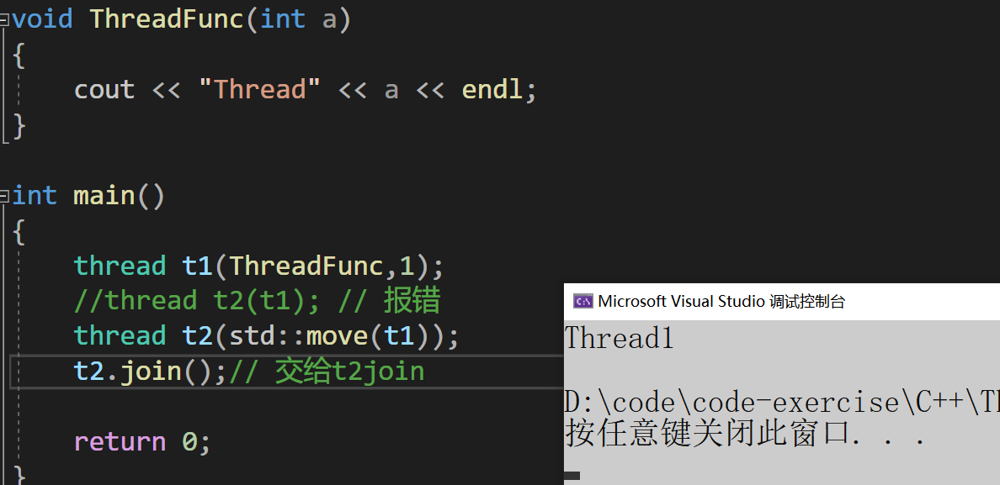

5. 可以通过`jionable()`函数判断线程是否是有效的，如果是以下任意情况，则线程无效
+ 采用无参构造函数构造的线程对象 
+ 线程对象的状态已经转移给其他线程对象 
+ 线程已经调用`jion`或者`detach`结束

# mutex的种类
## std::mutex
+ C++11提供的最基本的互斥量，该类的对象之间不能拷贝，也不能进行移动。`mutex`最常用的三个函数：

| 函数名 | 函数功能 |
| --- | --- |
| lock() 上锁 | 锁住互斥量 |
| unlock() 解锁 | 释放对互斥量的所有权 |
| try_lock() | 尝试锁住互斥量，如果互斥量被其他线程占有，则当前线程也不会被阻塞 |


注意，线程函数调用`lock()`时，可能会发生以下三种情况：

+ 如果该互斥量当前没有被锁住，则调用线程将该互斥量锁住，直到调用unlock之前，该线程一直拥有该锁
+ 如果当前互斥量被其他线程锁住，则当前的调用线程被阻塞住
+ 如果当前互斥量被当前调用线程锁住，则会产生死锁(deadlock)

线程函数调用`try_lock()`时，可能会发生以下三种情况：

+ 如果当前互斥量没有被其他线程占有，则该线程锁住互斥量，直到该线程调用`unlock`释放互斥量
+ 如果当前互斥量被其他线程锁住，则当前调用线程返回 false，而并不会被阻塞掉
+ 如果当前互斥量被当前调用线程锁住，则会产生死锁(deadlock)

## std::recursive_mutex
recursive_mutex 跟 mutex 完全类似，recursive_mutex 提供排他性递归所有权语义：

1. 调用方线程在从它成功调用 lock 或 try_lock 开始的时期里占有 recursive_mutex。此时期之内，线程可以进行对 lock 或 try_lock 的附加调用。所有权的时期在线程进行匹配次数的 unlock 调用时结束。
2. 线程占有 recursive_mutex 时，若其他所有线程试图要求 recursive_mutex 的所有权，则它们将阻塞（对于调用 lock）或收到 false 返回值（对于调用 try_lock）

## std::timed_mutex
比`std::mutex`多了两个成员函数，`try_lock_for()`，`try_lock_until()` 。

`try_lock_for()`

+ 接受一个时间范围，表示在这一段时间范围之内线程如果没有获得锁则被阻塞住（与  
  `std::mutex 的 try_lock()` 不同，`try_lock` 如果被调用时没有获得锁则直接返回  
  false），如果在此期间其他线程释放了锁，则该线程可以获得对互斥量的锁，如果超  
  时（即在指定时间内还是没有获得锁），则返回 `false`。

`try_lock_until()`

+ 接受一个时间点作为参数，在指定时间点未到来之前线程如果没有获得锁则被阻塞住，  
  如果在此期间其他线程释放了锁，则该线程可以获得对互斥量的锁，如果超时（即在指  
  定时间内还是没有获得锁），则返回 `false`。

### unique_lock
+ 与`lock_gard`类似，unique_lock类模板也是采用RAII的方式对锁进行了封装，并且也是以独占所有权的方式管理mutex对象的上锁和解锁操作，即其对象之间不能发生拷贝。在构造(或移动(move)赋值)时，**unique_lock 对象需要传递一个 Mutex 对象作为它的参数**，新创建的unique_lock 对象负责传入的 Mutex 对象的上锁和解锁操作。使用以上类型**互斥量实例化unique_lock的对象**时，自动调用构造函数上锁，**unique_lock对象销毁时自动调用析构函数解锁**，可以很方便的防止死锁问题。

与lock_guard不同的是，unique_lock更加的灵活，提供了更多的成员函数：

+ 上锁/解锁操作：`lock`、`try_lock`、`try_lock_for`、`try_lock_until`和`unlock`
+ 修改操作：移动赋值、交换(swap：与另一个unique_lock对象互换所管理的互斥量所有权)、释放(release：返回它所管理的互斥量对象的指针，并释放所有权)
+ 获取属性：owns_lock(返回当前对象是否上了锁)、operator bool()(与owns_lock()的功能相同)、mutex(返回当前unique_lock所管理的互斥量的指针)。

# this_thread
[this_thread - C++ Reference](https://legacy.cplusplus.com/reference/thread/this_thread/)

this_thread是一个命名空间，主要封装了线程相关的4个全局接口函数。

`yield`是主动让出当前线程的执行权，让其他线程先执行。此函数的确切行为依赖于实现，特别是取决于使用中的 OS 调度器机制和系统状态。例如，先进先出实时调度器（Linux 的 SCHED_FIFO）会挂起当前线程并将它放到准备运行的同优先级线程的队列尾，而若无其他线程在同优先级，则`yield`无效果。

`get_id`是当前执行线程的线程id。

`sleep_for`阻塞当前线程执行，至少经过指定的`sleep_duration`。因为调度或资源争议延迟，此函数可能阻塞长于`sleep_duration`。

`sleep_until`阻塞当前线程的执行，直至抵达指定的`sleep_time`。函数可能会因为调度或资源纠纷延迟而阻塞到`sleep_time`之后的某个时间点。

`chrono`是一个计时相关的类型。

[https://legacy.cplusplus.com/reference/chrono/](https://legacy.cplusplus.com/reference/chrono/) 

`duration`是用来管理一个相对时间段的类。

[https://legacy.cplusplus.com/reference/chrono/duration/](https://legacy.cplusplus.com/reference/chrono/duration/) 

`time_point`是用来管理一个绝对时间点的类。

[https://legacy.cplusplus.com/reference/chrono/time_point/](https://legacy.cplusplus.com/reference/chrono/time_point/)

```cpp
#include <iostream>
#include <thread>
#include <chrono> 


using namespace std;

int main()
{
	std::cout << "countdown:\n";
	for (int i = 10; i > 0; --i) {
		std::cout << i << std::endl;
		std::this_thread::sleep_for(std::chrono::seconds(1)); // 休眠一秒
	}
	std::cout << "Lift off!\n";
	return 0;
}
```

## 线程函数参数
**线程函数的参数是以值拷贝的方式拷贝到线程栈空间中的**，因此：即使线程参数为引用类型，在线程中修改后也不能修改外部实参，因为其实际引用的是线程栈中的拷贝，而不是外部实参。

```cpp
void ThreadFunc1(int& x)
{
    x += 10;
}
void ThreadFunc2(int* x)
{
    *x += 10;
}
int main()
{
    int a = 10;
    // 在线程函数中对a修改，不会影响外部实参，因为：线程函数参数虽然是引用方式，但其实际引用的是线程栈中的拷贝
    thread t1(ThreadFunc1, a);
    t1.join();
    cout << a << endl;

    // 如果想要通过形参改变外部实参时，必须借助std::ref()函数
    thread t2(ThreadFunc1, std::ref(a));
    t2.join();
    cout << a << endl;

    // 地址的拷贝
    thread t3(ThreadFunc2, &a);
    t3.join();
    cout << a << endl;
    return 0;
}
```

+ 也还可以创建多个线程

```cpp
#include <vector>
#include <string>

void Print(size_t n, const string& s)
{
    for (size_t i = 0; i < n; i++)
    {
        cout << this_thread::get_id() << s << ":" << i << endl;
    }
}

int main()
{
    size_t n;
    cin >> n;

    //创建n个线程执行Print
    vector<thread> vthd(n);
    size_t j = 0;
    for (auto& thd : vthd)
    {
        // 移动赋值
        thd = thread(Print, 10,  "线程" + to_string(j++));
    }

    for (auto& thd : vthd)
    {
        thd.join();
    }

    return 0;
}
```

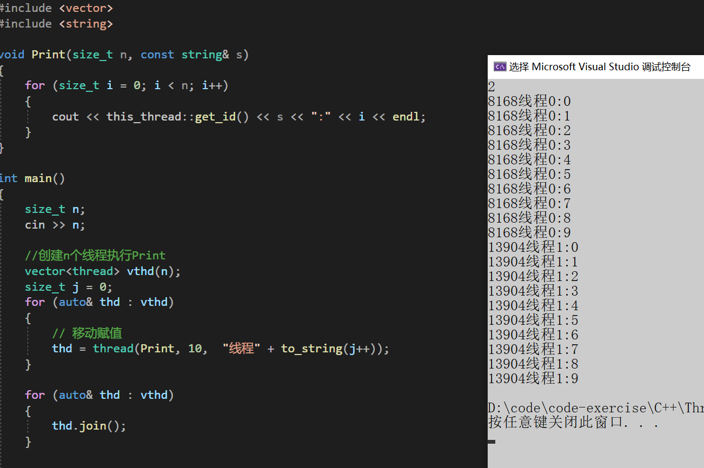

```cpp
#include <mutex>

int main()
{
    int n1 = 0;
    int n2 = 0;
    cin >> n1 >> n2;
    mutex mtx;

    int x = 0;
    thread t1([n1, &x,&mtx]()
        {
            for (size_t i = 0; i < n1; i++)
            {
                mtx.lock();
                ++x;
                mtx.unlock();
            }
        });

    thread t2([n2, &x, &mtx]()
        {
            for (size_t i = 0; i < n2; i++)
            {
                mtx.lock();
                ++x;
                mtx.unlock();
            }
        });

    t1.join();
    t2.join();
    cout << x << endl;

    return 0;
}
```

+ 必须访问临界资源的地方全部加锁，才能保证数字的不错乱

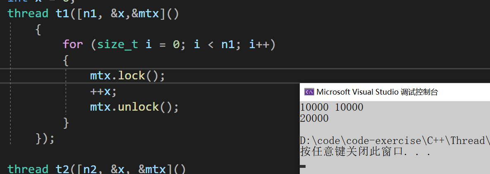

+ 如果其中一个不加锁就会导致数据的错乱

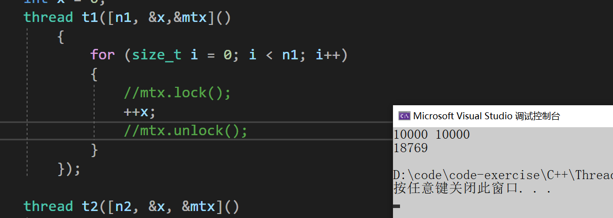

在传参的时候需要注意这里是需要进行引用使用`ref`传参

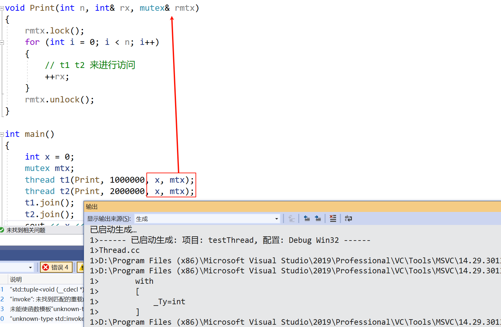

+ 在传参的时候需要加`ref()`

[ref - C++ Reference](https://legacy.cplusplus.com/reference/functional/ref/?kw=ref)

原因是thread本质还是系统库提供的线程API的封装，thread构造取到参数包以后，要调用创建线程的API，还是需要将参数包打包成一个结构体传参过去，那么打包成结构体时，参考包对象就会拷贝给结构体对象，使用ref传参的参数，会让结构体中的对应参数成员类型推导为引用，这样才能实现引用传参

```cpp
void Print(int n, int& rx, mutex& rmtx)
{
	rmtx.lock();
	for (int i = 0; i < n; i++)
	{
		// t1 t2 来进行访问
		++rx;
	}
	rmtx.unlock();
}

int main()
{
	int x = 0;
	mutex mtx;
	thread t1(Print, 1000000, ref(x), ref(mtx));
	thread t2(Print, 2000000, ref(x), ref(mtx));
	t1.join();
	t2.join();
	cout << x << endl;
	return 0;
}
```

或者使用lambda可以解决上面的问题

```cpp
#include <iostream>
#include <chrono>
#include <thread>
#include <mutex>
using namespace std;
int main()
{
	int x = 0;
	mutex mtx;
	// 将上面的代码改成使用lambda捕获外层的对象，也就可以不用传参数，间接解决了上面的问题
	auto Print = [&x, &mtx](size_t n) {
		mtx.lock();
		for (size_t i = 0; i < n; i++)
		{
			++x;
		}
		mtx.unlock();
	};
	thread t1(Print, 1000000);
	thread t2(Print, 2000000);
	t1.join();
	t2.join();
	cout << x << endl;
	return 0;
}
```

## lock_guard与unique_lock
+ 在多线程环境下，如果想要保证某个变量的安全性，只要将其设置成对应的原子类型即可，即高效又不容易出现死锁问题。但是有些情况下，我们可能需要保证一段代码的安全性，那么就只能通过锁的方式来进行控制。
+ 比如：一个线程对变量number进行加一100次，另外一个减一100次，每次操作加一或者减一之 后，输出number的结果，要求：number最后的值为0。

```cpp
#include <thread>
#include <mutex>
int number = 0;
mutex g_lock;
int ThreadProc1()
{
    for (int i = 0; i < 100; i++)
    {
        g_lock.lock();
        ++number;
        cout << "thread 1 :" << number << endl;
        g_lock.unlock();
    }
    return 0;
}
int ThreadProc2()
{
    for (int i = 0; i < 100; i++)
    {
        g_lock.lock();
        --number;
        cout << "thread 2 :" << number << endl;
        g_lock.unlock();
    }
    return 0;
}


int main()
{
    thread t1(ThreadProc1);
    thread t2(ThreadProc2);
    t1.join();
    t2.join();
    cout << "number:" << number << endl;
    return 0;
}
```

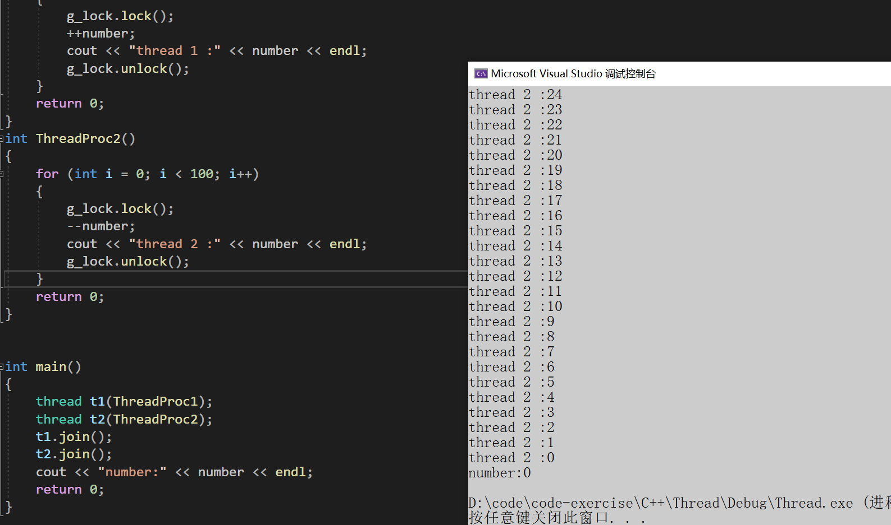

+ 上述代码的缺陷：锁控制不好时，可能会造成死锁，最常见的比如在锁中间代码返回，或者在锁的范围内抛异常。因此：C++11采用RAII的方式对锁进行了封装，即`lock_guard`和`unique_lock`。

### lock_guard
[lock_guard - C++ Reference](https://legacy.cplusplus.com/reference/mutex/lock_guard/?kw=lock_guard)

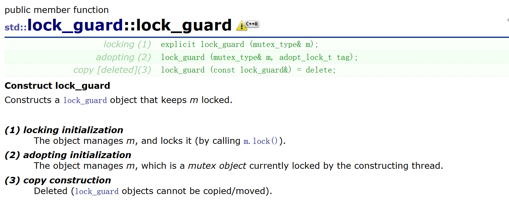

lock_guard类模板主要是通过RAII的方式，对其管理的互斥量进行了封装，在需要加锁的地方，只需要用上述介绍的任意互斥体实例化一个`lock_guard`，调用构造函数成功上锁，出作用域前，`lock_guard`对象要被销毁，调用析构函数自动解锁，可以有效避免死锁问题。

**lock_guard的缺陷**：太单一，用户没有办法对该锁进行控制，因此C++11又提供了`unique_lock`。

`lock_guard`的功能简单纯粹，仅仅支持RAII的方式管理锁对象。也可以在构造的时候通过传参`adopt_lock_t`的`adopt_lock`对象管理已经lock的锁对象。其次`lock_guard`类不支持拷贝构造。

```cpp
#include <iostream>
#include <chrono>
#include <thread>
#include <mutex>
using namespace std;

int main()
{
	int x = 0;
	mutex mtx;
	auto Print = [&x, &mtx](size_t n) {

		{ // 临界区
			lock_guard<mutex> lock(mtx); // 使用lock_guard进行管理
			//mtx.lock();
			for (size_t i = 0; i < n; i++)
			{
				++x;
			}
			//mtx.unlock();
		}
	
	};
	thread t1(Print, 1000000);
	thread t2(Print, 2000000);
	t1.join();
	t2.join();
	cout << x << endl;
	return 0;
}
```

### unique_lock
unique_lock首先在构造的时候传不同的tag，用以支持在构造的时候不同的方式处理锁对象

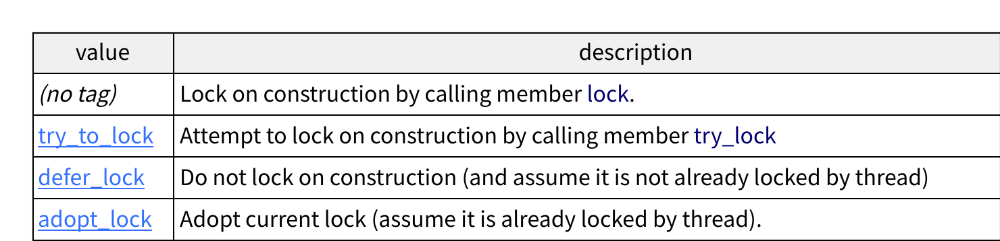

unique_lock首先在构造的时候传时间段和时间点，用来管理time_mutex系统，构造时调用

try_lock_for和try_lock_until

unique_lock不支持拷贝和赋值，支持移动构造和移动赋值。

unique_lock不支持拷贝和赋值，支持移动构造和移动赋值。

unique_lock还可以通过operator bool去检查是否lock了锁对象。

## lock和try_lock
lock是一个函数模板，可以**支持对多个锁对象同时锁定**，如果其中一个锁对象没有锁住，lock函数会把已经锁定的对象解锁而进入阻塞，直到锁定所有的所有的对象。

下面代码会造成死锁

```cpp
// std::lock example
#include <iostream> // std::cout
#include <thread> // std::thread
#include <mutex> // std::mutex, std::lock
#include <chrono> // std::chrono
std::mutex foo, bar;
void task_a() {
	std::this_thread::sleep_for(std::chrono::seconds(1)); // 休眠一秒
	foo.lock(); bar.lock(); // replaced by:
	std::cout << "task a\n";
	foo.unlock();
	bar.unlock();
}
void task_b() {
	std::this_thread::sleep_for(std::chrono::seconds(1));
	bar.lock(); foo.lock(); // replaced by:
	std::cout << "task b\n";
	bar.unlock();
	foo.unlock();
}
int main()
{
	std::thread th1(task_a);
	std::thread th2(task_b);

	th1.join();
	th2.join();
	return 0;
}
```

使用lock就可以解决

```cpp
// std::lock example
#include <iostream> // std::cout
#include <thread> // std::thread
#include <mutex> // std::mutex, std::lock
#include <chrono> // std::chrono
std::mutex foo, bar;
void task_a() {
	std::this_thread::sleep_for(std::chrono::seconds(1)); // 休眠一秒
	//foo.lock(); bar.lock(); // replaced by:
	std::lock(foo, bar);
	std::cout << "task a\n";
	foo.unlock();
	bar.unlock();
}
void task_b() {
	std::this_thread::sleep_for(std::chrono::seconds(1));
	//bar.lock(); foo.lock(); // replaced by:
	std::lock(foo, bar);
	std::cout << "task b\n";
	bar.unlock();
	foo.unlock();
}
int main()
{
	std::thread th1(task_a);
	std::thread th2(task_b);

	th1.join();
	th2.join();
	return 0;
}
```

try_lock也是一个函数模板，尝试对多个锁对象进行同时尝试锁定，如果全部锁对象都锁定了，返回-1，如果某一个锁对象尝试锁定失败，把已经锁定成功的锁对象解锁，并则返回这个对象的下标（第一个参数对象，下标从0开始算）。

```cpp
#include <iostream>       // std::cout
#include <thread>         // std::thread
#include <mutex>          // std::mutex, std::try_lock

std::mutex foo, bar;

void task_a() {
    foo.lock();
    std::cout << "task a\n";
    bar.lock();
    // ...
    foo.unlock();
    bar.unlock();
}

void task_b() {
    int x = try_lock(bar, foo);
    if (x == -1) {
        std::cout << "task b\n";
        // ...
        bar.unlock();
        foo.unlock();
    }
    else {
        std::cout << "[task b failed: mutex " << (x ? "foo" : "bar") << " locked]\n";
    }
}

int main()
{
    std::thread th1(task_a);
    std::thread th2(task_b);

    th1.join();
    th2.join();

    return 0;
}
```

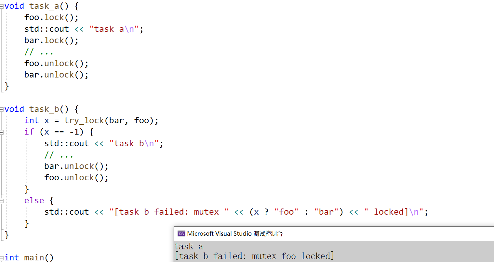

## call_once
多线程执行时，让第一个线程执行Fn一次，其他线程不再执行Fn。

```cpp
#include <iostream>       // std::cout
#include <thread>         // std::thread, std::this_thread::sleep_for
#include <chrono>         // std::chrono::milliseconds
#include <mutex>          // std::call_once, std::once_flag

int winner;
void set_winner(int x) { winner = x; }
std::once_flag winner_flag;

void wait_1000ms(int id) {
    // count to 1000, waiting 1ms between increments:
    for (int i = 0; i < 1000; ++i)
        std::this_thread::sleep_for(std::chrono::milliseconds(1));
    // claim to be the winner (only the first such call is executed):
    std::call_once(winner_flag, set_winner, id);
}

int main()
{
    std::thread threads[10];
    // spawn 10 threads:
    for (int i = 0; i < 10; ++i)
        threads[i] = std::thread(wait_1000ms, i + 1);

    std::cout << "waiting for the first among 10 threads to count 1000 ms...\n";

    for (auto& th : threads) th.join();
    std::cout << "winner thread: " << winner << '\n';

    return 0;
}
```

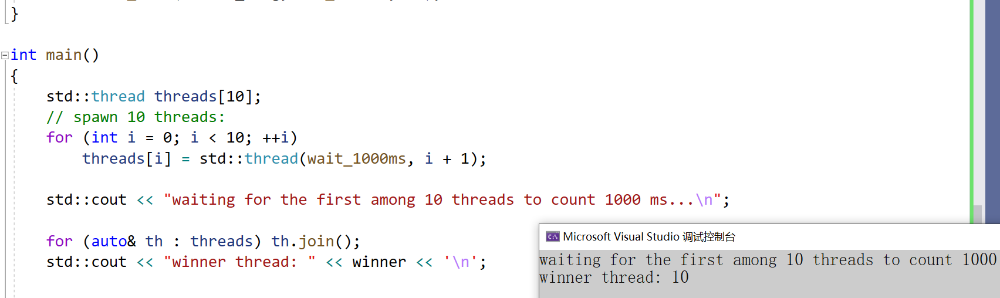

# 原子性操作库(atomic)
+ 多线程最主要的问题是共享数据带来的问题(即线程安全)。如果共享数据都是只读的，那么没问题，因为只读操作不会影响到数据，更不会涉及对数据的修改，所以所有线程都会获得同样的数据。但是，当一个或多个线程要修改共享数据时，就会产生很多潜在的麻烦。
+ 在C++11中，程序员不需要对原子类型变量进行加锁解锁操作，线程能够对原子类型变量互斥的访问
+ 更为普遍的，程序员可以使用`atomic`类模板，定义出需要的任意原子类型。

```cpp
atmoic<T> t; // 声明一个类型为T的原子类型变量t
```

+ 注意：原子类型通常属于"资源型"数据，多个线程只能访问单个原子类型的拷贝，因此在C++11 中，原子类型只能从其模板参数中进行构造，不允许原子类型进行拷贝构造、移动构造以及operator=等，为了防止意外，标准库已经将atmoic模板类中的**拷贝构造、移动构造、赋值运算符重载默认删除掉了**。

```cpp
#include <atomic>
int main()
{
    size_t n1 = 10000000;
    size_t n2 = 10000000;
    mutex mtx;

    // size_t x = 0;	  // 不是原子的
    atomic<size_t> x = 0; // 使用atomic是原子的
    thread t1([&]() {
            for (size_t i = 0; i < n1; i++)
            {
                ++x;
            }
        });

    thread t2([&]() {
            for (size_t i = 0; i < n2; i++)
            {
                ++x;
            }
        });

    t1.join();
    t2.join();

    cout << x << endl;
    // printf("%d\n", x);		// 无法打印
    printf("%d\n", x.load());

    return 0;
}
```

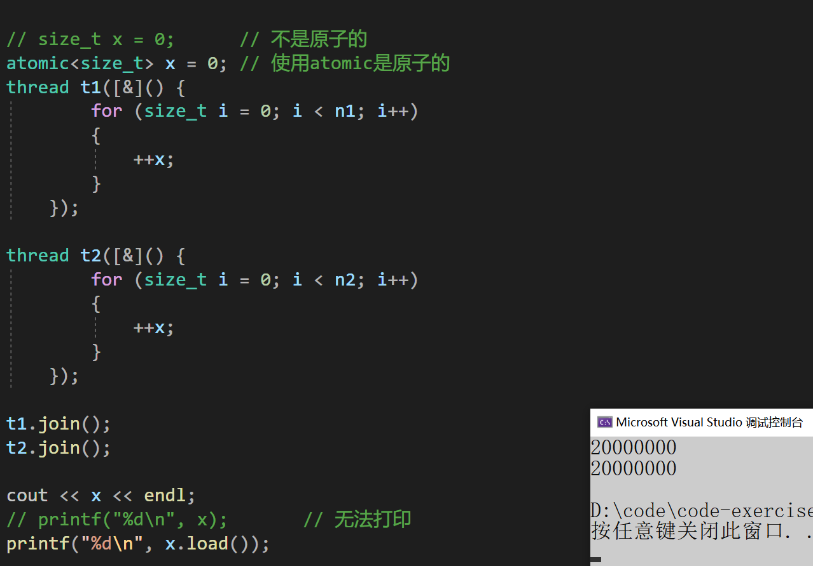

atomic对于整形和指针支持基本加减运算和位运算

+ `load`和`store`可以原子的读取和修改`atomic`封装存储的T对象。
+ atomic的原理主要是硬件层面的支持，现代处理器提供了原子指令来支持原子操作。例如，在 x86架构中有CMPXCHG（比较并交换）指令。这些原子指令能够在一个不可分割的操作中完成对内存的读取、比较和写入操作，简称CAS，Compare And Set，或是 Compare And Swap。另外为了处理多个处理器缓存之间的数据一致性问题，硬件采用了缓存一致性协议，当一个atomic操作修改了一个变量的值，缓存一致性协议会确保其他处理器缓存中的相同变量副本被正确地更新或标记为无效。

```cpp
// gcc支持的CAS接口
bool __sync_bool_compare_and_swap (type *ptr, type oldval type newval);
type __sync_val_compare_and_swap (type *ptr, type oldval type newval);
// Windows支持的CAS接口
InterlockedCompareExchange ( __inout LONG volatile *Target,__in LONG Exchange, __in LONG Comperand);

// C++11支持的CAS接口
template <class T>
bool atomic_compare_exchange_weak (atomic<T>* obj, T* expected, T val) noexcept;
template <class T>
bool atomic_compare_exchange_strong (atomic<T>* obj, T* expected, T val) noexcept;

// C++11中atomic类的成员函数
bool compare_exchange_weak (T& expected, T val, memory_order sync = memory_order_seq_cst) noexcept;
bool compare_exchange_strong (T& expected, T val, memory_order sync = memory_order_seq_cst) noexcept;
```

C++11的CAS操作支持，atomic对象跟expected按位比较相等，则用val更新atomic对象并返回值`true`；若atomic对象跟expected按位比较不相等，则更新`expected`为当前的atomic对象并返回值`false`

`compare_exchange_weak`在某些平台上，即使原子变量的值等于 expected，也可能“虚假地”失败（即返回 false）。这种失败是由于底层硬件或编译器优化导致的，但不会改变原子变量的。`compare_exchange_strong`保证在原子变量的值等于 expected 时不会虚假地失败。只要原子变量的值等于 expected，操作就会成功。compare_exchange_weak在某些平台上可能比`compare_exchange_strong`更快。`compare_exchange_weak`可能会虚假的失败主要是由于硬件层间的缓存一致性和编译器优化等等，`compare_exchange_strong`要避免这些原因就要付出一定的代价，比如要使用硬件的缓存一致性协议（如 MESI 协议）。

```cpp
#include <iostream> // std::cout
#include <atomic> // std::atomic
#include <thread> // std::thread
#include <vector> // std::vector
// a simple global linked list:
struct Node { int value; Node* next; };
std::atomic<Node*> list_head(nullptr);
void append(int val, int n)
{
	//std::this_thread::sleep_for(std::chrono::seconds(1));
	for (int i = 0; i < n; i++)
	{
		// append an element to the list
		Node* oldHead = list_head;
		Node* newNode = new Node{ val + i,oldHead };
		// what follows is equivalent to: list_head = newNode, but in a thread - safe way :
		while (!list_head.compare_exchange_weak(oldHead, newNode))
			newNode->next = oldHead;
	}
}
int main()
{
	// spawn 10 threads to fill the linked list:
	std::vector<std::thread> threads;
	threads.emplace_back(append, 0, 10);
	threads.emplace_back(append, 20, 10);
	threads.emplace_back(append, 30, 10);
	threads.emplace_back(append, 40, 10);
	for (auto& th : threads)
		th.join();
	// print contents:
	for (Node* it = list_head; it != nullptr; it = it->next)
		std::cout << ' ' << it->value;
	std::cout << '\n';
	// cleanup:
	Node* it;
	while (it = list_head)
	{
		list_head = it->next;
		delete it;
	}
	return 0;
}
```

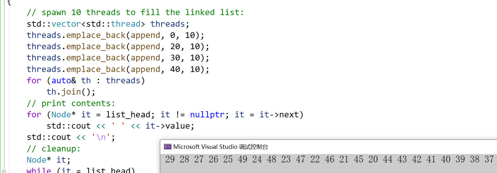

---

在 C++11 标准库中， std::atomic 提供了多种内存顺序（ memory_order ）选项，用于控制原子操作的内存同步行为。这些内存顺序选项允许开发者在性能与正确性之间进行权衡，特别是在多线程编程中。以下是`std::atomic`支持的六种内存顺序选项：

1. `memory_order_relaxed`最宽松的内存顺序，仅保证原子操作的原子性，不提供任何同步或顺序约束。使用场景：适用于不需要同步的场景，例如计数器或统计信息。

```cpp
std::atomic<int> x(0);
x.store(42, std::memory_order_relaxed); // 仅保证原子性
```

2. `memory_order_consume`限制较弱的内存顺序，仅保证依赖于当前加载操作的数据的可见性。通常用于数据依赖的场景。使用场景：适用于某些特定的依赖链场景，但实际使用较少。

```cpp
std::atomic<int*> ptr(nullptr);
int* p = ptr.load(std::memory_order_consume);
if (p) {
    int value = *p; // 保证 p 指向的数据是可见的
}
```

3. `memory_order_acquire`保证当前操作之前的所有读写操作（在当前线程中）不会被重排序到当前操作之后。通常用于加载操作。使用场景：用于实现锁或同步机制中的“获取”操作

```cpp
std::atomic<bool> flag(false);
int data = 0;

// 线程 1
data = 42;
flag.store(true, std::memory_order_release);

// 线程 2
while (!flag.load(std::memory_order_acquire)) {}
std::cout << data; // 保证看到 data = 42
```

4. `memory_order_release`保证当前操作之后的所有读写操作（在当前线程中）不会被重排序到当前操作之前。通常用于存储操作。使用场景：用于实现锁或同步机制中的“释放”操作。

```cpp
std::atomic<bool> flag(false);
int data = 0

// 线程 1
data = 42;
flag.store(true, std::memory_order_release); // 保证 data = 42 在 flag =
true 之前可见
    
// 线程 2
while (!flag.load(std::memory_order_acquire)) {}
std::cout << data; // 保证看到 data = 42
```

5. `memory_order_acq_rel`结合了`memory_order_acquire`和`memory_order_release`的语义。适用于读-修改-写操作（如 fetch_add 或 compare_exchange_strong）。使用场景：用于需要同时实现“获取”和“释放”语义的操作。

```cpp
std::atomic<int> x(0);
x.fetch_add(1, std::memory_order_acq_rel); // 保证前后的操作不会被重排序
```

6. `memory_order_seq_cst`最严格的内存顺序，保证所有线程看到的操作顺序是一致的（全局顺序一致性）。默认的内存顺序。使用场景：适用于需要强一致性的场景，但性能开销较大。

```cpp
std::atomic<int> x(0);
x.store(42, std::memory_order_seq_cst); // 全局顺序一致性
int value = x.load(std::memory_order_seq_cst);
```

内存顺序的关系， 宽松到严格：

```cpp
memory_order_relaxed < memory_order_consume <memory_order_acquire 
< memory_order_release < memory_order_acq_rel < memory_order_seq_cst
```

 宽松的内存顺序（如 memory_order_relaxed ）性能最好，但同步语义最弱。严格的内存顺序（如`memory_order_seq_cst`）性能最差，但同步语义最强。

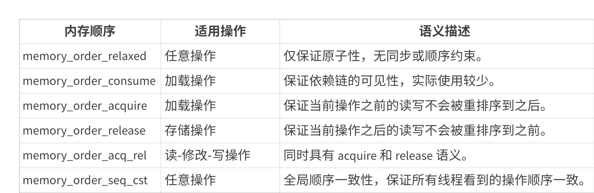

`atomic_flag`是一种原子布尔类型。与所有`atomic`的特化不同，它保证是免锁的。与`atomic<bool>`不同，`atomic_flag`不提供加载或存储操作。主要提供`test_and_set`操作将`flag`原子的设置为`true`并返回之前的值，`clear`原子将`flag`设置为`false`。下面一个样例演示了用`atomic_flag`实现自旋锁。

+ 比如模拟实现一个CAS操作：

```cpp
#include <atomic>
#include <iostream>
#include <thread>
#include <vector>
using namespace std;
atomic<int> acnt;
//atomic_int acnt;

int cnt;

void Add1(atomic<int>& cnt)
{
	int old = cnt.load();
	// 如果cnt的值跟old相等，则将cnt的值设置为old+1，并且返回true，这组操作是原子的。
	// 那么如果在load和compare_exchange_weak操作之间cnt对象被其他线程改了
	// 则old和cnt不相等，则将old的值改为cnt的值，并且返回false。
	while (!atomic_compare_exchange_weak(&cnt, &old, old + 1));
	//while (!cnt.compare_exchange_weak(old, old + 1));
}
void f()
{
	for (int n = 0; n < 100000; ++n)
	{
		++acnt;
		// Add1的用CAS模拟atomic的operator++的原子操作
		// Add1(acnt);
		++cnt;
	}
}

int main()
{
	std::vector<thread> pool;
	for (int n = 0; n < 4; ++n)
		pool.emplace_back(f);
	for (auto& e : pool)
		e.join();
	cout << "原子计数器为 " << acnt << '\n'
		<< "非原子计数器为 " << cnt << '\n';
	return 0;
}
```

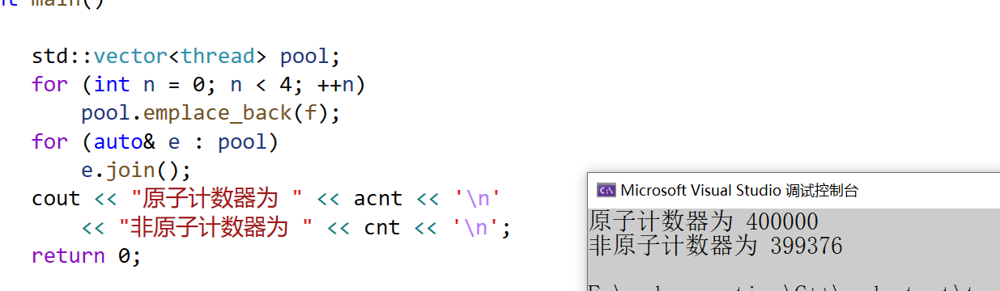

```cpp
struct Date
{
	int _year = 1;
	int _month = 1;
	int _day = 1;
};

template<class T>
void check()
{
	cout << typeid(T).name() << endl;
	cout << std::is_trivially_copyable<T>::value << endl;
	cout << std::is_copy_constructible<T>::value << endl;
	cout << std::is_move_constructible<T>::value << endl;
	cout << std::is_copy_assignable<T>::value << endl;
	cout << std::is_move_assignable<T>::value << endl;
	cout << std::is_same<T, typename std::remove_cv<T>::type>::value << endl << endl;
}

int main()
{
	check<int>();
	check<double>();
	check<int*>();
	check<Date>();
	check<Date*>();
	check<string>();
	check<string*>();

	return 0;
}
```

## 使用lock_free和lock
```cpp
#include <iostream> // std::cout
#include <atomic> // std::atomic
#include <thread> // std::thread
#include <mutex> // std::thread
#include <vector> // std::vector
template<typename T>
struct node
{
	T data;
	node* next;
	node(const T& data) : data(data), next(nullptr) {}
};

namespace lock_free
{
	template<typename T>
	class stack
	{
	public:
		std::atomic<node<T>*> head = nullptr;
	public:
		void push(const T& data)
		{
			node<T>* new_node = new node<T>(data);
			// 将 head 的当前值放到 new_node->next 中
			new_node->next = head.load(std::memory_order_relaxed);
			// 现在令 new_node 为新的 head ，但如果 head 不再是
			// 存储于 new_node->next 的值（某些其他线程必须在刚才插入结点）
			// 那么将新的 head 放到 new_node->next 中并再尝试
			while (!head.compare_exchange_weak(new_node->next, new_node,
				std::memory_order_release,
				std::memory_order_relaxed))
				; // 循环体为空
		}
	};
}

namespace lock
{
	template<typename T>
	class stack
	{
	public:
		node<T>* head = nullptr;
		void push(const T& data)
		{
			node<T>* new_node = new node<T>(data);
			new_node->next = head;
			head = new_node;
		}
	};
}


int main()
{
	lock_free::stack<int> st1;
	lock::stack<int> st2;
	std::mutex mtx;
	int n = 1000000;
	auto lock_free_stack = [&st1, n] {
		for (size_t i = 0; i < n; i++)
		{
			st1.push(i);
		}
	};
	auto lock_stack = [&st2, &mtx, n] {
		for (size_t i = 0; i < n; i++)
		{
			std::lock_guard<std::mutex> lock(mtx);
			st2.push(i);
		}
	};

	// 4个线程分别使用无锁方式和有锁方式插入n个数据到栈中对比性能
	size_t begin1 = clock();
	std::vector<std::thread> threads1;
	for (size_t i = 0; i < 4; i++)
	{
		threads1.emplace_back(lock_free_stack);
	}
	for (auto& th : threads1)
		th.join();
	size_t end1 = clock();
	std::cout << end1 - begin1 << std::endl;
	size_t begin2 = clock();
	std::vector<std::thread> threads2;
	for (size_t i = 0; i < 4; i++)
	{
		threads2.emplace_back(lock_stack);
	}
	for (auto& th : threads2)
		th.join();
	size_t end2 = clock();
	std::cout << end2 - begin2 << std::endl;
	return 0;
}
```

## 自旋锁
自旋锁（SpinLock）是一种忙等待的锁机制，适用于锁持有时间非常短的场景。在多线程编程中，当一个线程尝试获取已被其他线程持有的锁时，自旋锁会让该线程在循环中不断检查锁是否可用，而不是进入睡眠状态。这种方式可以减少上下文切换的开销，但在锁竞争激烈或锁持有时间较长的情况下，会导致CPU资源的浪费。

以下是使用C++11实现的一个简单自旋锁示例：

```cpp
#include <atomic>
#include <thread>
#include <iostream>
#include <vector>

class SpinLock
{
private:
	// ATOMIC_FLAG_INIT默认初始化为false
	std::atomic_flag flag = ATOMIC_FLAG_INIT;
public:
	void lock()
	{
		// test_and_set将内部值设置为true，并且返回之前的值
		// 第一个进来的线程将值原子的设置为true，返回false
		// 后面进来的线程将原子的值设置为true，返回true，所以卡在这里空转，
		// 直到第一个进去的线程unlock，clear，将值设置为false
		while (flag.test_and_set(std::memory_order_acquire));
	}
	void unlock()
	{
		// clear将值原子的设置为false
		flag.clear(std::memory_order_release);
	}
};
// 测试自旋锁
void worker(SpinLock& lock, int& sharedValue) {
	lock.lock();
	// 模拟一些工作
	for (int i = 0; i < 1000000; ++i) {
		++sharedValue;
	}
	lock.unlock();
}

int main() {
	SpinLock lock;
	int sharedValue = 0;
	std::vector<std::thread> threads;
	// 创建多个线程
	for (int i = 0; i < 4; ++i) {
		threads.emplace_back(worker, std::ref(lock), std::ref(sharedValue));
	}
	// 等待所有线程完成
	for (auto& thread : threads) {
		thread.join();
	}
	std::cout << "Final shared value: " << sharedValue << std::endl;
	return 0;
}
```

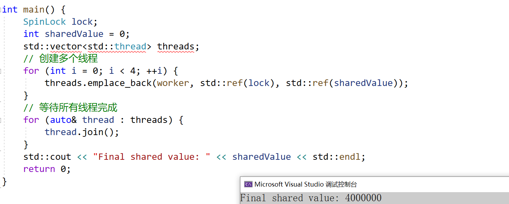

# condition_variable
[<condition_variable> - C++ Reference](https://legacy.cplusplus.com/reference/condition_variable/)

+ condition_variable需要配合互斥锁系列进行使用，主要提供wait和notify系统接口。
+ wait需要传递一个`unique_lock<mutex>`类型的互斥锁，wait会阻塞当前线程直到被notify。在进入阻塞的一瞬间，会解开互斥锁，方便其他线程获取锁，访问条件变量。当被notify唤醒时，他会同时获取到锁，再继续往下运行。
+ notify_one会唤醒当前条件变量上等待的其中一个线程，使用时他也需要用互斥锁保护，如果没有现成阻塞等待，他啥事都不做；`notify_all`会唤醒当前条件变量上等待的所有线程线程。
+ `condition_variable_any`类是`std::condition_variable`的泛化。相对于只在`std::unique_lock<std::mutex>`上工作的`std::condition_variable`，`condition_variable_any`能在任何满足可基本锁定 (BasicLockable) 要求的锁上工作。

```cpp
#include <iostream> // std::cout
#include <thread> // std::thread
#include <mutex> // std::mutex, std::unique_lock
#include <condition_variable> // std::condition_variable

std::mutex mtx;
std::condition_variable cv;
bool ready = false;

void print_id(int id) {
	std::unique_lock<std::mutex> lck(mtx);
	while (!ready)
		cv.wait(lck);
	// ...
	std::cout << "thread " << id << '\n';
}

void go() {
	std::unique_lock<std::mutex> lck(mtx);
	ready = true;
	// 通知所有阻塞在条件变量上的线程
	cv.notify_all();
}

int main()
{
	std::thread threads[10];
	// spawn 10 threads:
	for (int i = 0; i < 10; ++i)
		threads[i] = std::thread(print_id, i);
	std::cout << "10 threads ready to race...\n";
	std::this_thread::sleep_for(std::chrono::milliseconds(100));
	go(); // go!
	for (auto& th : threads)
		th.join();
	return 0;
}
```

## 支持两个线程交替打印，一个打印奇数，一个打印偶数
+ 用来进行线程之间的互相通知。`condition_variable`和`Linux posix`的条件变量并没有什么大的区别，主要还是面向对象实现的。

```cpp
#include <thread>
#include <mutex>
#include <condition_variable>
int main()
{
    std::mutex mtx;
    // 条件变量
    condition_variable c;
    int x = 1;

    // 标志默认为false
    bool flag = false;
    thread t1([&] {
            for (size_t i = 0; i < 10; i++)
            {
                // 使用unique_lock管理锁
                unique_lock<mutex> lock(mtx);
            
                // 如果flag == true就进行等待
                //if (flag)
                while (flag) // 使用while更保险
                    c.wait(lock); // 在wait的时候会自动解锁

                // 必定第一次执行
                cout << "thread 1:" << this_thread::get_id() << ":" << x << endl;
                ++x;

                // 执行一次后flag变为true，下次线程再来执行的时候就会进行等待
                flag = true;
                // 唤醒线程2
                c.notify_one();
            }
        });

    thread t2([&]{
            for (size_t i = 0; i < 10; i++)
            {
                // 使用unique_lock管理锁
                unique_lock<mutex> lock(mtx);

                // 如果flag == false就等待 true就开始执行下面的代码
                //if (!flag)
                while (!flag) // 使用while更保险
                    c.wait(lock); // 在wait的时候会自动解锁

                cout << "thread 2:" << this_thread::get_id() << ":" << x << endl;
                ++x;
                
                // 执行完成后改成false，如果线程2再来执行的时候就会进行等待
                flag = false;
                // 唤醒线程1
                c.notify_one();
            }
        }
    );

    t1.join();
    t2.join();

    return 0;
}
```

场景1：t1先启动，t2待定

+ t1启动以后先获取锁，flag是true不会被条件变量阻塞，打印i为0，flag修改为false，i修改为2，再用条件变量唤醒其他阻塞线程，但是没有线程等待，循环再继续，再次获取锁，flag刚修改为false了，这时会阻塞在条件变量上，并且解锁，这里的逻辑保证了t1不会连续打印。
+ t2这时开始运行，先获取锁，flag被t1修改为false了所以t2不会被条件变量阻塞，t1打印j为1，flag修改为true，j修改为3，再用条件变量唤醒其他阻塞线程，t1被唤醒。那么这里t1被唤醒以后，也是需要分配时间片排队执行，这时有2种情况，第一种t1没有立即执行，t2继续执行，t2获取锁，但是flag为true，所以阻塞在条件变量并且解锁，过一会t1开始执行了，flag为true不会被条件变量继续阻塞，打印2，继续上述循环逻辑，就交替打印了。第二种t1立即执行，t1抢占到锁，flag为true不会被条件变量继续阻塞，打印2，i修改为4，flag修改为false，再用条件变量唤醒其他阻塞线程，但是没有线程被阻塞，再继续循环逻辑就是t1和t2新一轮谁先执行或者抢到锁资源的逻辑了，这样也实现了交替打印。

---

场景2：t2先启动，t1一会才启动

+ t2启动以后先获取锁，flag是true会被条件变量阻塞，并且同时解锁。
+ 一会后，t1开始运行，获取到锁资源，flag是true不会被条件变量阻塞，打印i为0，flag修改为false，i修改为2，再用条件变量唤醒阻塞线程t2。跟上面类似，t2被唤醒以后也是需要分配时间片排队执行，这时有2种情况，第一种t2没有立即执行，t1继续执行循环，获取锁，但是flag为false，所以阻塞在条件变量并且解锁。过一会t2开始执行了，flag为false不会被条件变量继续阻塞，打印1，j修改为3，flag修改为true，唤醒阻塞线程t1，这时跟上述逻辑类似，循环往复，就可以实现交替打印了。第二种t2立即执行，t2抢到锁，flag为false不会被条件变量继续阻塞，打印1，j修改为3，flag修改为true，唤醒其他阻塞线程，这会没有线程被其他条件变量阻塞，再继续循环逻辑就是t1和t2新一轮谁先执行或者抢到锁资源的逻辑了，这样也实现了交替打印。

---

情况3：t1和t2几乎同时启动

+ 这种情况，本质就是两个线程抢夺先锁资源，t1先抢到就类似情况1，t2先抢到就类似情况2，这里就不再细节分析了。

# Future
`std::future` 是 C++11 标准库中引入的一个重要组件，用于异步编程，它代表一个可能在将来获取的值，通常与异步任务关联。

## 基本概念
`std::future` 是一个模板类，它提供了一种机制来访问异步操作的结果：

+ 表示一个可能尚未完成的异步计算的结果
+ 允许你等待异步操作完成并获取其结果
+ 提供了一种线程间传递数据的同步方式

## 主要特性
1. **异步结果获取**：可以从 future 对象中获取异步操作的结果
2. **等待机制**：可以等待异步操作完成
3. **一次性使用**：一个 future 对象通常只能获取一次结果

## 常用成员函数
1. `get()`: 获取结果，如果结果未就绪则阻塞等待
2. `valid()`: 检查 future 是否关联了共享状态
3. `wait()`: 等待结果变为可用
4. `wait_for()`: 等待一段时间
5. `wait_until()`: 等待直到某个时间点

## std::async、std::promise、std::packaged_task
std:future本质上不是一个异步任务，而是一个辅助我们获取异步任务结果的东西

std:future并不能单独使用，需要搭配一些能够执行异步任务的模板类或函数一起使用异步任务搭配使用

---

std::async函数模板：异步执行一个函数，返回一个future对象用于获取函数结果

std:packaged_task类模板：为一个函数生成一个异步任务对象（可调用对象），用于在其他线程中执行

std:promise类模板：实例化的对象可以返回一个future，在其他线程中向promise对象设置数据，其他线程的关联future就可以

获取数据

1. **std::async**: 最简单的创建 future 的方式

```cpp
#include <iostream>
#include <future>
#include <thread>

int compute() {
    // 模拟耗时计算
    std::cout << "into compute\n";
    std::this_thread::sleep_for(std::chrono::seconds(2));
    return 42;
}

int main() {
    // 启动异步任务
    //std::future<int> fut = std::async(std::launch::async, compute); // 异步 内部创建一个线程
    std::future<int> fut = std::async(std::launch::deferred, compute); // 同步 获取结果的时候再执行任务
    std::this_thread::sleep_for(std::chrono::seconds(1));
    // 在主线程做其他工作...
    std::cout << "==========\n";

    // 获取结果（如果还没完成，会阻塞等待）
    int result = fut.get();
    std::cout << "Result: " << result << std::endl;

    return 0;
}
```

2. **std::promise**: 显式设置 future 的值

std::promise是一个模板类，是对于结果的封装

    1. 在使用的时候，就是先实例化一个指定结果的promise对象
    2. 通过promise对象，获取关联的future对象
    3. 在任意位置给promise设置数据，就可以通过关联的future获取到这个设置的数据了

```cpp
#include <iostream>
#include <future>
#include <thread>
#include <memory>

int compute() {
    // 模拟耗时计算
    std::cout << "into compute\n";
    std::this_thread::sleep_for(std::chrono::seconds(2));
    return 42;
}

int main() {
    // 1. 实例化一个promise对象
    std::promise<int> pro;

    // 2. 获取关联的future对象
    std::future<int> res = pro.get_future();

    // 3. 在任意位置给promise设置数据，就可以通过关联的future获取到这个设置的数据了
    std::thread thr([&pro]() {
        int sum = compute();
        pro.set_value(sum);
        });

    // 4. 获取结果
    std::cout << res.get() << std::endl;
    thr.join();
    return 0;
}
```

3. **std::packaged_task**: 将函数包装为异步任务

std:async是一个模板函数，内部会创建线程执行异步任务

std:packaged_task是一个模板类，是一个任务包，是对一个函数进行二次封装，封装成为一个可调用对象作为任务放到其他线程执行的。

任务包封装好了以后，可以在任意位置进行调用，通过关联的future来获取执行结果

执行任务样例：

    1. 封装任务
    2. 执行任务
    3. 通过future获取任务执行结果

```cpp
#include <iostream>
#include <future>
#include <thread>
#include <memory>

int compute() {
    // 模拟耗时计算
    std::cout << "into compute\n";
    std::this_thread::sleep_for(std::chrono::seconds(2));
    return 42;
}

int main() {
    // 1. 封装任务
    auto task = std::make_shared<std::packaged_task<int()>>(compute);
    
    // 2. 获取任务包关联的任务对象
    std::future<int> res = task->get_future();

    std::thread thr([task]() {
        (*task)();
        });
    // 3. 获取结果
    std::cout << res.get() << std::endl;

    thr.join();
    return 0;
}
```

## 注意事项
1. `get()` 只能调用一次，第二次调用会导致未定义行为
2. 如果异步操作抛出异常，`get()` 会重新抛出该异常
3. 使用 `std::future` 时要注意对象的生命周期管理

## C++17 增强
C++17 引入了 `std::future` 的扩展：

+ `std::future::then()` (最终未纳入标准)
+ `std::future` 与 `std::optional` 的更好集成


