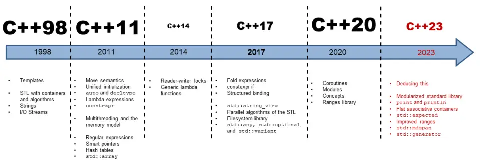
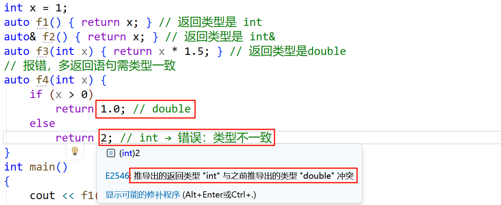
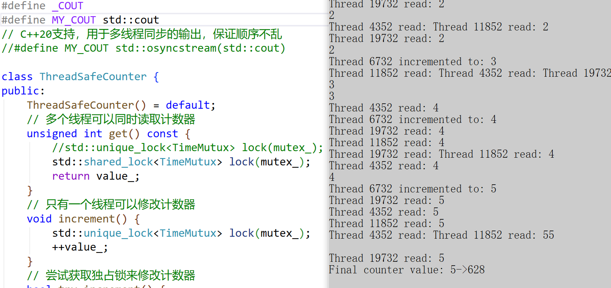
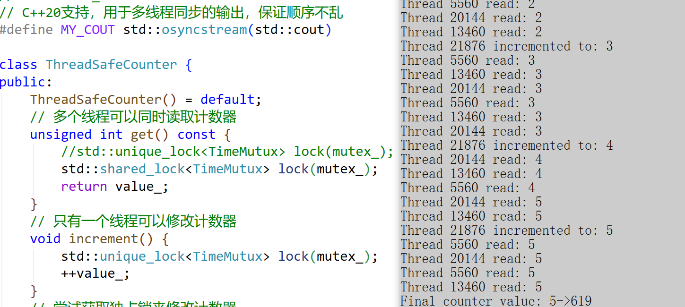
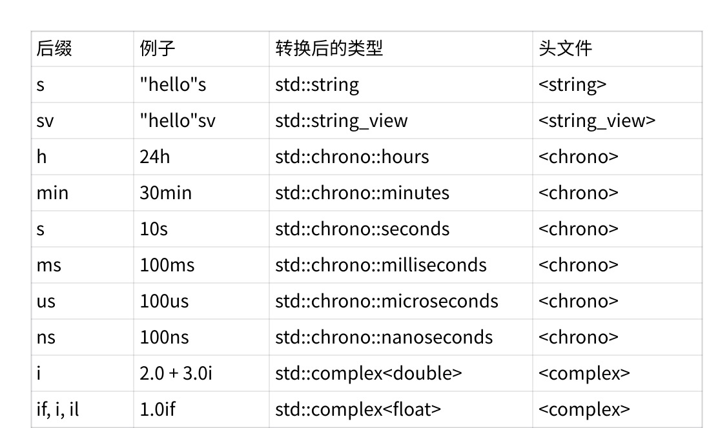

# 介绍


# 变量模板
C++14 允许模板不仅用于类和函数，还可以用于变量。

```cpp
template<class T>
constexpr T pi = T(3.1415926535897932385L); // 变量模板

template<class T>
T circular_area(T r) // 函数模板
{
	return pi<T> *r * r; // pi<T> 是变量模板实例化
}

template<std::size_t N>
constexpr std::size_t factorial = N * factorial<N - 1>;

// 特化
template<>
constexpr std::size_t factorial<0> = 1;

template<class T>
constexpr bool is_const_v = is_const<T>::value;

int main() 
{
	// 使用不同精度的π
	std::cout.precision(6);
	std::cout << "float π: " << pi<float> << std::endl;

	std::cout.precision(10);
	std::cout << "double π: " << pi<double> << std::endl;

	std::cout.precision(6);
	float radius1 = 2.5;
	std::cout << "半径为 " << radius1 << " 的圆面积: " << circular_area(radius1) << std::endl;
	std::cout.precision(10);

	double radius2 = 2.5;
	std::cout << "半径为 " << radius2 << " 的圆面积: " << circular_area(radius2) << std::endl;
	std::cout << factorial<5> << std::endl;
	std::cout << factorial<10> << std::endl;
	return 0;
}
```

## 泛型 lambda 表达式
C++14 允许 lambda 表达式使用 auto 作为参数类型，使其成为泛型。和前面模板的语法高度类似，auto&代表左值引用的形参，auto&&代表万能引用的的形参，auto&&...代表可变模板参数的万能引用。

```cpp
int main() 
{
	// 另一个泛型Lambda示例 - 返回两个参数中较大的一个
	auto getMax = [](const auto& a, const auto& b) {
		return a > b ? a : b;
	};
	
	std::cout << "最大整数: " << getMax(10, 20) << std::endl;
	std::cout << "最大字符串: " << getMax(std::string("apple"), std::string("banana")) << std::endl;

	// 这里参数写成auto&&时类似引用折叠部分讲的万能引用
	// 实参是左值就是左值引用，实参是右值就是右值引用
	auto func = [](auto&& x, auto& y) {
		x += 97;
		y += 97;
	};
	
	int i = 0, j = 1;
	func(10, i);
	func(j, i);
	std::string s1("hello worldxxxxxxxxxxxx");
	func(move(s1), i);
	func(s1, i);
	
	// 也可以写成这样带可变模板参数的写法
	std::vector<std::string> v;
	auto f1 = [&v](auto&&... ts) {
			v.emplace_back(std::forward<decltype(ts)>(ts)...);
	};
	f1(move(s1));
	f1("1111111");
	f1(10, 'y');
	for (auto& e : v)
		std::cout << e << " ";
	return 0;
}
```

C++14 允许在 lambda 捕获中使用表达式初始化捕获的变量，这个变量可以是当前域定义的，也可以是没有定义的。

```cpp
int main() 
{
	std::vector<int> numbers = { 1, 2, 3, 4, 5 };
	// 使用表达式初始化捕获的变量
	auto p = std::make_unique<int>(10);
	auto lambda1 = [value = 5, ptr = std::move(p), &numbers]() {
		std::cout << "捕获的值: " << value << std::endl;
		std::cout << "捕获的智能指针值: " << *ptr << std::endl;
		std::cout << "捕获的vector大小: " << numbers.size() << std::endl;
	};
	lambda1();
	
	// 另一个例子 - 在捕获时计算值
	int x = 10;
	auto lambda2 = [y = x * 2]() {
		std::cout << "y = x * 2 = " << y << std::endl;
	};
	lambda2();
	return 0;
}
```

C++20以后开始支持在捕捉列表和参数中间直接类似模板语法写模板参数。

```cpp
int main() 
{
	// 泛型 lambda，operator() 是一个拥有两个（模板）形参的模板
	auto glambda = []<class T>(T a, auto&& b) { return a < b; };

	// 泛型 lambda，operator() 是一个拥有一个形参包的模板
	std::vector<std::string> v;
	auto f2 = [&v]<typename... Args>(Args&&... ts) {
		v.emplace_back(std::forward<Args>(ts)...);
	};
	std::string s1("hello wrold");
	f2(s1);
	f2("1111111");
	f2(10, 'y');
	for (auto& e : v)
		std::cout << e << " ";
	return 0;
}
```


# 函数返回类型推导
C++11中普通函数用auto做函数返回类型推导时，一般要求要配合尾置返回类型使用，相对比较局限。

C++14直接支持auto推导，如果函数声明的声明说明符序列 包含关键词`auto`，那么尾随返回类型可以省略，且编译器将从未舍弃的返回语句中所用的操作数的类型推导出它，如果有多条返回语句，那么它们必须推导出相同的类型。

如果返回类型没有使用`decltype(auto)`，那么推导遵循模板实参推导的规则进行。如果返回类型是`decltype(auto)`，那么返回类型是将返回语句中所用的操作数包裹到`decltype`中时所得到的类型。

C++11中auto不能直接做函数返回类型，一般是跟尾置返回类型配合使用的

```cpp
int x = 1;
auto f1() -> int { return x; } // 返回类型是 int
auto f2() -> int& { return x; } // 返回类型是 int&
auto f3(int x) -> decltype(x * 1.5) { return x * 1.5; } // 必须显式推导

int main()
{
	cout << f1() << endl;
	int& ret = f2();
	cout << f3(3) << endl;
	ret++;
	cout << x << endl;
	cout << ret << endl;
	return 0;
}
```

C++14 普通函数可以直接用auto做返回类型，自动推导返回类型

```cpp
int x = 1;
auto f1() { return x; } // 返回类型是 int
auto& f2() { return x; } // 返回类型是 int&
auto f3(int x) { return x * 1.5; } // 返回类型是double

// 报错，多返回语句需类型一致
auto f4(int x) {
	if (x > 0)
		return 1.0; // double
	else
		return 2; // int → 错误：类型不一致
}
int main()
{
	cout << f1() << endl;
	int& ret = f2();
	cout << f3(3) << endl;
	ret++;
	cout << x << endl;
	cout << ret << endl;
	return 0;
}
```



C++14引入的decltype(auto)常用于完美转发返回类型

需要精确保持返回值的值类别（左值/右值）

```cpp
int x = 1;
decltype(auto) f1() { return x; } // 返回类型是 int，同 decltype(x)
decltype(auto) f2() { return (x); } // 返回类型是 int&，同 decltype((x))

template<typename F, typename... Args>
decltype(auto) call(F&& f, Args&&... args)
{
	return std::forward<F>(f)(std::forward<Args>(args)...);
}

int main()
{
	cout << f1() << endl;
	int& ret = f2();
	ret++;
	cout << x << endl;
	cout << ret << endl;
	return 0;
}
```


# 二进制字面量
十进制字面量：一个非零十进制数字（1、2、3、4、5、6、7、8、9）后随零或多个十进制数字`（0、1、2、3、4、5、6、7、8、9）`

八进制字面量：数字零（0）后随零或多个八进制数字`（0、1、2、3、4、5、6、7）`

十六进制字面量：是字符序列 0x 或字符序列 0X 后随一或多个十六进制数字`（0、1、2、3、4、5、6、7、8、9、a、A、b、B、c、C、d、D、e、E、f、F）`

二进制字面量：是字符序列 0b 或字符序列 0B 后随一或多个二进制数字（0、1），二进制字面量是**C++14**开始支持的。

```cpp
#include <bitset>

int main()
{
	int d = 42;
	int o = 052;
	int x = 0x2a;
	int X = 0X2A;
	int b = 0b101010; // C++14
	cout << d << endl;
	cout << o << endl;
	cout << x << endl;
	cout << X << endl;
	cout << b << endl;
	// 实际应用示例 - 位标志
	const int FLAG_A = 0b0001; // 1
	const int FLAG_B = 0b0010; // 2
	const int FLAG_C = 0b0100; // 4
	const int FLAG_D = 0b1000; // 8
	int flags = FLAG_A | FLAG_C; // 0b0101
	std::cout << "标志位: " << std::bitset<4>(flags) << std::endl;
	if (flags & FLAG_A) {
		std::cout << "FLAG_A 被设置" << std::endl;
	}
	if (flags & FLAG_B) {
		std::cout << "FLAG_B 被设置" << std::endl;
	}
	else {
		std::cout << "FLAG_B 未被设置" << std::endl;
	}
	return 0;
}
```


# 数字分隔符
C++14 允许在数字字面量中使用单引号作为分隔符，提高可读性。

```cpp
int main() {
	// 使用数字分隔符提高大数字的可读性
	int million = 100'0000;
	long hexValue = 0xDEAD'BEEF;
	double pi = 3.141'592'653'59;
	unsigned long long bigBinary = 0b1010'1010'1010'1010;
	std::cout << "一百万: " << million << std::endl;
	std::cout << "十六进制值: 0x" << std::hex << hexValue << std::dec << std::endl;
	std::cout << "π: " << pi << std::endl;
	std::cout << "二进制值: " << std::bitset<16>(bigBinary) << std::endl;

	// 实际应用示例 - 定义常量
	const int MAX_USERS = 1'000'000;
	const double EARTH_RADIUS_KM = 6'371.0;
	const long long BIG_NUMBER = 123'456'789'123;
	std::cout << "最大用户数: " << MAX_USERS << std::endl;
	std::cout << "地球半径(km): " << EARTH_RADIUS_KM << std::endl;
	std::cout << "大数字: " << BIG_NUMBER << std::endl;
	return 0;
}
```


# 使用默认非静态成员初始化器的聚合类
## 聚合类的定义
聚合类是指满足以下条件的类(包括结构体)：

1. 没有用户提供的构造函数
2. 没有私有或受保护的非静态数据成员
3. 没有基类
4. 没有虚函数

## 关键点
1. 默认成员初始化器：当使用默认构造或值初始化时，成员会使用这些默认值
2. 聚合初始化：仍然可以使用花括号初始化列表，未指定的成员会使用默认值
3. 初始化顺序：初始化列表中的值按成员声明顺序应用于成员聚合类的定义和初始化方式的变化

在C++11之前，聚合类不能有任何成员初始化器，但从C++14开始，这个限制被放宽了。

C++14允许聚合类包含默认的非静态成员初始化器(default member initializers)，这使得聚合类的使用更加灵活。

在后续C++17、C++20对嵌套类定义在不断放宽，并且初始化方式也进一步优化，具体看文档和下面代码样例。

[https://en.cppreference.com/w/cpp/language/aggregate_initialization.html](https://en.cppreference.com/w/cpp/language/aggregate_initialization.html)

```cpp
struct Employee {
	std::string name = "Unknown";
	int id = -1;
	double salary = 0.0;
};

int main() {
	// C++98
	Employee e1 = { "xxx", 1, 1.1 };
	// C++ 14
	Employee e2{ "John" };			// name="John", id=-1, salary=0.0
	Employee e3{ "Alice", 123 };	// name="Alice", id=123, salary=0.0
	Employee e4{}; // 值初始化，等同于e1

	// C++20中初始化聚合类的方式，解决C++14必须按顺序给值初始化的问题
	Employee e5{ .id = {1}, .salary{1.1} }; // name="Alice", id= 1, salary=1.1

	// C++20中还支持嵌套类的初始化
	struct Inner {
		int a;
		int b;
	};
	struct Outer {
		Inner i;
		int c;
	};
	Outer o1{ .i{1,2}, .c = 3 };
	// 或
	Outer o2{ .i = {.a = 1, .b = 2}, .c = 3 };
	return 0;
}
```


# 标准库新增功能std::exchange
[https://zh.cppreference.com/w/cpp/utility/exchange](https://zh.cppreference.com/w/cpp/utility/exchange)

`std::exchange`是 C++14 标准库在`<utility>`头文件中引入的一个实用函数模板，它提供了一种简洁高效的方式来替换一个对象的值并返回其旧值。

相比我们自己实现替换而言，`std::exchange`使用使用上更加简洁，并且C++20以后库里面将这个函数实现为`constexpr`，效率更高了。


以 new_value 替换 obj 的值，并返回 obj 的旧值。

T 必须满足可移动构造 (MoveConstructible) 。而且必须能移动赋值 U 类型对象给 T 类型对象

```cpp
#include <iterator>
#include <utility>

template<class T, class U = T>
T exchange(T& obj, U&& new_value);

class stream
{
public:
	using flags_type = int;
public:
	flags_type flags() const { return flags_; }
	/// 以 newf 替换 flags_ 并返回旧值。
	flags_type flags(flags_type newf) { return std::exchange(flags_, newf); }
private:
	flags_type flags_ = 0;
};

void f() { std::cout << "f()"; }

int main()
{
	stream s;
	std::cout << s.flags() << '\n';
	std::cout << s.flags(12) << '\n';
	std::cout << s.flags() << "\n\n";
	std::vector<int> v = { 10,20,30 };
	// 因为第二模板形参有默认值，故能以花括号初始化式列表为第二实参。
	// 下方表达式等价于 std::exchange(v, std::vector<int>{1, 2, 3, 4});
	std::vector<int> ret = std::exchange(v, { 1, 2, 3, 4 });
	for (auto e : v)
		std::cout << e << " ";
	std::cout << "\n";

	for (auto e : ret)
		std::cout << e << " ";

	std::cout << "\n";
	std::cout << "\n\n斐波那契数列: ";
	for (int a{ 0 }, b{ 1 }; a < 100; a = std::exchange(b, a + b))
		std::cout << a << ", ";
	std::cout << "...\n";
	return 0;
}
```


# 标准库新增功能std::make_unique
[https://en.cppreference.com/w/cpp/memory.html](https://en.cppreference.com/w/cpp/memory.html)

`std::make_unique`是C++14引入的一个智能指针创建工具函数，用于安全地创建和管理`std::unique_ptr`对象。它是现代C++中推荐的对象创建方式之一，类似于 C++11 的`std::make_shared`

`std::make_unique`相比直接构造`std::unique_ptr`对象而言更安全一些，当构造函数或初始化过程中抛出异常时， `std::make_unique`能确保已分配的资源被正确释放。直接使用new可能导致在智能指针接管前发生异常，造成内存泄漏。所以现代C++中更推荐使用`std::make_shared`和`std::make_unique`这类工具函数创建智能指针对象。

```cpp
#include <cstddef>
#include <iomanip>
#include <iostream>
#include <memory>
#include <utility>

struct Vec3
{
	int x, y, z;
	Vec3(int x = 0, int y = 0, int z = 0) noexcept : x(x), y(y), z(z) {}
	friend std::ostream& operator<<(std::ostream& os, const Vec3& v)
	{
		return os << "{ x=" << v.x << ", y=" << v.y << ", z=" << v.z << " }";
	}
};

// 向输出迭代器输出斐波那契数列。
template<typename OutputIt>
OutputIt fibonacci(OutputIt first, OutputIt last)
{
	for (int a = 0, b = 1; first != last; ++first)
	{
		*first = b;
		b += std::exchange(a, b);
	}
	return first;
}

int main()
{
	// 使用默认构造函数。
	std::unique_ptr<Vec3> v1 = std::make_unique<Vec3>();
	// 使用匹配这些参数的构造函数。
	std::unique_ptr<Vec3> v2 = std::make_unique<Vec3>(0, 1, 2);
	// 创建指向 5 个元素数组的 unique_ptr。
	std::unique_ptr<Vec3[]> v3 = std::make_unique<Vec3[]>(5);
	// 创建单个对象（会调用构造函数）
	auto ptr1 = std::make_unique<int>(); // 初始化为0
	auto ptr2 = std::make_unique<int>(42); // 初始化为42
	// 创建数组（元素会被值初始化）
	auto arr = std::make_unique<int[]>(5); // 5个int，都初始化为0
	
	// make_unique_for_overwrite是C++20支持的，相比make_unique而言，他的特点是不初始化
	// 创建指向未初始化的 10 个整数的数组的 unique_ptr，然后以斐波那契数列予以填充。
	std::unique_ptr<int[]> i1 = std::make_unique_for_overwrite<int[]>(10);
	fibonacci(i1.get(), i1.get() + 10);
	
	std::cout << "make_unique<Vec3>(): " << *v1 << '\n'
		<< "make_unique<Vec3>(0,1,2): " << *v2 << '\n'
		<< "make_unique<Vec3[]>(5): ";
	
	for (std::size_t i = 0; i < 5; ++i)
		std::cout << std::setw(i ? 30 : 0) << v3[i] << '\n';
	std::cout << '\n';
	std::cout << "make_unique_for_overwrite<int[]>(10), fibonacci(...): [" << i1[0];
	for (std::size_t i = 1; i < 10; ++i)
		std::cout << ", " << i1[i];
	std::cout << "]\n";
	return 0;
}
```


# 标准库新增功能std::integer_sequence
[https://en.cppreference.com/w/cpp/utility/integer_sequence.html](https://en.cppreference.com/w/cpp/utility/integer_sequence.html)

`std::integer_sequence`是 C++14 引入的一个模板类， `std::integer_sequence`定义在`<utility>`头文件中，用于在编译时表示一个整数序列。它是模板元编程和编译时计算中的一个有用工具。

`T`是整数类型（如 int, size_t 等）

`Ints...`是一个非类型模板参数包，表示实际的整数序列

```cpp
#include <cstddef>
#include <iostream>
#include <tuple>
#include <utility>
template< class T, T... Ints >
class integer_sequence;
template <typename T, T... ints>
void print_sequence(int id, std::integer_sequence<T, ints...> int_seq)
{
	std::cout << id << ") 大小为 " << int_seq.size() << " 的序列: ";
	((std::cout << ints << ' '), ...);
	std::cout << '\n';
}

int main()
{
	print_sequence(1, std::integer_sequence<unsigned, 9, 2, 5, 1, 9, 1, 6>{});
	print_sequence(2, std::make_integer_sequence<int, 12>{});
	print_sequence(3, std::make_index_sequence<10>{});
	print_sequence(4, std::index_sequence_for<std::ios, float, signed>{});
	return 0;
}
```

std::integer_sequence 用于解包打印tuple。

```cpp
#include <iostream>
#include <utility>
#include <array>
// 实际应用 - 元组解包
template<typename... Args, std::size_t... Indices>
void print_tuple_impl(const std::tuple<Args...>& t,
	std::index_sequence<Indices...>) {
	// 使用折叠表达式(C++17)打印元组元素
	((std::cout << std::get<Indices>(t) << " "), ...);
	std::cout << std::endl;
}

template<typename... Args>
void print_tuple(const std::tuple<Args...>& t) {
	print_tuple_impl(t, std::index_sequence_for<Args...>());
}

template<typename Array, std::size_t... I>
void print_array_impl(const Array& arr, std::index_sequence<I...>) {
	((std::cout << arr[I] << ' '), ...);
}

template<typename T, std::size_t N>
void print_array(const std::array<T, N>& arr) {
	print_array_impl(arr, std::make_index_sequence<N>{});
}

int main() {
	// 打印array
	std::array<int, 4> arr{ 1, 2, 3, 4 };
	print_array(arr); // 输出: 1 2 3 4
	// 打印元组
	auto t = std::make_tuple(10, 3.14, "Hello", 'A');
	std::cout << "元组内容: ";
	print_tuple(t);
	return 0;
}
```


# 标准库新增功能std::quoted
[https://en.cppreference.com/w/cpp/io/manip/quoted.html](https://en.cppreference.com/w/cpp/io/manip/quoted.html)

std::quoted 是 C++14 引入的一个 I/O 操纵器，用于简化带引号字符串的输入输出操作。它定义在`<iomanip>` 头文件中

std::quoted 主要用于:

输出时：自动为字符串添加引号；

输入时：自动去除字符串周围的引号；

处理转义字符：自动处理引号内的转义序列

```cpp
#include <iostream>
#include <sstream>
#include <iomanip>
#include <string>
int main() {
	// 输出带引号的字符串
	std::string text = "Hello, World!";
	std::cout << "Without quoted: " << text << std::endl;
	std::cout << "With quoted: " << std::quoted(text) << std::endl;
	// 输入带引号的字符串
	std::istringstream input("\"Hello, World!\"");
	input >> std::quoted(text);
	//input >> text;
	std::cout << "Extracted: " << text << std::endl;
}
```


自定义分隔符和转义字符

```cpp
#include <iostream>
#include <iomanip>
#include <string>
#include <sstream>
int main() {
	// 使用单引号作为分隔符
	std::string text = "It's a test";
	std::cout << "Default: " << std::quoted(text) << std::endl;
	std::cout << "Single quotes: " << std::quoted(text, '\'') << std::endl;
	// 处理包含分隔符的字符串
	std::string complex = R"(He said "Hello" and left)";
	std::cout << "Complex string: " << std::quoted(complex) << std::endl;
	// 使用字符串流测试输入输出
	std::stringstream ss1;
	ss1 << std::quoted(complex);
	std::string extracted;
	ss1 >> std::quoted(extracted);
	std::cout << "Extracted: " << extracted << std::endl;
	// 包含转义字符的字符串
	std::stringstream ss2;
	text = "Line1\nLine2\tTabbed";
	ss2 << std::quoted(text);
	std::cout << "Original: " << text << std::endl;
	std::cout << "Quoted: " << ss2.str() << std::endl;
	ss2 >> std::quoted(extracted);
	std::cout << "Extracted: " << extracted << std::endl;
}
```


序列化和反序列的一个代码样例

```cpp
#include <iostream>
#include <sstream>
#include <iomanip>
#include <string>
struct Config {
	std::string username;
	std::string password;
	std::string server;
	int id;
};
// 序列化配置到字符串
std::string serializeConfig(const Config& config) {
	std::ostringstream oss;
	oss << std::quoted(config.username) << " "
		<< std::quoted(config.password) << " "
		<< std::quoted(config.server) << " "
		<< config.id;
	return oss.str();
}

// 从字符串反序列化配置
Config deserializeConfig(const std::string& str) {
	std::istringstream iss(str);
	Config config;
	iss >> std::quoted(config.username)
		>> std::quoted(config.password)
		>> std::quoted(config.server)
		>> config.id;
	return config;
}

int main() {
	Config original{ "admin hello", "pssword@.com", "example.com", 1 };
	// 序列化
	std::string serialized = serializeConfig(original);
	std::cout << "Serialized: " << serialized << "\n";
	// 反序列化
	Config restored = deserializeConfig(serialized);
	std::cout << "Restored values:\n"
		<< "Username: " << restored.username << "\n"
		<< "Password: " << restored.password << "\n"
		<< "Server: " << restored.server << "\n"
		<< "Id: " << restored.id << "\n";
	return 0;
}
```


# 标准库新增功能std::shared_timed_mutex和std::shared_mutex
[https://en.cppreference.com/w/cpp/thread/shared_timed_mutex.html](https://en.cppreference.com/w/cpp/thread/shared_timed_mutex.html)

[https://en.cppreference.com/w/cpp/thread/shared_mutex.html](https://en.cppreference.com/w/cpp/thread/shared_mutex.html)

shared_timed_mutex 类是C++14提供的一种同步原语，能用于保护数据免受多个线程同时访问。与其他促进独占访问的互斥体类型相反，它拥有两个访问层次：

共享 - 多个线程能共享同一互斥体的所有权。

独占 - 仅一个线程能占有互斥体。

shared_mutex 类是C++17提供的一个同步原语，可用于保护共享数据不被多个线程同时访问。与便于独占访问的其他互斥体类型不同，shared_mutex 拥有两个访问级别：

共享 - 多个线程能共享同一互斥体的所有权。

独占 - 仅一个线程能占有互斥。

若一个线程已获取独占锁（通过 lock、try_lock），则无其他线程能获取该锁（包括共享的）。

若一个线程已获取共享锁（通过 lock_shared、try_lock_shared），则无其他线程能获取独占锁，但可以获取共享锁。

仅当任何线程均未获取独占锁时，共享 锁能被多个线程获取；在一个线程内，同一时刻只能获取一个锁（共享或独占）

shared_timed_mutex 和 shared_mutex的主要区别是 shared_timed_mutex 提供超时锁定相关系列的接口try_lock_for/try_lock_until 和 try_lock_shared_for/try_lock_shared_until

其次C++14还提供了一个shared_lock的RAII管理共享锁的类型，一般建议，共享锁时使用shared_lock，独占锁时使用unique_lock。

日常中如果没有超时控制的需求且支持C++17，优先推荐shared_mutex，因为他通常更轻量，因为不需要实现复杂的超时逻辑。

```cpp
#include <iostream>
#include <shared_mutex>
#include <mutex>
#include <thread>
#include <vector>
#include <chrono>
#include <syncstream>

using TimeMutux = std::shared_timed_mutex;
//#define _COUT
#define MY_COUT std::cout
// C++20支持，用于多线程同步的输出，保证顺序不乱
//#define MY_COUT std::osyncstream(std::cout)

class ThreadSafeCounter {
public:
	ThreadSafeCounter() = default;
	// 多个线程可以同时读取计数器
	unsigned int get() const {
		//std::unique_lock<TimeMutux> lock(mutex_);
		std::shared_lock<TimeMutux> lock(mutex_);
		return value_;
	}
	// 只有一个线程可以修改计数器
	void increment() {
		std::unique_lock<TimeMutux> lock(mutex_);
		++value_;
	}
	// 尝试获取独占锁来修改计数器
	bool try_increment() {
		std::unique_lock<TimeMutux> lock(mutex_, std::try_to_lock);
		if (lock.owns_lock()) {
			++value_;
			return true;
		}
		return false;
	}
	// 一段时间内尝试获取独占锁来修改计数器
	bool try_increment_for(int milliseconds) {
		std::unique_lock<TimeMutux> lock(
			mutex_, std::chrono::milliseconds(milliseconds));
		if (lock.owns_lock()) {
			++value_;
			return true;
		}
		return false;
	}
private:
	// 这里添加mutable主要是在get函数是const成员函数，在get函数中是需要修改mutex_对象的
	mutable TimeMutux mutex_;
	unsigned int value_ = 0;
};

int main() {
	ThreadSafeCounter counter;
	const int N = 10;
	// 创建多个读取线程
	auto reader = [&counter]() {
		for (int i = 0; i < N; ++i) {
#ifdef _COUT
			std::this_thread::sleep_for(std::chrono::milliseconds(50));
			MY_COUT << "Thread " << std::this_thread::get_id()
				<< " read: " << counter.get() << std::endl;
#else

			counter.get();
#endif
		}
		};
	// 创建多个写入线程
	auto writer = [&counter]() {
		for (int i = 0; i < N / 2; ++i) {
#ifdef _COUT
			std::this_thread::sleep_for(std::chrono::milliseconds(100));
			counter.increment();
			MY_COUT << "Thread " << std::this_thread::get_id()
				<< " incremented to: " << counter.get() << std::endl;
#else
			counter.increment();
#endif
		}
		};
	// 创建尝试写入的线程
	auto try_writer = [&counter]() {
		for (int i = 0; i < N / 2; ++i) {
#ifdef _COUT
			std::this_thread::sleep_for(std::chrono::milliseconds(75));
			if (counter.try_increment()) {
				MY_COUT << "Thread " << std::this_thread::get_id()
					<< " successfully incremented (try)" << std::endl;
			}
			else {
				MY_COUT << "Thread " << std::this_thread::get_id()
					<< " failed to increment (try)" << std::endl;
			}
#else
			counter.try_increment();
#endif
		}
		};

	// 创建带超时的尝试写入线程
	auto timeout_writer = [&counter]() {
		for (int i = 0; i < N / 2; ++i) {
#ifdef _COUT
			std::this_thread::sleep_for(std::chrono::milliseconds(10));
			if (counter.try_increment_for(30)) {
				MY_COUT << "Thread " << std::this_thread::get_id()
					<< " successfully incremented (timeout)" << std::endl;
			}
			else {
				MY_COUT << "Thread " << std::this_thread::get_id()
					<< " failed to increment (timeout)" << std::endl;
			}
#else
			counter.try_increment_for(10);
#endif
		}
		};
	size_t begin = clock();
	std::vector<std::thread> threads;
	threads.emplace_back(writer);
	//threads.emplace_back(try_writer);
	//threads.emplace_back(timeout_writer);
	// 创建多个读取线程
	for (int i = 0; i < 3; ++i) {
		threads.emplace_back(reader);
	}
	for (auto& thread : threads) {
		thread.join();
	}
	size_t end = clock();
	std::cout << "Final counter value: " << counter.get() << "->" << end - begin <<
		std::endl;
	return 0;
}
```

顺序乱了：



顺序不乱：




# 字面量后缀
字面量后缀是附加在字面量后面的标识符，用于明确指定该字面量的具体类型。这在避免歧义、确保精度、控制转换和提升代码可读性方面至关重要。

```cpp
// C++98就有的字面量后缀
// 整形和浮点数的字面量后缀
auto a = 10; // int
auto b = 10u; // unsigned int
auto c = 10l; // long
auto d = 10ul; // unsigned long
auto e = 10ll; // long long
auto f = 10ull; // unsigned long long
auto g = 3.14; // double
auto h = 3.14f; // float
auto i = 3.14l; // long double
```

从 C++11 开始，允许整数、浮点数、字符和字符串字面量通过定义用户定义后缀来生成用户定义类型的对象。这是通过重载 operator"" 实现的。它允许程序员为字面量（数字、字符、字符串）定义自己的后缀，从而将这些“裸”字面量自动转换为具有特定类型和语义的对象。

C++14/17/20 中库里面定义了一些实用的时间、字符串等字面量后缀。

```cpp
ReturnType operator "" _YourSuffix(Parameters);
```

ReturnType：你希望转换后的目标类型。

_YourSuffix：关键：你自定义的后缀名。必须以下划线 _ 开头。不以 _ 开头的（如 s, h, i）保留给标准库使用。

Parameters：参数类型取决于你处理的是哪种字面量（整型、浮点、字符、字符串或原始形式）。

```cpp
#include<string>
#include<string_view>
std::string operator "" _s(const char* str, size_t len) {
	return std::string(str, len);
}
std::string_view operator "" _sv(const char* str, size_t len) {
	return std::string_view(str, len);
}
float operator ""_e(const char* str)
{
	return std::stof(std::string(str));
}
constexpr long double operator "" _km(unsigned long long int x) {
	return x * 1000.0; // 将公里转换为米
}
constexpr long double operator "" _pi(long double x) {
	return x * 3.14159265358979323846L;
}

int main()
{
	auto s1 = "hello"_s;
	auto s2 = "Hello\0World"_s;
	auto sv1 = "hello"_sv;
	auto distance = 5_km; // 相当于 auto distance = 5000.0L;
	auto angle = 2.0_pi; // 相当于 auto angle = 6.28318530717958647692L;
	auto x = 12.3_e;
}
```


C++14 起，标准库提供了大量开箱即用的字面量，它们定义在内联命名空间`std::literals`中。

[https://en.cppreference.com/w/cpp/language/user_literal.html](https://en.cppreference.com/w/cpp/language/user_literal.html)

常见标准库字面量：



```cpp
#include <iostream>
#include <string>
#include <chrono>
#include <thread>
// 使用标准的字面量
using namespace std::literals;
int main() {
	// 字符串字面量
	auto str = "Hello"s; // 类型是 std::string，不是 const char*
	std::cout << str.size() << std::endl;
	std::this_thread::sleep_for(std::chrono::milliseconds(500));
	// 时间字面量
	std::this_thread::sleep_for(500ms);
	return 0;
}
```

