# constexpr相关
## 顶层const和底层const
本身被const修饰的叫做顶层const，指向的对象叫做底层const，

指针被const修饰的时候，*左边的const叫做底层const，*右边的const叫做顶层const

const修饰引用时这个const叫做底层const

```cpp
int main()
{
	int i = 0;
	int* const p1 = &i;		// 顶层const
	
	const int ci = 111;		// 顶层const
	const int* p2 = &ci;	// 底层const
	const int& r = ci;		// 底层const
	return 0;
}
```


## constexpr和常量表达式
常量表达式是指**值不会改变并且在编译过程中就能得到计算结果的表达式，**字面值、常量表达式初始化的const对象都是常量表达式，要注意变量初始化的const对象不是常量表达式。

constexpr(constant expression)是C++11引入的一个关键字，用于指定常量表达式。它允许**在编译时计算表达式的值**，从而提高运行时性能并增强类型安全性。

constexpr可以修饰变量，**constexpr修饰的变量一定是常量表达式**，且必须用常量表达式初始化，否则会报错。

constexpr可以修饰指针，**constexpr修饰的指针是顶层const**，也就是指针本身。

```cpp
int size()
{
	int n = 10;
	return n;
}

int main()
{
	const int a = 1;		// a是常量表达式
	const int b = a + 1;	// b是常量表达式
	int c = 1;				// c不是常量表达式
	const int d = c;		// d不是常量表达式
	const int e = size();	// e不是常量表达式
	
	// 常量表达式可以做数组大小，vs不支持变长数组，所以这里数组大小必须是编译时确认的
	int arr[a];
	constexpr int aa = 1;
	constexpr int bb = aa + 1;

	//constexpr int cc = c;				// 报错
	//constexpr int cc = size();		// 报错
	//constexpr int* p1 = &d;			// 报错，权限放大了，constexpr修饰的是p1本身

	const int* p2 = &d;
	constexpr const int* p3 = &d;		// constexpr修饰的是p1本身，const修饰*p3
	return 0;
}
```

## constexpr 函数
constexpr普通函数，要求函数声明的参数和返回值都是字面值类型(整形、浮点型、指针、引用等)，函数返回值类型不能是空。要求函数体中，**只包含一条**`**return**`**返回语句**，**不能定义局部变量，循环条件判断等控制流**，并且返回值必须是常量表达式。

constexpr构造函数，constexpr不能修饰自定义类型，但是用constexpr修饰类的构造函数后可以就可以。该类的所有成员变量必须是字面类型(literal type)，constexpr构造函数必须在初始化列表初始化所有成员变量，构造对象实参必须使用常量表达式，函数体必须为空，析构函数必须是平凡的不做任何实际清理工作。

constexpr成员函数，constexpr成员函数自动成为`const`成员函数，这意味着它们不能修改对象的成员变量，其他要求跟普通函数一样。另外constexpr成员函数不能是虚函数。

constexpr可以修饰模板函数，但由于模板中类型的不确定性，因此模板函数实例化后的函数是否符合常量表达式函数的要求也是不确定的。C++11 标准规定，如果 constexpr 修饰的模板函数实例化结果不满足常量表达式函数的要求，则 constexpr 会被自动忽略，即该函数就等同于一个普通函数。

C++11中对constexpr函数要求较多，C++14/C++17/C++20中会逐步放开

---

在函数中：

```cpp
constexpr int size()
{
	return 10;
}
constexpr int func(int x)
{
	return 10 + x;
}
constexpr int factorial(int n)
{
	return n <= 1 ? 1 : n * factorial(n - 1);
}
constexpr int fxx(int x)
{
	int i = x;
	i++;
	cout << i << endl;
	return 10 + x;
}

int main()
{
	// 编译时，N会被直接替换为10，constexpr函数默认就是inline
	constexpr int N1 = size();
	int arr1[N1];
	// func传10时，func函数返回值是常量表达式，所以N2是常量表达式
	constexpr int N2 = func(10);
	int arr2[N2];
	
	int i = 10;
	constexpr int N3 = func(i); // 报错func返回的不是常量表达式
	int N4 = func(i); // 不报错constexpr函数返回的不一是常量表达式

	constexpr int fact5 = factorial(5); // 编译时计算
	
	// constexpr修饰的函数可以有一些其他语句，但是这些语句运行时可以不执行任何操作就可以
	// 如类型别名、空语句、using声明等
	constexpr int N5 = fxx(10); // 报错

	return 0;
}
```

在自定义类和模板中：

```cpp
class Date
{
public:
	constexpr Date(int year, int month, int day)
		:_year(year)
		, _month(month)
		, _day(day)
	{
		//cout << "constexpr Date(int year, int month, int day)" << endl;
	}
	constexpr int GetYear() const
	{
		return _year;
	}
private:
	int _year;
	int _month;
	int _day;
};

template<typename T>
constexpr T Func(T t)
{
	return t;
}

int main()
{
	int x = 2025;
	// constexpr Date d0(x, 9, 8); // 报错 必须使用常量进行初始化
	constexpr Date d1(2000, 1, 1);
	constexpr int y = d1.GetYear();

	Date d2(2000, 1, 1);
	int z = d2.GetYear();
	string ret1 = Func("111111"); // 普通函数
	constexpr int ret2 = Func(10);
	return 0;
}
```


## constexpr 在 C++14中的演进
C++14最显著的改进是大幅放宽了对constexpr函数的限制，使其语法和功能更接近普通函数。函数限制的全面放宽

+ 局部变量 ：允许声明和初始化局部变量（只要在constexpr上下文中使用）
+ 控制流语句 ：支持if条件分支、for/while循环、switch语句等
+ 多return语句 ：函数体不再限于单一return语句
+ 支持更复杂的返回类型：如void返回，自定义类、STL容器(std::array)、其他符合constexpr要求的复合类型

```cpp
// C++14允许的constexpr函数示例
constexpr int factorial(int n) {
	int res = 1; // 允许局部变量
	for (int i = 2; i <= n; ++i) { // 允许循环
		res *= i;
	}
	return res; // 单一 return
}

constexpr size_t stringLength(const char* str) {
	size_t len = 0;
	while (str[len] != '\0')
		++len;
	return len;
}

int main()
{
	constexpr size_t len = stringLength("Hello"); // 编译期计算：5
	return 0;
}
```

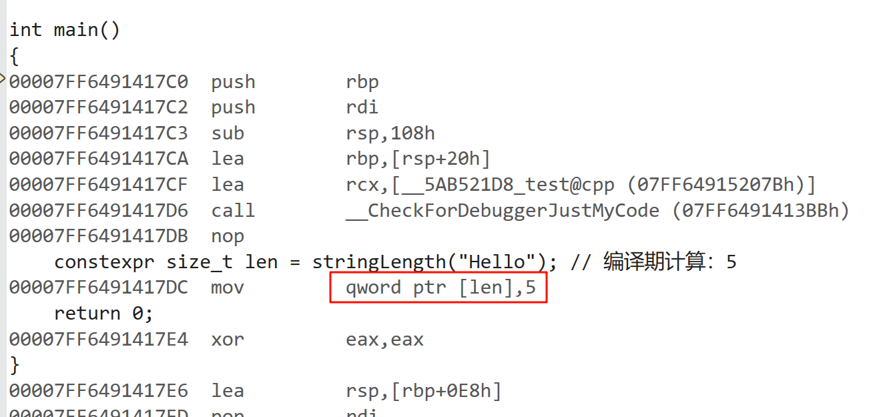


## 支持更复杂的返回类型
C++14允许constexpr函数返回非基本类型，包括：自定义类、STL容器std::array、其他符合constexpr要求的复合类型。

```cpp
struct Point {
	constexpr Point(double x, double y) : x(x), y(y) {}
	double x, y;
};

constexpr Point midpoint(Point a, Point b) {
	return Point((a.x + b.x) / 2, (a.y + b.y) / 2);
}

constexpr std::array<int, 5> createArray() {
	std::array<int, 5> arr{};
	for (int i = 0; i < arr.size(); ++i) {
		arr[i] = i * i;
	}
	return arr;
}

constexpr int fibonacci(int n) {
	return (n <= 1) ? n : (fibonacci(n - 1) + fibonacci(n - 2));
}

int main()
{
	Point p1 = midpoint({ 1.1,1.1 }, { 2.2,2.2 });
	constexpr Point p2 = midpoint({ 1.1,1.1 }, { 2.2,2.2 });
	constexpr std::array<int, 5> a1 = createArray();
	constexpr int fibArray[] = {
		fibonacci(0), fibonacci(1), fibonacci(2), fibonacci(3),
		fibonacci(4), fibonacci(5), fibonacci(6), fibonacci(7)
	};
	return 0;
}
```

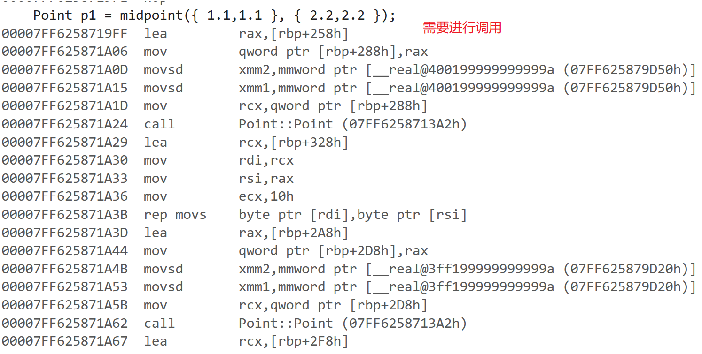

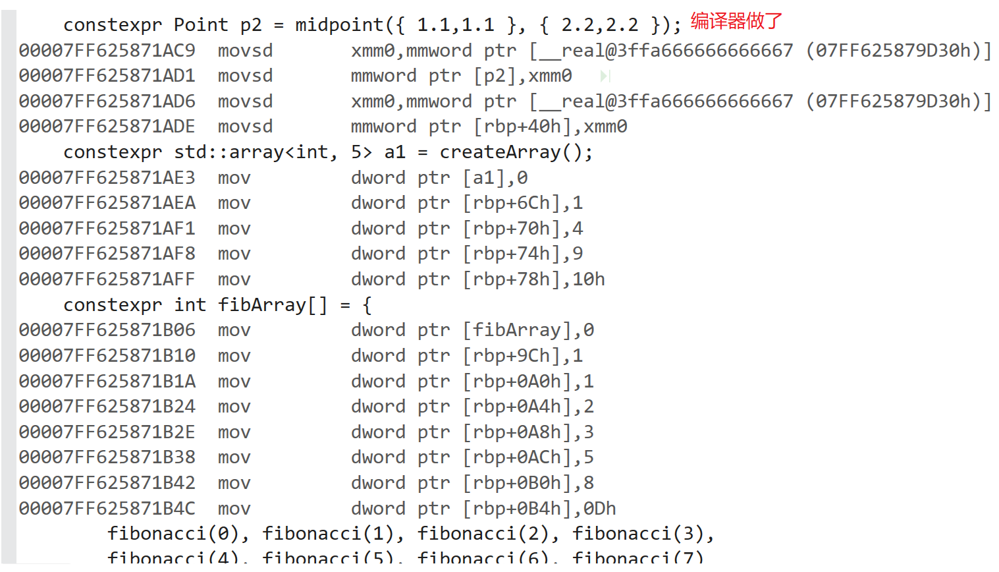


## constexpr 在 C++17中的演进
C++17 对constexpr进行了重大扩展，使其能力大幅提升，进一步模糊了编译时和运行时的界限。

### if constexpr - 编译期条件分支
if constexpr 是 C++17 引入的一种条件编译语句，它允许在编译时根据常量表达式的结果决定编译哪部分代码，未选择的分支代码不会编译成指令，直接丢弃。

```cpp
template <typename T>
auto get_value(T t) {
	if constexpr (std::is_pointer_v<T>) {
		return *t; // 仅当T为指针类型时实例化
	}
	else {
		return t; // 非指针类型时实例化
	}
}

int main()
{
	int x = 42;
	auto v1 = get_value(x);		// 返回x本身
	auto v2 = get_value(&x);	// 解引用返回42
	return 0;

```

### constexpr lambda 表达式
lambda表达式可标记为constexpr

捕获必须是编译期常量

函数体需满足constexpr函数要求

```cpp
int main()
{
	// constexpr lambda示例
	constexpr int n = 10;
	int y = 0;
	constexpr auto square = [n](int x) constexpr { return x * x * n; };
	constexpr int result = square(5); // 编译期计算：250
	return 0;
}
```

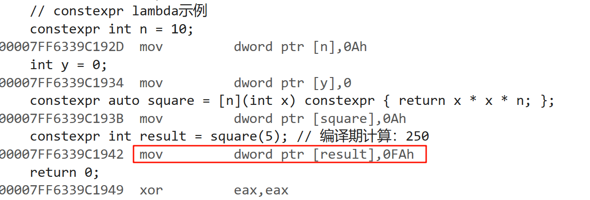

## constexpr 在 C++20 中的演进
### 动态内存分配的编译期支持
new / delete 支持：允许在 constexpr 上下文中使用动态内存分配

编译期容器：使得 std::vector 和 std::string 等容器的编译期实现成为可能

内存生命周期：所有分配的内存在编译期必须被释放

```cpp
constexpr int dynamic_memory_example() {
	int* p = new int{ 42 }; // 编译期分配
	int value = *p;
	delete p; // 必须显式释放
	return value;
}
int main()
{
	constexpr int v = dynamic_memory_example(); // 42
	return 0;
}
```

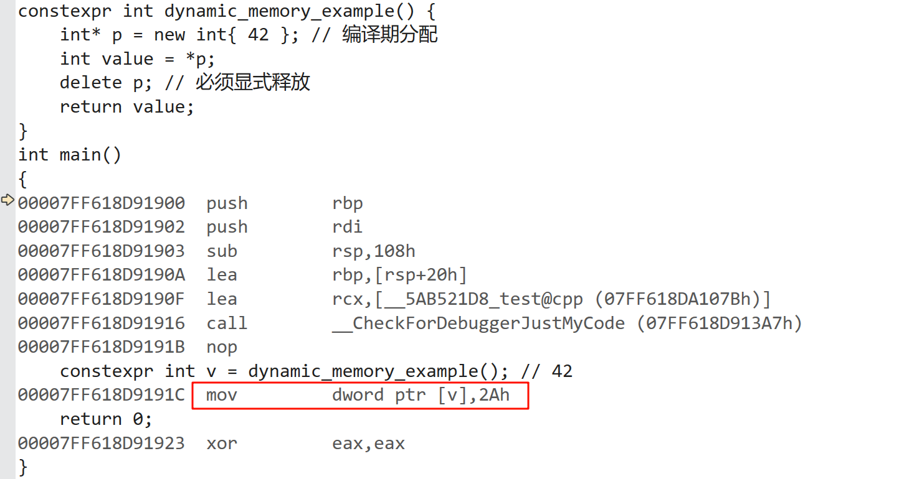


### 标准库的逐步constexpr化
[https://en.cppreference.com/w/cpp/algorithm/find.html](https://en.cppreference.com/w/cpp/algorithm/find.html)

[https://en.cppreference.com/w/cpp/algorithm/sort.html](https://en.cppreference.com/w/cpp/algorithm/sort.html)

[https://en.cppreference.com/w/cpp/container/array.html](https://en.cppreference.com/w/cpp/container/array.html)

[https://en.cppreference.com/w/cpp/container/vector/vector.html](https://en.cppreference.com/w/cpp/container/vector/vector.html)


```cpp
constexpr std::vector<int> create_vector() {
	std::vector<int> v{ 1, 2, 3 }; // 编译期构造
	v.push_back(4); // 编译期操作
	return v;
}

int main()
{
	constexpr auto vec = create_vector();	// 编译期间就生成1, 2, 3
	constexpr string s1("111111111111");
	constexpr vector<int> v1(10, 1);
	return 0;
}
```

编译报错

这里可以看到编译报错了，虽然支持了constexpr函数中new/delete

但是还要求必须编译器释放内存，所以实际库里面constexpr化还相对有限

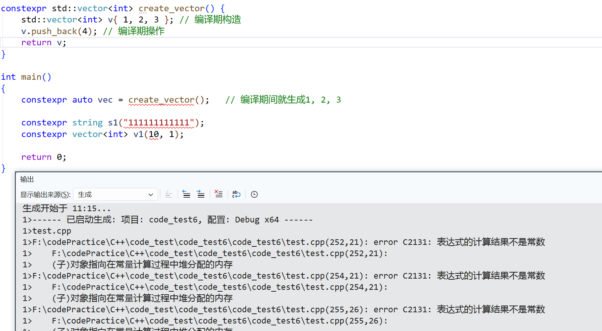


```cpp
constexpr std::vector<int> create_vector() {
	std::vector<int> v{ 1, 2, 3 }; // 编译期构造
	v.push_back(4); // 编译期操作
	return v;
}

constexpr auto sort_example() {
	std::array<int, 5> arr{ 5, 3, 4, 1, 2 };
	std::sort(arr.begin(), arr.end()); // 编译期排序
	return arr;
}

int main()
{
	constexpr array<int, 10> a1 = { 3,2,1,4,5 };

	vector<int> v2 = { 3,2,1,4,5 };
	sort(v2.begin(), v2.end());
	auto it1 = find(v2.begin(), v2.end(), 3);

	// 相对有限支持的constexpr
	constexpr auto sorted = sort_example(); // {1,2,3,4,5}
	constexpr auto it2 = find(a1.begin(), a1.end(), 4);
	static_assert(*it2 == 4, "编译期查找");

	return 0;
}
```


### try-catch 的全面支持
完整语法支持：允许 try-catch 块

实际限制：不能真正抛出异常（否则不是常量表达式）

错误处理：主要用于模板约束和编译期错误检测，异常必须在编译期捕获和处理，不能传播到运行时

```cpp
constexpr int safe_divide(int a, int b) {
	try {
		if (b == 0)
			throw "Division by zero";
		else
			return a / b;
	}
	catch (...) {
		return -1; // 编译期异常处理
	}
}
int main()
{
	constexpr int val1 = safe_divide(10, 2); // 5
	//constexpr int val2 = safe_divide(10, 0); // 报错
}
```

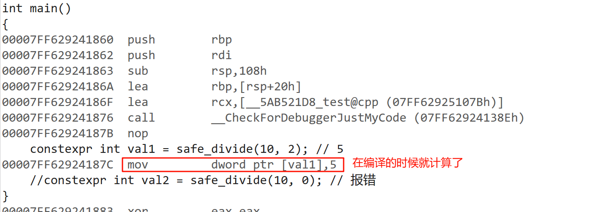

```cpp
constexpr int val2 = safe_divide(10, 0); // 报错
```

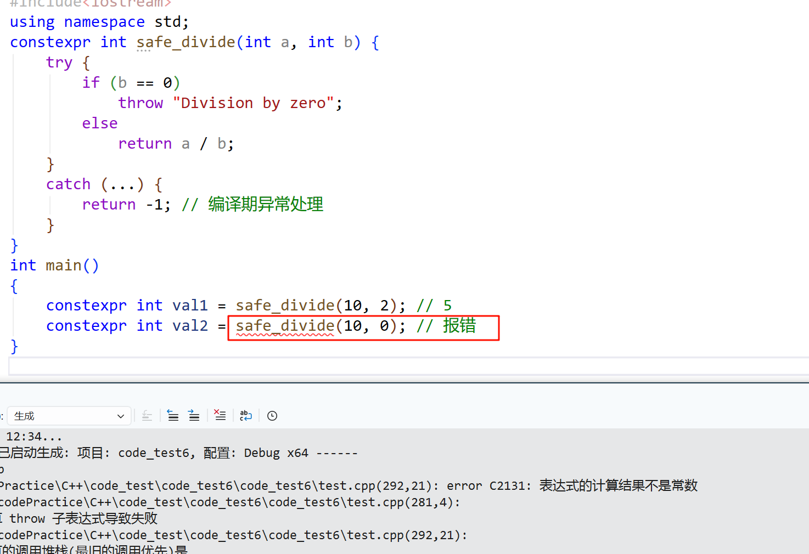


### constexpr 联合体(union)
编译期活跃成员切换：可以在编译期改变联合体的活跃成员

constexpr构造函数：允许定义constexpr构造函数来初始化联合体

成员访问限制：只能访问当前活跃成员（编译期检查）

```cpp
constexpr union Data {
	int i;
	float f;
	constexpr Data(int val) : i(val) {} // 初始化整数成员
	constexpr Data(float val) : f(val) {} // 初始化浮点成员
};

int main()
{
	constexpr Data d1(42); // 活跃成员是i
	constexpr Data d2(3.14f); // 活跃成员是f
	//constexpr float temp = d1.f; // 错误：访问非活跃成员（编译失败）
	constexpr int temp = d1.i;
	return 0;
}
```

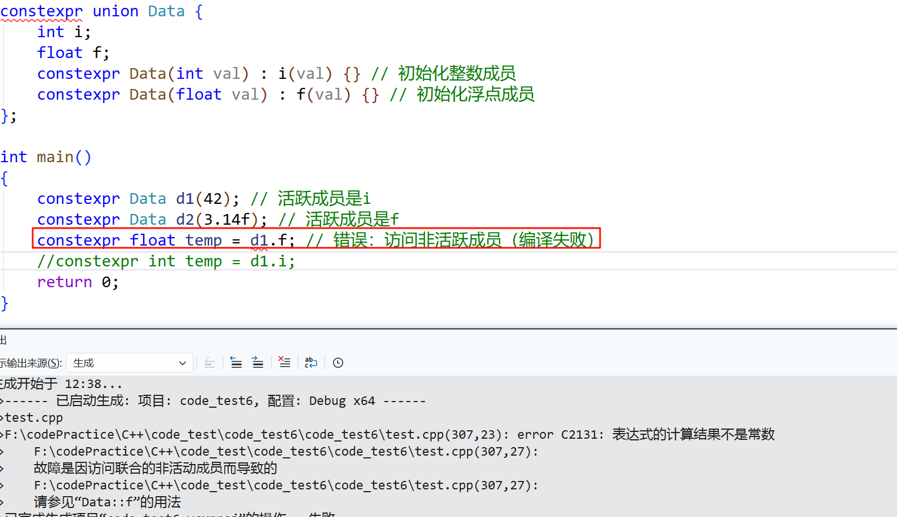


### constexpr 可变(mutable)成员
constexpr成员函数中，成员变量是不能修改的，但是我们定义成员变量时，加上mutable修饰，这个成员变量在constexpr成员函数中就可以修改了。

```cpp
class A {
	mutable int _i;			// 使用mutable修饰
	int _j;
public:
	constexpr A(int i, int j)
		:_i(i)
		, _j(j)
	{
	}

	constexpr int Func() const
	{
		++_i; // 可以修改
		// ++_j; // 不能修改
		return _i + _j;
	}
};
int main()
{
	constexpr A aa(1, 1);
	constexpr int ret = aa.Func();
	return 0;
}
```

### constexpr 虚函数支持
之前虚函数是不支持定义为constexpr函数的，C++20中开始支持

```cpp
class Base {
public:
	virtual constexpr int value() const { return 1; }
};

class Derived : public Base {
public:
	constexpr int value() const override { return 2; }
};

constexpr int get_value(const Base& b) {
	return b.value(); // 编译期多态调用
}

int main() 
{
	constexpr int ret1 = get_value(Base());
	constexpr int ret2 = get_value(Derived());
	return 0;
}
```

# 处理类型
## auto
之前已经用过auto，auto是一个类型说明符，他让编译器替我们分析表达式的类型，`auto x = y + z;` 编译器自动根据y+z相加的结果来推导x的类型，在一些类型比较长的场景，如前面讲的迭代器遍历时非常有用。

编译器推导auto类型时，有时候也会和初始值的类型不一样，编译器会适当的改变结果类型，使其更符合初始化规则。首先使用引用其实是使用引用的对象，特别是当引用被用作初始值时，真正参与初始化的其实是引用对象的值，所以编译器推导auto为引用对象的类型，而不是引用。其次一个带有const属性的值初始化auto对象推导时忽略掉顶层const，保留底层const。

auto不能自动推导出引用类型，所以我们如果想将auto推导为引用类型，需要明确的指出：`auto& x = i;`

auto不能推导出顶层const，如果想使用auto推导出顶层const，需要明确的指出：`const auto x = ci;`

设置一个类型为auto引用时，初始值中的顶层const属性仍然保留，否则存在权限放大问题。

```cpp
int main()
{
	int i = 0;
	int& ri = i;
	const int ci = 42;		// 顶层const
	int* const p1 = &i;		// 顶层const
	const int* p2 = &ci;	// 底层const
	const int& ri1 = ci;	// 底层const
	const int& ri2 = i;		// 底层const

	auto j = ri;			// j类型为int
	j++;
	auto k = i;				// k类型为int
	k++;
	auto r1 = ci;			// r1类型为int，忽略掉顶层const
	r1++;
	auto r2 = p1;			// r2类型为int*，忽略掉顶层const
	r2++;
	auto r3 = p2;			// r3类型为const int*，保留底层const
	// (*r3)++;				// 报错
	auto r4 = ri1;			// r4类型为int，因为ri1是ci的别名，ci本身的const是一个顶层const被忽略掉了
	r4++;
	auto r5 = ri2;			// r5类型为int
	r5++;
	const auto r7 = ci;		// r7类型为const int
	auto& r8 = ri1;			// r8类型为const int&
	auto& r9 = ri2;			// r9类型为const int&
	auto& r10 = ci;			// r10类型为const int&
	auto& r11 = ri;			// r11类型为int&
	//r7++;					// 报错
	//r8++;					// 报错
	//r9++;					// 报错
	//r10++;				// 报错
	r11++;
	return 0;
}
```

`auto&`声明一个左值引用，它只能绑定到左值，如果初始化对象有const属性，推导时会保持`const`限定符，否则涉及权限放大。

`const auto&`声明一个`const`左值引用，既可以绑定到左值又可以绑定到右值，不会修改绑定对象。

`auto&&`是万能引用，遵循引用折叠的规则，既可以绑定到左值又可以绑定到右值，初始化表达式自动推导为左值引用或右值引用，如果初始化对象有const属性，推导时会保持 const 限定符。

```cpp
void func(int& x)
{
	cout << "void func(int& x)" << endl;
}
void func(int&& x)
{
	cout << "void func(int&& x)" << endl;
}
void func(const int& x)
{
	cout << "void func(const int& x)" << endl;
}
void func(const int&& x)
{
	cout << "void func(const int&& x)" << endl;
}
int main()
{
	int x = 10;
	const int cx = 20;
	auto& rx1 = x; // int&
	auto& rx2 = cx; // const int&
	func(rx1);
	func(rx2);
	const auto& rx3 = x; // const int&
	const auto& rx4 = cx; // const int&
	func(rx3);
	func(rx4);

	// 万能引用
	auto&& rx5 = x; // int&
	auto&& rx6 = cx; // const int&
	func(rx5);
	func(rx6);
	auto&& rx7 = move(x); // int&&
	//rx7++;
	auto&& rx8 = move(cx); // const int&&
	//rx8++;
	func(forward<int>(rx7));
	func(forward<const int>(rx8));
	return 0;
}
```

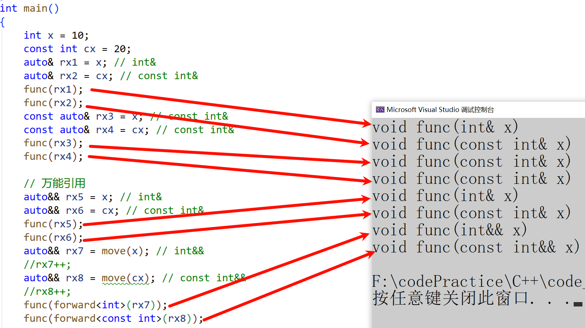

## 尾置返回类型
尾置返回类型是C++11引入的一种函数声明语法，它允许将函数的返回类型放在参数列表之后而不是函数名前。尾置返回类型的语法这里我们简单的做个了解即可，因为C++14引用了auto做返回类型时，返回类型自动推导，很多地方就不太需要尾置返回类型了。

语法：

```cpp
auto functionName(parameters) -> returnType {
    // 函数体
}
```

场景：

```cpp
#include <map>
#include <vector>

// 1. 复杂返回类型
auto getComplexType() -> std::map<std::string, std::vector<int>> {
	// ...
}

// 2. 依赖参数类型的返回类型
template <typename T, typename U>
auto add(T t, U u) -> decltype(t + u) {
	return t + u;
}

// 3. lambda表达式
auto lambda = [](int x) -> double { return x * 1.5; };
```

## decltype
如果我们希望用表达式推出变量的类型，但是不想用表达式的值初始化变量，那么这时可以使用`decltype`。`decltype(f()) x;` 需要注意的是编译器并不会实际调用f函数，而是用f的返回类型作为x的类型。

decltype 处理const和引用的方式和auto也有所不同， decltype(const变量表达式) x ，x的类型推出类型为`const T`，decltype会保留顶层const； decltype(引用变量表达式) x ，x的类型推出类型为`T &`，`decltype`会保留引用；要注意这里跟auto是完全不同的。

decltype还有一些特殊处理比较奇怪， `decltype(*p) x;` x的类型是T&，decltye推导解引用表达式时，推出类型是引用； `decltype((i)) x;` x的类型是T&，decltye推导解括号括起来的左值表达式时，推出类型是引用;

```cpp
int main()
{
	int i = 0;
	const int ci = 0;
	const int& rci = ci;
	decltype(i) m = 1; // m的类型是int
	decltype(ci) x = 1; // x的类型是const int
	m++;
	x++; // 报错
	decltype(rci) y = x; // y的类型是const int&
	y++; // 报错
	decltype(rci) z; // 报错
	int* p1 = &i;
	decltype(p1) p2 = nullptr; // p2的类型是int*
	// 特殊处理
	decltype(*p1) r1 = i; // r1的类型是int&，解引用表达式推导出的内容是引用
	decltype(i) r2; // r2的类型是int
	decltype((i)) r3 = i; // r3的类型是int&, (i)是一个表达式，变量是一种可以赋值特殊表达式，所以会推出引用类型
	return 0;
}
```

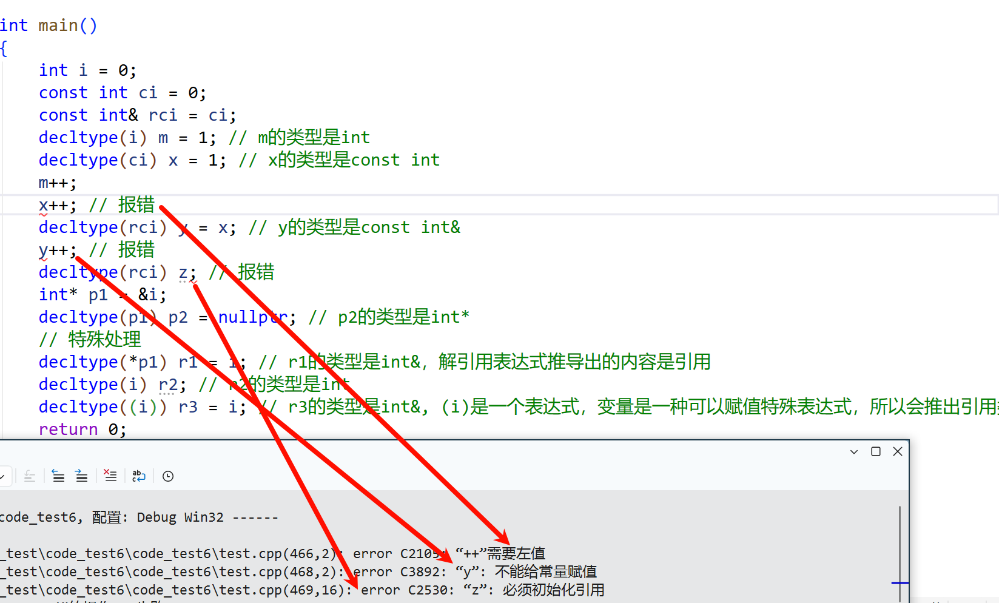

auto必须要通过初始化值推导类型，像类的成员变量这种就没办法使用auto，decltype可以很好的解决这样的问题

```cpp
#include <vector>
template <typename T>
class A
{
public:
	void func(T& container)
	{
		_it = container.begin();
	}
private:
	// typename T::iterator _it; // 这里不确定是iterator还是const_iterator，也不能使用auto
	
	// 使用decltype推导就可以很好的解决问题，这里的begin不会真正调用
	decltype(T().begin()) _it;
};
int main()
{
	const vector<int> v1;
	A<const vector<int>> obj1;
	obj1.func(v1);

	vector<int> v2;
	A<vector<int>> obj2;
	obj2.func(v2);
	return 0;
}
```

decltype还可以用来解决函数尾置返回类型的问题，有时一个函数模板的类型跟是不确定的，跟某个参数对象有关，需要进行推导，直接用decltype推导去做返回类型是不行了，因为C++是前置语法，往前找不到这个推导对象，这个对象在参数里面，所以auto做返回值，然后->decltype(对象)做尾置推导

```cpp
template<class R, class Iter>
R Func(Iter it1, Iter it2)
{
	R x = *it1;
	++it1;
	while (it1 != it2)
	{
		x += *it1;
		++it1;
	}
	return x;
}

//不支持这样写，因为C++是前置语法，编译器遇到对象只会向前搜索
template<class Iter>
decltype(*it1) Func(Iter it1, Iter it2)
{
	auto& x = *it1;
	++it1;
	while (it1 != it2)
	{
		x += *it1;
		++it1;
	}
	return x;
}

//返回位置用auto，函数后面接->推导返回类型的位置返回值方式
//要注意decltype(*it1)推导出的是引用类型
template<class Iter>
auto Func(Iter it1, Iter it2) -> decltype(*it1)
{
	auto& x = *it1;
	++it1;
	while (it1 != it2)
	{
		x += *it1;
		++it1;
	}
	return x;
}

int main()
{
	vector<int> v = { 1,2,3 };
	list<string> lt = { "111","222","333" };
	// 这里无法调用上面的函数，因为函数模板只能通过实参推导模板类型，无法推导R
	auto ret1 = Func(v.begin(), v.end());
	auto ret2 = Func(lt.begin(), lt.end());

	// 显示实例化能解决问题，但是调用就很麻烦
	auto ret3 = Func<decltype(*v.begin())>(v.begin(), v.end());
	auto ret4 = Func<decltype(*lt.begin())>(lt.begin(), lt.end());
	cout << ret3 << endl;
	cout << ret4 << endl;
	return 0;
}
```

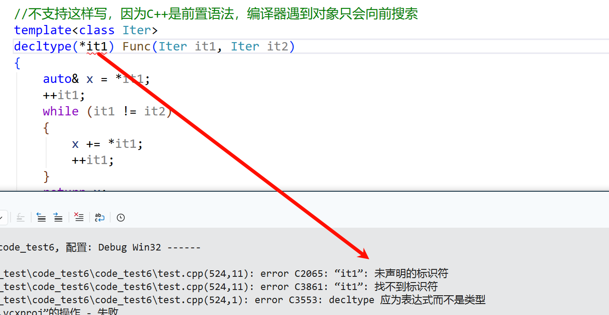

decltype(auto) 是 C++14 引入的特性，它结合了 auto 的便利性和`decltype`的精确类型推导能力。

```cpp
int main()
{
	int i = 0;
	int& ri = i;
	const int ci = 42;		// 顶层const
	int* const p1 = &i;		// 顶层const
	const int* p2 = &ci;	// 底层const
	auto j = ri;			// j类型为int
	decltype(auto) j1 = ri; // j1类型为int&
	++j1;
	auto r1 = ci;			// r1类型为int，忽略掉顶层const
	decltype(auto) rr1 = ci;// rr1类型为const int
	r1++;
	//rr1++;
	auto r2 = p1;			// r2类型为int*，忽略掉顶层const
	decltype(auto) rr2 = p1;// rr1类型为int* const
	r2++;
	//rr2++;
	auto r3 = p2;			// r3类型为const int*，保留底层const
	decltype(auto) rr3 = p2;// rr3类型为const int*
	// (*rr3)++;
	return 0;
}
```

## typedef和using
C++98中我们一般使用typedef重定义类型名，也很方便，但是typedef不支持带模板参数的类型重定义。C++11中新增了using可以替代typedef，using 的别名语法覆盖了 typedef 的全部功能，不少场景还更清晰一些，比如函数指针的重定义，其次最大的变化是支持带模板参数重定义的语法。

`using 类型别名 = 类型;`

```cpp
// typedef map<string, int> CountMap;
// typedef map<string, string> DictMap;
// typedef int DateType;
// typedef void (*Callback)(int);

// using 兼容typedef的用法
using CountMap = map<string, int>;
using DictMap = map<string, string>;
using STDateType = int;
using Callback = void (*)(int);

// using支持带模板参数的类型重定义
template<class Val>
using Map = map<string, Val>;

template<class Val>
using MapIter = typename map<string, Val>::iterator;
int main()
{
	Map<int> countMap;
	Map<string> dictMap;
	MapIter<int> cit = countMap.begin();
	MapIter<string> dit = dictMap.begin();
	return 0;
}
```

## 强类型枚举 (enum class)
C++11 引入了强类型枚举（也称为枚举类enum class），解决了传统 C++ 枚举（enum）的多个缺点，提供了更好的类型安全性和封装性。

传统 C++ 枚举存在以下主要问题：

1. 隐式转换为整型：枚举值会自动转换为整数，可能导致意外行为
2. 污染外围作用域：枚举值会泄漏到包含它的作用域中
3. 无法指定底层类型：不能明确控制枚举使用的存储大小

强类型枚举语法：

enum class 或 enum struct （两者等价）

可选的底层类型（ : UnderlyingType ）

枚举值必须通过枚举名作用域访问


使用方法：

```cpp
enum class EnumName : UnderlyingType {
	enumerator1,
	enumerator2,
	// ...
};
```

举例：

```cpp
// 使用enum是不可以这样定义的，enum值是暴露到全局的，Red存在冲突
enum class Color { Red, Green, Blue };
enum class TrafficLight { Red, Yellow, Green };

// 指定底层类型
enum class SmallEnum : uint8_t { Value1, Value2 }; // 8位存储
enum class BigEnum : uint32_t { Value1, Value2 }; // 32位存储

int main()
{
	Color c1 = Color::Red; // 正确
	//Color c2 = Red; // 错误, enum是可以的
	//int i = Color::Red; // 错误：不能隐式转换，enum是可以的
	int j = static_cast<int>(Color::Red); // 正确：显式转换
	// C++20支持
	using enum Color; // 引入Color枚举值到当前作用域
	Color c = Red; // 现在可以直接使用
	return 0;
}
```

## static_assert
`static_assert`是C++11引入的编译时断言机制，它允许开发者在编译期间检查条件是否满足，如果条件不满足，则会导致编译错误。


常量表达式：在编译时可求值的表达式，必须能转换为bool类型

错误消息：当断言失败时显示的字符串字面量（C++17起可以省略）

`static_assert(常量表达式, 错误消息);`

```cpp
// 1、类型检查
template<typename T>
void process(T value) {
	static_assert(std::is_integral<T>::value, "T must be an integral type");
	// 函数实现...
}
// 2、编译时常量验证
constexpr int buffer_size = 1024;
static_assert(buffer_size > 0, "Buffer size must be positive");
static_assert(buffer_size % 4 == 0, "Buffer size must be divisible by 4"); '
// 3、平台或架构检查
static_assert(sizeof(void*) == 8, "This code requires 64-bit platform");
// 4、类型大小验证
static_assert(sizeof(int) == 4, "int must be 4 bytes");
```


## std::tuple
std::tuple是 C++11 引入的一个模板类，它允许将多个不同类型的值组合成一个单一的对象。类似于结构体，但不需要预先定义类型名称。tuple（元组）是一个固定大小的异构值集合，可以包含不同类型的元素。它是 std::pair 的泛化版本， pair 只能保存两个元素，而 tuple 可以保存任意数量的元素。

[https://legacy.cplusplus.com/reference/tuple/tuple/?kw=tuple](https://legacy.cplusplus.com/reference/tuple/tuple/?kw=tuple)

### 创建 Tuple
```cpp
#include <tuple>
int main() {
	// 创建一个包含3个元素的tuple: int, double, string
	std::tuple<int, double, std::string> t1(10, 3.14, "hello");

	// 使用make_tuple自动推导类型
	auto t2 = std::make_tuple(20, 2.718, "world");
	
	// C++17起可以使用类模板参数推导
	std::tuple t3(30, 1.618, "cpp"); // 自动推导为tuple<int, double, const char* 
	return 0;
}
```

### 访问元素
```cpp
#include <tuple>
int main() {
	// 创建一个包含3个元素的tuple: int, double, string
	std::tuple<int, double, std::string> t1(10, 3.14, "hello");

	// 通过索引访问
	std::cout << std::get<0>(t1) << std::endl; 
	std::cout << std::get<1>(t1) << std::endl; 
	std::cout << std::get<2>(t1) << std::endl << std::endl;
	
	// 修改
	std::get<0>(t1) = 100; // 修改第一个元素

	// C++14起可以通过类型访问(类型必须唯一)
	std::cout << std::get<int>(t1) << std::endl;
	std::cout << std::get<double>(t1) << std::endl;
	return 0;
}
```

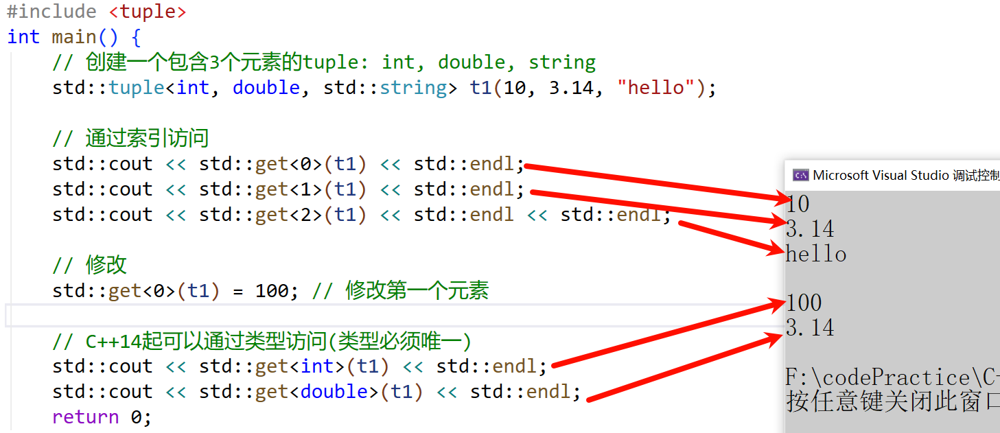

### 解包 tuple
```cpp
int main()
{
	int x; 
	double y;
	std::string z;

	std::tuple<int, double, std::string> t1(10, 3.14, "hello");
	// 使用std::tie解包
	std::tie(x, y, z) = t1;
	// C++17结构化绑定
	auto& [a, b, c] = t1;
	return 0;
}
```

# 模板元编程
现代C++的一个进化方向就是在编译时做更多的工作，模板元编程(Template Metaprogramming, TMP)是C++中一种利用模板机制在编译期进行计算和代码生成的高级技术。它通过模板特化、递归实例化和类型操作，在编译时完成传统运行时才能处理的任务，从而实现零运行时开销的优化。

模板元编程最早由Erwin Unruh在1994年发现，他展示了如何让编译器在错误信息中输出素数序列，随后被Todd Veldhuizen和David Vandevoorde等人系统化，Todd Veldhuizen证明了C++模板具有图灵完备性，理论上能执行任何计算任务，它遵循函数式编程范式，模板参数作为不可变数据参与编译期计算

## 模板元编程的核心概念
模板元编程的本质是将计算从运行时转移到编译期，利用编译器作为"计算引擎"生成高效代码。其核心思想包括：

1. 编译期计算 ：所有运算在编译阶段完成，结果直接嵌入最终程序
2. 类型操作 ：通过模板参数推导和类型萃取(Type Traits)操作类型
3. 递归模板实例化 ：通过递归展开实现循环和条件逻辑
4. 零运行时开销 ：结果在编译期确定，不增加程序运行负担

## 模板元编程基础语法
模板元编程主要使用**类模板**(而非函数模板)，因为类模板可以包含类型成员和静态成员，再利用模板特化和递归实现。

```cpp
template <typename T>
struct MyTemplate {
    using type = T; // 类型成员
    static const int value = 42; // 静态成员
};
```

例如：计算阶乘

```cpp
template <unsigned int N>
struct Factorial {
	static const unsigned int value = N * Factorial<N - 1>::value;
};

// 终止条件特化
template <>
struct Factorial<0> {
	static const unsigned int value = 1;
};

int main()
{
	constexpr unsigned int fact5 = Factorial<5>::value; // 编译时计算出120
	return 0;
}
```

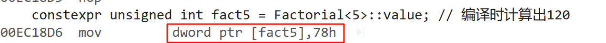


编译时获取或修改类型信息的操作

```cpp
namespace lsl
{
// 主模板
template<typename T>
struct is_pointer {
	static constexpr bool value = false;
};

// 针对指针类型的偏特化
template<typename T>
struct is_pointer<T*> {
	static constexpr bool value = true;
};

// 主模板，默认情况类型不同
template<typename T, typename U>
struct is_same {
	static constexpr bool value = false;
};

// 特化版本，当两个类型相同时
template<typename T>
struct is_same<T, T> {
	static constexpr bool value = true;
};

// 移除 const
// 主模板，默认情况下不改变类型
template <typename T>
struct remove_const {
	using type = T;
};

// 针对 const T 的特化版本，移除 const
template <typename T>
struct remove_const<const T> {
	using type = T;
};

// 移除 指针
template <typename T>
struct remove_pointer {
	using type = T;
};

template <typename T>
struct remove_pointer<T*> {
	using type = T;
};

template <typename T>
struct remove_pointer<T* const> {
	using type = T;
};

void func()
{
	static_assert(is_pointer<int*>::value, "int* is a pointer");
	static_assert(lsl::is_pointer<int>::value, "int is not a pointer");
	static_assert(is_same<int, int>::value, "int and int should be the same");
	static_assert(is_same<int, float>::value, "int and float should be different");
	static_assert(is_same<remove_pointer<int*>::type, int>::value, "int and int should be the same");
	static_assert(is_same<remove_const<const int>::type, int>::value, "int and int should be the same");
}
}

int main()
{
	lsl::func();
	return 0;
}
```

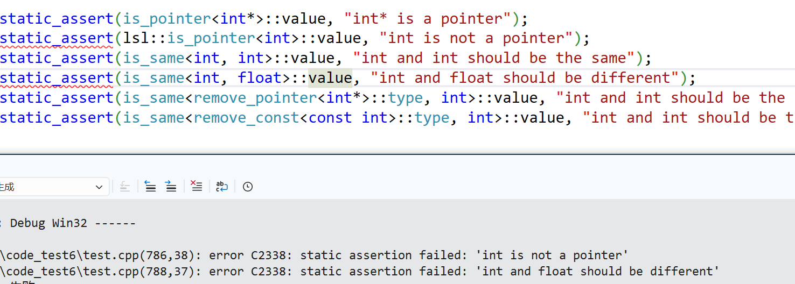


## 类型萃取(type_traits)
类型萃取是C++模板元编程中的核心技术，它允许在编译时检查和修改类型特性。C++11版本开始标准库在`<type_traits>` 头文件中提供了大量类型萃取工具。类型萃取是通过模板特化技术实现的编译期类型操作，主要用途包括：检查类型特性、修改/转换类型、根据类型特性进行编译期分支。

### type_traits
[https://en.cppreference.com/w/cpp/header/type_traits.html](https://en.cppreference.com/w/cpp/header/type_traits.html)

```cpp
#include <type_traits>
// 1、基础类型检查
std::is_void<void>::value; // true
std::is_integral<int>::value; // true
std::is_floating_point<float>::value; // true
std::is_pointer<int*>::value; // true
std::is_reference<int&>::value; // true
std::is_const<const int>::value; // true
// 2、复合类型检查
std::is_function<void()>::value; // true
std::is_member_object_pointer<int(Foo::*)>::value; // true
std::is_compound<std::string>::value; // true (非基础类型)
// 3、类型关系检查
std::is_same<int, int32_t>::value; // 取决于平台
std::is_base_of<Base, Derived>::value;
std::is_convertible<From, To>::value;
// 4、类型修改
std::add_const<int>::type; // const int
std::add_pointer<int>::type; // int*
std::add_lvalue_reference<int>::type; // int&
std::remove_const<const int>::type; // int
std::remove_pointer<int*>::type; // int
std::remove_reference<int&>::type; // int
// 4、条件类型选择
std::conditional<true, int, float>::type; // int
std::conditional<false, int, float>::type; // float
// 5、类型推导
// 函数的返回结果类型
std::result_of<F(Args...)>::type; // C++17以后被废弃
std::invoke_result<F, Args...>::type; // C++17以后使用这个
template<class F, class... Args>
using invoke_result_t = typename invoke_result<F, Args...>::type;
```

C++17 为类型萃取添加了`_v`和`_t`后缀的便利变量模板和类型别名

```cpp
// C++11方式
std::is_integral<int>::value;
std::remove_const<const int>::type;
// C++14、C++17 更简洁的方式
std::is_integral_v<int>;
std::remove_const_t<const int>;
// C++17 引入的辅助变量模板
template<typename T>
inline constexpr bool is_integral_v = is_integral<T>::value;
// C++14 引入的辅助别名模板
template<typename T>
using remove_const_t = typename remove_const<T>::type;
```

样例：

```cpp
template<typename T>
void process(T value) {
	if constexpr (std::is_pointer_v<T>) {
		// 指针类型的处理
		std::cout << "Processing pointer: " << *value << std::endl;
	}
	else if constexpr (std::is_integral_v<T>) {
		// 整数类型的处理
		std::cout << "Processing integer: " << value * 2 << std::endl;
	}
	else if constexpr (std::is_floating_point_v<T>) {
		// 浮点类型的处理
		std::cout << "Processing float: " << value / 2.0 << std::endl;
	}
	else {
		// 默认处理
		std::cout << "Processing unknown type" << std::endl;
	}
}

int main()
{
	// 使用
	int i = 42;
	process(i);					// Processing integer: 84
	process(&i);				// Processing pointer: 42
	process(3.14);				// Processing float: 1.57
	process("hello");			// Processing pointer: h
	process(string("world"));	// Processing unknown type
	return 0;
}
```

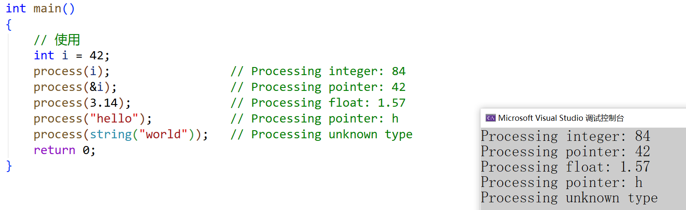


## SFINAE
SFINAE是Substitution Failure Is Not An Error首字母缩写，意思是"替换失败不是错误"，在模板参数推导或替换时，如果某个候选模板导致编译错误（如类型不匹配、无效表达式等），编译器不会直接报错，而是跳过该候选，尝试其他可行的版本。如果最后都没匹配到合适的版本，再进行报错。

SFINAE的语法相对复杂难理解，在C++20以后，考虑使用概念(Concepts)替代绝大部分的SFINAE

### SFINAE经典应用场景函数重载
```cpp
// 版本1：仅适用于可递增的类型（如 int）
/*
template<typename T>
auto foo(T x) -> decltype(++x, void()) {
	std::cout << "foo(T): " << x << " (can be incremented)\n";
}
*/

// C++17 使用void_t优化上面的写法
template<typename T>
auto foo(T x) -> std::void_t<decltype(++x)> {
	std::cout << "foo(T): " << x << " (can be incremented)\n";
}

// 版本2：回退版本
void foo(...) {
	std::cout << "foo(...): fallback (cannot increment)\n";
}

int main() 
{
	foo(42);					// 调用版本1（int 支持 ++x）
	foo(std::string("1111"));	// 调用版本2（string 不支持 ++x）
	return 0;
}
```

### enable_if
[https://en.cppreference.com/w/cpp/types/enable_if.html](https://en.cppreference.com/w/cpp/types/enable_if.html)

`std::enable_if`是一个**类型萃取**，它的功能和实现具体看上面文档，它是`SFINAE`的典型应用，用于在编译时启用/禁用函数模板

```cpp
#include <type_traits>
// 对于整数类型启用此重载
template<typename T>
typename std::enable_if_t<std::is_integral_v<T>, T>

add_one(T t) {
	return t + 1;
}

// 对于浮点类型启用此重载
template<typename T>
typename std::enable_if_t<std::is_floating_point_v<T>, T>
add_one(T t) {
	return t + 2.0;
}

// 模板参数的检查
template<typename T, typename = std::enable_if_t<std::is_integral_v<T>>>
void process_integer(T value) {
	// 只接受整数类型
}

int main() 
{
	std::cout << add_one(5) << "\n";		// 调用整数版本，输出6
	std::cout << add_one(3.14) << "\n";		// 调用浮点版本，输出4.14
	//add_one("hello");					// 编译错误，没有匹配的重载
	process_integer(1);
	//process_integer(1.1);				// 编译错误，没有匹配的重载
	return 0;
}
```


# 现代C++中对模板元编程特性的增强和优化
## constexpr函数（C++11起）
C++11/14/17/20逐步增强了constexpr能力，许多模板元编程任务可以用constexpr函数替代，允许函数和变量在编译期求值，替代部分传统模板元编程的递归实例化，constexpr简化了很多相对复杂的模板元编程实现。

```cpp
constexpr int factorial(int n) {
    return n <= 1 ? 1 : n * factorial(n - 1);
}
constexpr int x = factorial(5); // 120
```


## 变量模板（C++14）
变量模板直接定义编译期常量值，有了变量模板类型萃取的一些取值特性就可以简化一些，如`is_integral_v`等

```cpp
template<typename T>
constexpr T pi = T(3.1415926535897932385);

template<class T >
constexpr bool is_integral_v = is_integral<T>::value;

int main() 
{
	float f = pi<float>; // 单精度π
	double x = pi<double>; // 双精度π
	
	// 使用不同精度的π
	std::cout.precision(6);
	std::cout << "float π: " << f << std::endl;

	std::cout.precision(10);
	std::cout << "double π: " << x << std::endl;
	return 0;
}
```

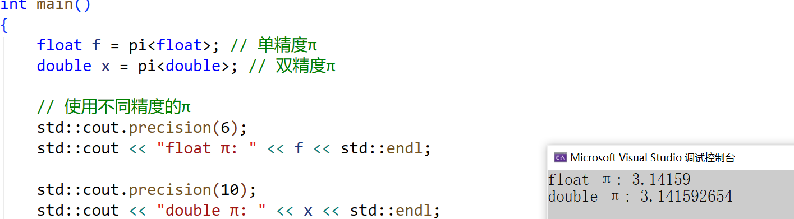


## if constexpr (C++17)
在编译期根据条件选择代码路径，避免生成无效代码分支，简化SFINAE和模板特化的复杂逻辑，提升可读性。

```cpp
template <typename T>
auto process(T value) {
	if constexpr (std::is_integral_v<T>) {
		return value * 2;
	}
	else if constexpr (std::is_floating_point_v<T>) {
		return value / 2;
	}
	else {
		return value;
	}
}
```


## 折叠表达式（C++17）
```cpp
template<typename... Args>
void print(Args&&... args) {
    (std::cout << ... << args) << '\n';
    // 等价于 (((std::cout << arg1) << arg2) << ...) << argN;
}
```


## 概念（C++20）
概念(concept)是C++20引入的模板参数约束机制，取代SFINAE的复杂约束语法。

```cpp
// 定义一个要求T是整形的概念
template< class T >
concept Integral = std::is_integral_v<T>;

// 1、模板参数后直接使用
template<Integral T>
void f1(T x)
{
	std::cout << "有 concepts 约束" << std::endl;
}
```


## 模块（C++20）
C++20引入的模块(Modules)是C++语言的一项重大革新，旨在解决传统头文件包含机制(#include)的诸多问题。其中一个问题就是，每次包含头文件时，编译器都需要重新解析其内容，导致编译时间大幅增加。模块引入以后可以大 缩短编译时间。

C++20 Modules 代码在 Alibaba Hologres 主线上已稳定运行一年半以上，并减少了 42% 的编译时间。[https://xie.infoq.cn/article/5c81d38dcb3949dc0ebb58fa1](https://xie.infoq.cn/article/5c81d38dcb3949dc0ebb58fa1)

模板元编程的一个重大问题就是让项目的编译时间变长，所以模块的引入可以很好的缓解这个问题。


# 模板元编程优缺点分析
优点：

1. 零运行时开销：所有计算在编译期完成
2. 类型安全：编译期类型检查
3. 高度抽象：可构建灵活通用的库

缺点：

1. 编译时间长：复杂的模板实例化会增加编译时间
2. 学习成本增加：很多模板元编程的写法晦涩难懂，大大增加学习成本
3. 错误信息晦涩：模板错误通常难以理解
4. 调试困难：难以调试编译期计算


