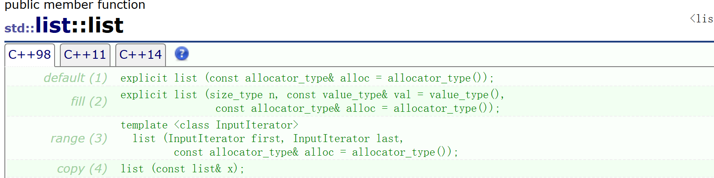
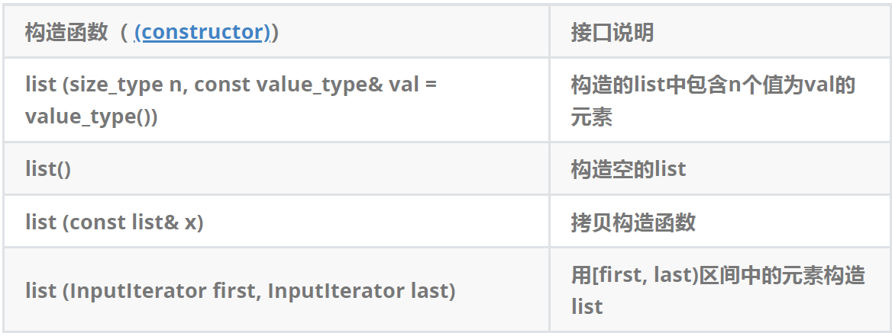
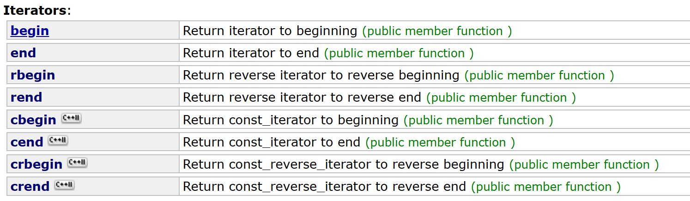
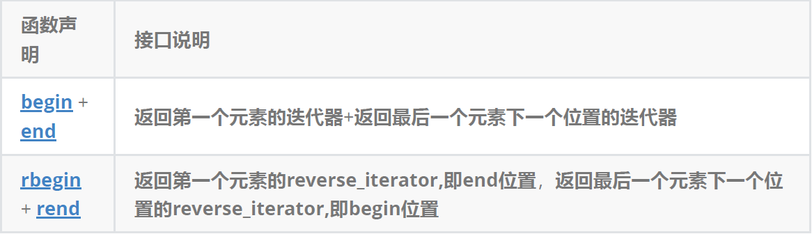
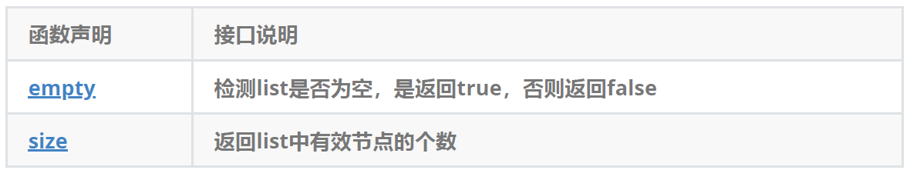
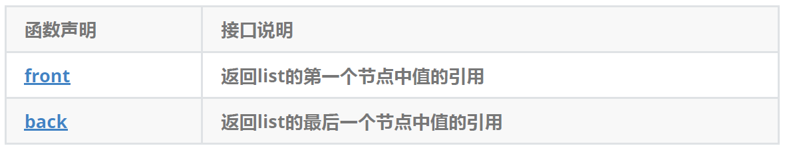
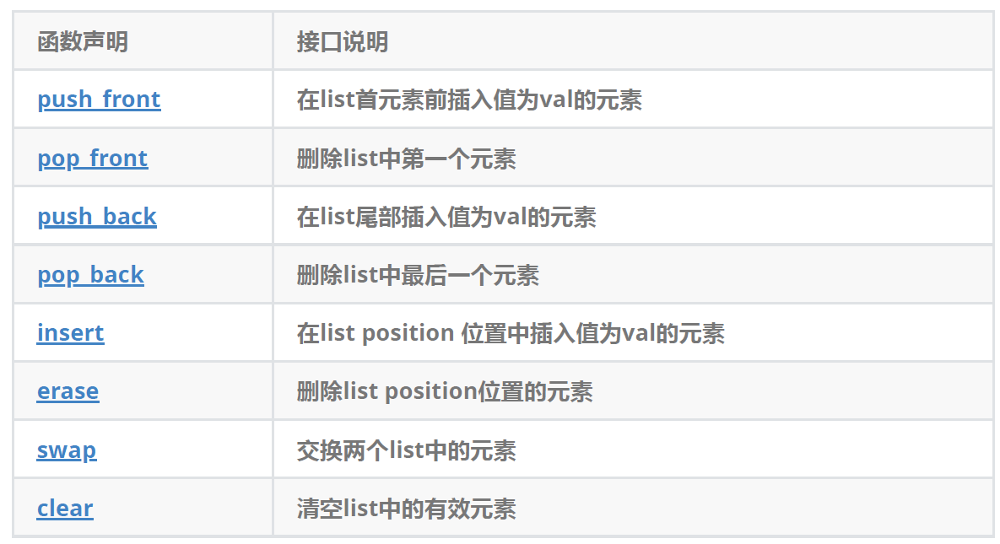

# 一、list的使用介绍
[list文档](https://legacy.cplusplus.com/reference/list/list/)

## 1.1 list的定义




## 1.2 list iterator 的使用




【注意】

1. begin与end为正向迭代器，对迭代器执行++操作，迭代器向后移动
2. rbegin(end)与rend(begin)为反向迭代器，对迭代器执行++操作，迭代器向前移动



## 1.3 list的使用
```cpp
#define _CRT_SECURE_NO_WARNINGS
#include <iostream>
#include <list>
#include <vector>
using namespace std;

////////////////////////////////////////////////////////////
// list的构造
void TestList1()
{
    list<int> l1;                         // 构造空的l1
    list<int> l2(4, 100);                 // l2中放4个值为100的元素
    list<int> l3(l2.begin(), l2.end());  // 用l2的[begin(), end()）左闭右开的区间构造l3
    list<int> l4(l3);                    // 用l3拷贝构造l4

    // 以数组为迭代器区间构造l5
    int array[] = { 16,2,77,29 };
    list<int> l5(array, array + sizeof(array) / sizeof(int));

    // 列表格式初始化C++11
    list<int> l6{ 1,2,3,4,5 };

    // 用迭代器方式打印l5中的元素
    list<int>::iterator it = l5.begin();
    while (it != l5.end())
    {
        cout << *it << " ";
        ++it;
    }       
    cout << endl;

    // C++11范围for的方式遍历
    for (auto& e : l5)
        cout << e << " ";

    cout << endl;
}

////////////////////////////////////////////////////////////
// list迭代器的使用
// 注意：遍历链表只能用迭代器和范围for
void PrintList(const list<int>& l)
{
    // 注意这里调用的是list的 begin() const，返回list的const_iterator对象
    for (list<int>::const_iterator it = l.begin(); it != l.end(); ++it)
    {
        cout << *it << " ";
        // *it = 10; 编译不通过
    }

    cout << endl;
}

void TestList2()
{
    int array[] = { 1, 2, 3, 4, 5, 6, 7, 8, 9, 0 };
    list<int> l(array, array + sizeof(array) / sizeof(array[0]));
    // 使用正向迭代器正向list中的元素
    // list<int>::iterator it = l.begin();   // C++98中语法
    auto it = l.begin();                     // C++11之后推荐写法
    while (it != l.end())
    {
        cout << *it << " ";
        ++it;
    }
    cout << endl;

    // 使用反向迭代器逆向打印list中的元素
    // list<int>::reverse_iterator rit = l.rbegin();
    auto rit = l.rbegin();
    while (rit != l.rend())
    {
        cout << *rit << " ";
        ++rit;
    }
    cout << endl;
}

////////////////////////////////////////////////////////////
// list插入和删除
// push_back/pop_back/push_front/pop_front
void TestList3()
{
    int array[] = { 1, 2, 3 };
    list<int> L(array, array + sizeof(array) / sizeof(array[0]));

    // 在list的尾部插入4，头部插入0
    L.push_back(4);
    L.push_front(0);
    PrintList(L);

    // 删除list尾部节点和头部节点
    L.pop_back();
    L.pop_front();
    PrintList(L);
}

// insert /erase 
void TestList4()
{
    int array1[] = { 1, 2, 3 };
    list<int> L(array1, array1 + sizeof(array1) / sizeof(array1[0]));

    // 获取链表中第二个节点
    auto pos = ++L.begin();
    cout << *pos << endl;

    // 在pos前插入值为4的元素
    L.insert(pos, 4);
    PrintList(L);

    // 在pos前插入5个值为5的元素
    L.insert(pos, 5, 5);
    PrintList(L);

    // 在pos前插入[v.begin(), v.end)区间中的元素
    vector<int> v{ 7, 8, 9 };
    L.insert(pos, v.begin(), v.end());
    PrintList(L);

    // 删除pos位置上的元素
    L.erase(pos);
    PrintList(L);

    // 删除list中[begin, end)区间中的元素，即删除list中的所有元素
    L.erase(L.begin(), L.end());
    PrintList(L);
}

// resize/swap/clear
void TestList5()
{
    // 用数组来构造list
    int array1[] = { 1, 2, 3 };
    list<int> l1(array1, array1 + sizeof(array1) / sizeof(array1[0]));
    PrintList(l1);

    // 交换l1和l2中的元素
    list<int> l2;
    l1.swap(l2);
    PrintList(l1);
    PrintList(l2);

    // 将l2中的元素清空
    l2.clear();
    cout << l2.size() << endl;
}
```

## 1.4 list的迭代器失效
迭代器失效即迭代器所指向的节点的无效，即该节点被删除了。因为list的底层结构为带头结点的双向循环链表，因此在list中进行插入时是不会导致list的迭代器失效的，只有在删除时才会失效，并且失效的只是指向被删除节点的迭代器，其他迭代器不会受到影响。

错误的写法：

```cpp
void TestListIterator1()
{
	int array[] = { 1, 2, 3, 4, 5, 6, 7, 8, 9, 0 };
	list<int> l(array, array + sizeof(array) / sizeof(array[0]));
	auto it = l.begin();
	while (it != l.end())
	{
		// erase()函数执行后，it所指向的节点已被删除，因此it无效，在下一次使用it时，必须先给其赋值
		l.erase(it);
		++it;
	}
}
```

改正：

```cpp
void TestListIterator()
{
	int array[] = { 1, 2, 3, 4, 5, 6, 7, 8, 9, 0 };
	list<int> l(array, array + sizeof(array) / sizeof(array[0]));
	auto it = l.begin();
	while (it != l.end())
	{
		l.erase(it++); // it = l.erase(it);
	}
}
```

# 二、list的模拟实现
## 2.1 ListNode节点的定义
```cpp
template<class T>
struct ListNode
{
	T _val;
	struct ListNode<T>* _next;
	struct ListNode<T>* _prev;
	ListNode(const T& x = T())
		:_val(x)
		, _next(nullptr)
		, _prev(nullptr)
	{
	}
};
```

## 2.2 list 的正向迭代器
迭代器有两种实现方式，具体应根据容器底层数据结构实现：

1. 原生态指针，比如：vector
2. 将原生态指针进行封装，因迭代器使用形式与指针完全相同，因此在自定义的类中必须实现以下方法
    1. 指针可以解引用，迭代器的类中必须重载operator*()
    2. 指针可以通过->访问其所指空间成员，迭代器类中必须重载oprator->()
    3. 指针可以++向后移动，迭代器类中必须重载operator++()与operator++(int)
    4. 至于operator--()/operator--(int)释放需要重载，根据具体的结构来抉择，双向链表可以向前移动，所以需要重载，如果是forward_list就不需要重载
    5. 迭代器需要进行是否相等的比较，因此还需要重载operator==()与operator!=()

这里实现我一个`list_iterator`由于const的迭代器也需要另外写，相同的代码就重复了

这里就可以写一个模板：

```cpp
template<class T,class Ref,class Ptr>
struct list_iterator
{
	typedef ListNode<T> Node;
	typedef list_iterator<T, Ref, Ptr> Self;
	Node* _node;

	list_iterator(Node* node)
		:_node(node)
	{
	}

	Ref operator*()
	{
		return _node->_val;
	}

	Ptr operator->()
	{
		return &_node->_val;
	}

	Self operator++()
	{
		_node = _node->_next;
		return *this;
	}

	Self operator++(int)
	{
		Self tmp(*this);
		_node = _node->_next;
		return tmp;
	}

	Self& operator--()
	{
		_node = _node->_prev;
		return *this;
	}

	Self operator--(int)
	{
		Self tmp(*this);
		_node = _node->_prev;
		return tmp;
	}

	bool operator!=(const Self& it) const 
	{
		return _node != it._node;
	}

	bool operator==(const Self& it) const
	{
		return _node == it._node;
	}
};
```

## 2.3 list 反向迭代器的实现
通过前面例子知道，反向迭代器的++就是正向迭代器的--，反向迭代器的--就是正向迭代器的++，因此反向迭代器的实现可以借助正向迭代器，即：反向迭代器内部可以包含一个正向迭代器，对正向迭代器的接口进行包装即可。

```cpp
template<class Iterator>
class ReverseListIterator
{
	// 注意：此处typename的作用是明确告诉编译器，Ref是Iterator类中的一个类型，而不是静态成员变量
	// 否则编译器编译时就不知道Ref是Iterator中的类型还是静态成员变量
	// 因为静态成员变量也是按照 类名::静态成员变量名 的方式访问的
public:
	typedef typename Iterator::Ref Ref;
	typedef typename Iterator::Ptr Ptr;
	typedef ReverseListIterator<Iterator> Self;
public:
	//////////////////////////////////////////////
	// 构造
	ReverseListIterator(Iterator it)
		: _it(it)
	{
	}

	//////////////////////////////////////////////
	// 具有指针类似行为
	Ref operator*()
	{
		Iterator temp(_it);
		--temp;
		return *temp;
	}

	Ptr operator->()
	{
		return &(operator*());
	}

	//////////////////////////////////////////////
	// 迭代器支持移动
	Self& operator++()
	{
		--_it;
		return *this;
	}

	Self operator++(int)
	{
		Self temp(*this);
		--_it;
		return temp;
	}

	Self& operator--()
	{
		++_it;
		return *this;
	}

	Self operator--(int)
	{
		Self temp(*this);
		++_it;
		return temp;
	}

	//////////////////////////////////////////////
	// 迭代器支持比较
	bool operator!=(const Self& l)const
	{
		return _it != l._it;
	}

	bool operator==(const Self& l)const
	{
		return _it != l._it;
	}

	Iterator _it;
};
```

## 2.4 list 的实现
```cpp
template<class T>
class list
{
	typedef ListNode<T> Node;
public:
	typedef list_iterator<T, T&, T*> iterator;
	typedef list_iterator<T, const T&, const T*> const_iterator;
	
	iterator begin() 
	{
		return iterator(_head->_next);
	}
	
	iterator end()
	{
		return iterator(_head);
	}
	
	const_iterator begin() const
	{
		return const_iterator(_head->_next);
	}
	
	const_iterator end() const 
	{
		return const_iterator(_head);
	}

	/// <summary>
	/// 构造与析构
	/// </summary>
	void empty_init(const T& val = T()) {
		_head = new Node(val);
		_head->_next = _head;
		_head->_prev = _head;

		_size = 0;
	}
	
	list()
	{
		empty_init();
	}

	list(const T& val)
	{
		empty_init(val);
	}
	
	list(size_t n, const T& val)
	{
		empty_init();
		for (size_t i = 0; i < n; i++)
		{
			push_back(val);
		}
	}

	list(const list<T>& lt) 
	 {
		empty_init();
		for (auto& e : lt)
			push_back(e);
	}

	void swap(list<T>& lt) {
		std::swap(_head, lt._head);
		std::swap(_size, lt._size);
	}

	list<T>& operator=(list<T> lt) {
		swap(lt);
		return *this;
	}

	list(initializer_list<T> lt) {
		empty_init();
		for (auto& e : lt) {
			push_back(e);
		}
	}

	void clear() {
		iterator it = begin();
		while (it != end())
		{
			it = erase(it);
		}
	}

	size_t size() const {
		return _size;
	}

	~list()
	{
		clear();
		delete _head;
		_head = nullptr;
	}

	/// <summary>
	/// 增删查改
	/// </summary>

	void insert(iterator pos, const T& val) {
		Node* cur = pos._node;
		Node* prev = cur->_prev;
		Node* newnode = new Node(val);
		prev->_next = newnode;
		newnode->_prev = prev;
		newnode->_next = cur;
		cur->_prev = newnode;

		++_size;
	}

	iterator erase(iterator pos) {
		assert(pos != end());
		Node* cur = pos._node;
		Node* prev = cur->_prev;
		Node* next = cur->_next;
		prev->_next = next;
		next->_prev = prev;

		delete cur;
		cur = nullptr;

		--_size;
		return iterator(next);
	}

	void push_back(const T& val) {
		insert(end(), val);
	}
	
	void push_front(const T& val) {
		insert(begin(), val);
	}

	void pop_back() {
		erase(--end());
	}
	
	void pop_front() {
		erase(begin());
	}

private:
	Node* _head;
	size_t _size;
};
```

