# 一、stack
[stack文档](https://legacy.cplusplus.com/reference/stack/stack/)

## 1.1 stack的介绍
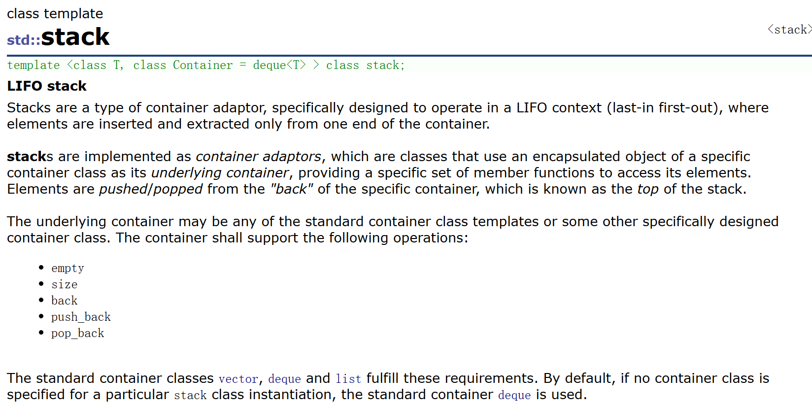

## 1.2 stack的使用
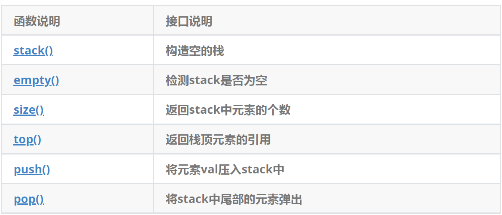

### 最小栈
[155. 最小栈 - 力扣（LeetCode）](https://leetcode.cn/problems/min-stack/)

```cpp
class MinStack {
public:
    MinStack() {}

    void push(int val) {
        // 如果为空入小栈，或者比第一个值小就入
        if (minst.empty() || val <= minst.top())
            minst.push(val);
        st.push(val);
    }

    void pop() {
        if (minst.top() == st.top())
            minst.pop();
        st.pop();
    }

    int top() { return st.top(); }

    int getMin() { return minst.top(); }

private:
    stack<int> st;
    stack<int> minst;
};
```

### <font style="color:rgb(51, 51, 51);">栈的压入、弹出序列</font>
[栈的压入、弹出序列_牛客题霸_牛客网](https://www.nowcoder.com/practice/d77d11405cc7470d82554cb392585106?tpId=13&&tqId=11174&rp=1&ru=/activity/oj&qru=/ta/coding-interviews/question-ranking)

```cpp
class Solution {
public:
    bool IsPopOrder(vector<int>& pushV, vector<int>& popV) {
        int popi = 0;
        stack<int> st;
        for (auto& e : pushV) {
            st.push(e);
            // 栈不能为空且popV的值与栈顶相等就pop，然后比较下一个
            while (!st.empty() && popV[popi] == st.top()) {
                st.pop();
                popi++;
            }
        }
        // 最后看栈里还有没有元素
        return st.empty();
    }
};
```

### 用栈实现队列
[232. 用栈实现队列 - 力扣（LeetCode）](https://leetcode.cn/problems/implement-queue-using-stacks/)

```cpp
class MyQueue {
private:
    stack<int> pushst;
    stack<int> popst;

public:
    MyQueue() {}

    void push(int x) { pushst.push(x); }

    int pop() {
        int top = peek();
        popst.pop();
        return top;
    }
    // 取队头
    int peek() {
        if (popst.empty()) {
            while (!pushst.empty()) {
                popst.push(pushst.top());
                pushst.pop();
            }
        }
        int top = popst.top();
        return top;
    }

    bool empty() { return pushst.empty() && popst.empty(); }
};
```

## 1.3 stack的模拟实现
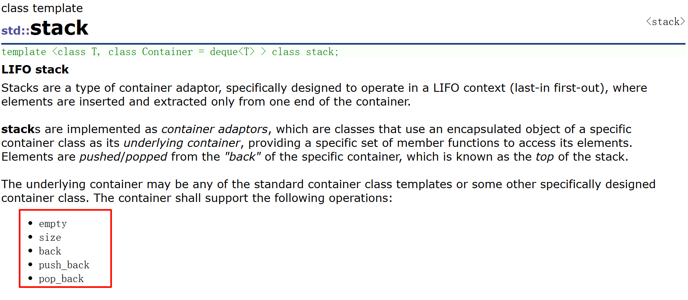

+ 从栈的接口中可以看出，栈实际是一种特殊的`vector`，因此使用`vector`完全可以模拟实现stack。

```cpp
template<class T, class Con = vector<T>>
class stack
{
public:
	void push(const T& x) {
		_con.push_back(x);
	}

	void pop() {
		_con.pop_back();
	}

	T& top() {
    	return _con.back();
    }

	const T& top() const {
		return _con.back();
	}

	size_t size() const {
		return _con.size();
	}

	bool empty() const {
		return _con.empty();
	}

private:
	Con _con;
};
```

# 二、queue
[queue文档](https://legacy.cplusplus.com/reference/queue/queue/)

## 2.1 queue的介绍
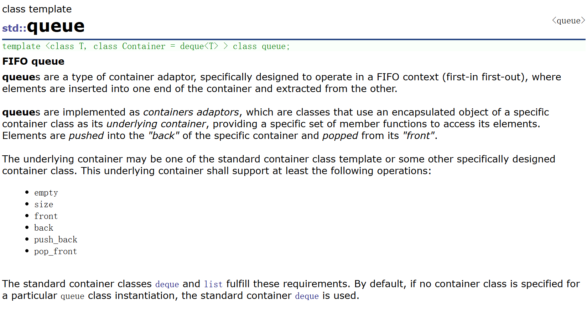

## 2.2 queue的使用
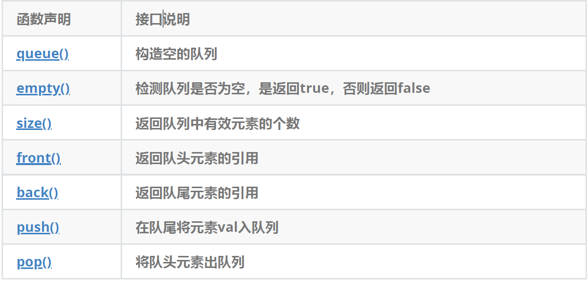

### 用队列实现栈
[225. 用队列实现栈 - 力扣（LeetCode）](https://leetcode.cn/problems/implement-stack-using-queues/)

```cpp
class MyStack {
private:
    queue<int> q;

public:
    MyStack() {}

    void push(int x) { q.push(x); }

    int pop() {
        // 先取队列的所有元素
        int size = q.size();
        // 然后再把size-1个元素全部再重新入队
        while (size-- > 1) {
            q.push(q.front());
            q.pop();
        }
        // 剩下的一个就是要返回的值
        int top = q.front();
        q.pop();
        return top;
    }

    int top() { return q.back(); }

    bool empty() { return q.empty(); }
};
```

## 2.3 queue的模拟实现
因为queue的接口中存在头删和尾插，因此使用vector来封装效率太低，故可以借助list来模拟实现queue，具体如下：

```cpp
template<class T, class Con = list<T>>
class queue
{
public:
	void push(const T& x) {
		_con.push_back(x);
	}

	void pop() {
		_con.pop_front();
	}

	const T& front() {
		return _con.front();
	}

	const T& back() {
		return _con.back();
	}

	size_t size() const {
		return _con.size();
	}
	
	bool empty() const {
		return _con.empty();
	}
private:
	Con _con;
};
```

# 三、priority_queue
## 1.1 priority_queue的介绍
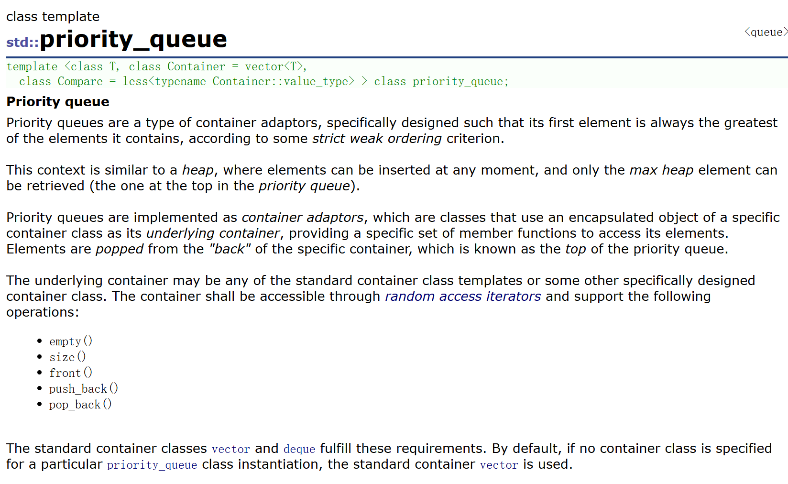

## 1.2 priority_queue的使用
优先级队列默认使用vector作为其底层存储数据的容器，在vector上又使用了堆算法将vector中元素构造成堆的结构，因此priority_queue就是堆，所有需要用到堆的位置，都可以考虑使用`priority_queue`。注意：默认情况下priority_queue是**大堆**。

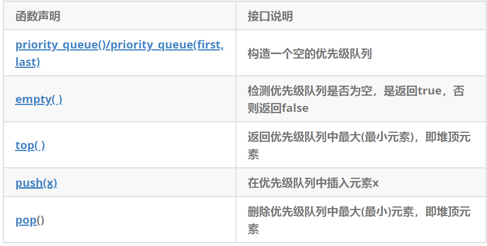

+ 默认情况下，priority_queue是大堆。

```cpp
#include <vector>
#include <queue>
#include <functional> // greater算法的头文件
void TestPriorityQueue()
{
	// 默认情况下，创建的是大堆，其底层按照小于号比较
	vector<int> v{ 3,2,7,6,0,4,1,9,8,5 };
	priority_queue<int> q1;
	for (auto& e : v)
		q1.push(e);
	cout << q1.top() << endl;
	// 如果要创建小堆，将第三个模板参数换成greater比较方式
	priority_queue<int, vector<int>, greater<int>> q2(v.begin(), v.end());
	cout << q2.top() << endl;
}
```

+ 如果在priority_queue中放自定义类型的数据，用户需要在自定义类型中提供`>`或者`<`的重载。

```cpp
class Date
{
public:
	Date(int year = 1900, int month = 1, int day = 1)
		: _year(year)
		, _month(month)
		, _day(day)
	{
	}
	bool operator<(const Date& d)const
	{
		return (_year < d._year) ||
			(_year == d._year && _month < d._month) ||
			(_year == d._year && _month == d._month && _day < d._day);
	}
	bool operator>(const Date& d)const
	{
		return (_year > d._year) ||
			(_year == d._year && _month > d._month) ||
			(_year == d._year && _month == d._month && _day > d._day);
	}
	friend ostream& operator<<(ostream& _cout, const Date& d)
	{
		_cout << d._year << "-" << d._month << "-" << d._day;
		return _cout;
	}
private:
	int _year;
	int _month;
	int _day;
};

void TestPriorityQueue()
{
	// 大堆，需要用户在自定义类型中提供<的重载
	priority_queue<Date> q1;
	q1.push(Date(2025, 10, 29));
	q1.push(Date(2025, 10, 28));
	q1.push(Date(2025, 10, 30));
	cout << q1.top() << endl;
	// 如果要创建小堆，需要用户提供>的重载
	priority_queue<Date, vector<Date>, greater<Date>> q2;
	q2.push(Date(2025, 10, 29));
	q2.push(Date(2025, 10, 28));
	q2.push(Date(2025, 10, 30));
	cout << q2.top() << endl;
}
```

## 1.3 使用仿函数
如果要比较的是日期类是new出来的，我们就需要用户提供一个仿函数来解决：

```cpp
struct LessPDate
{
	bool operator()(Date* d1, Date* d2)
	{
		return *d1 < *d2;
	}
};
struct GreaterPDate
{
	bool operator()(Date* d1, Date* d2)
	{
		return *d1 > *d2;
	}
};

void TestPriorityQueue1() {

	// 如果要创建大堆，并且是在堆上创建的，就需要使用仿函数
	//priority_queue<Date*, vector<Date*>, LessPDate> q1;
	
	// 创建小堆
	priority_queue<Date*, vector<Date*>, GreaterPDate> q1;
	q1.push(new Date(2025, 10, 29));
	q1.push(new Date(2025, 10, 28));
	q1.push(new Date(2025, 10, 30));
	while (!q1.empty())
	{
		std::cout << ' ' << *q1.top();
		q1.pop();
	}
	std::cout << '\n';
}
```

### 数组中第K个大的元素
[215. 数组中的第K个最大元素 - 力扣（LeetCode）](https://leetcode.cn/problems/kth-largest-element-in-an-array/description/)

```cpp
class Solution {
public:
    int findKthLargest(vector<int>& nums, int k) {
        // 将数组中的元素先放入优先级队列中
        priority_queue<int> pq(nums.begin(), nums.end());
        // 将优先级队列中前k-1个元素删除掉
        for (int i = 0; i < k - 1; i++)
            pq.pop();
        return pq.top();
    }
};
```

## 1.4 priority_queue的模拟实现
```cpp
#pragma once
#include <iostream>
#include <deque>
#include <vector>
using namespace std;

namespace lsl 
{
	template<class T>
	struct Less {
		bool operator()(const T& x, const T& y)
		{
			return x < y;
		}
	};

	template<class T>
	struct Greater {
		bool operator()(const T& x, const T& y)
		{
			return x > y;
		}
	};
	
	template<class T,class Container = std::vector<T>, class Compare = Less<T>>
	class priority_queue
	{
	public:
		priority_queue() = default;

		template<class Iterator>
		priority_queue(Iterator first, Iterator last)
			: _con(first, last)
		{
			// 将_con中的元素调整成堆的结构
			int count = _con.size();
			int root = ((count - 2) >> 1);
			for (; root >= 0; root--)
				AdjustDown(root);
		}

		void push(const T& x) {
			_con.push_back(x);
			AsjustUp(_con.size() - 1);
		}

		void pop() {
			if (empty())
				return;

			std::swap(_con[0], _con[_con.size() - 1]);
			_con.pop_back();
			AdjustDown(0);
		}

		const T& top() const {
			return _con.front();
		}

		size_t size() const {
			return _con.size();
		}

		bool empty() const {
			return _con.empty();
		}

	private:
		void AsjustUp(size_t child) {
			Compare com;
			size_t parent = (child - 1) / 2;

			while (child > 0)
			{
				if (com(_con[parent], _con[child]))
				{
					std::swap(_con[child], _con[parent]);
					child = parent;
					parent = (child - 1) / 2;
				}
				else
					break;
			}
		}

		void AdjustDown(size_t parent) {
			Compare com;
			size_t child = parent * 2 + 1;

			while (child < _con.size())
			{
				if (child + 1 < _con.size() && com(_con[child], _con[child + 1]))
					++child;
				if (com(_con[parent], _con[child]))
				{
					std::swap(_con[child], _con[parent]);
					parent = child;
					child = parent * 2 + 1;
				}
				else break;
			}
		}

		Container _con;
	};
}
```

# 四、容器适配器
### 4.1 什么是适配器
适配器是一种设计模式(设计模式是一套被反复使用的、多数人知晓的、经过分类编目的、代码设计经验的总结)，该种模式是将一个类的接口转换成客户希望的另外一个接口。

### 4.2 STL标准库中stack和queue的底层结构
虽然stack和queue中也可以存放元素，但在STL中并没有将其划分在容器的行列，而是将其称为容器适配器，这是因为stack和队列只是对其他容器的接口进行了包装，STL中stack和queue默认使用deque，比如：

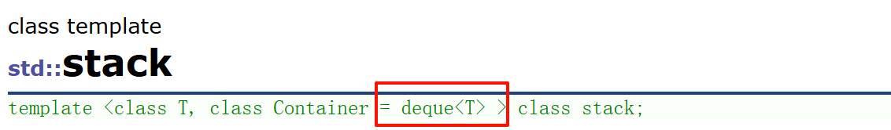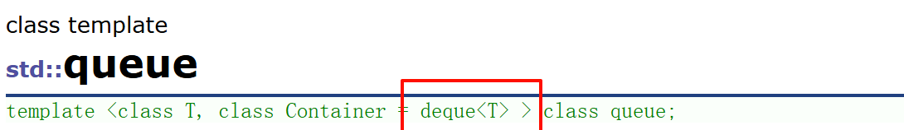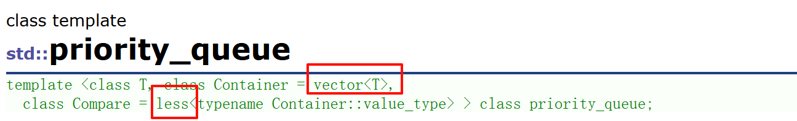

# 五、deque的简单介绍
## 5.1 deque的原理介绍
deque(双端队列)：是一种双开口的"连续"空间的数据结构，双开口的含义是：可以在头尾两端进行插入和删除操作，且时间复杂度为O(1)，与vector比较，头插效率高，不需要搬移元素；与list比较，空间利用率比较高。

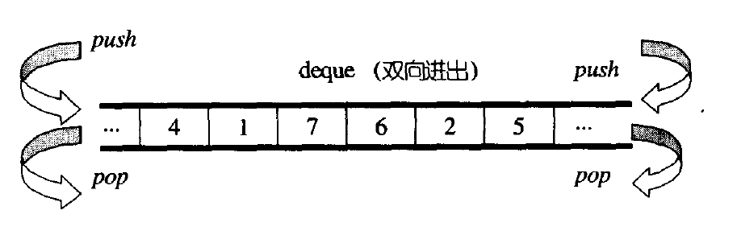

deque并不是真正连续的空间，而是由一段段连续的小空间拼接而成的，实际deque类似于一个动态的二维数组，其底层结构如下图所示：

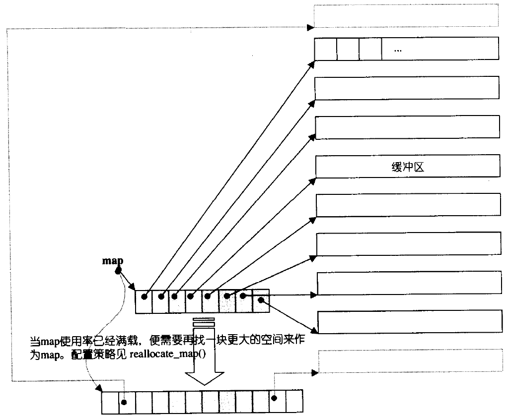

双端队列底层是一段假象的连续空间，实际是分段连续的，为了维护其“整体连续”以及随机访问的假象，落在了deque的迭代器身上，因此deque的迭代器设计就比较复杂，如下图所示：

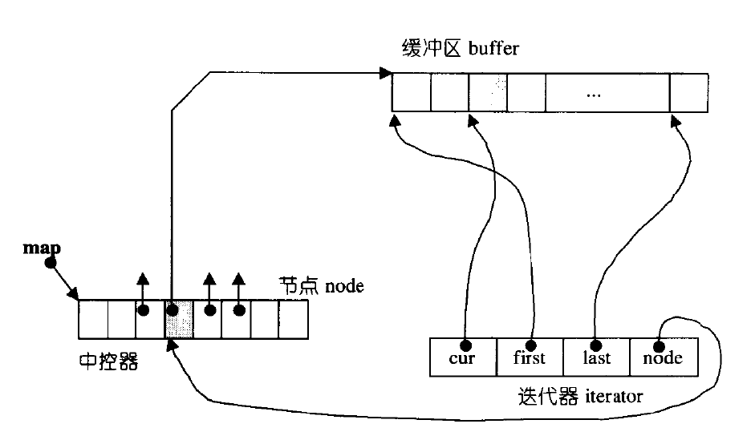

> 那deque是如何借助其迭代器维护其假想连续的结构呢？
>

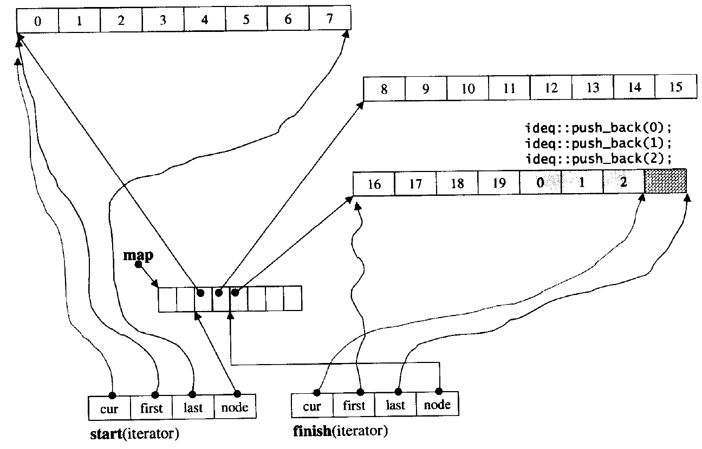

## 5.2 deque的缺陷
+ 与vector比较，deque的优势是：头部插入和删除时，不需要搬移元素，效率特别高，而且在扩容时，也不需要搬移大量的元素，因此其效率是必vector高的。
+ 与list比较，其底层是连续空间，空间利用率比较高，不需要存储额外字段。但是，deque有一个致命缺陷：**不适合遍历，因为在遍历时，deque的迭代器要频繁的去检测其是否移动到某段小空间的边界，导致效率低下**，而序列式场景中，可能需要经常遍历，因此在实际中，需要线性结构时，大多数情况下优先考虑vector和list，deque的应用并不多，而目前能看到的一个应用就是，STL用其作为stack和queue的底层数据结构。

## 5.3 为什么选择deque作为stack和queue的底层默认容器
stack是一种后进先出的特殊线性数据结构，因此只要具有push_back()和pop_back()操作的线性结构，都可以作为stack的底层容器，比如vector和list都可以；queue是先进先出的特殊线性数据结构，只要具有push_back和pop_front操作的线性结构，都可以作为queue的底层容器，比如list。但是STL中对stack和queue默认选择deque作为其底层容器，主要是因为：

1. stack和queue不需要遍历(因此stack和queue没有迭代器)，只需要在固定的一端或者两端进行操作。
2. 在stack中元素增长时，deque比vector的效率高(扩容时不需要搬移大量数据)；queue中的元素增长时，deque不仅效率高，而且内存使用率高。结合了deque的优点，而完美的避开了其缺陷。

## 5.4 STL标准库中对于stack的模拟实现
```cpp
#include <deque>
namespace lsl
{
	template<class T, class Con = deque<T>>
	//template<class T, class Con = vector<T>>
	//template<class T, class Con = list<T>>
	class stack
	{
	public:
		stack() {}
		void push(const T& x) { _c.push_back(x); }
		void pop() { _c.pop_back(); }
		T& top() { return _c.back(); }
		const T& top()const { return _c.back(); }
		size_t size()const { return _c.size(); }
		bool empty()const { return _c.empty(); }
	private:
		Con _c;
	};
}
```

## 5.5 STL标准库中对于queue的模拟实现
```cpp
#include <deque>
#include <list>
namespace bite
{
	template<class T, class Con = deque<T>>
	//template<class T, class Con = list<T>>
	class queue
	{
	public:
		queue() {}
		void push(const T& x) { _c.push_back(x); }
		void pop() { _c.pop_front(); }
		T& back() { return _c.back(); }
		const T& back()const { return _c.back(); }
		T& front() { return _c.front(); }
		const T& front()const { return _c.front(); }
		size_t size()const { return _c.size(); }
		bool empty()const { return _c.empty(); }
	private:
		Con _c;
	};
}
```


