## 一、为什么学习string类？
### 1.1 C语言中的字符串
C语言中，字符串是以'\0'结尾的一些字符的集合，为了操作方便，C标准库中提供了一些str系列的库函数，但是这些库函数与字符串是分离开的，不太符合OOP的思想，而且底层空间需要用户自己管理，稍不留神可能还会越界访问。

## 二、准库中的string类
### 2.2 string类
[string文档](https://legacy.cplusplus.com/reference/string/string/?kw=string)

1. string是表示字符串的字符串类
2. 该类的接口与常规容器的接口基本相同，再添加了一些专门用来操作string的常规操作。
3. string在底层实际是：basic_string模板类的别名，typedef basic_string<char, char_traits, allocator>string;
4. 不能操作多字节或者变长字符的序列。

在**使用string类时，必须包含#include头文件或者using namespace std;**

### 2.3 string类的常用接口说明
string类对象的常见构造：[文档说明](https://legacy.cplusplus.com/reference/string/string/string/)

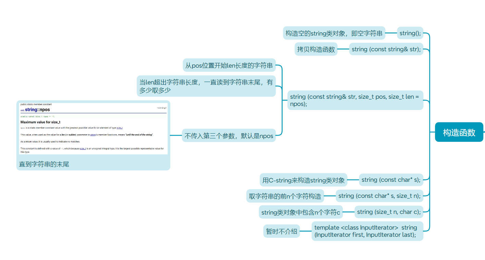

+ 下面就可以这样使用

```cpp
int main()
{
    string s0;
    string s1("hello world");
    string s2(s1);
    string s3(s1, 5, 3);
    string s4(s1, 5, 10);
    string s5(s1, 5);

    cout << s0 << endl;
    cout << s1 << endl;
    cout << s2 << endl;
    cout << s3 << endl;
    cout << s4 << endl;
    cout << s5 << endl;

    string s6(10, '#');
    cout << s6 << endl;
    
    s0 = s6;
    cout << s0 << endl;
    
    return 0;
}
```

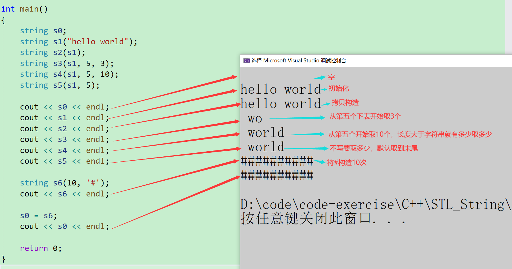

### 2.4 string类对象的容量操作
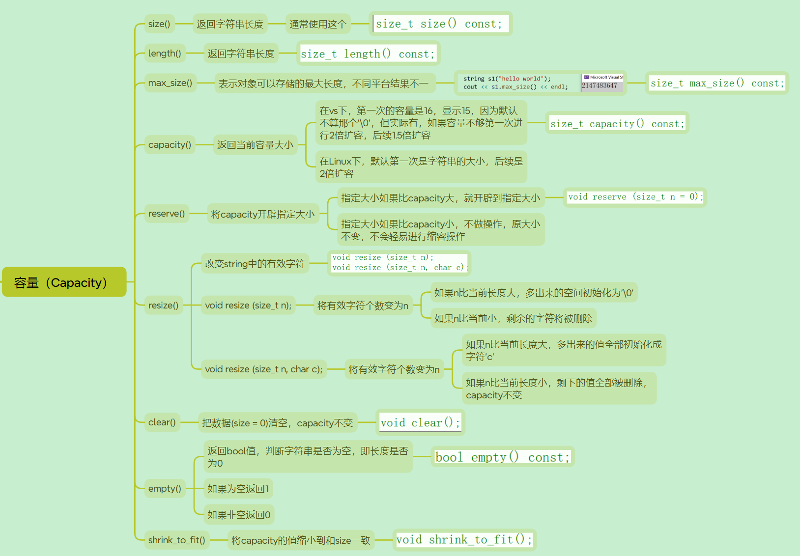

+ size()与length()方法底层实现原理完全相同，引入size()的原因是为了与其他容器的接口保持一 致，一般情况下基本都是用size()。

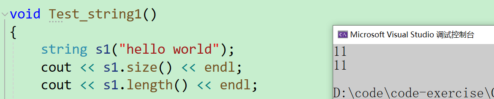

+ max_size()是返回最大存放多少个字符
+ 每个平台可能不一样

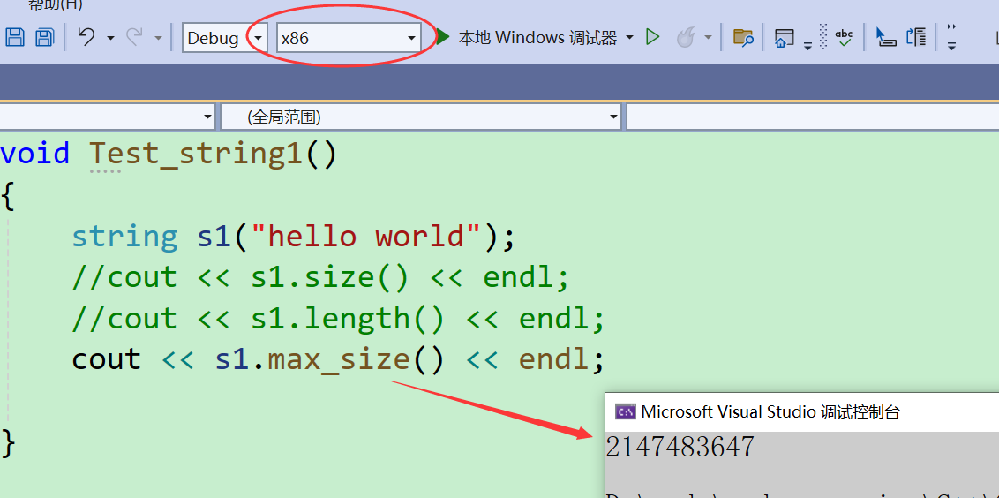

+ 大家可以看这里的测试，第一次是`15`，第二次是2倍扩容，第三次，第四次...都是1.5倍扩容

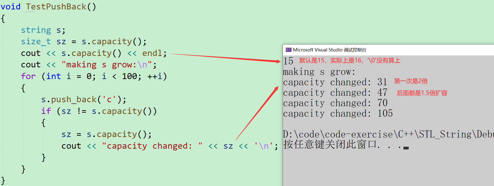

+ 在linux平台下，默认从0开始，后续从2倍扩容

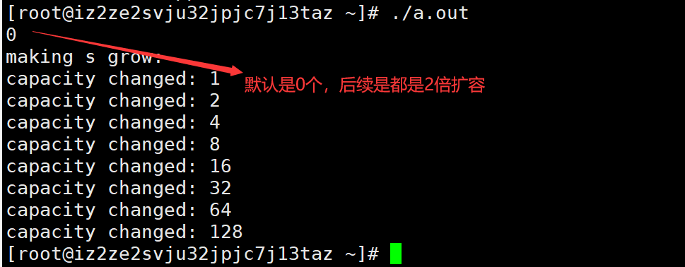

+ reserve(size_t res_arg=0)：为string预留空间，不改变有效元素个数，当reserve的参数小于string的底层空间总大小时，reserver不会改变容量大小。

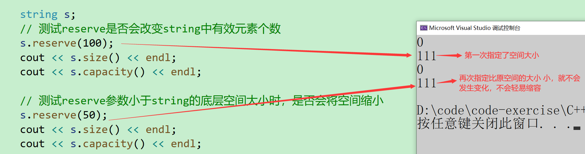

+ resize(size_t n) 与 resize(size_t n, char c)都是将字符串中有效字符个数改变到n个，不同的是当字 符个数增多时：resize(n)用0来填充多出的元素空间，resize(size_t n, char c)用字符c来填充多出的 元素空间。注意：resize在改变元素个数时，如果是将元素个数增多，可能会改变底层容量的大小，如果是将元素个数减少，底层空间总大小不变。

```cpp
void Teststring3()
{
    // 注意：string类对象支持直接用cin和cout进行输入和输出
    string s("hello, world!!!");
    cout << s.size() << endl;
    cout << s.length() << endl;
    cout << s.capacity() << endl;
    cout << s << endl;

    // 将s中的字符串清空，注意清空时只是将size清0，不改变底层空间的大小
    s.clear();
    cout << s.size() << endl;
    cout << s.capacity() << endl;

    // 将s中有效字符个数增加到10个，多出位置用'a'进行填充
    // “aaaaaaaaaa”
    s.resize(10, 'a');
    cout << s.size() << endl;
    cout << s.capacity() << endl;

    // 将s中有效字符个数增加到15个，多出位置用缺省值'\0'进行填充
    // "aaaaaaaaaa\0\0\0\0\0"
    // 注意此时s中有效字符个数已经增加到15个
    s.resize(15);
    cout << s.size() << endl;
    cout << s.capacity() << endl;
    cout << s << endl;

    // 将s中有效字符个数缩小到5个
    s.resize(5);
    cout << s.size() << endl;
    cout << s.capacity() << endl;
    cout << s << endl;
}
```

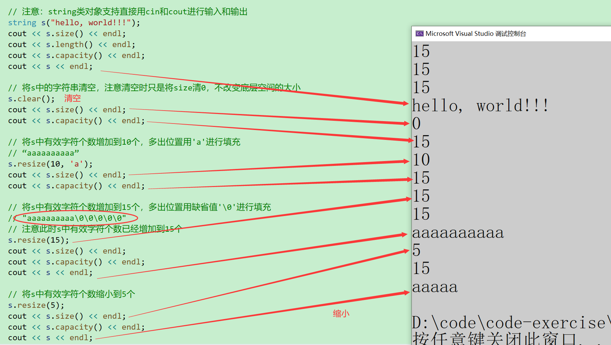

+ 判断字符串是否为空

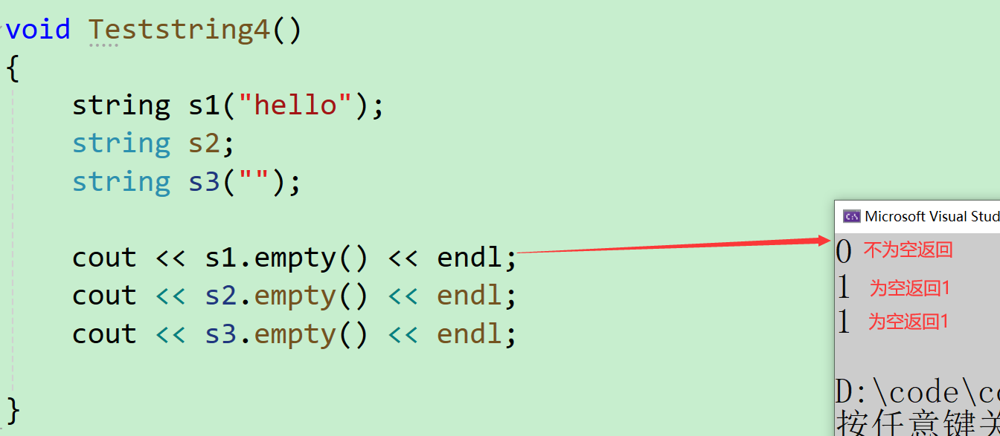

+ 将`capacity`缩小适合大小
+ 在vs下是缩小到刚刚说的倍数上

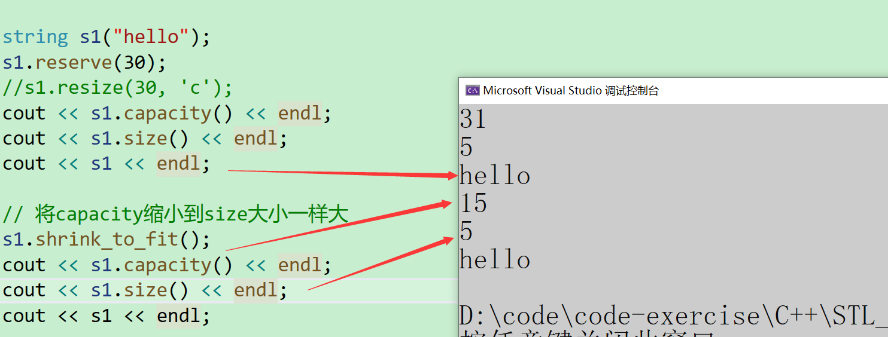

+ 在Linux下是缩小到size大小

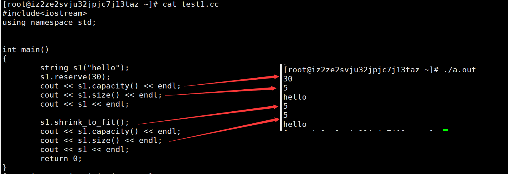

### 2.5 string类对象的访问及遍历操作
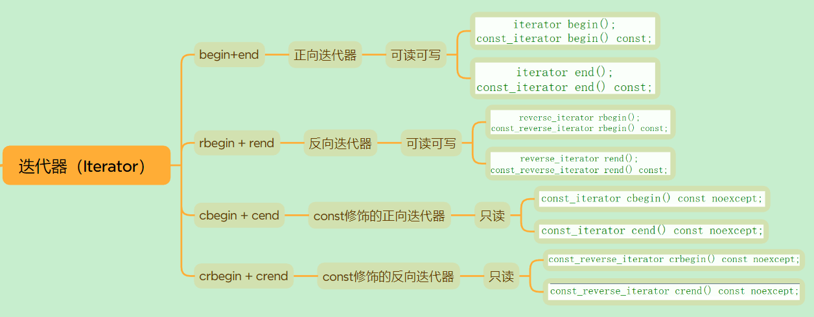

+ 对于元素的访问操作我们有四种方式`begin()+end()`   `for` `[]`  `范围for(C++11支持)`

```cpp
void Teststring7()
{
    string s1("hello world");
    const string s2("Hello world");
    cout << s1 << " " << s2 << endl;
    cout << s1[0] << " " << s2[0] << endl;

    s1[0] = 'H';
    cout << s1 << endl;

    // s2[0] = 'h';   代码编译失败，因为const类型对象不能修改
}
```

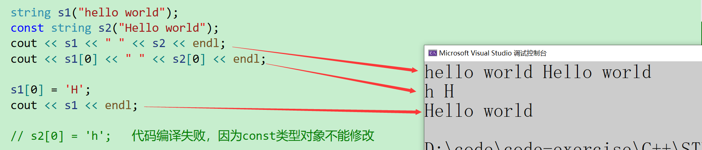

```cpp
void Teststring6()
{
    string s("hello world");
    // 1. for+operator[]
    for (size_t i = 0; i < s.size(); ++i)
        cout << s[i] << ' ';
    cout << endl;

    // 2.迭代器
    string::iterator it = s.begin();
    while (it != s.end())
    {
        cout << *it << ' ';
        ++it;
    }
    cout << endl;


    // string::reverse_iterator rit = s.rbegin();
    // C++11之后，直接使用auto定义迭代器，让编译器推到迭代器的类型
    auto rit = s.rbegin();
    while (rit != s.rend()) {
        cout << *rit << ' ';
        ++rit;
    }
    cout << endl;


    // 3.范围for
    for (auto ch : s)
        cout << ch << ' ';
    cout << endl;

}
```

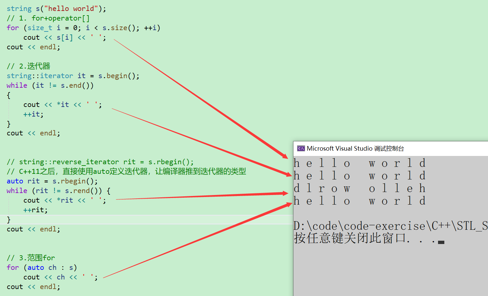

### 2.5 string类对象的修改操作
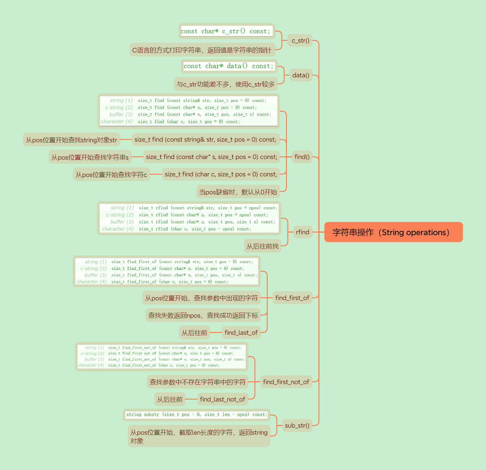

+ c_str和data使用差不多，但是c_str使用较多
+ 在比较的时候`==`是用的一个重载，而使用c_str比较是比较地址

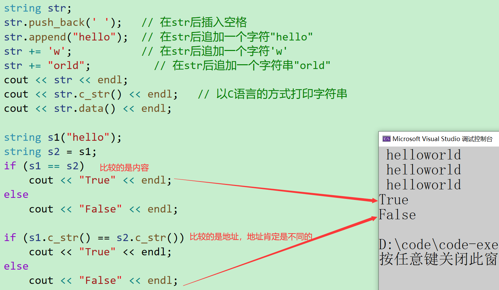

+ 案例一：

找后缀

```cpp
// 获取file的后缀
string file("string.cpp");
// 从后往前找 '.'
size_t pos = file.rfind('.');
// 截取从pos位置开始到最后
string suffix(file.substr(pos,file.size() - pos));
cout << suffix << endl;
```

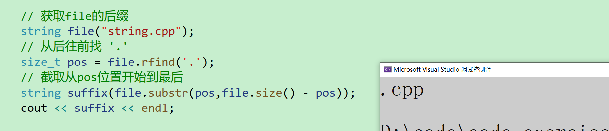

+ 案例二：

获取url中的协议

用find查找`.`，然后再使用substr截取字符串

```cpp
string url("https://www.cplusplus.com/reference/string/string/find/");
cout << url << endl;

size_t n = url.find(':');
if (n == string::npos)
{
    cout << "invalid url" << endl;
    return;
}
string protocol = url.substr(0, n);
cout << protocol << endl;
cout << url.substr(0, n) << endl;
```

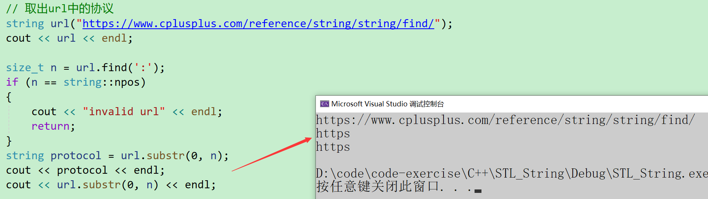

+ 获取url中的域名

```cpp
size_t start = url.find("://");
if (start == string::npos)
{
    cout << "invalid url" << endl;
    return;
}
start += 3; // 跳过 ://
size_t finish = url.find('/', start);
string address = url.substr(start, finish - start);
cout << address << endl;
cout << url.substr(start, finish - start) << endl;
```

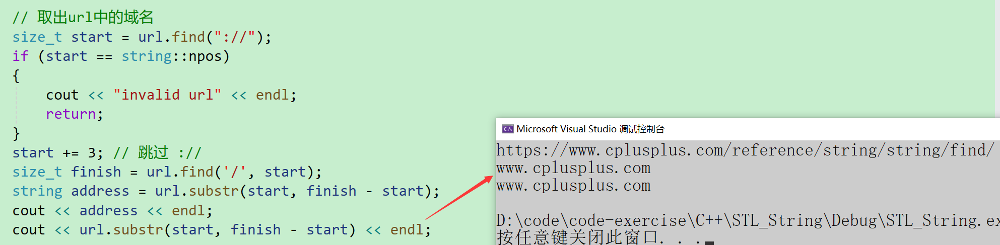

+ 删除url的协议前缀

```cpp
size_t pos = url.find("://");
url.erase(0, pos + 3);
cout << url << endl;
```

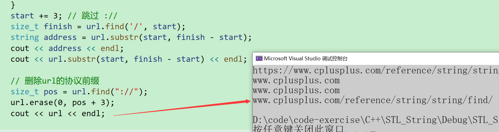

find_first_of

+ 查找字符串中的包含所有字符

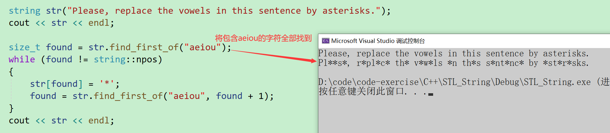

find_first_not_of

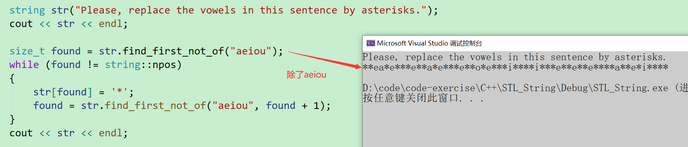

后面的last就是从后往前找

### 2.7 string类非成员函数
+ 这里比较重要的是`getline()`
+ 这个和C语言中的gets差不多，读一行，读到`\n`后停止
+ 这个还多一个功能，就是可以指定读到什么字符后停止

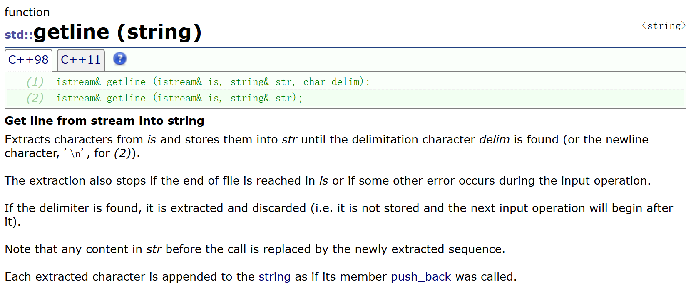

## 三、模拟实现string
> 这里我使用声明和定义分离来实现
>

### my_string.h
核心方法如下：

```cpp
#pragma once

#include <iostream>
#include <string.h>
#include <assert.h>

using namespace std;

namespace lsl 
{
	class string {
		const static size_t npos = -1;
	public:
		typedef char* iterator;
		typedef const char* const_iterator;
		iterator begin();
		const_iterator begin() const;
		iterator end();
		const_iterator end() const;

		// 字符串构造
		string(const char* = "");
		// 构造n个字符
		string(size_t n, char ch);
		// 拷贝构造
		string(const string& s);
		~string();
		
		char* c_str() {
			return _str;
		}
		
		//string& operator=(const string& s);
		string& operator=(string s);
		void reserve(size_t n);
		void push_back(char ch);
		void append(const char* str);
		string& operator+=(const char* s);
		string& operator+=(char ch);
		void insert(size_t pos, size_t n, char ch);
		void insert(size_t pos, const char* str);
		void erase(size_t pos,size_t len = npos);
		size_t find(char ch,size_t pos = 0);
		string substr(size_t pos, size_t len = npos);
		bool operator==(const string& s) const;
		bool operator!=(const string& s) const;
		bool operator<(const string& s) const;
		bool operator<=(const string& s) const;
		bool operator>(const string& s) const;
		bool operator>=(const string& s) const;
		void clear();
		void swap(string& s);

	private:
		char* _str = nullptr;
		size_t _size = 0;
		size_t _capacity = 0;
	};
	ostream& operator<<(ostream& out, const string& s);
	istream& operator>>(istream& in, string& s);
	istream& getline(istream& in, string& s, char delim = '\n');
}
```

### my_string.c
#### 迭代器的实现
+ begin和end实现很简单，直接返回`_str`和`_str+_size`

```cpp
string::iterator string::begin() {
	return _str;
}
string::const_iterator string::begin() const {
	return _str;
}
string::iterator string::end() {
	return _str + _size;
}
string::const_iterator string::end() const {
	return _str + _size;
}
```

#### 构造
##### 直接字符串构造
+ s1("hello");

```cpp
string::string(const char* str)
	:_size(strlen(str))
{
	_capacity = _size;
	_str = new char[_size + 1];
	strcpy(_str, str);
}
```

##### 构造n个字符
+ s1(5,'x');

```cpp
string::string(size_t n, char ch)
	:_str(new char[n + 1])
	, _size(n)
	,_capacity(n)
{
	for (size_t i = 0; i < n; i++)
	{
		_str[i] = ch;
	}
	_str[_size] = '\0';
}
```

##### 构造一个string对象
+ s1(s2);

传统写法：

```cpp
string::string(const string& s) {
    _str = new char[s._capacity + 1];
    strcpy(_str, s._str);
    _capacity = s._capacity;
    _size = s._size;
}
```

现代写法：

+ 直接复用，先构造一个临时对象，再将临时对象和this进行交换

```cpp
void string::swap(string& s) {
    swap(_str, s._str);
    swap(_size, s._size);
    swap(_capacity, s._capacity);
}
// 现代写法
string::string(const string& s) {
    string tmp(s._str);
    swap(tmp);
}
```

#### 赋值重载
```cpp
string& string::operator=(const string& s) {
    if (this != &s) {
        _str = new char[s._capacity + 1];
        strcpy(_str, s._str);
        _capacity = s._capacity;
        _size = s._size;
    }
    return *this;
}
```

这个也可以使用现代写法，直接复用：

```cpp
string& string::operator=(const string& s) {
	if (this != &s) {
    	string tmp(s);
    	swap(tmp);
      }
}
```

还可以进行改进：

+ 注意这里的参数不要加引用，直接传值，然后使用swap进行交换，形参的临时对象在出了作用域就销毁了，而this就是我们想要的值

```cpp
string& string::operator=(string s) {
	swap(s);
	return *this;
}
```

#### reserve
```cpp
void string::reserve(size_t n) {
	if (n > _capacity)
	{
		char* tmp = new char[n + 1];
		strcpy(tmp, _str);
		delete[] _str;
		_str = tmp;
		_capacity = n;
	}
}
```

#### push_back
```cpp
void string::push_back(char ch) {
	if (_size + 1 > _capacity)
		reserve(_capacity == 0 ? 4 : _capacity * 2);
	_str[_size++] = ch;
	_str[_size] = '\0';
}
```

#### append
+ 如果`_str`字符串的长度+str的长度大于容量就进行扩容
+ 如果这个`str`的字符串都比2倍大，那就要多少扩多少

```cpp
void string::append(const char* str) {
	assert(str);
	size_t len = strlen(str);
	if (_size + len > _capacity) { // 如果_str字符串的长度+str的长度大于容量就进行扩容
		// 扩容
		size_t newcapacity = 2 * _capacity;
		if (_size + len > 2 * _capacity) { // 如果这个str的字符串都比2倍大，那就要多少扩多少
			newcapacity = _size + len;
		}
		reserve(newcapacity);
	}
	strcpy(_str + _size, str);
	_size += len;
}
```

#### operator+=
```cpp
string& string::operator+=(char ch) {
	push_back(ch);
	return *this;
}
```

#### insert
##### 在pos位置插入n和字符
+ 这里首先检查要插入的数据
+ 在挪动数据的时候要注意`size_t`类型的转换

```cpp
void string::insert(size_t pos, size_t n, char ch) {
	assert(pos <= _size);
	assert(n > 0);
	if (_size + n > _capacity)
	{
		// 扩容
		size_t newcapacity = 2 * _capacity;
		if (_size + n > 2 * _capacity)
			newcapacity = _size + n;
		reserve(newcapacity);
	}
	// 挪动数据
	size_t end = _size + n;
	while (end > pos + n - 1)
	{
		_str[end] = _str[end - n];
		end--;
	}
	for (size_t i = 0; i < n; i++)
	{
		_str[pos + i] = ch;
	}
	_size += n;
}
```

##### 在pos位置插入一个字符串
```cpp
void string::insert(size_t pos, const char* str) {
	assert(pos <= _size);
	size_t n = strlen(str);

	if (_size + n > _capacity)
	{
		// 扩容
		size_t newcapacity = 2 * _capacity;
		if (_size + n > 2 * _capacity)
			newcapacity = _size + n;
		reserve(newcapacity);
	}
	// 挪动数据
	size_t end = _size + n;
	while (end > pos + n - 1)
	{
		_str[end] = _str[end - n];
		end--;
	}
	// 覆盖数据
	for (size_t i = 0; i < n; i++)
	{
		_str[pos + i] = str[i];
	}
	_size += n;
}
```

#### erase
```cpp
void string::erase(size_t pos, size_t len) {
	if (len > pos + _size) {
		// 剩下的全部删完
		_str[pos] = '\0';
		_size = pos;
	}
	else {
		size_t end = pos + len;
		while (end <= _size)
		{
			_str[end - len] = _str[end];
			end++;
		}
		_size -= len;
	}
}
```

#### find
```cpp
size_t string::find(char ch, size_t pos) {
	for (size_t i = pos; i < _size; i++)
	{
		if (_str[i] == ch)
			return i;
	}
	return npos;
}
```

#### substr
```cpp
string string::substr(size_t pos, size_t len) {
	size_t leftlen = _size - pos;
	if (len > leftlen)
		len = leftlen;
	string tmp;
	tmp.reserve(len);
	for (size_t i = 0; i < leftlen; i++)
	{
		tmp += _str[pos + i];
	}
	return tmp;
}
```

#### clear
```cpp
void string::clear() {
	_str[0] = '\0';
	_size = 0;
}
```

#### 比较字符串的大小
```cpp
bool string::operator==(const string& s) const {
	return strcmp(_str, s._str) == 0;
}
bool string::operator!=(const string& s) const {
	return !(*this == s);
}
bool string::operator<(const string& s) const {
	return strcmp(_str, s._str) < 0;
}
bool string::operator<=(const string& s) const {
	return *this < s || *this == s;
}
bool string::operator>(const string& s) const {
	return !(*this <= s);
}
bool string::operator>=(const string& s) const {
	return !(*this < s);
}
```

#### 流插入
```cpp
ostream& operator<<(ostream& out, const string& s) {
	for (auto& e : s) {
		out << e;
	}
	return out;
}
```

#### 流提取
+ 在这里如果直接s+=m每个字符的话，就会消耗会很大
+ buffer可以看作一个缓冲区，先写入到buffer里，然后再一起+=到字符串里

```cpp
istream& operator>>(istream& in, string& s) {
	s.clear();
	const int N = 1024;
	char buffer[N];
	int i = 0;
	char ch = in.get();
	while (ch != ' ' && ch != '\n')
	{
		buffer[i++] = ch;
		if (i == N - 1) {
			buffer[i] = '\0';
			s += buffer;
			i = 0;
		}
		ch = in.get();
	}
	if (i > 0) {
		buffer[i] = '\0';
		s += buffer;
	}
	return in;
}
```

#### getline
```cpp
istream& getline(istream& in, string& s, char delim) {
	s.clear();
	const int N = 1024;
	char buffer[N];
	int i = 0;
	int ch = in.get();
	while (ch != delim)
	{
		buffer[i++] = ch;
		if (i == N - 1) {
			buffer[i] = '\0';
			s += buffer;
			i = 0;
		}
		ch = in.get();
	}
	if (i > 0) {
		buffer[i] = '\0';
		s += buffer;
	}
	return in;
}
```

### 全部代码：
```cpp
#define _CRT_SECURE_NO_WARNINGS 1

#include "my_string.h"
namespace lsl 
{
	string::iterator string::begin() {
		return _str;
	}
	string::const_iterator string::begin() const {
		return _str;
	}
	string::iterator string::end() {
		return _str + _size;
	}
	string::const_iterator string::end() const {
		return _str + _size;
	}

	string::string(const char* str)
		:_size(strlen(str))
	{
		_capacity = _size;
		_str = new char[_size + 1];
		strcpy(_str, str);
	}

	string::string(size_t n, char ch)
		:_str(new char[n + 1])
		, _size(n)
		,_capacity(n)
	{
		for (size_t i = 0; i < n; i++)
		{
			_str[i] = ch;
		}
		_str[_size] = '\0';
	}
	
	// 传统写法
	//string::string(const string& s) {
	//	_str = new char[s._capacity + 1];
	//	strcpy(_str, s._str);
	//	_capacity = s._capacity;
	//	_size = s._size;
	//}

	void string::swap(string& s) {
		swap(_str, s._str);
		swap(_size, s._size);
		swap(_capacity, s._capacity);
	}
	// 现代写法
	string::string(const string& s) {
		string tmp(s._str);
		swap(tmp);
	}

	// 传统写法1：
	//string& string::operator=(const string& s) {
	//	if (this != &s) {
	//		_str = new char[s._capacity + 1];
	//		strcpy(_str, s._str);
	//		_capacity = s._capacity;
	//		_size = s._size;
	//	}
	//	return *this;
	//}
	
	// 现代写法1：
	//string& string::operator=(const string& s) {
	//	if (this != &s) {
	//		string tmp(s);
	//		swap(tmp);
	//	}
	//}
	
	// 现代写法2：
	string& string::operator=(string s) {
		swap(s);
		return *this;
	}

	string::~string() {
		delete[] _str;
		_str = nullptr;
		_capacity = _size = 0;
	}

	void string::reserve(size_t n) {
		if (n > _capacity)
		{
			char* tmp = new char[n + 1];
			strcpy(tmp, _str);
			delete[] _str;
			_str = tmp;
			_capacity = n;
		}
	}

	void string::push_back(char ch) {
		if (_size + 1 > _capacity)
			reserve(_capacity == 0 ? 4 : _capacity * 2);
		_str[_size++] = ch;
		_str[_size] = '\0';
	}

	void string::append(const char* str) {
		assert(str);
		size_t len = strlen(str);
		if (_size + len > _capacity) { // 如果_str字符串的长度+str的长度大于容量就进行扩容
			// 扩容
			size_t newcapacity = 2 * _capacity;
			if (_size + len > 2 * _capacity) { // 如果这个str的字符串都比2倍大，那就要多少扩多少
				newcapacity = _size + len;
			}
			reserve(newcapacity);
		}
		strcpy(_str + _size, str);
		_size += len;
	}
	string& string::operator+=(const char* s) {
		append(s);
		return *this;
	}

	string& string::operator+=(char ch) {
		push_back(ch);
		return *this;
	}

	void string::insert(size_t pos, size_t n, char ch) {
		assert(pos <= _size);
		assert(n > 0);
		if (_size + n > _capacity)
		{
			// 扩容
			size_t newcapacity = 2 * _capacity;
			if (_size + n > 2 * _capacity)
				newcapacity = _size + n;
			reserve(newcapacity);
		}
		// 挪动数据
		size_t end = _size + n;
		while (end > pos + n - 1)
		{
			_str[end] = _str[end - n];
			end--;
		}
		for (size_t i = 0; i < n; i++)
		{
			_str[pos + i] = ch;
		}
		_size += n;
	}

	void string::insert(size_t pos, const char* str) {
		assert(pos <= _size);
		size_t n = strlen(str);

		if (_size + n > _capacity)
		{
			// 扩容
			size_t newcapacity = 2 * _capacity;
			if (_size + n > 2 * _capacity)
				newcapacity = _size + n;
			reserve(newcapacity);
		}
		// 挪动数据
		size_t end = _size + n;
		while (end > pos + n - 1)
		{
			_str[end] = _str[end - n];
			end--;
		}
		// 覆盖数据
		for (size_t i = 0; i < n; i++)
		{
			_str[pos + i] = str[i];
		}
		_size += n;
	}

	void string::erase(size_t pos, size_t len) {
		if (len > pos + _size) {
			// 剩下的全部删完
			_str[pos] = '\0';
			_size = pos;
		}
		else {
			size_t end = pos + len;
			while (end <= _size)
			{
				_str[end - len] = _str[end];
				end++;
			}
			_size -= len;
		}
	}
	size_t string::find(char ch, size_t pos) {
		for (size_t i = pos; i < _size; i++)
		{
			if (_str[i] == ch)
				return i;
		}
		return npos;
	}
	string string::substr(size_t pos, size_t len) {
		size_t leftlen = _size - pos;
		if (len > leftlen)
			len = leftlen;
		string tmp;
		tmp.reserve(len);
		for (size_t i = 0; i < leftlen; i++)
		{
			tmp += _str[pos + i];
		}
		return tmp;
	}
	void string::clear() {
		_str[0] = '\0';
		_size = 0;
	}
	bool string::operator==(const string& s) const {
		return strcmp(_str, s._str) == 0;
	}
	bool string::operator!=(const string& s) const {
		return !(*this == s);
	}
	bool string::operator<(const string& s) const {
		return strcmp(_str, s._str) < 0;
	}
	bool string::operator<=(const string& s) const {
		return *this < s || *this == s;
	}
	bool string::operator>(const string& s) const {
		return !(*this <= s);
	}
	bool string::operator>=(const string& s) const {
		return !(*this < s);
	}
	ostream& operator<<(ostream& out, const string& s) {
		for (auto& e : s) {
			out << e;
		}
		return out;
	}
	istream& operator>>(istream& in, string& s) {
		s.clear();
		const int N = 1024;
		char buffer[N];
		int i = 0;
		char ch = in.get();
		while (ch != ' ' && ch != '\n')
		{
			buffer[i++] = ch;
			if (i == N - 1) {
				buffer[i] = '\0';
				s += buffer;
				i = 0;
			}
			ch = in.get();
		}
		if (i > 0) {
			buffer[i] = '\0';
			s += buffer;
		}
		return in;
	}

	istream& getline(istream& in, string& s, char delim) {
		s.clear();
		const int N = 1024;
		char buffer[N];
		int i = 0;
		int ch = in.get();
		while (ch != delim)
		{
			buffer[i++] = ch;
			if (i == N - 1) {
				buffer[i] = '\0';
				s += buffer;
				i = 0;
			}
			ch = in.get();
		}
		if (i > 0) {
			buffer[i] = '\0';
			s += buffer;
		}
		return in;
	}
}
```

## 四、OJ练习
[LCR 192. 把字符串转换成整数 (atoi) - 力扣（LeetCode）](https://leetcode.cn/problems/ba-zi-fu-chuan-zhuan-huan-cheng-zheng-shu-lcof/)

```cpp
class Solution {
public:
    int myAtoi(string str) {
        int flag = 1;
        int sum = 0;
        int i = 0;
        while (str[i] == ' ')
            i++;
        if (str[i] == '-') {
            flag = -1;
            i++;
        } else if (str[i] == '+') {
            i++;
        }
        if (!(str[i] >= '0' && str[i] <= '9'))
            return 0;

        while (str[i] >= '0' && str[i] <= '9') {
            // 检查是否会溢出
            if (sum > (INT_MAX - (str[i] - '0')) / 10) {
                return (flag == 1) ? INT_MAX : INT_MIN;
            }
            sum = sum * 10 + (str[i] - '0');
            i++;
        }
        return sum * flag;
    }
};
```

[415. 字符串相加 - 力扣（LeetCode）](https://leetcode.cn/problems/add-strings/)

```cpp
class Solution {
public:
    string addStrings(string num1, string num2) {
        int end1 = num1.size() - 1, end2 = num2.size() - 1;
        string sum;
        int next = 0;
        int res = 0;
        while (end1 >= 0 || end2 >= 0) {
            int val1 = end1 >= 0 ? num1[end1--] - '0' : 0;
            int val2 = end2 >= 0 ? num2[end2--] - '0' : 0;
            int n = val1 + val2 + next;
            next = n / 10;
            res = n % 10;
            sum += res + '0';
        }
        if (next == 1) {
            sum += '1';
        }
        reverse(sum.begin(), sum.end());
        return sum;
    }
};
```

[344. 反转字符串 - 力扣（LeetCode）](https://leetcode.cn/problems/reverse-string/)

使用算法库的反转

```cpp
class Solution {
public:
    void reverseString(vector<char>& s) { reverse(s.begin(), s.end()); }
};
```

直接首尾反转

```cpp
class Solution {
public:
    void reverseString(vector<char>& s) {
        for (int begin = 0, end = s.size() - 1; begin < end; begin++, end--) {
            char tmp = s[begin];
            s[begin] = s[end];
            s[end] = tmp;
        }
    }
};
```

[387. 字符串中的第一个唯一字符 - 力扣（LeetCode）](https://leetcode.cn/problems/first-unique-character-in-a-string/)

```cpp
class Solution {
public:
    int firstUniqChar(string s) {
        int count[26] = {0};
        for (int i = 0; i < s.size(); i++)
            count[s[i] - 'a']++;

        for (int i = 0; i < s.size(); i++) {
            if (count[s[i] - 'a'] == 1)
                return i;
        }
        return -1;
    }
};
```

[字符串最后一个单词的长度_牛客题霸_牛客网](https://www.nowcoder.com/practice/8c949ea5f36f422594b306a2300315da?tpId=37&&tqId=21224&rp=5&ru=/activity/oj&qru=/ta/huawei/question-ranking)

```cpp
int main() {
    string s;
    getline(cin,s);
    size_t index = s.rfind(' ');
    cout << s.size() - index - 1 << endl;
}
```

[125. 验证回文串 - 力扣（LeetCode）](https://leetcode.cn/problems/valid-palindrome/)

```cpp
class Solution {
public:
    bool isPalindrome(string s) {
        if (s == "")
            return true;
        string ss;
        for (int i = 0; i < s.size(); i++) {
            if (s[i] >= 'a' && s[i] <= 'z' || s[i] >= 'A' && s[i] <= 'Z' ||
                s[i] >= '0' && s[i] <= '9')
                ss.push_back(s[i]);
        }
        int begin = 0, end = ss.size() - 1;
        while (begin < end) {
            if (ss[begin] >= 'A' && ss[begin] <= 'Z')
                ss[begin] += 32;
            if (ss[end] >= 'A' && ss[end] <= 'Z')
                ss[end] += 32;
            if (ss[begin++] != ss[end--])
                return false;
        }
        return true;
    }
};
```

[541. 反转字符串 II - 力扣（LeetCode）](https://leetcode.cn/problems/reverse-string-ii/)

```cpp
class Solution {
public:
    string reverseStr(string s, int k) {
        for (int i = 0; i < s.size(); i += 2 * k) {
            if (i + k < s.size())
                reverse(s.begin() + i, s.begin() + i + k);
            else
                reverse(s.begin() + i, s.end());
        }
        return s;
    }
};
```

[557. 反转字符串中的单词 III - 力扣（LeetCode）](https://leetcode.cn/problems/reverse-words-in-a-string-iii/)

```cpp
class Solution {
public:
    string reverseWords(string s) {
        size_t start = 0;
        size_t end;
        while ((end = s.find(' ', start)) != std::string::npos) {
            reverse(s.begin() + start, s.begin() + end);
            start = end + 1;
        }
        // 反转最后一个单词
        reverse(s.begin() + start, s.end());
        return s;
    }
};
```

[43. 字符串相乘 - 力扣（LeetCode）](https://leetcode.cn/problems/multiply-strings/)

```cpp
class Solution {
public:
    string multiply(string num1, string num2) {
        int n = num1.length(), m = num2.length();
        vector<int> v(n + m);

        for (int i = 0; i < n; i++) {
            for (int j = 0; j < m; j++) {
                int a = num1[n - i - 1] - '0';
                int b = num2[m - j - 1] - '0';
                v[i + j] += a * b;
            }
        }
        for (int i = 0, carry = 0; i < v.size(); i++) {
            v[i] += carry;
            carry = v[i] / 10;
            v[i] %= 10;
        }

        string ans;
        for (int i = v.size() - 1; i >= 0; i--) {
            if (ans.empty() && v[i] == 0)
                continue;
            ans += v[i] + '0';
        }
        return ans.empty() ? "0" : ans;
    }
};
```

[136. 只出现一次的数字 - 力扣（LeetCode）](https://leetcode.cn/problems/single-number/)

```cpp
class Solution {
public:
    int singleNumber(vector<int>& nums) {
        int x = 0;
        for (int i = 0; i < nums.size(); i++) {
            x ^= nums[i];
        }
        return x;
    }
};
```

[137. 只出现一次的数字 II - 力扣（LeetCode）](https://leetcode.cn/problems/single-number-ii/)

```cpp
class Solution {
public:
    int singleNumber(vector<int> &nums) {
        int ans = 0;
        for (int i = 0; i < 32; i++) {
            int cnt1 = 0;
            for (int x: nums) {
                cnt1 += x >> i & 1;
            }
            ans |= cnt1 % 3 << i;
        }
        return ans;
    }
};
```

[260. 只出现一次的数字 III - 力扣（LeetCode）](https://leetcode.cn/problems/single-number-iii/)

```cpp
class Solution {
public:
    vector<int> singleNumber(vector<int> &nums) {
        unsigned int xor_all = 0;
        for (int x: nums) {
            xor_all ^= x;
        }
        int lowbit = xor_all & -xor_all;
        vector<int> ans(2);
        for (int x: nums) {
            ans[(x & lowbit) != 0] ^= x; // 分组异或
        }
        return ans;
    }
};
```

