# 一、vector的使用介绍
[vector文档](https://legacy.cplusplus.com/reference/vector/vector/)

## 1.1 vector的定义
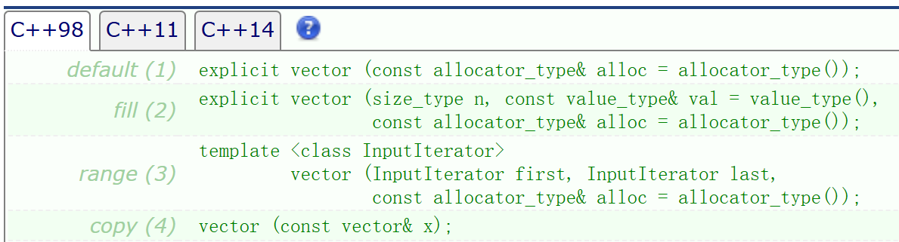

## 1.2 vector iterator 的使用
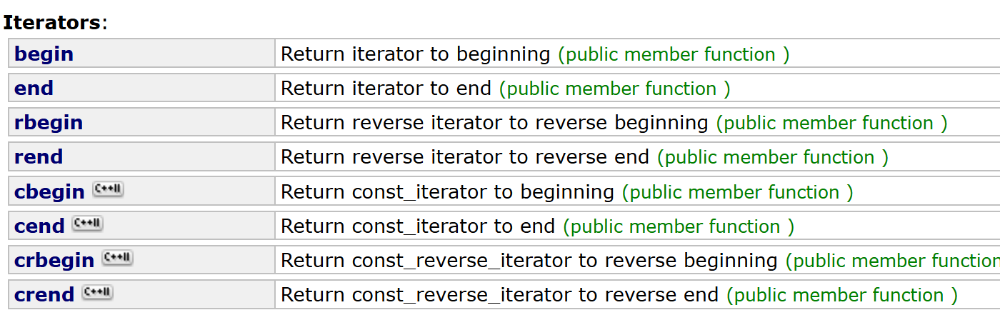

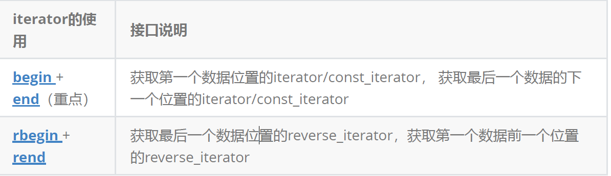

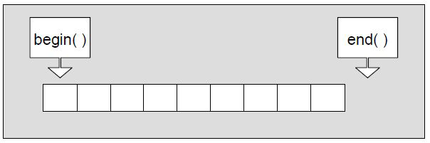

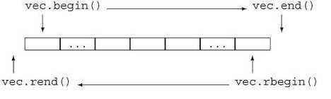

vector 空间增长问题

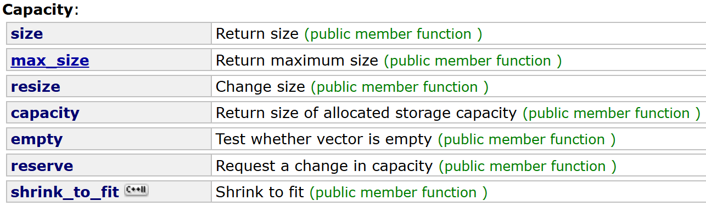

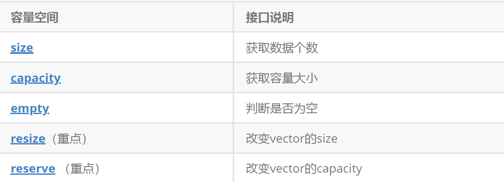

capacity的代码在vs和g++下分别运行会发现，vs下capacity是按1.5倍增长的，g++是按2倍增长的。这个问题经常会考察，不要固化的认为，vector增容都是2倍，具体增长多少是根据具体的需求定义的。vs是PJ版本STL，g++是SGI版本STL。reserve只负责开辟空间，如果确定知道需要用多少空间，reserve可以缓解vector增容的代价缺陷问题。

resize在开空间的同时还会进行初始化，影响size。

```c
void TestVectorExpand()
{
	size_t sz;
	std::vector<int> v;
	sz = v.capacity();
	cout << "making v grow:\n";
	for (int i = 0; i < 100; ++i)
	{
		v.push_back(i);
		if (sz != v.capacity())
		{
			sz = v.capacity();
			cout << "capacity changed: " << sz << '\n';
		}
	}
}
```

vs：运行结果：

> vs下使用的STL基本是按照1.5倍方式扩容
>

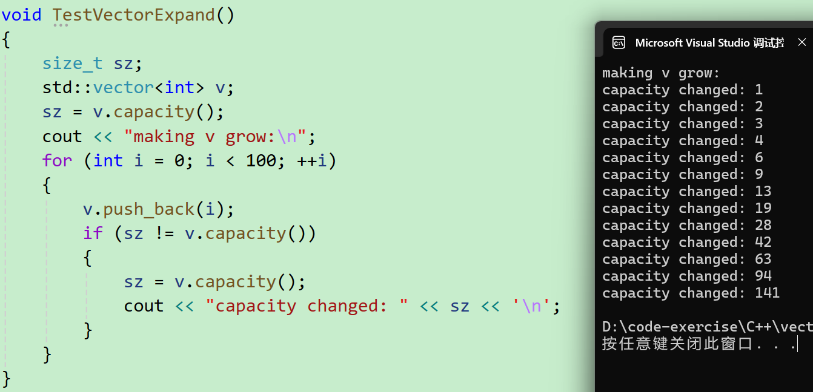

g++运行结果：

> linux下使用的STL基本是按照2倍方式扩容
>

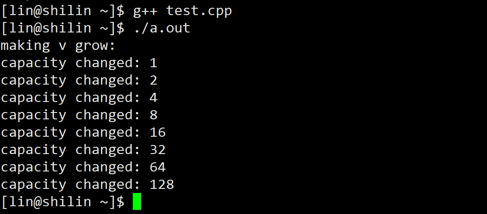

## 1.3 vector 增删查改
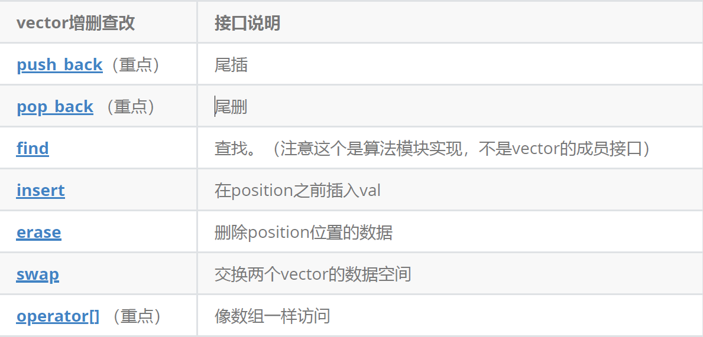

## 二、vector 迭代器失效问题
迭代器的主要作用就是让算法能够不用关心底层数据结构，其底层实际就是一个指针，或者是对指针进行了封装，比如：vector的迭代器就是原生态指针T* 。因此迭代器失效，实际就是迭代器底层对应指针所指向的空间被销毁了，而使用一块已经被释放的空间，造成的后果是程序崩溃(即如果继续使用已经失效的迭代器，程序可能会崩溃)。

> 对于vector可能会导致其迭代器失效的操作有：
>

#### 会引起其底层空间改变的操作，都有可能是迭代器失效，比如：resize、reserve、insert、assign、push_back等。
```c
void TestVector3() {
	std::vector<int> v{ 1,2,3,4,5,6 };
	auto it = v.begin();

	// 将有效元素个数增加到100个，多出的位置使用8填充，操作期间底层会扩容
	v.resize(100, 8);
	// reserve的作用就是改变扩容大小但不改变有效元素个数，操作期间可能会引起底层容量改变
	v.reserve(100);
	// 插入元素期间，可能会引起扩容，而导致原空间被释放
	v.insert(v.begin(), 0);
	v.push_back(8);
	// 给vector重新赋值，可能会引起底层容量改变
	v.assign(100, 8);
	
	/*
	出错原因：以上操作，都有可能会导致vector扩容，也就是说vector底层原理旧空间被释
	放掉，而在打印时，it还使用的是释放之间的旧空间，在对it迭代器操作时，实际操作的是一块
	已经被释放的空间，而引起代码运行时崩溃。
	解决方式：在以上操作完成之后，如果想要继续通过迭代器操作vector中的元素，只需给
	it重新赋值即可。
	*/
	
	while (it != v.end())
	{
		cout << *it << " ";
		++it;
	}
	cout << endl;
}
```

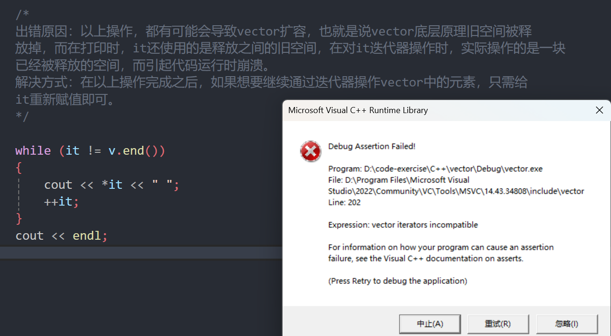

#### 指定位置元素的删除操作-->erase
```cpp
void TestVector4() {

	int a[] = { 1, 2, 3, 4 };
	std::vector<int> v(a, a + sizeof(a) / sizeof(int));
	// 使用find查找3所在位置的iterator
	vector<int>::iterator pos = find(v.begin(), v.end(), 3);
	// 删除pos位置的数据，导致pos迭代器失效。
	v.erase(pos);
	cout << *pos << endl; // 此处会导致非法访问
}
```

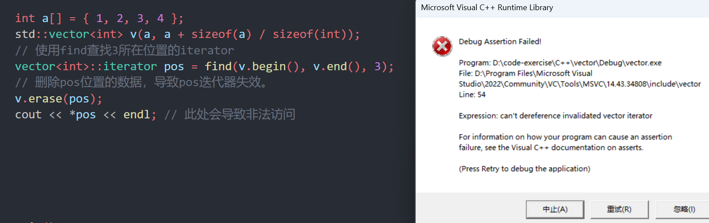

erase删除pos位置元素后，pos位置之后的元素会往前搬移，没有导致底层空间的改变，理论上讲迭代器不应该会失效，但是：如果pos刚好是最后一个元素，删完之后pos刚好是end的位置，而end位置是没有元素的，那么pos就失效了。因此删除vector中任意位置上元素时，vs就认为该位置迭代器失效了。

```cpp
void TestVector5() {
	vector<int> v{ 1, 2, 3, 4 };
	auto it = v.begin();
	while (it != v.end())
	{
		if (*it % 2 == 0)
			v.erase(it);
		++it;
	}
}
```

解决方法：需要下面这样写

```cpp
void TestVector6() {
	vector<int> v{ 1, 2, 3, 4 };
	auto it = v.begin();
	while (it != v.end())
	{
		if (*it % 2 == 0)
			it = v.erase(it);
		else
			++it;
	}
}
```

#### Linux下，g++编译器对迭代器失效的检测并不是非常严格，处理也没有vs下极端。
1. 扩容之后，迭代器已经失效了，程序虽然可以运行，但是运行结果已经不对了

```cpp
int main()
{
	vector<int> v{ 1,2,3,4,5 };
	for (size_t i = 0; i < v.size(); ++i)
		cout << v[i] << " ";
	cout << endl;
	auto it = v.begin();
	cout << "扩容之前，vector的容量为: " << v.capacity() << endl;
	// 通过reserve将底层空间设置为100，目的是为了让vector的迭代器失效
	v.reserve(100);
	cout << "扩容之后，vector的容量为: " << v.capacity() << endl;
	// 经过上述reserve之后，it迭代器肯定会失效，在vs下程序就直接崩溃了，但是linux下不会
	// 虽然可能运行，但是输出的结果是不对的
	while (it != v.end())
	{
		cout << *it << " ";
		++it;
	}
	cout << endl;
	return 0;
}
```

VS下执行：

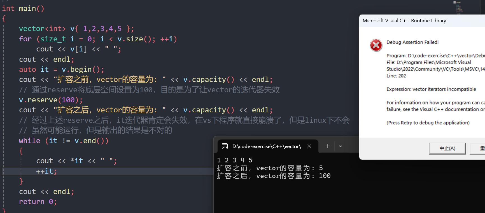

Linux下执行：

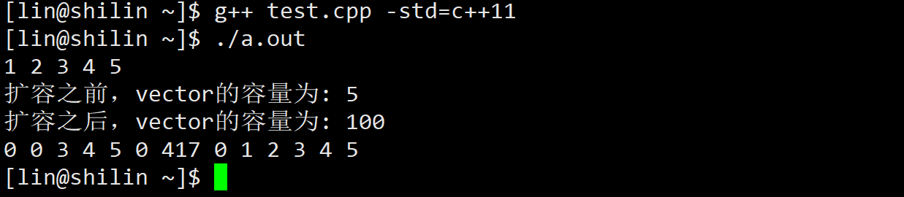

2. erase删除任意位置代码后，linux下迭代器并没有失效，因为空间还是原来的空间，后序元素往前搬移了，it的位置还是有效的

```cpp
int main()
{
	vector<int> v{ 1,2,3,4,5 };
	vector<int>::iterator it = find(v.begin(), v.end(), 3);
	v.erase(it);
	cout << *it << endl;
	while (it != v.end())
	{
		cout << *it << " ";
		++it;
	}
	cout << endl;
	return 0;
}
```

VS下执行：

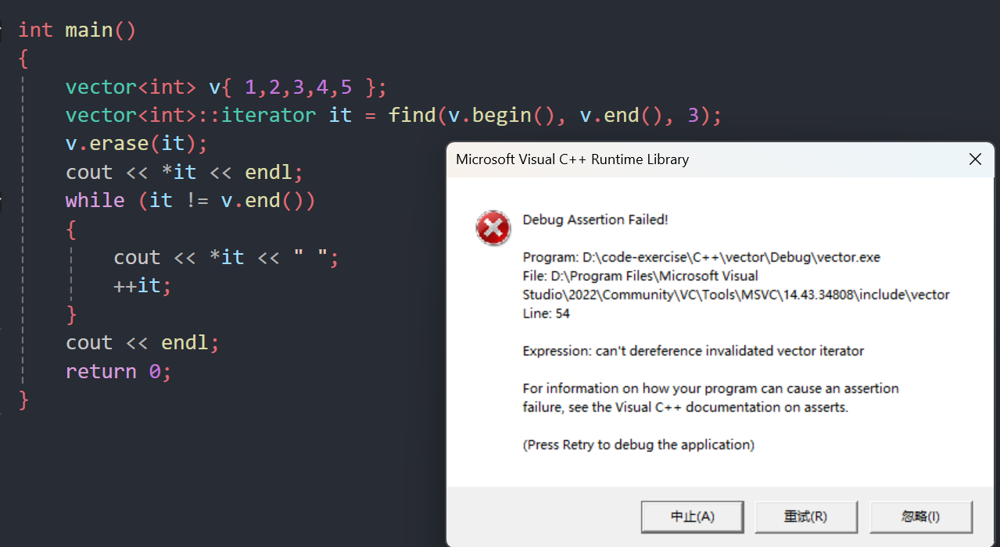

Linux下执行：

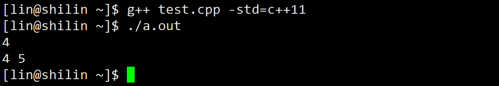

3. erase删除的迭代器如果是最后一个元素，删除之后it已经超过end，此时迭代器是无效的，++it导致程序崩溃

```cpp
int main()
{
	vector<int> v{ 1,2,3,4,5 };
	// vector<int> v{1,2,3,4,5,6};
	auto it = v.begin();
	while (it != v.end())
	{
		if (*it % 2 == 0)
			v.erase(it);
		++it;
	}
	for (auto e : v)
		cout << e << " ";
	cout << endl;
	return 0;
}
```

VS下执行：

使用第一组数据：

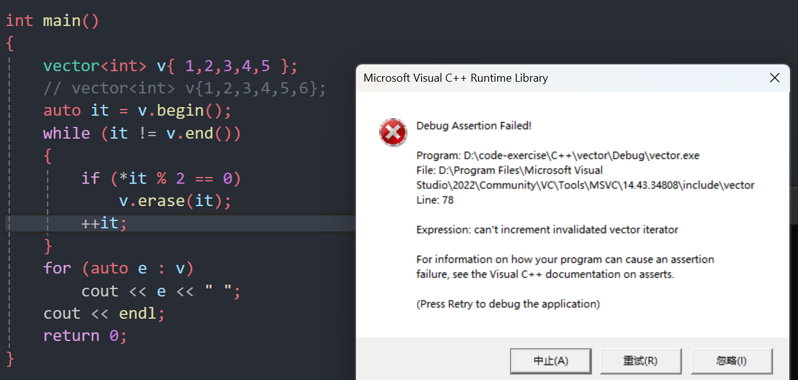

使用第二组数据：

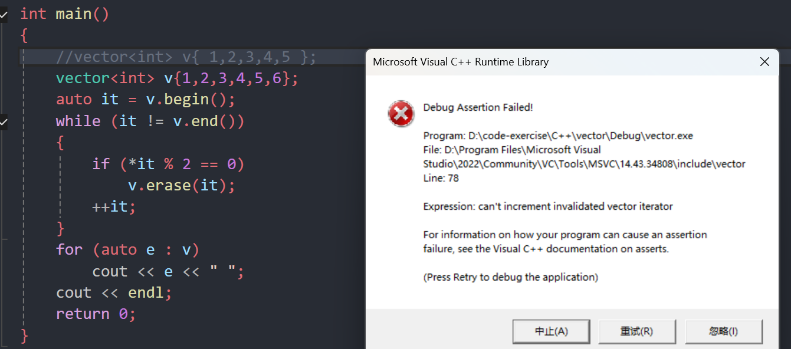

Linux下执行：

使用第一组数据：

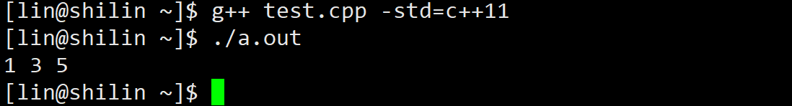

使用第二组数据：

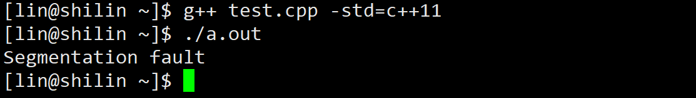

<font style="color:#DF2A3F;background-color:#FBDE28;">从上述三个例子中可以看到：SGI STL中，迭代器失效后，代码并不一定会崩溃，但是运行结果肯定不对，如果it不在begin和end范围内，肯定会崩溃的。</font>

4. 与vector类似，string在插入+扩容操作+erase之后，迭代器也会失效

```cpp
int main() {
	string s("hello");
	auto it = s.begin();
	// 放开之后代码会崩溃，因为resize到20会string会进行扩容
	// 扩容之后，it指向之前旧空间已经被释放了，该迭代器就失效了
	// 后序打印时，再访问it指向的空间程序就会崩溃
	// s.resize(20, '!');
	while (it != s.end())
	{
		cout << *it;
		++it;
	}
	cout << endl;
	it = s.begin();
	while (it != s.end())
	{
		it = s.erase(it);
		// 按照下面方式写，运行时程序会崩溃，因为erase(it)之后
		// it位置的迭代器就失效了
		// s.erase(it);
		++it;
	}
}
```

**<font style="color:#DF2A3F;background-color:#FBDE28;">迭代器失效解决办法：在使用前，对迭代器重新赋值即可。</font>**

# 三、vector的接口使用
```cpp
#include <iostream>
#include <vector>
using namespace std;

////////////////////////////////////////////////////////////////////
//    vector的构造
////////////////////////////////////////////////////////////////////
int TestVector1()
{
	// constructors used in the same order as described above:
	vector<int> first;                                // empty vector of ints
	vector<int> second(4, 100);                       // four ints with value 100
	vector<int> third(second.begin(), second.end());  // iterating through second
	vector<int> fourth(third);                       // a copy of third

	// 下面涉及迭代器初始化的部分，我们学习完迭代器再来看这部分
	// the iterator constructor can also be used to construct from arrays:
	int myints[] = { 16,2,77,29 };
	vector<int> fifth(myints, myints + sizeof(myints) / sizeof(int));

	cout << "The contents of fifth are:";
	for (vector<int>::iterator it = fifth.begin(); it != fifth.end(); ++it)
		cout << ' ' << *it;
	cout << '\n';

	return 0;
}


////////////////////////////////////////////////////////////////////////
//  vector的迭代器
////////////////////////////////////////////////////////////////////////
void PrintVector(const vector<int>& v)
{
	// const对象使用const迭代器进行遍历打印
	vector<int>::const_iterator it = v.begin();
	while (it != v.end())
	{
		cout << *it << " ";
		++it;
	}
	cout << endl;
}

void TestVector2()
{
	// 使用push_back插入4个数据
	vector<int> v;
	v.push_back(1);
	v.push_back(2);
	v.push_back(3);
	v.push_back(4);

	// 使用迭代器进行遍历打印
	vector<int>::iterator it = v.begin();
	while (it != v.end())
	{
		cout << *it << " ";
		++it;
	}
	cout << endl;

	// 使用迭代器进行修改
	it = v.begin();
	while (it != v.end())
	{
		*it *= 2;
		++it;
	}

	// 使用反向迭代器进行遍历再打印
	// vector<int>::reverse_iterator rit = v.rbegin();
	auto rit = v.rbegin();
	while (rit != v.rend())
	{
		cout << *rit << " ";
		++rit;
	}
	cout << endl;

	PrintVector(v);
}

////////////////////////////////////////////////////////////////////////
//  vector的resize 和 reserve
////////////////////////////////////////////////////////////////////////
// reisze(size_t n, const T& data = T())
// 将有效元素个数设置为n个，如果时增多时，增多的元素使用data进行填充
// 注意：resize在增多元素个数时可能会扩容
void TestVector3()
{
	vector<int> v;

	// set some initial content:
	for (int i = 1; i < 10; i++)
		v.push_back(i);

	v.resize(5);
	v.resize(8, 100);
	v.resize(12);

	cout << "v contains:";
	for (size_t i = 0; i < v.size(); i++)
		cout << ' ' << v[i];
	cout << '\n';
}

// 测试vector的默认扩容机制
// vs：按照1.5倍方式扩容
// linux：按照2倍方式扩容
void TestVectorExpand()
{
	size_t sz;
	vector<int> v;
	sz = v.capacity();
	cout << "making v grow:\n";
	for (int i = 0; i < 100; ++i)
	{
		v.push_back(i);
		if (sz != v.capacity())
		{
			sz = v.capacity();
			cout << "capacity changed: " << sz << '\n';
		}
	}
}

// 往vecotr中插入元素时，如果大概已经知道要存放多少个元素
// 可以通过reserve方法提前将容量设置好，避免边插入边扩容效率低
void TestVectorExpandOP()
{
	vector<int> v;
	size_t sz = v.capacity();
	v.reserve(100);   // 提前将容量设置好，可以避免一遍插入一遍扩容
	cout << "making bar grow:\n";
	for (int i = 0; i < 100; ++i)
	{
		v.push_back(i);
		if (sz != v.capacity())
		{
			sz = v.capacity();
			cout << "capacity changed: " << sz << '\n';
		}
	}
}

////////////////////////////////////////////////////////////////////////
//  vector的增删改查
////////////////////////////////////////////////////////////////////////
// 尾插和尾删：push_back/pop_back
void TestVector4()
{
	vector<int> v;
	v.push_back(1);
	v.push_back(2);
	v.push_back(3);
	v.push_back(4);

	auto it = v.begin();
	while (it != v.end())
	{
		cout << *it << " ";
		++it;
	}
	cout << endl;

	v.pop_back();
	v.pop_back();

	it = v.begin();
	while (it != v.end())
	{
		cout << *it << " ";
		++it;
	}
	cout << endl;
}

// 任意位置插入：insert和erase，以及查找find
// 注意find不是vector自身提供的方法，是STL提供的算法
void TestVector5()
{
	// 使用列表方式初始化，C++11新语法
	vector<int> v{ 1, 2, 3, 4 };

	// 在指定位置前插入值为val的元素，比如：3之前插入30,如果没有则不插入
	// 1. 先使用find查找3所在位置
	// 注意：vector没有提供find方法，如果要查找只能使用STL提供的全局find
	auto pos = find(v.begin(), v.end(), 3);
	if (pos != v.end())
	{
		// 2. 在pos位置之前插入30
		v.insert(pos, 30);
	}

	vector<int>::iterator it = v.begin();
	while (it != v.end())
	{
		cout << *it << " ";
		++it;
	}
	cout << endl;

	pos = find(v.begin(), v.end(), 3);
	// 删除pos位置的数据
	v.erase(pos);

	it = v.begin();
	while (it != v.end()) {
		cout << *it << " ";
		++it;
	}
	cout << endl;
}

// operator[]+index 和 C++11中vector的新式for+auto的遍历
// vector使用这两种遍历方式是比较便捷的。
void TestVector6()
{
	vector<int> v{ 1, 2, 3, 4 };

	// 通过[]读写第0个位置。
	v[0] = 10;
	cout << v[0] << endl;

	// 1. 使用for+[]小标方式遍历
	for (size_t i = 0; i < v.size(); ++i)
		cout << v[i] << " ";
	cout << endl;

	vector<int> swapv;
	swapv.swap(v);

	cout << "v data:";
	for (size_t i = 0; i < v.size(); ++i)
		cout << v[i] << " ";
	cout << endl;

	// 2. 使用迭代器遍历
	cout << "swapv data:";
	auto it = swapv.begin();
	while (it != swapv.end())
	{
		cout << *it << " ";
		++it;
	}

	// 3. 使用范围for遍历
	for (auto x : v)
		cout << x << " ";
	cout << endl;
}
```

# 四、OJ练习
## 4.1 只出现一次的数字 I
[136. 只出现一次的数字 - 力扣（LeetCode）](https://leetcode.cn/problems/single-number/)

```cpp
class Solution {
public:
    int singleNumber(vector<int>& nums) {
        int x = 0;
        for (int i = 0; i < nums.size(); i++) {
            x ^= nums[i];
        }
        return x;
    }
};
```

## 4.2 杨辉三角
[118. 杨辉三角 - 力扣（LeetCode）](https://leetcode.cn/problems/pascals-triangle/)

```cpp
class Solution {
public:
    vector<vector<int>> generate(int numRows) {
        vector<vector<int>> vv(numRows);
        for (int i = 0; i < numRows; i++) {
            vv[i].resize(i + 1, 1);
        }
        for (int i = 2; i < numRows; i++) {
            for (int j = 1; j < i; j++) {
                vv[i][j] = vv[i - 1][j - 1] + vv[i - 1][j];
            }
        }
        return vv;
    }
};
```

## 4.3 删除有序数组中的重复项
[26. 删除有序数组中的重复项 - 力扣（LeetCode）](https://leetcode.cn/problems/remove-duplicates-from-sorted-array/)

```cpp
int removeDuplicates(int* nums, int numsSize) {
    int src = 0, dest = src + 1;
    while (dest < numsSize) {
        if (nums[src] != nums[dest]) {
            nums[++src] = nums[dest++];
        } else
            dest++;
    }
    return src + 1;
}
```

## 4.4 只出现一次的数字||
[137. 只出现一次的数字 II - 力扣（LeetCode）](https://leetcode.cn/problems/single-number-ii/)

```cpp
class Solution {
public:
    int singleNumber(vector<int> &nums) {
        int ans = 0;
        for (int i = 0; i < 32; i++) {
            int cnt1 = 0;
            for (int x: nums) {
                cnt1 += x >> i & 1;
            }
            ans |= cnt1 % 3 << i;
        }
        return ans;
    }
};
```

## 4.5 只出现一次的数字|||
[260. 只出现一次的数字 III - 力扣（LeetCode）](https://leetcode.cn/problems/single-number-iii/)

```cpp
class Solution {
public:
    vector<int> singleNumber(vector<int> &nums) {
        unsigned int xor_all = 0;
        for (int x: nums) {
            xor_all ^= x;
        }
        int lowbit = xor_all & -xor_all;
        vector<int> ans(2);
        for (int x: nums) {
            ans[(x & lowbit) != 0] ^= x; // 分组异或
        }
        return ans;
    }
};
```

## <font style="color:rgb(51, 51, 51);">4.6 数组中出现次数超过一半的数字</font>
[数组中出现次数超过一半的数字_牛客题霸_牛客网](https://www.nowcoder.com/practice/e8a1b01a2df14cb2b228b30ee6a92163?tpId=13&&tqId=11181&rp=1&ru=/activity/oj&qru=/ta/coding-interviews/question-ranking)

```cpp
class Solution {
  public:
    int MoreThanHalfNum_Solution(vector<int>& numbers) {
        sort(numbers.begin(), numbers.end());
        return numbers[numbers.size() / 2];
    }
};
```

# 五、vector深度剖析及模拟实现
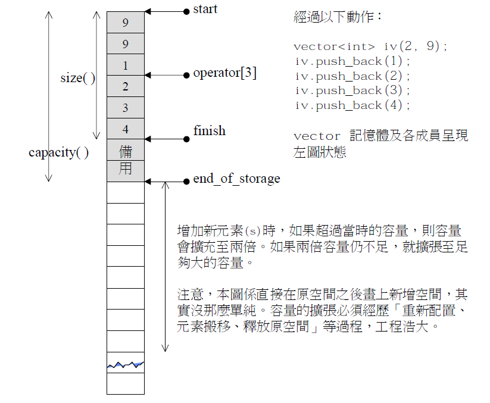


# 六、使用memcpy拷贝问题
假设模拟实现的vector中的reserve接口中，使用memcpy进行的拷贝，以下代码会发生什么问题？

```cpp
void TestVector7() {
	lsl::vector<string> v;
	v.push_back("1111");
	v.push_back("2222");
	v.push_back("3333");
	v.push_back("4444");
	v.push_back("5555");
}
```

其中`reserve`的实现：

```cpp
void reserve(size_t n)
{
    // 检查容量是否满
    if (_finish == _end_of_storage) {

        size_t oldSize = size(); // 保存旧的数据
        T* tmp = new T[n];
        // 注意这里
        if(_start)
            memcpy(tmp, _start, sizeof(T) * oldSize);

        // 释放原来的空间
        delete[] _start;

        // 改变指针
        _start = tmp;
        _finish = _start + oldSize;
        _end_of_storage = _start + n;
    }
}
```

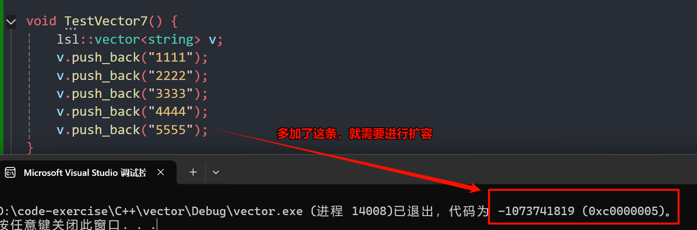

问题分析：

1. memcpy是内存的二进制格式拷贝，将一段内存空间中内容原封不动的拷贝到另外一段内存空间中
2. 如果拷贝的是自定义类型的元素，memcpy既高效又不会出错，但如果拷贝的是自定义类型元素，并且自定义类型元素中涉及到资源管理时，就会出错，因为memcpy的拷贝实际是浅拷贝。

结论：如果对象中涉及到资源管理时，千万不能使用`memcpy`进行对象之间的拷贝，因为`memcpy`是浅拷贝，否则可能会引起内存泄漏甚至程序崩溃。

正确修改：

```cpp
void reserve(size_t n)
{
	// 检查容量是否满
	if (_finish == _end_of_storage) {

		size_t oldSize = size(); // 保存旧的数据
		T* tmp = new T[n];
		// 不能使用memcpy，会造成浅拷贝
		//if(_start)
		//	memcpy(tmp, _start, sizeof(T) * oldSize);
		
		if (_start)
			for (size_t i = 0; i < oldSize; i++)
				tmp[i] = _start[i]; // 内置类型直接赋值，自定义类型调用它的赋值重载

		// 释放原来的空间
		delete[] _start;

		// 改变指针
		_start = tmp;
		_finish = _start + oldSize;
		_end_of_storage = _start + n;
	}
}
```

# 七、std::vector的核心框架接口的模拟实现vector
```cpp
#pragma once

#include <iostream>
#include <stdlib.h>
#include <assert.h>

using namespace std;

namespace lsl
{
	template<class T>
	class vector {
		// vector 的迭代器是原生指针
		typedef T* iterator;
		typedef const T* const_iterator;
	public:
		/// <summary>
		/// 迭代器
		/// </summary>
		iterator begin() {
			return _start;
		}
		iterator end() {
			return _finish;
		}
		const_iterator begin() const {
			return _start;
		}
		const_iterator end() const {
			return _finish;
		}

		/// <summary>
		/// 构造与析构
		/// </summary>
		vector()
		{}
		vector(size_t n, const T& val = T()) {
			resize(n, val);
		}

		/*
		* 理论上提供了vector(size_t n, const T& value = T())之后
		* vector(int n, const T& value = T())就不需要提供了，但是对于：
		* vector<int> v(10, 5);
		* 编译器在编译时，认为T已经被实例化为int，而10和5编译器会默认其为int类型
		* 就不会走vector(size_t n, const T& value = T())这个构造方法，
		* 最终选择的是：vector(InputIterator first, InputIterator last)
		* 因为编译器觉得区间构造两个参数类型一致，因此编译器就会将InputIterator实例化为int
		* 但是10和5根本不是一个区间，编译时就报错了
		* 故需要增加该构造方法
		*/
		vector(int n, const T& val = T()) {
			resize(n, val);
		}

		template<class InputIterator>
		vector(InputIterator first, InputIterator last) {
			while (first != last)
			{
				push_back(*first);
				++first;
			}
		}

		vector(initializer_list<T> il) {
			reserve(il.size());
			for (auto& e : il)
				push_back(e);
		}

		vector(const vector<T>& v) {
			// 先开空间
			reserve(v.capacity());
			for (const auto& e : v)
				push_back(e);
		}
		
		void Swap(vector<T>& v) {
			std::swap(_start, v._start);
			std::swap(_finish, v._finish);
			std::swap(_start, v._start);
		}

		vector<T>& operator=(const vector<T> v) {
			Swap(v);
			return *this;
		}

		~vector()
		{
			if (_start) {
				delete[] _start;
				_start = _finish = _end_of_storage = nullptr;
			}
		}

		/// <summary>
		/// 容量相关
		/// </summary>
		size_t size() const {
			return _finish - _start;
		}

		size_t capacity() const {
			return _end_of_storage - _start;
		}
		
		bool empty() const
		{
			return _start == _finish;
		}

		void reserve(size_t n)
		{
			// 检查容量是否满
			if (_finish == _end_of_storage) {

				size_t oldSize = size(); // 保存旧的数据
				T* tmp = new T[n];
				// 不能使用memcpy，会造成浅拷贝
				//if(_start)
				//	memcpy(tmp, _start, sizeof(T) * oldSize);
				
				if (_start)
					for (size_t i = 0; i < oldSize; i++)
						tmp[i] = _start[i]; // 内置类型直接赋值，自定义类型调用它的赋值重载

				// 释放原来的空间
				delete[] _start;

				// 改变指针
				_start = tmp;
				_finish = _start + oldSize;
				_end_of_storage = _start + n;
			}
		}
		
		void resize(size_t n, const T& val = T()) {
			// 如果比size()小直接改变_finish
			if (n < size())
				_finish = _start + n;
			else {
				// 扩容数据
				reserve(n);
				// 拷贝n个val
				while (_finish != _start + n)
					*_finish++ = val;
			}
		}

		/// <summary>
		/// 增删查改
		/// </summary>
		T& operator[](size_t i) {
			assert(i < size());
			return _start[i];
		}
		
		const T& operator[](size_t i) const {
			assert(i < size());
			return _start[i];
		}
		T& front()
		{
			return *_start;
		}

		const T& front()const
		{
			return *_start;
		}

		T& back()
		{
			return *(_finish - 1);
		}

		const T& back()const
		{
			return *(_finish - 1);
		}

		iterator insert(iterator pos, const T& x) {
			assert(pos >= _start);
			assert(pos <= _finish);

			// 发生了扩容,会导致迭代器失效,需要重新更新一下pos
			if (_finish == _end_of_storage) {
				size_t len = pos - _start;
				reserve(capacity() == 0 ? 4 : capacity() * 2);
				pos = _start + len;
			}

			iterator it = _finish - 1;
			while (it >= pos)
			{
				*(it + 1) = *it;
				--it;
			}

			*pos = x;
			++_finish;
			return pos;
		}

		// 返回删除数据的下一个数据，解决:一边遍历一边删除的迭代器失效问题
		iterator erase(iterator pos) {
			assert(pos >= _start);
			assert(pos < _finish);
			iterator it = pos + 1;
			while (it < _finish)
			{
				*(it - 1) = *it;
				++it;
			}
			--_finish;
			return pos;
		}

		void push_back(const T& x) {
			insert(end(), x);
		}
		//void push_back(const T& x) {
		//	if (_finish == _end_of_storage)
		//		reserve(capacity() == 0 ? 4 : capacity() * 2);
		//	*_finish++ = x;
		//}

		void pop_back() {
			erase(end() - 1);
		}

	private:
		iterator _start = nullptr;
		iterator _finish = nullptr;
		iterator _end_of_storage = nullptr;
	};
}
```


