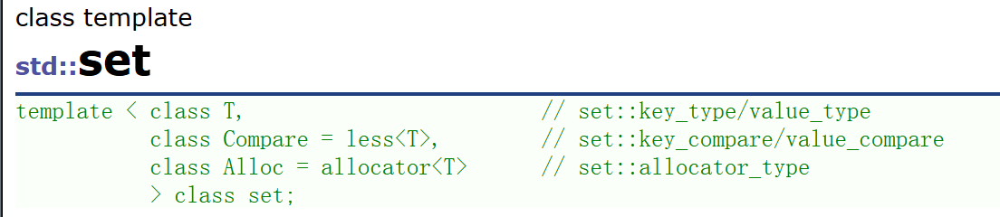
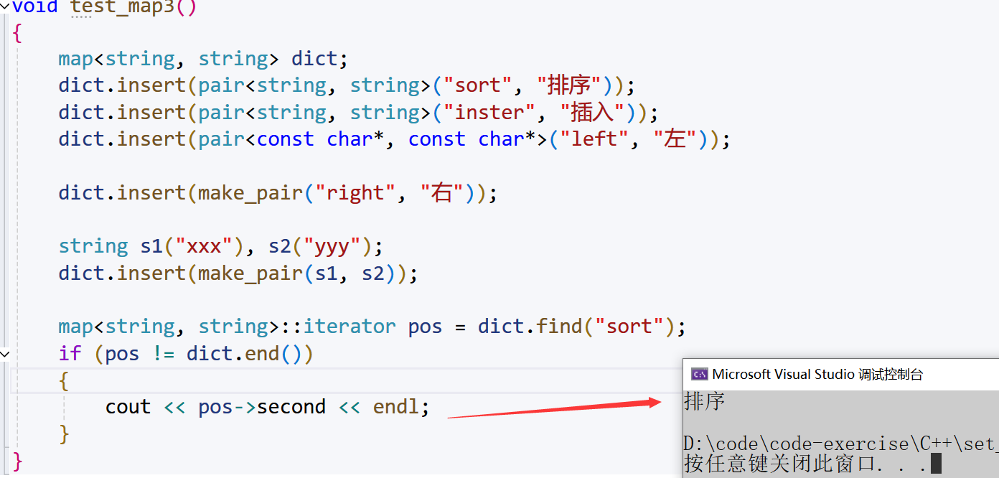
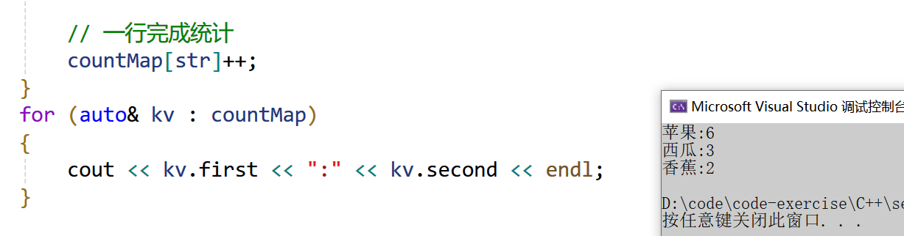
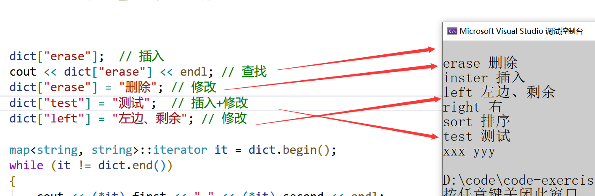

# 一、关联式容器
C++STL包含了序列式容器和关联式容器：

+ 序列式容器里面存储的是元素本身，其底层为线性序列的数据结构。比如：vector，list，deque，forward_list(C++11)等。
+ 关联式容器里面存储的是<key, value>结构的键值对，在数据检索时比序列式容器效率更高。比如：set、map、unordered_set、unordered_map等。

注意： C++STL当中的stack、queue和priority_queue属于容器适配器，它们默认使用的基础容器分别是deque和vector。

# 二、键值对（pair）
用来表示具有一一对应关系的一种结构，该结构中一般只包含两个成员变量key和value，key代表键值，value表示与key对应的信息。比如：现在要建立一个英汉互译的字典，那该字典中必然有英文单词与其对应的中文含义，而且，英文单词与其中文含义是一一对应的关系，即通过该应该单词，在词典中就可以找到与其对应的中文含义。

在`SGI-STL`中关于键值对的定义如下：

```cpp
template <class T1, class T2>
struct pair
{
    typedef T1 first_type;
    typedef T2 second_type;
    T1 first;
    T2 second;
    pair() : first(T1()), second(T2())
    {}
    pair(const T1& a, const T2& b) : first(a), second(b)
    {}
};
```

## 2.1 树形结构与哈希结构
根据应用场景的不同，C++STL总共实现了两种不同结构的关联式容器：树型结构和哈希结构。

| **关联式容器** | **容器结构** | **底层实现** |
| --- | --- | --- |
| set、map、multiset、multimap | 树型结构 | 平衡搜索树（红黑树） |
| unordered_set、unordered_map、unordered_multiset、unordered_multimap | 哈希结构 | 哈希表 |


其中，树型结构容器中的元素是一个有序的序列，而哈希结构容器中的元素是一个无序的序列。

# 三、set
## 3.1 set的介绍
[https://legacy.cplusplus.com/reference/set/set/](https://legacy.cplusplus.com/reference/set/set/)

翻译：

1. set是按照一定次序存储元素的容器
2. 在set中，元素的value也标识它(value就是key，类型为T)，并且每个value必须是唯一的。set中的元素不能在容器中修改(元素总是const)，但是可以从容器中插入或删除它们。
3. 在内部，set中的元素总是按照其内部比较对象(类型比较)所指示的特定严格弱排序准则进行排序。
4. set容器通过key访问单个元素的速度通常比unordered_set容器慢，但它们允许根据顺序对子集进行直接迭代。
5. set在底层是用二叉搜索树(**红黑树**)实现的，所以在set当中查找某个元素的时间复杂度为

注意：

1. 与map/multimap不同，map/multimap中存储的是真正的键值对<key, value>，set中只放value，但在底层实际存放的是由<value, value>构成的键值对。
2. set中插入元素时，只需要插入value即可，**不需要构造键值对**。
3. set中的元素**不可以重复**(因此可以使用set进行去重)。
4. 使用set的迭代器**遍历set中的元素，可以得到有序序列**
5. set中的元素默认按照**小于**来比较
6. set中查找某个元素，时间复杂度为：
7. set中的元素不允许修改(为什么?)
8. set中的底层使用二叉搜索树(**红黑树**)来实现。

## 3.2 set的使用
### 3.2.1 set的模板参数列表
+ **T**: set中存放元素的类型，实际在底层存储<value, value>的键值对。
+ **Compare**：set中元素默认按照小于来比较
+ **Alloc**：set中元素空间的管理方式，使用STL提供的空间配置器管理



### 3.2.2 set的构造
+ 方式一： 构造一个某类型的空容器。

```cpp
set<int> s1; //构造int类型的空容器
```

+ 方式二： 拷贝构造某类型set容器的复制品。

```cpp
set<int> s2(s1); //拷贝构造int类型s1容器的复制品
```

+ 方式三： 使用迭代器拷贝构造某一段内容。

```cpp
string str("abcdef");
set<char> s3(str.begin(), str.end()); //构造string对象某段区间的复制品
```

+ 方式四： 构造一个某类型的空容器，比较方式指定为大于。

```cpp
set <int, greater<int>> s4; //构造int类型的空容器，比较方式指定为大于
```

### 3.2.3 set的使用
| **成员函数** | **功能**          |
| -------- | --------------- |
| insert   | 插入指定元素          |
| erase    | 删除指定元素          |
| find     | 查找指定元素          |
| size     | 获取容器中元素的个数      |
| empty    | 判断容器是否为空        |
| clear    | 清空容器            |
| swap     | 交换两个容器中的数据      |
| count    | 获取容器中指定元素值的元素个数 |


### 3.2.4 set的迭代器
| **成员函数** | **功能** |
| --- | --- |
| begin | 获取容器中第一个元素的正向迭代器 |
| end | 获取容器中最后一个元素下一个位置的正向迭代器 |
| rbegin | 获取容器中最后一个元素的反向迭代器 |
| rend | 获取容器中第一个元素前一个位置的反向迭代器 |


### 3.2.5 使用演示
```cpp
void test_set1()
{
    // 去重+升序排序
    set<int> s1;
    // 去重+降序排序（给一个大于的仿函数）
    // set<int, greater<int>> s;

    s1.insert(1);
    s1.insert(11);
    s1.insert(3);
    s1.insert(1);
    s1.insert(4);
    s1.insert(2);

    set<int>::iterator it = s1.begin();
    while (it != s1.end())
    {
        // *it = 1; // 不支持修改
        cout << *it << " ";
        ++it;
    }
    cout << endl;

    vector<int> v = { 3,2,8,1,10,2 };
    set<int> s2(v.begin(), v.end());
    for (auto e : s2)
    {
        cout << e << " ";
    }
    cout << endl;

    // 插入一段initializer_list列表值，已经存在的值插入失败
    set<int> s3;
    s3.insert({ 3,2,8,1,10,2 });
    for (auto e : s3)
    {
        cout << e << " ";
    }
    cout << endl;

    // 删除
    s3.erase(8);
    s3.erase(18);
    for (auto e : s3)
    {
        cout << e << " ";
    }
    cout << endl;

    auto pos = s3.find(10);
    if (pos != s3.end())
    {
        cout << *pos << endl;
        s3.erase(pos);
    }
    else
    {
        cout << "找不到" << endl;
    }

    for (auto e : s3)
    {
        cout << e << " ";
    }
    cout << endl;

    set<string> strset = { "sort", "insert", "add" };
    // 遍历string比较ascll码大小顺序遍历的
    for (auto& e : strset)
    {
        cout << e << " ";
    }
    cout << endl;
}

void test_set2()
{
    set<int> s = { 4,2,7,2,8,5,9 };
    for (auto e : s)
    {
        cout << e << " ";
    }
    cout << endl;

    int x;
    cin >> x;
    // 算法库的查找 O(N)
    auto pos1 = find(s.begin(), s.end(), x);
    // set自身实现的查找 O(logN)
    auto pos2 = s.find(x);

    // 利用count间接实现快速查找
    cin >> x;
    if (s.count(x))
    {
        cout << x << "在！" << endl;
    }
    else
    {
        cout << x << "不存在！" << endl;
    }

    std::set<int> myset;
    for (int i = 1; i < 10; i++)
        myset.insert(i * 10); // 10 20 30 40 50 60 70 80 90

    for (auto e : myset)
    {
        cout << e << " ";
    }
    cout << endl;

    // [25,60)
    auto itlow = myset.lower_bound(25);      // >=val	
    auto itup = myset.upper_bound(60);       // >val

    myset.erase(itlow, itup);
    for (auto e : myset)
    {
        cout << e << " ";
    }
    cout << endl;

    auto ret = myset.equal_range(35);
    std::cout << *ret.first << std::endl; // >=val
    std::cout << *ret.second << std::endl; // >val
}
```

## 3.3 multiset
[multiset文档介绍](http://www.cplusplus.com/reference/set/multiset/?kw=multiset)

**翻译：**

1. multiset是按照特定顺序存储元素的容器，其中元素是可以重复的。
2. 在multiset中，元素的value也会识别它(因为multiset中本身存储的就是<value, value>组成的键值对，因此value本身就是key，key就是value，类型为T). multiset元素的值不能在容器中进行修改(因为元素总是const的)，但可以从容器中插入或删除。
3. 在内部，multiset中的元素总是按照其内部比较规则(类型比较)所指示的特定严格弱排序准则进行排序。
4. multiset容器通过key访问单个元素的速度通常比unordered_multiset容器慢，但当使用迭代器遍历时会得到一个有序序列。
5. multiset底层结构为二叉搜索树(红黑树)。

**注意：**

1. multiset中再底层中存储的是<value, value>的键值对
2. mtltiset的插入接口中只需要插入即可
3. 与set的区别是，multiset中的元素可以重复，set是中value是唯一的
4. 使用迭代器对multiset中的元素进行遍历，可以得到有序的序列
5. multiset中的元素不能修改
6. 在multiset中找某个元素，时间复杂度为
7. multiset的作用：可以对元素进行排序

由于multiset容器允许键值冗余，因此两个容器中成员函数find和count的意义也有所不同：

| **成员函数find** | **功能** |
| --- | --- |
| set对象 | 返回值为val的元素的迭代器 |
| multiset对象 | 返回底层搜索树中序的第一个值为val的元素的迭代器 |


| **成员函数count** | **功能** |
| --- | --- |
| set对象 | 值为val的元素存在则返回1，不存在则返回0（find成员函数可代替） |
| multiset对象 | 返回值为val的元素个数（find成员函数不可代替） |


### 3.3.1 multiset演示
```cpp
void test_set3()
{
    // key模型搜索
    // 排序 不去重，允许冗余
    multiset<int> s1;
    s1.insert(1);
    s1.insert(11);
    s1.insert(3);
    s1.insert(1);
    s1.insert(4);
    s1.insert(2);
    s1.insert(4);
    s1.insert(2);
    s1.insert(2);
    s1.insert(2);
    s1.insert(1);
    s1.insert(2);
    s1.insert(2);
    s1.insert(1);

    multiset<int>::iterator it = s1.begin();
    while (it != s1.end())
    {
        //*it = 1;// 不能使用
        cout << *it << " ";
        ++it;
    }
    cout << endl;

    //auto pos = s1.find(2);
    //while (pos != s1.end() && *pos == 2)
    //{
    //	cout << *pos << " ";
    //	++pos;
    //}

    // 删除所有的2
    auto ret = s1.equal_range(2);
    s1.erase(ret.first, ret.second);
    
    // 还能统计删除了多少个2
    size_t n = s1.erase(2);  // 也可以这样直接删除
    cout << n << endl;

    for (auto e : s1)
    {
        cout << e << " ";
    }
    cout << endl;

    // 统计有几个1
    cout << s1.count(1) << endl;
}
```

## 3.4 OJ练习
### 3.4.1 两个数组的交集
[349. 两个数组的交集 - 力扣（LeetCode）](https://leetcode.cn/problems/intersection-of-two-arrays/)

放到set(排序+去重)

> 找交集
>

+ 相同就是交集，（同时++）
+ 不相同（小的++）

> 找差集：
>

+ 相等同时++
+ 不相等（小的是差集）
+ 一个结束，另一个没结束也是差集

> 找并集
>

+ 直接放到set里

```cpp
class Solution {
public:
    vector<int> intersection(vector<int>& nums1, vector<int>& nums2) {
        // 去重+排序
        set<int> s1(nums1.begin(), nums1.end());
        set<int> s2(nums2.begin(), nums2.end());
        // 依次比较，小的一定不是交集，相等的是交集
        set<int>::iterator it1 = s1.begin(), it2 = s2.begin();

        vector<int> ret;
        while (it1 != s1.end() && it2 != s2.end()) {
            if (*it1 < *it2)
                ++it1;
            else if (*it1 > *it2)
                ++it2;
            else {
                ret.push_back(*it1);
                ++it1;
                ++it2;
            }
        }
        return ret;
    }
};
```

### 3.4.2 环形链表
[142. 环形链表 II - 力扣（LeetCode）](https://leetcode.cn/problems/linked-list-cycle-ii/)

法1：

```cpp
class Solution {
public:
    ListNode* detectCycle(ListNode* head) {
        set<ListNode*> s;
        ListNode* cur = head;
        while (cur) {
            if (s.count(cur)) // 如果存在
                return cur;
            else
                s.insert(cur);
            cur = cur->next;
        }
        return nullptr;
    }
};
```

法2：

遍历链表insert到set中，如果插入失败那么返回set的迭代器和false

```cpp
class Solution {
public:
    ListNode* detectCycle(ListNode* head) {
        set<ListNode*> s;
        ListNode* cur = head;
        while (cur) {
            auto ret = s.insert(cur);
            if (ret.second == false)
                return cur;
            cur = cur->next;
        }
        return nullptr;
    }
};
```

# 四、map
## 4.1 set的介绍
[map的文档简介](https://legacy.cplusplus.com/reference/map/map/)

**翻译：**

1. map是关联容器，它按照特定的次序(按照key来比较)存储由键值key和值value组合而成的元素。
2. 在map中，键值key通常用于排序和惟一地标识元素，而值value中存储与此键值key关联的内容。键值key和值value的类型可能不同，并且在map的内部，key与value通过成员类型value_type绑定在一起，为其取别名称为pair:typedef pair<const key, T> value_type;
3. 在内部，map中的元素总是按照键值key进行比较排序的。
4. map中通过键值访问单个元素的速度通常比unordered_map容器慢，但map允许根据顺序  
对元素进行直接迭代(即对map中的元素进行迭代时，可以得到一个有序的序列)。
5. map支持下标访问符，即在[]中放入key，就可以找到与key对应的value。
6. map通常被实现为二叉搜索树(更准确的说：平衡二叉搜索树(红黑树))。

**注意：**

1. multiset中再底层中存储的是<value, value>的键值对
2. mtltiset的插入接口中只需要插入即可
3. 与set的区别是，multiset中的元素可以重复，set是中value是唯一的
4. 使用迭代器对multiset中的元素进行遍历，可以得到有序的序列
5. multiset中的元素不能修改
6. 在multiset中找某个元素，时间复杂度为
7. multiset的作用：可以对元素进行排序

## 4.2 map的定义方式
+ 方式一： 指定key和value的类型构造一个空容器。

```cpp
map<int, double> m1; //构造一个key为int类型，value为double类型的空容器
```

+ 方式二： 拷贝构造某同类型容器的复制品。

```cpp
map<int, double> m2(m1); //拷贝构造key为int类型，value为double类型的m1容器的复制品
```

+ 方式三： 使用迭代器拷贝构造某一段内容。

```cpp
map<int, double> m3(m2.begin(), m2.end()); //使用迭代器拷贝构造m2容器某段区间的复制品
```

+ 方式四： 指定key和value的类型构造一个空容器，key比较方式指定为大于。

```cpp
map<int, double, greater<int>> m4; //构造一个key为int类型，value为double类型的空容器，key比较方式指定为大于
```

## 4.3 map的插入
+ map的插入函数的函数原型如下：

```cpp
pair<iterator, bool> insert (const value_type& val);
```

+ insert函数的参数

insert函数的参数显示是value_type类型的，实际上value_type就是pair类型的别名：

```cpp
typedef pair<const Key, T> value_type;
```

**insert插入：**

```cpp
void test_map1()
{
    map<string, string> dict;
    dict.insert(pair<string, string>("sort", "排序"));
    dict.insert(pair<string, string>("inster", "插入"));
    dict.insert(pair<const char*, const char*>("left", "左"));
    // 推荐
    dict.insert(make_pair("right", "右"));
    // 单参数类型支持 隐式类型转换
    dict.insert({ "left", "左"});	
    
    string s1("xxx"), s2("yyy");
    dict.insert(make_pair(s1, s2));

    for (auto& e : dict)
    {
        cout << e.first << " " << e.second << endl;
    }
    cout << endl;
}
```

+ insert函数的返回值

> insert函数的返回值也是一个pair对象，该pair对象中第一个成员的类型是map的迭代器类型，第二个成员的类型的一个bool类型，具体含义如下：
>

1. 若待插入元素的键值key在map当中不存在，则insert函数插入成功，并返回插入后元素的迭代器和true。
2. 若待插入元素的键值key在map当中已经存在，则insert函数插入失败，并返回map当中键值为key的元素的迭代器和false。

## 4.4 map的查找
map的查找函数是根据所给key值在map当中进行查找，若**找到了，则返回对应元素的迭代器**，若**未找到**，则**返回容器中最后一个元素下一个位置的正向迭代器**。

```cpp
void test_map3()
{
    map<string, string> dict;
    dict.insert(pair<string, string>("sort", "排序"));
    dict.insert(pair<string, string>("inster", "插入"));
    dict.insert(pair<const char*, const char*>("left", "左"));

    dict.insert(make_pair("right", "右"));

    string s1("xxx"), s2("yyy");
    dict.insert(make_pair(s1, s2));

    map<string, string>::iterator pos = dict.find("sort");
    if (pos != dict.end())
    {
        cout << pos->second << endl;
    }
}
```



## 4.5 map的[ ]运算符重载
我们之前的统计可以直接使用[]来统计

```cpp
void test_map2()
{
    std::string arr[] = { "苹果", "西瓜", "苹果", "西瓜", "苹果", "苹果", "西瓜","苹果", "香蕉", "苹果", "香蕉" };
    map<string,int> countMap;
    for (auto& str : arr)
    {
        //auto ret = countMap.find(str);
        //if (ret == countMap.end())
        //{
        //	countMap.insert(make_pair(str, 1));
        //}
        //else
        //{
        //	ret->second++;
        //}

        // 一行完成统计
        countMap[str]++;
    }
    for (auto& kv : countMap)
    {
        cout << kv.first << ":" << kv.second << endl;
    }
}
```



+ map的[ ]运算符重载函数的函数原型如下：

```cpp
mapped_type& operator[] (const key_type& k);
```

+ [ ]运算符重载函数的参数就**是一个key值**，而这个函数的返回值如下：

```cpp
(*((this->insert(make_pair(k, mapped_type()))).first)).second
```

实际上[ ]运算符重载实现的逻辑实际上就是以下三个步骤：

1. 调用insert函数插入键值对。
2. 拿出从insert函数获取到的迭代器。
3. 返回该迭代器位置元素的值value。

**简写：**

```cpp
mapped_type& operator[](const key_type& k)
{
    //1、调用insert函数插入键值对
    pair<iterator, bool> ret = insert(make_pair(k, mapped_type()));
    //2、拿出从insert函数获取到的迭代器
    iterator it = ret.first;
    //3、返回该迭代器位置元素的值value
    return it->second;
}
```

**具体使用：**

```cpp
void test_map4()
{
    map<string, string> dict;
    dict.insert(pair<string, string>("sort", "排序"));
    dict.insert(pair<string, string>("inster", "插入"));
    dict.insert(pair<const char*, const char*>("left", "左"));

    dict.insert(make_pair("right", "右"));

    string s1("xxx"), s2("yyy");
    dict.insert(make_pair(s1, s2));

    dict["erase"];  // 插入
    cout << dict["erase"] << endl; // 查找
    dict["erase"] = "删除"; // 修改
    dict["test"] = "测试";  // 插入+修改
    dict["left"] = "左边、剩余"; // 修改

    map<string, string>::iterator it = dict.begin();
    while (it != dict.end())
    {
        //cout << (*it).first << " " << (*it).second << endl;
        cout << it->first << " " << it->second << endl;
        ++it;
    }
}
```



> **如果k不在map中，则先插入键值对**`**<k, V()>**`**，然后返回该键值对中V对象的引用。  
****如果k已经在map中，则返回键值为k的元素对应的V对象的引用。**
>

## 4.6 map的迭代器遍历
| 成员函数 | 功能 |
| --- | --- |
| begin | 获取容器中第一个元素的正向迭代器 |
| end | 获取容器中最后一个元素下一个位置的正向迭代器 |
| rbegin | 获取容器中最后一个元素的反向迭代器 |
| rend | 获取容器中第一个元素前一个位置的反向迭代器 |


```cpp
void test_map1()
{
    map<string, string> dict;
    dict.insert(pair<string, string>("sort", "排序"));
    dict.insert(pair<string, string>("inster", "插入"));
    dict.insert(pair<const char*, const char*>("left", "左"));

    dict.insert(make_pair("right", "右"));
    
    string s1("xxx"), s2("yyy");
    dict.insert(make_pair(s1, s2));

    // 1. 正向迭代器
    map<string, string>::iterator it = dict.begin();
    while (it != dict.end())
    {
        cout << (*it).first << " " << (*it).second << endl;
        //cout << it->first << " " << it->second << endl;
        //cout << it.operator->()->first << " " << it.operator->()->second << endl;
        ++it;
    }
    cout << endl;
    
    // 2. 反向迭代器
    map<string, string>::reverse_iterator rit = dict.rbegin();
    while (rit != dict.rend())
    {
        cout << (*rit).first << " " << (*rit).second << endl;
        ++rit;
    }
    cout << endl;

    // 3. auto
    for (auto& e : dict)
    {
        // e.first += 'x';  // 不能修改
        e.second += 'x'; // 可以修改
        cout << e.first << " " << e.second << endl;
    }
    cout << endl;
}
```

## 4.7 multimap
### 4.7.1 multimap的介绍
[multimap文档介绍](https://legacy.cplusplus.com/reference/map/multimap/)

**翻译：**

1. Multimaps是关联式容器，它按照特定的顺序，存储由key和value映射成的键值对<key,value>，其中多个键值对之间的key是可以重复的。
2. 在multimap中，通常按照key排序和惟一地标识元素，而映射的value存储与key关联的内容。key和value的类型可能不同，通过multimap内部的成员类型value_type组合在一起，value_type是组合key和value的键值对:typedef pair<const Key, T> value_type;
3. 在内部，multimap中的元素总是通过其内部比较对象，按照指定的特定严格弱排序标准对key进行排序的。
4. multimap通过key访问单个元素的速度通常比unordered_multimap容器慢，但是使用迭代器直接遍历multimap中的元素可以得到关于key有序的序列。
5. multimap在底层用二叉搜索树(红黑树)来实现。

注意：multimap和map的唯一不同就是：**map中的key是唯一的，而multimap中key是可以重复的**。

### 4.7.2 multimap的使用
multimap中的接口可以参考map，功能都是类似的。

**注意：**

1. multimap中的key是可以重复的。
2. multimap中的元素默认将key按照小于来比较
3. multimap中没有重载operator[]操作。
4. 使用时与map包含的头文件相同：

> 由于multimap容器允许键值冗余，调用[ ]运算符重载函数时，应该返回键值为key的哪一个元素的value的引用存在歧义，因此在multimap容器当中没有实现[ ]运算符重载函数
>

# 五、OJ
## 5.1 随机链表的复制
[138. 随机链表的复制 - 力扣（LeetCode）](https://leetcode.cn/problems/copy-list-with-random-pointer/)

```cpp
class Solution {
public:
    Node* copyRandomList(Node* head) {
        // 用于存储原节点和拷贝节点的映射关系
        map<Node*, Node*> nodeMap;
        // 初始化拷贝链表的头指针和尾指针
        Node *copyHead = nullptr, *copyTail = nullptr;
        // 用于遍历原链表的指针
        Node* cur = head;

        // 第一步：复制链表的节点值和 next 指针
        while (cur) {
            // 如果拷贝链表还没有节点，创建第一个节点
            if (copyTail == nullptr)
                copyHead = copyTail = new Node(cur->val);
            else {
                // 如果拷贝链表已经有节点，创建新节点并连接到尾部
                copyTail->next = new Node(cur->val);
                copyTail = copyTail->next;
            }
            // 将原节点和对应的拷贝节点存入映射表
            nodeMap[cur] = copyTail;
            // 移动到原链表的下一个节点
            cur = cur->next;
        }

        // 第二步：复制链表的 random 指针
        cur = head;
        Node* copy = copyHead;
        while (cur) {
            // 如果原节点的 random 指针为空，拷贝节点的 random 指针也为空
            if (cur->random == nullptr)
                copy->random = nullptr;
            else
                // 根据映射表找到原节点 random 指针指向的节点对应的拷贝节点
                copy->random = nodeMap[cur->random];

            // 移动到原链表和拷贝链表的下一个节点
            cur = cur->next;
            copy = copy->next;
        }

        // 返回拷贝链表的头指针
        return copyHead;
    }
};
```

## 5.2 前K个高频单词
[692. 前K个高频单词 - 力扣（LeetCode）](https://leetcode-cn.com/problems/top-k-frequent-words/description/)

1. 方法一：

用排序找前k个单词，因为map中已经对key单词排序过，也就意味着遍历map时，次数相同的单词，字典序小的在前面，字典序大的在后面。那么我们将数据放到vector中用一个稳定的排序就可以实现上面特殊要求，但是sort底层是快排，是不稳定的，所以我们要用`stable_sort`，他是稳定的。

```cpp
class Solution {
public:
    struct kvCompare {
        bool operator()(const pair<string, int> k1,
                        const pair<string, int> k2) {
            return k1.second > k2.second;
        }
    };
    vector<string> topKFrequent(vector<string>& words, int k) {
        map<string, int> countMap;
        // 统计次数
        for (auto& e : words) {
            countMap[e]++;
        }
        // 排序
        vector<pair<string, int>> v(countMap.begin(), countMap.end());
        
        // sort(v.begin(), v.end(), kvCompare()); // 不稳定排序
        stable_sort(v.begin(), v.end(), kvCompare());
        
        // 取前k个
        vector<string> retv;
        for (int i = 0; i < k; i++) {
            retv.push_back(v[i].first);
        }

        return retv;
    }
};
```

2. 方法二：
+ 首先我们先进行统计次数
+ 然后再进行排序，排序的时候要自己手动控制，需要写一个仿函数（需要字典序小的在前面）
+ 最后将前k个push_back到一个vector中后返回

```cpp
class Solution {
public:
    struct kvCompare {
        bool operator()(const pair<string, int> k1,
                        const pair<string, int> k2) {
            return (k1.second > k2.second) ||
                   (k1.second == k2.second && k1.first < k2.first);
        }
    };
    vector<string> topKFrequent(vector<string>& words, int k) {
        map<string, int> countMap;
        // 统计次数
        for (auto& e : words) {
            countMap[e]++;
        }
        // 排序
        vector<pair<string, int>> v(countMap.begin(), countMap.end());

        sort(v.begin(), v.end(), kvCompare()); 

        // 取前k个
        vector<string> retv;
        for (int i = 0; i < k; i++) {
            retv.push_back(v[i].first);
        }

        return retv;
    }
};
```

3. 方法3：放到priority_queue中来选出前k个

```cpp
class Solution {
public:
    struct kvCompare {
        bool operator()(const pair<string, int> k1,
                        const pair<string, int> k2) {
            // 要注意优先级队列底层是反的，大堆要实现小于比较，
            // 所以这里次数相等，想要字典序小的在前面要比较字典序大的为真
            return (k1.second < k2.second) ||
                   (k1.second == k2.second && k1.first > k2.first);
        }
    };
    vector<string> topKFrequent(vector<string>& words, int k) {
        map<string, int> countMap;
        // 统计次数
        for (auto& e : words) {
            countMap[e]++;
        }
        // 将map中的<单词，次数>放到priority_queue中，仿函数控制大堆，次数相同按照字典序规则排序
        priority_queue<pair<string, int>, vector<pair<string, int>>, kvCompare>
            q(countMap.begin(), countMap.end());

        // 取前k个
        vector<string> retv;
        for (int i = 0; i < k; i++) {
            retv.push_back(q.top().first);
            q.pop();
        }

        return retv;
    }
};
```

## <font style="color:rgb(51, 51, 51);">5.3 单词识别</font>
[单词识别_牛客题霸_牛客网](https://www.nowcoder.com/practice/16f59b169d904f8898d70d81d4a140a0?tpId=94&tqId=31064&rp=1&ru=%2Factivity%2Foj&qru=%2Fta%2Fbit-kaoyan%2Fquestion-ranking&tPage=2)

```cpp
#include <iostream>
#include <map>
using namespace std;

int main() {
    string s;
    map<string, int> m;
    while (cin >> s) { // 每次输入一个单词
        bool flag = false;
        for (auto& e : s) {
            if (e == '.' || e == ',')
                flag = true;
            if (e >= 'A' && e <= 'Z')
                e += 32;
        }
        if (flag == true) // 单词末尾
            s = s.substr(0, s.size() - 1);
        m[s]++; // 统计次数
    }
    for (auto& e : m)
        cout << e.first << ":" << e.second  << endl;
}
```

