# 位图
## 位图概念
给40亿个不重复的无符号整数，没排过序。给一个无符号整数，如何快速判断一个数是否在这40亿个数中。

1. 遍历，时间复杂度O(N)
2. 排序O(NlogN)，利用二分查找: logN
3. 位图解决
数据是否在给定的整形数据中，结果是在或者不在，刚好是两种状态，那么可以使用一个二进制比特位来代表数据是否存在的信息，如果二进制比特位为1，代表存在，为0代表不存在。比如：

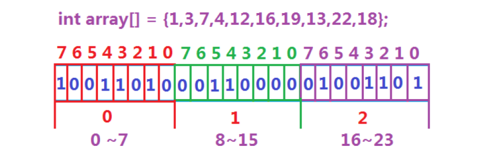

只需要**0.5GB**的内存空间

> 所谓位图，就是用每一位来存放某种状态，适用于海量数据，数据无重复的场景。通常是用来判断某个数据存不存在的。

**映射x的时候**：
+ 那么`x`在数组的第几个整形呢？ `i  =  x / 32`
+ 那么`x`在数组的第几个位呢？ `i  =  x % 32`
## 代码实现
### 将x比特位置1
**在左移的时候不是方向，不管是大端机还是小端机，左移是向高位移动**

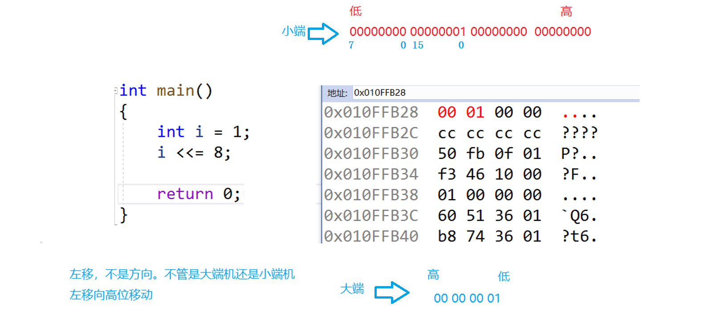

```cpp
// 将x比特位置1
void set(size_t x)
{
    // 计算第几个整形
    size_t i = x / 32;
    // 计算第几个位
    size_t j = x % 32;
    // 将第j位处理成1其他位不变
    _bits[i] |= (1 << j);
}
```

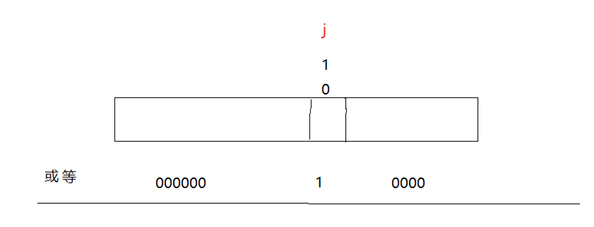

### 将x比特位置0
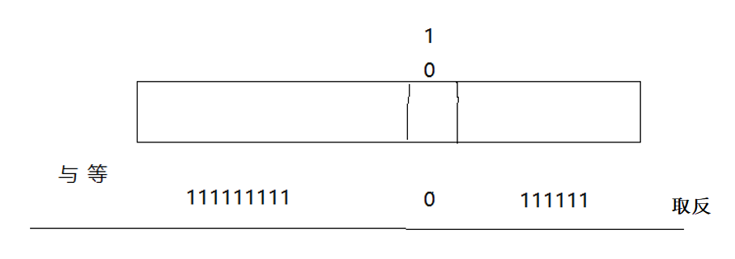

```cpp
// 将x比特位置0
void reset(size_t x)
{
    // 计算第几个整形
    size_t i = x / 32;
    // 计算第几个位
    size_t j = x % 32;
    // 将第j位处理成0其他位不变
    _bits[i] &= ~(1 << j);
}
```

### 检测位图中x是否为1
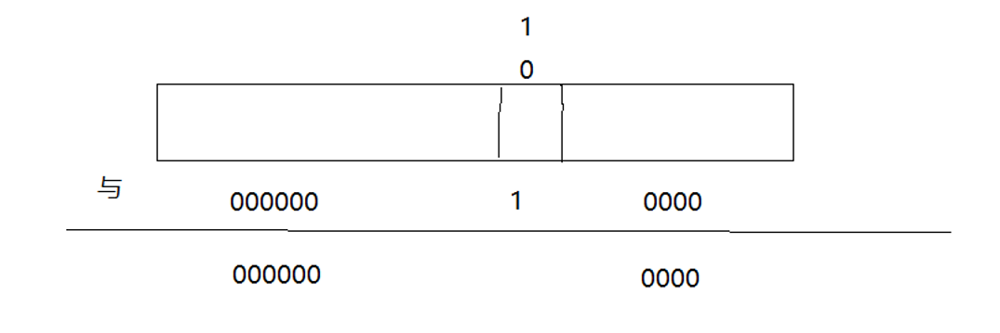

```cpp
// 检测位图中x是否为1
bool test(size_t x)
{
    // 计算第几个整形
    size_t i = x / 32;
    // 计算第几个位
    size_t j = x % 32;
    // 检测第j位是否为1
    return _bits[i] & (1 << j);
}
```

### 全部代码实现
```cpp
#pragma once
#include <iostream>
#include <vector>

using namespace std;

namespace lsl
{
    template<size_t N>
    class bitset
    {
    public:
        // 构造
        bitset()
        {
            // _bits.resize((N >> 5) + 1, 0); // 可以这样写，但是要注意优先级
            _bits.resize(N / 32 + 1, 0);
        }

        // 将x比特位置1
        void set(size_t x)
        {
            // 计算第几个整形
            // size_t i = x >> 5; // 也可以这样写
            size_t i = x / 32;
            // 计算第几个位
            size_t j = x % 32;
            // 将第j位处理成1其他位不变
            _bits[i] |= (1 << j);
        }

        // 将x比特位置0
        void reset(size_t x)
        {
            // 计算第几个整形
            size_t i = x / 32;
            // 计算第几个位
            size_t j = x % 32;
            // 将第j位处理成0其他位不变
            _bits[i] &= ~(1 << j);
        }

        // 检测位图中x是否为1
        bool test(size_t x)
        {
            // 计算第几个整形
            size_t i = x / 32;
            // 计算第几个位
            size_t j = x % 32;
            // 检测第j位是否为1
            return _bits[i] & (1 << j);
        }

    private:
        vector<int> _bits;
    };
}
```

## C++库中的位图 bitset
[bitset - C++ Reference](https://legacy.cplusplus.com/reference/bitset/bitset/)

可以看到核心接口还是set/reset/和test，当然后面还实现了一些其他接口，如to_string将位图按位转成01字符串，再包括operator[]等支持像数组一样控制一个位的实现

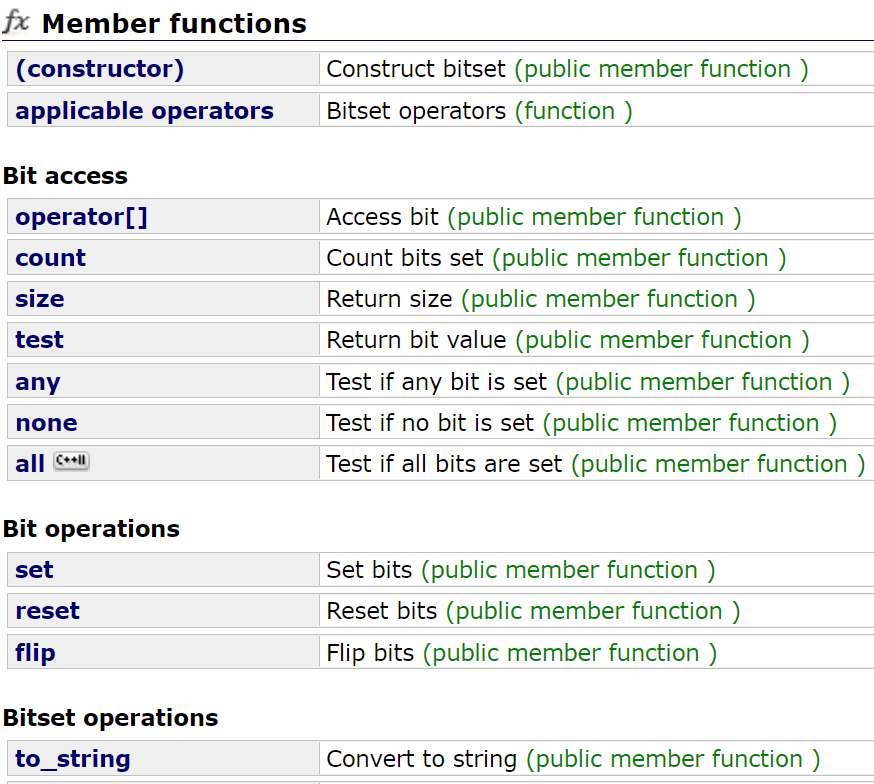

## 位图的应用
1. **快速查找某个数据是否在一个集合中** 
2. **排序 + 去重**
3. **求两个集合的交集、并集等** 
4. **操作系统中磁盘块标记**

# 布隆过滤器
## 布隆过滤器提出
我们在使用新闻客户端看新闻时，它会给我们不停地推荐新的内容，它每次推荐时要去重，去掉 那些已经看过的内容。问题来了，新闻客户端推荐系统如何实现推送去重的？ 用服务器记录了用户看过的所有历史记录，当推荐系统推荐新闻时会从每个用户的历史记录里进行筛选，过滤掉那 些已经存在的记录。 如何快速查找呢？

1. 用哈希表存储用户记录，缺点：浪费空间 
2. 用位图存储用户记录，缺点：位图一般只能处理整形，如果内容编号是字符串，就无法处理 了。 
3. 将哈希与位图结合，即**布隆过滤器**

## 布隆过滤器概念
布隆过滤器是由布隆（Burton Howard Bloom）在1970年提出的 一种紧凑型的、比较巧妙的概率型数据结构，特点是高效地插入和查询，可以用来告诉你 **“某样东西一定不存在或者可能存在”**，它是用多个哈希函数，将一个数据映射到位图结构中。此种方式不仅可以提升查询效率，也 可以节省大量的内存空间。

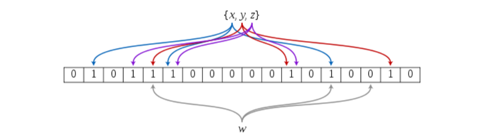

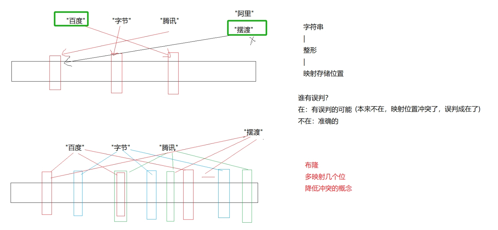

## 布隆过滤器的特点
+ 当布隆过滤器判断一个数据存在可能是不准确的，因为这个数据对应的比特位可能被其他一个数据或多个数据占用了。
+ 当布隆过滤器判断一个数据不存在是准确的，因为如果该数据存在那么该数据对应的比特位都应该已经被设置为1了。

## 控制误判率
+ 其中k为哈希函数个数，m为布隆过滤器长度，n为插入的元素个数，p为误判率。

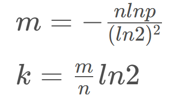

我们这里可以大概估算一下，如果使用3个哈希函数，即k的值为3，值我们取0.7，那么m和n的关系大概是`m = 4 × n`，也就是布隆过滤器的长度应该是插入元素个数的4倍。

## 布隆过滤器的实现
首先，布隆过滤器可以实现为一个模板类，因为插入布隆过滤器的元素不仅仅是字符串，也可以是其他类型的数据，只有调用者能够提供对应的哈希函数将该类型的数据转换成整型即可，但一般情况下布隆过滤器都是用来处理字符串的，所以这里可以将模板参数K的缺省类型设置为string。

布隆过滤器中的成员一般也就是一个位图，我们可以在布隆过滤器这里设置一个非类型模板参数**N**，用于让调用者指定位图的长度。

```cpp
//布隆过滤器
template<size_t N, class K = string, class HashFunc1 = BKDRHash, class HashFunc2 = APHash, class HashFunc3 = DJBHash>
class BloomFilter
{
public:
    //...
private:
    lsl::bitset<N> _bs;
};
```

+ 实例化布隆过滤器时需要调用者提供三个哈希函数，由于布隆过滤器一般处理的是字符串类型的数据，因此这里我们可以默认提供几个将字符串转换成整型的哈希函数。
+ 这里选取将字符串转换成整型的哈希函数，是经过测试后综合评分最高的**BKDRHash**、**APHash**和**DJBHash**，这三种哈希算法在多种场景下产生哈希冲突的概率是最小的。
+ 此时本来这三种哈希函数单独使用时产生冲突的概率就比较小，现在要让它们同时产生冲突概率就更小了。

代码：

```cpp
struct BKDRHash
{
    size_t operator()(const string& s)
    {
        size_t value = 0;
        for (auto ch : s)
        {
            value = value * 131 + ch;
        }
        return value;
    }
};
struct APHash
{
    size_t operator()(const string& s)
    {
        size_t value = 0;
        for (size_t i = 0; i < s.size(); i++)
        {
            if ((i & 1) == 0)
            {
                value ^= ((value << 7) ^ s[i] ^ (value >> 3));
            }
            else
            {
                value ^= (~((value << 11) ^ s[i] ^ (value >> 5)));
            }
        }
        return value;
    }
};
struct DJBHash
{
    size_t operator()(const string& s)
    {
        if (s.empty())
            return 0;
        size_t value = 5381;
        for (auto ch : s)
        {
            value += (value << 5) + ch;
        }
        return value;
    }
};
```

### 布隆过滤器的插入
+ 布隆过滤器当中需要提供一个Set接口，用于插入元素到布隆过滤器当中。插入元素时，需要通过三个哈希函数分别计算出该元素对应的三个比特位，然后将位图中的这三个比特位设置为1即可。

```cpp
void Set(const K& key)
{
    //计算出key对应的三个位
    size_t hash1 = HashFunc1()(key) % N;
    size_t hash2 = HashFunc2()(key) % N;
    size_t hash3 = HashFunc3()(key) % N;
    // 将位图中的这三个位设置成1
    _bs.set(hash1);
    _bs.set(hash2);
    _bs.set(hash3);
}
```

### 布隆过滤器的查找
检测时，需要通过三个哈希函数分别计算出该元素对应的三个比特位，然后判断位图中的这三个比特位是否被设置为1。

+ **只要这三个比特位当中有一个比特位未被设置则说明该元素一定不存在。**
+ **如果这三个比特位全部被设置，则返回true表示该元素存在（可能存在误判）。**

```cpp
bool Test(const T& key)
{
    //依次判断key对应的三个位是否被设置
    size_t hash1 = HashFunc1()(key) % N;
    if (_bs.test(hash1) == false)
        return false;

    size_t hash2 = HashFunc2()(key) % N;
    if (_bs.test(hash1) == false)
        return false;

    size_t hash3 = HashFunc3()(key) % N;
    if (_bs.test(hash1) == false)
        return false;

    return true; // 可能存在，但是可能存在误判
}
```

### 布隆过滤器的删除
布隆过滤器一般**不支持删除**操作：

+ 因为布隆过滤器判断一个元素存在时可能存在误判，因此无法保证要删除的元素确实在布隆过滤器当中，此时将位图中对应的比特位清0会影响其他元素。
+ 此外，就算要删除的元素确实在布隆过滤器当中，也可能该元素映射的多个比特位当中有些比特位是与其他元素共用的，此时将这些比特位清0也会影响其他元素。

> 如何让布隆过滤器支持删除？
>

要让布隆过滤器支持删除，必须要做到以下两点：

1. 保证要删除的元素在布隆过滤器当中。比如刚才的呢称例子当中，如果通过调用Test函数得知要删除的昵称可能存在布隆过滤器当中后，可以进一步遍历存储昵称的文件，确认该昵称是否真正存在。
2. 保证删除后不会影响到其他元素。可以为位图中的每一个比特位设置一个对应的计数值，当插入元素映射到该比特位时将该比特位的**计数值++**，当删除元素时将该元素对应比特位的**计数值–-**即可。

> 可是布隆过滤器最终还是没有提供删除的接口，因为使用布隆过滤器本来就是要节省空间和提高效率的。在删除时需要遍历文件或磁盘中确认待删除元素确实存在，而文件IO和磁盘IO的速度相对内存来说是很慢的，并且为位图中的每个比特位额外设置一个计数器，就需要多用原位图几倍的存储空间，这个代价也是不小的。
>

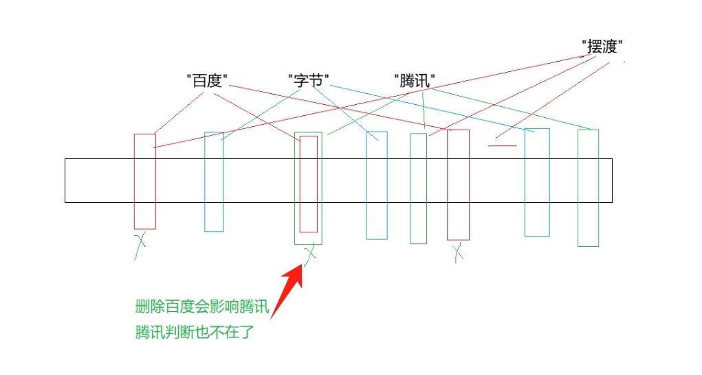

缺陷：

1. 无法确认元素是否真正在布隆过滤器中 
2. 存在计数回绕

### 布隆过滤器优点
1. 增加和查询元素的时间复杂度为:O(K), (K为哈希函数的个数，一般比较小)，与数据量大小无关 
2. 哈希函数相互之间没有关系，方便硬件并行运算 
3. 布隆过滤器不需要存储元素本身，在某些对保密要求比较严格的场合有很大优势 
4. 在能够承受一定的误判时，布隆过滤器比其他数据结构有这很大的空间优势 
5. 数据量很大时，布隆过滤器可以表示全集，其他数据结构不能 
6. 使用同一组散列函数的布隆过滤器可以进行交、并、差运算

### 布隆过滤器缺陷
1. 有误判率，即存在假阳性(False Position)，即不能准确判断元素是否在集合中(补救方法：再建立一个白名单，存储可能会误判的数据) 
2. 不能获取元素本身 
3. 一般情况下不能从布隆过滤器中删除元素 
4. 如果采用计数方式删除，可能会存在计数回绕问题

### 布隆过滤器使用场景
+ 比如当我们首次访问某个网站时需要用手机号注册账号，而用户的各种数据实际都是存储在数据库当中的，也就是磁盘上面。
+ 当我们用手机号注册账号时，系统就需要判断你填入的手机号是否已经注册过，如果注册过则会提示用户注册失败。
+ 但这种情况下系统不可能直接去遍历磁盘当中的用户数据，判断该手机号是否被注册过，因为磁盘IO是很慢的，这会降低用户的体验。
+ 这种情况下就可以使用布隆过滤器，将所有注册过的手机号全部添加到布隆过滤器当中，当我们需要用手机号注册账号时，就可以直接去布隆过滤器当中进行查找。

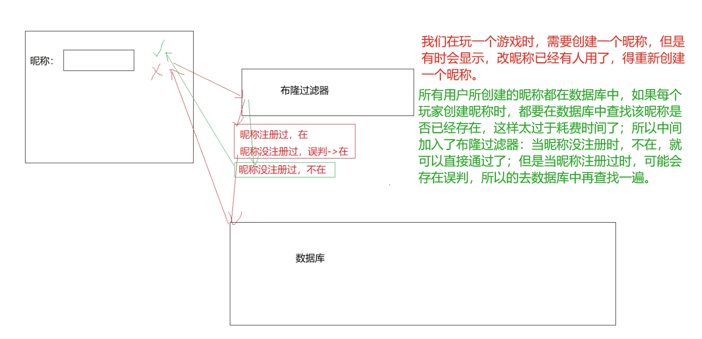

+ 如果在布隆过滤器中查找后发现该手机号不存在，则说明该手机号没有被注册过，此时就可以让用户进行注册，并且避免了磁盘IO。
+ 如果在布隆过滤器中查找后发现该手机号存在，此时还需要进一步访问磁盘进行复核，确认该手机号是否真的被注册过，因为布隆过滤器在判断元素存在时可能会误判。
+ 由于大部分情况下用户用一个手机号注册账号时，都是知道自己没有用该手机号注册过账号的，因此在布隆过滤器中查找后都是找不到的，此时就避免了进行磁盘IO。而只有布隆过滤器误判或用户忘记自己用该手机号注册过账号的情况下，才需要访问磁盘进行复核。

# 位图的应用
## 给定一个100亿个整数，设计算法找到只出现一次的整数？
+ 出现0次-->00来代表
+ 出现1次-->01来代表
+ 出现2次以上-->10来代表

---

+ 存储100亿个整数大概需要40G的内存空间，因此题目中的100亿个整数肯定是存储在文件当中的，代码中直接从vector中读取数据是为了方便演示。
+ 为了能映射所有整数，位图的大小必须开辟为`2^32`位，也就是代码中的**4294967295**，因此开辟一个位图大概需要512M的内存空间，两个位图就要占用1G的内存空间，所以代码中选择在堆区开辟空间，若是在栈区开辟则会导致栈溢出。

代码实现：

```cpp
template<size_t N>
class twobitset
{
public:
    void set(size_t x)
    {
        if (_bs1.test(x) == false && _bs2.test(x) == false) // 00
        {
            _bs2.set(x); // _bs1不需要动 _ba2设置成1
        }
        else // if (_bs1.test(x) == false && _bs2.test(x) == true) // 01
        {
            _bs1.set(x); // 1
            _bs2.reset(x); // 0
        }
    }

    void Print()
    {
        for (size_t i = 0; i < N; i++)
        {
            if (_bs1.test(i) == false && _bs2.test(i) == true) // 01 -->出现一次
            {
                cout << "1->" << i << endl;
            }
            else if (_bs1.test(i) == true && _bs2.test(i) == false) //10 -->出现两次以上
            {
                cout << "2->" << i << endl;
            }
        }
        cout << endl;
    }

private:
    bitset<N> _bs1;
    bitset<N> _bs2;
};
```

## 给两个文件，分别有100亿个整数，我们只有1G内存，如何找到两个文件的交集？
**各自映射到一个位图，一个值在两个位图都存在，则是交集**

+ 方案一：（一个位图需要512M内存）
1. 依次读取第一个文件中的所有整数，将其映射到一个位图。
2. 再读取另一个文件中的所有整数，判断在不在位图中，在就是交集，不在就不是交集。
+ 方案二：（两个位图刚好需要1G内存，满足要求）
1. 依次读取第一个文件中的所有整数，将其映射到位图1。
2. 依次读取另一个文件中的所有整数，将其映射到位图2。
+ 将位图1和位图2进行**与**操作，结果存储在位图1中，此时位图1当中映射的整数就是两个文件的交集。

对于32位的整型，无论待处理的整数个数是多少，开辟的位图都必须有2^32个比特位，也就是512M，因为我们要保证每一个整数都能够映射到位图当中，因此这里位图的空间消耗是固定的。

## 位图应用变形：1个文件有100亿个int，1G内存，设计算法找到出现次数不超过2次的整数
+ 出现0次-->00来代表
+ 出现1次-->01来代表
+ 出现2次-->10来代表
+ 出现3次及以上-->11来代表

> 一个整数要表示四种状态也是只需要两个位就够了，此时当我们读取到重复的整数时，就可以让其对应的两个位按照00→01→10→11的顺序进行变化，最后状态是01或10的整数就是出现次数不超过2次的整数。


代码实现：

```cpp
template<size_t N>
class twobitset
{
public:
    void set(size_t x)
    {
        if (_bs1.test(x) == false && _bs2.test(x) == false) // 00
        {
            _bs2.set(x); // _bs1不需要动 _ba2设置成1
        }
        else if (_bs1.test(x) == false && _bs2.test(x) == true) // 01
        {
            _bs1.set(x); // 1
            _bs2.reset(x); // 0
        }
        else if (_bs1.test(x) == true && _bs2.test(x) == false) // 10
        {
            _bs1.set(x); // 1
            _bs2.set(x); // 1
        }
        else
        {}
    }

    void Print()
    {
        for (size_t i = 0; i < N; i++)
        {
            if (_bs1.test(i) == false && _bs2.test(i) == true) // 01 -->出现一次
            {
                cout << "1->" << i << endl;
            }
            else if (_bs1.test(i) == true && _bs2.test(i) == false) //10 -->出现两次
            {
                cout << "2->" << i << endl;
            }
        }
        cout << endl;
    }

private:
    bitset<N> _bs1;
    bitset<N> _bs2;
};
```

# 布隆过滤器相关
## 给两个文件，分别有100亿个query，我们只有1G内存，如何找到两个文件的交集？给出近似算法。
+ 允许存在一些误判，那么我们就可以用布隆过滤器。
+ 先读取其中一个文件当中的query，将其全部映射到一个布隆过滤器当中。
+ 然后读取另一个文件当中的query，依次判断每个query是否在布隆过滤器当中，如果在则是交集，不在则不是交集。

# 哈希切割相关
## 给两个文件，分别有100亿个query，我们只有1G内存，如何找到两个文件的交集？给出精确算法。
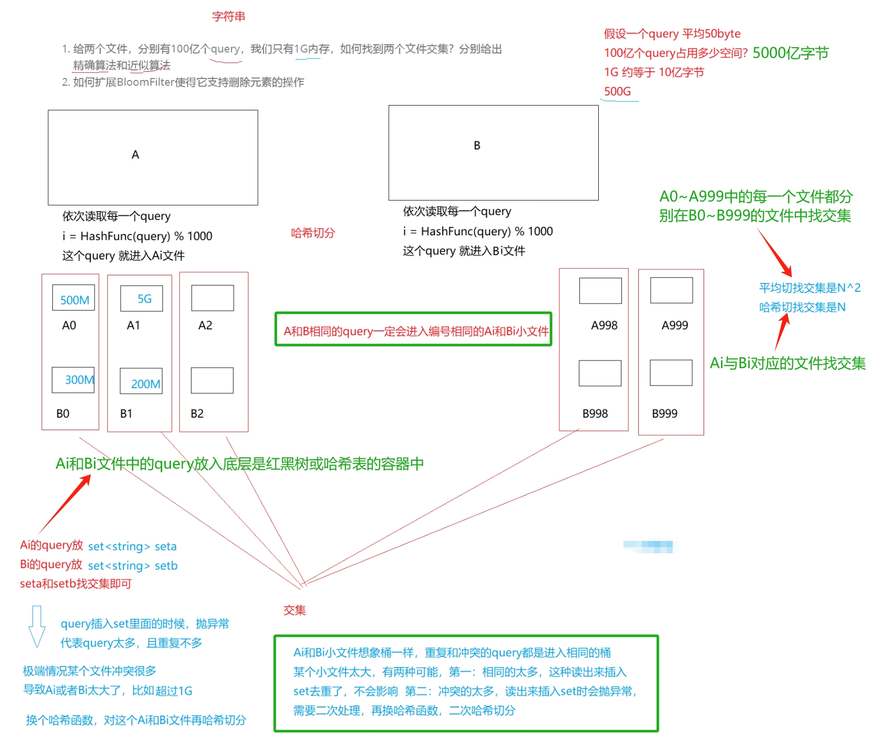

现在要求给出精确算法，那么就不能使用布隆过滤器了，此时需要用到哈希切分。

+ 假设平均每个query为20字节，那么100亿个query就是200G，由于我们只有1G内存，这里可以考虑将一个文件切分成400个小文件。
+ 这里我们将这两个文件分别叫做A文件和B文件，此时我们将A文件切分成了A0~A399共400个小文件，将B文件切分成了B0~B399共400个小文件。

在切分时需要选择一个哈希函数进行哈希切分，以切分A文件为例，切分时依次遍历A文件当中的每个query，通过哈希函数将每个query转换成一个整型，然后将这个query写入到小文件Ai当中。对于B文件也是同样的道理，但切分A文件和B文件时必须采用的是同一个哈希函数。

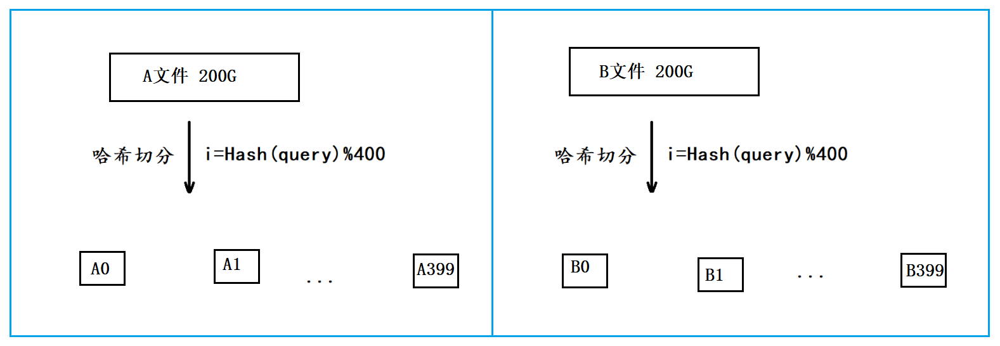

+ **由于切分A文件和B文件时采用的是同一个哈希函数，因此A文件与B文件中相同的query计算出的值都是相同的，最终就会分别进入到Ai和Bi文件中，这也是哈希切分的意义。**
+ 我们就只需要分别找出A0与B0的交集、A1与B1的交集、…、A399与B399的交集，最终将这些交集和起来就是A文件和B文件的交集。

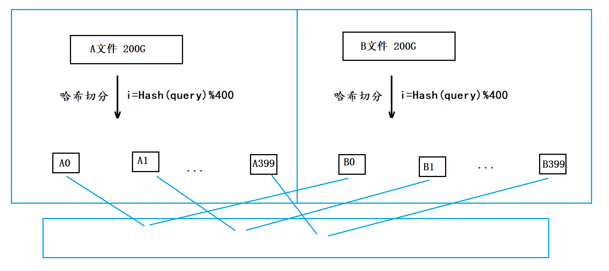

那各个小文件之间又应该如何找交集呢？

+ 经过切分后理论上每个小文件的平均大小是512M，因此我们可以将其中一个小文件加载到内存，并放到一个set容器中，再遍历另一个小文件当中的query，依次判断每个query是否在set容器中，如果在则是交集，不在则不是交集。
+ 当哈希切分并不是平均切分，有可能切出来的小文件中有一些小文件的大小仍然大于1G，此时如果与之对应的另一个小文件可以加载到内存，则可以选择将另一个小文件中的query加载到内存，因为我们只需要将两个小文件中的一个加载到内存中就行了。
+ 但如果两个小文件的大小都大于1G，那我们可以考虑将这两个小文件再进行一次切分，将其切成更小的文件，方法与之前切分A文件和B文件的方法类似。

将这些小文件看作一个个的哈希桶，将大文件中的query通过哈希函数映射到这些哈希桶中，如果是相同的query，则会产生哈希冲突进入到同一个小文件中。

## 给一个超过100G大小的log file，log中存着IP地址，设计算法找到出现次数最多的IP地址？如何找到top K的IP？如何直接用Linux系统命令实现？
+ 我们将这个log file叫做A文件，由于A文件的大小超过100G，这里可以考虑将A文件切分成200个小文件。
+ 在切分时选择一个哈希函数进行哈希切分，通过哈希函数将A文件中的每个IP地址转换成一个整型`i（0 ≤ i ≤ 199）`，然后将这个IP地址写入到小文件Ai当中。
+ 由于哈希切分时使用的是同一个哈希函数，因此相同的IP地址计算出的值是相同的，最终这些相同的IP地址就会进入到同一个Ai小文件当中。

经过哈希切分后得到的这些小文件，理论上就能够加载到内存当中了，如果个别小文件仍然太大那可以对其再进行一次哈希切分，总之让最后切分出来的小文件能够加载到内存。

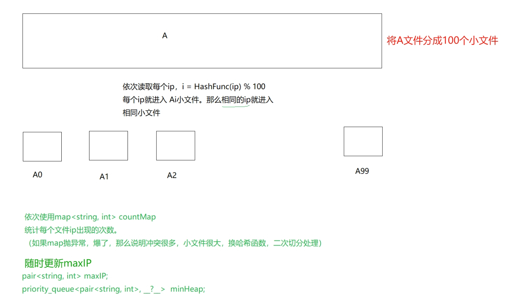

现在要找到出现次数最多的IP地址，就可以分别将各个小文件加载到内存中， 然后用一个**map<string, int>** 容器统计出每个小文件中各个IP地址出现的次数，然后比对各个小文件中出现次数最多的IP地址，最终就能够得到log file中出现次数最多的IP地址。

如果要找到出现次数top K的IP地址，可以先将一个小文件加载到内存中，选出小文件中出现次数最多的K个IP地址建成一个小堆，然后再依次比对其他小文件中各个IP地址出现的次数，如果某个IP地址出现的次数大于堆顶IP地址出现的次数，则将该IP地址与堆顶的IP地址进行交换，然后再进行一次向下调整，使其仍为小堆，最终比对完所有小文件中的IP地址后，这个小堆当中的K个IP地址就是出现次数top K的IP地址。

在Linux下我们可以使用此命令来完成：

```bash
sort log_txt | uniq -c | sort -nrk1,1 | head -K
```

