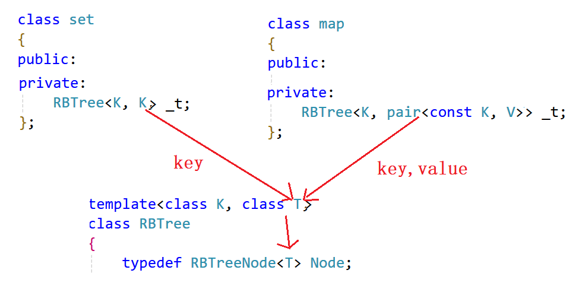
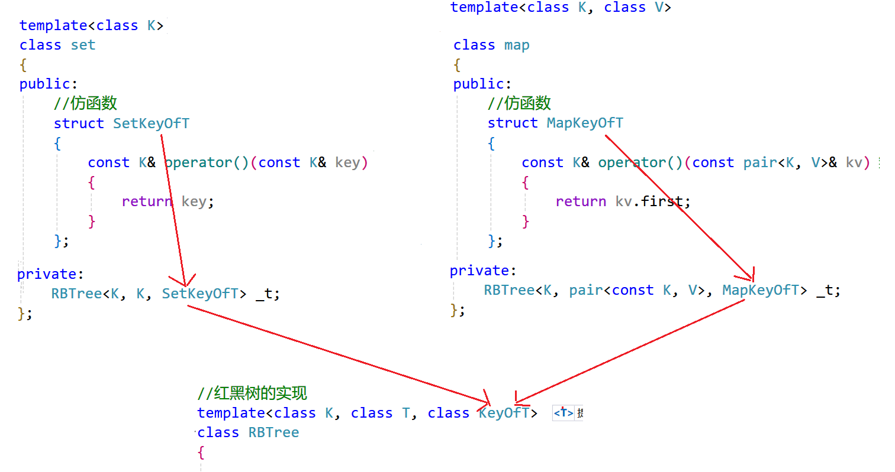

## 封装方式
使用KV模型的红黑树进行封装，同时**模拟实现出C++STL库当中的map和set**

## 红黑树模板参数的控制
用一棵KV模型的红黑树同时实现map和set，现在将红黑树第二个模板参数的名字改为`T`

```cpp
template<class K, class T>
class RBTree
```

T模板参数可能只是键值Key，也可能是由Key和Value共同构成的键值对。如果是set容器，那么它传入底层红黑树的模板参数就是Key和Key

```cpp
template<class K>
class set
{
public:
    //...
private:
    RBTree<K, K> _t;
};
```

+ 但如果是map容器，那么它传入底层红黑树的模板参数就是**Key**以及**Key**和**Value**构成的键值对：

```cpp
template<class K, class V>
class map
{
public:
    //...
private:
    RBTree<K, pair<K, V>> _t;
};
```

那能不能不要红黑树的第一个模板参数，只保留第二个模板参数呢？

对于**set容器**来说，**省略红黑树的第一个参数当然没问题**，因为set传入红黑树的第二个参数与第一个参数是一样的。但是**对于map容器来说就不行了**，因为**map容器所提供的接口当中有些是只要求给出键值Key**的，比如`find`和`erase`。

## 红黑树结点当中存储的数据
set容器：**K和T都代表键值Key**。  
map容器：**K代表键值Key，T代表由Key和Value构成的键值对**。

+ 对于set容器来说，底层红黑树结点当中存储K和T都是一样的，但是对于map容器来说，底层红黑树就只能存储T了。由于底层红黑树并不知道上层容器到底是map还是set，因此红黑树的结点当中直接存储T。
+ 当上层容器是set的时候，结点当中存储的是键值Key；当上层容器是map的时候，结点当中存储的就是`<Key, Value>`键值对。



```cpp
//红黑树结点的定义
template<class T>
struct RBTreeNode
{
    //三叉链
    RBTreeNode<T>* _left;
    RBTreeNode<T>* _right;
    RBTreeNode<T>* _parent;

    //存储的数据
    T _data;

    //结点的颜色
    Colour _col; //红/黑

    //构造函数
    RBTreeNode(const T& data)
        :_left(nullptr)
        , _right(nullptr)
        , _parent(nullptr)
        , _data(data)
        , _col(RED)
    {}
};
```

## 模板参数中仿函数的增加
当上层容器是set的时候T就是键值Key，直接用T进行比较即可，但当上层容器是map的时候就不行了，此时我们需要从`<Key, Value>`键值对当中取出键值Key后，再用Key值进行比较。

因此，上层容器map需要向底层红黑树提供一个仿函数，用于获取T当中的键值Key，这样一来，当底层红黑树当中需要比较两个结点的键值时，就可以通过这个**仿函数来获取T当中的键值**了。

由于map中的pair中的first是不可修改的key，所以这里就可以增加上const。

```cpp
template<class K, class V>
class map
{
    //仿函数
    struct MapKeyOfT
    {
        const K& operator()(const pair<K, V>& kv) //返回键值对当中的键值Key
        {
            return kv.first;
        }
    };
public:
    //...
private:
    RBTree<K, pair<const K, V>, MapKeyOfT> _t;
};
```

+ 但是对于底层红黑树来说，它并不知道上层容器是map还是set，因此当需要进行两个结点键值的比较时，底层红黑树都会通过传入的仿函数来获取键值Key，进而进行两个结点键值的比较。
+ set容器也需要向底层红黑树传入一个仿函数。
+ set中的key也是不可以修改的，可以加上const。

```cpp
template<class K>
class set
{
    //仿函数
    struct SetKeyOfT
    {
        const K& operator()(const K& key) //返回键值Key
        {
            return key;
        }
    };
public:
    //...
private:
    RBTree<K, const K, SetKeyOfT> _t;
};
```

+ set容器传入底层红黑树的就是set的仿函数，map容器传入底层红黑树的就是map的仿函数。



+ 当底层红黑树需要进行两个结点之间键值的比较时，都会通过传入的仿函数来获取相应结点的键值，然后再进行比较
+ **注意**： 所有进行结点键值比较的地方，均需要通过仿函数获取对应结点的键值后再进行键值的比较。

## 普通迭代器和const迭代器的实现
### 思路
迭代器++时，如果it指向的结点的右子树不为空，代表当前结点已经访问完了，要访问下一个结点是右子树的中序第一个，一棵树中序第一个是最左结点，所以直接找右子树的最左结点即可。

迭代器++时，如果it指向的结点的右子树空，代表当前结点已经访问完了且当前结点所在的子树也访问完了，要访问的下一个结点在当前结点的祖先里面，所以要沿着当前结点到根的祖先路径向上找。

+ 如果当前结点是父亲的左，根据中序左子树->根结点->右子树，那么下一个访问的结点就是当前结点的父亲。
+ 如果当前结点是父亲的右，根据中序左子树->根结点->右子树，当前当前结点所在的子树访问完了，当前结点所在父亲的子树也访问完了，那么下一个访问的需要继续往根的祖先中去找，直到找到孩子是父亲左的那个祖先就是中序要问题的下一个结点。

end()如何表示呢？如下图：当it指向50时，++it时，50是40的右，40是30的右，30是18的右，18到根没有父亲，没有找到孩子是父亲左的那个祖先，这是父亲为空了，那我们就把it中的结点指针置为nullptr，我们用nullptr去充当end。需要注意的是stl源码空，红黑树增加了一个哨兵位头结点做为end()，这哨兵位头结点和根互为父亲，左指向最左结点，右指向最右结点。相比我们用nullptr作为end()，差别不大，他能实现的，我们也能实现。只是--end()判断到结点时空，特殊处理一下，让迭代器结点指向最右结点。

迭代器--的实现跟++的思路完全类似，逻辑正好反过来即可，因为他访问顺序是右子树->根结点->左子树。

set的`iterator`也不支持修改，我们把set的第二个模板参数改成`const K`即可，`RBTree<K, const K, SetKeyOfT> _t;`

map的`iterator`不支持修改key但是可以修改value，我们把map的第二个模板参数pair的第一个参数改成`const K`即可， `RBTree<K, pair<const K, V>, MapKeyOfT> _t`;

### myMap.h
```cpp
#pragma once
#include"RBTree.h"

namespace lsl //防止命名冲突
{
    template<class K, class V>
    class map
    {
    public:
        //仿函数
        struct MapKeyOfT
        {
            const K& operator()(const pair<K, V>& kv) //返回键值对当中的键值Key
            {
                return kv.first;
            }
        };
        // 对类模板取内嵌类型，加typename告诉编译器这里是类型
        typedef typename RBTree<K, pair<const K, V>, MapKeyOfT>::iterator iterator;
        typedef typename RBTree<K, pair<const K, V>, MapKeyOfT>::const_iterator const_iterator; // const迭代器

        iterator begin()		
        {
            return _t.begin();
        }
        iterator end()
        {
            return _t.end();
        } 
        const_iterator begin() const
        {
            return _t.begin();
        }
        const_iterator end() const
        {
            return _t.end();
        }
    
        //插入函数
        pair<iterator, bool> insert(const pair<const K, V>& kv)
        {
            return _t.Insert(kv);
        }
        //[]运算符重载函数
        V& operator[](const K& key)
        {
            pair<iterator, bool> ret = insert(make_pair(key, V()));
            return ret.first->second;
        }
        //查找函数
        iterator find(const K& key)
        {
            return _t.Find(key);
        }
    private:
        RBTree<K, pair<const K, V>, MapKeyOfT> _t;
    };
}
```

### mySet.h
```cpp
#pragma once

#include "RBTree.h"
namespace lsl //防止命名冲突
{
    template<class K>
    class set
    {
    public:
        //仿函数
        struct SetKeyOfT
        {
            const K& operator()(const K& key) //返回键值Key
            {
                return key;
            }
        };
        // 对类模板取内嵌类型，加typename告诉编译器这里是类型
        typedef typename RBTree<K, const K, SetKeyOfT>::const_iterator iterator;
        typedef typename RBTree<K, const K, SetKeyOfT>::const_iterator const_iterator;//const迭代器

        iterator begin()
        {
            return _t.begin();
        }

        iterator end()
        {
            return _t.end();
        }
        
        const_iterator begin() const
        {
            return _t.begin();
        }

        const_iterator end() const
        {
            return _t.end();
        }

        //插入函数
        pair<iterator, bool> insert(const K& key)
        {
            return _t.Insert(key);
        }
        //查找函数
        iterator find(const K& key)
        {
            return _t.Find(key);
        }
    private:
        RBTree<K, const K, SetKeyOfT> _t;
    };
}
```

### RBTree.h
```cpp
#pragma once
#include<iostream>

using namespace std;

//枚举定义结点的颜色
enum Colour
{
    RED,
    BLACK
};

//红黑树结点的定义
template<class T>
struct RBTreeNode
{
    //三叉链
    RBTreeNode<T>* _left;
    RBTreeNode<T>* _right;
    RBTreeNode<T>* _parent;

    //存储的数据
    T _data;

    //结点的颜色
    Colour _col; //红/黑

    //构造函数
    RBTreeNode(const T& data)
        :_left(nullptr)
        , _right(nullptr)
        , _parent(nullptr)
        , _data(data)
        , _col(RED)
    {}
};

//正向迭代器
template<class T, class Ref, class Ptr>
struct __TreeIterator
{

    typedef RBTreeNode<T> Node; //结点的类型
    typedef __TreeIterator<T, Ref, Ptr> Self; //正向迭代器的类型

    Node* _node; //正向迭代器所封装结点的指针
    Node* _root; //根节点

    //构造函数
    __TreeIterator(Node* node, Node* root)
        :_node(node) //根据所给结点指针构造一个正向迭代器
        ,_root(root)
    {}

    Ref operator*()
    {
        return _node->_data; //返回结点数据的引用
    }
    Ptr operator->()
    {
        return &_node->_data; //返回结点数据的指针
    }
    //判断两个正向迭代器是否不同
    bool operator!=(const Self& s) const
    {
        return _node != s._node; //判断两个正向迭代器所封装的结点是否是同一个
    }
    //判断两个正向迭代器是否相同
    bool operator==(const Self& s) const
    {
        return _node == s._node; //判断两个正向迭代器所封装的结点是否是同一个
    }

    //前置++
    /*
    1. it指向的节点，右子树不为空，下一个右子树的最左节点
    2. it指向的节点，右子树为空，it中的节点所在的子树访问完了，往上找孩子是父亲左的那个祖先
    */
    Self& operator++()
    {
        if (_node->_right) //结点的右子树不为空
        {
            //寻找该结点右子树当中的最左结点
            Node* left = _node->_right;
            while (left->_left)
            {
                left = left->_left;
            }
            _node = left; //++后变为该结点
        }
        else //结点的右子树为空
        {
            //寻找孩子不在父亲右的祖先
            Node* cur = _node;
            Node* parent = cur->_parent;
            while (parent && cur == parent->_right)
            {
                cur = parent;
                parent = parent->_parent;
            }
            _node = parent; //++后变为该结点
        }
        return *this;
    }

    //前置--
    Self& operator--()
    {
        if (_node == nullptr) // end()
        {
            // --end()，特殊处理，走到中序最后一个结点，整棵树的最右结点
            Node* rightMost = _root;
            while (rightMost && rightMost->_right)
            {
                rightMost = rightMost->_right;
            }
            _node = rightMost;
        }
        else if (_node->_left) //结点的左子树不为空
        {
            //寻找该结点左子树当中的最右结点
            Node* right = _node->_left;
            while (right->_right)
            {
                right = right->_right;
            }
            _node = right; //--后变为该结点
        }
        else //结点的左子树为空
        {
            //寻找孩子不在父亲左的祖先
            Node* cur = _node;
            Node* parent = cur->_parent;
            while (parent && cur == parent->_left)
            {
                cur = parent;
                parent = parent->_parent;
            }
            _node = parent; //--后变为该结点
        }
        return *this;
    }
};


//红黑树的实现
template<class K, class T, class KeyOfT>
class RBTree
{
    KeyOfT kot; // 用于比较
    typedef RBTreeNode<T> Node; //结点的类型
public:
    typedef __TreeIterator<T, T&, T*> iterator;
    typedef __TreeIterator<T, const T&, const T*> const_iterator; //const迭代器

    iterator begin()
    {
        //寻找最左结点
        Node* left = _root;
        while (left && left->_left)
        {
            left = left->_left;
        }
        //返回最左结点的正向迭代器
        return iterator(left, _root);
    }

    iterator end()
    {
        //返回由nullptr构造得到的正向迭代器（不严谨）
        return iterator(nullptr, _root);
    }

    const_iterator begin()const
    {
        //寻找最左结点
        Node* left = _root;
        while (left && left->_left)
        {
            left = left->_left;
        }
        //返回最左结点的正向迭代器
        return const_iterator(left, _root);
    }
    const_iterator end()const
    {
        //返回由nullptr构造得到的正向迭代器（不严谨）
        return const_iterator(nullptr, _root);
    }
    //构造函数
    RBTree()
        :_root(nullptr)
    {}

    //拷贝构造
    RBTree(const RBTree<K, T, KeyOfT>& t)
    {
        _root = _Copy(t._root, nullptr);
    }

    //赋值运算符重载（现代写法）
    RBTree<K, T, KeyOfT>& operator=(RBTree<K, T, KeyOfT> t)
    {
        swap(_root, t._root);
        return *this; //支持连续赋值
    }

    //析构函数
    ~RBTree()
    {
        _Destroy(_root);
        _root = nullptr;
    }

    //查找函数
    iterator Find(const K& key)
    {
        KeyOfT kot;
        Node* cur = _root;
        while (cur)
        {
            if (key < kot(cur->_data)) //key值小于该结点的值
            {
                cur = cur->_left; //在该结点的左子树当中查找
            }
            else if (key > kot(cur->_data)) //key值大于该结点的值
            {
                cur = cur->_right; //在该结点的右子树当中查找
            }
            else //找到了目标结点
            {
                return iterator(cur); //返回该结点
            }
        }
        return end(); //查找失败
    }

    //插入函数
	pair<iterator, bool> Insert(const T& data)
	{
		if (_root == nullptr) //若红黑树为空树，则插入结点直接作为根结点
		{
			_root = new Node(data);
			_root->_col = BLACK; //根结点必须是黑色

			return std::make_pair(iterator(_root, _root), true);
			//return { iterator(_root, _root), true }; //插入成功
		}
		//1、按二叉搜索树的插入方法，找到待插入位置
		Node* cur = _root;
		Node* parent = nullptr;
		while (cur)
		{
			if (kot(data) < kot(cur->_data)) //待插入结点的key值小于当前结点的key值
			{
				//往该结点的左子树走
				parent = cur;
				cur = cur->_left;
			}
			else if (kot(data) > kot(cur->_data)) //待插入结点的key值大于当前结点的key值
			{
				//往该结点的右子树走
				parent = cur;
				cur = cur->_right;
			}
			else //待插入结点的key值等于当前结点的key值
			{
				return std::make_pair(iterator(cur, _root), false);
				//return { iterator(cur, _root), false }; //插入成功
			}
		}

		//2、将待插入结点插入到树中
		cur = new Node(data); //根据所给值构造一个结点
		Node* newnode = cur; //记录新插入的结点（便于后序返回）
		if (kot(data) < kot(parent->_data)) //新结点的key值小于parent的key值
		{
			//插入到parent的左边
			parent->_left = cur;
			cur->_parent = parent;
		}
		else //新结点的key值大于parent的key值
		{
			//插入到parent的右边
			parent->_right = cur;
			cur->_parent = parent;
		}

		//3、若插入结点的父结点是红色的，则需要对红黑树进行调整
		while (parent && parent->_col == RED)
		{
			Node* grandfather = parent->_parent; //parent是红色，则其父结点一定存在
			if (parent == grandfather->_left) //parent是grandfather的左孩子
			{
				Node* uncle = grandfather->_right; //uncle是grandfather的右孩子
				if (uncle && uncle->_col == RED) //情况1：uncle存在且为红
				{
					//颜色调整
					parent->_col = uncle->_col = BLACK;
					grandfather->_col = RED;

					//继续往上处理
					cur = grandfather;
					parent = cur->_parent;
				}
				else //情况2+情况3：uncle不存在 + uncle存在且为黑
				{
					if (cur == parent->_left)
					{
						RotateR(grandfather); //右单旋

						//颜色调整
						grandfather->_col = RED;
						parent->_col = BLACK;
					}
					else //cur == parent->_right
					{
						RotateLR(grandfather); //左右双旋

						//颜色调整
						grandfather->_col = RED;
						cur->_col = BLACK;
					}
					break; //子树旋转后，该子树的根变成了黑色，无需继续往上进行处理
				}
			}
			else //parent是grandfather的右孩子
			{
				Node* uncle = grandfather->_left; //uncle是grandfather的左孩子
				if (uncle && uncle->_col == RED) //情况1：uncle存在且为红
				{
					//颜色调整
					uncle->_col = parent->_col = BLACK;
					grandfather->_col = RED;

					//继续往上处理
					cur = grandfather;
					parent = cur->_parent;
				}
				else //情况2+情况3：uncle不存在 + uncle存在且为黑
				{
					if (cur == parent->_left)
					{
						RotateRL(grandfather); //右左双旋

						//颜色调整
						cur->_col = BLACK;
						grandfather->_col = RED;
					}
					else //cur == parent->_right
					{
						RotateL(grandfather); //左单旋

						//颜色调整
						grandfather->_col = RED;
						parent->_col = BLACK;
					}
					break; //子树旋转后，该子树的根变成了黑色，无需继续往上进行处理
				}
			}
		}
		_root->_col = BLACK; //根结点的颜色为黑色（可能被情况一变成了红色，需要变回黑色）

		return std::make_pair(iterator(newnode, _root), true); //插入成功
		//return { iterator(newnode, _root), true }; //插入成功
	}
private:
    //拷贝树
    Node* _Copy(Node* root, Node* parent)
    {
        if (root == nullptr)
        {
            return nullptr;
        }
        Node* copyNode = new Node(root->_data);
        copyNode->_parent = parent;
        copyNode->_left = _Copy(root->_left, copyNode);
        copyNode->_right = _Copy(root->_right, copyNode);
        return copyNode;
    }

    //析构函数子函数
    void _Destroy(Node* root)
    {
        if (root == nullptr)
        {
            return;
        }
        _Destroy(root->_left);
        _Destroy(root->_right);
        delete root;
    }

    //左单旋
    void RotateL(Node* parent)
    {
        Node* subR = parent->_right;
        Node* subRL = subR->_left;
        Node* parentParent = parent->_parent;

        //建立subRL与parent之间的联系
        parent->_right = subRL;
        if (subRL)
            subRL->_parent = parent;

        //建立parent与subR之间的联系
        subR->_left = parent;
        parent->_parent = subR;

        //建立subR与parentParent之间的联系
        if (parentParent == nullptr)
        {
            _root = subR;
            _root->_parent = nullptr;
        }
        else
        {
            if (parent == parentParent->_left)
            {
                parentParent->_left = subR;
            }
            else
            {
                parentParent->_right = subR;
            }
            subR->_parent = parentParent;
        }
    }

    //右单旋
    void RotateR(Node* parent)
    {
        Node* subL = parent->_left;
        Node* subLR = subL->_right;
        Node* parentParent = parent->_parent;

        //建立subLR与parent之间的联系
        parent->_left = subLR;
        if (subLR)
            subLR->_parent = parent;

        //建立parent与subL之间的联系
        subL->_right = parent;
        parent->_parent = subL;

        //建立subL与parentParent之间的联系
        if (parentParent == nullptr)
        {
            _root = subL;
            _root->_parent = nullptr;
        }
        else
        {
            if (parent == parentParent->_left)
            {
                parentParent->_left = subL;
            }
            else
            {
                parentParent->_right = subL;
            }
            subL->_parent = parentParent;
        }
    }

    //左右双旋
    void RotateLR(Node* parent)
    {
        RotateL(parent->_left);
        RotateR(parent);
    }

    //右左双旋
    void RotateRL(Node* parent)
    {
        RotateR(parent->_right);
        RotateL(parent);
    }

    Node* _root; //红黑树的根结点
};
```

