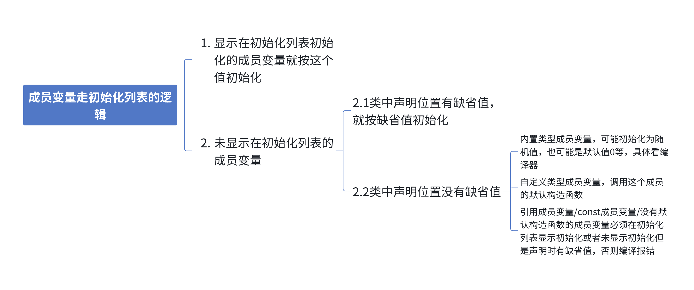
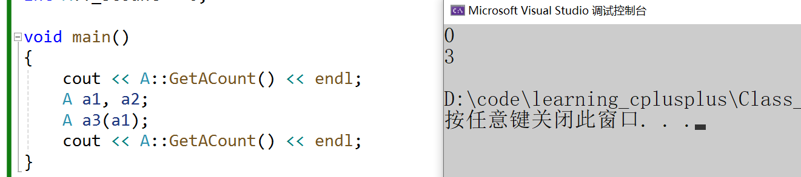
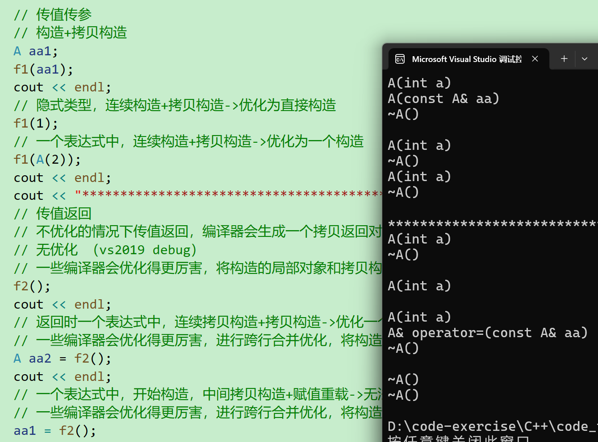
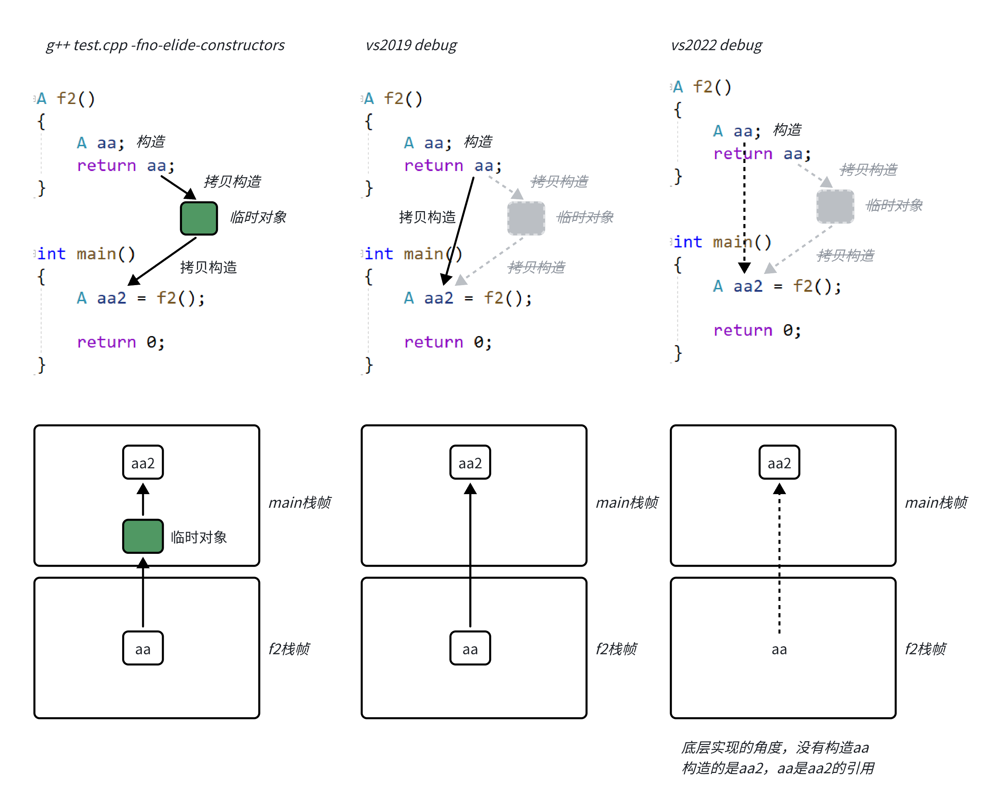
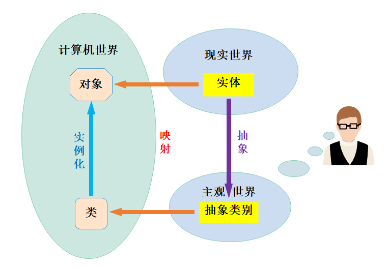
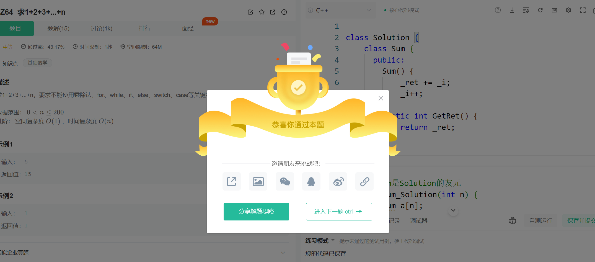
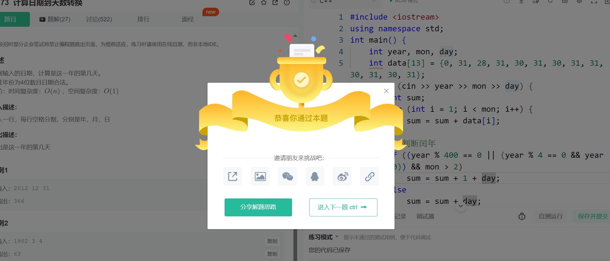
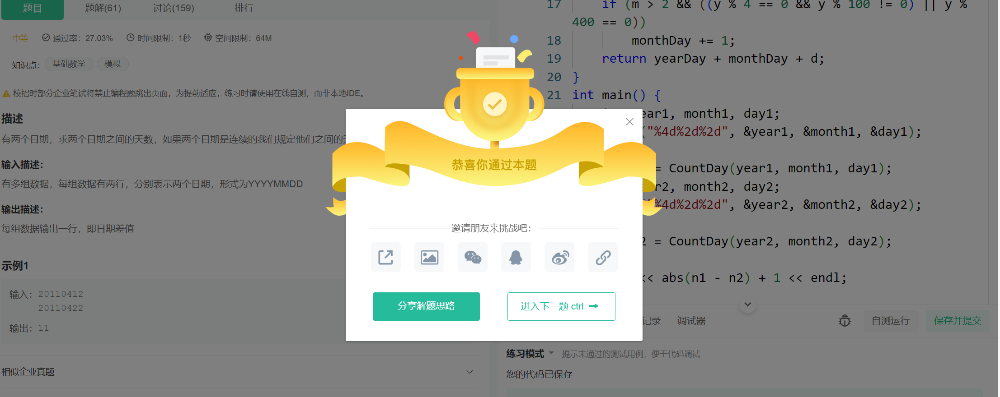
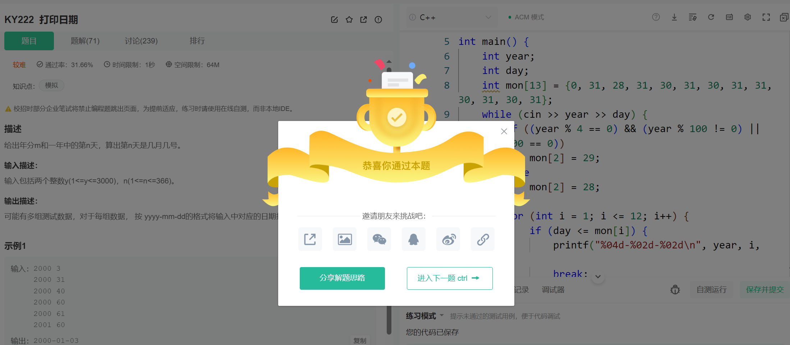
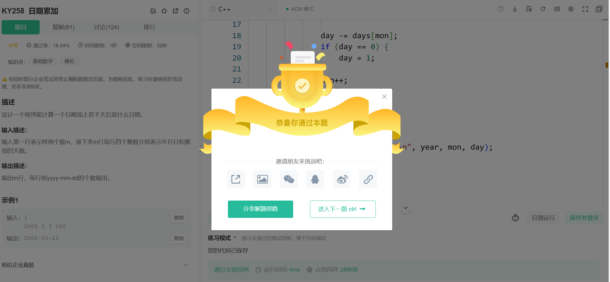

## 一、构造函数【初始化列表】
### 1.1 构造函数体赋值
+ 在创建对象时，编译器通过**调用构造函数**，给对象中各个成员变量一个合适的初始值。

```cpp
class Date
{
public:
    Date(int year, int month, int day)
    {
        _year = year;
        _month = month;
        _day = day;
    }
private:
    int _year;
    int _month;
    int _day;
};
```

+ 虽然上述构造函数调用之后，对象中已经有了一个初始值，但是不能将其称为对对象中成员变量的初始化，**构造函数体中的语句只能将其称为赋初值**，而不能**称作初始化**。因为**初始化只能初始化一次**，而**构造函数体内可以多次赋值**。

### 1.2 初始化列表
初始化列表：**以一个冒号开始，接着是一个以逗号分隔的数据成员列表，每个"成员变量"后面跟一个放在括号中的初始值或表达式。**

+ 初始化列表是每一个成员定义的地方

```cpp
class Date
{
public:
    Date(int year, int month, int day)
        : _year(year)
        , _month(month)
        , _day(day)
    {}
private:
    int _year;
    int _month;
    int _day;
};
```

**【注意】**

1. 每个成员变量在初始化列表中**只能出现一次**(初始化只能初始化一次)
    1. 每个成员变量在初始化列表中只能出现一次，语法理解上初始化列表可以认为是每个成员变量定义初始化的地方。
2. 类中包含以下成员，必须放在初始化列表位置进行初始化：
    - 引用成员变量
    - const成员变量
    - 自定义类型成员(且该类没有默认构造函数时)

```cpp
class A
{
public:
    A(int a)
        :_a(a)
    {}
private:
    int _a;
};
class B
{
public:
    B(int a, int ref)
        :_aobj(a) // 进行显示调用
        , _ref(ref)
        , _n(10)
    {}
private:
    A _aobj; // 没有默认构造函数
    int& _ref; // 引用
    const int _n; // const
};
```

**const和引用必须走初始化列表**

+ 自定义类型，如果没有默认构造函数就会报错，我们需要进行显示调用【（）里面是参数】
+ 尽量使用初始化列表，还需要进一步检查或处理，再继续使用函数体处理
3. 尽量使用初始化列表初始化，因为不管你是否使用初始化列表，对于自定义类型成员变量，一定会先使用初始化列表初始化。

```cpp
class Time
{
public:
    Time(int hour = 0)
        :_hour(hour)
    {
        cout << "Time()" << endl;
    }
private:
    int _hour;
};
class Date
{
public:
    Date(int day)
    {}
private:
    int _day;
    Time _t;
};
int main()
{
    Date d(1);
}
```

4. 成员变量在类中**声明次序就是其在初始化列表中的初始化顺序**，与**其在初始化列表中的先后次序无关**

```cpp
class A
{
public:
    A(int a)
        :_a1(a)
        , _a2(_a1)
    {}
    void Print() {
        cout << _a1 << " " << _a2 << endl;
    }
private:
    int _a2;
    int _a1;
};
int main() {
    A aa(1);
    aa.Print();
} 
```

A.输出1 1      B.程序崩溃        C.编译不通过         D.输出1 随机值

> 这里的答案是`D`，初始化列表初始化的是**声明的顺序**
>

5. `C++11`支持在成员变量声明的位置给缺省值，这个缺省值主要是给没有显示在初始化列表初始化的成员使用的。
    1. 尽量使用初始化列表初始化，因为那些你不在初始化列表初始化的成员也会走初始化列表，**如果这个成员在声明位置给了缺省值，初始化列表会用这个缺省值初始化。如果你没有给缺省值，对于没有显示在初始化列表初始化的内置类型成员是否初始化取决于编译器，C++并没有规定**。对于没有显示在初始化列表初始化的自定义类型成员会调用这个成员类型的默认构造函数，如果没有默认构造会编译错误。

```cpp
class Time
{
public:
	Time(int hour)
		:_hour(hour)
	{
		cout << "Time()" << endl;
	}
private:
	int _hour;
};
class Date
{
public:
	Date()
		:_month(2)
	{
		cout << "Date()" << endl;
	}
	void Print() const
	{
		cout << _year << "-" << _month << "-" << _day << endl;
	}
private:
	// 注意这里不是初始化，这里给的是缺省值，这个缺省值是给初始化列表的
	// 如果初始化列表没有显示初始化，默认就会用这个缺省值初始化
	int _year = 1;
	int _month = 1;
	int _day;
	Time _t = 1;
	const int _n = 1;
	int* _ptr = (int*)malloc(12);
};
int main()
{
	Date d1;
	d1.Print();
	return 0;
}
```

**初始化列表总结：**

1. 无论是否显示写初始化列表，每个构造函数都有初始化列表；
2. 无论是否在初始化列表显示初始化成员变量，每个成员变量都要走初始化列表初始化；



### 1.3 explicit关键字（禁止隐式类型转换）
+ 构造函数不仅可以构造与初始化对象，对于单个参数或者除第一个参数无默认值其余均有默认值的构造函数，还具有类型转换的作用。
+ 类型转换，在我们之前c语言中学到，一个`int`类型赋值给一个`double`类型，会发生类型转换，一个是8个字节，一个是4个字节（32位），在一定的精度丢失（四舍五入）后就会完成隐式的类型转换。
+ 在对象中，举个例子：**Date a1 = 1；这里的1**是先构造了一个无名对象，然后把这个无名对象的值赋值给了我们的a1，这里是一个隐式的类型转换。

```cpp
class A
{
public:
	// 构造函数explicit就不再支持隐式类型转换
	// explicit A(int a1)
	A(int a1)
		:_a1(a1)
	{}

	A(const A& aa)
		:_a1(aa._a1)
		,_a2(aa._a2)
	{}

	// explicit A(int a1, int a2)
	A(int a1, int a2)
		:_a1(a1)
		, _a2(a2)
	{}

	void Print()
	{
		cout << _a1 << " " << _a2 << endl;
	}

	int Get() const
	{
		return _a1 + _a2;
	}

private:
	int _a1 = 1;
	int _a2 = 2;
};

class B
{
public:
	B(const A& a)
		:_b(a.Get())
	{}
private:
	int _b = 0;
};

class Stack
{
public:
	void Push(const A& aa)
	{}
};

int main()
{
	// 编译器遇到连续的构造+拷贝构造->优化为直接构造
	A aa1(1);
	A aa2(1, 1);

	// 临时对象具有常性，必须加const
	A aa3 = 1;
	const A& aa4 = 1; 

	// C++11之后才支持多参数转化
	A aa5 = { 2, 2 };
	const A& aa6 = { 2, 2 };

	// 7先隐式类型转换成A对象，由于A对象中有构造函数，调用初始化成7，然后返回A对象Push
	Stack st;
	st.Push(7);
	st.Push({8, 8});

	return 0;
}
```

> 禁止类型转换
>

```cpp
class Date
{
public:
    // 1. 单参构造函数，没有使用explicit修饰，具有类型转换作用
    // explicit修饰构造函数，禁止类型转换---explicit去掉之后，代码可以通过编译
    explicit Date(int year)
        :_year(year)
    {}
    /*
    // 2. 虽然有多个参数，但是创建对象时后两个参数可以不传递，没有使用explicit修饰，具
    有类型转换作用
    // explicit修饰构造函数，禁止类型转换
    explicit Date(int year, int month = 1, int day = 1)
    : _year(year)
    , _month(month)
    , _day(day)
    {}
    */
    Date& operator=(const Date& d)
    {
        if (this != &d)
        {
            _year = d._year;
            _month = d._month;
            _day = d._day;
        }
        return *this;
    }
private:
    int _year;
    int _month;
    int _day;
};
void Test()
{
    Date d1(2022);
    // 用一个整形变量给日期类型对象赋值
    // 实际编译器背后会用2023构造一个无名对象，最后用无名对象给d1对象进行赋值
    d1 = 2023;
    // 将1屏蔽掉，2放开时则编译失败，因为explicit修饰构造函数，禁止了单参构造函数类型转换的作用
}
```

+ 上述代码可读性不是很好，用`explicit`修饰构造函数，将会禁止构造函数的隐式转换。
+ `explicit`为清晰的；明确的之意，顾名思义,关键字explicit可以**阻止隐式转换的发生**。
+ 例如: C++中只带有一个参数的构造函数，或者或者除了第一个参数外其余参数都有缺省值的多参构造函数，承担了两个角色：
    - **1.用于构建单参数的类对象**
    - **2.隐含的类型转换操作符**

> 例如:一个类A的构造函数`A(int i)`就是，既可以用来作为构造器，又可以实现隐式转换`A a=1；`因为1可以通过构造函数`A(int i)`转换为一个类A的对象。(隐含的类型转换操作符)
>

但有时我们并不想让他进行隐式类型转换，这时C++的explicit关键字就起到作用了.

+ 注意：当类的声明和定义分别在两个文件中时，explicit只能写在在声明中，不能写在定义中。

## 二、static成员
### 2.1 概念
+ 声明为static的类成员称为类的静态成员，用static修饰的成员变量，称之为静态成员变量；
+ 用static修饰的成员函数，称之为**静态成员函数**。静态成员变量一定要在**类外进行初始化**

面试题：**实现一个类，计算程序中创建出了多少个类对象。**

```cpp
class A
{
public:
    A() { 
        ++_scount; 
    }
    A(const A& t) {
        ++_scount; 
    }
    ~A() {
        --_scount; 
    }
    static int GetACount() { 
        return _scount; 
    }
private:
    static int _scount;
};

// 放在外面进行初始化
int A::_scount = 0;

void main()
{
    cout << A::GetACount() << endl;
    A a1, a2;
    A a3(a1);
    cout << A::GetACount() << endl;
}
```



+ 静态成员为所有类对象所共享，不属于某个具体的对象，存放在静态区，析构函数在对象销毁时会自动调用析构函数，完成对象中资源的清理工作。但是静态成员不会被影响，所以--count不会执行，那么我们创建了三个对象，所以getcount()是3.

### 2.2 特性
1. **静态成员为所有类对象所共享，不属于某个具体的对象，存放在静态区**
2. **静态成员变量必须在类外定义，定义时不添加static关键字，类中只是声明**
3. **类静态成员即可用 类名::静态成员 或者 **`**对象.静态成员**`** 来访问**
4. **静态成员函数没有隐藏的this指针，不能访问任何非静态成员**
5. **静态成员也是类的成员，受public、protected、private 访问限定符的限制**
6. **静态成员变量不能在声明位置给缺省值初始化，因为缺省值是个构造函数初始化列表的，静态成员变量不属于某个对象，不走构造函数初始化列表。**

【问题】

1. 静态成员函数可以调用非静态成员函数吗？
    - 不能直接调用，但是可以间接调用
2. 非静态成员函数可以调用类的静态成员函数吗？ 
    - 可以！

## 三、友元
友元提供了一种突破封装的方式，有时提供了便利。但是友元会增加耦合度，破坏了封装，所以友元不宜多用

友元分为：**友元函数**和**友元类**

### 3.1 友元函数
问题：现在尝试去重载operator<<，然后发现没办法将operator<<重载成成员函数。因为cout的输出流对象和隐含的this指针在抢占第一个参数的位置。this指针默认是第一个参数也就是左操作数了。但是实际使用中cout需要是第一个形参对象，才能正常使用。所以要将operator<<重载成全局函数。但又会导致类外没办法访问成员，此时就需要友元来解决。operator>>同理。

```cpp
class Date
{
public:
    Date(int year, int month, int day)
        : _year(year)
        , _month(month)
        , _day(day)
    {}
    // d1 << cout; -> d1.operator<<(&d1, cout); 不符合常规调用
    // 因为成员函数第一个参数一定是隐藏的this，所以d1必须放在<<的左侧
    ostream& operator<<(ostream& _cout)
    {
        _cout << _year << "-" << _month << "-" << _day << endl;
        return _cout;
    }
private:
    int _year;
    int _month;
    int _day;
};
```

+ 友元函数可以直接访问类的私有成员，它是定义在类外部的普通函数，不属于任何类，但需要在类的内部声明，声明时需要加**friend关键字。**

```cpp
class Date
{
    friend ostream& operator<<(ostream& _cout, const Date& d);
    friend istream& operator>>(istream& _cin, Date& d);
public:
    Date(int year = 1900, int month = 1, int day = 1)
        : _year(year)
        , _month(month)
        , _day(day)
    {}
private:
    int _year;
    int _month;
    int _day;
};
ostream& operator<<(ostream& _cout, const Date& d)
{
    _cout << d._year << "-" << d._month << "-" << d._day;
    return _cout;
}
istream& operator>>(istream& _cin, Date& d)
{
    _cin >> d._year;
    _cin >> d._month;
    _cin >> d._day;
    return _cin;
}
int main()
{
    Date d;
    cin >> d;
    cout << d << endl;
    return 0;
}
```

**说明：**

+ 友元函数可访问类的私有和保护成员，但不是类的成员函数
+ 友元函数不能用const修饰
+ 友元函数可以在类定义的任何地方声明，不受类访问限定符限制
+ 一个函数可以是多个类的友元函数
+ 友元函数的调用与普通函数的调用原理相同
+ 友元类中的成员函数都可以是另一个类的友元函数，都可以访问另一个类中的私有和保护成员。
+ 友元类的关系是单向的，不具有交换性，比如A类是B类的友元，但是B类不是A类的友元。
+ 友元类关系不能传递，如果A是B的友元， B是C的友元，但是A不是C的友元。
+ 友元有时提供了便利，但是友元会增加耦合度，破坏了封装，所以友元不宜多用。

### 3.2 内部类
+ 概念：如果一个类定义在另一个类的内部，这个内部类就叫做内部类。内部类是一个独立的类，它不属于外部类，更不能通过外部类的对象去访问内部类的成员。外部类对内部类没有任何优越的访问权限。
+ 注意：内部类就是外部类的友元类，参见友元类的定义，内部类可以通过外部类的对象参数来访问外部类中的所有成员。但是外部类不是内部类的友元。

特性：

1. 内部类可以定义在外部类的public、protected、private都是可以的。
2. 注意内部类可以直接访问外部类中的static成员，不需要外部类的对象/类名。
3. sizeof(外部类)=外部类，和内部类没有任何关系。

```cpp
class A
{
private:
    static int k;
    int h;
public:
    class B // B天生就是A的友元
    {
    public:
        void foo(const A& a)
        {
            cout << k << endl;//OK
            cout << a.h << endl;//OK
        }
    };
};
int A::k = 1;
int main()
{
    A::B b;
    b.foo(A());
    return 0;
}
```

## 四、匿名对象
+ 用类型(实参)定义出来的对象叫做匿名对象，相比之前我们定义的 类型 对象名(实参) 定义出来的叫有名对象
+ 匿名对象生命周期只在当前一行，一般临时定义一个对象当前用一下即可，就可以定义匿名对象。

```cpp
class A
{
public:
    A(int a = 0)
        :_a(a)
    {
        cout << "A(int a)" << endl;
}
~A()
{
    cout << "~A()" << endl;
}
private:
    int _a;
};
class Solution {
public:
    int Sum_Solution(int n) {
        //...
        return n;
    }
};
int main()
{
    A aa1;
    // 不能这么定义对象，因为编译器无法识别下面是一个函数声明，还是对象定义
    //A aa1();
    // 但是我们可以这么定义匿名对象，匿名对象的特点不用取名字，
    // 但是他的生命周期只有这一行，我们可以看到下一行他就会自动调用析构函数
    A();
    A aa2(2);
    // 匿名对象在这样场景下就很好用，当然还有一些其他使用场景，这个我们以后遇到了再说
    Solution().Sum_Solution(10);
    return 0;
}
```

### 4.1 拷贝对象时的一些编译器优化
在传参和传返回值的过程中，一般编译器会做一些优化，减少对象的拷贝，这个在一些场景下还是非常有用的。

+ 现代编译器会为了尽可能提高程序的效率，在不影响正确性的情况下会尽可能减少一些传参和传返回值的过程中可以省略的拷贝。
+ 如何优化C++标准并没有严格规定，各个编译器会根据情况自行处理。当前主流的相对新一点的编译器对于连续一个表达式步骤中的连续拷贝会进行合并优化，有些更新更"激进"的编译器还会进行跨行跨表达式的合并优化。
+ linux下可以将下面代码拷贝到test.cpp文件，编译时用`g++ test.cpp -fno-elideconstructors`的方式关闭构造相关的优化。

```cpp
#include<iostream>
using namespace std;
class A
{
public:
	A(int a = 0)
		:_a1(a)
	{
		cout << "A(int a)" << endl;
	}
	A(const A& aa)
		:_a1(aa._a1)
	{
		cout << "A(const A& aa)" << endl;
	}
	A& operator=(const A& aa)
	{
		cout << "A& operator=(const A& aa)" << endl;
		if (this != &aa)
		{
			_a1 = aa._a1;
		}
		return *this;
	}
	~A()
	{
		cout << "~A()" << endl;
	}
private:
	int _a1 = 1;
};
void f1(A aa)
{
}
A f2()
{
	A aa;
	return aa;
}
int main()
{
	// 传值传参
	// 构造+拷贝构造
	A aa1;
	f1(aa1);
	cout << endl;
	// 隐式类型，连续构造+拷贝构造->优化为直接构造
	f1(1);
	// 一个表达式中，连续构造+拷贝构造->优化为一个构造
	f1(A(2));
	cout << endl;
	cout << "***********************************************" << endl;
	// 传值返回
	// 不优化的情况下传值返回，编译器会生成一个拷贝返回对象的临时对象作为函数调用表达式的返回值
	// 无优化 （vs2019 debug）
	// 一些编译器会优化得更厉害，将构造的局部对象和拷贝构造的临时对象优化为直接构造（vs2022 debug）
	f2();
	cout << endl;
	// 返回时一个表达式中，连续拷贝构造+拷贝构造->优化一个拷贝构造 （vs2019 debug）
	// 一些编译器会优化得更厉害，进行跨行合并优化，将构造的局部对象aa和拷贝的临时对象和接收返回值对象aa2优化为一个直接构造。（vs2022 debug）
	A aa2 = f2();
	cout << endl;
	// 一个表达式中，开始构造，中间拷贝构造+赋值重载->无法优化（vs2019 debug）
	// 一些编译器会优化得更厉害，进行跨行合并优化，将构造的局部对象aa和拷贝临时对象合并为一个直接构造（vs2022 debug）
	aa1 = f2();
	cout << endl;
	return 0;
}
```





## 五、再次理解类和对象
现实生活中的实体计算机并不认识，计算机只认识二进制格式的数据。如果想要让计算机认识现实生活中的实体，用户必须通过某种面向对象的语言，对实体进行描述，然后通过编写程序，创建对象后计算机才可以认识。比如想要让计算机认识洗衣机，就需要：

1. 用户先要对现实中洗衣机实体进行抽象，即在人为思想层面对洗衣机进行认识，洗衣机有什么属性，有那些功能，即对洗衣机进行抽象认知的一个过程
2. 经过1之后，在人的头脑中已经对洗衣机有了一个清醒的认识，只不过此时计算机还不清楚，想要让计算机识别人想象中的洗衣机，就需要人通过某种面相对象的语言(比如：C++、Java、Python等)将洗衣机用类来进行描述，并输入到计算机中。
3. 经过2之后，在计算机中就有了一个洗衣机类，但是洗衣机类只是站在计算机的角度对洗衣机对象进行描述的，通过洗衣机类，可以实例化出一个个具体的洗衣机对象，此时计算机才能洗衣机是什么东西。
4. 用户就可以借助计算机中洗衣机对象，来模拟现实中的洗衣机实体了。在类和对象阶段，大家一定要体会到，类是对某一类实体(对象)来进行描述的，描述该对象具有那些属性，那些方法，描述完成后就形成了一种新的自定义类型，才用该自定义类型就可以实例化具体的对象。





## 六、练习题
### 6.1 求1+2+3+...+n，要求不能使用乘除法、for、while、if、else、switch、case等关键字及条件判断语句
[OJ链接](https://www.nowcoder.com/practice/7a0da8fc483247ff8800059e12d7caf1?tpId=13&tqId=11200&tPage=3&rp=3&ru=/ta/coding-interviews&qru=/ta/coding-interviews/question-ranking)

+ 这里充分用到了前面学到的知识，sum是Solution的友元，也正好不会影响**Sum**

```cpp
class Solution {
    class Sum {
      public:
        Sum() {
            _ret += _i;
            _i++;
        }
        static int GetRet() {
            return _ret;
        }
    };
  public:
    // sum是Solution的友元
    int Sum_Solution(int n) {
        Sum a[n];
        return _ret;
    }
  private:
    static int _i;
    static int _ret;
};

int Solution::_i = 1;
int Solution::_ret = 0;
```



### 6.2 计算日期到天数的转换
 [OJ链接](https://www.nowcoder.com/practice/769d45d455fe40b385ba32f97e7bcded?tpId=37&&tqId=21296&rp=1&ru=/activity/oj&qru=/ta/huawei/question-ranking)

+ 首先是创建一个数组，第一位用0代表这样就可以从1开始就是第一个月
+ 然后遍历数组，循环累加
+ 判断是否闰年，**如果是闰年就要多加上一天，而且还要加上输入的天数**
+ 不是闰年的话也要加上输入的天数

```cpp
#include <iostream>
using namespace std;
int main() {
    int year, mon, day;
    int data[13] = {0, 31, 28, 31, 30, 31, 30, 31, 31, 30, 31, 30, 31};
    while (cin >> year >> mon >> day) {
        int sum = 0;
        for (int i = 1; i <= mon; i++) {
            sum += data[i];
        }
        if ((mon == 2) && ((year % 4 == 0) && (year % 100 != 0) || (year % 400 == 0))) {
            // 如果是闰年就要多加1天
            sum = sum + 1 + day;
        }
        else {
            // 需要加上最后的天数
            sum = sum +day;
        }
        cout << sum << endl;
    }
    return 0;
}
```



### 6.3 日期差值
[OJ链接](https://www.nowcoder.com/practice/ccb7383c76fc48d2bbc27a2a6319631c?tpId=62&&tqId=29468&rp=1&ru=/activity/oj&qru=/ta/sju-kaoyan/question-ranking)

思路：

1. 分别求出每一个日期与0000年0月1日距离的天数
2. 两个距离天数相减即可得到两个日期相差的天数

```cpp
//平年从1月到n月的天数
static int mon[12] = {0, 31, 59, 90, 120, 151, 181, 212, 243, 273, 304, 334};
//给出年月日，计算距离0000年0月1日的天数和
int CountDay(int y, int m, int d)
{
    // 计算0-y年的天数
    int yearDay = y * 365 + y / 4 - y / 100 + y / 400;
    // 计算到0-m月的天数
    int monthDay = mon[m - 1];
    if (m > 2 && ((y % 4 == 0 && y % 100 != 0) || y % 400 == 0))
        monthDay += 1;
    return yearDay + monthDay + d;
}
int main() {
    int year1, month1, day1;
    scanf("%4d%2d%2d", &year1, &month1, &day1);

    int n1 = CountDay(year1, month1, day1);
    int year2, month2, day2;
    scanf("%4d%2d%2d", &year2, &month2, &day2);

    int n2 = CountDay(year2, month2, day2);

    cout << abs(n1 - n2) + 1 << endl;
}
```



### 6.4 打印日期
[OJ链接](https://www.nowcoder.com/practice/b1f7a77416194fd3abd63737cdfcf82b?tpId=69&&tqId=29669&rp=1&ru=/activity/oj&qru=/ta/hust-kaoyan/question-ranking)

+ 判断输入的年份是否为闰年，如果是，则将二月的天数修改为29，否则为28。
+ 对于每个月，检查输入的天数 day 是否小于等于当前月的天数。
+ 如果是，打印当前日期并退出循环；否则，将天数减去当前月的天数。

```cpp
#include <iostream>
using namespace std;

int main() {
    int year;
    int day;
    int mon[13] = {0, 31, 28, 31, 30, 31, 30, 31, 31, 30, 31, 30, 31};
    while (cin >> year >> day) {
        if ((year % 4 == 0) && (year % 100 != 0) || (year % 400 == 0))
            mon[2] = 29;
        else
            mon[2] = 28;

        for (int i = 1; i <= 12; i++) {
            if (day <= mon[i]) {
                printf("%04d-%02d-%02d\n", year, i, day);
                break;
            } else {
                day -= mon[i];
            }
        }
    }
}
```



### 6.5 累加天数
[OJ链接](https://www.nowcoder.com/practice/eebb2983b7bf40408a1360efb33f9e5d?tpId=40&&tqId=31013&rp=1&ru=/activity/oj&qru=/ta/kaoyan/question-ranking)

+ 思路就是直接将天数加上去，然后累减，如果减的天数等于0那么就相当于天数等于1
+ 然后月份++，如果月份等于13的话，年份++，将月份赋值为1，最后直接打印即可

```cpp
#include <iostream>
using namespace std;

int main() {
    int m = 0;
    while (cin >> m) {
        int year, mon, day, num;
        for (int i = 0; i < m; i++) {
            static int days[13] = {0, 31, 28, 31, 30, 31, 30, 31, 31, 30, 31, 30, 31};
            cin >> year >> mon >> day >> num;
            day += num;
            while (day > days[mon]) {
                if ((year % 4 == 0) && (year % 100 != 0) || (year % 400 == 0))
                    days[2] = 29;
                else
                    days[2] = 28;

                day -= days[mon];
                if (day == 0) {
                    day = 1;
                }
                mon++;
                if (mon == 13) {
                    year++;
                    mon = 1;
                }
            }
            printf("%4d-%02d-%02d\n", year, mon, day);

        }
    }
}
```



