一、unordered系列关联式容器

在C++98中，STL提供了底层为红黑树结构的一系列关联式容器，在查询时效率可达到，即最差情况下需要比较红黑树的高度次，当树中的节点非常多时，查询效率也不理想。最好的查询是，进行很少的比较次数就能够将元素找到，因此在**C++11**中，**STL又提供了4个unordered系列的关联式容器**，这四个容器与红黑树结构的关联式容器使用方式基本类似，只是其底层结构不同。

# 二、unordered_map
[<unordered_set> - C++ Reference](https://legacy.cplusplus.com/reference/unordered_set/)

1. unordered_map是存储<key, value>键值对的关联式容器，其允许通过keys快速的索引到与其对应的value。
2. 在unordered_map中，键值通常用于惟一地标识元素，而映射值是一个对象，其内容与此键关联。键和映射值的类型可能不同。
3. 在内部,unordered_map没有对<kye, value>按照任何特定的顺序排序, 为了能在常数范围内找到key所对应的value，unordered_map将相同哈希值的键值对放在相同的桶中。
4. unordered_map容器通过key访问单个元素要比map快，但它通常在遍历元素子集的范围迭代方面效率较低。
5. unordered_maps实现了直接访问操作符(operator[])，它允许使用key作为参数直接访问value。
6. 它的迭代器是前向迭代器。

接口说明

1. unordered_map的构造

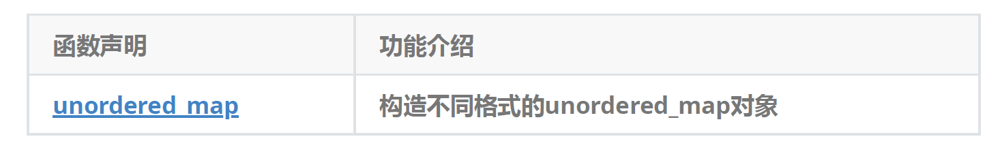

2. unordered_map的容量

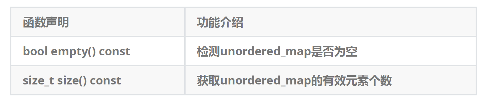

3. unordered_map的迭代器

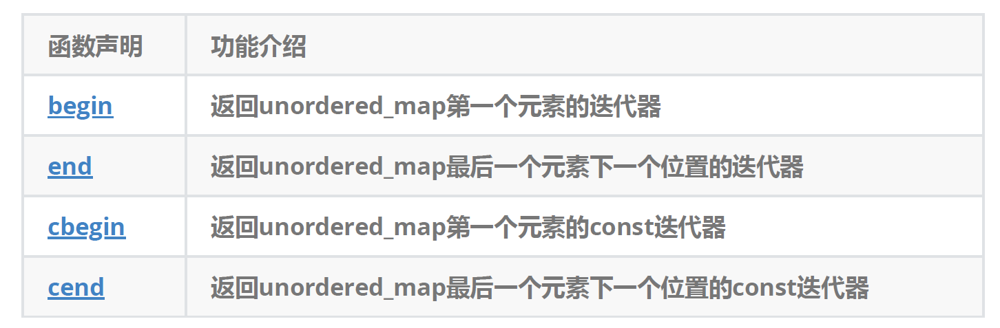  
4. unordered_map的元素访问

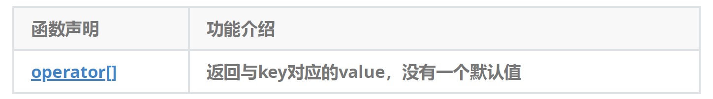

注意：该函数中实际调用哈希桶的插入操作，用参数key与V()构造一个默认值往底层哈希桶中插入，如果key不在哈希桶中，插入成功，返回V()，插入失败，说明key已经在哈希桶中，将key对应的value返回。

5. unordered_map的查询

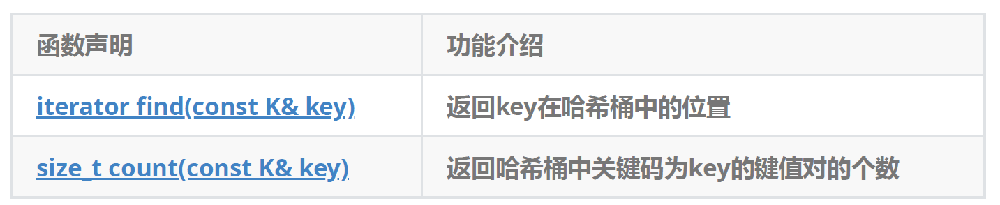

注意：unordered_map中key是不能重复的，因此count函数的返回值最大为1

6. unordered_map的修改操作

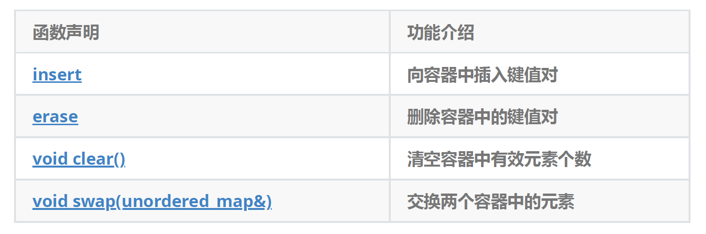

7. unordered_map的桶操作

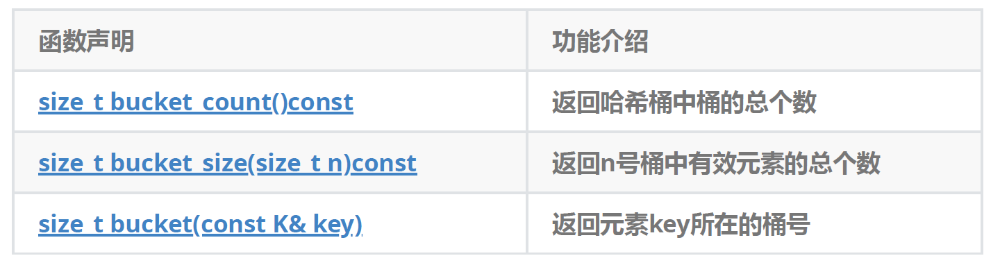

## unordered_map和map的使用差异
1. unordered_map和map的第一个差异是对key的要求不同，map要求Key支持小于比较，而unordered_map要求Key支持转成整形且支持等于比较，要理解unordered_map的这个两点要求得后续我们结合哈希表底层实现才能真正理解，也就是说这本质是哈希表的要求。
2. unordered_map和map的第二个差异是迭代器的差异，map的iterator是双向迭代器，unordered_map是单向迭代器，其次map底层是红黑树，红黑树是二叉搜索树，走中序遍历是有序的，所以map迭代器遍历是Key有序+去重。而unordered_map底层是哈希表，迭代器遍历是Key无序+去重。
3. unordered_map和map的第三个差异是性能的差异，整体而言大多数场景下，unordered_map的增删查改更快一些，因为红黑树增删查改效率是O(logN) ，而哈希表增删查平均效率是O(1) 。

# 三、unordered_set
[<unordered_set> - C++ Reference](https://legacy.cplusplus.com/reference/unordered_set/)

## unordered_set和set的使用差异
1. unordered_set和set的第一个差异是对key的要求不同，set要求Key支持小于比较，而unordered_set要求Key支持转成整形且支持等于比较。
2. unordered_set和set的第二个差异是迭代器的差异，set的iterator是双向迭代器，unordered_set是单向迭代器，其次set底层是红黑树，红黑树是二叉搜索树，走中序遍历是有序的，所以set迭代器遍历是有序+去重。而unordered_set底层是哈希表，迭代器遍历是无序+去重。
3. unordered_set和set的第三个差异是性能的差异，整体而言大多数场景下，unordered_set的增删查改更快一些，因为红黑树增删查改效率是O(logN)，而哈希表增删查平均效率是O(1) 。

## set与unordered_set的效率比较
```cpp
#include<unordered_map>
#include<unordered_set>

int main()
{
    const size_t N = 100000;

    unordered_set<int> us;
    set<int> s;

    vector<int> v;
    v.reserve(N);
    srand(time(0));
    for (size_t i = 0; i < N; ++i)
    {
        //v.push_back(rand()); // N比较大时，重复值比较多
        //v.push_back(rand()+i); // 重复值相对少
        v.push_back(i); // 没有重复，有序
    }
    
    size_t begin1 = clock();
    for (auto e : v)
    {
        s.insert(e);
    }
    size_t end1 = clock();
    cout << "set insert:" << end1 - begin1 << endl;

    size_t begin2 = clock();
    for (auto e : v)
    {
        us.insert(e);
    }
    size_t end2 = clock();
    cout << "unordered_set insert:" << end2 - begin2 << endl;


    size_t begin3 = clock();
    for (auto e : v)
    {
        s.find(e);
    }
    size_t end3 = clock();
    cout << "set find:" << end3 - begin3 << endl;

    size_t begin4 = clock();
    for (auto e : v)
    {
        us.find(e);
    }
    size_t end4 = clock();
    cout << "unordered_set find:" << end4 - begin4 << endl << endl;

    cout << "插入数据个数：" << s.size() << endl;
    cout << "插入数据个数：" << us.size() << endl << endl;

    size_t begin5 = clock();
    for (auto e : v)
    {
        s.erase(e);
    }
    size_t end5 = clock();
    cout << "set erase:" << end5 - begin5 << endl;

    size_t begin6 = clock();
    for (auto e : v)
    {
        us.erase(e);
    }
    size_t end6 = clock();
    cout << "unordered_set erase:" << end6 - begin6 << endl << endl;

    return 0;
}
```

根据测试结果可以得出以下结论：

1. 当处理数据量小时，map/set容器与**unordered_map/unordered_set**容器增删查改的效率差异不大。
2. 当处理数据量大时，map/set容器与**unordered_map/unordered_set**容器增删查改的效率相比，unordered系列容器的效率更高。

# 四、unordered_multimap/unordered_multiset
unordered_multimap/unordered_multiset跟multimap/multiset功能完全类似，支持Key冗余。

# 五、哈希概念
顺序结构以及平衡树中，元素关键码与其存储位置之间没有对应的关系，因此在查找一个元素时，必须要经过关键码的多次比较。顺序查找时间复杂度为，平衡树中为树的高度，即，搜索的效率取决于搜索过程中元素的比较次数。

理想的搜索方法：可以不经过任何比较，一次直接从表中得到要搜索的元素。如果构造一种存储结构，通过某种函数(hashFunc)使元素的存储位置与它的关键码之间能够建立一 一**映射的关系**，那么在查找时通过该函数可以很快找到该元素。

映射的关系：

1. 直接定址法（关键字范围集中，量不大的情况）关键字 -->**存储位置是一对一的关系**，**不存在哈希冲突**
2. 除留余数法（关键字可以很分散，量可以很大））关键字 -->**存储位置是多对一的关系**，**存在哈希冲突**

---

**当向该结构中：**

1. **插入元素**
+ 根据待插入元素的关键码，以此函数计算出该元素的存储位置并按此位置进行存放
2. **搜索元素**
+ 对元素的关键码进行同样的计算，把求得的函数值当做元素的存储位置，在结构中按此位置取元素比较，若关键码相等，则搜索成功
3. **删除元素**

先对元素进行搜索，然后将状态设置成删除状态

+ 删除状态的意义：
    - 再插入，这个位置可以覆盖值
    - 防止后面冲突的值出现找不到的情况，遇到删除状态，还是继续往后找

该方式即为哈希(散列)方法，哈希方法中使用的转换函数称为哈希(散列)函数，构造出来的结构称为哈希表(Hash Table)(或者称散列表)

+ 例如：数据集合{1，7，6，4，5，9}；
    - 哈希函数设置为：`hash(key) = key % capacity;`其中capacity为存储元素底层空间总的大小。

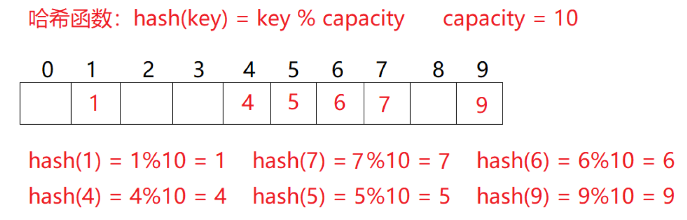

用该方法进行搜索不必进行多次关键码的比较，因此搜索的速度比较快

> 问题：按照上述哈希方式，向集合中插入元素44，会出现什么问题？--> **哈希冲突**
>

# 六、哈希冲突
+ 对于两个数据元素的关键字和 (i != j)，有 != ，但有：Hash() ==Hash()，即：不同关键字通过相同哈希哈数计算出相同的哈希地址，该种现象称为**哈希冲突**或**哈希碰撞**。
+ 把具有不同关键码而具有相同哈希地址的数据元素称为“同义词”。

**发生哈希冲突该如何处理呢？**

# 七、哈希函数
引起哈希冲突的一个原因可能是：哈希函数设计不够合理。

哈希函数设计原则：

1. 哈希函数的定义域必须包括需要存储的全部关键码，而如果散列表允许有m个地址时，其值域必须在0到m-1之间
2. 哈希函数计算出来的地址能均匀分布在整个空间中
3. 哈希函数应该比较简单

# 八、常见哈希函数
1. **直接定址法**
+ 取关键字的某个线性函数为散列地址：`Hash（Key）= A * Key + B`
+ 优点：简单、均匀
+ 缺点：需要事先知道关键字的分布情况
+ 使用场景：适合查找比较小且连续的情况
2. **除留余数法**
+ 设散列表中允许的地址数为m，取一个不大于m，但最接近或者等于m的质数p作为除数，
+ 按照哈希函数：`Hash(key) = key% p(p<=m)`，将关键码转换成哈希地址
3. **平方取中法**
+ 假设关键字为1234，对它平方就是1522756，抽取中间的3位227作为哈希地址；
+ 再比如关键字为4321，对它平方就是18671041，抽取中间的3位671(或710)作为哈希地址平方取中法比较适合：不知道关键字的分布，而位数又不是很大的情况
4. **折叠法**
+ 折叠法是将关键字从左到右分割成位数相等的几部分(最后一部分位数可以短些)，然后将这几部分叠加求和，并按散列表表长，取后几位作为散列地址。
+ 折叠法适合事先不需要知道关键字的分布，适合关键字位数比较多的情况
5. **随机数法**
+ 选择一个随机函数，取关键字的随机函数值为它的哈希地址，即H(key) = random(key),其中random为随机数函数。
+ 通常应用于关键字长度不等时采用此法
6. **数学分析法**
+ 设有n个d位数，每一位可能有r种不同的符号，这r种不同的符号在各位上出现的频率不一定相同，可能在某些位上分布比较均匀，每种符号出现的机会均等，在某些位上分布不均匀只有某几种符号经常出现。可根据散列表的大小，选择其中各种符号分布均匀的若干位作为散列地址。例如：

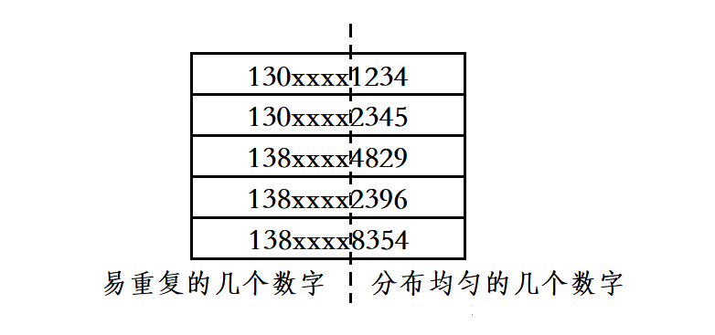

+ 假设要存储某家公司员工登记表，如果用手机号作为关键字，那么极有可能前7位都是相同的，那么我们可以选择后面的四位作为散列地址，如果这样的抽取工作还容易出现冲突，还可以对抽取出来的数字进行反转(如1234改成4321)、右环位移(如1234改成4123)、左环移位、前两数与后两数叠加(如1234改成12+34=46)等方法。
+ 数字分析法通常适合处理关键字位数比较大的情况，如果事先知道关键字的分布且关键字的若干位分布较均匀的情况

> **注意：哈希函数设计的越精妙，产生哈希冲突的可能性就越低，但是无法避免哈希冲突**
>

哈希冲突解决：

> 解决哈希冲突两种常见的方法是：**闭散列**和**开散列**
>

# 九、闭散列--->开放定址法
闭散列，也叫**开放定址法**，当发生哈希冲突时，如果哈希表未被装满，说明在哈希表种必然还有空位置，那么可以把产生冲突的元素存放到冲突位置的“下一个”空位置中去。

## 哈希表的插入
### 线性探测
+ 当发生哈希冲突时，从发生冲突的位置开始，依次向后探测，直到找到下一个空位置为止。

**线性探测：从发生冲突的位置开始，依次向后探测，直到寻找到下一个空位置为止。**

+ 通过哈希函数获取待插入元素在哈希表中的位置
+ 通过哈希函数获取待插入元素在哈希表中的位置 如果该位置中没有元素则直接插入新元素，如果该位置中有元素发生哈希冲突， 使用线性探测找到下一个空位置，插入新元素

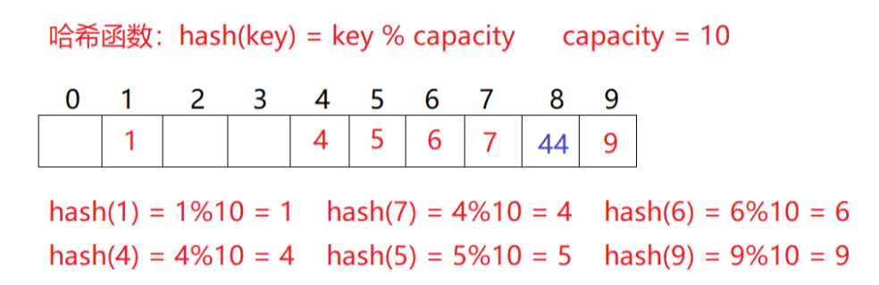

我们将数据插入到有限的空间，那么空间中的元素越多，插入元素时产生冲突的概率也就越大，冲突多次后插入哈希表的元素，在查找时的效率必然也会降低。介于此，哈希表当中引入了负载因子（载荷因子）：

**负载因子 = 表中有效数据个数 / 空间的大小**

+ 负载因子越大，产出冲突的概率越高，增删查改的效率越低。
+ 负载因子越小，产出冲突的概率越低，增删查改的效率越高。

但负载因子越小，也就意味着空间的利用率越低，此时大量的空间实际上都被浪费了。对于闭散列（开放定址法）来说，负载因子是特别重要的因素，一般控制在0.7~0.8以下，超过0.8会导致在查表时CPU缓存不命中（cache missing）按照指数曲线上升。

因此，一些采用开放定址法的hash库，如JAVA的系统库限制了负载因子为0.75，当超过该值时，会对哈希表进行增容。

### 二次探测
线性探测的缺陷是产生冲突的数据堆积在一块，这与其找下一个空位置有关系，因为找空位置的方式就是挨着往后逐个去找，因此二次探测为了避免该问题，找下一个空位置的方法为： = ( +  )% m, 或者： = ( -  )% m。其中：i = 1,2,3…， 是通过散列函数Hash(x)对元素的关键码 key 进行计算得到的位置，m是表的大小。

如果要插入44，产生冲突，使用解决后的情况为：

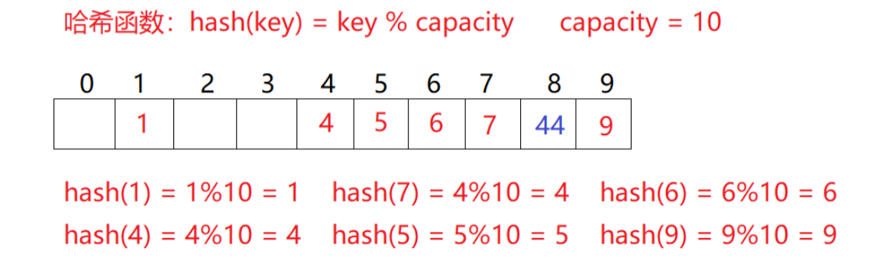

**研究表明**：当表的长度为质数且表装载因子a不超过0.5时，新的表项一定能够插入，而且任 何一个位置都不会被探查两次。因此只要表中有一半的空位置，就不会存在表满的问题。在 搜索时可以不考虑表装满的情况，但在插入时必须确保表的装载因子a不超过0.5，如果超出 必须考虑增容。

**因此**：比散列最大的缺陷就是空间利用率比较低，这也是哈希的缺陷。

**线性探测的优点**：实现非常简单。

**线性探测的缺点**：一旦发生冲突，所有的冲突连在一起，容易产生数据“堆积”，即不同关键码占据了可利用的空位置，使得寻找某关键码的位置需要多次比较（踩踏效应），导致搜索效率降低。

### 向哈希表中插入数据的步骤
1. 查看哈希表中是否存在该键值的键值对，若已存在则插入失败。
2. 判断是否需要调整哈希表的大小，若哈希表的大小为0，或负载因子过大都需要对哈希表的大小进行调整。
3. 将键值对插入哈希表。
4. 哈希表中的有效元素个数加一。

其中，**哈希表的调整方式**如下：

1. 若哈希表的大小为0，则将哈希表的初始大小设置为10。
2. **若哈希表的负载因子大于0.7，则先创建一个新的哈希表**，该哈希表的大小为原哈希表的**两倍**，之后**遍历原哈希表**，**将原哈希表中的数据插入到新哈希表**，**最后将原哈希表与新哈希表交换**。

**注意**： 在将原哈希表的数据插入到新哈希表的过程中，不能只是简单的将原哈希表中的数据对应的挪到新哈希表中，而是需要根据新哈希表的大小重新计算每个数据在新哈希表中的位置，然后再进行插入。

将键值对插入哈希表的具体步骤如下：

1. 通过哈希函数计算出对应的哈希地址。
2. 若产生哈希冲突，则从哈希地址处开始，采用线性探测向后寻找一个状态为**EMPTY**或**DELETE**的位置。
3. 将键值对插入到该位置，并将该位置的状态设置为**EXIST**。

### 扩容
哈希表负载因子控制在0.7，当负载因子到0.7以后我们就需要扩容，按照2倍扩容，同时要保持哈希表大小是一个质数，第一个是质数，2倍后就不是质数了。一种方案就是除法散列中的Java HashMap的使用2的整数幂，但是计算时不能直接取模的改进方法。另外一种方案是sgi版本的哈希表使用的方法，给了一个近似2倍的质数表，每次去质数表获取扩容后的大小。

```cpp
static const int __stl_num_primes = 28;
static const unsigned long __stl_prime_list[__stl_num_primes] =
{
    53,         97,         193,       389,       769,
    1543,       3079,       6151,      12289,     24593,
    49157,      98317,      196613,    393241,    786433,
    1572869,    3145739,    6291469,   12582917,  25165843,
    50331653,   100663319,  201326611, 402653189, 805306457,
    1610612741, 3221225473, 4294967291
};

inline unsigned long __stl_next_prime(unsigned long n)
{
    const unsigned long* first = __stl_prime_list;
    const unsigned long* last = __stl_prime_list + __stl_num_primes;
    const unsigned long* pos = std::lower_bound(first, last, n);
    return pos == last ? *(last - 1) : *pos;
}
```

### key不能取模的问题
当key是string/Date等类型时，key不能取模，那么我们需要给HashTable增加一个仿函数，这个仿函数支持把key转换成一个可以取模的整形，如果key可以转换为整形并且不容易冲突，那么这个仿函数就用默认参数即可，如果这个Key不能转换为整形，我们就需要自己实现一个仿函数传给这个参数，实现这个仿函数的要求就是尽量key的每值都参与到计算中，让不同的key转换出的整形值不同。string做哈希表的key非常常见，所以我们可以考虑把string特化一下。

```cpp
template<class K>
struct HashFunc
{
    size_t operator()(const K& key)
    {
        return (size_t)key;
    }
};

// 特化
template<>
struct HashFunc<std::string>
{
    size_t operator()(const std::string& key)
    {
        size_t hashi = 0;
        for (auto& e : key)
        {
            hashi *= 131;
            hashi += e;
        }
        return hashi;
    }
};
```

## 哈希表的闭散列实现
### 哈希表的结构
1. EMPTY（无数据的空位置）
2. EXIST（已存储数据）
3. DELETE（原本有数据，但现在被删除了）

用枚举定义这三个状态

```cpp
// 状态
enum Status
{
    EMPTY, // 空
    EXIST, // 存在
    DELETE // 删除
};
```

> 闭散列的哈希表中的每个位置存储的结构，应该包括所给数据和该位置的当前状态。
>

```cpp
//哈希表每个位置存储的结构
template<class K, class V>
struct HashData
{
    pair<K, V> _kv; // 键值对
    Status _state = EMPTY; // 状态
};
```

> 而为了在插入元素时好计算当前哈希表的负载因子，我们还应该时刻存储整个哈希表中的有效元素个数，当负载因子过大时就应该进行哈希表的增容。
>

```cpp
//哈希表
template<class K, class V>
class HashTable
{
public:
    //...
private:
    vector<HashData<K, V>> _tables; //哈希表
    size_t _n = 0; //哈希表中的有效元素个数
};
```

### 插入代码实现
```cpp
//哈希表每个位置存储的结构
template<class K, class V>
struct HashData
{
    pair<K, V> _kv; // 键值对
    Status _state; // 状态
};

template<class K>
struct HashFunc
{
    size_t operator()(const K& key)
    {
        return (size_t)key;
    }
};

// 特化
template<>
struct HashFunc<string>
{
    size_t operator()(const string& key)
    {
        size_t hash = 0;
        for (auto& e : key)
        {
            hash *= 31; // BKDR
            hash += e;
        }
        return hash;
    }
};

// 插入方法
bool Insert(const std::pair<K, V>& kv)
{
    // 1、查看哈希表中是否存在该键值的键值对
    if (Find(kv.first))// 哈希表中已经存在该键值的键值对（不允许数据冗余）
        return false;

    
    //2、判断是否需要调整哈希表的大小
    if ((double)_n / (double)_tables.size() >= 0.7)// 负载因子大于0.7需要增容)
    {
        //a、创建一个新的哈希表，新哈希表的大小设置为近似2倍的质数
        HashTable<K, V, HashFun> newHT(__stl_next_prime(_tables.size() + 1));

        //b、遍历旧表,将原哈希表当中的数据插入到新哈希表
        for (size_t i = 0; i < _tables.size(); i++)
        {
            // 如果_tables[i]的位置有数据就进行再次映射
            if (_tables[i]._state == EXIST) 
            {
                newHT.Insert(_tables[i]._kv);
            }
        }
        // c、与旧表进行交换
        _tables.swap(newHT._tables);
    }// 扩容 end...

    // 3、将键值对插入哈希表
    // a、通过哈希函数计算哈希地址，线性探测
    size_t hashi = hf(kv.first) % _tables.size(); // 除数不能是capacity

    size_t index = hashi, i = 1;

    //b、找到一个状态为EMPTY或DELETE的位置
    while (_tables[hashi]._state == EXIST)
    {
        index = hashi + i;					// 线性探测
        index = hashi + i * i;				 // 二次探测
        hashi %= _tables.size();			 // 防止下标超出哈希表范围
        i++;
    }

    //c、将数据插入该位置，并将该位置的状态设置为EXIST
    _tables[hashi]._kv = kv;
    _tables[hashi]._state = EXIST;

    //4、哈希表中的有效元素个数++
    ++_n;
    return true;
}
```

### 哈希表的查找
在哈希表中查找数据的步骤如下：

1. 先判断哈希表的大小是否为0，若为0则查找失败。
2. 通过哈希函数计算出对应的哈希地址。
3. 从哈希地址处开始，采用线性探测向后向后进行数据的查找，直到找到待查找的元素判定为查找成功，或找到一个状态为EMPTY的位置判定为查找失败。
+ **注意**： 在查找过程中，**必须找到位置状态为EXIST**，**并且key值匹配的元素**，才算查找成功。若仅仅是key值匹配，但该位置当前状态为**DELETE**，则还需继续进行查找，因为该位置的元素已经被删除了。

```cpp
// 查找方法
HashData<K, V>* Find(const K& key)
{
    if (_tables.size() == 0)
        return nullptr;

    // 计算位置
    size_t hashi = hf(key) % _tables.size();
    size_t index = hashi, i = 1;

    // 不为空就一直找
    while (_tables[hashi]._state != EMPTY)
    {
        // 若key匹配，并且不等于DELETE，查找成功
        if (_tables[hashi]._kv.first == key && _tables[hashi]._state != DELETE)
            return &_tables[hashi];
        
        // 继续探测
        hashi = (index + i) % _tables.size();
        ++i;
    }
    // 找不到的情况
    return nullptr;
}
```

### 哈希表的删除
+ **采用闭散列处理哈希冲突时**，**不能随便物理删除哈希表中已有的元素，若直接删除元素 会影响其他元素的搜索**。**因此线性探测采用标记的伪删除法来删除一个元素。**

在哈希表中删除数据的步骤如下：

1. 查看哈希表中是否存在该键值的键值对，若不存在则删除失败。
2. 若存在，则将该键值对所在位置的状态改为DELETE即可。
3. 哈希表中的有效元素个数减一。

```cpp
// 伪删除法
bool Erase(const K& key)
{
    //1、查看哈希表中是否存在该键值的键值对
    HashData<K, V>* res = Find(key);
    if (res)
    {
        //2、若存在，则将该键值对所在位置的状态改为DELETE即可
        res->_state = DELETE;
        --_n; //3、哈希表中的有效元素个数减一
        return true; // 删除成功
    }
    return false;    // 删除失败
}
```

# 十、开散列--->链地址法（拉链法、哈希桶）
## 开散列的概念
开散列法又叫链地址法(开链法)，首先对关键码集合用散列函数计算散列地址，具有相同地址的关键码归于同一子集合，每一个子集合称为一个桶，各个桶中的元素通过一个单链表链接起来，各链表的头结点存储在哈希表中。

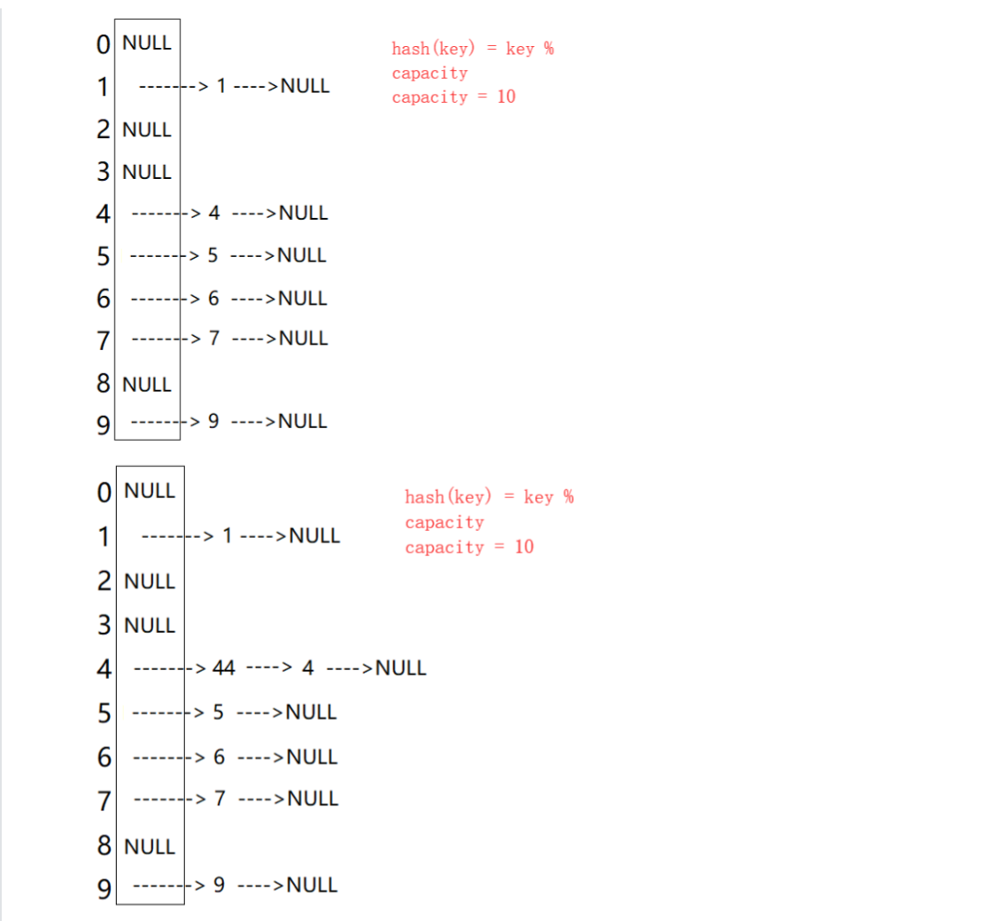

从上图可以看出，开散列中每个桶中放的都是发生哈希冲突的元素。

## 开散列增容
桶的个数是一定的，随着元素的不断插入，每个桶中元素的个数不断增多，**极端情况下，可能会导致一个桶中链表节点非常多，会影响的哈希表的性能**，因此在一定条件下需要对哈希表进行增容，那该条件怎么确认呢？开散列最好的情况是：每个哈希桶中刚好挂一个节点， 再继续插入元素时，每一次都会发生哈希冲突，因此，在元素个数刚好等于桶的个数时，可以给哈希表增容。

+ 闭散列的开放定址法，负载因子不能超过1，一般建议控制在[0.0, 0.7]之间。
+ 开散列的哈希桶，负载因子可以超过1，一般建议控制在[0.0, 1.0]之间。

哈希桶的极端情况就是，所有元素全部产生冲突，最终都放到了同一个哈希桶中，此时该哈希表增删查改的效率就退化成了O(N)


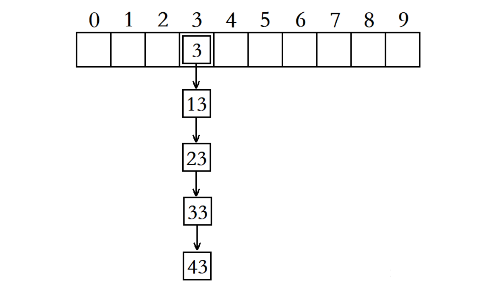

+ 这时，我们可以考虑将这个桶中的元素，由单链表结构改为红黑树结构，并将红黑树的根结点存储在哈希表中。

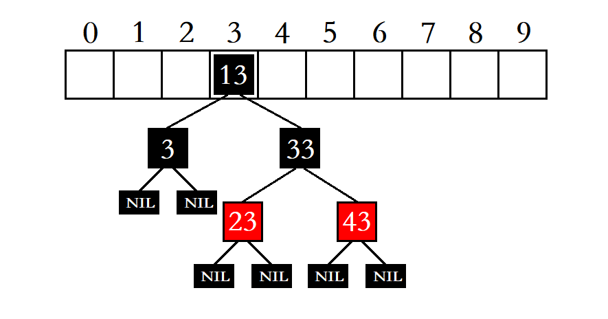

+ 为了避免出现这种极端情况，当桶当中的元素个数超过一定长度，有些地方就会选择将该桶中的单链表结构换成**红黑树结构**，比如在JAVA中比较新一点的版本中，当桶当中的数据个数超过8时，就会将该桶当中的单链表结构换成**红黑树**结构，而当该桶当中的数据个数减少到8或8以下时，又会将该桶当中的红黑树结构换回单链表结构。
+ 但有些地方也会选择不做此处理，因为随着哈希表中数据的增多，该哈希表的负载因子也会逐渐增大，最终会触发哈希表的增容条件，此时该哈希表当中的数据会全部重新插入到另一个空间更大的哈希表，此时同一个桶当中冲突的数据个数也会减少，因此不做处理问题也不大。

## 开散列与闭散列比较
+ 开散列与闭散列比较 应用链地址法处理溢出，需要增设链接指针，似乎增加了存储开销。事实上： 由于开地址法必须保持大量的空闲空间以确保搜索效率，如二次探查法要求装载因子a <= 0.7，而表项所占空间又比指针大的多，所以使用链地址法反而比开地址法节省存储空间。

[字符串哈希算法](https://www.cnblogs.com/-clq/archive/2012/05/31/2528153.html)

## 哈希表的开散列实现（哈希桶）
### 哈希表的结构
```cpp
template<class K, class V>
struct HashNode
{
    std::pair<K, V> _kv;
    HashNode<K, V>* _next;

    // 构造
    HashNode(const std::pair<K, V>& kv)
        :_kv(kv)
        ,_next(nullptr)
    {}
};
```

+ 与闭散列的哈希表不同的是，在实现开散列的哈希表时，我们不用为哈希表中的每个位置设置一个状态字段，因为在开散列的哈希表中，我们将哈希地址相同的元素都放到了同一个哈希桶中，并不需要经过探测寻找所谓的“下一个位置”。
+ 哈希表的开散列实现方式，在插入数据时也需要根据负载因子判断是否需要增容，所以我们也应该时刻存储整个哈希表中的有效元素个数，当负载因子过大时就应该进行哈希表的增容。

```cpp
//哈希表
template<class K, class V>
class HashTable
{
public:
    //...
private:
    std::vector<Node*> _table; //哈希表
    size_t _n; //哈希表中的有效元素个数
};
```

### 哈希表的插入
向哈希表中插入数据的步骤如下：

1. 查看哈希表中是否存在该键值的键值对，若已存在则插入失败。
2. 判断是否需要调整哈希表的大小，若哈希表的大小为0，或负载因子过大都需要对哈希表的大小进行调整。
3. 将键值对插入哈希表。
4. 哈希表中的有效元素个数加一。
+ 若哈希表的负载因子已经等于1了，则先创建一个新的哈希表，该哈希表的大小为原哈希表的两倍，之后遍历原哈希表，将原哈希表中的数据插入到新哈希表，最后将原哈希表与新哈希表交换即可。

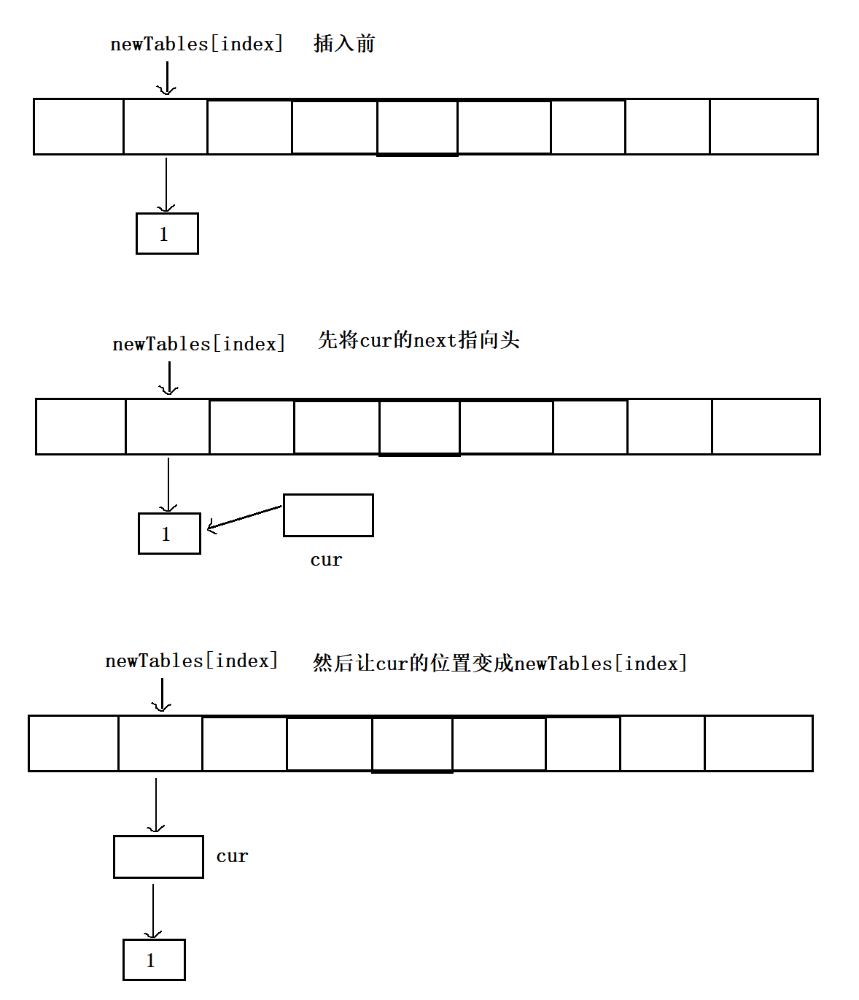

```cpp
bool Insert(const std::pair<K, V>& kv)
{
    // 1、查看哈希表中是否存在该键值的键值对
    if (Find(kv.first))
        return false;

    // 2、判断是否需要调整哈希表的大小
    if (_n == _tables.size())
    {
        // a. 建立新表
        std::vector<Node*> newTables(__stl_next_prime(_tables.size() + 1));
        
        // b、将原哈希表当中的结点插入到新哈希表
        for (size_t i = 0; i < _tables.size(); i++)
        {
            Node* cur = _tables[i];
            while (cur)
            {
                // 旧表的节点挪动下来插入到映射的新表位置
                Node* next = cur->_next;   //记录cur的下一个结点
                size_t hashi = hs(cur->_kv.first) % newTables.size(); // 通过哈希函数计算出对应的哈希桶编号index

                cur->_next = newTables[hashi]; // 节点直接拿下来放到新桶中
                newTables[hashi] = cur; // 将该结点头插到新哈希表中编号为index的哈希桶中
                cur = next; // 取原哈希表中该桶的下一个结点
            }
            _tables[i] = nullptr;  // 该桶取完后将该桶置空
        }
        _tables.swap(newTables);
    } // 扩容end...

    size_t hashi = hs(kv.first) % _tables.size();
    Node* newnode = new Node(kv);
    // 进行头插
    newnode->_next = _tables[hashi];
    _tables[hashi] = newnode;

    ++_n;
    return true;
}
```

### 哈希表的查找
在哈希表中查找数据的步骤如下：

1. 先判断哈希表的大小是否为0，若为0则查找失败。
2. 通过哈希函数计算出对应的哈希地址。
3. 通过哈希地址找到对应的哈希桶中的单链表，遍历单链表进行查找即可。

```cpp
Node* Find(const K& key)
{
    if (_tables.size() == 0) // 哈希表大小为0，查找失败
        return nullptr;
    // 通过哈希函数计算出对应的哈希桶编号
    size_t hashi = hs(key) % _tables.size();
    Node* cur = _tables[hashi];
    // 遍历哈希桶
    while (cur)
    {
        if (cur->_kv.first == key)
            return cur;
        cur = cur->_next;
    }
    return nullptr;
}
```

### 哈希表的删除
在哈希表中删除数据的步骤如下：

1. 通过哈希函数计算出对应的哈希桶编号。
2. 遍历对应的哈希桶，寻找待删除结点。
3. 若找到了待删除结点，则将该结点从单链表中移除并释放。
4. 删除结点后，将哈希表中的有效元素个数减一。

注意： 不要先调用查找函数判断待删除结点是否存在，这样做如果待删除不在哈希表中那还好，但如果待删除结点在哈希表，那我们还需要重新在哈希表中找到该结点并删除，还不如一开始就直接在哈希表中找，找到了就删除。

```cpp
 bool Erase(const K& key)
{
    //1、通过哈希函数计算出对应的哈希桶编号index（除数不能是capacity）
    size_t hashi = hs(key) % _tables.size();

    //2、在编号为index的哈希桶中寻找待删除结点
    Node* cur = _tables[hashi];
    Node* prev = nullptr;
    while (cur)
    {
        //3、若找到了待删除结点，则删除该结点
        if (cur->_kv.first == key)
        {
            //待删除结点是哈希桶中的第一个结点
            if (prev == nullptr)
                _tables[hashi] = cur->_next;// 将第一个结点从该哈希桶中移除
            else// 待删除结点不是哈希桶的第一个结点
                prev->_next = cur->_next; // 前一个节点的next指向cur的next
            delete cur;
            --_n; // 4、删除结点后，将哈希表中的有效元素个数减一
            return true;
        }
        // 继续往后找
        prev = cur;
        cur = cur->_next;
    }
    return false;
}
```

### 哈希表和哈希桶全部源码
```cpp
#pragma once
#include <vector>
#include <iostream>

static const int __stl_num_primes = 28;
static const unsigned long __stl_prime_list[__stl_num_primes] =
{
    53,         97,         193,       389,       769,
    1543,       3079,       6151,      12289,     24593,
    49157,      98317,      196613,    393241,    786433,
    1572869,    3145739,    6291469,   12582917,  25165843,
    50331653,   100663319,  201326611, 402653189, 805306457,
    1610612741, 3221225473, 4294967291
};

inline unsigned long __stl_next_prime(unsigned long n)
{
    const unsigned long* first = __stl_prime_list;
    const unsigned long* last = __stl_prime_list + __stl_num_primes;
    const unsigned long* pos = std::lower_bound(first, last, n);
    return pos == last ? *(last - 1) : *pos;
}

template<class K>
struct HashFunc
{
    size_t operator()(const K& key)
    {
        return (size_t)key;
    }
};

// 特化
template<>
struct HashFunc<std::string>
{
    size_t operator()(const std::string& key)
    {
        size_t hashi = 0;
        for (auto& e : key)
        {
            hashi *= 131;
            hashi += e;
        }
        return hashi;
    }
};

namespace open_address
{
    // 状态
    enum Status
    {
        EMPTY, // 空
        EXIST, // 存在
        DELETE // 删除
    };

    //哈希表每个位置存储的结构
    template<class K, class V>
    struct HashData
    {
        std::pair<K, V> _kv; // 键值对
        Status _state; // 状态
    };

    template<class K>
    struct HashFunc
    {
        size_t operator()(const K& key)
        {
            return (size_t)key;
        }
    };

    // 特化
    template<>
    struct HashFunc<std::string>
    {
        size_t operator()(const std::string& key)
        {
            size_t hash = 0;
            for (auto& e : key)
            {
                hash *= 131; // BKDR
                hash += e;
            }
            return hash;
        }
    };

    template <class K, class V, class HashFun = HashFunc<K>>
    class HashTable
    {
        HashFun hf; // 对于int来说是直接用值来比较，对于string类型使用BKDR方法来比较
    public:
        HashTable(size_t size = __stl_next_prime(0))
            :_tables(size)
            , _n(0)
        {}

        // 插入方法
        bool Insert(const std::pair<K, V>& kv)
        {
            // 1、查看哈希表中是否存在该键值的键值对
            if (Find(kv.first))// 哈希表中已经存在该键值的键值对（不允许数据冗余）
                return false;

            //2、判断是否需要调整哈希表的大小
            if ((double)_n / (double)_tables.size() >= 0.7)// 负载因子大于0.7需要增容)
            {
                //a、创建一个新的哈希表，新哈希表的大小设置为近似2倍的质数
                HashTable<K, V, HashFun> newHT(__stl_next_prime(_tables.size() + 1));

                //b、遍历旧表,将原哈希表当中的数据插入到新哈希表
                for (size_t i = 0; i < _tables.size(); i++)
                {
                    // 如果_tables[i]的位置有数据就进行再次映射
                    if (_tables[i]._state == EXIST) 
                    {
                        newHT.Insert(_tables[i]._kv);
                    }
                }
                // c、与旧表进行交换
                _tables.swap(newHT._tables);
            }// 扩容 end...


            // 3、将键值对插入哈希表
            // a、通过哈希函数计算哈希地址，线性探测
            size_t hashi = hf(kv.first) % _tables.size(); // 除数不能是capacity

            size_t index = hashi, i = 1;

            //b、找到一个状态为EMPTY或DELETE的位置
            while (_tables[hashi]._state == EXIST)
            {
                hashi = (index + i) % _tables.size();
                ++i;
            }

            //c、将数据插入该位置，并将该位置的状态设置为EXIST
            _tables[hashi]._kv = kv;
            _tables[hashi]._state = EXIST;

            //4、哈希表中的有效元素个数++
            ++_n;
            return true;
        }

        // 查找方法
        HashData<K, V>* Find(const K& key)
        {
            if (_tables.size() == 0)
                return nullptr;

            // 计算位置
            size_t hashi = hf(key) % _tables.size();
            size_t index = hashi, i = 1;

            // 不为空就一直找
            while (_tables[hashi]._state != EMPTY)
            {
                // 若key匹配，并且不等于DELETE，查找成功
                if (_tables[hashi]._kv.first == key && _tables[hashi]._state != DELETE)
                    return &_tables[hashi];
                
                // 继续探测
                hashi = (index + i) % _tables.size();
                ++i;
            }
            // 找不到的情况
            return nullptr;
        }

        // 伪删除法
        bool Erase(const K& key)
        {
            //1、查看哈希表中是否存在该键值的键值对
            HashData<K, V>* res = Find(key);
            if (res)
            {
                //2、若存在，则将该键值对所在位置的状态改为DELETE即可
                res->_state = DELETE;
                --_n; //3、哈希表中的有效元素个数减一
                return true; // 删除成功
            }
            return false;    // 删除失败
        }

    private:
        std::vector<HashData<K, V>> _tables;
        size_t _n = 0;
    };
}

namespace hash_bucket
{
    template<class K, class V>
    struct HashNode
    {
        std::pair<K, V> _kv;
        HashNode<K, V>* _next;

        // 构造
        HashNode(const std::pair<K, V>& kv)
            :_kv(kv)
            ,_next(nullptr)
        {}
    };

    template<class K, class V, class Hash = HashFunc<K>>
    class HashTable
    {
        Hash hs;
        typedef HashNode<K, V> Node;
    public:
        HashTable(size_t size = __stl_next_prime(0))
            : _tables(size, nullptr)
            , _n(0)
        {}

        ~HashTable()
        {
            for (size_t i = 0; i < _tables.size(); i++)
            {
                Node* cur = _tables[i];
                while (cur)
                {
                    Node* next = cur->_next;
                    delete cur;
                    cur = next;
                }
                _tables[i] = nullptr;
            }
        }

        bool Insert(const std::pair<K, V>& kv)
        {
            // 1、查看哈希表中是否存在该键值的键值对
            if (Find(kv.first))
                return false;

            // 2、判断是否需要调整哈希表的大小
            if (_n == _tables.size())
            {
                // a. 建立新表
                std::vector<Node*> newTables(__stl_next_prime(_tables.size() + 1));
                
                // b、将原哈希表当中的结点插入到新哈希表
                for (size_t i = 0; i < _tables.size(); i++)
                {
                    Node* cur = _tables[i];
                    while (cur)
                    {
                        // 旧表的节点挪动下来插入到映射的新表位置
                        Node* next = cur->_next;   //记录cur的下一个结点
                        size_t hashi = hs(cur->_kv.first) % newTables.size(); // 通过哈希函数计算出对应的哈希桶编号index

                        cur->_next = newTables[hashi]; // 节点直接拿下来放到新桶中
                        newTables[hashi] = cur; // 将该结点头插到新哈希表中编号为index的哈希桶中
                        cur = next; // 取原哈希表中该桶的下一个结点
                    }
                    _tables[i] = nullptr;  // 该桶取完后将该桶置空
                }
                _tables.swap(newTables);
            } // 扩容end...

            size_t hashi = hs(kv.first) % _tables.size();
            Node* newnode = new Node(kv);
            // 进行头插
            newnode->_next = _tables[hashi];
            _tables[hashi] = newnode;

            ++_n;
            return true;
        }


        Node* Find(const K& key)
        {
            if (_tables.size() == 0) // 哈希表大小为0，查找失败
                return nullptr;
            // 通过哈希函数计算出对应的哈希桶编号
            size_t hashi = hs(key) % _tables.size();
            Node* cur = _tables[hashi];
            // 遍历哈希桶
            while (cur)
            {
                if (cur->_kv.first == key)
                    return cur;
                cur = cur->_next;
            }
            return nullptr;
        }

        bool Erase(const K& key)
        {
            //1、通过哈希函数计算出对应的哈希桶编号index（除数不能是capacity）
            size_t hashi = hs(key) % _tables.size();

            //2、在编号为index的哈希桶中寻找待删除结点
            Node* cur = _tables[hashi];
            Node* prev = nullptr;
            while (cur)
            {
                //3、若找到了待删除结点，则删除该结点
                if (cur->_kv.first == key)
                {
                    //待删除结点是哈希桶中的第一个结点
                    if (prev == nullptr)
                        _tables[hashi] = cur->_next;// 将第一个结点从该哈希桶中移除
                    else// 待删除结点不是哈希桶的第一个结点
                        prev->_next = cur->_next; // 前一个节点的next指向cur的next
                    delete cur;
                    --_n; // 4、删除结点后，将哈希表中的有效元素个数减一
                    return true;
                }
                // 继续往后找
                prev = cur;
                cur = cur->_next;
            }
            return false;
        }

    private:
        std::vector<Node*> _tables;
        size_t _n;
    };
}
```

