# 一、多态
## 1.1 什么是多态
+ 生活中的多态，是指的客观的事物在人脑中的主观体现。例如，在路上看到一只哈士奇，你可以看做是哈士奇，可以看做是狗，也可以看做是动物。主观意识上的类别，与客观存在的事物，存在 `is a` 的关系的时候，即形成了多态。
+ 在程序中，一个类的引用指向另外一个类的对象，从而产生多种形态。当二者存在直接或者间接的继承关系时，父类引用指向子类的对象，即形成多态。
+ 多态是面向对象三大特性之一，记住<font style="color:#DF2A3F;background-color:#FBDE28;">继承是多态的前提，如果类与类之间没有继承关系，也不会存在多态</font>。

## 1.2 多态的构成条件
+ 多态是在不同继承关系的类对象，去调用同一函数，产生了不同的行为。比如Student继承了  
Person。Person对象买票全价，Student对象买票半价。

那么在继承中要构成多态还有**两个条件**：

1. **<font style="color:#DF2A3F;">必须通过基类的指针或者引用调用虚函数</font>**
2. **<font style="color:#DF2A3F;">被调用的函数必须是虚函数，且派生类必须对基类的虚函数进行重写</font>**

说明：要实现多态效果，第一必须是**基类**的**指针**或**引用**，因为只有基类的指针或引用才能既指向基类对象又指向派生类对象；第二派生类必须对基类的虚函数完成重写/覆盖，重写或者覆盖了，基类和派生类之间才能有不同的函数，多态的不同形态效果才能达到。

## 1.3 虚函数
**虚函数**：即被virtual修饰的类成员函数称为虚函数。注意非成员函数不能加virtual修饰。

```cpp
class Person {
public:
    virtual void BuyTicket() { cout << "买票-全价" << endl; }
};
```

## 1.4 虚函数的重写/覆盖
虚函数的重写(覆盖)：派生类中有一个跟基类**完全相同的虚函数**(即派生类虚函数与基类虚函数的返回值类型、函数名字、参数列表完全相同)，称**子类的虚函数重写了基类的虚函数**。

```cpp
class Person {
public:
    virtual void BuyTicket() { cout << "买票-全价" << endl; }
};

class Student : public Person {
public:
    virtual void BuyTicket() { cout << "买票-半价" << endl; }
};

void Func(Person& p)
{
    p.BuyTicket();
}

int main()
{
    Person ps;
    Student st;
    Func(ps);
    Func(st);
    return 0;
}
```

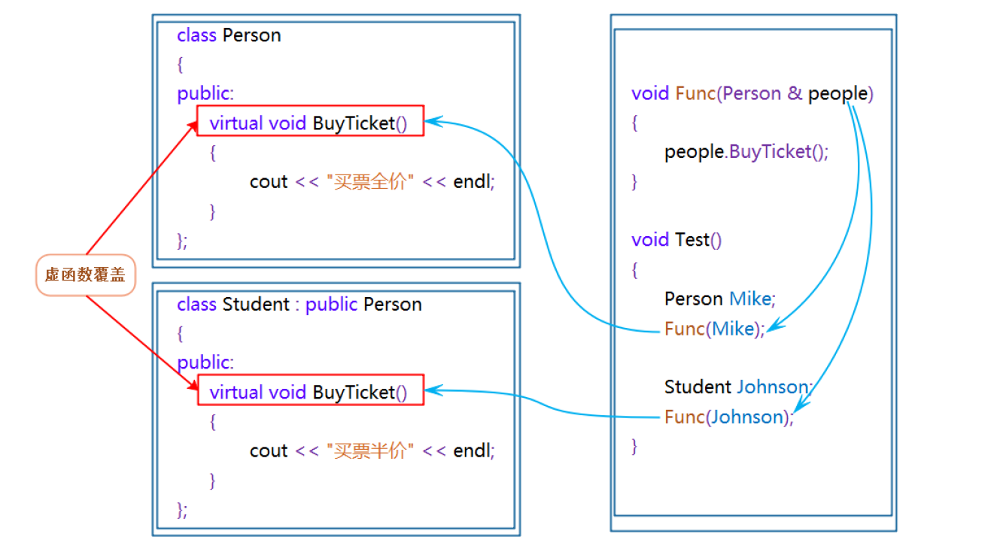

注意：在重写基类虚函数时，**派生类的虚函数在不加virtual关键字时，虽然也可以构成重写**(因为继承后基类的虚函数被继承下来了在派生类依旧保持虚函数属性)，但是该种写法不是很规范，不建议这样使用。

```cpp
class Person {
public:
    virtual void BuyTicket() { cout << "买票-全价" << endl; }
};

class Student : public Person {
public:
    void BuyTicket() { cout << "买票-半价" << endl; }
};

void Func(Person& p)
{
    p.BuyTicket();
}

int main()
{
    Person ps;
    Student st;
    Func(ps);
    Func(st);
    return 0;
}
```

以下程序输出结果是什么（）

> A: A->0          B: B->1             C: A->1              D: B->0            E: 编译出错                   F: 以上都不正确
>

```cpp
class A
{
public:
	virtual void func(int val = 1) { std::cout << "A->" << val << std::endl; }
	virtual void test() { func(); }
};

class B : public A
{
public:
	void func(int val = 0) { std::cout << "B->" << val << std::endl; }
};

int main(int argc, char* argv[])
{
	B* p = new B;
	p->test();
	return 0;
}
```

1. 在`p->test()`中，`p`是`B`类的指针，不过`test`函数是在`A`类中定义的。在`test`函数内部调用`func()`时，因为`func`是虚函数，所以会调用`B`类中重写的`func`函数。
2. 默认参数是在**编译时**确定的，而不是在运行时。当调用`func`函数时，虽然实际调用的是`B`类的`func`函数，但默认参数的值是从`A`类的`func`函数定义里获取的，也就是`val = 1`。所以最终输出的是`B->1`。

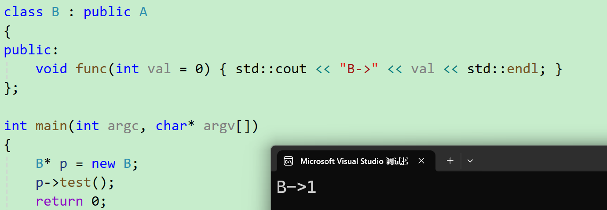

## 1.5 虚函数重写的两个例外
### 1.5.1 协变
> 协变(基类与派生类虚函数返回值类型不同)
>

派生类重写基类虚函数时，与基类虚函数**返回值类型不同**。即基类虚函数返回基类**对象的指针或者引用**，派生类虚函数**返回派生类对象的指针或者引用时**，称为**协变**。

```cpp
class A {};
class B : public A {};

class Person {
public:
	virtual A* BuyTicket()
	{
		cout << "买票-全价" << endl;
		return nullptr;
	}
};

class Student : public Person {
public:
	virtual B* BuyTicket()
	{
		cout << "买票-打折" << endl;
		return nullptr;
	}
};

void Func(Person* ptr)
{
	ptr->BuyTicket();
}

int main()
{
	Person ps;
	Student st;
	Func(&ps);
	Func(&st);
	return 0;
}
```

也可以这样写：

```cpp
class Person {
public:
	virtual Person* BuyTicket()
	{
		cout << "买票-全价" << endl;
		return nullptr;
	}
};

class Student : public Person {
public:
	virtual Person* BuyTicket()
	{
		cout << "买票-打折" << endl;
		return nullptr;
	}
};
```

### 1.5.2 重写
> 析构函数的重写(基类与派生类析构函数的名字不同)
>

如果基类的析构函数为虚函数，此时派生类析构函数只要定义，无论是否加`virtual`关键字，**都与基类的析构函数构成重写**，虽然基类与派生类析构函数名字不同。虽然函数名不相同，看起来违背了重写的规则，其实不然，这里可以理解为编译器对析构函数的名称做了特殊处理，编译后析构函数的名称统一处理成`destructor`。

下面的代码我们可以看到，如果~A()，不加virtual，那么delete p2时只调用的A的析构函数，没有调用B的析构函数，就会导致内存泄漏问题，因为~B()中在释放资源。

```cpp
class A
{
public:
    virtual ~A()
    {
        cout << "~A()" << endl;
    }
};
class B : public A {
public:
    ~B()
    {
        cout << "~B()->delete:" << _p << endl;
        delete _p;
    }
protected:
    int* _p = new int[10];
};

int main()
{
    A* p1 = new A;
    A* p2 = new B;
    // 只有派生类B的析构函数重写了A的析构函数，下面的delete对象调用析构函数，
    // 才能构成多态，才能保证p1和p2指向的对象正确的调用析构函数。
    delete p1;
    delete p2;
    return 0;
}
```

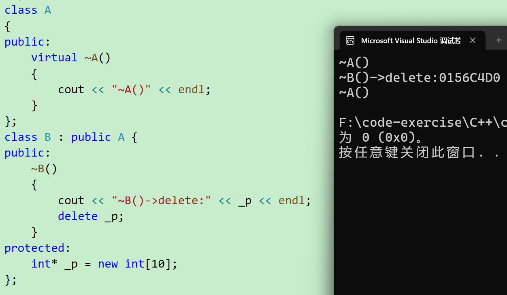

## 1.6 C++11 override 和 final
从上面可以看出，C++对函数重写的要求比较严格，但是有些情况下由于疏忽，可能会导致函数名字母次序写反而无法构成重载，而这种错误在编译期间是不会报出的，只有在程序运行时没有得到预期结果才来debug会得不偿失，因此：C++11提供了override和final两个关键字，可以帮助用户检测是否重写。

1. final：修饰虚函数，表示该虚函数不能再被重写

```cpp
class Car
{
public:
    virtual void Drive() final {}
};
class Benz :public Car
{
public:
    virtual void Drive() { cout << "Benz-舒适" << endl; }
};
```

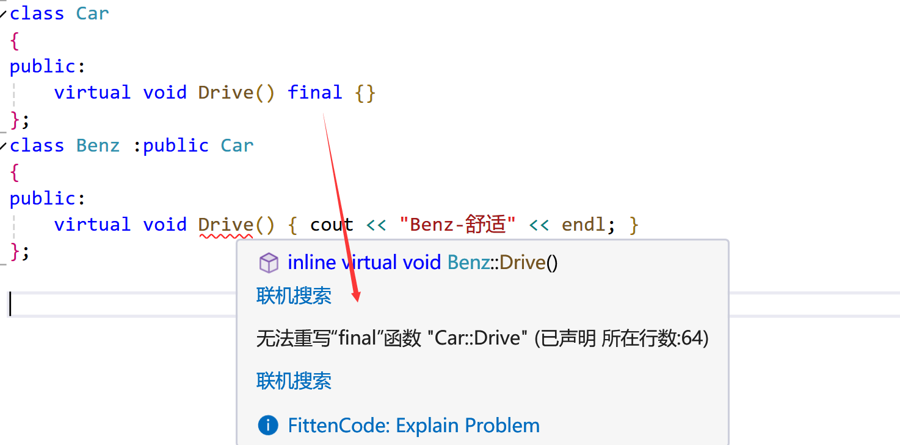

2. override: 检查派生类虚函数是否重写了基类某个虚函数，如果没有重写编译报错。

```cpp
class Car {
public:
     void Drive() {}
};
class Benz :public Car {
public:
    virtual void Drive() override { cout << "Benz-舒适" << endl; }
};
```

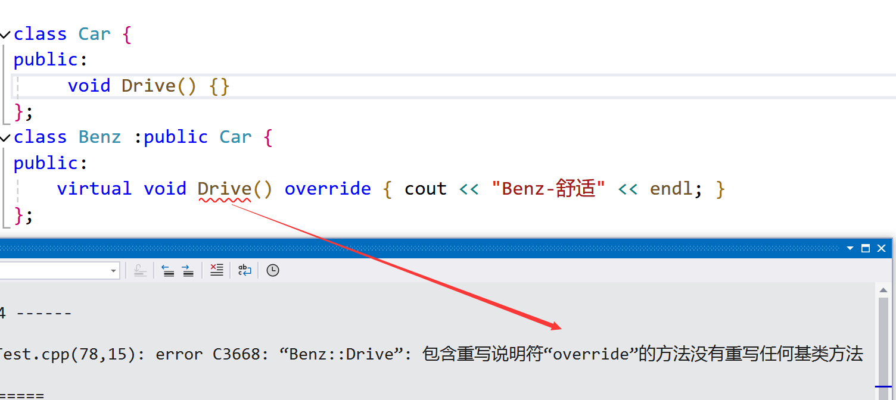

## 1.7 重载、覆盖(重写)、隐藏(重定义)的对比
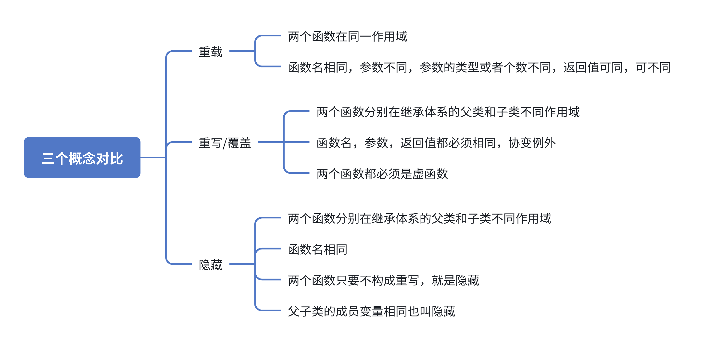

## 1.8 抽象类
在虚函数的后面写上`=0` ，则这个函数为**纯虚函数**。包含纯虚函数的类叫做**抽象类**（也叫接类），**抽象类不能实例化出对象。派生类继承后也不能实例化出对象**，**只有重写纯虚函数，派生类才能实例化出对象**。纯虚函数规范了**派生类必须重写**，另外纯虚函数更体现出了接口继承。

纯虚函数不需要定义实现(实现没啥意义因为要被派生类重写，但是语法上可以实现)，只要声明即可。

```cpp
//抽象类（接口类）
class Car
{
public:
    //纯虚函数
    virtual void Drive() = 0;
};
int main()
{
    Car c; //抽象类不能实例化出对象，error
    return 0;
}
```

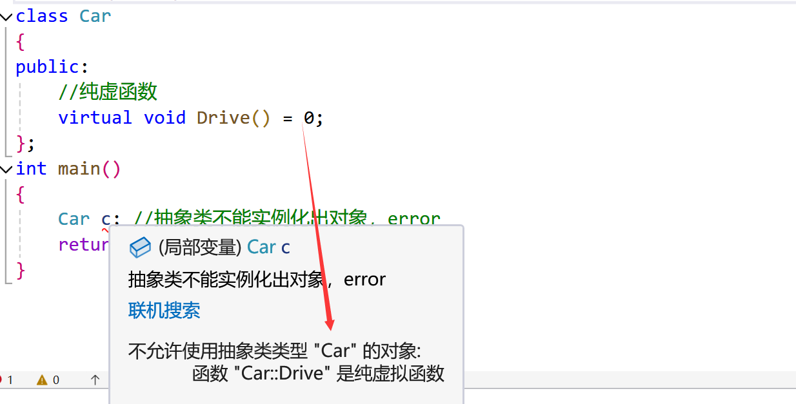

**派生类继承抽象类后也不能实例化出对象，只有重写纯虚函数，派生类才能实例化出对象。**

```cpp
//抽象类（接口类）
class Car
{
public:
    //纯虚函数
    virtual void Drive() = 0;
};
//派生类
class Benz : public Car
{
public:
    //重写纯虚函数
    virtual void Drive()
    {
        cout << "Benz-舒适" << endl;
    }
};
//派生类
class BMW : public Car
{
public:
    //重写纯虚函数
    virtual void Drive()
    {
        cout << "BMW-操控" << endl;
    }
};

int main()
{
    // 编译报错：error C2259: “Car”: 无法实例化抽象类
    // Car car;

    Car* pBenz = new Benz;
    pBenz->Drive();

    Car* pBMW = new BMW;
    pBMW->Drive();

    return 0;
}
```

## 1.9 接口继承和实现继承
普通函数的继承是一种实现继承，派生类继承了基类函数，可以使用函数，继承的是**函数的实现**。虚函数的继承是一种**接口继承**，派生类继承的是**基类虚函数的接口**，目的是为了重写，达成多态，继承的是**接口**。所以如果不实现多态，不要把函数定义成虚函数。

## 2.0 小结
**多态调用**：运时，指向对象的虚表中找虚函数调用，指向父类调用父类的虚函数，指向子类调用子类的虚函数

**普通调用**：编译时，调用对象是哪个类型，就调用他的函数

**虚表**：**虚函数表**，存的**虚函数**，**目标实现多态**

**虚基表**：存的当前位置距离虚**基表部分的偏移量**，解决**菱形继承数据冗余和二义**性

# 二、多态的原理
## 2.1 虚函数表
这里常考一道笔试题：`sizeof(Base)`是多少？

```cpp
class Base
{
public:
    virtual void Func1()
    {
        cout << "Func1()" << endl;
    }
private:
    int _b = 1;
};
```

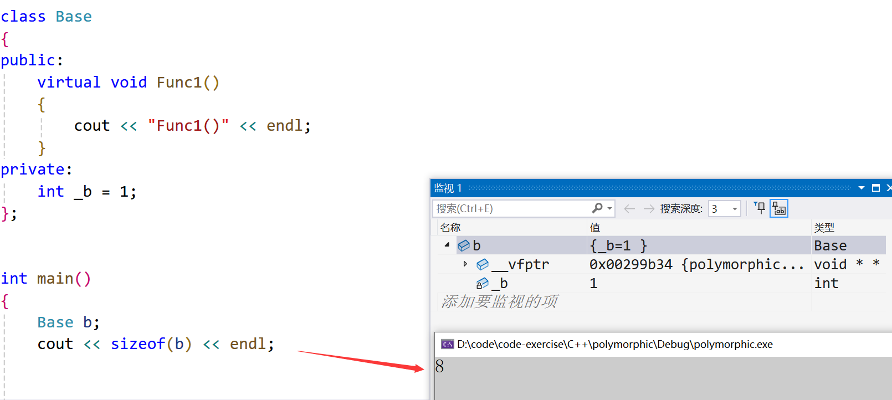

+ **只要一个类有一个虚函数，就要考虑一个虚函数指针（虚函数表指针）**，要把虚函数的**地址**保存到这张表上（v代表virtual，f代表function），**一个含有虚函数的类中都至少都有一个虚函数表指针**，因为虚函数的地址要被放到虚函数表中，**虚函数表也简称虚表**。
+ 在32位下一个指针占4个字节，在64位下一个指针占8个字节，我这里使用32位演示

我们多添加几个虚函数就可以观察到：这是一个虚函数**函数指针数组**

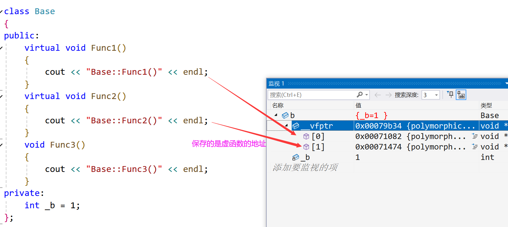

我们再次将其改造：

```cpp
class Base
{
public:
    virtual void Func1()
    {
        cout << "Base::Func1()" << endl;
    }
    virtual void Func2()
    {
        cout << "Base::Func2()" << endl;
    }
    void Func3()
    {
        cout << "Base::Func3()" << endl;
    }
private:
    int _b = 1;
};

class Derive : public Base
{
public:
    virtual void Func1()
    {
        cout << "Derive::Func1()" << endl;
    }
private:
    int _d = 2;
};

int main()
{
    Base b;
    Derive d;

    return 0;
}
```

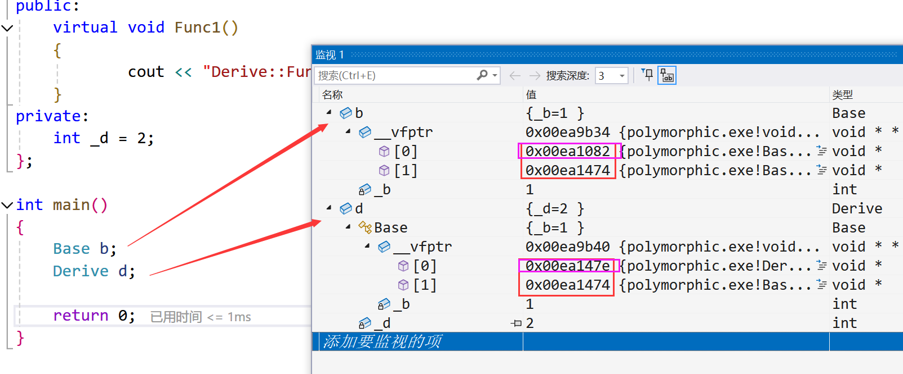

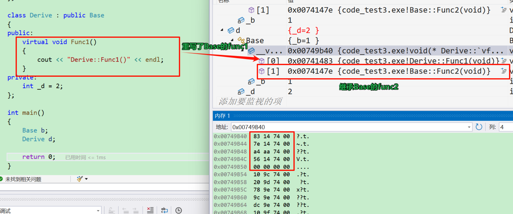

1. 派生类对象d中也有一个虚表指针，**d对象由两部分构成，一部分是父类继承下来的成员，虚表指针也就是存在部分的另一部分是自己的成员。**
2. **基类b对象和派生类d对象虚表是不一样的**，这里我们发现Func1完成了重写，所以d的虚表中存的是重写的Derive::Func1，所以虚函数的重写也叫作**覆盖**，覆盖就是指虚表中虚函数的覆盖。重写是语法的叫法，覆盖是原理层的叫法。
3. 另外Func2继承下来后是虚函数，所以放进了虚表，Func3也继承下来了，但是不是虚函数，所以不会放进虚表。
4. 虚函数表本质是一个存虚函数指针的指针数组，一般情况这个数组最后面放了一个**nullptr**，**Linux平台不会给**。
5. 总结一下派生类的**虚表生成**：
    1. 先将基类中的虚表内容拷贝一份到派生类虚表中 
    2. 如果派生类重写了基类中某个虚函数，用派生类自己的虚函数覆盖虚表中基类的虚函数 
    3. 派生类自己新增加的虚函数按其在派生类中的声明次序增加到派生类虚表的最后。
6. 虚函数存在哪的？虚表存在哪的？ 答：**虚函数存在虚表**，**虚表存在对象中**。注意上面的**回答的错**的。但是很多人都是这样深以为然的。注意**虚表存的是虚函数指针**，**不是虚函数，虚函数和普通函数一样**的，都是存在**代码段**的，只是他的指针又存到了**虚表**中。另外对象中存的不是虚表，存的是**虚表指针**。那么虚表存在哪的呢？实际我们去验证一下会发现vs下是存在**代码段**的。

```cpp
class Base {
public:
    virtual void func1() { cout << "Base::func1" << endl; }
    virtual void func2() { cout << "Base::func2" << endl; }
private:
    int a;
};

void func()
{
    cout << "void func()" << endl;
}

int main()
{
    Base b1;
    Base b2;

    static int a = 0;
    int b = 0;
    int* p1 = new int;
    const char* p2 = "hello world";

    printf("静态区:%p\n", &a);
    printf("栈:%p\n", &b);
    printf("堆:%p\n", p1);
    printf("代码段:%p\n", p2);
    printf("虚表:%p\n", *((int*)&b1));
    printf("虚函数地址:%p\n", &Base::func1);
    printf("普通函数地址:%p\n", func);

    return 0;
}
```

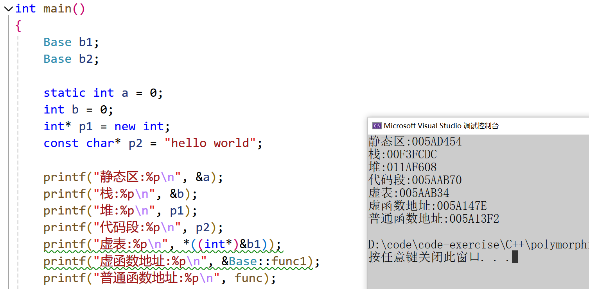

## 2.2 多态的原理
再来回到之前的代码：

```cpp
class Person {
public:
    virtual void BuyTicket() { cout << "买票-全价" << endl; }
};

class Student : public Person {
public:
    virtual void BuyTicket() { cout << "买票-半价" << endl; }
};

void Func(Person& p)
{
    p.BuyTicket();
}

int main()
{
    Person Mike;
    Func(Mike);
    Student Johnson;
    Func(Johnson);
    return 0;
}
```

1. 观察下图的箭头我们看到，p是指向mike对象时，p->BuyTicket在mike的虚表中找到虚函数是Person::BuyTicket。
2. 观察下图的箭头我们看到，p是指向johnson对象时，p->BuyTicket在johson的虚表中找到虚函数是Student::BuyTicket。
3. 反过来思考我们要达到多态，有两个条件，一个是**虚函数覆盖**，一个是**对象的指针或引用调用虚函数**。
4. 再通过下面的汇编代码分析，看出满足多态以后的函数调用，不是在编译时确定的，是运行起来以后到对象的中取找的。不满足多态的函数调用时编译时确认好的。

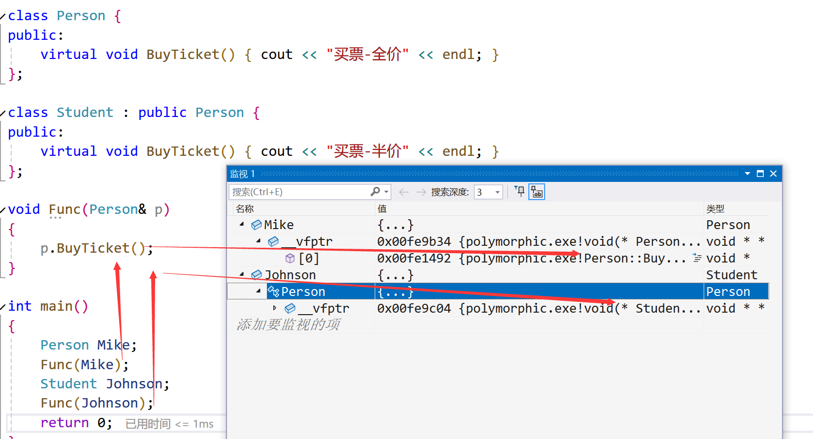

```cpp
void Func(Person* p)
{
    p->BuyTicket();
}
int main()
{
    Person mike;
    Func(&mike);
    mike.BuyTicket();
    return 0;
}
// 以下汇编代码中跟你这个问题不相关的都被去掉了
void Func(Person* p)
{
    // ...
    p->BuyTicket();
    // p中存的是mike对象的指针，将p移动到eax中
    001940DE mov eax,dword ptr [p]
    // [eax]就是取eax值指向的内容，这里相当于把mike对象头4个字节(虚表指针)移动到了edx
    001940E1 mov edx,dword ptr [eax]
    // [edx]就是取edx值指向的内容，这里相当于把虚表中的头4字节存的虚函数指针移动到了eax
    00B823EE mov eax,dword ptr [edx]
    // call eax中存虚函数的指针。这里可以看出满足多态的调用，不是在编译时确定的，是运行起来
    // 以后到对象的中取找的。
    001940EA call eax
    001940EC cmp esi,esp
}
int main()
{
    // ...
    // 首先BuyTicket虽然是虚函数，但是mike是对象，不满足多态的条件，所以这里是普通函数的调
    // 用转换成地址时，是在编译时已经从符号表确认了函数的地址，直接call 地址
    mike.BuyTicket();
    00195182 lea ecx,[mike]
    00195185 call Person::BuyTicket (01914F6h)
    // ...
}
```

上面的指针和引用可以形成多态，为什么对象不可以？

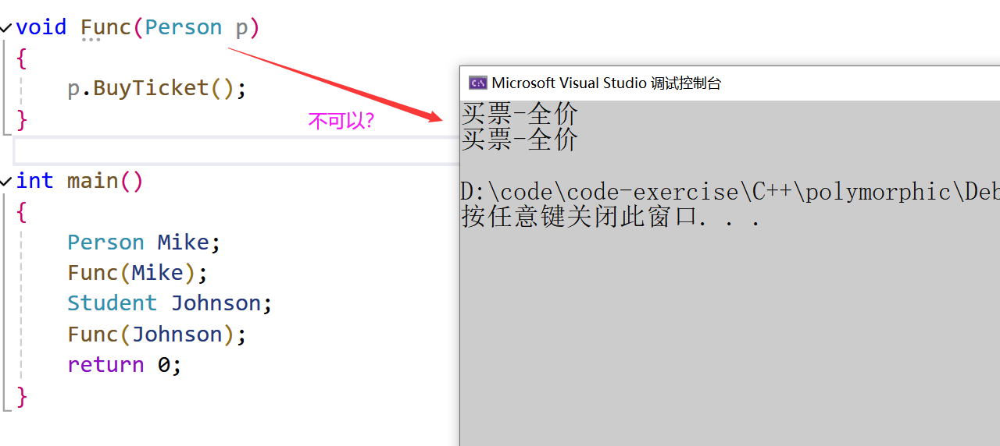

> 如果是一个指针或者引用，**是指向子类对象中切割出来父类那一部分**  
对象的话是切割出子类对象中父类的那一部分，**拷贝**给父类的，在拷贝的时候**不会拷贝虚表指针**
>

## 2.3 动态绑定与静态绑定
1. **静态绑定又称为前期绑定(早绑定)**，在程序编译期间确定了程序的行为，也称为**静态多态**，比如：函数重载
2. **动态绑定又称后期绑定(晚绑定)**，是在程序运行期间，根据具体拿到的类型确定程序的具体行为，调用具体的函数，也称为**动态多态**。

```cpp
    // ptr是指针+BuyTicket是虚函数满足多态条件。
    // 这里就是动态绑定，编译在运行时到ptr指向对象的虚函数表中确定调用函数地址
    ptr->BuyTicket();
00EF2001 mov eax,dword ptr [ptr]
00EF2004 mov edx,dword ptr [eax]
00EF2006 mov esi,esp
00EF2008 mov ecx,dword ptr [ptr]
00EF200B mov eax,dword ptr [edx]
00EF200D call eax
    // BuyTicket不是虚函数，不满足多态条件。
    // 这里就是静态绑定，编译器直接确定调用函数地址
    ptr->BuyTicket();
00EA2C91 mov ecx,dword ptr [ptr]
00EA2C94 call Student::Student (0EA153Ch)
```

# 三、单继承和多继承关系的虚函数表
## 3.1 单继承中的虚函数表
基类对象的虚函数表中存放基类所有虚函数的地址。同类型的对象共用同一张虚表，不同类型的对象各自有独立的虚表，所以基类和派生类有各自独立的虚表。

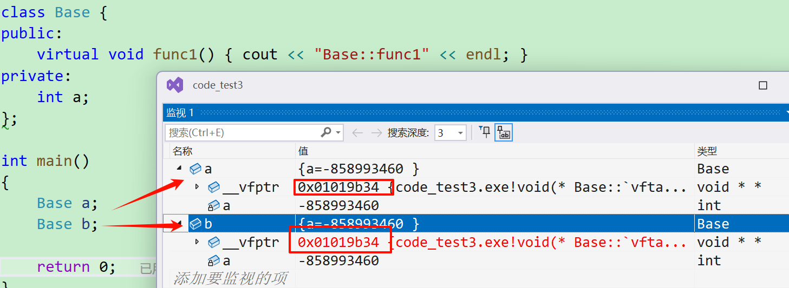

派生类由两部分构成，继承下来的基类和自己的成员，一般情况下，继承下来的基类中有虚函数表指针，自己就不会再生成虚函数表指针。但是要注意的这里继承下来的基类部分虚函数表指针和基类对象的虚函数表指针不是同一个，就像基类对象的成员和派生类对象中的基类对象成员也独立的。

派生类中重写的基类的虚函数，派生类的虚函数表中对应的虚函数就会被覆盖成派生类重写的虚函数地址。

派生类的虚函数表中包含，(1)基类的虚函数地址，(2)派生类重写的虚函数地址完成覆盖，派生类自己的虚函数地址三个部分。

虚函数表本质是一个存虚函数指针的指针数组，一般情况这个数组最后面放了一个0x00000000标记。(这个C++并没有进行规定，各个编译器自行定义的，vs系列编译器会再后面放个0x00000000标记，g++系列编译不会放)

```cpp
class Base {
public:
    virtual void func1() { cout << "Base::func1" << endl; }
    virtual void func2() { cout << "Base::func2" << endl; }
private:
    int a;
};
class Derive : public Base {
public:
    virtual void func1() { cout << "Derive::func1" << endl; }
    virtual void func3() { cout << "Derive::func3" << endl; }
    virtual void func4() { cout << "Derive::func4" << endl; }
private:
    int b;
};

int main()
{
    Base b;
    Derive d;
    return 0;
}
```

观察下图中的监视窗口中我们发现看不见func3和func4。这里是编译器的监视窗口故意隐藏了这两个函数，也可以认为是他的一个小bug。

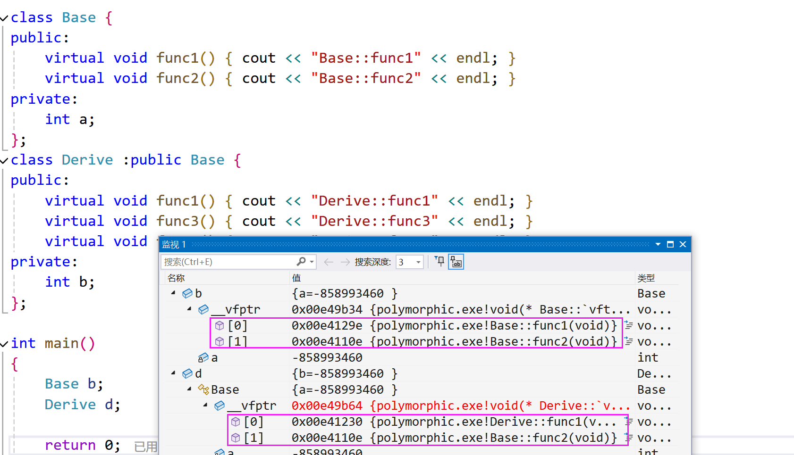

+ 那么我们如何查看d的虚表呢？下面我们使用代码打印出虚表中的函数。

 思路：**取出b、d对象的头4bytes，就是虚表的指针，前面我们说了虚函数表本质是一个存虚函数**  
**指针的指针数组，这个数组最后面放了一个nullptr**

1. 先取b的地址，强转成一个int*的指针
2. 再解引用取值，就取到了b对象头4bytes的值，这个值就是指向虚表的指针
3. 再强转成VFPTR*，因为虚表就是一个存VFPTR类型(虚函数指针类型)的数组。
4. 虚表指针传递给PrintVTable进行打印虚表
5. 需要说明的是这个打印虚表的代码经常会崩溃，因为编译器有时对虚表的处理不干净，虚表最  
后面没有放nullptr，导致越界，这是编译器的问题。我们只需要点目录栏的->生成->清理解决方案，再编译就好了。

```cpp
class Base {
public:
    virtual void func1() { cout << "Base::func1" << endl; }
    virtual void func2() { cout << "Base::func2" << endl; }
private:
    int a;
};
class Derive :public Base {
public:
    virtual void func1() { cout << "Derive::func1" << endl; }
    virtual void func3() { cout << "Derive::func3" << endl; }
    virtual void func4() { cout << "Derive::func4" << endl; }
private:
    int b;
};

// 打印虚表
typedef void(*VFPTR) ();
void PrintVTable(VFPTR vTable[])
{
    // 依次取虚表中的虚函数指针打印并调用。调用就可以看出存的是哪个函数
    cout << " 虚表地址>" << vTable << endl;
    for (int i = 0; vTable[i] != nullptr; ++i)
    {
        printf(" 第%d个虚函数地址 :0X%x,->", i, vTable[i]);
        VFPTR f = vTable[i];
        f();
    }
    cout << endl;
}

int main()
{
    Base b;
    Derive d;

    VFPTR* vTableb = (VFPTR*)(*(int*)&b);
    PrintVTable(vTableb);
    VFPTR* vTabled = (VFPTR*)(*(int*)&d);
    PrintVTable(vTabled);

    return 0;
}
```

可以观察到**虚函数都是存放到虚表中的**

如果是**64位**就强制类型转换成`long long`

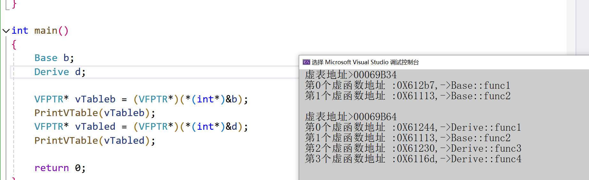

## 3.2 多继承中的虚函数表
跟前面单继承类似，多继承时Derive对象的虚表在监视窗口也观察不到部分虚函数的指针。所以我们一样可以借助上面的思路强制打印虚函数表。

需要注意的是多继承时，Derive中同时继承了Base1和Base2，内存中先继承的对象在前面，并且Derive中包含的Base1和Base2各有一张虚函数表，通过观察我们发现Derive没有重写的虚函数func3，选择放在先继承的Base1的虚函数表中。

```cpp
class Base1 {
public:
    virtual void func1() { cout << "Base1::func1" << endl; }
    virtual void func2() { cout << "Base1::func2" << endl; }
private:
    int b1;
};
class Base2 {
public:
    virtual void func1() { cout << "Base2::func1" << endl; }
    virtual void func2() { cout << "Base2::func2" << endl; }
private:
    int b2;
};
class Derive : public Base1, public Base2 {
public:
    virtual void func1() { cout << "Derive::func1" << endl; }
    virtual void func3() { cout << "Derive::func3" << endl; }
private:
    int d1;
};

typedef void(*VFPTR) ();
void PrintVTable(VFPTR vTable[])
{
    cout << " 虚表地址>" << vTable << endl;
    for (int i = 0; vTable[i] != nullptr; ++i)
    {
        printf(" 第%d个虚函数地址 :0X%x,->", i, vTable[i]);
        VFPTR f = vTable[i];
        f();
    }
    cout << endl;
}

int main()
{
    Derive d;
    VFPTR* vTableb1 = (VFPTR*)(*(int*)&d);
    PrintVTable(vTableb1);
    VFPTR* vTableb2 = (VFPTR*)(*(int*)((char*)&d + sizeof(Base1)));
    PrintVTable(vTableb2);
    // 这样也可以，发生切片
    Base2* ptr = &d;
    PrintVTable(((VFPTR*)*(int*)ptr));
    return 0;
}
```

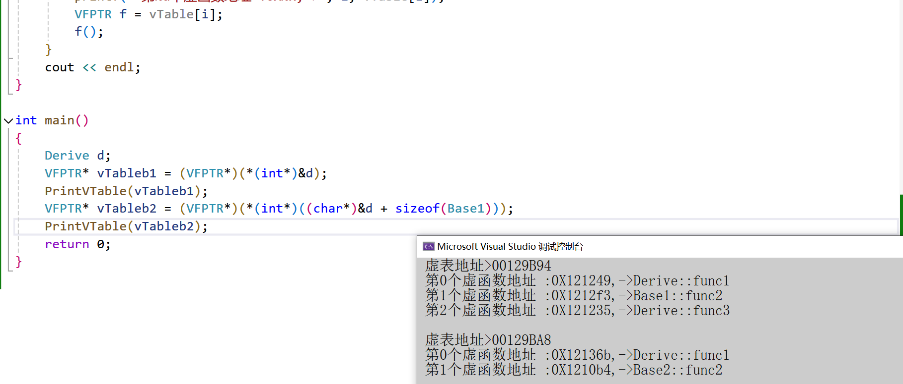

另外需要注意的是，发现Derive对象中重写的Base1虚表的func1地址和重写Base2虚表的func1地址不一样，这是为什么呢？这个问题还比较复杂。需要我们分别对这两个函数进行多态调用，并翻阅对应的汇编代码进行分析，才能捋清楚问题所在。这里简单说一个结论就是本质Base2虚表中func1的地址并不是真实的func1的地址，而是封装过的func1地址，因为Base2指针p2指向Derive时，Base2部分在中间位置，切片时，指针会发生偏移，那么多态调用p2->func1()时，p2传递给this前需要把p2给修正回去指向Derive对象，因为func1是Derive重写的，里面this应该是指向Derive对象的。

+ **多继承派生类的未重写的虚函数放在第一个继承基类部分的虚函数表中**
+ 发现上面的两个**func1**的地址不一样

观察下图：

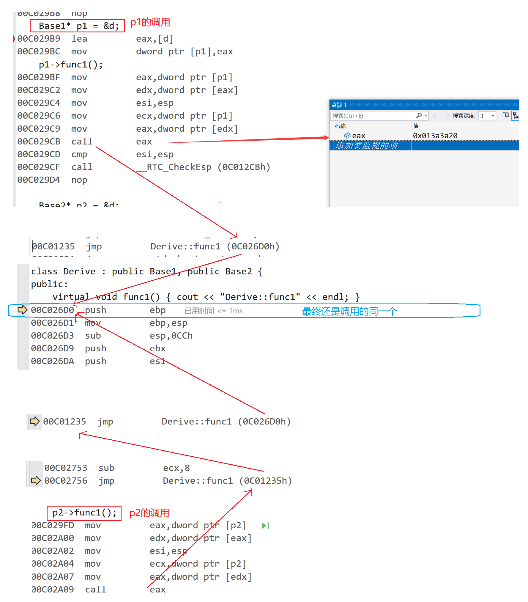

+ 发现上面的p2跳转多跳了，不是直接跳转，而是多了一个`ecx-8`，ecx是存放的this指针，需要**修正this指针**，指向`Derive`

# 四、菱形继承、菱形虚拟继承
## 4.1 菱形继承
```cpp
class A
{
public:
    virtual void func1() { cout << "A::func1" << endl; }
    int _a;
};

class B : public A
{
public:
    virtual void func2() { cout << "B::func2" << endl; }
    int _b;
};

class C : public A
{
public:
    virtual void func3() { cout << "C::func3" << endl; }

    int _c;
};

class D : public B, public C
{
public:
    virtual void func4() { cout << "D::func4" << endl; }

    int _d;
};

int main()
{
    D d;
    cout << sizeof(d) << endl;

    // 结论菱形继承的对象模型跟多继承类似
    d.B::_a = 1;
    d.C::_a = 2;
    d._b = 3;
    d._c = 4;
    d._d = 5;

    return 0;
}
```

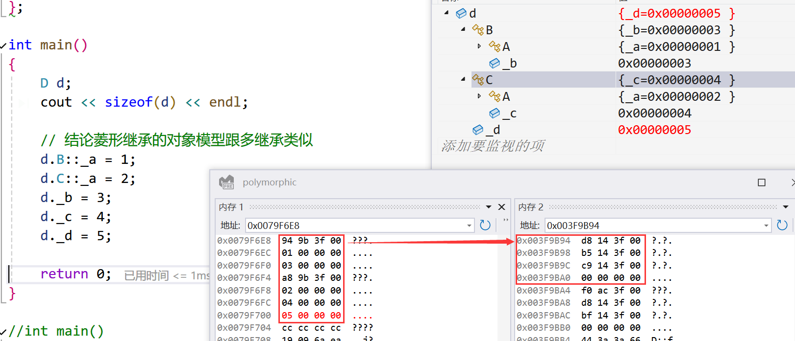

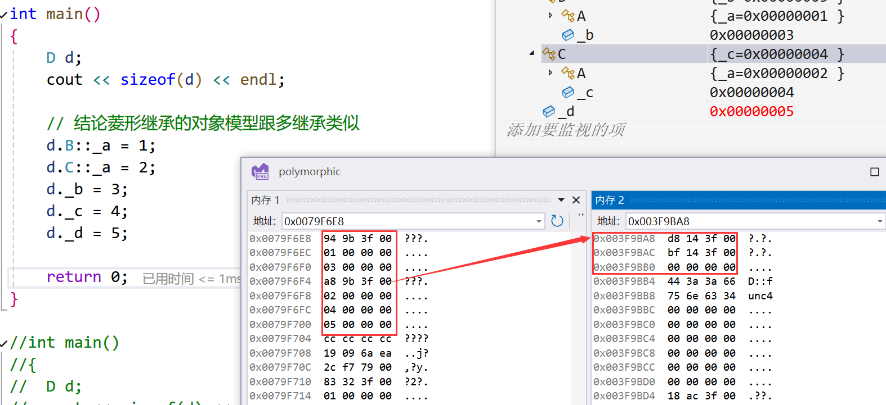

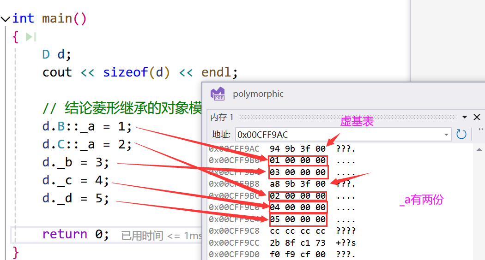

## 4.2 菱形虚拟继承
```cpp

class A
{
public:
    virtual void func1() { cout << "A::func1" << endl; }
    int _a;
};

class B : virtual public A
{
public:
    virtual void func2() { cout << "B::func2" << endl; }
    int _b;
};

class C : virtual public A
{
public:
    virtual void func3() { cout << "C::func3" << endl; }

    int _c;
};

class D : public B, public C
{
public:
    virtual void func4() { cout << "D::func4" << endl; }

    int _d;
};

int main()
{
    D d;
    cout << sizeof(d) << endl;

    d.B::_a = 1;
    d.C::_a = 2;
    d._b = 3;
    d._c = 4;
    d._d = 5;

    return 0;
}
```

+ A在最下面，因为是虚继承

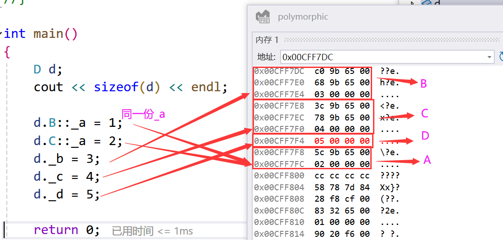

+ 第一个是**虚表**
+ 第二个是**虚基表**

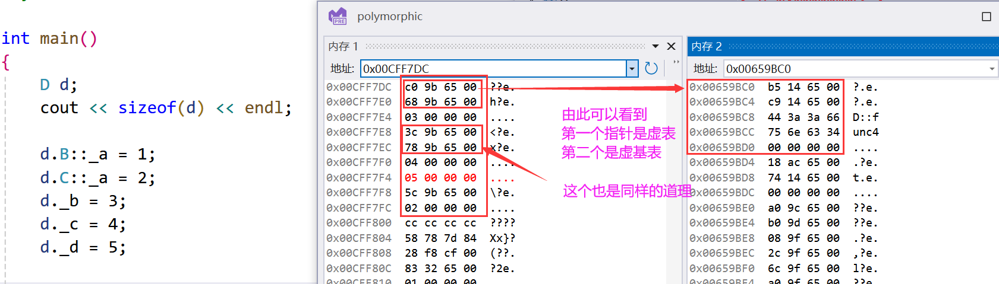

+ 虚基表中又保存：

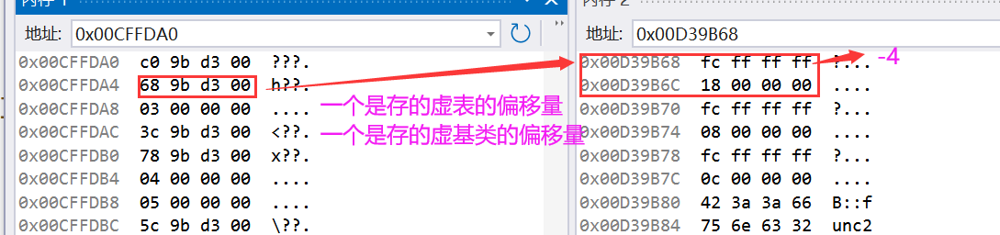

+ **一个是存的虚表的偏移量**
+ **一个是存的虚基类的偏移量**

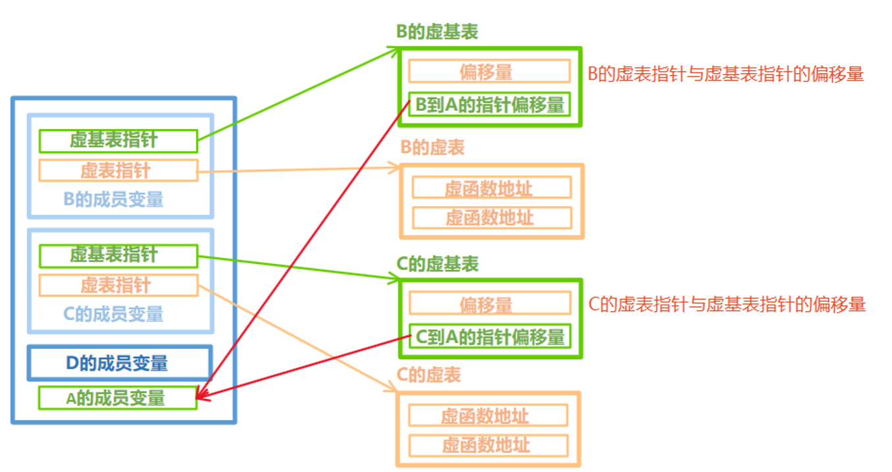

# 五、继承和多态常见的面试问题
## 5.1 概念考察
> 1、下面哪种面向对象的方法可以让你变得富有（）
>

A.继承 B.封装 C.多态 D.抽象

> 2、（）是面向对象程序设计语言中的一种机制，这种机制实现了方法的定义与具体的对象无关，而方法的调用则可以关联于具体的对象。
>

A.继承 B.模板 C.对象的自身引用 D.动态绑定

> 3、关于面向对象设计中的继承和组合，下面说法错误的是（）
>

A.继承允许我们覆盖重写父类的实现细节，父类的实现对于子类是可见的，是一种静态复用，也称为白盒复用。  
B.组合的对象不需要关系各自的实现细节，之间的关系是在运行时候才确定的，是一种动态复用，也称为黑盒复用。  
C.优先使用继承，而不是组合，是面向对象设计的第二原则。  
D.继承可以使子类能自动继承父类的接口，但在设计模式中认为这是一种破坏了父类的封装性的表现。

> 4、以下关于纯虚函数的说法，正确的是（）
>

A.声明纯虚函数的类不能实例化对象  
B.声明纯虚函数的类是虚基类  
C.子类必须实现基类的纯虚函数  
D.纯虚函数必须是空函数

> 5、关于虚函数的描述正确的是（）
>

A.派生类的虚函数与基类的虚函数具有不同的参数个数和类型  
B.内联函数不能是虚函数  
C.派生类必须重新定义基类的虚函数  
D.虚函数可以是一个static型的函数

> 6、关于虚表的说法正确的是（）
>

A.一个类只能有一张虚表  
B.基类中有虚函数，如果子类中没有重写基类的虚函数，此时子类与基类共用同一张虚表  
C.虚表是在运行期间动态生成的  
D.一个类的不同对象共享该类的虚表

> 7、假设A类中有虚函数，B继承自A，B重写A中的虚函数，也没有定义任何虚函数，则（）
>

A.A类对象的前4个字节存储虚表地址，B类对象的前4个字节不是虚表地址  
B.A类对象和B类对象前4个字节存储的都是虚基表的地址  
C.A类对象和B类对象前4个字节存储的虚表地址相同  
D.A类和B类虚表中虚函数个数相同，但A类和B类使用的不是同一张虚表

> 8、下面程序输出结果是什么？
>

```cpp
#include <iostream>
using namespace std;
class A
{
public:
    A(char* s) { cout << s << endl; }
    ~A() {};
};
class B : virtual public A
{
public:
    B(char* s1, char* s2)
        :A(s1)
    {
        cout << s2 << endl;
    }
};
class C : virtual public A
{
public:
    C(char* s1, char* s2)
        :A(s1)
    {
        cout << s2 << endl;
    }
};
class D : public B, public C
{
public:
    D(char* s1, char* s2, char* s3, char* s4)
        :B(s1, s2)
        ,C(s1, s3)
        ,A(s1)
    {
        cout << s4 << endl;
    }
};
int main()
{
    D* p = new D("class A", "class B", "class C", "class D");
    delete p;
    return 0;
}
```

A.class A class B class C class D  
B.class D class B class C class A  
C.class D class C class B class A  
D.class A class C class C class D

> 9、下面说法正确的是？（多继承中指针的偏移问题）
>

```cpp
class Base1
{
public:
    int _b1;
};
class Base2
{
public:
    int _b2;
};
class Derive : public Base1, public Base2
{
public:
    int _d;
};
int main()
{
    Derive d;
    Base1* p1 = &d;
    Base2* p2 = &d;
    Derive* p3 = &d;
    return 0;
}
```

A.p1 == p2 == p3  
B.p1 < p2 < p3  
C.p1 == p3 != p2  
D.p1 != p2 != p3

> 10、以下程序输出结果是什么？
>

```cpp
#include <iostream>
using namespace std;
class A
{
public:
    virtual void func(int val = 1)
    {
        cout << "A->" << val << endl;
    }
    virtual void test()
    {
        func();
    }
};
class B : public A
{
public:
    void func(int val = 0)
    {
        cout << "B->" << val << endl;
    }
};
int main()
{
    B* p = new B;
    p->test();
    return 0;
}
```

A.A->0 B.B->1 C.A->1 D.B->0  E.编译错误 F.以上都不正确

参考答案：

| 题号 | 答案 | 题号 | 答案 |
| --- | --- | --- | --- |
| 1 | A | 6 | D |
| 2 | D | 7 | D |
| 3 | C | 8 | A |
| 4 | A | 9 | C |
| 5 | B | 10 | B |


## 5.2 问答题
> 1、什么是多态？
>

+ 多态又分为**静态的多态**和**动态的多态**
+ 静态多态：**函数重载**。
+ 动态多态：1. 父类的指针或者引用调用**虚函数**。2. 虚函数完成重写，**指向谁，调用谁的虚函数，实现多种多态**

> 2、什么是重载、重写(覆盖)、重定义(隐藏)？
>

+ 重载是指两个函数在同一作用域，这两个**函数的函数名相同，参数不同**。
+ **重写(****覆盖)是指****两个函数分别在基类和派生类的作用域，这两个函数的函数名、参数、返回值都必须相同(协变例外)**，且这两个函数都是虚函数。
+ **重定义**(隐藏)是指两个函数**分别在基类和派生类的作用域，这两个函数的函数名相同。若两个基类和派生类的同名函数不构成重写就是重定义**。

> 3、多态的实现原理？
>

+ 构成多态的父类对象和子类对象的成员当中都包含一个**虚表指针**，这个虚表指针指向一个**虚表**，**虚表当中存储的是该类对应的虚函数地址**。因此，当父类指针指向父类对象时，通过父类指针找到**虚表指针**，然后在虚表当中找到的就是父类当中对应的**虚函数**；当父类指针指向子类对象时，通过父类指针找到**虚表指针**，然后在虚表当中找到的就是子类当中对应的**虚函数**。

> 4、inline函数可以是虚函数吗？
>

+ 我们知道**内联函数是会在调用的地方展开**的，也就是说**内联函数是没有地址**的，但是内联函数是**可以定义成虚函数**的，当我们把内联函数定义虚函数后，**编译器就忽略了该函数的内联属性**，这个函数就不再是内联函数了，因为需要将虚函数的地址放到虚表中去。
+ **可以，普通调用，inline起作用，多态调用，inline不起作用**

> 5、静态成员函数可以是虚函数吗？
>

+ 静态成员函数**不能**是虚函数，因为静态成员函数没有this指针，使用类型`::`成员函数的调用方式无法访问虚表，所以静态成员函数无法放进虚表，无法构成多态，没有意义。

> 6、构造函数可以是虚函数吗？
>

+ 构造函数**不能**是虚函数，因为**对象中的虚表指针是在构造函数初始化列表阶段才初始化的**，虚函数多态调用，要到虚表中找，但虚表指针都还没有初始化。

> 7、析构函数可以是虚函数吗？什么场景下析构函数是虚函数？
>

+ **析构函数可以是虚函数**，并且最后把**基类的析构函数定义成虚函数**。若是我们分别new一个父类对象和一个子类对象，并均用父类指针指向它们，当我们使用delete调用析构函数并释放对象空间时，只有当父类的析构函数是虚函数的情况下，才能正确调用父类和子类的析构函数分别对父类和子类对象进行析构，否则当我们使用父类指针delete对象时，只能调用到父类的析构函数。

> 8、对象访问普通函数快还是虚函数更快？
>

+ **对象访问普通函数比访问虚函数更快**，若我们访问的是一个普通函数，那直接访问就行了，但当我们**访问的是虚函数时，我们需要先找到虚表指针**，然后在虚表当中找到对应的虚函数，最后才能调用到虚函数。

> 9、虚函数表是在什么阶段生成的？存在哪的？
>

+ 虚表是在构造函数初始化列表阶段进行初始化的，虚表一般情况下是存在**代码段(常量区)**的。

> 10、C++菱形继承的问题？虚继承的原理？
>

+ 菱形虚拟继承因为子类对象当中会有两份父类的成员，因此会导致**数据冗余和二义性的问题**。  
虚继承对于相同的虚基类在对象当中只会存储一份，若要**访问虚基类的成员需要通过虚基表获取到偏移量**，进而找到对应的虚基类成员，从而解决了数据冗余和二义性的问题。

> 什么是抽象类？抽象类的作用？
>

+ 抽象类很好的体现了虚函数的继承是一种**接口继承**，**强制子类去抽象纯虚函数**，因为子类若是不抽象从父类继承下来的纯虚函数，那么子类也是抽象类也不能实例化出对象。其次，抽象类可以很好的去表示现实世界中没有示例对象对应的抽象类型，比如：植物、人、动物等。

