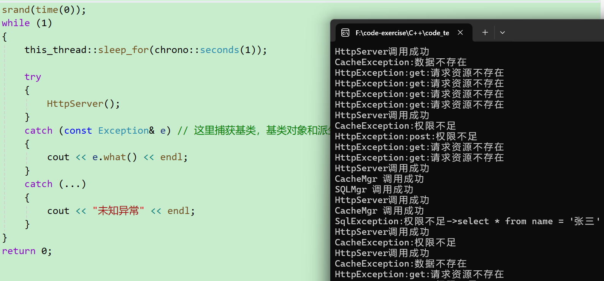
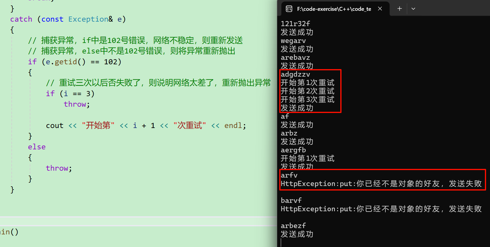
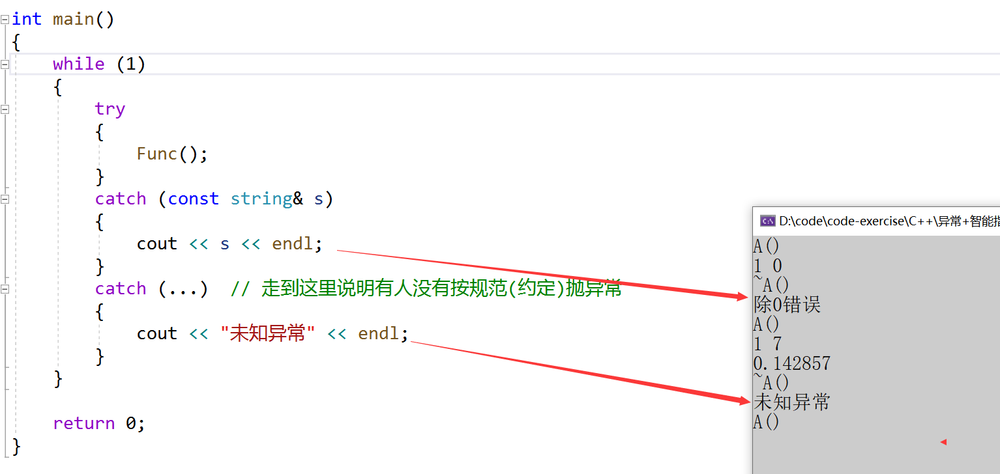
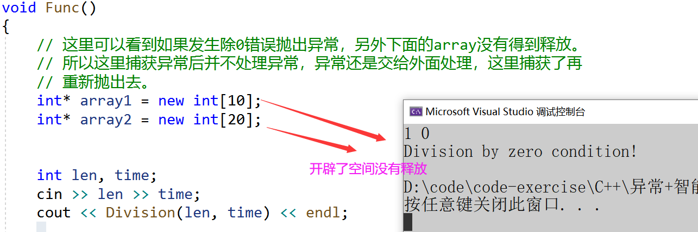
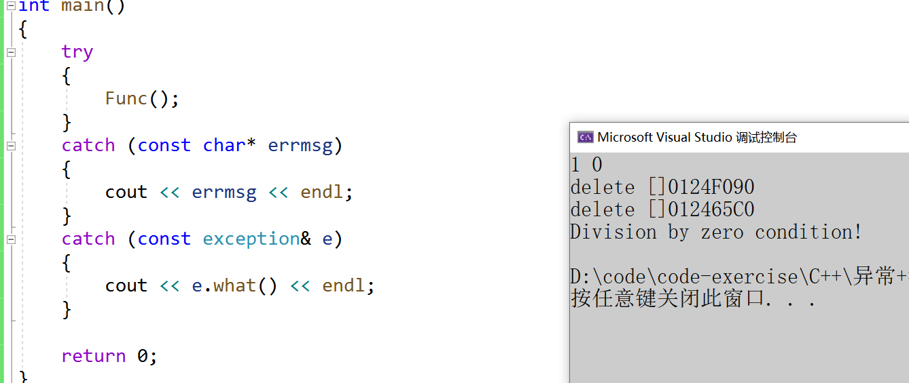
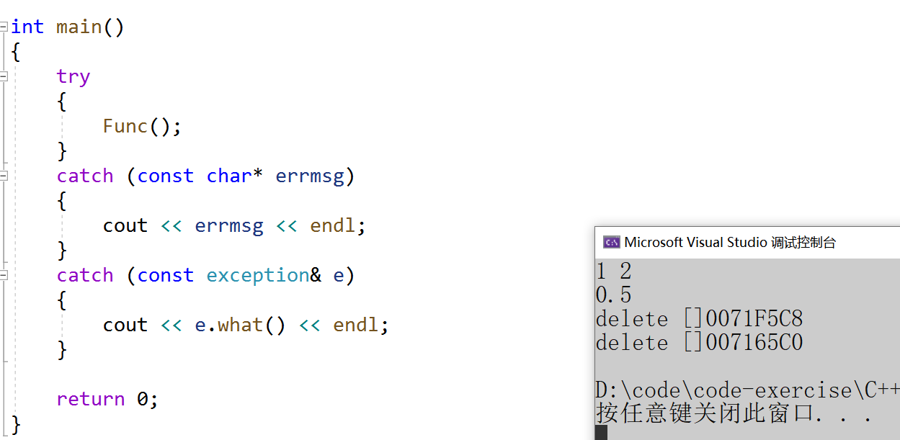
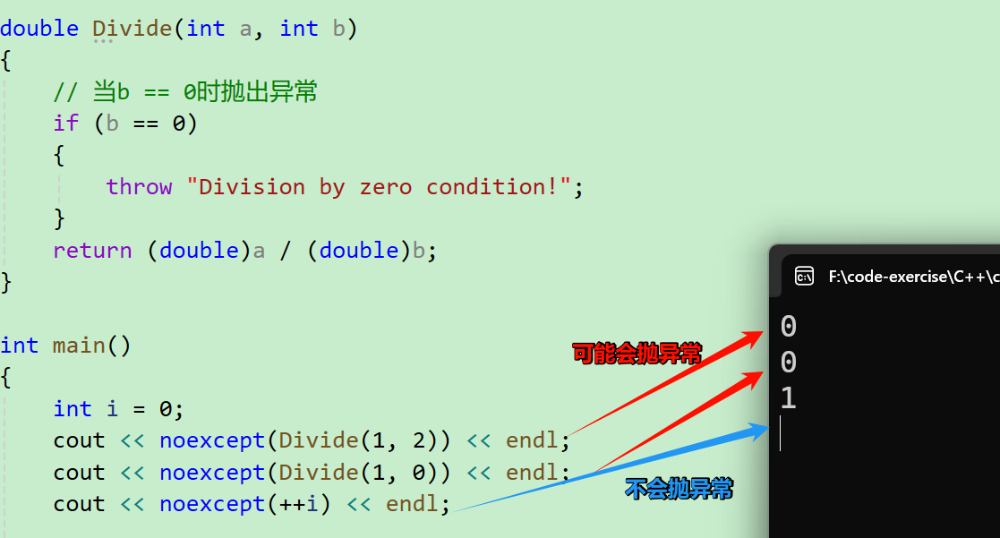
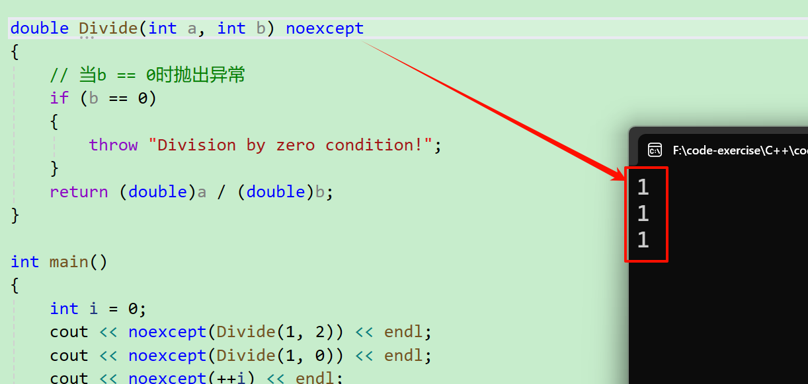
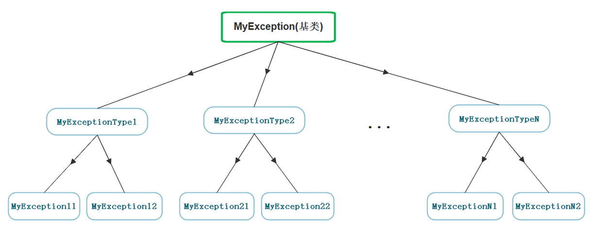
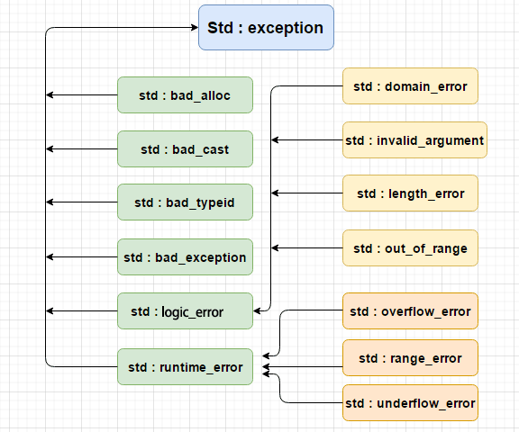

# 一、C语言传统的处理错误的方式
传统的错误处理机制：

1. 终止程序，如assert，缺陷：用户难以接受。如发生内存错误，除0错误时就会终止程序。
2. 返回错误码，缺陷：需要程序员自己去查找对应的错误。如系统的很多库的接口函数都是通过把错误码放到errno中，表示错误

实际中C语言基本都是使用返回错误码的方式处理错误，部分情况下使用终止程序处理非常严重的错误。

# 二、C++异常概念
+ 异常是一种处理错误的方式，当一个函数发现自己无法处理的错误时就可以抛出异常，让函数的直接或间接的调用者处理这个错误。
+ **throw**: 当问题出现时，程序会抛出一个异常。这是通过使用 throw 关键字来完成的。
+ **catch**: 在您想要处理问题的地方，通过异常处理程序捕获异常.catch 关键字用于捕获异常，可以有多个catch进行捕获。
+ **try**: try 块中的代码标识将被激活的特定异常,它后面通常跟着一个或多个 catch 块。

如果有一个块抛出一个异常，捕获异常的方法会使用 try 和 catch 关键字。try 块中放置可能抛出异常的代码，try 块中的代码被称为保护代码。使用 `try/catch` 语句的语法如下所示： 

```cpp
try
{
    // 保护的标识代码
}
catch (ExceptionName e1)
{
    // catch 块
}
catch (ExceptionName e2)
{
    // catch 块
}
catch (ExceptionName eN)
{
    // catch 块
}
```

# 三、异常的使用
## 3.1 异常的抛出和捕获
异常的抛出和匹配原则

1. 异常是通过抛出对象而引发的，该对象的类型决定了应该激活哪个catch的处理代码。
2. 被选中的处理代码是调用链中与该对象类型匹配且离抛出异常位置最近的那一个。
3. 抛出异常对象后，会生成一个异常对象的拷贝，因为抛出的异常对象可能是一个临时对象，所以会生成一个拷贝对象，这个拷贝的临时对象会在被catch以后销毁。（这里的处理类似于函数的传值返回）
4. `catch(...)`可以捕获任意类型的异常，问题是不知道异常错误是什么。
5. 实际中抛出和捕获的匹配原则有个例外，并不都是类型完全匹配，可**以抛出的派生类对象，使用基类捕获**，这个在实际中非常实用。

## 3.2 在函数调用链中异常栈展开匹配原则
1. 首先检查throw本身是否在try块内部，如果是再查找匹配的catch语句。如果有匹配的，则调到catch的地方进行处理。
2. 没有匹配的catch则退出当前函数栈，继续在调用函数的栈中进行查找匹配的catch。
3. 如果到达main函数的栈，依旧没有匹配的，则终止程序。上述这个沿着调用链查找匹配的catch子句的过程称为栈展开。所以实际中我们最后都要加一个`catch(...)`捕获任意类型的异常，否则当有异常没捕获，程序就会直接终止。
4. 找到匹配的catch子句并处理以后，会继续沿着catch子句后面继续执行。

```cpp
double Divide(int a, int b)
{
    try
    {
        // 当b == 0时抛出异常
        if (b == 0)
        {
            string s("Divide by zero condition!");
            throw s;
        }
        else
        {
            return ((double)a / (double)b);
        }
    }
    catch (int errid)
    {
        cout << errid << endl;
    }
}

void Func()
{
	int len, time;
	cin >> len >> time;
	try
	{
		cout << Divide(len, time) << endl;
	}
	catch (const char* errmsg)
	{
		cout << errmsg << endl;
	}
	cout << __FUNCTION__ << ":" << __LINE__ << "行执行" << endl;
}

int main()
{
	while (1)
	{
		try
		{
			Func();
		}
		catch (const string& errmsg)
		{
			cout << errmsg << endl;
		}
	}

	return 0;
}
```

5. 一般情况下抛出对象和catch是类型完全匹配的，如果有多个类型匹配的，就选择离他位置更近的那个。
6. 但是也有一些例外，允许从非常量向常量的类型转换，也就是权限缩小；允许数组转换成指向数组元素类型的指针，函数被转换成指向函数的指针；允许从派生类向基类类型的转换，这个点非常实用，实际中继承体系基本都是用这个方式设计的。

一般大型项目程序才会使用异常，下面我们模拟设计一个服务的几个模块每个模块的继承都是Exception的派生类，每个模块可以添加自己的数据最后捕获时，我们捕获基类就可以

```cpp
#include <thread>
class Exception
{
public:
    Exception(const string& errmsg, int id)
        :_errmsg(errmsg)
        , _id(id)
    {
    }

    virtual string what() const
    {
        return _errmsg;
    }

    int getid() const
    {
        return _id;
    }

protected:
    string _errmsg;
    int _id;
};

class SqlException : public Exception
{
public:
    SqlException(const string& errmsg, int id, const string& sql)
        :Exception(errmsg, id)
        , _sql(sql)
    {
    }

    virtual string what() const
    {
        string str = "SqlException:";
        str += _errmsg;
        str += "->";
        str += _sql;
        return str;
    }
private:
    const string _sql;
};

class CacheException : public Exception
{
public:
    CacheException(const string& errmsg, int id)
        :Exception(errmsg, id)
    {
    }

    virtual string what() const
    {
        string str = "CacheException:";
        str += _errmsg;
        return str;
    }
};

class HttpException : public Exception
{
public:
    HttpException(const string& errmsg, int id, const string& type)
        :Exception(errmsg, id)
        , _type(type)
    {
    }

    virtual string what() const
    {
        string str = "HttpException:";
        str += _type;
        str += ":";
        str += _errmsg;
        return str;
    }
private:
    const string _type;
};

void SQLMgr()
{
    if (rand() % 7 == 0)
    {
        throw SqlException("权限不足", 100, "select * from name = '张三'");
    }
    else
    {
        cout << "SQLMgr 调用成功" << endl;
    }
}

void CacheMgr()
{
    if (rand() % 5 == 0)
    {
        throw CacheException("权限不足", 100);
    }
    else if (rand() % 6 == 0)
    {
        throw CacheException("数据不存在", 101);
    }
    else
    {
        cout << "CacheMgr 调用成功" << endl;
    }
    SQLMgr();
}

void HttpServer()
{
    if (rand() % 3 == 0)
    {
        throw HttpException("请求资源不存在", 100, "get");
    }
    else if (rand() % 4 == 0)
    {
        throw HttpException("权限不足", 101, "post");
    }
    else
    {
        cout << "HttpServer调用成功" << endl;
    }
    CacheMgr();
}

int main()
{
	srand(time(0));
	while (1)
	{
		this_thread::sleep_for(chrono::seconds(1));

		try
		{
			HttpServer();
		}
		catch (const Exception& e) // 这里捕获基类，基类对象和派生类对象都可以被捕获
		{
			cout << e.what() << endl;
		}
		catch (...)
		{
			cout << "未知异常" << endl;
		}
	}
	return 0;
}
```



## 3.3 异常的重新抛出
有时catch到一个异常对象后，需要对错误进行分类，其中的某种异常错误需要进行特殊的处理，其他错误则重新抛出异常给外层调用链处理。捕获异常后需要重新抛出，直接`throw;`就可以把捕获的对象直接抛出。

下面程序模拟展示了聊天时发送消息，发送失败补货异常，但是可能在电梯地下室等场景手机信号不好，则需要多次尝试，如果多次尝试都发送不出去，则就需要捕获异常再重新抛出，其次如果不是网络差导致的错误，捕获后也要重新抛出。

```cpp
void _SeedMsg(const string& s)
{
	if (rand() % 3 == 0)
	{
		throw HttpException("网络不稳定，发送失败", 102, "put");
	}
	else if (rand() % 7 == 0)
	{
		throw HttpException("你已经不是对象的好友，发送失败", 103, "put");
	}
	else
	{
		cout << "发送成功" << endl;
	}
}

void SendMsg(const string& s)
{
	// 发送消息失败，则再重试3次
	for (size_t i = 0; i < 4; i++)
	{
		try
		{
			_SeedMsg(s);
			break;
		}
		catch (const Exception& e)
		{
			// 捕获异常，if中是102号错误，网络不稳定，则重新发送
			// 捕获异常，else中不是102号错误，则将异常重新抛出
			if (e.getid() == 102)
			{
				// 重试三次以后否失败了，则说明网络太差了，重新抛出异常
				if (i == 3)
					throw;

				cout << "开始第" << i + 1 << "次重试" << endl;
			}
			else
			{
				throw;
			}
		}
	}
}

int main()
{
	srand(time(0));
	string str;
	while (cin >> str)
	{
		try
		{
			SendMsg(str);
		}
		catch (const Exception& e)
		{
			cout << e.what() << endl << endl;
		}
		catch (...)
		{
			cout << "Unkown Exception" << endl;
		}
	}

	return 0;
}
```



# 四、异常安全
+ 构造函数完成对象的构造和初始化，**最好不要在构造函数中抛出异常**，否则**可能导致对象不完整或没有完全初始化**
+ 析构函数主要完成资源的清理，**最好不要在析构函数内抛出异常**，否则**可能导致资源泄漏**(内存泄漏、句柄未关闭等)
+ C++中异常经常会导致资源泄漏的问题，比如在new和delete中抛出了异常，导致内存泄漏，在lock和unlock之间抛出了异常导致死锁，C++经常使用RAII来解决以上问题。

```cpp

class A
{
public:
    A()
    {
        cout << "A()" << endl;
    }

    ~A()
    {
        cout << "~A()" << endl;
    }
};


double Division(int len, int time)
{
    if (time == 0)
    {
        string s("除0错误");
        throw s;
    }
    else
    {
        return (double)len / (double)time;
    }
}

void Func()
{
    A aa;

    try {
        int len, time;
        cin >> len >> time;
        cout << Division(len, time) << endl;
    }
    catch (const char s)
    {
        cout << s << endl;
    }
    cout << "xxxxxxxxxxxx" << endl;
}

int main()
{
    while (1)
    {
        try
        {
            Func();
        }
        catch (const string& s)
        {
            cout << s << endl;
        }
        catch (...)  // 走到这里说明有人没有按规范(约定)抛异常
        {
            cout << "未知异常" << endl;
        }
    }

    return 0;
}
```



+ 在没有捕获异常的情况下：

```cpp
double Division(int a, int b)
{
    // 当b == 0时抛出异常
    if (b == 0)
    {
        throw "Division by zero condition!";
    }
    return (double)a / (double)b;
}

void Func()
{
    // 这里可以看到如果发生除0错误抛出异常，另外下面的array没有得到释放。
    int* array1 = new int[10];
    int* array2 = new int[20];

    int len, time;
    cin >> len >> time;
    cout << Division(len, time) << endl;

    cout << "delete []" << array1 << endl;
    delete[] array1;

    cout << "delete []" << array2 << endl;
    delete[] array2;
}

int main()
{
    try
    {
        Func();
    }
    catch (const char* errmsg)
    {
        cout << errmsg << endl;
    }
    catch (const exception& e)
    {
        cout << e.what() << endl;
    }

    return 0;
}
```



+ 所以这里捕获异常后并不处理异常，异常还是交给外面处理，这里捕获了再重新抛出去

```cpp
double Division(int a, int b)
{
    // 当b == 0时抛出异常
    if (b == 0)
    {
        throw "Division by zero condition!";
    }
    return (double)a / (double)b;
}

void Func()
{
    // 这里可以看到如果发生除0错误抛出异常，另外下面的array没有得到释放。
    // 所以这里捕获异常后并不处理异常，异常还是交给外面处理，这里捕获了再
    // 重新抛出去。
    int* array1 = new int[10];
    int* array2 = new int[20];

    // 异常安全问题
    try {
        int len, time;
        cin >> len >> time;
        cout << Division(len, time) << endl;
    }
    catch (...)
    {
        cout << "delete []" << array1 << endl;
        delete[] array1;

        cout << "delete []" << array2 << endl;
        delete[] array2;

        throw;  // 捕到什么抛什么
    }

    /*catch (const char* errmsg) // 或者这样写
    {
        cout << "delete []" << array << endl;
        delete[] array;

        throw errmsg;
    }*/

    cout << "delete []" << array1 << endl;
    delete[] array1;

    cout << "delete []" << array2 << endl;
    delete[] array2;
}
```

+ 异常情况：



+ 正常情况：



> 可以看到无论正常情况还是异常情况，array1和array2都得到了释放
>

# 五、异常规范
异常规格说明的目的是为了让函数使用者知道该函数可能抛出的异常有哪些。 可以在函数的后面接throw(类型)，列出这个函数可能抛掷的所有异常类型。

C++98中函数参数列表的后面接`throw()`，表示函数不抛异常。函数参数列表的后面接throw(类型1,类型2...)表示可能会抛出多种类型的异常，可能会抛出的类型用逗号分割。若无异常接口声明，则此函数可以抛掷任何类型的异常。

C++98的方式这种方式过于复杂，实践中并不好用，C++11中进行了简化，函数参数列表后面加`noexcept`表示不会抛出异常，啥都不加表示可能会抛出异常。

编译器并不会在编译时检查noexcept，也就是说如果一个函数用noexcept修饰了，但是同时又包含了throw语句或者调用的函数可能会抛出异常，编译器还是会顺利编译通过的(有些编译器可能会报个警告)。但是一个声明了noexcept的函数抛出了异常，程序会调用`terminate`终止程序。

noexcept(expression)还可以作为一个运算符去检测一个表达式是否会抛出异常，可能会则返回false，不会就返回true。

```cpp
// 这里表示这个函数会抛出A/B/C/D中的某种类型的异常
void fun() throw(A，B，C，D);
// 这里表示这个函数只会抛出bad_alloc的异常
void* operator new (std::size_t size) throw (std::bad_alloc);
// 这里表示这个函数不会抛出异常
void* operator delete (std::size_t size, void* ptr) throw();
// C++11 中新增的noexcept，表示不会抛异常
thread() noexcept;
thread(thread&& x) noexcept;
size_type size() const noexcept;
iterator begin() noexcept;
const_iterator begin() const noexcept;
```

例如：

```cpp
double Divide(int a, int b) 
{
    // 当b == 0时抛出异常
    if (b == 0)
    {
        throw "Division by zero condition!";
    }
    return (double)a / (double)b;
}

int main()
{
    int i = 0;
    cout << noexcept(Divide(1, 2)) << endl;
    cout << noexcept(Divide(1, 0)) << endl;
    cout << noexcept(++i) << endl;
    return 0;
}
```

没有加关键字：



如果加了关键字：



# 六、自定义异常体系
实际使用中很多公司都会自定义自己的异常体系进行规范的异常管理，因为一个项目中如果大家随意抛异常，那么外层的调用者基本就没办法玩了，所以实际中都会定义一套继承的规范体系。这样大家抛出的都是继承的派生类对象，捕获一个基类就可以了




```cpp
#include <windows.h>

// 服务器开发中通常使用的异常继承体系
class Exception
{
public:
    Exception(const string& errmsg, int id)
        :_errmsg(errmsg)
        , _id(id)
    {}

    virtual string what() const
    {
        return _errmsg;
    }
protected:
    string _errmsg; // 错误描述
    int _id;		// 错误编号
};

class SqlException : public Exception
{
public:
    SqlException(const string& errmsg, int id, const string& sql)
        :Exception(errmsg, id)
        , _sql(sql)
    {}

    virtual string what() const
    {
        string str = "SqlException:";
        str += _errmsg;
        str += "->";
        str += _sql;

        return str;
    }

private:
    const string _sql;
};

class CacheException : public Exception
{
public:
    CacheException(const string& errmsg, int id)
        :Exception(errmsg, id)
    {}

    virtual string what() const
    {
        string str = "CacheException:";
        str += _errmsg;
        return str;
    }
};

class HttpServerException : public Exception
{
public:
    HttpServerException(const string& errmsg, int id, const string& type)
        :Exception(errmsg, id)
        , _type(type)
    {}

    virtual string what() const
    {
        string str = "HttpServerException:";
        str += _type;
        str += ":";
        str += _errmsg;

        return str;
    }

private:
    const string _type;
};

void SQLMgr()
{
    srand(time(0));
    if (rand() % 7 == 0)
    {
        throw SqlException("权限不足", 100, "select * from name = '张三'");
    }

    // throw "xxxxxx";
}

void CacheMgr()
{
    srand(time(0));
    if (rand() % 5 == 0)
    {
        throw CacheException("权限不足", 100);
    }
    else if (rand() % 6 == 0)
    {
        throw CacheException("数据不存在", 101);
    }

    SQLMgr();
}

void HttpServer()
{
    srand(time(0));
    if (rand() % 3 == 0)
    {
        throw HttpServerException("请求资源不存在", 100, "get");
    }
    else if (rand() % 4 == 0)
    {
        throw HttpServerException("权限不足", 101, "post");
    }

    CacheMgr();
}

int main()
{
    while (1)
    {
        Sleep(500);

        try {
            HttpServer();
        }
        catch (const Exception& e) // 这里捕获父类对象就可以
        {
            // 多态
            cout << e.what() << endl;
        }
        catch (...)
        {
            cout << "Unkown Exception" << endl;
        }
    }
    return 0;
}
```


# 七、C++标准库的异常体系
[exception - C++ Reference](https://legacy.cplusplus.com/reference/exception/exception/)

+ C++ 提供了一系列标准的异常，定义在  中，我们可以在程序中使用这些标准的异常。它们是以父子类层次结构组织起来的，如下所示：



下表是对上面层次结构中出现的每个异常的说明：

| 异常 | 描述 |
| :--- | :--- |
| **std::exception** | 该异常是所有标准 C++ 异常的父类。 |
| std::bad_alloc | 该异常可以通过 **new** 抛出。 |
| std::bad_cast | 该异常可以通过 **dynamic_cast** 抛出。 |
| std::bad_typeid | 该异常可以通过 **typeid** 抛出。 |
| std::bad_exception | 这在处理 C++ 程序中无法预期的异常时非常有用。 |
| **std::logic_error** | 理论上可以通过读取代码来检测到的异常。 |
| std::domain_error | 当使用了一个无效的数学域时，会抛出该异常。 |
| std::invalid_argument | 当使用了无效的参数时，会抛出该异常。 |
| std::length_error | 当创建了太长的 std::string 时，会抛出该异常。 |
| std::out_of_range | 该异常可以通过方法抛出，例如 std::vector 和 std::bitset<>::operator。 |
| **std::runtime_error** | 理论上不可以通过读取代码来检测到的异常。 |
| std::overflow_error | 当发生数学上溢时，会抛出该异常。 |
| std::range_error | 当尝试存储超出范围的值时，会抛出该异常。 |
| std::underflow_error | 当发生数学下溢时，会抛出该异常。 |


说明：实际中我们可以可以去继承exception类实现自己的异常类。但是实际中很多公司像上面一 样自己定义一套异常继承体系。因为C++标准库设计的不够好用。

# 八、异常的优缺点
## 8.1 C++异常的优点
1. 异常对象定义好了，相比错误码的方式可以清晰准确的展示出错误的各种信息，甚至可以包含堆栈调用的信息，这样可以帮助更好的定位程序的bug。
2. 返回错误码的传统方式有个很大的问题就是，在函数调用链中，深层的函数返回了错误，那么我们得层层返回错误，最外层才能拿到错误。
3. 很多的第三方库都包含异常，比如boost、gtest、gmock等等常用的库，那么我们使用它们也需要使用异常。 
4. 部分函数使用异常更好处理，比如构造函数没有返回值，不方便使用错误码方式处理。比如 T& operator这样的函数，如果pos越界了只能使用异常或者终止程序处理，没办法通过返回值表示错误。

## 8.2 C++异常的缺点
1. 异常会导致程序的执行流乱跳，并且非常的混乱，并且是运行时出错抛异常就会乱跳。这会 导致我们跟踪调试时以及分析程序时，比较困难。 
2. 异常会有一些性能的开销。当然在现代硬件速度很快的情况下，这个影响基本忽略不计。 
3. C++没有垃圾回收机制，资源需要自己管理。有了异常非常容易导致内存泄漏、死锁等异常安全问题。这个需要使用RAII来处理资源的管理问题。学习成本较高。 
4. C++标准库的异常体系定义得不好，导致大家各自定义各自的异常体系，非常的混乱。 
5. 异常尽量规范使用，否则后果不堪设想，随意抛异常，外层捕获的用户苦不堪言。所以异常 规范有两点：**一、抛出异常类型都继承自一个基类。二、函数是否抛异常、抛什么异常，都使用 func（） throw();的方式规范化。**

**总结**：异常总体而言，利大于弊，所以工程中我们还是鼓励使用异常的。另外其他的语言基本都是用异常处理错误，这也可以看出这是大势所趋。

