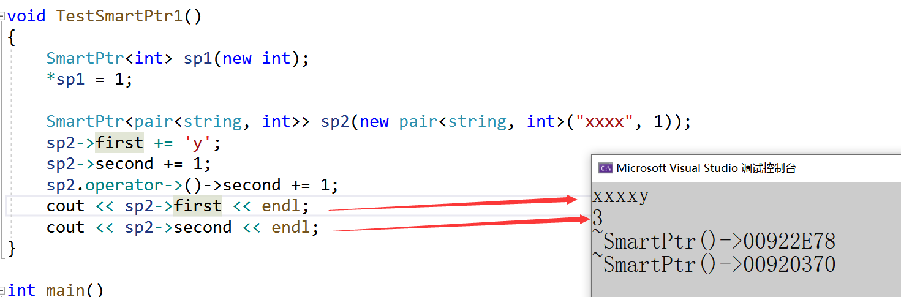
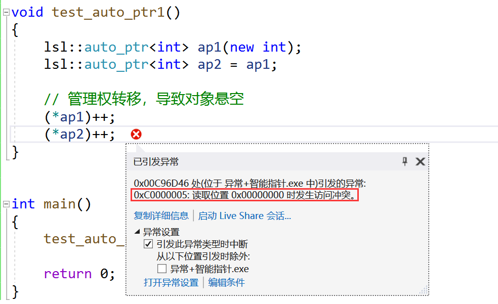
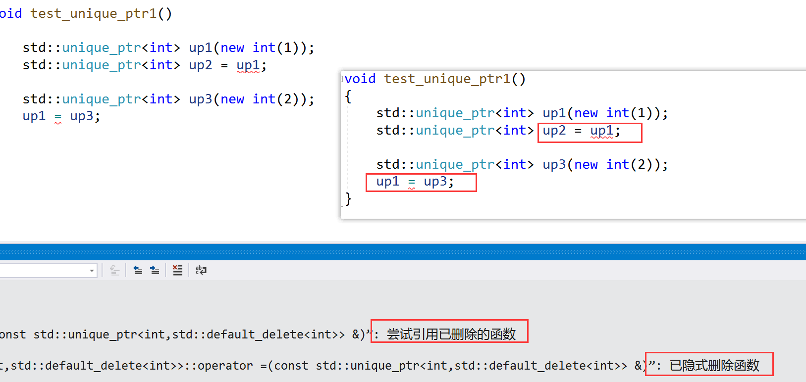
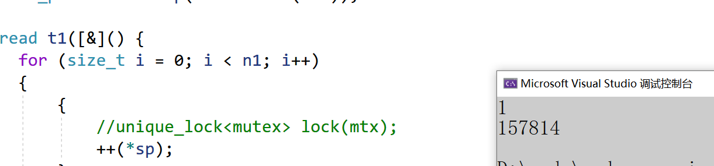
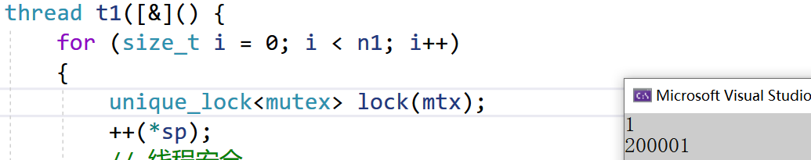
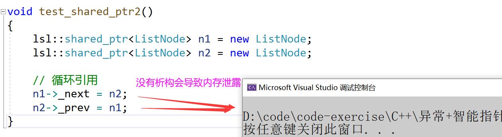
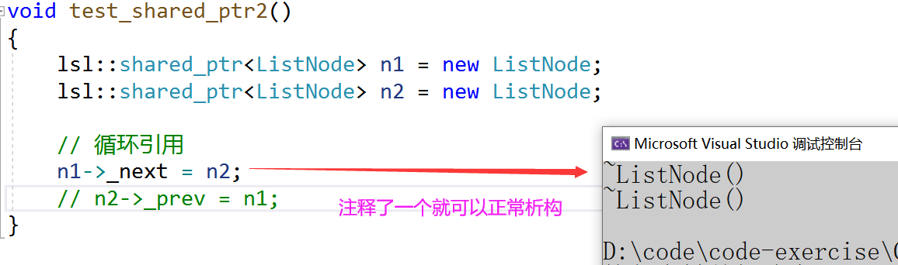
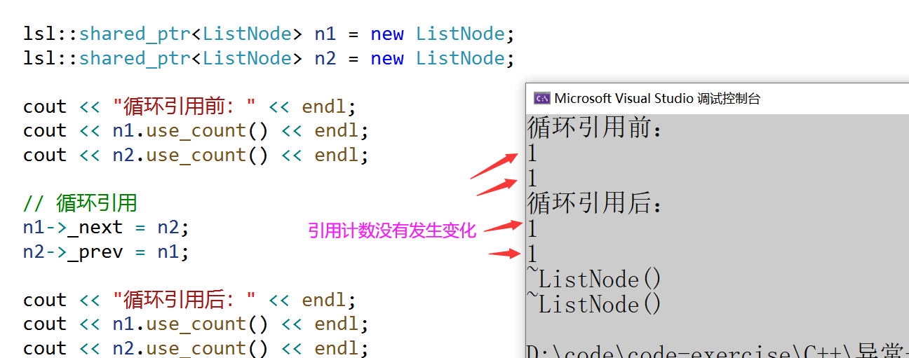

# 一、内存泄漏
## 什么是内存泄漏，内存泄漏的危害
什么是内存泄漏：内存泄漏指因为疏忽或错误造成程序未能释放已经不再使用的内存的情况。内 存泄漏并不是指内存在物理上的消失，而是应用程序分配某段内存后，因为设计错误，失去了对 该段内存的控制，因而造成了内存的浪费。

内存泄漏的危害：长期运行的程序出现内存泄漏，影响很大，如操作系统、后台服务等等，出现 内存泄漏会导致响应越来越慢，最终卡死。

## 内存泄漏分类
C/C++程序中一般我们关心两种方面的内存泄漏：

+ 堆内存泄漏(Heap leak)

堆内存指的是程序执行中依据须要分配通过malloc / calloc / realloc / new等从堆中分配的一 块内存，用完后必须通过调用相应的 free或者delete 删掉。假设程序的设计错误导致这部分 内存没有被释放，那么以后这部分空间将无法再被使用，就会产生Heap Leak。

+ 系统资源泄漏

指程序使用系统分配的资源，比方套接字、文件描述符、管道等没有使用对应的函数释放掉，导致系统资源的浪费，严重可导致系统效能减少，系统执行不稳定。

## 如何检测内存泄漏
**在linux下内存泄漏检测**：

[Linux下几款C++程序中的内存泄露检查工具_c++内存泄露工具分析-CSDN博客](https://blog.csdn.net/gatieme/article/details/51959654)

 **在windows下使用第三方工具**：

[VS编程内存泄漏：VLD(Visual LeakDetector)内存泄露库_visual leak detector vs2020-CSDN博客](https://blog.csdn.net/GZrhaunt/article/details/56839765)

**其他工具**：

[内存泄露检测工具比较 - 默默淡然 - 博客园](https://www.cnblogs.com/liangxiaofeng/p/4318499.html)

## 如何避免内存泄漏
1. 工程前期良好的设计规范，养成良好的编码规范，申请的内存空间记着匹配的去释放。ps： 这个理想状态。但是如果碰上异常时，就算注意释放了，还是可能会出问题。需要下一条智 能指针来管理才有保证。
2. 采用**RAII**思想或者智能指针来管理资源。
3. 有些公司内部规范使用内部实现的私有内存管理库。这套库自带内存泄漏检测的功能选项。 
4. 出问题了使用内存泄漏工具检测。ps：不过很多工具都不够靠谱，或者收费昂贵。

**总结一下**: 内存泄漏非常常见，解决方案分为两种：

1、事前预防型。如智能指针等。

2、事后查错型。如泄 漏检测工具。

# 二、智能指针的使用及原理
## RAII
RAII（Resource Acquisition Is Initialization）是一种利用对象生命周期来控制程序资源（如内存、文件句柄、网络连接、互斥量等等）的简单技术。

在对象构造时获取资源，接着控制对资源的访问使之在对象的生命周期内始终保持有效，最后在对象析构的时候释放资源。借此，我们实际上把管理一份资源的责任托管给了一个对象。这种做法有两大好处：

+ 不需要显式地释放资源。
+ 采用这种方式，对象所需的资源在其生命期内始终保持有效。

智能指针类除了满足RAII的设计思路，还要方便资源的访问，所以智能指针类还会想迭代器类一样，重载`perator*/operator->/operator[]`等运算符，方便访问资源。

```cpp
// 使用RAII思想设计的SmartPtr类
template<class T>
class SmartPtr
{
public:
    SmartPtr(T* ptr)
        :_ptr(ptr)
    {}

    ~SmartPtr()
    {
        delete[] ptr;
        cout << "delete[]" << _ptr << endl;
    }
private:
    T* _ptr;
};

double Division(int a, int b)
{
    if (b == 0)
    {
        throw invalid_argument("Division by zero condition!");
    }
    return (double)a / (double)b;
}

void Func()
{
    // RAII
    SmartPtr<int> sp1(new int[10]);
    SmartPtr<double> sp2(new double[10]);
    
    for (size_t i = 0; i < 10; i++)
    {
        sp1[i] = sp2[i] = i;
    }
    
    int len, time;
    cin >> len >> time;
    cout << Division(len, time) << endl; // 除零异常
}

int mian()
{
    try
    {
        Func();
    }
    catch (const exception& e)
    {
        cout << e.what() << endl;
    }
    catch (...)
    {
        cout << "未知异常" << endl;
    }
    return 0;
}
```

## 智能指针的原理
上述的SmartPtr还不能将其称为智能指针，因为它还不具有指针的行为。指针可以解引用，也可以通过`->`去访问所指空间中的内容，因此：AutoPtr模板类中还得需要将`*`、`->`重载下，才可让其像指针一样去使用。

```cpp
template<class T>
class SmartPtr
{
public:
    // RAII
    SmartPtr(T* ptr)
        :_ptr(ptr)
    {}

    ~SmartPtr()
    {
        cout << "~SmartPtr()->" << _ptr << endl;

        delete _ptr;
    }

    // 重载运算符，模拟指针的行为，方便访问资源
    T& operator*()
    {
        return *_ptr;
    }

    T* operator->()
    {
        return _ptr;
    }

    T& operator[](size_t i)
    {
        return _ptr[i];
    }

private:
    T* _ptr;
};
```



总结一下智能指针的原理： 

1. RAII特性 	
2. 重载`operator*`和`opertaor->`，具有像指针一样的行为。

# 三、C++标准库智能指针的使用
C++标准库中的智能指针都在<memory>这个头文件下面，我们包含<memory>就可以是使用了，智能指针有好几种，除了weak_ptr他们都符合RAII和像指针一样访问的行为，原理上而言主要是解决智能指针拷贝时的思路不同。

```cpp
struct Date
{
    int _year;
    int _month;
    int _day;
    Date(int year = 1, int month = 1, int day = 1)
        :_year(year)
        , _month(month)
        , _day(day)
    {}
    ~Date()
    {
        cout << "~Date()" << endl;
    }
};
int main()
{
    auto_ptr<Date> ap1(new Date);
    // 拷贝时，管理权限转移，被拷贝对象ap1悬空
    auto_ptr<Date> ap2(ap1);
    // 空指针访问，ap1对象已经悬空
    //ap1->_year++;


    unique_ptr<Date> up1(new Date);
    // 不支持拷贝
    //unique_ptr<Date> up2(up1);
    // 支持移动，但是移动后up1也悬空，所以使用移动要谨慎
    unique_ptr<Date> up3(move(up1));
    
    shared_ptr<Date> sp1(new Date);
    // 支持拷贝
    shared_ptr<Date> sp2(sp1);
    shared_ptr<Date> sp3(sp2);
    cout << sp1.use_count() << endl;
    sp1->_year++;
    cout << sp1->_year << endl;
    cout << sp2->_year << endl;
    cout << sp3->_year << endl;
    // 支持移动，但是移动后sp1也悬空，所以使用移动要谨慎
    shared_ptr<Date> sp4(move(sp1));
    return 0;
}
```

```cpp
struct Date
{
    int _year;
    int _month;
    int _day;
    Date(int year = 1, int month = 1, int day = 1)
        :_year(year)
        , _month(month)
        , _day(day)
    {}
    ~Date()
    {
        cout << "~Date()" << endl;
    }
};

template<class T>
void DeleteArrayFunc(T* ptr)
{
    delete[] ptr;
}

template<class T>
class DeleteArray
{
public:
    void operator()(T* ptr)
    {
        delete[] ptr;
    }
};

class Fclose
{
public:
    void operator()(FILE* ptr)
    {
        cout << "fclose:" << ptr << endl;
        fclose(ptr);
    }
};

int main()
{
    // 因为new[]经常使用，所以unique_ptr和shared_ptr
    // 实现了一个特化版本，这个特化版本析构时用的delete[]
	std::shared_ptr<Date[]> sp1(new Date[10]);
	std::unique_ptr<Date[]> up1(new Date[10]);

    // 定制删除器  函数指针/仿函数/lambda
    std::shared_ptr<Date> sp2(new Date[5], DeleteArray<Date>());
    std::shared_ptr<Date> sp3(new Date[5], DeleteArrayFunc<Date>);

	auto delArrOBJ = [](Date* ptr) {delete[] ptr; };
    std::shared_ptr<Date> sp4(new Date[5], delArrOBJ);
	// 实现其他资源管理的删除器
    std::shared_ptr<FILE> sp5(fopen("Test.cpp", "r"), Fclose());
    std::shared_ptr<FILE> sp6(fopen("Test.cpp", "r"), [](FILE* ptr) {
		    cout << "fclose:" << ptr << endl;
		    fclose(ptr);
		});

    std::shared_ptr<Date> sp7(new Date);

	unique_ptr<Date, DeleteArray<Date>> up2(new Date[5]);
	unique_ptr<Date, void(*)(Date*)> up3(new Date[5], DeleteArrayFunc<Date>);
	// decltype对象的类型，decltype是推导对象的类型
	unique_ptr<Date, decltype(delArrOBJ)> up4(new Date[5], delArrOBJ);

	return 0;
}
```

也可以使用make_shared，使用这个比较高效

```cpp
int main()
{
	shared_ptr<Date> sp1(new Date(2024, 9, 11));
	shared_ptr<Date> sp2 = make_shared<Date>(2024, 9, 11);
	auto sp3 = make_shared<Date>(2024, 9, 11);
	shared_ptr<Date> sp4;

	if (sp1.operator bool())
	//if (sp1) // 等价
		cout << "sp1 is not nullptr" << endl;

	if (!sp4)
		cout << "sp1 is nullptr" << endl;

	// 报错，不能类型转换
	//shared_ptr<Date> sp5 = new Date(2024, 9, 11);
	//unique_ptr<Date> sp6 = new Date(2024, 9, 11);

	return 0;
}
```

## std::auto_ptr
[auto_ptr - C++ Reference](https://legacy.cplusplus.com/reference/memory/auto_ptr/)

auto_ptr是C++98时设计出来的智能指针，他的特点是拷贝时把被拷贝对象的资源的管理权转移给拷贝对象，这是一个非常糟糕的设计，因为他会到被拷贝对象悬空，访问报错的问题，C++11设计出新的智能指针后，强烈建议不要使用auto_ptr。其他C++11出来之前很多公司也是明令禁止使用这个智能指针的。

```cpp
template<class T>
class auto_ptr
{
public:
    auto_ptr(T* ptr)
        :_ptr(ptr)
    {}

    ~auto_ptr()
    {
        if (_ptr)
        {
            cout << "~auto_ptr()" << endl;
            delete _ptr;
            _ptr = nullptr;
        }
    }
    auto_ptr(auto_ptr<T>& ap)
        :_ptr(ap._ptr)
    {
        _ptr = nullptr; // 会将原来的置为空
    }

    T& operator*()
    {
        return *_ptr;
    }

    T* operator->()
    {
        return _ptr;
    }

private:
    T* _ptr;
};
```



## std::unique_ptr
[unique_ptr - C++ Reference](https://legacy.cplusplus.com/reference/memory/unique_ptr/)

unique_ptr是C++11设计出来的智能指针，他的名字翻译出来是唯一指针，他的特点的不支持拷贝，只**支持移动**。如果不需要拷贝的场景就非常建议使用他。

```cpp
template<class T>
class unique_ptr
{
public:
    unique_ptr()
        :_ptr(nullptr)
    {}

    ~unique_ptr()
    {
        if (_ptr)
        {
            cout << "~unique_ptr()" << endl;
            delete _ptr;
            _ptr = nullptr;
        }
    }

    T& operator*()
    {
        return *_ptr;
    }

    T* operator->()
    {
        return _ptr;
    }

    // C++11
    unique_ptr(const unique_ptr<T>& up) = delete;
    unique_ptr<T>& operator=(const unique_ptr<T>& up) = delete;

private:
    // C++98
    // 1、只声明不实现
    // 2、限定为私有
    //unique_ptr(const unique_ptr<T>& up);
    //unique_ptr<T>& operator=(const unique_ptr<T>& up);
private:
    T* _ptr;
};
```



## std::shared_ptr
[shared_ptr - C++ Reference](https://legacy.cplusplus.com/reference/memory/shared_ptr/)

shared_ptr是C++11设计出来的智能指针，他的名字翻译出来是共享指针，他的特点是支持拷贝，也支持移动。如果需要拷贝的场景就需要使用他了。底层是用引用计数的方式实现的。

1. shared_ptr在其内部，给每个资源都维护了着一份计数，用来记录该份资源被几个对象共享。
2. 在对象被销毁时(也就是析构函数调用)，就说明自己不使用该资源了，对象的引用计数减一。 
3. 如果引用计数是0，就说明自己是最后一个使用该资源的对象，必须释放该资源； 
4. 如果不是0，就说明除了自己还有其他对象在使用该份资源，不能释放该资源，否则其他对象就成野指针了。
+ 引用计数支持多个拷贝管理同一个资源，最后一个析构对象释放资源
+ `shared_ptr`除了支持用指向资源的指针构造，还支持`make_shared`用初始化资源对象的值直接构造。
+ `shared_ptr`和`unique_ptr`都支持了`operator bool`的类型转换，如果智能指针对象是一个空对象没有管理资源，则返回false，否则返回true，意味着我们可以直接把智能指针对象给if判断是否为空。
+ `shared_ptr`和`unique_ptr`都得构造函数都使用`explicit`修饰，防止普通指针隐式类型转换成智能指针对象。

```cpp
template<class T>
class shared_ptr
{
public:
    shared_ptr(T* ptr = nullptr)
        :_ptr(ptr)
        ,_pcount(new int(1))
    {}
    void release()
    {
        if (--(*_pcount) == 0)
        {
            // cout << "~shared_ptr()" << endl;
            delete _ptr;
            delete _pcount;
            _ptr = nullptr;
        }
    }

    ~shared_ptr()
    {
        release();
    }
    // sp1 = sp2
    shared_ptr<T>& operator=(const shared_ptr<T>& sp)
    {
        // 防止自己给自己赋值
        if (_ptr != sp._ptr)
        {
            // 先释放原来的
            release();

            _pcount = sp._pcount;
            _ptr = sp._ptr;

            // ++现在的
            ++(*_pcount);
        }
        return *this;
    }

    T& operator*()
    {
        return *_ptr;
    }

    T* operator->()
    {
        return _ptr;
    }

    T* get() const
    {
        return _ptr;
    }

    int use_count() const
    {
        return *_pcount;
    }
private:
    T* _ptr;
    int* _pcount;
};
```

## shared_ptr 实现定制删除器
智能指针析构时默认是进行delete释放资源，这也就意味着如果**不是new出来的资源**，交给智能指针管理，析构时就会崩溃。**智能指针支持在构造时给一个删除器，所谓删除器本质就是一个可调用对象，这个可调用对象中实现你想要的释放资源的方式**，当构造智能指针时，给了定制的删除器，在智能指针析构时就会调用删除器去释放资源。因为new[]经常使用，所以为了简洁一点，unique_ptr和shared_ptr都特化了一份[]的版本，使用时`unique_ptr<Date[]> up1(newDate[5]); shared_ptr<Date[]> sp1(new Date[5]);`就可以管理`new []`的资源。

shared_ptr的实现：

```cpp
#include <functional>
namespace lsl {
    template <class T>
    class shared_ptr
    {
    public:
        // 不允许隐式类型转换
        explicit shared_ptr(T* ptr = nullptr)
            : _ptr(ptr)
            , _pcount(new int(1))
        {
        }

        template<class D>
        shared_ptr(T* ptr, D del)
            :_ptr(ptr)
            , _pcount(new int(1))
            , _del(del)
        {
        }

        shared_ptr(const shared_ptr<T>& sp)
            :_ptr(sp._ptr)
            , _pcount(sp._pcount)
            , _del(sp._del)
        {
            ++*(_pcount);
        }

        void release()
        {
            if (--*(_pcount) == 0)
            {
                // 析构
                //delete _ptr;
                _del(_ptr);
                delete _pcount;
            }
        }

        // sp1 = sp2
        shared_ptr<T>& operator=(const shared_ptr<T>& sp)
        {
            if (_ptr != sp._ptr)
            {
                release();
                _ptr = sp._ptr;
                _pcount = sp._pcount;
                ++(*_pcount);
                _del = sp._del;
            }
            return *this;
        }

        T* get() const
        {
            return _ptr;
        }

        int use_count() const
        {
            return *(_pcount);
        }

        T& operator*()
        {
            return *_ptr;
        }

        T* operator->()
        {
            return _ptr;
        }
        
        ~shared_ptr()
        {
            release();
        }

    private:
        T* _ptr;
        int* _pcount;
		function<void(T*)> _del = [](T* ptr) {delete ptr;};
    };
}
```

## std::shared_ptr的线程安全问题
通过下面的程序我们来测试shared_ptr的线程安全问题。需要注意的是shared_ptr的线程安全分为两方面：

1. 智能指针对象中引用计数是多个**智能指针对象共享**的，两个线程中智能指针的引用计数同时`++`或`--`，这个操作就**不是原子**的，引用计数原来是1，++了两次，可能还是2，这样引用计数就错乱了。会导致资源未释放或者程序崩溃的问题。所以**智能指针中引用计数++、--是需要加锁**的，也就是说引用计数的操作是线程安全的。
2. 智能指针管理的对象存放在堆上，**两个线程中同时去访问，会导致线程安全问题**

`shared_ptr`本身是线程安全的，但是**保护的资源不是线程安全的**

+ 在shared_ptr里的内部`_pcount`可以改成`atomic`原子操作，这样引用计数就是原子的

```cpp
template<class T>
class shared_ptr
{
public:
    shared_ptr(T* ptr = nullptr)
        :_ptr(ptr)
        , _pcount(new atomic<int>(1)) // 这里也要改成atomic
    {}

    template<class D>
    shared_ptr(T* ptr, D del)
        : _ptr(ptr)
        , _pcount(new atomic<int>(1)) // 这里也要改成atomic
        , _del(del)
    {}

    void release()
    {
        if (--(*_pcount) == 0)
        {
            _del(_ptr);
            delete _pcount;
        }
    }

    ~shared_ptr()
    {
        release();
    }

    shared_ptr(const shared_ptr<T>& sp)
        :_ptr(sp._ptr)
        , _pcount(sp._pcount)
    {
        ++(*_pcount);
    }

    // sp1 = sp3
    shared_ptr<T>& operator=(const shared_ptr<T>& sp)
    {
        if (_ptr != sp._ptr)
        {
            release();

            _ptr = sp._ptr;
            _pcount = sp._pcount;

            ++(*_pcount);
        }

        return *this;
    }

    // 像指针一样
    T& operator*()
    {
        return *_ptr;
    }

    T* operator->()
    {
        return _ptr;
    }

    int use_count() const
    {
        return *_pcount;
    }

    T* get() const
    {
        return _ptr;
    }

private:
    T* _ptr;
    atomic<int>* _pcount;          // 原子操作

    function<void(T*)> _del = [](T* ptr) { delete ptr; };
};
```

```cpp
// shared_ptr本身是线程安全的
int main()
{
    size_t n1 = 100000;
    size_t n2 = 100000;
    mutex mtx;                // 定义锁
    shared_ptr<double> sp(new double(1.1));

    atomic<size_t> x = 1;  // 定义一个原子变量
    thread t1([&]() {
        for (size_t i = 0; i < n1; i++)
        {
            // 线程安全
            shared_ptr<double> copy1(sp);
            ++(*copy1);
            // 线程安全
            shared_ptr<double> copy2(sp);
        }
        });

    thread t2([&]() {
            for (size_t i = 0; i < n2; i++)
            {
                // 线程安全
                shared_ptr<double> copy1(sp);
                ++(*copy1);
                // 线程安全
                shared_ptr<double> copy2(sp);
            }
        });

    t1.join();
    t2.join();

    // 当前的引用计数
    cout << sp.use_count() << endl;
    cout << *sp << endl;
}
```

+ 如果不加锁会导致线程安全的问题

```cpp
int main()
{
    size_t n1 = 100000;
    size_t n2 = 100000;
    shared_ptr<double> sp(new double(1.1));

    thread t1([&]() {
        for (size_t i = 0; i < n1; i++)
        {
            ++(*sp);
        }
        });

    thread t2([&]() {
        for (size_t i = 0; i < n2; i++)
        {
            ++(*sp);
        }
        });

    t1.join();
    t2.join();

    // 当前的引用计数
    cout << sp.use_count() << endl;
    cout << *sp << endl;
}
```




所以我们需要进行加锁，然后就可以了

```cpp
int main()
{
    size_t n1 = 100000;
    size_t n2 = 100000;
    mutex mtx; // 定义锁
    shared_ptr<double> sp(new double(1.1));

    thread t1([&]() {
        for (size_t i = 0; i < n1; i++)
        {
            unique_lock<mutex> lock(mtx);
            ++(*sp);
        }
        });

    thread t2([&]() {
        for (size_t i = 0; i < n2; i++)
        {
            unique_lock<mutex> lock(mtx);
            ++(*sp);
        }
        });

    t1.join();
    t2.join();

    // 当前的引用计数
    cout << sp.use_count() << endl;
    cout << *sp << endl;
}
```

+ 保护的资源也不是线程安全，所以我们要加锁

```cpp
int main()
{
    size_t n1 = 100000;
    size_t n2 = 100000;
    mutex mtx; // 定义锁
    shared_ptr<double> sp(new double(1.1));

    thread t1([&]() {
        for (size_t i = 0; i < n1; i++)
        {
            // 这个拷贝是线程安全的所以不用加速
            shared_ptr<double> copy1(sp);
            
            // 保护的资源也不是线程安全，所以我们要加锁
            {
                // 在域内加锁解锁
                unique_lock<mutex> lock(mtx);
                ++(*copy1);
            }
        }
        });

    thread t2([&]() {
        for (size_t i = 0; i < n2; i++)
        {
            shared_ptr<double> copy1(sp);
            
            {
                // 在域内加锁解锁
                unique_lock<mutex> lock(mtx);
                ++(*copy1);
            }
        }
        });

    t1.join();
    t2.join();

    // 当前的引用计数
    cout << sp.use_count() << endl;
    cout << *sp << endl;
}
```



## std::shared_ptr的循环引用
  


> 使用std库里的也会同样导致这样的问题
>

**循环引用分析：**

1. node1和node2两个智能指针对象指向两个节点，引用计数变成1，我们不需要手动 delete。 
2. node1的_next指向node2，node2的_prev指向node1，引用计数变成2。 
3. node1和node2析构，引用计数减到1，但是_next还指向下一个节点。但是_prev还指向上 一个节点。 
4. 也就是说_next析构了，node2就释放了。 
5. 也就是说_prev析构了，node1就释放了。
6. 但是_next属于node的成员，node1释放了，_next才会析构，而node1由_prev管理，_prev 属于node2成员，所以这就叫循环引用，谁也不会释放。

---

> 解决方案：在引用计数的场景下，把节点中的`_prev`和`_next`改成`weak_ptr`就可以了
>

原理就是：**node1->_next = node2;和node2->_prev = node1;时weak_ptr的_next和 _prev不会增加node1和node2的引用计数。**

```cpp
template<class T>
class weak_ptr
{
public:
    weak_ptr()
        :_ptr(nullptr)
    {}

    weak_ptr(const shared_ptr<T>& we)
        :_ptr(we.get())
    {}

    weak_ptr<T>& operator=(const shared_ptr<T>& we)
    {
        _ptr = we.get();
        return *this;
    }


    T& operator*()
    {
        return *_ptr;
    }

    T* operator->()
    {
        return _ptr;
    }

private:
    T* _ptr;
};

struct ListNode
{
    lsl::weak_ptr<ListNode> _next;
    lsl::weak_ptr<ListNode> _prev;
    int val;

    ~ListNode()
    {
        cout << "~ListNode()" << endl;
    }
};
```



如果不是new出来的对象如何通过智能指针管理呢，`shared_ptr`设计了一个删除器

```cpp
struct ListNode
{
    lsl::weak_ptr<ListNode> _next;
    lsl::weak_ptr<ListNode> _prev;
    int val;

    ~ListNode()
    {
        cout << "~ListNode()" << endl;
    }
};

template<class T>
class shared_ptr
{
public:
    shared_ptr(T* ptr = nullptr)
        :_ptr(ptr)
        , _pcount(new int(1))
    {}

    // 删除器
    template<class D>
    shared_ptr(T* ptr, D del)
        : _ptr(ptr)
        , _pcount(new int(1))
        , _del(del)
    {}
    void release()
    {
        if (--(*_pcount) == 0)
        {
            // cout << "~shared_ptr()" << endl;
            // delete _ptr;
            _del(_ptr);
            delete _pcount;
            _ptr = nullptr;
        }
    }

    ~shared_ptr()
    {
        release();
    }
    // sp1 = sp2
    shared_ptr<T>& operator=(const shared_ptr<T>& sp)
    {
        // 防止自己给自己赋值
        if (_ptr != sp._ptr)
        {
            // 先释放原来的
            release();

            _pcount = sp._pcount;
            _ptr = sp._ptr;

            // ++现在的
            ++(*_pcount);
        }
        return *this;
    }

    T& operator*()
    {
        return *_ptr;
    }

    T* operator->()
    {
        return _ptr;
    }
    T* get() const
    {
        return _ptr;
    }
    int use_count() const
    {
        return *_pcount;
    }
private:
    T* _ptr;
    int* _pcount;
    function<void(T*)> _del = [](T* ptr) { delete ptr; };
};

template<class T>
struct DelArray
{
    void operator()(T* ptr)
    {
        delete[] ptr;
    }
};

void main()
{
    // 定制删除器
    lsl::shared_ptr<ListNode> sp1(new ListNode[10], DelArray<ListNode>()); // 调用的仿函数
    lsl::shared_ptr<ListNode> sp2(new ListNode[10], [](ListNode* ptr) { delete[] ptr; }); // 使用lambda
    lsl::shared_ptr<FILE> sp3(fopen("Test.cpp", "r"), [](FILE* ptr) { fclose(ptr); });    // 使用lambda

    lsl::shared_ptr<ListNode> sp4(new ListNode); // 使用缺省参数
}
```

## std::weak_ptr
weak_ptr是C++11设计出来的智能指针，他的名字翻译出来是弱指针，他完全不同于上面的智能指针，他不支持RAII，也就意味着不能用它直接管理资源，weak_ptr的产生本质是要解决shared_ptr的一个循环引用导致内存泄漏的问题

weak_ptr不支持RAII，也不支持访问资源，所以我们看文档发现weak_ptr构造时不支持绑定到资源，只支持绑定到shared_ptr，绑定到shared_ptr时，不增加shared_ptr的引用计数，那么就可以解决上述的循环引用问题。

weak_ptr也没有重载operator*和operator->等，因为他不参与资源管理，那么如果他绑定的shared_ptr已经释放了资源，那么他去访问资源就是很危险的。weak_ptr支持expired检查指向的资源是否过期，use_count也可获取shared_ptr的引用计数，weak_ptr想访问资源时，可以调用lock返回一个管理资源的shared_ptr，如果资源已经被释放，返回的shared_ptr是一个空对象，如果资源没有释放，则通过返回的shared_ptr访问资源是安全的。

```cpp
int main()
{
	shared_ptr<string>  sp1(new string("11111111"));
	shared_ptr<string> sp2(sp1);// sp2与 sp1 共享同一个资源
	weak_ptr<string> wp = sp1;  //wp指向 sp1 的资源
	cout << wp.expired() << endl;    // 检查 wp 是否过期,输出 0（false），表示资源未过期
	cout << wp.use_count() << endl;  // 输出 2，表示 sp1 和 sp2 共享资源
	
 
	// sp1和sp2都指向了其他资源，则weak_ptr就过期了
	sp1 = make_shared<string>("222222");
	cout << wp.expired() << endl;// 输出 1（true），表示资源已过期
	cout << wp.use_count() << endl;// 输出 0，表示没有 shared_ptr 共享资源
 
	sp2 = make_shared<string>("333333");
	cout << wp.expired() << endl;    //同上
    cout << wp.use_count() << endl;
 
	wp = sp1;
	auto sp3 = wp.lock();  // 使用 wp.lock() 获取一个 shared_ptr 对象
	cout << wp.expired() << endl;   // 输出 0（false），表示资源未过期
	cout << wp.use_count() << endl;   // 输出 2，表示 sp1 和 sp3 共享资源
 
	*sp3 += "###";
	cout << *sp1 << endl;
 
	sp1 = sp2;
	return 0;
}
```

# 四、C++11和boost中智能指针的关系
1. C++ 98 中产生了第一个智能指针auto_ptr. 
2. C++ boost给出了更实用的scoped_ptr和shared_ptr和weak_ptr. 
3. C++ TR1，引入了shared_ptr等。不过注意的是TR1并不是标准版。 
4. C++ 11，引入了unique_ptr和shared_ptr和weak_ptr。需要注意的是unique_ptr对应boost 的scoped_ptr。并且这些智能指针的实现原理是参考boost中的实现的。

