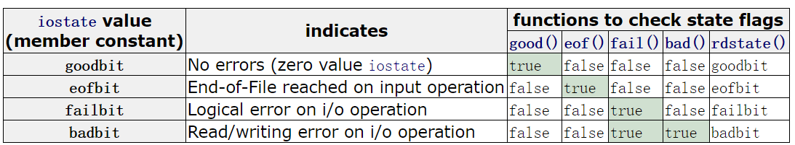
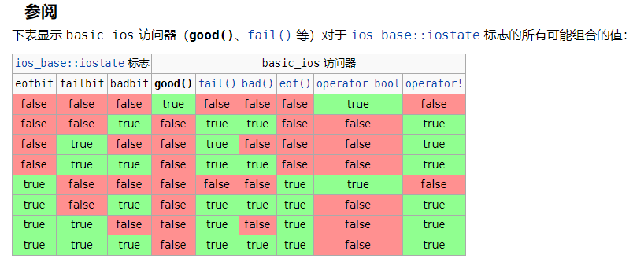
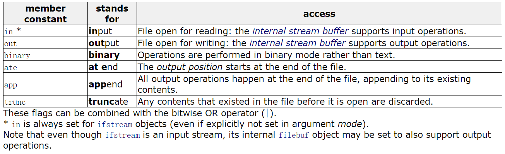
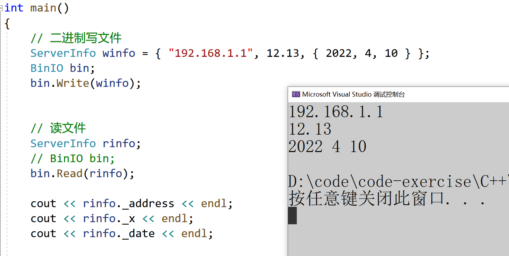
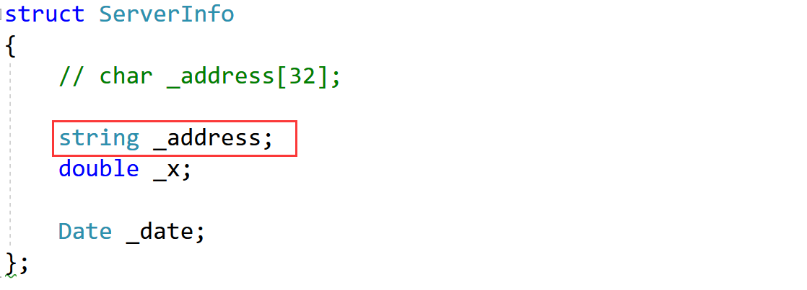
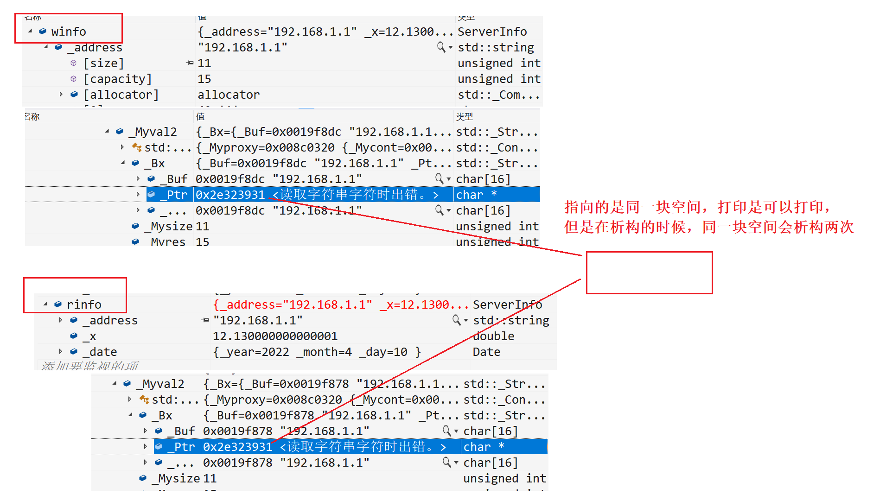
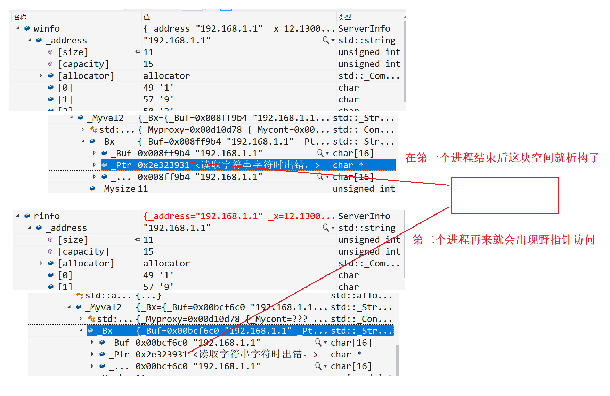
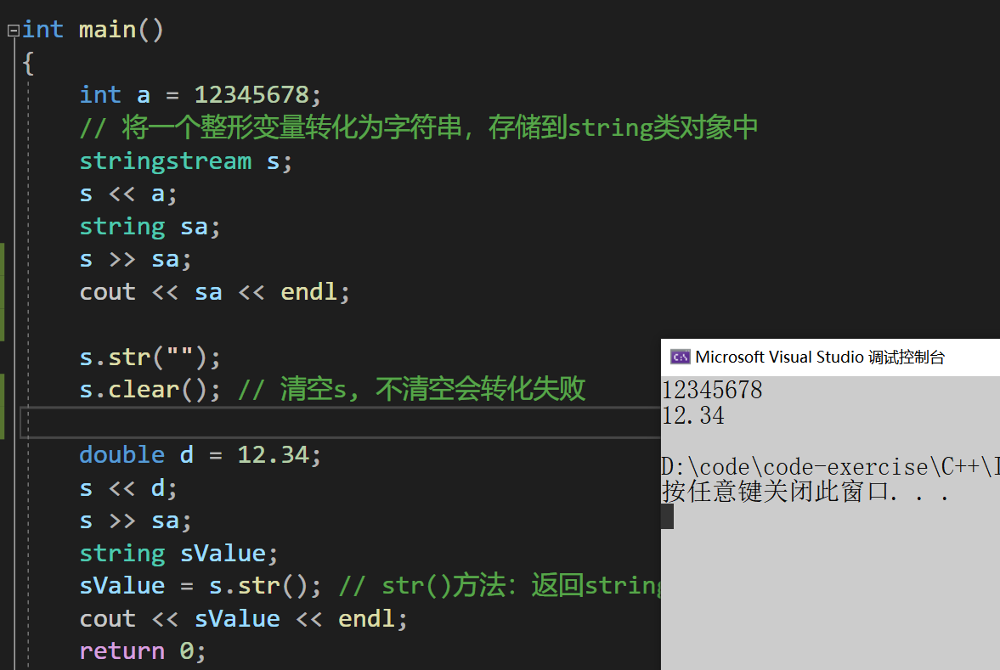

# 一、C语言的输入与输出
C语言的输入与输出 C语言中我们用到的最频繁的输入输出方式就是`scanf()`与`printf()`。 `scanf()`: 从标准输入设备(键盘)读取数据，并将值存放在变量中。`printf()`: 将指定的文字/字符串输出到标准输出设备(屏幕)。 注意宽度输出和精度输出控制。C语言借助了相应的缓冲区来进行输入与输出。

**对输入输出缓冲区的理解：**

1. 可以屏蔽掉低级I/O的实现，低级I/O的实现依赖操作系统本身内核的实现，所以如果能够屏 蔽这部分的差异，可以很容易写出可移植的程序。 
2. 可以使用这部分的内容实现“行”读取的行为，对于计算机而言是没有“行”这个概念，有了这 部分，就可以定义“行”的概念，然后解析缓冲区的内容，返回一个“行”。

## 流是什么
+ “流”即是流动的意思，是物质从一处向另一处流动的过程，是对一种有序连续且具有方向性的数据（ 其单位可以是bit,byte,packet ）的抽象描述。 
+ C++流是指信息从外部输入设备（如键盘）向计算机内部（如内存）输入和从内存向外部输出设备（显示器）输出的过程。这种输入输出的过程被形象的比喻为“流”。

它的特性是：**有序连续**、**具有方向性**

+ 为了实现这种流动，C++定义了I/O标准类库，这些每个类都称为流/流类，用以完成某方面的功能

# 二、C++IO流
+ C++系统实现了一个庞大的类库，其中ios为基类，其他类都是直接或间接派生自ios类


## IO流状态
IO操作的过程中，可能会发生各种错误，IO流对象中给了四种状态标识错误：



goodbit表示流没有错误

eofbit表示流到达文件结束

failbit表示IO操作失败了

badbit表示流崩溃了出现了系统级错误。

一个常见的IO流错误是cin>>i， i是一个int类型的对象，如果我们在控制台输入一个字符，cin对象的failbit状态位就会被设置，cin就进入错误状态，一个流一旦发生错误，后续的IO操作都会失败，我们可以调用cin.clear()函数来恢复cin的状态为goodbit。

1. badbit表示系统级错误，如不可恢复的读写错误，通常情况下，badbit一旦被设置了，流就无法再使用了。
2. failbit表示一个逻辑错误，如期望读取一个整形，但是却读取到一个字符，failbit被设置了，流是可以恢复的，恢复以后可以继续使用。
3. 如果到达文件结束位置eofbit和failbit都会被置位。如果想再次读取当前文件，可以恢复一下流的状态，同时重置一个文件指针位置。
4. goodbit表示流未发生错误。

也可以用setstate和rdstate两个函数来控制流状态，eofbit/failbit/badbit/goodbit是ios_base基类中定义的静态成员变量，可以直接使用的，并且是他们是可以组合的位运算值。



```cpp
#include<iostream>
using namespace std;
int main()
{
	cout << cin.good() << endl;
	cout << cin.eof() << endl;
	cout << cin.bad() << endl;
	cout << cin.fail() << endl << endl;

	int i = 0;
	// 输入一个字符或多个字符，cin读取失败，流状态被标记为failbit
	cin >> i;
	cout << i << endl;
	cout << cin.good() << endl;
	cout << cin.eof() << endl;
	cout << cin.bad() << endl;
	cout << cin.fail() << endl << endl;
	if (cin.fail())
	{
		// clear可以恢复流状态位goodbit
		cin.clear();
		// 我们还要把缓冲区中的多个字符都读出来，读到数字停下来，否则再去cin>>i还是会失败
		char ch = cin.peek();
		while (!(ch >= '0' && ch <= '9'))
		{
			ch = cin.get();
			cout << ch;
			ch = cin.peek();
		}
		cout << endl;
	}
	cout << cin.good() << endl;
	cout << cin.eof() << endl;
	cout << cin.bad() << endl;
	cout << cin.fail() << endl << endl;
	cin >> i;
	cout << i << endl;
	return 0;
}
```

## 管理输出缓冲区
任何输出流都管理着一个缓冲区，用来保存程序写的数据。如果我们执行 os<<"helloworld"; 字符串可能立即输出，也可能被操作系统保存在缓冲区中，随后再输出。有了缓冲区机制，操作系统就可能将多个输出操作组合成为一个单一的系统级写操作。因为设备的写操作通常是很耗时的，允许操作系统将多个输出操作组合为单一的设备写操作肯可能带来很大的性能提升。

触发缓冲区刷新，将数据真正的写到输出设备或文件的原因有很多，如：

<1>程序正常结束；

<2>缓冲区满了；

<3>输出了操纵符endl 或 flush会立即刷新缓冲区

<4>我们使用了操纵符unitbuf设置流的内部状态，来清空缓冲区，cerr就设置了unitbuf，所以cerr输出都是立即刷新的。

<5>一个输出流关联到另一个流时，当这个流读写时，输出流会立即刷新缓冲区。例如默认情况下cerr和cin都被关联到cout，所以读cin或写cerr时，都会导致cout缓冲区会被立即刷新。

tie可以支持跟其他流绑定和解绑：

[ios::tie - C++ Reference](https://legacy.cplusplus.com/reference/ios/ios/tie/)

```cpp
#include<iostream>
#include<fstream>
using namespace std;
void func(ostream& os)
{
	os << "hello world";
	os << "hello bit";
	// "hello world"和"hello bit"是否输出不确定
	system("pause");
	// 遇到endl，"hello world"和"hello bit"一定刷新缓冲区输出了
	// os << endl;
	// os << flush;
	int i;
	//cin >> i;
	os << "hello cat";
	// "hello cat"是否输出不确定
	system("pause");
}


int main()
{
	ofstream ofs("test.txt");
	// func(cout);
	// unitbuf设置后，ofs每次写都直接刷新
	ofs << unitbuf;
	// cin绑定到ofs，cin进行读时，会刷新ofs的缓冲区
	cin.tie(&ofs);
	func(ofs);
	return 0;
}
```

---

+ 在io需求比较高的地方，如部分大量输入的竞赛题中，加上以下几行代码可以提高C++IO效率
+ 并且建议用'\n'替代endl，因为endl会刷新缓冲区
+ 关闭标准 C++ 流是否与标准 C 流在每次输入/输出操作后同步。

```cpp
int main()
{

	ios_base::sync_with_stdio(false);
	// 关闭同步后，以下程序可能顺序为b a c
	// std::cout << "a\n";
	// std::printf("b\n");
	// std::cout << "c\n";
    
	// 解绑cin和cout关联绑定的其他流
	cin.tie(nullptr);
	cout.tie(nullptr);
	return 0;
}
```

# 三、C++标准IO流
C++标准库提供了4个全局流对象**cin、cout、cerr、clog**，使用cout进行标准输出，即数据从内存流向控制台(显示器)。使用cin进行标准输入即数据通过键盘输入到程序中，同时C++标准库还提供了`cerr`用来进行标准错误的输出，以及`clog`进行日志的输出，从上图可以看出，cout、 cerr、clog是ostream类的三个不同的对象，因此这三个对象现在基本没有区别，只是应用场景不同。

注意：

1. cin为缓冲流。键盘输入的数据保存在缓冲区中，当要提取时，是从缓冲区中拿。如果一次输 入过多，会留在那儿慢慢用，如果输入错了，必须在回车之前修改，如果回车键按下就无法 挽回了。只有把输入缓冲区中的数据取完后，才要求输入新的数据。 
2. 输入的数据类型必须与要提取的数据类型一致，否则出错。出错只是在流的状态字`state`中对应位置位（置1），程序继续。 
3. 空格和回车都可以作为数据之间的分格符，所以多个数据可以在一行输入，也可以分行输 入。但如果是字符型和字符串，则空格（ASCII码为32）**无法用cin输入**，字符串中也不能有空格。回车符也无法读入。 
4. cin和cout可以直接输入和输出内置类型数据，原因：**标准库已经将所有内置类型的输入和输出全部重载了**
5. 对于自定义类型，如果要支持cin和cout的标准输入输出，需要对`<<`和`>>`进行重载。
6. 在线OJ中的输入和输出：	
    1. 对于IO类型的算法，一般都需要循环输入：
    2. 输出：严格按照题目的要求进行，多一个少一个空格都不行。
    3. 连续输入时，vs系列编译器下在输入ctrl+Z时结束

```cpp
// 单个元素循环输入 
while(cin>>a) 
{ 
    // ... 
} 
// 多个元素循环输入 
while(c>>a>>b>>c) 
{ 
    // ... 
} 
// 整行接收 
while(cin>>str) 
{
    // ... 
}
```

7. istream类型对象转换为逻辑条件判断值

```cpp
istream& operator>> (int& val); 
explicit operator bool() const;
```

实际上我们看到使用while(cin>>i)去流中提取对象数据时，调用的是operator>>，返回值是 istream类型的对象，那么这里可以做逻辑条件值，源自于istream的对象又调用了operator bool，operator bool调用时如果接收流失败，或者有结束标志，则返回false。

```cpp
class Date
{
    friend ostream& operator << (ostream& out, const Date& d);
    friend istream& operator >> (istream& in, Date& d);
public:
    Date(int year = 1, int month = 1, int day = 1)
        :_year(year)
        , _month(month)
        , _day(day)
    {}

    operator bool() const
    {
        // 这里是随意写的，假设输入_year为0，则结束
        if (_year == 0)
            return false;
        else
            return true;
    }
private:
    int _year;
    int _month;
    int _day;
};

istream& operator >> (istream& in, Date& d)
{
    in >> d._year >> d._month >> d._day;
    return in;
}

ostream& operator << (ostream& out, const Date& d)
{
    out << d._year << " " << d._month << " " << d._day;
    return out;
}

// C++ IO流，使用面向对象+运算符重载的方式
// 能更好的兼容自定义类型，流插入和流提取
int main()
{
    // 自动识别类型的本质--函数重载
    // 内置类型可以直接使用--因为库里面ostream类型已经实现了
    int i = 1;
    double j = 2.2;
    cout << i << endl;
    cout << j << endl;

    // 自定义类型则需要我们自己重载<< 和 >>
    Date d(2022, 4, 10);
    cout << d;
    while (d)
    {
        cin >> d;
        cout << d;
    }
    return 0;
}
```

---

+ 持续的输入，要结束需要输入Ctrl+Z换行，Ctrl+Z用于告诉程序输入已经完成，类似于在文件末尾添加一个标记
+ istream& operator>>(int i),>>运算符重载的返回值是istream对象，istream对象可以调用operator bool转换为bool值
+ 本质在底层是将cin的eofbit和failbit标志位设置了，cin调用operator bool函数语法逻辑上实现转换为bool值
+ 流一旦发生错误就不能再用了，清理重置一下再能使用

```cpp
#include<iostream>
#include<fstream>
#include<string>
using namespace std;

int main()
{
	int i = 0, j = 1;
	while (cin >> i >> j)
	{
		cout << i << ":" << j << endl;
	}

	cout << cin.good() << endl;
	cout << cin.eof() << endl;
	cout << cin.bad() << endl;
	cout << cin.fail() << endl << endl;
	// 流一旦发生错误就不能再用了，清理重置一下再能使用
	cin.clear();

	string s;
	while (cin >> s)
	{
		cout << s << endl;
	}
}
```

# 四、C++文件IO流
C++根据文件内容的数据格式分为**二进制文件**和**文本文件**。采用文件流对象操作文件的一般步骤：

1. 定义一个文件流对象
    1. ifstream ifile(只输入用) 
    2. ofstream ofile(只输出用)
    3. fstream iofile(既输入又输出用)
2. 使用文件流对象的成员函数打开一个磁盘文件，使得文件流对象和磁盘文件之间建立联系 
3. 使用提取和插入运算符对文件进行读写操作，或使用成员函数进行读写
4. 关闭文件

ofstream是输出文件流，也就是写文件的流，ofstream是ostream的派生类；ifstream是输入文件流，也就是读文件的流，ifstream是istream的派生类；fstream是ifstream和ofstream的派生类，既可以读也可以写。

文件流对象可以在构造时打开文件，也可以调用open函数打开文件，打开文件的mode。



in为读打开；out为写打开；binary以二进制模式打开；ate打开后立即寻位到流结尾；app每次写入前寻位到流结尾；trunc在打开时舍弃流的内容；这些值是ios_base中定义的成员变量继承下来的，并且他们也是组合的独立二进制位值，需要组合时，可以或到一起。

文件流打开后如果需要可以主动调用close函数关闭，也可以不关闭，因为流对象析构函数中会关闭。

文件流打开文件失败或读写失败，也会使用IO流状态标记，我们调用`operator bool`或`operator!`判断即可。

ifstream文件流的读数据主要可以使用get/read/>>重载，ofstream文件流写数据主要可以使用put/write/<<重载。

相比c语言文件读写的接口，C++fstream流功能更强大方便，使用<<和>>进行文件读写很方便，尤其是针对自定义类型对象的读写。

## 使用ofstream
```cpp
#include<iostream>
#include<fstream>
#include<string>
using namespace std;

int main()
{
	ofstream ofs("test.txt");
	ofs.put('x');
	ofs.write("hello\n world", 10);

	ofs << "使用 << 写的" << endl;

	ofs.close();

	// app和ate都是尾部追加，不同的是app不能移动文件指针，永远是在文件尾写
	// ate可以移动文件指针，写到其他位置
	ofs.open("test.txt", ios_base::out | ios_base::app);
	ofs << "1111111" << endl;
	ofs.seekp(0, ios_base::beg);
	ofs.close();

	ofs.open("test.txt", ios_base::out | ios_base::ate);
	ofs << "1111111" << endl;
	ofs.seekp(0, ios_base::beg);
	ofs.close();

	return 0;
}
```

`out`和`out|trunc`都会先把数据清掉，再写数据（官方文档也明确是这样写的）

[https://en.cppreference.com/w/cpp/io/basic_filebuf/open](https://en.cppreference.com/w/cpp/io/basic_filebuf/open)

+ 那么trunc存在的意义是什么呢？out|trunc更明确的表达了文件中有内容时要清除掉内容
+ 对于代码维护者和阅读者来说能清晰地理解这个行为，在一些复杂的文件系统环境或不同的
+ C++文件流实现库中,out行为不完全等同于截断内容的情况(虽然当前主流实现基本一致),

```cpp
int main()
{
	ofstream ofs("test.txt");
	ofs.open("test.txt", ios_base::out);
	ofs.open("test.txt", ios_base::out | ios_base::trunc);

	ofs << "xxx";
	ofs.close();

	return 0;
}
```

## 实现一个图片的复制
```c
int main()
{
	// 实现一个图片文件的复制，需要用二进制方式打开读写
	ifstream ifs("test.png", ios_base::in | ios_base::binary);
	ofstream ofs("test.copy.png", ios_base::out | ios_base::binary);
	
	int n = 0;
	while (ifs && ofs)
	{
		char ch = ifs.get();
		ofs << ch;
		++n;
	}
	cout << n << endl;

	return 0;
}
```

## 二进制读写
```cpp
// 二进制读写
#include<fstream>

struct ServerInfo
{
    char _address[32];
    // 不要使用string
    // string _address;
    double _x;

    Date _date;
};

class BinIO
{
public:
    BinIO(const char* filename = "info.bin")
        :_filename(filename)
    {}

    void Write(const ServerInfo& winfo)
    {
        // 写是ofstream
        ofstream ofs(_filename, ofstream::out | ofstream::binary);
        ofs.write((char*)&winfo, sizeof(winfo));
        ofs.close();
    }

    void Read(const ServerInfo& rinfo)
    {
        // 读是ifstream
        ifstream ifs(_filename, ifstream::in | ifstream::binary);
        ifs.read((char*)&rinfo, sizeof(rinfo));
        ifs.close();
    }

private:
    string _filename;
};


// 一个进程读写
//int main()
//{
//	// 二进制写文件
//	ServerInfo winfo = { "192.168.1.1", 12.13, { 2022, 4, 10 } };
//	BinIO bin;
//	bin.Write(winfo);
//
//	// 读文件
//	ServerInfo rinfo;
//	BinIO bin;
//	bin.Read(rinfo);
//
//	cout << rinfo._address << endl;
//	cout << rinfo._x << endl;
//	cout << rinfo._date << endl;
//
//	return 0;
//}

// 写操作
//int main()
//{
//	// 二进制写文件
//	ServerInfo winfo = { "192.168.1.1", 12.13, { 2022, 4, 10 } };
//	BinIO bin;
//	bin.Write(winfo);
//
//	return 0;
//}


// 读操作
int main()
{
    // 读文件
    ServerInfo rinfo;
    BinIO bin;
    bin.Read(rinfo);

    cout << rinfo._address << endl;
    cout << rinfo._x << endl;
    cout << rinfo._date << endl;

    return 0;
}
```

+ 可以看到是正常的



+ 当把这里的`char _address[32]`换成`string`



+ 代码就显示异常退出了，这里是因为同一个进程写和读是有**浅拷贝**的风险



+ 一个进程读，过一会一个进程写，会出现野指针访问



## 文本读写
```cpp
class TextIO
{
public:
    TextIO(const char* filename = "info.text")
        :_filename(filename)
    {}

    void Write(const ServerInfo& winfo)
    {
        ofstream ofs(_filename);
        ofs << winfo._address << endl;
        ofs << winfo._x << endl;
        ofs << winfo._date << endl;
    }

    void Read(ServerInfo& rinfo)
    {
        ifstream ifs(_filename);
        ifs >> rinfo._address;
        ifs >> rinfo._x;
        ifs >> rinfo._date;
    }

private:
    string _filename;
};

// 写
//int main()
//{
//	ServerInfo winfo = { "192.168.1.1", 12.13, { 2022, 4, 10 } };
//
//	TextIO text;
//	text.Write(winfo);
//
//	return 0;
//}

// 读
int main()
{
    ServerInfo info;
    TextIO text;
    text.Read(info);

    cout << info._address << endl;
    cout << info._x << endl;
    cout << info._date << endl;

    return 0;
}
```

## stringstream的简单介绍
+ 在C语言中，如果想要将一个整形变量的数据转化为字符串格式，如何去做？
1. 使用`itoa()`函数 
2. 使用`sprintf()`函数

但是两个函数在转化时，都得需要先给出保存结果的空间，那空间要给多大呢，就不太好界定， 而且转化格式不匹配时，可能还会得到错误的结果甚至程序崩溃。

```cpp
int main()
{
    int n = 123456789;
    char s1[32];
    _itoa(n, s1, 10);
    char s2[32];
    sprintf(s2, "%d", n);
    char s3[32];
    sprintf(s3, "%f", n);
    return 0;
}
```

在C++中，可以使用stringstream类对象来避开此问题。

+ 在程序中如果想要使用stringstream，必须要包含头文件。在该头文件下，标准库三个类：  
`istringstream`、`ostringstream` 和 `stringstream`，分别用来进行流的输入、输出和输入输出操作，本文主要介绍**stringstream**。

**stringstream**主要可以用来：

1. 将数值类型数据格式化为字符串
+ 注意多次转换时，必须使用`clear`将上次转换状态清空掉
+ `stringstream`在转换结尾时(即最后一个转换后),会将其内部状态设置为`badbit`，因此下一次转换是必须调用`clear()`将状态重置为`goodbit`才可以转换
+ 但是`clear()`不会将`stringstream`底层字符串清空掉，将`stringstream`底层管理string对象设置成`""`，否则多次转换时，会将结果全部累积在底层string对象中

```cpp
int main()
{
    int a = 12345678;
    // 将一个整形变量转化为字符串，存储到string类对象中
    stringstream s;
    s << a;
    string sa;
    s >> sa;
    cout << sa << endl;

    s.str("");
    s.clear(); // 清空s, 不清空会转化失败

    double d = 12.34;
    s << d;
    s >> sa;
    string sValue;
    sValue = s.str(); // str()方法：返回stringsteam中管理的string类型
    cout << sValue << endl;
    return 0;
}
```



2. 字符串拼接

```cpp
int main()
{
    // C语言的方式拼接
    char sql1[128];
    char name[10];
    scanf("%s", name);

    sprintf(sql1, "select * from t_scroe where name = '%s'", name);
    printf("%s\n", sql1);

    // C++的方式拼接
    string sql2;
    sql2 += "select * from t_scroe where name = '";
    sql2 += name;
    sql2 += "'";
    cout << sql2 << endl;

    // 使用ostringstream方法一：分开写
    Date d(2024, 1, 19);
    ostringstream oss;
    oss << d;
    string sql3;
    sql3 += "select * from t_data where date = '";
    sql3 += oss.str();
    sql3 += "'";
    cout << sql3 << endl;

    // 使用ostringstream方法二：直接写
    ostringstream sqloss;
    sqloss << "select * from t_data where date = '"<< d << "'";
    cout << sqloss.str() << endl;

    return 0;
}
```

3. 序列化和反序列化结构数据

```cpp
struct ChatInfo
{
    string _name; // 名字
    int _id;      // id
    Date _date;   // 时间
    string _msg;  // 聊天信息
};

int main()
{
    ChatInfo winfo = { "张三", 135246, { 2022, 4, 10 }, "晚上一起看电影吧" };
    stringstream oss;
    oss << winfo._name << endl;
    oss << winfo._id << endl;
    oss << winfo._date << endl;
    oss << winfo._msg << endl;
    cout << oss.str() << endl;

    // 网络输出
    ChatInfo rinfo;
    string str = oss.str();
    stringstream iss(str);
    iss >> rinfo._name;
    iss >> rinfo._id;
    iss >> rinfo._date;
    iss >> rinfo._msg;

    cout << "-------------------------------------------------------" << endl;
    cout << "姓名：" << rinfo._name << "(" << rinfo._id << ") ";
    cout << rinfo._date << endl;
    cout << rinfo._name << ":>" << rinfo._msg << endl;
    cout << "-------------------------------------------------------" << endl;

    return 0;
}
```

注意：

1. `stringstream`实际是在其底层维护了一个string类型的对象用来保存结果。
2. 多次数据类型转化时，一定要用`clear()`来清空，才能正确转化，但`clear()`不会将`stringstream`底层的`string`对象清空。
3. 可以使用`s.str("")`方法将底层`string`对象设置为 **"空字符串"**。
4. 可以使用`s.str()`将让`stringstream`返回其底层的string对象。
5. `stringstream`使用string类对象代替字符数组，可以避免缓冲区溢出的危险，而且其会对参数类型进行推演，不需要格式化控制，也不会出现格式化失败的风险，因此使用更方便，更安全。

