# 一、C语言中的类型转换
在C语言中，如果赋值运算符左右两侧类型不同，或者形参与实参类型不匹配，或者返回值类型与接收返回值类型不一致时，就需要发生类型转化，C语言中总共有两种形式的类型转换：隐式类型转换和显式类型转换。

1. **隐式类型转化**：编译器在编译阶段自动进行，能转就转，不能转就编译失败 
2. **显式类型转化**：需要用户自去显示在变量前用括号指定要转换的类型

并不是任意类型之前都支持转换，两个类型支持转换需要有一定关联性，也就是说转换后要有一定的意义，两个毫无关联的类型是不支持转换的。

```cpp
int main()
{
    int i = 1;
    // 隐式类型转换
    // 隐式类型转换主要发生在整形和整形之间，整形和浮点数之间，浮点数和浮点数之间
    double d = i;
    printf("%d, %.2f\n", i, d);
    int* p = &i;
    
    // 显示的强制类型转换
    // 强制类型转换主要发生在指针和整形之间，指针和指针之间
    int address = (int)p; 
    printf("%x, %d\n", p, address);

    // malloc返回值是void*，被强转成int*
    int* ptr = (int*)malloc(8);
    
    // 下面这个会编译报错：类型强制转换: 无法从“int *”转换为“double”
    // 指针是地址的编号，也是一种整数，所以可以和整形互相转换
    // 但是指针和浮点数毫无关联，强转也是不支持的
    // d = (double)p;
    return 0;
}
```

**缺陷：**转换的可视性比较差，所有的转换形式都是以一种相同形式书写，难以跟踪错误的转换

# 二、C++中的类型转换
C风格的转换格式很简单，但是有不少缺点的： 

1. 隐式类型转化有些情况下可能会出问题：比如数据精度丢失
2. 显式类型转换将所有情况混合在一起，代码不够清晰

C++还支持内置类型到自定义类型之间的转换，内置类型转成自定义类型需要构造函数的支持，自定义类型转成内置类型，需要一个`operator 类型()`的函数去支持。

C++还支持自定义类型到自定义类型之间的转换，需要对应类型的构造函数支持即可，比如**A类型对象想转成B类型，则支持一个形参为A类型的B构造函数即可支持**。

因此C++提出了自己的类型转化风格，注意因为C++要兼容C语言，所以C++中还可以使用C语言的转化风格。

```c
// 内置类型和自定义类型之间
// 1、自定义类型 = 内置类型 ->构造函数支持
// 2、内置类型 = 自定义类型 ->operator 内置类型 支持
class A
{
public:
	// 构造函数加上explicit就不支持隐式类型转换了
	//explicit A(int a)
	A(int a)
		:_a1(a)
		, _a2(a)
	{}
	A(int a1, int a2)
		:_a1(a1)
		, _a2(a2)
	{}
	// 加上explicit就不支持隐式类型转换了
	// explicit operator int()
	operator int() const
	{
		return _a1 + _a2;
	}
private:
	int _a1 = 1;
	int _a2 = 1;
};

class B
{
public:
	B(int b)
		:_b1(b)
	{}
	// 支持A类型对象转换为B类型对象
	B(const A& aa)
		:_b1(aa)
	{}
private:
	int _b1 = 1;
};

int main()
{
	// 单参数的转换
	string s1 = "1111111";
	A aa1 = 1;
	A aa2 = (A)1;
	// 多参数的转换
	A aa3 = { 2, 2 };
	const A& aa4 = { 2,2 };
	int z = aa1.operator int();
	int x = aa1;
	int y = (int)aa2;
	cout << x << endl;
	cout << y << endl;
	cout << z << endl;
	std::shared_ptr<int> foo;
	std::shared_ptr<int> bar(new int(34));
	//if (foo.operator bool())
	if (foo)
		std::cout << "foo points to " << *foo << '\n';
	else
		std::cout << "foo is null\n";

	if (bar)
		std::cout << "bar points to " << *bar << '\n';
	else
		std::cout << "bar is null\n";

	// A类型对象隐式转换为B类型
	B bb1 = aa1;
	B bb2(2);
	bb2 = aa1;
	const B& ref1 = aa1;
	return 0;
}
```

# 三、C++强制类型转换
## 类型安全
类型安全是指编程语言在编译和运行时提供保护机制，避免非法的类型转换和操作，导致出现一个内存访问错误等，从而减少程序运行时的错误。

C语言不是类型安全的语言，C语言允许隐式类型转换，一些特殊情况下就会导致越界访问的内存错误，其次不合理的使用强制类型转换也会导致问题，比如一个int*的指针强转成double*访问就会出现越界。

例如1：

```cpp
int main()
{
	int x = 100;
	double* p1 = (double*)&x;
	// 这里会本质已经出现了越界访问，只是越界不一定能被检查出来
	cout << *p1 << endl;
	return 0;
}
```

例如2：这里打印的结果是1和0，也是因为我们类型转换去掉了const属性，但是编译器认为y是const的，不会被改变，所以会优化编译时放到，寄存器或者直接替换y为0导致的

```c
int main()
{
	const int y = 0;
	int* p2 = (int*)&y;
	(*p2) = 1;
	cout << *p2 << endl;
	cout << y << endl;
	return 0;
}
```

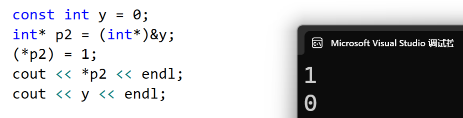

或者讲y设置成volatile，将变量放到寄存器，直接在寄存器里取

```c
int main()
{
	volatile const int y = 0;
	int* p2 = (int*)&y;
	(*p2) = 1;
	cout << *p2 << endl;
	cout << y << endl;
	return 0;
}
```

C++兼容C语言，支持隐式类型转换和强制类型转换，C++也不是类型安全的语言。

标准C++为了加强类型转换的可视性，引入了四种命名的强制类型转换操作符：

`static_cast`、`reinterpret_cast`、`const_cast`、`dynamic_cast`

## static_cast (静态转换)
`static_cast`用于非多态类型的转换（静态转换），编译器隐式执行的任何类型转换都可用 `static_cast`，但它不能用于两个不相关的类型进行转换

```c
int main()
{
	// 对应隐式类型转换 -- 数据的解释意义没有改变
	double pi = 3.14;
	int a = static_cast<int>(pi);
	cout << a << endl;
	int&& ref = static_cast<int&&>(a);

	return 0;
}
```

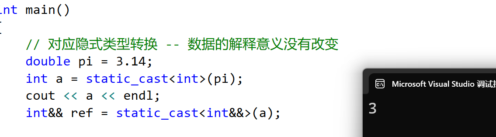

## reinterpret_cast（两个类型意义不相近的转换）
reinterpret_cast用于两个类型意义不相近的转换，reinterpret是重新解释的意思，通常为运算对象的位模式提供较低层次上的重新解释，也就是说转换后对原有内存的访问解释已经完全改变了，非常的大胆。所以我们要谨慎使用，清楚知道这样转换是没有内存访问安全问题的。

```cpp
int main()
{
    double d = 3.14;
    int a = static_cast<int>(d);
    cout << a << endl;
    // 这里使用static_cast会报错，应该使用reinterpret_cast
    // int *p = static_cast<int*>(a);
    int* p = reinterpret_cast<int*>(a);

    return 0;
}
```

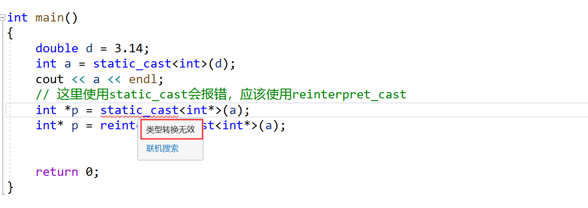

## const_cast（删除变量的const属性）
+ `const_cast`最常用的用途就是**删除变量的const属性**，方便赋值
+ 这里编译器可能是对其作了优化，直接将const修饰的值放到了寄存器里，在读取的时候没有向内存中读，而修改的时候是修改的内存中的数据，所以是不一样的

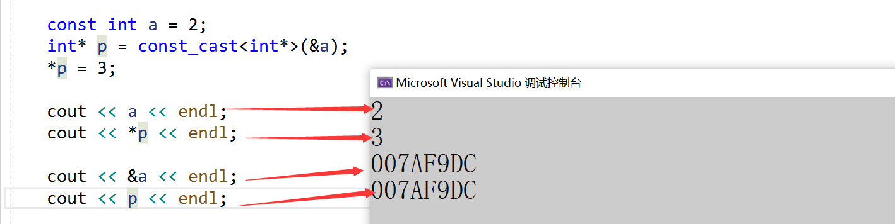

+ 然而加上了`volatile`后，值一样了，但是a的地址又不一样了，这里可能是流插入的运算符捣的鬼，在匹配的时候匹配错了

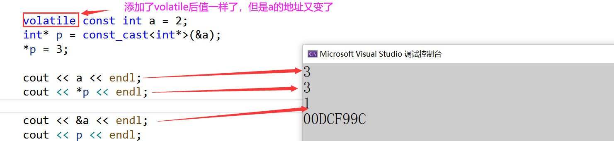

+ 那么我分别使用C语言的`printf`和`cout`打印也是正常的：

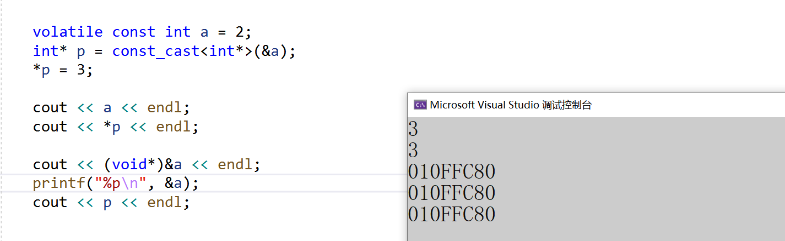

+ 在Linux平台下也是如此：

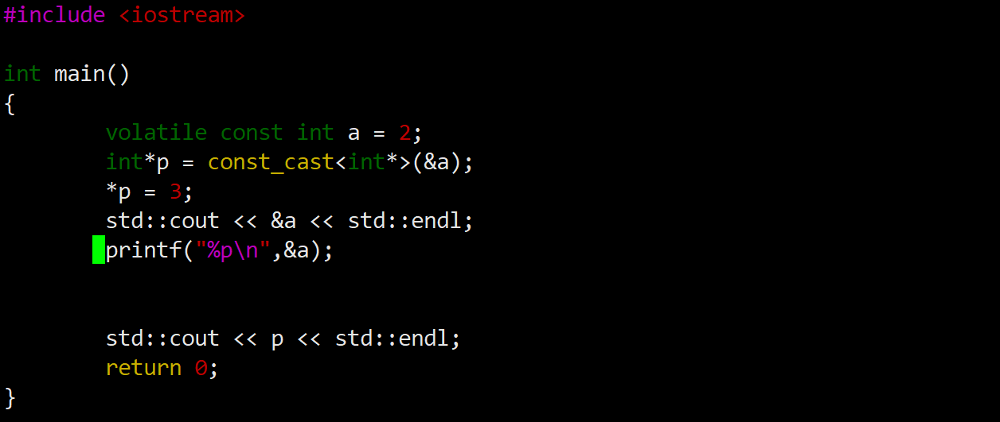

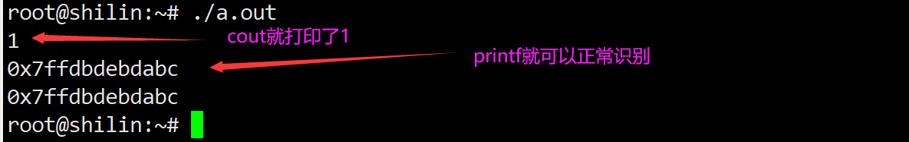

## dynamic_cast（父类对象的指针/引用转换为子类对象的指针或引用）
+ dynamic_cast用于将一个父类对象的指针/引用转换为子类对象的指针或引用(动态转换) 
+ 向上转型：子类对象指针/引用->父类指针/引用(不需要转换，赋值兼容规则) 
+ 向下转型：父类对象指针/引用->子类指针/引用(用dynamic_cast转型是安全的)

注意： 

1. **dynamic_cast只能用于父类含有虚函数的类，因为dynamic_cast是运行时通过虚表中存储的type_info判断基类指针指向的是基类对象还是派生类对象**
2. **dynamic_cast用于将基类的指针或者引用安全的转换成派生类的指针或者引用。如果基类的指针或者引用时指向派生类对象的，则转换回派生类指针或者引用时可以成功的，如果基类的指针指向基类对象，则转换失败返回nullptr，如果基类引用指向基类对象，则转换失败，抛出bad_cast异常。**

```cpp
class A
{
public:
    virtual void f() {}
    int _a = 0;
};

class B : public A
{

public:
    int _b = 1;
};

//void fun(A* pa)
//{
//	// 向下转换：直接转换是不安全的
//	// 如果pa是指向父类A对象，存在越界问题
//	B* ptr = (B*)pa;
//	ptr->_a++;
//	ptr->_b++;
//}

// 解决方法：使用dynamic_cast
void fun(A* pa)
{
    B* ptr = dynamic_cast<B*>(pa);
    if (ptr)
    {
        ptr->_a++;
        ptr->_b++;
    }
    else
    {
        cout << "转换失败" << endl;
    }
}

int main()
{
    // 向下转换规则：父类对象不能转换成子类对象，但是父类指针和引用可以转换子类指针和引用
    B b1;
    A a;
    B b;
    fun(&a);
    fun(&b);

    return 0;
}
```

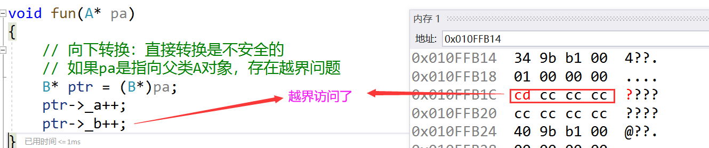

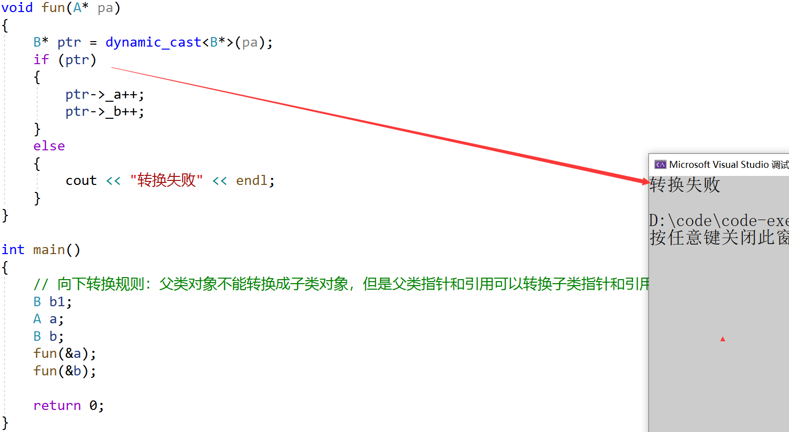

## RTTI
RTTI：Run-time Type identification的简称，即：运行时类型识别。

C++通过以下方式来支持RTTI：

1. typeid运算符（返回表达式的类型）
2. dynamic_cast运算符
3. decltype

typeid(e)中e可以是任意表达式或类型的名字，typeid(e)的返回值是typeinfo或typeinfo派生类对象的引用，typeinfo可以只支持比较等于和不等于，name成员函数可以返回C风格字符串表示对象类型名字，typeinfo的精确定义随着编译器的不同而略有差异，也就以为着同一个e表达式，不同编译器下，typeid(e).name()返回的名字可能是不一样的。

typeinfo的文档如下：[https://legacy.cplusplus.com/reference/typeinfo/?kw=typeinfo](https://legacy.cplusplus.com/reference/typeinfo/?kw=typeinfo)

typeid(e)时，当运算对象不属于类类型或者是一个不包含任何虚函数的类时，typeid返回的是运算对象的静态类型，当运算对象是定义了至少一个虚函数的类的左值时，typeid的返回结果直到运行时才会求得。

```cpp
#include<iostream>
#include<string>
#include<vector>
#include<list>
#include<typeinfo>
using namespace std;

int main()
{
    int a[10];
    int* ptr = nullptr;
    cout << typeid(10).name() << endl;
    cout << typeid(a).name() << endl;
    cout << typeid(ptr).name() << endl;
    cout << typeid(string).name() << endl;
    cout << typeid(string::iterator).name() << endl;
    cout << typeid(vector<int>).name() << endl;
    cout << typeid(vector<int>::iterator).name() << endl;
    return 0;
}
```

vs2019输出：

> int
>
> int [10]
>
> int *
>
> class std::basic_string<char,struct std::char_traits<char>,class std::allocator<char> >
>
> class std::_String_iterator<class std::_String_val<struct std::_Simple_types<char> > >
>
> class std::vector<int,class std::allocator<int> >
>
> class std::_Vector_iterator<class std::_Vector_val<struct std::_Simple_types<int> > >
>

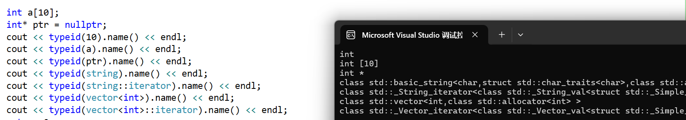

g++下输出：

> i
>
> A10_i
>
> Pi
>
> Ss
>
> N9__gnu_cxx17__normal_iteratorIPcSsEE
>
> St6vectorIiSaIiEE
>
> N9__gnu_cxx17__normal_iteratorIPiSt6vectorIiSaIiEEEE
>

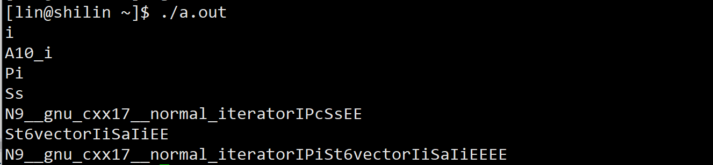

---

```cpp
#include<iostream>
using namespace std;
class A
{
public:
	virtual void func()
	{}
protected:
	int _a1 = 1;
};

class B : public A
{
protected:
	int _b1 = 2;
};

int main()
{
	try
	{
		B* pb = new B;
		A* pa = (A*)pb;
		if (typeid(*pb) == typeid(B))
		{
			cout << "typeid(*pb) == typeid(B)" << endl;
		}
		// 如果A和B不是继承关系，则会抛bad_typeid异常
		if (typeid(*pa) == typeid(B))
		{
			cout << "typeid(*pa) == typeid(B)" << endl;
		}
		// 这里pa和pb是A*和B*，不是类类型对象，他会被当做编译是求值的静态类型运算
		// 所以这里始终是不相等的
		if (typeid(pa) == typeid(pb))
		{
			cout << "typeid(pa) == typeid(pb)" << endl;
		}
	}
	catch (const std::exception& e)
	{
		cout << e.what() << endl;
	}
	return 0;
}
```

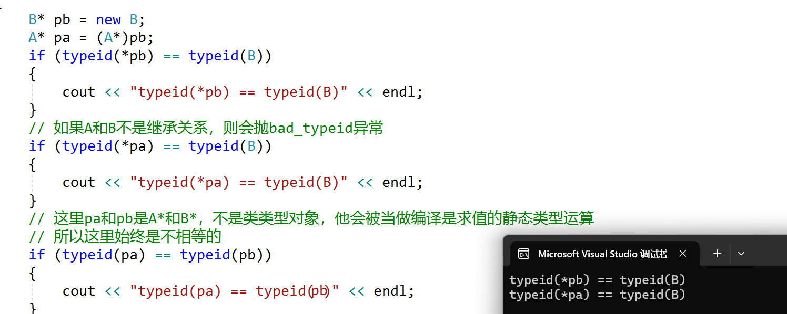

如果不是继承关系，**会抛bad_typeid异常。**

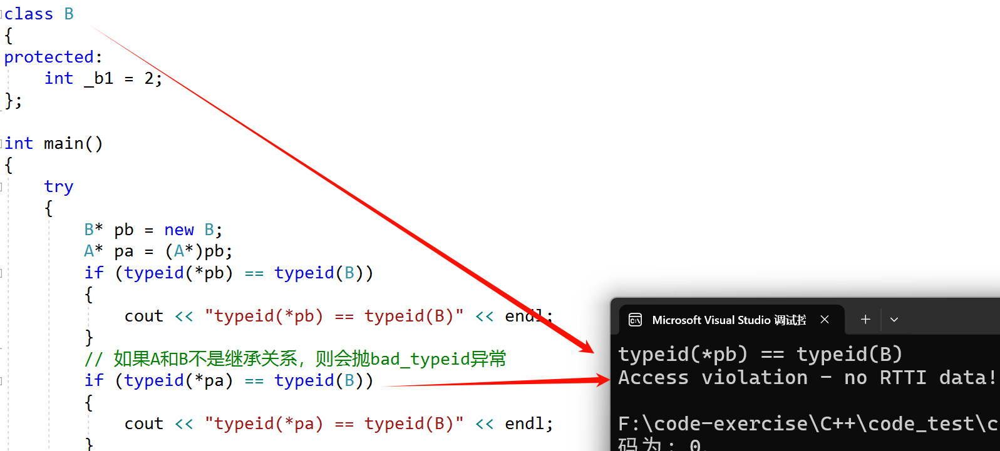

