## 一、面向过程和面向对象的初步认识
> C语言是面向过程的，关注的是过程，分析出求解问题的步骤，通过函数调用逐步解决问题。
>

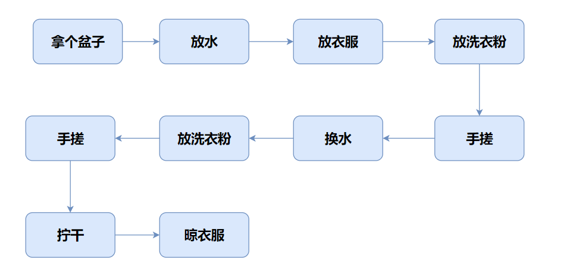

+ C++是基于面向对象的，关注的是对象，将一件事情拆分成**不同的对象**，靠**对象**之间的交互完成。

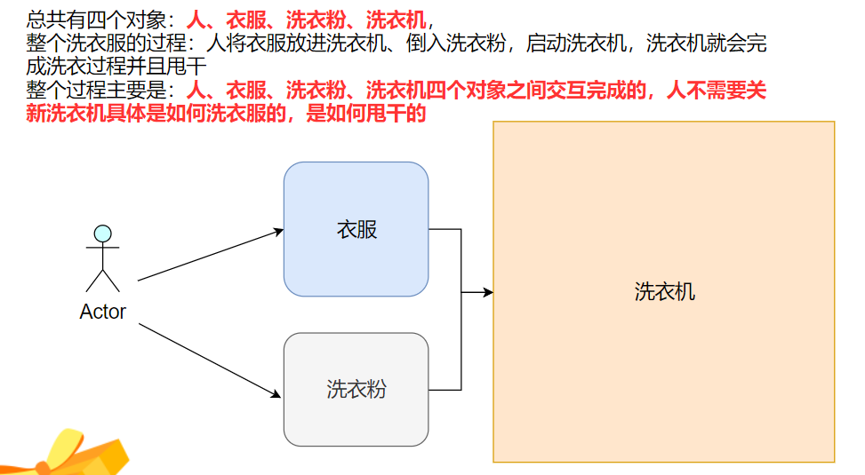

## 二、类的引入
+ C语言**结构体中只能定义变量**，在C++中，**结构体内不仅可以定义变量，也可以定义函数**。比如：之前在数据结构初阶中，用C语言方式实现的**栈**，**结构体中只能定义变量**；**现在以C++方式实现，会发现struct中也可以定义函数。**
+ 这里就不介绍C语言的用法了
+ C++兼容C，**之前写的结构体，升级成了类**，我们来看下面的代码：

```cpp
typedef int DataType;

struct Stack
{
    // 成员函数
    void Init(size_t capacity = 4)
    {
        _array = (DataType*)malloc(sizeof(DataType) * capacity);
        if (nullptr == _array)
        {
            perror("malloc申请空间失败");
            return;
        }
        _capacity = capacity;
        _size = 0;
    }
    void Push(const DataType& data)
    {
        // 扩容
        _array[_size] = data;
        ++_size;
    }
    DataType Top()
    {
        return _array[_size - 1];
    }
    void Destroy()
    {
        if (_array)
        {
            free(_array);
            _array = nullptr;
            _capacity = 0;
            _size = 0;
        }
    }
    // 成员变量
    DataType* _array;
    size_t _capacity;
    size_t _size;
};

int main()
{
    Stack s;
    s.Init(10);
    s.Push(1);
    s.Push(2);
    s.Push(3);
    cout << s.Top() << endl;
    s.Destroy();
    return 0;
}
```

+ 上面结构体的定义，在`C++`中更喜欢用**class**关键字来代替。

> 下面就有类的定义以及使用了
>

### 类的定义
```cpp
class className
{
    // 类体：由成员函数和成员变量组成
}; // 一定要注意后面的分号
```

+ **class**为定义类的关键字，`ClassName`为类的名字，`{}`中为类的主体，注意类定义结束时后面分号不能省略。
+ 类体中内容称为类的成员：**类中的变量称为类的属性或成员变量; 类中的函数称为类的方法或者成员函数。**

> 如何写呢？
>

+ 我们可以这样定义，定义一个**日期类**，但是我们这里推荐名字加上一个`_`，便于区分

```cpp
class Date
{
    int year;
    int month;
    int day;
};
```

+ 如果这样写，就分不清楚了

```cpp
class Date
{
    void Init(int year,int month,int day)
    {
        year = year;
        month = month;
        day = day;
    }
    int year;
    int month;
    int day;
};
```

+ 所以就要这样写才可以

```cpp
class Date
{
    void Init(int year,int month,int day)
    {
        _year = year;
        _month = month;
        _day = day;
    }
    int _year;
    int _month;
    int _day;
};
```

+ 这个时候我们是不是可以使用这个类里的函数了

```cpp
int main()
{
    Date d1;
    d1.Init(2024, 1, 26);
    return 0;
}
```

+ 我们使用发现是报错了，这提示的是啥啊~

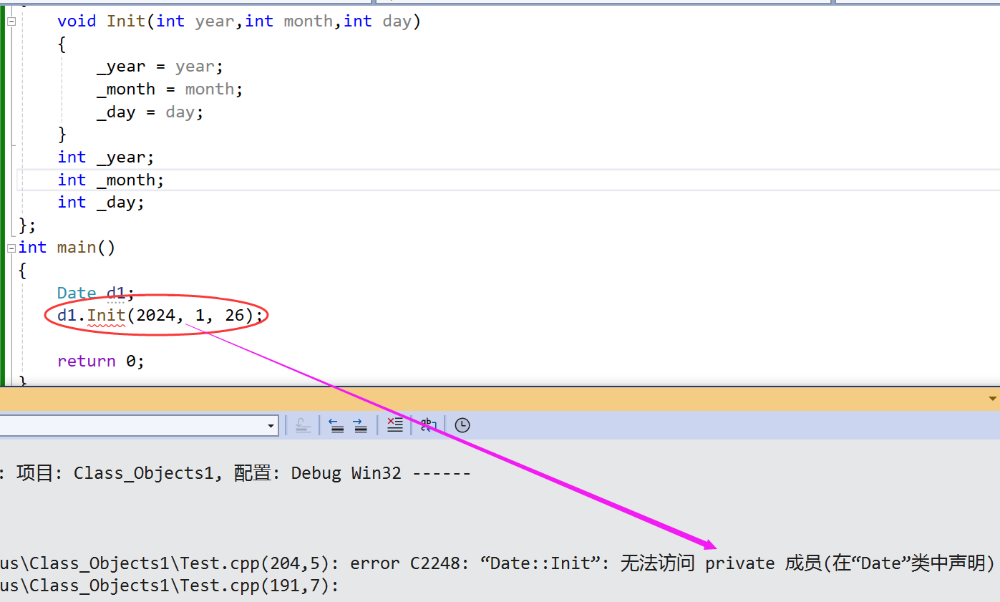

> C++提出了三种访问限定符，接下来我们再来看一下：
>

## 三、类的访问限定符及封装
### 访问限定符
+ C++实现封装的方式：**用类将对象的属性与方法结合在一块，让对象更加完善，通过访问权限选择性的将其接口提供给外部的用户使用。**


【访问限定符说明】

1. **public修饰的成员在类外可以直接被访问**
2. **protected和private修饰的成员在类外不能直接被访问(此处protected和private是类似的)**
3. **访问权限作用域从该访问限定符出现的位置开始直到下一个访问限定符出现时为止**
4. **如果后面没有访问限定符，作用域就到 **`**}**`**即类结束。**
5. **class的默认访问权限为private，struct为public(因为struct要兼容C)**

注意：访问限定符只在编译时有用，当数据映射到内存后，没有任何访问限定符上的区别

> 上面的代码就可以这样写了：
>

```cpp
class Date
{
    // public公有,会一直修饰到结束或者遇到下一个限定符
public:
    void Init(int year,int month,int day)
    {
        _year = year;
        _month = month;
        _day = day;
    }
    int _year;
    int _month;
    int _day;
};
int main()
{
    Date d1;
    class Date d2; // 这样也是可以的
    d1.Init(2024, 1, 26);
    d2._day++;
    return 0;
}
```

+ 或者来看这个：
    - 就算是改成`struct`也是一样的

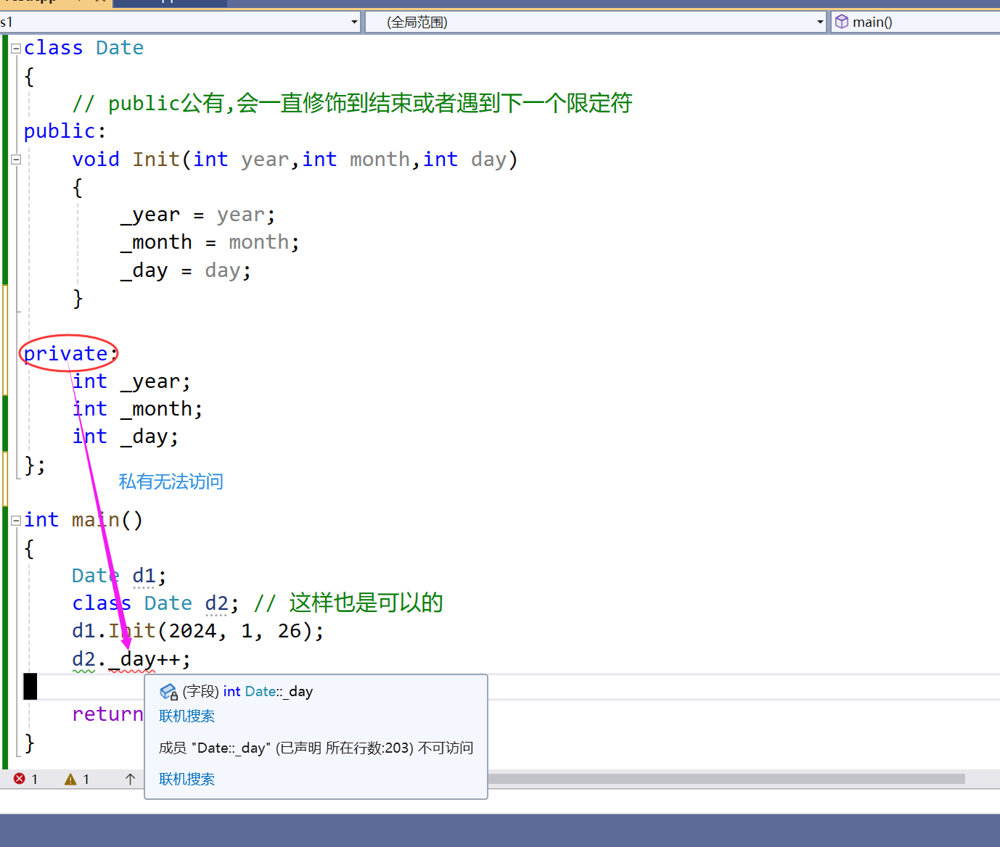

+ 那我再添加一个函数，放到最上面上面，他可以访问吗？
    - 很显然是可以的，因为没有访问限定符限制，是定义的struct默认是公开的，如果是class就是私有的

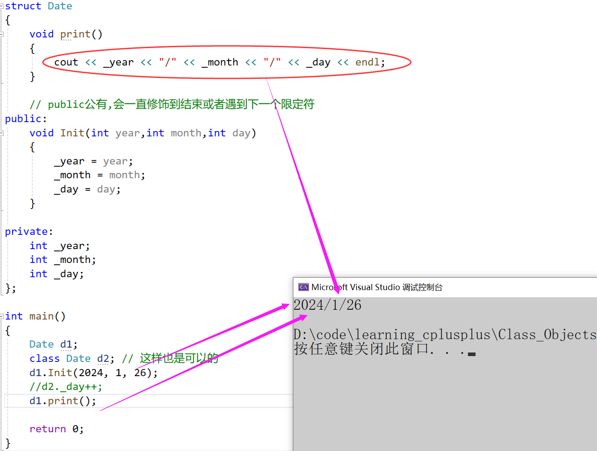

+ class就无法访问

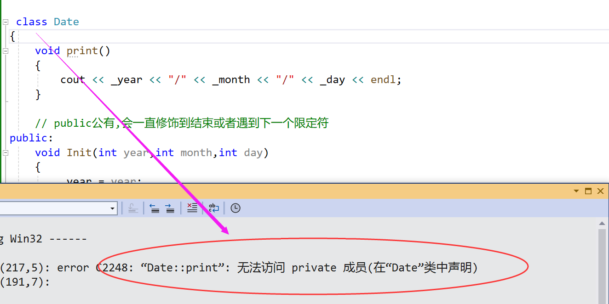

+ 假设一个类比较大，需要进行声明和定义分离

这里可以看到报错了，原因是编译器搜索的时候是在默认在**全局里搜索**，默认不会在类里面搜索，搜索不到就报错了

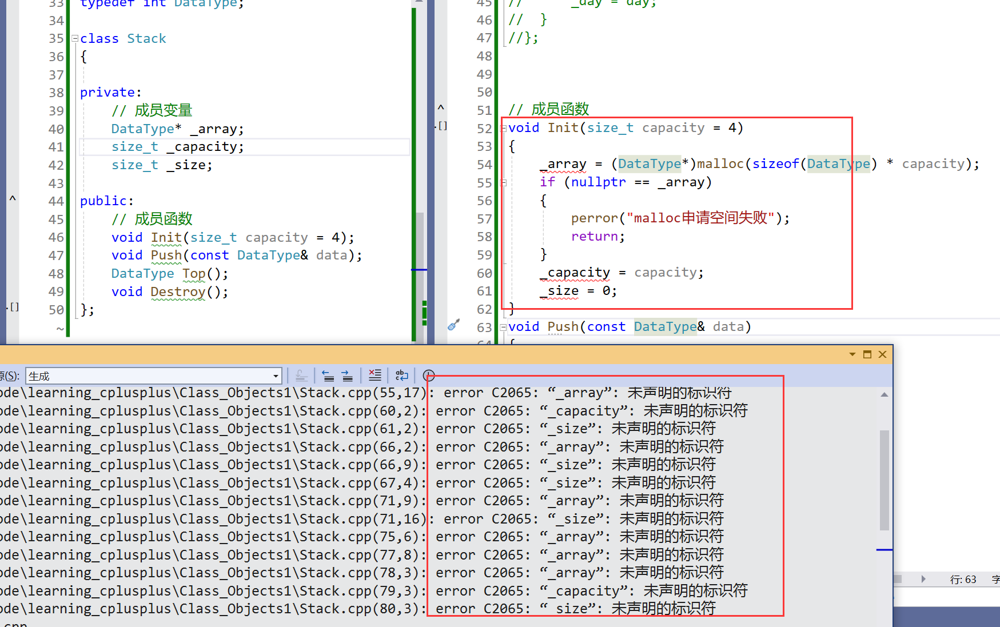

+ 这个时候加上一个`::`，这里就好像命名空间域一样，指定搜索
+ 这个时候加上了又报了一个错误，我们之前讲过的，**缺省参数不能在声明和定义里同时给**

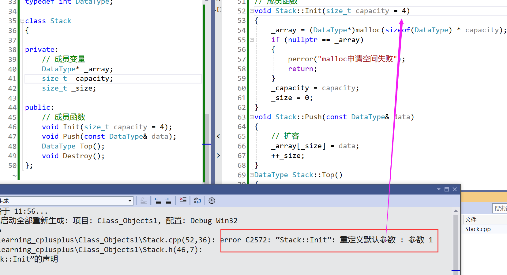

+ **只能在声明里给缺省参数**，再次改进后：

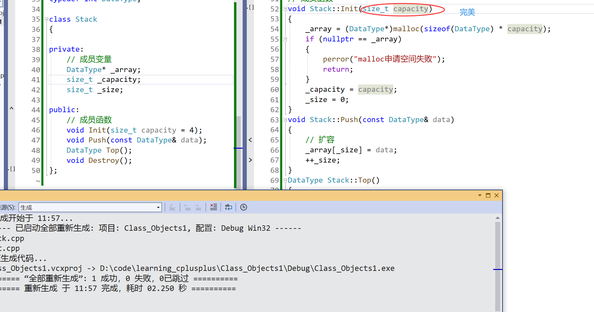

+ 优先会在指定域里面找，找不到然后再从局部里找，然后再从全局里找

### 【面试题】C++中struct和class的区别
问题：**C++中struct和class的区别是什么？**

+ 解答： **C++需要兼容C语言，所以C++中struct可以当成结构体使用。另外C++中struct还可以用来定义类。和class定义类是一样的，区别是**`struct定义的类默认访问权限是public`**，**`class定义的类默认访问权限是private`**。注意：在继承和模板参数列表位置，struct和class也有区别。**

### 类的两种定义方式
1. 声明和定义全部放在类体中，需注意：**成员函数如果在类中定义，编译器可能会将其当成内联函数处理。**

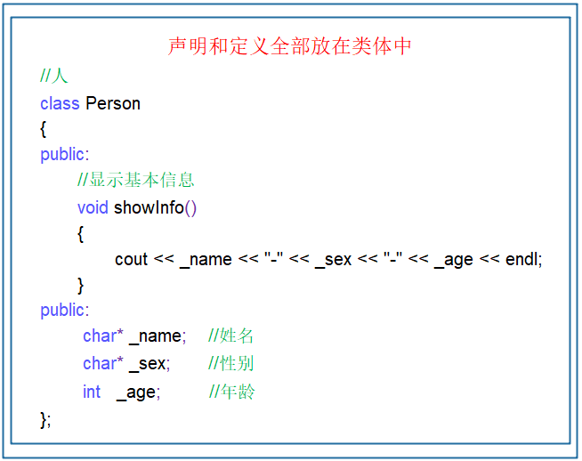

2. 类声明放在 **.h**文件中，成员函数定义放在 **.cpp**文件中，注意： **成员函数名前需要加类名**`::`

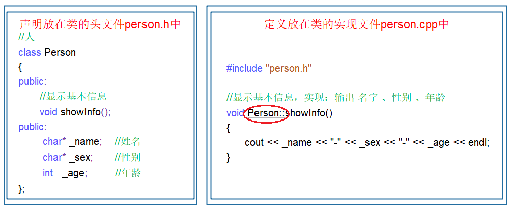

+ **一般情况下，更期望采用第二种方式**

## 四、封装
### 【面试题】面向对象的三大特性
+ 面向对象的三大特性：**封装、继承、多态。**
1. C++**数据**和**方法**都放到类里面
2. C++访问限定符去对成员进行限制，想给你访问是公有，不想给你访问是私有

> 在类和对象阶段，主要是研究类的封装特性，那什么是封装呢？
>

**封装：将数据和操作数据的方法进行有机结合，隐藏对象的属性和实现细节，仅对外公开接口来和对象进行交互。**

+ **封装本质上是一种管理，让用户更方便使用类**。比如：对于电脑这样一个复杂的设备，提供给用户的就只有开关机键、通过键盘输入，显示器，USB插孔等，让用户和计算机进行交互，完成日常事务。但实际上电脑真正工作的却是CPU、显卡、内存等一些硬件元件。
+ 对于计算机使用者而言，不用关心内部核心部件，比如主板上线路是如何布局的，CPU内部是如何设计的等，用户只需要知道，怎么开机、怎么通过键盘和鼠标与计算机进行交互即可。因此计算机厂商在出厂时，在外部套上壳子，将内部实现细节隐藏起来，仅仅对外提供开关机、鼠标以及键盘插孔等，让用户可以与计算机进行交互即可。

**在C++语言中实现封装，可以通过类将数据以及操作数据的方法进行隐藏对象内部实现细节，控制哪些方法可以在类外部直接被使用**

## 五、类的作用域
+ 类定义了一个新的作用域，类的所有成员都在类的作用域中。在类体外定义成员时，需要使用`::`作用域操作符指明成员属于哪个类域。

```cpp
class Person
{
public:
    void PrintPersonInfo();
private:
    // 这个是声明
    char _name[20];
    char _gender[3];
    int _age;
};
// 这里需要指定PrintPersonInfo是属于Person这个类域
void Person::PrintPersonInfo()
{
    cout << _name << " " << _gender << " " << _age << endl;
}
```

## 六、类的实例化
**用类类型创建对象的过程，称为类的实例化**

1. 类是对对象进行描述的，是一个模型一样的东西，限定了类有哪些成员，定义出一个类并没有分配实际的内存空间来存储它；比如：入学时填写的学生信息表，表格就可以看成是一个类，来描述具体学生信息。
2. 一个类可以实例化出多个对象，实例化出的对象 占用实际的物理空间，存储类成员变量

```cpp
int main()
{
    Person._age = 100; // 编译失败：error C2059: 语法错误:“.”	
    return 0;
}
```

+ **类里面定义的成员是声明，是没有空间的**

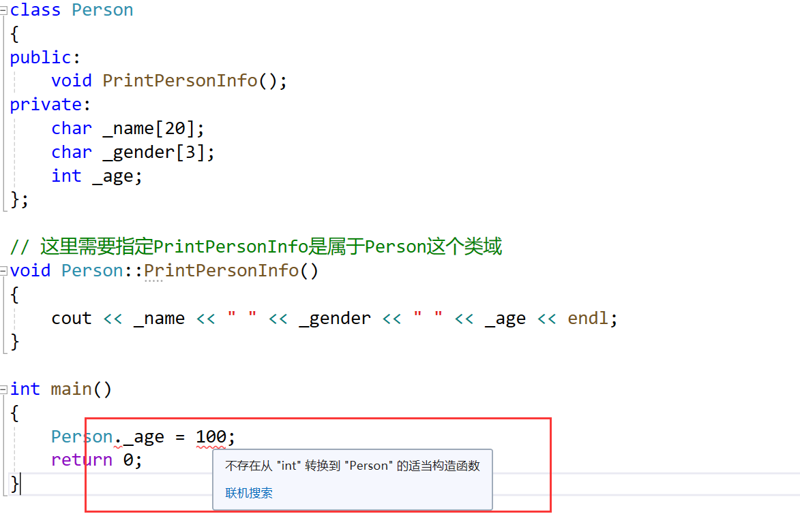

+ 写成这样，先实例化，再赋值就可以了

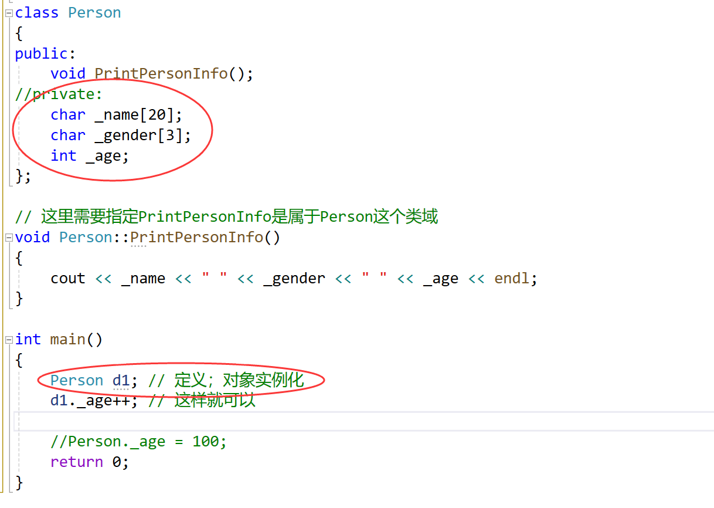

+ Person类是没有空间的，只有Person类实例化出的对象才有具体的年龄。
3. 做个比方。类实例化出对象就像现实中使用建筑设计图建造出房子，类就像是设计图，只设计出需要什么东西，但是并没有实体的建筑存在，同样类也只是一个设计，实例化出的对象才能实际存储数据，占用物理空间

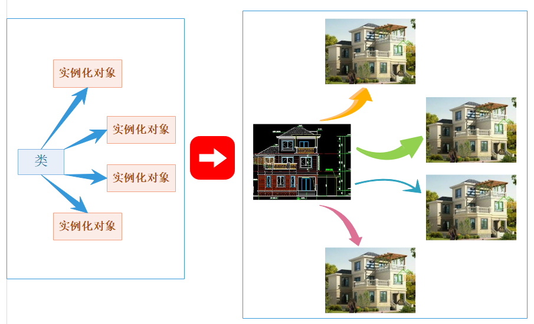

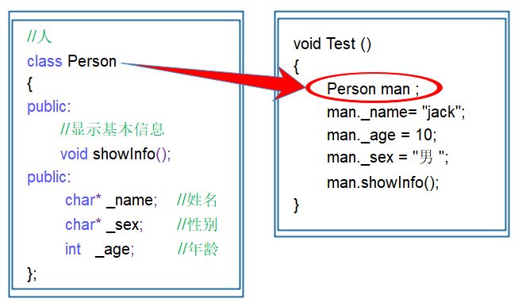

## 七、类对象模型
> 问题：类中既可以有成员变量，又可以有成员函数，那么一个类的对象中包含了什么？如何计算一个类的大小？
>

### 类对象的存储方式猜测
+ 对象中包含类的各个成员

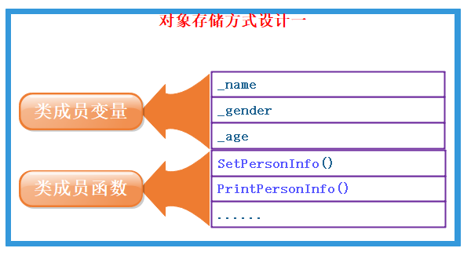

**缺陷**：每个对象中成员变量是不同的，但是调用同一份函数，如果按照此种方式存储，当一个类创建多个对象时，每个对象中都会保存一份代码，相同代码保存多次，浪费空间。那么如何解决呢？

+ 代码只保存一份，在对象中保存存放代码的地址

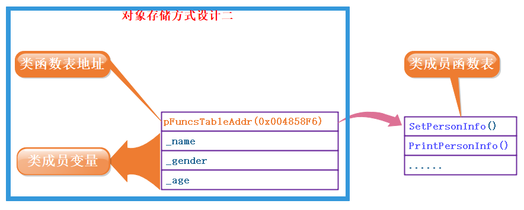

+ 只保存成员变量，成员函数存放在公共的代码段

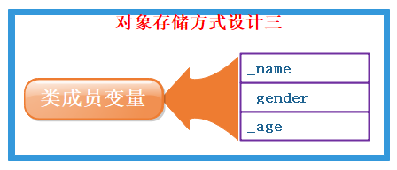  
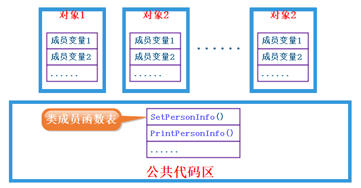

+ 问题：对于上述三种存储方式，那计算机到底是按照那种方式来存储的？

我们再通过对下面的不同对象分别获取大小来分析看下：

```cpp
class Date
{
    void Init(int year, int month, int day)
    {
        _year = year;
        _month = month;
        _day = day;
    }
    int _year;
    int _month;
    int _day;
};

int main()
{
    Date d1;
    cout << sizeof(d1) << endl;
}
```

+ 可以清楚的看到，这就是三个成员的大小，而函数是没有算进去的

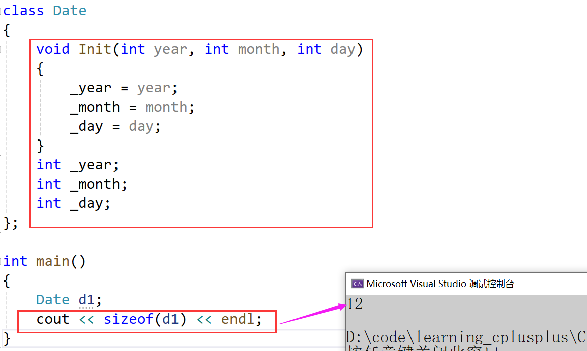

+ 结论：**一个类的大小，实际就是该类中”成员变量”之和，当然要注意内存对齐注意空类的大小【与C语言一样】，空类比较特殊，编译器给了空类一个字节来唯一标识这个类的对象。**

> 我们再次回忆一下
>

### 结构体内存对齐规则
1. 第一个成员在与结构体**偏移量为0**的地址处。
2. 其他成员变量要对齐到某个数字（对齐数）的整数倍的地址处。
+ 注意：对齐数 = 编译器默认的一个对齐数与该成员大小的较小值。VS中**默认的对齐数为8**
3. 结构体总大小为：**最大对齐数**（所有变量类型最大者与默认对齐参数取最小）的整数倍。
4. 如果嵌套了结构体的情况，嵌套的结构体对齐到自己的最大对齐数的整数倍处，结构体的整体大小就是所有最大对齐数（含嵌套结构体的对齐数）的整数倍。

### 【面试题】
1. 结构体怎么对齐？ 为什么要进行内存对齐？
2. 如何让结构体按照指定的对齐参数进行对齐？能否按照3、4、5即任意字节对齐？
3. 什么是大小端？如何测试某台机器是大端还是小端，有没有遇到过要考虑大小端的场景

## 八、this指针的引出
+ 我们先来定义一个日期类`Date`，下面这段代码执行的结果是什么呢？

```cpp
class Date
{
public:
    void Init(int year, int month, int day)
    {
        _year = year;
        _month = month;
        _day = day;
    }
    void print()
    {
        cout << _year << "-" << _month << "-" << _day << endl;
        
    }
private:
    int _year; 
    int _month; 
    int _day; 
};
int main()
{
    Date d1, d2;
    
    d1.Init(2022, 5, 11);
    d2.Init(2022, 5, 12);

    d1.print();
    d2.print();
    return 0;
}
```

+ 可以看到分别打印出了**两个日期**，它是怎么知道改打印哪个的？

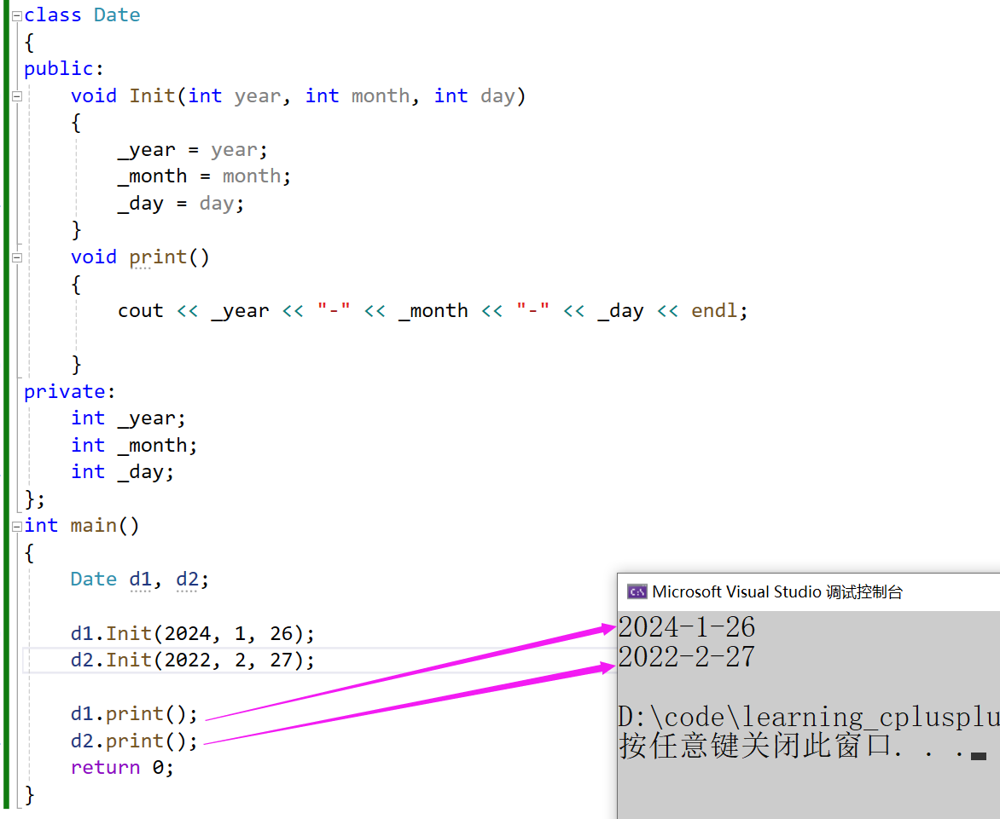

+ 我们来分析一下，先看一下**汇编代码，看一看**

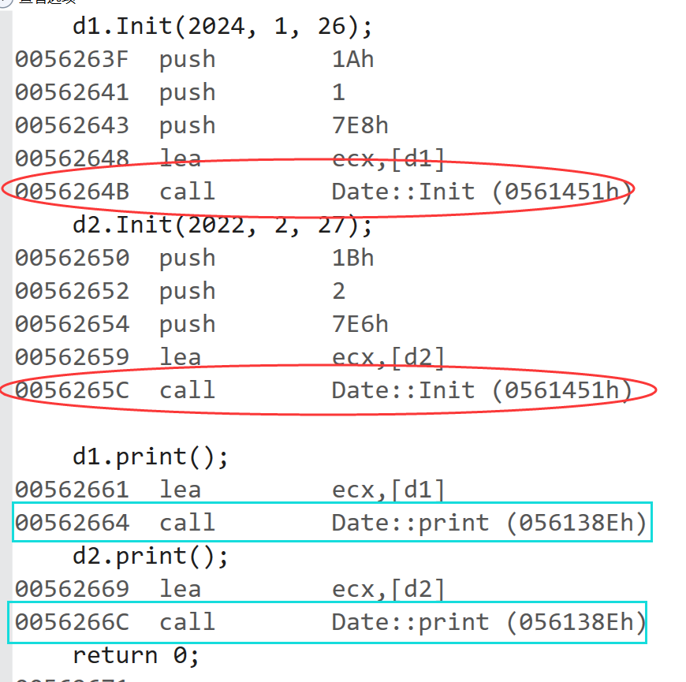

+ 我们看到上面的代码是调用的**同一个函数**，那么编译器是如何知道那两个日期的？
+ 其实C++里有一个**隐含**的**this指针**
+ 在使用函数的时候其实里面**传了一个地址，然后有一个隐的this指针来接收**

> 原形是这样：
>

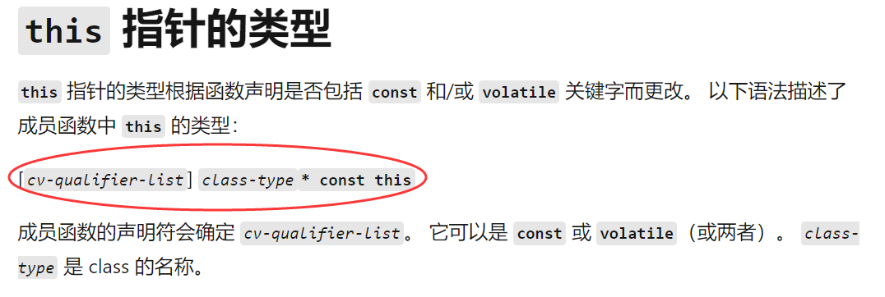

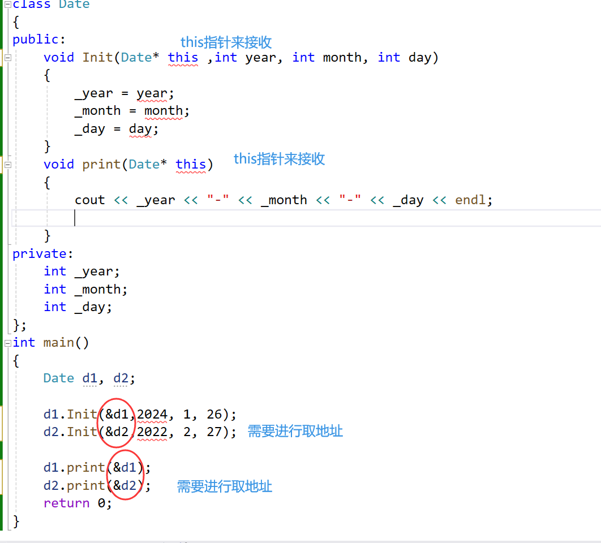

+ 那为什么这里**报错**了呢？
+ 因为不必要写，这个是**隐含**的，我们可以**直接在类里面使用**

## 二、this指针的特性
+ 这个this指针是有一个**const修饰**的，而且这个const是在`*`的右边

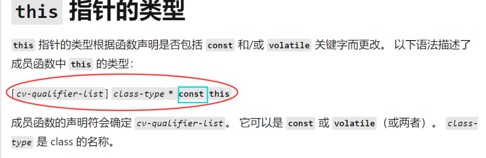

+ 这里的`const`修饰，在`const`的右边

> 我们回忆一下：
>

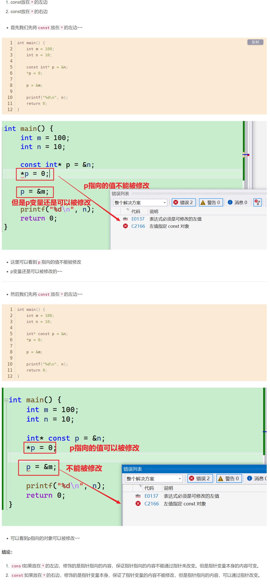

+ 到这里就得出的**this本身是不被修改的，但是做指向的值是可以被修改**
+ 我们可以在类中打印一下`this`指针的地址，再打印一下`d1`和`d2`的地址，我们来看一下：

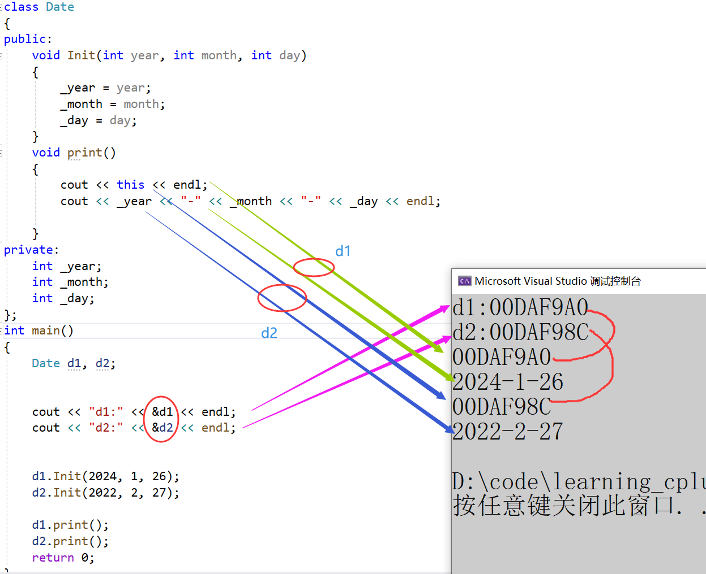

+ 得到结果就是this指针指向一个指向**当前对象**的指针
+ 我们还可以下面这样，是不会报错的，但是不能向上面直接在形参就写上

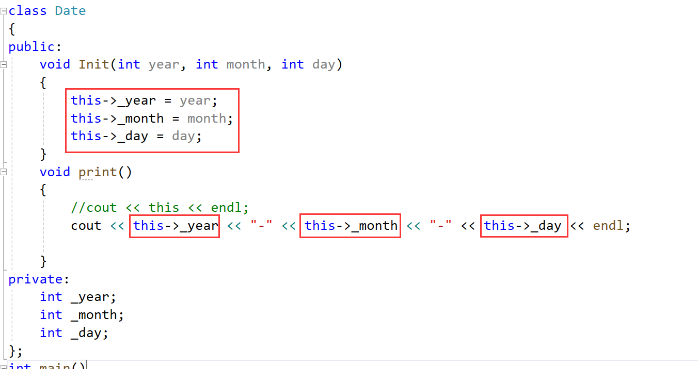

特点：

**1、形参和实参的位置，我们不能显示写  
****2、函数内部可以使用**

> **最后总结一下：**
>

1. this指针的类型：类型 *******const**，即成员函数中，**不能给this指针赋值**。
2. 只能在“**成员函数**”的内部使用
3. this指针本质上是“**成员函数**”的形参，当对象调用成员函数时，**将对象地址作为实参传递给this形参。所以对象中不存储this指针。**
4. this指针是**成员函数**第一个**隐含的指针形参**，一般情况由编译器通过`**ecx**`**寄存器**自动传递，不需要用户传递

### 【面试题】
1. this指针存在哪里？

> a、堆    b、栈    c、静态区    d、常量区    e、对象里面
>

+ 首先排除`e`，因为我们知道，在算类里的**对象**的时候是没有算**this指针**的大小，所以**排除**`e`
+ C++的**const**变量不是在常量区，可以看到这两个地址是挨着的

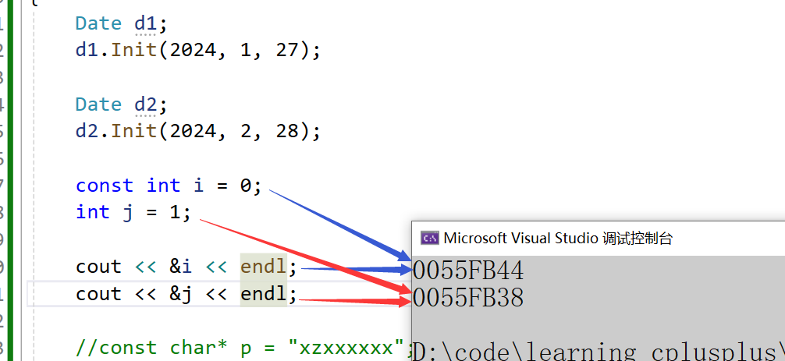

+ 那么什么在常量区呢？是`const`修饰的值在常量区，这个指针变量在**栈区**，指向了这个**常量区的字符串的首字符**，所以`d`也就排除

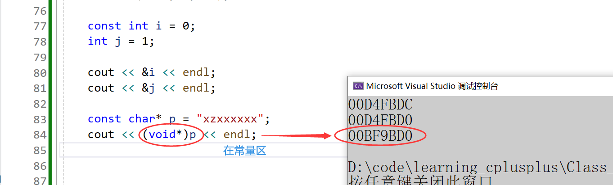

+ **c就更不可能了**，static和全局的才在静态区
+ **a也可以排除**，因为malloc的才在堆，这里不是malloc，所以排除
+ 最后就是在**栈**上，因为**是一个形参**（有些编译比如vs可能会用寄存器存储）。不同的编译器放在不同的位置，可能是栈，也可能是寄存器，(VC++编译器是放在ECX中，其它编译器有可能不同，也就是成员函数的其它参数正常都是存放在栈中。而this指针参数则是存放在寄存器中。)
+ 打开汇编我们也可以看到这里的lea就是**load effective address**【加载有效地址】，是存在`ecx`的值加载到 **[d1]** 里

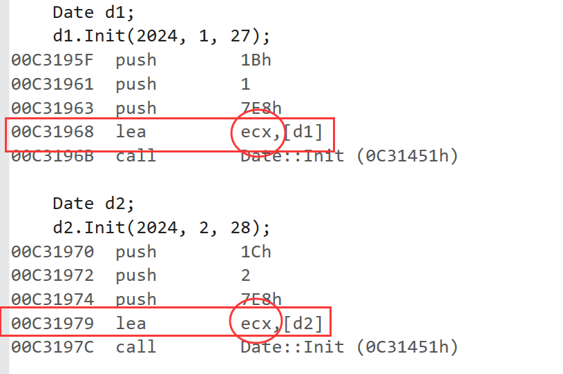

2. this指针可以为空吗？

> 第一道：下面程序编译运行结果是？ A、编译报错 B、运行崩溃 C、正常运行
>

```cpp
class A
{
public:
    void Print()
    {
        cout << "Print()" << endl;
    }
private:
    int _a;
};
int main()
{
    A* p = nullptr;
    p->Print();
    return 0;
}
```

+ 已经**完美运行**了，因为我这里没有访问类里的对象，所以可以正常运行

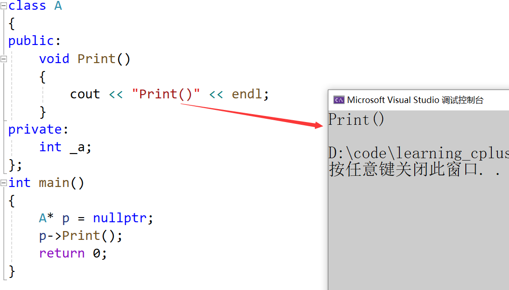

> 第二道：下面程序编译运行结果是？ A、编译报错 B、运行崩溃 C、正常运行
>

```cpp
class A
{
public:
    void PrintA()
    {
        cout << _a << endl;
    }
private:
    int _a;
};

int main()
{
    A* p = nullptr;
    p->PrintA();
    return 0;
}
```

+ 这里引发了**空指针**，因为我需要打印这里的`_a`，就要找到那块空间

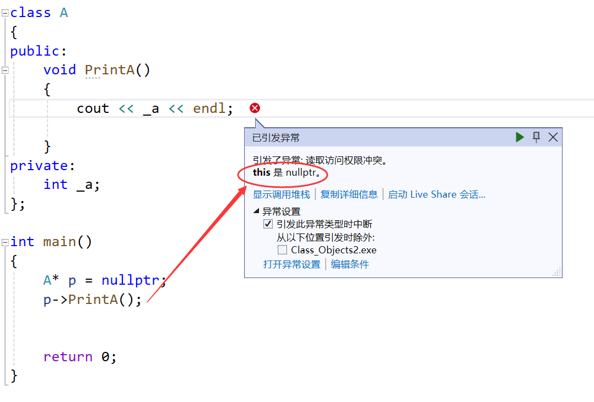

+ 也就可以写成这样，**this指针是空指针**，解引用就会报错

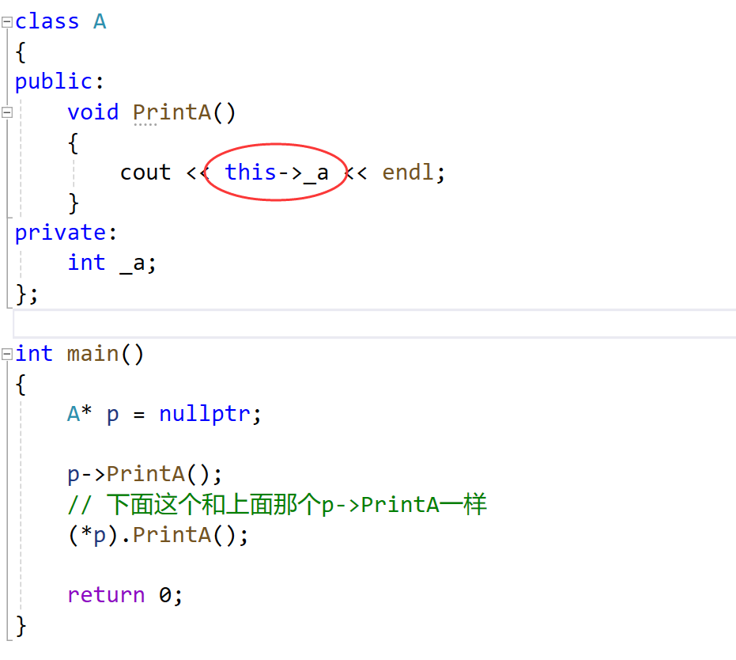

所以**this指针**是可以为空的，**只要在成员函数内部不访问其内容**，程序可以正常执行的。

