## 一、类的默认成员函数
**默认成员函数就是用户没有显式实现，编译器会自动生成的成员函数称为默认成员函数**。一个类，我们不写的情况下编译器会默认生成以下6个默认成员函数，需要注意的是这6个中最重要的是前4个，最后两个取地址重载不重要，稍微了解一下即可。

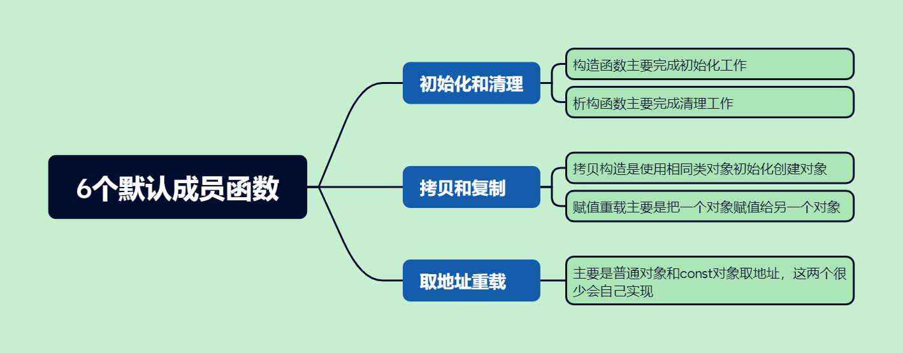

## 二、构造函数
### 2.1 构造函数的概念
+ 首先我们看下面的代码来引入一下**构造函数**

```cpp
class Date
{
public:
    void Init(int year, int month, int day)
    {
        _year = year;
        _month = month;
        _day = day;
    }
    void Print()
    {
        cout << _year << "-" << _month << "-" << _day << endl;
    }
private:
    int _year;
    int _month;
    int _day;
};
int main()
{
    Date d1;
    d1.Init(2022, 7, 5);
    d1.Print();
    Date d2;
    d2.Init(2022, 7, 6);
    d2.Print();
    return 0;
}
```

+ 对于Date类，可以通过 `Init()` 公有方法给对象设置日期，但如果每次创建对象时都调用该方法设置信息，未免有点麻烦，那能否在对象创建时，就将信息设置进去呢？

在C++中就有这么一个方法解决此问题------->**构造函数**

+ **构造函数是一个特殊的成员函数**，**名字与类名相同**，创建类类型对象时由编译器**自动调用**，以**保证每个数据成员都有一个合适的初始值**，并且在**对象整个生命周期内只调用一次**。

### 2.2 构造函数的特性
构造函数是特殊的成员函数，需要注意的是，构造函数虽然名称叫构造，但是构造函数的主要任务并不是开空间创建对象(我们常使用的局部对象是栈帧创建时，空间就开好了)，而是**对象实例化时**`**初始化**`**对象**。构造函数的本质是要替代我们以前Stack和Date类中写的Init函数的功能，构造函数自动调用的特点就完美的替代的了Init。

**特性**：

1. 函数名与类名相同。
2. 无返回值。
3. 对象实例化时编译器自动调用对应的构造函数。
4. 构造函数可以重载。

```cpp
class Date
{
public:
    // 1.无参构造函数
    Date()
    {
        _year = 1;
        _month = 1;
        _day = 1;
    }
    // 2.带参构造函数
    Date(int year, int month, int day)
    {
        _year = year;
        _month = month;
        _day = day;
    }
private:
    int _year;
    int _month;
    int _day;
};
void TestDate()
{
    Date d1; // 调用无参构造函数
    Date d2(2015, 1, 1); // 调用带参的构造函数
    Date d3();
}
```

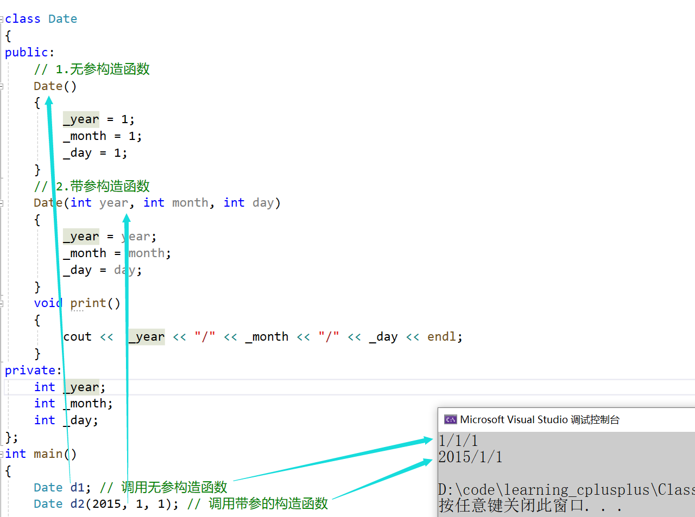

+ 上面在创建对象的时候跟上了要初始化的数据，那么我想使用默认构造函数，直接创建对象的时候什么都不写就可以直接使用，那么可以带上括号吗？

```cpp
Date d3();
```

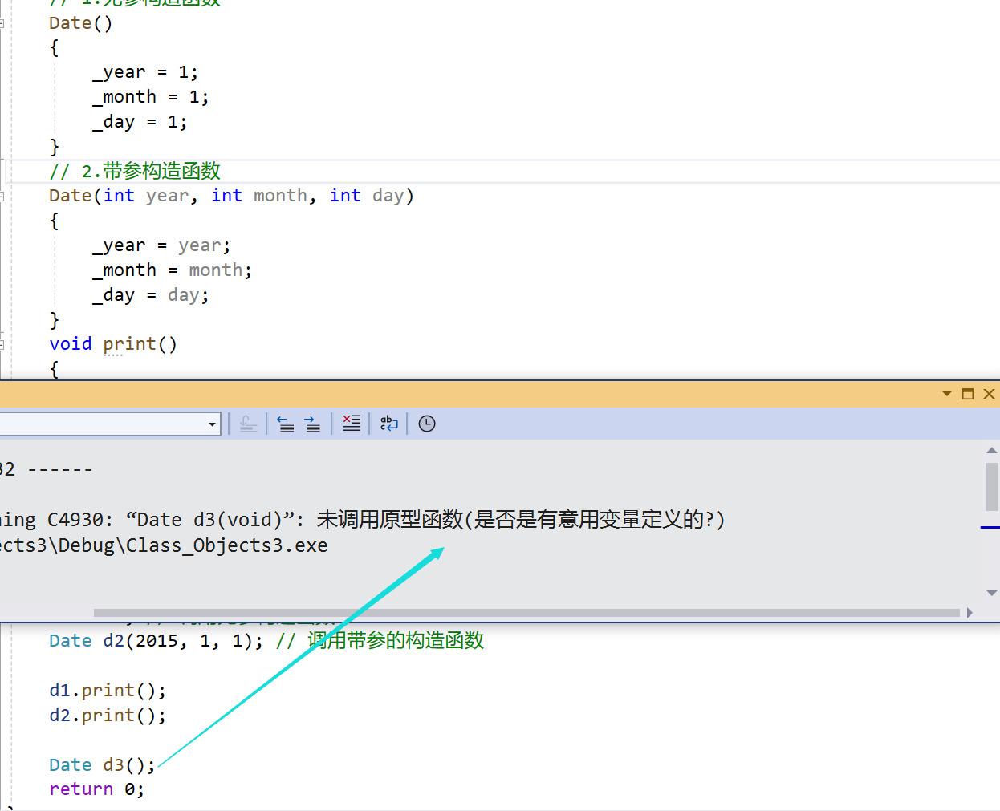

+ 可以看到结论，是不可以的
    - 主要的是无法和函数的声明区分开
+ 上面的代码的函数：声明了`d3`函数，该函数无参，返回一个日期类型的对象

注意：如果通过无参构造函数创建对象时，对象后面不用跟括号，否则就成了**函数声明**

实际上我们可以这样写：

+ 直接给一个**全缺省**，是不是很很好

```cpp
class Date
{
public:
    Date(int year = 1, int month = 1, int day = 1)
    {
        _year = year;
        _month = month;
        _day = day;
    }
    void print()
    {
        cout <<  _year << "/" << _month << "/" << _day << endl;
    }
private:
    int _year;
    int _month;
    int _day;
};
```

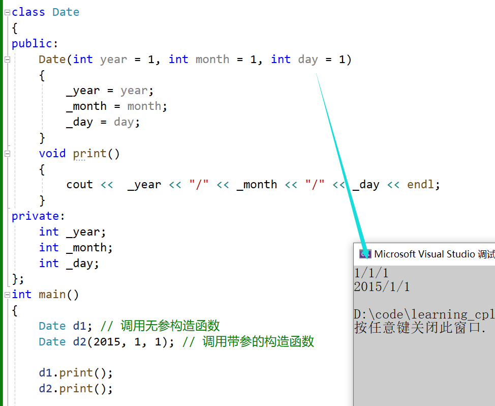

+ 那么这两个函数可以同时存在吗？

```cpp
Date()
{
    _year = 1;
    _month = 1;
    _day = 1;
}
Date(int year = 1, int month = 1, int day = 1)
{
    _year = year;
    _month = month;
    _day = day;
}
```

+ 语法上可以，但是调用的时候会存在歧义，就是到底要调用谁

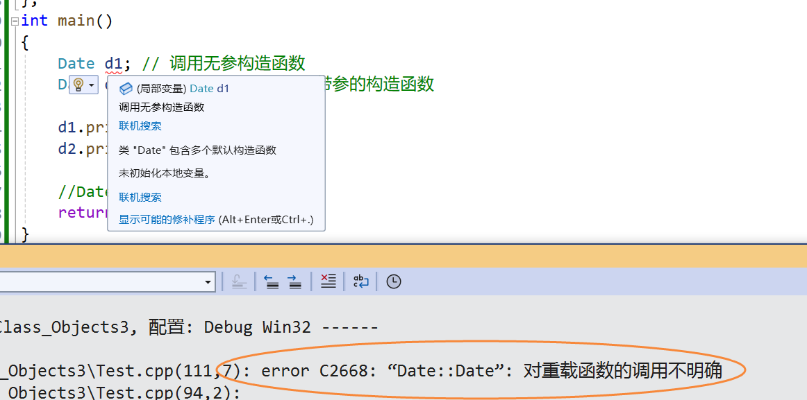

显而易见是不可以的，接下来再看：

5. 如果类中没有显式定义构造函数，则C++编译器会自动生成一个无参的默认构造函数，一旦用户显式定义编译器将不再生成。

```cpp
class Date
{
public:
    void Print()
    {
        cout << _year << "/" << _month << "/" << _day << endl;
    }
private:
    int _year;
    int _month;
    int _day;
};
int main()
{
    Date d1;
    d1.Print();
    return 0;
}
```

+ 如果我们不指定默认构造函数，它会自动生成一个，但是生成的这个默认构造函数它又什么都没做

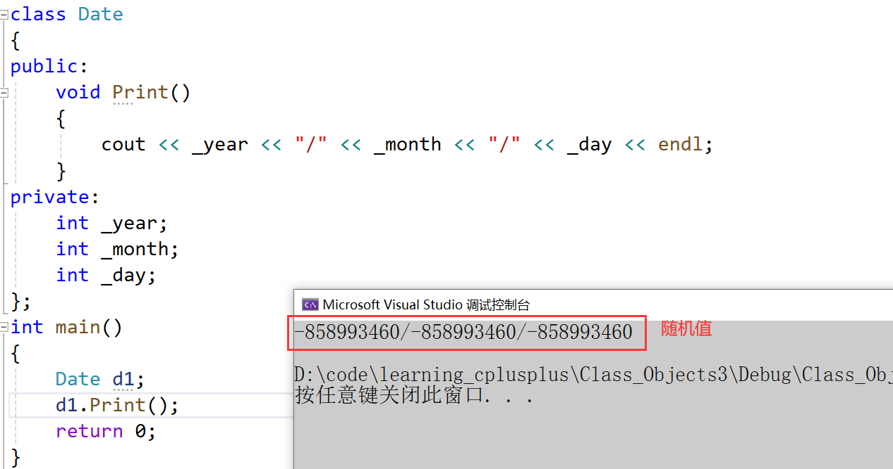

+ 到这里我们先得出一个结论：**内置类型/基本类型不做处理**

**自定义类型类型**呢？

```cpp
class A
{
public:
    A()
    {
        cout << "A()" << endl;
        _a = 0;
    }
private:
    int _a;
};
class Date
{
public:
    void Print()
    {
        cout << _year << "/" << _month << "/" << _day << endl;
    }
private:
    int _year;
    int _month;
    int _day;

    A _aa;
};
int main()
{
    Date d1;
    d1.Print();
    return 0;
}
```

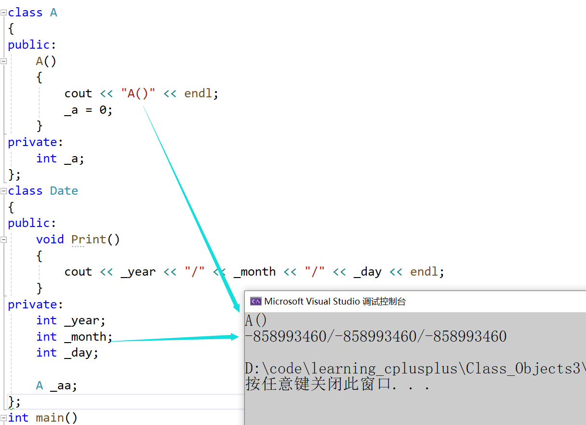

+ 再得出一个结论：**对自定义类型，自定义类型回去调用它的默认构造函数**
+ C++11委员会对这个语法进行打了补丁，在**内置类型成员变量在类中声明时可以给默认值**，有一个值不给就还是随机值

```cpp
class A
{
public:
    A()
    {
        cout << "A()" << endl;
        _a = 0;
    }
private:
    int _a;
};
class Date
{
public:
    void Print()
    {
        cout << _year << "/" << _month << "/" << _day << endl;
    }
private:
    // 声明给缺省值
    int _year = 1;
    int _month = 1;
    int _day = 1;

    A _aa;
};
int main()
{
    Date d1;
    d1.Print();
    return 0;
}
```

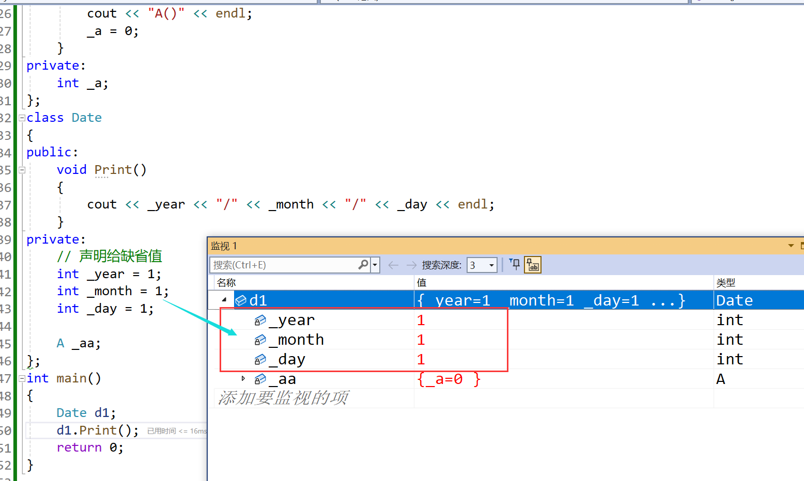

+ 如果用户**显式定义了构造函数，编译器将不再生成**

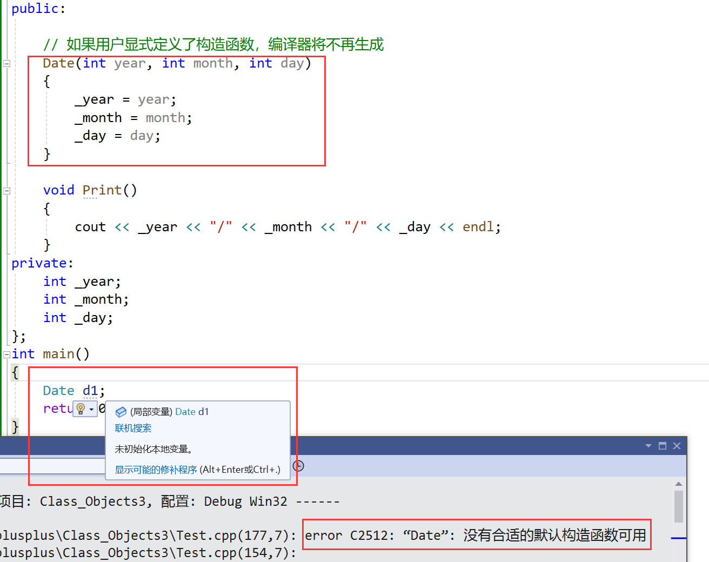

+ 将Date类中构造函数屏蔽后，代码可以通过编译，因为编译器生成了一个无参的默认构造函数
+ 将Date类中构造函数放开，代码编译失败，因为一旦显式定义任何构造函数，编译器将不再生成
+ 无参构造函数，放开后报错：`error C2512: “Date”: 没有合适的默认构造函数可用`

否则这样用用就不会报错：

```cpp
Date d1(2024,1,31);
```

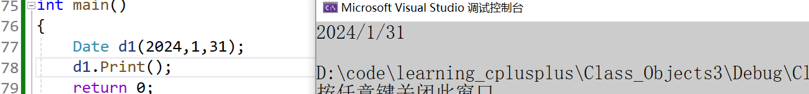

+ 或者再提供一个**默认构造**

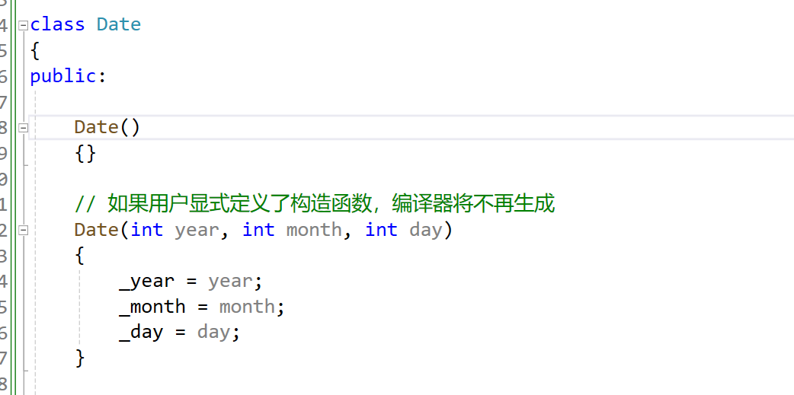

+ 在或者提供一个**全缺省**

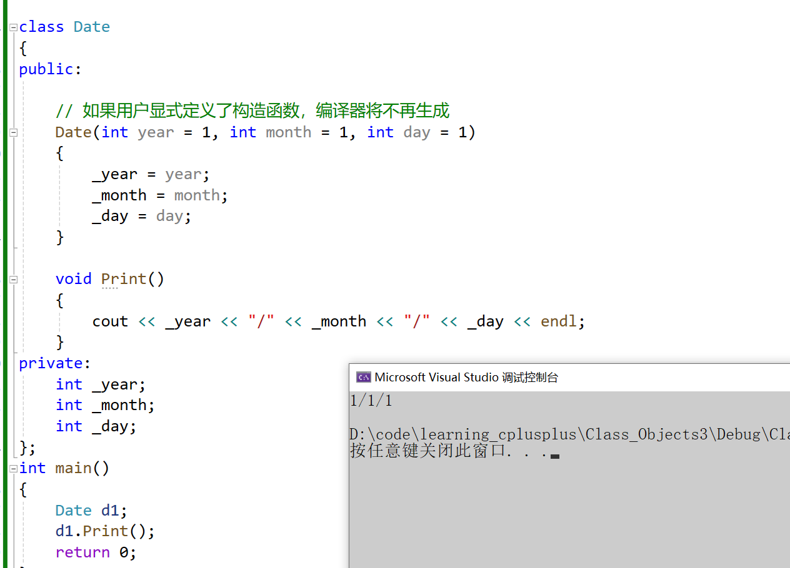

+ 无参的构造函数和全缺省的构造函数都称为默认构造函数，并且默认构造函数只能有一个。注意：**无参构造函数、全缺省构造函数、我们没写编译器默认生成的构造函数，都可以认为是默认构造函数。**

**那么默认生成的构造函数还有意义吗？**

+ 我们再来看这个代码：

```cpp
class Stack
{
public:
    Stack()
    {
        //....
        cout << "Stack()" << endl;
    }
};

// 两个栈实现队列
class MyQueue
{
private:
    Stack st1;
    Stack st2;
};

int main()
{
    MyQueue q;
    return 0;
}
```

+ 这里的`MyQueue`就不用写默认构造函数
+ 所以还是有意义的，分析一个类型成员和初始化要求，需要写构造函数就我们自己写，不需要的时候用编译器自己生成。结论：**绝大多数场景下都需要自己实现构造函数**，不要老想着编译器自己生成

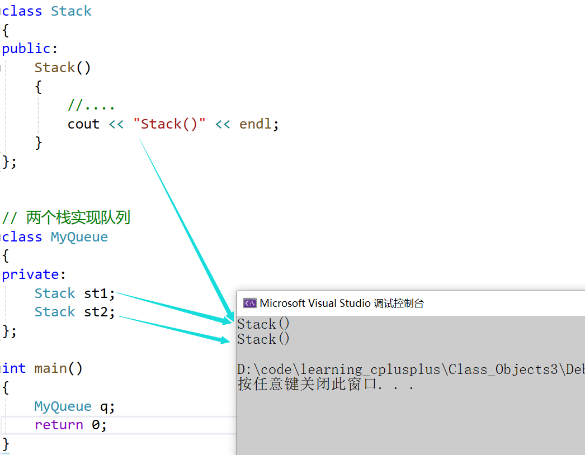

## 三、析构函数
通过前面构造函数的学习，我们知道一个对象是怎么来的，那一个对象又是怎么没呢的？

+ 析构函数：与构造函数功能相反，析构函数不是完成对对象本身的销毁，局部对象销毁工作是由编译器完成的。而对象在销毁时会自动调用析构函数，完成对象中资源的清理工作。

析构函数是特殊的成员函数，其特征如下：

1. **析构函数名是在类名前加上字符 ~。**
2. **无参数无返回值类型。**
3. **一个类只能有一个析构函数。若未显式定义，系统会自动生成默认的析构函数。注意：**`析构函数不能重载`
4. **对象生命周期结束时，C++编译系统系统自动调用析构函数。**

```cpp
typedef int DataType;
class Stack
{
public:
    Stack(size_t capacity = 3)
    {
        _array = (DataType*)malloc(sizeof(DataType) * capacity);
        if (nullptr == _array)
        {
            perror("malloc申请空间失败!!!");
            return;
        }
        _capacity = capacity;
        _size = 0;
    }
    void Push(DataType data)
    {
        // CheckCapacity();
        _array[_size] = data;
        _size++;
    }

private:
    DataType* _array;
    int _capacity;
    int _size;
};
void TestStack()
{
    Stack s;
    s.Push(1);
    s.Push(2);
}
```

+ 在我们上面的代码，我们一般在`C语言阶段`都要在写完后要调用一个销毁函数，如果上面的代码不写析构函数，他是会发生**内存泄漏**的【如果程序不结束的话】

```cpp
typedef int DataType;
class Stack
{
public:
    Stack(size_t capacity = 4)
    {
        _array = (DataType*)malloc(sizeof(DataType) * capacity);
        if (nullptr == _array)
        {
            perror("malloc申请空间失败!!!");
            return;
        }
        _capacity = capacity;
        _size = 0;
    }
    void Push(DataType data)
    {
        // CheckCapacity();
        _array[_size] = data;
        _size++;
    }
    // 其他方法...
    ~Stack()
    {
        if (_array)
        {
            free(_array);
            _array = nullptr;
            _capacity = 0;
            _size = 0;
        }
    }
private:
    DataType* _array;
    int _capacity;
    int _size;
};
void TestStack()
{
    Stack s;
    s.Push(1);
    s.Push(2);
}
```

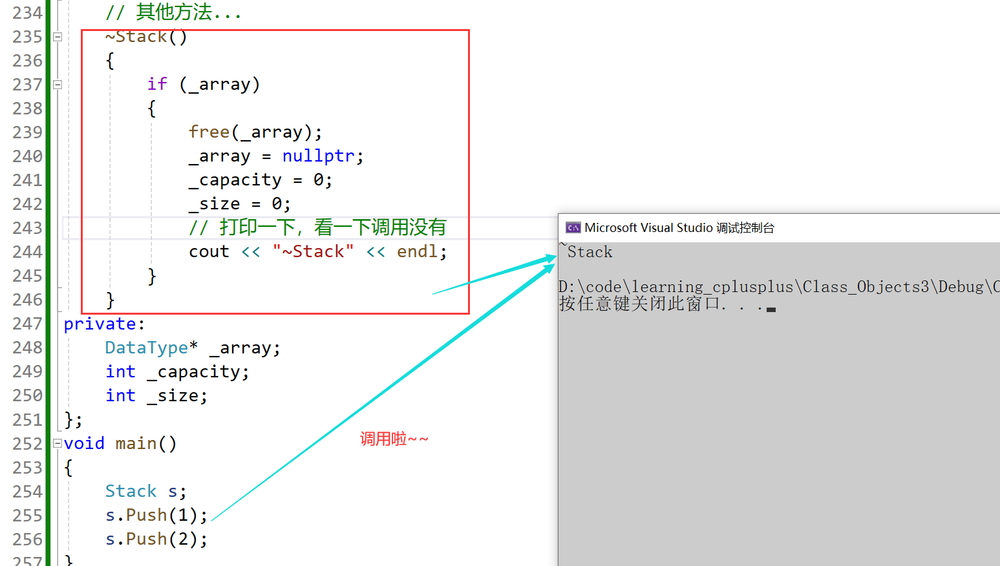

+ 再次定义一个，我们观察到和栈一样的**先定义的先构造，后定义的后构造，但是析构是反过来的，后定义的先析构，要满足先进后出的性质**

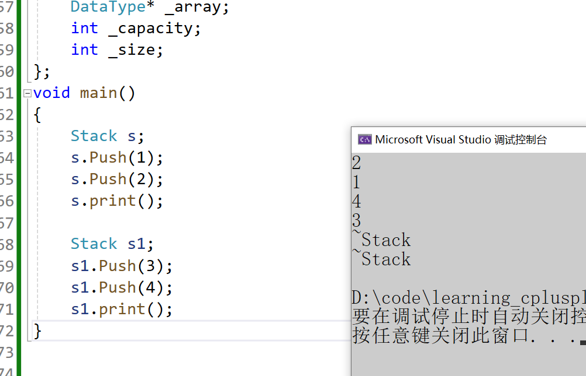

5. 关于编译器自动生成的析构函数，是否会完成一些事情呢？下面的程序我们会看到，**编译器生成的默认析构函数，对自定类型成员调用它的析构函数**。

```cpp
class Time
{
public:
    ~Time()
    {
        cout << "~Time()" << endl;
    }
private:
    int _hour;
    int _minute;
    int _second;
};
class Date
{
private:
    // 基本类型(内置类型)
    int _year = 1970;
    int _month = 1;
    int _day = 1;
    // 自定义类型
    Time _t;
};
int main()
{
    Date d;
    return 0;
}
```

+ 下图中程序运行结束后输出：`~Time()`

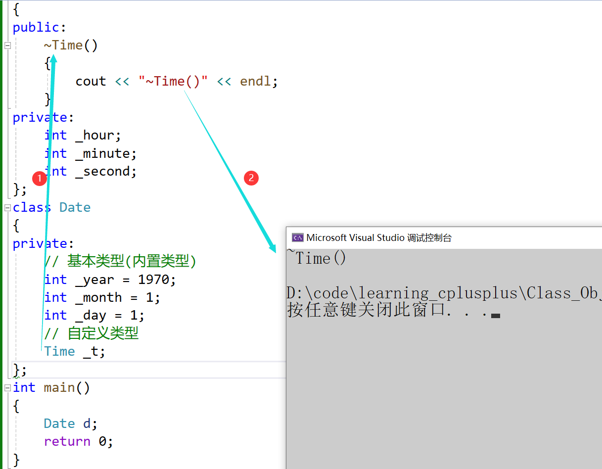

+ 在`main`方法中根本没有直接创建`Time`类的对象，为什么最后会调用`Time`类的析构函数？

**因为**：main方法中创建了Date对象d，而d中包含**4**个成员变量，其中 **_year, _month,_day** 三个是内置类型成员，**销毁时不需要资源清理**，最后系统直接将其内存回收即可；而 **_**`tTime`**类对象** ，所以在d销毁时，要将其内部包含的Time类的_t对象销毁，所以要**调用Time类的析构函数** 。但是：main函数中**不能直接调用Time类的析构函数，实际要释放的是Date类对象**，所以编译器会调用**Date类的析构函数**，而Date没有显式提供，则编译器会给Date类**生成一个默认的析构函数**，目的是在其内部调用`Time`。

+ 类的析构函数，即当Date对象销毁时，要**保证其内部每个自定义对象都可以正确销毁**
+ main函数中并**没有直接调用Time类析构函数**，而是**显式调用编译器为Date类生成的默认析  
****构函数**

注意：**创建哪个类的对象则调用该类的析构函数，销毁那个类的对象则调用该类的析构函数**

+ **默认生成的析构函数跟构造函数类似，内置类型不做处理，自定义类型区调用它的析构**
6. 如果类中没有申请资源时，**析构函数可以不写**，直接使用编译器生成的默认析构函数，比如Date类；**有资源申请时，一定要写**，否则会造成资源泄漏，比如Stack类。

## 四、拷贝构造
在学习的时候，我们有的时候需要一个与已存在对象一某一样的新对象

那在创建对象时，可否创建一个与已存在对象一某一样的新对象呢？

+ 拷贝构造函数：只有单个形参，该形参是对本类类型对象的引用(一般常用`const`修饰)，在用已存在的类类型对象创建新对象时由编译器自动调用。

拷贝构造函数也是特殊的成员函数，其**特征**如下：

1. 拷贝构造函数是构造函数的一个**重载形式**。
2. 拷贝构造函数的参数只有一个且必须是**类类型对象的引用**，使用传值方式编译器直接报错，因为**会引发无穷递归调用**。

```cpp
class Date
{
public:
    Date(int year = 1900, int month = 1, int day = 1)
    {
        _year = year;
        _month = month;
        _day = day;
    }

    //Date(const Date d) // 错误写法：编译报错，会引发无穷递归
    Date(const Date& d) // 必须传引用
    {
        _year = d._year;
        _month = d._month;
        _day = d._day;
    }
private:
    int _year;
    int _month;
    int _day;
};
int main()
{
    Date d1(2024,2,1);
    Date d2(d1);
    return 0;
}
```

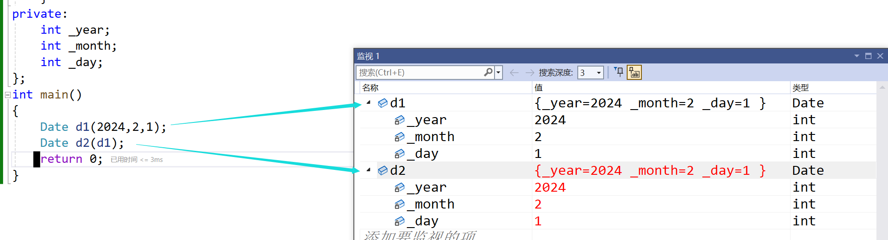

下面我们解释一下：

+ 这里的`const`可加可不加，但是建议加上
+ 有些人就写这个写昏头了，写反了，不加`const`的话不会提示

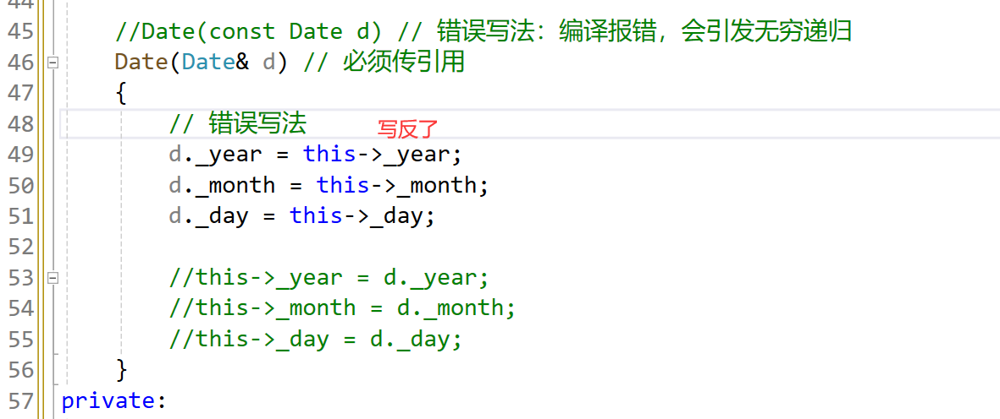

+ 加上了就知道哪里错了，所以还是加上较好

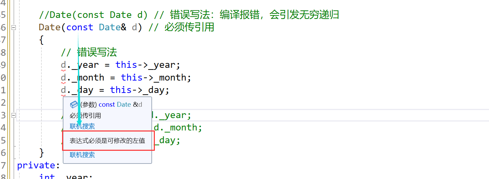

+ 这里的拷贝构造**必须传引用**，要不然会引发无穷递归【反正编译会报错~】

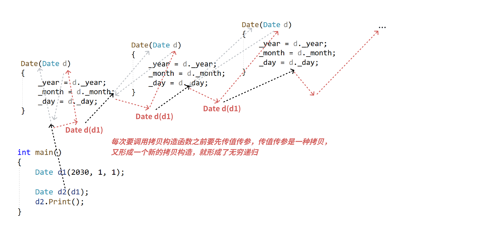

+ 再看下面代码，我是没有写拷贝构造的，但是这里自动拷贝了，毕竟这个是默认成员函数，这里生成的还和之前几个的默认成员函数还不一样，之前的对默认成员函数对内置类型不处理，而这个拷贝构造对内置类型处理了，如果没有处理，这里就拷贝不出来
+ 说明这里会自动生成一个拷贝构造函数，将值拷贝回去
4. 若未显式定义，编译器会生成默认的拷贝构造函数。 默认的拷贝构造函数对象按内存存储按字节序完成拷贝，这种拷贝叫做**浅拷贝**，或者**值拷贝**。

```cpp
class Date
{
public:
    // 构造函数
    Date(int year = 2024, int month = 2, int day = 1)
    {
        _year = year;
        _month = month;
        _day = day;
    }
    void Print()
    {
        cout << _year << "/" << _month << "/" << _day << endl;
    }
private:
    int _year;
    int _month;
    int _day;
};
int main()
{
    Date d1(2024, 2, 1);
    Date d2(d1);
    
    d1.Print();
    d2.Print();

    return 0;
}
```

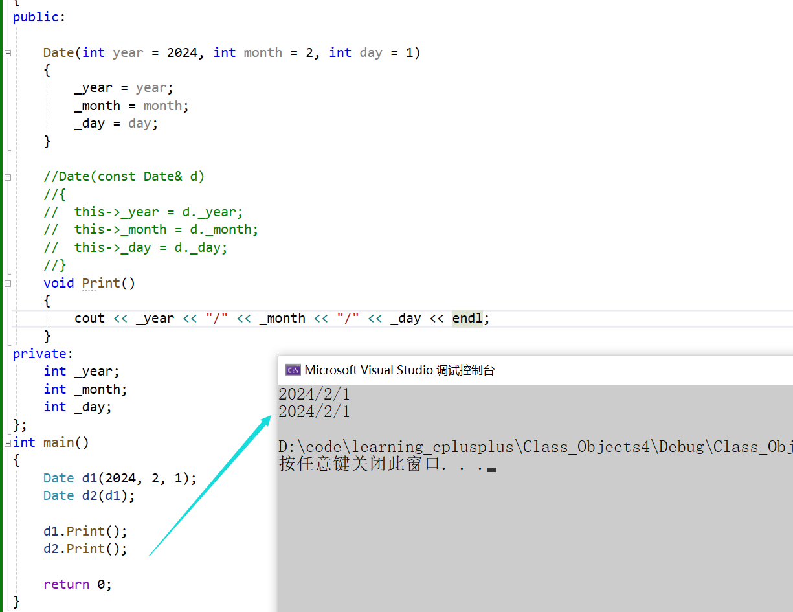

### 4.1 拷贝构造对于自定义类型【浅拷贝】
+ 对于自定义类型：

```cpp
class Time
{
public:
    Time(const Time& t)
    {
        _hour = t._hour;
        _minute = t._minute;
        _second = t._second;
        cout << "Time::Time(const Time&)" << endl;
    }
private:
    int _hour;
    int _minute;
    int _second;
};

class Date
{
public:
    Date(int year = 2024, int month = 2, int day = 1)
    {
        _year = year;
        _month = month;
        _day = day;
    }

    void Print()
    {
        cout << _year << "/" << _month << "/" << _day << endl;
    }
private:
    int _year;
    int _month;
    int _day;

    // 自定义类型
    Time _t;
};
int main()
{
    Date d1(2024,2,1);
    Date d2(d1);
    
    d1.Print();
    d2.Print();
    return 0;
}
```

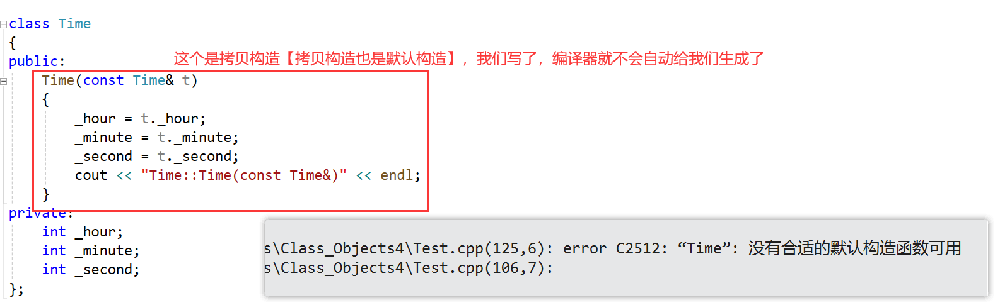

+ 我们有一个方法就是**强制让编译器生成**

加上这一条：

```cpp
Time() = default;
```

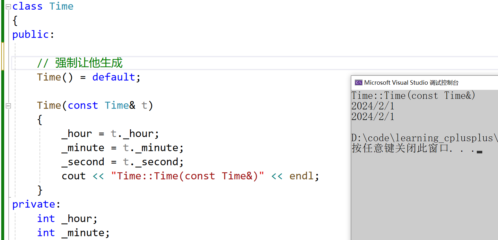

### 4.2 深拷贝
+ 刚刚上面的一种场景叫做浅拷贝，还有一个场景就是**深拷贝**
+ 编译器生成的默认拷贝构造函数已经可以完成字节序的值拷贝了，还需要自己显式实现吗？当然像日期类这样的类是没必要的。那么下面的类呢？验证一下试试？
+ 下面我这个代码没有写拷贝构造，它会自动生成一个**默认的值拷贝**，我们来运行一下

```cpp
typedef int DataType;
class Stack
{
public:
    Stack(size_t capacity = 10)
    {
        _array = (DataType*)malloc(capacity * sizeof(DataType));
        if (nullptr == _array)
        {
            perror("malloc申请空间失败");
            return;
        }
        _size = 0;
        _capacity = capacity;
    }
    void Push(const DataType& data)
    {
        // CheckCapacity();
        _array[_size] = data;
        _size++;
    }
    ~Stack()
    {
        if (_array)
        {
            free(_array);
            _array = nullptr;
            _capacity = 0;
            _size = 0;
        }
    }
private:
    DataType* _array;
    size_t _size;
    size_t _capacity;
};
int main()
{
    Stack s1;
    s1.Push(1);
    s1.Push(2);
    s1.Push(3);
    s1.Push(4);
    Stack s2(s1);
    return 0;
}
```

+ 我们看到程序崩溃了

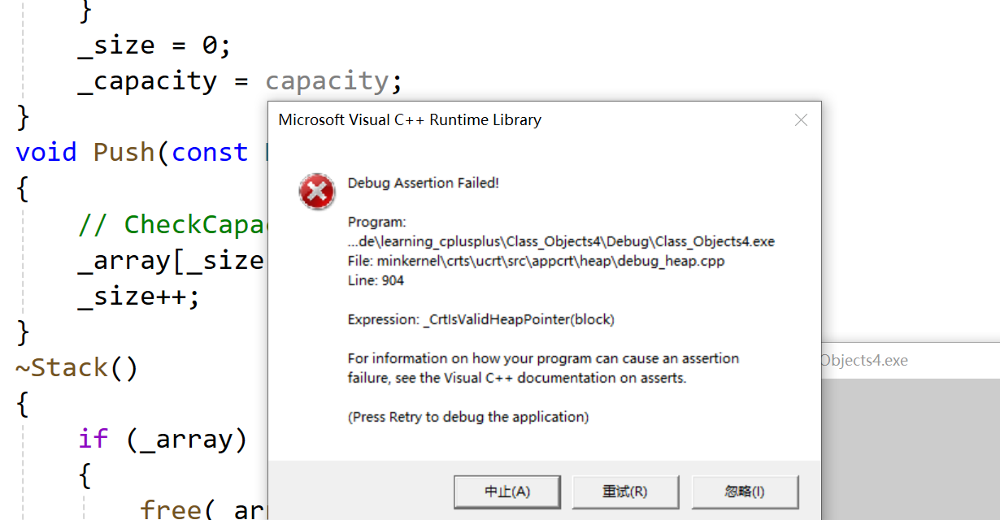

+ 也就是在一些场景下，默认生成的拷贝构造是会出事的

再调试看一下：

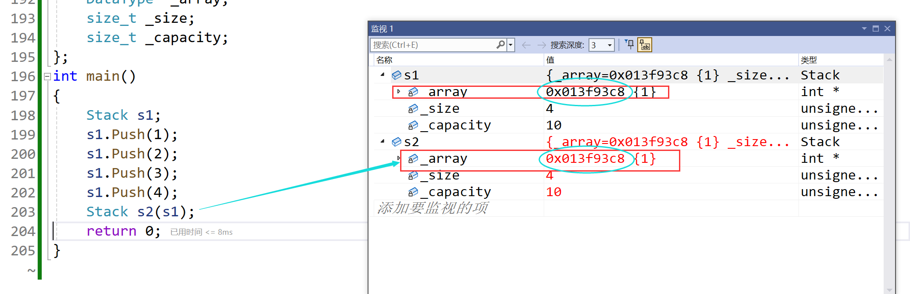

+ 这会导致**两个对象指向同一块空间**

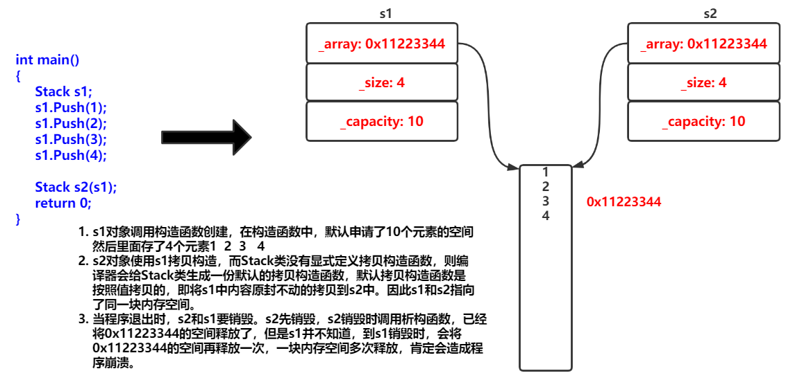

+ **在结束的时候会调用析构函数，会把那块空间给释放了**

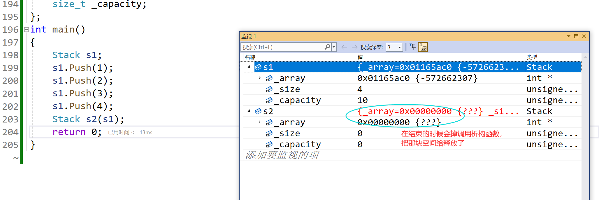

+ 再次释放的时候会出现错误
+ 同一块空间被释放了两次【所以是绝对不能的】

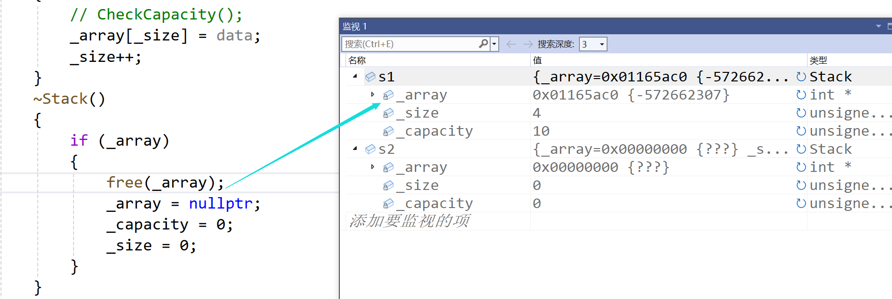

+ 正确的我们这样写
+ 需要引入一个叫做**深拷贝**

```cpp
Stack(const Stack& s)
{
    // 深拷贝
    DataType* tmp = (DataType*)malloc(s._capacity * sizeof(DataType));
    if (nullptr == tmp)
    {
        perror("malloc fail\n");
        exit(-1);
    }
    memcpy(tmp, s._array, sizeof(DataType) * s._size);
    _array = tmp;
    // 浅拷贝
    _size = s._size;
    _capacity = s._capacity;
}
```

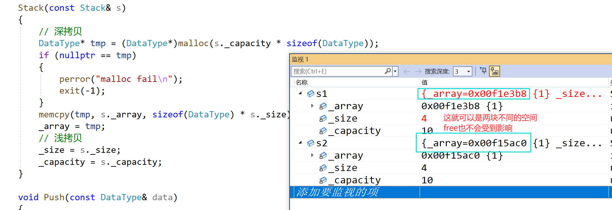

**注意**：类中如果没有涉及资源申请时，拷贝构造函数是否写都可以；**一旦涉及到资源申请时，则拷贝构造函数是一定要写的，否则就是浅拷贝**

### 4.3 拷贝构造函数典型调用场景
+ 使用已存在对象创建新对象
+ 函数参数类型为类类型对象
+ 函数返回值类型为类类型对象

```cpp
class Date
{
public:
    Date(int year, int minute, int day)
    {
        cout << "Date(int,int,int):" << this << endl;
    }
    Date(const Date& d)
    {
        cout << "Date(const Date& d):" << this << endl;
    }
    ~Date()
    {
        cout << "~Date():" << this << endl;
    }
private:
    int _year;
    int _month;
    int _day;
};
Date Test(Date d)
{
    Date temp(d);
    return temp;
}
int main()
{
    Date d1(2022, 1, 13);
    Test(d1);
    return 0;
}
```

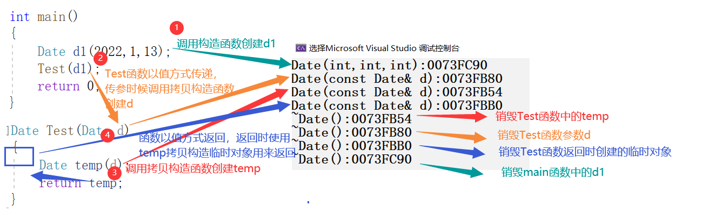

为了提高程序效率，**一般对象传参时，尽量使用引用类型**，返回时根据实际场景，能用引用尽量使用引用。

## 五、【C++】赋值运算符重载
### 5.1 运算符重载【引入】
+ C++为了增强代码的可读性引入了**运算符重载**，运算符重载是具有特殊函数名的函数，也具有其返回值类型，函数名字以及参数列表，其返回值类型与参数列表与普通的函数类似。

函数名字为：**关键字operator后面接需要重载的运算符符号。**

函数原型：**返回值类型 operator操作符(参数列表)**

**注意**：

+ 不能通过连接其他符号来创建新的操作符：比如`operator@`
+ 重载操作符必须有一个类型参数【不能去重载运算符改变内置类型的行为】
+ 用于内置类型的运算符，其含义不能改变，例如：内置的整型+，不 能改变其含义
+ **作为类成员函数重载时，其形参看起来比操作数数目少1个**，因为成员函数的第一个参数为隐藏的`this`
+ `.* :: sizeof ?: . `注意以上5个运算符不能重载。这里的是`.*`，不是`*`，这里经常在笔试选择题中出现。

我们可以看一下`.*`运算符：

```cpp
class AA {
public:
    void func() {
        cout << "A::func()" << endl;
    }
};

typedef void(AA::*PF)(); // 成员函数指针类型

int main() {
    // C++规定成员函数要加&才能取到函数指针
    PF pf = &AA::func;
    AA obj; // 定义obj类对象temp
    (obj.*pf)(); // 对象调用成员函数指针时，使⽤.*运算符

    return 0;
}
```

当我们写了一个**日期类**，有没有可能要比较比较呢？

```cpp
class Date
{
public:
    Date(int year = 1900, int month = 1, int day = 1)
    {
        _year = year;
        _month = month;
        _day = day;
    }
    //private: // 一会有解决方法
    int _year;
    int _month;
    int _day;
};
```

+ 我们写了一个比较相等的函数，如果是传值的话没有必要，我们形参直接写成`&`，而且也不需要修改，所以再加上`const`

```cpp
bool DateEquel(const Date& x, Date& y)
{
    return x._year == y._year
        && x._month == y._month
        && x._day == y._day;
}
```

+ 下面再实现一个函数【比较小于】

```cpp
bool DateLess(const Date& x, Date& y)
{
    if (x._year < y._year)
    {
        return true;
    }
    else if(x._year == y._year)
    {
        if (x._month < y._month)
        {
            return true;
        }
        else if(x._month == y._month)
        {
            if (x._day < y._day)
            {
                return true;
            }
        }
    }
    return false;
}
```

+ 上面有一些不好的地方，取名字的问题，取得很乱就不知道这个函数是干什么的

### 5.3 运算符重载
> 这里的**运算符重载**和**函数重载**的重载不是一个意思
>

+ 对运算符的行为重新定义

> `operator+`运算符做函数名
>

刚刚上面写的代码就可以写成下面这样

```cpp
// 比较等于
bool operator==(const Date& x, Date& y)
{
    return x._year == y._year
        && x._month == y._month
        && x._day == y._day;
} 
// 比较小于
bool operator<(const Date& x, Date& y)
{
    if (x._year < y._year)
    {
        return true;
    }
    else if(x._year == y._year)
    {
        if (x._month < y._month)
        {
            return true;
        }
        else if(x._month == y._month)
        {
            if (x._day < y._day)
            {
                return true;
            }
        }
    }
    return false;
}
```

就可以这样使用了

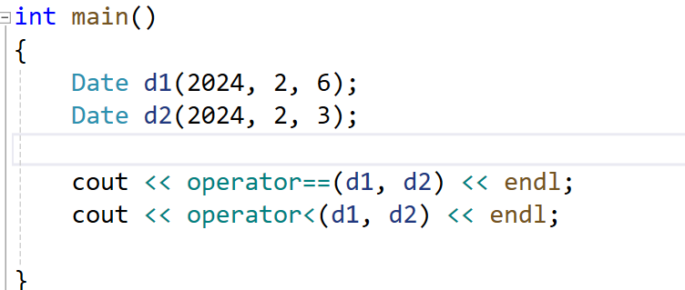

还可以这样做：

+ 这里必须要加括号，因为流插入的优先级很高

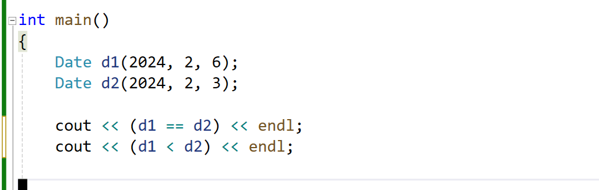

+ 注意：**参数不能反，左边的操作数对应的是左边**

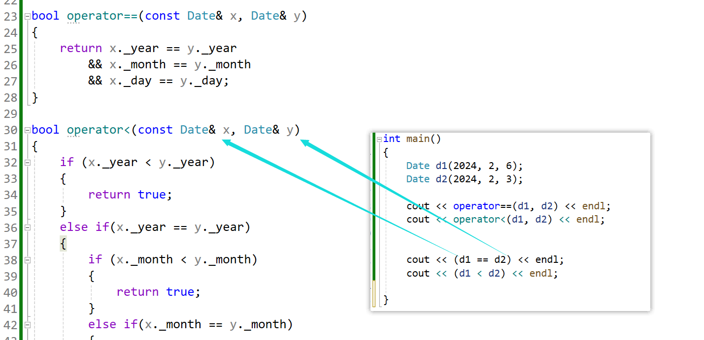

+ 我们再次回到上面，我们一开始是将内置类型放开的

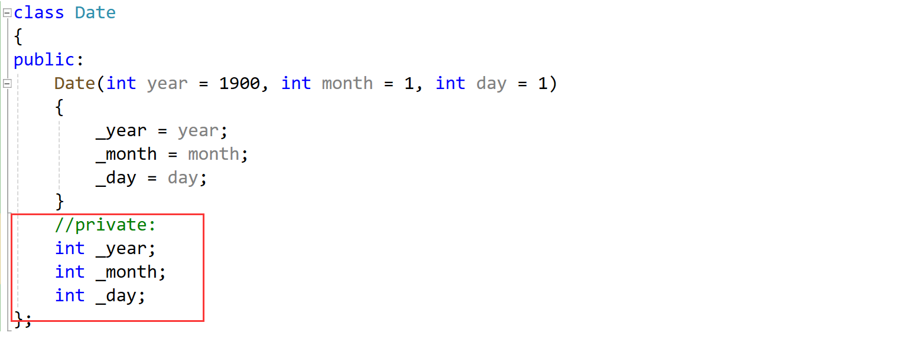

+ 如果将他设置成私有，类外面就不能访问了

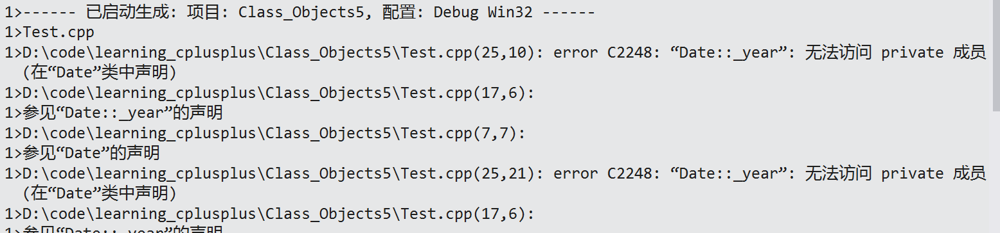

我们这里有三种解决方法：

+ 第一种就是在类里面搞一个Get函数，这样获取【Java就是这样做的】

```cpp
class Date
{
public:
    Date(int year = 1900, int month = 1, int day = 1)
    {
        _year = year;
        _month = month;
        _day = day;
    }

    int GetYear()
    {
        return _year;
    }

private:	
    int _year;
    int _month;
    int _day;
};
```

+ 第二种方法就是将函数放到类里面

```cpp
class Date
{
public:
    Date(int year = 1900, int month = 1, int day = 1)
    {
        _year = year;
        _month = month;
        _day = day;
    }

    bool operator==(const Date& x, Date& y)
    {
        return x._year == y._year
            && x._month == y._month
            && x._day == y._day;
    }

    bool operator<(const Date& x, Date& y)
    {
        if (x._year < y._year)
        {
            return true;
        }
        else if (x._year == y._year)
        {
            if (x._month < y._month)
            {
                return true;
            }
            else if (x._month == y._month)
            {
                if (x._day < y._day)
                {
                    return true;
                }
            }
        }
        return false;
    }

private:	
    int _year;
    int _month;
    int _day;
};
```

+ 然后我们又发现，函数的参数太多了，因为成员函数有一个隐含的`this`指针

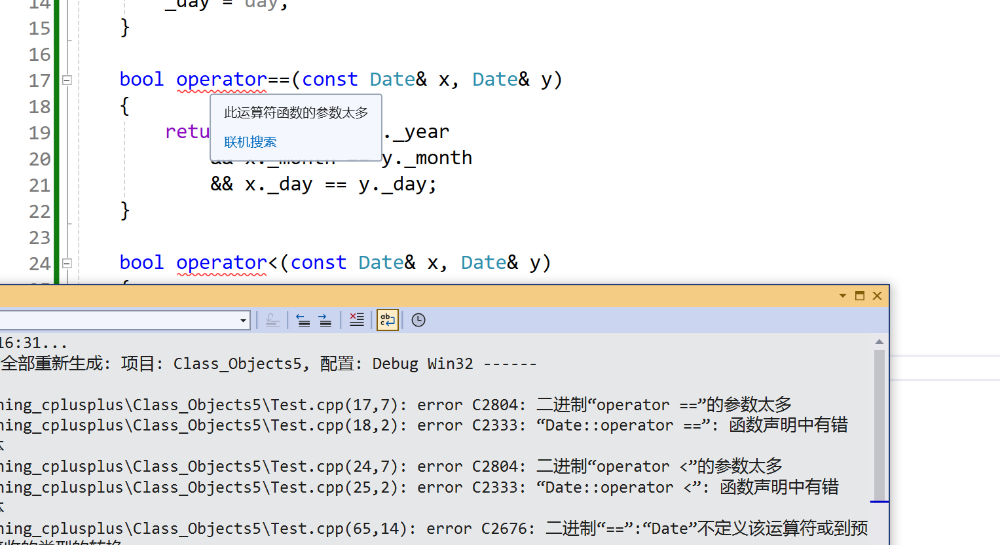

下面进行修改：

```cpp
class Date
{
public:
    Date(int year = 1900, int month = 1, int day = 1)
    {
        _year = year;
        _month = month;
        _day = day;
    }

    bool operator==(Date& y)
    {
        return _year == y._year
            && _month == y._month
            && _day == y._day;
    }

    bool operator<(Date& y)
    {
        if (_year < y._year)
        {
            return true;
        }
        else if (_year == y._year)
        {
            if (_month < y._month)
            {
                return true;
            }
            else if (_month == y._month)
            {
                if (_day < y._day)
                {
                    return true;
                }
            }
        }
        return false;
    }

private:	
    int _year;
    int _month;
    int _day;
};
```

+ 我们使用就可以这样使用了

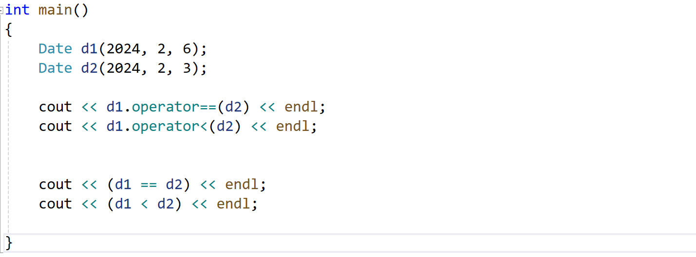

+ 我们通过查看反汇编再来了解一下
+ 首先看一下内置类型的比较，是通过指令集的支持

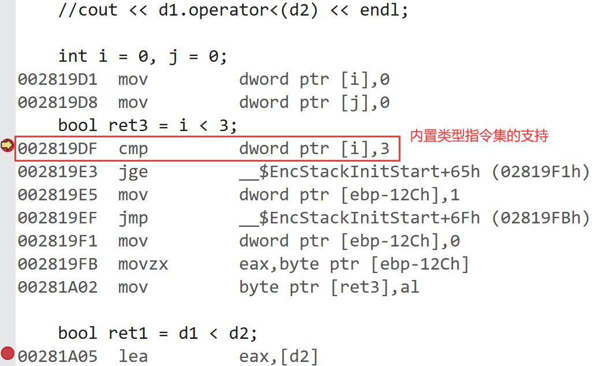

+ 再来看自定义类型
+ 可以看到两种写法的汇编代码是一样的，编译器会先转化，会一步到位的

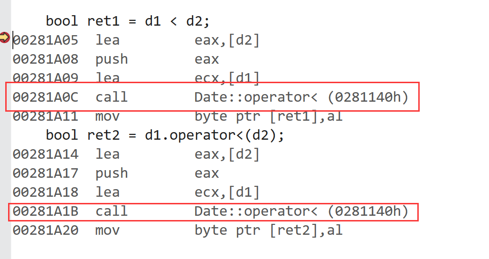

### 5.4 赋值运算符重载
+ 我们接着写日期类，下面写一个赋值运算符

```cpp
void operator=(const Date& d)
{
    _year = d._year;
    _month = d._month;
    _day = d._day;
}
```

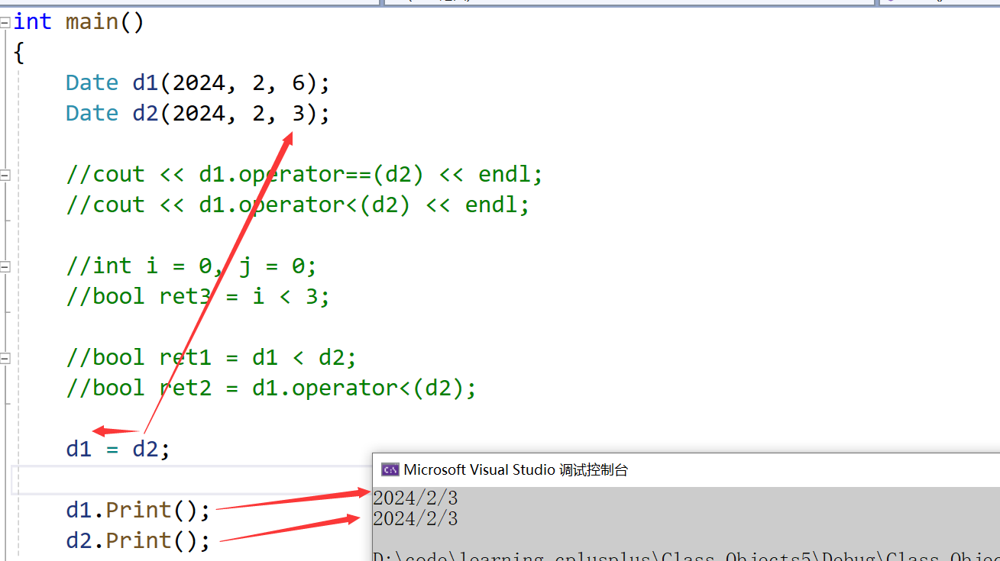

+ 但是我们写的这个又遇到新的问题了，就是连续赋值是无法完成的

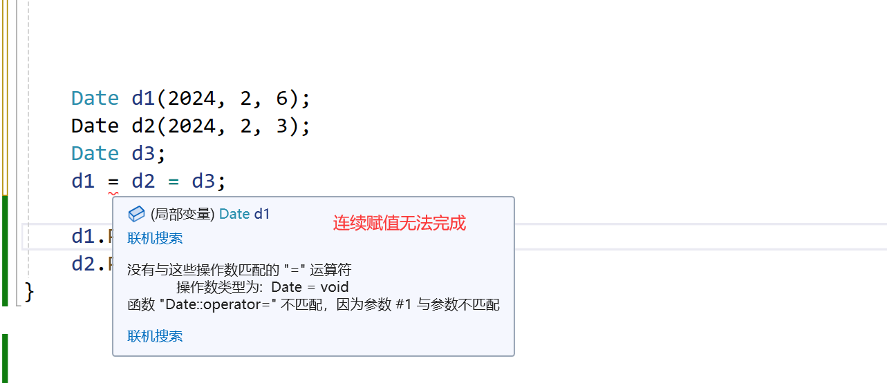

+ 其实连续赋值就是右操作的返回值，做操作的值再进行赋值
+ 返回类型用传引用返回，类型用引用，效率会提高`Date&`，返回的就是`*this`，不是`this`，这是个指针

```cpp
Date& operator=(const Date& d)
{
    _year = d._year;
    _month = d._month;
    _day = d._day;

    return *this;
}
```

+ 但是有可能有人这样写代码：`d1 = d1`
+ 就可以加上一个判断，两个相等的话直接返回即可

```cpp
d1 = d1
```

### 5.5 赋值
```cpp
Date& operator=(const Date& d)
{
    if (this != &d)
    {
        _year = d._year;
        _month = d._month;
        _day = d._day;
    }
    return *this;
}
```

+ 那么我们不写这个赋值，编译器不会不会自动生成一个呢？--->`会的！`
+ 因为这个是那6个默认成员函数之一
+ 内置类型会值拷贝，自定义类型会调用它的拷贝

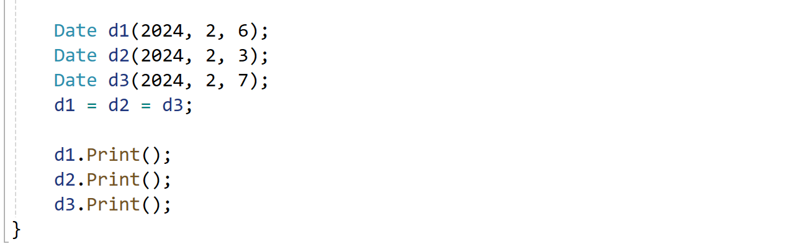

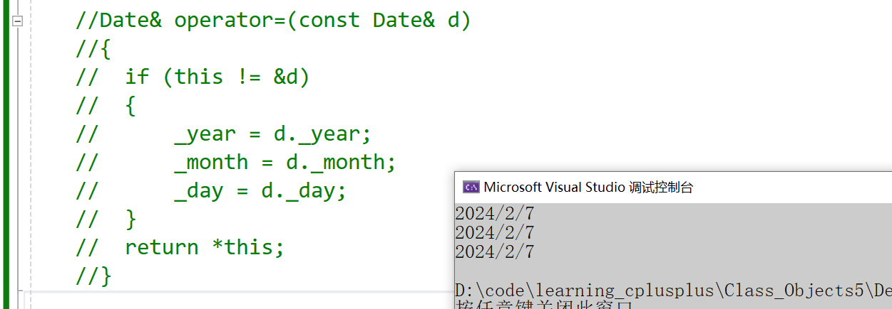

### 5.6 小结：
1. 赋值运算符重载格式
    - 参数类型：**const T&**，传递引用可以提高传参效率
    - 返回值类型：`T&`，返回引用可以提高返回的效率，有返回值目的是为了支持连续赋值
    - 检测**是否自己给自己赋值**
    - 返回`***this**`：要复合连续赋值的含义
2. 赋值运算符只能重载成类的成员函数不能重载成全局函数
    - 赋值运算符重载成全局函数，注意重载成全局函数时没有this指针了，需要给两个参数

```cpp
Date& operator=(Date& left, const Date& right)
{
    if (&left != &right)
    {
        left._year = right._year;
        left._month = right._month;
        left._day = right._day;
    }
    return left;
}
```

**原因**：赋值运算符如果不显式实现，编译器会生成一个默认的。此时用户再在类外自己实现一个全局的赋值运算符重载，就和编译器在类中生成的默认赋值运算符重载冲突了，故赋值运算符重载只能是类的成员函数。

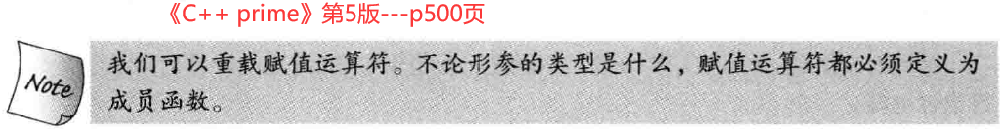

## 六、日期类的实现
### 6.1 判断大于
```cpp
bool operator>(const Date& d)  {
    if (_year > d._year)
        return true;
    else if (_year == d._year && _month > d._month)
        return true;
    else if(_year == d._year && _month == d._month)
        return _day > d._day;
    return false;
}
```

### 6.2 判断等于
+ **直接判断相不相等**

```cpp
bool operator==(const Date& d) {
    return _year == d._year && _month == d._month && _day == d._day;
}
```

### 6.3 判断大于等于
+ 既然上面都写了大于和等于了，我们这里就可以**直接复用**

```cpp
bool operator>=(const Date& d) {
    return (*this > d || *this == d);
}
```

### 6.4 判断小于
+ 这里的小于就是大于**等于的取反**

```cpp
bool operator<(const Date& d) {
    return !(*this >= d);
}
```

### 6.5 判断小于等于
+ 小于等于就是**大于取反**

```cpp
bool operator<=(const Date& d) {
	return !(*this > d);
}
```

### 6.6 判断不等于
+ 不等于就是**等于的取反**

```cpp
bool operator!=(const Date& d) {
	return !(*this == d);
}
```

### 6.7 日期加等天数
#### 首先要获取月份天数
+ 在实现日期加天数的时候我们需要再先实现一个获取月份天数
+ 因为这里的获取月份天数需要被频繁调用，在类内可以不写【在类内声明同时定义的成员函数自动转化为内联函数】
+ 我们还将数组使用`static`修饰，避免了频繁开辟空间
+ 然后再判断闰年的时候我们把判断月份放到了前面，首先判断月份是否为2，为真就继续判断下面的，否则每次都要执行那么一长串的判断闰年

```cpp
// 判断闰年
bool is_year(int year) {
    return ((year % 4 == 0 && year % 100 != 0) || year % 400 == 0);
}
// 获取某年某月的天数
int GetMonthDay(int year, int month) {
    static int a[13] = { -1,31,28,31,30,31,30,31,31,30,31,30,31 };
    if (month == 2 && is_year(year)) {
        return 29;
    }
    return a[month];
}
```

然后继续实现：

+ 首先加上天数，然后判断当前月的天数和加上的天数
+ 然后进行减掉天数，月份+1，如果月份等于了13，年就+1，月份赋值为1

```cpp
Date& operator+=(int day) {
	if (day < 0)
		return *this -= (-day);
	_day += day;
	while (_day > GetMonthDay(_year, _month)) {
		_day -= GetMonthDay(_year, _month);
		_month++;
		if (_month == 13) {
			_year++;
			_month = 1;
		}
	}
	return *this;
}
```

### 6.8 日期加天数
+ 上面是实现了+=，+也就很好实现了，这里只需要另外开一块空间，修改别的空间就不会影响我这里的值
+ 这里**不可以用引用返回**，`tmp`是一个临时对象，必须用传值返回

```cpp
Date operator+(int day)
{
    Date tmp(*this);
    tmp._day += day;
    while (tmp._day > GetMonthDay(tmp._year, tmp._month))
    {
        tmp._day -= GetMonthDay(tmp._year, tmp._month);
        ++tmp._month;
        if (tmp._month == 13)
        {
            ++tmp._year;
            tmp._month = 1;
        }
    }
    return tmp;
}
```

+ 上面那个+和+=的代码相似，我们也可以复用一下

```cpp
Date operator+(int day)
{
    Date tmp(*this);
    tmp += day;
    return tmp;
}
```

+ 上面的代码是+复用+=，那么我们也可以用+=复用+

```cpp
Date& operator+=(int day)
{
    *this = *this + day;
    return *this;
}
```

那么这两种写法哪一种比较好呢？

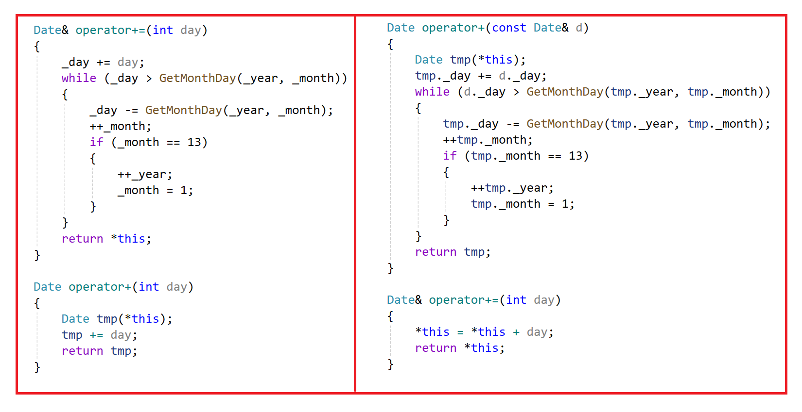

+ 这里**左边**的更好，右边的会复用+，而+里面会创建临时对象

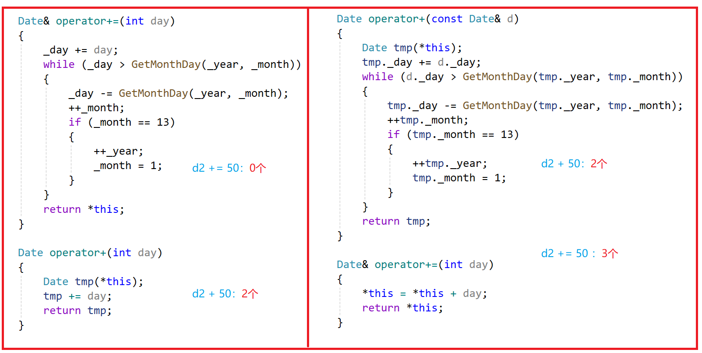

### 6.9 日期减等天数
+ 经过上面的思考，我们先实现**减等**

```cpp
Date& operator-=(int day) {
	if (day < 0)
		return *this += (-day);
	_day -= day;
	while (_day <= 0) {
		--_month;
		if (_month == 0) {
			--_year;
			_month = 12;
		}
		_day += GetMonthDay(_year, _month);
	}
	return *this;
}
```

### 6.10 日期减天数
```cpp
Date operator-(int day) const {
	Date tmp(*this);
	tmp -= day;
	return tmp;
}
```

## 七、前置++ && 后置++
```cpp
Date& operator++() {
	*this += 1;
	return *this;
}
```

+ 后置++要返回++后的值【这里要注意，后置++的操作符是有一个`int`区分的
+ 后置++相比前置++的效率是低一些的
+ 如果是显示调用的话，里面传什么值都是可以的，例如：`d1.operator++(1);`

```cpp
Date operator++(int) {
	Date tmp(*this);
	*this += 1;
	return tmp;
}
```

### 7.1 日期减日期【返回天数】
方法一：计算两个从公元元年开始的总天数，然后计算差值

```cpp
int operator-(const Date& d) {
    // 计算d1从公元元年开始的总天数
    int d1 = 0;
    for (int year = 1; year < _year; ++year) {
        d1 += is_year(year) ? 366 : 365;
    }
    for (int month = 1; month < _month; ++month) {
        d1 += GetMonthDay(_year, month);
    }
    d1 += _day;

    // 计算d2从公元元年开始的总天数
    int d2 = 0;
    for (int year = 1; year < d._year; ++year) {
        d2 += is_year(year) ? 366 : 365;
    }
    for (int month = 1; month < d._month; ++month) {
        d2 += GetMonthDay(d._year, month);
    }
    d2 += d._day;

    // 计算两个日期的天数差
    int day = d1 - d2;
    if (day < 0) {
        day = -day;
    }

    return day;
}
```

方法二：让小的日期一直加到大的日期

```cpp
int operator-(const Date& d)
{
    int flag = 1;
    Date max = *this;
    Date min = d;
    if (*this < d)
    {
        int flag = -1;
        max = d;
        min = *this;
    }
    // 相差天数
    int n = 0;
    while (min != max)
    {
        ++min;
        ++n;
    }
    return n * flag;
}
```

### 7.2 流插入
+ 对于内置类型可以流插入，那么内置类型也可以流插入
+ 对于流插入`cout`，对于库里面全局的`ostream`类型的对象 -->[cplusplus.com](https://cplusplus.com/reference/)

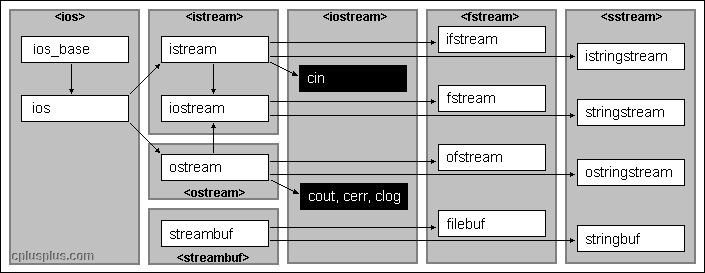

+ 这里我们在使用的时候就反了，第一个被this占用了

```cpp
void operator<<(ostream& out)
{
    out << _year << "年" << _month << "月" << _day << "日" << endl;
}
```

+ 作为成员函数重载，this指针占据第一个参数，Date必须是在操作数

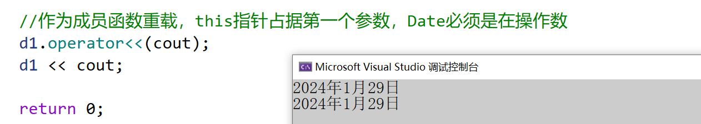

+ 所以我们就必须让`ostream`占据第一个位置
+ 想要占据第一个参数，就不能写成成员函数，就要写成全局函数
+ 当我们写成全局函数的时候，不能访问类的私有了，这里也要后面的**友元**

```cpp
void operator<<(ostream& out, const Date& d)
{
    out << d._year << "年" << d._month << "月" << d._day << "日" << endl;
}
```

+ 这里想要改成多个插入，我们返回值就要改一下

```cpp
ostream& operator<<(ostream& out, const Date& d)
{
    out << d._year << "年" << d._month << "月" << d._day << "日" << endl;
    return out;
}
```

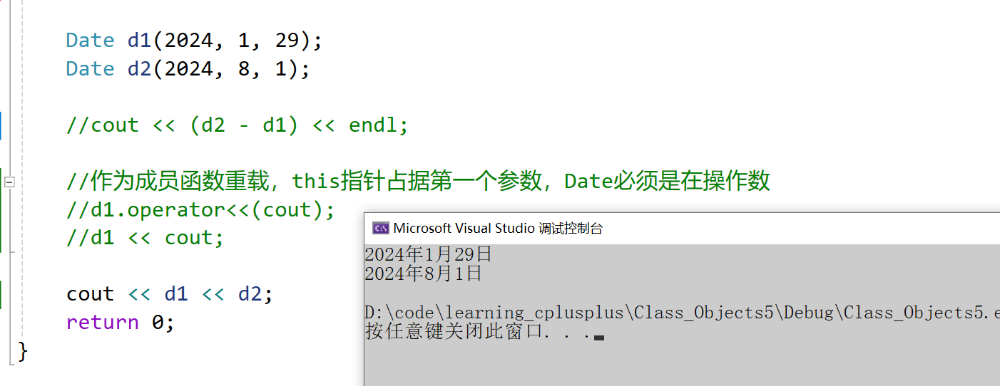

### 7.3 流提取
+ 流提取是`cin`


+ 这里就不能使用`const`了

```cpp
istream& operator>>(istream& in, Date& d)
{
    cout << "请依次输入年月日:>";
    in >> d._year >> d._month >> d._day;
    return in;
}
```

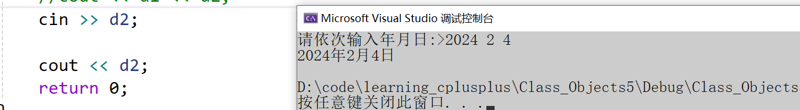

### 7.4 检查输入日期是否合法
```cpp
bool CheckInvalid() {
    if (_year <= 0 || _month < 1 || _month > 12 || _day < 1 || _day > GetMonthDay(_year, _month))
        return false;
    else
        return true;
}
```

这个时候把可以该检查的地方就检查一下

## 八、const修饰
### 8.1 const成员函数
+ 将`const`修饰的“成员函数”称之为`const`成员函数，`const`修饰类成员函数，实际修饰该成员函数隐含的`this指针`，表明在该成员函数中不能对类的任何成员进行修改。

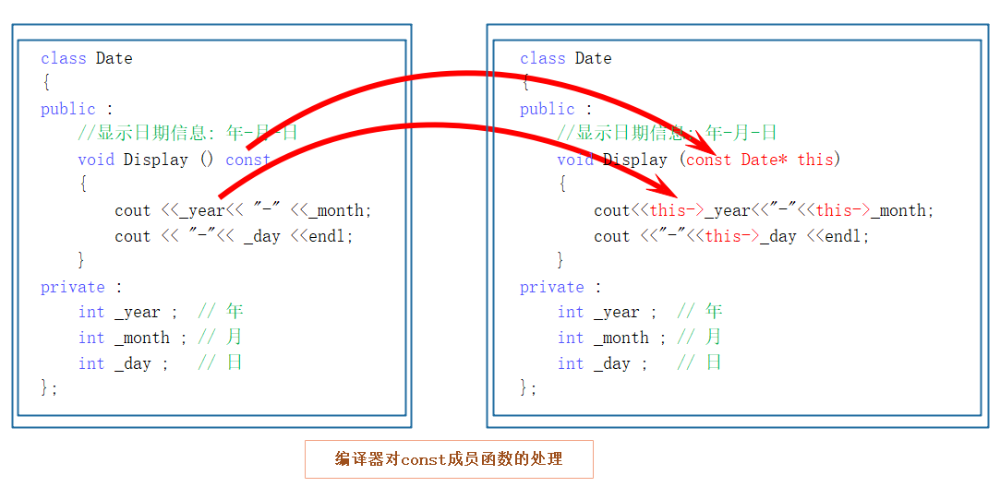

```cpp
class Date
{
public:
    Date(int year, int month, int day)
    {
        _year = year;
        _month = month;
        _day = day;
    }
    void Print()
    {
        cout << "Print()" << endl;
        cout << "year:" << _year << endl;
        cout << "month:" << _month << endl;
        cout << "day:" << _day << endl << endl;
    }
    void Print()
    {
        cout << "Print()const" << endl;
        cout << "year:" << _year << endl;
        cout << "month:" << _month << endl;
        cout << "day:" << _day << endl << endl;
    }
private:
    int _year; // 年
    int _month; // 月
    int _day; // 日
};
```

+ 这里会出现一个**权限放大**的问题

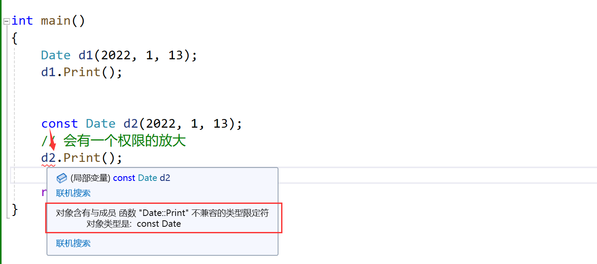

+ 那么在参数就需要改成`const Date*`
+ 为了解决这个问题，我们就要在函数后面的位置加上一个`const`
+ 修饰的是**this指针**指向的内容

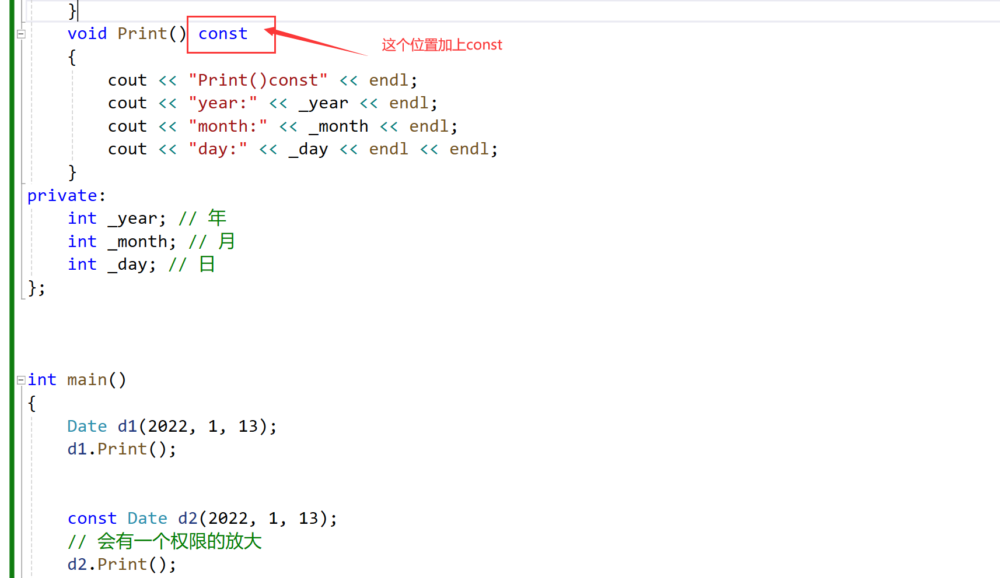

+ 那么不是下面方法调用也是可以的，因为这个是权限的缩小

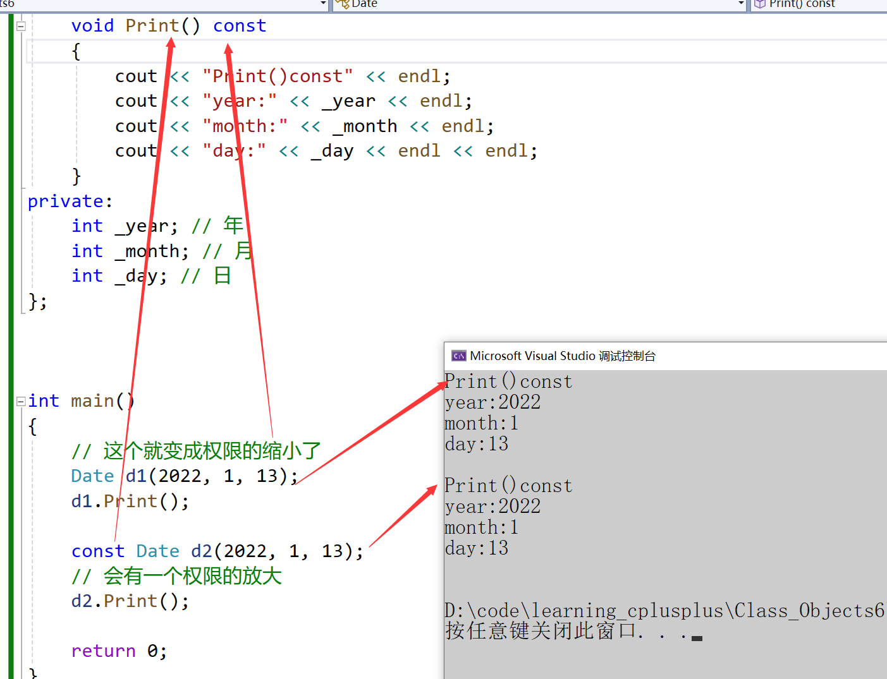

+ `const`对象可以调用，非`const`对象也可以调用
+ 那么全部函数都可以加上`const`吗？--->不可以！
    - 如果函数内部要被修改，那肯定是不能加的
+ 上面写的日期类的部分函数也可以加上

### 8.2 小结一下：
+ **成员函数**如果是一个对成员变量只进行**读**访问的函数，**建议加上**`const`，这样const对象和`非const`对象都可以访问
+ **成员函数**如果是一个对成员变量进行**读写**访问的函数，**不可以加上const**，否则不能修改成员变量
1. `const`对象可以调用`非const`成员函数吗？ --> 不可以！【权限放大】
2. `非const`对象可以调用`const`成员函数吗？--> 可以！【权限缩小】
3. `const`成员函数内可以调用其它的`非const`成员函数吗？--> 不可以！【权限放大】
4. `非const`成员函数内可以调用其它的`const`成员函数吗？--> 可以！【权限缩小】

## 九、日期类的实现【源码】
```cpp
#pragma once

#include <iostream>
using namespace std;

class Date
{
public:
	friend ostream& operator<<(ostream& out, const Date& d);
	friend istream& operator>>(istream& out, Date& d);

	// 判断闰年
	bool is_year(int year) const {
		return ((year % 4 == 0 && year % 100 != 0) || year % 400 == 0);
	}
	// 获取某年某月的天数
	int GetMonthDay(int year, int month) const {
		static int a[13] = { -1,31,28,31,30,31,30,31,31,30,31,30,31 };
		if (month == 2 && is_year(year)) {
			return 29;
		}
		return a[month];
	}

	// 全缺省的构造函数
	Date(int year = 1900, int month = 1, int day = 1) {
		_year = year;
		_month = month;
		_day = day;
		if (!CheckInvalid())
		{
			cout << "构造日期非法" << endl;
			exit(-1);
		}
	}
	// 拷贝构造函数
	Date(const Date& d) {
		_year = d._year;
		_month = d._month;
		_day = d._day;
		if (!CheckInvalid())
		{
			cout << "构造日期非法" << endl;
			exit(-1);
		}
	}

	// 赋值运算符重载
	Date& operator=(const Date& d) {
		if (&d != this) {
			_year = d._year;
			_month = d._month;
			_day = d._day;
		}
		return *this;
	}
	// 析构函数
	~Date() {}

	// 日期+=天数
	Date& operator+=(int day) {
		if (day < 0)
			return *this -= (-day);
		_day += day;
		while (_day > GetMonthDay(_year, _month)) {
			_day -= GetMonthDay(_year, _month);
			_month++;
			if (_month == 13) {
				_year++;
				_month = 1;
			}
		}
		return *this;
	}
	// 日期+天数
	Date operator+(int day) const {
		Date tmp(*this);
		tmp += day;
		return tmp;
	}

	// 日期-天数
	Date operator-(int day) const {
		Date tmp(*this);
		tmp -= day;
		return tmp;
	}

	// 日期-=天数
	Date& operator-=(int day) {
		if (day < 0)
			return *this += (-day);
		_day -= day;
		while (_day <= 0) {
			--_month;
			if (_month == 0) {
				--_year;
				_month = 12;
			}
			_day += GetMonthDay(_year, _month);
		}
		return *this;
	}

	// 前置++
	Date& operator++() {
		*this += 1;
		return *this;
	}

	// 后置++
	Date operator++(int) {
		Date tmp(*this);
		*this += 1;
		return tmp;
	}

	// 后置--
	Date operator--(int) {
		Date tmp(*this);
		*this -= 1;
		return tmp;
	}

	// 前置--
	Date& operator--() {
		return *this -= 1;
	}

	// >运算符重载
	bool operator>(const Date& d) const {
		if (_year > d._year)
			return true;
		else if (_year == d._year && _month > d._month)
			return true;
		else if(_year == d._year && _month == d._month)
			return _day > d._day;
		return false;
	}

	// ==运算符重载
	bool operator==(const Date& d) const {
		return _year == d._year && _month == d._month && _day == d._day;
	}

	// >=运算符重载
	bool operator>=(const Date& d) const {
		return (*this > d || *this == d);
	}

	// <运算符重载
	bool operator<(const Date& d) const {
		return !(*this >= d);
	}

	// <=运算符重载
	bool operator<=(const Date& d) const {
		return !(*this > d);
	}

	// !=运算符重载
	bool operator!=(const Date& d) const {
		return !(*this == d);
	}
#if 0
	// 日期-日期 返回天数
	int operator-(const Date& d) {
		// 计算d1从公元元年开始的总天数
		int d1 = 0;
		for (int year = 1; year < _year; ++year) {
			d1 += is_year(year) ? 366 : 365;
		}
		for (int month = 1; month < _month; ++month) {
			d1 += GetMonthDay(_year, month);
		}
		d1 += _day;

		// 计算d2从公元元年开始的总天数
		int d2 = 0;
		for (int year = 1; year < d._year; ++year) {
			d2 += is_year(year) ? 366 : 365;
		}
		for (int month = 1; month < d._month; ++month) {
			d2 += GetMonthDay(d._year, month);
		}
		d2 += d._day;

		// 计算两个日期的天数差
		int day = d1 - d2;
		if (day < 0) {
			day = -day;
		}

		return day;
	}
#endif

	// 日期-日期 返回天数
	int operator-(const Date& d) {
		int flag = 1;
		Date max = *this,min = d;
		if (max < min) {
			max = d;
			min = *this;
			flag = -flag;
		}
		int n = 0;
		while (min != max)
		{
			++min;
			++n;
		}
		return n * flag;
	}

	bool CheckInvalid() const {
		if (_year <= 0 || _month < 1 || _month > 12 || _day < 1 || _day > GetMonthDay(_year, _month))
			return false;
		else
			return true;
	}

private:
	int _year;
	int _month;
	int _day;
};


ostream& operator<<(ostream& out,const Date& d) {
	out << d._year << "/" << d._month << "/" << d._day << endl;
	return out;
}

istream& operator>>(istream& in, Date& d)
{
	while (1)
	{
		cout << "请依次输入年月日:>";
		in >> d._year >> d._month >> d._day;

		if (!d.CheckInvalid())
			cout << "输入非法日期，请重新输入" << endl;
		else
			break;
	}
	return in;
}
```

## 十、默认成员函数【取地址及const取地址操作符重载】
+ 前面章节学习了4个默认成员函数了（构造、析构、拷贝、赋值），剩下两个再看一下


+ 这两个默认成员函数一般不用重新定义 ，编译器默认会生成。

```cpp
class Date
{
public:
    Date* operator&()
    {
        return this;
    }
    const Date* operator&()const
    {
        return this;
    }
private:
    int _year; // 年
    int _month; // 月
    int _day; // 日
};
```

+ 比如说不想让别人拿到我的地址，**普通对象返回空，**`const`**对象返回假地址**

就可以这样写：

```cpp
Date* operator&()
{
    return nullptr;
}
const Date* operator&()const
{
    int i = 0;
    return (const A*)&i;
}
```

这两个运算符一般不需要重载，使用编译器生成的默认取地址的重载即可，只有特殊情况，才需要重载，比如想让别人获取到指定的内容！

