## 红黑树的概念
**红黑树**（英语：Red–black tree）是一种自平衡二叉查找树，是在计算机科学中用到的一种数据结构，典型用途是实现关联数组。它在1972年由鲁道夫·贝尔发明，被称为“对称二叉B树”，它现代的名字源于利奥尼达斯·J·吉巴斯和罗伯特·塞奇威克于1978年写的一篇论文。红黑树的结构复杂，但它的操作有着良好的最坏情况运行时间，并且在实践中高效：它可以在时间内完成查找、插入和删除，这里的_n_是树中元素的数目。

## 红黑树的性质
红黑树是每个节点都带有颜色属性的二叉查找树，颜色为红色或黑色。在二叉查找树强制一般要求以外，对于任何有效的红黑树我们增加了如下的额外要求：

1. **节点是红色或黑色。**
2. **根是黑色。**
3. **所有叶子都是黑色（叶子是NIL节点）。**
4. **每个红色节点必须有两个黑色的子节点。（或者说从每个叶子到根的所有路径上不能有两个连续的红色节点。）（或者说不存在两个相邻的红色节点，相邻指两个节点是父子关系。）（或者说红色节点的父节点和子节点均是黑色的。）**
5. **从任一节点到其每个叶子的所有简单路径都包含相同数目的黑色节点。**

下面是一个具体的红黑树的图例：

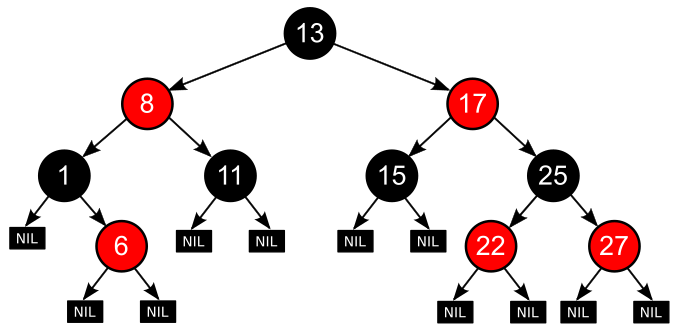

+ 这些约束确保了红黑树的关键特性：从根到叶子的最长的可能路径不多于最短的可能路径的两倍长。结果是这个树大致上是平衡的。因为操作比如插入、删除和查找某个值的最坏情况时间都要求与树的高度成比例，这个在高度上的理论上限允许红黑树在最坏情况下都是高效的，而不同于普通的二叉查找树。
+ 要知道为什么这些性质确保了这个结果，注意到性质4导致了路径不能有两个毗连的红色节点就足够了。最短的可能路径都是黑色节点，最长的可能路径有交替的红色和黑色节点。因为根据性质5所有最长的路径都有相同数目的黑色节点，这就表明了没有路径能多于任何其他路径的两倍长。
+ 在很多树数据结构的表示中，一个节点有可能只有一个子节点，而叶子节点包含数据。用这种范例表示红黑树是可能的，但是这会改变一些性质并使算法复杂。为此，本文中我们使用“nil叶子”，如上图所示，它不包含数据而只充当树在此结束的指示。这些节点在绘图中经常被省略，导致了这些树好像同上述原则相矛盾，而实际上不是这样。与此有关的结论是所有节点都有两个子节点，尽管其中的一个或两个可能是空叶子。

## 红黑树的操作
因为每一个红黑树也是一个特化的二叉查找树，因此红黑树上的只读操作与普通二叉查找树上的只读操作相同。然而，在红黑树上进行插入操作和删除操作会导致不再符合红黑树的性质。恢复红黑树的性质需要少量的颜色变更（实际是非常快速的）和不超过三次树旋转（对于插入操作是两次）。虽然插入和删除很复杂，但操作时间仍可以保持为次。

## 红黑树的结构
+ 这里还是一样是使用三叉链，另外还引入了一个节点的颜色，通过调整节点的颜色来调整整棵树
+ 这里的节点颜色我使用枚举类型，方便表示。

```cpp
enum Colour
{
    RED,
    BLACK
};

template<class K, class V>
struct RBTreeNode
{
    //三叉链
    RBTreeNode<K, V>* _left;
    RBTreeNode<K, V>* _right;
    RBTreeNode<K, V>* _parent;

    //存储的键值对
    pair<K, V> _kv;

    //结点的颜色
    Colour _col; //红/黑

    //构造函数
    RBTreeNode(const pair<K, V>& kv)
        :_left(nullptr)
        , _right(nullptr)
        , _parent(nullptr)
        , _kv(kv)
        , _col(RED) // 构造的节点为红色
    {}
};
```

我们首先以二叉查找树的方法增加节点并标记它为**红色**。（如果设为黑色，就会导致根到叶子的路径上有一条路上，多一个额外的黑节点，这个是很难调整的。但是设为红色节点后，可能会导致出现两个连续红色节点的冲突，那么可以通过颜色调换（color flips）和树旋转来调整。）下面要进行什么操作取决于其他临近节点的颜色。同人类的家族树中一样，我们将使用术语叔父节点来指一个节点的父节点的兄弟节点。注意：

1. 性质1和性质3总是保持着。
2. 性质4只在增加红色节点、重绘黑色节点为红色，或做旋转时受到威胁。
3. 性质5只在增加黑色节点、重绘红色节点为黑色，或做旋转时受到威胁。

## 红黑树的插入
红黑树插入结点的逻辑分为三步：

1. 按二叉搜索树的插入方法，找到待插入位置。
2. 将待插入结点插入到树中。
3. 若插入结点的父结点是红色的，则需要对红黑树进行调整。

因为新节点的默认颜色是红色，因此：如果其双亲节点的颜色是黑色，没有违反红黑树任何  
性质，则不需要调整；但当新插入节点的双亲节点颜色为红色时，就违反了性质三不能有连  
在一起的红色节点，此时需要对红黑树**分情况**来讨论：

约定：cur为当前节点，p为父节点，g为祖父节点，u为叔叔节点

### 情况一：叔叔存在且红色
+ 我们可以将叔叔和父亲的节点变黑，爷爷节点变红。

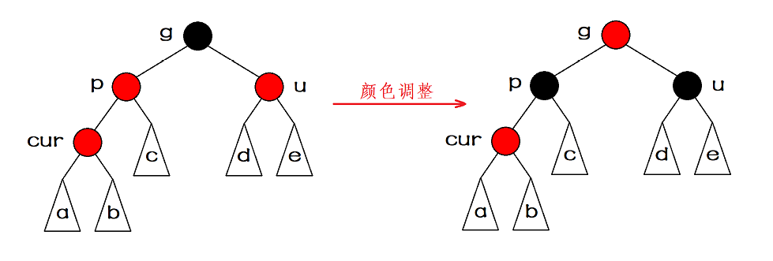

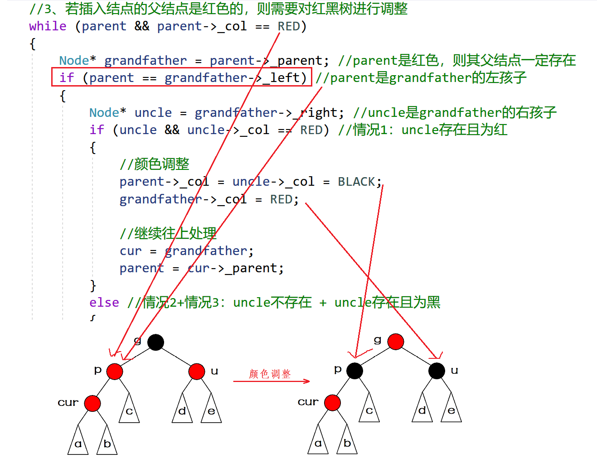

### 情况二：叔叔存在颜色黑色
+ 如果**插入的位置是父亲的左。**

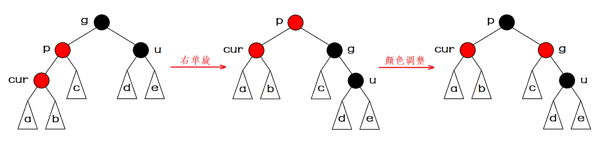

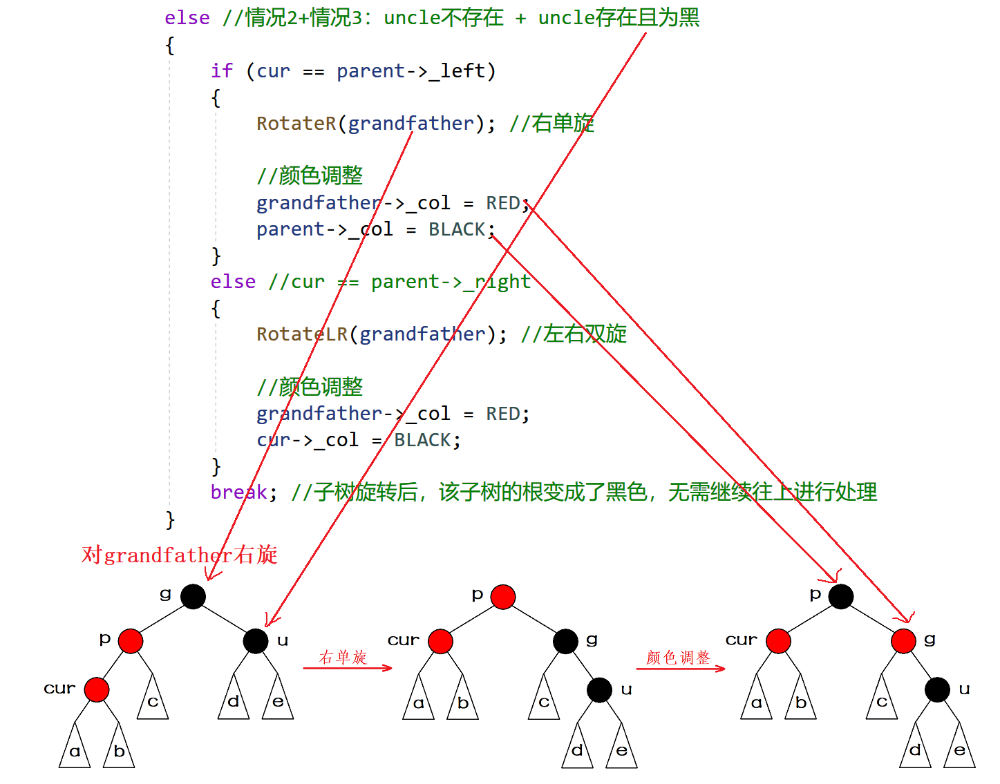

+ 如果**插入的位置是父亲的右**

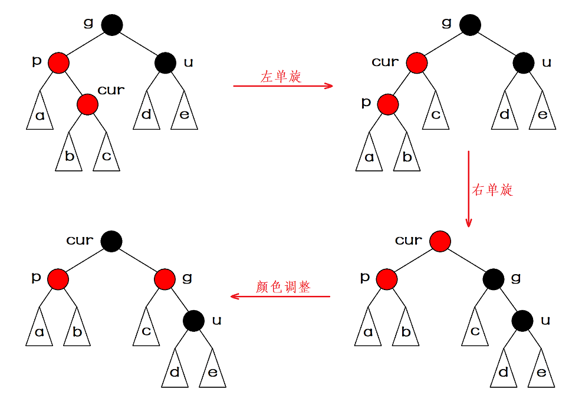

### 情况三：叔叔不存在
+ p左单旋
+ g右单旋
+ 颜色调整

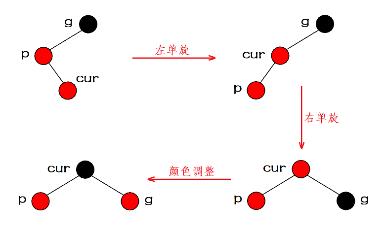

### 代码实现：
```cpp
//插入函数
pair<Node*, bool> Insert(const pair<K, V>& kv)
{
    if (_root == nullptr) //若红黑树为空树，则插入结点直接作为根结点
    {
        _root = new Node(kv);
        _root->_col = BLACK; //根结点必须是黑色
        return make_pair(_root, true); //插入成功
    }
    //1、按二叉搜索树的插入方法，找到待插入位置
    Node* cur = _root;
    Node* parent = nullptr;
    while (cur)
    {
        if (kv.first < cur->_kv.first) //待插入结点的key值小于当前结点的key值
        {
            //往该结点的左子树走
            parent = cur;
            cur = cur->_left;
        }
        else if (kv.first > cur->_kv.first) //待插入结点的key值大于当前结点的key值
        {
            //往该结点的右子树走
            parent = cur;
            cur = cur->_right;
        }
        else //待插入结点的key值等于当前结点的key值
        {
            return make_pair(cur, false); //插入失败
        }
    }

    //2、将待插入结点插入到树中
    cur = new Node(kv); //根据所给值构造一个结点
    Node* newnode = cur; //记录新插入的结点（便于后序返回）
    if (kv.first < parent->_kv.first) //新结点的key值小于parent的key值
    {
        //插入到parent的左边
        parent->_left = cur;
        cur->_parent = parent;
    }
    else //新结点的key值大于parent的key值
    {
        //插入到parent的右边
        parent->_right = cur;
        cur->_parent = parent;
    }

    //3、若插入结点的父结点是红色的，则需要对红黑树进行调整
    while (parent && parent->_col == RED)
    {
        Node* grandfather = parent->_parent; //parent是红色，则其父结点一定存在
        if (parent == grandfather->_left) //parent是grandfather的左孩子
        {
            Node* uncle = grandfather->_right; //uncle是grandfather的右孩子
            if (uncle && uncle->_col == RED) //情况1：uncle存在且为红
            {
                //颜色调整
                parent->_col = uncle->_col = BLACK;
                grandfather->_col = RED;

                //继续往上处理
                cur = grandfather;
                parent = cur->_parent;
            }
            else //情况2+情况3：uncle不存在 + uncle存在且为黑
            {
                if (cur == parent->_left)
                {
                    RotateR(grandfather); //右单旋

                    //颜色调整
                    grandfather->_col = RED;
                    parent->_col = BLACK;
                }
                else //cur == parent->_right
                {
                    RotateLR(grandfather); //左右双旋

                    //颜色调整
                    grandfather->_col = RED;
                    cur->_col = BLACK;
                }
                break; //子树旋转后，该子树的根变成了黑色，无需继续往上进行处理
            }
        }
        else //parent是grandfather的右孩子
        {
            Node* uncle = grandfather->_left; //uncle是grandfather的左孩子
            if (uncle && uncle->_col == RED) //情况1：uncle存在且为红
            {
                //颜色调整
                uncle->_col = parent->_col = BLACK;
                grandfather->_col = RED;

                //继续往上处理
                cur = grandfather;
                parent = cur->_parent;
            }
            else //情况2+情况3：uncle不存在 + uncle存在且为黑
            {
                if (cur == parent->_left)
                {
                    RotateRL(grandfather); //右左双旋

                    //颜色调整
                    cur->_col = BLACK;
                    grandfather->_col = RED;
                }
                else //cur == parent->_right
                {
                    RotateL(grandfather); //左单旋

                    //颜色调整
                    grandfather->_col = RED;
                    parent->_col = BLACK;
                }
                break; //子树旋转后，该子树的根变成了黑色，无需继续往上进行处理
            }
        }
    }
    _root->_col = BLACK; //根结点的颜色为黑色（可能被情况一变成了红色，需要变回黑色）
    return make_pair(newnode, true); //插入成功
}
```

## 红黑树的验证
这里获取最长路径和最短路径，检查最长路径不超过最短路径的2倍是不可行的，因为就算满足这个条件，红黑树也可能颜色不满足规则，当前暂时没出问题，后续继续插入还是会出问题的。所以我们还是去检查4点规则，满足这4点规则，一定能保证最长路径不超过最短路径的2倍。

1. 规则1枚举颜色类型，天然实现保证了颜色不是黑色就是红色。
2. 规则2直接检查根即可
3. 规则3前序遍历检查，遇到红色结点查孩子不太方便，因为孩子有两个，且不一定存在，反过来检查父亲的颜色就方便多了。
4. 规则4前序遍历，遍历过程中用形参记录跟到当前结点的BlackCount(黑色结点数量)，前序遍历遇到黑色结点就++BlackCount，走到空就计算出了一条路径的黑色结点数量。再任意一条路径黑色结点数量作为参考值，依次比较即可。

```cpp
//中序遍历
void Inorder()
{
    _Inorder(_root);
}
//中序遍历子函数
void _Inorder(Node* root)
{
    if (root == nullptr)
        return;
    _Inorder(root->_left);
    cout << root->_kv.first << " ";
    _Inorder(root->_right);
}

//判断是否为红黑树
bool ISRBTree()
{
    if (_root == nullptr) //空树是红黑树
    {
        return true;
    }
    if (_root->_col == RED)
    {
        cout << "error：根结点为红色" << endl;
        return false;
    }

    //找最左路径作为黑色结点数目的参考值
    Node* cur = _root;
    int BlackCount = 0;
    while (cur)
    {
        if (cur->_col == BLACK)
            BlackCount++;
        cur = cur->_left;
    }

    int count = 0;
    return _ISRBTree(_root, count, BlackCount);
}
//判断是否为红黑树的子函数
bool _ISRBTree(Node* root, int count, int BlackCount)
{
    if (root == nullptr) //该路径已经走完了
    {
        if (count != BlackCount)
        {
            cout << "error：黑色结点的数目不相等" << endl;
            return false;
        }
        return true;
    }

    if (root->_col == RED && root->_parent && root->_parent->_col == RED)
    {
        cout << "error：存在连续的红色结点" << endl;
        return false;
    }
    if (root->_col == BLACK)
    {
        count++;
    }
    return _ISRBTree(root->_left, count, BlackCount) && _ISRBTree(root->_right, count, BlackCount);
}
```

### 红黑树的查找
+ 红黑树的查找函数与二叉搜索树的查找方式一模一样，逻辑如下：

```cpp
//查找函数
Node* Find(const K& key)
{
    Node* cur = _root;
    while (cur)
    {
        if (key < cur->_kv.first) //key值小于该结点的值
        {
            cur = cur->_left; //在该结点的左子树当中查找
        }
        else if (key > cur->_kv.first) //key值大于该结点的值
        {
            cur = cur->_right; //在该结点的右子树当中查找
        }
        else //找到了目标结点
        {
            return cur; //返回该结点
        }
    }
    return nullptr; //查找失败
}
```

## 红黑树的删除
> 我们知道删除需先找到“替代点”来替代删除点而被删除，也就是删除的是替代点，而替代点N的至少有一个子节点为NULL，那么，若N为红色，则两个子节点一定都为NULL（必须地），那么直接把N删了，不违反任何性质，ok，结束了；若N为黑色，另一个节点M不为NULL，则另一个节点M一定是红色的，且M的子节点都为NULL（按性质来的，不明白，自己分析一下）那么把N删掉，M占到N的位置，并改为黑色，不违反任何性质，ok，结束了；若N为黑色，另一个节点也为NULL，则把N删掉，该位置置为NULL，显然这个黑节点被删除了，破坏了性质5，那么要以N节点为起始点检索看看属于那种情况，并作相应的操作，另还需说明N为黑点（也许是NULL，也许不是，都一样），P为父节点，S为兄弟节点（这个我真想给兄弟节点叫B（brother）多好啊，不过人家图就是S我也不能改，在重画图，太浪费时间了！S也行呵呵，就当是sister也行，哈哈）分为以下5中情况：
>

### 情形1：S为红色（那么父节点P一定是黑，子节点一定是黑），N是P的左孩子（或者N是P的右孩子）
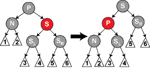


**操作**：P、S变色，并交换----相当于AVL中的右右中旋转即以P为中心S向左旋（或者是AVL中的左左中的旋转），未结束。

**解析**：我们知道P的左边少了一个黑节点，这样操作相当于在N头上又加了一个红节点----不违反任何性质，但是到通过N的路径仍少了一个黑节点，需要再把对N进行一次检索，并作相应的操作才可以平衡（暂且不管往下看）。

### 情形2：P、S及S的孩子们都为黑
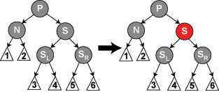

**操作**：S改为红色，未结束。  
**解析**：S变为红色后经过S节点的路径的黑节点数目也减少了1，那个从P出发到其叶子节点到所有路径所包含的黑节点数目（记为num）相等了。但是这个num比之前少了1，因为左右子树中的黑节点数目都减少了！一般地，P是他父节点G的一个孩子，那么由G到其叶子节点的黑节点数目就不相等了，所以说没有结束，需把P当做新的起始点开始向上检索。

### 情形3：P为红（S一定为黑），S的孩子们都为黑
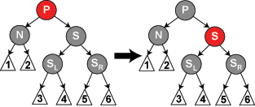

**操作**：P该为黑，S改为红，结束。

**解析**：这种情况最简单了，既然N这边少了一个黑节点，那么S这边就拿出了一个黑节点来共享一下，这样一来，S这边没少一个黑节点，而N这边便多了一个黑节点，这样就恢复了平衡  
 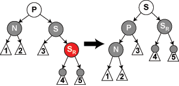

### 情形4：P任意色，S为黑，N是P的左孩子，S的右孩子SR为红，S的左孩子任意（或者是N是P的右孩子，S的左孩子为红，S的右孩子任意）
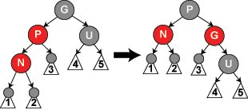

**操作**：SR（SL）改为黑，P改为黑，S改为P的颜色，P、S变换--这里相对应于AVL中的右右中的旋转（或者是AVL中的左左旋转），结束。  
**解析**：P、S旋转有变色，等于给N这边加了一个黑节点，P位置（是位置而不是P）的颜色不变，S这边少了一个黑节点；SR有红变黑，S这边又增加了一个黑节点；这样一来又恢复了平衡，结束。

### 情形5：P任意色，S为黑，N是P的左孩子，S的左孩子SL为红，S的右孩子SR为黑（或者N是P的有孩子，S的右孩子为红，S的左孩子为黑）
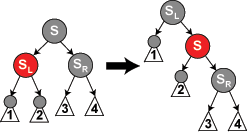

**操作**：SL（或SR）改为黑，S改为红，SL（SR）、S变换；此时就回到了情形4，SL（SR）变成了黑S，S变成了红SR（SL），做情形4的操作即可，这两次变换，其实就是对应AVL的右左的两次旋转（或者是AVL的左右的两次旋转）。  
**解析**：这种情况如果你按情形4的操作的话，由于SR本来就是黑色，你无法弥补由于P、S的变换（旋转）给S这边造成的损失！所以我没先对S、SL进行变换之后就变为情形4的情况了。

### 代码实现：
```cpp
//删除函数
bool Erase(const K& key)
{
    //用于遍历二叉树
    Node* parent = nullptr;
    Node* cur = _root;
    //用于标记实际的待删除结点及其父结点
    Node* delParentPos = nullptr;
    Node* delPos = nullptr;
    while (cur)
    {
        if (key < cur->_kv.first) //所给key值小于当前结点的key值
        {
            //往该结点的左子树走
            parent = cur;
            cur = cur->_left;
        }
        else if (key > cur->_kv.first) //所给key值大于当前结点的key值
        {
            //往该结点的右子树走
            parent = cur;
            cur = cur->_right;
        }
        else //找到了待删除结点
        {
            if (cur->_left == nullptr) //待删除结点的左子树为空
            {
                if (cur == _root) //待删除结点是根结点
                {
                    _root = _root->_right; //让根结点的右子树作为新的根结点
                    if (_root)
                    {
                        _root->_parent = nullptr;
                        _root->_col = BLACK; //根结点为黑色
                    }
                    delete cur; //删除原根结点
                    return true;
                }
                else
                {
                    delParentPos = parent; //标记实际删除结点的父结点
                    delPos = cur; //标记实际删除的结点
                }
                break; //进行红黑树的调整以及结点的实际删除
            }
            else if (cur->_right == nullptr) //待删除结点的右子树为空
            {
                if (cur == _root) //待删除结点是根结点
                {
                    _root = _root->_left; //让根结点的左子树作为新的根结点
                    if (_root)
                    {
                        _root->_parent = nullptr;
                        _root->_col = BLACK; //根结点为黑色
                    }
                    delete cur; //删除原根结点
                    return true;
                }
                else
                {
                    delParentPos = parent; //标记实际删除结点的父结点
                    delPos = cur; //标记实际删除的结点
                }
                break; //进行红黑树的调整以及结点的实际删除
            }
            else //待删除结点的左右子树均不为空
            {
                //替换法删除
                //寻找待删除结点右子树当中key值最小的结点作为实际删除结点
                Node* minParent = cur;
                Node* minRight = cur->_right;
                while (minRight->_left)
                {
                    minParent = minRight;
                    minRight = minRight->_left;
                }
                cur->_kv.first = minRight->_kv.first; //将待删除结点的key改为minRight的key
                cur->_kv.second = minRight->_kv.second; //将待删除结点的value改为minRight的value
                delParentPos = minParent; //标记实际删除结点的父结点
                delPos = minRight; //标记实际删除的结点
                break; //进行红黑树的调整以及结点的实际删除
            }
        }
    }
    if (delPos == nullptr) //delPos没有被修改过，说明没有找到待删除结点
    {
        return false;
    }

    //记录待删除结点及其父结点（用于后续实际删除）
    Node* del = delPos;
    Node* delP = delParentPos;

    //调整红黑树
    if (delPos->_col == BLACK) //删除的是黑色结点
    {
        if (delPos->_left) //待删除结点有一个红色的左孩子（不可能是黑色）
        {
            delPos->_left->_col = BLACK; //将这个红色的左孩子变黑即可
        }
        else if (delPos->_right) //待删除结点有一个红色的右孩子（不可能是黑色）
        {
            delPos->_right->_col = BLACK; //将这个红色的右孩子变黑即可
        }
        else //待删除结点的左右均为空
        {
            while (delPos != _root) //可能一直调整到根结点
            {
                if (delPos == delParentPos->_left) //待删除结点是其父结点的左孩子
                {
                    Node* brother = delParentPos->_right; //兄弟结点是其父结点的右孩子
                    //情况一：brother为红色
                    if (brother->_col == RED)
                    {
                        delParentPos->_col = RED;
                        brother->_col = BLACK;
                        RotateL(delParentPos);
                        //需要继续处理
                        brother = delParentPos->_right; //更新brother（否则在本循环中执行其他情况的代码会出错）
                    }
                    //情况二：brother为黑色，且其左右孩子都是黑色结点或为空
                    if (((brother->_left == nullptr) || (brother->_left->_col == BLACK))
                        && ((brother->_right == nullptr) || (brother->_right->_col == BLACK)))
                    {
                        brother->_col = RED;
                        if (delParentPos->_col == RED)
                        {
                            delParentPos->_col = BLACK;
                            break;
                        }
                        //需要继续处理
                        delPos = delParentPos;
                        delParentPos = delPos->_parent;
                    }
                    else
                    {
                        //情况三：brother为黑色，且其左孩子是红色结点，右孩子是黑色结点或为空
                        if ((brother->_right == nullptr) || (brother->_right->_col == BLACK))
                        {
                            brother->_left->_col = BLACK;
                            brother->_col = RED;
                            RotateR(brother);
                            //需要继续处理
                            brother = delParentPos->_right; //更新brother（否则执行下面情况四的代码会出错）
                        }
                        //情况四：brother为黑色，且其右孩子是红色结点
                        brother->_col = delParentPos->_col;
                        delParentPos->_col = BLACK;
                        brother->_right->_col = BLACK;
                        RotateL(delParentPos);
                        break; //情况四执行完毕后调整一定结束
                    }
                }
                else //delPos == delParentPos->_right //待删除结点是其父结点的左孩子
                {
                    Node* brother = delParentPos->_left; //兄弟结点是其父结点的左孩子
                    //情况一：brother为红色
                    if (brother->_col == RED) //brother为红色
                    {
                        delParentPos->_col = RED;
                        brother->_col = BLACK;
                        RotateR(delParentPos);
                        //需要继续处理
                        brother = delParentPos->_left; //更新brother（否则在本循环中执行其他情况的代码会出错）
                    }
                    //情况二：brother为黑色，且其左右孩子都是黑色结点或为空
                    if (((brother->_left == nullptr) || (brother->_left->_col == BLACK))
                        && ((brother->_right == nullptr) || (brother->_right->_col == BLACK)))
                    {
                        brother->_col = RED;
                        if (delParentPos->_col == RED)
                        {
                            delParentPos->_col = BLACK;
                            break;
                        }
                        //需要继续处理
                        delPos = delParentPos;
                        delParentPos = delPos->_parent;
                    }
                    else
                    {
                        //情况三：brother为黑色，且其右孩子是红色结点，左孩子是黑色结点或为空
                        if ((brother->_left == nullptr) || (brother->_left->_col == BLACK))
                        {
                            brother->_right->_col = BLACK;
                            brother->_col = RED;
                            RotateL(brother);
                            //需要继续处理
                            brother = delParentPos->_left; //更新brother（否则执行下面情况四的代码会出错）
                        }
                        //情况四：brother为黑色，且其左孩子是红色结点
                        brother->_col = delParentPos->_col;
                        delParentPos->_col = BLACK;
                        brother->_left->_col = BLACK;
                        RotateR(delParentPos);
                        break; //情况四执行完毕后调整一定结束
                    }
                }
            }
        }
    }
    //进行实际删除
    if (del->_left == nullptr) //实际删除结点的左子树为空
    {
        if (del == delP->_left) //实际删除结点是其父结点的左孩子
        {
            delP->_left = del->_right;
            if (del->_right)
                del->_right->_parent = delP;
        }
        else //实际删除结点是其父结点的右孩子
        {
            delP->_right = del->_right;
            if (del->_right)
                del->_right->_parent = delP;
        }
    }
    else //实际删除结点的右子树为空
    {
        if (del == delP->_left) //实际删除结点是其父结点的左孩子
        {
            delP->_left = del->_left;
            if (del->_left)
                del->_left->_parent = delP;
        }
        else //实际删除结点是其父结点的右孩子
        {
            delP->_right = del->_left;
            if (del->_left)
                del->_left->_parent = delP;
        }
    }
    delete del; //实际删除结点
    return true;
}
```

## 实现红黑树：
```cpp
#pragma once
#include<iostream>

using namespace std;
//枚举定义结点的颜色
enum Colour
{
    RED,
    BLACK
};

//红黑树结点的定义
template<class K, class V>
struct RBTreeNode
{
    //三叉链
    RBTreeNode<K, V>* _left;
    RBTreeNode<K, V>* _right;
    RBTreeNode<K, V>* _parent;

    //存储的键值对
    pair<K, V> _kv;

    //结点的颜色
    Colour _col; //红/黑

    //构造函数
    RBTreeNode(const pair<K, V>& kv)
        :_left(nullptr)
        , _right(nullptr)
        , _parent(nullptr)
        , _kv(kv)
        , _col(RED)
    {}
};

//红黑树的实现
template<class K, class V>
class RBTree
{
    typedef RBTreeNode<K, V> Node;
public:
    //构造函数
    RBTree()
        :_root(nullptr)
    {}

    //拷贝构造
    RBTree(const RBTree<K, V>& t)
    {
        _root = _Copy(t._root, nullptr);
    }

    //赋值运算符重载（现代写法）
    RBTree<K, V>& operator=(RBTree<K, V> t)
    {
        swap(_root, t._root);
        return *this;
    }

    //析构函数
    ~RBTree()
    {
        _Destroy(_root);
        _root = nullptr;
    }

    //查找函数
    Node* Find(const K& key)
    {
        Node* cur = _root;
        while (cur)
        {
            if (key < cur->_kv.first) //key值小于该结点的值
            {
                cur = cur->_left; //在该结点的左子树当中查找
            }
            else if (key > cur->_kv.first) //key值大于该结点的值
            {
                cur = cur->_right; //在该结点的右子树当中查找
            }
            else //找到了目标结点
            {
                return cur; //返回该结点
            }
        }
        return nullptr; //查找失败
    }

    //插入函数
    pair<Node*, bool> Insert(const pair<K, V>& kv)
    {
        if (_root == nullptr) //若红黑树为空树，则插入结点直接作为根结点
        {
            _root = new Node(kv);
            _root->_col = BLACK; //根结点必须是黑色
            return make_pair(_root, true); //插入成功
        }
        //1、按二叉搜索树的插入方法，找到待插入位置
        Node* cur = _root;
        Node* parent = nullptr;
        while (cur)
        {
            if (kv.first < cur->_kv.first) //待插入结点的key值小于当前结点的key值
            {
                //往该结点的左子树走
                parent = cur;
                cur = cur->_left;
            }
            else if (kv.first > cur->_kv.first) //待插入结点的key值大于当前结点的key值
            {
                //往该结点的右子树走
                parent = cur;
                cur = cur->_right;
            }
            else //待插入结点的key值等于当前结点的key值
            {
                return make_pair(cur, false); //插入失败
            }
        }

        //2、将待插入结点插入到树中
        cur = new Node(kv); //根据所给值构造一个结点
        Node* newnode = cur; //记录新插入的结点（便于后序返回）
        if (kv.first < parent->_kv.first) //新结点的key值小于parent的key值
        {
            //插入到parent的左边
            parent->_left = cur;
            cur->_parent = parent;
        }
        else //新结点的key值大于parent的key值
        {
            //插入到parent的右边
            parent->_right = cur;
            cur->_parent = parent;
        }

        //3、若插入结点的父结点是红色的，则需要对红黑树进行调整
        while (parent && parent->_col == RED)
        {
            Node* grandfather = parent->_parent; //parent是红色，则其父结点一定存在
            if (parent == grandfather->_left) //parent是grandfather的左孩子
            {
                Node* uncle = grandfather->_right; //uncle是grandfather的右孩子
                if (uncle && uncle->_col == RED) //情况1：uncle存在且为红
                {
                    //颜色调整
                    parent->_col = uncle->_col = BLACK;
                    grandfather->_col = RED;

                    //继续往上处理
                    cur = grandfather;
                    parent = cur->_parent;
                }
                else //情况2+情况3：uncle不存在 + uncle存在且为黑
                {
                    if (cur == parent->_left)
                    {
                        RotateR(grandfather); //右单旋

                        //颜色调整
                        grandfather->_col = RED;
                        parent->_col = BLACK;
                    }
                    else //cur == parent->_right
                    {
                        RotateLR(grandfather); //左右双旋

                        //颜色调整
                        grandfather->_col = RED;
                        cur->_col = BLACK;
                    }
                    break; //子树旋转后，该子树的根变成了黑色，无需继续往上进行处理
                }
            }
            else //parent是grandfather的右孩子
            {
                Node* uncle = grandfather->_left; //uncle是grandfather的左孩子
                if (uncle && uncle->_col == RED) //情况1：uncle存在且为红
                {
                    //颜色调整
                    uncle->_col = parent->_col = BLACK;
                    grandfather->_col = RED;

                    //继续往上处理
                    cur = grandfather;
                    parent = cur->_parent;
                }
                else //情况2+情况3：uncle不存在 + uncle存在且为黑
                {
                    if (cur == parent->_left)
                    {
                        RotateRL(grandfather); //右左双旋

                        //颜色调整
                        cur->_col = BLACK;
                        grandfather->_col = RED;
                    }
                    else //cur == parent->_right
                    {
                        RotateL(grandfather); //左单旋

                        //颜色调整
                        grandfather->_col = RED;
                        parent->_col = BLACK;
                    }
                    break; //子树旋转后，该子树的根变成了黑色，无需继续往上进行处理
                }
            }
        }
        _root->_col = BLACK; //根结点的颜色为黑色（可能被情况一变成了红色，需要变回黑色）
        return make_pair(newnode, true); //插入成功
    }

    //删除函数
    bool Erase(const K& key)
    {
        //用于遍历二叉树
        Node* parent = nullptr;
        Node* cur = _root;
        //用于标记实际的待删除结点及其父结点
        Node* delParentPos = nullptr;
        Node* delPos = nullptr;
        while (cur)
        {
            if (key < cur->_kv.first) //所给key值小于当前结点的key值
            {
                //往该结点的左子树走
                parent = cur;
                cur = cur->_left;
            }
            else if (key > cur->_kv.first) //所给key值大于当前结点的key值
            {
                //往该结点的右子树走
                parent = cur;
                cur = cur->_right;
            }
            else //找到了待删除结点
            {
                if (cur->_left == nullptr) //待删除结点的左子树为空
                {
                    if (cur == _root) //待删除结点是根结点
                    {
                        _root = _root->_right; //让根结点的右子树作为新的根结点
                        if (_root)
                        {
                            _root->_parent = nullptr;
                            _root->_col = BLACK; //根结点为黑色
                        }
                        delete cur; //删除原根结点
                        return true;
                    }
                    else
                    {
                        delParentPos = parent; //标记实际删除结点的父结点
                        delPos = cur; //标记实际删除的结点
                    }
                    break; //进行红黑树的调整以及结点的实际删除
                }
                else if (cur->_right == nullptr) //待删除结点的右子树为空
                {
                    if (cur == _root) //待删除结点是根结点
                    {
                        _root = _root->_left; //让根结点的左子树作为新的根结点
                        if (_root)
                        {
                            _root->_parent = nullptr;
                            _root->_col = BLACK; //根结点为黑色
                        }
                        delete cur; //删除原根结点
                        return true;
                    }
                    else
                    {
                        delParentPos = parent; //标记实际删除结点的父结点
                        delPos = cur; //标记实际删除的结点
                    }
                    break; //进行红黑树的调整以及结点的实际删除
                }
                else //待删除结点的左右子树均不为空
                {
                    //替换法删除
                    //寻找待删除结点右子树当中key值最小的结点作为实际删除结点
                    Node* minParent = cur;
                    Node* minRight = cur->_right;
                    while (minRight->_left)
                    {
                        minParent = minRight;
                        minRight = minRight->_left;
                    }
                    cur->_kv.first = minRight->_kv.first; //将待删除结点的key改为minRight的key
                    cur->_kv.second = minRight->_kv.second; //将待删除结点的value改为minRight的value
                    delParentPos = minParent; //标记实际删除结点的父结点
                    delPos = minRight; //标记实际删除的结点
                    break; //进行红黑树的调整以及结点的实际删除
                }
            }
        }
        if (delPos == nullptr) //delPos没有被修改过，说明没有找到待删除结点
        {
            return false;
        }

        //记录待删除结点及其父结点（用于后续实际删除）
        Node* del = delPos;
        Node* delP = delParentPos;

        //调整红黑树
        if (delPos->_col == BLACK) //删除的是黑色结点
        {
            if (delPos->_left) //待删除结点有一个红色的左孩子（不可能是黑色）
            {
                delPos->_left->_col = BLACK; //将这个红色的左孩子变黑即可
            }
            else if (delPos->_right) //待删除结点有一个红色的右孩子（不可能是黑色）
            {
                delPos->_right->_col = BLACK; //将这个红色的右孩子变黑即可
            }
            else //待删除结点的左右均为空
            {
                while (delPos != _root) //可能一直调整到根结点
                {
                    if (delPos == delParentPos->_left) //待删除结点是其父结点的左孩子
                    {
                        Node* brother = delParentPos->_right; //兄弟结点是其父结点的右孩子
                        //情况一：brother为红色
                        if (brother->_col == RED)
                        {
                            delParentPos->_col = RED;
                            brother->_col = BLACK;
                            RotateL(delParentPos);
                            //需要继续处理
                            brother = delParentPos->_right; //更新brother（否则在本循环中执行其他情况的代码会出错）
                        }
                        //情况二：brother为黑色，且其左右孩子都是黑色结点或为空
                        if (((brother->_left == nullptr) || (brother->_left->_col == BLACK))
                            && ((brother->_right == nullptr) || (brother->_right->_col == BLACK)))
                        {
                            brother->_col = RED;
                            if (delParentPos->_col == RED)
                            {
                                delParentPos->_col = BLACK;
                                break;
                            }
                            //需要继续处理
                            delPos = delParentPos;
                            delParentPos = delPos->_parent;
                        }
                        else
                        {
                            //情况三：brother为黑色，且其左孩子是红色结点，右孩子是黑色结点或为空
                            if ((brother->_right == nullptr) || (brother->_right->_col == BLACK))
                            {
                                brother->_left->_col = BLACK;
                                brother->_col = RED;
                                RotateR(brother);
                                //需要继续处理
                                brother = delParentPos->_right; //更新brother（否则执行下面情况四的代码会出错）
                            }
                            //情况四：brother为黑色，且其右孩子是红色结点
                            brother->_col = delParentPos->_col;
                            delParentPos->_col = BLACK;
                            brother->_right->_col = BLACK;
                            RotateL(delParentPos);
                            break; //情况四执行完毕后调整一定结束
                        }
                    }
                    else //delPos == delParentPos->_right //待删除结点是其父结点的左孩子
                    {
                        Node* brother = delParentPos->_left; //兄弟结点是其父结点的左孩子
                        //情况一：brother为红色
                        if (brother->_col == RED) //brother为红色
                        {
                            delParentPos->_col = RED;
                            brother->_col = BLACK;
                            RotateR(delParentPos);
                            //需要继续处理
                            brother = delParentPos->_left; //更新brother（否则在本循环中执行其他情况的代码会出错）
                        }
                        //情况二：brother为黑色，且其左右孩子都是黑色结点或为空
                        if (((brother->_left == nullptr) || (brother->_left->_col == BLACK))
                            && ((brother->_right == nullptr) || (brother->_right->_col == BLACK)))
                        {
                            brother->_col = RED;
                            if (delParentPos->_col == RED)
                            {
                                delParentPos->_col = BLACK;
                                break;
                            }
                            //需要继续处理
                            delPos = delParentPos;
                            delParentPos = delPos->_parent;
                        }
                        else
                        {
                            //情况三：brother为黑色，且其右孩子是红色结点，左孩子是黑色结点或为空
                            if ((brother->_left == nullptr) || (brother->_left->_col == BLACK))
                            {
                                brother->_right->_col = BLACK;
                                brother->_col = RED;
                                RotateL(brother);
                                //需要继续处理
                                brother = delParentPos->_left; //更新brother（否则执行下面情况四的代码会出错）
                            }
                            //情况四：brother为黑色，且其左孩子是红色结点
                            brother->_col = delParentPos->_col;
                            delParentPos->_col = BLACK;
                            brother->_left->_col = BLACK;
                            RotateR(delParentPos);
                            break; //情况四执行完毕后调整一定结束
                        }
                    }
                }
            }
        }
        //进行实际删除
        if (del->_left == nullptr) //实际删除结点的左子树为空
        {
            if (del == delP->_left) //实际删除结点是其父结点的左孩子
            {
                delP->_left = del->_right;
                if (del->_right)
                    del->_right->_parent = delP;
            }
            else //实际删除结点是其父结点的右孩子
            {
                delP->_right = del->_right;
                if (del->_right)
                    del->_right->_parent = delP;
            }
        }
        else //实际删除结点的右子树为空
        {
            if (del == delP->_left) //实际删除结点是其父结点的左孩子
            {
                delP->_left = del->_left;
                if (del->_left)
                    del->_left->_parent = delP;
            }
            else //实际删除结点是其父结点的右孩子
            {
                delP->_right = del->_left;
                if (del->_left)
                    del->_left->_parent = delP;
            }
        }
        delete del; //实际删除结点
        return true;
    }

    // 中序遍历
    void InOrder()
    {
        _InOrder(_root);
        cout << endl;
    }
    
    // 检查是否为红黑树
    bool IsBalance()
    {
        if (_root == nullptr)
            return true;

        if (_root->_col == RED)
            return false;

        //参考值
        int refVal = 0;
        Node* cur = _root;
        while (cur)
        {
            if (cur->_col == BLACK)
            {
                ++refVal;
            }

            cur = cur->_left;
        }

        int blacknum = 0;
        return Check(_root, blacknum, refVal);
    }

private:
    //拷贝树
    Node* _Copy(Node* root, Node* parent)
    {
        if (root == nullptr)
        {
            return nullptr;
        }
        Node* copyNode = new Node(root->_data);
        copyNode->_parent = parent;
        copyNode->_left = _Copy(root->_left, copyNode);
        copyNode->_right = _Copy(root->_right, copyNode);
        return copyNode;
    }

    //析构函数子函数
    void _Destroy(Node* root)
    {
        if (root == nullptr)
        {
            return;
        }
        _Destroy(root->_left);
        _Destroy(root->_right);
        delete root;
    }

    //左单旋
    void RotateL(Node* parent)
    {
        Node* subR = parent->_right;
        Node* subRL = subR->_left;
        Node* parentParent = parent->_parent;

        //建立subRL与parent之间的联系
        parent->_right = subRL;
        if (subRL)
            subRL->_parent = parent;

        //建立parent与subR之间的联系
        subR->_left = parent;
        parent->_parent = subR;

        //建立subR与parentParent之间的联系
        if (parentParent == nullptr)
        {
            _root = subR;
            _root->_parent = nullptr;
        }
        else
        {
            if (parent == parentParent->_left)
            {
                parentParent->_left = subR;
            }
            else
            {
                parentParent->_right = subR;
            }
            subR->_parent = parentParent;
        }
    }

    //右单旋
    void RotateR(Node* parent)
    {
        Node* subL = parent->_left;
        Node* subLR = subL->_right;
        Node* parentParent = parent->_parent;

        //建立subLR与parent之间的联系
        parent->_left = subLR;
        if (subLR)
            subLR->_parent = parent;

        //建立parent与subL之间的联系
        subL->_right = parent;
        parent->_parent = subL;

        //建立subL与parentParent之间的联系
        if (parentParent == nullptr)
        {
            _root = subL;
            _root->_parent = nullptr;
        }
        else
        {
            if (parent == parentParent->_left)
            {
                parentParent->_left = subL;
            }
            else
            {
                parentParent->_right = subL;
            }
            subL->_parent = parentParent;
        }
    }

    //左右双旋
    void RotateLR(Node* parent)
    {
        RotateL(parent->_left);
        RotateR(parent);
    }

    //右左双旋
    void RotateRL(Node* parent)
    {
        RotateR(parent->_right);
        RotateL(parent);
    }

    // 根节点->当前节点这条路径的黑色节点的数量
    bool Check(Node* root, int blacknum, const int refVal)
    {
        if (root == nullptr)
        {
            //cout << balcknum << endl;
            if (blacknum != refVal)
            {
                cout << "存在黑色节点数量不相等的路径" << endl;
                return false;
            }

            return true;
        }

        if (root->_col == RED && root->_parent && root->_parent->_col == RED)
        {
            cout << "有连续的红色节点" << endl;

            return false;
        }

        if (root->_col == BLACK)
        {
            ++blacknum;
        }

        return Check(root->_left, blacknum, refVal)
            && Check(root->_right, blacknum, refVal);
    }

    // 中序遍历
    void _InOrder(Node* root)
    {
        if (root == nullptr)
            return;

        _InOrder(root->_left);
        cout << root->_kv.first << " ";
        _InOrder(root->_right);
    }

    Node* _root; //红黑树的根结点
};
```

## 测试红黑树：
```cpp
#include "RBTree.h"
#include <vector>

// 测试代码
void TestRBTree1()
{
	RBTree<int, int> t;
	// 常规的测试用例
	//int a[] = { 16, 3, 7, 11, 9, 26, 18, 14, 15 };
	// 特殊的带有双旋场景的测试用例
	int a[] = { 4, 2, 6, 1, 3, 5, 15, 7, 16, 14 };
	for (auto e : a)
	{
		t.Insert({ e, e });
	}
	t.InOrder();
	cout << t.IsBalance() << endl;
}

void TestRBTree2()
{
	const int N = 100000000;
	std::vector<int> v;
	v.reserve(N);
	srand((unsigned int)time(0));

	for (size_t i = 0; i < N; i++)
	{
		v.push_back(rand() + i);
	}

	RBTree<int, int> t;
	for (size_t i = 0; i < v.size(); ++i)
	{
		t.Insert(make_pair(v[i], v[i]));
	}
	cout << t.IsBalance() << endl;
}

int main()
{
    // TestRBTree1();
	TestRBTree2();
	return 0;
}
```

## 红黑树与AVL树的比较
+ 红黑树和AVL树都是高效的平衡二叉树，增删改查的时间复杂度都是O()，红黑树不追求绝对平衡，其只需保证最长路径不超过最短路径的2倍，相对而言，降低了插入和旋转的次数，
+ 所以在经常进行增删的结构中性能比AVL树更优，而且红黑树实现比较简单，所以实际运用中红黑树更多。

## Linux下红黑树源码：
Linux版本为：`linux-2.6.18`

### rbtree.h
```c
/*
  Red Black Trees
  (C) 1999  Andrea Arcangeli <andrea@suse.de>
  
  This program is free software; you can redistribute it and/or modify
  it under the terms of the GNU General Public License as published by
  the Free Software Foundation; either version 2 of the License, or
  (at your option) any later version.

  This program is distributed in the hope that it will be useful,
  but WITHOUT ANY WARRANTY; without even the implied warranty of
  MERCHANTABILITY or FITNESS FOR A PARTICULAR PURPOSE.  See the
  GNU General Public License for more details.

  You should have received a copy of the GNU General Public License
  along with this program; if not, write to the Free Software
  Foundation, Inc., 59 Temple Place, Suite 330, Boston, MA  02111-1307  USA

  linux/include/linux/rbtree.h

  To use rbtrees you'll have to implement your own insert and search cores.
  This will avoid us to use callbacks and to drop drammatically performances.
  I know it's not the cleaner way,  but in C (not in C++) to get
  performances and genericity...

  Some example of insert and search follows here. The search is a plain
  normal search over an ordered tree. The insert instead must be implemented
  int two steps: as first thing the code must insert the element in
  order as a red leaf in the tree, then the support library function
  rb_insert_color() must be called. Such function will do the
  not trivial work to rebalance the rbtree if necessary.

-----------------------------------------------------------------------
static inline struct page * rb_search_page_cache(struct inode * inode,
						 unsigned long offset)
{
	struct rb_node * n = inode->i_rb_page_cache.rb_node;
	struct page * page;

	while (n)
	{
		page = rb_entry(n, struct page, rb_page_cache);

		if (offset < page->offset)
			n = n->rb_left;
		else if (offset > page->offset)
			n = n->rb_right;
		else
			return page;
	}
	return NULL;
}

static inline struct page * __rb_insert_page_cache(struct inode * inode,
						   unsigned long offset,
						   struct rb_node * node)
{
	struct rb_node ** p = &inode->i_rb_page_cache.rb_node;
	struct rb_node * parent = NULL;
	struct page * page;

	while (*p)
	{
		parent = *p;
		page = rb_entry(parent, struct page, rb_page_cache);

		if (offset < page->offset)
			p = &(*p)->rb_left;
		else if (offset > page->offset)
			p = &(*p)->rb_right;
		else
			return page;
	}

	rb_link_node(node, parent, p);

	return NULL;
}

static inline struct page * rb_insert_page_cache(struct inode * inode,
						 unsigned long offset,
						 struct rb_node * node)
{
	struct page * ret;
	if ((ret = __rb_insert_page_cache(inode, offset, node)))
		goto out;
	rb_insert_color(node, &inode->i_rb_page_cache);
 out:
	return ret;
}
-----------------------------------------------------------------------
*/

#ifndef	_LINUX_RBTREE_H
#define	_LINUX_RBTREE_H

#include <linux/kernel.h>
#include <linux/stddef.h>

struct rb_node
{
	unsigned long  rb_parent_color;
#define	RB_RED		0
#define	RB_BLACK	1
	struct rb_node *rb_right;
	struct rb_node *rb_left;
} __attribute__((aligned(sizeof(long))));
    /* The alignment might seem pointless, but allegedly CRIS needs it */

struct rb_root
{
	struct rb_node *rb_node;
};


#define rb_parent(r)   ((struct rb_node *)((r)->rb_parent_color & ~3))
#define rb_color(r)   ((r)->rb_parent_color & 1)
#define rb_is_red(r)   (!rb_color(r))
#define rb_is_black(r) rb_color(r)
#define rb_set_red(r)  do { (r)->rb_parent_color &= ~1; } while (0)
#define rb_set_black(r)  do { (r)->rb_parent_color |= 1; } while (0)

static inline void rb_set_parent(struct rb_node *rb, struct rb_node *p)
{
	rb->rb_parent_color = (rb->rb_parent_color & 3) | (unsigned long)p;
}
static inline void rb_set_color(struct rb_node *rb, int color)
{
	rb->rb_parent_color = (rb->rb_parent_color & ~1) | color;
}

#define RB_ROOT	(struct rb_root) { NULL, }
#define	rb_entry(ptr, type, member) container_of(ptr, type, member)

#define RB_EMPTY_ROOT(root)	((root)->rb_node == NULL)
#define RB_EMPTY_NODE(node)	(rb_parent(node) != node)
#define RB_CLEAR_NODE(node)	(rb_set_parent(node, node))

extern void rb_insert_color(struct rb_node *, struct rb_root *);
extern void rb_erase(struct rb_node *, struct rb_root *);

/* Find logical next and previous nodes in a tree */
extern struct rb_node *rb_next(struct rb_node *);
extern struct rb_node *rb_prev(struct rb_node *);
extern struct rb_node *rb_first(struct rb_root *);
extern struct rb_node *rb_last(struct rb_root *);

/* Fast replacement of a single node without remove/rebalance/add/rebalance */
extern void rb_replace_node(struct rb_node *victim, struct rb_node *new, 
			    struct rb_root *root);

static inline void rb_link_node(struct rb_node * node, struct rb_node * parent,
				struct rb_node ** rb_link)
{
	node->rb_parent_color = (unsigned long )parent;
	node->rb_left = node->rb_right = NULL;

	*rb_link = node;
}

#endif	/* _LINUX_RBTREE_H */
```

### rbtree.c
这个文件增加了一些注释：

```c
/*
 * Red Black Trees
 * (C) 1999 Andrea Arcangeli <andrea@suse.de>
 * (C) 2002 David Woodhouse <dwmw2@infradead.org>
 * (C) 2012 Michel Lespinasse <walken@google.com>
 * This program is free software; you can redistribute it and/or modify
 * it under the terms of the GNU General Public License as published by
 * the Free Software Foundation; either version 2 of the License, or
 * (at your option) any later version.
 * ...
 * linux/lib/rbtree.c
 */
#include <linux/rbtree_augmented.h>
#include <linux/export.h>
/*
 * red-black trees properties: http://en.wikipedia.org/wiki/Rbtree
 *
 * 1) A node is either red or black
 * 2) The root is black
 * 3) All leaves (NULL) are black
 * 4) Both children of every red node are black
 * 5) Every simple path from root to leaves contains the same number
 *    of black nodes.
 *
 * 4 and 5 give the O(log n) guarantee, since 4 implies you cannot have two
 * consecutive red nodes in a path and every red node is therefore followed by
 * a black. So if B is the number of black nodes on every simple path (as per
 * 5), then the longest possible path due to 4 is 2B.
 *
 * We shall indicate color with case, where black nodes are uppercase and red
 * nodes will be lowercase. Unknown color nodes shall be drawn as red within
 * parentheses and have some accompanying text comment.
 *
 * ------------------------------------------------------------------------
 * 红黑树性质简述：参见 http://en.wikipedia.org/wiki/Rbtree
 * 1) 节点要么是红色要么是黑色。
 * 2) 根节点必须是黑色。
 * 3) 所有叶节点（NULL）都是黑色。
 * 4) 每个红色节点的两个子节点都是黑色。
 * 5) 从根到每个叶节点的路径上，包含相同数量的黑色节点。
 * 这些性质保证了树的平衡，使得插入/删除等操作的时间复杂度为 O(log n)。
 * ------------------------------------------------------------------------
 */

/*
 * Notes on lockless lookups:
 * 
 * All stores to the tree structure (rb_left and rb_right) must be done using
 * WRITE_ONCE(). And we must not inadvertently cause (temporary) loops in the
 * tree structure as seen in program order.
 * ...
 */

/* 将给定节点标记为黑色（在父指针/颜色字段中设置黑色位） */
static inline void rb_set_black(struct rb_node *rb)
{
    rb->__rb_parent_color |= RB_BLACK;
}

/* 对于红色节点，从 __rb_parent_color 字段获取其父指针 */
static inline struct rb_node *rb_red_parent(struct rb_node *red)
{
    return (struct rb_node *)red->__rb_parent_color;
}

/*
 * 旋转辅助函数：
 * - 将 old 的父节点和颜色信息复制给 new。
 * - 将 old 的父节点设置为 new，并为 old 设定新的颜色。
 */
static inline void
__rb_rotate_set_parents(struct rb_node *old, struct rb_node *new,
                        struct rb_root *root, int color)
{
    struct rb_node *parent = rb_parent(old);
    new->__rb_parent_color = old->__rb_parent_color;
    rb_set_parent_color(old, new, color);
    __rb_change_child(old, new, parent, root);
}

/*
 * 插入修正：插入节点后，根据红黑树规则进行颜色旋转修复
 * 参数：
 *   node - 新插入的节点（假设已设置为红色并插入到树中）
 *   root - 树的根节点
 *   augment_rotate - 用于增强红黑树的旋转回调函数
 */
static __always_inline void
__rb_insert(struct rb_node *node, struct rb_root *root,
            void (*augment_rotate)(struct rb_node *old, struct rb_node *new))
{
    /* parent 初始为 node 的父节点，node 默认假设为红色 */
    struct rb_node *parent = rb_red_parent(node), *gparent, *tmp;

    while (true) {
        /*
         * 循环不变式：当前处理的节点 node 是红色。
         * 如果父节点是黑色或节点为根节点，则当前红黑性质已经满足，无需调整。
         * 如果父节点是红色，则需要做出调整，以免出现连续红色节点或红根。
         */
        if (!parent) {
            /* 如果没有父节点，说明 node 是根节点，将其染成黑色 */
            rb_set_parent_color(node, NULL, RB_BLACK);
            break;
        } else if (rb_is_black(parent)) {
            /* 如果父节点已是黑色，符合性质，退出循环 */
            break;
        }

        /* 此时 parent 是红色，获取祖父节点 */
        gparent = rb_red_parent(parent);

        /* 临时节点 tmp 用于指向祖父节点的右子 */
        tmp = gparent->rb_right;

        if (parent != tmp) { /* parent == gparent->rb_left，也就是 parent 在左子 */
            /*
             * 处理情况：父节点 parent 是祖父 gparent 的左孩子
             */
            if (tmp && rb_is_red(tmp)) {
                /* 情况 1 - 父节点和叔节点都是红色（颜色翻转） */
                rb_set_parent_color(tmp, gparent, RB_BLACK);
                rb_set_parent_color(parent, gparent, RB_BLACK);
                /* 将 gparent 变为红色后，继续向上调整 */
                node = gparent;
                parent = rb_parent(node);
                rb_set_parent_color(node, parent, RB_RED);
                continue;
            }
            /* 父节点是左孩子但叔节点不是红色 */
            tmp = parent->rb_right;
            if (node == tmp) {
                /* 情况 2 - 当前节点是父节点的右孩子，对父节点做左旋转 */
                tmp = node->rb_left;
                WRITE_ONCE(parent->rb_right, tmp);
                WRITE_ONCE(node->rb_left, parent);
                if (tmp)
                    /* 将原本挂在 node 左的子树链接回 parent */
                    rb_set_parent_color(tmp, parent, RB_BLACK);
                /* 将 parent 染红，node 染黑，完成一次旋转 */
                rb_set_parent_color(parent, node, RB_RED);
                augment_rotate(parent, node);
                parent = node;
                tmp = node->rb_right;
            }
            /* 情况 3 - 对祖父节点做右旋转 */
            WRITE_ONCE(gparent->rb_left, tmp); /* == parent->rb_right */
            WRITE_ONCE(parent->rb_right, gparent);
            if (tmp)
                rb_set_parent_color(tmp, gparent, RB_BLACK);
            /* 将 parent 拓展到上层，修正颜色 */
            __rb_rotate_set_parents(gparent, parent, root, RB_RED);
            augment_rotate(gparent, parent);
            break;
        } else {
            /*
             * 处理对称情况：父节点 parent 是祖父 gparent 的右孩子
             */
            tmp = gparent->rb_left;
            if (tmp && rb_is_red(tmp)) {
                /* 情况 1 - 父节点和叔节点都是红色（颜色翻转） */
                rb_set_parent_color(tmp, gparent, RB_BLACK);
                rb_set_parent_color(parent, gparent, RB_BLACK);
                node = gparent;
                parent = rb_parent(node);
                rb_set_parent_color(node, parent, RB_RED);
                continue;
            }
            tmp = parent->rb_left;
            if (node == tmp) {
                /* 情况 2 - 当前节点是父节点的左孩子，对父节点做右旋转 */
                tmp = node->rb_right;
                WRITE_ONCE(parent->rb_left, tmp);
                WRITE_ONCE(node->rb_right, parent);
                if (tmp)
                    rb_set_parent_color(tmp, parent, RB_BLACK);
                rb_set_parent_color(parent, node, RB_RED);
                augment_rotate(parent, node);
                parent = node;
                tmp = node->rb_left;
            }
            /* 情况 3 - 对祖父节点做左旋转 */
            WRITE_ONCE(gparent->rb_right, tmp); /* == parent->rb_left */
            WRITE_ONCE(parent->rb_left, gparent);
            if (tmp)
                rb_set_parent_color(tmp, gparent, RB_BLACK);
            __rb_rotate_set_parents(gparent, parent, root, RB_RED);
            augment_rotate(gparent, parent);
            break;
        }
    }
}

/*
 * 删除修正（内联版本）：删除节点后恢复红黑树性质
 * 参数：
 *   parent - 当前处理的父节点
 *   root   - 红黑树的根
 *   augment_rotate - 旋转时调用的回调函数（用于增强树）
 */
static __always_inline void
____rb_erase_color(struct rb_node *parent, struct rb_root *root,
                   void (*augment_rotate)(struct rb_node *old, struct rb_node *new))
{
    struct rb_node *node = NULL, *sibling, *tmp1, *tmp2;
    while (true) {
        /*
         * 循环不变式：
         * - 当前 node 是黑色（第一次迭代时 node 为 NULL）
         * - 当前 node 不是根节点（parent 不为空）
         * - 由于删除操作，经过 parent 的路径比其他路径少一个黑色节点
         */
        sibling = parent->rb_right;
        if (node != sibling) { /* node 是 parent 的左孩子 */
            if (rb_is_red(sibling)) {
                /* 情况 1 - 兄弟节点是红色：对 parent 做左旋转 */
                tmp1 = sibling->rb_left;
                WRITE_ONCE(parent->rb_right, tmp1);
                WRITE_ONCE(sibling->rb_left, parent);
                if (tmp1)
                    rb_set_parent_color(tmp1, parent, RB_BLACK);
                __rb_rotate_set_parents(parent, sibling, root, RB_RED);
                augment_rotate(parent, sibling);
                sibling = tmp1;
            }
            tmp1 = sibling->rb_right;
            if (!tmp1 || rb_is_black(tmp1)) {
                tmp2 = sibling->rb_left;
                if (!tmp2 || rb_is_black(tmp2)) {
                    /* 情况 2 - 兄弟节点及其子节点都是黑色：兄弟染红 */
                    rb_set_parent_color(sibling, parent, RB_RED);
                    if (rb_is_red(parent)) {
                        /* 如果 parent 是红色，将 parent 染黑，修复高度 */
                        rb_set_black(parent);
                    } else {
                        /* 否则，将问题向上移到 parent */
                        node = parent;
                        parent = rb_parent(node);
                        if (parent)
                            continue;
                    }
                    break;
                }
                /* 情况 3 - 兄弟左孩子为红色：先对兄弟做右旋 */
                tmp1 = tmp2->rb_right;
                WRITE_ONCE(sibling->rb_left, tmp1);
                WRITE_ONCE(tmp2->rb_right, sibling);
                WRITE_ONCE(parent->rb_right, tmp2);
                if (tmp1)
                    rb_set_parent_color(tmp1, sibling, RB_BLACK);
                augment_rotate(sibling, tmp2);
                tmp1 = sibling;
                sibling = tmp2;
            }
            /* 情况 4 - 对 parent 做左旋并颜色翻转 */
            tmp2 = sibling->rb_left;
            WRITE_ONCE(parent->rb_right, tmp2);
            WRITE_ONCE(sibling->rb_left, parent);
            rb_set_parent_color(tmp1, sibling, RB_BLACK);
            if (tmp2)
                rb_set_parent(tmp2, parent);
            __rb_rotate_set_parents(parent, sibling, root, RB_BLACK);
            augment_rotate(parent, sibling);
            break;
        } else {  /* node 是 parent 的右孩子 */
            sibling = parent->rb_left;
            if (rb_is_red(sibling)) {
                /* 情况 1（对称） - 兄弟节点是红色：对 parent 做右旋 */
                tmp1 = sibling->rb_right;
                WRITE_ONCE(parent->rb_left, tmp1);
                WRITE_ONCE(sibling->rb_right, parent);
                if (tmp1)
                    rb_set_parent_color(tmp1, parent, RB_BLACK);
                __rb_rotate_set_parents(parent, sibling, root, RB_RED);
                augment_rotate(parent, sibling);
                sibling = tmp1;
            }
            tmp1 = sibling->rb_left;
            if (!tmp1 || rb_is_black(tmp1)) {
                tmp2 = sibling->rb_right;
                if (!tmp2 || rb_is_black(tmp2)) {
                    /* 情况 2（对称） - 兄弟节点及其子节点都是黑色：兄弟染红 */
                    rb_set_parent_color(sibling, parent, RB_RED);
                    if (rb_is_red(parent)) {
                        rb_set_black(parent);
                    } else {
                        node = parent;
                        parent = rb_parent(node);
                        if (parent)
                            continue;
                    }
                    break;
                }
                /* 情况 3（对称） - 兄弟右孩子为红色：先对兄弟做左旋 */
                tmp1 = tmp2->rb_left;
                WRITE_ONCE(sibling->rb_right, tmp1);
                WRITE_ONCE(tmp2->rb_left, sibling);
                WRITE_ONCE(parent->rb_left, tmp2);
                if (tmp1)
                    rb_set_parent_color(tmp1, sibling, RB_BLACK);
                augment_rotate(sibling, tmp2);
                tmp1 = sibling;
                sibling = tmp2;
            }
            /* 情况 4（对称） - 对 parent 做右旋并颜色翻转 */
            tmp2 = sibling->rb_right;
            WRITE_ONCE(parent->rb_left, tmp2);
            WRITE_ONCE(sibling->rb_right, parent);
            rb_set_parent_color(tmp1, sibling, RB_BLACK);
            if (tmp2)
                rb_set_parent(tmp2, parent);
            __rb_rotate_set_parents(parent, sibling, root, RB_BLACK);
            augment_rotate(parent, sibling);
            break;
        }
    }
}

/* 非内联版本的删除修正函数，用于增强版本的删除 */
void __rb_erase_color(struct rb_node *parent, struct rb_root *root,
                      void (*augment_rotate)(struct rb_node *old, struct rb_node *new))
{
    ____rb_erase_color(parent, root, augment_rotate);
}
EXPORT_SYMBOL(__rb_erase_color);

/*
 * 非增强的红黑树操作函数。
 * 这里使用空的增强回调函数（编译器会优化掉实际调用）。
 */
static inline void dummy_propagate(struct rb_node *node, struct rb_node *stop) {}
static inline void dummy_copy(struct rb_node *old, struct rb_node *new) {}
static inline void dummy_rotate(struct rb_node *old, struct rb_node *new) {}
static const struct rb_augment_callbacks dummy_callbacks = {
    dummy_propagate, dummy_copy, dummy_rotate
};

/* 插入函数：插入节点后调用，用于修复红黑树性质 */
void rb_insert_color(struct rb_node *node, struct rb_root *root)
{
    __rb_insert(node, root, dummy_rotate);
}
EXPORT_SYMBOL(rb_insert_color);

/* 删除函数：删除节点后调用 __rb_erase_augmented 并修复红黑树性质 */
void rb_erase(struct rb_node *node, struct rb_root *root)
{
    struct rb_node *rebalance;
    /* 先调用通用的删除函数（可能涉及增强），得到需要修正的节点 */
    rebalance = __rb_erase_augmented(node, root, &dummy_callbacks);
    /* 如果需要平衡修复，则调用删除平衡函数 */
    if (rebalance)
        ____rb_erase_color(rebalance, root, dummy_rotate);
}
EXPORT_SYMBOL(rb_erase);

/* 插入增强版本：与 rb_insert_color 类似，但接受用户定义的旋转回调 */
void __rb_insert_augmented(struct rb_node *node, struct rb_root *root,
                           void (*augment_rotate)(struct rb_node *old, struct rb_node *new))
{
    __rb_insert(node, root, augment_rotate);
}
EXPORT_SYMBOL(__rb_insert_augmented);

/*
 * 返回树中最小元素节点（中序遍历的第一个节点，即最左节点）。
 */
struct rb_node *rb_first(const struct rb_root *root)
{
    struct rb_node *n = root->rb_node;
    if (!n)
        return NULL;
    while (n->rb_left)
        n = n->rb_left;
    return n;
}
EXPORT_SYMBOL(rb_first);

/*
 * 返回树中最大元素节点（中序遍历的最后一个节点，即最右节点）。
 */
struct rb_node *rb_last(const struct rb_root *root)
{
    struct rb_node *n = root->rb_node;
    if (!n)
        return NULL;
    while (n->rb_right)
        n = n->rb_right;
    return n;
}
EXPORT_SYMBOL(rb_last);

/*
 * 返回给定节点在中序遍历中的下一个节点（后继）。
 * 如果节点有右子树，则返回右子树的最左节点；否则向上查找第一个作为左子节点出现的祖先。
 */
struct rb_node *rb_next(const struct rb_node *node)
{
    struct rb_node *parent;
    if (RB_EMPTY_NODE(node))
        return NULL;
    /* 如果存在右子节点，则下一个节点是右子树的最左节点 */
    if (node->rb_right) {
        node = node->rb_right;
        while (node->rb_left)
            node = node->rb_left;
        return (struct rb_node *)node;
    }
    /* 否则向上查找，直到找到一个节点是其父节点的左孩子 */
    while ((parent = rb_parent(node)) && node == parent->rb_right)
        node = parent;
    return parent;
}
EXPORT_SYMBOL(rb_next);

/*
 * 返回给定节点在中序遍历中的前一个节点（前驱）。
 */
struct rb_node *rb_prev(const struct rb_node *node)
{
    struct rb_node *parent;
    if (RB_EMPTY_NODE(node))
        return NULL;
    /* 如果存在左子节点，则前一个节点是左子树的最右节点 */
    if (node->rb_left) {
        node = node->rb_left;
        while (node->rb_right)
            node = node->rb_right;
        return (struct rb_node *)node;
    }
    /* 否则向上查找，直到找到一个节点是其父节点的右孩子 */
    while ((parent = rb_parent(node)) && node == parent->rb_left)
        node = parent;
    return parent;
}
EXPORT_SYMBOL(rb_prev);

/*
 * 替换树中的节点：用 new 代替 victim，不改变树的其它结构。
 * 复制 victim 的左右子指针和颜色到 new，并更新它们的父节点指向 new。
 */
void rb_replace_node(struct rb_node *victim, struct rb_node *new,
                     struct rb_root *root)
{
    struct rb_node *parent = rb_parent(victim);
    /* 复制指针和颜色 */
    *new = *victim;
    /* 更新新节点的子节点的父指针 */
    if (victim->rb_left)
        rb_set_parent(victim->rb_left, new);
    if (victim->rb_right)
        rb_set_parent(victim->rb_right, new);
    /* 将父节点指向 victim 的指针改为 new */
    __rb_change_child(victim, new, parent, root);
}
EXPORT_SYMBOL(rb_replace_node);

/*
 * RCU 安全的节点替换：功能与 rb_replace_node 类似，但在修改父指针时使用 RCU 相关函数。
 */
void rb_replace_node_rcu(struct rb_node *victim, struct rb_node *new,
                         struct rb_root *root)
{
    struct rb_node *parent = rb_parent(victim);
    /* 复制指针和颜色 */
    *new = *victim;
    if (victim->rb_left)
        rb_set_parent(victim->rb_left, new);
    if (victim->rb_right)
        rb_set_parent(victim->rb_right, new);
    /*
     * 最后通过 __rb_change_child_rcu 在 RCU 屏障后修改父指针，
     * 以保证其他正在遍历的读操作看到一致的树结构。
     */
    __rb_change_child_rcu(victim, new, parent, root);
}
EXPORT_SYMBOL(rb_replace_node_rcu);

/*
 * 辅助函数：从给定节点出发，沿左子树向下，如果没有左子则沿右子继续，直到叶子节点
 * 用于后序遍历查找。
 */
static struct rb_node *rb_left_deepest_node(const struct rb_node *node)
{
    for (;;) {
        if (node->rb_left)
            node = node->rb_left;
        else if (node->rb_right)
            node = node->rb_right;
        else
            return (struct rb_node *)node;
    }
}

/*
 * 返回给定节点在后序遍历中的下一个节点。
 * 如果当前节点是父节点的左孩子并且右兄弟存在，则返回右兄弟子树中最左-最深节点；
 * 否则返回其父节点。
 */
struct rb_node *rb_next_postorder(const struct rb_node *node)
{
    const struct rb_node *parent;
    if (!node)
        return NULL;
    parent = rb_parent(node);
    if (parent && node == parent->rb_left && parent->rb_right) {
        /* 如果有右兄弟，则去右兄弟的最左-最深节点 */
        return rb_left_deepest_node(parent->rb_right);
    } else {
        /* 否则后序下一个节点就是父节点 */
        return (struct rb_node *)parent;
    }
}
EXPORT_SYMBOL(rb_next_postorder);

/*
 * 返回树的第一个后序遍历节点：根的最左-最深叶子节点。
 */
struct rb_node *rb_first_postorder(const struct rb_root *root)
{
    if (!root->rb_node)
        return NULL;
    return rb_left_deepest_node(root->rb_node);
}
EXPORT_SYMBOL(rb_first_postorder);
```


