# 一、封装
> 我们之前学了封装，那么封装到底是什么呢？
>

封装

1. 数据和方法放到一起，把想给外面访问的定义成公有，不想给你访问的定义成私有和保护
2. 一个类型放到另一个类型里面，通过typedef成员函数调整，封装另一个全新的类型

# 二、继承的概念及定义
## 2.1 继承的概念
继承(inheritance)机制是面向对象程序**设计使代码可以复用**的最重要的手段，它允许程序员在保持原有类特性的基础上进行扩展，增加功能，这样产生新的类，称派生类。继承呈现了面向对象程序设计的层次结构，体现了由简单到复杂的认知过程。以前我们接触的复用都是函数复用，**继承是类设计层次的复用。**

继承后父类的Person的成员（成员函数+成员变量）都会变成子类的一部分。这里体现出了Student和Teacher复用了Person的成员。下面我们使用监视窗口查看Student和Teacher对象，可以看到变量的复用。调用Print可以看到成员函数的复用。

```cpp
class Person
{
public:
    void Print()
    {
        cout << "name:" << _name << endl;
        cout << "age:" << _age << endl;
    }
protected:
    string _name = "peter"; // 姓名
    int _age = 18; // 年龄
};

class Student : public Person
{
protected:
    int _stuid; // 学号
};


class Teacher : public Person
{
protected:
    int _jobid; // 工号
};

int main()
{
    Student s;
    Teacher t;	
    s.Print();
    t.Print();
    return 0;
}
```

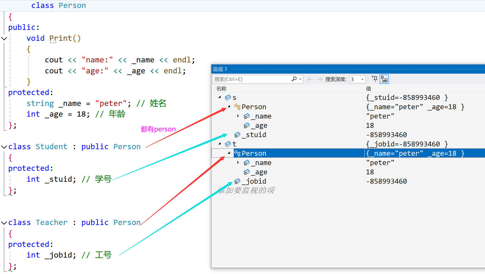

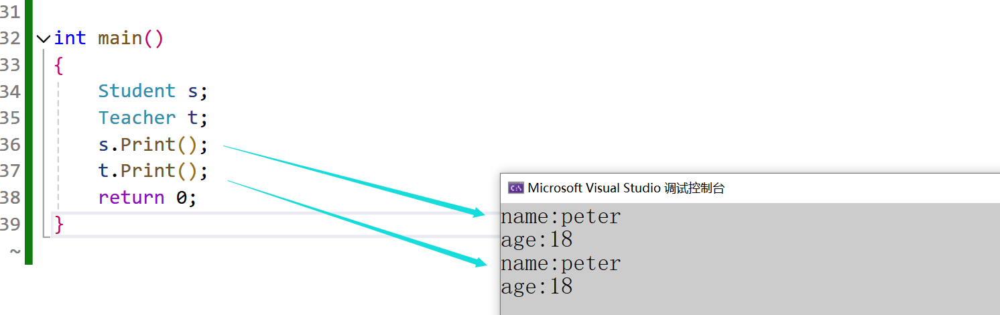

## 2.2 定义格式
下面我们看到**Person是父类**，也称作**基类**。**Student是子类**，也称作**派生类**。

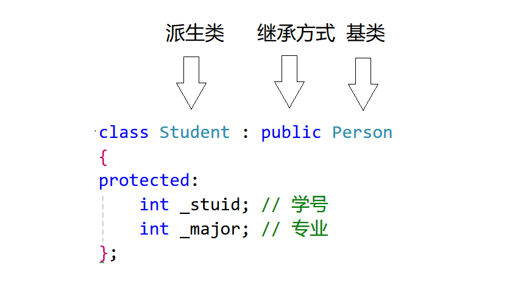

## 2.3 继承关系和访问限定符
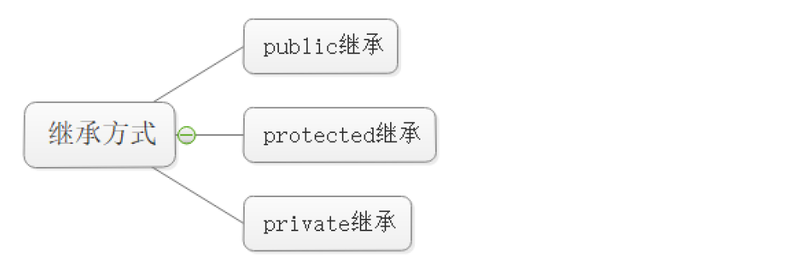

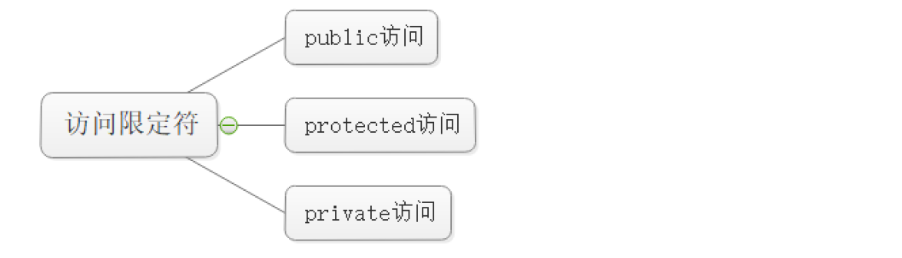

## 2.4 继承基类成员访问方式的变化
| **类成员/继承方式** | **public继承** | **protected继承** | **private继承** |
| --- | --- | --- | --- |
| **基类的public成员** | 派生类的public成员 | 派生类的protected成员 | 派生类的private成员 |
| **基类的protected成员** | 派生类的protected成员 | 派生类的protected成员 | 派生类的private成员 |
| **基类的private成员** | 在派生类中不可见 | 在派生类中不可见 | 在派生类中不可见 |


**总结：**

1. **基类private成员在派生类中无论以什么方式继承都是不可见的**。这里的不可见是指基类的私有成员还是被继承到了派生类对象中，但是语法上限制派生类对象不管在类里面还是类外面都不能去访问它。
2. 基类**private**成员在派生类中是不能被访问，如果**基类成员不想在类外直接被访问，但需要在派生类中能访问**，就定义为**protected**。可以看出<font style="color:#DF2A3F;background-color:#FBDE28;">保护成员限定符是因继承才出现的</font>。
3. 实际上面的表格我们进行一下总结会发现，基类的私有成员在子类都是不可见。基类的其他成员在子类的访问方式==Min(成员在基类的访问限定符，继承方式)，`public > protected > private`。
4. 使用关键字class时默认的继承方式是private，使用**struct时默认的继承方式是public**，不过**最好显示的写出继承方式**。
5. 在实际运用中一般使用都是public继承，几乎很少使用`protetced/private`继承，也**不提倡使用protetced/private继承**，**因为protetced/private继承下来的成员都只能在派生类的类里面使用，实际中扩展维护性不强。**

```cpp
// 基类A的定义
class A 
{
public:
    int a_public_Num;
protected:
    int a_protect_Num;
private:
    int a_private_Num;
};

// 类pubB 使用public的方式继承A
class pubB : public A
{
public:
    pubB()
    {
        a_public_Num = 1;
        a_protect_Num = 2; // 类内可以访问
        // a_private_Num = 3 // 不能访问
    }
}; 

// 类proB 使用protect的方式继承A
class proB : protected A
{
public:
    proB()
    {
        a_public_Num = 4;
        a_protect_Num = 5; // 类内可以访问
        // a_private_Num = 6 // 不能访问
    }
}; 

// 类proB 使用private的方式继承A
class prvB : private A
{
public:
    prvB()
    {
        a_public_Num = 7;
        a_protect_Num = 8; // 类内可以访问
        // a_private_Num = 9 // 不能访问
    }
};

int main()
{
    pubB b1;
    cout << b1.a_public_Num << endl; // 可以访问

    proB b2;
    // cout << b2.a_public_Num << endl;  // 不可访问
    
    prvB b3;
    // cout << b3.a_public_Num << endl; // 不可访问
    
    return 0;
}
```

## 2.5 继承类模板
```cpp
namespace lsl
{
	//template<class T>
	//class vector
	//{};
	// stack和vector的关系，既符合is-a，也符合has-a
	template<class T>
	class stack : public std::vector<T>
	{
	public:
		void push(const T& x)
		{
			// 基类是类模板时，需要指定一下类域，
			// 否则编译报错:error C3861: “push_back”: 找不到标识符
			// 因为stack<int>实例化时，也实例化vector<int>了
			// 但是模版是按需实例化，push_back等成员函数未实例化，所以找不到
			//push_back(x);
			vector<T>::push_back(x);
		}
		void pop()
		{
			vector<T>::pop_back();
		}
		const T& top()
		{
			return vector<T>::back();
		}
		bool empty()
		{
			return vector<T>::empty();
		}
	};
}

int main()
{
	lsl::stack<int> st;
	st.push(1);
	st.push(2);
	st.push(3);
	while (!st.empty())
	{
		cout << st.top() << " ";
		st.pop();
	}
	return 0;
}
```

## 2.6 基类和派生类对象赋值转换
+ 派生类对象 可以赋值给`基类的对象/基类的指针/基类的引用`。这里有个形象的说法叫**切片**或者**切割**。寓意把派生类中父类那部分切来赋值过去。
+ 基类对象不能赋值给派生类对象。

基类的**指针**或者**引用**可以通过强制类型转换赋值给派生类的指针或者引用。但是必须是基类的指针是指向派生类对象时才是安全的。这里基类如果是多态类型，可以使用RTTI(Run-Time Type Information)的`dynamic_cast`来进行识别后进行安全转换。

```cpp
class Person
{
public:
    void Print()
    {
        cout << "name:" << _name << endl;
        cout << "age:" << _age << endl;
    }
protected:
    string _name = "peter"; // 姓名
    int _age = 18; // 年龄
};

class Student : public Person
{
protected:
    int _stuid; // 学号
    int _major; // 专业
};

int main()
{
    Student s;
    Person p = s; // 只有公有继承才可以

    return 0;
}
```

每个子类对象都是一个特殊的父类对象

**子类赋值给父类对象就叫做切割/切片**

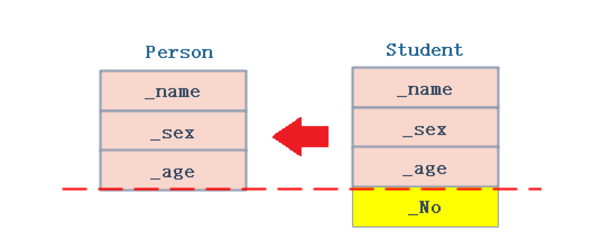


```cpp
class Person
{
protected:
    string _name; // 姓名
    string _sex; // 性别
    int _age; // 年龄
};

class Student : public Person
{
public:
    int _No; // 学号
};

void main()
{
    Student sobj;
    // 1.子类对象可以赋值给父类对象/指针/引用
    Person pobj = sobj;
    Person* pp = &sobj;
    Person& rp = sobj;
    
    //2.基类对象不能赋值给派生类对象，会报错
    //sobj = pobj;

    // 3.基类的指针可以通过强制类型转换赋值给派生类的指针
    pp = &sobj;
    Student* ps1 = (Student*)pp; // 这种情况转换时可以的。
    ps1->_No = 10;
    pp = &pobj;

    Student* ps2 = (Student*)pp; // 这种情况转换时虽然可以，但是会存在越界访问的问题
    ps2->_No = 10;
}
```

## 2.7 继承中的作用域
1. 在继承体系中**基类**和**派生**类都有独立的作用域。
2. 子类和父类中有同名成员，**子类成员将屏蔽父类对同名成员的直接访问，这种情况叫隐藏，也叫重定义**。（在子类成员函数中，可以使用 基类::基类成员 显示访问）
3. 需要注意的是**如果是成员函数的隐藏，只需要****<font style="color:#DF2A3F;background-color:#FBDE28;">函数名相同就构成隐藏</font>****，参数可相同可不同**。
4. 注意在实际中在**继承体系**里面最好**不要定义同名的成员**。

```cpp
// Student的_num和Person的_num构成隐藏关系，可以看出这样代码虽然能跑，但是非常容易混淆
class Person
{
protected:
    string _name = "小李子"; // 姓名
    int _num = 111; // 身份证号
};

class Student : public Person
{
public:
    void Print()
    {
        cout << "姓名:" << _name << endl;
        cout << "身份证号:" << Person::_num << endl;
        cout << "学号:" << _num << endl;
    }
protected:
    int _num = 999; // 学号
};

int main()
{
    Student s1;
    s1.Print();
    return 0;
}
```

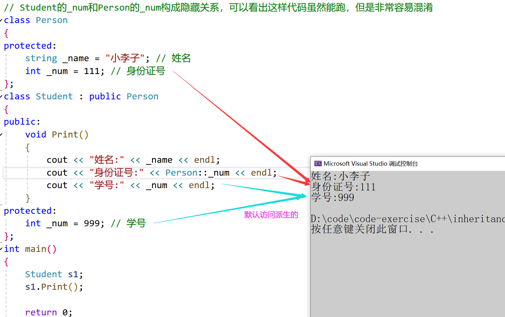

### 2.7.1 选择题
1. A和B类中的两个func构成什么关系（）                    B

> A. 重载 B. 隐藏 C.没关系 
>

2. 下面程序的编译运行结果是什么（）                        A

> A. 编译报错 B. 运行报错 C. 正常运行
>

```cpp
class A
{
public:
	void fun()
	{
		cout << "func()" << endl;
	}
};

class B : public A
{
public:
	void fun(int i)
	{
		cout << "func(int i)" << i << endl;
	}
};

int main()
{
	B b;
	b.fun(10);
	b.fun();
	return 0;
}
```

**B中的fun和A中的fun不是构成重载，因为不是在同一作用域**

**B中的fun和A中的fun构成隐藏，成员函数满足函数名相同就构成隐藏。**

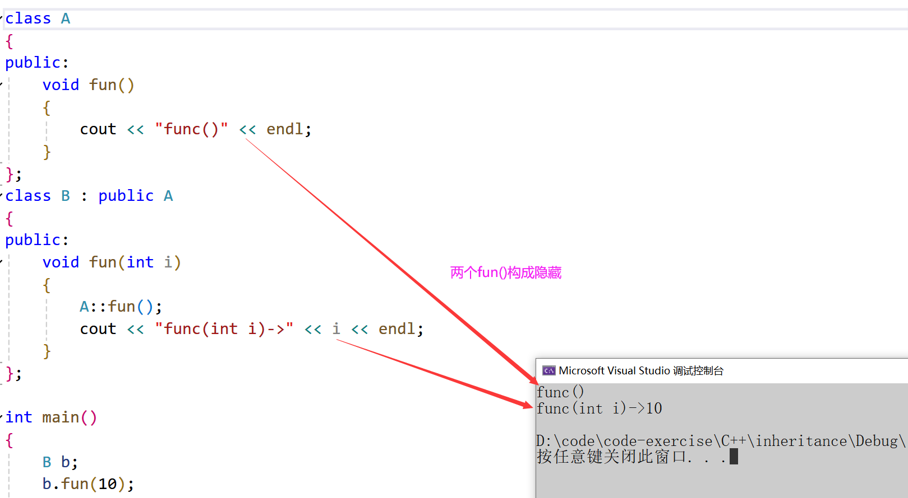

**要注意：****<font style="color:#DF2A3F;background-color:#FBDE28;">不同的域不构成重载</font>**

也可以指定域进行调用

```cpp
b.A::fun();
```

# 三、派生类的默认成员函数
> 6个默认成员函数，**默认**的意思就是指我们不写，编译器会变我们自动生成一个，那么在派生类中，这几个成员函数是如何生成的呢？
>

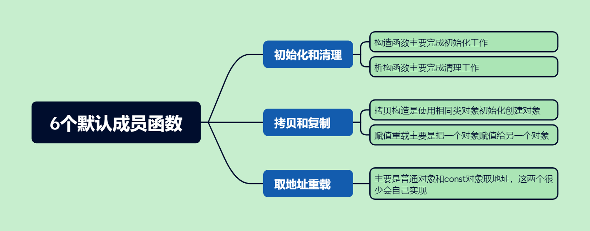

1. 派生类的构造函数必须调用基类的**构造函数初始化基类的那一部分成员**。如**果基类没有默认的构造函数，则必须在派生类构造函数的初始化列表阶段显示调用。**
2. 派生类的**拷贝构造函数必须调用基类的拷贝构造完成基类的拷贝初始化**。
3. 派生类的**operator=必须要调用基类的operator=完成基类的复制**。
4. 派生类的**析构函数会在被调用完成后自动调用基类的析构函数清理基类成员。因为这样才能保证派生类对象先清理派生类成员再清理基类成员的顺序**。
5. 派生类对象**初始化先调用基类构造再调派生类构造**。
6. 派生类对象析构**清理先调用派生类析构再调基类的析构**。
7. **因为多态中一些场景析构函数需要构成重写，重写的条件之一是函数名相同。那么编译器会对析构函数名进行特殊处理，处理成**`**destrutor()**`，**所以父类析构函数不加virtual的情况下，子类析构函数和父类析构函数构成隐藏关系。**

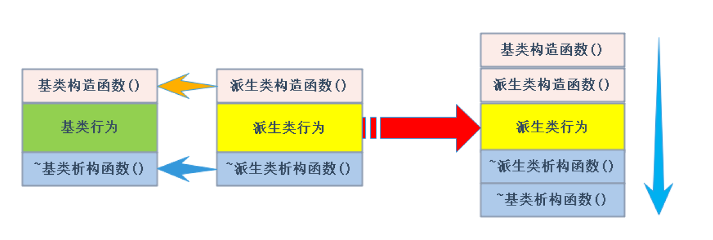

```cpp
class Person
{
public:
    Person(const char* name = "peter")
        : _name(name)
    {
        cout << "Person()" << endl;
    }

    Person(const Person& p)
        : _name(p._name)
    {
        cout << "Person(const Person& p)" << endl;
    }

    Person& operator=(const Person& p)
    {
        cout << "Person operator=(const Person& p)" << endl;
        if (this != &p)
            _name = p._name;
        return *this;
    }

    ~Person()
    {
        cout << "~Person()" << endl;
    }
protected:
    string _name; 
};

class Student : public Person
{
public:
    Student(const char* name, int num)
        : Person(name)
        , _num(num)
    {
        cout << "Student()" << endl;
    }

    Student(const Student& s)
        : Person(s)
        , _num(s._num)
    {
        cout << "Student(const Student& s)" << endl;
    }

    Student& operator=(const Student& s)
    {
        cout << "Student& operator= (const Student& s)" << endl;
        if (this != &s)
        {
            // 指定作用域显示调用
            Person::operator=(s);
            _num = s._num;
        }
        return *this;
    }

    ~Student()
    {
        cout << "~Student()" << endl;
    }
protected:
    int _num;
    string _str;
};

int main()
{
    Student s1("jack", 18);
    Student s2(s1);
    Student s3("rose", 17);
    s1 = s3;
    return 0;
}
```

**注意：构造顺序是**`先父后子`**，析构顺序是**`先子后父`**，子类析构函数结束后会自动调用父类析构**

# 四、实现一个不能被继承的类
方法1：基类的构造函数私有，派生类的构成必须调用基类的构造函数，但是基类的构成函数私有化以

后，派生类看不见就不能调用了，那么派生类就无法实例化出对象。

方法2：C++11新增了一个final关键字，final修改基类，派生类就不能继承了。

```cpp
// C++11的方法
class Base final
{
public:
	void func5() { cout << "Base::func5" << endl; }
protected:
	int a = 1;
private:
	// C++98的方法
	Base()
	{}
};

class Derive :public Base
{
	void func4() { cout << "Derive::func4" << endl; }
protected:
	int b = 2;
};

int main()
{
	Base b;
	Derive d;
	return 0;
}
```

# 五、继承与友元
友元关系不能继承，也就是说**基类友元不能访问子类私有和保护成员**

```cpp
class Student;
class Person
{
public:
    friend void Display(const Person& p, const Student& s);
protected:
    string _name; // 姓名
};

class Student : public Person
{
protected:
    int _stuNum; // 学号
};

void Display(const Person& p, const Student& s)
{
    cout << p._name << endl;
    cout << s._stuNum << endl;
}

void main()
{
    Person p;
    Student s;
    Display(p, s);
}
```

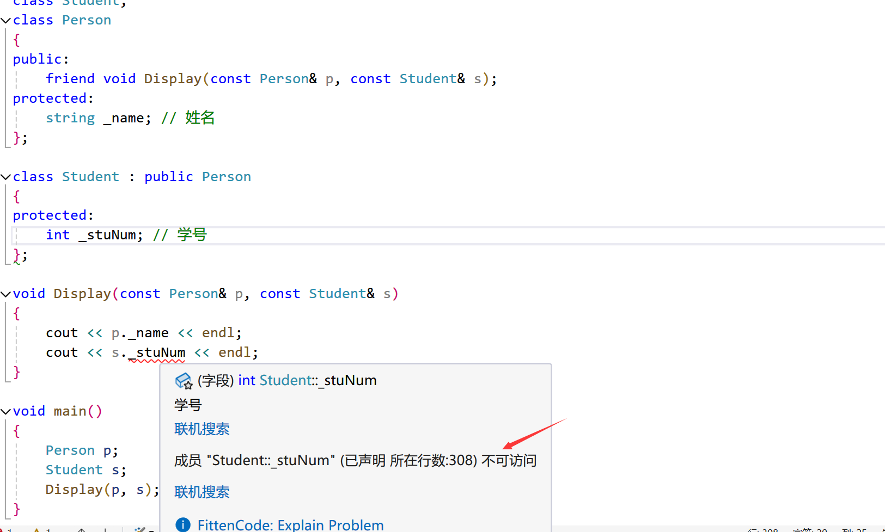

我们也可以再在这里面加上一个友元就可以访问了

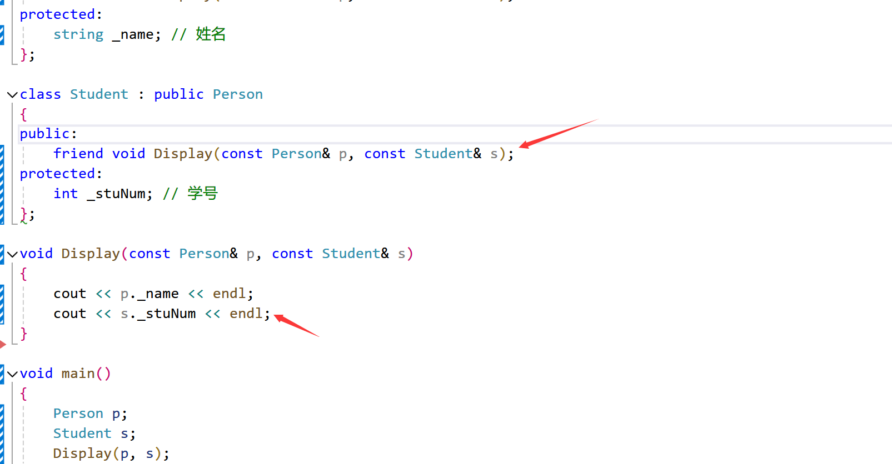

# 六、继承与静态成员
基类定义了static静态成员，则整个继承体系里面只有一个这样的成员。无论派生出多少个子类，都只有一个static成员实例 。

```cpp
class Person
{
public:
    Person() { ++_count; }
protected:
    string _name; // 姓名
public:
    static int _count; // 统计人的个数。
};

int Person::_count = 0;

class Student : public Person
{
protected:
    int _stuNum; // 学号
};

class Graduate : public Student
{
protected:
    string _seminarCourse; // 研究科目
};

int main()
{
    Student s1;
    Student s2;
    Student s3;
    Graduate s4;

    cout << " &Person :" << &Person::_count << endl;
    cout << " &Student :" << &Student::_count << endl;
    cout << " &Graduate :" << &Graduate::_count << endl;
    cout << " 人数 :" << Person::_count << endl;

    Student::_count = 0;
    cout << " 人数 :" << Person::_count << endl;

    return 0;
}
```

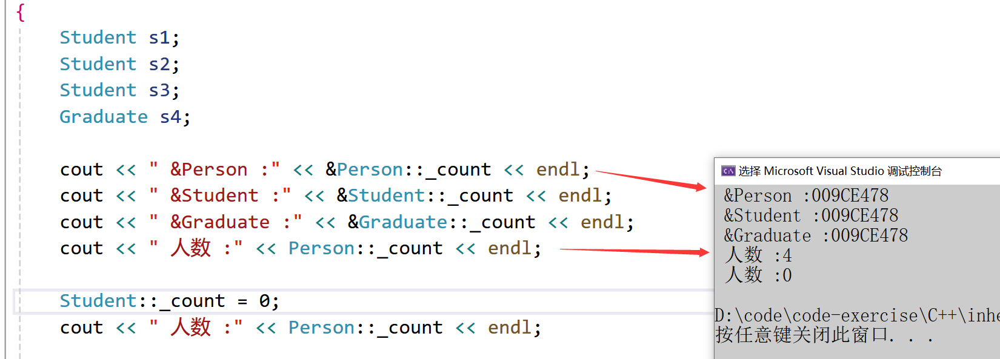

# 七、复杂的菱形继承及菱形虚拟继承
**单继承**：一个子类只有一个直接父类时称这个继承关系为单继承


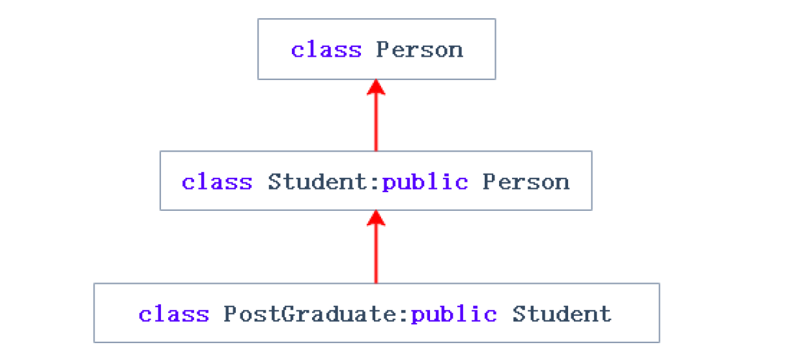

**多继承**：一个子类有两个或以上直接父类时称这个继承关系为多继承

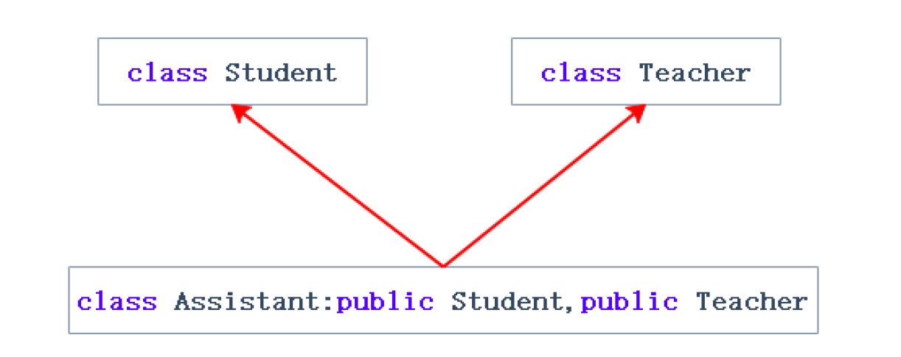

**菱形继承**：菱形继承是多继承的一种特殊情况。菱形继承的问题，从下面的对象成员模型构造，可以看出菱形继承有数据冗余和二义性的问题，在Assistant的对象中Person成员会有两份。支持多继承就一定会有菱形继承，像Java就直接不支持多继承，规避掉了这里的问题，所以实践中我们也是不建议设计出菱形继承这样的模型的。

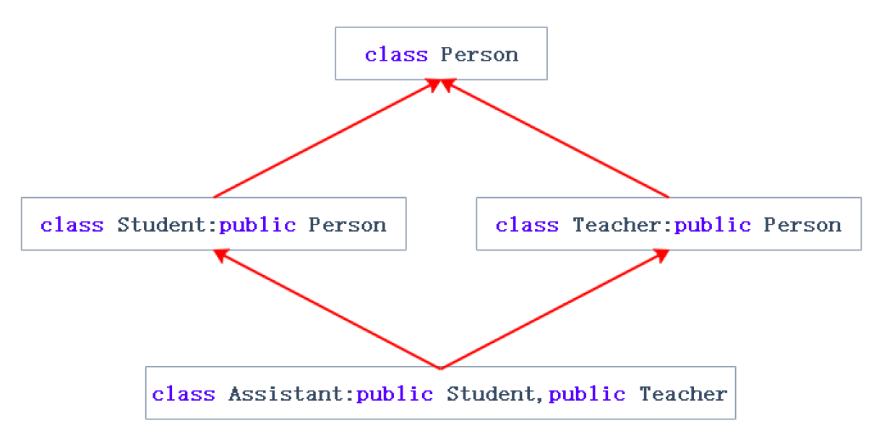

两个派生类继承同一个基类而又有某个类同时继承者两个派生类，这种继承被称为**菱形继承**，或者钻石型继承。

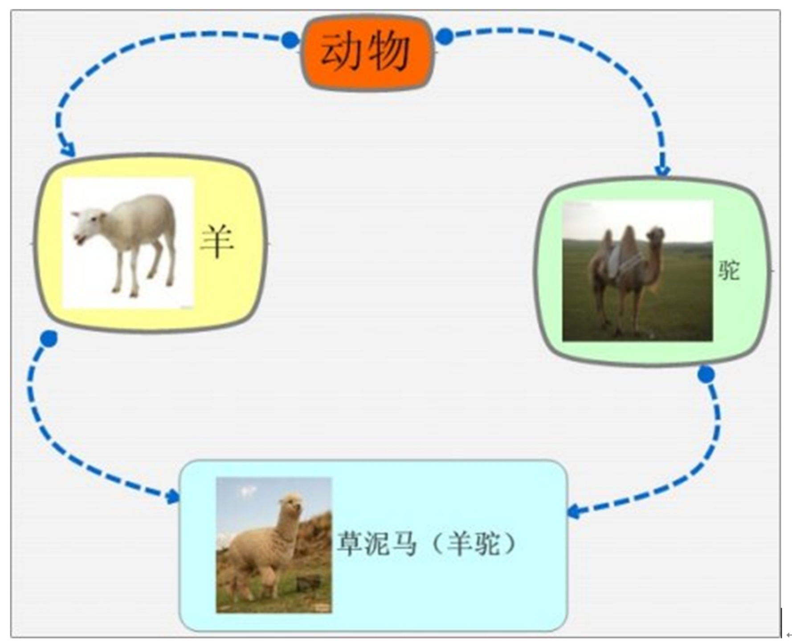

羊继承了动物的数据和函数，鸵同样继承了动物的数据和函数，当草泥马调用函数或者数据时，就会产生二义性。

**草泥马**继承自动物的函数和数据继承了两份，其实我们应该清楚，**这份数据我们只需要一份就可以。**

```cpp
class Person
{
public:
    string _name; // 姓名
};
class Student : public Person
{
protected:
    int _num; //学号
};
class Teacher : public Person
{
protected:
    int _id; // 职工编号
};
class Assistant : public Student, public Teacher
{
protected:
    string _majorCourse; // 主修课程
};
void Test()
{
    // 这样会有二义性无法明确知道访问的是哪一个
    Assistant a;
    a._name = "peter";

    // 需要显示指定访问哪个父类的成员可以解决二义性问题，但是数据冗余问题无法解决
    a.Student::_name = "xxx";
    a.Teacher::_name = "yyy";
}
```

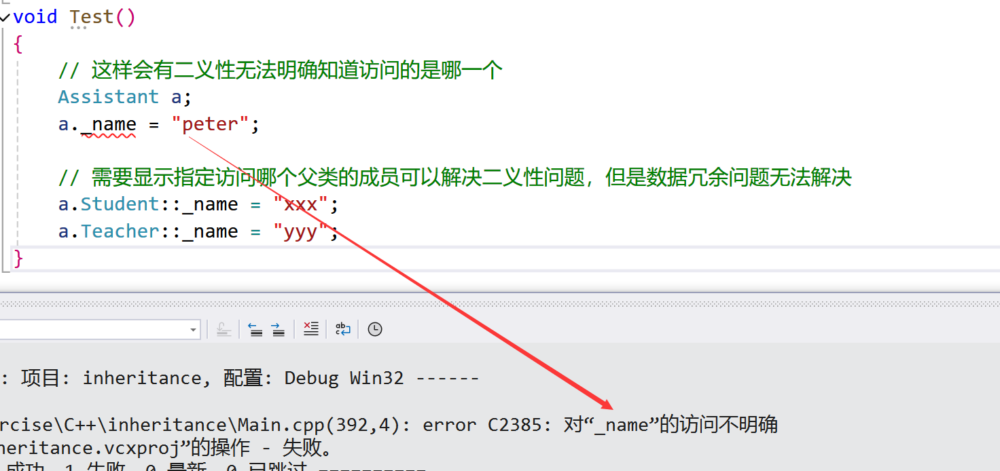

虚拟继承可以解决菱形继承的二义性和数据冗余的问题。如上面的继承关系，在Student和Teacher的继承Person时使用虚拟继承，即可解决问题。需要注意的是，虚拟继承不要在其他地方去使用。

```cpp
class Person
{
public:
    string _name; // 姓名
};

class Student : virtual public Person
{
protected:
    int _num; //学号
};

class Teacher : virtual public Person
{
protected:
    int _id; // 职工编号
};

class Assistant : public Student, public Teacher
{
protected:
    string _majorCourse; // 主修课程
};

void main()
{
    Assistant a;
    a._name = "peter";

    a.Student::_name = "xxx";
    a.Teacher::_name = "yyy";
}
```

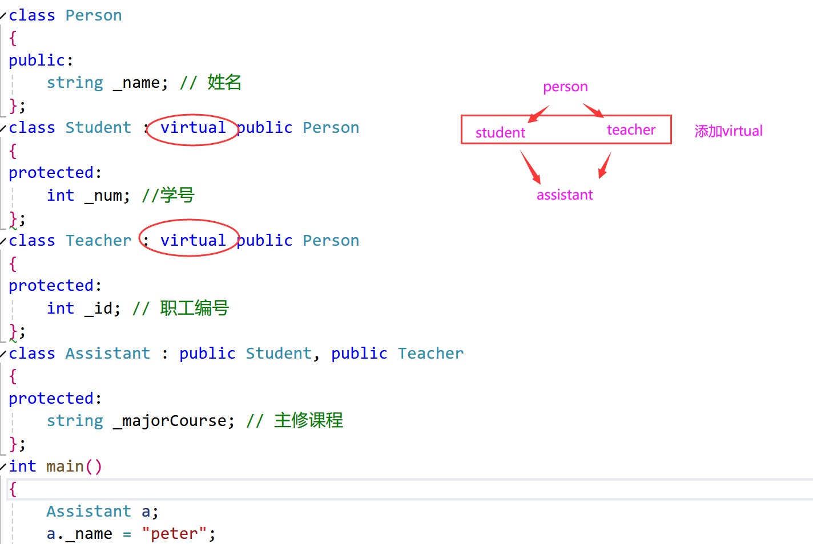

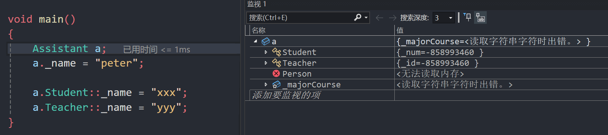

## 7.1 虚拟继承解决数据冗余和二义性的原理
为了研究虚拟继承原理，给出了一个简化的菱形继承继承体系，再借助内存窗口观察对象成员的模型。

```cpp
class A
{
public:
    int _a;
};

class B : public A
{
public:
    int _b;
    int _b1;
    int _b2;
};

class C : public A
{
public:
    int _c;
};

class D : public C, public B
{
public:
    int _d;
};

int main(){
    D d;
    d.B::_a = 1;
    d.C::_a = 2;
    return 0;
}
```

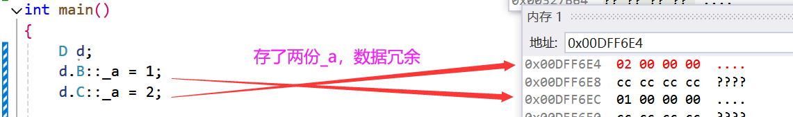

下图是菱形虚拟继承的内存对象成员模型：这里可以分析出D对象中将A放到的了对象组成的最下面，这个A同时属于B和C，那么B和C如何去找到公共的A呢？**这里是通过了B和C的两个指针，指向的一张表**。这两个指针叫`虚基表指针`，这两个表叫**虚基表**。虚基表中存的**偏移量**。通过**偏移量**可以找到下面的A。

```cpp
class A
{
public:
    int _a;
};

class B : virtual public A
{
public:
    int _b;
    int _b1;
    int _b2;

};

class C : virtual public A
{
public:
    int _c;
};
class D : public C, public B
{
public:
    int _d;
};
```

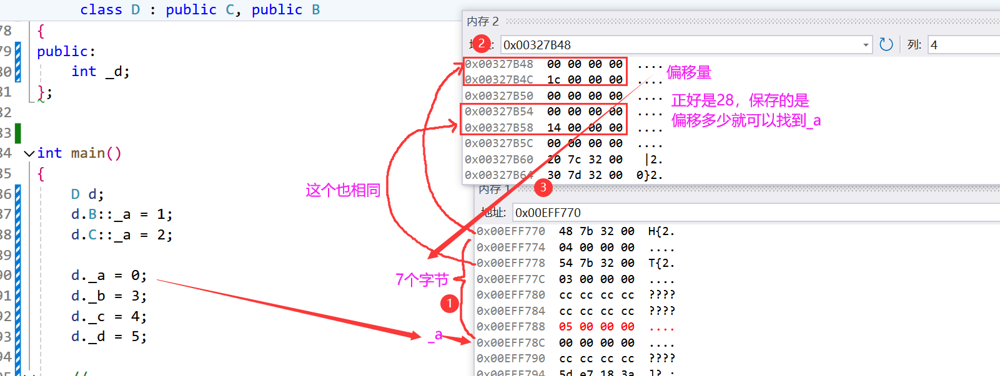

下面是上面的Person关系菱形虚拟继承的原理解释：

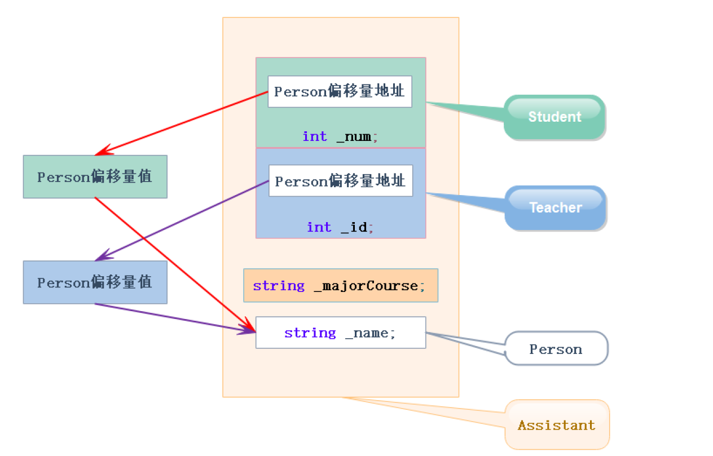

## 7.2 多继承中指针偏移问题？下面说法正确的是( )
> A：p1 == p2 == p3      B：p1 < p2 < p3      C：p1 == p3 != p2     D：p1 != p2 != p3
>

```cpp
class Base1
{
public:
	int _b1;
};

class Base2 {
public:
	int _b2;
};

class Derive : public Base1, public Base2
{
public:
	int _d;
};

int main()
{
	Derive d;
	Base1* p1 = &d;
	Base2* p2 = &d;
	Derive* p3 = &d;
	return 0;
}
```

答案是选C

<font style="color:rgba(0, 0, 0, 0.85) !important;">在 C++ 中，当一个类继承自多个基类时，派生类对象的内存布局是按照基类在继承列表中的声明顺序依次排列的，然后是派生类自己的成员。对于本题中的 </font>`<font style="color:rgba(0, 0, 0, 0.85) !important;">Derive</font>`<font style="color:rgba(0, 0, 0, 0.85) !important;"> 类，它继承自 </font>`<font style="color:rgba(0, 0, 0, 0.85) !important;">Base1</font>`<font style="color:rgba(0, 0, 0, 0.85) !important;"> 和 </font>`<font style="color:rgba(0, 0, 0, 0.85) !important;">Base2</font>`<font style="color:rgba(0, 0, 0, 0.85) !important;">，其内存布局如下：</font>

+ <font style="color:rgba(0, 0, 0, 0.85) !important;">首先是</font><font style="color:rgba(0, 0, 0, 0.85) !important;"> </font>`<font style="color:rgb(0, 0, 0);">Base1</font>`<font style="color:rgba(0, 0, 0, 0.85) !important;"> </font><font style="color:rgba(0, 0, 0, 0.85) !important;">的成员</font><font style="color:rgba(0, 0, 0, 0.85) !important;"> </font>`<font style="color:rgb(0, 0, 0);">_b1</font>`<font style="color:rgba(0, 0, 0, 0.85) !important;">。</font>
+ <font style="color:rgba(0, 0, 0, 0.85) !important;">接着是</font><font style="color:rgba(0, 0, 0, 0.85) !important;"> </font>`<font style="color:rgb(0, 0, 0);">Base2</font>`<font style="color:rgba(0, 0, 0, 0.85) !important;"> </font><font style="color:rgba(0, 0, 0, 0.85) !important;">的成员</font><font style="color:rgba(0, 0, 0, 0.85) !important;"> </font>`<font style="color:rgb(0, 0, 0);">_b2</font>`<font style="color:rgba(0, 0, 0, 0.85) !important;">。</font>
+ <font style="color:rgba(0, 0, 0, 0.85) !important;">最后是 </font>`<font style="color:rgb(0, 0, 0);">Derive</font>`<font style="color:rgba(0, 0, 0, 0.85) !important;"> 自己的成员 </font>`<font style="color:rgb(0, 0, 0);">_d</font>`<font style="color:rgba(0, 0, 0, 0.85) !important;">。</font>

`<font style="color:rgb(0, 0, 0);">p1</font>`<font style="color:rgba(0, 0, 0, 0.85);"> 和 </font>`<font style="color:rgb(0, 0, 0);">p3</font>`<font style="color:rgba(0, 0, 0, 0.85);"> 都指向 </font>`<font style="color:rgb(0, 0, 0);">d</font>`<font style="color:rgba(0, 0, 0, 0.85);"> 对象的起始地址，所以 </font>`<font style="color:rgb(0, 0, 0);">p1 == p3</font>`<font style="color:rgba(0, 0, 0, 0.85);">；而 </font>`<font style="color:rgb(0, 0, 0);">p2</font>`<font style="color:rgba(0, 0, 0, 0.85);"> 指向的地址会在 </font>`<font style="color:rgb(0, 0, 0);">p1</font>`<font style="color:rgba(0, 0, 0, 0.85);"> 指向的地址基础上偏移 </font>`<font style="color:rgb(0, 0, 0);">sizeof(Base1)</font>`<font style="color:rgba(0, 0, 0, 0.85);"> 个字节，所以 </font>`<font style="color:rgb(0, 0, 0);">p1 != p2</font>`<font style="color:rgba(0, 0, 0, 0.85);">，即 </font>`<font style="color:rgb(0, 0, 0);">p1 == p3 != p2</font>`

# 八、IO库中的菱形虚拟继承
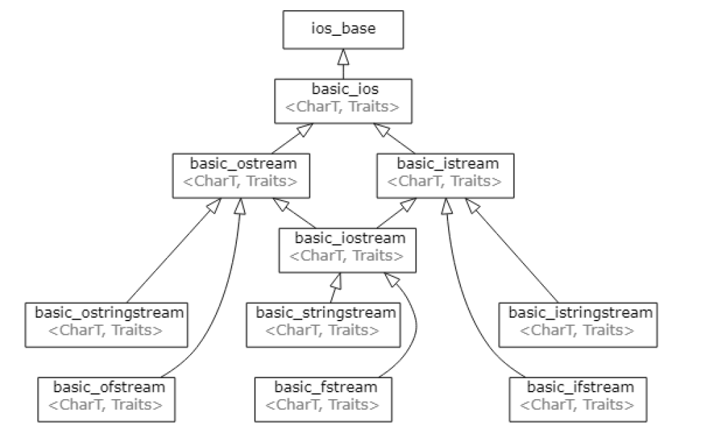

```cpp
template<class CharT, class Traits = std::char_traits<CharT>>
class basic_ostream : virtual public std::basic_ios<CharT, Traits>
{
};
template<class CharT, class Traits = std::char_traits<CharT>>
class basic_istream : virtual public std::basic_ios<CharT, Traits>
{
};
```

# 九、继承的总结和反思
1. 很多人说C++语法复杂，其实多继承就是一个体现。有了多继承，就存在菱形继承，有了菱形继承就有菱形虚拟继承，底层实现就很复杂。所以一般不建议设计出多继承，一定不要设计出菱形继承。否则在复杂度及性能上都有问题。
2. 多继承可以认为是C++的缺陷之一，很多后来的xx语言都没有多继承，如Java。
3. **继承和组合**
+ public继承是一种`is-a`的关系。也就是说每个派生类对象都是一个基类对象。
+ 组合是一种`has-a`的关系。假设B组合了A，每个B对象中都有一个A对象。
+ 优先使用**对象组合，而不是类继承** 。
+ 继承允许你根据基类的实现来定义派生类的实现。这种通过生成派生类的复用通常被称为**白箱复用**(white-box reuse)。术语“白箱”是相对可视性而言：在继承方式中，基类的 内部细节对子类可见 。继承一定程度破坏了基类的封装，基类的改变，对派生类有很 大的影响。派生类和基类间的依赖关系很强，耦合度高。
+ 对象组合是类继承之外的另一种复用选择。新的更复杂的功能可以通过组装或组合对象 来获得。对象组合要求被组合的对象具有良好定义的接口。这种复用风格被称为**黑箱复用**(black-box reuse)，因为对象的内部细节是不可见的。对象只以“黑箱”的形式出现。 组合类之间没有很强的依赖关系，耦合度低。优先使用对象组合有助于你保持每个类被 封装。
+ 实际尽量多去用组合。组合的耦合度低，代码维护性好。不过继承也有用武之地的，有 些关系就适合继承那就用继承，另外要实现多态，也必须要继承。类之间的关系可以用 继承，可以用组合，就用组合。

# 十、笔试面试题
## 什么是菱形继承？菱形继承的问题是什么？
单继承：一个子类只有一个直接父类时称这个继承关系为单继承  
多继承：一个子类有两个或以上直接父类时称这个继承关系为多继承  
菱形继承：菱形继承是C++ 多继承的一种表现形式  
菱形继承的主要问题是可能导致**二义性和数据冗余**。二义性发生在当最底层的派生类需要访问基类的成员时，由于存在多个继承路径，编译器可能无法确定应该使用哪个路径上的基类成员。数据冗余则是由于基类的数据成员在多个派生类中被多次拷贝，这不仅浪费存储空间，还可能导致数据的不一致。

## 什么是菱形虚拟继承？如何解决数据冗余和二义性的
菱形虚拟继承是为了解决菱形继承中的二义性和数据冗余问题而引入的一种机制。在菱形虚拟继承中，通过在基类继承时添加`virtual`关键字，确保在派生类中基类的数据成员只存在一份拷贝，从而避免了数据冗余。同时，虚基表的使用解决了二义性问题，确保在访问基类成员时能够明确找到正确的路径。

解决方法：让 B 虚拟继承 A，C 虚拟继承 A。A 也就被称为虚基类。虚拟继承会让父类 A 的成员在最终子类 D 中只有一份。需要注意的是：虚拟继承不要在其他地方去使用。基本用不到。

## 继承和组合的区别？什么时候用继承？什么时候用组合？
继承允许一个类（派生类）继承另一个类（基类）的属性和方法。它体现的是一种“is-a”关系，即派生类是基类的一种特殊形式。继承主要用于实现代码重用和扩展基类功能。当需要创建一个新的类，而这个类与已有的类具有相似的功能时，可以使用继承。

组合则是通过将已有的类的对象作为新类的成员来实现代码复用。它体现的是一种“has-a”关系，即新类包含一个或多个已有类的对象作为自己的部分。组合用于创建更复杂的对象，通过组合已有的对象来实现新的功能。当需要创建一个新的类，而这个类由多个已有的类的对象组合而成时，应使用组合。

在选择使用继承还是组合时：

1. 如果新类与已有类之间存在“is-a”关系，即新类是已有类的一种特殊形式，那么应该使用继承。
2. 如果新类是由多个已有的类的对象组合而成，形成“has-a”关系，那么应该使用组合。
3. 对于大型程序，通常优先使用组合，因为它有助于保持每个类的封装性和独立性，避免类层次结构的过度扩张。

