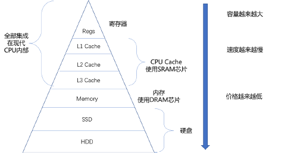

### auto关键字介绍：
`auto`关键字是什么呢，相信大家都没有怎么听说过，今天我来给大家介绍一下

`auto`关键字的作用声明自动变量

## 没用的关键字 - auto
### 如何使用？
一般在代码块中定义的变量，即局部变量，默认都是auto修饰的，不过一般省略 默认的所有变量都是auto吗？不是，一般用来修饰局部变量 。

```c
#include <stdio.h>
#include <windows.h>
int main()
{
	for (int i = 0; i < 10; i++) {
		printf("i=%d\n", i);
		if (1)
		{
			auto int j = 0; //自动变量
			printf("before: j=%d\n", j);
			j += 1;
			printf("after : j=%d\n", j);
		}
	}
	system("pause");
	return 0;
}
```

### 思考：
`i`用`auto`修饰可以吗？去掉`j`的`auto`可以吗？

### 结论：
已经很老，基本永不使用。

## 最快的关键字 - register
### 寄存器的介绍：
其实，CPU主要是负责进行计算的硬件单元，但是为了方便运算，一般第一步需要先把数据从内存读取到CPU内，那 么也就需要CPU具有一定的数据临时存储能力。注意：CPU并不是当前要计算了，才把特定数据读到CPU里面，那样太慢了。 所以现代CPU内，都集成了一组叫做寄存器的硬件，用来做临时数据的保存。

距离CPU越近的存储硬件，速度越快。

### 寄存器的认识 ：
CPU内集成了一组存储硬件即可，这组硬件叫做寄存器。 寄存器存在的本质 register 修饰变量 尽量将所修饰变量，放入CPU寄存区中，从而达到提高效率的目的 } 在硬件层面上，提高计算机的运算效率。因为不需要从内存里读取数据啦。



### 使用：
那么什么样的变量，可以采用register呢？

1. 局部的(全局会导致CPU寄存器被长时间占用)
2. 不会被写入的（写入就需要写回内存，后续还要读取检测的话，register的意义在哪呢？）
3. 高频被读取的（提高效率所在）
4. 如果要使用，请不要大量使用，因为寄存器数量有限

### register不能取地址的说明：
register修饰的变量，不能取地址(因为已经放在寄存区中了嘛，地址是内存相关的概念)

```c
#include <stdio.h>
#include <windows.h>
int main()
{
	register int a = 0;
	printf("&a = %p\n", &a);
	//编译器报错：错误 1 error C2103: 寄存器变量上的“&”
	//注意，这里不是所有的编译器都报错，目前我们的vs2013是报错的。
	system("pause");
	return 0;
}
```

### 结论：
> 该关键字，不用管，因为现在的编译器，已经很智能了，能够进行比人更好的代码优化。
>
> 早期编译器需要人为指定register，来进行手动优化，现在不需要了。
>

