# 从浅入深理解指针《第一阶段》
## 一、内存和地址
### 1.1 内存
+ 在讲内存和地址之前，我们想有个生活中的案例：
+ 假设有一栋宿舍楼，把你放在楼里，楼上有100个房间，但是房间没有编号，你的一个朋友来找你玩，如果想找到你，就得挨个房子去找，这样效率很低，但是我们如果根据楼层和楼层的房间的情况，给每个房间编上号，如：
    - 一楼：101，102，103...
    - 二楼：201，202，203....

有了房间号，如果你的朋友得到房间号，就可以快速的找房间，找到你。

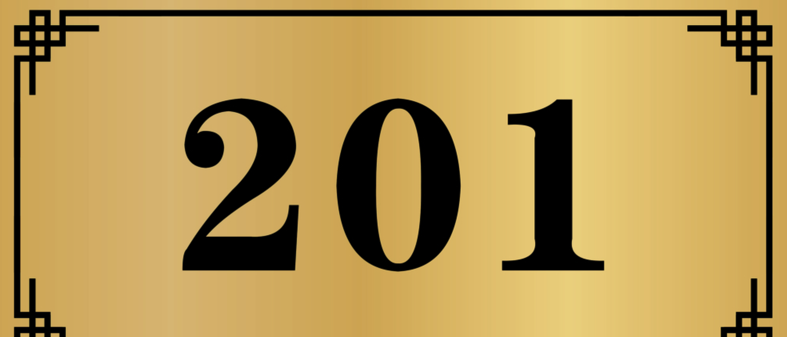

+ 生活中，每个房间有了房间号，就能提高效率，能快速的找到房间。

如果把上面的例子对照到计算中，又是怎么样呢？

+ 我们知道计算上CPU（中央处理器）在处理数据的时候，需要的数据是在内存中读取的，处理后的数据也会放回内存中，那我们买电脑的时候，电脑上内存是8GB/16GB/32GB等，那这些内存空间如何高效的管理呢？

其实也是把内存划分为一个个的内存单元，每个内存单元的大小取1个字节。

+ 计算机中常见的单位（补充）：
+ 一个比特位可以存储一个2进制的位1或者0

```c
bit - 比特位
byte - 字节
KB
MB
GB
TB
PB
```

```c
1byte = 8bit
1KB = 1024byte
1MB = 1024KB
1GB = 1024MB
1TB = 1024GB
1PB = 1024TB
```

+ 其中，每个内存单元，相当于一个学生宿舍，一个人字节空间里面能放8个比特位，就好比同学们住的八人间，每个人是一个比特位。
+ 每个内存单元也都有一个编号（这个编号就相当于宿舍房间的门牌号），有了这个内存单元的编号，CPU就可以快速找到一个内存空间。
+ 生活中我们把门牌号也叫地址，在计算机中我们把内存单元的编号也称为地址。C语言中给地址起了新的名字叫：**指针**。

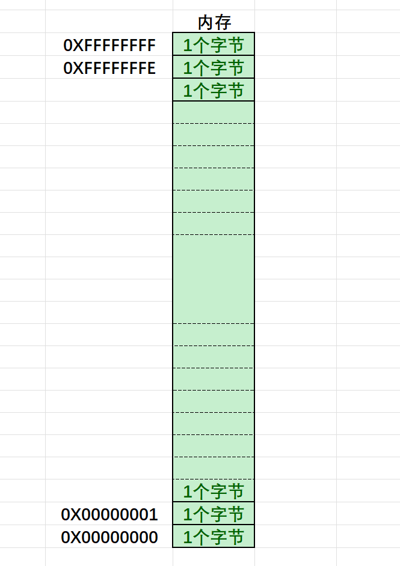

+ 所以我们可以理解为：内存单元的编号 == 地址 == 指针

### 1.2 究竟该如何理解编址
+ CPU访问内存中的某个字节空间，必须知道这个字节空间在内存的什么位置，而因为内存中字节很多，所以需要给内存进行编址(就如同宿舍很多，需要给宿舍编号一样)。
+ 计算机中的编址，并不是把每个字节的地址记录下来，而是通过硬件设计完成的。钢琴、吉他面没有写上“都瑞咪发嗦啦”这样的信息，但演奏者照样能够准确找到每一个琴弦的每一个位置，这是为何？因为制造商已经在乐器硬件层面上设计好了，并且所有的演奏者都知道。本质是一种约定出来的共识！硬件编址也是如此~~

---

+ 首先，必须理解，计算机内是有很多的硬件单元，而硬件单元是要互相协同工作的。所谓的协同，至少相互之间要能够进行数据传递。但是硬件与硬件之间是互相独立的，那么如何通信呢？答案很简单，用"线"连起来。而CPU和内存之间也是有大量的数据交互的，所以，两者必须也用线连起来。不过，我们今天关心一组线，叫做地址总线。


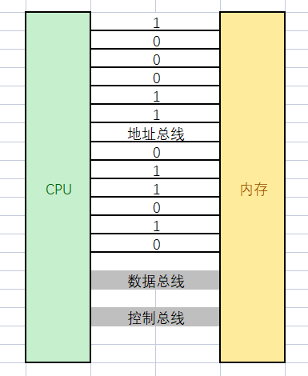

+ 我们可以简单理解，32位机器有32根地址总线，每根线只有两态，表示0,1【电脉冲有无】，那么一根线，就能表示2种含义，2根线就能表示4种含义，依次类推。32根地址线，就能表示2^32种含义，每一种含义都代表一个地址。地址信息被下达给内存，在内存上，就可以找到该地址对应的数据，将数据在通过数据总线传入CPU内寄存器。

## 二、指针变量和地址
### 2.1 取地址操作符（&）
理解了内存和地址的关系，我们再回到C语言，在C语言中创建变量其实就是向内存申请空间，比如：

+ 下面这段代码变量创建的本质是什么？

```c
int main() 
{
    int a = 10;
    return 0;
}
```

+ 变量创建的本质是：在内存上开辟空间~~  
要向内存申请4个字节的空间，存放数据0

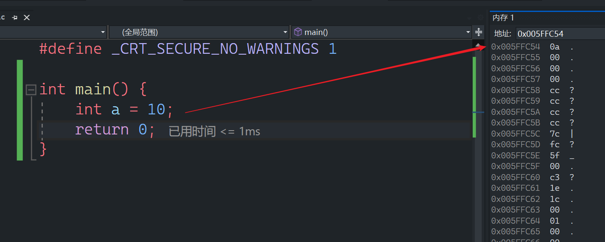

+ 比如，上述的代码就是创建了整型变量a，内存中申请4个字节，用于存放整数10，其中每个字节都有地址，上图中4个字节的地址分别是：

```c
0x005FFC54  0a  
0x005FFC55  00  
0x005FFC56  00  
0x005FFC57  00  
```

那我们如何能得到a的地址呢？

+ 这里就得学习一个操作符(&)-取地址操作符

```c
#include <stdio.h>
int main() {
    int a = 10;
    &a;//取出a的地址
    printf("%p\n", &a);
    return 0;
}
```

+ 对于a来说，我们那到的是a所占4个字节的第一个地址（地址较小的那个字节的地址）

按照我画图的例子，会打印处理：`005FFC54`

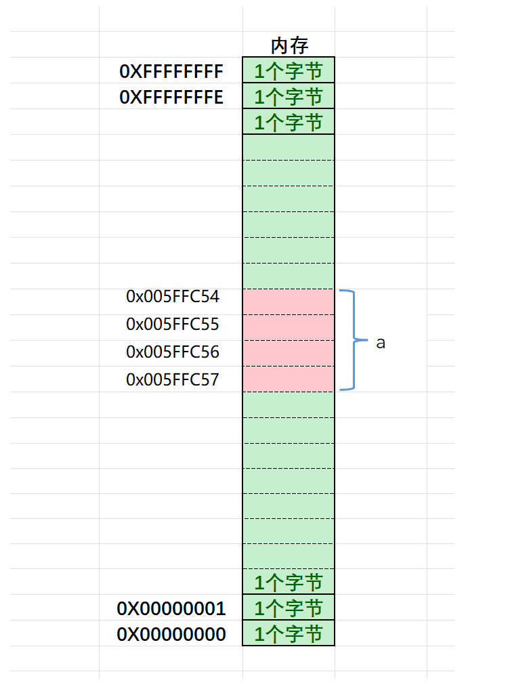

+ 虽然整型变量占用4个字节，我们只要知道了第一个字节地址，顺藤摸瓜访问到4个字节的数据也是可  
行的。

## 三、指针变量和解引用操作符（*）
### 3.1 指针变量
+ 那我们通过取地址操作符(&)拿到的地址是一个数值，比如：0x006FFD70，这个数值有时候也是需要存储起来，方便后期再使用的，那我们把这样的地址值存放在哪里呢？答案是：`指针变量`中。
+ 比如：

```c
int main() {
    int a = 10;
    int* pa = &a;//取出a的地址并存储到指针变量pa中
    return 0;
}
```

+ 其中pa叫做指针变量，因为是存放指针的变量，所以叫做指针变量。
+ 指针变量也是一种变量，这种变量就是用来存放地址的，存放在指针变量中的值都会理解为地址。

### 3.2 如何拆解指针类型
+ 我们看到pa的类型是`int*` ，我们该如何理解指针的类型呢？

```c
int a = 10;
int* pa = &a;
```

+ 这里pa左边写的是`int*`，`*`是在说明pa是指针变量，而前面的`int`是在说明pa指向的是整型(int)类型的对象。

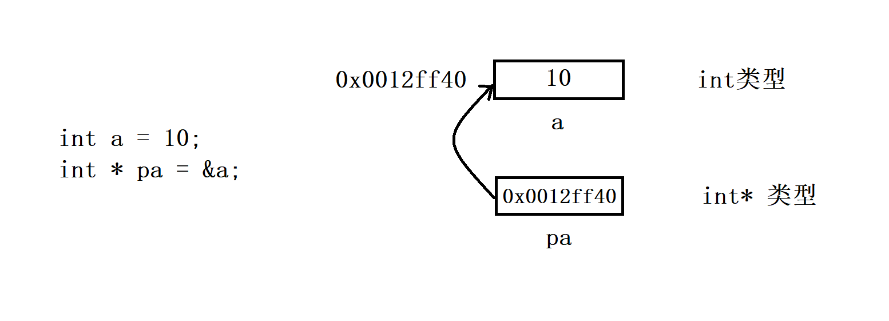

+ 那如果有一个char类型的变量ch，ch的地址，要放在什么类型的指针变量中呢？

```c
char ch = 'w';
pc = &ch;//pc 的类型怎么写呢？
```

+ 既然是char类型的变量，那肯定就要放在char类型的指针变量里

```c
char ch = 'w';
char* pc = &ch;
```

### 3.3 解引用操作符
+ 我们将地址保存起来，未来是要使用的，那怎么使用呢？  
在现实生活中，我们使用地址要找到一个房间，在房间里可以拿去或者存放物品。
+ C语言中其实也是一样的，我们只要拿到了地址（指针），就可以通过地址（指针）找到地址（指针）指向的对象，这里必须学习一个操作符叫解引用操作符(*)。

```c
#include <stdio.h>

int main()
{
    int a = 100;
    int* pa = &a;
    *pa = 0;
    return 0;
}
```

+ 上面代码中第7行就使用了解引用操作符， `*pa`的意思就是通过pa中存放的地址，找到指向的空间，pa其实就是a变量了；所以pa = 0，这个操作符是把a改成了0.有同学肯定在想，这里如果目的就是把a改成0的话，写成a = 0; 不就完了，为啥非要使用指针呢？
+ 其实这里是把a的修改交给了pa来操作，这样对a的修改，就多了一种的途径，写代码就会更加灵活，后期慢慢就能理解了。

## 四、指针变量的大小
+ 前面的内容我们了解到，32位机器假设有32根地址总线，每根地址线出来的电信号转换成数字信号后是1或者0，那我们把32根地址线产生的2进制序列当做一个地址，那么一个地址就是32个bit位，需要4个字节才能存储。
+ 如果指针变量是用来存放地址的，那么指针变的大小就得是4个字节的空间才可以。
+ 同理64位机器，假设有64根地址线，一个地址就是64个二进制位组成的二进制序列，存储起来就需要
+ 8个字节的空间，指针变的大小就是8个字节。

```c
int main()
{
    int num = 10;
    int* p = &num;
    
    char ch = 'w';
    char* pc = &ch;

    printf("%zd\n", sizeof(p));
    printf("%zd\n", sizeof(pc));
    return 0;
}
```

我们这里是x86环境下，猜猜这里这个`p`和`pc`的大小是多少？p是4个字节？pc是1个字节？

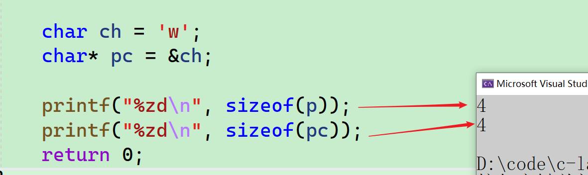

+ 可以看到，都是4个字节，指针变量的大小是固定的，不要以为`char*`类型的就小，看不起`char*`类型的指针~~

> x86环境下为什么`char*`的指针变量和`int*`的指针变量都是4个字节呢？
>

+ 指针变量是干什么呢?是为了存放地址的
+ 那指针变量的大小是取决于存放一个地址需要多大的空间！！！
+ 地址都是32个0/1组成的二进制序列的话，那么存放这个地址需要的空间的大小就是4个字节，所以指针变量的大小都是4个字节~~
+ 同样x64环境，64根地址线，地址就是64个0/1组成的二进制序列，存放这样的地址，需要8个字节，所以指针变量的大小就是8个字节~~

```c
#include <stdio.h>
//指针变量的大小取决于地址的大小
//32位平台下地址是32个bit位（即4个字节）
//64位平台下地址是64个bit位（即8个字节）
int main()
{
    printf("%zd\n", sizeof(char*));
    printf("%zd\n", sizeof(short*));
    printf("%zd\n", sizeof(int*));
    printf("%zd\n", sizeof(double*));
    return 0;
}
```

+ **32位下：**

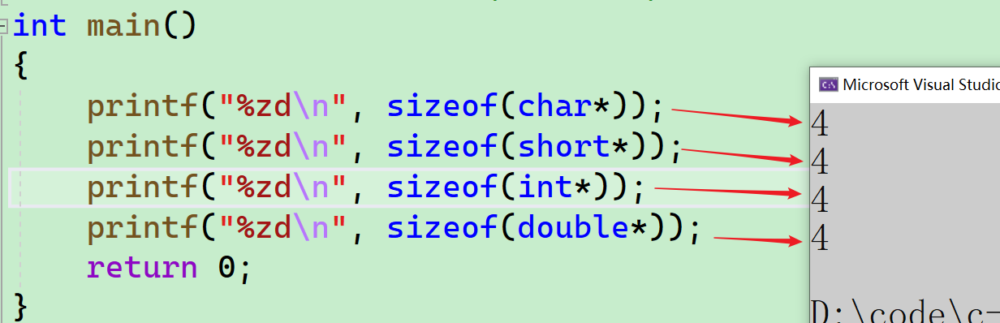

+ **64位下：**

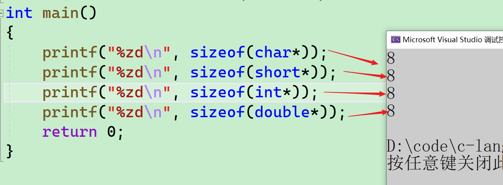

**结论：**

+ 32位平台下地址是32个bit位，指针变量大小是4个字节
+ 64位平台下地址是64个bit位，指针变量大小是8个字节
+ 注意指针变量的大小和类型是无关的，只要指针类型的变量，在相同的平台下，大小都是相同的。

### 4.1 指针变量类型的意义
+ 指针变量的大小和类型无关，只要是指针变量，在同一个平台下，大小都是一样的，为什么还要有各种各样的指针类型呢？
+ 其实指针类型是有特殊意义的，我们接下来继续学习~~

### 4.2 指针的解引用
+ 我们来看下面的两段代码，通过调试来进行分析，观察内存的变化~~

**代码一：**

```c
#include <stdio.h>
int main()
{
    int n = 0x11223344;
    int* pi = &n;
    *pi = 0;
    return 0;
}
```

**代码二：**

```c
#include <stdio.h>
int main()
{
    int n = 0x11223344;
    char* pc = &n;
    *pc = 0;
    return 0;
}
```

+ 我们按键盘上的`F10`，如果有的同学是笔记本，就在笔记本上按`Fn+F10`，开始调试
+ 打开调试->窗口->内存->

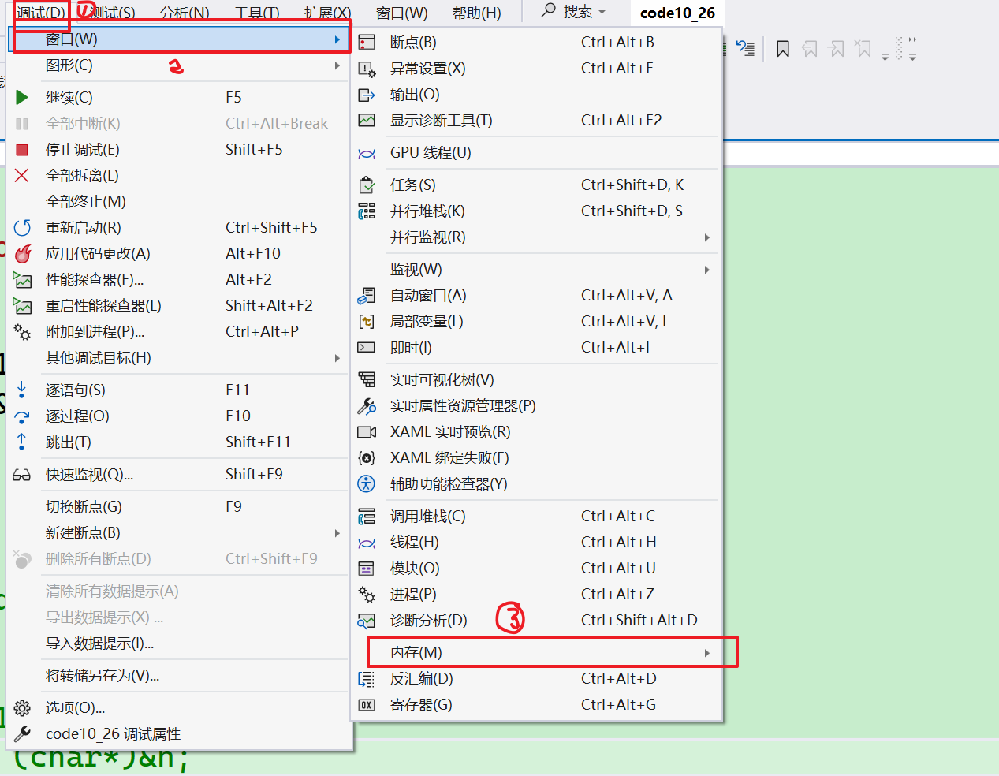

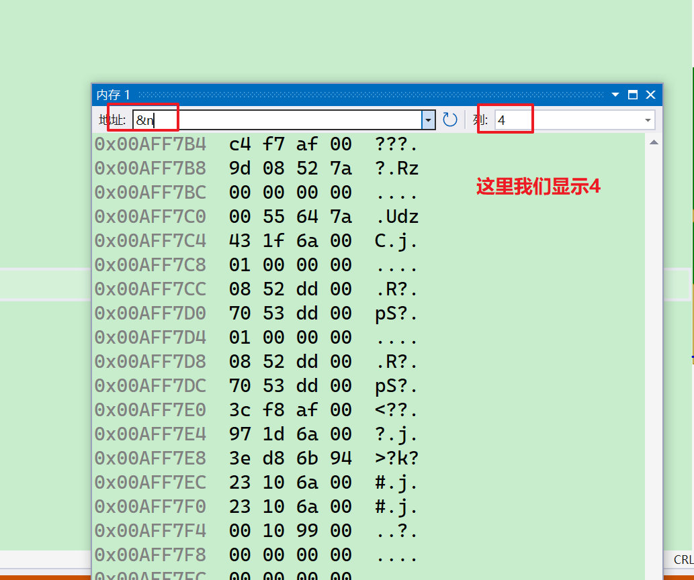

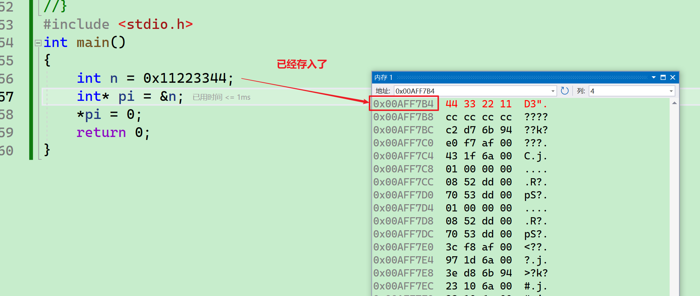

+ 这个时候我们发现，怎么是倒着存的？不应该是正的存吗，这里就要涉及到一个概念，`大小端存储`

我们回归正题：

+ 我们把这个n的地址取出来放到pi变量里，然后解引用，把n的值改为0，我们可以看一下~~

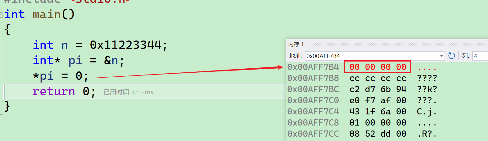

+ 可以看到，4个字节全部改为了0~~

再来看第二个代码~~

+ 我们可以看到我将n的地址放到`char*`类型的变量里，那能不能放的下？
+ 答案是能！！！刚刚就说过，指针变量都是4个字节，为什么放不下~~
+ 然后我们继续看，`*pc = 0`，我们这个是修改的几个字节?

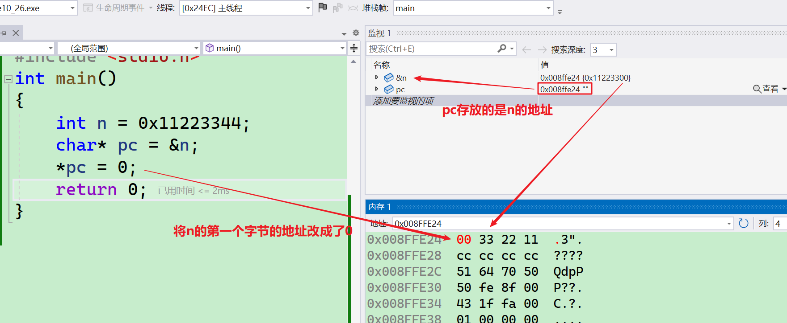

+ 我们可以看到，它只修改了一个字节，因为是`char*`的指针变量

**结论：**

1. 指针类型是有意义的
2. 指针类型是决定了指针在解引用操作时的权限，也就是一次解引用访问几个字节，`char*`类型的指针解引用访问1个字节，`int*`类型的指针一次访问4个字节

### 4.3 指针+-整数
+ 我们先来看下面这一段代码~~

```c
#include <stdio.h>
int main()
{
    int n = 0x11223344;
    int* p = &n;
    char* pc = &n;

    printf("p = %p\n", p);
    printf("p + 1 = %p\n", p + 1);

    printf("pc = %p\n", pc);
    printf("pc + 1 = %p\n", pc + 1);
    return 0;
}
```

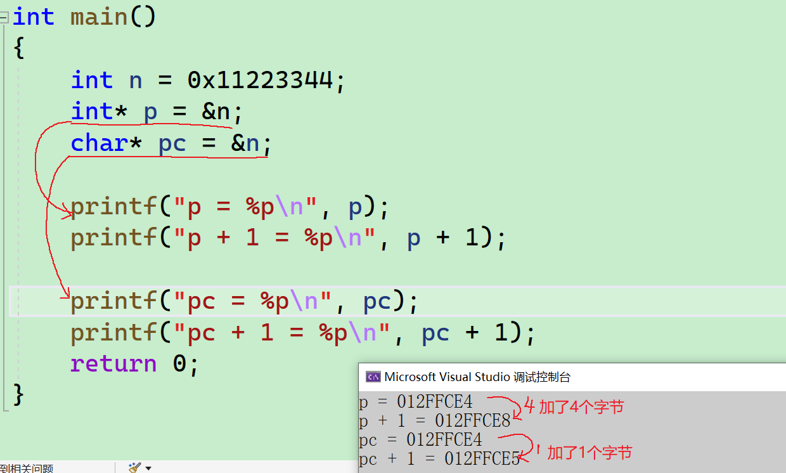

+ 我们可以看出， `char*` 类型的指针变量`+1`跳过1个字节， `int*` 类型的指针变量`+1`跳过了4个字节。
+ 这就是指针变量的类型差异带来的变化。

**结论：**

1. 指针类型是有意义的
2. 指针类型决定了指针进行+1/-1操作的时候一次跳过几个字节
3. 指针的类型决定了指针向前或者向后走一步有多大（距离）。

我们还可以用指针的方式访问~~

> 我们先来回忆一下数组的方式~~
>

```c
int main() {
    int arr[] = { 1,2,3,4,5,6,7,8,9,10 };
    //下标的方式
    int sz = sizeof(arr) / sizeof(arr[0]);
    int i = 0;
    for (i = 0; i < sz; i++) {
        printf("%d ", arr[i]);
    }
    return 0;
}
```

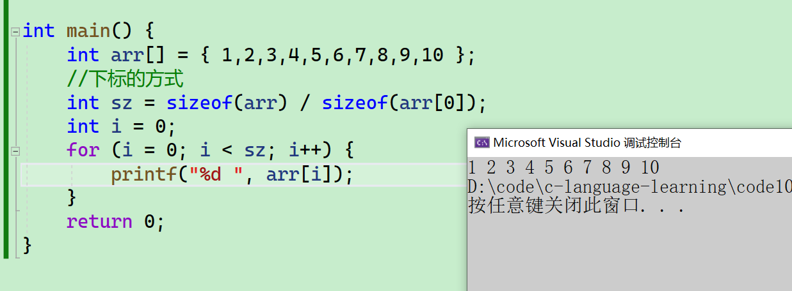

+ 可以看到，我们已经将数组中的元素已经打印出来了~~

> 我们再用指针的方式来访问~~
>

+ 我们将arr[0]的地址放入了指针p中，然后再通过`for`循环中`*p`找到arr每个的元素，那找到一个元素，还想找下一个元素怎么办？那就要加1，因为p是整形指针，`+1`跳过4个字节，正好找到下一个元素

```c
int main() {
    int arr[] = { 1,2,3,4,5,6,7,8,9,10 };
    //下标的方式
    int sz = sizeof(arr) / sizeof(arr[0]);
    //int i = 0;
    //for (i = 0; i < sz; i++) {
    //	printf("%d ", arr[i]);
    //}

    //指针的方式
    int i = 0;
    int* p = &arr[0];
    for (i = 0; i < sz; i++) {
        printf("%d ", *p);
        p = p + 1;
    }
    return 0;
}
```

+ 我们可以看到，也全部访问到了~~

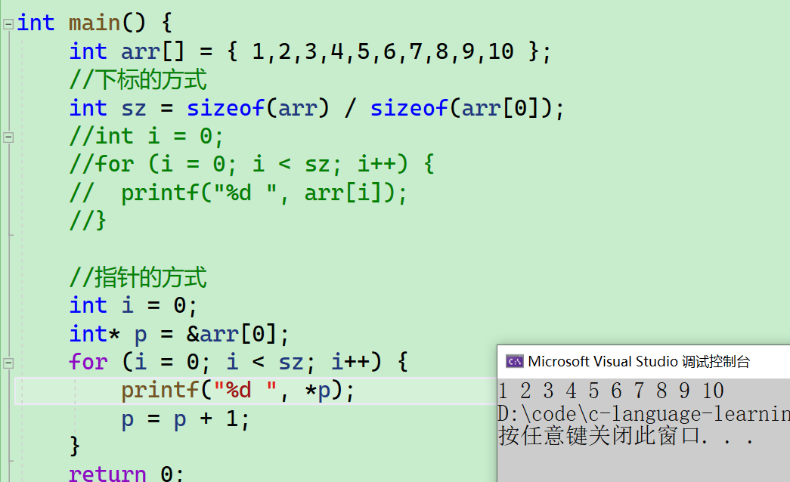

+ 我不想另外让`p+1`，我直接`*(p+i)`，这样可以吗？当然可以！！！

```c
int main() {
    int arr[] = { 1,2,3,4,5,6,7,8,9,10 };
    //指针的方式
    int i = 0;
    int* p = &arr[0];
    for (i = 0; i < sz; i++) {
        printf("%d ", *(p + i));
    }
    return 0;
}
```

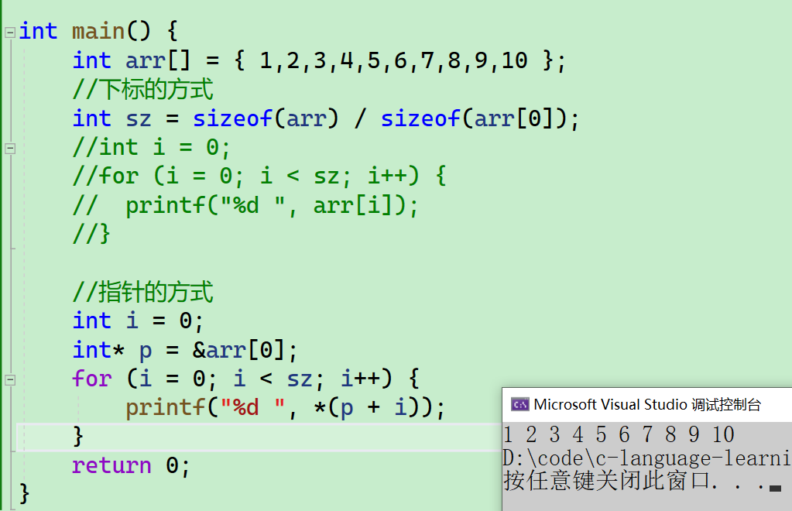  
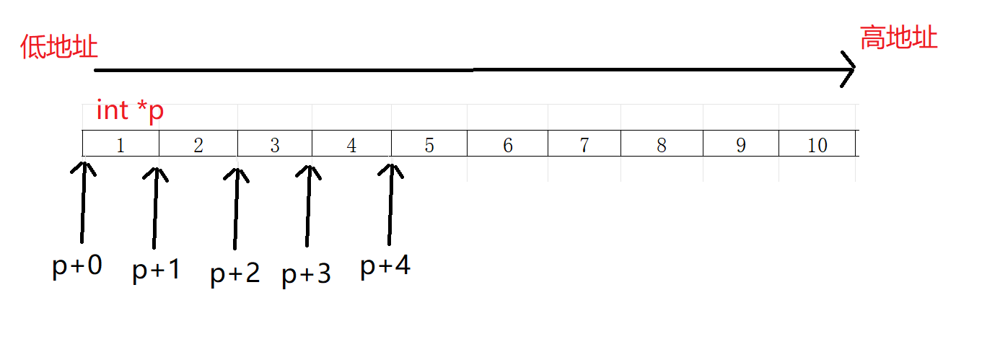

> 相信看完了上面，你对指针类型有一个对应理解~~
>

## 五、const修饰指针
+ 变量是可以修改的，如果把变量的地址交给一个指针变量，通过指针变量的也可以修改这个变量。

```c
#include<stdio.h>
int main() {
    int n = 100;
    n = 200;

    printf("%d\n", n);
    return 0;
}
```

+ 但是如果我们希望一个变量加上一些限制，不能被修改，怎么做呢？这就是const的作用。

```c
int main() {
    const int n = 100;
    n = 200;//err

    printf("%d\n", n);
    return 0;
}
```

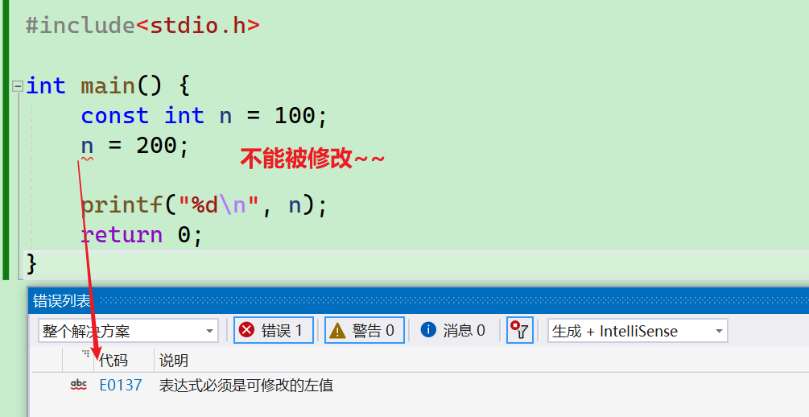

+ 上述代码中n是不能被修改的，其实n本质是变量，只不过被const修饰后，在语法上加了限制，只要我们在代码中对n就行修改，就不符合语法规则，就报错，致使没法直接修改n。
+ 但是如果我们绕过n，使用n的地址，去修改n就能做到了，虽然这样做是在打破语法规则。
+ 那有人这样想，这样不能修改，那我绕个弯，把n的地址取出来，交给一个指针变量p，然后进行修改~~

```c
int main() {
    const int n = 100;
    int* p = &n;
    *p = 200;

    printf("%d\n", n);
    return 0;
}
```

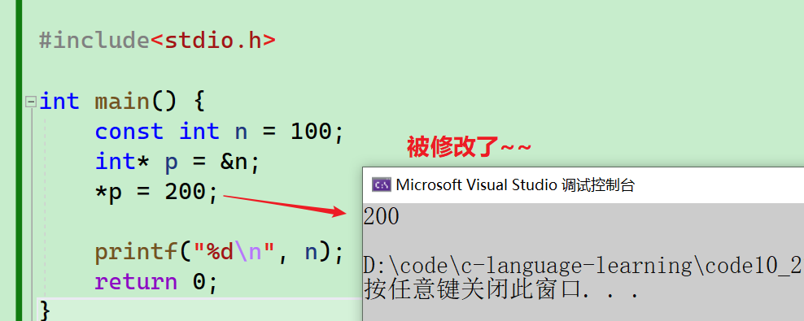

+ 这里一个确实修改了，但是我们还是要思考一下，为什么`n`要被`const`修饰呢？就是为了不能被修改，如果`p`拿到`n`的地址就能修改`n`，这样就打破了`const`的限制，这是不合理的，所以应该让p拿到n的地址也不能修改n。

### 5.1 const修饰指针变量
**const修饰指针有两种情况：**

1. const放在`*`的左边
2. const放在`*`的右边
+ 首先我们先将`const`放在`*`的左边~~

```c
int main() {
    int m = 100;
    int n = 10;

    const int* p = &n;
    *p = 0;

    p = &m;

    printf("%d\n", n);
    return 0;
}
```

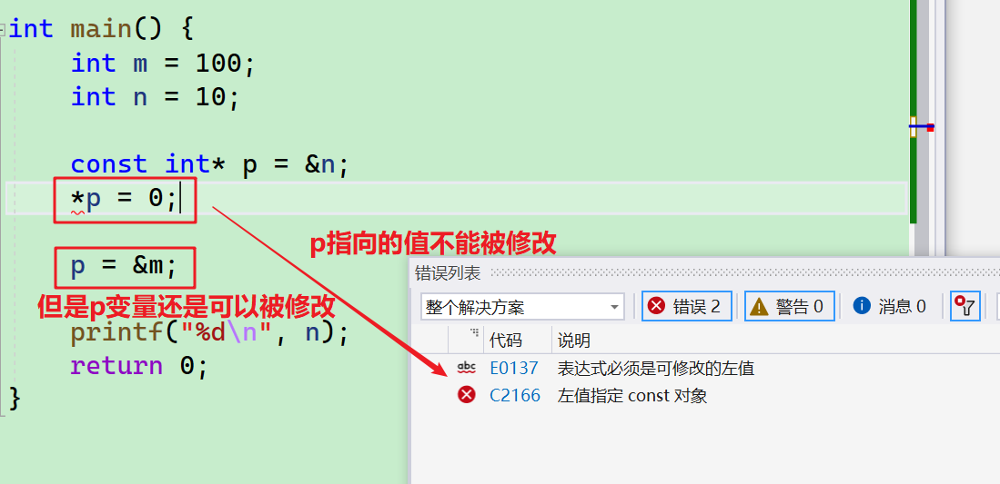

+ 这里可以看到`p`指向的值不能被修改
+ p变量还是可以被修改的~~

---

+ 然后我们先将`const`放在`*`的左边~~

```c
int main() {
    int m = 100;
    int n = 10;

    int* const p = &n;
    *p = 0;

    p = &m;

    printf("%d\n", n);
    return 0;
}
```

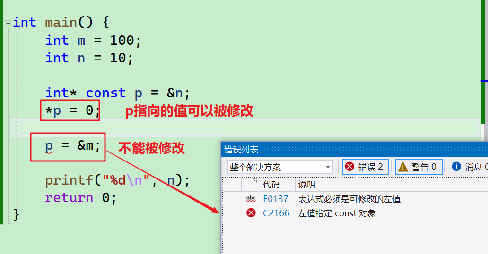

+ 可以看到p指向的对象可以被修改~~

**结论：**

1. `cons`t如果放在`*`的左边，修饰的是指针指向的内容，保证指针指向的内容不能通过指针来改变。但是指针变量本身的内容可变。
2. `const`如果放在`*`的右边，修饰的是指针变量本身，保证了指针变量的内容不能修改，但是指针指向的内容，可以通过指针改变。

---

或者这样：

```c
int const *  p = &n;
```

```c
int *const  p = &n;
```

+ 这两种方法都是可以的，我们只是关注的是`const`放在`*`左边还是右边

## 六、指针运算
### 6.1 指针+- 整数
+ 因为数组在内存中是连续存放的，只要知道第一个元素的地址，顺藤摸瓜就能找到后面的所有元素。

```c
int arr[10] = { 1,2,3,4,5,6,7,8,9,10 };
```

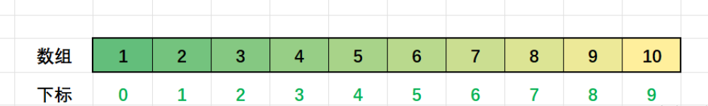

```c
#include <stdio.h>
//指针+- 整数
int main()
{
    int arr[10] = { 1,2,3,4,5,6,7,8,9,10 };
    int* p = &arr[0];
    int i = 0;
    int sz = sizeof(arr) / sizeof(arr[0]);
    for (i = 0; i < sz; i++)
    {
        printf("%d ", *(p + i));//p+i 这里就是指针+整数
    }
    return 0;
}
```

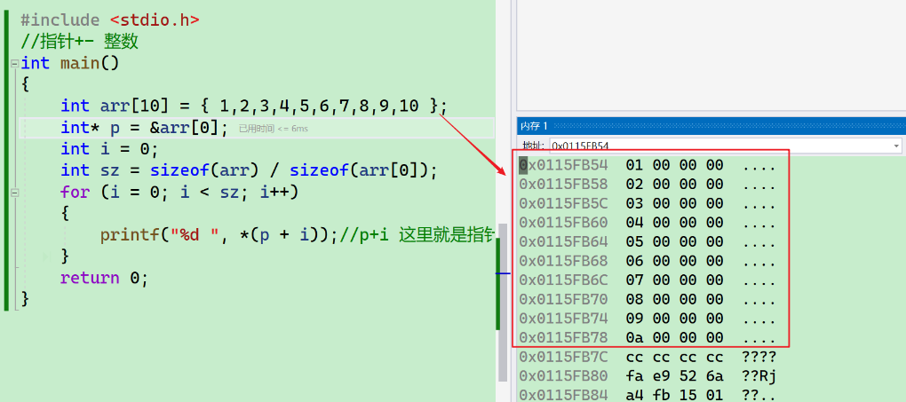

+ 可以看到已经放进去了

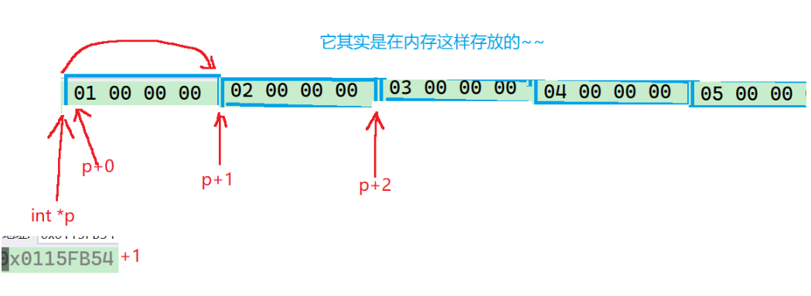

+ 这里`p+i`就访问到每一个元素了~~

### 6.2 指针-指针
+ 指针-指针是有前提的，指针和指针两个指针的指向同一块空间
+ 我们先来看下面的这个一个代码，输出的结果是多少？

```c
int main() {
    int arr[10] = { 0 };
    int ret = &arr[9] - &arr[0];

    printf("%d", ret);

    return 0;
 }
```

+ 答案是9

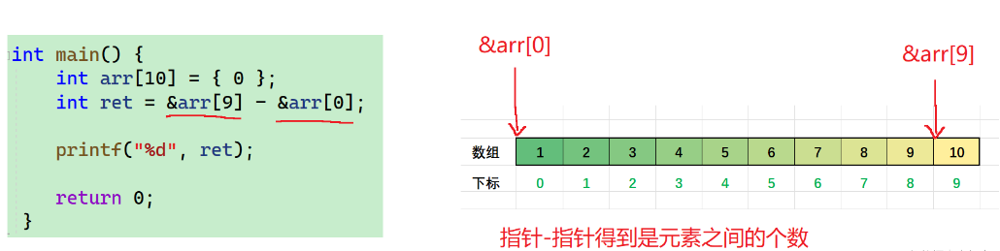

+ 也可以这样理解，`&arr[0]+9`--->>>`&arr[9]`
+ **结论：** 指针-指针得到的绝对值，是指针和指针之间元素的个数

---

那这个有什么用呢？还记得有一个函数`strlen`吗？

+ `strlen`的功能是求字符串长度，如果有同学不了解这个函数的话可以去[cplusplus](https://legacy.cplusplus.com/reference/cstring/strlen/?kw=strlen)网站上看一下
+ 我们来看一下怎么使用

```c
int main() 
{
    char arr[] = "abcdef";
    int len = strlen(arr);

    printf("%d\n", len);
    return 0;
}
```

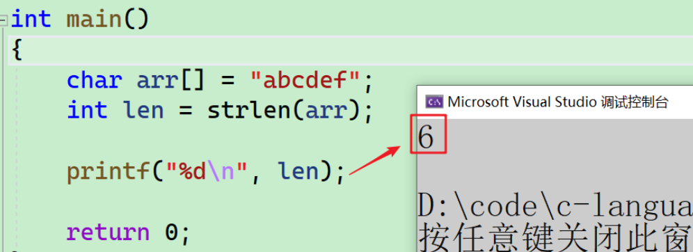

+ 可以看到它已经求出字符串长度了~~
+ 我们知道字符串的结束标志是`\0`，让我求长度，我就统计`\0`之前出现字符的个数

---

+ 那我们现在自己模拟实现一下这个函数~~
+ 我们这里写成`my_strlen`，我们把数组传参，然后形参以指针接收，指针指向了数组首元素的地址，然后我们定义个计数器count，如果`p!=\0`,`count++`，`p++`，最后返回count的个数~~

```c
int my_strlen(char* p)
{
    int count = 0;
    while (*p != '\0')
    {
        count++;
        p++;
    }
    return count;
}


int main() 
{
    char arr[] = "abcdef";
    int len = my_strlen(arr);

    printf("%d\n", len);
    return 0;
}
```

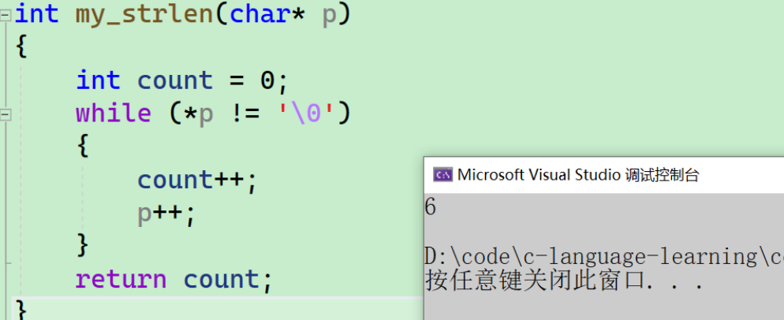

我们再写出另一个版本，接下来继续看~~

+ 我们知道指针减去指针得到的是元素之间的个数
+ 首先我记录一下起始位置，让`p++`，一直找到`\0`为止，最后返回p-s就得到了元素的个数~~
+ 我们来看一下代码和结果~~

```c
#include <stdio.h>
int my_strlen(char* s)
{
    char* p = s;
    while (*p != '\0')
        p++;
    return p - s;
}
int main()
{
    printf("%d\n", my_strlen("abc"));
    return 0;
}
```

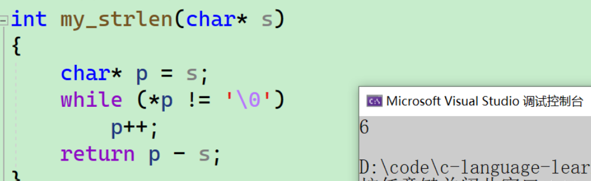

### 6.3 指针的关系运算
+ 所谓的关系运算，就是比较大小
+ 我们来看一下例子~~

```c
#include <stdio.h>
int main()
{
    int arr[10] = { 1,2,3,4,5,6,7,8,9,10 };
    int* p = &arr[0];
    int i = 0;
    int sz = sizeof(arr) / sizeof(arr[0]);
    while (p < arr + sz) //指针的大小比较
    {
        printf("%d ", *p);
        p++;
    }
    return 0;
}
```

+ 这里我们比较的是两个地址的大小关系~~
+ 我们可以看到，也是可以打印出来的~~

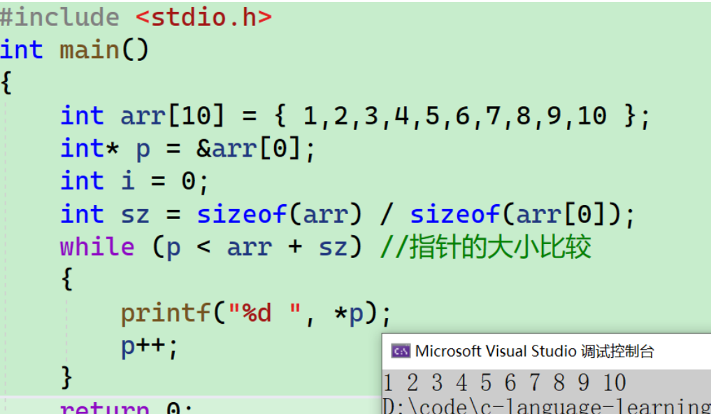

## 七、野指针
+ **概念：**  野指针就是指针指向的位置是不可知的（随机的、不正确的、没有明确限制的）

### 7.1 野指针成因
**指针未初始化：**

```c
#include <stdio.h>
int main()
{
    int* p;//局部变量指针未初始化，默认为随机值
    *p = 20;
    return 0;
}
```


+ 可以看到这里报了错，局部变量不初始化默认里面放的是`cccccccc`
+ 所以一个局部变量不初始化的话，会得到一个随机值~~
+ 而随便的一个地址，能解引用吗？`不能！！！`
+ 一块空间你要想使用，你需要先申请拿到这块空间

**指针越界访问：**

+ 我们先来看代码

```c
#include <stdio.h>
int main()
{
    int arr[10] = { 0 };
    int* p = &arr[0];
    int i = 0;
    for (i = 0; i <= 11; i++)
    {
        //当指针指向的范围超出数组arr的范围时，p就是野指针
        *(p++) = i;
    }
    return 0;
}
```

+ 我们这里的`p++`是先执行的，而`p++`是先使用后`++`
+ 我们这里可以看到，我把`arr[0]`的地址放入了`*p`指针变量，然后我们进行遍历赋值，那我们这里判断条件是不是就越界访问了，超出了数组的范围，当指针指向的范围超出数组`arr`的范围时，p就是野指针，这是很危险的
+ 我们这里还可以调试一下看看

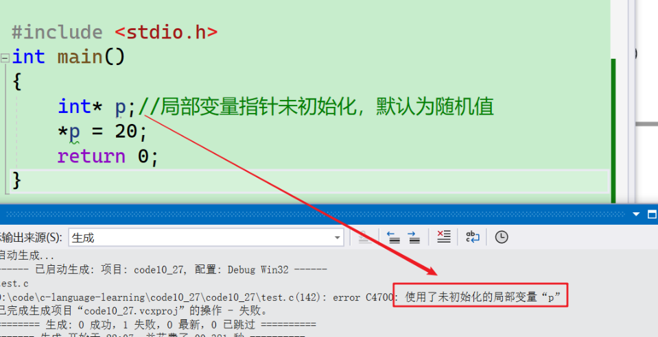

+ 可以看到，数组`arr`造到了破坏，而越界访问的内容也修改了，如此可见，这多么的危险！！

### 7.2 指针指向的空间释放
```c
#include <stdio.h>
int* test()
{
    int n = 100;
    return &n;
}
int main()
{
    int* p = test();
    printf("%d\n", *p);
    return 0;
}
```

+ 这里创建了一个函数`test()`，返回一个地址，既然这个函数返回的是一个地址，那我用一个指针来接收，然后`*p`这个地址
+ 这个`n`在出这个函数的时候被销毁了，这就会造成指针指向的空间释放~~

## 八、如何规避野指针
### 8.1 指针初始化
+ 如果明确知道指针指向哪里就直接赋值地址
+ 如果不知道指针应该指向哪里，可以给指针赋值`NULL`

> 什么意思呢，我们用代码来说~~	
>

+ 这里的p非常明确的指向了a，直接赋值~~

```c
int main() 
{
    int a = 10;
    int* p = &a;
    return 0;
}
```

+ 我们这里假设在这里创建了个`ptr`，我现在不用，但我可以在后面才会用，但是这个指针变量不能空着，这个时候我们要给他初始化`NULL`

```c
int main() 
{
    int a = 10;
    int* p = &a;
    int* ptr = NULL;
    return 0;
}
```

+ NULL是什么呢？本质上就是空指针，我们这个时候可以右键，转到定义里看一下

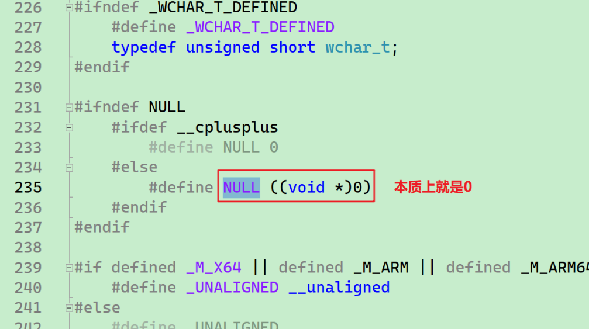

+ 那有的同学会说，那我直接给他赋值为0，可不可以呢？本质上是可以的，但是，当我们赋值为0了，有的时候会以为是一个整数，而我们赋值为`NULL`的时候，那就很明显了，一看就是空
+ `NULL` 是C语言中定义的一个标识符常量，值是0，0也是地址，这个地址是无法使用的，读写该地址会报错。

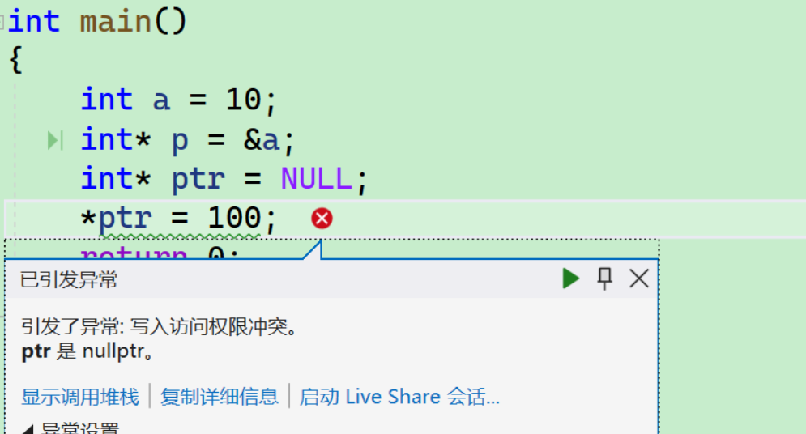

### 8.2 小心指针越界
+ 一个程序向内存申请了哪些空间，通过指针也就只能访问哪些空间，不能超出范围访问，超出了就是越界访问

### 8.3 指针变量不再使用时，及时置NULL，指针使用之前检查有效性
+ 当指针变量指向一块区域的时候，我们可以通过指针访问该区域，后期不再使用这个指针访问空间的时候，我们可以把该指针置为NULL。因为约定俗成的一个规则就是：只要是NULL指针就不去访问，同时使用指针之前可以判断指针是否为NULL。

这里我们创建了一个数组，然后用指针遍历这个数组，当遍历完后，指针已经指向了10的后面，指向了不属于我们的空间

+ 假设暂时不再使用p了，为了安全，我们可以把p赋值为`NULL`
+ 如果后面还会用到这个指针，我们再把这个p赋值，我们还可以再进行判断是否为`NULL`

```c
int main()
{
    int arr[10] = { 1,2,3,4,5,67,7,8,9,10 };
    int* p = &arr[0];
    for (int i = 0; i < 10; i++)
    {
        *(p++) = i;
    }
    //此时p已经越界了，可以把p置为NULL
    p = NULL;
    //下次使用的时候，判断p不为NULL的时候再使用
    //...
    p = &arr[0];//重新让p获得地址
    if (p != NULL) //判断
    {
        //...
    }
    return 0;
}
```

### 8.4 避免返回局部变量的地址
+ 首先我们先调用了一下`test`函数，函数里创建了个数组，数组是局部变量，而我们返回了这个数组的地址，我们使用了一个指针变量`p`来接收，当`test`函数返回的时候局部变量已经被操作系统回收了，这就会造成野指针，如果有看过函数的栈帧的创建与销毁的话就明白了
+ 返回栈空间地址的问题，很容易造成野指针的问题~~

```c
int* test()
{
    //局部变量
    int arr[10] = { 1,2,3,4,5,6,7,8,9,10 };
    //.....
    return arr;
}

int main()
{
    int* p = test();//p就是野指针
    return 0;
}
```

## 九、assert断言
+ assert.h 头文件定义了宏assert() ，用于在运行时确保程序符合指定条件，如果不符合，就报错终止运行。这个宏常常被称为“断言”。

```c
assert(p != NULL);
```

---

+ 上面代码在程序运行到这一行语句时，验证变量`p`是否等于`NULL` 。如果确实不等于NULL ，程序继续运行，否则就会终止运行，并且给出报错信息提示。
+ 我们可以看到，什么都不会发生~~

```c
#include <assert.h>

int main()
{
    int a = 10;
    int* p = &a;
    assert(p != NULL);
    return 0;
}
```

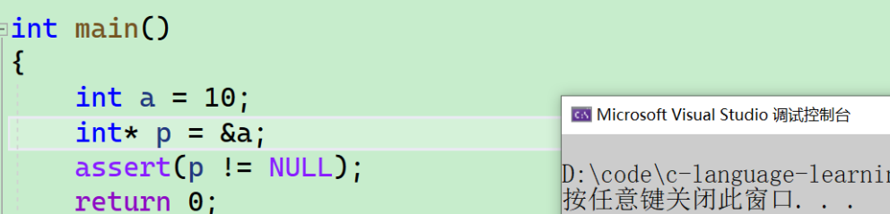

+ 当我们赋值为了一个空指针时，可以看到会报错误
+ 通过这样一个方式就可以拦住他~~

```c
#include <assert.h>

int main()
{
    int a = 10;
    int* p = NULL;
    assert(p != NULL);
    return 0;
}
```

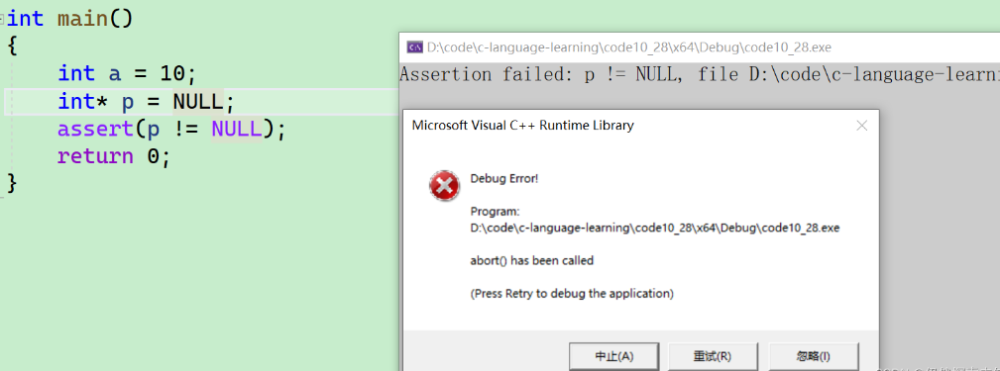

+ `assert()` 宏接受一个表达式作为参数。如果该表达式为真（返回值非零）， `assert()`不会产生任何作用，程序继续运行。如果该表达式为假（返回值为零）， `assert()` 就会报错，在标准错误流`stderr` 中写入一条错误信息，显示没有通过的表达式，以及包含这个表达式的文件名和行号。
+ `assert()` 的使用对程序员是非常友好的，使用`assert()` 有几个好处：它不仅能自动标识文件和出问题的行号，还有一种无需更改代码就能开启或关闭assert() 的机制。如果已经确认程序没有问题，不需要再做断言，就在`#include <assert.h>` 语句的前面，定义一个宏`NDEBUG` 。

```c
#define NDEBUG
#include <assert.h>
```

+ 然后，重新编译程序，编译器就会禁用文件中所有的`assert()` 语句。如果程序又出现问题，可以移除这条`#define NDBUG` 指令（或者把它注释掉），再次编译，这样就重新启用了`assert()` 语句。
+ `assert()` 的缺点是，因为引入了额外的检查，增加了程序的运行时间。
+ 一般我们可以在`debug`中使用，在`release`版本中选择禁用`assert`就行，在VS这样的集成开发环境中，在`release`版本中，直接就是优化掉了。这样在`debug`版本写有利于程序员排查问题，在`release`版本不影响用户使用时程序的效率。

## 十、指针的使用和传址调用
> 一直叫传值调用，一种叫传址调用，接下来我们继续看~~
>

### 10.1 传址调用
+ 学习指针的目的是使用指针解决问题，那什么问题，非指针不可呢？  
例如：**写一个函数**，交换两个整型变量的值
+ 一番思考后，我们可能写出这样的代码：

```c
#include <stdio.h>
void Swap1(int x, int y)
{
    int tmp = x;
    x = y;
    y = tmp;
}
int main()
{
    int a = 0;
    int b = 0;
    scanf("%d %d", &a, &b);
    printf("交换前：a=%d b=%d\n", a, b);
    Swap1(a, b);
    printf("交换后：a=%d b=%d\n", a, b);
    return 0;
}
```

**当我们运行代码，结果如下：**

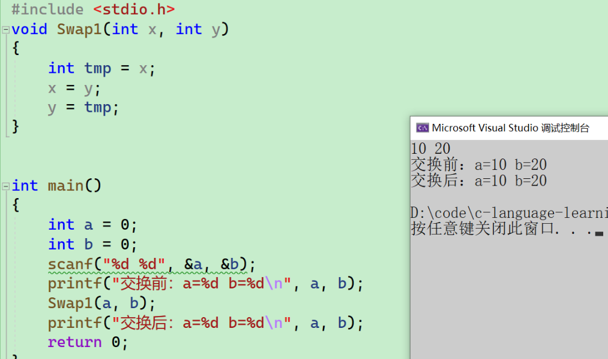

+ 这里怎么没有达到交换的效果？我们来调试看一下
+ 我们可以看到只有x和y交换了，而a和b没有交换

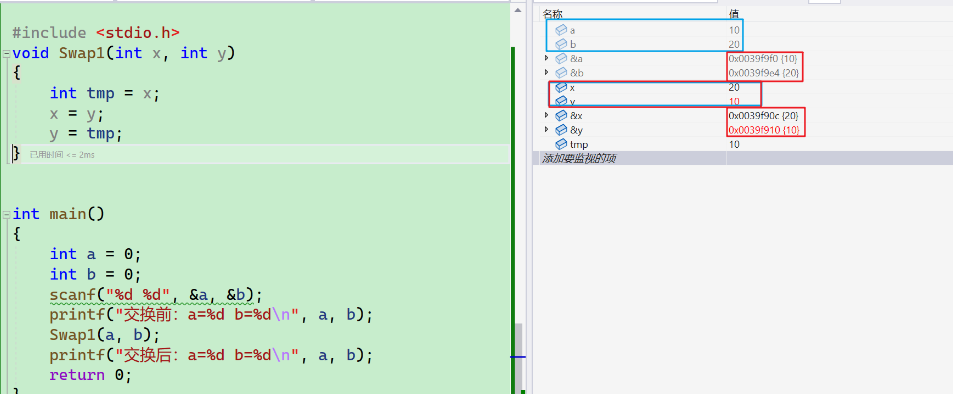

+ 我们发现在main函数内部，创建了a和b，a的地址是`0x0039f9f0`，b的地址是`0x0039f9e4`，在调用`Swap1`函数时，将a和b传递给了`Swap1`函数，在`Swap1`函数内部创建了形参x和y接收a和b的值，但是x的地址是`0x0039f90c`，y的地址是`0x0039f910`，x和y确实接收到了a和b的值，不过x的地址和a的地址不一样，y的地址和b的地址不一样，相当于x和y是独立的空间，那么在`Swap1`函数内部交换x和y的值，自然不会影响a和b，当`Swap1`函数调用结束后回到`main`函数，a和b的没法交换。`Swap1`函数在使用的时候，是把变量本身直接传递给了函数，这种调用函数的方式我们之前在函数的时候就知道了，这种叫**传值调用**。

**结论：** 实参传递给形参的时候，形参会单独创建一份临时空间来接收实参，对形参的修改不影响实参。所以Swap是失败的了。

### 10.2 传址调用
我们现在要解决的就是当调用Swap函数的时候，Swap函数内部操作的就是main函数中的a和b，直接将a和b的值交换了。那么就可以使用指针了，在main函数中将a和b的地址传递给Swap函数，Swap函数里边通过地址间接的操作main函数中的a和b就好了。

```c
#include <stdio.h>
void Swap2(int* px, int* py)
{
    int tmp = 0;
    tmp = *px;
    *px = *py;
    *py = tmp;
}
int main()
{
    int a = 0;
    int b = 0;
    scanf("%d %d", &a, &b);
    printf("交换前：a=%d b=%d\n", a, b);
    Swap2(&a, &b);
    printf("交换后：a=%d b=%d\n", a, b);
    return 0;
}
```

**首先看输出结果：**

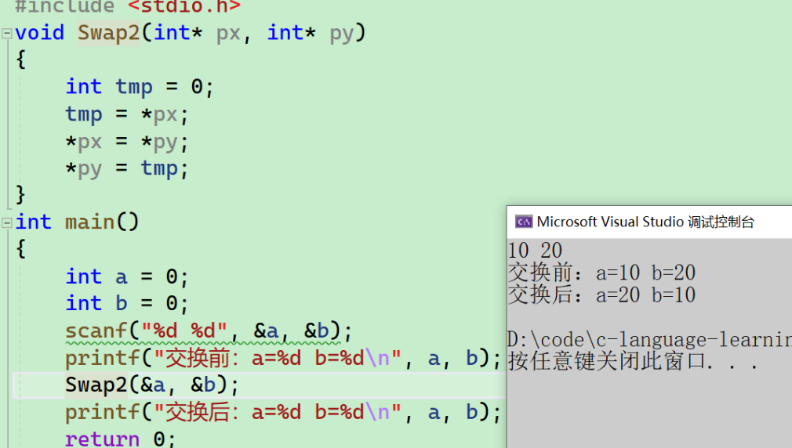

+ 我们可以看到实现成Swap2的方式，顺利完成了任务，这里调用Swap2函数的时候是将变量的地址传递给了函数，这种函数调用方式叫：**传址调用**。

# 从浅入深理解指针《第二阶段》
## 一、数组名的理解
+ 在上面的内容我们在使用指针访问数组的内容时，有这样的代码：

```c
int arr[10] = {1,2,3,4,5,6,7,8,9,10};
int *p = &arr[0];
```

+ 这里我们使用 `&arr[0] `的方式拿到了数组第一个元素的地址，但是其实数组名本来就是地址，而且是数组首元素的地址，我们来做个测试。

```c
#include <stdio.h>
int main()
{
    int arr[10] = { 1,2,3,4,5,6,7,8,9,10 };
    printf("&arr[0] = %p\n", &arr[0]);
    printf("arr = %p\n", arr);
    return 0;
}
```

+ 我们发现数组名和数组首元素的地址打印出的结果一模一样
+ 初步得出一个结论：**数组名就是数组首元素(第一个元素)的地址。**

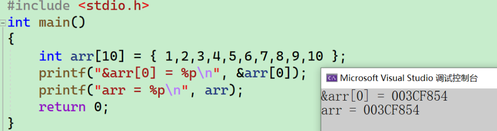

+ 数组名如果是数组首元素的地址，那下面的代码怎么理解呢？
+ 这里的arr是不是首元素的地址？是的，如果这里的数组名代表首元素的地址的话，结果应该是`4`，那是不是呢？
+ 当我真正的运行起来就可以发现，不是！！！

```c
#include <stdio.h>
int main()
{
    int arr[10] = { 1,2,3,4,5,6,7,8,9,10 };
    printf("%d\n", sizeof(arr));
    return 0;
}
```

+ 输出的结果是：40，如果arr是数组首元素的地址，那输出应该的应该是4/8才对。

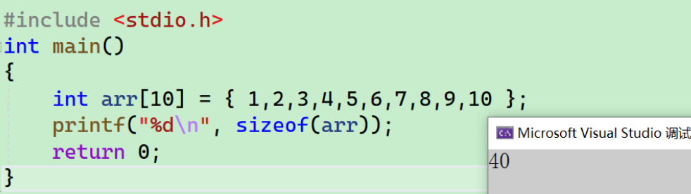

+ 其实数组名就是数组首元素(第一个元素)的地址是对的，但是有两个例外：

**sizeof(数组名)**，sizeof中单独放数组名，这里的数组名表示整个数组，计算的是整个数组的大小，单位是字节

**&数组名，** 这里的数组名表示整个数组，取出的是整个数组的地址（整个数组的地址和数组首元素的地址是有区别的）

+ 除此之外，任何地方使用数组名，数组名都表示首元素的地址。

```c
#include <stdio.h>
int main()
{
    int arr[10] = { 1,2,3,4,5,6,7,8,9,10 };
    printf("&arr[0] = %p\n", &arr[0]);
    printf("arr     = %p\n", arr);
    printf("&arr    = %p\n", &arr);
    return 0;
}
```

+ 可以看到arr和&arr的地址也是一样的，数组的地址是首元素的地址？

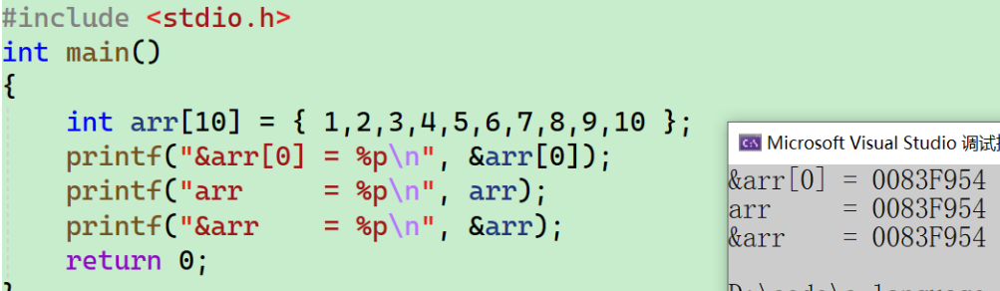

+ 数组的地址和数组首元素的地址的值是一模一样的

```c
#include <stdio.h>
int main()
{
    int arr[10] = { 1,2,3,4,5,6,7,8,9,10 };
    printf("&arr[0]   = %p\n", &arr[0]);
    printf("&arr[0]+1 = %p\n", &arr[0] + 1);
    printf("arr       = %p\n", arr);
    printf("arr+1     = %p\n", arr + 1);
    printf("&arr      = %p\n", &arr);
    printf("&arr+1    = %p\n", &arr + 1);
    return 0;
}
```

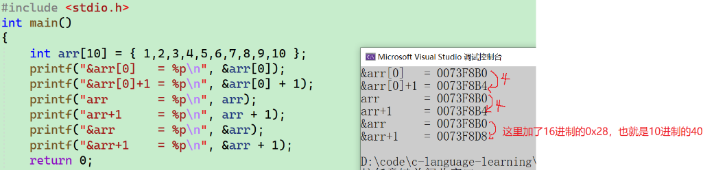

+ 但是`&arr` 和 `&arr+1`相差40个字节，这就是因为`&arr`是数组的地址，`+1`操作是跳过整个数组的。
+ 我们再来回忆一下，什么决定了指针加一加了多少，是不是指针类型，指针类型决定了指针加一加了几，我们这个地方`&arr[0]`它的类型是`int*`，而&arr加一加了40个字节，它的类型是什么呢？

## 二、使用指针访问数组
> 有了前面知识的支持，再结合数组的特点，我们就可以很方便的使用指针访问数组了。
>

+ 我们再来看这一段代码~~

```c
#include <stdio.h>
int main()
{
    int arr[10] = { 0 };
    //输入
    int i = 0;
    int sz = sizeof(arr) / sizeof(arr[0]);
    //输入
    int* p = arr;
    for (i = 0; i < sz; i++)
    {
        scanf("%d", p + i);
        //scanf("%d", arr+i);//也可以这样写
    }
    //输出
    for (i = 0; i < sz; i++)
    {
        printf("%d ", *(p + i));
    }
    return 0;
}
```

+ 我们定义了一个整型数组 arr 和一个指向该数组的指针 p，其中，表示数组元素的方法有两种，一种是 *(p + i)，另一种是 arr[i]。
+ 数组名arr是数组首元素的地址，可以赋值给p，其实数组名arr和p在这里是等价的。那我们可以使用arr[i]可以访问数组的元素，那p[i]是否也可以访问数组呢？

```c
#include <stdio.h>
int main()
{
    int arr[10] = { 0 };
    //输入
    int i = 0;
    int sz = sizeof(arr) / sizeof(arr[0]);
    //输入
    int* p = arr;
    for (i = 0; i < sz; i++)
    {
        scanf("%d", p + i);
        //scanf("%d", arr+i);//也可以这样写
    }
    //输出
    for (i = 0; i < sz; i++)
    {
        printf("%d ", p[i]);
    }
    return 0;
}
```

+ 在第18行的地方，将`(p+i)`换成`p[i]`也是能够正常打印的，所以本质上`p[i] `是等价于 `*(p+i)`。
+ 同理`arr[i]`应该等价于`*(arr+i)`，数组元素的访问在编译器处理的时候，也是转换成首元素的地址+偏移量求出元素的地址，然后解引用来访问的。
+ 这里的`arr[i]` == `*(arr+i)` == `*(i+arr)` == `i[arr]`是不是也可以这样，照样也能访问~~

```c
int main() {
    int arr[10] = { 1,2,3,4,5,6,7,8,9,10 };
    int* p = arr;
    int i = 0;
    int sz = sizeof(arr) / sizeof(arr[0]);
    for (i = 0; i < sz; i++) {
        printf("%p ======== %p\n", p + i, &arr[i]);
    }
    return 0;
}
```

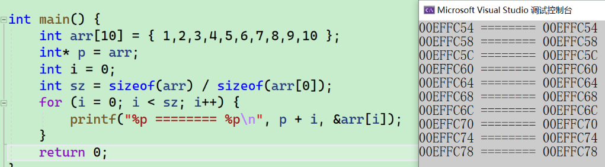

## 三、一维数组传参的本质
+ 首先从一个问题开始，我们之前都是在函数外部计算数组的元素个数，那我们可以把函数传给一个函数后，函数内部求数组的元素个数吗？

这里的sz1是多少，是10吗？sz2呢？也是10吗？

```c
#include <stdio.h>
void test(int arr[])
{
    int sz2 = sizeof(arr) / sizeof(arr[0]);
    printf("sz2 = %d\n", sz2);
}
int main()
{
    int arr[10] = { 1,2,3,4,5,6,7,8,9,10 };
    int sz1 = sizeof(arr) / sizeof(arr[0]);
    printf("sz1 = %d\n", sz1);
    test(arr);
    return 0;
}
```

+ 可以看到，sz1是10，而sz2是1，为什么是1呢？

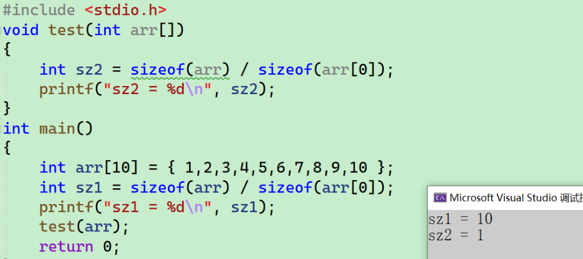

+ 我们发现在函数内部是没有正确获得数组的元素个数。
+ 这就要学习数组传参的本质了，上个小节我们学习了：数组名是数组首元素的地址；那么在数组传参的时候，传递的是数组名，也就是说**本质上数组传参本质上传递的是数组首元素的地址。**
+ 所以函数形参的部分理论上应该使用指针变量来接收首元素的地址。那么在函数内部我们写sizeof(arr) 计算的是一个地址的大小（单位字节）而不是数组的大小（单位字节）。正是因为函数的参数部分是本质是指针，所以在**函数内部是没办法求的数组元素个数的**

---

+ 当我把参数写成数组形式，本质上还是指针
+ 当我将参数写成指针形式，它计算一个指针变量的大小

```c
void test1(int arr[])//参数写成数组形式，本质上还是指针
{
    printf("%d\n", sizeof(arr));
}
void test2(int* arr)//参数写成指针形式
{
    printf("%d\n", sizeof(arr));//计算一个指针变量的大小
}
int main()
{
    int arr[10] = { 1,2,3,4,5,6,7,8,9,10 };
    test1(arr);
    test2(arr);
    return 0;
}
```

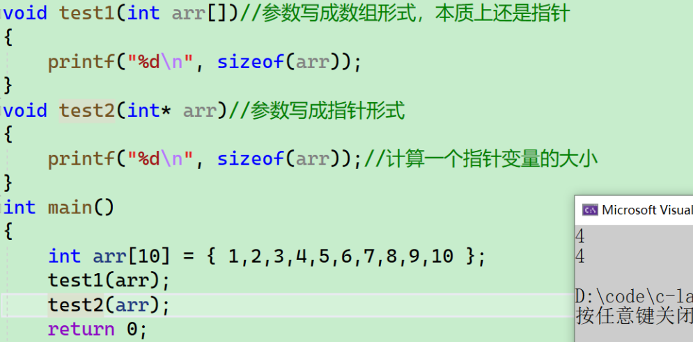

**总结：** 一维数组传参，形参的部分可以写成数组的形式，也可以写成指针的形式。

## 四、冒泡排序
> 接下来我们就学习一下这个冒泡排序，主要学习两个内容~~
>
> 1. 学习冒泡排序
> 2. 学习数组传参
>

+ 我们给了这样的一个降序数组，我们需要将这个数组排序，排为升序

```c
int main() {
    int arr[] = { 9,8,7,6,5,4,3,2,1,0 };
    //进行排序
    return 0;
}
```

+ 我们创建一个函数，要排的是谁呢？是arr

```c
int main() {
    int arr[] = { 9,8,7,6,5,4,3,2,1,0 };
    //进行排序
    int sz = sizeof(arr) / sizeof(arr[0]);

    sort(arr,sz);

    return 0;
}
```

+ 我们这里要讲一种排序，是冒泡排序
+ 冒泡排序的核心思想就是：**两两相邻的元素进行比较。**

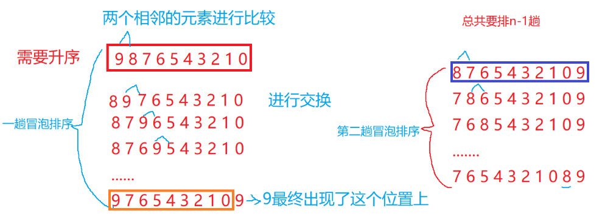

**代码如下：**

```c
void sort(int arr[], int sz) {
    //确定冒泡排序的趟数~~
    int i = 0;
    for (i = 0; i < sz - 1; i++) {
        //一趟冒泡排序
        int j = 0;
        for (j = 0; j < sz - 1 - i; j++) {
            if (arr[j] > arr[j + 1]) {
                //交换
                int tmp = arr[j];
                arr[j] = arr[j + 1];
                arr[j + 1] = tmp;
            }
        }
    }
}

void print(int arr[], int sz) {
    int i = 0;
    for (i = 0; i < sz; i++) {
        printf("%d ", arr[i]);
    }
}

int main() {
    int arr[] = { 9,8,7,6,5,4,3,2,1,0 };
    //进行排序
    int sz = sizeof(arr) / sizeof(arr[0]);

    sort(arr,sz);
    print(arr, sz);
    return 0;
}
```

+ 上面的代码也可以指针的形式，还是一样的道理~~
+ 上面的代码还是有优化的空间的，假设我的数组是这样的：

```c
int arr[] = { 9,0,1,2,3,4,5,6,7,8 };
```

+ 这里我们经过一趟冒泡排序后就已经排好了，但是我们上面的代码一定要进行9趟，我们不进行交换，但还是要执行，效率是比较低的
+ 如果已经排成有序的了，那后面就不用排了，那怎么做呢？

```c
void sort(int arr[], int sz) {
    //确定冒泡排序的趟数~~
    int i = 0;
    for (i = 0; i < sz - 1; i++) {
        //一趟冒泡排序
        int j = 0;
        int flag = 1;//假设数组是有序的
        for (j = 0; j < sz - 1 - i; j++) {
            if (arr[j] > arr[j + 1]) {
                //交换
                int tmp = arr[j];
                arr[j] = arr[j + 1];
                arr[j + 1] = tmp;
                flag = 0;//不是有序
            }
        }
        if (flag = 1) {
            break;
        }
    }
}
```

## 五、二级指针
+ 指针变量也是变量，是变量就有地址，那指针变量的地址存放在哪里？

```c
#include<stdio.h>
int main() {
    int a = 10;
    int* pa = &a;
    int** ppa = &pa;
    return 0;
}
```

+ a是整形变量，占用4个字节空间，a是自己的地址，&a拿到的就是a所占4个字节的第一个字节的地址
+ pa是指针变量，占用4/8个字节的空间，p也是有自己的地址，&p就拿到了p的地址，pa是一级指针
+ ppa也是指针变量，ppa是二级指针变量
+ 那么我们能不能&ppa呢？可以啊，ppa也是有自己的地址,&ppa就拿到了ppa的地址，放到一个三级指针-->`int*** pppa = &ppa`
+ 这些变量都是普通的变量，不要看的很厉害~~

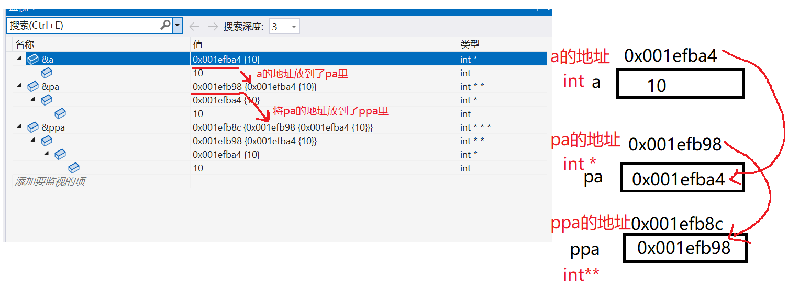

对于二级指针的运算有：  
`*ppa` 通过对`ppa`中的地址进行解引用，这样找到的是`pa `， `*ppa` 其实访问的就是

```c
int b = 20;
*ppa = &b;//等价于 pa = &b;
```

`**ppa` 先通过`*ppa` 找到`pa` ,然后对`pa` 进行解引用操作： `*pa` ，那找到的是`a` .

```c
**ppa = 30;
//等价于*pa = 30;
//等价于a = 30;
```

## 六、指针数组
+ 什么是指针数组？

我们类比一下：

1. 整形数组：存放整形的数组 int arr[10];
2. 字符数组：存放字符的数组 char ch[5];
3. 指针数组：存放指针的数组

整形数组和字符数组：

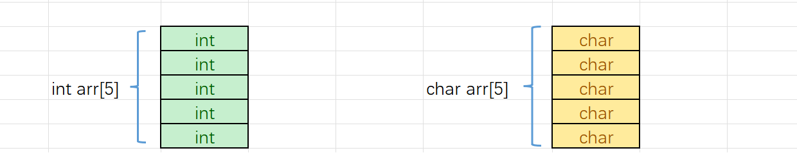

+ 指针数组的每个元素都是用来存放地址（指针）的。

如下图：

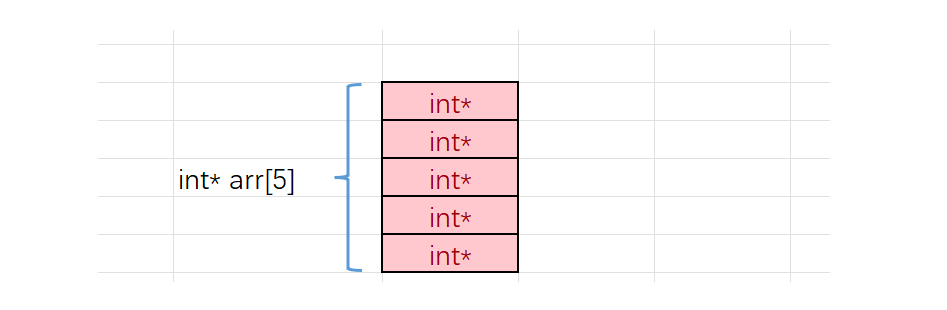

+ 指针数组的每个元素是地址，又可以指向一块区域。

**比如：**

```c
int main() {
    int a = 1;
    int b = 2;
    int c = 3;
    int d = 4;
    int e = 5;
    int* parr[5] = { &a,&b,&c,&d,&e };

    return 0;
}
```

+ 那我们也是可以打印出来的

```c
int main() {
    int a = 1;
    int b = 2;
    int c = 3;
    int d = 4;
    int e = 5;
    int* parr[5] = { &a,&b,&c,&d,&e };

    int i = 0;
    for (i = 0; i < 5; i++) {
        printf("%d ", *(parr[i]));
    }
    return 0;
}
```

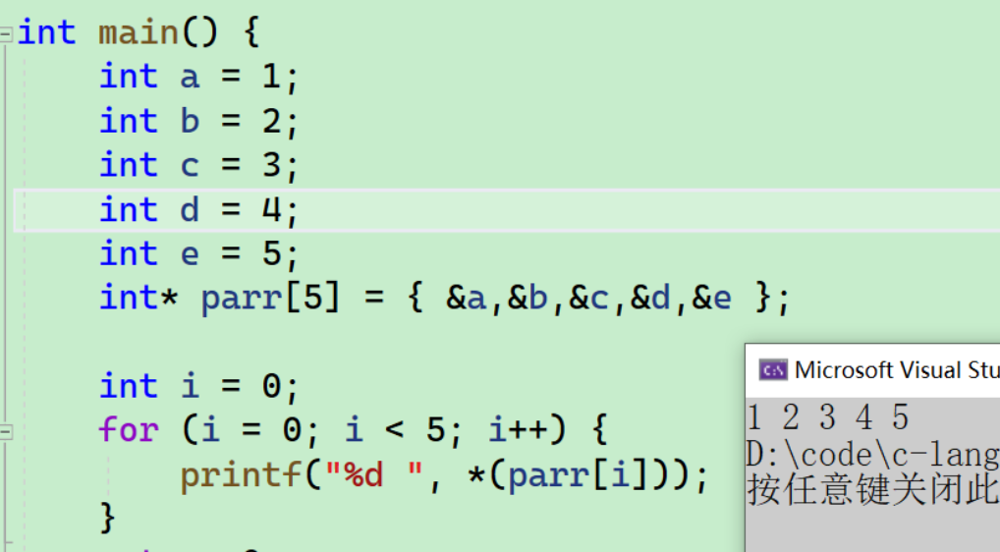

+ `parr[i]`找到了每个元素的地址，然后解引用，就找到了，便可以打印出来~~

## 七、指针数组模拟二维数组
```c
#include <stdio.h>
int main()
{
    int arr1[] = { 1,2,3,4,5 };
    int arr2[] = { 2,3,4,5,6 };
    int arr3[] = { 3,4,5,6,7 };
    //数组名是数组首元素的地址，类型是int*的，就可以存放在parr数组中
    int* parr[3] = { arr1, arr2, arr3 };
    int i = 0;
    int j = 0;
    for (i = 0; i < 3; i++)
    {
        for (j = 0; j < 5; j++)
        {
            printf("%d ", parr[i][j]);
        }
        printf("\n");
    }
    return 0;
}
```

+ `parr[i]`是访问parr数组的元素，`parr[i]`找到的数组元素指向了整型一维数组，`parr[i][j]`就是整型一维数组中的元素。  
上述的代码模拟出二维数组的效果，实际上并非完全是二维数组，因为每一行并非是连续的。
+ 如果不懂还可以看下图：

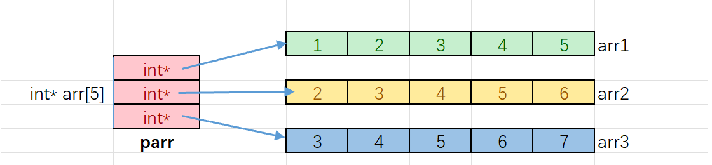

# 从浅入深理解指针《第三阶段》
## 一、字符指针变量
+ 在指针的类型中我们知道有一种指针类型为字符指针`char*` ;
+ 我们这里定义了ch变量，里面存了个字符	`w`
+ 然后我将这个变量的地址取出来放到pc里，它的类型是`char*`，pc就是字符指针变量

```c
int main()
{
    char ch = 'w';
    char* pc = &ch;
    return 0;
}
```

+ 还有一种写法：
+ 这里的指针变量p是要将字符"abcdefghi"放进去吗？
    - 字符指针变量是用来存放地址的
+ 这个代码的意思不是将"abcdefghi\0"字符串放到p中

```c
char* p = "abcdefghi";
```

+ 这里的表达式都有两个属性：值属性和类型属性
+ 这里的字符串就是一串连续的，和数组一样
+ 这个字符串就是首字符a的地址，也就是说只是把a的地址赋值给了p

我们可以这样验证：

```c
char* p = "abcdefghi";
printf("%c", *p);
```

+ 可以看到拿出了a

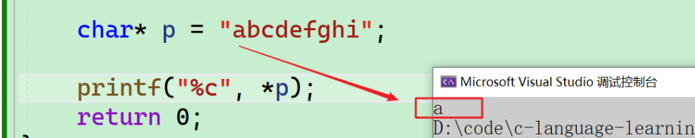

+ 这里的"abcdefghi"是常量字符串，是不能被修改的~~

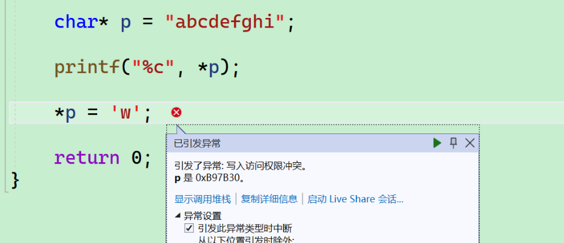

+ 我们可以给这个指针变量p加上`const`来修饰

```c
const char* p = "abcdefghi";
```

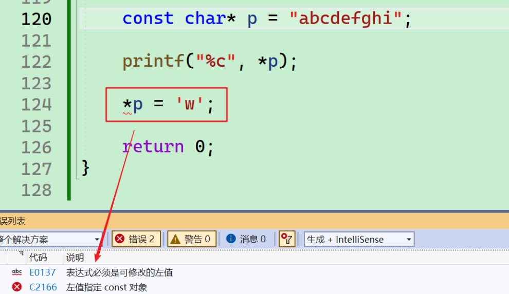

+ 那我想要打印一下这个字符串，怎么办？
+ 我们就以`%s`的方式来打印

```c
const char* p = "abcdefghi";
printf("%s", p);
```

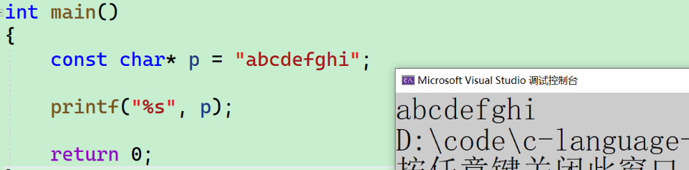

+ 通过调试我们也可以发现是连续存放的~~

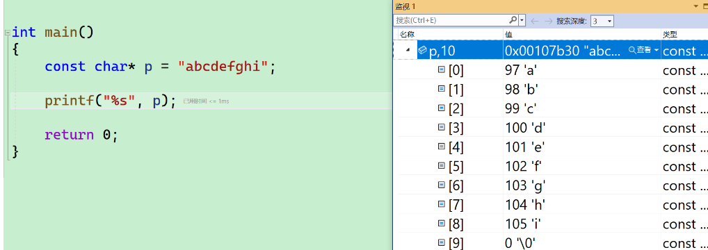

这道题打印的是什么呢？

```c
#include <stdio.h>
int main()
{
    char str1[] = "hello bit.";
    char str2[] = "hello bit.";
    const char* str3 = "hello bit.";
    const char* str4 = "hello bit.";
    if (str1 == str2)
        printf("str1 and str2 are same\n");
    else
        printf("str1 and str2 are not same\n");
    if (str3 == str4)
        printf("str3 and str4 are same\n");
    else
        printf("str3 and str4 are not same\n");
    return 0;
}
```

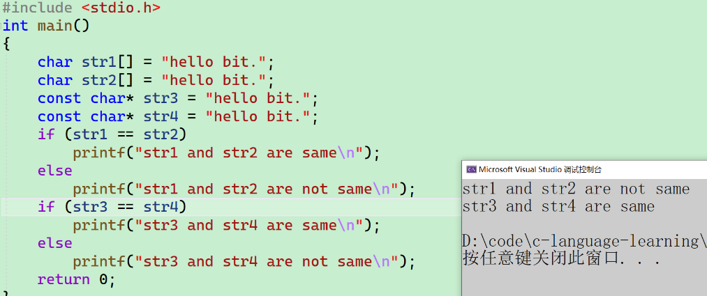

+ 这里str3和str4指向的是一个同一个常量字符串。C/C++会把常量字符串存储到单独的一个内存区域，当几个指针指向同一个字符串的时候，他们实际会指向同一块内存。
+ 但是用相同的常量字符串去初始化不同的数组的时候就会开辟出不同的内存块。所以str1和str2不同，str3和str4相同。

## 二、数组指针变量
### 2.1 数组指针变量是什么？
> 之前我们学习了指针数组，指针数组是一种数组，数组中存放的是地址（指针）。  
数组指针变量是指针变量？还是数组？
>

答案是：**指针变量**

我们已经熟悉：

+ **整形指针变量：** `int * pint;` 存放的是整形变量的地址，能够指向整形数据的指针。
+ **浮点型指针变量：**  `float * pf;` 存放浮点型变量的地址，能够指向浮点型数据的指针。

**数组指针变量应该是：存放的应该是数组的地址，能够指向数组的指针变量。**

+ 那么我们的数组指针怎么写呢？

```c
int *p1[10];
int (*p2)[10];
```

+ 这两个是哪个呢？
    - 答案是第二个，第一个是指针数组，

**数组指针变量**

```c
int (*p)[10];
```

+ **解释：** p先和*结合，说明p是一个指针变量变量，然后指着指向的是一个大小为10个整型的数组。所以p是一个指针，指向一个数组，叫 数组指针。
+ 这里要注意：`[]`的优先级要高于`*`号的，所以必须加上`（）`来保证p先和*结合。

### 2.2 数组指针变量怎么初始化
+ 数组指针变量是用来存放数组地址的，那怎么获得数组的地址呢？就是我们之前学习的`&数组名`。

```c
int arr[10] = { 0 };
&arr;//得到的就是数组的地址
```

+ 如果要存放个数组的地址，就得存放在数组指针变量中，如下：

```c
int(*p)[10] = &arr;
```

+ 我们调试也能看到&arr 和p 的类型是完全一致的。

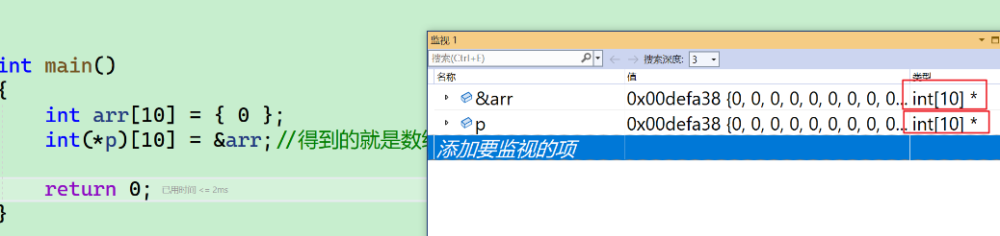

+ 数组指针类型的解析：

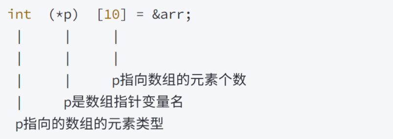

+ 去掉名字就是这个指针的类型
+ 这就是为什么arr和&arr是不一样的

```c
int arr[10] = { 0 };
arr; //数组首元素的地址 -- int*
&arr;//数组的地址      -- int(*)[10]
```

+ 指针类型决定了+1加了多少个字节

## 三、二维数组传参的本质
+ 有了数组指针的理解，我们就能够讲一下二维数组传参的本质了。
+ 过去我们有一个二维数组的需要传参给一个函数的时候，我们是这样写的：

```c
#include <stdio.h>
void test(int a[3][5], int r, int c)
{
    int i = 0;
    int j = 0;
    for (i = 0; i < r; i++)
    {
        for (j = 0; j < c; j++)
        {
            printf("%d ", a[i][j]);
        }
        printf("\n");
    }
}
int main()
{
    int arr[3][5] = { {1,2,3,4,5}, {2,3,4,5,6},{3,4,5,6,7} };
    test(arr, 3, 5);
    return 0;
}
```

+ 这里实参是二维数组，形参也写成二维数组的形式，那还有什么其他的写法吗？
+ 首先我们再次理解一下二维数组，二维数组起始可以看做是每个元素是一维数组的数组，也就是二维数组的每个元素是一个一维数组。那么二维数组的首元素就是第一行，是个一维数组.

如下图：

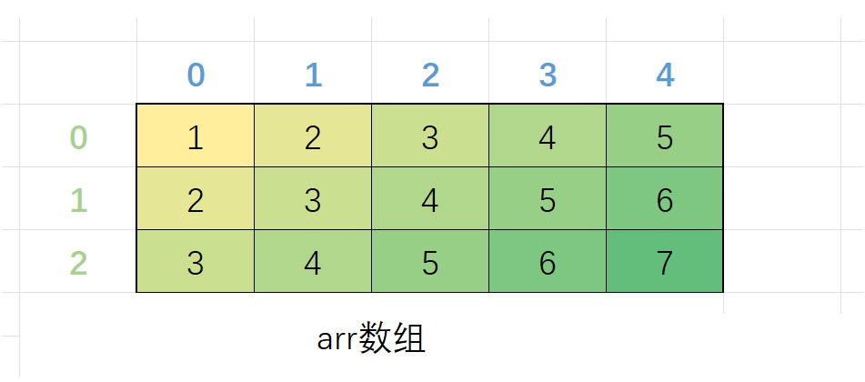

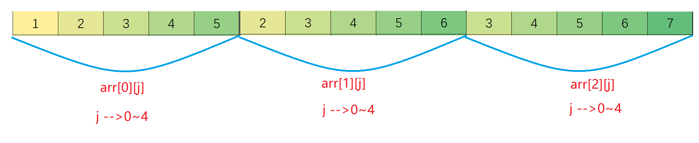

+ 二维数组的每一行是一个一维数组，这个一维数组可以看做是二维数组的第一个元素，所以二维数组也可以认为是一维数组的数组
+ 那么二维数组的数组名表示数组首元素的地址，就是第一行的地址，也就是一个一维数组的地址
+ 第一行的一维数组的类型就是`int [5]` ，所以第一行的地址的类型就是数组指针类型`int(*)[5]` 。那就意味着二维数组传参本质上也是传递了地址，传递的是第一行这个一维数组的地址，那么形参也是可以写成指针形式的。如下：

```c
#include <stdio.h>
void test(int(*p)[5], int r, int c)
{
    int i = 0;
    int j = 0;
    for (i = 0; i < r; i++)
    {
        for (j = 0; j < c; j++)
        {
            printf("%d ", *(*(p + i) + j));
        }
        printf("\n");
    }
}
int main()
{
    int arr[3][5] = { {1,2,3,4,5}, {2,3,4,5,6},{3,4,5,6,7} };
    test(arr, 3, 5);
    return 0;
}
```

**总结：** 二维数组传参，形参的部分可以写成数组，也可以写成指针形式。

## 四、函数指针变量
### 4.4 函数指针变量的创建
+ 什么是函数指针变量呢？
    - 数组指针，是指针，指向数组的指针，是存放数组的指针
    - 函数指针，是指针，是指向函数的指针，是存放函数地址的指针~~
+ 那么函数是否有地址呢？

```c
#include <stdio.h>
void test()
{
    printf("hehe\n");
}
int main()
{
    printf("test:  %p\n", test);
    printf("&test: %p\n", &test);
    return 0;
}
```

+ 对于函数来说，&函数名和函数名都是函数的地址~~

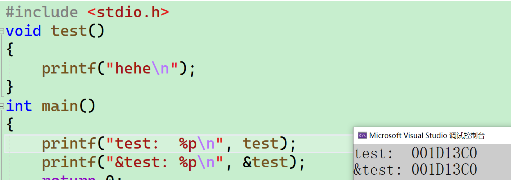

+ 我们还可以通过调试来看一下

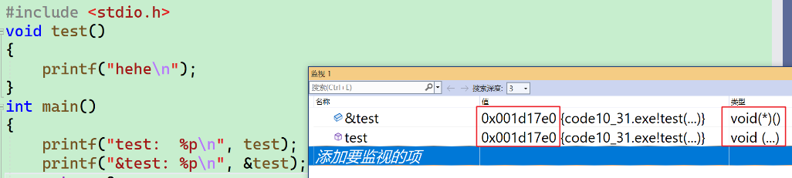

+ 确实打印出来了地址，所以函数是有地址的，函数名就是函数的地址，当然也可以通过&函数名的方式获得函数的地址。
+ 如果我们要将函数的地址存放起来，就得创建函数指针变量咯，函数指针变量的写法其实和数组指针非常类似。如下：

```c
void test()
{
    printf("hehe\n");
}
void (*pf1)() = &test;
void (*pf2)() = test;
int Add(int x, int y)
{
    return x + y;
}
int(*pf3)(int, int) = Add;
int(*pf3)(int x, int y) = &Add;//x和y写上或者省略都是可以的
```

### 4,5 函数指针变量的使用
> 那我们是不是要进行使用，怎么使用呢？
>

+ 调用函数指针传参，可以看到是能打印出来的

```c
int Add(int x, int y)
{
    return x + y;
}
int main()
{
    int (*pf)(int, int) = &Add;

    int r = (*pf)(3, 5);//调用函数指针

    printf("r = %d\n", r);

    return 0;
}
```

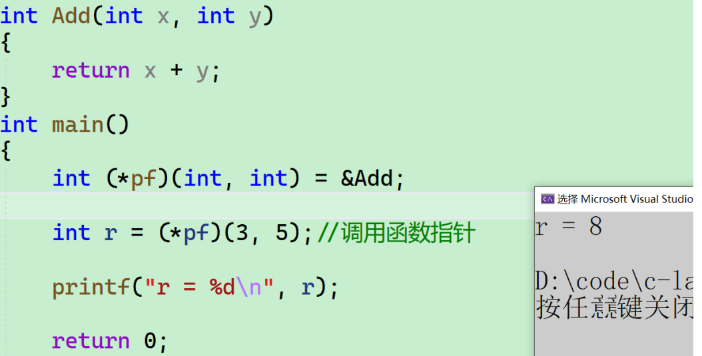

+ 我们继续来看，pf不加解引用操作符可以吗？答案是可以的~
+ 就算你写多个`*`也行，但是写上就更容易理解，可读性更高一些~~

```c
int r = pf(3, 5);
```

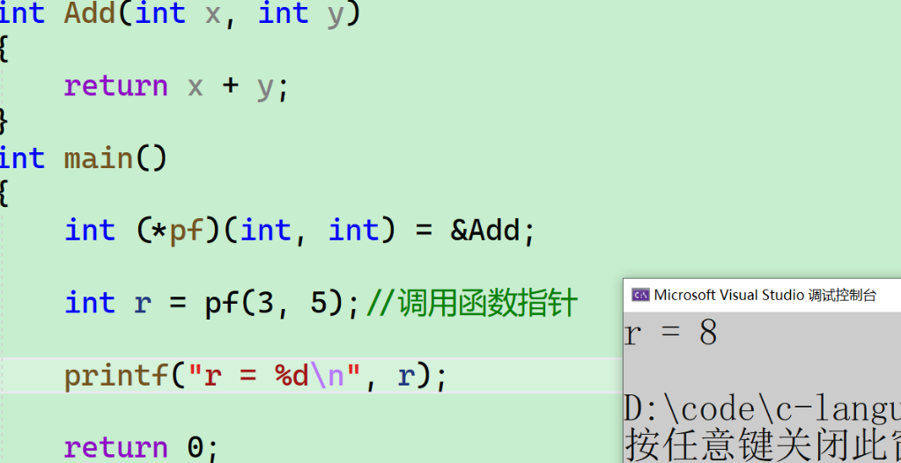

**函数指针类型解析：**

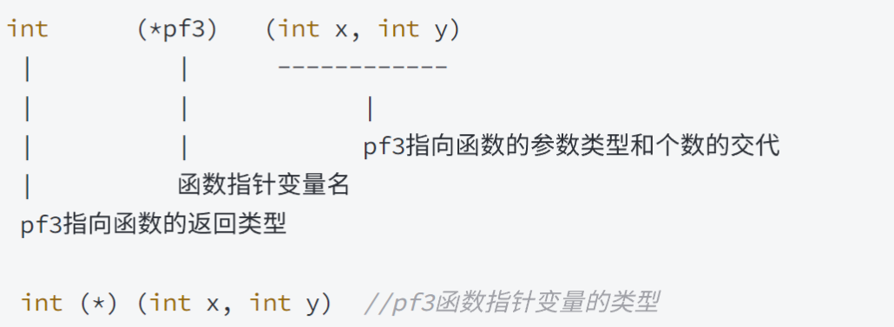

### 4.6 两段有趣的代码
代码1：

```c
(*(void (*)())0)();
```

+ 调用0地址处的函数，调用的函数，参数是无参，返回类型是void

代码2：

```c
void (*signal(int , void(*)(int)))(int);
```

+ `signal`是一个函数的函数名，上面的代码是一次函数声明，声明的`signal`函数有两个参数，第一个参数是int类型的，第二个参数是函数指针类型的，该函数指针指向的函数参数是int类型，返回类型是`void`
+ `signal`函数的返回类型也是一个函数指针，该函数指针指向的函数，参数是int，返回类型也是void

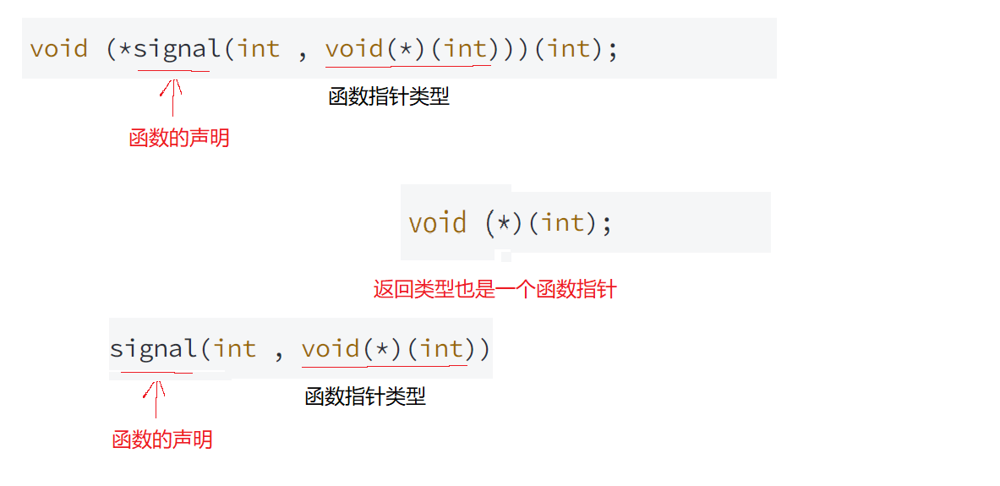

> 两段代码均出自：《C陷阱和缺陷》这本书
>

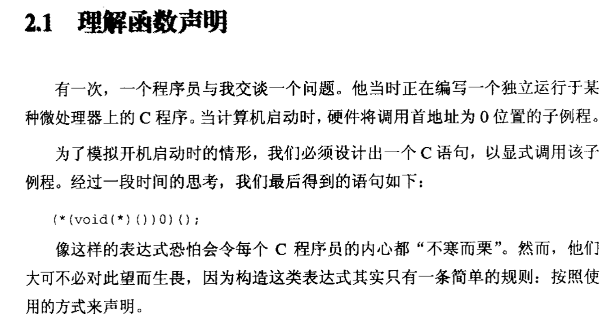

### 4.7 typedef关键字
+ typedef 是用来类型重命名的，可以将复杂的类型，简单化。
+ 比如，你觉得`unsigned int`写起来不方便，如果能写成`uint` 就方便多了，那么我们可以使用：

```c
typedef unsigned int uint;
//将unsigned int 重命名为uint
```

+ 如果是指针类型，能否重命名呢？其实也是可以的，比如，将`int*`重命名为`ptr_t`，这样写：

```c
typedef int* ptr_t;
```

+ 但是对于数组指针和函数指针稍微有点区别：
+ 比如我们有数组指针类型`int(*)[5]` ,需要重命名为`parr_t `，那可以这样写：

```c
typedef int(*parr_t)[5]; //新的类型名必须在*的右边
```

+ 函数指针类型的重命名也是一样的，比如，将`void(*)(int)` 类型重命名为`pf_t` ,就可以这样写：

```c
typedef void(*pfun_t)(int);//新的类型名必须在*的右边
```

+ 那么要简化代码2，可以这样写：

```c
typedef void(*pfun_t)(int);
pfun_t signal(int, pfun_t);
```

## 五、函数指针数组
+ 根据前面学的，我们再来类比一下：
    - 字符指针数组：数组，数组中存放的都是字符指针
    - 整形指针数组：数组，数组中存放的都是整形指针

那么我们是不是也可以将这个函数放到数组里？接下来我们来学习函数指针数组

+ 函数指针数组：数组，数组中存放的都是函数指针

比如：

```c
int *arr[10];
//数组的每个元素是int*
```

+ 那要把函数的地址存到一个数组中，那这个数组就叫函数指针数组，那函数指针的数组如何定义呢？

```c
int (*parr1[3])();
```

+ `parr1` 先和`[]` 结合，说明 `parr1`是数组，数组的内容是什么呢？  
是`int (*)()` 类型的函数指针。
+ 函数指针数组就是存放函数指针的数组~~

## 六、转移表
> 函数指针数组的用途：**转移表**
>

+ 举例：计算器的一般实现：

**初阶版本：**

```c
#include <stdio.h>

void menu()
{
    printf("*************************\n");
    printf("********1:add 2:sub****** \n");
    printf("********3:mul 4:div******\n");
    printf("********0:exit     ******\n");
    printf("*************************\n");
}

int add(int a, int b)
{
    return a + b;
}
int sub(int a, int b)
{
    return a - b;
}
int mul(int a, int b)
{
    return a * b;
}
int div(int a, int b)
{
    return a / b;
}
int main()
{
    int x, y;
    int input = 1;
    int ret = 0;
    do
    {
        menu();
        printf("请选择：");
        scanf("%d", &input);
        switch (input)
        {
        case 1:
            printf("输入操作数：");
            scanf("%d %d", &x, &y);
            ret = add(x, y);
            printf("ret = %d\n", ret);
            break;
        case 2:
            printf("输入操作数：");
            scanf("%d %d", &x, &y);
            ret = sub(x, y);
            printf("ret = %d\n", ret);
            break;
        case 3:
            printf("输入操作数：");
            scanf("%d %d", &x, &y);
            ret = mul(x, y);
            printf("ret = %d\n", ret);
            break;
        case 4:
            printf("输入操作数：");
            scanf("%d %d", &x, &y);
            ret = div(x, y);
            printf("ret = %d\n", ret);
            break;
        case 0:
            printf("退出程序\n");
            break;
        default:
            printf("选择错误\n");
            break;
        }
    } while (input);
    return 0;
}
```

+ 这个计算器的实现，有一些不好的地方，假设我这个计算器后面要算的功能更多了，随着函数的功能不断的增长，菜单要跟着变，switch里面的也是需要跟着变，代码会越来越长.
+ 这个时候有另外一种解决办法，解下来改造我们的版本

**改进版本：**

```c
#include <stdio.h>

void menu()
{
    printf("*************************\n");
    printf("********1:add 2:sub****** \n");
    printf("********3:mul 4:div******\n");
    printf("********0:exit     ******\n");
    printf("*************************\n");
}

int add(int a, int b)
{
    return a + b;
}
int sub(int a, int b)
{
    return a - b;
}
int mul(int a, int b)
{
    return a * b;
}
int div(int a, int b)
{
    return a / b;
}
int main()
{
    int x, y;
    int input = 1;
    int ret = 0;
    int(*pfArr[5])(int x, int y) = { 0, add, sub, mul, div }; //转移表
    do
    {
        menu();
        printf("请选择：");
        scanf("%d", &input);
        if ((input <= 4 && input >= 1))
        {
            printf("输入操作数：");
            scanf("%d %d", &x, &y);
            ret = (*pfArr[input])(x, y);
            printf("ret = %d\n", ret);
        }
        else if (input == 0)
        {
            printf("退出计算器\n");
        }
        else
        {
            printf("输入有误,请重新选择\n");
        }
    } while (input);
    return 0;
}
```

+ 这样改造我们的代码，代码量大幅度的缩短~~

## 七、 指向函数指针数组的指针
+ 指向函数指针数组的指针是一个 指针
+ 指针指向一个 数组 ，数组的元素都是 函数指针 ;

**如何定义？**	

```c
void test(const char* str)
{
    printf("%s\n", str);
}
int main()
{
    //函数指针pfun
    void (*pfun)(const char*) = test;
    //函数指针的数组pfunArr
    void (*pfunArr[5])(const char* str);
    pfunArr[0] = test;
    //指向函数指针数组pfunArr的指针ppfunArr
    void (*(*ppfunArr)[5])(const char*) = &pfunArr;
    return 0;
}
```

+ 这个指向`函数指针数组`的指针也不怎么重要，这里就不细讲了，让大家知道有这个概念，有兴趣的同学可以自行查阅~~

# 从浅入深理解指针《第四阶段》
## 一、回调函数是什么？
+ 回调函数就是一个`通过函数指针调用的函数`。
+ 如果你把函数的指针（地址）作为参数传递给另一个函数，当这个指针被用来调用其所指向的函数时，被调用的函数就是回调函数。
+ 回调函数`不是`由该函数的实现方直接调用，而是在`特定的事件或条件发生时由另外的一方调用的`，用于对该事件或条件进行响应。

我们首先对上面的计算器来进行举例：

+ 首先我们看到最一开始的计算器是不是很冗余，我们可以使用这个回调函数进行简化

```c
#include <stdio.h>

menu()
{
    printf("*************************\n");
    printf("********1:add 2:sub****** \n");
    printf("********3:mul 4:div******\n");
    printf("********0:exit     ******\n");
    printf("*************************\n");
}

int add(int a, int b)
{
    return a + b;
}
int sub(int a, int b)
{
    return a - b;
}
int mul(int a, int b)
{
    return a * b;
}
int div(int a, int b)
{
    return a / b;
}

void calc(int (*pf)(int, int))
{
    int ret, x, y;
    printf("输入操作数：");
    scanf("%d %d", &x, &y);
    ret = (*pf)(x, y);
    printf("ret = %d\n", ret);
}

int main()
{
    int input = 1;
    do
    {
        menu();
        printf("请选择：");
        scanf("%d", &input);
        switch (input)
        {
        case 1:
            calc(add);
            break;
        case 2:
            calc(sub);
            break;
        case 3:
            calc(mul);
            break;
        case 4:
            calc(div);
            break;
        case 0:
            printf("退出程序\n");
            break;
        default:
            printf("选择错误\n");
            break;
        }
    } while (input);
    return 0;
}
```

+ 我们都是通过这个函数指针来调用函数

**图解：**  
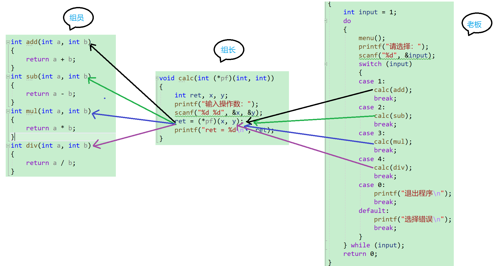

> 就好像是老板把任务分配给组长，组长再分配给组员实现内容~~
>

## 二、qsort使用举例
+ qsort是一个库函数，用来对数据进行排序，可以排任意类型的数据
+ 我们打开[cplusplus](https://legacy.cplusplus.com/)网站搜索[qsort](https://legacy.cplusplus.com/reference/cstdlib/qsort/?kw=qsort)

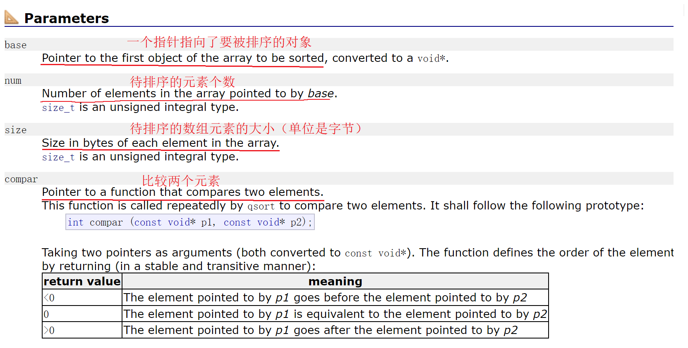

这个qsort函数有4个参数：

```c
void qsort(void* base, 
               size_t num, 
               size_t size,
           	   int (*compar)(const void*, const void*));
```

+ 第一个参数是指向待排序的第一个元素
+ 第二个参数是待排序的元素个数
+ 第三个参数是待排序的数组元素的大小（单位是字节）
+ 第四个参数是比较两个元素

---

+ 这里有个void*的指针类型，这个指针类型是`通用指针类型`,这个指针类型可以接收任意类型数据的地址，就可以理解成指针垃圾桶，谁的地址都可以往里扔~~
+ 是一个无具体类型的指针，所以就不能+1，也不能解引用

---

我们也介绍完了这个函数，我们来使用排序一下整形数组

**写出我们的主函数：**

```c
int main()
{
    int arr[] = { 3,2,5,6,8,7,9,1,4 };
    int sz = sizeof(arr) / sizeof(arr[0]);
    
    qsort(arr, sz, sizeof(arr[0]), cmp_int);
    
    for (size_t i = 0; i < sz; i++)
    {
        printf("%d ", arr[i]);
    }
    return 0;
}
```

+ 下面这里就剩下一个比较函数了，怎么写呢？我们再来看一个网站上面的介绍
+ 这个函数能够比较e1和e2指向的两个元素，并给出返回值

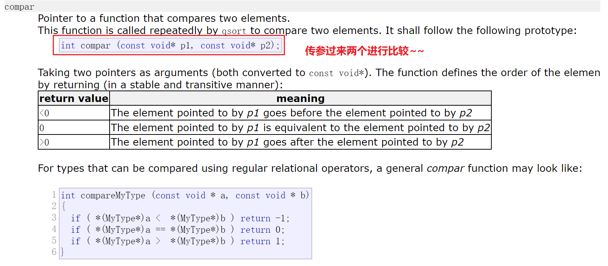

+ 我们也就按照上面的案例来写

```c
int cmp_int(const void* e1, const void* e2)
{
    return *(int*)e1 - *(int*)e2;
}
```

+ 现在我们来看已经完美排序了

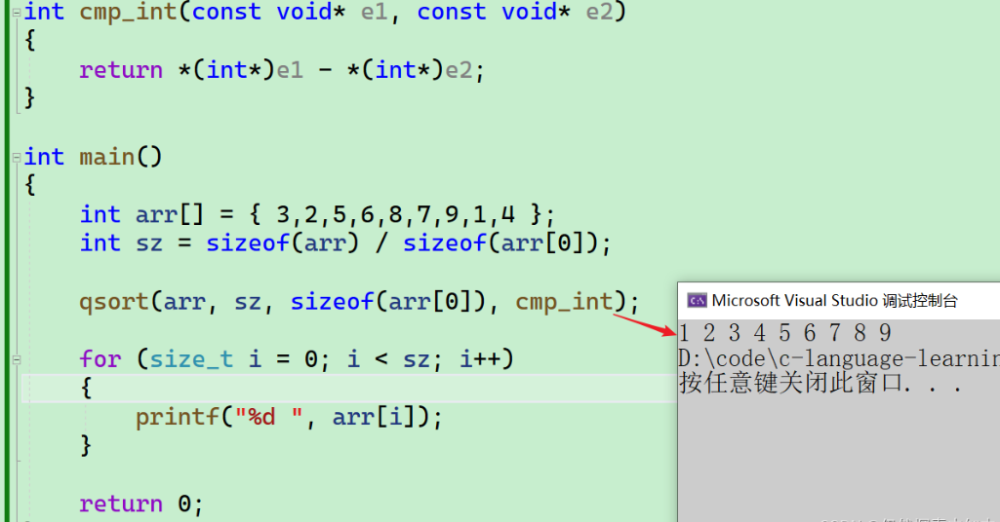

+ 那么对于整形数据也可以排序了，是不是也可以对字符/字符串类型排序，对结构体也可以进行排序
+ 首先我们对于名字进行排序，对于名字排序，名字是个字符串，不能使用大小于号来进行比较，我们需要用到strcmp函数来进行比较，打开cplusplus网站搜索[stcmp](https://legacy.cplusplus.com/reference/cstring/strcmp/?kw=strcmp)，发现这个函数的返回值也是整形，和qsort基本一样，我们使用的时候可以直接`return`

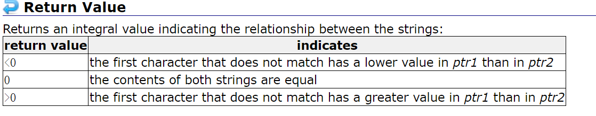

+ 首先写出我们的结构体和主函数

```c
struct Stu
{
    char name[20];
    int age;
};

int main()
{
    struct Stu s[] = { {"zhangsan",20 },{"lisi",18},{"wangwu",30} };

    qsort(s, sizeof(s) / sizeof(s[0]), sizeof(s[0]), stu_cmp_by_name);

    for (int i = 0; i < sizeof(s) / sizeof(s[0]); i++)
    {
        printf("%s %d\n", s[i].name, s[i].age);
    }

    return 0;
}
```

+ 然后对于比较函数我们可以这样写

```c
int stu_cmp_by_name(const void* e1, const void* e2)
{
    return strcmp(((struct Stu*)e1)->name,((struct Stu*)e2)->name);
}
```

+ 排序的时候是按照字典里的字符顺序排的
+ 可以看到，已经排序完成了~~

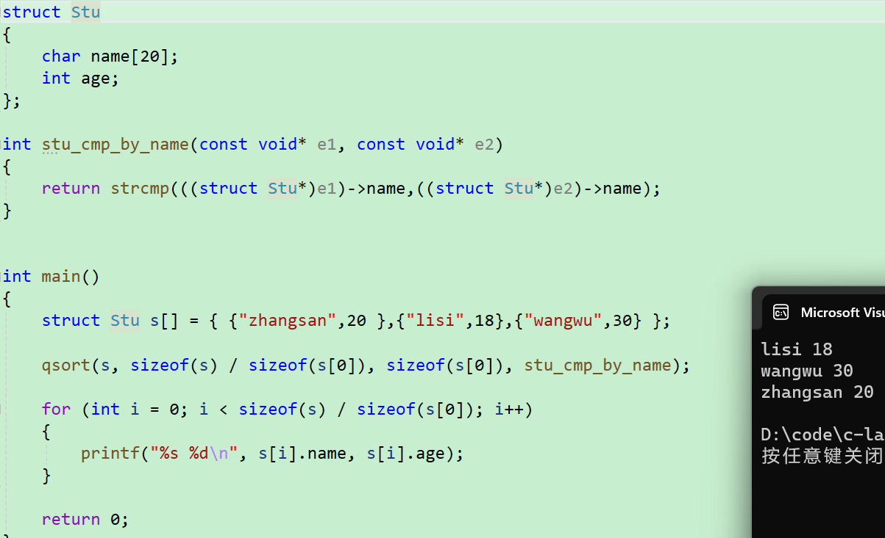

+ 那么回到上面，我们也可以对结构体的整形数据进行排序，也就是年龄
+ 我们直接写出来

```c
struct Stu
{
    char name[20];
    int age;
};

int stu_cmp_by_age(const void* e1, const void* e2)
{
    return ((struct Stu*)e1)->age - ((struct Stu*)e2)->age;
}

int main()
{
    struct Stu s[] = { {"zhangsan",20 },{"lisi",18},{"wangwu",30} };

    qsort(s, sizeof(s) / sizeof(s[0]), sizeof(s[0]), stu_cmp_by_age);

    for (int i = 0; i < sizeof(s) / sizeof(s[0]); i++)
    {
        printf("%s %d\n", s[i].name, s[i].age);
    }

    return 0;
}
```

+ 可以看到，对于年龄的排序也是可以排序成功的

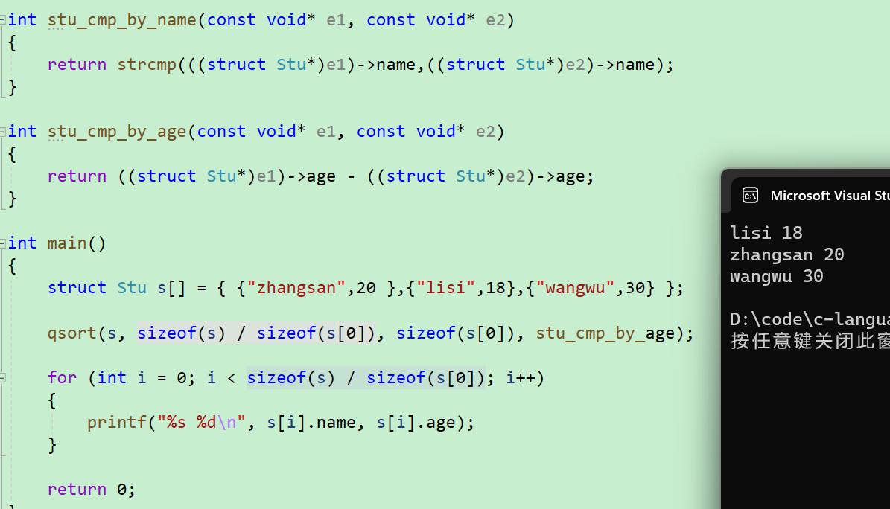

## 三、qsort函数的模拟实现
> qsort可以排序整形数据/字符数据/结构体数据...  
可以使用qsort函数对数据进行排序	
>

使用回调函数，模拟实现qsort（采用冒泡的方式）。

+ 今天我们使用冒泡排序，来实现一个对任意类型能够排序的函数
+ 我们先来实现一个整形的冒泡排序，然后再进行改造~~

```c
void bubble_sort(int arr[], int sz)
{
    int i = 0;
    for ( i = 0; i < sz - 1; i++)
    {
        int j = 0;
        for (j = 0; j < sz - 1 - i; j++)
        {
            if (arr[j] > arr[j + 1])
            {
                int tmp = arr[j];
                arr[j] = arr[j + 1];
                arr[j + 1] = tmp;
            }

        }
    }
}

int main()
{
    int arr[] = { 3,2,5,6,8,7,9,1,4 };
    int sz = sizeof(arr) / sizeof(arr[0]);

    bubble_sort(arr, sz);

    for (size_t i = 0; i < sz; i++)
    {
        printf("%d ", arr[i]);
    }
    return 0;
}
```

接下来我们开始**改造**~~

1. 改造参数  -- 让这个函数能够接受任意类型的数据
2. 改造比较方法 -- 让函数能够在排序时，比较不同类型的数据
3. 交换的代码也需要修改
+ e1是一个指针，存放了要比较元素的地址  
e2是一个指针，存放了要比较元素的地址  
e1指向的元素大于e2指向的元素，返回>0的数字  
e1指向的元素等于e2指向的元素，返回0  
e1指向的元素小于e2指向的元素，返回<0的数字

我们来看完整代码

```c
void print_arr(int arr[], int sz)	
{
    int i = 0;
    for (i = 0; i < sz; i++)
    {
        printf("%d ", arr[i]);
    }
}

void Swap(char* buf1, char* buf2, size_t size)
{
    for (int i = 0; i < size; i++)
    {
        char tmp = *buf1;
        *buf1 = *buf2;
        *buf2 = tmp;
        ++buf1;
        ++buf2;
    }
}

int cmp_int(const void* e1, const void* e2)
{
    return *(int*)e1 - *(int*)e2;
}

void my_bubble_qsort(void* base, size_t num, size_t size, int(*cmp)(const void* e1, const void* e2))
{
    int i = 0;
    int j = 0;
    for (i = 0; i < num - 1; i++)
    {
        for (j = 0; j < num - i - 1; j++)
        {
            // 返回了大于0的数就交换
            if (cmp((char*)base + j * size, (char*)base + (j + 1) * size) > 0)
            {
                Swap((char*)base + j * size, (char*)base + (j + 1) * size, size);
            }
        }
    }
}


int main()
{
    int arr[] = { 3,2,5,6,8,7,9,1,4,0 };
    int sz = sizeof(arr) / sizeof(arr[0]);
    my_bubble_qsort(arr, sz, sizeof(arr[0]), cmp_int);
    print_arr(arr, sz);
    return 0;
}
```

下面图解可以看一下~~

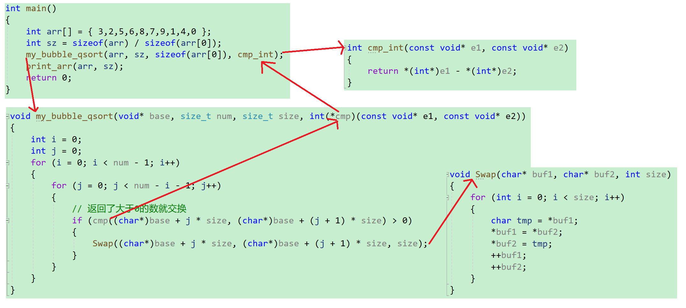

+ 可以看到，我们对整形的排序也成功了

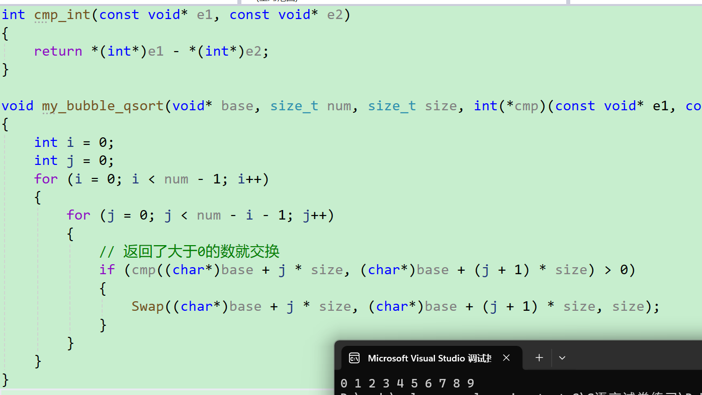

# 从浅入深理解指针《第五阶段》
+ 在我们学习最后部分的时候，我们需要先了解这些概念`sizeof`和`strlen`

## 一、sizeof和strlen的对比
### 1.1 sizeof
+ 在学习操作符的时候，我们学习了`sizeof` ， `sizeof` 计算变量所占内存内存空间大小的，单位是字节，如果操作数是类型的话，计算的是使用类型创建的变量所占内存空间的大小。
+ 我们就来开始学习了解sizeof~~
+ 其中`size_t`其实专门是设计给`sizeof`的，表示`sizeof`的返回值类型
+ `sizeof`计算的不可能是负数吧，所以`size_t`是为`sizeof`来设计的~~

例如：

```c
int main()
{
    int a = 10;
    printf("%d\n", sizeof(a));
    printf("%d\n", sizeof(int));
    return 0;
}
```

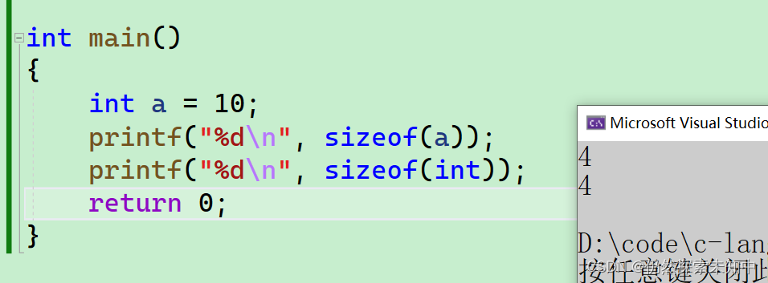

+ 如果这里是变量，括号是可以省略的
+ 如果是类型就是，就不能省略

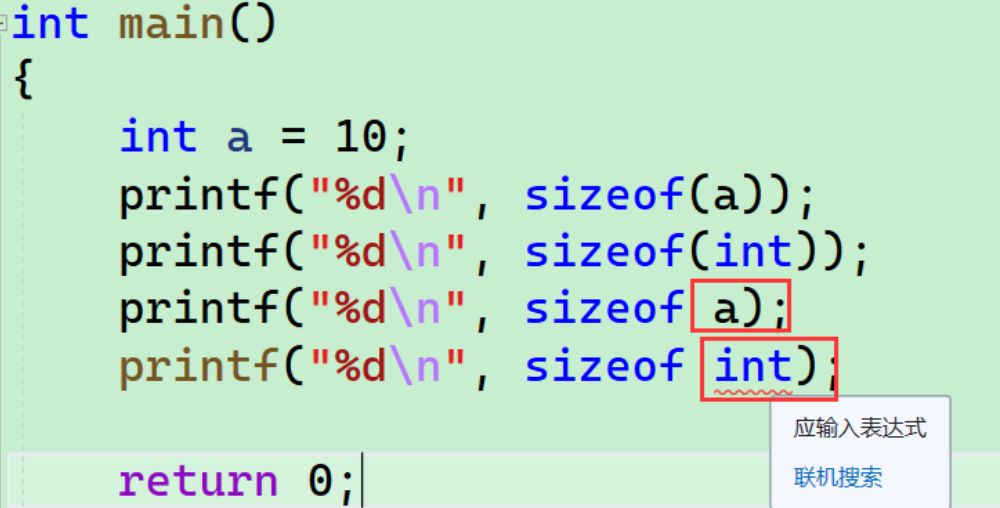

+ 这里算出的4就是占用4个字节
+ `sizeof` 只关注占用内存空间的大小，不在乎内存中存放什么数据，我们一会来详细看~~

### 1.2 strlen
[strlen](https://legacy.cplusplus.com/reference/cstring/strlen/?kw=strlen) 是C语言库函数，功能是求字符串长度。函数原型如下：

```c
size_t strlen ( const char * str );
```

+ 它统计的是从`strlen`函数的参数`str`中这个地址开始向后，`\0`之前字符串中字符的个数。
+ `strlen` 函数会一直向后找`\0` 字符，直到找到为止，所以可能存在越界查找。

我们来看下面的代码：

```c
int main()
{
    char arr2[] = "abc";
    printf("%d\n", strlen(arr2));
    return 0;
}
```

+ 这里的strlen算出的是`3`
+ 我们还可以通过调试窗口看一下是怎么存放的~~

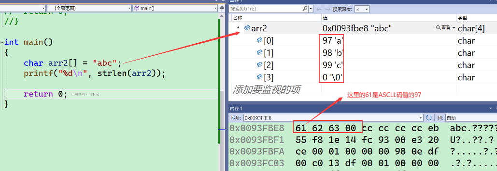

+ 可以看到这里内存监视窗口的61就是97，0就是`\0`，`strlen`是统计`\0`之前的字符串的个数，结果是`3`

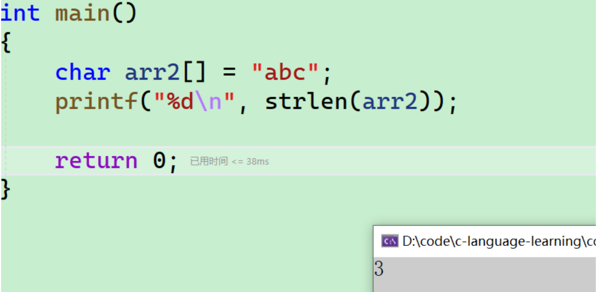

+ 那我在字符串的中间手动加一个`\0`会算出几呢？

```c
char arr2[] = "ab\0c";
printf("%d\n", strlen(arr2));
```

+ 可以看到结果是`2`

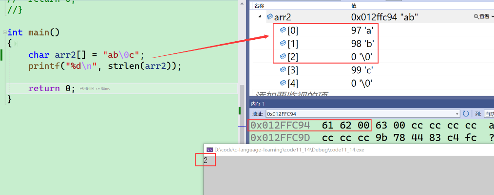

+ 那字符串没有`\0`它的结果是什么呢？

```c
char arr1[] = { 'a', 'b', 'c' };
printf("%d\n", strlen(arr1));
```

+ 我们可以看到结果是15，其实是随机值，我也不知道多会会遇到`\0`。

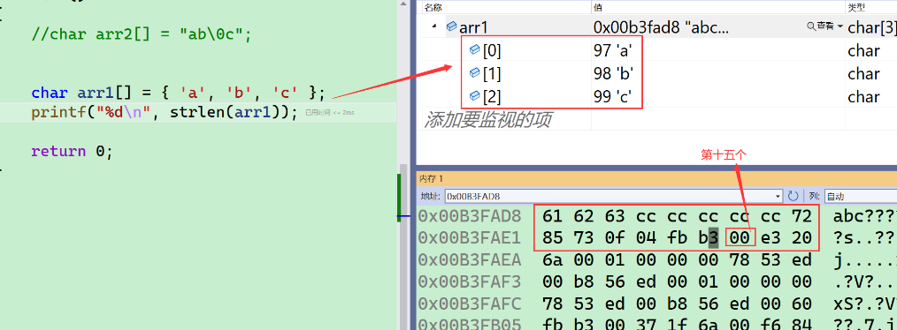

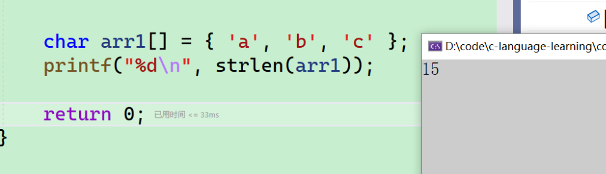

+ 下面我们来对比一下`strlen`和`sizeof`

**strlen：**

+ sizeof是操作符
+ sizeof计算操作数所占内存的大小，单位是字节
+ 不关注内存中存放什么数据

**sizeof：**

+ strlen是库函数，使用需要包含头文件`string.h`
+ srtlen是求字符串长度的，统计的是`\0`之前字符的个数
+ 关注内存中是否有`\0`，如果没有`\0`，就会持续往后找，可能会越界
+ sizeof在计算大小的时候，其实是根据类型推算的

那么下面打印的是什么呢？

```c
short s = 10;
int i = 2;
int n = sizeof(s = i + 4);
printf("%d\n", n);
printf("%d\n", s);
```

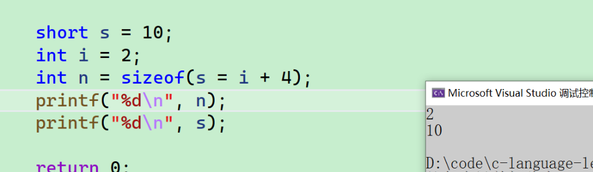

+ 为什么是2和10呢？我们来分析一下~~
+ 创建了一个短整型s，占两个字节，i是整形，占四个字节
+ 这里的i+4得出的结果我要放到s类型，我一个4个整形的放到两个整形的空间，这要发生截断，截断之后就是s说了算，所以就是2个字节。
+ 那么第二个，表达式放到sizeof内部不会真实计算的，不参与计算！！！所以原来的值就会打印什么值~~

表达式不参与计算，那上面那个为什么会是2呢？其实是sizeof是根据类型推断出来的，s = i + 4不会执行，其中 i + 4算出的就是整形类型的，整形类型的结果要放到shot类型的，所以就是short类型，就是2个字节，你懂了吗~~

## 二、数组和指针笔试题解析
### 2.1 一维数组
```c
int main()
{
    int a[] = { 1,2,3,4 };
    printf("%d\n", sizeof(a));
    printf("%d\n", sizeof(a + 0));
    printf("%d\n", sizeof(*a));
    printf("%d\n", sizeof(a + 1));
    printf("%d\n", sizeof(a[1]));
    printf("%d\n", sizeof(&a));
    printf("%d\n", sizeof(*&a));
    printf("%d\n", sizeof(&a + 1));
    printf("%d\n", sizeof(&a[0]));
    printf("%d\n", sizeof(&a[0] + 1));
    return 0;
}
```

+ 你要知道的就是数组名即为首元素地址，不过有两个例外：
    - sizeof(数组名) —— 数组名表示整个数组，计算的是整个数组的大小，单位是字节
    - &数组名 —— 数组名表示数组名表示整个数组，取出的是整个数组的地址。

---

+ `sizeof`内部单独放了一个数组名，数组名表示整个数组的大小，数组内有4个元素，每个**元素**4个字节，所以就是`16`

```c
printf("%d\n", sizeof(a));
```

---

+ 这个地方的数组名的a并没有放到sizeof内部，也没有`&`，所以a就是首元素的地址，是**地址**，大小就是`4/8`个字节

```c
printf("%d\n", sizeof(a + 0));
```

---

+ a就是数组首元素的地址,`*a == *(a+0) == a[0]`，_a 其实就是第一个*__元素_，也就是`a[0]`，大小就是`4`个字节

```c
printf("%d\n", sizeof(*a));
```

---

+ a就是数组首元素的地址(&a[0] -->int*)， a+1--> &a[1]，a+1就是第二个元素的**地址**，所以结果就是`4/8`

```c
printf("%d\n", sizeof(a + 1));
```

---

+ 计算第2个**元素**的大小，单位是字节 结果就是`4`

```c
printf("%zd\n", sizeof(a[1]));
```

---

+ `&a` 取出的是数组的地址，但是数组的地址也是**地址**，是地址大小就是`4 / 8` 个字节

```c
printf("%zd\n", sizeof(&a));
```

---

+ 这里&a是取出数组的地址，然后再解引用，也就是相当于抵消了，&a是一个数组指针，也就是`int(*p)[4] = &a`，_p访问一个数组的大小，p+1就是跳过一个*__数组的大小_，结果是`16`

```c
printf("%d\n", sizeof(*&a));
```

---

+ &a+1是跳过整个数组后的**地址**，是地址大小就是4/8个字节，结果就是`4/8`

```c
printf("%zd\n", sizeof(&a + 1));
```

---

+ 这里就是首元素的**地址**，结果是`4/8`

```c
printf("%zd\n", sizeof(&a[0]));
```

---

+ 这里就是第二个元素的**地址**，结果是`4/8`

```c
printf("%zd\n", sizeof(&a[0] + 1));
```

---

+ 我们在vs上验证一下，这个是32位平台下打印的~~

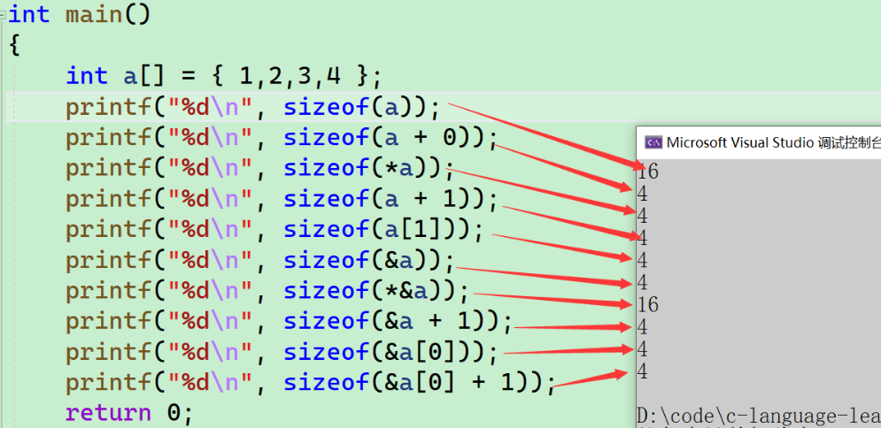

+ 这个是在64位下运行的~~

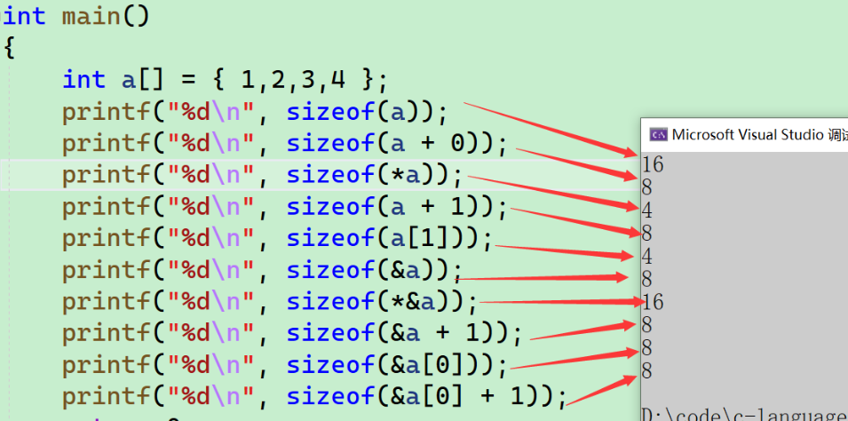

### 2.2 字符数组
```c
int main()
{
    char arr[] = { 'a','b','c','d','e','f' };
    printf("%d\n", sizeof(arr));
    printf("%d\n", sizeof(arr + 0));
    printf("%d\n", sizeof(*arr));
    printf("%d\n", sizeof(arr[1]));
    printf("%d\n", sizeof(&arr));
    printf("%d\n", sizeof(&arr + 1));
    printf("%d\n", sizeof(&arr[0] + 1));
    return 0;
}
```

---

+ 数组名单独放在了sizeof内部，计算的是整个**数组的大小**，字符有6个，所以结果就是`6`

```c
printf("%d\n", sizeof(arr));
```

---

+ arr是数组首元素的地址，arr+0 还是首元素的**地址** ，是地址大小就是`4/8`个字节

```c
printf("%d\n", sizeof(arr + 0));
```

---

+ arr是数组首元素的地址,_arr就是*__首元素_,就占一个字符大小就是`1`个字节

```c
printf("%d\n", sizeof(*arr));
```

---

+ arr[1]就是数组的第二个**元素**，大小是`1`个字节

```c
printf("%d\n", sizeof(arr[1]));
```

---

+ &arr 是数组的地址，数组的地址也是**地址**，大小就是`4/8`

```c
printf("%d\n", sizeof(&arr));
```

---

+ &arr+1 是跳过**整个数组**，指向f的后面`4/8`

```c
printf("%d\n", sizeof(&arr + 1));
```

---

+ &arr[0]是首元素的地址，&arr[0]+1就是第二个元素的**地址** `4/8`

```c
printf("%d\n", sizeof(&arr[0] + 1));
```

+ 我们来看32平台下

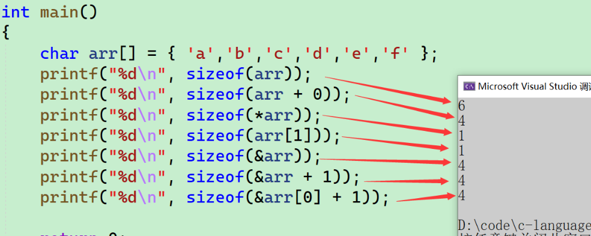

+ 再来看64位平台下的

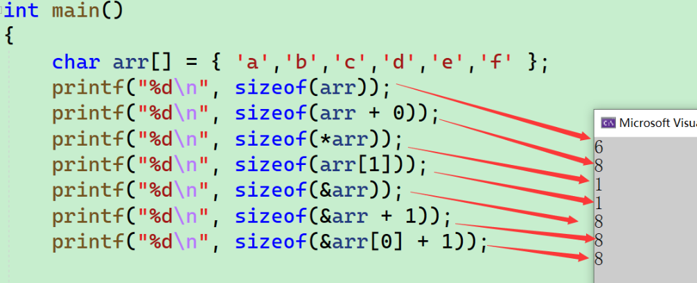

+ 我们继续来看第二个

```c
char arr[] = { 'a','b','c','d','e','f' };
printf("%d\n", strlen(arr));
printf("%d\n", strlen(arr+0));
printf("%d\n", strlen(*arr));
printf("%d\n", strlen(arr[1]));
printf("%d\n", strlen(&arr));
printf("%d\n", strlen(&arr+1));
printf("%d\n", strlen(&arr[0]+1));
```

+ 这个数组是没有\0的，strlen是计算`\0`之前的元素个数所以就是`随机值`

```c
printf("%d\n", strlen(arr));
```

---

+ 这个数组名也是首元素的地址，+0也就相当于没有加，结果是`随机值`~~

```c
printf("%d\n", strlen(arr+0));
```

---

+ 这里arr是首元素的地址，然后_arr解引用就是字符_`a`_，ASCLL码值是97，97传给strlen，__**会把97当成个地址**__，会*非法访问_，结果会`报错`

```c
printf("%d\n", strlen(*arr));
```

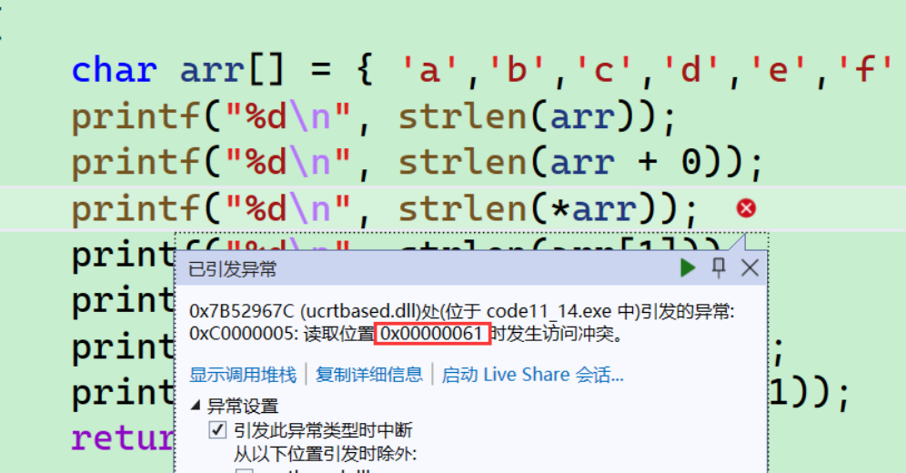

+ 这个代码与上个代码相似，访问的是**第二个元素的ASCLL码值，会当地**址传过去，也会`报错`

```c
printf("%d\n", strlen(arr[1]));
```

---

+ &arr就是取出这个数组的地址，也就是**起始位置向后数**，结果也是`随机值`

```c
printf("%d\n", strlen(&arr));
```

---

+ 这个&arr就是首元素的地址，然后+1，**跳过整个数组的地址，内存放的什么也不知道**，结果也就是`随机值`

```c
printf("%d\n", strlen(&arr+1));
```

---

+ &arr[0]是首元素的地址，+1就是**第二个元素的地址，然后向后数**，结果也是`随机值`

```c
printf("%d\n", strlen(&arr[0]+1));
```

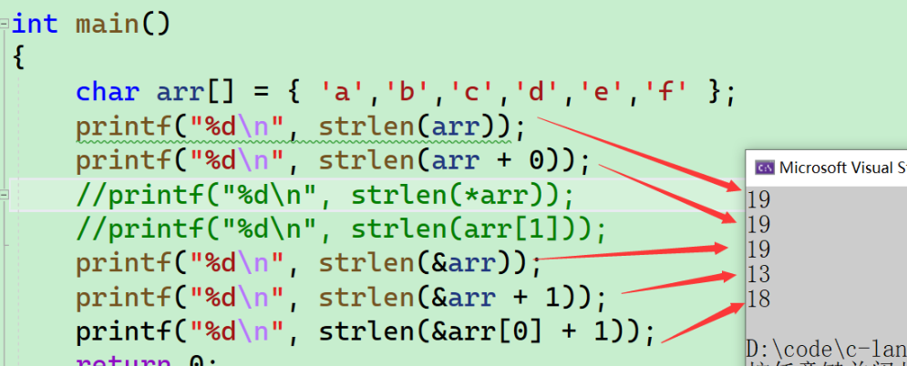

+ 这里我们初始化`abcdef\0`，这里面有\0~~

```c
char arr[] = "abcdef";
printf("%d\n", sizeof(arr));
printf("%d\n", sizeof(arr+0));
printf("%d\n", sizeof(*arr));
printf("%d\n", sizeof(arr[1]));
printf("%d\n", sizeof(&arr));
printf("%d\n", sizeof(&arr+1));
printf("%d\n", sizeof(&arr[0]+1));
```

+ 这里算的是**arr元素的大小**，结果是`7`

```c
printf("%d\n", sizeof(arr));
```

+ arr表示数组首元素的地址，`arr + 0`还是**首元素的地址**，大小就是`4/8`个字节

```c
printf("%d\n", sizeof(arr+0));
```

+ arr表示数组首元素的地址,_arr就是*__首元素_，大小就是`1`字节

```c
printf("%d\n", sizeof(*arr));
```

+ arr[1]是**第二个元素**，大小也是`1`字节

```c
printf("%d\n", sizeof(arr[1]));
```

+ &arr是数组的地址，但是也是地址，是**地址**大小就是`4/8`个字节

```c
printf("%d\n", sizeof(&arr));
```

+ &arr是数组的地址,&arr+1就是跳过整个数组的那个**地址**，结果是`4/8`个字节

```c
printf("%d\n", sizeof(&arr+1));
```

+ 第二个元素的**地址**，大小`4/8`个字节

```c
printf("%d\n", sizeof(&arr[0]+1));
```

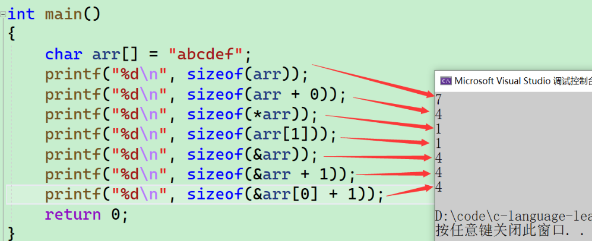

+ 我们再把`sizeof`换成`strlen`~~

```c
char arr[] = "abcdef";
printf("%d\n", strlen(arr));
printf("%d\n", strlen(arr+0));
printf("%d\n", strlen(*arr));
printf("%d\n", strlen(arr[1]));
printf("%d\n", strlen(&arr));
printf("%d\n", strlen(&arr+1));
printf("%d\n", strlen(&arr[0]+1));
```

+ arr是首元素的地址，计算的是strlen遇到\0之前**元素的个数**，结果是`6`

```c
printf("%d\n", strlen(arr));
```

+ arr+1 也是**首元素的地址**，结果就是`6`

```c
printf("%d\n", strlen(arr+0));
```

+ 这里结果是`报错`,会非法访问

```c
printf("%d\n", strlen(*arr));
```

+ 这里也会形成`非法访问`~~

```c
printf("%d\n", strlen(arr[1]));
```

+ &arr是数组的地址，但是这个地址也是指向**数组的起始位置**的，strlen就从起始位置开始向后找\0，结果是`6`

```c
printf("%d\n", strlen(&arr));
```

+ &arr+1是**跳过整个数组后的地址**，从这里开始向后找\0，就是`随机值`

```c
printf("%d\n", strlen(&arr+1));
```

+ arr[0] + 1 是第**二个元素的地址**，长度是`5`

```c
printf("%d\n", strlen(&arr[0]+1));
```

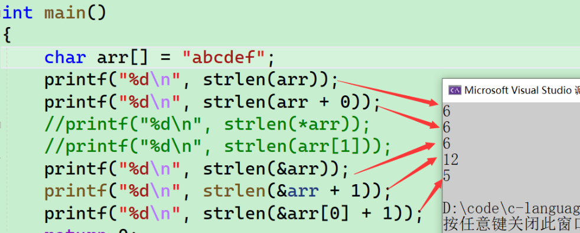

+ 我们这里指针变量`p`存放的是这个字符串a的地址

```c
char *p = "abcdef";
printf("%d\n", sizeof(p));
printf("%d\n", sizeof(p+1));
printf("%d\n", sizeof(*p));
printf("%d\n", sizeof(p[0]));
printf("%d\n", sizeof(&p));
printf("%d\n", sizeof(&p+1));
printf("%d\n", sizeof(&p[0]+1));
```


+ p是一个指针变量，**地址**大小是`4/8`个字节

```c
printf("%d\n", sizeof(p));
```

+ p+1是‘b’的地址，是**地址**就是`4/8`个字节

```c
printf("%d\n", sizeof(p+1));
```

+ `*p` 是**首字符**，大小是`1`字节

```c
printf("%d\n", sizeof(*p));
```

+ p[0] === _(p+0)，其实就是字符串中的*__首字符_，大小是`1`字节

```c
printf("%d\n", sizeof(p[0]));
```

+ &p是p的地址，也是地址，**地址**大小就是`4/8`个字节

```c
printf("%d\n", sizeof(&p));
```

+ &p + 1也是**地址**，&p1+1是跳过p变量后的地址，是地址就是`4/8`个字节

```c
printf("%d\n", sizeof(&p+1));
```

+ &p[0] + 1是b的**地址**，是地址就是`4/8`个字节

```c
printf("%d\n", sizeof(&p[0]+1));
```

**32位下：**

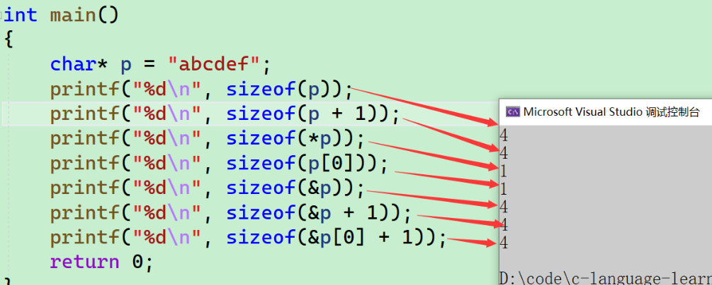

**64位下：**

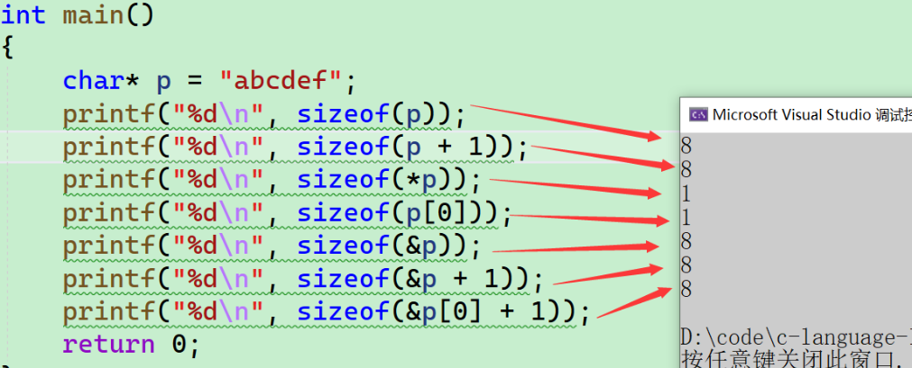

**我们再来换成strlen：**

```c
char *p = "abcdef";
printf("%d\n", strlen(p));
printf("%d\n", strlen(p+1));
printf("%d\n", strlen(*p));
printf("%d\n", strlen(p[0]));
printf("%d\n", strlen(&p));
printf("%d\n", strlen(&p+1));
printf("%d\n", strlen(&p[0]+1));
```

+ p指向这个字符串的首元素地址，字符串中有\0，从a的**地址开始向后访问**，结果就是`6`

```c
printf("%d\n", strlen(p));
```

+ p的类型是`char*`，`+1`跳过的就是一个char类型的数据，所以就来到了**字符**`'b'`**的地址处**，向后找\0的话就最后的结果即为 `5`

```c
printf("%d\n", strlen(p+1));
```

+ `*p`取到的就是字符`'a'`，strlen就会把字符**a的ascll码值当地址传过去了**，会产生非法访问，结果是`err`

```c
printf("%d\n", strlen(*p));	
```

+ 这个和上一个一样，也是会产生**非法访问**，就相当于 ` *p == *(p+0) == p[0]`

```c
printf("%d\n", strlen(p[0]));
```

+ 这个结果就是随机值，&p是p的地址，类型是`char*`从**p所占空间的起始位置开始查找的**，它不知道什么时候会遇到`\0`，所以就会是`随机值`

```c
printf("%d\n", strlen(&p));
```

+ 这个代码在`&`取地址后它的类型就变成了`char**`，`+1`会跳过一个`char*`类型的数据，它指向了**字符串末尾的这个位置**，从这里向后去进行找`\0`,也是不知道什么时候会遇到，所以最后的结果还是`随机值`

```c
printf("%d\n", strlen(&p+1));
```

+ 这里和第二个很相似，&和[]就相当于抵消了，**+1就指向了**`'b'`，结果也就是`5`

```c
printf("%d\n", strlen(&p[0]+1));
```

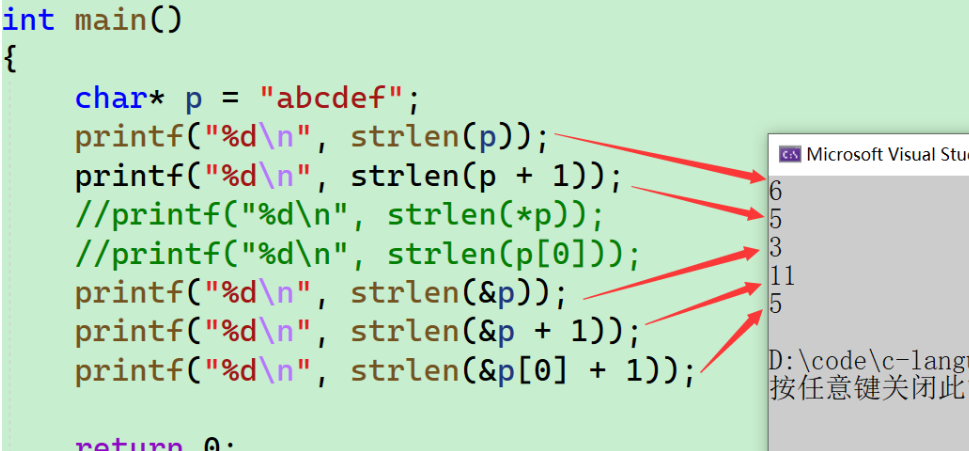

### 2.3 二维数组
```c
int a[3][4] = {0};
printf("%d\n",sizeof(a));
printf("%d\n",sizeof(a[0][0]));
printf("%d\n",sizeof(a[0]));
printf("%d\n",sizeof(a[0]+1));
printf("%d\n",sizeof(*(a[0]+1)));
printf("%d\n",sizeof(a+1));
printf("%d\n",sizeof(*(a+1)));
printf("%d\n",sizeof(&a[0]+1));
printf("%d\n",sizeof(*(&a[0]+1)));
printf("%d\n",sizeof(*a));
printf("%d\n",sizeof(a[3]));
```

+ sizeof(数组名)，计算的就是整个数组的大小，这是一个二维数组，数组**是三行四列**的，总共十二个元素，每个元素的类型是int，为4个字节，那么总的大小就是 `48`

```c
printf("%d\n", sizeof(a));
```

+ a[0][0]代表的是数组**第一行第一列**的元素,所以每个元素都是`4`个字节

```c
printf("%d\n", sizeof(a[0][0]));
```

+ `a[0]`为第一行的数组名，而且它是单独放在sizeof()内部的，计算的是**第一行这一整行**的大小，里面有4个元素，每个元素都是4个字节，那么结果即为`16`

```c
printf("%d\n", sizeof(a[0]));
```

+ a[0]是第一行这个数组的数组名，但是数组名并非单独放在sizeof内部，所以数组名表示数组首元素的地址，也就是`a[0][0]`的地址，`a[0]+1`是第一行第二个元素`a[0][1]`的**地址**，是地址的大小是`4/8`个字节

```c
printf("%d\n", sizeof(a[0] + 1));
```

+ `a[0] + 1`是第一行第二个元素`a[0][1]`的地址，`*(a[0] + 1)`就是**第一行第二个元素**，大小是`4`个字节

```c
printf("%d\n", sizeof(*(a[0] + 1)));
```

+ `a`没有单独放在sizeof内部，没有&，数组名a就是数组首元素的地址，也就是第一行的地址，`a+1`，就是第二行的**地址**，也就是等价于`a -- int(*)[4]` ---->`a+1 -- int(*)[4]`，是地址就是`4/8`

```c
printf("%d\n", sizeof(a + 1));
```

+ 下面这个也就是对这一行解引用，那么也就得到了**第二行这一整行**，此时计算是这一整行的大小，结果为`16`

```c
printf("%d\n", sizeof(*(a + 1)));
```

+ 这个和上一个一样，只是换了一种写法，等价于`*(a + 1) `，计算的是**第二行的元素大小**，结果是`16`

```c
printf("%d\n", sizeof(a[1]));
```

+ a[0]为第一行的数组名，对它进行取地址就取到了这一整行的地址，它的类型也为一个数组指针int (_)[4]，那 _`+1`_的话也会跳过整个数组，此时也就来到了第二行，那么取到的便是第二行的*__地址_，地址的大小即为 `4/8`个字节

```c
printf("%d\n", sizeof(&a[0] + 1));
```

---

+ 这里和上面那个相似，**第二行解引用，算的是第二行元素的大小**，结果是`16`

```c
printf("%d\n", sizeof(*(&a[0] + 1)));
```

---

+ 数组名a就是数组首元素的地址，也就是第一行的地址,`*a`就是一行的 等价于`*(a+0) == a[0]`，取到的就是第一行的**元素**，结果是`16`

```c
printf("%d\n", sizeof(*a));
```

---

+ 这个二维数组不是只有三行吗，第三行的数组名为a[2]，那a[3]不是**越界**了吗？
+ 下面这个a[3]来说，虽然看上去存在越界，`sizeof()`并不关心你有没有越界，不会真实的访问，而是知道你的类型即可，a[3]便是二维数组的第四行，虽然没有第四行，但是类型是确定的，那么大小就是确定的，计算sizeof(数组名)计算的是**整个数组**的大小，结果便是`16`

```c
printf("%d\n", sizeof(a[3]));
```

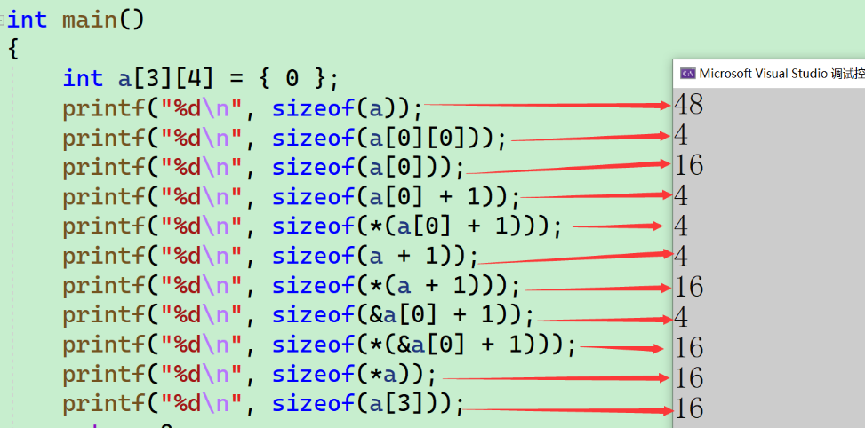

**总结：**  
数组名的意义：

1. sizeof(数组名)，这里的数组名表示整个数组，计算的是整个数组的大小。
2. &数组名，这里的数组名表示整个数组，取出的是整个数组的地址。
3. 除此之外所有的数组名都表示首元素的地址。

## 指针笔试题
### 第一道：
```c
int main()
{
    int a[5] = { 1, 2, 3, 4, 5 };
    int *ptr = (int *)(&a + 1);
    printf( "%d,%d", *(a + 1), *(ptr - 1));
    return 0;
}
//程序的结果是什么？
```

+ 首先a是在数组的首元素，然后&+1是跳过整个数组，到了5的后面，然后赋值给了ptr
+ `*(a+1)`首先a是在数组的第一个元素，因为没有&，然后加1是跳过一个元素的大小，就来到了元素`2`的位置
+ `*(ptr - 1) `ptr刚刚是到了5的后面，然后-1就指向了5，然后解引用就打印出`5`

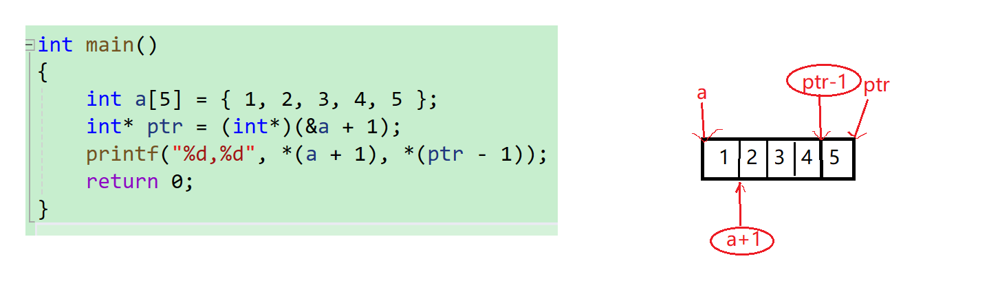

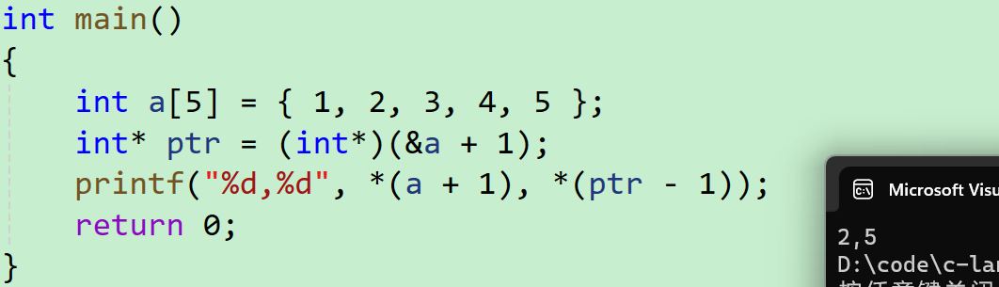

### 第二道：
```c
//由于还没学习结构体，这里告知结构体的大小是20个字节
//x86环境下
struct Test
{
    int Num;
    char *pcName;
    short sDate;
    char cha[2];
    short sBa[4];
}*p;
//假设p 的值为0x100000。 如下表表达式的值分别为多少？
//已知，结构体Test类型的变量大小是20个字节
int main()
{
    p = (struct Test*)0x100000;
    printf("%p\n", p + 0x1);
    printf("%p\n", (unsigned long)p + 0x1);
    printf("%p\n", (unsigned int*)p + 0x1);
    return 0;
}
```

+ 首先我们要知道0x开头的数字是16进制的数字
+ `p + 0x1` 结构体指针+1是跳过一个结构体的大小`20`，是`0x100020`吗？不是，而是`0x100014`，因为这个是16进制的
+ `(unsigned long)p + 0x1 `指针p强制类型转换成(unsigned long)，整形+1是加1结果是`0x100001`	
+ `(unsigned int*)p + 0x1 `指针p强制类型转换成(unsigned int*)，整形指针+1跳过4个字节，结果是`0x100004`
+ 最后我们需要以`%p`的形式打印出来，那么打印的是8个16进制打印出来
    - 第一个结果应该是`00100014`
    - 第二个结果应该是`00100001`
    - 第二个结果应该是`00100004`

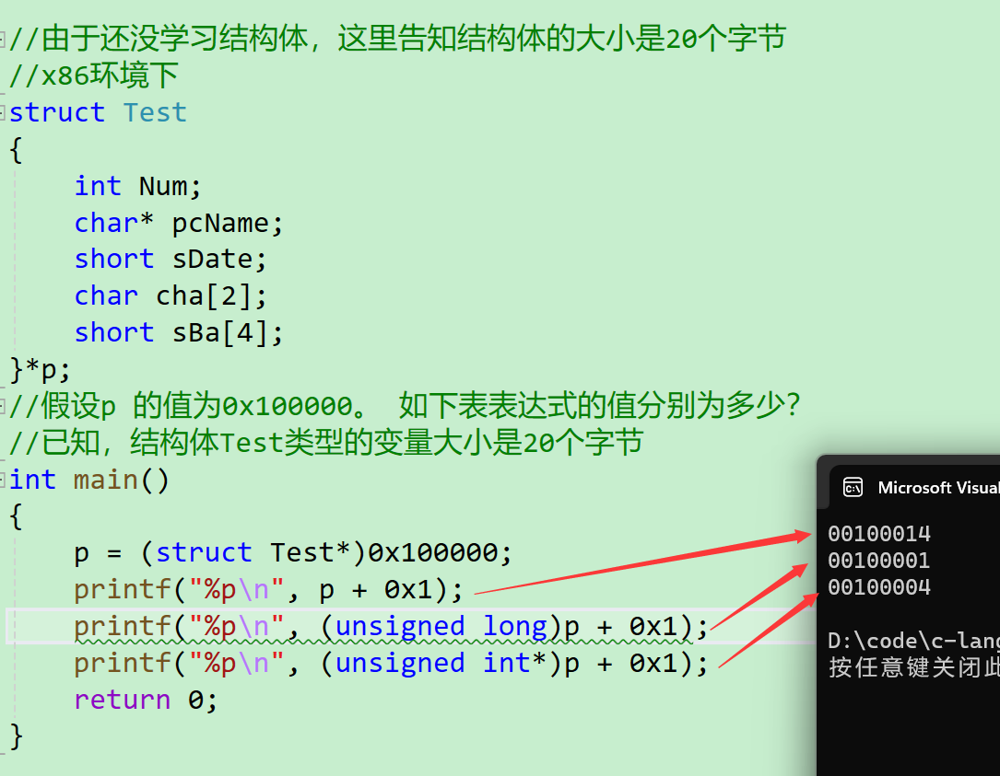

### 第三道：
```c
int main()
{
    int a[4] = { 1, 2, 3, 4 };
    int *ptr1 = (int *)(&a + 1);
    int *ptr2 = (int *)((int)a + 1);
    printf( "%x,%x", ptr1[-1], *ptr2);
    return 0;
}
```

+ 第一个`(int *)(&a + 1)` ，`&a+1`是取出整个地址+1,因为这个是数组类型，然后强制类型转换成了(int*)，赋值给了`ptr1`
+ 然后我们看打印选项`ptr1[-1]`，这个就相当于`*(ptr1 - 1)`，然后就指向了`4`
+ 那么我们第二个就要进行画图进行分析了，这里需要画出内存布局图，机器是小端存储

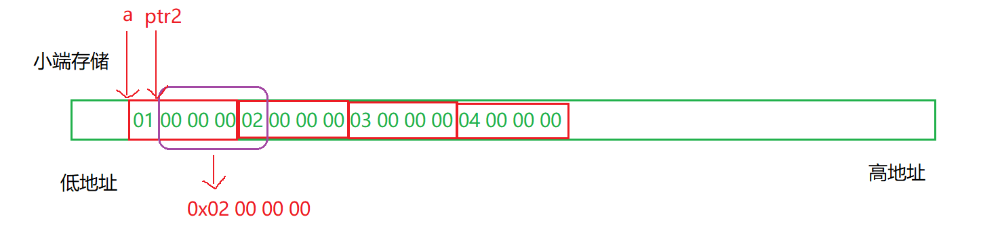

+ 首先将a数组的地址强制类型转换成了`int`类型，然后加1，加的是内存中一个字节的位置，然后赋给了ptr2，ptr2是整形指针，向后访问4个字节，又因为是小端存储，打印是以`%x`打印的，所以结果是`2000000`

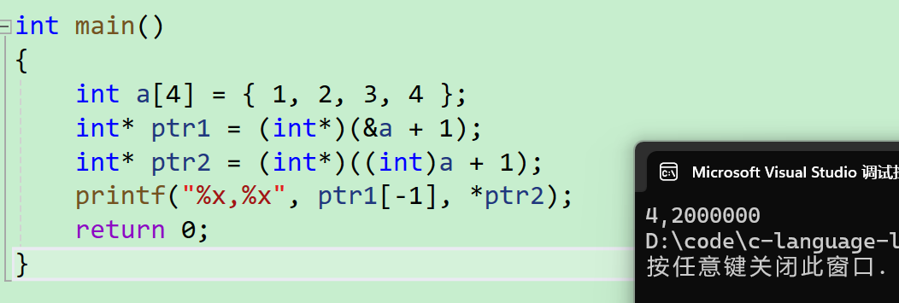

### 第四道：
```c
#include <stdio.h>
int main()
{
    int a[3][2] = { (0, 1), (2, 3), (4, 5) };
    int *p;
    p = a[0];
    printf( "%d", p[0]);
    return 0;
}
```

+ 首先我我们要注意这个二维数组的初始化里面的扩话，是小括号，而不是大括号，里面是逗号表达式
+ 然后a[0] == &a[0][0]，也就是第一行的地址 
+ 打印的时候是`p[0]`也就是`*(p+0)`，+0就相当于没加，结果打印的就是1

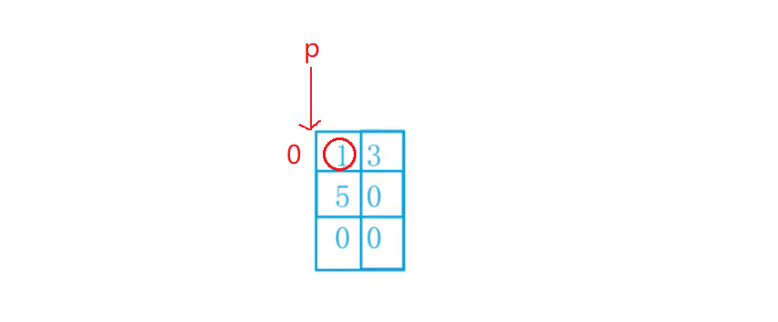

**我们来看一下结果：**

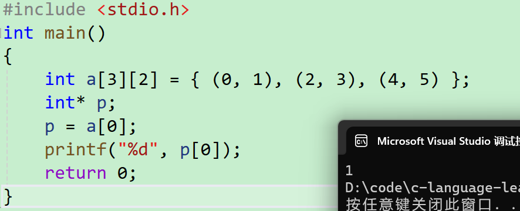

### 第五道：
```c
int main()
{
    int a[5][5];
    int(*p)[4];
    p = a;
    printf( "%p,%d\n", &p[4][2] - &a[4][2], &p[4][2] - &a[4][2]);
    return 0;
}
```

+ 首先定义了一个五行五列的二维数组，还定义了一个数组指针，这个数组指针指向了有4个元素，每个元素是int类型，然后将a赋值给了p
+ p+1是跳过4个元素，p+4就来到了第三行
+ 我们这里是小地址减去了大地址，得到的是元素与元素之间的个数，得到的是负数`-4`

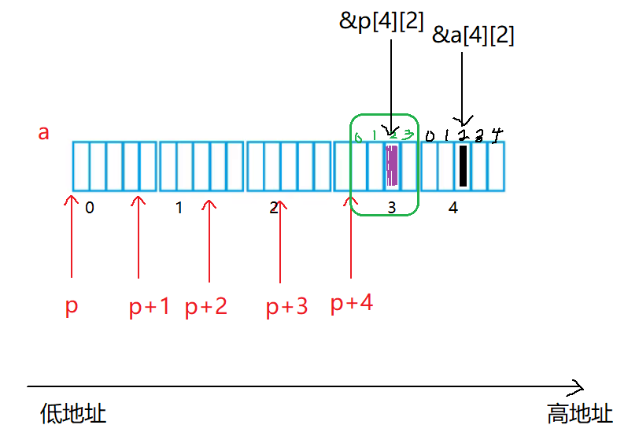

+ `-4`以%p的方式打印，认为内存中存储的补码就是地址 ，结果是`FFFFFFFC`

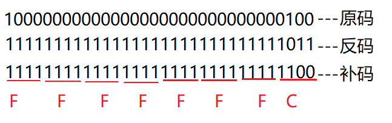  
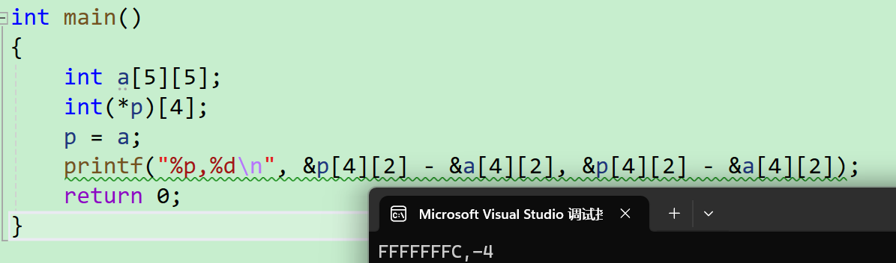

### 第六道：
```c
int main()
{
    int aa[2][5] = { 1, 2, 3, 4, 5, 6, 7, 8, 9, 10 };
    int *ptr1 = (int *)(&aa + 1);
    int *ptr2 = (int *)(*(aa + 1));
    printf( "%d,%d", *(ptr1 - 1), *(ptr2 - 1));
    return 0;
}
```

+ 首先我们定义了一个二维数组
+ 取地址aa数组是取出了整个二维数组的地址，然后+1，是跳过整个数组，强制类型转换成了整形赋值给了`ptr1`，然后我们看ptr1-1，就是减去了一个整形，然后解引用就找到了`10`

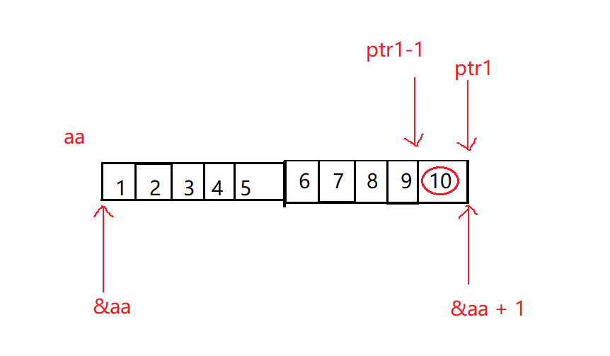

+ 我们再来看第二个，aa+1是加到了第二行，再解引用就找到了，也就等价于`a[1]`，指向了6，这里的强制类型转换是迷惑，不会发生什么作用的，赋值给了ptr2
+ 然后ptr2-1就减去一个整形，就得到了5

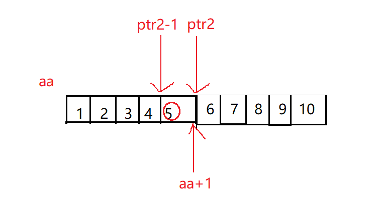

我们来验证一下结果：

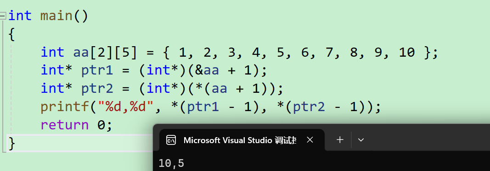

### 第七道：
```c
#include <stdio.h>
int main()
{
    char *a[] = {"work","at","alibaba"};
    char**pa = a;
    pa++;
    printf("%s\n", *pa);
    return 0;
}
```

+ 首先定义了一个指针数组，里面放了三个字符串，每个元素是char*，每个元素都保存着字符串的首字母
+ 然后还有一个二级指针，然后pa++，原来的pa是指向了数组的首地址，++就加了一个char类型，就访问到了`at`

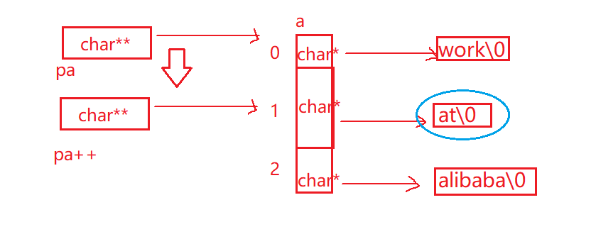

我们来验证一下结果：

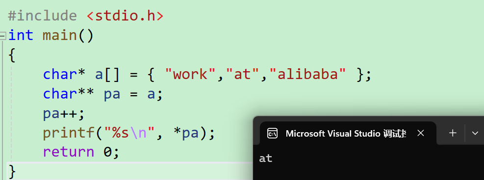

### 第八道【压轴题】：
```c
int main()
{
    char *c[] = {"ENTER","NEW","POINT","FIRST"};
    char**cp[] = {c+3,c+2,c+1,c};
    char***cpp = cp;
    printf("%s\n", **++cpp);
    printf("%s\n", *--*++cpp+3);
    printf("%s\n", *cpp[-2]+3);
    printf("%s\n", cpp[-1][-1]+1);
    return 0;
}
```

+ 首先有一个**指针数组**分别存放了四个字符串的首字符地址
+ 有一个**二级指针数组**存放了这个指针数组每一行的地址，仔细观察是倒着存放的
+ 又有一个**三级字符指针**指向了**二级指针数组cp的首元素地址**，即**第一行**的地址

**我们来看一下下面的图片：**

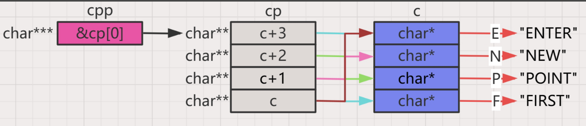

+ 我们来看到第一个打印语句~~

```c
printf("%s\n", **++cpp);
```

+ 首先 **++cpp**，cpp就会访问一个**char*类型**的元素，也就是这个cp数组的第二行，解引用就拿到了c+2这个地址，那么我们就可以顺着这个地址找到了c数组所在的这行地址，解引用就是拿到了c数组存放的内容，以%s打印结果就是`POINT`


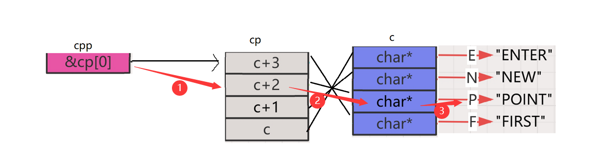

---

**再来看第二句：**

```c
printf("%s\n", *--*++cpp+3);
```

+ 首先执行++cpp，因为它的优先级最高，它就来到了cp数组的**第三个位置**，然后解引用，到了c+1的位置，接下来进行`--`，也就是c + 1 - 1 = c，这个时候里面就不再是`c + 1`这块地址，而是c这块地址，再对其进行**解引用，到了E所在的地址**，最后再 + 3即向后偏移3个字节也就是3个字符，就是E所在的位置，使用%s进行打印，便打印出了后面的`ER`

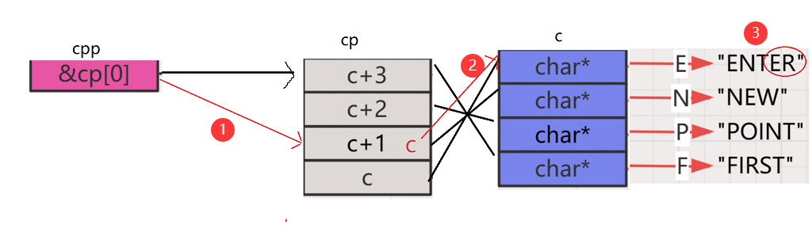

---

**再来看第三句：**

```c
printf("%s\n", *cpp[-2]+3);
```

+ 上面的表达式可以写成`* *(cpp - 2) + 3`，也就是cpp向前偏移2个`char**`的位置，就找到了cp这行地址中所存放的值为c + 3，这个地址保存着c这一行所在的地址，再**解引用**，就取到了F的地址，然后+3，打印出`ST`

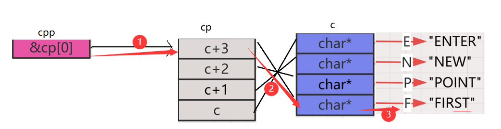

---

**最后来看最后一句：**

```c
printf("%s\n", cpp[-1][-1]+1);
```

+ 上面的表达式可以写成`*(*(cpp - 1) - 1) + 1`，首先就是将cpp向前偏移一个`char**`的位置，然后解引用取到了**第二行**的内容c+2，然后再-1，为c+1，再**解引用**，就拿到了c+1中存放的内容，找到了N，然后最后面还有个+1，就找到了E，最后打印，结果位`EW`

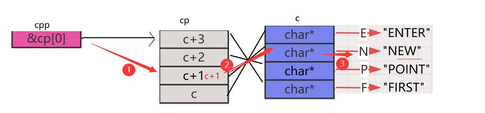

+ 最后，我们来验证一下结果！

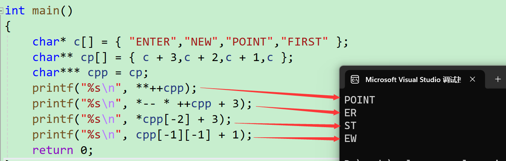

