## 前言
> C语言是结构化的程序设计语言，这里的结构指的是顺序结构、选择结构、循环结构，C语⾔是能够实现这三种结构的，其实我们如果仔细分析，我们⽇常所⻅的事情都可以拆分为这三种结构或者这三种结构的组合。我们可以使⽤`if` 、 `switch` 实现分⽀结构，使⽤ `for` 、 `while` 、 `do while` 实现循环结构。
>

## 一、什么是语句？
在我们平时写字中，一句话的结尾是句号，然而正在C语言中一句话的结尾是`;`

+ 语句可以分为以下五类：  
1）表达式语句  
2）函数调用语句  
3）控制语句  
4）复合语句  
5）空语句

### 1.1 表达式语句
下面这个就是表达式语句：

```c
3 + 5;  
```

### 1.2 函数调用语句
函数调用语句，就是将函数进行使用时调用的语句。

```c
printf("%d\n", a);  
ADD(3, 5); 
```

### 1.3 控制语句
+ `控制语句`用于控制程序的执行流程，以实现程序的各种结构方式，它们由特定的语句定义符组成，C语言有九种控制语句。
+ C语言是由三种结构组成的，有`顺序结构`，`选择结构`和`循环结构`

可分成以下三类：

> 1. 条件判断语句也叫分支语句：if语句、switch语句；
> 2. 循环执行语句：do while语句、while语句、for语句； 
> 3. 转向语句：break语句、goto语句、continue语句、return语句。
>

### 1.4 复合语句
+ 复合语句就是被多个扩号括起来的语句

```c
{
    int a = 0;
    int b = 0;
    printf("%d\n", a + b);
    return 0;
}
```

### 1.5 空语句
+ 空语句虽然很简单，但是其用途很大：**有时候需要一条语句，但这条语句什么都不需要做。**
+ 例如下面这段代码，我们会后面在字符章节也会详细讲解

```c
while(*dest++ = *src++);
```

## 二、分支语句（选择结构）
+ 分支语句可以为双分支或者多分支。
+ 在C语言中需要知道真假两个概念：`非0`为真，`0`为假（注意：正数和`负数`都是真）
+ 分支语句分为**两类**：**if语句，switch语句**。

### 2.1 if语句
+ 那么**if语句**的语法结构是怎么样的？

```c
if(表达式）//表达式为真执行下面的语句
    语句；
//单分支语句
if(表达式）
    语句1；
else
    语句2；
//多分支语句
if(表达式1)
    语句1；
else if(表达式2)
    语句2；
else
    语句3；
```

+ 单分支练习（输入大于等于18输出为成年人，否则不输出）：

```c
#include <stdio.h>
int main()
{
    int age = 0;
    scanf("%d", &age);
    if (age >= 18)
    {
        printf("成年人\n");
    }
}
```

+ 单分支练习（输入大于等于18输出为成年人，否则输出未成年人）：

```c
#include <stdio.h>
int main()
{
    int age = 0;
    scanf("%d", &age);
    if (age >= 18)
    {
        printf("成年人\n");
    }
    else
    {
        printf("未成年\n");
    }
}
```

+ 多分支练习

```c
#include <stdio.h>
int main()
{
    int age = 0;
    scanf("%d", &age);
    if (age < 18)
    {
        printf("少年\n");
    }
    else if (age >= 18 && age < 30)
    {
        printf("青年\n");
    }
    else if (age >= 30 && age < 50)
    {
        printf("中年\n");
    }
    else if (age >= 50 && age < 80)
    {
        printf("老年\n");
    }
    else
    {
        printf("老寿星\n");
    }

}
```

#### 2.1.1 悬空else
+ 当你写了这个代码：

```c
#include <stdio.h>
int main()
{
    int a = 0;
    int b = 2;
    if(a == 1)
        if(b == 2)
            printf("hehe\n");
    else
        printf("haha\n");
    return 0;
}
```

+ 上面那个代码虽然可以运行，但是风格不是很好

```c
#include <stdio.h>
int main()
{
    int a = 0;
    int b = 2;
    if(a == 1)
   {
        if(b == 2)
       {
            printf("hehe\n");
       }
   }
    else
   {
         printf("haha\n");
   }       
    return 0;
}
```

+ 这段代码加上了`{}`使代码变得逻辑更加清楚，要养成更好的代码分格
+ 如何写出一个好的代码呢？

> 推荐`《高质量C/C++编程》`，而这本书就写了如何写出好的风格，可以看一下
>

+ 在我们判断是否等于一个变量或者数的时候我们有可能少一个等于号，那么我们怎么避免呢？

```c
//代码1
int num = 1;
if(num == 5)
{
    printf("hehe\n");
}
//代码2
int num = 1;
if(5 == num)
{
    printf("hehe\n");
}
```

上面的代码哪个比较好？

+ 肯定是代码2，因为在判断是否相等时用两个等于号写，这样反过来写就会避免只写一个等于号，只写一个等于号的话会编译错误，可以及时发现。

#### 2.1.2 练习（1. 判断一个数是否为奇数 2. 输出1-100之间的奇数）
1. 判断一个数是否为奇数
+ 思路：要判断是不是奇数，那么我们就可以看一个数的余数是不是等于1，如果等于1那么这个数就是奇数，否则就是偶数了。

```c
int main()
{
    int n = 0;
    scanf("%d", &n);
    if (n % 2 == 1)
    {
        printf("YES\n");
    }
    else
    {
        printf("NO\n");
    }
    return 0;
}
```

2. 输出1-100之间的奇数
+ 思路：要输出1-100之间的奇数，就要产生1~100的数，然后将每个数进行判断是不是奇数然后再输出
+ 我们目前学了`while`循环，那么我们就用while循环来解决这道题~，后面学到了for循环也可以很简便的写出来。

方法一：

```c
#include<stdio.h>
int main()
{
    int i = 1;
    while (i<= 100)//产生1~100的数字
    {
        if(i % 2 ==1)//进行判断是否奇数
            printf("%d ", i);
        i++;
    }
    return 0;
}
```

方法二：

```c
#include<stdio.h>
int main()
{
    int i = 1;
    while (i <= 100)//产生1~100的数字
    {
        printf("%d ", i);
        //i+=2;
        i = i + 2;//也可以这样写
    }
    return 0;
}
```

### 2.2 switch语句
+ switch语句也是一种分支语句，常常用于多分支情况~~

比如：

> 输入1，输出星期一；   
输入2，输出星期二；  
输入3，输出星期三；  
输入4，输出星期四；  
输入5，输出星期五；  
输入6，输出星期六；  
输入7，输出星期七。
>

+ 如果写成if...else if...else if...else的情况就很复杂，那我们需要有**不一样的语法形式**。 
+ switch语句（支持嵌套使用）

```c
switch(整形表达式)
{
    语句项;
}
```

+ 而语句项是什么呢？

```c
//是一些case语句：
//如下：
case 整形常量表达式:
    语句;
```

### 2.3 switch语句中的break:
+ 在switch语句中，我们没办法直接实现分支，搭配**break**使用才能实现真正的分支。

```c
#include <stdio.h>
int main()
{
    int day = 0;
    switch(day)
   {
        case 1：
            printf("星期一\n");
            break;
        case 2:
            printf("星期二\n");
            break;
        case 3:
            printf("星期三\n");
            break;    
        case 4:
            printf("星期四\n");
            break;    
        case 5:
            printf("星期五\n");
            break;
        case 6:
            printf("星期六\n");
            break;
        case 7:
            printf("星期天\n");    
            break;
   }
    return 0;
}
```

+ 有时候我们的需求变了：
1. 输入1-5，输出的是“weekday”;
2. 输入6-7，输出“weekend”
+ 所以我们的代码就应该这样实现了：

```c
#include <stdio.h>
//switch代码演示
int main()
{
    int day = 0;
    switch (day)
    {
        case 1:
        case 2:
        case 3:
        case 4:
        case 5:
            printf("weekday\n");
            break;
        case 6:
        case 7:
            printf("weekend\n");
            break;
    }
    return 0;
}
```

+ 其中break语句的实际效果是把语句列表划分为不同的分支部分。

在这里我推荐一个**编程好习惯。**

+ 在最后一个 case 语句的后面加上一条 break语句。
+ 

### 2.4 switch语句中的default子句：
如果表达的值与所有的case标签的值都不匹配怎么办？

**default：**

+ 写在任何一个`case`标签可以出现的位置。
+ 当 switch 表达式的值并不匹配所有 case 标签的值时，这个 default 子句后面的语句就会执行。
+ 所以，每个switch语句中只能出现一条default子句。
+ 但是它可以出现在语句列表的任何位置，而且语句流会像执行一个case标签一样执行default子句。

**推荐编程好习惯**：

+ **在每一个switch语句中都放入一条default语句是一个好习惯，甚至可以在后面加一个break。**

### 2.5 练习
```c
#include <stdio.h>
int main()
{
    int n = 1;
    int m = 2;
    switch (n)
    {
    case 1:
        m++;
    case 2:
        n++;
    case 3:
        switch (n)
        {//switch允许嵌套使用
        case 1:
            n++;
        case 2:
            m++;
            n++;
            break;
        }
    case 4:
        m++;
        break;
    default:
        break;
    }
    printf("m = %d, n = %d\n", m, n);
    return 0;
}
```

+ 上面这段代码的结果是什么呢？
+ 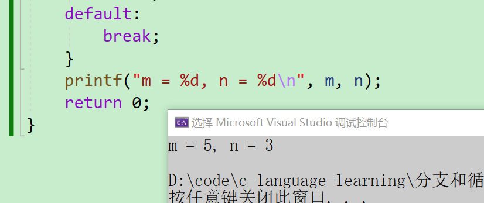

## 三、循环语句
+ 循环语句分为**三类**：**while循环，for循环，do......while循环**。

### 3.1 while循环
我们已经掌握了`if`语句：

```c
if(条件) 
    语句;
```

+ 当条件满足的情况下，if语句后的语句执行，否则不执行。
+ 但是这个语句只会执行一次。
+ 由于我们发现生活中很多的实际的例子是：**同一件事情我们需要完成很多次**。
+ C语言中给我们引入了： `while` 语句，可以实现循环。

```c
while(表达式)
    循环语句;
```

while循环的执行流程：

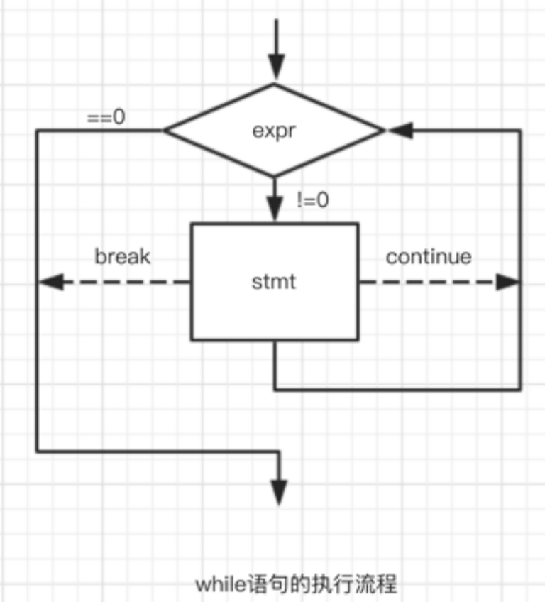

#### 3.1.1 while语句中的break和continue
**break介绍**

```c
#include <stdio.h>
int main()
{
    int i = 1;
    while (i <= 10)
    {
        if (i == 5)
            break;
        printf("%d ", i);
        i = i + 1;
    }
    return 0;
}
```

这里代码输出的结果是什么？  
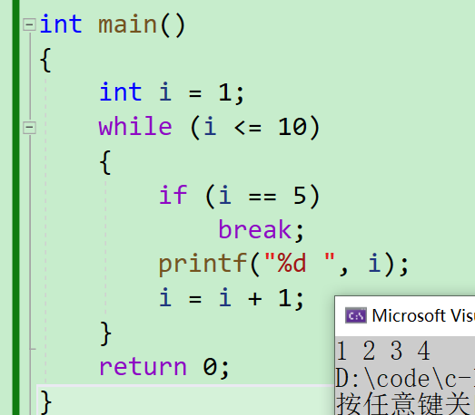

**总结**：

+ break在while循环中的作用：
    - 其实在循环中只要遇到break，就停止后期的所有的循环，直接终止循环。
    - 所以：while中的break是用于**永久**终止循环的。

**continue介绍**

+ continue 代码实例1：

```c
#include <stdio.h>
int main()
{
    int i = 1;
    while (i <= 10)
    {
        if (i == 5)
            continue;
        printf("%d ", i);
        i = i + 1;
    }
    return 0;
}
```

输出`1 2 3 4...` 

+ continue 代码实例2：

```c
#include <stdio.h>
int main()
{
    int i = 1;
    while (i <= 10)
    {
        i = i + 1; 
        if (i == 5)
            continue;
        printf("%d ", i);
    }
    return 0;
}
```

输出：>`2 3 4 6 7 8 9 10 11`

**总结**:

+ continue在while循环中的作用就是：
    - continue是用于终止本次循环的，也就是本次循环中continue后边的代码不会再执行，  
  而是直接跳转到while语句的判断部分。进行下一次循环的入口判断。

**getchar介绍**

```c
#include <stdio.h>
int main()
{
    int ch = 0;
    while ((ch = getchar()) != EOF)
        putchar(ch);
    return 0;
}
```

+ 这里的`getchar`函数不接收任何的参数，返回类型是`int `从`stdin`（键盘）上读取一个字符返回读取到字符的ASCLL码值,如果读取失败或者读取到文件末尾就会返回`EOF`
+ 这里可以打开[cplusplus](https://legacy.cplusplus.com/)网站进行搜索

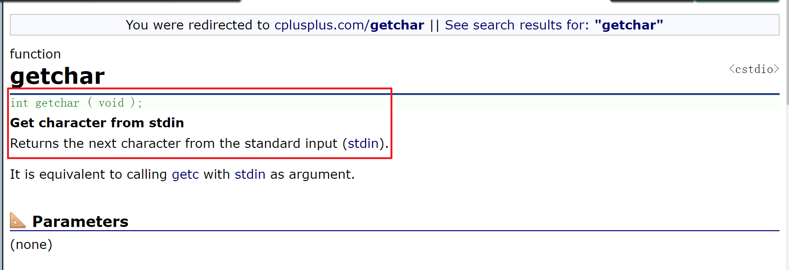

+ 选中`EOF`转到定义就可以看到
+ 那么EOF是什么呢？EOF是`-1`，在一次证明了返回值是int的。

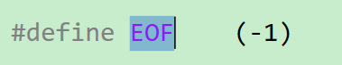

**putchar介绍**

+ 接收一个字符输出到屏幕，也就是从键盘上获取一个字符打印到屏幕上

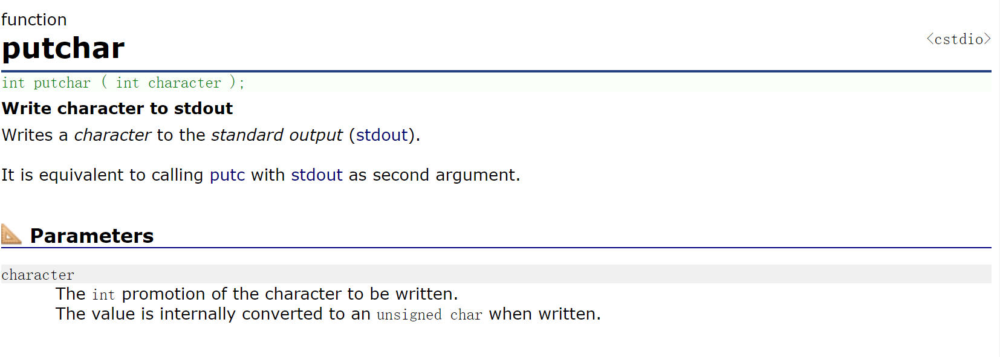

+ 现在代码运行结果是什么呢？

输入：>`q`  
输出：>`q`

+ 输入什么就会输出什么

那么我们这个程序怎么停止下来呢？

+ 只需要`ctrl+z`然后回车就可以了，目的是让读取到`EOF`这样程序就会终止。

这里的`getchar()`还有清理缓冲区的的作用

**例如：**

```c
int main()
{
    char password[20];
    scanf("%s", password);
    printf("请确认（Y/N）：");
    char ch = getchar();
    if ('Y' == ch)
        printf("确认成功\n");
    else
        printf("确认失败\n");
    return 0;
}
```

输入：>`abcde`  
输出：>`请确认（Y/N）：确认失败`

怎么回事呢？还没确认就是确认失败了，为什么呢？

+ scanf会从键盘上读取一些你输入的数据，但你不输入的时候，它就一直等，一直等，直等到你输入为止。
+ 在计算机中，使用scanf时并不会直接获取键盘上输入的数据。相反，存在一个输入缓冲区，用户输入的数据首先会被放入这个缓冲区。当用户输入完数据（例如"abcde"），为了将这些数据送入缓冲区，用户需要按下回车键。
    - 举例来说，如果用户输入"abcde"并按下回车键，整个输入会被存储为"abcde\n"，其中\n表示回车符。这时，scanf会从缓冲区读取数据，直到遇到换行符为止。所以，用户的输入实际上是被缓冲并在程序请求时才被获取的。
+ 通过`scanf`函数将数据输入到缓冲区，并检查是否有可读取的数据。如果有数据可读取，它会一直读取直到遇到换行符（\n）。随后，将这些数据作为密码赋给变量password。此时，`getchar()`函数也开始读取数据，其工作原理与scanf()相似，检查缓冲区是否有数据。一旦发现换行符（\n），就将对应的数据存储到变量ch中。然后，程序判断ch是否为‘Y’，由于不满足这个条件，进入else分支，并输出“确认失败”。这就是编译器在等待我们输入确认密码时，却直接结束程序的原因。

再看一个代码

```c
#include <stdio.h>
int main()
{
    char ch = '\0';
    while ((ch = getchar()) != EOF)
    {
        if (ch < '0' || ch > '9')
            continue;
        putchar(ch);
    }
    return 0;
}
```

+ 那么这段代码就要对ASCLL码表要熟悉

| 二进制 | 八进制 | 十进制 | 十六进制 | 字符/缩写 | 解释 |
| :---: | :---: | :---: | :---: | :---: | :---: |
| 00000000 | 000 | 0 | 00 | NUL (NULL) | 空字符 |
| 00000001 | 001 | 1 | 01 | SOH (Start Of Headling) | 标题开始 |
| 00000010 | 002 | 2 | 02 | STX (Start Of Text) | 正文开始 |
| 00000011 | 003 | 3 | 03 | ETX (End Of Text) | 正文结束 |
| 00000100 | 004 | 4 | 04 | EOT (End Of Transmission) | 传输结束 |
| 00000101 | 005 | 5 | 05 | ENQ (Enquiry) | 请求 |
| 00000110 | 006 | 6 | 06 | ACK (Acknowledge) | 回应/响应/收到通知 |
| 00000111 | 007 | 7 | 07 | BEL (Bell) | 响铃 |
| 00001000 | 010 | 8 | 08 | BS (Backspace) | 退格 |
| 00001001 | 011 | 9 | 09 | HT (Horizontal Tab) | 水平制表符 |
| 00001010 | 012 | 10 | 0A | LF/NL(Line Feed/New Line) | 换行键 |
| 00001011 | 013 | 11 | 0B | VT (Vertical Tab) | 垂直制表符 |
| 00001100 | 014 | 12 | 0C | FF/NP (Form Feed/New Page) | 换页键 |
| 00001101 | 015 | 13 | 0D | CR (Carriage Return) | 回车键 |
| 00001110 | 016 | 14 | 0E | SO (Shift Out) | 不用切换 |
| 00001111 | 017 | 15 | 0F | SI (Shift In) | 启用切换 |
| 00010000 | 020 | 16 | 10 | DLE (Data Link Escape) | 数据链路转义 |
| 00010001 | 021 | 17 | 11 | DC1/XON (Device Control 1/Transmission On) | 设备控制1/传输开始 |
| 00010010 | 022 | 18 | 12 | DC2 (Device Control 2) | 设备控制2 |
| 00010011 | 023 | 19 | 13 | DC3/XOFF (Device Control 3/Transmission Off) | 设备控制3/传输中断 |
| 00010100 | 024 | 20 | 14 | DC4 (Device Control 4) | 设备控制4 |
| 00010101 | 025 | 21 | 15 | NAK (Negative Acknowledge) | 无响应/非正常响应/拒绝接收 |
| 00010110 | 026 | 22 | 16 | SYN (Synchronous Idle) | 同步空闲 |
| 00010111 | 027 | 23 | 17 | ETB (End of Transmission Block) | 传输块结束/块传输终止 |
| 00011000 | 030 | 24 | 18 | CAN (Cancel) | 取消 |
| 00011001 | 031 | 25 | 19 | EM (End of Medium) | 已到介质末端/介质存储已满/介质中断 |
| 00011010 | 032 | 26 | 1A | SUB (Substitute) | 替补/替换 |
| 00011011 | 033 | 27 | 1B | ESC (Escape) | 逃离/取消 |
| 00011100 | 034 | 28 | 1C | FS (File Separator) | 文件分割符 |
| 00011101 | 035 | 29 | 1D | GS (Group Separator) | 组分隔符/分组符 |
| 00011110 | 036 | 30 | 1E | RS (Record Separator) | 记录分离符 |
| 00011111 | 037 | 31 | 1F | US (Unit Separator) | 单元分隔符 |
| 00100000 | 040 | 32 | 20 | (Space) | 空格 |
| 00100001 | 041 | 33 | 21 | ! |  |
| 00100010 | 042 | 34 | 22 | " |  |
| 00100011 | 043 | 35 | 23 | # |  |
| 00100100 | 044 | 36 | 24 | $ |  |
| 00100101 | 045 | 37 | 25 | % |  |
| 00100110 | 046 | 38 | 26 | & |  |
| 00100111 | 047 | 39 | 27 | ' |  |
| 00101000 | 050 | 40 | 28 | ( |  |
| 00101001 | 051 | 41 | 29 | ) |  |
| 00101010 | 052 | 42 | 2A | * |  |
| 00101011 | 053 | 43 | 2B | + |  |
| 00101100 | 054 | 44 | 2C | , |  |
| 00101101 | 055 | 45 | 2D | - |  |
| 00101110 | 056 | 46 | 2E | . |  |
| 00101111 | 057 | 47 | 2F | / |  |
| 00110000 | 060 | 48 | 30 | 0 |  |
| 00110001 | 061 | 49 | 31 | 1 |  |
| 00110010 | 062 | 50 | 32 | 2 |  |
| 00110011 | 063 | 51 | 33 | 3 |  |
| 00110100 | 064 | 52 | 34 | 4 |  |
| 00110101 | 065 | 53 | 35 | 5 |  |
| 00110110 | 066 | 54 | 36 | 6 |  |
| 00110111 | 067 | 55 | 37 | 7 |  |
| 00111000 | 070 | 56 | 38 | 8 |  |
| 00111001 | 071 | 57 | 39 | 9 |  |
| 00111010 | 072 | 58 | 3A | : |  |
| 00111011 | 073 | 59 | 3B | ; |  |
| 00111100 | 074 | 60 | 3C | < |  |
| 00111101 | 075 | 61 | 3D | = |  |
| 00111110 | 076 | 62 | 3E | > |  |
| 00111111 | 077 | 63 | 3F | ? |  |
| 01000000 | 100 | 64 | 40 | @ |  |
| 01000001 | 101 | 65 | 41 | A |  |
| 01000010 | 102 | 66 | 42 | B |  |
| 01000011 | 103 | 67 | 43 | C |  |
| 01000100 | 104 | 68 | 44 | D |  |
| 01000101 | 105 | 69 | 45 | E |  |
| 01000110 | 106 | 70 | 46 | F |  |
| 01000111 | 107 | 71 | 47 | G |  |
| 01001000 | 110 | 72 | 48 | H |  |
| 01001001 | 111 | 73 | 49 | I |  |
| 01001010 | 112 | 74 | 4A | J |  |
| 01001011 | 113 | 75 | 4B | K |  |
| 01001100 | 114 | 76 | 4C | L |  |
| 01001101 | 115 | 77 | 4D | M |  |
| 01001110 | 116 | 78 | 4E | N |  |
| 01001111 | 117 | 79 | 4F | O |  |
| 01010000 | 120 | 80 | 50 | P |  |
| 01010001 | 121 | 81 | 51 | Q |  |
| 01010010 | 122 | 82 | 52 | R |  |
| 01010011 | 123 | 83 | 53 | S |  |
| 01010100 | 124 | 84 | 54 | T |  |
| 01010101 | 125 | 85 | 55 | U |  |
| 01010110 | 126 | 86 | 56 | V |  |
| 01010111 | 127 | 87 | 57 | W |  |
| 01011000 | 130 | 88 | 58 | X |  |
| 01011001 | 131 | 89 | 59 | Y |  |
| 01011010 | 132 | 90 | 5A | Z |  |
| 01011011 | 133 | 91 | 5B | [ |  |
| 01011100 | 134 | 92 | 5C | \ |  |
| 01011101 | 135 | 93 | 5D | ] |  |
| 01011110 | 136 | 94 | 5E | ^ |  |
| 01011111 | 137 | 95 | 5F | _ |  |
| 01100000 | 140 | 96 | 60 | ` |  |
| 01100001 | 141 | 97 | 61 | a |  |
| 01100010 | 142 | 98 | 62 | b |  |
| 01100011 | 143 | 99 | 63 | c |  |
| 01100100 | 144 | 100 | 64 | d |  |
| 01100101 | 145 | 101 | 65 | e |  |
| 01100110 | 146 | 102 | 66 | f |  |
| 01100111 | 147 | 103 | 67 | g |  |
| 01101000 | 150 | 104 | 68 | h |  |
| 01101001 | 151 | 105 | 69 | i |  |
| 01101010 | 152 | 106 | 6A | j |  |
| 01101011 | 153 | 107 | 6B | k |  |
| 01101100 | 154 | 108 | 6C | l |  |
| 01101101 | 155 | 109 | 6D | m |  |
| 01101110 | 156 | 110 | 6E | n |  |
| 01101111 | 157 | 111 | 6F | o |  |
| 01110000 | 160 | 112 | 70 | p |  |
| 01110001 | 161 | 113 | 71 | q |  |
| 01110010 | 162 | 114 | 72 | r |  |
| 01110011 | 163 | 115 | 73 | s |  |
| 01110100 | 164 | 116 | 74 | t |  |
| 01110101 | 165 | 117 | 75 | u |  |
| 01110110 | 166 | 118 | 76 | v |  |
| 01110111 | 167 | 119 | 77 | w |  |
| 01111000 | 170 | 120 | 78 | x |  |
| 01111001 | 171 | 121 | 79 | y |  |
| 01111010 | 172 | 122 | 7A | z |  |
| 01111011 | 173 | 123 | 7B | { |  |
| 01111100 | 174 | 124 | 7C | | |  |
| 01111101 | 175 | 125 | 7D | } |  |
| 01111110 | 176 | 126 | 7E | ~ |  |
| 01111111 | 177 | 127 | 7F | DEL (Delete) | 删除 |


+ 这段代码只打印0~9的字符

### 3.2 for循环
#### 3.2.1 语法
首先来看看for循环的语法：

```cpp
for(表达式1; 表达式2; 表达式3)
    循环语句;
```

+ 表达式1：表达式1为初始化部分，用于初始化循环变量的；
+ 表达式2：表达式2为条件判断部分，用于判断循环时候终止；
+ 表达式3：表达式3为调整部分，用于循环条件的调整。

for循环的执行流程：  
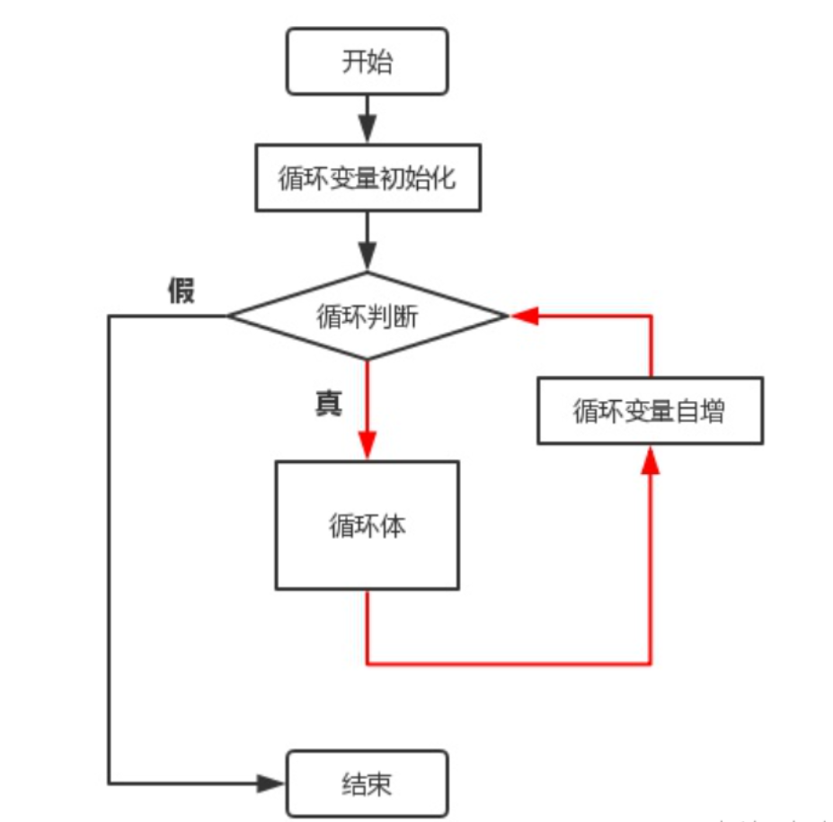

#### 3.2.2 练习：使用for循环 在屏幕上打印1-10的数字。
```c
#include <stdio.h>
int main()
{
    int i = 0;
    //for(i=1/*初始化*/; i<=10/*判断部分*/; i++/*调整部分*/)
    for (i = 1; i <= 10; i++)
    {
        printf("%d ", i);
    }
    return 0;
}
```

+ 输出：>`1 2 3 4 5 6 7 8 9 10`
+ 就像我们这里去打印1-10的数字，使用for循环的话就会很清晰直观，代码也比较简练
+ 现在，我们学习完了while循环和for循环后，让我们进行对比一下这两个循环：

```c
int i = 0;
//实现相同的功能，使用while
i = 1; //初始化部分
while(i <= 10) //判断部分
{
    printf("hehe\n");
    i = i + 1; //调整部分
}
 
//实现相同的功能，使用for
for(i = 1; i <= 10; i++)
{
    printf("hehe\n");
}
```

> 通过上面的代码，可以发现在while循环中依然存在循环的三个必须条件，但是由于风格问题使得三个部分很可能偏离较远，这样查找修改不够集中和方便。 
>

### 3.3 do......while()循环
**do......while()执行流程：**

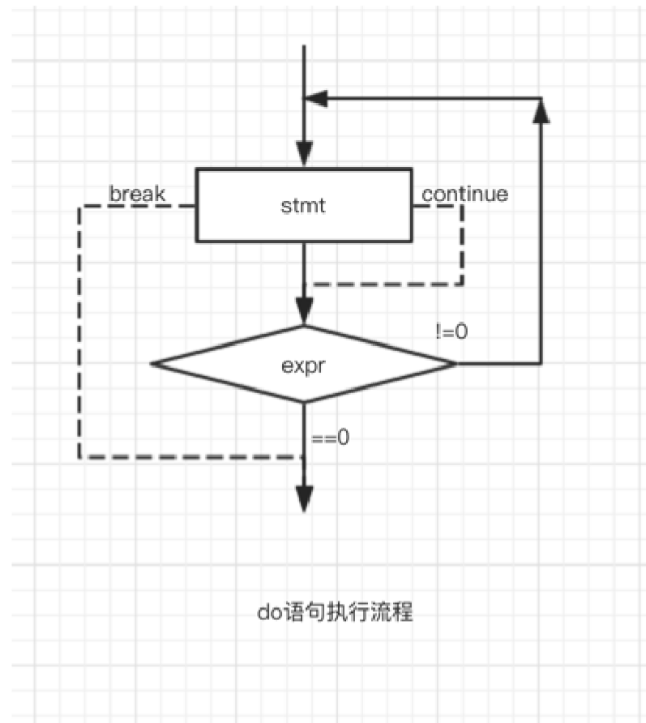

#### 3.3.1 do语句的语法
首先来看一下它的语法格式，和while循环很类似

```c
do
{
    循环语句;
}while(表达式);
```

#### 3.3.2 do...while语句的特点
+ 循环体内至少执行一次，使用的场景有限，所以不是经常使用。
+ 但是我们下面的猜数字游戏会有一个案例我们可以来看一下

## 四、goto语句
在大多数现代编程语言中，goto语句通常被认为是一种不良的编程实践，因为它可能导致程序难以理解和维护。然而，在某些情况下，它仍然是一种有用的控制流工具。在C语言中，goto语句可以用来无条件地将程序控制转移到指定的标签处。

> 如果`goto`语句用的不好，会导致程序跳来跳去的。
>

### 4.1 goto语句的作用
+ C语言提供了⼀种非常特别的语法，就是 `goto` 语句和跳转标号，` goto `语句可以实现在同⼀个函数 内跳转到设置好的标号处。

### 4.2 goto语句的使用场景
```c
for (...)
for (...)
{
    for (...)
    {
        if (disaster)
            goto error;
    }
}
…
error :
if (disaster)
// 处理错误情况
```

### 4.3 goto语句的例子
+ 下面这是一个关机程序的例子，学会后可以拿去恶搞同学一下~~

```c
#include <stdio.h>
#include <windows.h>
#include <string.h>
int main()
{
    char input[10] = {0};
    system("shutdown -s -t 60");
again:
    printf("电脑将在1分钟内关机，如果输入：我是猪，就取消关机！\n请输入:>");
    scanf("%s", input);
    if(0 == strcmp(input, "我是猪"))
    {
        printf("shutdown -a");
    }
    else
    {
        goto again;
    }
    return 0;
}
```

+ 使用goto通常容易导致程序结构混乱，使得代码难以理解和维护。因此，除非有充分的理由，推荐使用其他控制流结构（如for、while、do-while、if等）来替代goto语句。

## 五、作业练习
### 1、 计算 n的阶乘
+ 计算一个n的阶乘，那只要定义一个变量去存放这个阶乘的结果，然后通过循环去遍历即可
+ 这里需要注意的一点就是，ret初始值为1。

```c
int main()
{
    //n的阶乘
    int n = 0;
    scanf("%d", &n);
    int ret = 1;
    for (int i = 1; i <= n; ++i)
    {
        ret *= i;
    }
    printf("ret = %d\n", ret);
    return 0;
}
```

### 2、 计算 1!+2!+3!+……+10!
+ 第二小题又是一道计算阶乘的题，然后把计算出的阶乘再相加~~
+ 假设我们要计算1! + 2! + 3! 这一小规模的阶乘之和。首先，让我们审视解题思路。由于只需计算到数字3的阶乘，我们需要一个外层循环，从1迭代到3，表示我们要求解的是这三个数字的阶乘之和。
+ 接下来，内层循环用于计算每个数字的阶乘，从1迭代到该数字即可。我们使用一个累乘变量来存储计算结果。在完成每个数字的阶乘计算后，我们需要累加这些阶乘的和，因此还需要定义一个sum变量来存储这个累加和。最终，sum变量就是我们所需的结果。
    - 正确答案应该是1 + 2 + 6 = 9

```c
int ret = 1;
int sum = 0;
for (int i = 1; i <= 3; ++i)
{
    for (int j = 1; j <= i; ++j)
    {
        ret *= j;
    }
    sum += ret;
}
printf("sum = %d\n", sum);
```

+ 可以看到，sum的结果并非为9。这里涉及到一个常见的错误。因为我们正在计算不同数字的阶乘，但是使用的累乘变量是同一个ret。因此，当计算下一个数字的阶乘时，ret仍然保留了上一次数字累乘后的结果。这导致了阶乘计算的不准确，因此结果也会有所不同。
+ 在计算3!时，可能多乘了一个2！留下了额外的2，导致3！= 12，比实际结果多了6。因此，最终的计算结果也就多了6。
+ 我们应该加上`ret = 1;`在每一次更新需要求阶乘的数时，都将这个累乘变量ret重置

```c
int ret = 1;
int sum = 0;
for (int i = 1; i <= 3; ++i)
{
    ret = 1;//这里要把ret掷为1
    for (int j = 1; j <= i; ++j)
    {
        ret *= j;
    }
    sum += ret;
}
printf("sum = %d\n", sum);
```

我们还可以这样写，直接讲上次算出的值加到下一次就可以了！

```c
int ret = 1;
int sum = 0;
for (int i = 1; i <= 3; ++i)
{
    ret *= i;
    sum += ret;
}
```

### 3、 在一个有序数组中查找具体的某个数字n
+ 在数组的两端分别设定左右两个指针，然后计算它们的中间值。将欲查找的数字与中间值比较，若小于中间值，则舍弃后半段区间，只需在前半段继续查找；若大于中间值，则舍弃前半段区间，继续在后半段查找。将此逻辑嵌入一个循环中，不断更新中间值进行比较。最终左右两指针会相遇，表示区间即将结束。若左指针大于右指针，表示已找到目标元素或未找到，此时退出循环并进行相应打印说明。
+ 接下来我们就看看代码~~

```c
int main()
{	
    //二分查找法
    int a[10] = { 1,2,3,4,5,6,7,8,9,10 };
    int sz = sizeof(a) / sizeof(a[0]);
    int key = 7;//要查找的数字k
    int left = 0;
    int right = sz - 1;

    while (left <= right)
    {
        int mid = (left + right) / 2;
        if (key < a[mid])
            right = mid - 1;
        else if (key > a[mid])
            left = mid + 1;
        else
        {
            printf("找到了，下标是%d\n", mid);
            break;		//找到了便跳出循环
        }
    }
    if (left > right)
        printf("没找到此元素\n");
    return 0;
}
```

### 4、演示多个字符从两端移动，向中间汇聚
+ 我们要展示多个字符从两端向中间汇聚的效果，需要实现一种覆盖的动画效果。我定义了两个数组，最终要打印的是第一个数组的内容，但在打印过程中，我们通过左右指针实现覆盖效果。
+ 首先，初始化左指针为0，右指针不能直接取末尾值，需要使用`strlen()`库函数求解数组1的长度，然后减1得到右指针位置。
+ 将逻辑放入循环中，通过左右指针将第一个数组的内容赋给第二个数组，然后不断移动这两个指针直至左指针大于右指针。
+ 为了慢慢显示出效果，使用了Sleep()睡眠函数，需要引入头文件`#include <Windows.h>`。这个函数的参数是毫秒值，比如1秒执行一次就传入1000，0.5秒执行一次就传入500。这样可以创建一个动画效果。

```c
int main()
{
    char arr1[] = { "C生万物!!!" };
    char arr2[] = { "*****************" };

    int left = 0;
    int right = strlen(arr1) - 1;
    while (left <= right)
    {
        arr2[left] = arr1[left];
        arr2[right] = arr1[right];
        printf("%s\n", arr2);
        Sleep(500);
        left++;
        right--;
    }
    return 0;
}
```

+ 为了让其在一行打印，不需要一行行地打印，我们可以使用这样一个命令

```c
system("cls");	//清屏，一行打印
```

+ 但是这个system()函数要加上头文件`#include <stdlib.h>`。

### 5、密码校验
+ 这题的要求是输入一串字符，然后与正确密码进行比较，如果相同就立即跳出循环；如果不同，继续输入，但只有3次机会，用完后强制跳出循环，不允许再次输入。

我们来看一下代码~~

```c
int main()
{
    int i = 0;
    char password[20] = { 0 };

    for (i = 0; i < 3; ++i)
    {
        printf("请输入密码>：");
        scanf("%s", password);
        if (strcmp(password, "bitbit") == 0)
        {
            printf("密码输入正确\n");
            break;
        }
        else
        {
            printf("密码输入错误\n");
        }
    }
    if (i == 3)
    {
        printf("输入机会用完，请30分钟后再试\n");
    }

    return 0;
}

```

+ 在这方面需要注意的一个问题是字符串比较时可能出现的挂字符串问题。我们不能直接使用==运算符进行比较，而应该利用字符串库函数strcmp来实现比较。关于`strcmp`的返回值，我们可以通过查阅[cplusplus](https://legacy.cplusplus.com/)来获取详细信息。
+ 简而言之，`strcmp`函数的返回值取决于第一个字符串的首字母与第二个字符串的首字母的ASCII码值大小关系。如果第一个字符串的首字母大于第二个字符串的首字母，那么返回一个大于0的数字；反之，如果小于，则返回一个小于0的数字。如果两个字符串相同，返回值则为0。这里实际上进行的是ASCII码值的大小比较。

### 7、求√a的近似值
利用牛顿递归法求的近似值。你可以通过迭代式，其中，n的值是1,2,3,4,5，当时结束。输入a，求的近似值，结果保留3位小数。

```c
int main() {
	double a,x,n;
	scanf("%lf",&a);
	x=a/2; // 当前项
	n=(x+a/x)/2; // 下一项
	while(fabs(n-x) >= 1e-5) {
		x=n;
		n=(x+a/x)/2;
	}
	printf("%.3lf",x);
    return 0;
}
```

### 8、计算一元二次方程的根
链接：[https://www.nowcoder.com/questionTerminal/7da524bb452441b2af7e64545c38dc26](https://www.nowcoder.com/questionTerminal/7da524bb452441b2af7e64545c38dc26)  
来源：牛客网

输入描述:

> 多组输入，一行，包含三个浮点数a, b, c，以一个空格分隔，表示一元二次方程ax2 + bx + c = 0的系数。 
>

输出描述:

> 针对每组输入，输出一行，输出一元二次方程ax2 + bx +c = 0的根的情况。
>
> 如果a = 0，输出“Not quadratic equation”；
>
> 如果a ≠  0，分三种情况：
>
> △ = 0，则两个实根相等，输出形式为：x1=x2=...。
>
> △  > 0，则两个实根不等，输出形式为：x1=...;x2=...，其中x1  <=  x2。
>
> △  < 0，则有两个虚根，则输出：x1=实部-虚部i;x2=实部+虚部i，即x1的虚部系数小于等于x2的虚部系数，实部为0时不可省略。实部= `-b / (2*a)`，虚部= `sqrt(-△) / (2*a)`
>
> 所有实数部分要求精确到小数点后2位，数字、符号之间没有空格。
>

```c
#include <stdio.h>
#include <math.h>

int main() {
    double a, b, c;
    while (scanf("%lf%lf%lf", &a, &b, &c) != EOF) {
        double x1, x2, disc, real, imag;
        if (fabs(a) < 1e-6) {
            printf("Not quadratic equation\n");
        } else {
            disc = b * b - 4 * a * c; // △
            if (disc == 0) {
                double root = (-b + sqrt(disc)) / (2 * a);
                if (root == -0.0) {
                    root = 0.0;
                }
                printf("x1=x2=%.2lf\n", root);
            } else if (disc > 0) {
                x1 = (-b + sqrt(disc)) / (2 * a);
                x2 = (-b - sqrt(disc)) / (2 * a);
                if (x1 < x2)
                    printf("x1=%.2lf;x2=%.2lf\n", x1, x2);
                else
                    printf("x1=%.2lf;x2=%.2lf\n", x2, x1);
            } else if (disc < 0) {
                real = -b / (2 * a); // 实部
                imag = sqrt(-disc) / (2 * a); // 虚部
                printf("x1=%.2lf-%.2lfi;x2=%.2lf+%.2lfi\n", real, imag, real, imag);

            }
        }
    }
    return 0;
}
```

### 9、求π的近似值
题目：利用公式求的近似值，直到发现某一项的绝对值小于为止（改项不累加）

解题思路：

1. 每项的分子是1
2. 后一项的分母是前一项的分母加2
3. 每一项的符号为正，之后每一项的符号与前一项符号相反，也就是一正一反
4. 在求完一项后，判断该项的绝对值是否大于，如果大于等于就继续，否则停止

```c
#include<stdio.h>
#include<math.h>

int main() {
	double pi=0,a=1,b=1;
	// 求出4/π 
	while(fabs(a/b)>=1e-6) {
		pi+=a/b;
		a*=-1;
		b+=2;
	}
	printf("%lf",pi * 4.0);
	return 0;
}
```

### 10、猜数字游戏【经典】
+ 首先我们来实现一个整体的逻辑，也就是当你输入的时候，通过我们上面学习的switch语句进行一个分支的判断，是要继续猜数字还是退出游戏。

```c
void menu()
{
    printf("\n");
    printf("********************************\n");
    printf("**********  1.play  ************\n");
    printf("**********  0.exit  ************\n");
    printf("********************************\n");
    printf("\n");
}
void game()
{
    printf("猜数字\n");
}
int main()
{
    int input = 0;
    srand((unsigned int)time(NULL));
    do
    {
        menu();
        printf("请选择>:");
        scanf("%d", &input);
        switch (input)
        {
        case 1:
            game();
            break;
        case 0:
            break;
        default:
            printf("选择错误,请重新输入!\n");
            break;
        }
    } while (input);
    return 0;
}
```

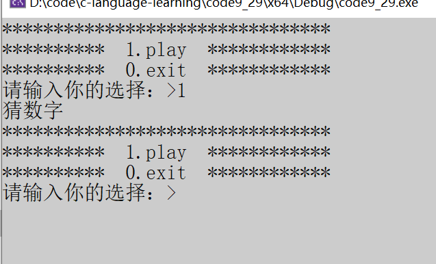

+ 可以看到，整体的逻辑已经实现了按下【1】时启动猜数字功能。如果一直按下1，就能一直进行猜数字，直到按下0为止。
+ 接下来我们就要实现猜数字内部的逻辑了，我们首先要产生一个随机数，然后我们输入一个数字，比较要猜的数字，如果输入的大了就提示猜的数字打了，相反，输入的小了就提示小了，要么就一直继续，知道猜成功为止
+ 那么就要用到一个函数`rand()`，可以在[cplusplus](https://legacy.cplusplus.com/reference/cstdlib/rand/?kw=rand)网站上找到~~

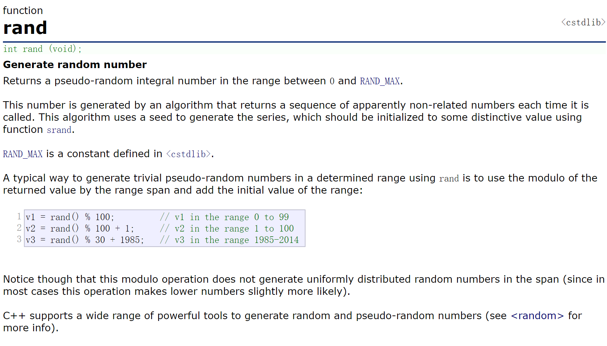

+ 我们要生成1~100内的数字，我们使用下面这段代码官方文档上面也有写

```c
//生成随机数
int ret = rand() % 100 + 1;		//1 ~ 100
```

+ 但是我们这里又有一个问题，这个rand是一个[伪随机数](https://baike.baidu.com/item/%E4%BC%AA%E9%9A%8F%E6%9C%BA%E6%95%B0/104358?fr=ge_ala)
+ 在C语言中，`rand()`函数用于生成伪随机数。伪随机数是由一个算法生成的数字序列，其看似随机，但实际上是可预测的，因为它们是根据一个称为"种子"的初始值计算的。
+ 这个时候我们就要使用到一个C语言中的另一个函数叫做随机种子`srand()`，我们通过[cplusplus](https://legacy.cplusplus.com/reference/cstdlib/srand/?kw=srand)我们再来看看

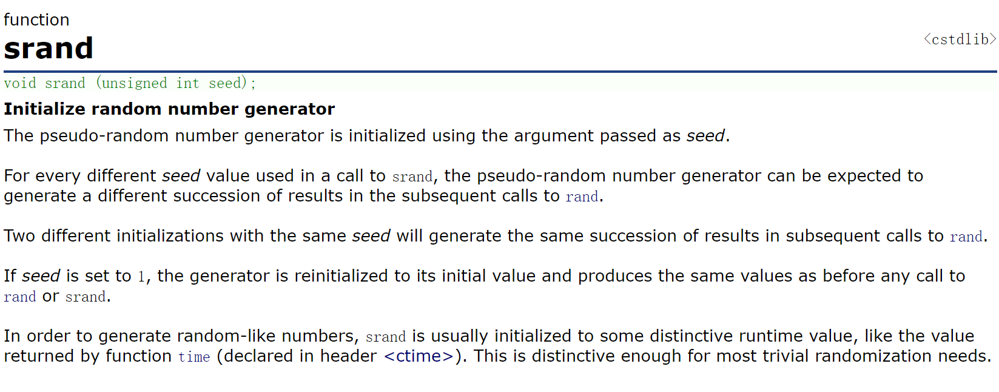


+ 这个时候我们有了这个函数是不够的，一般还要再配合使用一个时间戳函数`time()`，不会使用的话也可以在[cplusplus](https://legacy.cplusplus.com/reference/ctime/time/?kw=time)中查看

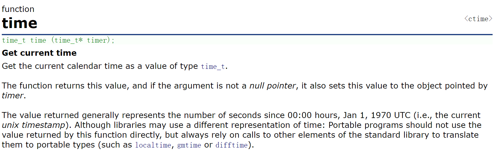

+ 我们可以这样直接使用，下面我们来详细介绍一下这段代码

```c
srand((unsigned int)time(NULL));
```

+ `time(NULL)` 返回当前的系统时间，表示从某个固定时间点（通常是1970年1月1日午夜）到现在的秒数。
+ `(unsigned int)` 是将时间转换为无符号整数。`srand`函数的参数应该是一个无符号整数，因此这里进行了强制类型转换。
+ 最终，`srand((unsigned int)time(NULL));` 将当前时间作为种子传递给 srand 函数，以初始化伪随机数生成器。
+ 这个`time()`函数是要包含头文件的`#include <time.h>`
+ 还可以加上一个猜数字的次数，如果只能猜10次，次数用完了就结束了，并告知要猜的数字~~

```c
while (1)
{
    printf("次数还有%d\n", flag);

    printf("请输入猜的数字>:");
    scanf("%d", &input);
    if (input > random_num)
    {
        printf("猜大了\n");
        flag--;
    }
    else if (input < random_num)
    {
        printf("猜小了\n");
        flag--;
    }
    else
    {
        printf("恭喜你，猜对了\n");
        break;
    }
    if (flag == 0) {
        printf("次数用完了，数字是%d", random_num);
        break;
    }
}
```

完整的代码：>

+ 我们最后增加了一个次数限制，这样我们对一个猜数字游戏有更有游戏体验感

```c
#define _CRT_SECURE_NO_WARNINGS 1
#include <stdlib.h>
#include <stdio.h>
#include <time.h>

//设置猜的数字次数多少
#define NUM 10 

void menu()
{
    printf("**********************\n");
    printf("******  1.play *******\n");
    printf("******  0.exit *******\n");
    printf("**********************\n");
}

void game()
{
    int guess = 0;
    int ret = rand() % 100 + 1;
    int count = NUM;
    while (1)
    {
        printf("你还有%d次机会\n", count);
        printf("请猜数字:>");
        scanf("%d", &guess);
        if (guess > ret)
        {
            printf("猜大了！\n");
        }
        else if (guess < ret)
        {
            printf("猜小了！\n");
        }
        else
        {
            printf("恭喜你，猜对了！\n");
            break;
        }
        count--;
        if (count == 0)
        {
            printf("次数用完，正确的数字是%d\n", ret);
            break;
        }
    }
}
int main()
{
    int input = 0;
    srand((unsigned int)time(NULL));//生成随机数
    do
    {
        menu();
        printf("请选择：>");
        scanf("%d", &input);
        switch (input)
        {
        case 1:
            game();
            break;
        case 0:
            printf("退出游戏！\n");
            break;
        default:
            printf("选择错误，请重新选择！\n");
            break;
        }

    } while (input);

    return 0;
}
```

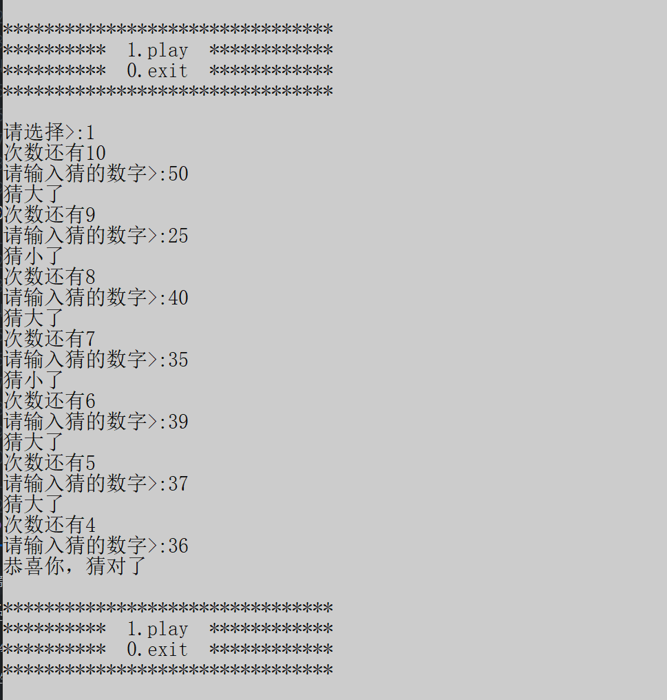


