# 前言
> 想必刚接触C语言的同学们不知道C语言是什么？，有什么用，那么你来对了，本系列就会带你入门C语言，从入门到“入土”，开玩笑的，正如标题所说，本教程首先对C语言有一个初步的认识，能够看懂别人写的是什么，有一个大概的框架， 这一章节主要是初始C语言的一个大纲。
>

## 一、什么是C语言
**C语言是什么**？

+ **语言**：汉语，日语，英语等。语言是一个自然语言，是人与人交流的语言。  
 计算机语言：类比过来，是人与计算机之间的交流。
+ **C语言**是一门**通用计算机编程语言**，广泛应用于**底层开发**。C语言的设计目标是提供一种能以简易的方式编译、处理低级存储器、产生少量的机器码以及不需要任何运行环境支持便能运行的编程语言。 尽管C语言提供了许多低级处理的功能，但仍然保持着良好跨平台的特性。

## 二、第一个C语言程序
> 程序=算法+数据结构（这里另外讲）
>

**算法的特性：**

1. **有穷性**
+ 一个算法必须在执行有穷步之后结束。
1. **确定性**
+ 算法的每一步骤都必须有确切的定义，不允许有模棱两可的解释，也不允许有多义性。
2. **可行性**
+ 算法中的所有操作都必须可以通过已经实现的基本操作运算有限次来实现。
3. **输入**
+ 一个算法可以有零个或多个输入，这些输入是算法开始执行前提供给算法的数据。
4. **输出**
+ 一个算法必须有一个或多个输出，这些输出是算法对输入数据进行处理后得到的结果。

如何**描述一个算法**？

+ **自然语言描述、流程图描述、N-S流程图、伪代码描述、计算机语言**

> 结构化程序设计方法主要原则有**：模块化、自顶向下、逐步求精**
>
> 一个C语言程序是由**函数**组成的，函数是组成C语言的**基本单位**，而语句是组成C程序的最小单位。
>

在我们了解完什么是C语言后我们需要了解如何使用开发环境去完成第一个C语言程序

---

+ 什么是集成开发环境呢？
+ 集成开发环境（IDE，Integrated Development Environment ）是用于提供程序开发环境的应用程序，一般包括代码编辑器、编译器、调试器和图形用户界面等工具。
+ 像`vscode`就是一种编辑器，它不是集成开发环境，但是它可以添加许多的插件来编辑代各种形式的代码。
+ 像`vs2022`就是一种集成开发环境，在平时使用很方便，但是存储空间比较大，毕竟有好有缺点嘛，不能两者兼容。

接下来我们就开始正式写第一个C语言程序

> 1. 进入官网下载VS2022，不要去别的地方下载那些盗版的！！！[点击进入官网](https://visualstudio.microsoft.com/zh-hans/downloads/)
>


+ 点击个人免费下载，学习的话，下载这个完全够用了。

> 2. 打开下载
>

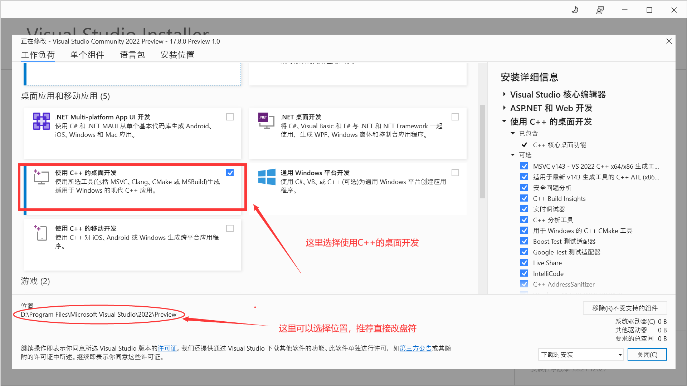

> 3. 打开软件，创建一个新项目
>

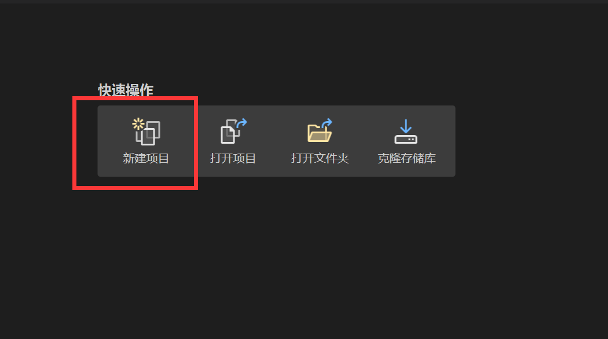  
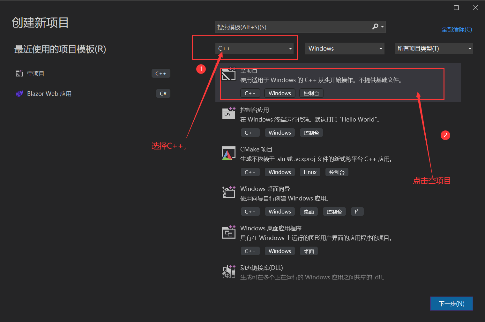  
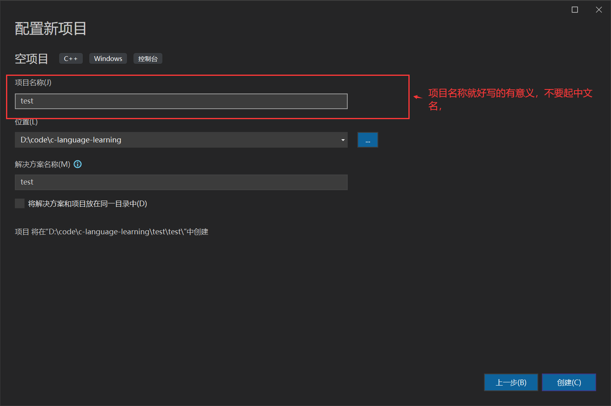

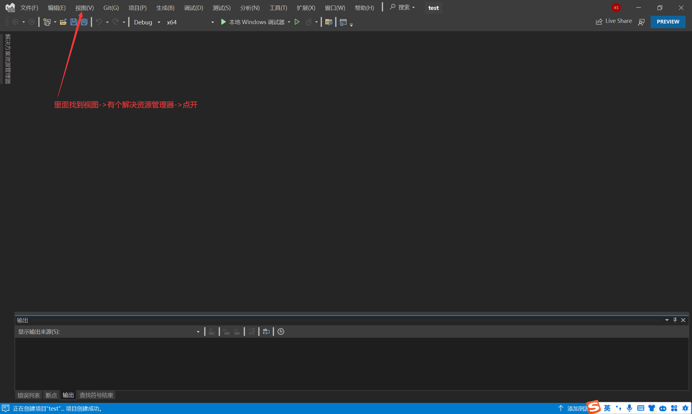  
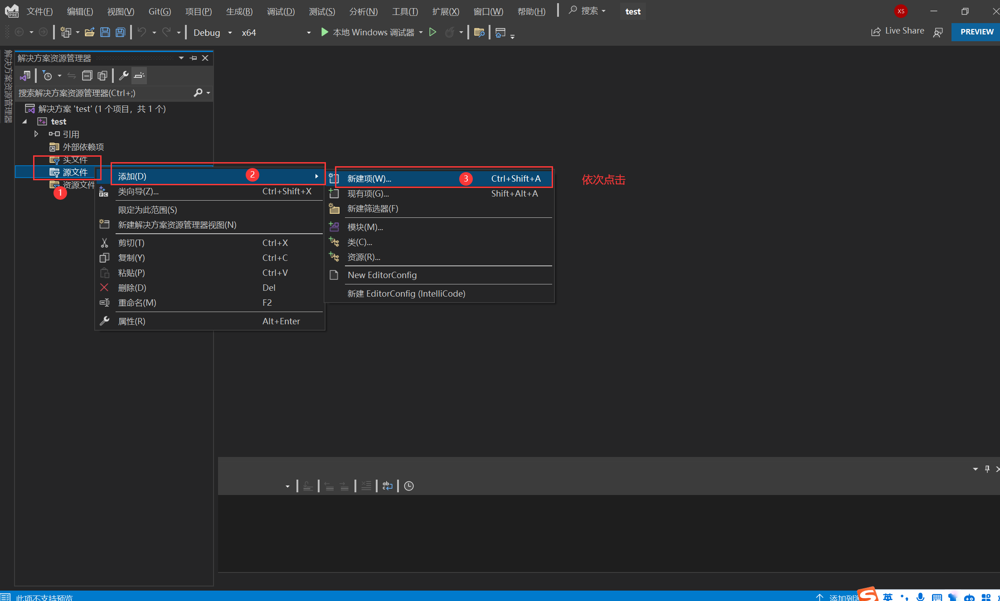  
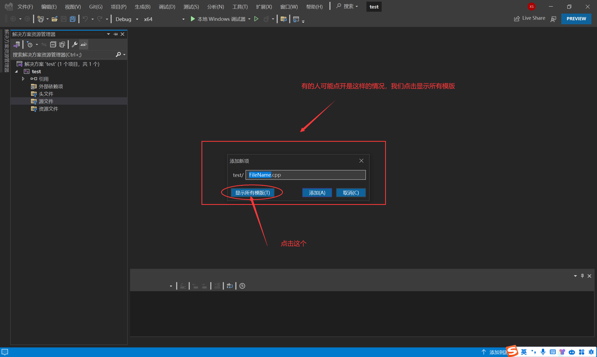  
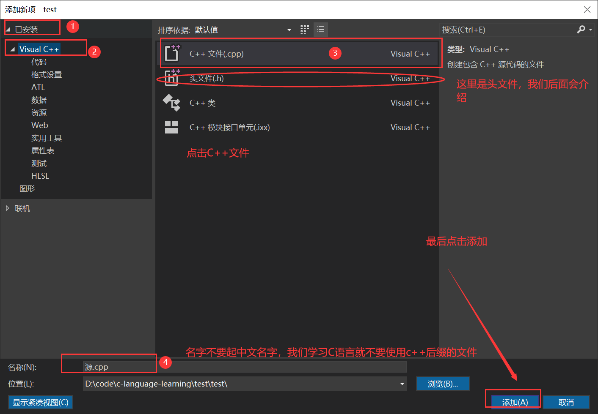

+ 在C语言的学习中，大多数人的第一个程序就是`hello world!`，那么我们怎么打印出`hello world`？

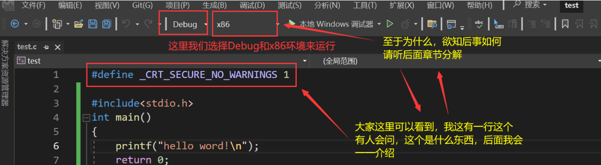

**注意**：

1. 我们知道，C语言所有的字符，符号，都是英文的。
2. C语言中代码是从`main`函数的第一行开始的。
3. main函数是程序的入口，一个工程中`main`函数有且只有一个。
4. 其中代码中的`printf`是编译器的头文件引入的，可以直接使用。
5. `<stido.h>`是头文件，后缀为`.c`是源文件，后缀`.h`为头文件。

```c
#include<stdio.h>
int main()
{
    printf("hello world!\n");
    return 0;
}
```

+ 有人可能看到我这里写的是`int main(){ ...  return 0}`,通常就是这样写的，也是最普遍的写法，还有一种就是`void main(){ }`，这种写法比较古老，还有一种是连前面的`void`也省略了，现在不会使用这种写法

## 三、数据类型
> 在写出了我们的第一个C语言程序，接下来我们来说一说C语言中的**数据类型**
>

在了解数据类型前，我们先探究为什么要**写程序**？

+ 是为了用程序解决生活中的一些问题。在现实生活中，我们的**各种数据有很多不同的类型**，**为了更加丰富的表达生活中的各种值**，所以在C语言程序中**设置这么多数据类型**。

```c
char        //字符数据类型
short       //短整型
int         //整形
long        //长整型
long long   //更长的整形
float       //单精度浮点数
double      //双精度浮点数
```

+ **每种类型的字节大小是多少？**

```plain
下图所显示的就是：
```

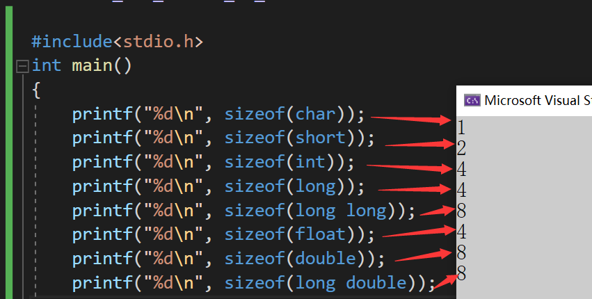


计算机中常见的单位：**bit(比特），byte(字节），KB，MB，GB，TB，PB**。

+ 他们的单位换算为：

> **1 byte = 8 bit**  
**1 KB    = 1024 byte**  
**1 MB   = 1024 KB**  
**1 GB    = 1024 MB**  
**1 TB    = 1024 GB**  
**1 PB    = 1024 TB**
>

## 四、变量，常量
> 在生活中有些值是不变的（比如：圆周率，性别，身份证号码，血型等等），**有些值是可变的**（比如：年龄，体重，薪资等等），引入了**变量**和**常量**的概念。
>


首先，先讲述一下**变量**：

### 1、变量
 **语法形式为**：`type + name`。代码如下：

```c
int age = 150;
float weight = 45.5f;  //浮点数默认为双精度浮点数，在后面加个f,说明是单精度浮点数类型
char ch = 'w';
```

---

### 1.1 变量的命名
1. 只能由字母（包括大小写），数字，下划线组成。
2. 不能以数字开头。
3. 长度不能超过63个字符。
4. C语言是区分大小写的。
5. 变量名字不能以`关键字`命名字。
6. 变量的名字尽量有意义。

### 1.2 变量的分类
+ 变量分为**局部变量**和**全局变量**

```c
#include <stdio.h>
int global = 2019;//全局变量
int main()
{
    int local = 2018;//局部变量
    //下面定义的global会不会有问题？
    int global = 2020;//局部变量
    printf("global = %d\n", global);
    return 0;
}
```

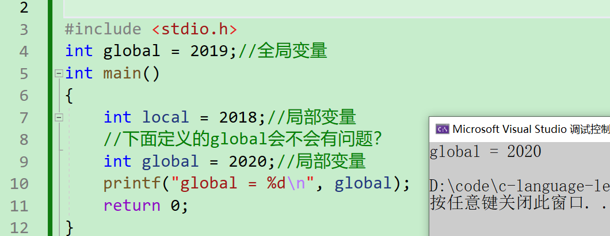

**总结**：

> 上面的局部变量`global`变量的定义其实没有什么问题的！  
当局部变量和全局变量同名的时候，`局部变量`优先使用。
>

### 1.3 变量的使用
> 了解了什么是变量，现在我们就要具体地去使用这个变量了
>

```c
#include <stdio.h>
int main()
{
    int num1 = 0;
    int num2 = 0;
    int sum = 0;
    printf("输入两个操作数:>");
    scanf("%d %d", &num1, &num2);
    sum = num1 + num2;
    printf("sum = %d\n", sum);
    return 0;
}
```

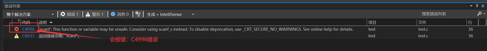


在vs编译时会发现，我们在这里会出现`4996警告`。

+ 为什么会出现这个警告呢？
    - 是因为在vs中输入函数，微软有自己的定义`scanf_s`，而用`scanf`函数不安全。


如何消除这个警告呢？

+ 第一种方法就是把`scanf()`改成`scanf_s()`，`scanf()`也是vs提供的，这种方式很简单，但是代码的跨平台，可移植性就变差了，不推荐这种方法。
+ 第二种方法就是在`.c`文件中添加`#pragma warning(disable:4996)`这样就不会提示这个告警了。
+ 还有一种是把这行粘贴到主文件的第一行`#define _CRT_SECURE_NO_WARNINGS 1`
+ 跟着下图一步一步的操作
    - 首先下载[everthing](https://everything.en.softonic.com/)软件，下载好点击打开
    - 搜索`newc++file.cpp`，打开文件
    - 把这行粘贴进去`#define _CRT_SECURE_NO_WARNINGS 1`

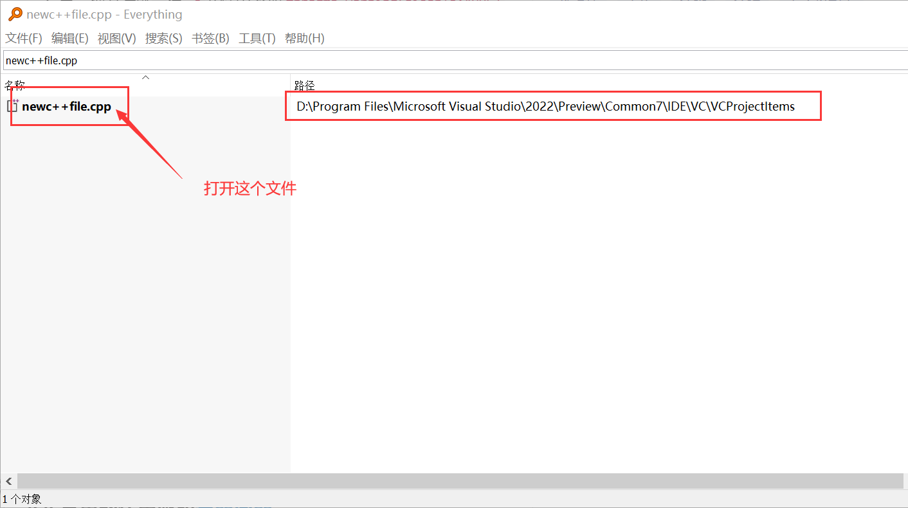


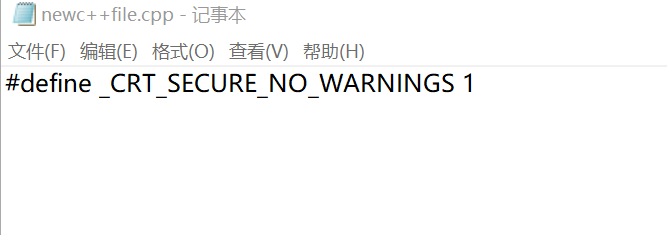

+ 这种方法一劳永逸，可以很好的解决我们的问题

再次创建一个`.c`文件，可以看到自动就有那一行了

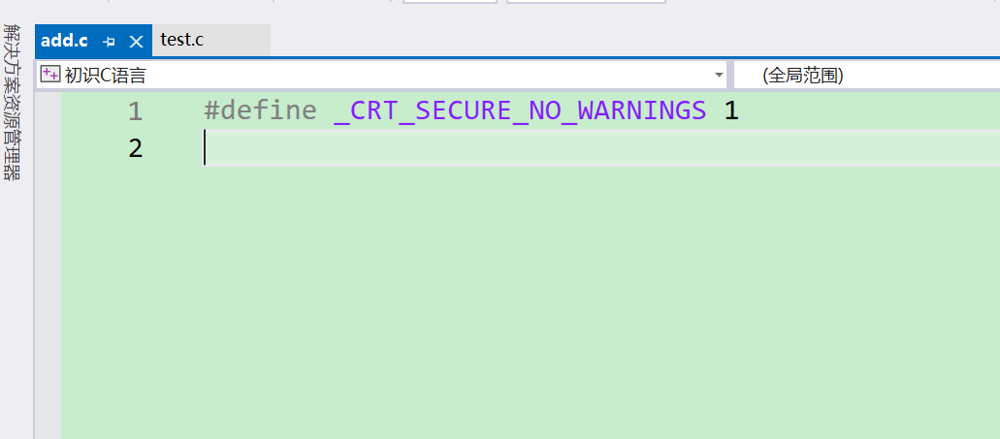

### 1.4 变量的作用域和生命周期
> 清楚了如果使用变量去编写程序，接下来我们来看一下变量的**作用域**和**生命周期**
>

**作用域：**

+ 作用域（scope）是程序设计概念，通常来说，一段程序代码中所用到的名字并不总是有效/可用的通常来说，一段代码中所用到的变量名并不总是有效的，而限定这个名字的可用性的代码范围就是这个变量名的作用域。

> 了解了其基本概念，我们就到代码中来演示一下
>

+ 可以看到程序报错了，说【未定义标识符】，可以看出这个作用域具有限定范围的

```c
int main()
{
    {
        int a = 10;
        printf("a = %d", a);
    }
    printf("a = %d", a);

    return 0;
}
```

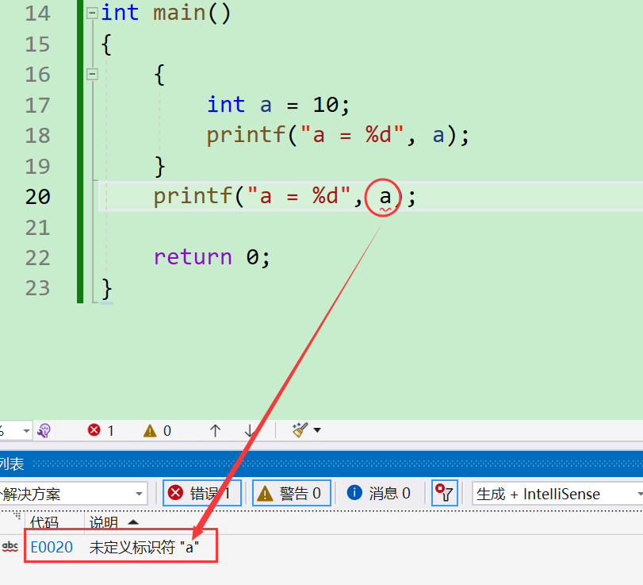

+ 以上的话就是局部变量的作用域。
+ 从下面代码可以看出，完全没有报出错误，因为对于全局变量的作用域，是从定义变量开始到整个程序运行结束，整个变量才会被销毁，而这个变量a，则是在这个代码块结束之后便会销毁，所以我们在后面才访问不到这个变量

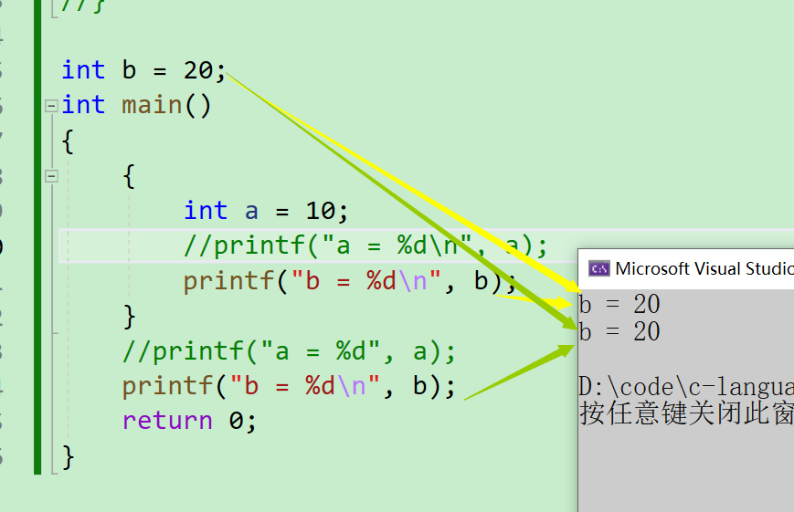

+ 对于全局变量的作用域，还可以这样使用，把这个b变量定义在`add.c`这个文件下，然后我们在`test.c`这个文件定义一下这个变量b，用这个`extern`声明一下即可

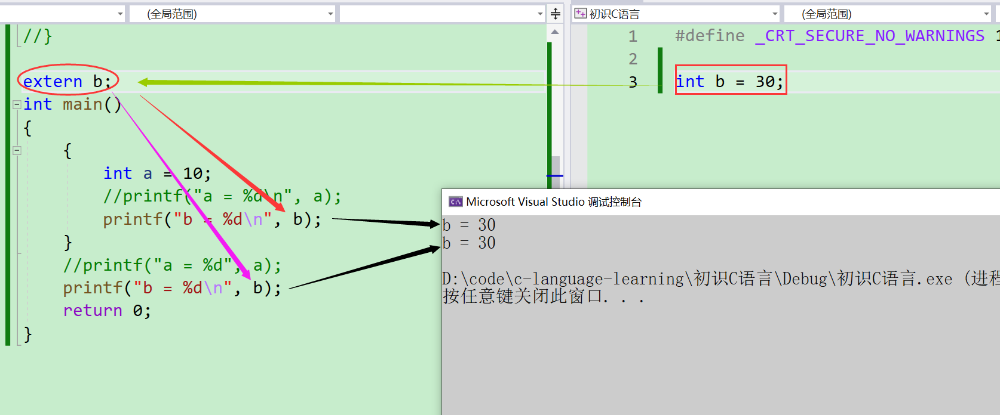  
**生命周期：**

> 变量的生命周期指的是变量的创建到变量的销毁之间的一个时间段
>

**局部变量的生命周期是**：进入作用域生命周期开始，出作用域生命周期结束。

**全局变量的生命周期是**：整个程序的生命周期

---

### 2、变量
C语言中常量分为一下几种：

+ 字面常量
+ `const`修饰的常变量
+ `#define`定义的标识符常量
+ 枚举常量

```c
#include <stdio.h>
//举例
enum Sex
{
    MALE,
    FEMALE,
    SECRET
};
//括号中的MALE,FEMALE,SECRET是枚举常量

//#define的标识符常量 演示
#define MAX 100

int main()
{
    //字面常量演示
    3.14;//字面常量
    1000;//字面常量

    //const 修饰的常变量
    const float pai = 3.14f;   //这里的pai是const修饰的常变量
    pai = 5.14;//是不能直接修改的！

    printf("max = %d\n", MAX);

    //枚举常量演示
    printf("%d\n", MALE);//0
    printf("%d\n", FEMALE);//1
    printf("%d\n", SECRET);//2
    //注：枚举常量的默认是从0开始，依次向下递增1的
    return 0;
}
```

> 常量就是不变的量，所以叫**常量**
>

## 五、字符串
### 1. 概念
+ 在讲字符串之前，我们先来看看下面这个，因为在计算机中存储、表示的都是二进制，所以我们打印出来的也会是一个二进制。
+ 首先定义一个char类型的字符变量ch，然后分别以%c、%d、%s去打印出来，可以看到，显示的结果各不相同。
+ %c打印的就是一个字符，%d打印的则是这个字符在ASCLL码表中的值，最后的%s，打印的就是ch这个字符串。

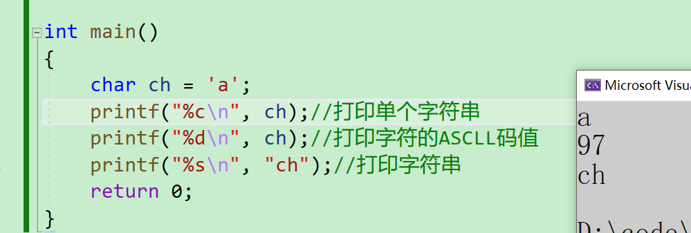

+ 然后开始讲一讲字符串

**概念**：双引号引起的一串字符叫做字符串

### 2. 求解字符串的长度【strlen】
> 说完了字符串了基本概念，了解了什么是字符串，接下去我们来看看如何入求解字符串的长度
>

+ 对于字符串，大家要知道，**结束标志是一个 \0 的转义字符**，转义字符我们下个模块就讲到，这个`\0`表示这个字符串已经结束了。但是在计算字符串长度的时候，这个`\0`是不计算在内的
+ 也是说，求字符串的长度**统计的是字符串中**`\0`**之前出现多少个字**

> 那我们如何去求解一个字符串的长度呢？
>

+ 这里我们需要使用到一个`<string.h>`头文件里的一个函数，叫做`strlen()`，可以计算一个字符串的长度，也就是\0之前的长度，这个函数我们后面会细讲

```c
printf("len = %d\n", strlen("abc"));
```

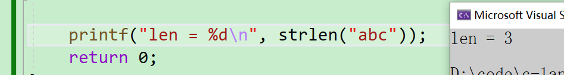

> 前面我们说到过char类型可以定义一个字符变量，我们还可以定义一个字符数组，什么是字符数组呢？就是这个数组中存放的都是字符，我们来看一个具体的定义。
>

```c
char arr[] = "abcdef";
```

+ 以上就是字符数组的基本定义

---

+ 下面这一种也是字符数组的定义方式

```c
char arr2[] = { 'a','b','c','d','e','f' };
```

+ 可以看到，这两个字符数组中的内容是一样，那他们打印出来，以及计算出来的长度是否是一样的呢。

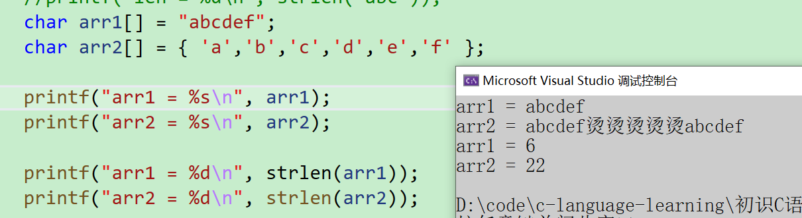

+ 很明显，从以上结果来看，是**不一样**的，这是为什么呢？我们通过一张图示来了解一下

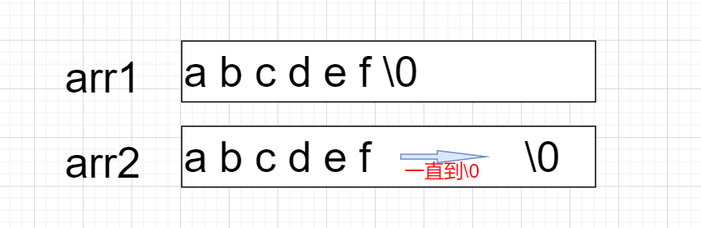

+ 从以上这张图我们应该可以很明显地看出来，为什么第二个**arr2**数组在打印的时候会出现【烫烫烫】这种东西呢，如果你自己去编译器里试试的话应该也是这样
+ 因为第二个数组的内容值给到了`f`，并不是一个完整的字符串，但是第一个数组给到的却是一个完整的字符串，所以自动拥有一个`\0`，第二个数组就没了，所以后面打印出来的只会是一个随机值，**然后直至碰到一个\0为止，遍历才会结束。**
+ 所以我们可以看到这个长度也是受到了影响，arr1数组的长度就是6，但是arr2数组的长度却是加上了一些随机字符后的长度，这就显得不准确了。

### 3. 转义字符
+ 那什么叫做转义字符呢？我们通过代码来看看

```c
int main()
{
    printf("abcndef");
    printf("abc\ndef");
}
```

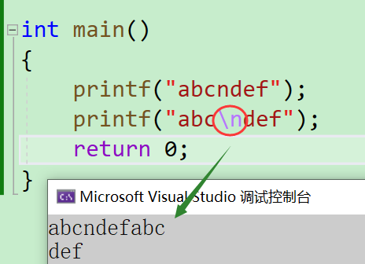


+ 通过运行结果我们可以看到，这个`n`，若是在其前面加上了一个`\`，则它的意思就发生了变化，在转义字符里面就叫做【\n换行】，所以可以看到打印到【abc】就发生了换行，在后一行打印了def。

---

+ 然后我们再来看到一个打印一个test.c的路径。
+ 从运行结果来看，并没有真正地打印出来一个路径，而是出现了很多空格。
+ 细心的小伙伴应该可以发现这个test的第一个字符t和路径的`\`是同一个颜色，都淡化了，在转义字符里，这个叫做【\t水平制表符】，也及时们键盘上的【Tab键】，敲一下就能空出4个空格。

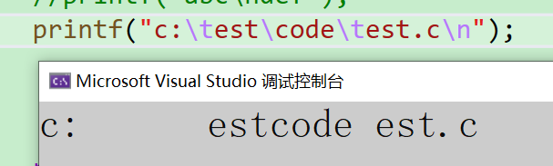

+ 所以我们在printf输出一个东西的时候，不要去写一些转义字符，那C语言中有哪些转义字符呢，我们一起来看一下

> 用一个表格给大家呈现：
>

| **转义字符** | **释义** |
| --- | --- |
| ? | 在书写连续多个问号时使用，防止他们被解析成三字母词 |
| \ ’ | 用于表示字符常量 |
| \“ | 用于表示一个字符串内部的双引号 |
| \ \ | 用于表示一个反斜杠，防止它被解释为一个转义序列符 |
| \a | 警告字符，蜂鸣 |
| \b | 退格符 |
| \f | 进纸符 |
| \n | 换行 |
| \r | 回车 |
| \t | 水平制表符 |
| \v | 垂直制表符 |
| \ddd | ddd表示1~3个八进制的数字。如：\130X |
| \xdd | dd表示2个十六进制数字。 如：\x30 0 |


> 我们挑重点的说一下：
>

+ 我们现来看前三个，若要`printf`的是一个【'】，那么编译器就会报错，你本是想打印一个【'】，这个时候该怎么办呢，你只需要在前面加上一个`\`，这就变成了一个**转义字符**，然后就可以像运行结果一样输出了。
+ 然后第三个也是同理，这里便不做过多详解。

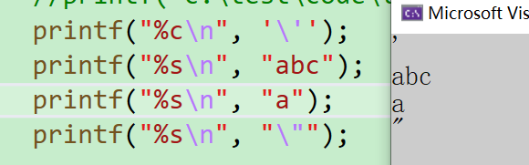

+ 然后就是刚才我们所说的**打印路径**，要怎样才能打印出这个路径呢？没错，只需要再添加一个【\】就可以了，这就表示一个反斜杠，我们到代码里看一下。
+ 可以看到，这个路径已经被完全打印出来了。

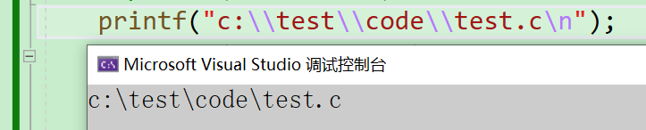


+ 最后，我们再来讲一下最后两个有关**八进制**和**十六进制**的
+ 一样，先给出运行结果：

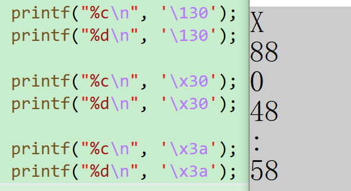


+ 有关【\ddd】，表示的就是八进制，也就是通过八进制去计算，如果用%d打印出来的就是计算的结果，如果使用`%c`打印出来的就是这个数字所对应的**ASCLL码符号。**
+ 对于**十六进制**也是同理，`/xdd`值就是十进制，然后看上面的打印也是同理
+ 对于【\x3a】的话就是用`a*160`
+ 然后我们来说一道有关转义字符的笔试题

```c
printf("%d\n", strlen("c:\test\628\test.c"));
```

+ 这个结果是什么呢？答案不尽相同
+ 而真正的答案是【14】，为什么呢？我们来看一下

**分析**

+ 首先第一步，我们刚学了转义字符，【\t】表示的一定是一个字符，所以18排除
+ 然后第二步，相信大家最疑惑的就是这个`\628`，这其实就是我们上面所说的`\ddd`，八进制是不能包含8，八进制就是`0~7`的数字，满8进一，所以是不会有8，因此这个【\62】算一个转义字符
+ 最后我们就可以得出答案为【14】

## 六、注释
1. 注释可以将你不需要或者还不想删除地代码暂时屏蔽起来，在程序执行的时候会**直接跳过注释的代码**，不会运行。
2. 如果在一些程序中有一些**晦涩难懂的代码**，可能你写出来的代码需要需要一些批注后面在阅读你代码的人才能知道这段代码是什么意思，这个时候你就可以在这段代码的上方或是下方写一些注释，这样后人就可以看懂你写的代码。

```c
int main()
{
    //下面是创建一个整型变量并赋值10
    int a = 10;
    int b = 100;
    //C++ 注释风格 - C99

    /*	C语言的注释风格
    int c = 10;
    int d = 20;
    printf("ff");
    */	// - 嵌套的话此处结束注释
    //不支持嵌套注释

    return 0;
}
```

+ 我们来分析一下，对于双斜杠`//`，这个是`C99`中对于C++的注释风格，那C语言的注释风格是怎样的呢，就是`/**/`
+ 但是后面我还补充了一句话，就是对于C语言的这种注释方法，不可以产生嵌套的，例如说这里若是在外层加上一个`/**/`，这样return 0；不会被注释了，为什么呢？因为上面的`/*`和`return 0;`上面的那个先匹配了，所以就不会到下面的

## 七、选择语句
+ 在C语言或是其他编程语言中，都有着三种结构方式：**【顺序】、【选择】和【循环】。（一定要记住）**
+ 那这个**选择语句**是什么呢？就是你有时候会面临两种或多种选择，**不同的选择对应的就是不同的结果。**

> 具体我们通过代码来看一下：
>

```c
int main()
{
    int input = 0;
    printf("你要好好学习吗(1/0)\n");
    scanf("%d", &input);
    if (input == 1) 
    {
        printf("好好学习！\n");
    }
    else 
    {
        printf("回家吧，好不好\n");
    }
    return 0;
}
```

+ 上面这一段代码，就是一个选择语句，你可以在终端输入你的选择，问你要不要好好学习。若你选择的是`1`好好学习，那么你就可以**好好学习！**；但若是你选择0摆烂，那么就只能**回家吧，好不好**

## 八、循环语句
> 然后我们再来说说另一种形式，也就是**循环语句**
>

+ 什么是循环呢？循环就是你一直不断重复地做一件事，直到某个条件满足时才会退出

> 然后我们通过一段代码再来看一下：
>

```c
int main()
{
    int line = 0;
    printf("好好学习\n");
    while (line < 20000)
    {
        printf("写代码：%d\n", line);
        line++;
    }
    if (line == 20000)
        printf("好offer\n");
    return 0;
}
```

+ 然后对于循环的话，不仅仅是有`while`，还有`do…while()`，`for`这些，我们在后续都会讲到

## 九、函数
> 函数其实就是将一个功能单独**封装**成为一个**模块**，然后这个模块可以被多次调用，以便来实现代码的简化。
>

+ 这是一段两数求和的代码，输入两个数据，然后输出它们的和。
+ 但是设想，若是我们要再求另外两个数的和，那么就要再次输入，然后求和的代码就要再写一遍，这就徒增了代码量，显得整个程序很冗余，那要怎么简化呢？对就是使用函数。

```c
int main()
{
    int num1 = 0;
    int num2 = 0;
    int sum = 0;
    printf("请输入两个操作数字:>");
    scanf("%d %d", &num1, &num2);

    sum = num1 + num2;
    printf("sum = %d\n", sum);
    return 0;
}
```

+ 我们来看一下使用函数简化完之后是什么样子：
+ 这段代码使用了三次求和，得到了三个求和结果：

```c
int Add(int m, int n)
{
    return (m + n);
}
int main()
{
    int sum1 = 0;
    int sum2 = 0;
    int sum3 = 0;

    sum1 = Add(1, 2);
    sum2 = Add(3, 4);
    sum3 = Add(5, 6);

    printf("sum1 = %d\n", sum1);
    printf("sum2 = %d\n", sum2);
    printf("sum3 = %d\n", sum3);
    return 0;
}
```

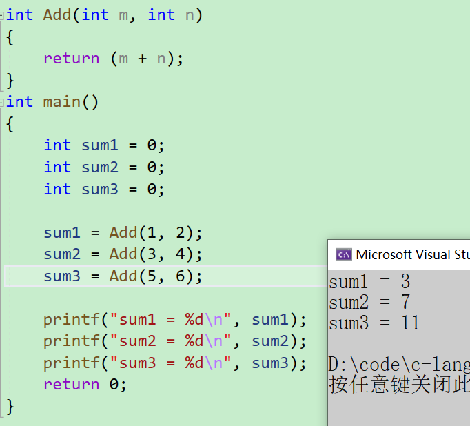

## 十、数组
### 1、数组的定义
+ 首先我们知道**数组**这个概念，但是当我们需要一堆的数字，我们就可以使用数组来进行存储。

```c
int a[10] = { 1,2,3,4,5,6,7,8,9,10 };
```

+ 首先需要先声明这个数组是什么类型的，是整型、字符型还是浮点型等，数组的话这些数据都是可以存储的，然后在一个变量后面加上一个`[]`，括号里可以写上你准备为这个数组开辟多大的空间，比如说上面写的是10，那么这个数组中最多能存下的数据也就只有10个，但是不写的话，就可以存多个，系统会自动计算需要多大的空间。
+ 我们可以使用以下表达式来计算：`sizeof()`是一种单目操作符，是**用来计算你所使用的操作数所占的空间字节大小。**

```c
int sz = sizeof(a)/sizeof(a[0]);
```

+ 数组除了可以存放整数数据外，还可以存放字符型、浮点型的数据。

```c
char b[] = { 'a','b','c'};
double c[] = {2.5,6.9,7.7,1.5 }
```

### 2、数组的下标
+ **C语言规定**：数组的每个元素都有一个下标，下标是从**0**开始的访问。下面就是我们通过`下标`去访问的a数组中下标为8的元素，打印出来的就会是9

```c
//下标访问数组元素
printf("%d\n", a[8]);
```

+ 具体大家看图示就能一目了然了  
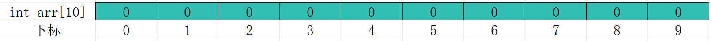
+ 可以看到，这里arr数组的大小是10，那我们去访问18这下标会怎么样呢，去编译器里看看
+ 从图中可以看出，总共下标也就只有9，你访问到了，那就会产生越界访问，那么你访问到的就会是一个随机值。

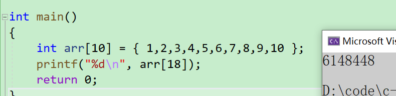

### 3、数组的使用
+ 首先定义了一个大小而10的整型数组，然后将其内容初始化为0，然后我们通过一个在while循环中通过scanf去输入一些数据，将其一 一地通过下标放入数组中。通过循环去遍历这个数组，调用`printf`去打印出里面的数据。
+ 这就是数组的一种使用方法，其余的我们放到后面数组章节细讲

```c
int main()
{
    int arr[10] = { 0 };
    //0 ~ 9 - 输入10个值给数组
    int i = 0;
    while (i < 10) 
    {
        scanf("%d", &arr[i]);
        i++;
    }

    i = 0;
    while (i < 10) 
    {
        printf("%d ", arr[i]);
        i++;
    }
    return 0;
}
```

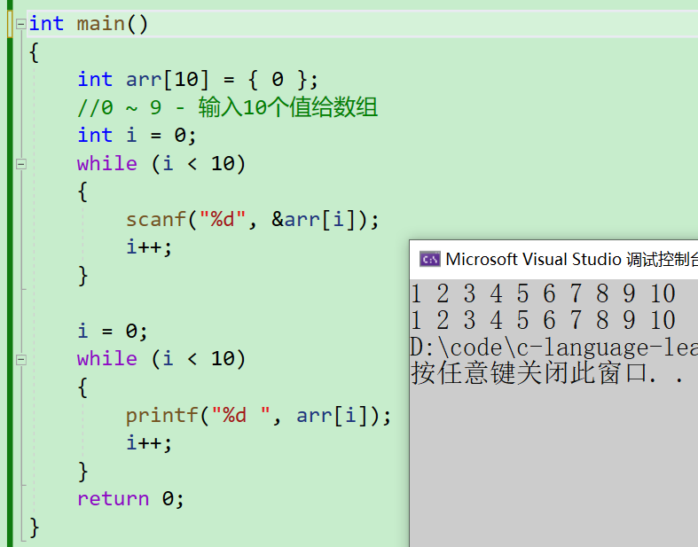

## 十一、操作符
> C语言中操作符不少，这里我们做简要介绍，后续会详细讲解
>

### 1、算数运算符
+ 算术操作符：

>  +  -   *  /  %
>

+ 这里我们重点来讲讲【除】和【取余】
+ 首先来看这段代码，结果会是多少？

```c
int a = 7 / 2;
printf("%d\n", a);
```

+ 运行结果是3，因为**运算符的左右两边都是整数**，所以执行的是整数除法，包括下面这段也是一样，运行结果都是3，只是因为float浮点数的原因，小数点后多出6个0。

```c
float f = 7 / 2;
printf("%f\n", f);
```

+ 那怎么将其变为浮点数除法，也就是得到`3.5`这个答案，你只需要将7或2任意一个数字改为浮点数即可，例如说7.0/2.0,**至少有一个操作数是浮点数执行的才是浮点数除法**

我们来看看结果：

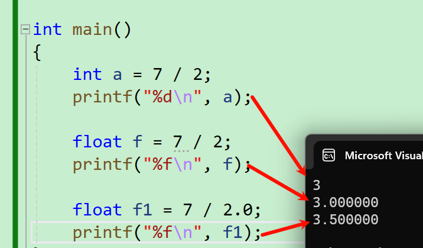


+ 然后我们再来看看【取余】操作符（注意：**这个操作符两边必须是整数**！！！）

```c
int main()
{
    // % 取余操作符，关注的是除法后的余数
    int a = 7 % 2;	//商3余1
    printf("%d\n", a);
    return 0;
}
```

+ 取到就是一个整数对另一个整数做除法后的余数

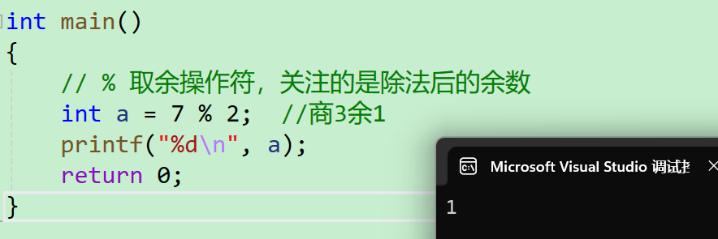

---

### 2、移位操作符
+ 位移操作符

> >> << 
>

+ 这一块大家先了解一下，会在操作符章节细讲。

> 左移就是扩大（左移一位是乘2）  
右移就是缩小（右移一位是除2）
>

---

### 3、位操作符
> &  ^  | 
>

+ 这里也会在后面章节详解。

---

### 4、赋值操作符
>  =   +=  -=  *=  /=  &=  ^=   |=   >>=   <<=    
>

+ 第一个运算符很熟悉，就是赋值运算符，其他的在后面章节慢慢介绍。

---

### 5、单目操作符
重点来说一下单目运算法

| ！ | 逻辑反操作 |
| --- | --- |
| - | 负值 |
| + | 正值 |
| & | 取地址 |
| sizeof | sizeof操作数的类型长度 (以字节为单位) |
| ~ | 对一个数的二进制按位取反 |
| -- | 前置、后置-- |
| ++ | 前置、后置++ |
| * | 间接访问操作符(解引用操作符) |
| （类型） | (类型)强制类型转换 |


+ 首先是这个取反操作，在C语言中呢，表示真假只有两种，用`0`表示假，用`非0`表示真
+ 所以看下面的代码，这个a就是【真】，所以会执行“haha”语句，但若是你把a换成0，那么`!a`就是【真】，就会打印“hehe”语句

```c
//C语言是如何表示真假的呢？
//0表示假，非0表示真
//-1 表示的就是真
int main()
{
    //把假变成真，把真变成假
    int a = 10;
    if (a)
        printf("haha\n");
    if(!a)	//这个不执行
        printf("hehe\n");
    return 0;
}
```

+ 然后【取正】【取负】很简单，看到下面代码，会打印a的相反数

```c
int a = -10;
printf("%d\n", +a);
printf("%d\n", -a);
```

+ 然后对于**取地址**和**星号**运算符，我们在下面指针的部分介绍
+ 然后来看看`sizeof()`这个运算符，`sizeof()`是一个**函数**吗？不是的，`sizeof`是一个操作符！！！因为函数是要加括号的，而操作符不需要，但是这个`sizeof`既可以加括号也可以不加，所以是操作符！

```c
int a = 10;
char c = 'w';
int arr[10] = { 0 };	
printf("%d\n", sizeof(a));		//4
printf("%d\n", sizeof(c));		//1
printf("%d\n", sizeof(arr));	//40
```

+ 对于`sizeof()`这个运算符呢，它是用来**计算所占内存空间的大小**，单位是字节，所以上面代码的输出分别为整型、字符型和一个数组所占内存空间的大小。
+ 因为这些变量都是用int、char这些变量类型定义出来的，所以**可以直接用sizeof()传入这些变量的类型**，出来的结果也是一样的。

```c
printf("%d\n", sizeof(a));			//4
printf("%d\n", sizeof(int));		//4
printf("%d\n", sizeof(c));			//1
printf("%d\n", sizeof(char));		//1
```

+ 既然这是一个操作符，就可以不加这个括号，但是容易引起歧义。

```c
printf("%d\n", sizeof int);
```

+ 然后我们就可以得出结论：**变量可去括号，类型不可取去括号**


> 上面我们有提到过，当我们没有对一个数组设定初始化元素个数时，可以使用`sizeof()`去计算这个数组中有多少元素
>

+ 就是下面这样，sizeof(arr)就是整个数组的大小，sizeof(arr[0])便是一个元素的大小，当然你也可以写成【sizeof(int)】，**因为整型数组中一个元素的大小一定是4个字节，也就是int所占的字节大小**

```c
printf("%d\n", sizeof(arr));;
int sz = sizeof(arr) / sizeof(arr[0]);
printf("%d\n", sz);
```

---

> 然后我们来说一下 【前置、后置–】与【 前置、后置++】
>

+ 这两个其实是一样的，我们先来看一下【 前置、后置++】
+ 对于前置++的话就是先++在赋值，所以下面的a会把++完之后的值给到b，然后自己也会++，因此最后输出的便是`11 11`。

```c
int a = 10;
int b = ++a;	//先++后赋值
// a = a + 1
// b = a
printf("%d %d\n", a, b);	//11 11
```

+ 对于后置++就不一样了，刚好相反，就是c会先把自己的值给到d，然后自己再++，所以d得到的就是10，c后面++完后之后就是11。

```c
int c = 10;
int d = c++;	//先赋值后++
// d = c;
// c = c + 1

printf("%d %d\n", c, d);	//11 10
```

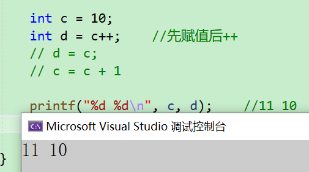

+ 然后我们来说【前置、后置–】，同理

```c
int a = 10;
int b = --a;	///先--在赋值

printf("%d %d\n", a, b);	//9 9

int c = 10;
int d = c--;	///先赋值后--

printf("%d %d\n", c, d);	//9 10
```

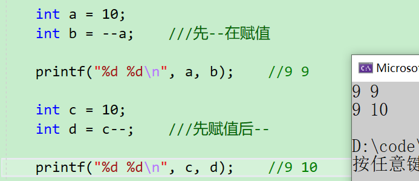


+ 然后这一段也是一样，首先打印a--的一定是之前的值，然后打印的就是–之后的值，也就是9

```c
int a = 10;
printf("%d\n", a--);	//先使用，后--
printf("%d\n", a);
```

> 对于前置、后置，老是喜欢出一些题，把你搞晕，其实根本没什么意义，我们来看看。
>

```c
int a = 1;
int b = (++a) + (++a) + (++a);
printf("%d\n", b);
```

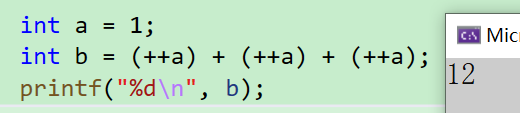


+ 从VS来看，这段代码的运行结果是`12`，但是在Linux的gcc编译器中，运行结果竟然是`10`
+ 一段代码在不同编译器运行结果不同，说明这段代码其实有问题的，准确的说是存在歧义的

---

+ 我们来讲单目操作符的最后一个> **强制类型转换**
+ 首先来看这两句代码，这会输出什么?

```c
int a = 3.14;
printf("%d\n", a);
```

+ 因为`3.14`给到了一个整型变量a,所以只会保留整数，这个时候大家看下面我用红笔画起来的一段Warning，说这个【从“double”转换到“int”】，可能会丢失数据。
+ 这个时候应该怎么办呢？你可以在3.14前面加上一个(int)，将这个数强制转换成整型，也就是我上面注释掉的一行代码，这个时候你再去运行试试，就不会报出Warning了  
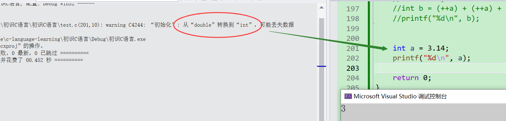

---

### 6、关系操作符
>  >   >=  <  <=  !=  == 
>

+ 对于前面的四个，直接用就可以了，和直观地进行一个比较。我们来讲一下后面的两个。
+ 也就是比较两个数是否相等与不等，这个要与【赋值运算符】中的【=】做区别，一个是比较两个数或是变量的，另一个则是进行赋值运算的，不混淆了。

```c
int a = 10;
int b = 20;

if (a == b)
    printf("haha\n");
if(a != b)
    printf("hehe\n");
```

+ 除了这个数字的比较，可以比较字符串吗?

```c
char arr1[] = "abcdef";
char arr2[] = "abcdef";
if (arr1 == arr2)
    printf("==\n");
else
    printf("!=\n");
```

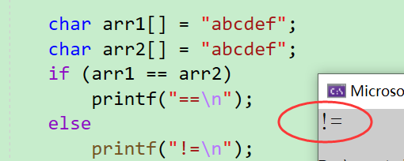

+ 可以看到，两个字符数组明明是一样的，但是却走了第二个分支，打印了【!=】，这里其实就出问题了。为什么呢？这个我们后面会说到，数组名是整个数组的首元素地址，其实【==】比较的是它们的地址。
+ 对于字符串的比较，在C语言中有专门的函数，叫做`strcmp()`，它和`strlen()`一样都是属于【string.h】头文件里的，若比较的两者相等的话，则会返回0，前者大于后者，返回`>0`的数，后者大于前置，返回`<0`的数，所以只需要去判断一下去和0的大小即可。

```c
//两个字符串不可以用“==”来判断是否相等，使用strcmp（库函数）
char arr1[] = "abcdef";
char arr2[] = "abcdef";
if (strcmp(arr1,arr2) == 0)
    printf("==\n");
else
    printf("!=\n");
```

> 这样的话结果就正确了：
>

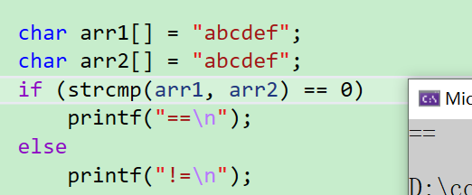

---

### 7、逻辑操作符
>  &&   || 
>

+ 逻辑与【&&】是并且的意思，逻辑或【| |】是或者的意思。为真则为1，为假则为0。
+ **对于逻辑与，只有两个数均为1是才为1，只要有一个为0，结果即为0。**

```c
int a = 5;
int b = 4;
int c = a && b;
printf("c = %d\n", c);
if (a && b)
    printf("hehe\n");
```

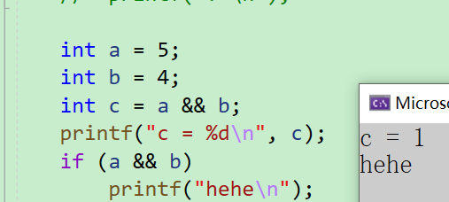

+ 从上述代码和运行结果可以看出，因为a,b都不是0，因此它们的结果为1，才可以进入下面那个 if 判断，若是把a,b其中任意一个改为0，则结果便为0，然后不会进入下面的这个判断。
+ **对于逻辑或的话，只要其中有一个为1，则为1，只有两个数均为0是，才为0**
+ 所以下面的显示结果是0，并且没有进入这个if条件的判断

```c
int a = 0;
int b = 0;
int c = a && b;
printf("c = %d\n", c);
if (a || b)
    printf("hehe\n");
```

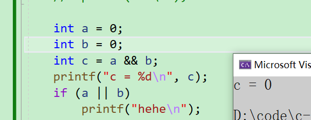

---

### 8、条件操作符
+ 下面是一段简单的if分支判断，然后给b赋值

```c
int a = 10;
int b = 0;
if (a > 5)
    b = 3;
else
    b = -3;
printf("b = %d\n", b);
```

+ 但是对于三目运算符来说，不用这么麻烦，只需要这么一句就好了
+ 具体意思就是，判断a是否大于5，若是，则将b赋值为3，若不是，则将b赋值为-3

```c
a > 5 ? b = 3 : b = -3;
```

+ 但是其还有更简便的写法，也是一样去判断，最后把得出来的值给到左边的b即可

```c
b = (a > 5 ? 3 : -3);
```

---

### 9、逗号表达式
> 我们先来说一下其运算规则：从左向右依次计算，整个表达式的结果是最后一个表示式的结果
>

+ 列举了一个逗号表达式，大家可以去自己试着计算一下，每过一个表达式参与运算的变量都会改变，最后看打印出的a，b，c的值，也是发生了变化。

```c
int a = 3;
int b = 5;
int c = 0;
int d = (a += 2, b = b - c + a, c = a + b);
        //a = 5	 b = 10			c = 5 + 10 = 15
printf("d = %d\n", d);
printf("%d %d %d\n", a, b, c);
```

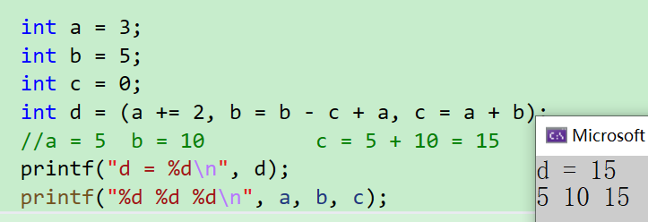

+ 但是要注意这段代码，是先执行的赋值，然后才是执行的后面，因为逗号的优先级是最低的：

```c
d = a += 2, b = b - c + a, c = a + b;
```

---

### 10、其他
**【下标引用操作符】**

+ 什么是下标引用操作符呢？也就是这个`[ ]`，我们在定义数组的时候指定的数组大小

```c
int arr[10] = { 0 };
arr[4] = 5;
printf("%d\n", arr[4]);
```

+ 对于上面这段代码，我们称**arr4 是 [ ]的两个操作符**
+ 我们回忆一下【+】运算符，这是一个双目运算符，比如说2 + 3，那么就可以称**2 3 是 +的两个操作符**，对于我们来说2 + 3可以写成3 + 2，既然双目运算符可以这么交换着来做，那【下标引用操作符】也可以！
+ 上面这段代码，我们还可以写成这样

```c
int arr[10] = { 0 };
4[arr] = 5;
printf("%d\n", 4[arr]);
```

> 接下来的话是这个叫【函数调用】的操作符
>

```c
int Add(int x, int y)
{
    return (x + y);
}
int main()
{
    int c = Add(2, 3);	//()是函数调用操作符，操作数是：Add 2 3
    printf("c = %d\n", c);
    return 0;
}
```

+ 很明确，就是函数外面的两个小括号，这个我们在上面说到`sizeof()`操作符时也提到过，对于sizeof()，虽然其有()，但是不可以把它认为是一个函数，它也会是一个操作符。
+ 然后对于函数调用操作符的话，看到上面的Add函数，()是操作符，那么操作数就是**Add 2 3**

### 11、运算符优先级
可以先看一下运算符优先级的顺序

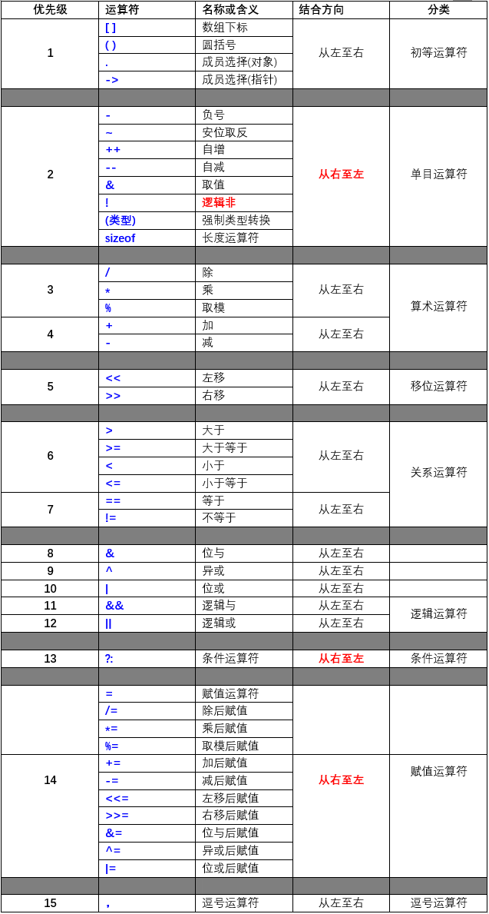

## 十二、常见关键字
### 1、前言
> 了解了C语言中的常见运算符，接下来我们来看看C语言中的关键字
>

+ 首先对于关键字，我们要注意的两点是

1、关键字是直接使用的，我们需要了解  
2、变量名不能是关键字  
3、但是有几个可不是关键字要注意：define include ...

+ 从下面这些可以看出，在C语言中，关键字还是很多的，但是要注意：define 、include、scanf、printf 可不是关键字！

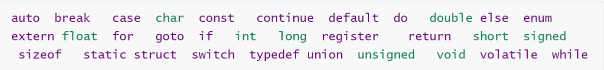

+ 首先单独说一下【auto】，它比较特殊，因为在编译器中，当你定义一个变量的时候默认就是存在的。
+ auto，翻译过来就是自动的，在C语言里指得是自动变量，所有你定义的局部变量都是自动创建、自动销毁的，**所以局部变量都是auto修饰的。**
+ 就像下面这个整型变量a，你在`int`的前面加上或是不加`auto`都是不会报错的， 原因就是所有局部变量都是`auto`。

```c
//auto int a = 10;
int a = 10;	//auto可以省略
```

### 2、有关数据存储的底层原理
+ 有关寄存器这个东西，涉及到了数据存储，我们来详细说一下，让大家先了解一下这个底层原理

首先要知道在计算机中的数据是存放在哪里的

①内存 ②硬盘 ③高速缓存 ④寄存器

然后我们再通过这张图来了解一下：  
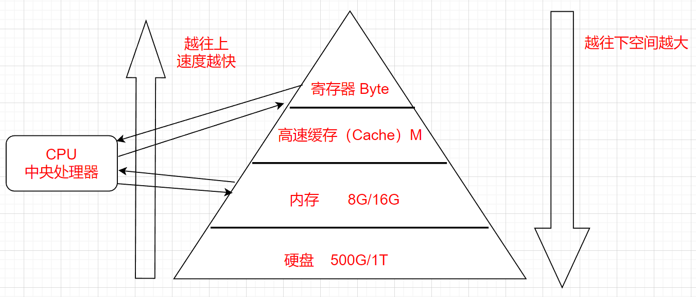


+ 对于计算机中的寄存器，其实它所空间是很小的，单位只有字节，但是它的读写速度非常快，可以直接与CPU【中央处理器】进行交互。
+ 然后越往下这个空间越大，内存的话现在普遍都是8G，16G这样，大一点有32G，不会像很早之前的只有2MB这样；对于硬盘的话，我们去市场上买也是500G，1个T这样的大小。
+ 我们的寄存器，因为它的读取速度很快，因此CPU直接到寄存器里面拿数据，但这个时候寄存器内存不够大了怎么办呢？装不过这么多，**这个时候我们所知道的高速缓存，也就是Cache，会给寄存器提供内存，那高速缓存里又不够了，这个时候就继续让内存给它提供**。这样的话整体地提高了计算机的运行效率
+ 下面就是【register】这个关键字的用法，在定义这个变量b的时候加上了这个关键字，就是【建议】编译器把这个变量放到寄存器中，这里要注意，只是建议，而不是直接放入
+ 具体再如何使用大家可以去查阅一些资料，这里不做过多详解

```c
//建议把b放到寄存器中
register int b = 10;
```

### 3、typedef关键字
+ 首先就是这个【typedef】，这个关键字的话是用来重命名的，用在结构体上会比较多。

```c
typedef struct Linknode{
    int data[MaxSize];
    struct Linknode* next;
}LNode;
```

+ 当然它不止应用在结构体上，对于一些数据类型也是可以重命名的，例如下面这个【unsigned int】，后面你在使用【uint】定义变量的时候就和【unsigned int】一样

```c
typedef unsigned int uint;

int main()
{
    unsigned int num1 = 0;
    uint num2 = 0;	//与num1一样
    return 0;
}
```

### 4、static关键字
> 最后再来说一下这个static关键字
>

+ 这里是来说说C语言中的static关键字，首先你要了解static关键字可以用来修饰什么,它主要是可以用来修饰下面三个
    - 修饰局部变量
    - 修饰全局变量
    - 修饰函数

#### 4.1、static关键字修饰局部变量
> 首先我们来看看static对于局部变量的修饰
>

```c
void test()
{
    int a = 3;
    a++;
    printf("%d ", a);
}
int main()
{
    int i = 0;
    while (i < 10)
    {
        test();
        i++;
    }
    return 0;
}
```

+ 你认为上面这段程序会输出什么。看到主程序，使用while循环来控制i变量，当i = 10的时候边不会进入循环，所以是会循环10次，然后看内部的test()函数，每次循环调用这个函数的时候都会定义一个变量a，然后++之后变为4，然后输出。
+ 所以这段程序的运行结果是会输出10个4

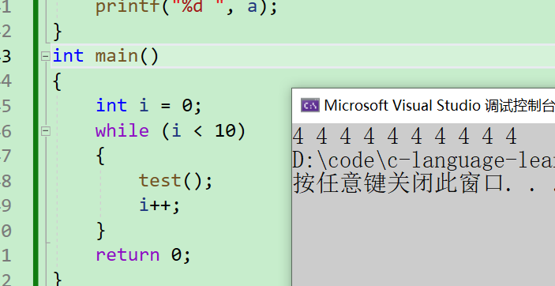

+ 然后我们修改一下这个定义的变量a,将其设置为静态变量，也就是在int前面加上一个static修饰
+ 那这个时候你认为上面那段程序会打印出什么呢？

```c
static int a = 3;
```

+ 首先你要了解静态变量的特性以及其余普通变量之前的区别

①普通的局部变量是放在内存的栈区上的，进入局部范围，变量创建，出了局部范围变量销毁。  
②当static修饰局部变量时，局部变量是在静态区开辟空间的，这时的局部变量，出了作用域变量不销毁，下次进去作用域，使用的是上一次遗留的数据（改变了存储位置，由栈区–>静态区，使得变量的生命周期发生了变化）

+ 打印结果是`4~13`，每一次进入这个`test()`函数时，这个变量a将不再被执行，也就是只会在第一次进入这个函数的时候定义，之后就会一直存在，知道这个程序结束时它才会被销毁，所以这个变量a每次保留的便是上一次++后的结果。

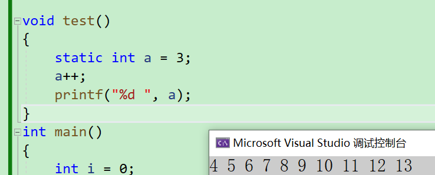

+ 看到了上面的结果，对于静态变量修饰成员相信你也有了一个初步的了解，对于普通的局部变量，是存储在栈区上的。但是对于静态变量，你知道它是存储在什么地方的吗？
+ 没错，就静态区，我们通过下面这张图再来了解一下在计算机内存中变量到底是如何存储的

#### 4.2、static关键字修饰全局变量
**add.c：**

```c
int g_val = 2022;
```

**test.c：**

```c
extern int g_val;	//声明外部符号
int main()
{
    printf("%d\n", g_val);
    return 0;
}
```

+ 以上的这种全局变量声明，以及【extern】关键字调用，是声明一个变量，但是若这个g_val变量被定义成了静态变量，会怎么样呢？我们来看看

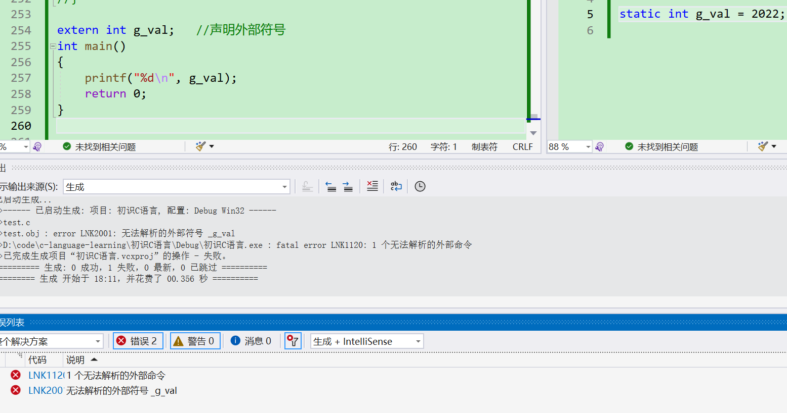

+ 可以看到，这个外部命令无法被解析全局变量是具有外部链接属性的，如果全局变量被static修饰，外部链接属性就变成了**内部链接属性**，其他源文件就没法再通过链接找到这个符号
+ 所以可以得出结论，static修饰后的局部变量只能在自己所在的.c文件内部使用~

#### 4.3、static关键字修饰函数
+ 其实这个理念也是一样的，若你不使用static修饰，那你可以用extern关键字做一个引入，那它就是一个外部链接，但若是你使用static修饰，那么这个函数就只能本源文件使用，不可以给到外部的文件使用，这就是一个内部链接

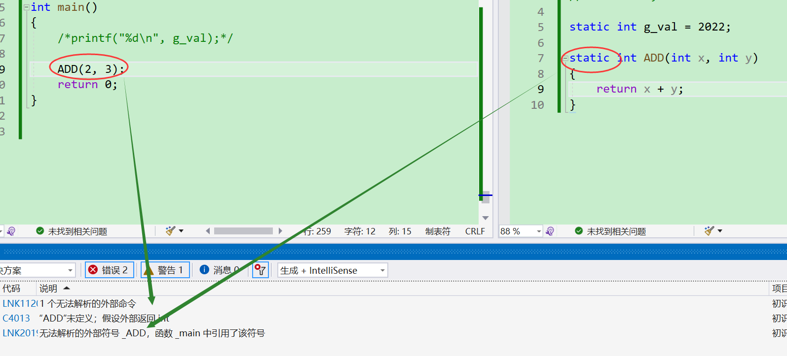

+ 可以看到，也是同理，这是一个内部链接，外部是访问不到的，即使是有这个extern关键字

## 十三、 #define 定义常量和宏
+ 首先来说说这个#define去定义常量

```c
#define MAX 100
int main()
{
    printf("%d\n", MAX);
    int a = MAX;
    int arr[MAX] = { 0 };

    printf("%d\n", a);
    return 0;
}
```

+ 看到如上代码，我使用#define定义了一个MAX常量，并且其值为100，在main函数中，你就可以直接使用这个常量，对它进行打印、赋值。
+ 当然除了定义整型数据常量，其他类型也是可以的，例如字符串也可以

```c
#define STR "abcdef"
printf("%s\n", STR);
```

> 讲完使用#define去定义常量，我们再来说说宏定义，它也是利用#define去声明的
>

+ 下面有一个求和的函数以及宏定义求和的写法

```c
//函数
int Add(int x, int y)
{
    return x + y;
}
//宏
#define ADD(x,y) ((x) + (y))	//为了保持整体性
```

> 除了求和的功能外，其实你还可以定义其他功能，例如说比较两个数的较大值，就可以像下面这么去写，使用一个三目运算符即可
>

```c
#define MAX(x,y) ((x) > (y) ? (x) : (y))
```

## 十四、 指针
### 1、引言
+ 对于指针这一块，很多同学在刚开始学习C语言的时候就听别人说起过，说指针很难很难，访问内存、取地址这些操作，既危险又难搞

### 2、内存的概念和介绍
+ 对于指针这一块的话，是直接和计算机中的内存发生关系的，所以我们先来讲讲内存相关的知识，带大家先行了解一下底层的知识
+ 对于内存，大家在日常生活中应该也有听到过，例如我们为电脑、笔记本买的内存条，以及我们手机的内存，对于这个**内存**来说，一般都是8G或是16个G，与内存相对应的，那就是**硬盘**，一般的话都是500G或是1个T这样
+ 在计算机中，内存是一块连续的存储空间，但是这样就无法分配到每一个部分进行使用，这个时候呢就将内存分成了一块块小的内存单元，那为了能够有效的访问到内存的每个单元，就给内存单元进行了编号，这些编号就被称为**该内存单元的地址**

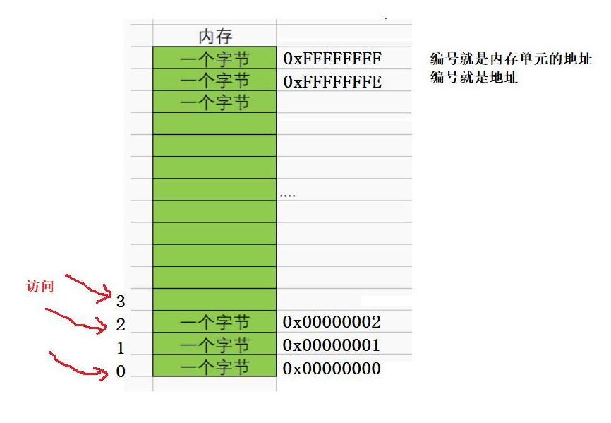


+ 从上面这张图示，就可以很直观地看出内存在计算机中到底是如何存储的，每一个内存单元的大小都是一个字节，然后为它们都进行了编号，这样在外界需要访问时，就可以根据这个内存编号去指定进行一个访问，这个一个个编号其实就被称为是**地址**

> 知晓了地址的基本概念后，我们再来到编译器中去看看这个地址究竟是怎样分部的
>

+ 首先我们来看最简单的一句代码，就是定义一个变量a,我们都知道int整型的变量在内存中是占4个字节的，我们在这句代码上打个断点进入内存窗口一看究竟

```c
int main()
{
    int a = 4;
}
```

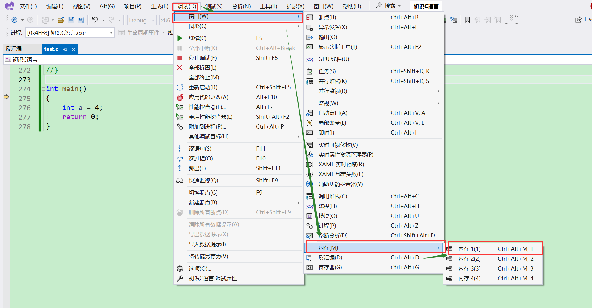

+ 输入这个【&a】，就可以看到内存中为变量a开辟的4个内存单元，首地址就是从【0x00CFF814】开始，整型变量占4个字节，看我框起来的这4个就是，**对于每一个字节它都有自己的一个编号, &a呢就是取到第一个字节的地址**

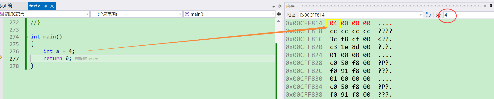

+ 那我们要怎么使用代码去获取这个地址呢

```c
&a		//	拿到的值第一个字节的地址
```

+ 我们通过调试窗口再来看一下。很明显，得到了我们想要的结果

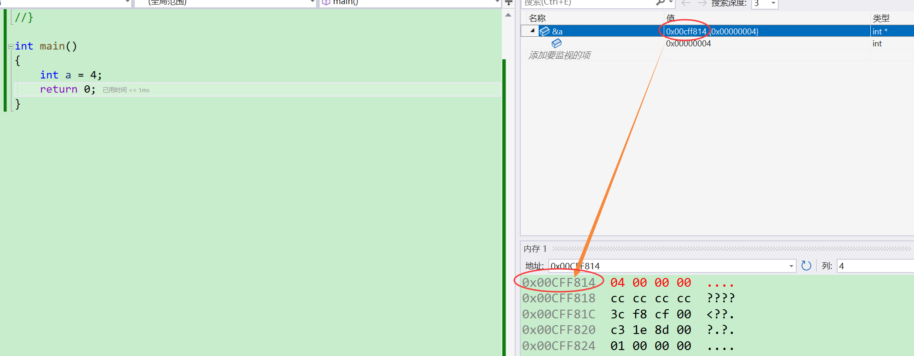

+ 或者你不想到调试窗口中去看的话，也是可以的。
+ 我们直接printf打印出来即可，可以看到，这里使用的是%p，这是专门对于地址访问的，如果你是%d，出来的就是格式化后的数字了

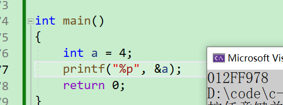

+ 讲完了内存，讲完了地址，接下去才是真正的指针，但其实对于地址来说，它就是指针，指针是地址的一个别名，下面就来看一下指针是如何去定义的

```c
int a = 4;
int* pa = &a;
```

+ 可以看到，在int类型后我加上了一个【*】星号，这就说明这是一个指针类型的变量，这个pa就是【指针变量】，因为上面说过指针是地址的别名，所以这个等式是成立的，pa这个指针变量可以去接收a的地址，也存放了a的地址。


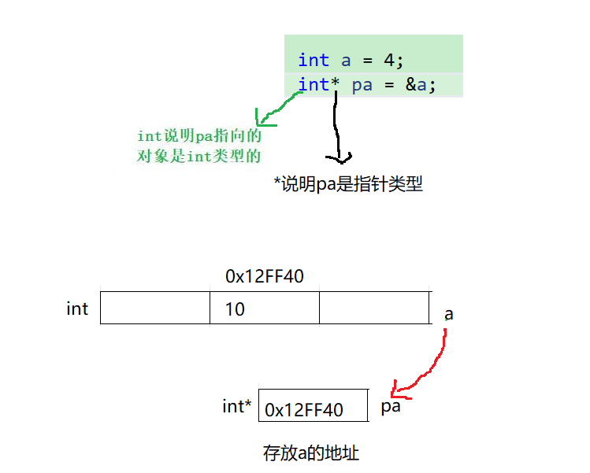

---

+ 既然这个指针变量存放了变量的地址，那么可不可以通过这个指针变量去访问到这个地址并且把它打印出来呢？答案是可以的，这就是涉及到我们的下一个知识点，就是指针的解引用。
+ 利用【*】这个操作符

```c
*pa
```

+ 上面定义了，pa就是一个指针变量，*pa其实就是通过pa中存放的地址，找到这个地址所存放的空间，这个时候取到的其实就是变量a,因为取到了这个地址，这块空间上所存放的起始就是a变量的内容，我们通过运行来看一下

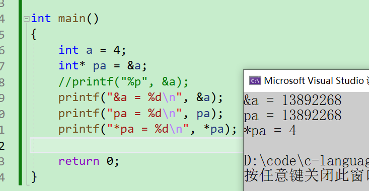

**小结**

  ①指针其实就是地址，地址就是内存单元的编号  
  ②把地址进行存储的时候，就可以放到一个变量中，这个变量就是【指针变量】  
  ③我们说的指针，实际上在专业术语中叫做【指针变量】  
  ④【*】星号解引用可以通过存放变量的地址快速访问到那个变量在内存中所存放的位置，继而获取内容

### 3、指针变量的大小
+ 求一个变量的大小就是用`sizeof()`这个关键字

```c
int a = 10;
printf("%d\n",sizeof(a));
printf("%d\n",sizeof(int));
```

+ 上面这段代码的打印就是4 4，那请问下面这段呢？

```c
int a = 10;
int* pa = &a;
printf("%d\n",sizeof(pa));
printf("%d\n",sizeof(int*));
```

+ 很明显，也是4 4

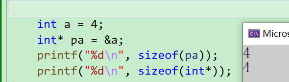

+ 在编译器的偏左上角，有一个x64和x86，这个东西叫做【运行环境】，x64代表你在64位OS的环境下运行代码，x86代表的就是32位,刚才我选择的是32位，现在我把它改成64位
+ 很明显，一样的代码，但是在不同的运行环境下所产生的值却不同，

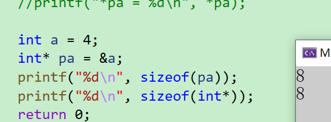

+ 指针变量存放的就是地址，所以指针变量的大小取决于存储一个地址需要多大的空间

> 要看到不是地址，其实是存储的地址线，没错，就是硬件上的地址线
>

+ 我们所用的电脑，其实就是硬件，是硬件的话就需要通电，那在我们的电脑上其实就存在着这么一种【地址线】，我们上面所说的32位与64位，也可以对应到这个地址线中，因为在32位的环境下，是32根地址线；64位环境下就是64根地址线
+ 当我们是32根地址线时，在通电之后就会有一个电信号，这个电信号就是0/1
+ 就是0101这样的存储方式，然后根据二进制的逢二进一去罗列出这32根地址线可以存储下多少地址，这里告诉你，一共是有232个地址可以存储
+ 那这其实就可以得出结论了，32个0或者1组成得的地址序列，**需要32个bit，也就是4个byte去存放**，而这4个字节也就对应着我们指针变量的大小，因此就可以得出为什么指针变量的大小是4个字节了
+ 然后来解释一下为什么在64位环境下这个指针变量就变成了8个字节，这其实你自己也可以去推导，32个0或1组成的地址序列需要32个比特位，**那么这里便需要64个比特位，根据1B = 8bit，所以就需要8个byte去存放**，这也可以得出在64位环境下指针变量的大小是8个字节

> 了解了上面这些，知道了指针变量的大小取决于地址的大小，下面我们来看看这些指针变量的大小是多少，我是在32位环境下运行的
>

```c
printf("%d\n", sizeof(short*));
printf("%d\n", sizeof(long*));
printf("%d\n", sizeof(long long*));
printf("%d\n", sizeof(float*));
printf("%d\n", sizeof(double*));
```

+ 是1 4 8 4 8 吗，如果是这个答案的话请你再回去仔细看一下上面的推导过程
+ 我们来看一下运行结果

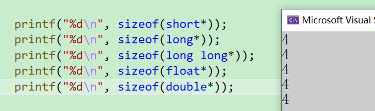

+ 可以看到，均为4，它们都是指针变量，指针变量求它的大小看的是什么，看到就是地址的大小，上面说了，我是在32位环境下运行的，因此就是32根地址线，需要32个bit，也就是4个byte去存放。
+ 可以看到，报了很多Warning，这是为什么呢，明明这个代码就是可以运行的，而且还可以出结果这里报了一个【符号不匹配】的问题，为什么呢？这里明确说一下，sizeof()计算数据字节大小的时候默认返回的类型是unsigned int，也就是无符号整型，但%d是用来打印整型变量的，所以这里才会出现【符号不匹配】的问题

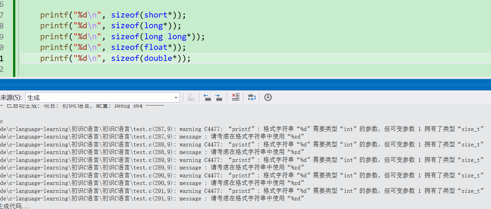

+ 应该将其修改问%zu去打印才对，你只要记住它是专门用来打印sizeof()的返回值的就行了，不行深入了解也没关系。
+ 修改如下，可以看到，已经一个Warning都没有了

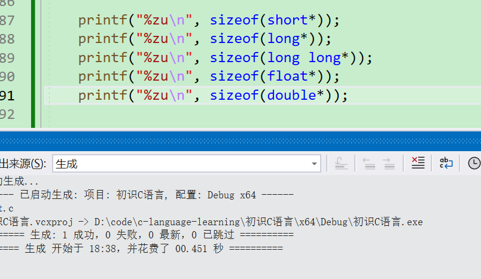

## 十五、结构体
> 对于结构体，也是C语言中比较重要的一个部分，因为C语言是一门面向过程的语言，它不像C++、Java那样面向对象，具有类，可以在类内定义成员变量和成员方法，所以C中就有了结构体这一个东西，可以用来描述复杂对象
>

+ 我们都去书店买过书，知道书它有书名、出版社、作者，这些都可以定义为字符类型，但是还有书的价格，怎么定义呢，难道也定义成字符类型吗，当然不是，依旧是定义成浮点类型，除了这些，其实还有很多种类需要去定义
+ 但是对于这么多的类型，都要分开吗，这肯定不行，这样这本书就不是一个整体了，如果你有面向对象的思维就知道，它的属性和行为都是定义在这一个类中，都是封装好的，这就是类的封装
+ 在C语言中，我们也可以实现**封装**，那就是用**结构体**

> 我们以学生类型来做一个封装
>

+ 可以看到，我们使用到了struct这个关键字，这个就是在关键字那一模块所属要留在这里讲解的关键字，stu就是student的简写。可以看到，里面有着三种类型，分别是**姓名、年龄和成绩**，因为一个学生都具备这三种属性，这是他们共同的属性，所以可以将他们封装在一起

```c
struct stu {
    char name[20];		//姓名
    int age;			//年龄
    float score;		//成绩
};
```

+ 那对于结构体这种复合类型怎么去定义变量进行初始化呢，我们来看看
+ 其实和普通变量也是一样的，你要把【struct stu】看做是一个类型，用这个类型定义出来的变量就叫做【结构体变量】，对于每个结构体变量的初始化，都需要使用一对大括号{}，里面去**一一按照顺序去初始化你在结构体中定义的变量**
+ 这里的float成绩类型后面加上f与double类型作为区分，否则默认就是double

```c
struct stu s1 = { "zhangsan",20,80.5f };
struct stu s2 = { "lisi",25,90.5f };
```

> 那初始化了这些变量后如何将他们打印出来呢，也就访问到每一个同学的信息
>

+ 这里就要使用到【.】点操作符，这个也是我们前面留下的，这个操作符可以去通过结构体声明出来的变量访问当前这个变量所具有的信息，代码如下：

```c
//格式：结构体变量.结构体成员
printf("%s %d %f\n", s1.name, s1.age, s1.score);
printf("%s %d %f\n", s2.name, s2.age, s2.score);
```

