## 一、字符分类函数
+ C语言中有一系列的函数是专门做字符分类的，也就是一个字符是属于什么类型的字符的。
+ 这些函数的使用都需要包含一个头文件是`ctype.h`

| 字符分类函数 | **函数** | **如果他的参数符合下列条件就返回** |
| :---: | :---: | :---: |
| 1 | [iscntrl](https://legacy.cplusplus.com/reference/cctype/iscntrl/?kw=iscntrl) | 任何控制字符 |
| 2 | [isspace](https://legacy.cplusplus.com/reference/cctype/isspace/?kw=isspace) | 空白字符：空格' '，换页'\f'，回车'\r'，制表符'\t'，或者垂直制表符'\v' |
| 3 | [isdigit](https://legacy.cplusplus.com/reference/cctype/isdigit/?kw=isdigit) | 十进制数字0~9 |
| 4 | [isxdigit](https://legacy.cplusplus.com/reference/cctype/isxdigit/?kw=isxdigit) | 十六进制数字，包括所有十进制数字，小写字母a~f,大写字母A~F |
| 5 | [islower](https://legacy.cplusplus.com/reference/cctype/islower/?kw=islower) | 小写字母a~z |
| 6 | [isupper](https://legacy.cplusplus.com/reference/cctype/isupper/?kw=isupper) | 大写字母A~Z |
| 7 | [isalpha](https://legacy.cplusplus.com/reference/cctype/isalpha/?kw=isalpha) | 字母a~z或A~Z |
| 8 | [isalnum](https://legacy.cplusplus.com/reference/cctype/isalnum/?kw=isalnum) | 标点符号，任何不属于数字或者字母的图形字符（可打印） |
| 9 | [isgraph](https://legacy.cplusplus.com/reference/cctype/isgraph/?kw=isgraph) | 任何图形字符 |
| 10 | [isprint](https://legacy.cplusplus.com/reference/cctype/isprint/?kw=isprint) | 任何可打印字符，包括图形字符和空白字符 |


+ 这些函数的使用方法非常类似，我们就讲解一个函数，其他的非常类似：

函数原型：[islower()](https://legacy.cplusplus.com/reference/cctype/islower/?kw=islower)

```c
int islower (int c );
```

+ `islower` 是能够**判断参数部分的c是否是小写字母的**。
+ 通过**返回值**来说明是否是小写字母，如果是**小写字母就返回非0的整数**，如果**不是小写字母，则返回0。**

用代码演示：**写一个代码，讲字符串中的小写字母转大写，其他字符不变。**

```c
#include <stdio.h>
#include <ctype.h>// 要注意需要包含头文件ctype.h
int main() {
    char str[] = "Test String.\n";
    int i = 0;

    while(str[i]){
        if(islower(str[i])){
            str[i] -= 32;
        }
        i++;
    }
    printf("%s\n",str);
    return 0;
}
```

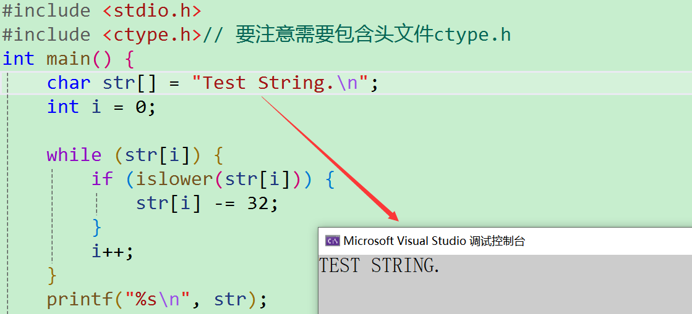

下面演示两个比较常用的`isupper()`判断是否为大写字母，以及`tolower()`将大写字母转为小写

```c
#include <stdio.h>
#include <ctype.h>
int main()
{
    int i = 0;
    char str[] = "Test String.\n";
    char c;
    while (str[i])
    {
        c = str[i];
        if (isupper(c))
            c = tolower(c);
        putchar(c);
        i++;
    }
    return 0;
}
```

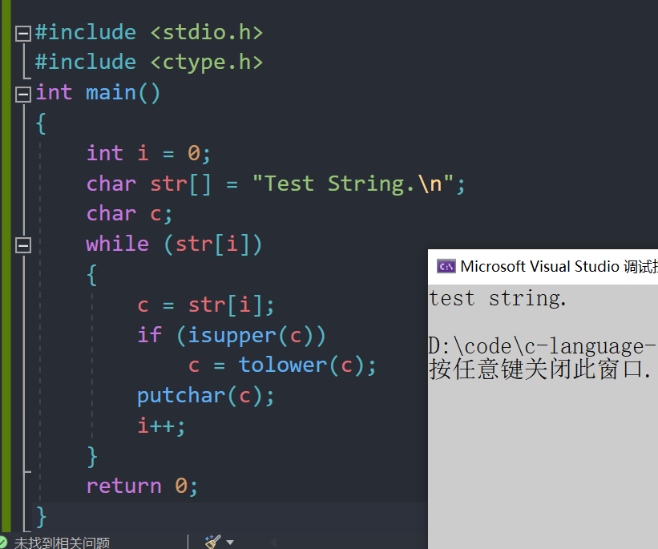

## 二、字符转换函数
+ C语言提供了2个字符转换函数：

```c
int tolower(int c); //将参数传进去的大写字母转小写
int toupper(int c); //将参数传进去的小写字母转大写
```

+ 上面的代码，我们将小写转大写，是-32完成的效果，有了转换函数，就可以直接使用 `toupper` 函数。

返回的是对应转换后的字母

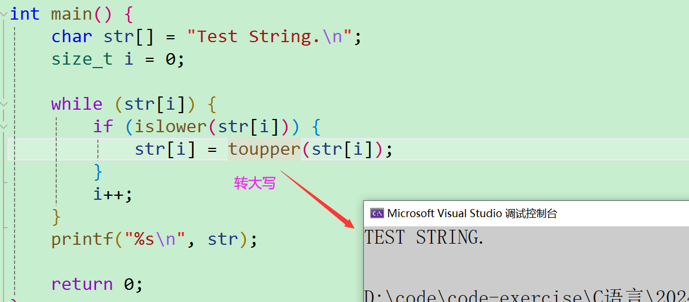

> 要注意都要报包含头文件`ctype.h`
>

+ 补充一个`strlwr`，这个头文件在`string.h`里
+ 函数原型：

`char *strlwr(char *str);`

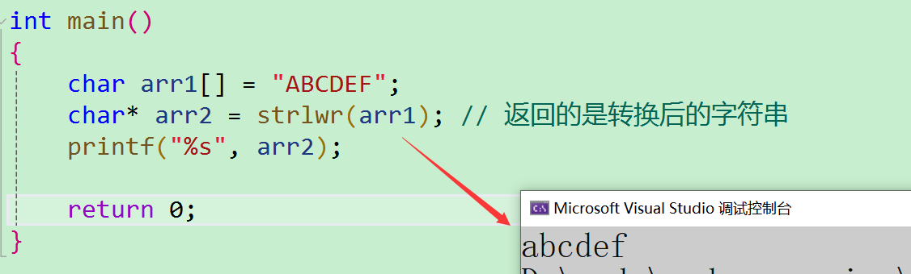

## 三、求字符串长度
### strlen()
函数原型

```c
size_t strlen ( const char * str );
```

[文档链接](https://legacy.cplusplus.com/reference/cstring/strlen/?kw=strlen)

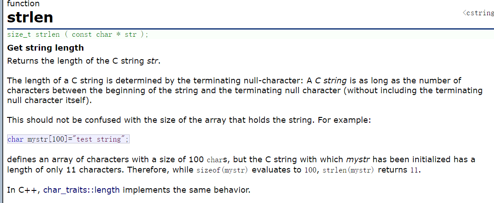

函数使用

```c
#include<stdio.h>
#include<string.h>
int main()
{
    char arr[] = "abcdef";
    int len = strlen(arr);
    printf("len = %d\n", len);
    return 0;
}
```

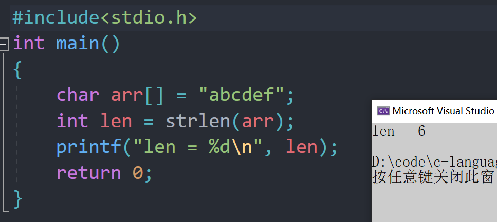通过`debug`（调试）我们可以看到，对于`strlen()`来说，计算的是从字符串开头到字符串末尾的`\0`为止一共有多少字符，那数一下就可以知道有6个。

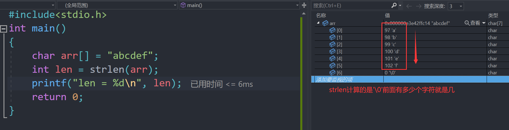

### 注意事项
+ 参数指向的字符串必须要以`\0`结束
+ 如果将`arr`字符数组初始化成单个字符，这样再使用strlen求字符串长度就会不正确，这样初始化就没有`\0`

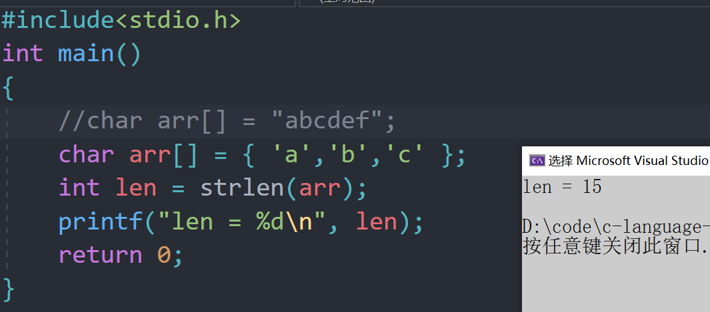

字符数组arr末尾是没有`\0`，编译器为这个数组在内存中随机分配了一块空间，strlen再寻找`\0`，不知道后面什么时候遇到，所以就是**随机值。**

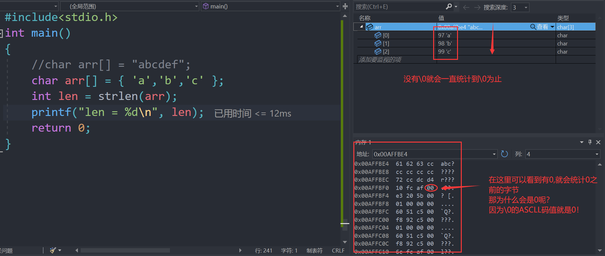

---

> 注意函数的返回值为`size_t`，是无符号的！
>

+ 请问下面这段代码的运行结果是多少？会进入哪个if分支呢？

```c
int main()
{
    if (strlen("abc") - strlen("abcdef") > 0)
    {
        printf(">\n");
    }
    else
    {
        printf("<=\n");
    }
    return 0;
}
```

+ 可以看到，最后的结果出人意料地为输出`>`，因为上面说到了`strlen()`函数计算的是字符串末尾的`\0`之前的字符个数，那么if()条件中即为`3 - 6 = -3 `应该`>0`，那一定会进入第二个分支，打印出来的结果就是`<=`，但为什么最后的结果是`>`呢？

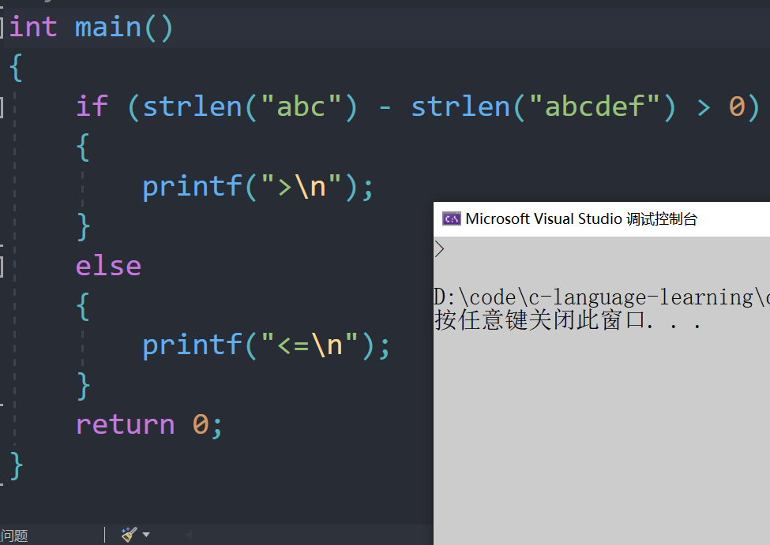

这个时候再看一下函数解读中的[strlen()](https://legacy.cplusplus.com/reference/cstring/strlen/?kw=strlen)函数的返回值，为`size_t`

转到定义后可以看到，就发现它的原型是`unsigned int` —— 无符号整型。在计算机内部对于一个负数来说它会被当成一个无符号整型来进行处理，那它就会是一个非常大的正数，所以最后的结果`>0`就是这么出来的

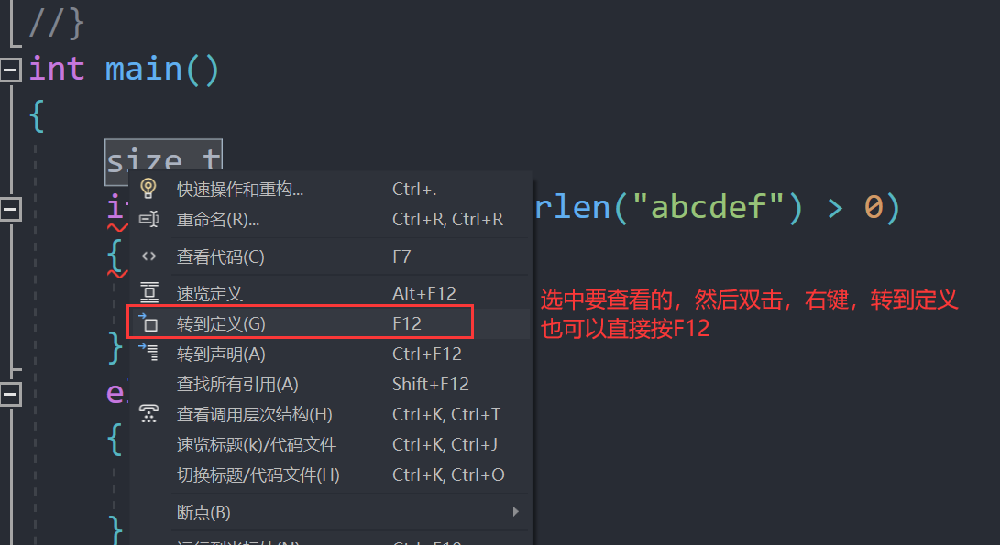  
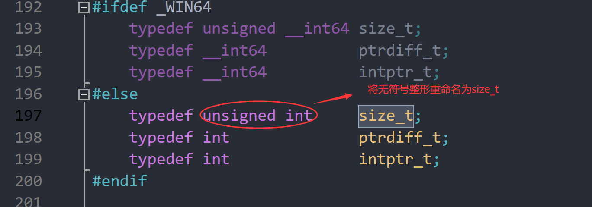

### 模拟实现
> 接下来的话我们就来模拟实现这个strlen()函数，这里我介绍三种方法
>

方法1：计数器

```c
size_t my_strlen1(const char* str)//返回类型是无符号整形所以就是size_t,
{	
    //而我们统计的字符串我们不想让他修改，所以就加上个const
    int count = 0;
    while (*str)
    {
        str++;
        count++;
    }
    return count;
}
```

方法2：递归

```c
/*
* a b c d e f \0
* 1 + b c d e f \0
* 1 + 1 + c d e f \0
* 1 + 1 + 1 + d e f \0
* 1 + 1 + 1 + 1 + e f \0
* 1 + 1 + 1 + 1 + 1 + f \0
* 1 + 1 + 1 + 1 + 1 + 1 + \0
*/
size_t my_strlen2(const char* str)
{
    if (*str == '\0')
        return 0;
    return 1 + my_strlen2(str + 1);
}
```

方法3：指针相减【计算的就是二者之间**相差**的元素个数】

+ 在C语言指针章节，两个指针相减计算的就是它们之间相差的个数，因此我们可以先记录一下首字符的地址，直到指针偏移到末尾的`\0`时，将两个地址一减最后的结果便是字符串的长度

```c
size_t my_strlen3(const char* str)
{
    const char* tmp = str;
    while (*tmp)
    {
        tmp++;
    }
    return tmp - str;
}
```

## 四、长度不受限制的字符串函数
### strcpy()
函数原型

```c
char * strcpy ( char * destination, const char * source );
```

[原文链接](https://legacy.cplusplus.com/reference/cstring/strcpy/?kw=strcpy)

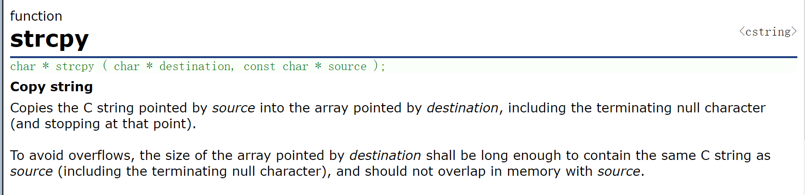

函数使用

将一个字符串拷贝到另一个字符串中

```c
int main()
{
    char arr1[20] = { 0 };
    char arr2[] = "abcdef";
    strcpy(arr1, arr2);
    printf("%s\n", arr1);
    return 0;
}
```

+ 首定义了两个数组，将`arr2`中数组的内容拷贝到`arr1`中

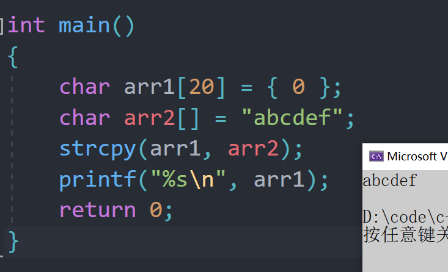

也可以通过调试来看看最后有没有拷贝过去

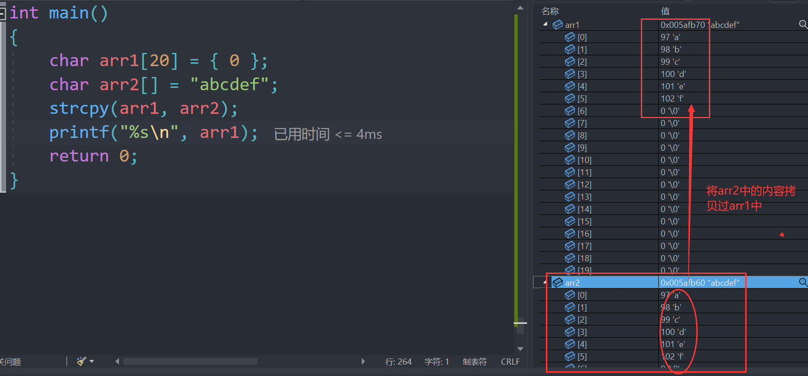

### 注意事
> 源字符串必须以 ‘\0’ 结束，因为源字符串中的 ‘\0’ 会被拷贝到目标空间
>

+ 继续定义两个字符数组进行拷贝的工作测试，为了能够看得更清楚，str1中我使用的都是`*`

```c
int main()
{
    char str1[] = "**************";
    char str2[] = "hello world";
    strcpy(str1, str2);
    printf("%s\n", str1);
    return 0;
}
```

字符串最后面的`\0`，str2里面存放的是个字符串，最后面是带有`\0`的， 通过strcpy()进行拷贝的时候，**会将末尾的**`\0`**也一起拷贝过去**

+ 又因为`%s`打印字符串的时候也是以末尾的`\0`作为结束的标志，因此打印到此处就结束了，不会再打印后面的`***`

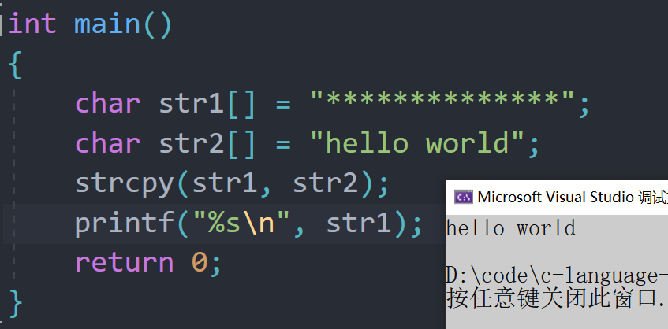

里面只存放几个字符而后面没有`'\0'`，再次拷贝会发生什么？

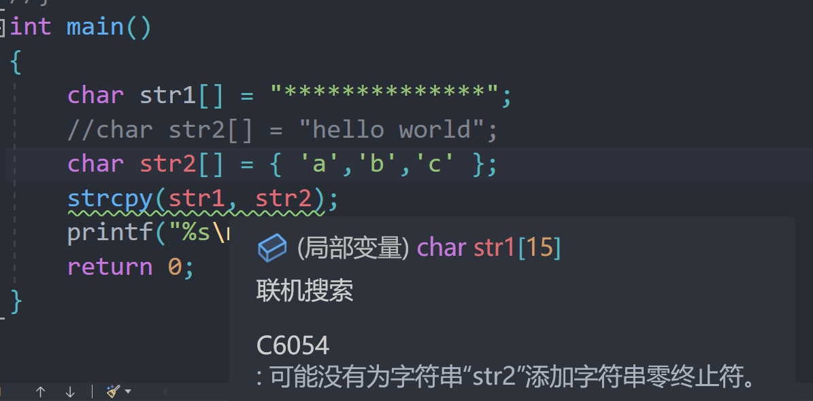

+ 这里就会编译器就会提示错误了，再将代码进行调试后发现程序发生了奔溃，由于原字符串的末尾没有`\0`，所以在拷贝的时候编译器完全不知道什么时候停下来，所以在一直拷贝的过程中就会发生 **【越界访问】** 的问题。

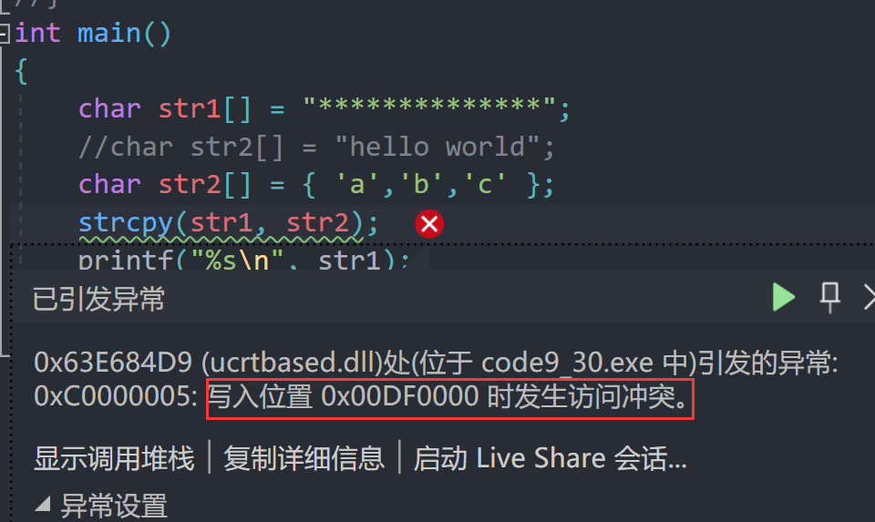

> 所以需要拷贝的原字符串一定要以`\0`结尾，否则会出现问题
>

> 目标空间必须足够大，以确保能存放源字符串
>

+ 不仅是源头有限制，目标字符串也需要有一定的限制，不可以过随意。例如说下面要将字符数组中的`abcdef`拷贝到空间只有3的字符数组str1中去，会发生什么呢？

```c
int main()
{
    char str1[3] = { 0 };
    char str2[] = "abcdef";
    strcpy(str1, str2);
    printf("%s\n", str1);
    return 0;
}
```

+ 可以看到，str2虽然拷贝过去了，但是str1这个原字符数组却被破坏了，原因就在于str1数组的容量太小了，不足以容纳`abcdef`

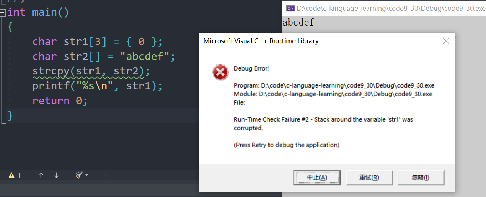

>  所以我们在拷贝字符串的时候也要考虑到目标字符串的空间是否足够容纳原字符串
>

目标空间除了要有足够大的空间之外，还要保证可以变，因为将源字符串拷贝过去的时候，肯定会修改目标空间的内容

+ p存放的就是字符串`abcdef`中`a`的首元素地址，我们知道对于一个字符串来说为一个常量，是不可修改的
+ 在定义指针p最标准的写法还是`const char* p = "abcdef"`，这是一个常量指针，表示指针p所指向的那块空间中的内存是不可修改的，因此将`"bit"`拷贝过去的话便是非法的

```c
int main()
{
    char* p = "abcdef";
    char* str = "bit";
    strcpy(p, str);
    printf("%s\n", p);
    return 0;
}
```

+ 通过调试可以看出，对内存中一块只读的空间进行修改的时候就会发生【访问冲突】的问题

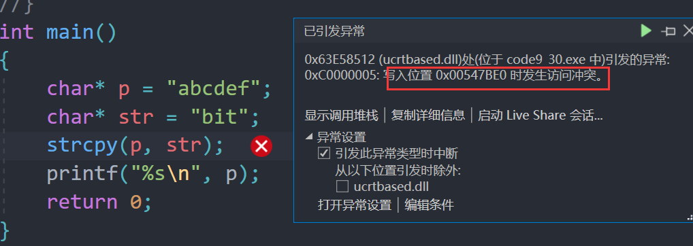

### 模拟实现
+ 定义出一个`my_strcpy()`的函数，设置形参为两个字符指针，用于接收主函数传入进来的两个字符串的起始地址
+ 对于数组的函数名来说就是首元素地址，所以直接传入数组名即可
+ 写代码前我们来看一下字符串拷贝的原理，也就是获取到`src`和`dst`两个指针所指向的字符，然后进行一一拷贝，直到`*src == '\0’` 为止

最后当这个`*src == '\0'`的时候，便结束拷贝，跳出循环。此时我们还有最后一个`'\0'`还没有拷贝过去，继续执行一次`*dst = *src`即可  
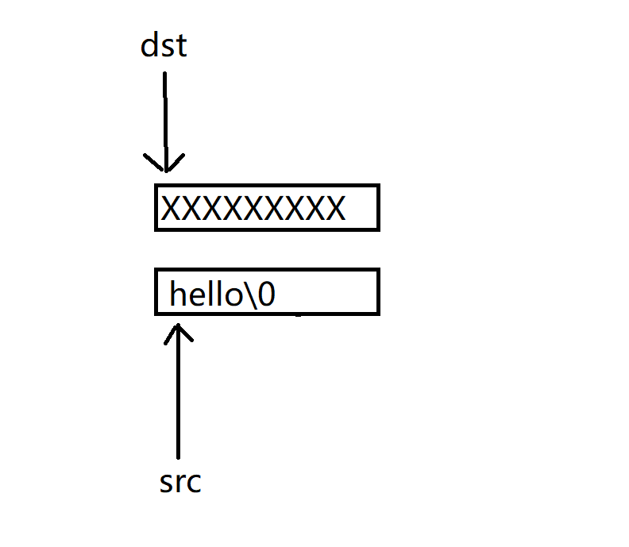


```c
void my_strcpy(char* dest, char* src)
{
    while (*src != '\0')
    {
        *dst = *src;
        src++;
        dest++;
    }
    *dest = *src;
}
```

还可以对此代码进行优化一些，`src`指向的空间不为`\0`就继续拷贝，在拷贝一个字符后两个指针都需要++，这个时候就可以使用后置++，先拷贝，后++，这样就可以完美的完整任务了，对了，在src遇到`\0`了，这个时候两个指针都指向了`\0`，最后的`\0`也不要忘了再拷贝一次

优化后的代码：

```c
while (*src)
{
    *dst++ = *src++;
}
*dst = *src;
```

+ 通过仔细观察库函数strcpy()的描述后就可以发现，其实它在拷贝结束之后也是存在返回值的，返回的就是拷贝完成之后的目标字符串

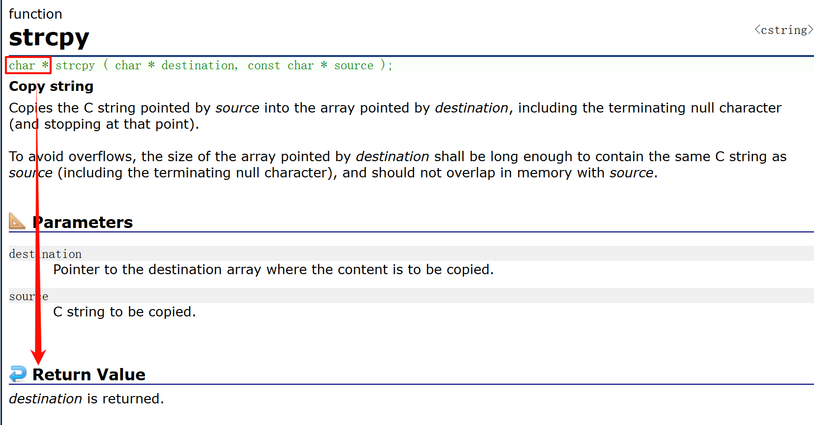

因此可以将拷贝的逻辑也放到循环的条件判断中去，不需要在最后继续拷贝'\0'，随着*dst++ = *src++的不断执行，最后将src中的\0拷贝到了dest中，此时while()循环中的条件就变成了\0，会自动跳出循环，此时【src】和【dst】也已经遍历结束

最后代码的简化就可以成这样一行

```c
while (*dst++ = *src++);
```

### assert()断言
+ 在经过上面的一系列操作后，代码还缺乏安全性，在传入NULL指针后就会引发异常，这个时候就需要用到下面这个函数了

通过运行可以看到，运行的时候报出了`空指针异常`，因为在函数内部现在要执行`*src`，也就是解引用的操作，我们知道对于空指针来说是不能解引用的，因此这里就出现问题了，表示我们的程序考虑地不够严谨

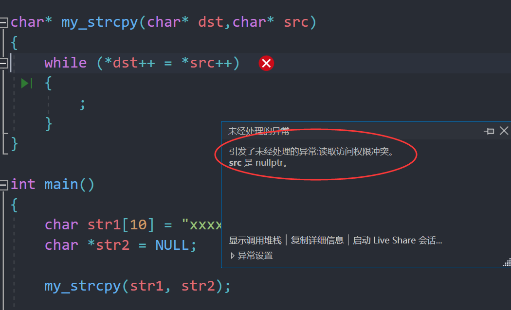

+ 此时就可以使用到一样东西叫做【断言】，可以去看看官方文档[assert](https://legacy.cplusplus.com/reference/cassert/assert/?kw=assert)

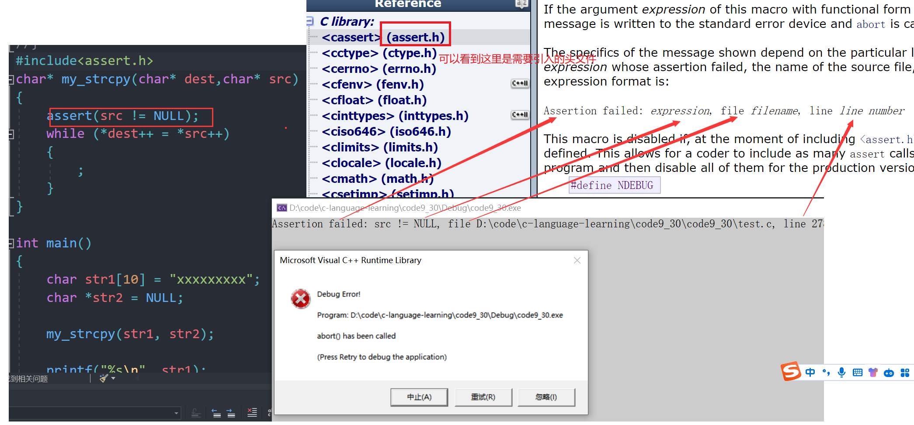

+ 若是加上了这句assert断言，那么编译器在运行的时候就会报出对应的错误信息，括号里面要写上的就是出错的**对立面**，若是当`src != NULL`时，便不会执行这个断言，只有当src传入进来是NULL的时候才会触发这个断言，也就是这个`assert(**为假**)`就会执行
+ 也可以给`dst`加上断言，防止它传入进来也为NULL，`assert(dst)`;  
那么这两个断言的逻辑就可以转换为只有当src和dst均为非空的时候程序才正常执行，只要有一方为空便报出错误，那便将它们做一个合并，就可以想到使用我们在操作符章节【逻辑与】

```c
assert(dest && src);
```

### const修饰常量指针
将目标字符串dst中的内容拷贝到了原字符串src中，此时虽然在拷贝的过程中不会出现什么问题，可是呢在运行的时候就会出现【变量str周围的堆栈已损坏】，也就是【str1】中的这些“xxxxxxxxx”若是拷贝到str2中是存不下的，这就出现问题了

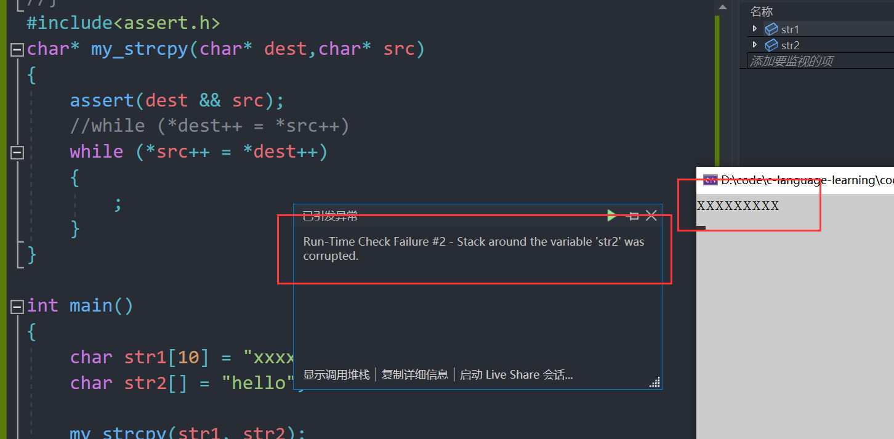

这个的操作其实是在修改源头字符串src，那我们要将原字符串拷贝到目标字符串中，原字符串肯定不能修改，所以这个时候就要使用到`const`了。此时我们可以在char* src的前面加上一个const作为修饰  
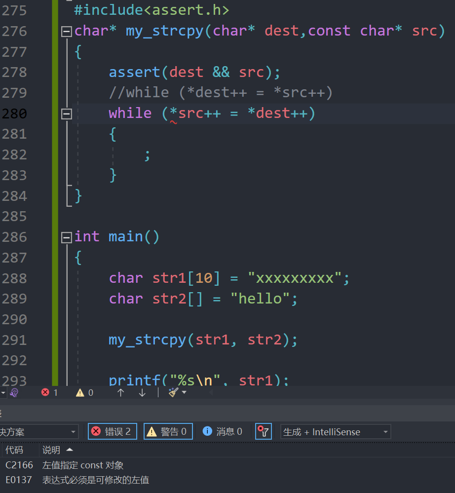

+ 此时对于src来说就叫做【常量指针】，它所指向的内容是不可以修改的，但是**它的指向是**可以修改的

最后还有一个返回值，也就是`char*`，返回的是【dst】拷贝后的内容

```c
char* ret = src;
```

+ 最后将其返回即可

```c
return ret;
```

那么官方要加上这个`char *`的目的是什么呢？从下面的printf语句其实就可以看出是为了实现一个【**链式访问**】

+ 什么是链式访问呢？也就是将一个函数的**返回值**作为另一个函数的参数，设想若是这个函数的返回类型是`void`的话，那么它还能不能放在这里呢

```c
printf("str1 = %s\n", my_strcpy(str1, str2));
```

+ 以下便是整体代码展示

```c
char* my_strcpy(char* dst, const char* src)
{
    assert(dst && src);
    char* ret = src;
    while (*dst++ = *src++)
    {
        ;
    }
    return ret;
}
int main()
{
    char str1[10] = "xxxxxxxxx";
    char str2[] = "hello";

    printf("str1 = %s\n", my_strcpy(str1, str2));
    return 0;
}
```

### strcat()
函数原型

```c
char * strcat ( char * destination, const char * source );
```

[原文链接](https://legacy.cplusplus.com/reference/cstring/strcat/?kw=strcat)

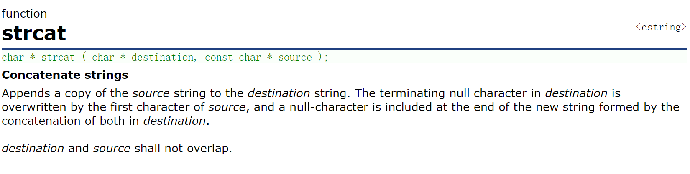

函数使用：

```c
#include<stdio.h>
int main()
{
    char arr1[20] = "hello ";
    char arr2[20] = "word";
    strcat(arr1, arr2);
    printf("%s\n", arr1);
    return 0;
}
```

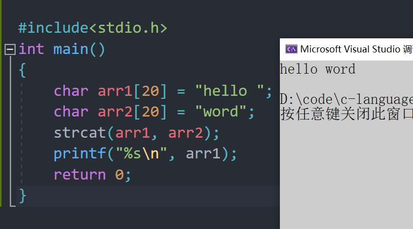

+ 那既然是拼接，是从什么地方开始拼接的呢？这里猜测一波是`\0`
+ 通过调试观察可以发现，`world`就是从arr1的`\0`处开始拼接的，而且也会将自己的`\0`拷贝过去

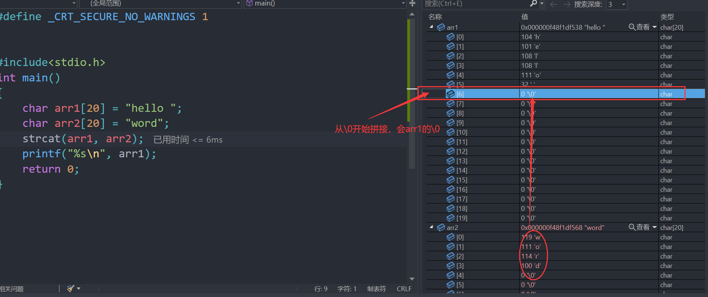  
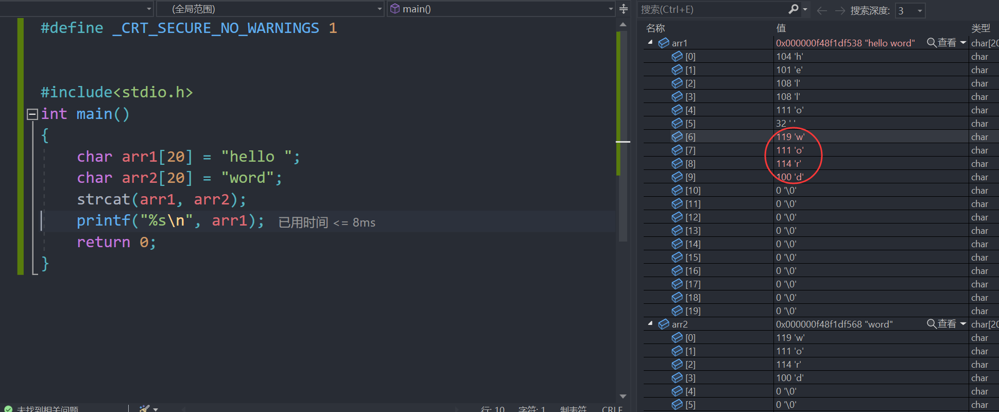

### 注意事项
> 接下去我们来说说有关这个函数的一些注意事项，与`strcpy`类似
>

#### 源字符串必须以 ‘\0’ 结束
+ 可以看到，若是将源字符串初始化为无`\0`的，在拷贝的过程中就会出现问题

```c
#include<stdio.h>
#include<string.h>
int main()
{
    char arr1[] = "hello \0********";
    char arr2[] = { 'a', 'b', 'c' };
    strcat(arr1, arr2);
    printf("%s\n", arr1);
    return 0;
}
```

+ 可以看到，虽然是拼接了，但是因为在字符串的末尾没有`\0`，所以在打印的时候编译器就会一直去寻找`\0`继而导致访问冲突的问题

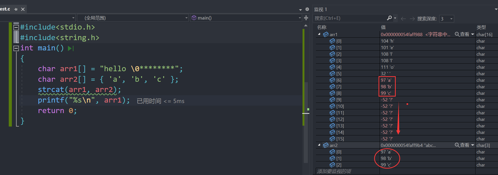

#### 目标空间必须有足够的大，能容纳下源字符串的内容
```c
char arr1[3] = { 0 };
char arr2[] = "abcdef";
printf("%s\n", strcat(arr1, arr2));		
```

+ 也是一样，不仅是源头有要求，目标空间也有一定的要求，如果没有足够大空间的话也放不下想要拼接过来的内容

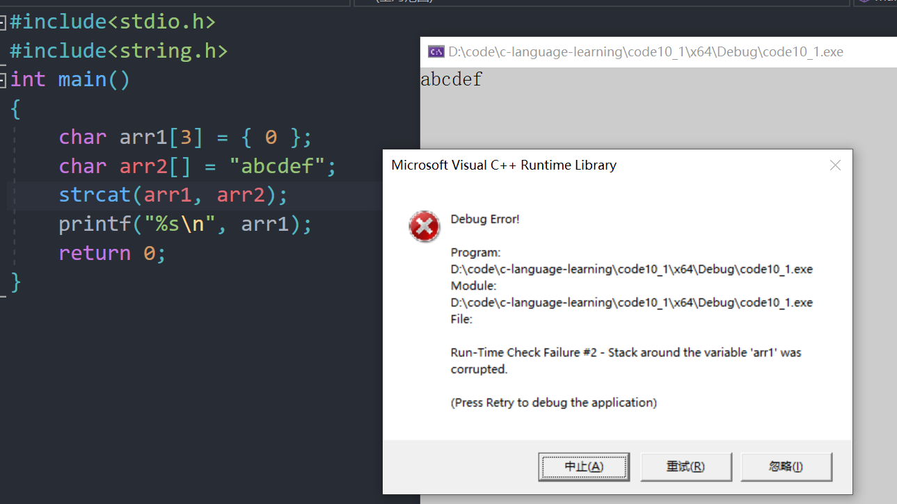

#### 目标空间必须可修改
*p是常量字符串，不可被修改

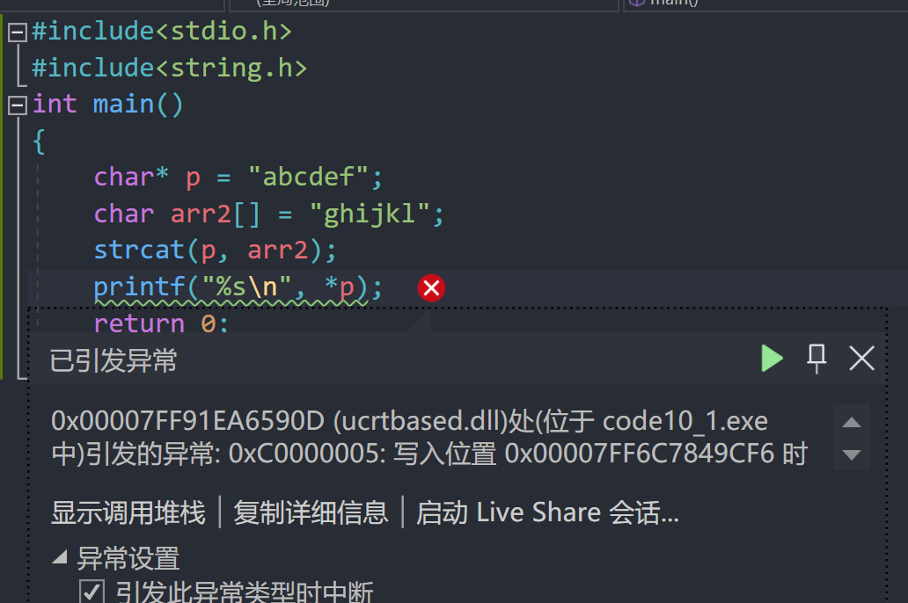

#### 不可以给自己追加
```c
#include<stdio.h>
#include<string.h>
int main()
{
    char arr1[20] = "abcdef";
    strcat(arr1, arr1);
    printf("%s\n", arr1);
    return 0;
}
```

+ 还有一点要说明的是不可以自己给自己做追加，因为源字符串是在目标字符串的`\0`位置开始拼接的，也就是说这个`\0`会被覆盖掉，那么在想要追加自己原本的`\0`时，却找不到了，即自己在给自己追加的时候会把自己的内容破坏，使得自己在停下来的时候没有`\0`了

### 模拟实现
+ 因为其进行拼接的时候是从`\0`的位置开始的，因此我们在模拟实现的时候就要先去找到目标字符串中的`\0`才行，保存一下`dest`就可以出发了，一直寻找直到找到`\0`为止停下来
+ 接下去的逻辑就和`strcpy()`一样了，把源字符串拷贝到目标字符串的`\0`处

```c
#include<stdio.h>
#include<string.h>
#include<assert.h>
char* my_strcat(char* dest, const char* src)
{
    assert(dest && src);
    char* ret = dest;//保存一下目标字符串的起始地址
    //1.寻找目标字符串中的\0
    while (*dest != '\0')
    {
        dest++;
    }
    //2.从目标字符串的\0开始拷贝源字符串
    while (*dest++ = *src++);
    return ret;
}

int main()
{
    char arr1[20] = "abcdef";
    char arr2[] = "ghi";
    my_strcat(arr1, arr2);
    printf("%s\n", arr1);
    return 0;
}
```

### strcmp()
函数原型

```c
int strcmp ( const char * str1, const char * str2 );
```

[原文链接](https://legacy.cplusplus.com/reference/cstring/strcmp/?kw=strcmp)  
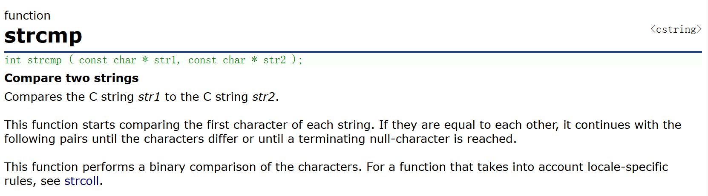

函数使用

```c
int main()
{
    char arr1[] = "zhangsan";
    char arr2[] = "zhangsan";

    int ret = strcmp(arr1, arr2);
    if (ret == 1)
        printf(">\n");
    else if (ret == -1)
        printf("<\n");
    else
        printf("==\n");
    return 0;
}
```

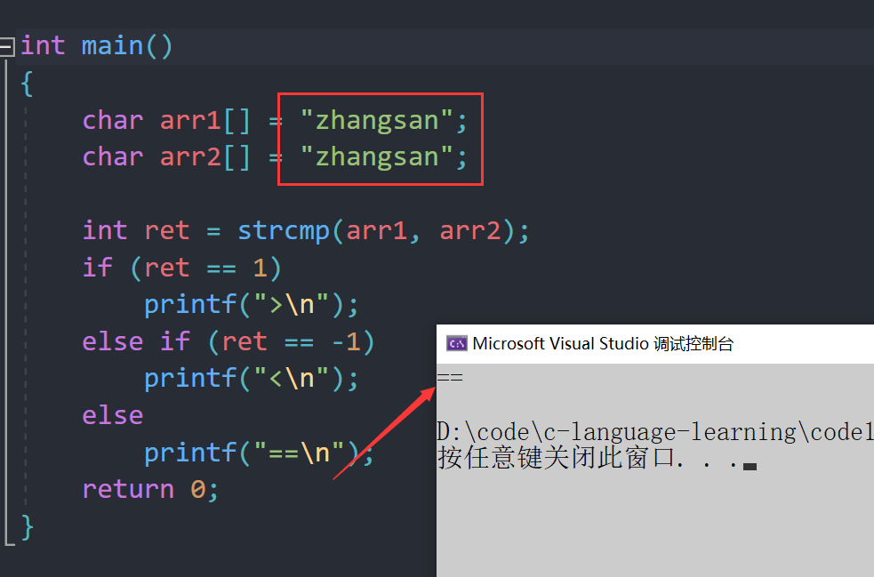

下面是`strcmp()`函数的比较规则：

+ ptr1所指向小于ptr2，返回 < 0的数【VS下是-1】
+ ptr1所指向等于ptr2，返回 0
+ ptr1所指向大于ptr2，返回 > 0的数【VS下是1】

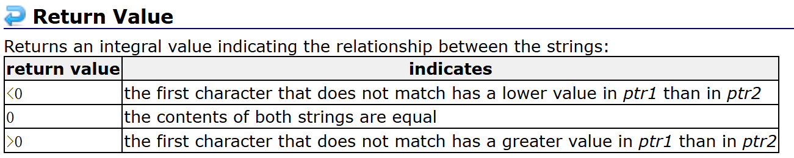

### 模拟实现
+ 可以看到，主体就是在比较`*str1`和`*str2`，若是它们相同的话就一直++，若是不相同的话便跳出循环继续比较谁大谁小，那么判断二者完全相同的逻辑就只能写在循环内部了，判断`*str == '\0'`就可以看出它是不是走到了字符串的末尾，而且还没有跳出循环，此时就可以`return 0;`

```c
int my_strcmp(const char* str1, const char* str2)
{
    assert(str1 && str2);
    while (*str1 == *str2)
    {
        if (*str1 == '\0')//二者相同且为'\0'，return 0
        {
            return 0;
        }
        str1++;
        str2++;		//否则向后继续查找
    }
    if (*str1 < *str2)
        return -1;
    else
        return 1;
}
```

+ 那既然`*str1`和`*str2`我们都知道是两个字符了，直接相减判断其`ASCLL码`即可

```c
int my_strcmp(const char* str1, const char* str2)
{
    assert(str1 && str2);
    while (*str1 == *str2)
    {
        if (*str1 == '\0')//二者相同且为'\0'，return 0
        {
            return 0;
        }
        str1++;
        str2++;		//否则向后继续查找
    }
    return *str1 - *str2;//指针相减等于个数
}
```

## 五、长度受限制的字符串函数
### strncpy()
+ 函数原型

```c
char * strncpy ( char * destination, const char * source, size_t num );
```

[原文链接](https://legacy.cplusplus.com/reference/cstring/strncpy/?kw=strncpy)

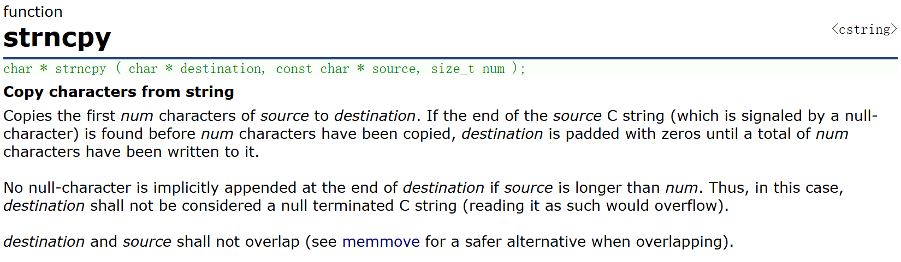

```c
int main()
{
    char arr1[10] = { 0 };
    char arr2[] = "hello world";
    strncpy(arr1, arr2, 5);
    printf("%s\n", arr1);
    return 0;
}
```

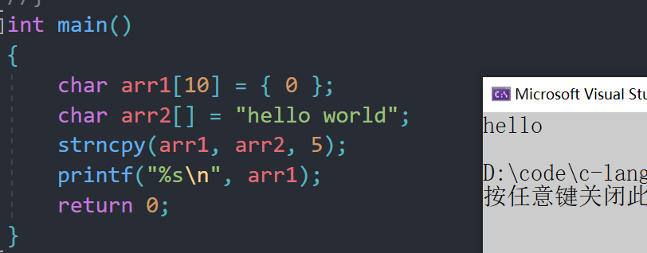

+ 通过调试查看也可以看到拷贝过去了

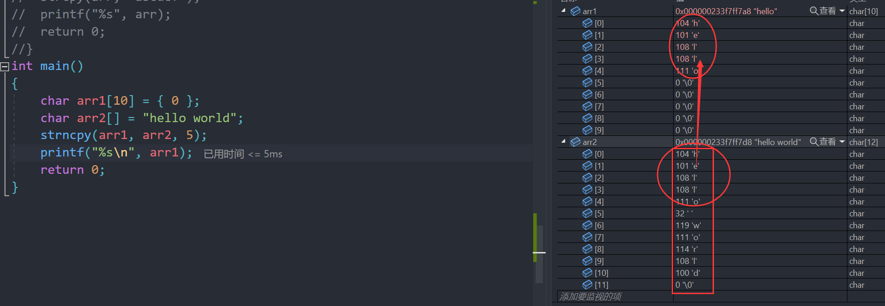

---

+ 有些时候会出现像下面这样的场景，即源字符串中只有3个字符，但是拷贝过去却要拷5个的情况，由运行结果我们可以看到，确实是拷贝过去了，也没有出现任何的问题

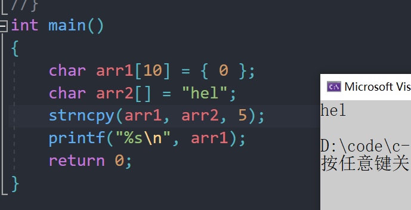

+ 通过调试也可以看出，确实原封不动地拷贝过去了，但是这样看不出最后的`\0`到底有没有过去，我们将目标字符串做一个修改

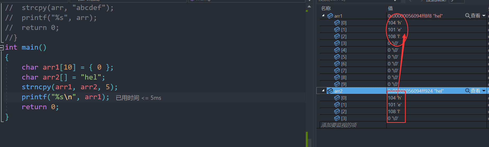

+ 通过对目标字符串做一个修改，然后再去进行一个拷贝就可以发现，在在首先拷贝了原先的【h】【e】【l】【\0】后，又在后面补上了一个`\0`，这样就凑足了5个

### 模拟实现
+ 思路很简单，首先第一块逻辑就是将原字符串中num个字符拷贝过去，拷一个`num--`，直到num个字符拷贝完为止。
+ 接着第二块逻辑，就是去判断一下num是否 > 0，若是的话那就表示`num > 原字符串的长度`，此时就需要再做【补充\0的工作】，不过while循环中的条件要写`--num`，否则的话就会多进入一次，那后面就会多出一个`\0`。

```c
char* my_strncpy(char* dest, const char* src, size_t num)
{
    assert(dest && src);
    char* start = dest;
    while (num && (*dest++ = *src++))
    {
        num--;
    }

    //若是跳出循环后num > 0，表示num > 原字符串的长度
    if (num)
    {
        while (--num)
        {
            *dest++ = '\0';		//再补充num个'\0'
        }
    }
    return start;
}
```

### strncat()
函数原型

```c
char * strncat ( char * destination, const char * source, size_t num );
```

[原文链接](https://legacy.cplusplus.com/reference/cstring/strncat/?kw=strncat)

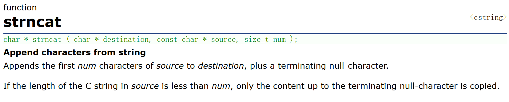

```c
int main()
{
    char arr1[20] = "hello ";
    char arr2[] = "word !";
    strncat(arr1, arr2, 5);
    printf("%s\n", arr1);
    return 0;
}
```

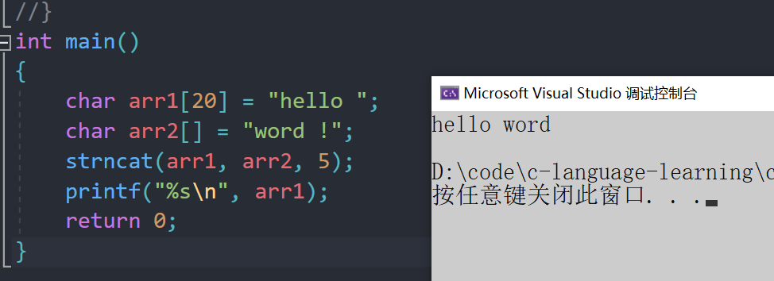

+ 一样，我们通过调试来看看

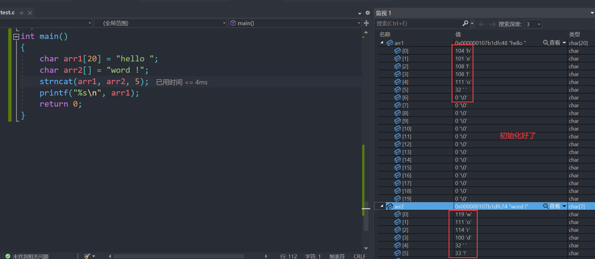  
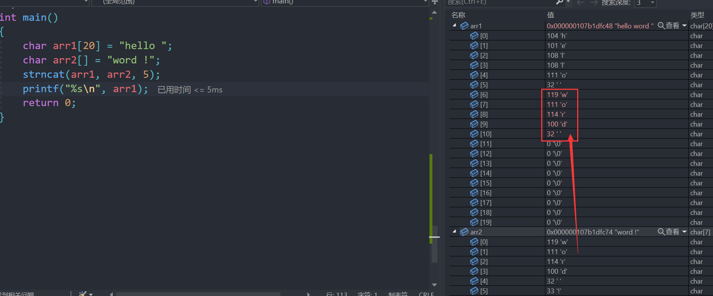

### 模拟实现
+ 前面的思路还是和`strcat()`一样，让`dest`先移动到`\0`的位置，然后第二块逻辑，就是从从`\0`的位置开始拷贝src中的num个字符
+ 内部是一个拷贝逻辑，这个**拷贝的逻辑和判断是否到达**`\0`**的逻辑必须放在一起**，即从源头拷贝过来`\0`的那一瞬间就立马返回，因为`dest++`这是一个后置++，当这句代码执行完后dest又会往后进行偏移，此时就不对了，要在拷贝到`\0`立马返回当前目标字符串的起始地址
+ 最后的话若是在循环内部没有找到`\0`的话就需要自己手动去加上了，保证一个字符串的完整性，最后也是一样返回目标字符串的起始地址

```c
char* my_strncat(char* dest, const char* src, size_t num)
{
    assert(dest && src);
    char* start = dest;

    //1.首先让dest先移动到\0的位置
    while (*dest != '\0')
    {
        dest++;
    }
    //2.从\0开始拷贝src中的num个字符
    while (num--)
    {
        if((*dest++ = *src++) == '\0')
            return start;		//碰到\0直接返回，不再补充\0
    }
    *dest = '\0';		//最后在目标字符串的末尾处添上\0
    return start;
}
```

### strncmp()
+ 函数原型

```c
int strncmp ( const char * str1, const char * str2, size_t num );
```

[原文链接](https://legacy.cplusplus.com/reference/cstring/strncmp/?kw=strncmp)

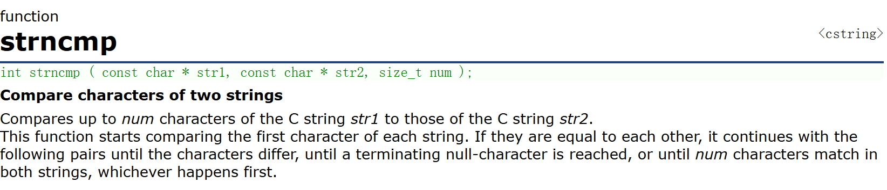

```c
int main()
{
    char arr1[] = "abcdef";
    char arr2[] = "abcz";
    int ret = strncmp(arr1, arr2, 3);
    if (ret == 0) {
        printf("==\n");
    }
    else if(ret < 0) {
        printf("<\n");
    }
    else{
        printf(">\n");
    }
    return 0;
}
```

+ 首先是比较两个字符串中的前3个，可以看到`abc`与`abc`是相同的

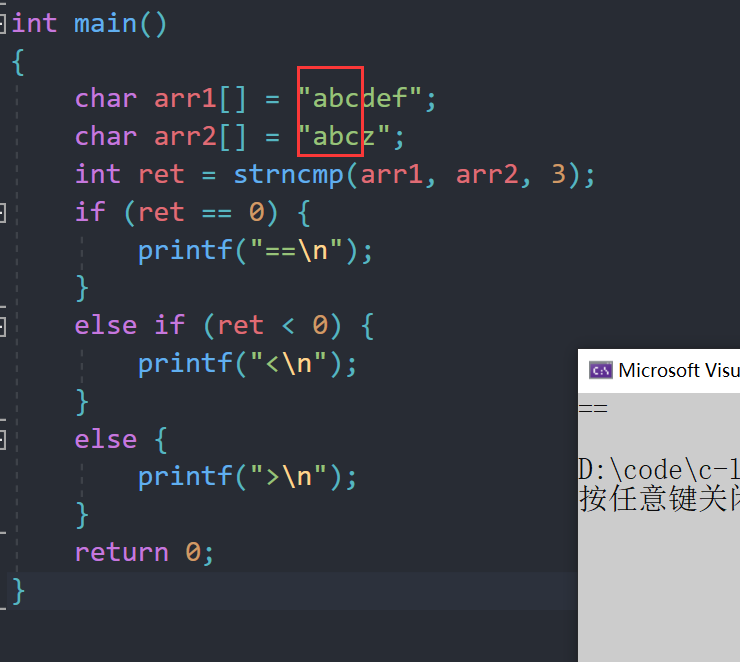

+ 首先是比较两个字符串中的前4个，可以看到`abcd`是小于`abcz`的

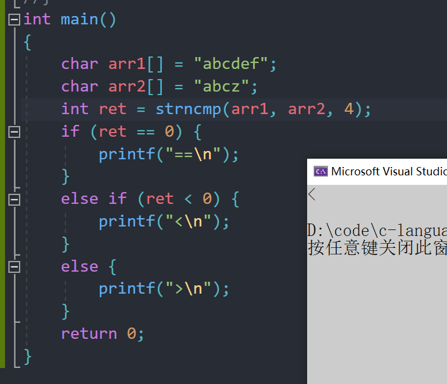

+ 将`abcz`换成`abcd`后，结果又会有所不同

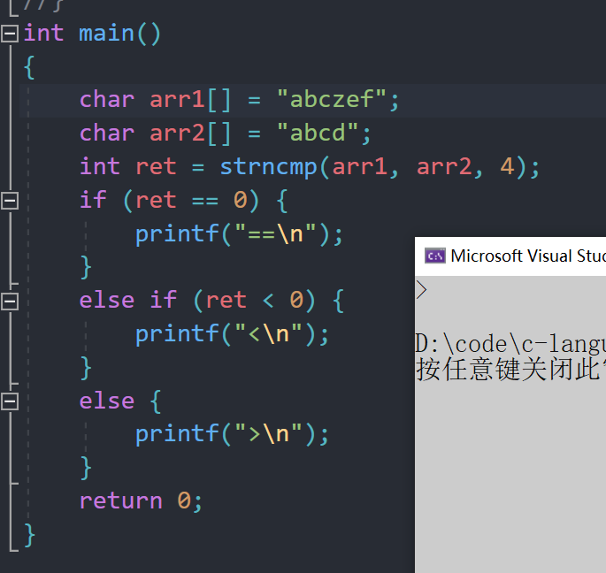

不过呢，要注意这里的返回值ret，不可以用`== 1`或`== -1`这样去判断

+ 通过运算我们可以发现，在VS下若是前者小于后者返回的结果便是【-1】，但是在其他编译器上可不一定，如果你有仔细看过`strcmp()`的话就可以知道它返回的只是`>/</== 0`的数字，而不是具体的数值，因此我们不能将值写死，否则在其他编译器例如gcc上就跑不过去了

## 六、字符串查找函数
### strstr()
函数原型

```c
const char * strstr ( const char * str1, const char * str2 );
      char * strstr (       char * str1, const char * str2 );
```

[原文链接](https://legacy.cplusplus.com/reference/cstring/strstr/?kw=strstr)

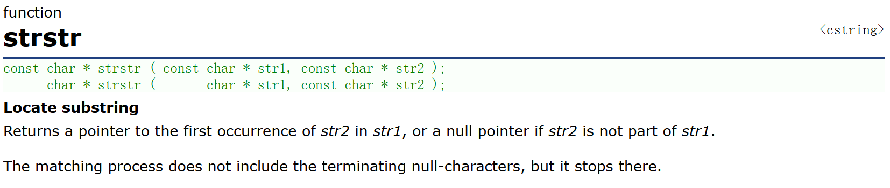

```c
int main()
{
    char str1[] = "abcdefabcdef";
    char str2[] = "def";

    char* substr = strstr(str1, str2);
    printf("%s\n", substr);
    return 0;
}
```

+ 该函数返回的结果是子串`def`在主串`abcdefabcdef`中出现的第一个位置，我们使用`%s`去打印的话就会从这个位置开始往后打印后面的字符串

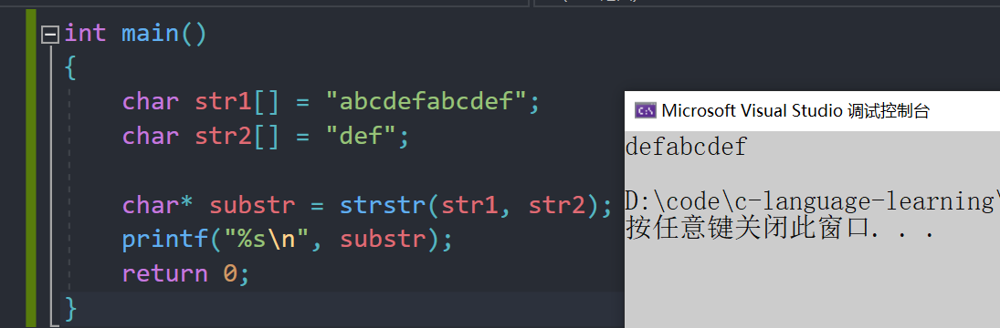

+ 但我若是去更换一下str2的话，它就不存在于str1中了

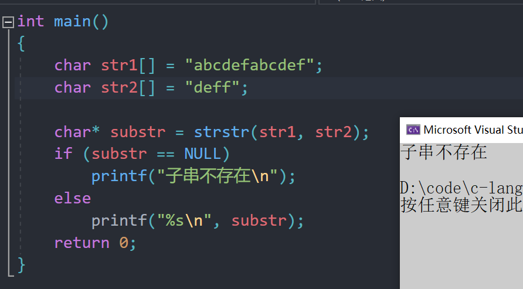

### 模拟实现
#### 情况①：匹配一次就成功
+ 首先是第一种情况，那就是子串在和主串匹配的时候一次就能匹配成功了

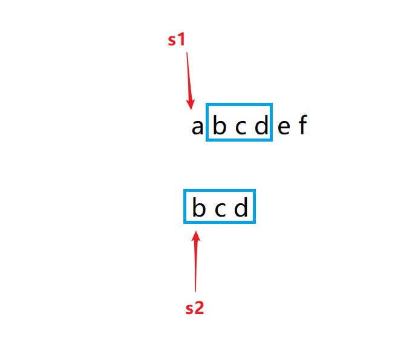

#### 情况②：匹配多次才成功
+ 接下去第二种情况，就是需要匹配多次才能成功，可以看到一开始前面出现了`b b b`，但是我们要匹配的子串是`b b c`，所以在匹配到第三个b的时候就需要进行重新匹配
+ 那若是要重新匹配的话就需要让【s1】和【s2】进行重新置位的操作，【s2】的话很简单，直接回到初始的位置即可，但是对于【s1】的话其实没有必要，我们可以设置一个【p】记录子串在主串中的位置，如果在匹配的过程中失配了，**只需要让【s1】回到**`p + 1`**的位置即可，因为从【p】的位置开始已经不可以匹配成功了**，具体地我在下面讲述代码的时候细说

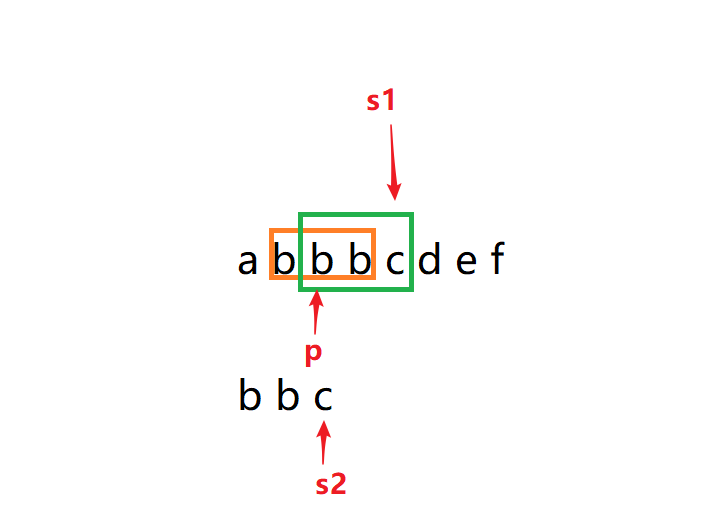

```c
const char* my_strstr(const char* str1, const char* str2)
{
    assert(str1 && str2);
    const char* s1 = str1;
    const char* s2 = str2;
    const char* p = str1;

    while (*p)
    {
        s1 = p;
        s2 = str2;
        while (s1 != '\0' && s2 != '\0' && *s1 == *s2)
        {
            s1++;
            s2++;
        }
        if (*s2 == '\0')
        {
            return p;		//此时p的位置即为子串s2在s1中出现的第一个位置
        }
        p++;
    }
    return NULL;		//若是主串遍历完了还是没有找到子串，
                        //表明其不在主串中，返回NULL
}
```

**细说一下：**

+ 首先我们看到开头的三个指针定义，因为在失配的时候需要指针回到字符串的起始位置，所以【str1】和【str2】的位置我们不可以去动它，那两个指针另外做移动，然后再拿一个【p】记录位置

```c
const char* s1 = str1;
const char* s2 = str2;
const char* p = str1;
```

+ 在while循环内存，最主要的还是这段匹配的逻辑，若是`*s1`和`*s2`z中的存放的字符相同的话，就继续往后查找，但是呢它们不能一直无休止地往后查找，总有停下来的时候，那也就是当指针所指向的内容为`\0`时，就需要跳出循环

```c
while (s1 != '\0' && s2 != '\0' && *s1 == *s2)
{
    s1++;
    s2++;
}
```

+ 若只是二者不相同跳出来了，此时`p++`即可，然后回到循环判断`*p`是否为`\0`，若还没有碰到主串末尾的话，就需要更新`s1`和`s2`的位置，继续进行匹配的逻辑

```c
p++;
s1 = p;
s2 = str2;
```

+ 若是`*s2 == '\0'`的话，此时就表示子串已经匹配完成了，都到达末尾了，那么这个时候我们应该返回【子串在主串中出现的第一个位置】，这也是`strstr()`的本质，那么这个位置在哪里呢？因为我们是哪`p`去记录位置的，那就可以说**在主串中从指针p所指向的这个位置开始直到**`\*s2`**到末尾时，即为匹配成功子串的一个位置**

```c
if (*s2 == '\0')
{
    return p;		//此时p的位置即为子串s2在s1中出现的第一个位置
}
```

匹配的过程相信你对strstr()这个函数应该非常清楚了，但其实它的效率并不是很高，在我们看来它只是一个【暴搜】的过程，若是想要追求更加高效的匹配过程，可以看看`KMP算法`

### strtok()
函数原型

```c
char * strtok ( char * str, const char * delimiters );
```

[原文链接](https://legacy.cplusplus.com/reference/cstring/strtok/?kw=strtok)

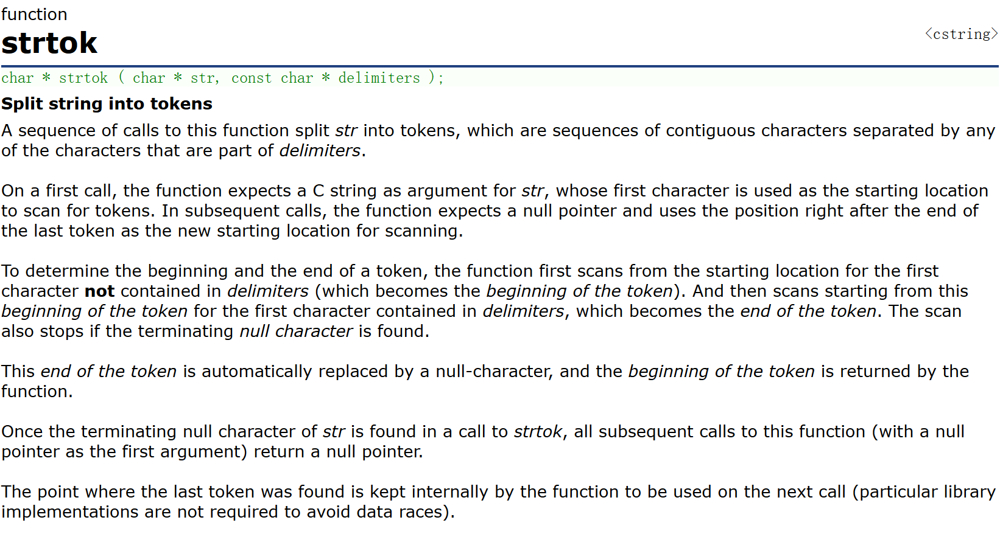

```c
int main()
{
    char sep[] = "@.";
    char email[30] = "256652753@qq.com";
    
    char* ret = strtok(email, sep);
    if (ret != NULL)
        printf("%s\n", ret);

    ret = strtok(NULL, sep);
    if (ret != NULL)
        printf("%s\n", ret);

    ret = strtok(NULL, sep);
    if (ret != NULL)
        printf("%s\n", ret);
    return 0;
}
```

+ 本函数也可以叫做【字符串分割函数】，根据所传入的`seq`分割字符数组，来确定要以何种字符来进行分割，这里我采用的是`@`和`.`，那么在这个函数执行的时候，就会根据这两个字符来进行分割
+ strtok函数的**第一个参数不为 NULL** ，函数将找到str中第一个标记，strtok函数将保存它在字符串中的位置
+ strtok函数的**第一个参数为 NULL** ，函数将在同一个字符串中`被保存的位置开始`，查找下一个标记
+ 如果字符串中不存在更多的标记，**则返回 NULL 指针**

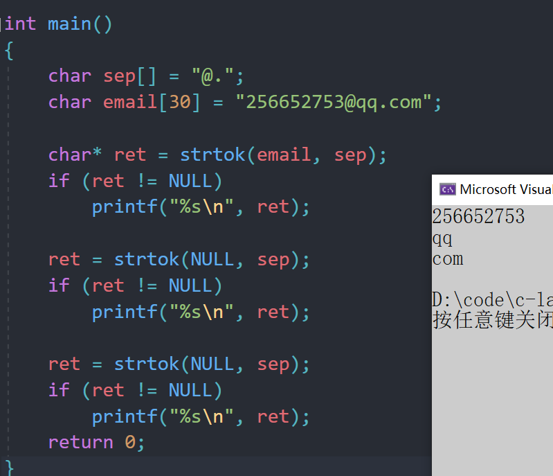

+ 可以看到，我在获取到分割的子串后去打印时都会判断一下它是否为空，因为原文中有写到`If a token is found, a pointer to the beginning of the token.Otherwise, a null pointer.`所以它是有可能返回一个空指针的，对于一个空指针来说，我们就无需去打印了

**代码优化：**

> 因为strtok函数会改变被操作的字符串，所以我们一般不会对原字符串进行操作，而会去选择临时拷贝一份
>

+ 这个时候就可以使用到我们前面所学的`strcpy`，此时再去操作的话原字符串就不会被修改了

```c
char cp[30];
strcpy(cp, email);		//临时拷贝一份

char* ret = strtok(cp, sep);
if (ret != NULL)
    printf("%s\n", ret);

ret = strtok(NULL, sep);
if (ret != NULL)
    printf("%s\n", ret);

ret = strtok(NULL, sep);
if (ret != NULL)
    printf("%s\n", ret);
```

+ 我们可以将这些逻辑写到for循环中去，**对于for循环来说第一个表达式是只会被执行一次的，也就是一开始进来出初始化的时候**，而我们传递参数给`strtok()`的时候也是只在第一次传递字符串给第一个参数，后面的话就都传递NULL了
+ 因此**后面的传值改变我们可以写在循环变量调整的位置**，即第三个表达式处。那第二个表达式我们最熟悉了，就是写for循环的终止条件，因为我们始终拿的就是`ret`去接收每一次分割后的返回值然后去打印，那么最后的话当分割到字符串结尾的时候没有了就会返回NULL，那此时我们将其作为结束条件来判断即可

```c
for (ret = strtok(cp, sep); ret != NULL; ret = strtok(NULL, sep))
{
    printf("%s\n", ret);
}
```

**完整代码如下：**

```c
int main()
{
    char sep[] = "@.";
    char email[30] = "256652753@qq.com";
    
    char cp[30];
    strcpy(cp, email);		//临时拷贝一份

    char* ret = NULL;
    for (ret = strtok(cp, sep); ret != NULL; ret = strtok(NULL, sep))
    {
        printf("%s\n", ret);
    }
    return 0;
}
```

## 七、错误信息报告函数
### strerror()
函数原型

```c
char * strerror ( int errnum );
```

[原文链接](https://legacy.cplusplus.com/reference/cstring/strerror/?kw=strerror)

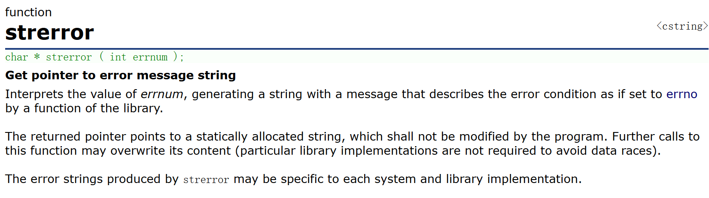

```c
int main()
{
    printf("%s\n", strerror(0));
    printf("%s\n", strerror(1));
    printf("%s\n", strerror(2));
    printf("%s\n", strerror(3));
    printf("%s\n", strerror(4));
    printf("%s\n", strerror(5));
    return 0;
}
```

+ 可以看到，这里我打印了一些错误信息，也就是每种数字所示对应的【错误信息】

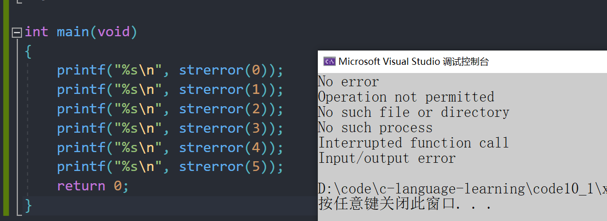

> 当然这个函数不是这么用的，我们可以在实际的场景中来试试，比方说这里要打开一个文件，那么打开文件的话就一定存在打开失败的情况，此时我们就可以使用`strerror()`去给出一些错误信息
>

+ 在这里看到我给这个函数内部传入了一个东西叫做【errno】，它是一个错误变量，里面记录了很多常见的错误，我们若是不知道要传入哪个数字来显示错误信息的话，只需要传入这个变量即可，它是**C语言设置的一个全局的错误码存放的变量**

该函数需要包含一下`#include <errno.h>`

```c
int main()
{
    FILE* pf = fopen("test.txt", "r");
    if (NULL == pf)
    {
        printf("%s\n", strerror(errno));
        return 1;
    }
    else {
        printf("文件打开正常\n");
    }
    return 0;
}
```

+ 当前目录下创建了一个`test.text`的文本文件，然后通过`fopen()`函数去打开它

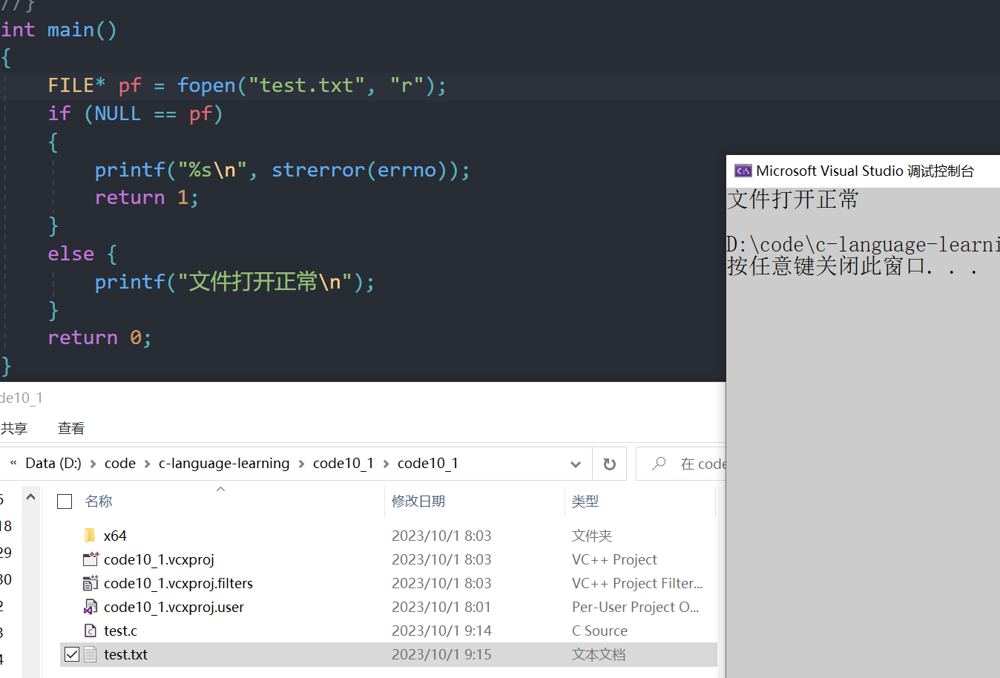

+ 但若是我将文件的文件名删除一下，此时文件一定是打开失败的，那么就会通过`strerror(erron)`这个函数去打印一些相关的错误信息

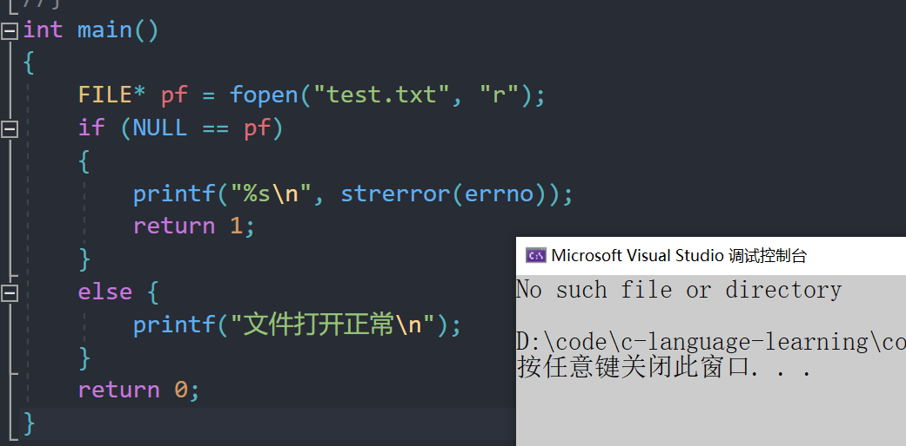

## 八、内存操作函数
### memcpy()
函数原型

```c
void * memcpy ( void * destination, const void * source, size_t num );
```

[原文链接](https://legacy.cplusplus.com/reference/cstring/memcpy/?kw=memcpy)

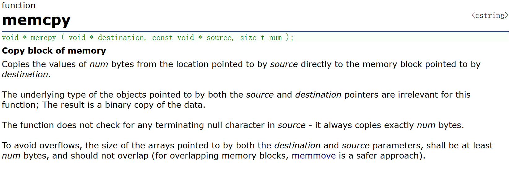

我们要为`memcpy()`传入的前两个参数就是目的地址和源地址，最后一个参数的话就是要拷贝的字节数，记住，这里是【字节数】而不是【元素个数】，所以可以看到我是用`sizeof(int)`首先求出了数组中每个元素的字节数，然后在乘上数组元素个数，**就是整个数组所占的字节数**

```c
int main()
{
    int arr1[10] = { 1,2,3,4,5,6,7,8,9,10 };
    int sz = sizeof(arr1) / sizeof(arr1[0]);
    int arr2[10] = { 0 };

    memcpy(arr2, arr1, sizeof(int) * sz);
    return 0;
}
```

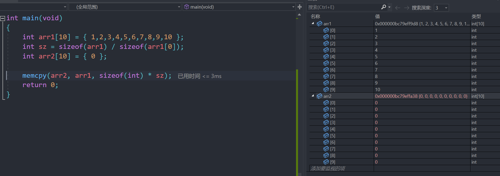

+ 除了整型数据，`memcpy()`也可以拷贝浮点型的数据，上去仔细看看原函数就可以知道目标地址和原地址的类型都是`void*`，表明它们可以接收任意类型的地址，即可以拷贝任意类型的数据

```c
int main()
{
    float arr1[] = { 1.1, 2.2, 3.3, 4.4, 5.5 };
    int sz = sizeof(arr1) / sizeof(arr1[0]);
    float arr2[5] = { 0 };

    memcpy(arr2, arr1, sizeof(int) * sz);
    return 0;
}
```

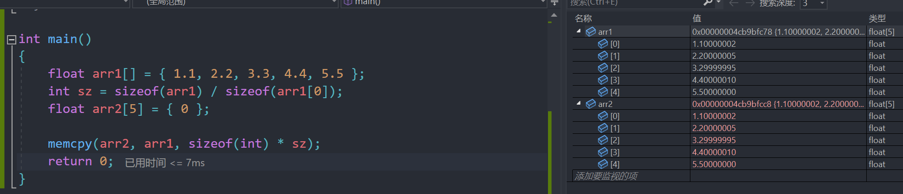

### 模拟实现
这里主要讲一下的就是这个内部的拷贝逻辑，之前我们在使用`strcpy()`的时候是直接用【dest = src】的，但是这里的话我们不能这么去操作，上面讲到过两个目标指针和源指针都是`void*`类型的，这种指针类型是不可以直接进行解引用的，而是要在内部对其进行强制类型转换

那转成什么类型的指针呢？`int*`、`float*`、`double*`吗？不，这些都不可以，设想我们传入的字节数是28，那使用`int*`类型的指针去拷贝确实可以做到，但若是我传入的总字节数为27呢？不是一个4字节或者8字节的整数倍，那要怎么去拷贝呢？

但是有一个类型的指针却可以做到，那就是`char*`，无论你要我拷多少字节的数据，反正我解引用每次只能拷贝1个字节的数据，那么就一个个拷过去就行了，虽然效率上来说是低了一些，但是容错率下降了，就不会出现什么大问题

当单个字节的数据拷贝完成后，指针就向后偏移指向下一个要拷贝的数据，那也强转为`char*`类型即可，便可以一次访问4个字节，但是这里尽量不要直接写成`(char*)dest++`，因为这里面涉及到【隐式类型转换】，在中间会产生一个临时对象，我们对临时对象去++的话并没有什么意义，所以这里还是规规矩矩地写就行

```c
dest =	(char*)dest + 1;
src = (char*)src + 1;
```

```c
void* my_memcpy(void* dest, const void* src, int num)
{
    assert(dest && src);
    void* ret = dest;
    while (num--)
    {
        *(char*)dest = *(char*)src;
        dest =	(char*)dest + 1;
        src = (char*)src + 1;
    }
    return ret;
}
```

如果我不想拷贝所有的数据，而是只拷贝一半的数据呢，我们只需要指定拷贝的字节数就可以了，现在数组的大小是40个字节，一般数据的话就是20个字节，那就像下面这样去进行拷贝即可

```c
int main()
{
    int arr1[10] = { 1,2,3,4,5,6,7,8,9,10 };
    int arr2[10] = { 0 };

    my_memcpy(arr2, arr1, 20);
    for (int i = 0; i < 10; ++i)
    {
        printf("%d ", arr2[i]);
    }
    return 0;
}
```

+ 可以看到，最后就只拷贝了一半的数据过去

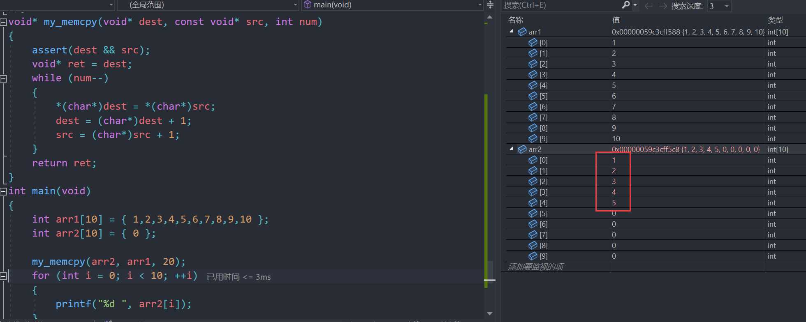

+ 也可以直接在自己本身上进行操作，比方说现在我想把arr1数组中前面20个字节的数据，即前5个元素【1 2 3 4 5】拷贝到【3 4 5 6 7】这个位置中，那最后的结果是否会是【1 2 1 2 3 4 5 8 9 10】呢

```c
int main()
{
    int arr1[10] = { 1,2,3,4,5,6,7,8,9,10 };

    my_memcpy(arr1 + 2, arr1, 20);
    for (int i = 0; i < 10; ++i)
    {
        printf("%d ", arr1[i]);
    }
    return 0;
}
```

+ 通过运行可以看出，并没有拷贝过去，而且数组前面的元素变成了【1 2 1 2 1 2 1】

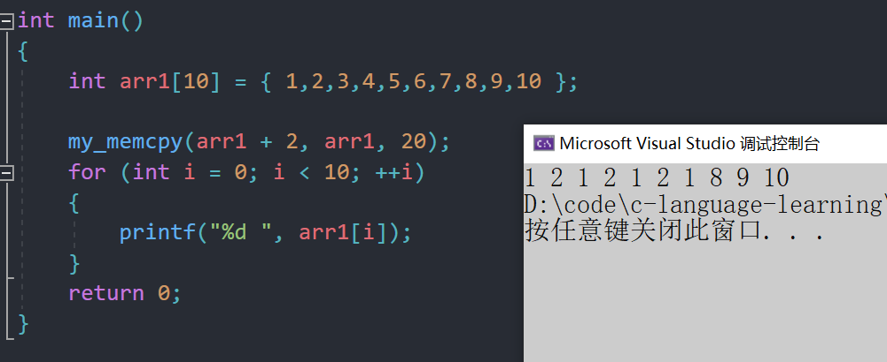

当前两个数拷贝完之后想要去拷贝3的时候，此时我们拿到的还是【1】，当想要去拷贝4的时候，拿到的便是【2】，依次类推，这就是为什么打印出来拷贝位置的结果是【1 2 1 2 1】

对与`memcpy()`来说，它只负责拷贝两块独立空间中的数据，但是对于一个数组的元素，它们都是连续存放的，若是擅自去进行拷贝的话会造成覆盖的情况，此时我们可以使用`memmove()`这个函数，它可以用来专门拷贝重叠内存的数据

### memmove()
+ 函数原型

```c
void * memmove ( void * destination, const void * source, size_t num );
```

[原文链接](https://legacy.cplusplus.com/reference/cstring/memmove/?kw=memmove)

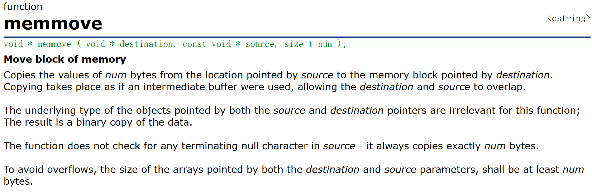

```c
int main()
{
    int arr1[10] = { 1,2,3,4,5,6,7,8,9,10 };

    memmove(arr1 + 2, arr1, 20);
    for (int i = 0; i < 10; ++i)
    {
        printf("%d ", arr1[i]);
    }
    return 0;
}
```

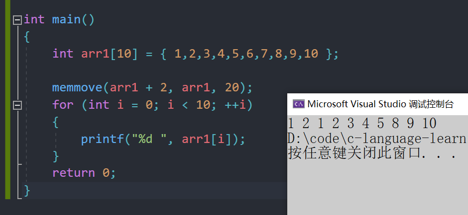

### 模拟实现
**分析：**

+ 对于数组的空间排布来说，前面是低地址，后面是高地址，此数组被分成了三块区域，对于 `dest`来说，一个是在src前面，需要从前往后进行拷贝，一个是在`src`后面，需要从后往前进行拷贝，还有一个便是两块内存空间不会进行覆盖， 但还是存在与一个连续的空间即数组中，这个时候无论是【从前往后】还是【从后往前】都是可以的，那这样分成三个区域太麻烦了，这里就可以分成两块区域，通过地址的大小进行比较
+ 当`dest < src`时，我们**从前往后**进行逐一字节的拷贝
+ 当`dest >= src`时，我们**从后往前**进行逐一字节的拷贝

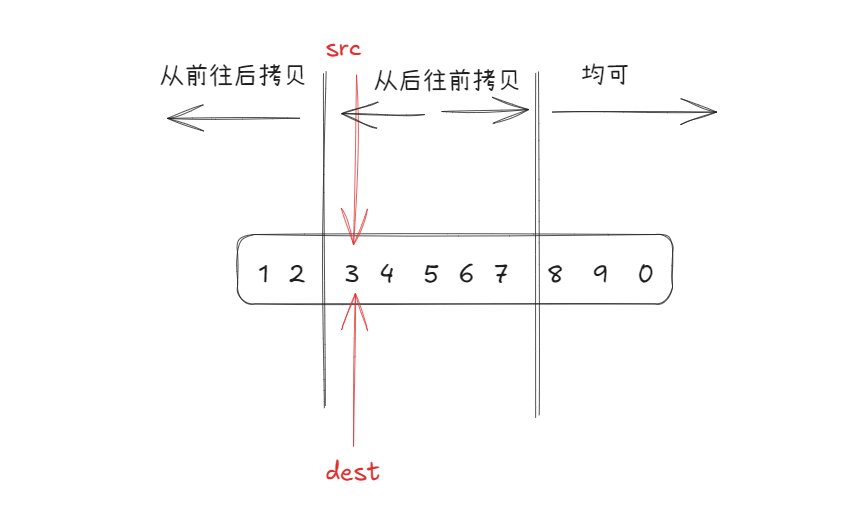

**代码展示：**

```c
void* my_mommove(void* dest, const void* src, size_t num)
{
    assert(dest && src);
    char* start = dest;
    if (dest < src)
    {
        //memcpy()的拷贝逻辑
        while (num--)
        {
            *(char*)dest = *(char*)src;
            dest = (char*)dest + 1;
            src = (char*)src + 1;
        }
    }
    else	//dest >= src
    {
        while (num--)
        {
            *((char*)dest + num) = *((char*)src + num);
        }
    }
    return start;
}
```

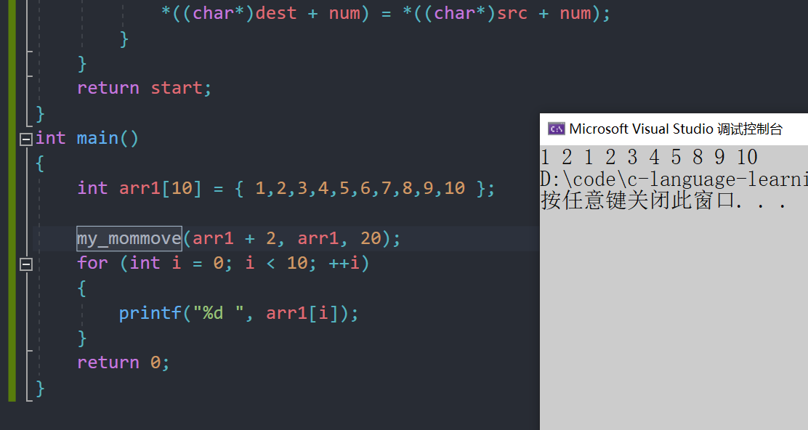

### memset()
函数原型

```c
void * memset ( void * ptr, int value, size_t num );
```

[原文链接](https://legacy.cplusplus.com/reference/cstring/memset/?kw=memset)

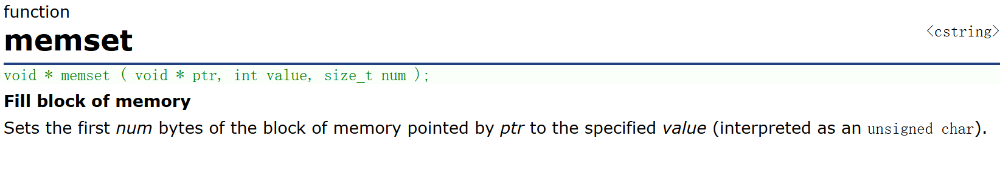

```c
int main()
{
    int arr[10];
    int sz = sizeof(arr) / sizeof(arr[0]);

    memset(arr, 0, sizeof(int) * sz);
    return 0;
}
```

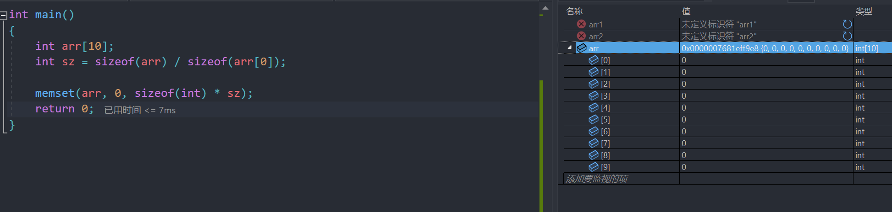

### 注意事项
要将数组中的数据都初始化成【1】呢，此时还能成功吗？

+ 可以看到，似乎数组的每个值并没有初始化成功，而是变成了一个很大的数，这是为什么呢？

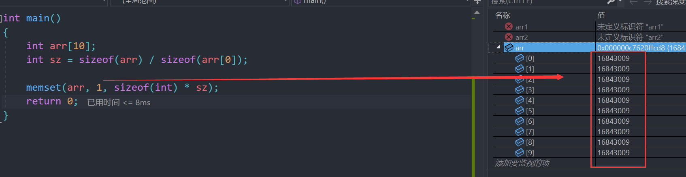

+ 我们可以通过【内存】的形式去观察一下。此时就可以观察到每一个字节都被初始化成了1，那么4个字节的话其实就不再是1了，而是一个很大的数，回想`memset()`的特性，是以字节为单位去进行一个初始化，那就可以看出问题出在哪里了

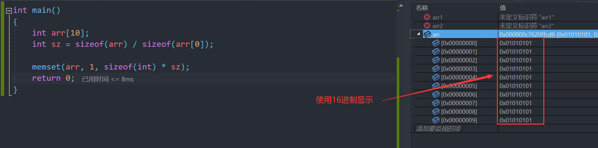

所以我们在使用`memset()`的时候一定要注意以上这一点

### memcmp()
函数原型

```c
int memcmp ( const void * ptr1, const void * ptr2, size_t num );
```

[原文链接](https://legacy.cplusplus.com/reference/cstring/memcmp/?kw=memcmp)

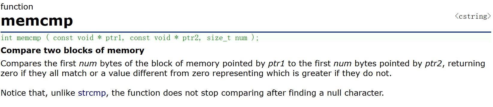

```c
int main()
{
    int arr1[10] = { 1,2,3,4,5 };
    int arr2[10] = { 1,3,2 };

    int ret = memcmp(arr1, arr2, 12);
    printf("%d\n", ret);
    return 0;
}
```

比较了两个数组的前12个字节，即数组的前3个元素，然后返回的是-1，它是如何去进行比较的呢？

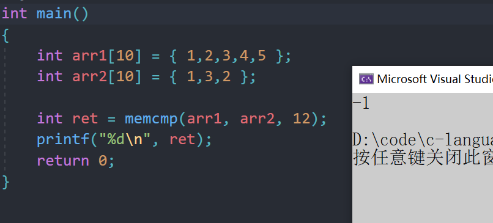

对于这个函数的返回值来说，和`strcmp()`一样，为< 0、= 0或者> 0的数值

+ 那我们现在可以来看一下它们在内存中的样子，对于VS来说是小端存放，因此数组arr1存放在内存中便是

```c
01 00 00 00 02 00 00 00 03 00 00 00 04 00 00 00 05 00 00 00  
```

+ 数组arr2存放在内存中为

```c
01 00 00 00 03 00 00 00 02 00 00 00 
```

+ 要知道，`memcmp()`可是一个字节一个字节进行比较，那么此时当他们比较到【02】和【03】的时候就已经不相等了，因为前一个小于后一个，所以便会返回 `< 0`的数字

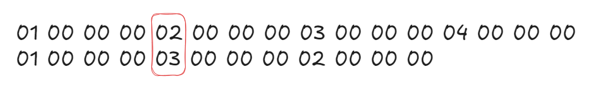

