## 一、一维数组的创建和初始化
在C语言中通常**第一维**通常表示**行数**，**第二维**表示**列数**。

### 1、数组的创建
数组是一组相同类型元素的集合。  
数组的创建方式：

```c
type_t   arr_name   [const_n];
//type_t 是指数组的元素类型
//const_n 是一个常量表达式，用来指定数组的大小
```

首先我们就来看看数组如何创建~~

```c
int a1[5];
char a2[6];
float a3[7];
double a4[4 + 4];	//也可以是一个表达式
```

+ 对于整型、字符型、浮点型的数据可以创建
+ `[]`内的数字便是这个数组的大小，表示这个数组中可以存放多少元素。
+ 除了数字也可以是一个表达式放里面
+ 虽然指定数组大小可以是一个常量，但VS不支持是一个变量

```c
int n = 0;
scanf("%d", &n);
int arr[n];
```

+ 其实这种写法是可以的，因为在C99中引入了`变长数组`的概念
+ 变长数组支持数组的大小使用变量来指定。
+ 但是变长数组不是数组的长度可以变化，**而是数组的大小可以用变量来指定**

### 2、数组的初始化
+ 首先要来辨析一下初始化和赋值的区别。千万不可以混淆

```c
int n = 0;	//初始化
int m;
m = 0;		//赋值
```

+ 接下去就来看看数组的初始化
+ 首先是整型数组

```c
//1.不完全初始化，数组个数10个。第一个元素为1，其余9个位0
int arr1[10] = { 1 };		
//2.完全初始化，数组个数10个
int arr2[10] = { 1,2,3,4,5,6,7,8,9,10 };
//3.若没有指定数组的个数，则初始化了几个这个数组的大小就为几
int arr3[] = { 1,2,3,4,5 };
```


然后是字符数组：

```c
//1.数组大小为4，初始化四位，abc + '\0'
char ch1[] = "abc";
//2.数组大小为3，初始化前三位，abc
char ch2[] = { 'a', 'b', 'c' };
```

+ 如果以字符串的形式进行初始化，则默认在最后加上一个`\0`；
+ 若是以单个字符的形式初始化，则数组大小即为初始化的字符个数

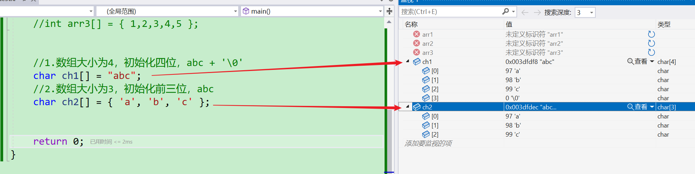

+ 其中在数组未完全初始化中，后面默认是`0`，在ASCLL码中0就是`\0`

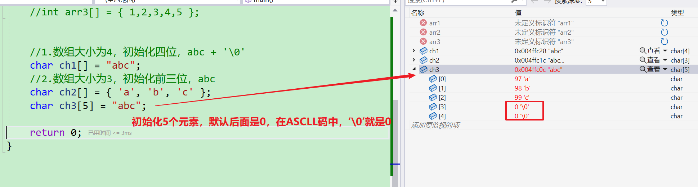

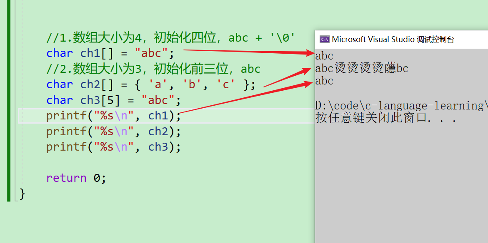

+ **注意：** 当变量在`全局范围`默认初始化为0，当变量在`局部范围`内默认没有初始化，放的是随机值

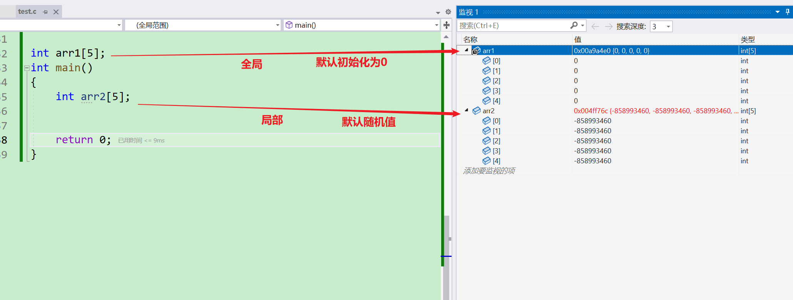

### 3、一维数组的使用
对于数组的使用，我们有一个操作符 `[]`，下标引用操作符，它其实就**数组访问的操作符。**

+ 我们来通过这个操作符来访问数组中的内容

```c
int main()
{
    int arr[] = { 1,2,3,4,5,6,7,8,9,10 };
    for (int i = 0; i < 10; i++)
    {
        printf("%d ", arr[i]);
    }
    return 0;
}
```

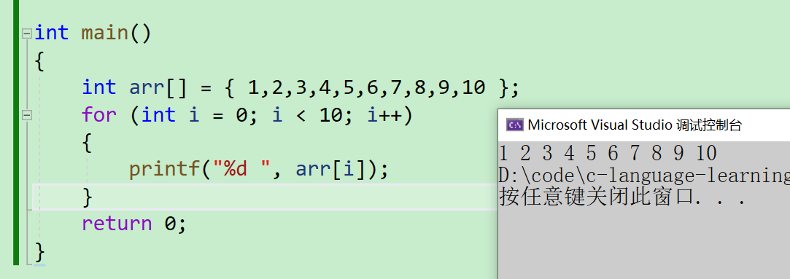

+ 上面这种对于循环中要访问的数组个数已经写死了，如果修改一下数组的元素个数，那循环的结束条件就也要修改，此时我们就可以考虑使用到`sizeof()`去首先计算出数组的大小

```c
int main()
{
    int arr[] = { 1,2,3,4,5,6,7,8,9,10 };
    int sz = sizeof(arr) / sizeof(arr[0]);
    for (int i = 0; i < sz; i++)
    {
        printf("%d ", arr[i]);
    }
    return 0;
}
```

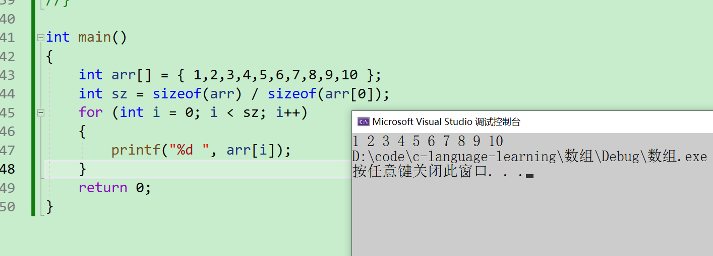

**注意：** 在数组创建的时候不能使用变量，而在使用的时候就可以

---

**小结：**

1. 数组是使用下标来访问的，下标是从0开始。
2. 数组的大小可以通过计算得到。

### 4、 一维数组在内存中的存储
+ 要想知道数组是如何在内存中存放的，那就要将每一个元素的地址打印出来观察一下。

```c
int main()
{
    int arr[] = { 1,2,3,4,5,6,7,8,9,10 };
    int sz = sizeof(arr) / sizeof(arr[0]);
    for (int i = 0; i < sz; i++)
    {
        printf("&arr[%d] = %p \n", i, &arr[i]);
    }	
    return 0;
}
```

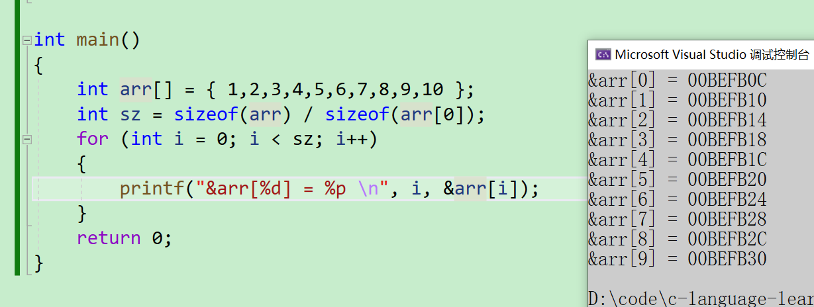

+ 可以看到，对于每一个数组元素之间，在内存中都是差了4个字节，因为整型是4个字节

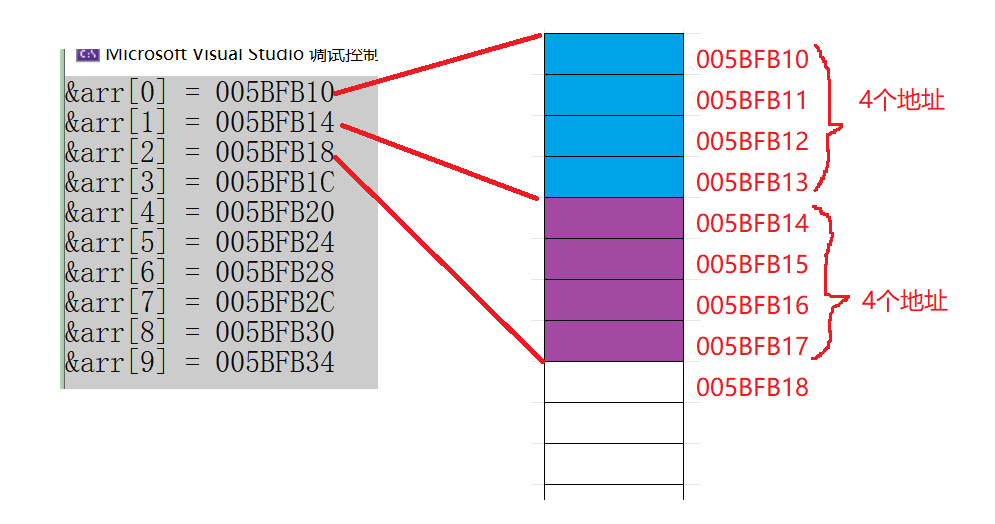

---

**小结：**

1. 一维数组在内存中是连续存放的
2. 随着数组下标的增长，地址是由**低到高**变化的

## 二、二维数组的创建和初始化
### 1、二维数组的创建
+ 首先那来看一下各种数据类型的二维数组创建

```c
int main()
{
    int arr1[3][4];			//整型二维数组
    double arr2[3][5];		//字符型二维数组
    float arr3[4][5];		//浮点型二维数组
    return 0;
}
```

### 2、二维数组的初始化
```c
int main()
{
    int arr1[3][4] = { 1,2,3,4 };
    int arr2[3][4] = { {1,2},{4,5} };
    int arr3[][4] = { {2,3},{4,5} };
    return 0;
}
```

+ 创建完后，那还要对其对其进行初始化。
+ 可以看到我默认初始化了五个元素之后，因为这个二维数组的是**三行四列**的，所以**第五个元素自动归位第二行的第一个元素。**

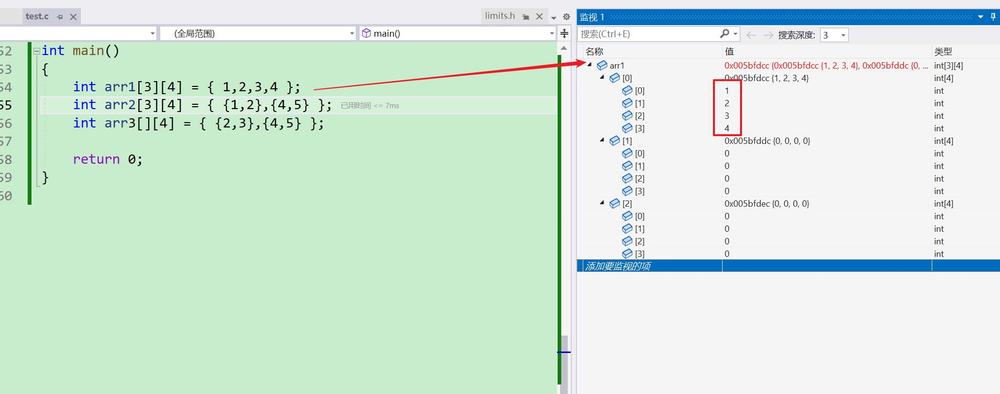

+ 我们还可以指定初始化每一行的元素，一行表示一个大括号，只需要在大括号里为每一行也加上花括号，然后在括号里写上这一行要初始化的数据。

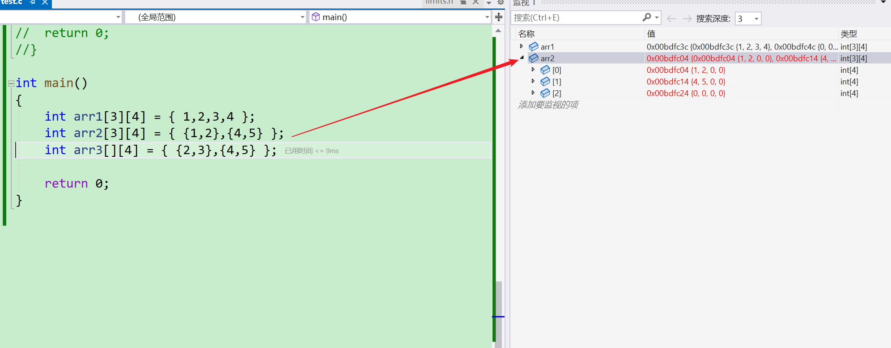

---

+ `对于二维数组在初始化的时候可以省略行，但是不可以省略列`

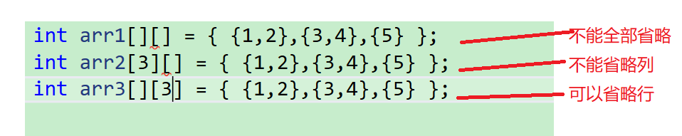

---

+ 那么为什么不能省略列呢？

> 在C语言中，数组的大小在声明时需要指定，包括行和列。这是因为C语言中的数组是一块连续的内存空间，编译器在编译时需要知道数组的大小以便正确分配内存。
>

> 如果省略列，编译器将无法确定每个元素在内存中的偏移量，因此无法正确计算数组的地址。指定列数有助于编译器进行正确的地址计算和内存分配
>

### 3、二维数组的使用
> 我们可以将一个二维数组打印在屏幕上
>

```c
int arr[][4] = { {1,2},{3,4},{5} };
for (int i = 0; i < 3; i++)
{
    for (int j = 0; j < 4; j++)
    {
        printf("%d ", arr[i][j]);
    }
    printf("\n");
}
```

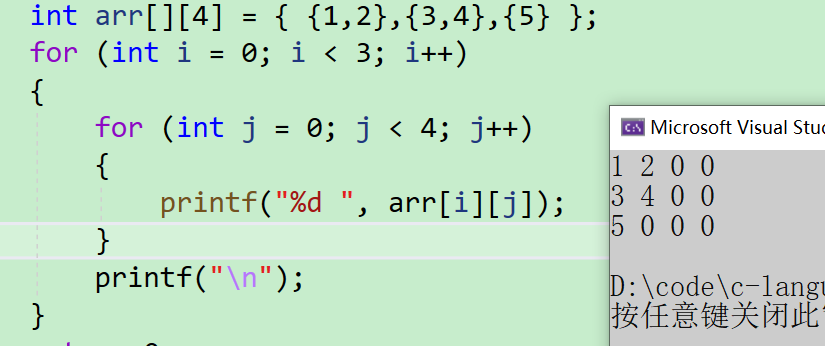

### 4、二维数组在内存中的存储
> 那么数组再内存中是怎么存储的呢？
>

```c
int arr[][4] = { {1,2},{3,4},{5} };
for (int i = 0; i < 3; ++i)
{
    for (int j = 0; j < 4; ++j)
    {
        printf("&arr[%d][%d] = %p\n", i, j, &arr1[i][j]);
    }
    printf("\n");
}
```

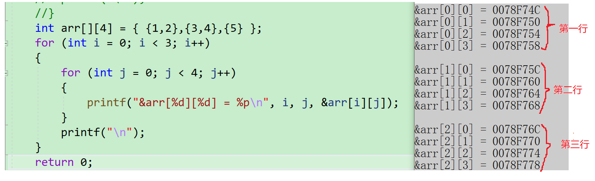


+ 对于二维数组来说，内存中是连续存放的  
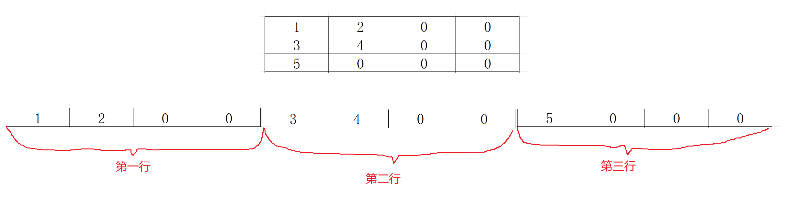

---

**数组首元素地址**：

+ 对于一个数组的数组名来说就是这个数组的首元素地址，我们可以根据一个数组的首元素地址来访问到这个数组，然后就可以访问到这个数组中的所有内容
+ 对于这个二维数组来说，因为它一行就是一个一维数组，因此我们就可以说
    - `arr[1]`是第一行的首元素地址
    - `arr[2]`是第二行的首元素地址
    - `arr[3]`是第三行的首元素地址
+ 然后便可以根据每一行的首元素地址的偏移量访问到这行的所有内容


+ 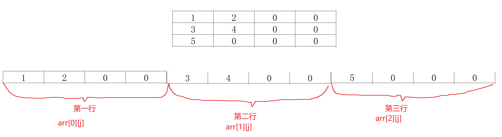

## 三、数组越界
### 边界值考虑不当导致越界访问
```c
int main()
{
    int arr[3][4] = { 1,2,3,4,5,6,7,8,9,10,11,12 };

    for (int i = 0; i < 3; ++i)
    {
        for (int j = 0; j < 5; ++j)
        {
            printf("%d ", arr[i][j]);
        }
        printf("\n");
    }
    return 0;
}
```

+ 对于每一行的内部访问，从`0~4`会依次访问五个元素，但是每一行只有四个元素
+ 当本行访问完后就会去访问下一行的第一个元素。然后第二行又从下标为0的位置开始访问，到了最后一行的时候，没有再下一行可以访问了，那第五个访问到的也就是一个随机值

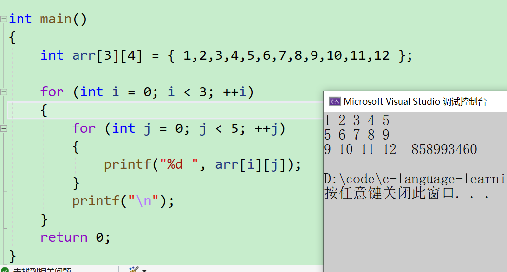

+ 可以通过图示看一下在内存中是如何进行访问的

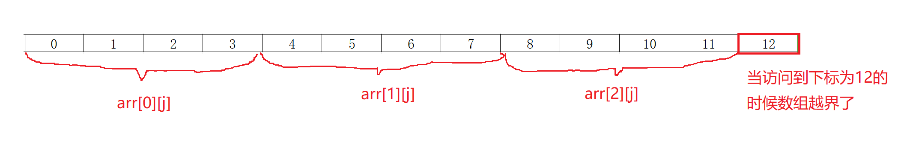

### 数组大小不足以承载输入的字符数
```c
char arr[] = "";
scanf("%s", arr);

printf("%s\n", arr);
```

+ 上面题目中`arr[]`并没有指定数组的大小，因此数组大小由初始化的字符个数决定。
+ 可以看到这里只初始化了一个空字符，也就相当于只有一个`\0`，那么这个数组的大小即为1。所以当我`scanf`输入一个长度大于1的字符串时，其实就会造成数组越界的问题【arr数组周围的堆栈被破坏即为数组越界】

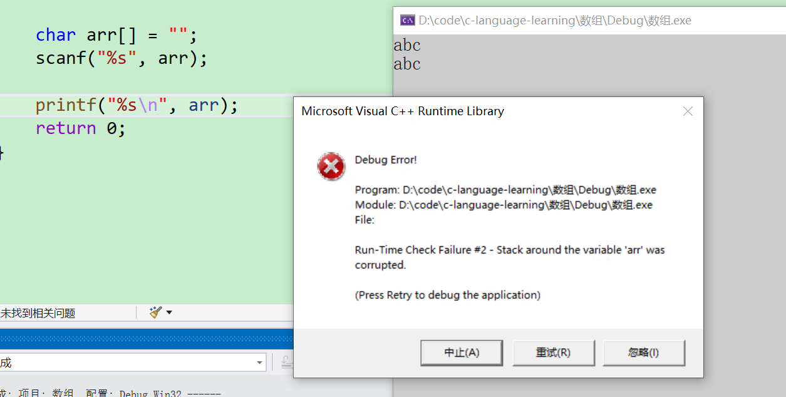

---

```c
int arr1[] = { 0 };
for (int i = 0; i < 10; ++i)
{
    arr1[i] = i;
}
```

+ 这个整型数组的大小为初始化内容的大小，但是下面的操作访问了10个字节，会越界访问~~

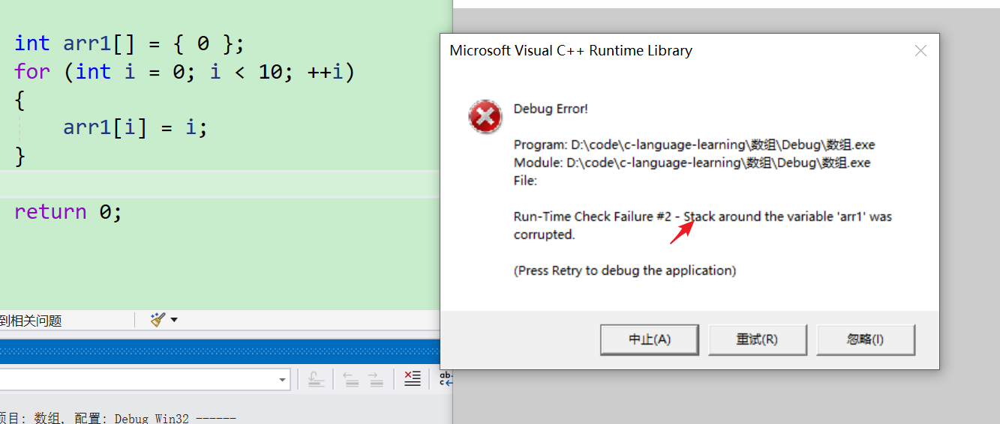

## 四、数组作为函数参数
### 1、冒泡排序函数的错误设计
+ 然后让我们来看看错误的冒泡排序

```c
void PrintArray(int* a, int n)
{
    for (int i = 0; i < n; ++i)
    {
        printf("%d ", a[i]);
    }
    printf("\n");
}

void BubbleSort(int a[10])
{
    int n = sizeof(a) / sizeof(a[0]);

    for (int i = 0; i < n - 1; ++i)
    {
        for (int j = 0; j < n - 1 - i; ++j)
        {
            if (a[j] > a[j + 1])
            {
                int t = a[j];
                a[j] = a[j + 1];
                a[j + 1] = t;
            }
        }
    }
}

int main()
{
    int arr[] = { 1,2,3,4,5,6,7,8,9,10 };
    int sz = sizeof(arr) / sizeof(arr[0]);
    
    PrintArray(arr, sz);

    BubbleSort(arr);

    PrintArray(arr, sz);
    return 0;
}

```

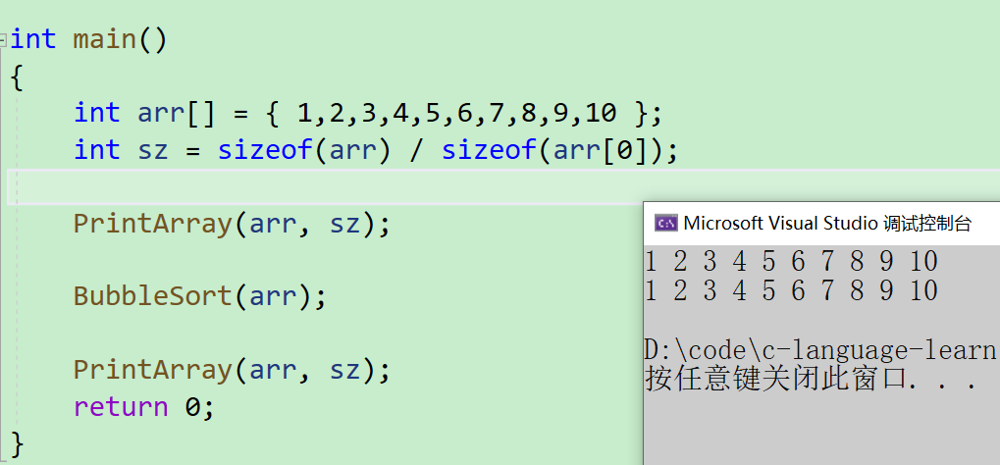

+ 为什么会发生这样的情况呢？我们通过DeBug来调试看看
+ 这里n应该为10而不是1

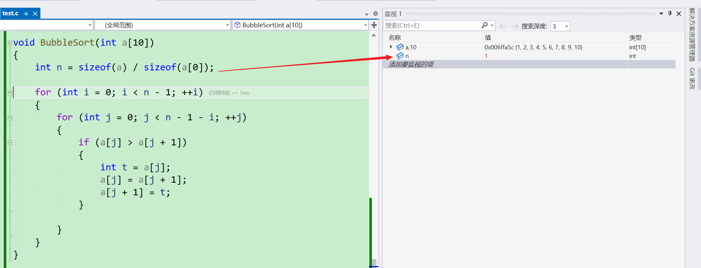

> 接下来就来介绍一下为什么是1而不是10
>

### 2、数组名意味着什么？
+ 对于数组名而言，当我们将一个数组作为函数的参数进行传递的时候，传入的仅仅这个数组的`首元素地址`，而并不是把整个数组作为参数传递过去。

#### 情况1：sizeof(数组名)
 **sizeof(数组名)求解的是整个数组的字节大小**

```c
int arr[] = { 1,2,3,4,5,6,7,8,9,10 };
printf("%d\n", sizeof(arr));
```

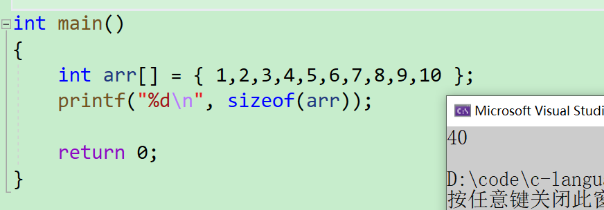

+ 可以看到输出的结果为【40】，我们刚才说到数组名指的是首元素地址，刚才在【冒泡排序】中计算`sizeof(a)`得出的结果为4，但是这个为什么是40呢？
+ `sizeof(数组名)`计算的就是整个数组的大小，因为arr数组中有十个元素，一个整型元素占4个字节，所以整个数组的大小即为40。

#### 情况2：&数组名
**&数组名为整个数组的地址**

```c
printf("%p\n", &arr[0]);
printf("%p\n", arr);
printf("%p\n", &arr);
```

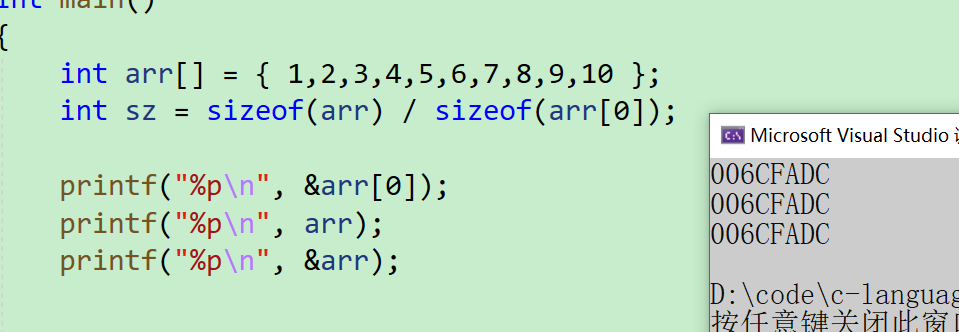

+ 三个打印出来的结果都是一样的，对于第一个`arr[0]`指的是首元素，`&arr[0]`指的便是首元素的地址；对于`arr`来说也是一样为首元素地址
+ 而对于&arr来说，指的则是整个数组的地址，它和数组首元素地址是一样的，所以三者地址相同

### 小结一下
+ **&数组名：数组名表示整个数组。取出的是整个数组的地址**
+ **sizeof(数组名)：数组名表示整个数组。求解的是整个数组的大小，单位是字节**
+ **除此之外见到数组名全部都为该数组的首元素地址**

### 3、冒泡排序函数的改进
+ 通过上面的分析可以知晓出错的地方是在数组的个数，所以我们在排序外面计算完再把这个数组的大小传进去就行

```c
void bubble_sort(int arr[], int sz)
{
    int i = 0;
    //确定冒泡排序的趟数
    for (i = 0; i < sz - 1; i++)
    {
        //假设数组是有序的
        int flag = 1;
        //一趟冒泡进行多少对比较
        int j = 0;
        for (j = 0; j < sz - 1 - i; j++)
        {
            //交换
            if (arr[j] < arr[j + 1])
            {
                int tmp = arr[j];
                arr[j] = arr[j + 1];
                arr[j + 1] = tmp;
                flag = 0;
            }
        }
        // 这一趟没交换就说明已经有序，后续无序排序了
        if (flag == 1)
        {
            break;
        }
    }
}

void print_arr(int* arr, int sz)
{
    for (int i = 0; i < sz; i++)
    {
        printf("%d ", arr[i]);
    }
}
int main()
{
    int arr[] = { 1,2,3,4,5,6,7,8,9,10 };
    int sz = sizeof(arr) / sizeof(arr[0]);
    print_arr(arr, sz);
    printf("\n");
    bubble_sort(arr, sz);
    print_arr(arr, sz);
}
```

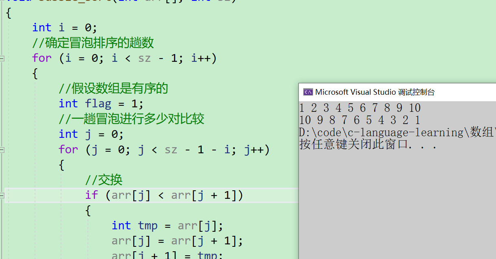

### 4、数组地址与指针
#### 数组地址偏移量与指针偏移量
+ 在C语言中，我们可以通过指针来访问数组的元素，利用指针进行数组元素的遍历和访问。首先，我们将数组的首元素地址赋给一个指针变量，然后通过逐步向后移动指针来访问数组的各个元素。

```c
int arr[10] = { 1,2,3,4,5,6,7,8,9,10 };
int* p = &arr[0];
```

+ 现在，指针变量 `p` 中存放着数组 `arr` 的首元素地址。要通过这个指针变量访问后面的所有元素，我们可以使用循环，通过 `p + i` 的方式来获取元素的地址，然后通过解引用操作 `*(p + i)` 来访问元素的值。

```c
for (int i = 0; i < 10; ++i)
{
    printf("%d ", *(p + i));
}
printf("\n");
```

+ 在循环中，`*(p + i)` 表示访问数组中第 `i` 个元素的值。这种方式可以适用于任何一维数组，因为一维数组在内存中是一块连续的存储空间，通过指针的偏移可以依次访问数组的所有元素。

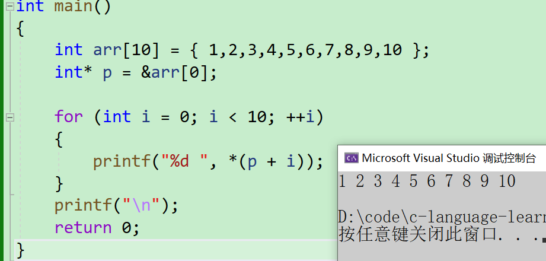

+ 通过将数组的首元素地址赋值给指针变量 `p`，然后逐个递增指针，每次递增一个元素的大小（在这里是4个字节，假设是int类型数组），第 `i` 个元素的地址即为 `p + i`。当我们需要访问这个地址的内容时，通过对指针进行解引用 `*(p + i)`，就能够获取数组中第 `i` 个元素的值。这种方式可以灵活地遍历数组中的所有元素，而不需要直接使用数组下标。在循环中，这个过程被用来打印数组中的十个元素。

#### 指针变量与数组名的置换
+ 回到我们的【数组名 == 首元素地址】，那么`int* p = &arr[0]`可以写成`int* p = arr`。

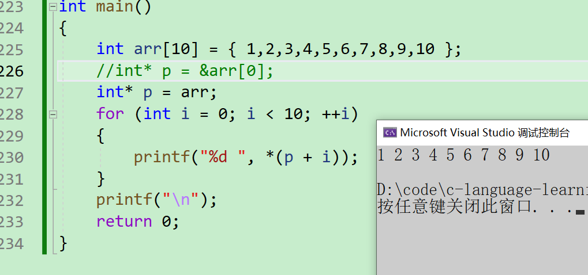

+ 也就是把我这个arr赋值给了p，所以我们在使用arr的时候可以换成p，使用p的时候可以换成arr。

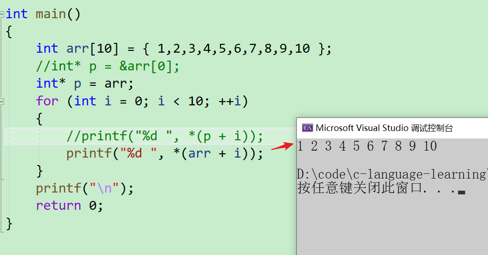

---

+ 在C语言中，数组名（如`arr`）表示该数组的首元素地址。
+ 当首元素地址向后偏移 `i` 个位置时，就到达了下标为 `i` 的元素所在的位置。通过对其进行解引用，就可以获取下标为 `i` 的元素。这可以表示为 `*(arr + i)`。
+ 对于数组访问操作符 `[]`，加法有交换律。将 `arr[i]` 转换为 `*(arr + i)` 时，括号中的操作数可以进行交换，变成 `*(i + arr)`。
+ 进一步推导，`*(i + arr)` 也可以写成 `i[arr]`。
+ 因此，`*(arr + i)` 可以等价于 `arr[i]`，同时也可以写成 `i[arr]`。
+ 那么`*(i + arr)`是否可以写成`i[arr]`

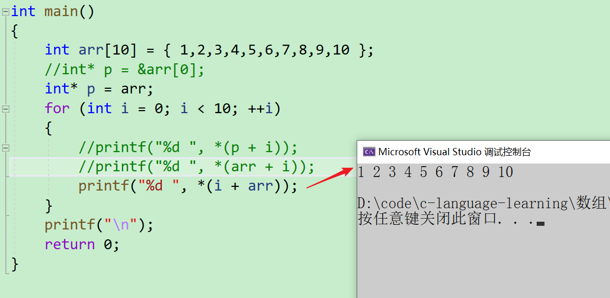

+ 那这里也可以写成`p[i]`

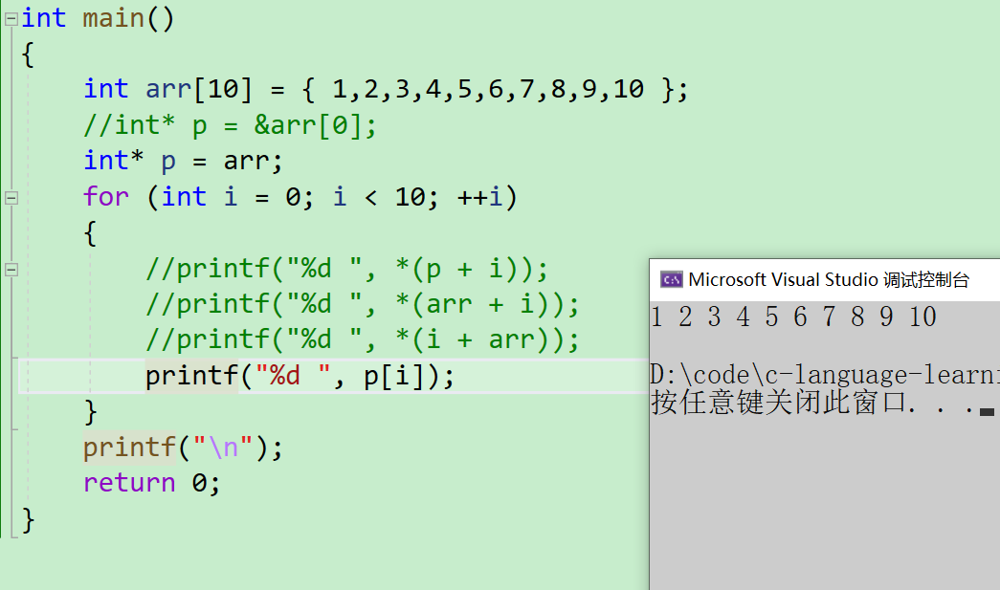

### 小结一下
```c
int main()
{
    int arr[10] = { 1,2,3,4,5,6,7,8,9,10 };
    int* p = arr;

    for (int i = 0; i < 10; ++i)
    {
        printf("%d ", arr[i]);
    }
    printf("\n\n\n");

    for (int i = 0; i < 10; ++i)
    {
        printf("%d ", *(arr + i));
    }
    printf("\n\n\n");

    for (int i = 0; i < 10; ++i)
    {
        printf("%d ", *(p + i));
    }
    printf("\n\n\n");

    for (int i = 0; i < 10; ++i)
    {
        printf("%d ", p[i]);
    }
    printf("\n\n\n");

    return 0;
}
```

> arr[i] == *(arr + i) == *(p + i) == p[i]
>

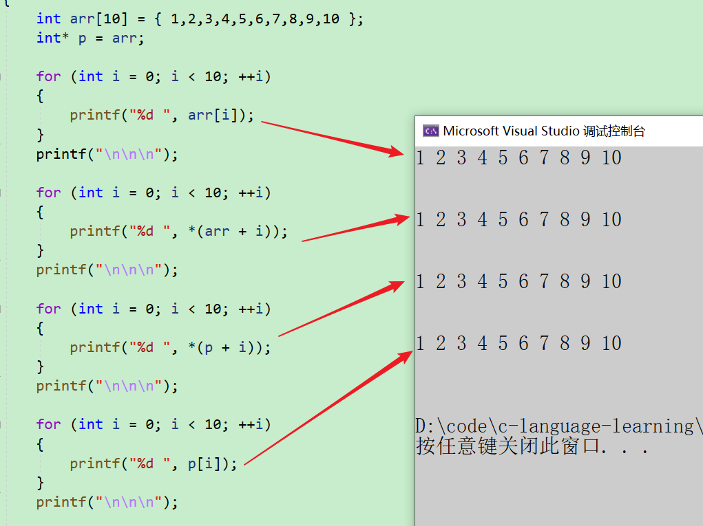

