## 前言
> Git（读音为/gɪt/）是一个开源的分布式版本控制系统，可以有效、高速地处理从很小到非常大的项目版本管理。也是Linus Torvalds为了帮助管理Linux内核开发而开发的一个开放源码的版本控制软件。
>

+ 先来检测以下git有没有安装

```bash
git --version
```

+ 如果提示的是这样的就说明没有安装

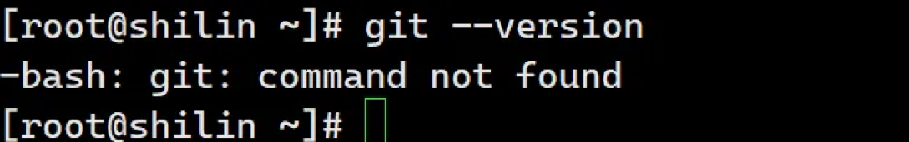

## 一、安装git
### Linux-centos
+ 执行以下命令，安装git

```shell
sudo yum install -y git
```

+ 如果执行失败的话就先更新一下系统

```bash
sudo yum update -y
```

+ 然后再检测是否安装成功

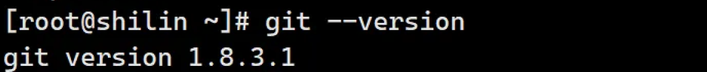

### Linux-ubuntu
```shell
sudo apt-get install git -y
```

## 二、git基本操作
### 2.1 初始化git
+ 安装好git后，我们就要创建一个本地仓库，就是要初始化一下

创建文件夹

```bash
mkdir gitcode
```

进入文件夹

```bash
cd gitcode/
```

初始化git

```bash
git init
```

查看是否初始化成功

```bash
ls -al
```

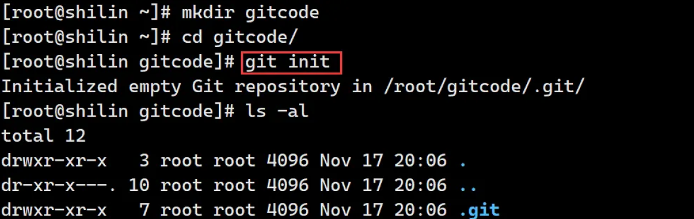

+ 查看隐藏文件`git`目录下，有什么文件

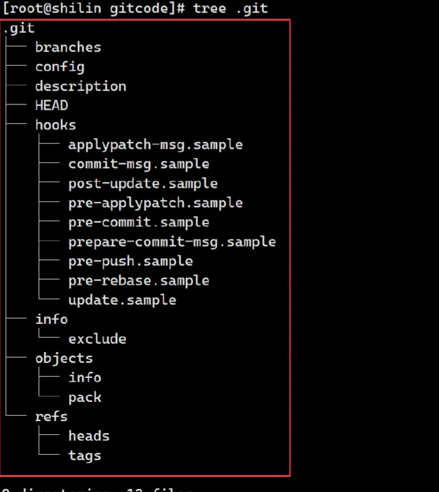

+ 我们需要设置邮箱和用户名【这里是局部生效的配置用户名和邮箱】

### 2.2 配置局部生效
配置用户名

```bash
git config user.name "shilin"
```

配置邮箱

```bash
git config user.email "intshanxi@163.com"
```

查看配置

```bash
git config -l
```

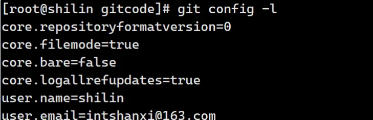

那我想要删除刚刚配置的，就可以执行以下命令

删除用户名

```bash
git config --unset user.name
```

删除邮箱

```bash
git config --unset user.email
```

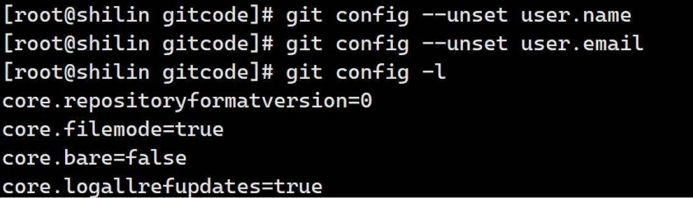

### 2.3 配置全局生效
+ 将配置项生效所有仓库配置项

配置用户名

```bash
git config --global user.name "intshanxi"
```

配置邮箱

```bash
git config --global user.email "intshanxi@163.com"
```

查看刚刚配置的

```bash
git config -l
```

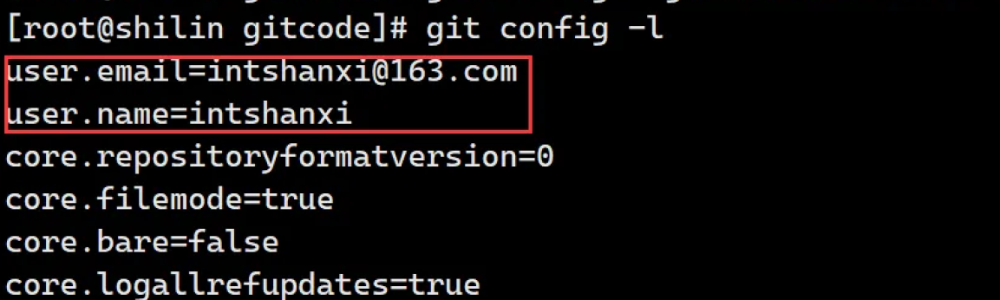

+ 那我想要删除刚刚配置的，就可以执行以下命令

删除用户名

```bash
git config --global --unset user.name
```

删除邮箱

```bash
git config --global --unset user.email
```

接下来我们就往这个仓库里生成一个文件

```bash
touch ReadMe
```

在目前情况下，git是不能管理这个文件的

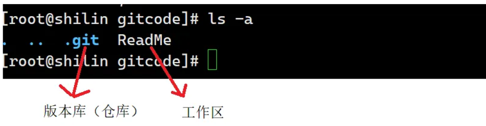

现在往git里添加了一点东西

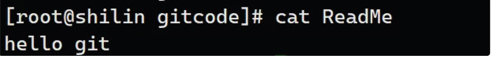

## 三、认识工作区、暂存区、版本库
### 3.1 添加文件场景一
我们就来看第一个步骤

```bash
git add 文件名
```

或者只写一个`.`，这个意思就是全部添加

+ 我们就来看第二个步骤

```bash
git commit -m '要描述的细节'
```

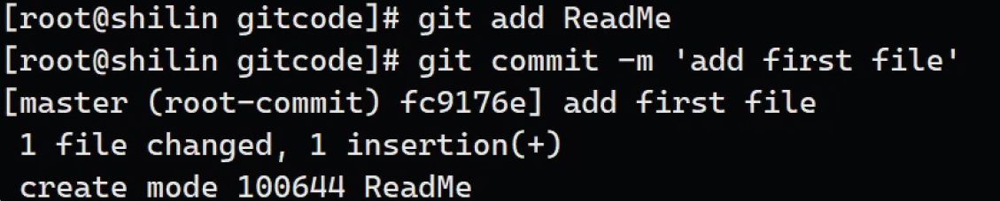

+ 创建多个文件

```bash
touch file1 file2 file3
```

+ 我们还可以用`.`来一键添加

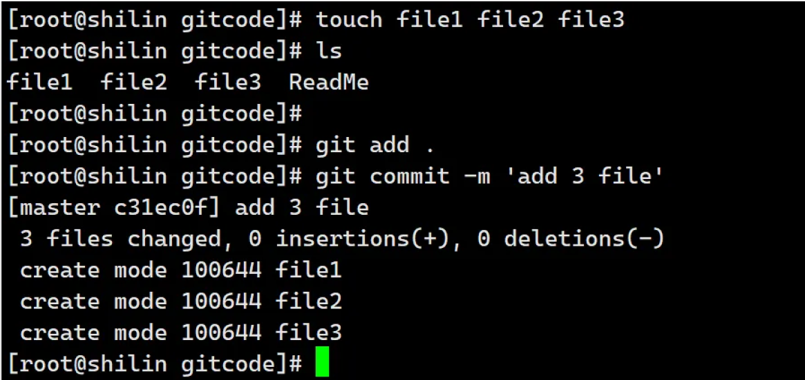

### 3.2 查看添加的文件
+ 还可以查看最近提交的日志

```bash
git log
```

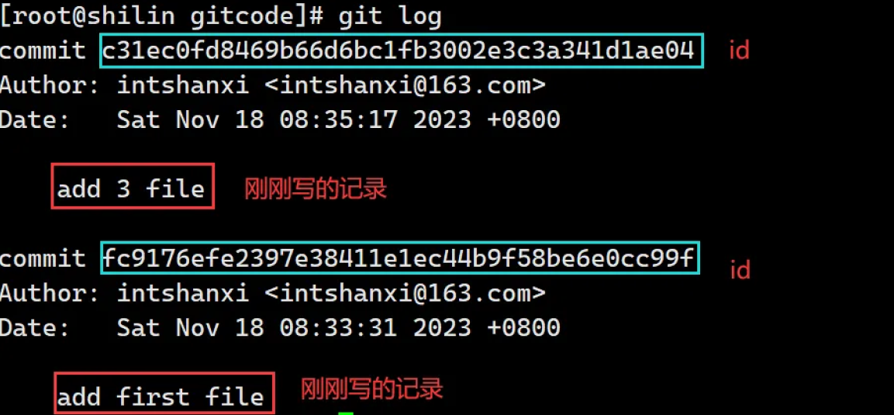

+ 我们还可以再打印的简单一点，方便观察

```bash
git log --pretty=oneline
```

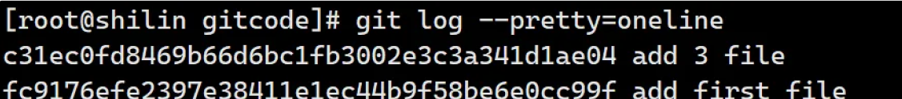

+ 查看git日志后，commit后面的一串字符是（安全哈希算法）加密过的文件

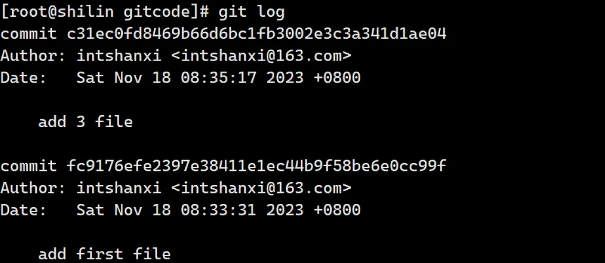

+ 我们可以通过命令来查看这个具体提交记录

```bash
git cat-file -p fc9176efe2397e38411e1ec44b9f58be6e0cc99f
```

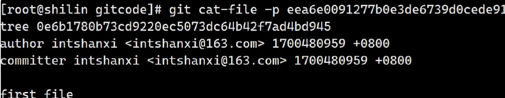

+ 在其中有一行`tree 0e6b1780b73cd9220ec5073dc64b42f7ad4bd945`
+ 然后再查看一下这个

```bash
git cat-file -p 0e6b1780b73cd9220ec5073dc64b42f7ad4bd945
```

+ 继续查看文件内容

```bash
git cat-file -p 8d0e41234f24b6da002d962a26c2495ea16a425f
```

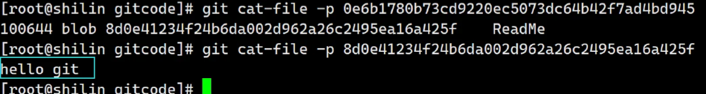

### 3.3 添加文件场景二
```bash
git add file4
touch file5
git commit -m 'add file4'
```

+ 这里虽然添加了两个文件，但是只有`file4`添加到了暂存区，提交修改的时候只有file4发生了变化，而`file5`没有发生变化

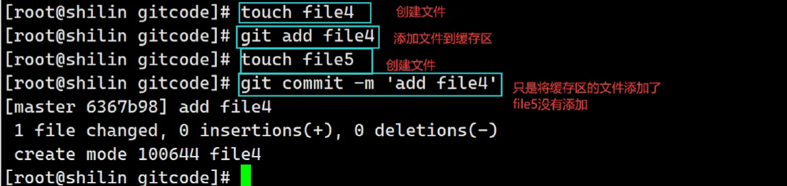

### 3.4 查看.git文件
```c
.git
├── branches
├── COMMIT_EDITMSG
├── config
├── description
├── HEAD
├── hooks
│   ├── applypatch-msg.sample
│   ├── commit-msg.sample
│   ├── fsmonitor-watchman.sample
│   ├── post-update.sample
│   ├── pre-applypatch.sample
│   ├── pre-commit.sample
│   ├── pre-merge-commit.sample
│   ├── prepare-commit-msg.sample
│   ├── pre-push.sample
│   ├── pre-rebase.sample
│   ├── pre-receive.sample
│   └── update.sample
├── index
├── info
│   └── exclude
├── logs
│   ├── HEAD
│   └── refs
│       └── heads
│           └── master
├── objects
│   ├── 6e
│   │   └── 84d6a5ed71a327ba3376cac9801558d9ea2e80
│   ├── 8d
│   │   └── 0e41234f24b6da002d962a26c2495ea16a425f
│   ├── 9f
│   │   └── 0dc416964420ba338ef412da234ac36891a29f
│   ├── info
│   └── pack
└── refs
    ├── heads
    │   └── master
    └── tags

15 directories, 24 files
```

1. index就是暂存区，add后的内容在这里面
2. HEAD是默认指向master分支的指针

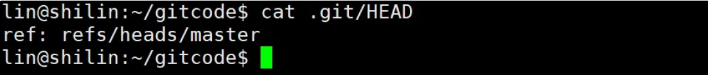

默认的master分支是

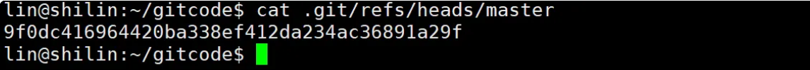

也就是最新的一次提交

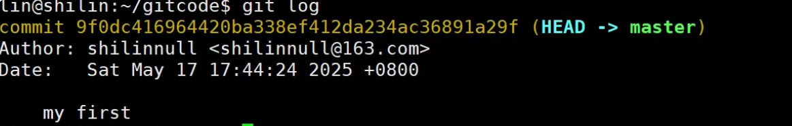

3. object为Git对象库，里面包含了各种版本库对象以及内容

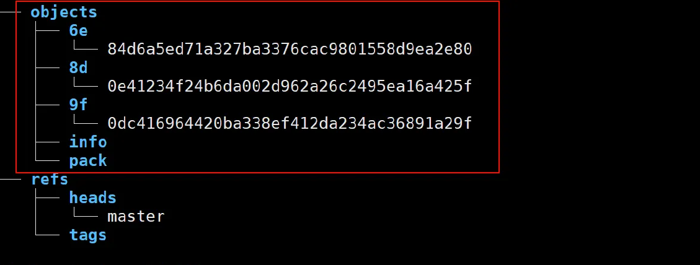

查找`object`时要将`commit id`分成2部分，其前2位是文件夹名称，后38位是文件名称。

找到这个文件之后，一般不能直接看到里面是什么，该类文件是经过 sha （安全哈希算法）加密过的文件，好在我们可以使用 git cat-file 命令来查看版本库对象的内容：

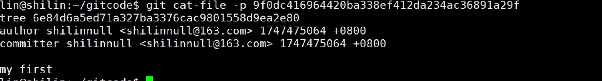

## 四、修改文件
+ git其实管理的是修改，而不是文件
+ 我们先修改了`ReadMe`

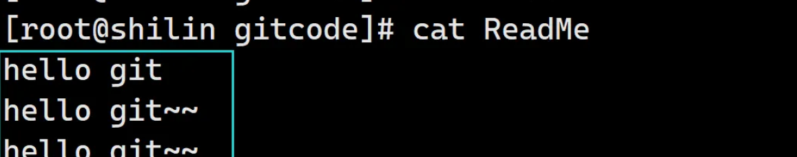

### 4.1 查看工作区的状态
+ 我们查看当前工作区的状态

```bash
git status
```

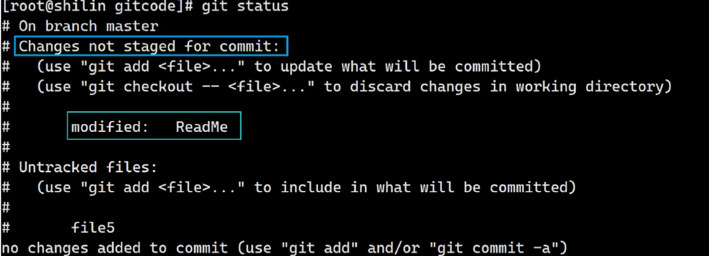

+ 那我们想查看修改了哪些内容呢？

```bash
git diff 文件名
```

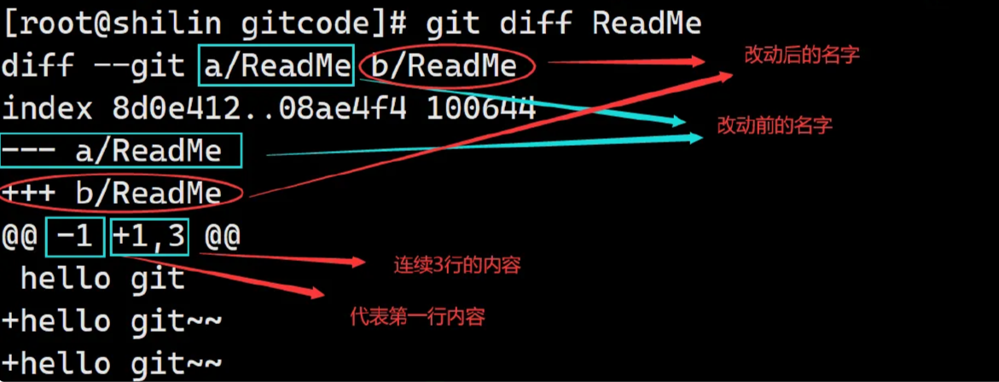

+ 这个时候我们再提交一下

```bash
git add ReadMe
```

+ 查看状态

```bash
git status
```

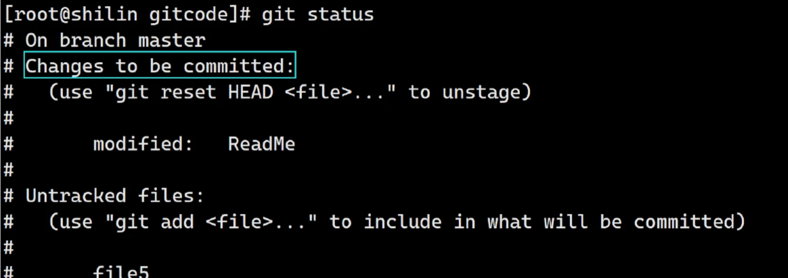

+ 这个时候就再提交

```bash
git commit -m 'add modify ReadMe file'
```

+ 再查看

```bash
git status
```

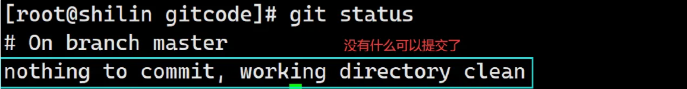

## 五、版本回退
+ 刚开始文件里的内容只有一行，后来添加了两行
+ 对于这个文件来说是有两个版本的

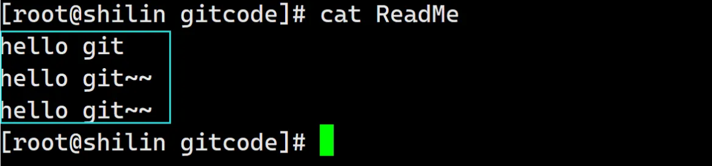

+ 这里的回退命令是`git reset`可以指定某一次提交的版本
+ git reset 命令语法格式为： `git reset [--soft | --mixed | --hard] [HEAD]	`
    - --mixed 为默认选项，使⽤时可以不用带该参数。该参数将暂存区的内容退回为指定提交版本内容，工作区文件保持不变。
    - --soft 参数对于工作区和暂存区的内容都不变，只是将版本库回退到某个指定版本。
    - --hard 参数将暂存区与工作区都退回到指定版本。切记工作区有未提交的代码时不要用这个命令，因为工作区会回滚，你没有提交的代码就再也找不回了，所以使用该参数前一定要慎重。
+ HEAD 说明：  
◦ 可直接写成 commit id，表示指定退回的版本  
◦ HEAD 表示当前版本  
◦ HEAD^ 上一个版本  
◦ HEAD^^ 上上一个版本  
◦ 以此类推...
+ 可以使用 ～数字表示：  
◦ HEAD~0 表示当前版本  
◦ HEAD~1 上一个版本  
◦ HEAD^2 上上一个版本  
◦ 以此类推...

---

+ 查看日志

```bash
git log --pretty=oneline
```

+ 回退到最初版本

```bash
git reset --hard eea6e0091277b0e3de6739d0cede91333284b6e7
```

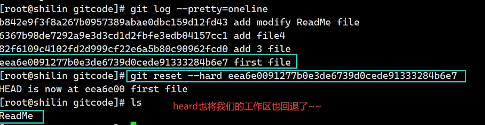

+ 可以看到一旦回到这一次，我们后面创建的文件都会被删除
+ 我们再来看文件的内容

```bash
cat ReadMe
```


+ 查看日志

```bash
git log --pretty=oneline
```

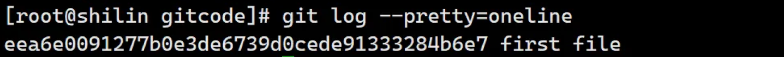

+ 那有人说我又后悔了怎么办？
+ 想要再回退回去
+ 我们刚刚打印过这一个最新的版本我们就回退到这个版本

```bash
git reset --hard b842e9f3f8a267b0957389abae0dbc159d12fd43
```

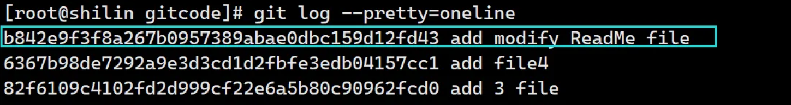

+ 我们再来看一下当前目录下
+ 文件回来了，文件里的内容也会来了

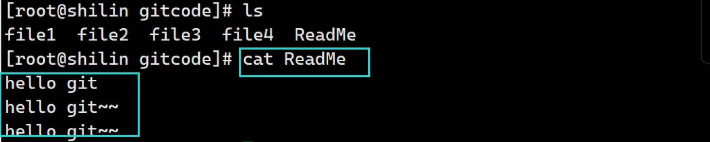

+ 再来打印这个日志
+ 这个log也回来了

```bash
git log --pretty=oneline
```

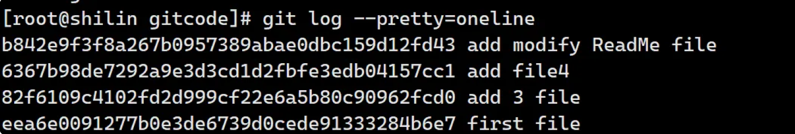

+ 那我回退了最初的版本后，找不到那个字符串了怎么办？
+ 我们还有一种方法

---

+ 查看

```bash
git reflog
```

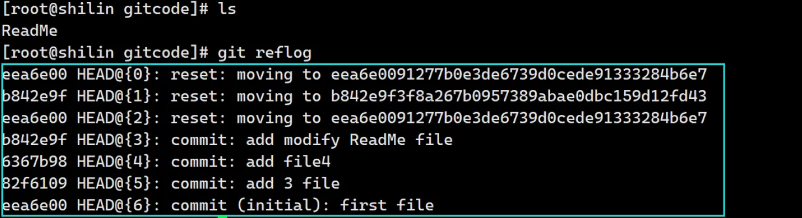

+ 回退版本

```bash
git reset --hard b842e9f
```

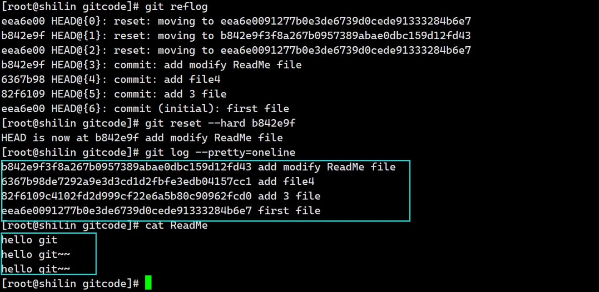

+ 这样就可以回退回去了

那么这里的版本回退为什么会这么快呢？

+ 是因为有一个`HEAD`指针

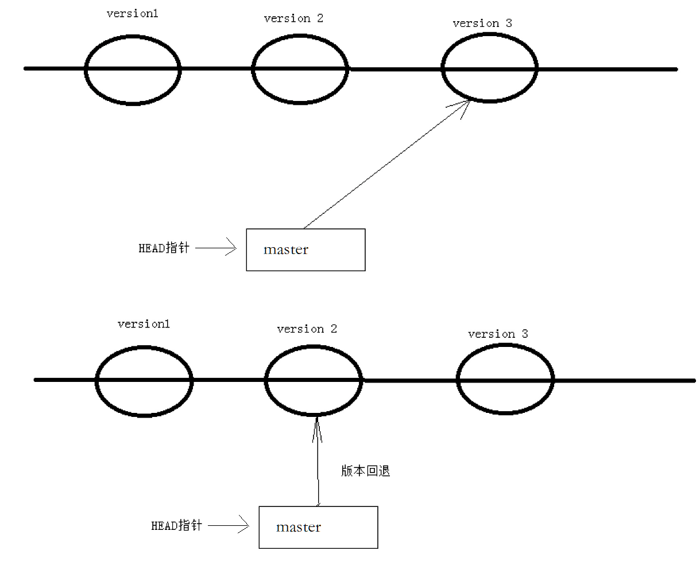

## 六、撤销修改
### 6.1 情况一：对于工作区的代码，还没有add
+ 我们先对ReadMe进行修改

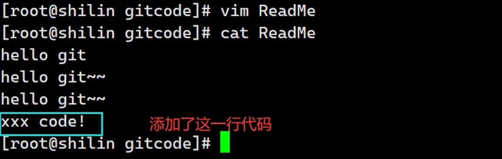

+ 我们想撤销我们的代码，我们可以重新再次编辑删除掉那一行代码，就可以了
+ 那写了很多呢？想一次性撤销，那怎么办呢？
+ 查看修改了哪些内容

```bash
git diff ReadMe
```

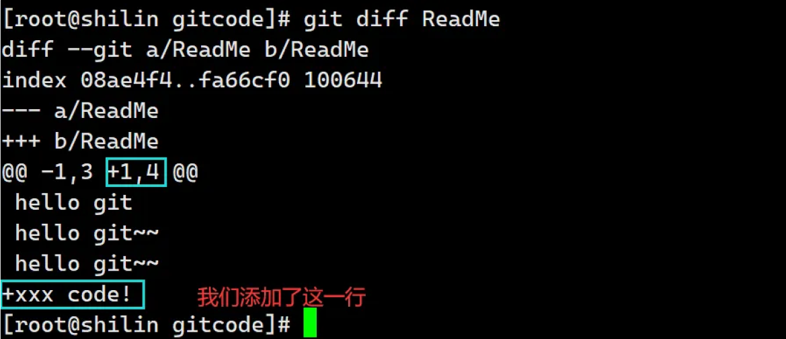

+ 想要一次撤销，我们执行以下命令

```bash
git checkout -- ReadMe
```

+ 这里的`--`就是回退到最近一次add或者commit的操作，不能省略`--`
+ 我们再次打印，新增的那一行就没有了

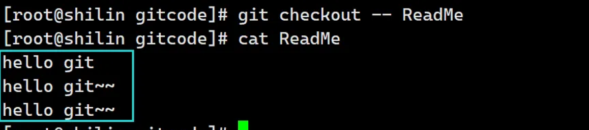

### 6.2 情况二：已经add ，但没有commit
+ add 后还是保存到了暂存区呢？怎么撤销呢？

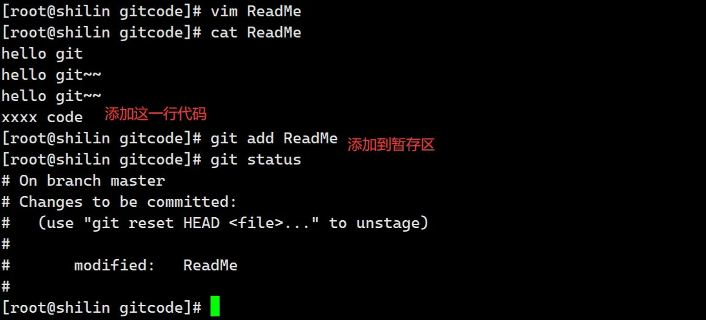

让我们来回忆一下学过的`git reset`回退命令，该命令如果使用 `--mixed` 参数，可以将暂存区的内容退回为指定的版本内容，但工作区文件保持不变。那我们就可以回退下暂存区的内容了！！！

```bash
git reset HEAD ReadMe
```

+ `HEAD`代表当前版本
+ `HEAD^`代表上一个版本
+ `HEAD^^`代表上一个版本

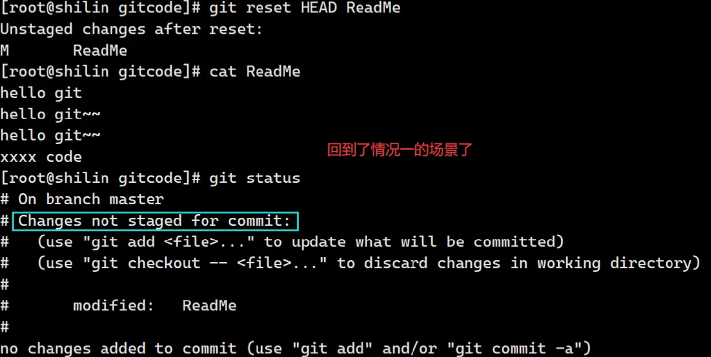

+ 这个时候再进行情况一的回退

```bash
git checkout -- ReadMe
```

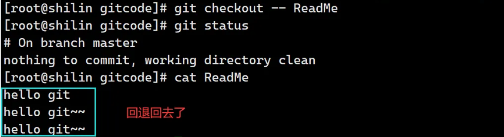

### 6.3 情况三：已经add ，并且也commit 了
+ 我们可以`git reset --hard HEAD^ `回退到上一个版本。

```bash
git reset --hard HEAD^
```

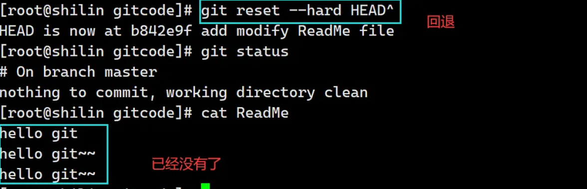

## 七、删除文件
直接删除版本库中的文件：

```bash
git rm file
```

然后再进行`add`、`commit`就可以了

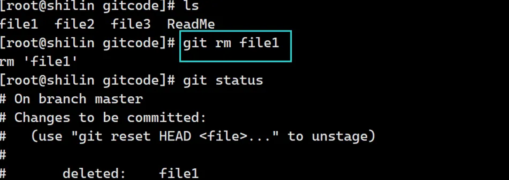

