## 新建远程仓库克隆
+ 首先就是要先注册一个自己的账号
+ 然后新建仓库


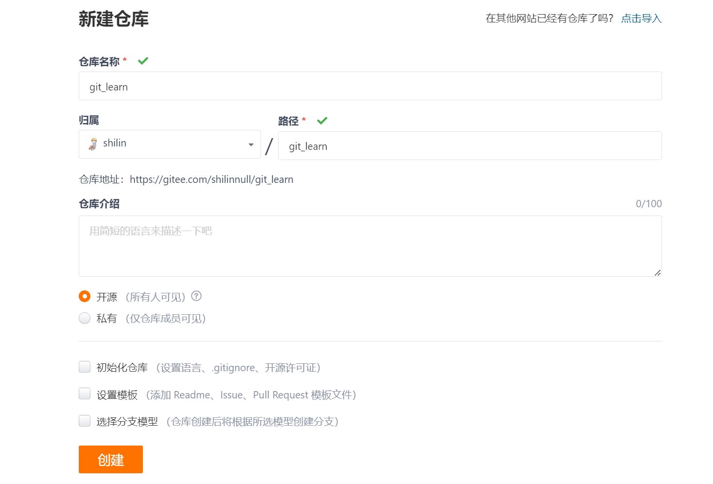

+ 这里有两种方法来clone仓库到本地，一个是`https`一个是`ssh`
+ 我们不使用`https`,原因是https比较简单
    - 首先就是配置用户名和邮箱然后然后直接使用这个命令`git clone 仓库链接`
+ 接下来我们就使用这个`ssh`来配置一下
    - 使用ssh方式克隆仓库，由于我们没有添加公钥到远端库中，所以会克隆失败，这里就不演示了，接下来我们就开始配置一下如何将公钥添加
+ 首先打开设置->ssh公钥->公钥
+ 那么这里的公钥在哪里获取呢，当然是在自己的电脑或者远端服务器上获取

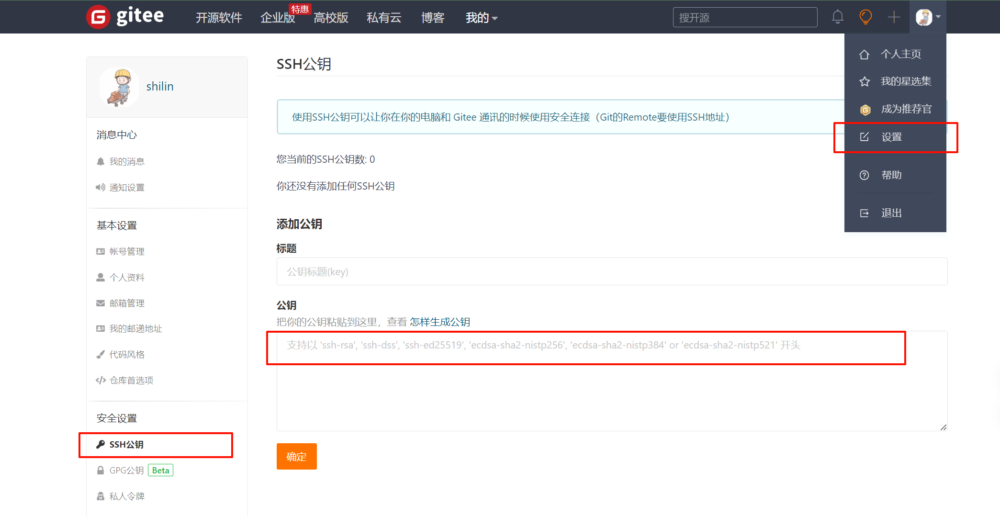

+ 我这里就在自己电脑上演示了，远端服务器获取也是一样的
+ 输入一下命令，**注意：** 这里`""`改成自己的邮箱

```c
ssh-keygen -t ed25519 -C "yourmail"
```

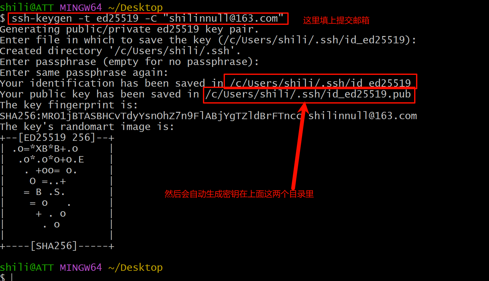

+ 然后会在上图的地址会显示地址，找到这个文件夹就可以了，其中第二个带有`.pub`的后缀是公钥，我们用记事本打开复制里面的内容

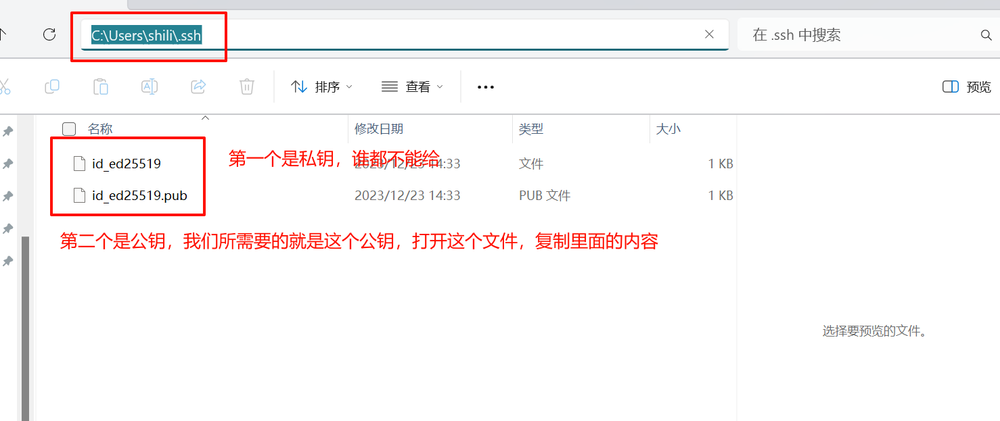

+ 然后粘贴到刚刚的那个网站的公钥栏里就可以了，标题随便写就可

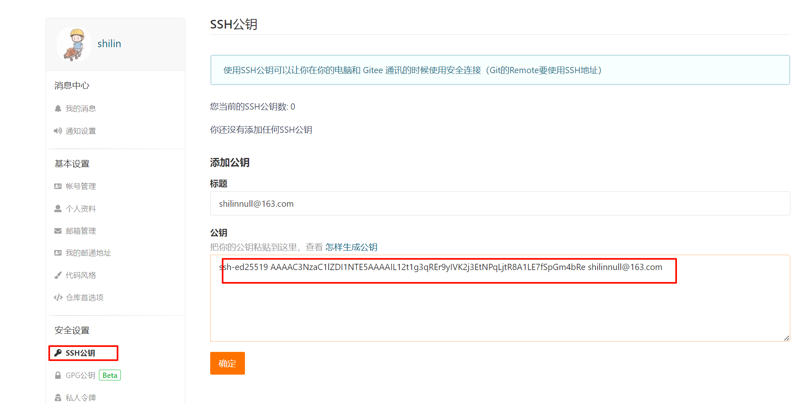

+ 最后再使用ssh的方式克隆

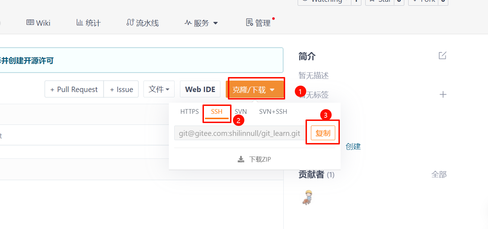

+ OK，可以看到已经成功了
+ 在本地我们可以使用`git remote`命令，来查看远程库的信。
+ 或者，用`git remote -v`显示更详细的信息。

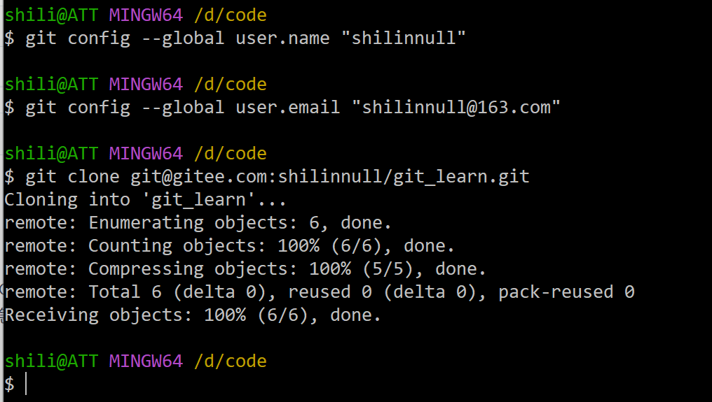

### 推送【push】
+ 我们对仓库里的文件进行修改

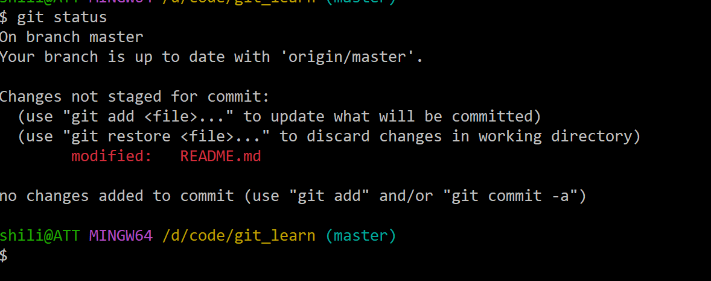

+ 然后进行添加

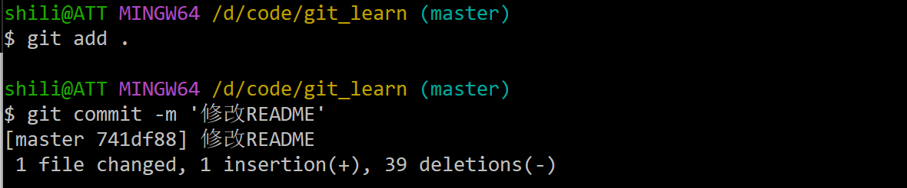

+ 最后一个关键的步骤，就是`push`

```shell
git push origin master
```

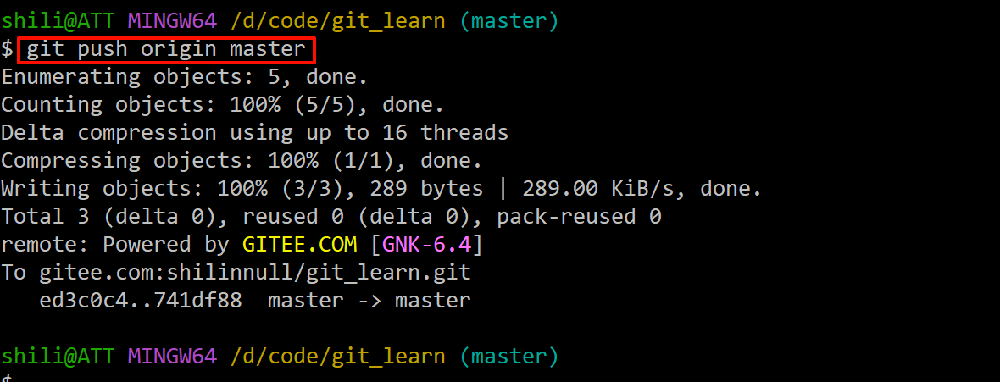

+ 然查看远端仓库，可以看到已经被修改了

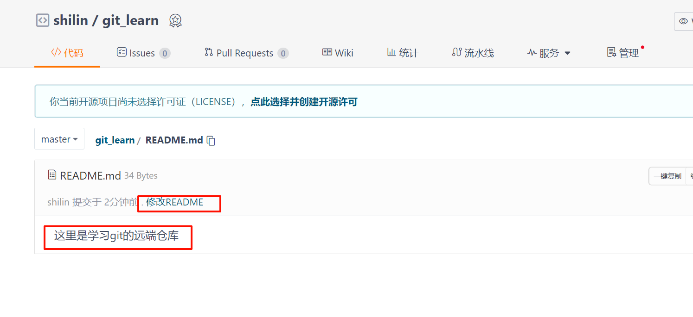

### 拉取【pull】
+ 我们首先对远端仓库直接进行了修改

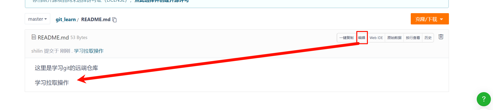

+ 而我们这次又对本地又进行了修改，然后再添加

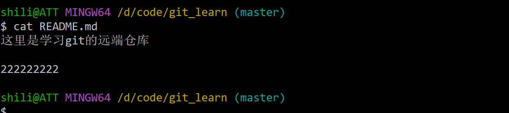

+ 最后进行提交操作，发现是无法提交的，会有冲突

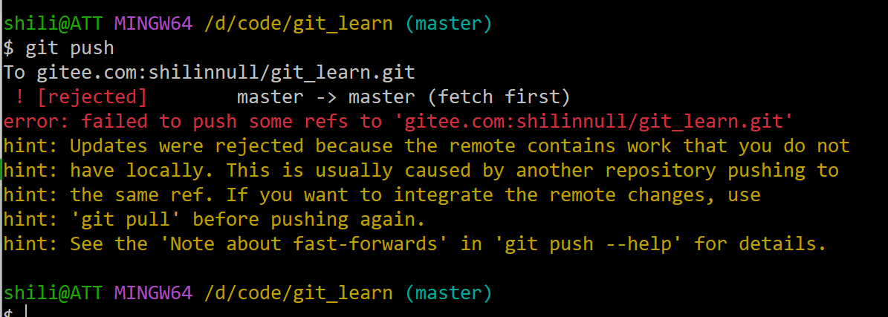

+ 这个时候就需要我们首先对远端仓库进行拉取

```shell
git pull origin master
```

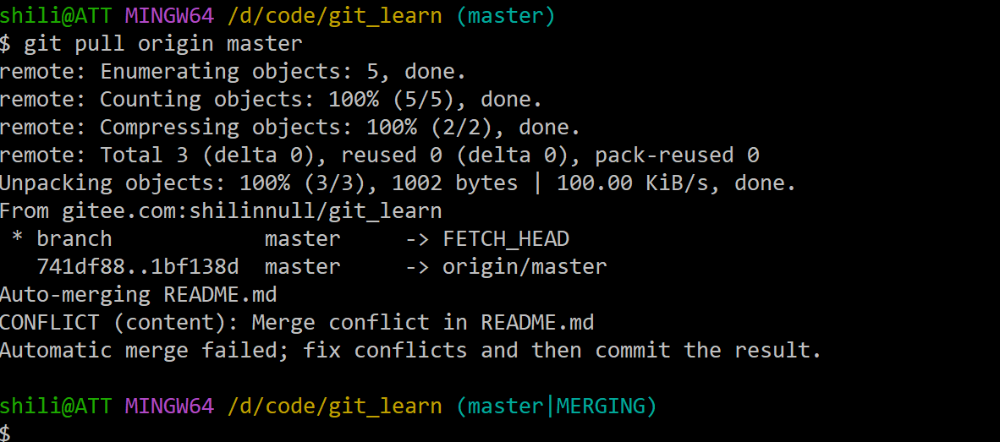

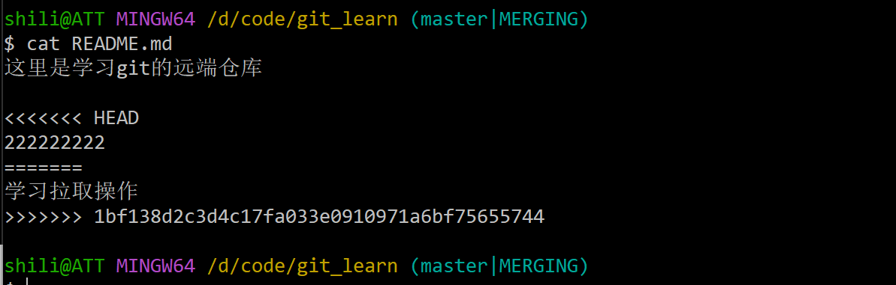

+ 这里又回到冲突那里了，然后我们需要进行手动修改一下然后再进行提交

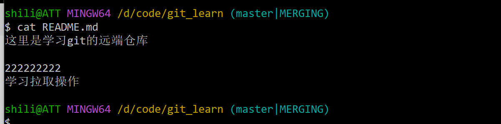

+ 然后再进行添加提交操作

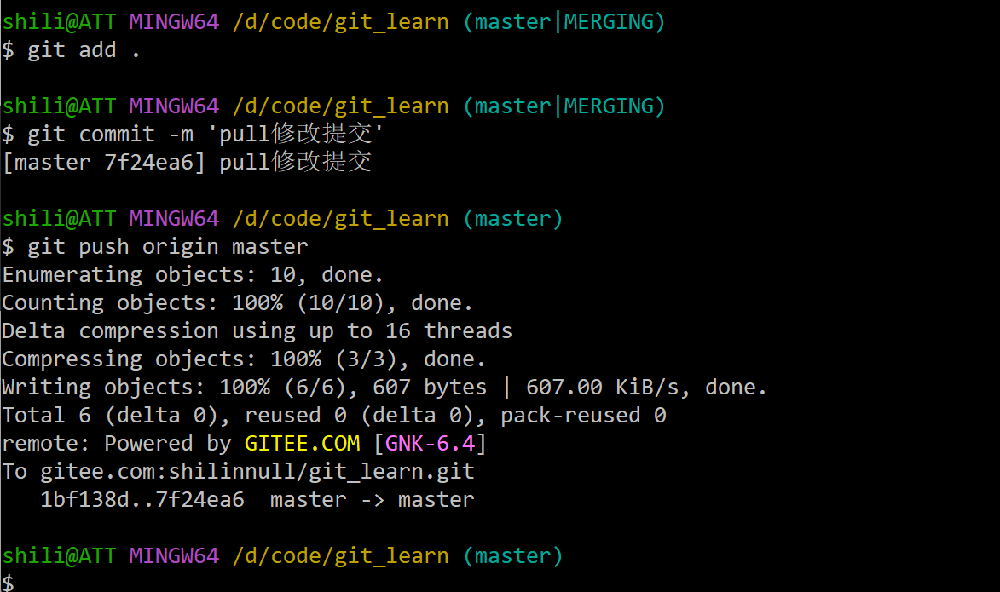

+ 可以看到也已经是有了

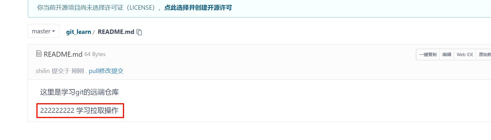

## 配置git
### 忽略特殊文件
+ 在日常开发中，我们有些文件不想提交到远程仓库，那么怎么做呢？
    - 这个时候我们就需要在自己仓库的根目录下建立一个特殊的文件`.gitignore`，把需要忽略的文件名填进去，git提交的时候就会自动忽略这些文件了~~
+ 我们来演示一下
+ 这里的`*`代表是通配符，也就是将后缀`.txt`的文件都忽略

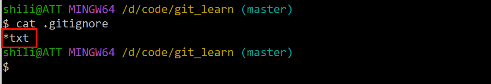

+ 我们查看一下git的状态，可以看到是没有`文本.txt`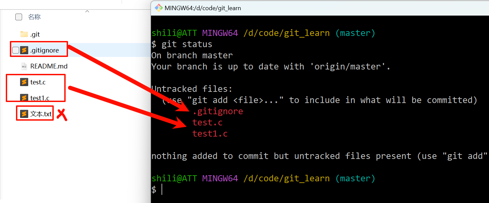
+ 再次添加后提交

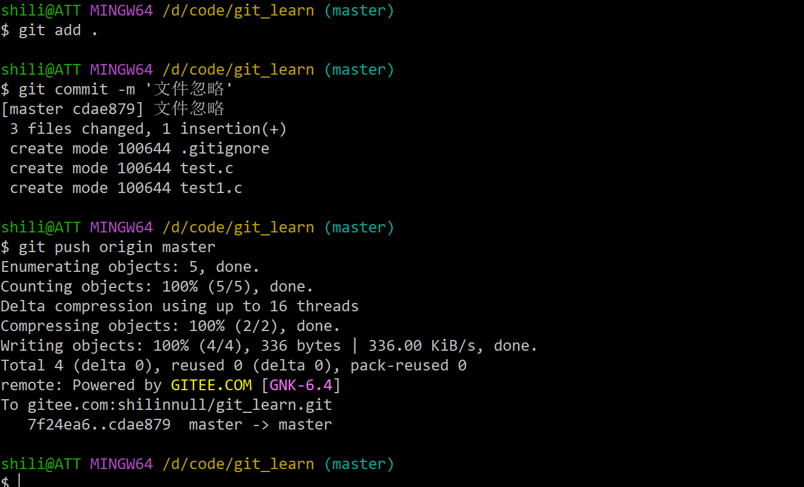

+ 来到我们的远程仓库查验证一下

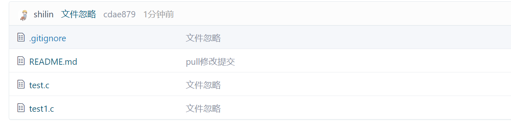

+ 但有些时候，你就是想添加⼀个文件到 Git，但由于这个文件被 .gitignore 忽略了，根本添加不了，那么可以⽤ -f 强制添加：

```bash
git add -f [filename]
```

+ 或者你发现，可能是`.gitignore`写得有问题，需要找出来到底哪个规则写错了，比如说`a.so`文件  
是要被添加的，可以用`git check-ignore -v`命令检查：

```bash
git check-ignore -v file.txt
```

+ Git会告诉我们， `.gitignore`的第几行规则忽略了该⽂件，于是我们就可以知道应该修订哪个规则。

还有些时候，当我们编写了规则排除了部分文件时，例如：

```bash
# 排除所有.开头的隐藏⽂件:
.*
```

+ 但是我们发现`.*`这个规则把`.gitignore`也排除了。虽然可以⽤`git add -f`强制添加进去，但还是希望不要破坏`.gitignore`规则，这个时候，可以添加⼀条例外规则：

```bash
# 排除所有.开头的隐藏⽂件:
.*

# 不排除.gitignore
!.gitignore
```

+ 把指定文件排除在`.gitignore`规则外的写法就是 `!`+文件名，只需把例外文件添加进去即可。

### 给命令配置别名
+ 在使用git的时候，我们有的时候使用命令太长太麻烦了，我们可以将git命令进行重命名成一个简短的，我们这样操作：
+ 比如我们将`git status`简写成`git st`
+ 这里的`alias.`改成自己想要改成的名字

```bash
git config --global alias.st status
```

+ `--global`参数是全局参数，也就是这些命令在这台电脑的所有Git仓库下都有用。如果不加，那只针对当前的仓库起作用
+ 这样就可以进行重命名成功了，原来的名字也是可以用的

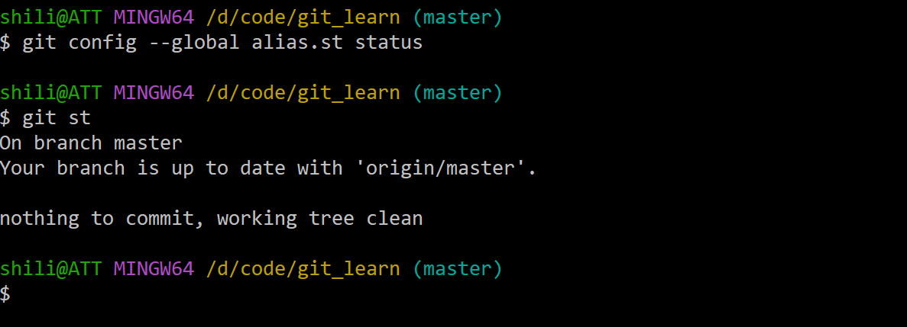

## 标签管理
### 理解标签
+ 这个标签，我们可以简单理解是对某一次的`commit`的一个标识，也就是相当于起了一个别名
+ 对于难以记住的`commit id`，tag就可以很好的解决这个问题，标签就可以定位到某一个重要的版本，使用标签就可以快速定位到那个版本，这样就很方便快捷。

### 创建标签
+ 首先查看一下在哪个分支上，如果需要打标签到哪个分支上就要切换到哪个分支上

```bash
git branch
```

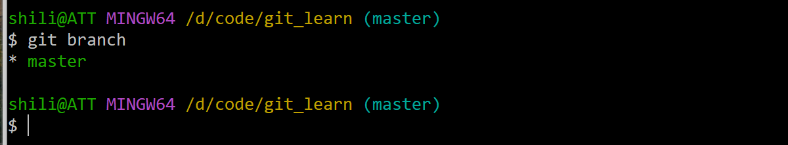

+ 然后就可以打标签了`tag`后面跟上标签名字就可以。

```bash
git tag v1.0
```

+ 打完标签肯定是要查看一下。

```bash
git tag
```

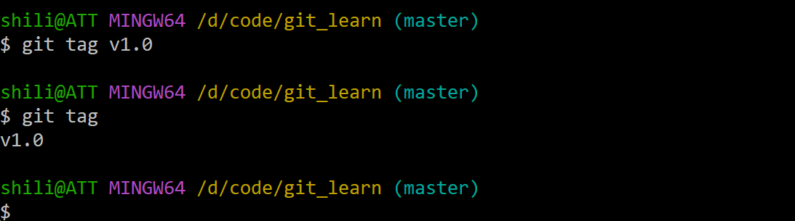

+ 这个标签是没有指定打到哪个`commit id`上的，所以就是默认，默认就是打在最新提交的`commmit`上的
+ 那么我们要在指定`commit id`上打标签，我们可以在后面跟上`commit id`

```bash
git tag v0.9 741df88
```

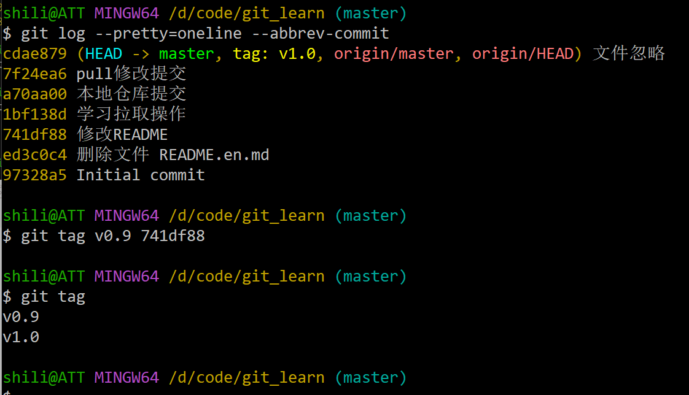

**注意：** 这里的标签可不算按照时间列出的，是按照字母进行排序的

+ 我们还可以查看标签信息：`show`后面跟上标签名字，就可以查看具体信息了

```bash
git show v1.0
```

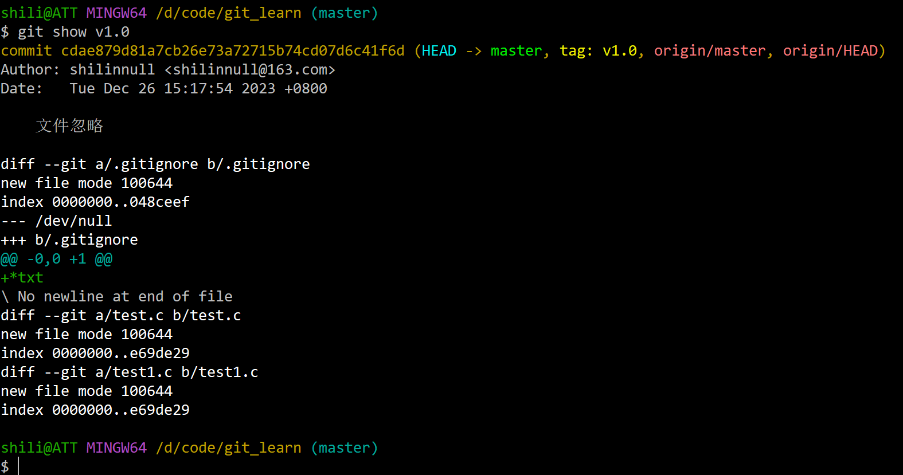

+ 我们这里还可以指定带有说明的标签，-a指定别名，-m指定说明文字

```bash
git tag -a [name] -m "XXX" [commit_id]
```

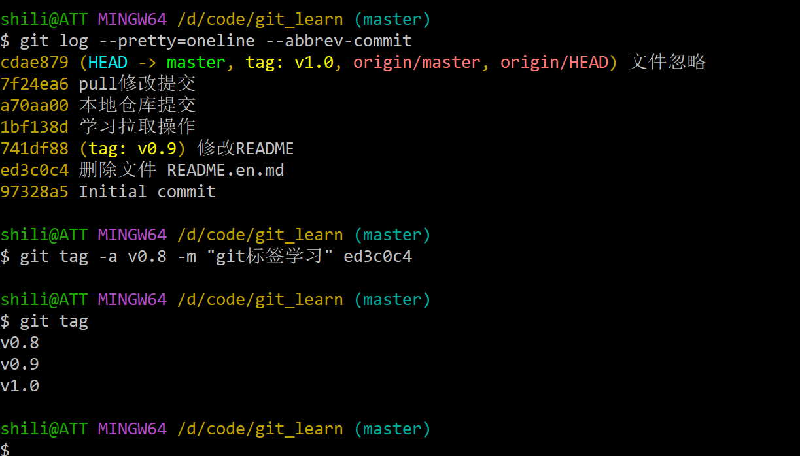

### 操作标签
+ 如果标签打错了，我们还可以删除 `-d`后面跟上标签名字

```bash
git -d v0.8
```

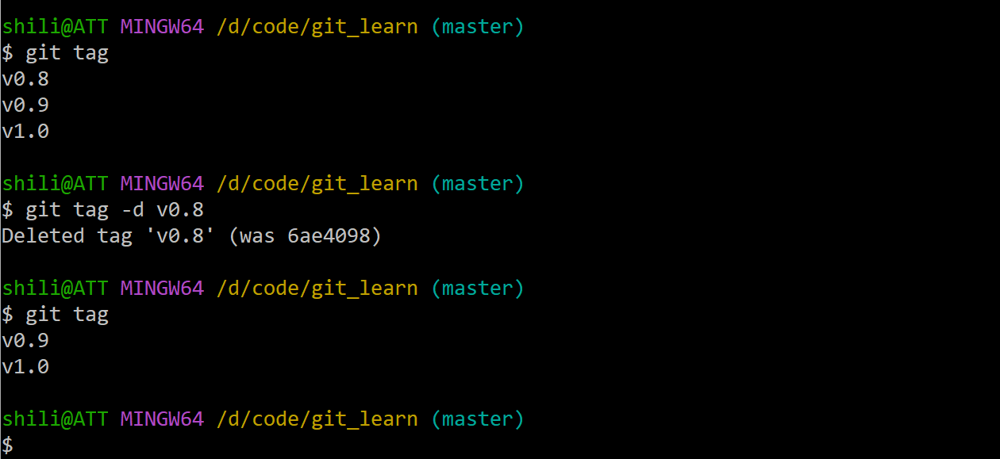

+ 因为创建的标签都只存储在本地，不会⾃动推送到远程。所以，打错的标签可以在本地安全删除。
+ 如果要推送某个标签到远程，可以使用命令

```bash
git push origin <tagname>
```

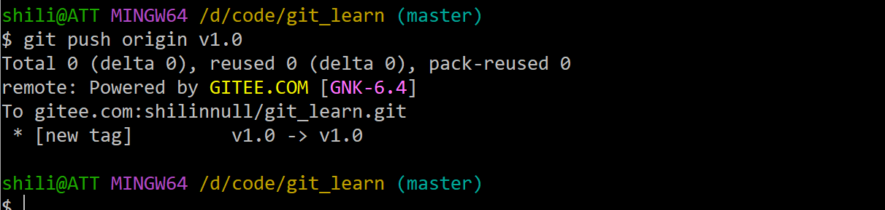

+ 我们查看远程仓库，可以看到已经推送成功了

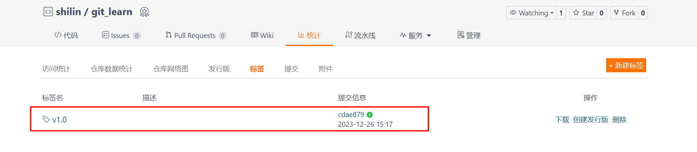

+ 如果本地仓库有很多标签，可以一次性全部推送到远端

```bash
git push oringe --tags
```

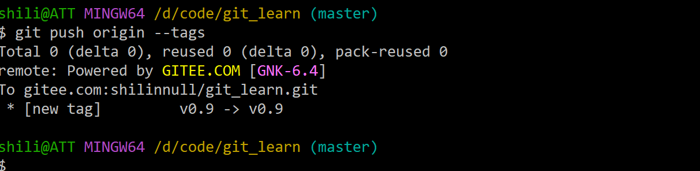

+ 也是相当的完美已经推送上去了

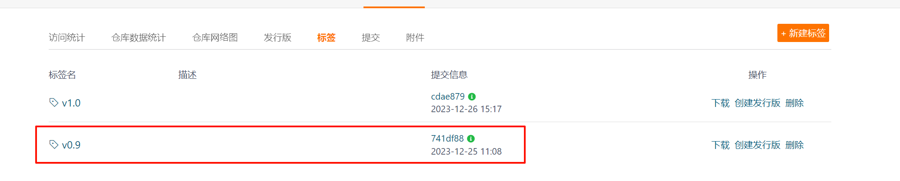

+ 如果要进行删除标签，就要先从本地仓库里删除，然后再推送一次，进行更新
+ 冒号后面跟上标签的名字即可

```bash
git push origin :v0.9
```

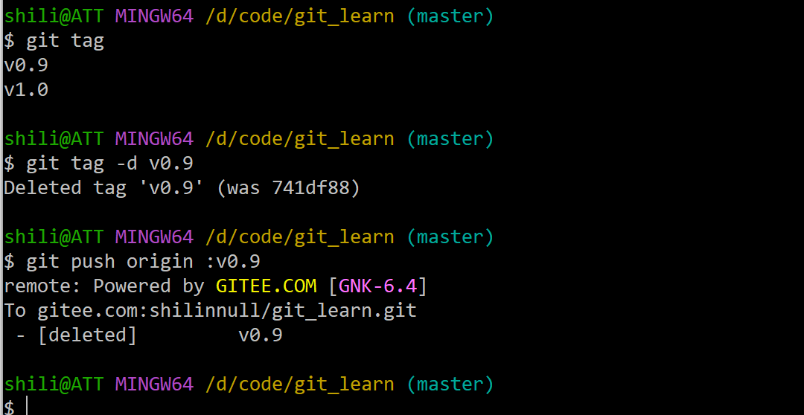

+ 我们再次来远端仓库
+ 已经完美删除了

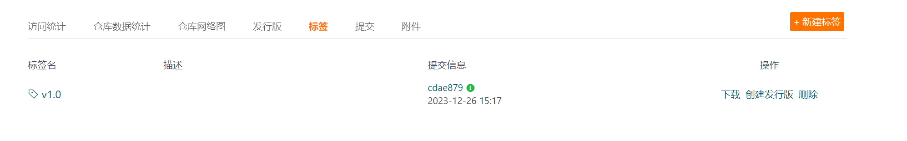

