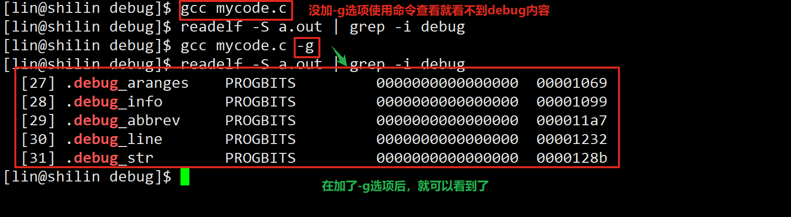
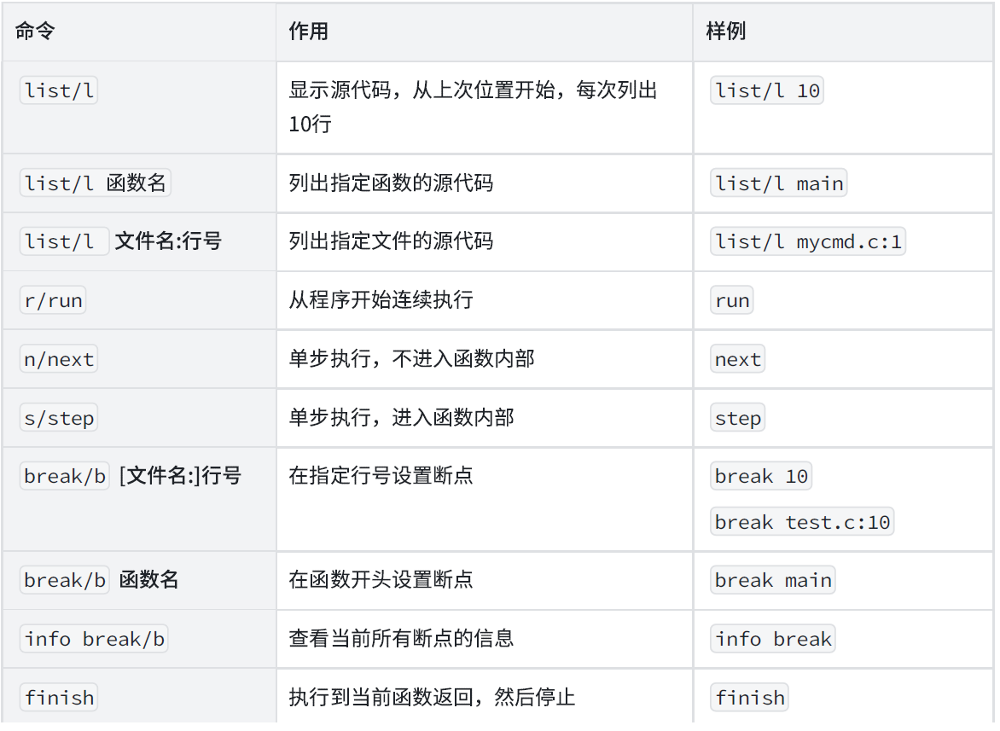
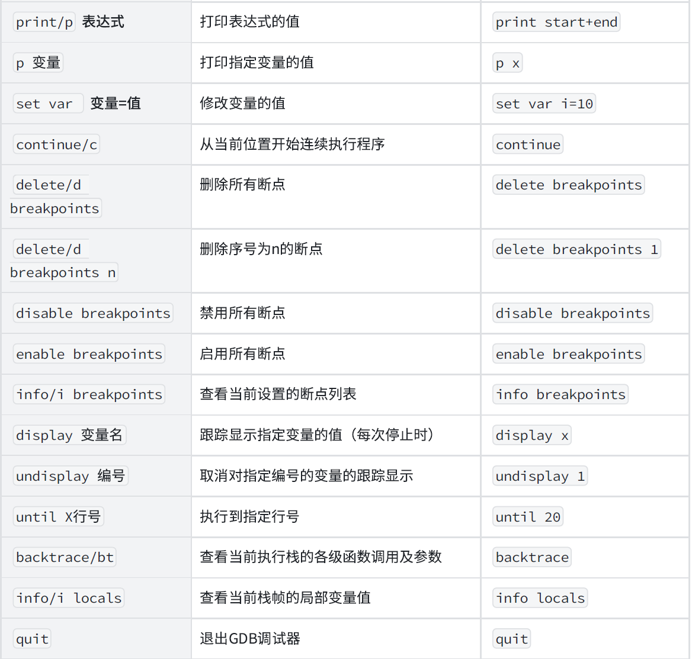
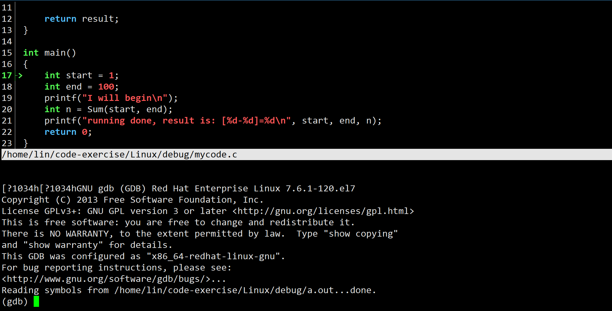

# Linux下调试器gdb/cgdb使用
# 一、样例代码
```c
#include <stdio.h>

int Sum(int s, int e)
{
    int result = 0;
    int i;
    for(i = s; i <= e; i++)
    {
        result += i;
    }

    return result;
}

int main()
{
    int start = 1;
    int end = 100;
    printf("I will begin\n");
    int n = Sum(start, end);
    printf("running done, result is: [%d-%d]=%d\n", start, end, n);
    return 0;
}
```

+ 程序的发布方式有两种， `debug`模式和`release`模式， Linux`gcc/g++`出来的二进制程序，默认是`release`模式。
+ 要使用gdb调试，必须在源代码生成二进制程序的时候, 加上`-g`选项，如果没有添加，则程序无法被编译



# 二、使用
进入调试

```shell
gdb binFilename
```



推荐使用cgdb可以看到代码进行调试

+ Ubuntu: `sudo apt-get install -y cgdb`
+ Centos: `sudo yum install -y cgdb`



## watch
+ 执行时监视一个表达式（如变量）的值。如果监视的表达式在程序运行期间的值发生变化，GDB会暂停程序的执行，并通知使用者
+ 如果你有一些变量不应该修改，但是你怀疑它修改导致了问题，你可以watch它，如果变化了，就会通知你.

```c
watch result
```

## set var确定问题原因
在调试的监视窗口要手动改变一个变量的值就可以使用`set var`
- eg：set var flag=1

## 条件断点
条件断点添加常见两种方式：

1. 新增 
2. 给已有断点追加
+ 注意两者的语法有区别，不要写错了。
+ 新增：b 行号/文件名：行号/函数名 `if i == 30`(条件)
+ 给已有断点追加：`condition 2 i==30`，其中2是已有断点编号，没有if

**添加条件断点**

eg：`b 9 if i == 30` ，其中9是行号，表示新增断点的位置

**给已经存在的端点新增条件**

eg：`condition 2 i==30`，其中给2号断点，新增条件`i==30`


