# Linux使用gcc查看C语言编译过程以及动静态库的区分
## 一、使用gcc/g++
+ 首先检查自己的linux机器有没有安装

```bash
gcc --version
```

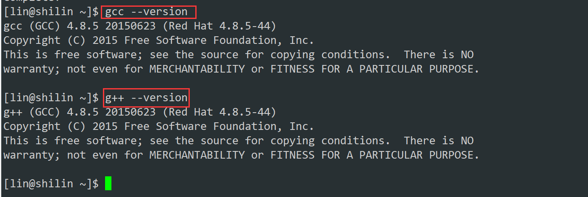

+ 没有安装的话执行下面命令以安装**gcc** 和 **g++**

```bash
sudo yum install -y gcc-c++
```

+ CentOS 7默认匹配的gcc版本是4.8
+ gcc是一个**专门用来编译链接C语言的编译器**，而**g++是一个专门用来编译链接C++的编译器**。
+ **C++是兼容C语言的，可以直接用g++来编译C语言**，但是**不能用gcc来编译C++，因为C语言不兼容C++**

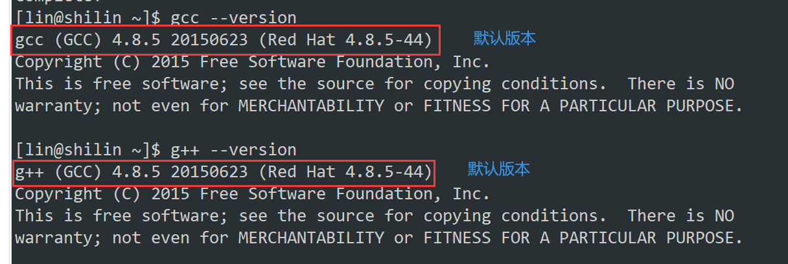

## gcc如何完成编译后生成可执行文件？
> **gcc [选项] 要编译的文件 [选项] [目标文件]**
>

### 预处理(进行宏替换)
+ 预处理功能主要包括**宏定义，文件包含，条件编译，去注释等**
+ 预处理指令是以`#`号开头的代码行

```bash
gcc -E test.c -o test.i
```

+ 选项 “-E” ，该选项的作用是让`gcc`在预处理结束后停止编译过程。（也就是说：从现在开始进行程序的翻译，如果预处理完成，就停下来了）
+ 选项 “-o” 是指目标文件，“.i” 文件为已经过预处理的C原始程序。

**下面我们看一段代码进行预处理后的情况：**

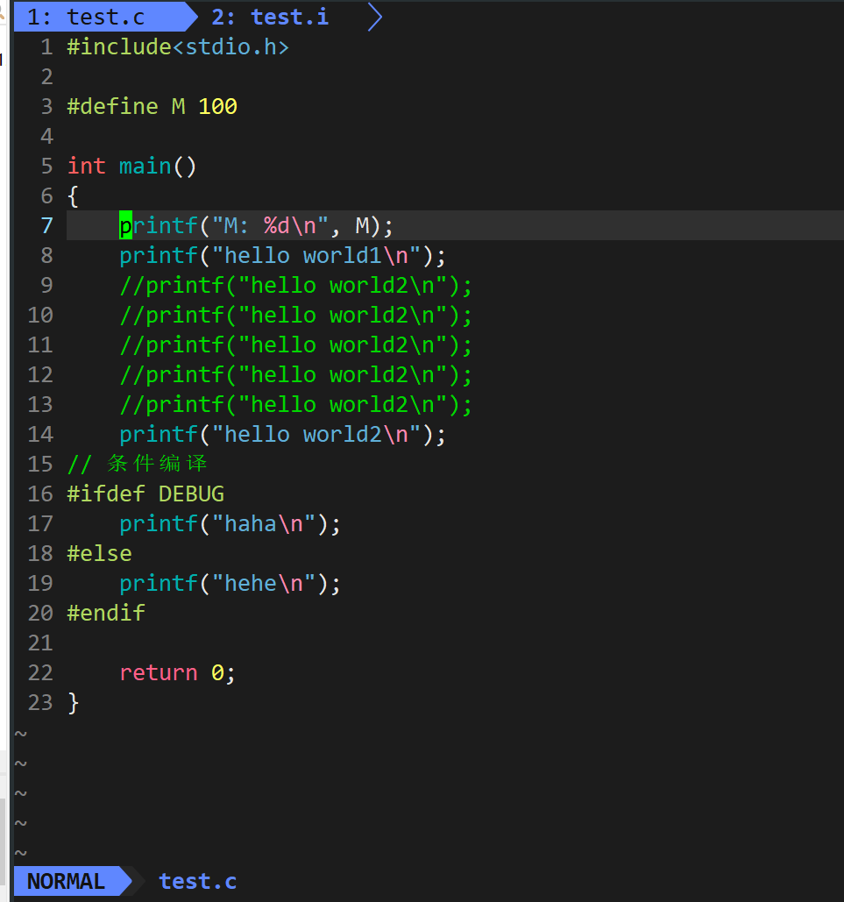

+ 清晰的看到，**宏定义，文件包含，条件编译，去注释等**已经生效了

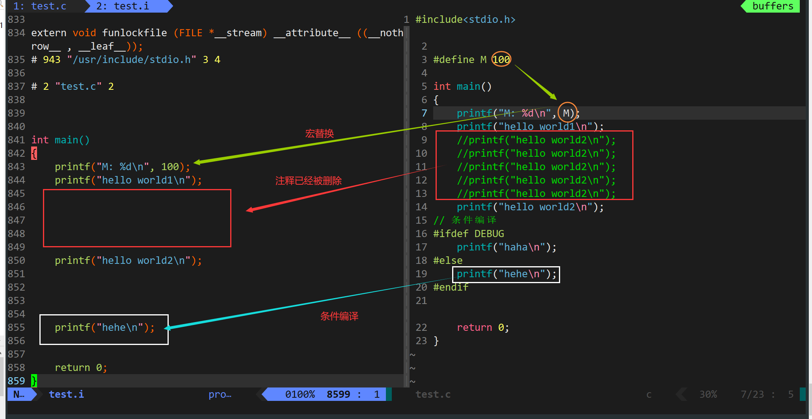

+ 再来看下面的代码

```cpp
int main()
{
    for(int i = 0; i < 10; i++)
    {
        printf("hello lsl%d\n",i);
    }
    return 0;
}
```

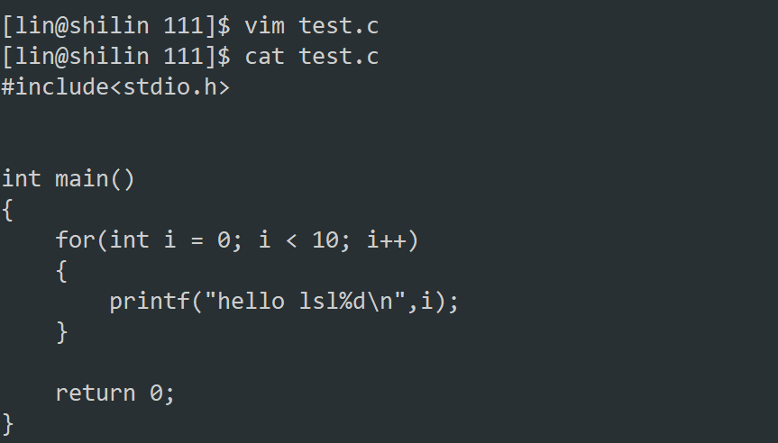

+ 使用gcc编译的时候是编不过的，这是因为我们现在安装gcc版本是`4.xxx`
+ 这个版本for循环里面不能定义变量，需要加一个选项`-std=c99`，再进行编译就可以了

```bash
gcc test.c -o test -std=c99
```

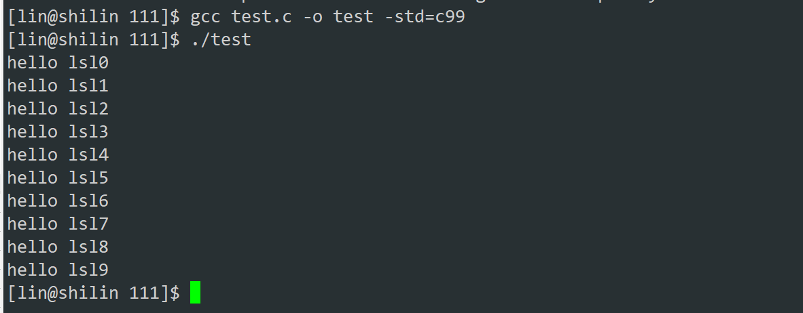

### 编译（生成汇编）
+ 在这个阶段中gcc 首先要检查代码的规范性、是否有语法错误等,以确定代码的实际要做的工作,在检查无误后,gcc 把代码翻译成汇编语言。

```bash
gcc -S test.i -o test.s
```

+ “-S”选项来进行查看，该选项只进行编译而不进行汇编，生成汇编代码。

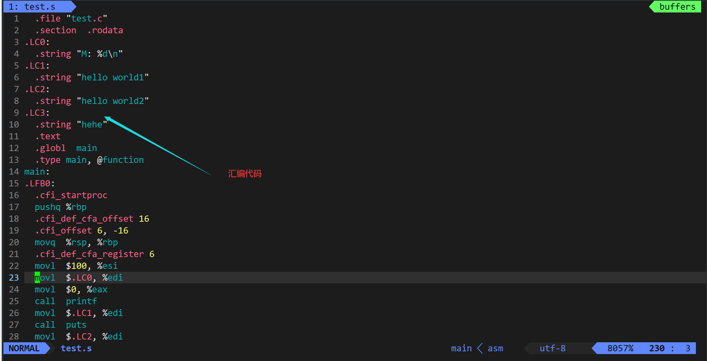

### 汇编（生成机器可识别代码）
+ 汇编阶段是把编译阶段生成的“.s”文件转成目标文件

```bash
gcc -c test.s -o test.o
```

+ “-c”就可看到汇编代码已转化为“.o”的二进制目标代码了
+ 其中`test.o`叫可重定位目标二进制文件

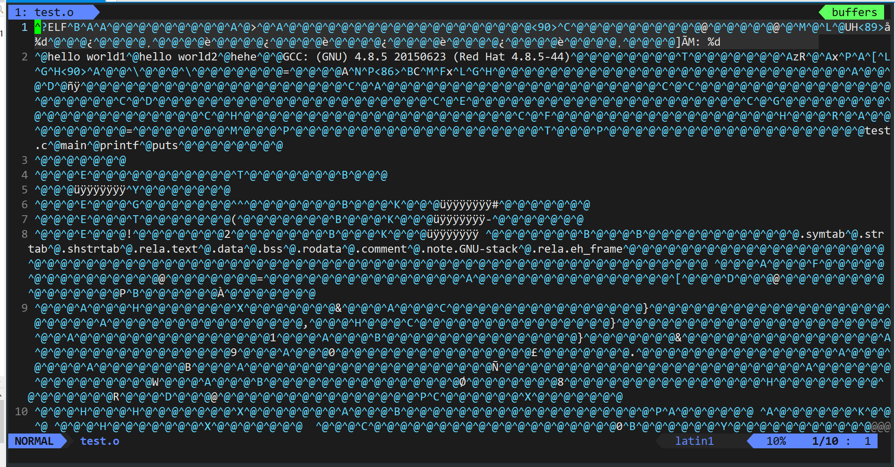

### 连接（生成可执行文件或库文件）
+ 在成功编译之后就轮到**链接**阶段。

```bash
gcc test.o -o mytest
```

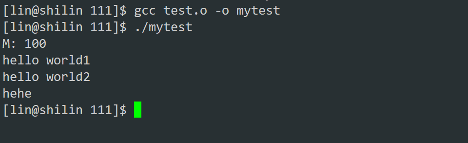

> 上面所用到的gcc可以替换成g++选项通用~~
>

### 最后记忆小技巧
+ 预处理、编译、汇编对应的gcc选项分别是 “-E”、“-S”、“-c”，我们**把这几个字母连起来也就是键盘的最左上角那个键【Esc】**，我们只需要记住**E和S**是**大写**的，**c是小写**的即可。
+ 而预处理、编译、汇编后形成的文件后缀连起来就是【iso】（iso也就是镜像文件的后缀）。
+ 所以最后我们只需要记住选项【ESc】对应文件后缀【iso】即可。

## 在这里涉及到一个重要的概念：函数库
+ 我们的C程序中，并没有定义“printf”的函数实现,且在预编译中包含的“stdio.h”中也只有该函数的声明,而没有定义函数的实现,那么,是在哪里实“printf”函数的呢?
+ 最后的答案是:**系统把这些函数实现都被做到名为 **`libc.so.6`** 的库文件中去了,在没有特别指定时,gcc 会到系统默认的搜索路径“/usr/lib”下进行查找,也就是链接到 **`libc.so.6`** 库函数中去,这样就能实现函数“printf”了，而这也就是链接的作用。**

```bash
ls /usr/include/
```

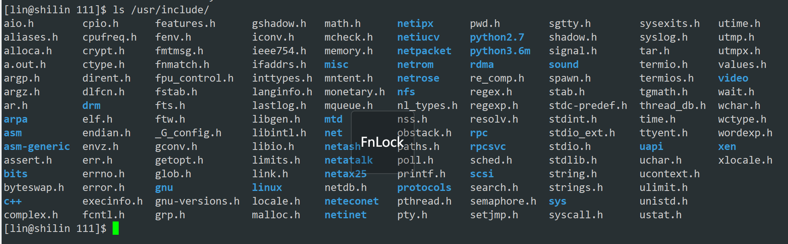

### 静态库和动态库两种
+ 在使用gcc编译c语言后可以使用`ldd`命令就可以查看这个可执行程序锁依赖的库

```bash
ldd mytest
```

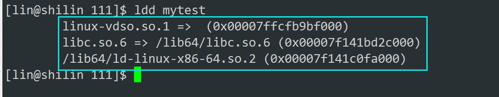

+ 我们可以查看这里的动态库路径
+ **这里的**`libc.so.6`**，lib为前缀，**`so.6`**为后缀，中间的**`c`**就是这个库的名字，也就是C语言的**

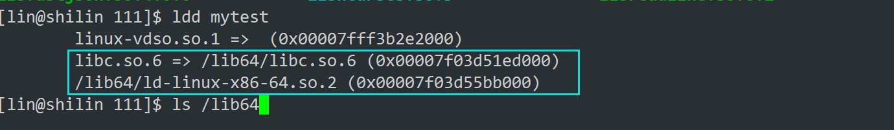

+ 也可以打印绝对路径来

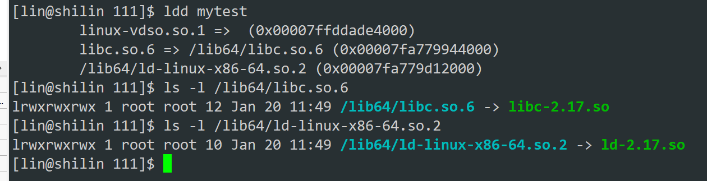

+ 查看**Linux的大部分动静态库**

```bash
ls /lib64
```

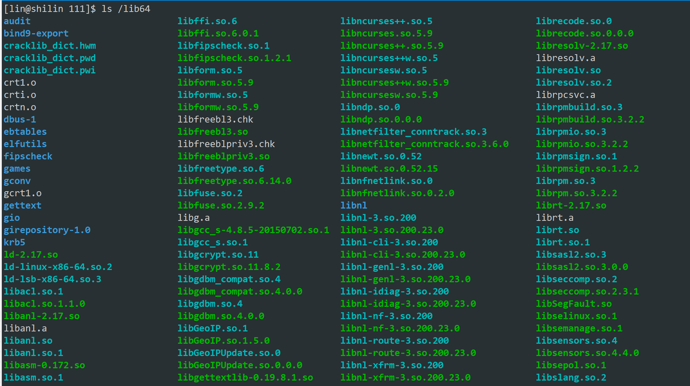

+ 函数库一般分为**静态库和动态库两种**，**静态库是指编译链接时，把库文件的代码全部加入到可执行文件中，因此生成的文件比较大，但在运行时也就不再需要库文件了**。
+ 其后缀名一般为 **“.a”动态库与之相反** ，在编译链接时并没**有把库文件的代码加入到可执行文件中，****而是在程序****执行时由运行时链接文件加载库**，这样可以节省系统的开销。
+ 动态库一般后缀名为“.so”，前面所述的 `libc.so.6` 就是动态库。
+ **gcc 在编译时默认使用动态库**。完成了链接之后,gcc 就可以生成可执行文件
+ gcc默认生成的**二进制程序，是动态链接的**，这点可以通过 **file** 命令验证。

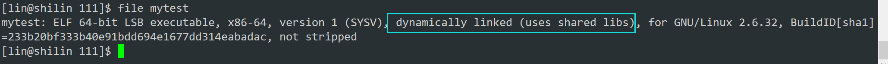

### 区分win和linux的动静态库后缀
**动态链接——需要动态库  
****静态链接——需要静态库**

+ Linux下的文件名后缀：**.so（动态库），.a（静态库）**
+ Windows下的文件名后缀：**.dll（动态库），.lib（静态库）**

### 动态链接的优缺点
+ 上面也说了`gcc`默认形成的可执行文件，默认采用动态链接

**动态库**与动态链接的优缺点：

> 1. 不能丢失
> 2. 节省资源
>

**静态库**与动态链接的优缺点：

> 1. 一旦形成，和库无关
> 2. 浪费资源
>

+ 最后我们看一下使用gcc静态链接形成可执行文件
+ 形成的文件大小是不一样的【差别很大】，因为使用静态编译就会

```bash
gcc test.c -o test-static -static
```

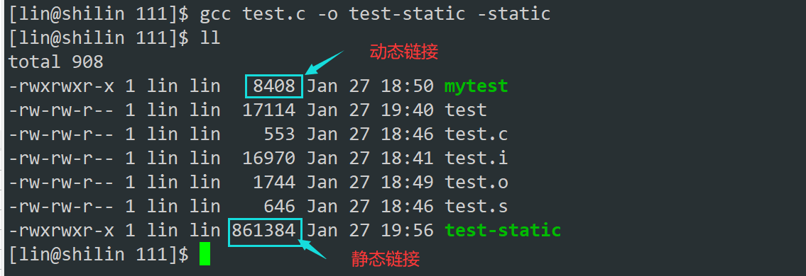

+ 再次使用`ldd`和`file``命令查看一下

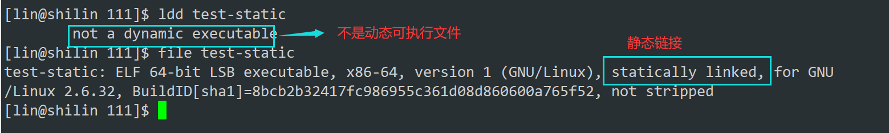

+ 如果使用`-static`静态链接是无法生成的，因为gcc默认没有安装静态库，提示下面的信息

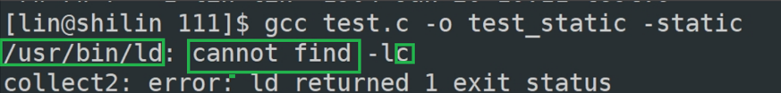

### 安装C语言的静态库
+ 执行下面的命令以安装

```bash
sudo yum install -y glibc-static libstdc++-static
```

显示以下就成功

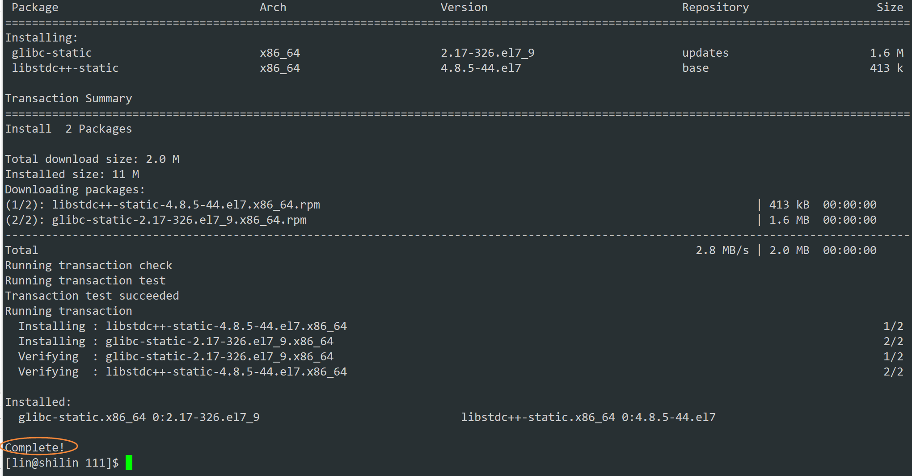

### gcc的选项
| **-E** | 只激活预处理，这个不生成文件，你需要把它重定向到一个输出文件里面。 |
| --- | --- |
| **-S** | 编译到汇编语言不进行汇编和链接。 |
| **-c** | 编译到目标代码。 |
| **-o** | 文件输出到 文件。 |
| **-static** | 此选项对生成的文件采用静态链接。 |
| **-g** | 生成调试信息。GNU 调试器可利用该信息。 |
| **-shared** | 此选项将尽量使用动态库，所以生成文件比较小，但是需要系统由动态库。 |
| **-O0** | 不做任何优化，这是默认的编译选项。 |
| **-O1** | 对程序做部分编译优化，对于大函数，优化编译占用稍微多的时间和相当大的内存。使用本项优化，编译器会尝试减小生成代码的尺寸，以及缩短执行时间，但并不执行需要占用大量编译时间的优化。 |
| **-O2** | 是比O1更高级的选项，进行更多的优化。gcc将执行几乎所有的不包含时间和空间折中的优化。当设置O2选项时，编译器并不进行循环打开（）loop unrolling以及函数内联。与O1比较而言，O2优化增加了编译时间的基础上，提高了生成代码的执行效率。 |
| **-O3** | 比O2更进一步的进行优化，-O3的优化级别最高。 |
| **-w** | 不生成任何警告信息。 |
| **-Wall** | 生成所有警告信息。 |


