# Linux动态库、静态库、理解动静态库加载
# 动态库和静态库
实际开发工程中，一般会有很多函数只是声明，**而找不到实现的代码**，因为那些实现代码已经**编译成库**了。在Linux系统中 **.o、.a、*.so**文件都是Linux下的程序函数库，window系统中**.lib、.dll**，即编译好的可供其他程序使用的代码和数据，一般来讲：

+ 静态库（.a）：程序在编译链接的时候把库的代码链接到可执行文件中。程序运行的时候将不再需要静态库
+ 动态库（.so）：程序在运行的时候才去链接动态库的代码，多个程序共享使用库的代码。

一个与动态库链接的可执行文件仅仅包含它用到的函数入口地址的一个表，而不是外部函数所在目标文件的整个机器码

+ 在可执行文件开始运行以前，外部函数的机器码由操作系统从磁盘上的该动态库中复制到内存中，这个过程称为动态链接（dynamic linking）
+ 动态库可以在多个程序间共享，所以动态链接使得可执行文件更小，节省了磁盘空间。操作系统采用虚拟内存机制允许物理内存中的一份动态库被要用到该库的所有进程共用，节省了内存和磁盘空间。

## 认识静态库
+ 我们现认识一下

```c
#include<stdio.h>
int main()
{
    printf("hello world\n");
    return 0;
}
```

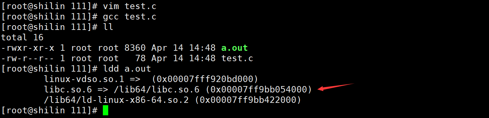

+ 我们发现这里的库是一个**软链接**

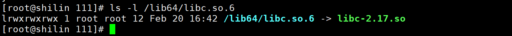

+ 此时我们可以看到，`libc-2.17.so`实际上就是一个**共享的目标文件库**，准确来说，这还是一个**动态库。**

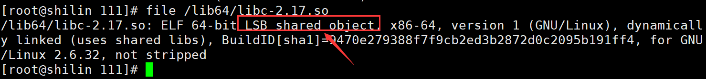

+ **在Linux当中，以.so为后缀的是动态库，以.a为后缀的是静态库。**
+ **在Windows当中，以.dll为后缀的是动态库，以.lib为后缀的是静态库。**

这里可执行程序所依赖的`libc.so.6`实际上就是**C动态库**，当我们去掉一个动静态库的前缀`lib`，再去掉后缀.`so`或者`.a`及其后面的版本号，**剩下的就是这个库的名字**。

+ 而**gcc/g++编译器默认都是动态链接**的，若想进行**静态链接**，可以携带一个`-static`选项。

**如果报错了说明你没有安装（Linux默认没有安装）**

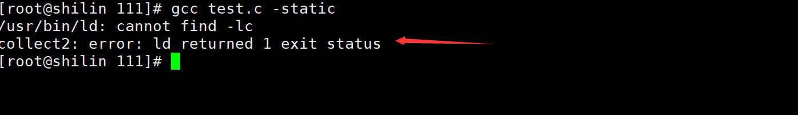

```bash
sudo yum -y install glibc-static libstdc++-static
```

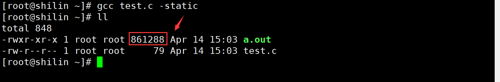

+ 然后就可以了

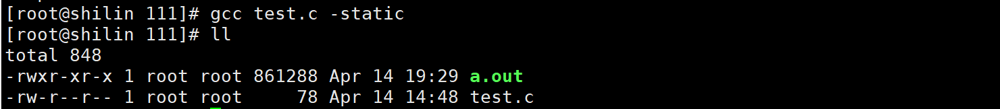

+ 此时生成的可执行程序就是**静态链接**的了，可以明显发现静态链接生成的可执行程序的文件大小，比动态链接生成的可执行程序的**文件大小要大得多**。

再使用`ldd`来查看  


+ 此外，当我们分别查看动静态链接生成的可执行程序的文件类型时，也可以看到它们分别是**动态链接和静态链接的。**

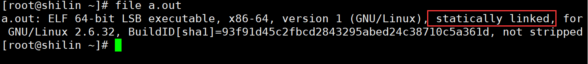

# 动静态库各自的特征
## 静态库
+ 静态库是程序在编译链接的时候把库的代码复制到可执行文件当中的，生成的可执行程序在运行的时候将不再需要静态库，因此使用静态库生成的可执行程序的大小一般比较大。

**优点：**

+ 使用静态库生成可执行程序后，该可执行程序就可以独自运行，不再需要库了。

**缺点：**

+ 使用静态库生成可执行程序会占用大量空间，特别是当有多个静态程序同时加载而这些静态程序使用的都是相同的库，这时在内存当中就会存在大量的重复代码。

## 动态库
+ 动态库是程序在运行的时候才去链接相应的动态库代码的，多个程序共享使用库的代码。一个与动态库链接的可执行文件仅仅包含它用到的函数入口地址的一个表，而不是外部函数所在目标文件的整个机器码。
+ 在可执行文件开始运行前，外部函数的机器码由操作系统从磁盘上的该动态库中复制到内存中，这个过程称为动态链接。动态库在多个程序间共享，节省了磁盘空间，操作系统采用虚拟内存机制允许物理内存中的一份动态库被要用到该库的所有进程共用，节省了内存和磁盘空间。

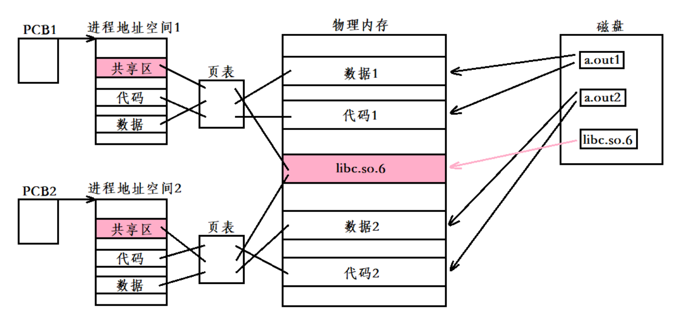

**优点：**

+ 节省磁盘空间，且多个用到相同动态库的程序同时运行时，库文件会通过进程地址空间进行共享，内存当中不会存在重复代码。

**缺点：**

+ 必须依赖动态库，否则无法运行。

# 静态库的打包与使用
+ 测试程序

```cpp
/////////////add.h/////////////////
#ifndef __ADD_H__
#define __ADD_H__
int add(int a, int b);
#endif // __ADD_H__
/////////////add.c/////////////////
#include "add.h"
int add(int a, int b)
{
    return a + b;
}
/////////////sub.h/////////////////
#ifndef __SUB_H__
#define __SUB_H__
int sub(int a, int b);
#endif // __SUB_H__
/////////////add.c/////////////////
#include "add.h"
int sub(int a, int b)
{
    return a - b;
}
///////////main.c////////////////
#include <stdio.h>
#include "add.h"
#include "sub.h"
int main( void )
{
    int a = 10;
    int b = 20;
    printf("add(10, 20)=%d\n", a, b, add(a, b));
    a = 100;
    b = 20;
    printf("sub(%d,%d)=%d\n", a, b, sub(a, b));
}
```

## 打包
+ 将所有源文件生成对应的目标文件

```bash
gcc -c c文件
```

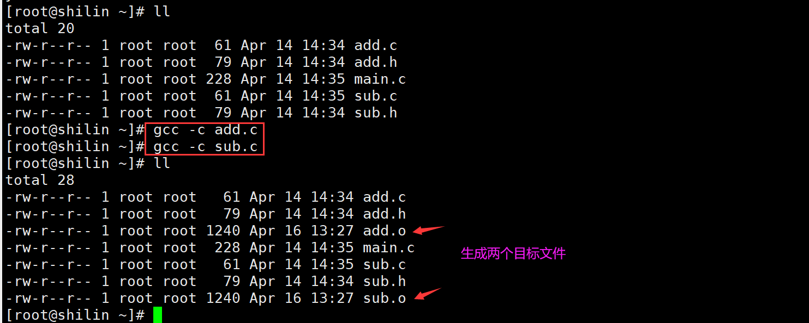

---

+ 使用ar命令将所有目标文件打包为静态库

`ar`命令是`gnu`的归档工具，常用于将目标文件打包为静态库，下面我们使用`ar`命令的`-r`选项和`-c`选项进行打包。

**-r(replace)：若静态库文件当中的目标文件有更新，则用新的目标文件替换旧的目标文件。  
****-c(create)：建立静态库文件。**

```bash
ar -rc libmyc.a add.o sub.o
```

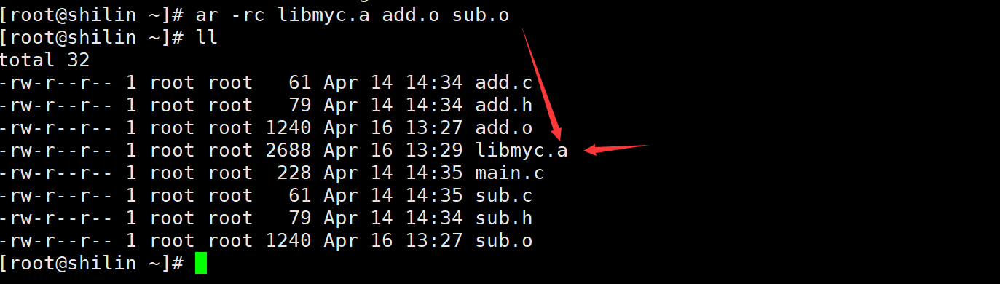

+ 使用`ar -tv libmyc.a`可以查看静态库当中的文件。


+ 将头文件和生成的静态库组织起来

当我们把自己的库给别人用的时候，实际上需要给别人两个文件夹，一个文件夹下面放的是一堆**头文件**的集合，另一个文件夹下面放的是所有的**库文件**。

我们可以将**add.h**和**sub.h**这两个头文件放到一个名为**include**的目录下，将生成的**静态**库文件放到一个名为**lib**的目录下

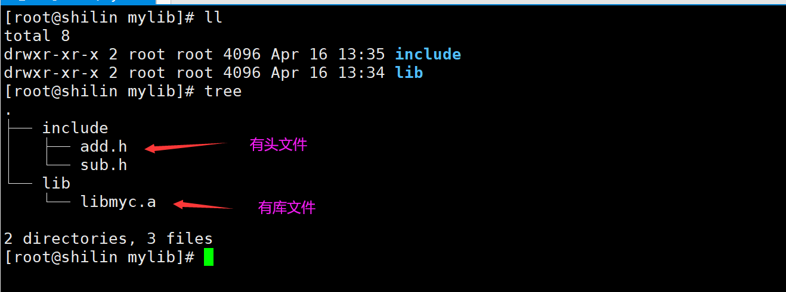

## 使用
```c
#include <stdio.h>
#include "add.h"
#include "sub.h"
int main( void )
{
    int a = 10;
    int b = 20;
    printf("add(10, 20)=%d\n", a, b, add(a, b));
    a = 100;
    b = 20;
    printf("sub(%d,%d)=%d\n", a, b, sub(a, b));
}
```

### 方法一：指定路径
此时使用gcc编译main.c生成可执行程序时需要携带三个选项：

**-I(大i)：指定头文件搜索路径。  
****-L：指定库文件搜索路径。  
****-l：指明需要链接库文件路径下的哪一个库。**

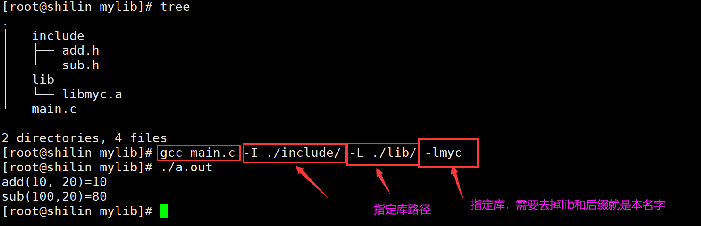

注意：

1. 因为编译器不知道你所包含的头文件add.h在哪里，所以需要指定头文件的搜索路径。
2. 因为头文件add.h当中只有my_add函数的声明，并没有该函数的定义，所以还需要指定所要链接库文件的搜索路径。
3. 实际中，在库文件的lib目录下可能会有大量的库文件，因此我们需要指明需要链接库文件路径下的哪一个库。库文件名去掉前缀**lib**，再去掉后缀`.so`或者`.a`及其后面的版本号，剩下的就是这个库的名字。
4. `-I，-L，-l`这三个选项后面可以加空格，也可以不加空格。

### 方法二：把头文件和库文件拷贝到系统路径下
```bash
cp ./include/*.h /usr/include/
cp ./lib/*.a /lib64/
```

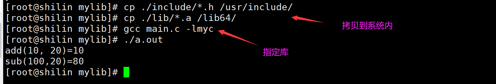

+ 虽然已经拷贝到系统的路径下了，但是还是要指定哪个库进行访问

不推荐上面的做法

---

+ 我们自己制作的库属于是第三方库，即不属于C语言的库，gcc本身是C语言的编译器，所以需要告诉gcc用户需要连接那个库，C语言的库和头文件都是在gcc默认的搜索路径下的，include和lib没有在默认搜索路径下，所以需要告诉gcc头文件和库的在什么地方。

---

# 动态库的打包与使用
+ `gcc -c`生成的目标文件, 只能用于静态库的创建, 不能用于动态库的创建

## 打包
+ 创建动态库所用的.o文件, 是通过`gcc -fPIC -c`编译生成的

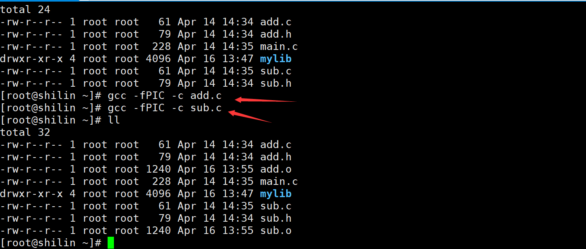

1. -fPIC作用于编译阶段，告诉编译器产生与位置无关的代码，此时产生的代码中没有绝对地址，全部都使用相对地址，从而代码可以被加载器加载到内存的任意位置都可以正确的执行。这正是共享库所要求的，共享库被加载时，在内存的位置不是固定的。
2. 如果不加-fPIC选项，则加载.so文件的代码段时，代码段引用的数据对象需要重定位，重定位会修改代码段的内容，这就造成每个使用这个.so文件代码段的进程在内核里都会生成这个.so文件代码段的拷贝，并且每个拷贝都不一样，取决于这个.so文件代码段和数据段内存映射的位置。
3. 不加-fPIC编译出来的.so是要在加载时根据加载到的位置再次重定位的，因为它里面的代码BBS位置无关代码。如果该.so文件被多个应用程序共同使用，那么它们必须每个程序维护一份.so的代码副本(因为.so被每个程序加载的位置都不同，显然这些重定位后的代码也不同，当然不能共享)。
4. 我们总是用-fPIC来生成.so，但从来不用-fPIC来生成.a。但是.so一样可以不用-fPIC选项进行编译，只是这样的.so必须要在加载到用户程序的地址空间时重定向所有表目。

使用`-shared`选项将所有目标文件打包为动态库

+ 由于静态库很常用所以gcc已经给我们自带了选项可以生成静态库`-shared`

```bash
gcc -shared add.o sub.o -o libmyc.so
```

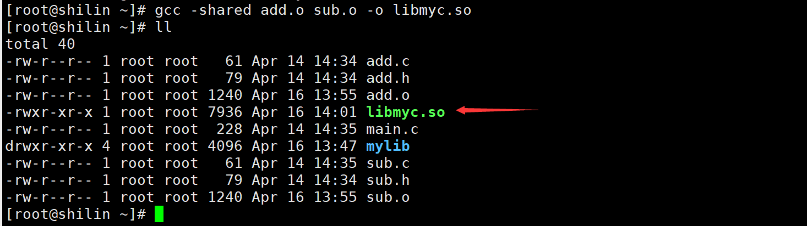

+ 将头文件和生成的动态库组织起来

```bash
gcc main.c -I ./include/ -L ./lib/ -lmyc
```

+ 还可以像上面的静态库的使用一样，但是我们发现不可以使用

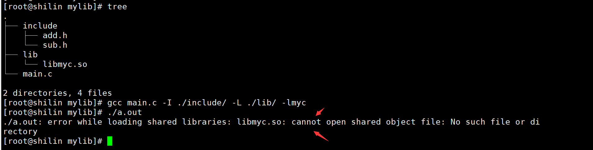

+ 我们用`ldd`命令来查看

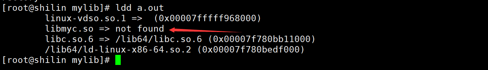

+ 我们使用`-I，-L，-l`这三个选项都是在编译期间告诉编译器我们使用的头文件和库文件在哪里以及是谁，但是当生成的可执行程序生成后就与编译器没有关系了，此后该可执行程序运行起来后，**操作系统找不到该可执行程序所依赖的动态库**。

## 解决自己制作的动态库找不到的问题（使用）
### 方法一：拷贝.so文件到系统共享库路径下
```bash
cp lib/*.so /lib64/
```

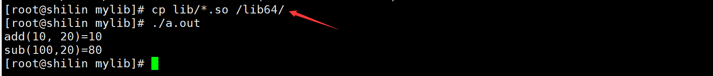

### 方法二：更改LD_LIBRARY_PATH，临时方案，更改环境变量配置文件
**LD_LIBRARY_PATH**是程序运行动态查找库时所要搜索的路径，我们只需将动态库所在的目录路径添加到**LD_LIBRARY_PATH**环境变量当中即可。

```bash
export LD_LIBRARY_PATH=$LD_LIBRARY_PATH:/root/mylib/lib/
```

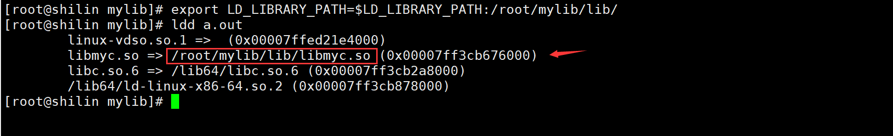

### 方法三：添加一个软链接
添加一个软链接到系统路径

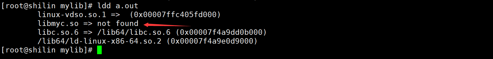

```bash
ln -s ~/mylib/lib/libmyc.so /lib64/libmyc.so
```

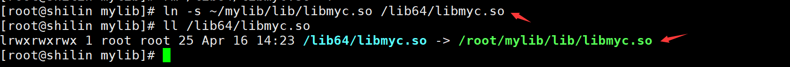

+ 自然而然也就找到了，但是这个方法也不推荐

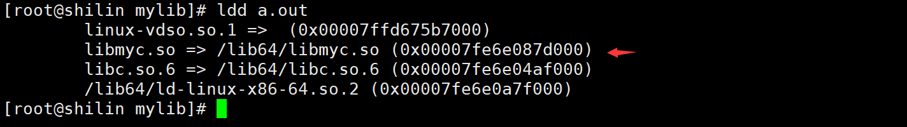

### 方法四：配置/etc/ld.so.conf.d/
+ 我们可以通过配置`/etc/ld.so.conf.d/`的方式解决该问题，`/etc/ld.so.conf.d/`路径下存放的全部都是以`.conf`为后缀的配置文件，而这些配置文件当中存放的都是路径，系统会自动在`/etc/ld.so.conf.d/`路径下找所有配置文件里面的路径，之后就会在每个路径下查找你所需要的库。我们若是将自己库文件的路径也放到该路径下，那么当可执行程序运行时，系统就能够找到我们的库文件了。

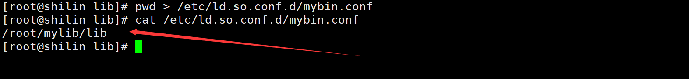

+ 但此时我们用ldd命令查看可执行程序时，发现系统还是没有找到该可执行程序所依赖的动态库。

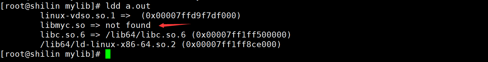

+ 使用**ldconfig**命令将配置文件更新一下，完美解决

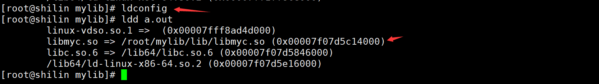

> 动态和静态库，同时存在的时候，gcc/g++默认优先使用动态库，默认进行动态链接
>
> 一个可执行程序，可能会依赖多个库，如果我们只提供静态库，即便我们是动态链接，gcc也没有办法，只能对只提供静态库的库，进行静态链接
>
> 如果加上了`-static`：就要求我们必须采用静态链接的方案。静态库，必须存在！
>

## 为什么使用第三方动态库的可执行程序需要知道动态库的路径
+ 首先我们的可执行程序运行之后, 会被加载到内存中变成一个进程
+ 操作系统会为其创建：PCB、进程地址空间、页表

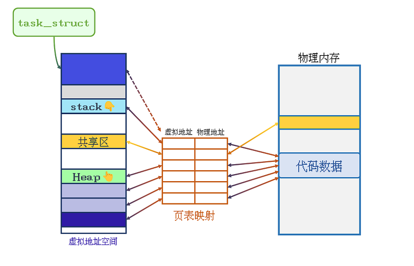

+ 我们知道, 动态库在链接时是不会将代码加载到程序中的, 只会将代码以一个相对地址的形式加载到程序中
+ 而我们的程序在运行到动态库代码时, 是需要跳转到动态库代码继续执行的
+ 如果程序不知道其所使用的动态库的路径, 那么进程在运行时, 操作系统就不能根据程序把动态库加载到内存中
+ 如果动态库不能被加载到内存中, 进程的虚拟地址空间的共享区就不能指向动态库的代码
+ 如果共享区不能指向动态库的代码, 那么进程肯定就不能执行代码, 进程就会执行错误
+ `pcb`创建需要从`elf`和加载器那拿虚拟地址和**mian**函数入口地址，**pc指针**先存着入口地址等后面**OS**根据页表运行，**把可执行程序加载入内存，内存里面也有虚拟地址**，加载分配的空间会有物理地址，所以这时候就有**虚拟地址和物理地址**，根据这两个条件就可以构造页面印射关系**OS运行找pc指针印射物理地址执行代码**，**pc指针顺便存下一跳地址**，然后**OS和pc指针**继续这种操作，代码就运行起来了

# ELF文件
ELF结构：

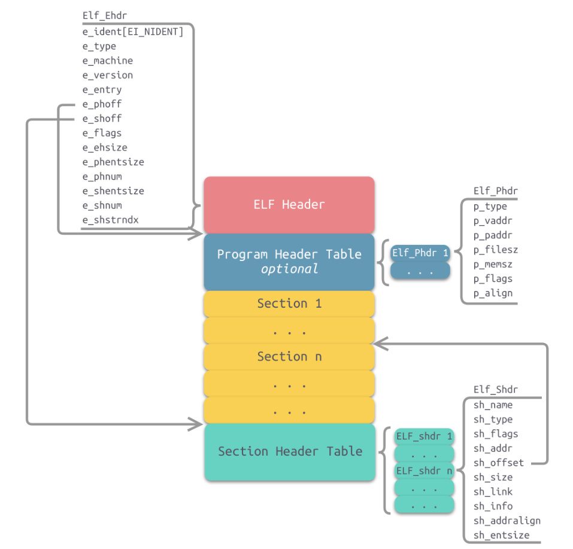

要理解编译链链接的细节，我们不得不了解一下ELF文件。其实有以下四种文件其实都是ELF文件：

+ 可重定位文件（Relocatable File） ：即 xxx.o 文件。包含适合于与其他目标文件链接来创建可执行文件或者共享目标文件的代码和数据。
+ 可执行文件（Executable File） ：即可执行程序。
+ 共享目标文件（Shared Object File） ：即 xxx.so文件。
+ 内核转储(core dumps) ，存放当前进程的执行上下文，用于dump信号触发。一个ELF文件由以下四部分组成：
+ ELF头(ELF header) ：描述文件的主要特性。其位于文件的开始位置，它的主要目的是定位文件的其他部分。
+ 程序头表(Program header table) ：列举了所有有效的段(segments)和他们的属性。表里记着每个段的开始的位置和位移（offset）、长度，毕竟这些段，都是紧密的放在二进制文件中，需要段表的描述信息，才能把他们每个段分割开。
+ 节头表(Section header table) ：包含对节(sections)的描述。
+ 节（Section ）：ELF文件中的基本组成单位，包含了特定类型的数据。ELF文件的各种信息和数据都存储在不同的节中，如代码节存储了可执行代码，数据节存储了全局变量和静态数据等。

常见：

代码节（.text）：用于保存机器指令，是程序的主要执行部分。

数据节（.data）：保存已初始化的全局变量和局部静态变量。

查看是否为ELF

```shell
file test.o
```

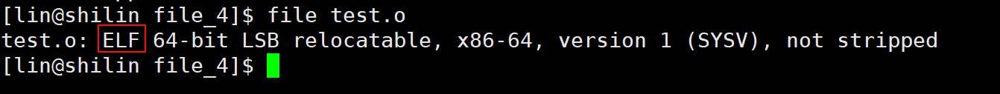

查看每个区的占的大小

```shell
size test.o
```

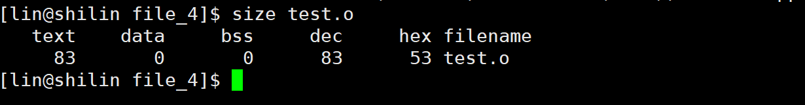

## ELF形成可执行
1. 将多份C/C++ 源代码，翻译成为目标`.o`文件
2. 将多份`.o`文件`section`进行合并

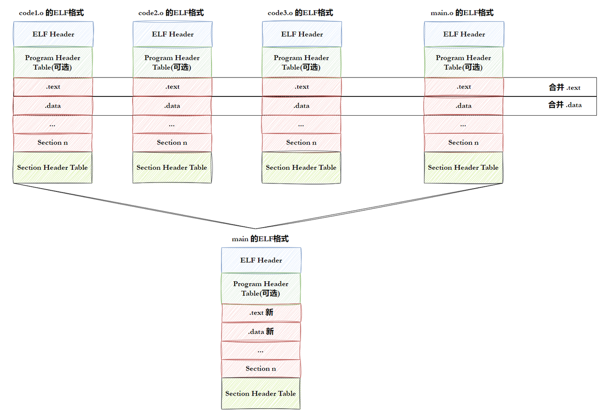

## ELF可执行文件加载
###  查看ELF Header
> -h或--file-header：显示ELF文件的文件头信息。文件头包含了ELF文件的基本信息，比如文件类型、机器类型、版本、入口点地址、程序头表和节头表的位置和大小等
>

```shell
readelf -h myexe
```

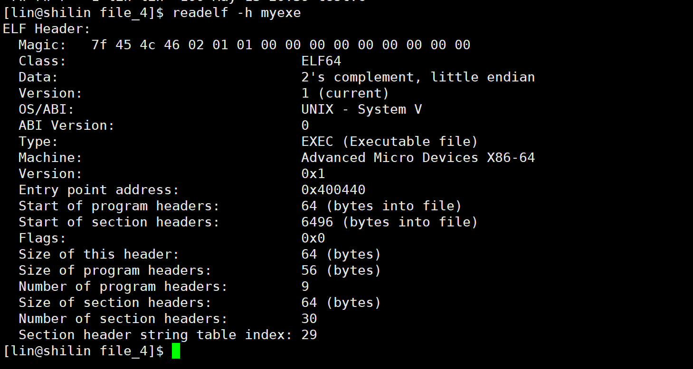

编译器和操作系统都要认识这个`ELF Header`

+ 在内核中关于有一个`ELF Header`相关的数据结构，操作系统自己必须能够识别特定格式的可执行程序：`/linux/include/elf.h`

在编译的时候就要把这个数据结构加载到可执行程序，可执行加载的时候操作系统必然也要认识`ELF Header`

+ 其实磁盘文件，就是一个一维数组，无论是二进制文件还是文本文件。

```c
// 内核中关于ELF Header相关的数据结构
typedef struct elf32_hdr{
    unsigned char e_ident[EI_NIDENT];
    Elf32_Half e_type;
    Elf32_Half e_machine;
    Elf32_Word e_version;
    Elf32_Addr e_entry; /* Entry point */
    Elf32_Off e_phoff;
    Elf32_Off e_shoff;
    Elf32_Word e_flags;
    Elf32_Half e_ehsize;
    Elf32_Half e_phentsize;
    Elf32_Half e_phnum;
    Elf32_Half e_shentsize;
    Elf32_Half e_shnum;
    Elf32_Half e_shstrndx;
} Elf32_Ehdr;

typedef struct elf64_hdr {
    unsigned char e_ident[EI_NIDENT]; /* ELF "magic number" */
    Elf64_Half e_type;
    Elf64_Half e_machine;
    Elf64_Word e_version;
    Elf64_Addr e_entry; /* Entry point virtual address */
    Elf64_Off e_phoff; /* Program header table file offset */
    Elf64_Off e_shoff; /* Section header table file offset */
    Elf64_Word e_flags;
    Elf64_Half e_ehsize;
    Elf64_Half e_phentsize;
    Elf64_Half e_phnum;
    Elf64_Half e_shentsize;
    Elf64_Half e_shnum;
    Elf64_Half e_shstrndx;
} Elf64_Ehdr;
```

### 查看可执行程序的section（节）
+ 一个ELF会有多种不同的Section，在加载到内存的时候，也会进行Section合并，形成segment。
+ 合并原则：相同属性，比如：可读，可写，可执行，需要加载时申请空间等，这样，即便是不同的Section，在加载到内存中，可能会以segment的形式，加载到一起，具体合并原则被记录在了ELF的程序头表(Program header table) 中。

> `.text`节：是保存了程序代码指令的代码节。
>
> `.data`节：保存了初始化的全局变量和局部静态变量等数据。
>
> `.rodata`节：保存了只读的数据，如一行C语言代码中的字符串。由于.rodata节是只读的，所
>
> 以只能存在于一个可执行文件的只读段中。因此，只能是在text段（不是data段）中找到`.rodata`节。
>
> `.BSS`节：为未初始化的全局变量和局部静态变量预留位置
>
> `.symtab`节 : Symbol Table 符号表，就是源码里面那些函数名、变量名和代码的对应关系。
>
> `.got.plt`节（全局偏移表-过程链接表）：`.got`节保存了全局偏移表。`.got`节和`.plt`节一起提供了对导入的共享库函数的访问入口，由动态链接器在运行时进行修改。
>

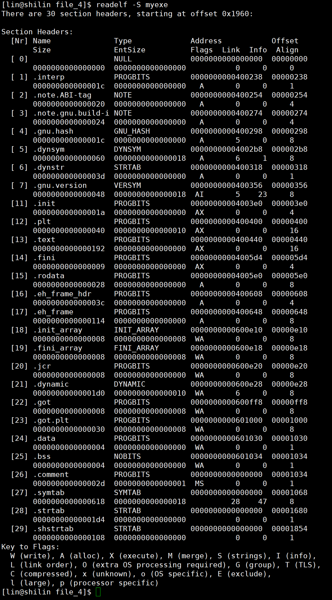

```c
// 内核中关于ELF Section Header相关的数据结构
typedef struct {
    Elf32_Word sh_name;
    Elf32_Word sh_type;
    Elf32_Word sh_flags;
    Elf32_Addr sh_addr;
    Elf32_Off sh_offset;
    Elf32_Word sh_size;
    Elf32_Word sh_link;
    Elf32_Word sh_info;
    Elf32_Word sh_addralign;
    Elf32_Word sh_entsize;
} Elf32_Shdr;
typedef struct elf64_shdr {
    Elf64_Word sh_name; /* Section name, index in string tbl */
    Elf64_Word sh_type; /* Type of section */
    Elf64_Xword sh_flags; /* Miscellaneous section attributes */
    Elf64_Addr sh_addr; /* Section virtual addr at execution */
    Elf64_Off sh_offset; /* Section file offset */
    Elf64_Xword sh_size; /* Size of section in bytes */
    Elf64_Word sh_link; /* Index of another section */
    Elf64_Word sh_info; /* Additional section information */
    Elf64_Xword sh_addralign; /* Section alignment */
    Elf64_Xword sh_entsize; /* Entry size if section holds table */
} Elf64_Shdr;
```

### 查看ELF Program Header Table(查看section合并的segment)
> -l或--program-headers：显示ELF文件的程序头部（也称为**段头**）信息。
>

```shell
readelf -l myexe
```

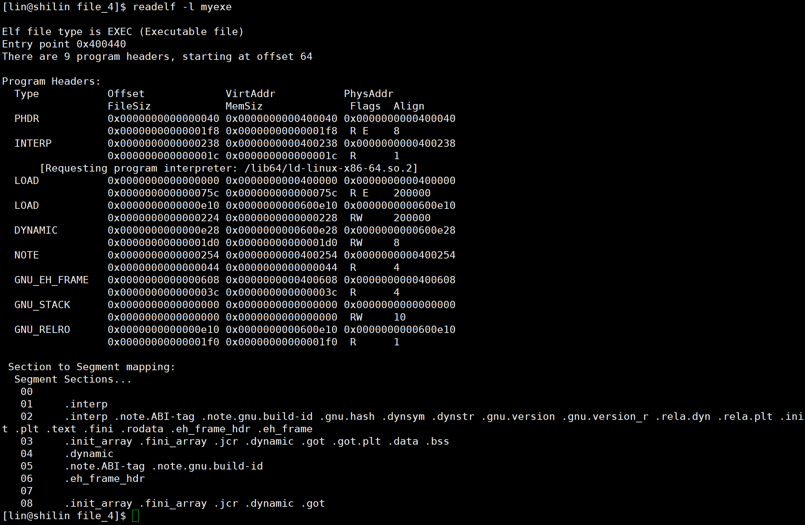

其中Flags的标志：是为了方便页表进行权限管理

#### 为什么要将section合并成为segment
+ Section合并的主要原因是为了减少页面碎片，提高内存使用效率。如果不进行合并，假设页面大小为4096字节（内存块基本大小，加载，管理的基本单位），如果.text部分为4097字节，.init部分为512字节，那么它们将占用3个页面，而合并后，它们只需2个页面。
+ 此外，操作系统在加载程序时，会将具有相同属性的section合并成一个大的segment，这样就可以实现不同的访问权限，从而优化内存管理和权限访问控制。


```c
// 内核中关于ELF Program Header相关的数据结构
typedef struct elf32_phdr{
    Elf32_Word p_type;
    Elf32_Off p_offset;
    Elf32_Addr p_vaddr;
    Elf32_Addr p_paddr;
    Elf32_Word p_filesz;
    Elf32_Word p_memsz;
    Elf32_Word p_flags;
    Elf32_Word p_align;
} Elf32_Phdr;

typedef struct elf64_phdr {
    Elf64_Word p_type;
    Elf64_Word p_flags;
    Elf64_Off p_offset; /* Segment file offset */
    Elf64_Addr p_vaddr; /* Segment virtual address */
    Elf64_Addr p_paddr; /* Segment physical address */
    Elf64_Xword p_filesz; /* Segment size in file */
    Elf64_Xword p_memsz; /* Segment size in memory */
    Elf64_Xword p_align; /* Segment alignment, file & memory */
} Elf64_Phdr;
```

# 理解链接与加载
## 静态链接
无论是自己的.o, 还是静态库中的.o，本质都是把.o文件进行连接的过程，所以：研究静态链接，本质就是研究`.o`是如何链接的

```c
test.c
#include<stdio.h>
void run();
int main() {
    printf("hello world!\n");
    run();
    return 0;
}
code.c
#include<stdio.h>
void run() {
    printf("running...\n");
}
```

### 查看编译后的.o目标文件
汇编语言经过编译后，汇编语言会变成二进制，call叫做助记符，例如e8就是call命令

这里call后面的地址是00 00 00 00，是因为多个`.o`并不知道对方

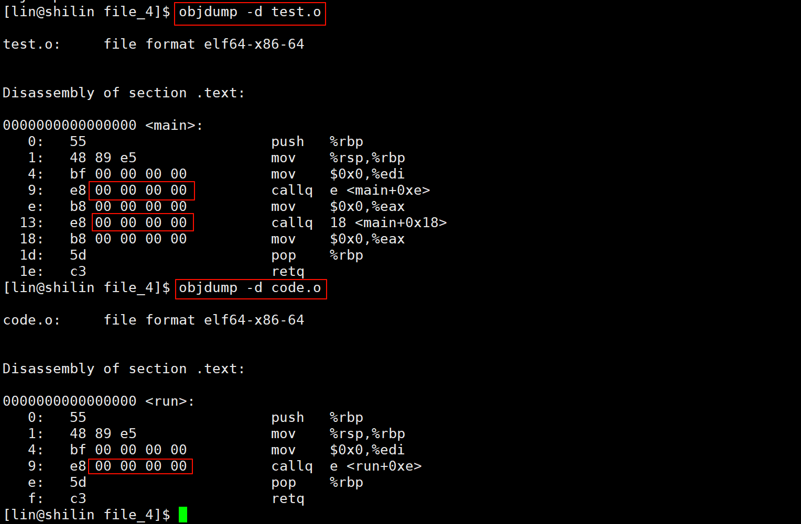

### 读取code.o和test.o的符号表
```shell
readelf -s code.o
readelf -s test.o
```

puts：就是printf的实现

UND就是：undefine，表示未定义，也就是`.o`文件找不到

run就是我们自己的方法在test.o中未定义

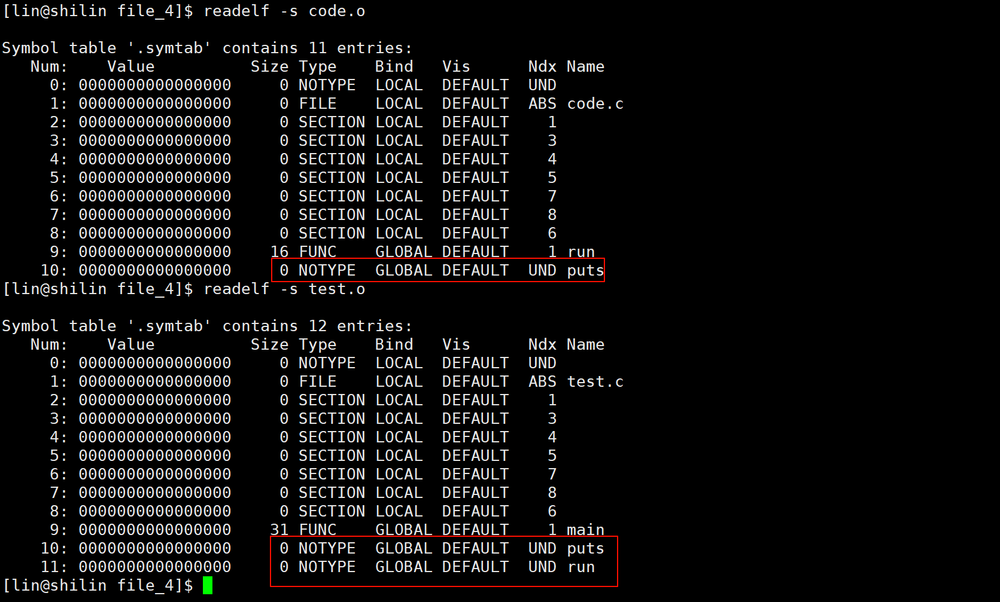

两个`.o`进行合并之后，在最终的可执行程序中，就找到了run。

```shell
readelf -s myexe
```

000000000040052d其实是地址

FUNC:表示run符号类型是个函数

13：就是run函数所在的section被合并最终的那一个section中了，13就是下标

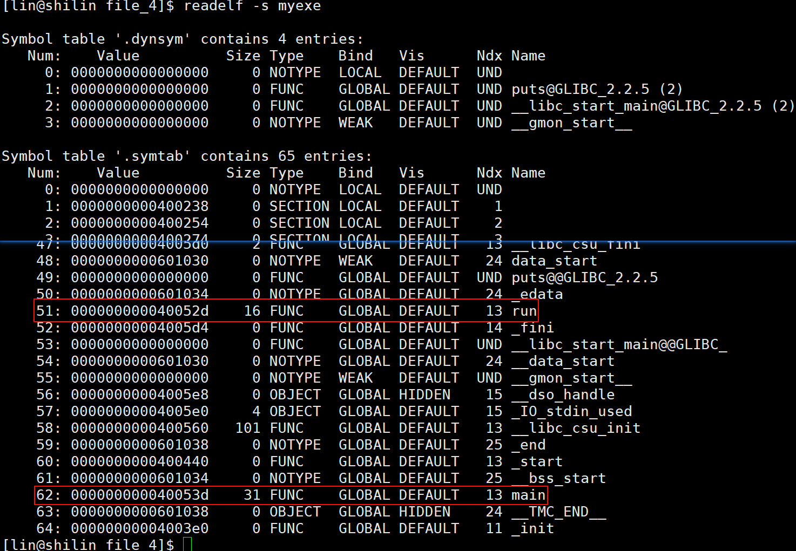

### 读取可执行程序最终的所有的section清单
```shell
readelf -S myexe
```

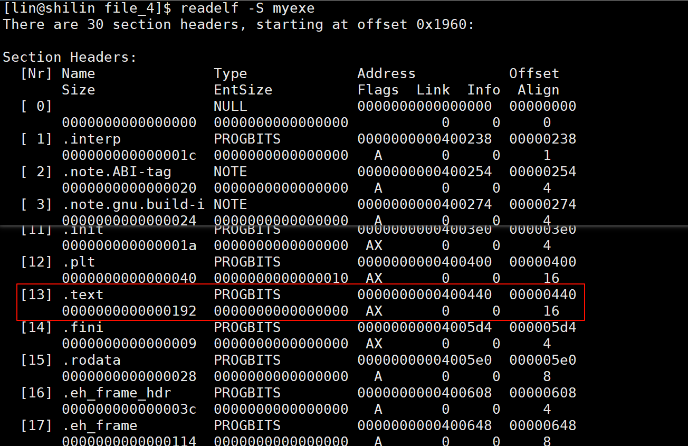

test.o和code.o的`.text`被合并了，是main.exe的第13个section

---

查看两个.o文件编译链接后的汇编：

```shell
objdump -d myexe
```

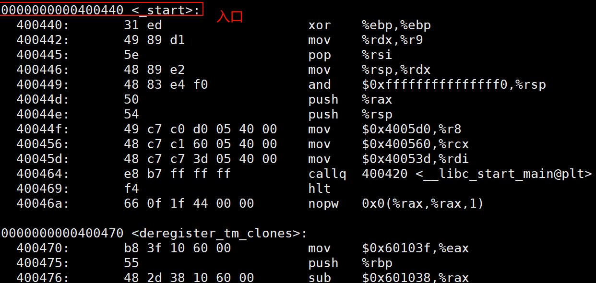

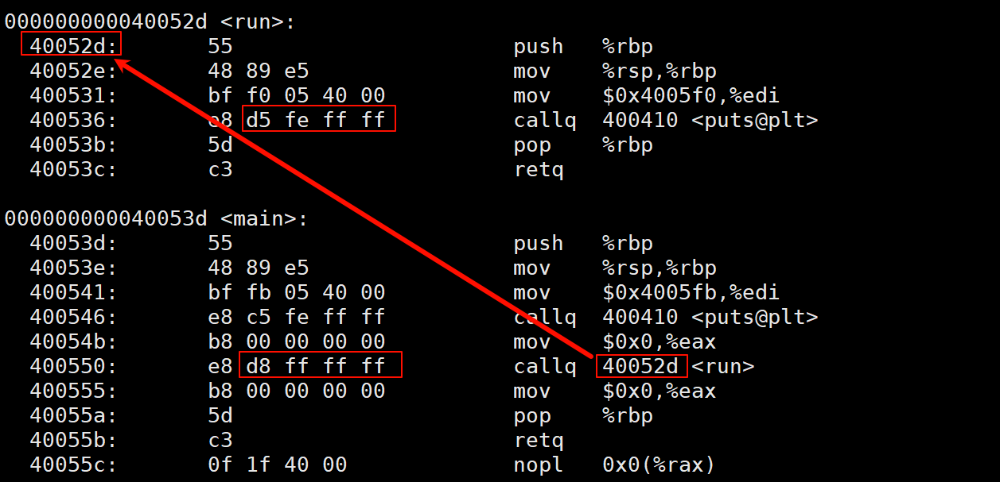

得出结论：

1. 两个.o的代码段合并到了一起，并进行了统一的编址。
2. 链接的时候，会修改.o中没有确定的函数地址，在合并完成之后，进行相关call地址，完成代码调用

静态链接就是把库中的.o进行合并

所以链接其实就是将编译之后的所有目标文件连同用到的一些静态库运行时库组合，拼装成一个独立的可执行文件。其中就包括我们之前提到的地址修正，当所有模块组合在一起之后，链接器会根据我们的.o文件或者静态库中的重定位表找到那些需要被重定位的函数全局变量，从而修正它们的地址。这其实就是静态链接的过程。

链接过程中会涉及到对.o中外部符号进行地址重定位。

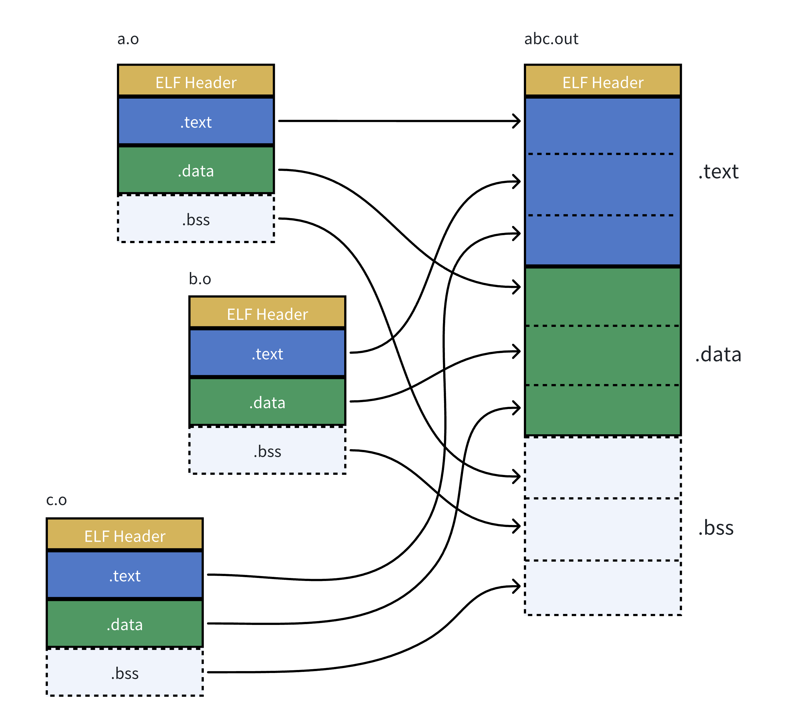

+ 所以上述操作将多个.o文件链接成一个可执行程序，这也叫做链接时地址重定位，所以.o文件叫做，可重定位目标文件。

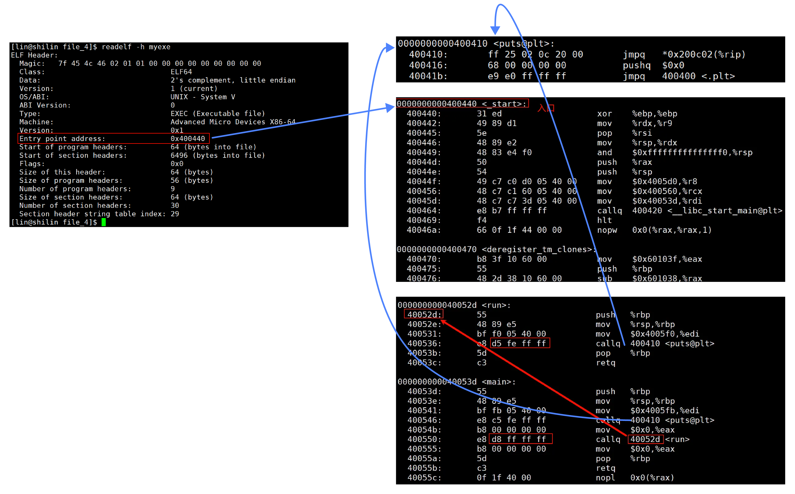

## ELF加载与进程地址空间
一个ELF可执行程序，在没有加载到内存的时候，有没有地址？为什么？是什么地址？

进程`mm_struct`、`vm_area_struct`在进程刚刚创建的时候，初始化数据从哪里来的？

Linux系统编译形成可执行程序的时候，需要对代码和数据要进行编址当代CPU和计算机和操作系统，对ELF编的时候，采用的做法都是采用“平坦模式”按照线性编址统一进行编址。

函数的本质，就是相邻地址的集合！

下面是`objdump -S myexe`反汇编之后的代码

```shell
$ objdump -S myexe 

myexe:     file format elf64-x86-64


Disassembly of section .init:

00000000004003e0 <_init>:
  4003e0:	48 83 ec 08          	sub    $0x8,%rsp
  4003e4:	48 8b 05 0d 0c 20 00 	mov    0x200c0d(%rip),%rax        # 600ff8 <__gmon_start__>
  4003eb:	48 85 c0             	test   %rax,%rax
  4003ee:	74 05                	je     4003f5 <_init+0x15>
  4003f0:	e8 3b 00 00 00       	callq  400430 <__gmon_start__@plt>
  4003f5:	48 83 c4 08          	add    $0x8,%rsp
  4003f9:	c3                   	retq   

Disassembly of section .plt:

0000000000400400 <.plt>:
  400400:	ff 35 02 0c 20 00    	pushq  0x200c02(%rip)        # 601008 <_GLOBAL_OFFSET_TABLE_+0x8>
  400406:	ff 25 04 0c 20 00    	jmpq   *0x200c04(%rip)        # 601010 <_GLOBAL_OFFSET_TABLE_+0x10>
  40040c:	0f 1f 40 00          	nopl   0x0(%rax)

0000000000400410 <puts@plt>:
  400410:	ff 25 02 0c 20 00    	jmpq   *0x200c02(%rip)        # 601018 <puts@GLIBC_2.2.5>
  400416:	68 00 00 00 00       	pushq  $0x0
  40041b:	e9 e0 ff ff ff       	jmpq   400400 <.plt>

0000000000400420 <__libc_start_main@plt>:
  400420:	ff 25 fa 0b 20 00    	jmpq   *0x200bfa(%rip)        # 601020 <__libc_start_main@GLIBC_2.2.5>
  400426:	68 01 00 00 00       	pushq  $0x1
  40042b:	e9 d0 ff ff ff       	jmpq   400400 <.plt>

0000000000400430 <__gmon_start__@plt>:
  400430:	ff 25 f2 0b 20 00    	jmpq   *0x200bf2(%rip)        # 601028 <__gmon_start__>
  400436:	68 02 00 00 00       	pushq  $0x2
  40043b:	e9 c0 ff ff ff       	jmpq   400400 <.plt>

Disassembly of section .text:

0000000000400440 <_start>:
  400440:	31 ed                	xor    %ebp,%ebp
  400442:	49 89 d1             	mov    %rdx,%r9
  400445:	5e                   	pop    %rsi
  400446:	48 89 e2             	mov    %rsp,%rdx
  400449:	48 83 e4 f0          	and    $0xfffffffffffffff0,%rsp
  40044d:	50                   	push   %rax
  40044e:	54                   	push   %rsp
  40044f:	49 c7 c0 d0 05 40 00 	mov    $0x4005d0,%r8
  400456:	48 c7 c1 60 05 40 00 	mov    $0x400560,%rcx
  40045d:	48 c7 c7 3d 05 40 00 	mov    $0x40053d,%rdi
  400464:	e8 b7 ff ff ff       	callq  400420 <__libc_start_main@plt>
  400469:	f4                   	hlt    
  40046a:	66 0f 1f 44 00 00    	nopw   0x0(%rax,%rax,1)

  ////////////..../////////////////////////////

000000000040052d <run>:
  40052d:	55                   	push   %rbp
  40052e:	48 89 e5             	mov    %rsp,%rbp
  400531:	bf f0 05 40 00       	mov    $0x4005f0,%edi
  400536:	e8 d5 fe ff ff       	callq  400410 <puts@plt>
  40053b:	5d                   	pop    %rbp
  40053c:	c3                   	retq   

000000000040053d <main>:
  40053d:	55                   	push   %rbp
  40053e:	48 89 e5             	mov    %rsp,%rbp
  400541:	bf fb 05 40 00       	mov    $0x4005fb,%edi
  400546:	e8 c5 fe ff ff       	callq  400410 <puts@plt>
  40054b:	b8 00 00 00 00       	mov    $0x0,%eax
  400550:	e8 d8 ff ff ff       	callq  40052d <run>
  400555:	b8 00 00 00 00       	mov    $0x0,%eax
  40055a:	5d                   	pop    %rbp
  40055b:	c3                   	retq   
  40055c:	0f 1f 40 00          	nopl   0x0(%rax)
  ////////////..../////////////////////////////

00000000004005d0 <__libc_csu_fini>:
  4005d0:	f3 c3                	repz retq 

Disassembly of section .fini:

00000000004005d4 <_fini>:
  4005d4:	48 83 ec 08          	sub    $0x8,%rsp
  4005d8:	48 83 c4 08          	add    $0x8,%rsp
  4005dc:	c3                   	retq   
```

最左侧的就是ELF的虚拟地址，其实，严格意义上应该叫做逻辑地址（段起始地址+偏移量），但是我们认为起始地址是0。也就是说，其实虚拟地址在我们的程序还没有加载到内存的时候，就已经把可执行程序进行统一编址了。

## 重新理解进程虚拟地址空间
一个可执行程序，在磁盘上就被绝对编址了，当把代码加载到物理内存的时候，就有物理地址了，然后页表也就可以填充进行映射了。

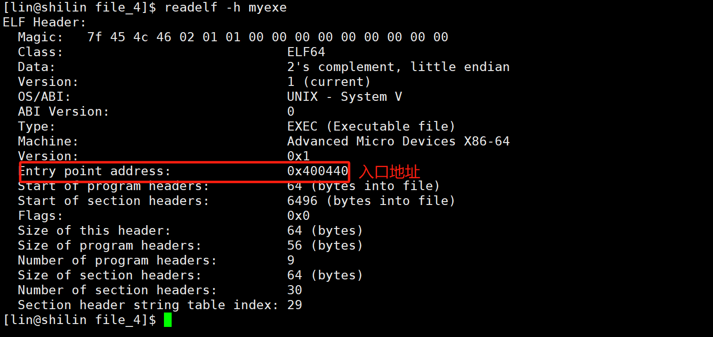

CR3当前进行的页表保存下来，EIP就是PC指针（程序计数器），PC指针记录的是当前正在执行的指令的下一条指令的地址

在CPU内部有一个叫做MMU，MMU拿着EIP对应的虚拟地址，拿着CR3的页表的地址，就可以进行转换，变成物理地址

当CPU执行到可执行程序的其中一行，CPU（指令内部）用到的是虚拟地址，再进行虚拟地址到物理地址转换。CPU进来的就是虚拟地址，出去的时候就是物理地址

> 结论：虚拟地址空间技术，需要：OS支持，编译器，CPU硬件支持。
>

进程mm_struct、vm_area_struct在进程刚刚创建的时候，初始化数据从哪里来的？从ELF各个segment来，每个segment有自己的起始地址和自己的长度，用来初始化内核结构中的[start, end]等范围数据，另外在用详细地址，填充页表。

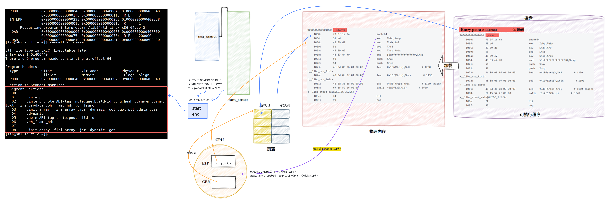


## 动态链接与动态库加载
### 动态库
让我们自己的程序跑起来，处理要加载a.out本身，也要加载a.out依赖的库文件

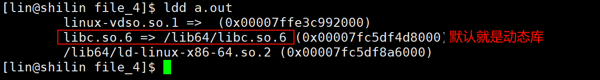

进程是如何看到对应的库文件的？通过自己的虚拟地址空间中的共享区看到的！

库本质上也是文件

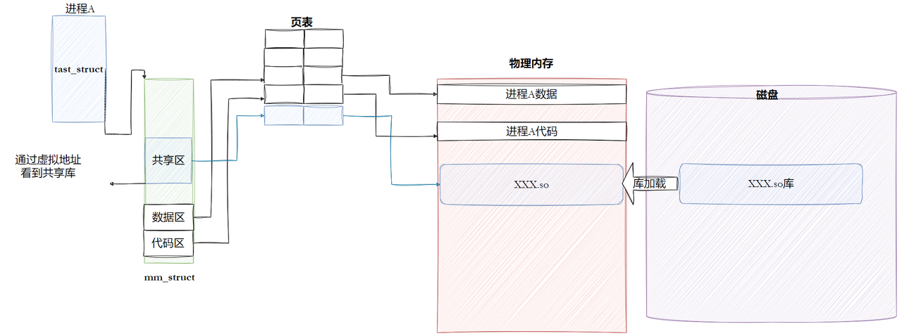

而之前说的虚拟地址空间中的共享区是会同时映射很多的库


多个进程是如何看到同一个库的？每一个进程把要的库映射到自己的地址空间中。

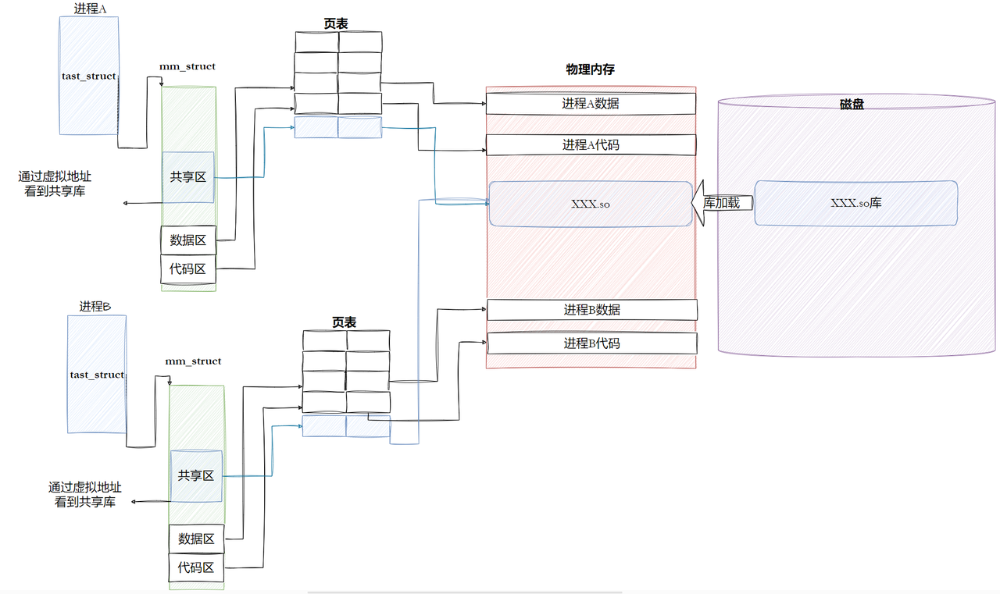

而在物理内存中，本质上是只有一份，所以动态库的本质是**通过地址空间映射，对公共代码进行去重**。

### 动态链接
使用`ldd`查看我们写的可执行程序，会看到链接了一个C语言库。

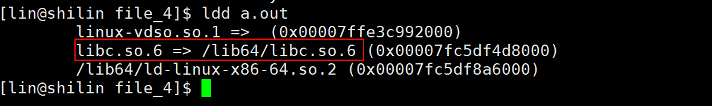

这里的 libc.so是C语言的运行时库，里面提供了常用的标准输入输出文件字符串处理等等这些功能。

如果使用静态链接会将编译产生的所有目标文件，连同用到的各种库，合并形成一个独立的可执行文件，它不需要额外的依赖就可以运行，但是静态链接最大的问题在于生成的文件体积大，并且相当耗费内存资源。我们可以将需要共享的代码单独提取出来，保存成一个独立的动态链接库，等到程序运行的时候再将它们加载到内存，这样不但可以节省空间，因为同一个模块在内存中只需要保留一份副本，可以被不同的进程所共享。

> 动态链接实际上将链接的整个过程推迟到了程序加载的时候。
>

运行一个程序，操作系统会首先将程序的数据代码连同它用到的一系列动态库先加载到内存，其中每个动态库的加载地址都是不固定的，操作系统会根据当前地址空间的使用情况为它们动态分配一段内存。

当动态库被加载到内存以后，一旦它的内存地址被确定，我们就可以去修正动态库中的那些函数跳转地址了。

---

在C/C++程序中，当程序开始执行时，它首先并不会直接跳转到main函数。实际上，程序的入口点是`_start`，这是一个由C运行时库（通常是glibc）或链接器（如ld）提供的特殊函数。

在`_start`函数中，会执行一系列初始化操作，这些操作包括：

1. 设置堆栈：为程序创建一个初始的堆栈环境。
2. 初始化数据段：将程序的数据段（如全局变量和静态变量）从初始化数据段复制到相应的内存位置，并清零未初始化的数据段。
3. 动态链接：这是关键的一步， `_start`函数会调用动态链接器的代码来解析和加载程序所依赖的动态库（shared libraries）。动态链接器会处理所有的符号解析和重定位，确保程序中的函数调用和变量访问能够正确地映射到动态库中的实际地址。

> 动态链接器：
>
> + 动态链接器（如ld-linux.so）负责在程序运行时加载动态库。
> + 当程序启动时，动态链接器会解析程序中的动态库依赖，并加载这些库到内存中。
>
> 环境变量和配置文件：
>
> + Linux系统通过环境变量（如LD_LIBRARY_PATH）和配置文件（如/etc/ld.so.conf及其子配置文件）来指定动态库的搜索路径。
> + 这些路径会被动态链接器在加载动态库时搜索。
>
> 缓存文件：
>
> + 为了提高动态库的加载效率，Linux系统会维护一个名为/etc/ld.so.cache的缓存文件。
> + 该文件包含了系统中所有已知动态库的路径和相关信息，动态链接器在加载动态库时会首先搜索这个缓存文件
>

4. 调用 `__libc_start_main`：一旦动态链接完成，`_start`函数会调用`__libc_start_main`（这是glibc提供的一个函数）。`__libc_start_main`函数负责执行一些额外的初始化工作，比如设置信号处理函数、初始化线程库（如果使用了线程）等。
5. 调用`main`函数：最后，`__libc_start_main`函数会调用程序的`main`函数，此时程序的执行控制权才正式交给用户编写的代码。
6. 处理`main`函数的返回值：当`main`函数返回时， `__libc_start_main`会负责处理这个返回值，并最终调用`_exit`函数来终止程序。

### 动态库中的相对地址
动态库为了随时进行加载，为了支持并映射到任意进程的任意位置，对动态库中的方法进行统一编址，采用相对编址的方案进行编制的(其实可执行程序也一样，都要遵守平坦模式，只不过exe是直接加载的)。

动态库也是一个文件，要访问也是要被先加载，要加载也是要被打开的

让我们的进程找到动态库的本质：也是文件操作，不过我们访问库函数，通过虚拟地址进行跳转访问的，所以需要把动态库映射到进程的地址空间中

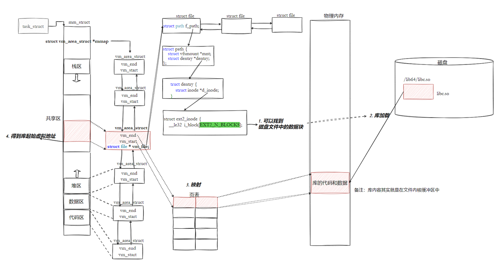

我们的程序，怎么进行库函数调用

1. 库已经被我们映射到了当前进程的地址空间中
2. 库的虚拟起始地址我们也已经知道了
3. 库中每一个方法的偏移量地址我们也知道
4. 所有：访问库中任意方法，只需要知道库的起始虚拟地址+方法偏移量即可定位库中的方法
5. 而且：整个调用过程，是从代码区跳转到共享区，调用完毕在返回到代码区，整个过程完全在进程地址空间中进行的。

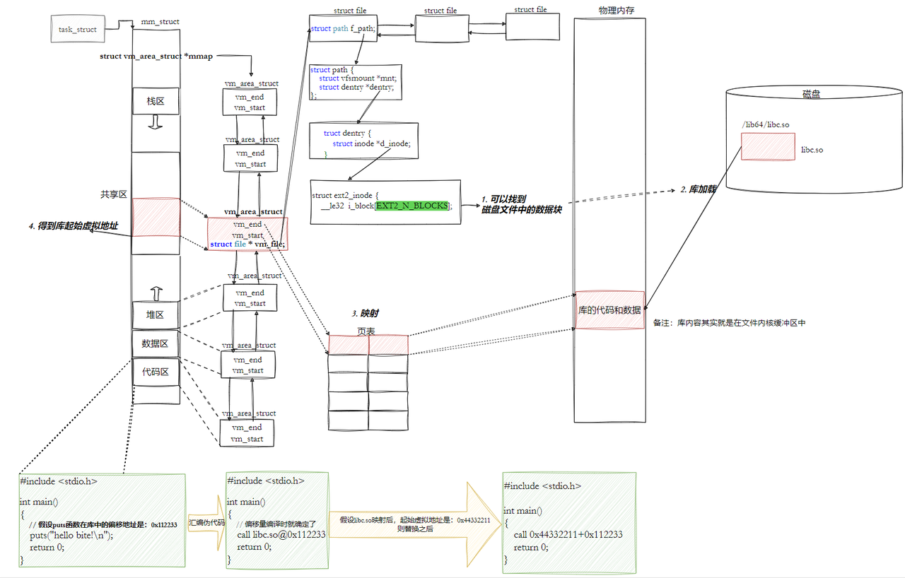

**结论1：库函数调用，也是在进程的虚拟地址空间范围内调用！**

**结论2：动态库被映射到进程的任意位置(一般是共享区)，我们的进程都能调用。**

**结论3：多进程映射的时候，每个进程都会把动态库映射到自己的地址空间，但是起始地址可能不同！但是不妨碍，任意进程访问库函数。**

其实在编译形成动态库的时候，每个方法的偏移量值已经有了，我们形成我们的程序，进行连接的时候，库名称保留，修改我们自己程序中调用函数，**库名字@偏移量**的方式，就找到了！

这上面的工作（尤其是动态加载时，进行地址重定向）是一个叫**动态链接器**在做！

程序启动的时候，要先加载ld链接库，而之前看到的`_strat`就是ld内部的方法

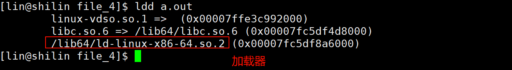

## 全局偏移量表GOT(global offset table)
程序运行之前，先把所有库加载并映射，所有库的起始虚拟地址都应该提前知道，然后对我们加载到内存中的程序的库函数调用进行地址修改，在内存中二次完成地址设置(这个叫做加载地址重定位)。

不是说代码区在进程中是只读的吗？

所以：动态链接采用的做法是在`.data`（可执行程序或者库自己）中专门预留一片区域用来存放函数的跳转地址，它也被叫做全局偏移表GOT，表中每一项都是本运行模块要引用的一个全局变量或函数的地址。因为`.data`区域是可读写的，所以可以支持动态进行修改

`readelf -S a.out`

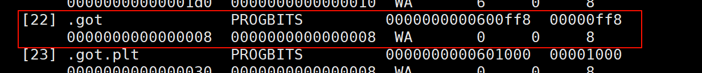

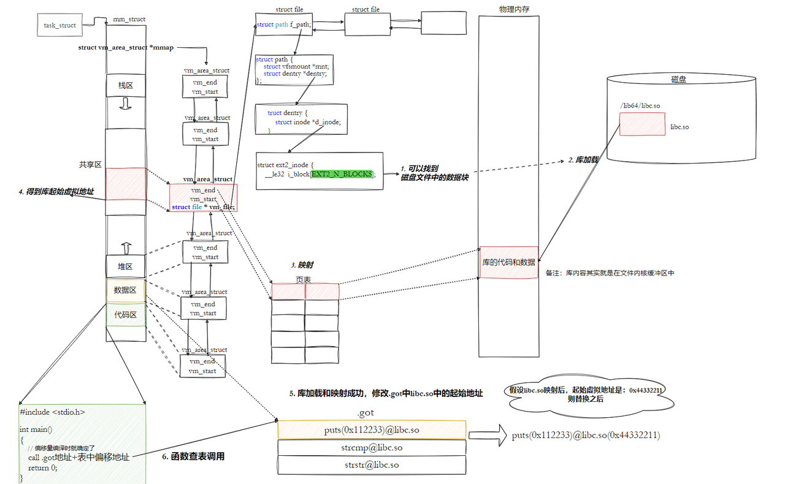

1. 由于代码段只读，我们不能直接修改代码段。但有了GOT表，代码便可以被所有进程共享。但在不同进程的地址空间中，各动态库的绝对地址、相对位置都不同。反映到GOT表上，就是每个进程的每个动态库都有独立的GOT表，所以**进程间不能共享GOT表**。
2. 在单个`.so`下，由于GOT表与`.text`的相对位置是固定的，我们完全可以**利用CPU的相对寻址来找到GOT表**。
3. 在调用函数的时候会**首先查表**，然后根据**表中的地址来进行跳转**，这些地址**在动态库加载的时候会被修改为真正的地址**。
4. 这种方式实现的动态链接就被叫做**PIC地址无关代码**。换句话说，我们的动态库不需要做任何修改，被加载到任意内存地址都能够正常运行，并且能够被所有进程共享，这也是为什么之前我们给编译器指定`-fPIC`参数的原因，`PIC=相对编址+GOT`。

## 库之间依赖
不仅仅有可执行程序调用库

+ 库也会调用其他库！！库之间是有依赖的，如何做到库和库之间互相调用也是与地址无关的呢？
+ 库中也有`.GOT`，和可执行一样！这也就是为什么大家为什么都是ELF的格式。

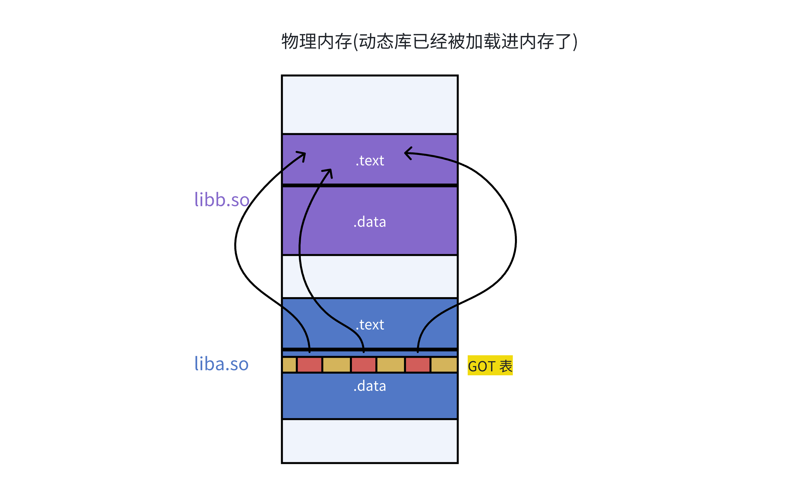

由于动态链接在程序加载的时候需要对大量函数进行重定位，这一步显然是非常耗时的。为了进一步降低开销，我们的操作系统还做了一些其他的优化，比如延迟绑定，或者也叫PLT（过程连接表（Procedure Linkage Table））。与其在程序一开始就对所有函数进行重定位，不如将这个过程推迟到函数第一次被调用的时候，因为绝大多数动态库中的函数可能在程序运行期间一次都不会被使用到。

+ GOT中的跳转地址默认会指向一段辅助代码，它也被叫做桩代码/stup。在我们第一次调用函数的时候，这段代码会负责查询真正函数的跳转地址，并且去更新GOT表。于是我们再次调用函数的时候，就会直接跳转到动态库中真正的函数实现

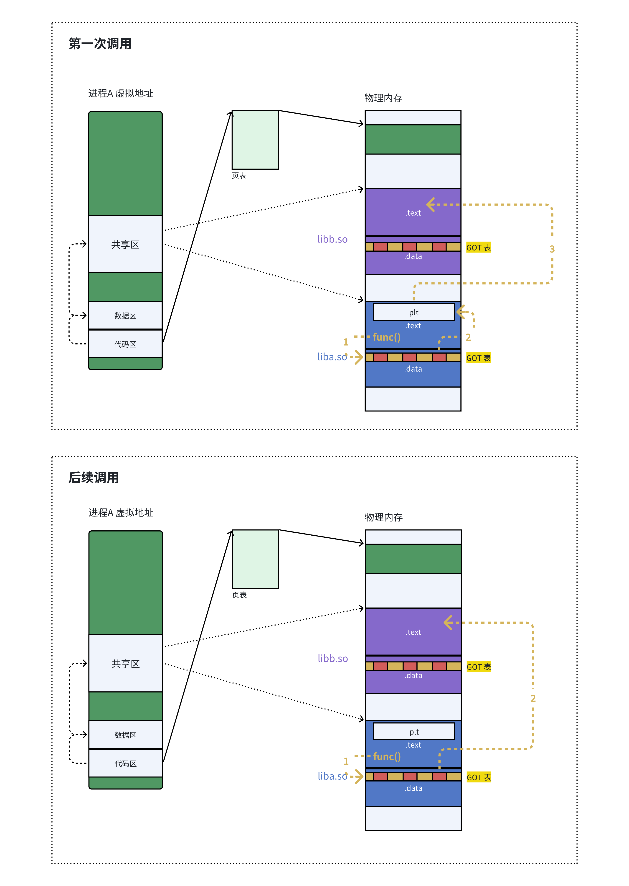

动态链接实际上将链接的整个过程，比如符号查询、地址的重定位从编译时推迟到了程序的运行时，它虽然牺牲了一定的性能和程序加载时间，但绝对是物有所值的。因为动态链接能够更有效的利用磁盘空间和内存资源，以极大方便了代码的更新和维护，更关键的是，它实现了二进制级别的代码复用。

> 析依赖关系的时候，就是加载并完善互相之间的GOT表的过程。
>


