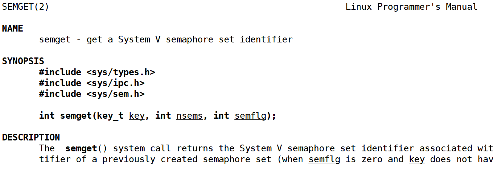
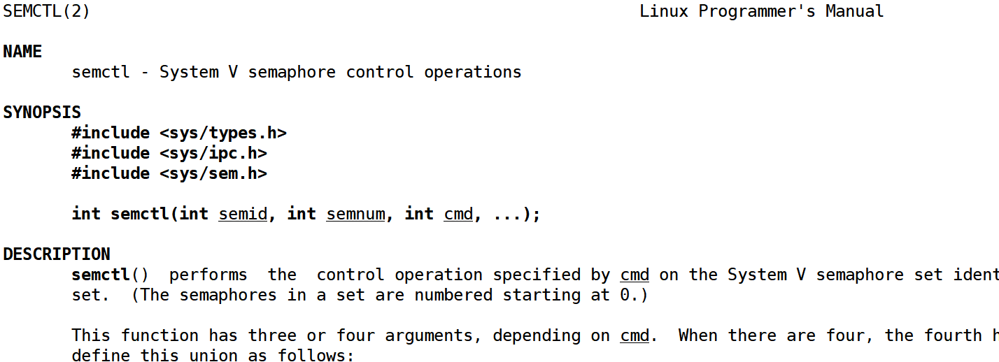
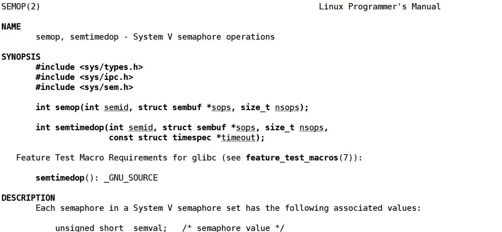

# Linux基于建造者模式实现信号量
信号量本质是一把计数器（资源数量的计数器）

## 信号量结构体
```c
struct semaphore {
	atomic_t count;
	wait_queue_head_t wait;
};
```

## 信号量集结构体
```c
/* Obsolete, used only for backwards compatibility and libc5 compiles */
struct semid_ds {
	struct ipc_perm	sem_perm;		/* permissions .. see ipc.h */
	__kernel_time_t	sem_otime;		/* last semop time */
	__kernel_time_t	sem_ctime;		/* last change time */
	struct sem	*sem_base;		/* ptr to first semaphore in array */
	struct sem_queue *sem_pending;		/* pending operations to be processed */
	struct sem_queue **sem_pending_last;	/* last pending operation */
	struct sem_undo	*undo;			/* undo requests on this array */
	unsigned short	sem_nsems;		/* no. of semaphores in array */
};
struct ipc_perm
{
	__kernel_key_t	key;
	__kernel_uid_t	uid;
	__kernel_gid_t	gid;
	__kernel_uid_t	cuid;
	__kernel_gid_t	cgid;
	__kernel_mode_t	mode; 
	unsigned short	seq;
};
```

## 信号量操作接口
### semget
```c
int semget(key_t key, int nsems, int semflg);
```



参数介绍：

<font style="color:rgb(31,35,41);">key: 信号量集的键值，同消息队列和共享内存</font>

<font style="color:rgb(31,35,41);">nsems: 信号量集中信号量的个数</font>

<font style="color:rgb(31,35,41);">semflg: 同消息队列和共享内存</font>

### <font style="color:rgb(31,35,41);">semctl</font>
```c
int semctl(int semid, int semnum, int cmd, ...);
```



<font style="color:rgb(31,35,41);">参数介绍 </font>

<font style="color:rgb(31,35,41);">semid: 由 semget 返回的信号集标识码 </font>

<font style="color:rgb(31,35,41);">semnum: 信号集中信号量的序号</font>

<font style="color:rgb(31,35,41);">cmd: 将要采取的动作</font>

### semop
```c
int semop(int semid, struct sembuf *sops, size_t nsops);
```



<font style="color:rgb(31,35,41);">参数介绍 </font>

<font style="color:rgb(31,35,41);">semid: 是该信号量的标识码，也就是 semget 函数的返回值 </font>

<font style="color:rgb(31,35,41);">sops: 指向⼀个结构 sembuf 的指针 </font>

<font style="color:rgb(31,35,41);">nsops: </font>`<font style="color:rgb(31,35,41);">sops</font>`<font style="color:rgb(31,35,41);">对应的信号量的个数，也就是可以同时对多个信号量进行PV操作</font>

## 使用建造者模式进行封装Sem
### Sem.hpp
```cpp
#ifndef SEM_HPP
#define SEM_HPP

#include <iostream>
#include <memory>
#include <string>
#include <vector>
#include <sys/types.h>
#include <sys/ipc.h>
#include <sys/sem.h>

const std::string SEM_PATH = "/tmp";
const int SEM_PROJ_ID = 0x77;
const int defaultnum = 1;
#define GET_SEM (IPC_CREAT)
#define BUILD_SEM (IPC_CREAT | IPC_EXCL)

// 一个把整数转十六进制的函数
std::string intToHex(int num)
{
    char hex[64];
    snprintf(hex, sizeof(hex), "0x%x", num);
    return std::string(hex);
}

// 产品类, 只需要关心自己的使用即可(删除)
// 这里的Semaphore不是一个信号量！！而是一个信号量集合！！，要指明你要PV操作哪一个信号量！！
class Semaphore
{
private:
    void PV(int who, int data)
    {
        struct sembuf sem_buf;
        sem_buf.sem_num = who;      // 信号量编号,从0开始
        sem_buf.sem_op = data;      // S + sem_buf.sem_op
        sem_buf.sem_flg = SEM_UNDO; // 不关心
        int n = semop(_semid, &sem_buf, 1);
        if (n < 0)
        {
            std::cerr << "semop PV failed" << std::endl;
        }
    }

public:
    Semaphore(int semid) : _semid(semid)
    {
    }
    int Id() const
    {
        return _semid;
    }
    void P(int who)
    {
        PV(who, -1);
    }
    void V(int who)
    {
        PV(who, 1);
    }
    ~Semaphore()
    {
        if (_semid >= 0)
        {
            int n = semctl(_semid, 0, IPC_RMID);
            if (n < 0)
            {
                std::cerr << "semctl IPC_RMID failed" << std::endl;
            }
            std::cout << "Semaphore " << _semid << " removed" << std::endl;
        }
    }

private:
    int _semid;
};

// 建造者接口
class SemaphoreBuilder
{
public:
    virtual ~SemaphoreBuilder() = default;
    virtual void BuildKey() = 0;
    virtual void SetPermission(int perm) = 0;
    virtual void SetSemNum(int num) = 0;
    virtual void SetInitVal(std::vector<int> initVal) = 0;
    virtual void Build(int flag) = 0;
    virtual void InitSem() = 0;
    virtual std::shared_ptr<Semaphore> GetSem() = 0;
};

// 具体建造者类
class ConcreteSemaphoreBuilder : public SemaphoreBuilder
{
public:
    ConcreteSemaphoreBuilder() {}
    virtual void BuildKey() override
    {
        // 1. 构建键值
        std::cout << "Building a semaphore" << std::endl;
        _key = ftok(SEM_PATH.c_str(), SEM_PROJ_ID);
        if (_key < 0)
        {
            std::cerr << "ftok failed" << std::endl;
            exit(1);
        }
        std::cout << "Got key: " << intToHex(_key) << std::endl;
    }
    virtual void SetPermission(int perm) override
    {
        _perm = perm;
    }
    virtual void SetSemNum(int num) override
    {
        _num = num;
    }
    virtual void SetInitVal(std::vector<int> initVal) override
    {
        _initVal = initVal;
    }
    virtual void Build(int flag) override
    {
        // 2. 创建信号量集合
        int semid = semget(_key, _num, flag | _perm);
        if (semid < 0)
        {
            std::cerr << "semget failed" << std::endl;
            exit(2);
        }
        std::cout << "Got semaphore id: " << semid << std::endl;
        _sem = std::make_shared<Semaphore>(semid);
    }
    virtual void InitSem() override
    {
        if (_num > 0 && _initVal.size() == _num)
        {
            // 3. 初始化信号量集合
            for (int i = 0; i < _num; i++)
            {
                if (!Init(_sem->Id(), i, _initVal[i]))
                {
                    std::cerr << "Init failed" << std::endl;
                    exit(3);
                }
            }
        }
    }
    virtual std::shared_ptr<Semaphore> GetSem() override
    {
        return _sem;
    }

private:
    bool Init(int semid, int num, int val)
    {
        union semun
        {
            int val;               /* Value for SETVAL */
            struct semid_ds *buf;  /* Buffer for IPC_STAT, IPC_SET */
            unsigned short *array; /* Array for GETALL, SETALL */
            struct seminfo *__buf; /* Buffer for IPC_INFO
                                      (Linux-specific) */
        } un;
        un.val = val;
        int n = semctl(semid, num, SETVAL, un);
        if (n < 0)
        {
            std::cerr << "semctl SETVAL failed" << std::endl;
            return false;
        }
        return true;
    }

private:
    key_t _key;                      // 信号量集合的键值
    int _perm;                       // 权限
    int _num;                        // 信号量集合的个数
    std::vector<int> _initVal;       // 初始值
    std::shared_ptr<Semaphore> _sem; // 我们要创建的具体产品
};

// 指挥者类
class Director
{
public:
    void Construct(std::shared_ptr<SemaphoreBuilder> builder, int flag, int perm = 0666, int num = defaultnum, std::vector<int> initVal = {1})
    {
        builder->BuildKey();
        builder->SetPermission(perm);
        builder->SetSemNum(num);
        builder->SetInitVal(initVal);
        builder->Build(flag);
        if (flag == BUILD_SEM)
        {
            builder->InitSem();
        }
    }
};

#endif // SEM_HPP
```

### write.cc
```cpp
#include "Sem.hpp"
#include <unistd.h>
#include <ctime>
#include <cstdio>

int main()
{
    // 基于抽象接口类的具体建造者
    std::shared_ptr<SemaphoreBuilder> builder = std::make_shared<ConcreteSemaphoreBuilder>();
    // 指挥者对象
    std::shared_ptr<Director> director = std::make_shared<Director>();

    // 在指挥者的指导下，完成建造过程
    director->Construct(builder, BUILD_SEM, 0600, 3, {1, 2, 3});

    // 完成了对象的创建的过程，获取对象
    // Semaphore
    auto fsem = builder->GetSem();

    srand(time(0) ^ getpid());
    pid_t pid = fork();

    // 我们期望的是，父子进行打印的时候，C或者F必须成对出现！保证打印是原子的.
    if (pid == 0)
    {
        director->Construct(builder, GET_SEM);
        auto csem = builder->GetSem();
        while (true)
        {
            csem->P(0);
            printf("C");
            usleep(rand() % 95270);
            fflush(stdout);
            printf("C");
            usleep(rand() % 43990);
            fflush(stdout);
            csem->V(0);
        }
    }
    while (true)
    {
        fsem->P(0);
        printf("F");
        usleep(rand() % 95270);
        fflush(stdout);
        printf("F");
        usleep(rand() % 43990);
        fflush(stdout);
        fsem->V(0);
    }

    return 0;
}
```


