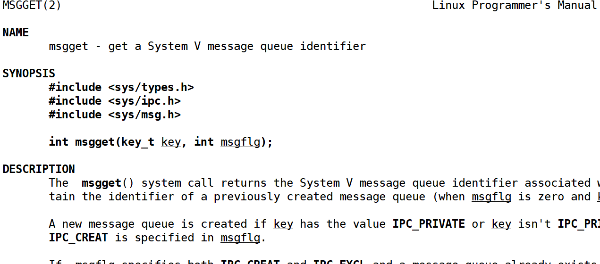
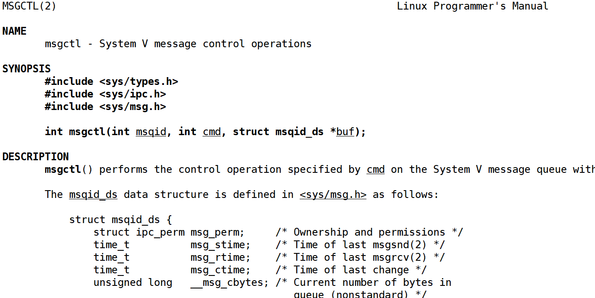
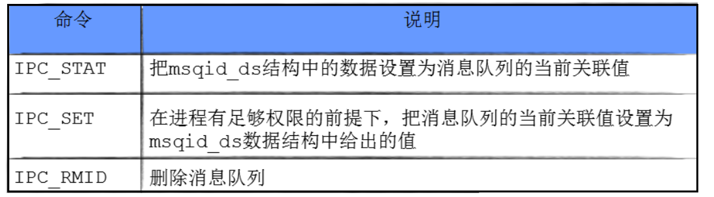
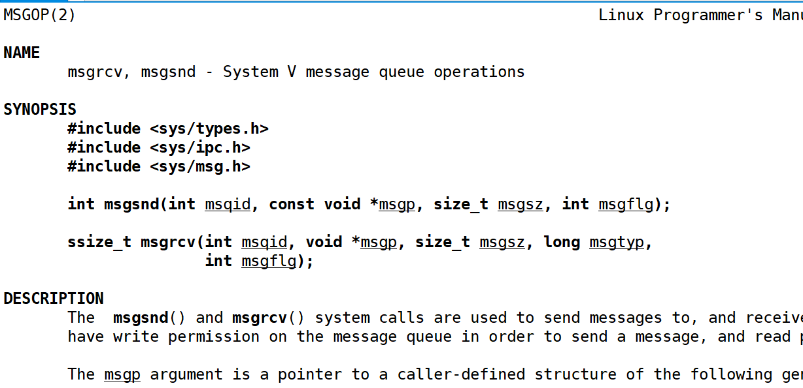
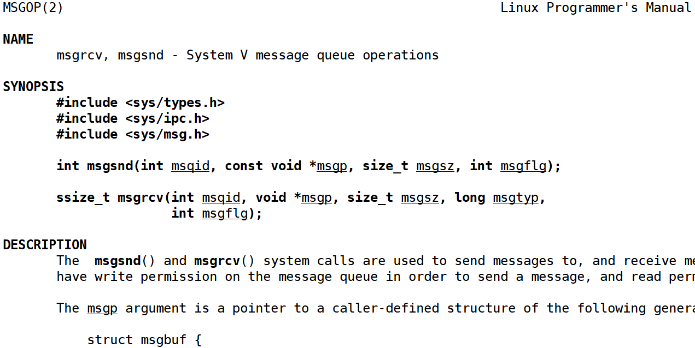

# Linux基于责任链模式实现消息队列
# 概述
消息队列提供了一个从一个进程向另外一个进程发送有类型块数据的方法

每个数据块都被认为是有⼀个类型，接收者进程接收的数据块可以有不同的类型值

消息队列也有管道一样的不足，就是每个消息的最大长度是有上限的（MSGMAX）

每个消息队列的总的字节数也是有上限的（MSGMNB），系统上消息队列的总数也有上限（MSGMNI）的

消息队列的生命周期是随内核的

`ipcs -q && ipcrm -q msgfd`

消息队列支持全双工通信

# 源码
`/usr/include/linux/ipc.h `,内核为每个IPC对象维护一个数据结构

```cpp
struct ipc_perm {
    key_t __key; /* Key supplied to xxxget(2) */
    uid_t uid; /* Effective UID of owner */
    gid_t gid; /* Effective GID of owner */
    uid_t cuid; /* Effective UID of creator */
    gid_t cgid; /* Effective GID of creator */
    unsigned short mode; /* Permissions */
    unsigned short __seq; /* Sequence number */
};
```

消息队列结构

`/usr/include/linux/msg.h`

```cpp
struct msqid_ds {
    struct ipc_perm msg_perm;
    struct msg msg_first; / first message on queue,unused */
    struct msg msg_last; / last message in queue,unused */
    __kernel_time_t msg_stime; /* last msgsnd time */
    __kernel_time_t msg_rtime; /* last msgrcv time */
    __kernel_time_t msg_ctime; /* last change time */
    unsigned long msg_lcbytes; /* Reuse junk fields for 32 bit */
    unsigned long msg_lqbytes; /* ditto */
    unsigned short msg_cbytes; /* current number of bytes on queue */
    unsigned short msg_qnum; /* number of messages in queue */
    unsigned short msg_qbytes; /* max number of bytes on queue */
    __kernel_ipc_pid_t msg_lspid; /* pid of last msgsnd */
    __kernel_ipc_pid_t msg_lrpid; /* last receive pid */
};
```

# 接口
## msgget


参数

+ key : 某个消息队列的名字
+ msgflg :由九个权限标志构成，它们的⽤用法和创建文件时使用的mode模式标志是一样

返回值

+ 成功返回一个非负整数，即该消息队列的标识码；失败返回-1

## msgctl


参数

+ msgid : 由msgget 函数返回的消息队列标识码
+ cmd :将要采取的动作（有三个可取值），分别如下：



+ buf : 属性缓冲区

返回值

+ 成功返回0；失败返回-1

## msgsnd


参数

+ msgid : 由msgget 函数返回的消息队列标识码
+ msgp:是一个指针，指针指向准备发送的消息
+ msgsz:是msgp指向的消息长度，这个长度不含保存消息类型的那个`long int`长整型
+ msgflg:控制着当前消息队列满或到达系统上限时将要发生的事情, 0即可（ msgflg=IPC_NOWAIT 表⽰示队列满不等待，返回EAGAIN 错误 ）。

返回值

+ 成功返回0；失败返回-1

### 消息主体
```cpp
struct msgbuf {
    long mtype; /* message type, must be > 0 */
    char mtext[1]; /* message data */
};
// 以一个long int长整数开始，接收者函数将利⽤用这个长整数确定消息的类型
```

## msgrcv


参数

+ msgid : 由`msgget`函数返回的消息队列标识码
+ msgp :是一个指针，指针指向准备接收的消息
+ msgsz :是`msgp`指向的消息长度，这个长度不含保存消息类型的那个`long int`长整型
+ msgtype :它可以实现接收消息的类型，也可以模拟优先级的简单形式进行接收
+ msgflg :控制着队列中没有相应类型的消息可供接收时将要发⽣生的事

返回值

+ 成功返回实际放到接收缓冲区⾥里去的字符个数，失败返回-1

msgflg标志位

> msgtype=0返回队列第一条信息
>
> msgtype>0返回队列第一条类型等于msgtype的消息　
>
> msgtype<0返回队列第一条类型小于等于msgtype绝对值的消息，并且是满⾜足条件的消息类型最小的消息
>
> msgflg=IPC_NOWAIT，队列没有可读消息不等待，返回ENOMSG错误。
>
> msgflg=MSG_NOERROR，消息大小超过msgsz时被截断
>
> msgtype>0且msgflg=MSG_EXCEPT，接收6 类型不等于msgtype的第一条消息
>

# 消息队列实现
## MsgQueue.hpp
```cpp
#ifndef __MSG_QUEUE__
#define __MSG_QUEUE__

#include <iostream>
#include <string>
#include <cstring>
#include <sys/types.h>
#include <sys/ipc.h>
#include <sys/msg.h>

const std::string PATHNAME = "/tmp";
const int PROJID = 0x77;
const int default_fd = -1;

// 创建方式
#define GET_MSGQUEUE (IPC_CREAT)
#define CREATE_QUEUE (IPC_CREAT | IPC_EXCL | 0666)

// 默认大小
const int defualt_size = 1024;

// 定义消息类型
#define MSG_TYPE_CLIENT 1
#define MSG_TYPE_SERVER 2

class MsgQueue
{
private:
    struct msgbuf
    {
        long mtype;
        char mtext[defualt_size];
    };

public:
    MsgQueue()
        : _msgfd(default_fd)
    {
    }
    void Create(int flag)
    {
        // 1. 创建key
        key_t key = ftok(PATHNAME.c_str(), PROJID);
        if (key == -1)
        {
            std::cerr << "ftok error" << std::endl;
            exit(1);
        }

        std::cout << "key: " << std::hex << key << std::endl;
        // 2. 创建消息队列
        _msgfd = msgget(key, flag);
        if (_msgfd == -1)
        {
            std::cerr << "msgget error" << std::endl;
            exit(2);
        }
        std::cout << "msgqueue created: " << _msgfd << std::endl;
    }

    void Destory()
    {
        int n = msgctl(_msgfd, IPC_RMID, 0);
        if (n == -1)
        {
            std::cerr << "msgctl error" << std::endl;
            return;
        }
        std::cout << "msgqueue destroyed" << std::endl;
    }

    void Send(int type, const std::string &text)
    {
        struct msgbuf msg;
        memset(&msg, 0, sizeof(msg));

        msg.mtype = type;
        memcpy(msg.mtext, text.c_str(), text.size());

        int n = msgsnd(_msgfd, &msg, sizeof(msg.mtext), 0);
        if (n == -1)
        {
            std::cerr << "msgsnd error" << std::endl;
            return;
        }
    }

    void Recv(int type, std::string &text)
    {
        struct msgbuf msg;
        int n = msgrcv(_msgfd, &msg, sizeof(msg.mtext), type, 0);
        if (n == -1)
        {
            std::cerr << "msgrcv error" << std::endl;
            return;
        }

        msg.mtext[n] = '\0';
        text = msg.mtext;
    }

    // 获取消息队列中的属性
    void GetAttr()
    {
        struct msqid_ds outbuffer;
        int n = msgctl(_msgfd, IPC_STAT, &outbuffer);
        if (n == -1)
        {
            std::cerr << "msgctl error" << std::endl;
            return;
        }
        std::cout << "outbuffer.msg_perm.__key: " << std::hex << outbuffer.msg_perm.__key << std::endl;
    }

    ~MsgQueue()
    {
    }

private:
    int _msgfd;
};

class Server : public MsgQueue
{
public:
    Server()
    {
        MsgQueue::Create(CREATE_QUEUE);
        std::cout << "server create msgqueue done" << std::endl;
        MsgQueue::GetAttr();
    }
    ~Server()
    {
        Destory();
    }
};

class Client : public MsgQueue
{
public:
    Client()
    {
        MsgQueue::Create(GET_MSGQUEUE);
        std::cout << "client get msgqueue done" << std::endl;
    }
    ~Client()
    {
    }
};

#endif
```

## Client
```cpp
#include "MsgQueue.hpp"

int main()
{
    Client client;
    while (true)
    {
        // 只让client发送消息
        std::string input;
        std::cout << "Please input message: ";
        std::getline(std::cin, input);
        client.Send(MSG_TYPE_CLIENT, input);
        if (input == "exit")
        {
            break;
        }
    }
    return 0;
}

```

## Server
```cpp
#include "MsgQueue.hpp"

int main()
{

    std::string text;
    Server server;

    while (true)
    {
        // 如果消息队列为空，阻塞等待
        server.Recv(MSG_TYPE_CLIENT, text);
        std::cout << "Received: " << text << std::endl;
        if (text == "exit")
        {
            break;
        }
    }
    return 0;
}
```

# 基于责任链模式实现消息队列框架
新需求：

+ `client`发送给server 的输入内容，拼接上时间，进程pid信息
+ `server`收到的内容持久化保存到文件中
+ 文件的内容如果过大，要进行切片保存并在指定的目录下打包保存，命令自定义

解决方案：**责任链模式**

一种行为设计模式，它允许你将请求沿着处理者链进行传递。每个处理者都对请求进行检查，以决定是否处理它。如果处理者能够处理该请求，它就处理它；否则，它将请求传递给链中的下一个处理者。这个模式使得多个对象都有机会处理请求，从而避免了请求的发送者和接收者之间的紧耦合。

```cpp
// 责任链 基类
class HandlerText
{
public:

protected:
};

// 对文本进行格式化处理的
class HandlerTextFormat : public HandlerText
{
};

// 对文本进行文件保存
class HandlerTextSaveFile : public HandlerText
{
};

// 对文件内容长度进行检查，如果长度过长，对文件内容进行打包备份
class HandlerTextBackup : public HandlerText
{
};

// 责任链入口类
class HandlerEntry
{
};
```

# 基于责任链模式实现消息队列实现
## ChainOfResponsibility.hpp
```cpp
#ifndef CHAIN_OF_RESPONSIBILITY_HPP
#define CHAIN_OF_RESPONSIBILITY_HPP

#include <iostream>
#include <memory>
#include <string>
#include <sstream>
#include <filesystem> // C++17
#include <fstream>
#include <ctime>
#include <sys/types.h>
#include <unistd.h>
#include <sys/wait.h>

const int defaultmaxline = 5; // 最大行数

// 文件的基本信息: 文件路径，文件名称
std::string defaultfilepath = "./tmp/";
std::string defaultfilename = "test.log";

// 责任链 基类
class HandlerText
{
public:
    virtual void Excute(const std::string &text) = 0;

    void SetNext(std::shared_ptr<HandlerText> next)
    {
        _next = next;
    }

    void Enable()
    {
        _enable = true;
    }
    void Disable()
    {
        _enable = false;
    }
    virtual ~HandlerText()
    {
    }

protected:
    std::shared_ptr<HandlerText> _next; // 下一个责任链节点
    bool _enable = true;                // 是否启用该节点
};

// 对文本进行格式化处理的
class HandlerTextFormat : public HandlerText
{
public:
    void Excute(const std::string &text) override
    {
        std::string format_result = text + "\n";

        // 该节点被开启，对文本进行格式化处理
        if (_enable)
        {
            std::stringstream ss;
            ss << time(nullptr) << "-" << getpid() << "-" << text << "\n";
            format_result = ss.str();
            std::cout << "step 1: 格式化消息: " << text << " 结果: " << format_result << std::endl;
        }
        if (_next)
        {
            _next->Excute(format_result); // 交给下一个
        }
        else
        {
            std::cout << "到达责任链处理结尾,完成责任链处理" << std::endl;
        }
    }
};

// 对文本进行文件保存
class HandlerTextSaveFile : public HandlerText
{
public:
    HandlerTextSaveFile(const std::string &filepath = defaultfilepath,
                        const std::string &filename = defaultfilename)
        : _filepath(filepath), _filename(filename)
    {
        // 形成默认的目录名, filesystem
        if (std::filesystem::exists(_filepath))
            return;
        try
        {
            // 创建目录
            std::filesystem::create_directories(_filepath);
        }
        catch (std::filesystem::filesystem_error const &e)
        {
            std::cerr << e.what() << '\n';
        }
    }

    void Excute(const std::string &text) override
    {
        if (_enable)
        {
            // 保存到文件中
            std::string file = _filepath + _filename;
            std::ofstream ofs(file, std::ios::app);
            if (!ofs.is_open())
            {
                std::cerr << "open file error: " << file << std::endl;
                return;
            }
            ofs << text;
            ofs.close();
            std::cout << "step 2: 保存消息: " << text << " 到文件: " << file << std::endl;
        }
        if (_next)
        {
            _next->Excute(text); // 将处理结果，表现在text内部，传递给下一个节点
        }
        else
        {
            std::cout << "到达责任链处理结尾,完成责任链处理" << std::endl;
        }
    }

private:
    std::string _filepath;
    std::string _filename;
};

// 对文件内容长度进行检查，如果长度过长，对文件内容进行打包备份
class HandlerTextBackup : public HandlerText
{
public:
    HandlerTextBackup(const std::string &filepath = defaultfilepath,
                      const std::string &filename = defaultfilename,
                      const int &maxline = defaultmaxline)
        : _filepath(filepath), _filename(filename), _maxline(maxline)
    {
    }

    void Excute(const std::string &text) override
    {
        if (_enable)
        {
            // 该节点被开启，对文件进行检查，如果超范围，我们就要切片，并且进行打包备份
            std::string file = _filepath + _filename;
            std::cout << "Step 3: 检查文件: " << file << " 大小是否超范围" << std::endl;

            if (IsOutOfRange(file))
            {
                // 如果超了范围，进行切片备份
                std::cout << "目标文件超范围，进行切片备份" << file << std::endl;
                Backup(file);
            }
        }
        if (_next)
        {
            _next->Excute(text); // 将处理结果，表现在text内部，传递给下一个节点
        }
        else
        {
            std::cout << "到达责任链处理结尾,完成责任链处理" << std::endl;
        }
    }

private:
    bool IsOutOfRange(const std::string &file)
    {
        std::ifstream ifs(file);
        if (!ifs.is_open())
        {
            std::cerr << "open file eeor: " << file << std::endl;
            return false;
        }
        int lines = 0;
        std::string line;
        while (std::getline(ifs, line))
        {
            lines++;
        }
        ifs.close();

        return lines > _maxline;
    }

    void Backup(const std::string &file)
    {
        // 使用时间戳射在后缀
        std::string suffix = std::to_string(time(nullptr));
        // 文件名字
        std::string backup_file = file + "." + suffix; // 备份文件名
        // 源文件名字
        std::string src_file = _filename + "." + suffix;
        // 打包后的文件名字
        std::string tar_file = src_file + ".tgz";

        // 使用子进程进行切片备份并打包
        pid_t pid = fork();
        if (pid == 0)
        {
            // child
            // 1. 先对文件进行重名
            std::filesystem::rename(file, backup_file);
            std::cout << "step 4: 备份文件: " << file << " 到文件: " << backup_file << std::endl;
            // 3. 对备份文件进行打包，打包成为.tgz, 需要使用exec*系统调用
            // 先更改工作路径
            std::filesystem::current_path(_filepath);
            // 3.1.2 调用tar命令进行打包
            execlp("tar", "tar", "-czf", tar_file.c_str(), src_file.c_str(), nullptr);
            exit(1);
        }

        // parent
        int status;
        pid_t rid = waitpid(pid, &status, 0);
        if (rid > 0)
        {
            if (WIFEXITED(status) && WEXITSTATUS(status) == 0)
            {
                // 打包成功，删除源文件
                std::filesystem::remove(backup_file);
                std::cout << "step 5: 删除备份文件: " << backup_file << std::endl;
            }
        }
    }

private:
    std::string _filepath;
    std::string _filename;
    int _maxline; // 最大行数
};

// 责任链入口类
class HandlerEntry
{
public:
    HandlerEntry()
    {
        // 构造责任链节点
        _format = std::make_shared<HandlerTextFormat>();
        _save = std::make_shared<HandlerTextSaveFile>();
        _backup = std::make_shared<HandlerTextBackup>();

        // 设置责任链节点处理顺序
        _format->SetNext(_save);
        _save->SetNext(_backup);
    }
    void EnableHandler(bool isformat, bool issave, bool isbackup)
    {
        isformat ? _format->Enable() : _format->Disable();
        issave ? _save->Enable() : _save->Disable();
        isbackup ? _backup->Enable() : _backup->Disable();
    }
    void Run(const std::string &text)
    {
        _format->Excute(text);
    }
    ~HandlerEntry()
    {
    }

private:
    std::shared_ptr<HandlerText> _format;
    std::shared_ptr<HandlerText> _save;
    std::shared_ptr<HandlerText> _backup;
};

#endif // CHAIN_OF_RESPONSIBILITY_HPP
```

## Client.cc
```cpp
#include "MsgQueue.hpp"

int main()
{
    Client client;
    while (true)
    {
        // 只让client发送消息
        std::string input;
        std::cout << "Please input message: ";
        std::getline(std::cin, input);
        client.Send(MSG_TYPE_CLIENT, input);
        if (input == "exit")
        {
            break;
        }
    }
    return 0;
}
```

## Server.cc
```cpp
#include "MsgQueue.hpp"
#include "ChainOfResponsibility.hpp"

int main()
{
    std::string text;
    Server server;
    
    // 责任链模式
    HandlerEntry he;
    // 全部都开启(格式化、保存文件、备份文件)
    he.EnableHandler(true, true, true);

    while (true)
    {
        // 如果消息队列为空，阻塞等待
        server.Recv(MSG_TYPE_CLIENT, text);
        std::cout << "Received: " << text << std::endl;
        if (text == "exit")
        {
            break;
        }
        
        // 加工处理数据，采用责任链模式
        he.Run(text);
    }
    return 0;
}
```

# 进程间通信的消息队列为什么低效
+ **数据拷贝开销**：当进程向消息队列发送消息时，数据需要从用户空间拷贝到内核空间；同样，接收进程从消息队列读取消息时，数据再从内核空间拷贝到用户空间。这种两次拷贝的过程增加了系统开销，降低了通信效率。
+ **消息大小限制**：消息队列中的每个消息体有最大长度限制，且队列包含的消息体总长度也有限制。这在大数据传输场景下不够高效。
+ **同步和阻塞**：消息队列的发送和接收操作通常是同步的，即发送进程可能需要等待消息被接收后才能继续执行，这会影响系统的并发性能。

