# Linux多线程【线程互斥】
# 概念
+ 临界资源：多线程执行流共享的资源就叫做临界资源 
+ 临界区：每个线程内部，访问临界资源的代码，就叫做临界区 
+ 互斥：任何时刻，互斥保证有且只有一个执行流进入临界区，访问临界资源，通常对临界资源起保护作用 
+ 原子性：不会被任何调度机制打断的操作，该操作只有两态，要么完成，要么未完成。

# 互斥量mutex
+ 大部分情况，线程使用的数据都是局部变量，变量的地址空间在线程栈空间内，这种情况，变量归属单个 线程，其他线程无法获得这种变量。 
+ 但有时候，很多变量都需要在线程间共享，这样的变量称为共享变量，可以通过数据的共享，完成线程之 间的交互。 
+ 多个线程并发的操作共享变量，会带来一些问题。

## 模拟抢票代码
```cpp
#define NUM 4

// 线程名字
class ThreadData
{
public:
    ThreadData(int num)
    {
        threadname = "thread-" + to_string(num);
    }

public:
    string threadname;
};

int tickets = 1000;

// 买票操作
void *getTicket(void *args)
{
    ThreadData *td = static_cast<ThreadData *>(args);
    const char *name = td->threadname.c_str();
    while (true)
    {
        if (tickets > 0)
        {
            usleep(1000);
            printf("who=%s, get a ticket: %d\n", name, tickets);
            tickets--;
        }
        else
            break;
    }
    printf("%s ... quit\n", name);
    return nullptr;
}

int main()
{
    vector<pthread_t> tids;
    vector<ThreadData*> thread_datas;

    for (int i = 1; i <= NUM; i++)
    {
        pthread_t tid;
        ThreadData *td = new ThreadData(i);
        thread_datas.push_back(td);
        pthread_create(&tid, nullptr, getTicket, thread_datas[i - 1]);
        tids.push_back(tid);
    }

    // 等待
    for (auto e : tids)
    {
        pthread_join(e, nullptr);
    }
    // 释放
    for (auto e : thread_datas)
    {
        delete e;
    }
    return 0;
}
```

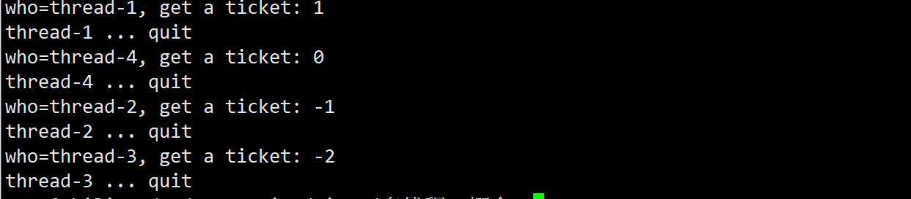

+ 造成了数据不一致问题，肯定是和多线程并发有关系
+ 一个全局变量进行多线程并发`++`或者`--`操作是否安全？-->不安全！
+ `if` 语句判断条件为真以后，代码可以并发的切换到其他线程
+ `usleep` 这个模拟漫长业务的过程，在这个漫长的业务过程中，可能有很多个线程会进入该代码段 
+ `--ticket` 操作本身就不是一个原子操作

---

取出`ticket--`部分的汇编代码

```bash
objdump -d mythread > test.objdump
```

```cpp
14e6:	8b 05 24 5b 00 00    	mov    0x5b24(%rip),%eax        # 7010 <tickets>
14ec:	83 e8 01             	sub    $0x1,%eax
14ef:	89 05 1b 5b 00 00    	mov    %eax,0x5b1b(%rip)        # 7010 <tickets>
```

`--` 操作并不是原子操作，而是对应三条汇编指令：

+ `load` ：将共享变量ticket从内存加载到寄存器中 
+ `update` : 更新寄存器里面的值，执行-1操作 
+ `store` ：将新值，从寄存器写回共享变量ticket的内存地址

> 要解决以上问题，需要做到三点：
>

+ 代码必须要有互斥行为：当代码进入临界区执行时，不允许其他线程进入该临界区。
+ 如果多个线程同时要求执行临界区的代码，并且临界区没有线程在执行，那么只能允许一个线程进入该临界区。
+ 如果线程不在临界区中执行，那么该线程不能阻止其他线程进入临界区。

> 要做到这三点，本质上就是需要一把**锁**。Linux上提供的这把锁叫**互斥量**。
>

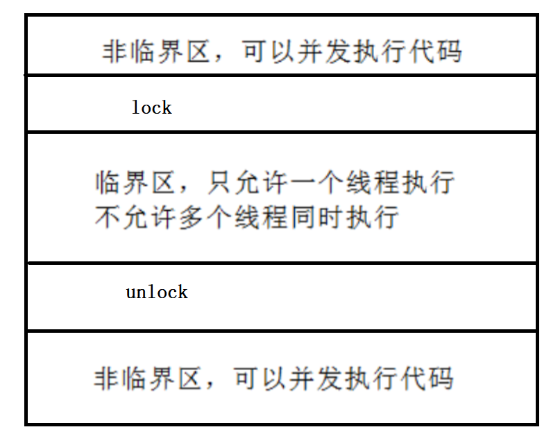

# 互斥量的接口
+ 在Ubuntu下查看需要先安装手册

```bash
sudo apt-get install manpages-posix-dev
```

## 初始化互斥量
```cpp
#include <pthread.h>
int pthread_mutex_init(pthread_mutex_t *restrict mutex,
    const pthread_mutexattr_t *restrict attr);
pthread_mutex_t mutex = PTHREAD_MUTEX_INITIALIZER;
```

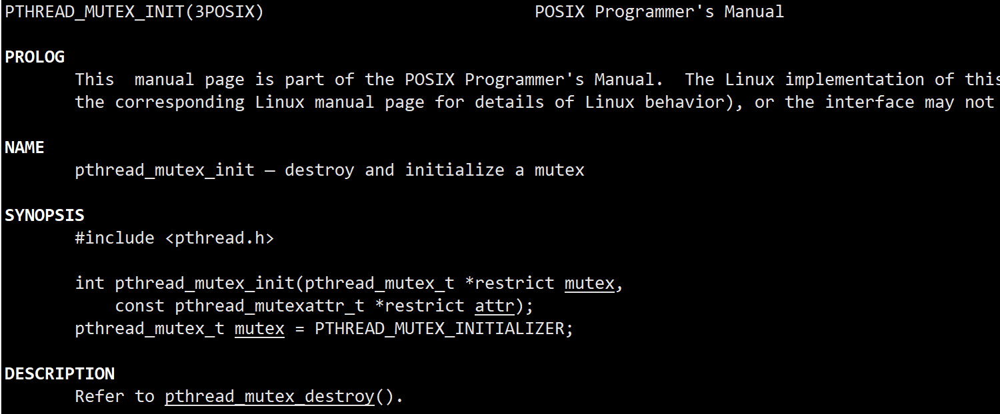

+ 第一个是动态分配（需要手动销毁）

```cpp
int pthread_mutex_init(pthread_mutex_t *restrict mutex,
    const pthread_mutexattr_t *restrict attr);
```

+ 第二个是静态分配（不需要手动销毁）

```bash
pthread_mutex_t mutex = PTHREAD_MUTEX_INITIALIZER;
```

## 销毁互斥量
```cpp
#include <pthread.h>

int pthread_mutex_destroy(pthread_mutex_t *mutex);
int pthread_mutex_init(pthread_mutex_t *restrict mutex,
    const pthread_mutexattr_t *restrict attr);
pthread_mutex_t mutex = PTHREAD_MUTEX_INITIALIZER;
```

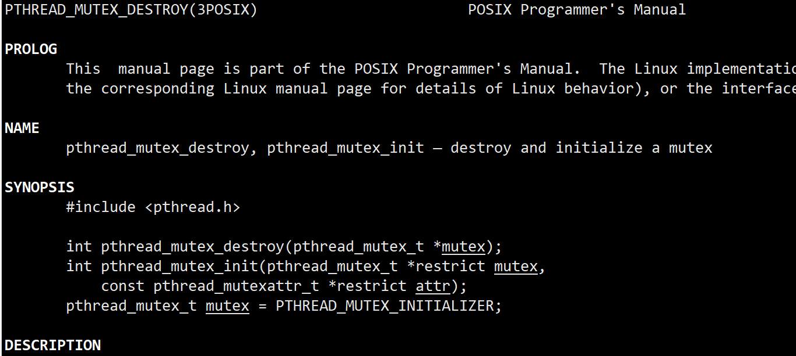

销毁互斥量需要注意：

+ 使用`PTHREAD_ MUTEX_ INITIALIZER`初始化的互斥量不需要销毁
+ 不要销毁一个已经加锁的互斥量 
+ 已经销毁的互斥量，要确保后面不会有线程再尝试加锁

## 互斥量加锁和解锁
```cpp
#include <pthread.h>

int pthread_mutex_lock(pthread_mutex_t *mutex);
int pthread_mutex_trylock(pthread_mutex_t *mutex);
int pthread_mutex_unlock(pthread_mutex_t *mutex);
```

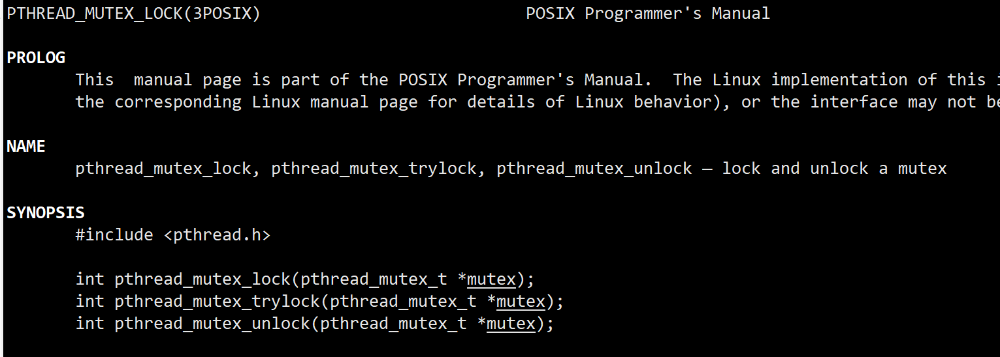

调用 `pthread_mutex_lock` 时，可能会遇到以下情况:

+ 互斥量处于未锁状态，该函数会将互斥量锁定，同时返回成功
+ 发起函数调用时，其他线程已经锁定互斥量，或者存在其他线程同时申请互斥量，但没有竞争到互斥量， 那么`pthread_mutex_lock`调用会陷入阻塞(执行流被挂起)，等待互斥量解锁。

**加锁的本质**：是用时间来换取安全  
**加锁的表现**：线程对于临界区代码串执行  
**加锁原则**：尽量的要保证临界区代码，越少越好

## 改进模拟抢票代码（加锁）
+ 然后就可以使用上面的性质来进行改进模拟抢票代码

```cpp
#include <iostream>
#include <pthread.h>
#include <unistd.h>
#include <string>
#include <vector>

using namespace std;

#define NUM 4
pthread_mutex_t lock;

// 线程名字
class ThreadData
{
public:
    ThreadData(int num, pthread_mutex_t *mutex)
    {
        lock = mutex; // 初始化锁
        threadname = "thread-" + to_string(num);
    }

public:
    string threadname;
    pthread_mutex_t *lock; // 定义一个锁指针
};

int tickets = 1000;

// 买票操作
void *getTicket(void *args)
{
    ThreadData *td = static_cast<ThreadData *>(args);
    const char *name = td->threadname.c_str();
    while (true)
    {
        // 加锁 -->
        pthread_mutex_lock(td->lock); // 申请锁成功，才能往后执行，不成功，阻塞等待。

        if (tickets > 0)
        {
            usleep(1000);
            printf("who=%s, get a ticket: %d\n", name, tickets);
            tickets--;

            // 解锁 -->
            pthread_mutex_unlock(td->lock);
        }
        else
        {
            // 解锁 --> 在else执行流要注意break，之前要解锁
            pthread_mutex_unlock(td->lock);
            break;
        }
        usleep(13); // 执行得到票之后的后续动作，如果不加usleep会导致饥饿问题
    }
    printf("%s ... quit\n", name);
    return nullptr;
}

int main()
{
    vector<pthread_t> tids;
    vector<ThreadData *> thread_datas;

    // 初始化锁
    pthread_mutex_init(&lock, nullptr);

    for (int i = 1; i <= NUM; i++)
    {
        pthread_t tid;
        ThreadData *td = new ThreadData(i, &lock); // 传入锁
        thread_datas.push_back(td);
        pthread_create(&tid, nullptr, getTicket, thread_datas[i - 1]);
        tids.push_back(tid);
    }

    // 等待
    for (auto e : tids)
    {
        pthread_join(e, nullptr);
    }
    // 释放
    for (auto e : thread_datas)
    {
        delete e;
    }
    
    pthread_mutex_destroy(&lock); // 销毁锁

    return 0;
}
```

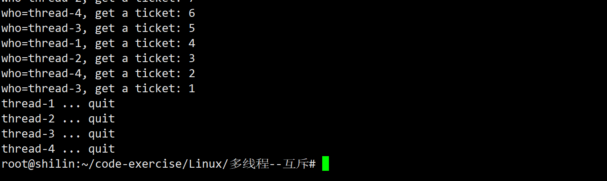

+ 或者使用全局初始化也可以

```cpp
// 直接初始化锁
pthread_mutex_t lock = PTHREAD_MUTEX_INITIALIZER;

// 线程名字
class ThreadData
{
public:
    ThreadData(int num)
    {
        threadname = "thread-" + to_string(num);
    }

public:
    string threadname;
};

int tickets = 1000;

// 买票操作
void *getTicket(void *args)
{
    ThreadData *td = static_cast<ThreadData *>(args);
    const char *name = td->threadname.c_str();
    while (true)
    {
        pthread_mutex_lock(&lock);

        if (tickets > 0)
        {
            usleep(1000);
            printf("who=%s, get a ticket: %d\n", name, tickets);
            tickets--;

            // 解锁 -->
            pthread_mutex_unlock(&lock);
        }
        else
        {
            // 解锁 -->
            pthread_mutex_unlock(&lock);
            break;
        }
        usleep(13); // 执行得到票之后的后续动作，如果不加usleep会导致饥饿问题
    }
    printf("%s ... quit\n", name);
    return nullptr;
}

int main()
{
    vector<pthread_t> tids;
    vector<ThreadData *> thread_datas;

    for (int i = 1; i <= NUM; i++)
    {
        pthread_t tid;
        ThreadData *td = new ThreadData(i);
        thread_datas.push_back(td);
        pthread_create(&tid, nullptr, getTicket, thread_datas[i - 1]);
        tids.push_back(tid);
    }

    // 等待
    for (auto e : tids)
    {
        pthread_join(e, nullptr);
    }
    // 释放
    for (auto e : thread_datas)
    {
        delete e;
    }
    return 0;
}
```

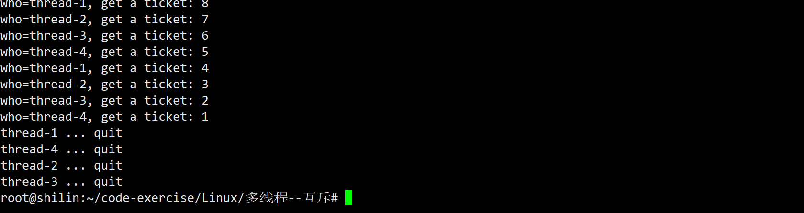

+ 如果纯互斥环境，如果锁分配不够合理，容易被其他线程的饥饿问题！
+ 不是说只要有互斥，必有饥饿
+ 适合纯互斥的场景，就用互斥
+ 如果是按照一定的顺序性获取资源，就叫**同步**

---

+ **其中在临界区中，线程可以被切换吗？ 当然可以**！
    - **在线程被切出去的时候，是持有锁走的**
    - 不在临界区之间，照样没有线程可以进入临界区访问临界资源
+ 对于其他线程来讲，一个线程要么没有锁，要么释放锁。
+ 当线程访问临界资源区的过程，对于其他线程是原子的。

## 小结
1. 所以，加锁的范围，粒度一定要小
2. 任何线程，要进行抢票，都得先申请锁，原则上，不应该有例外
3. 所有线程申请锁，**前提是所有线程都得看到这把锁，锁本身也是共享资源**，加锁的过程，必须是**原子**的！**原子性**：要么不做，要做就做完，没有中间状态，就是原子性
4. 如果线程申请锁**失败**了，我的线程要被**阻塞**
5. 如果线程申请**成功**了，继续向后**运行**
6. 如果线程申请锁成功了，执行临界区的代码了，**执行临界区的代码是可以被切换的**，其他线程无法进入，**因为被切换了，但是没有释放，可以放心的执行完毕，没有任何线程能打扰。**

**结论**：所有对于其他线程，要么没有申请锁，要么释放了锁，对于其他线程才有意义

---

> 什么是线程互斥，为什么需要互斥：
>

+ 线程互斥指的是在多个线程间对临界资源进行争抢访问时有可能会造成数据二义，因此通过保证同一时间只有一个线程能够访问临界资源的方式实现线程对临界资源的访问安全性

# 对锁封装 lockGuard.hpp
`lockGuard.hpp`

```cpp
#ifndef __LOCK_GUARD_HPP__
#define __LOCK_GUARD_HPP__
#include <pthread.h>
class Mutex
{
public:
    Mutex()
    {
        pthread_mutex_init(&_lock, nullptr);
    }
    void Lock()
    {
        pthread_mutex_lock(&_lock);
    }
    void Unlock()
    {
        pthread_mutex_unlock(&_lock);
    }
    pthread_mutex_t *Get()
    {
        return &_lock;
    }
    ~Mutex()
    {
        pthread_mutex_destroy(&_lock);
    }

private:
    pthread_mutex_t _lock;
};

class LockGuard
{
public:
    LockGuard(Mutex *mutex) : _mutex(mutex)
    {
        _mutex->Lock();
    }
    ~LockGuard()
    {
        _mutex->Unlock();
    }

private:
    Mutex *_mutex;
};
#endif
```

mythread.cc

```cpp
#include <iostream>
#include <pthread.h>
#include <unistd.h>
#include <string>
#include <vector>
#include "lockGuard.hpp"
using namespace std;

#define NUM 4
int tickets = 1000;

Mutex lock;

// 线程名字
class ThreadData
{
public:
    ThreadData(int num)
    {
        threadname = "thread-" + to_string(num);
    }

public:
    string threadname;
};

void *getTicket(void *args)
{
    ThreadData *td = static_cast<ThreadData *>(args);
    const char *name = td->threadname.c_str();
    while (true)
    {
        { // 对锁进行临时对象控制

            // 定义了一个临时的锁对象
            LockGuard lockGuard(&lock); // RAII风格的锁
            if (tickets > 0)
            {
                usleep(1000);
                printf("who=%s, get a ticket: %d\n", name, tickets);
                tickets--;
            }
            else
                break;
        }
        // 继续执行非临界区代码
        usleep(13); // 执行得到票之后的后续动作，如果不加usleep会导致 饥饿问题
    }
    printf("%s ... quit\n", name);
    return nullptr;
}


int main()
{
    vector<pthread_t> tids;
    vector<ThreadData *> thread_datas;
    for (int i = 1; i <= NUM; i++)
    {
        pthread_t tid;
        ThreadData *td = new ThreadData(i);
        thread_datas.push_back(td);
        pthread_create(&tid, nullptr, getTicket, thread_datas[i - 1]);
        tids.push_back(tid);
    }

    // 等待
    for (auto e : tids)
    {
        pthread_join(e, nullptr);
    }
    // 释放
    for (auto e : thread_datas)
    {
        delete e;
    }
    return 0;
}
```

## 互斥量实现原理探究
+ 经过上面的例子，已经意识到单纯的 `i++` 或者 `++i` 都不是原子的，有可能会有数据一致性问题

为了实现互斥锁操作，大多数体系结构都提供了swap或exchange指令，该指令的作用是把寄存器和内存单元的数据相交换，由于只有一条指令,保证了原子性,即使是多处理器平台，访问内存的总线周期也有先后，一个处理器上的交换指令执行时另一个处理器的交换指令只能等待总线周期。 现在我们把lock和unlock的伪代码改一下

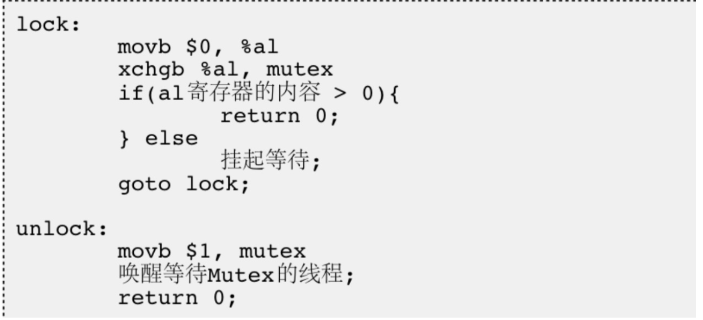


1. CPU的寄存器只有一套，被所有的线程共享，但是**寄存器里面的数据，属于执行流的上下文**，属于**执行流私有的数据**。
2. CPU在执行代码的时候，一定要有对应的执行载体，**线程和进程**
3. 数据在内存中没被所有线程共享

**结论**：把数据从内存移动到CPU寄存器中，本质是把数据从共享变成线程私有！！

---

+ 竞争锁本质是在谁先把`xchgb`做完
+ mutex简单理解就是一个**0/1的计数器**，用于标记资源访问状态：
    - `0`表示已经有执行流加锁成功，资源处于不可访问，
    - `1`表示未加锁，资源可访问。

# Linux线程同步
## 条件变量
+ 当一个线程互斥地访问某个变量时，它可能发现在其它线程改变状态之前，它什么也做不了。 
+ 例如一个线程访问队列时，发现队列为空，它只能等待，只到其它线程将一个节点添加到队列中。这种情 况就需要用到条件变量。

## 同步概念与竞态条件
+ **同步**：在保证数据安全的前提下，让线程能够按照某种特定的顺序访问临界资源，从而有效避免饥饿问题，叫做同步 
+ **竞态条件**：因为时序问题，而导致程序异常，我们称之为竞态条件。在线程场景下，这种问题也不难理解

## 初始化
```cpp
#include <pthread.h>

int pthread_cond_init(pthread_cond_t *restrict cond,
    const pthread_condattr_t *restrict attr);
pthread_cond_t cond = PTHREAD_COND_INITIALIZER;
```

+ cond：要初始化的条件变量 
+ attr：NULL

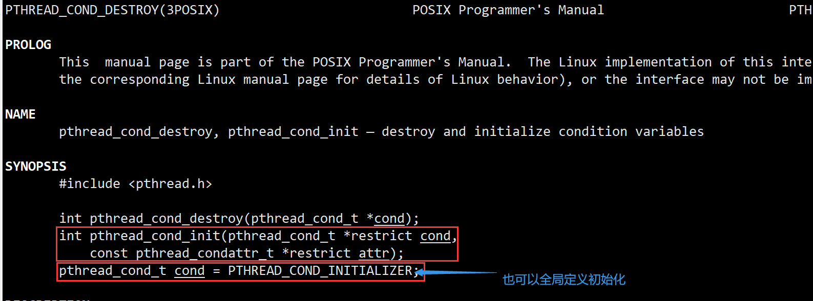

## 销毁
```cpp
int pthread_cond_destroy(pthread_cond_t *cond);
```

## 等待条件满足
```cpp
#include <pthread.h>

int pthread_cond_timedwait(pthread_cond_t *restrict cond,
    pthread_mutex_t *restrict mutex,
    const struct timespec *restrict abstime);
int pthread_cond_wait(pthread_cond_t *restrict cond,
    pthread_mutex_t *restrict mutex);
```

+ cond：要在这个条件变量上等待 
+ mutex：互斥量

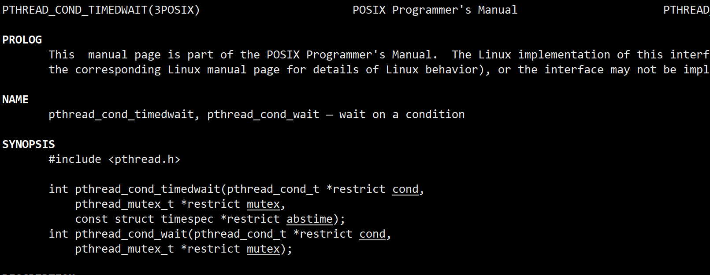

## 唤醒等待
```cpp
#include <pthread.h>

int pthread_cond_broadcast(pthread_cond_t *cond);
int pthread_cond_signal(pthread_cond_t *cond);
```

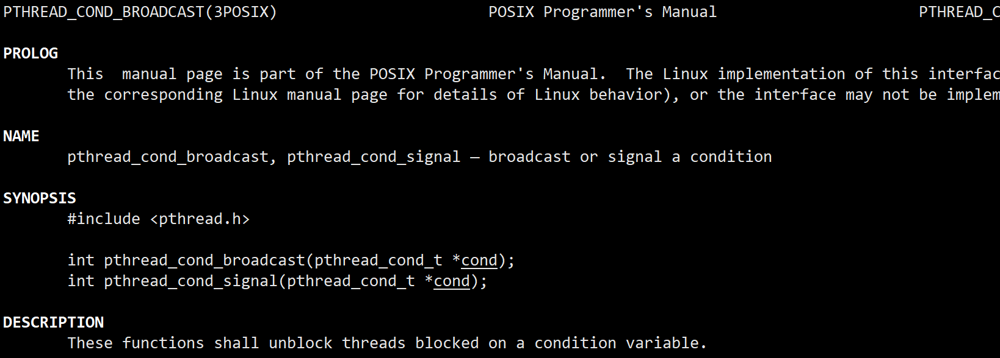

## 案例：
```cpp
#include <iostream>
#include <unistd.h>
#include <pthread.h>

// 临界资源
int cnt = 0;

// 初始化
pthread_mutex_t mutex = PTHREAD_MUTEX_INITIALIZER;
pthread_cond_t cond = PTHREAD_COND_INITIALIZER;

void *Count(void *args)
{
    uint64_t number = (uint64_t)args;
    std::cout << "pthread: " << number << " create sucess! " << std::endl;

    while (true)
    {
        // 加锁
        pthread_mutex_lock(&mutex);
        // 必须先加锁后等待
        pthread_cond_wait(&cond, &mutex);

        std::cout << "pthread: " << number << ", cnt: " << cnt++ << std::endl;
        // 解锁
        pthread_mutex_unlock(&mutex);
    }
    // 分离线程
    pthread_detach(pthread_self());
}

int main()
{
    for (uint64_t i = 0; i < 5; i++)
    {
        pthread_t tid;
        pthread_create(&tid, nullptr, Count, (void *)i); // 注意这里细节不能传i的地址
        usleep(1000);                                    // 创建出来的线程打印就保持一致了
    }

    sleep(3);
    std::cout << "main thread ctrl begin: " << std::endl;
    while (true)
    {
        sleep(1);
        // 唤醒单个线程
        pthread_cond_signal(&cond);
        std::cout << "signal thread..." << std::endl;
    }

    return 0;
}
```

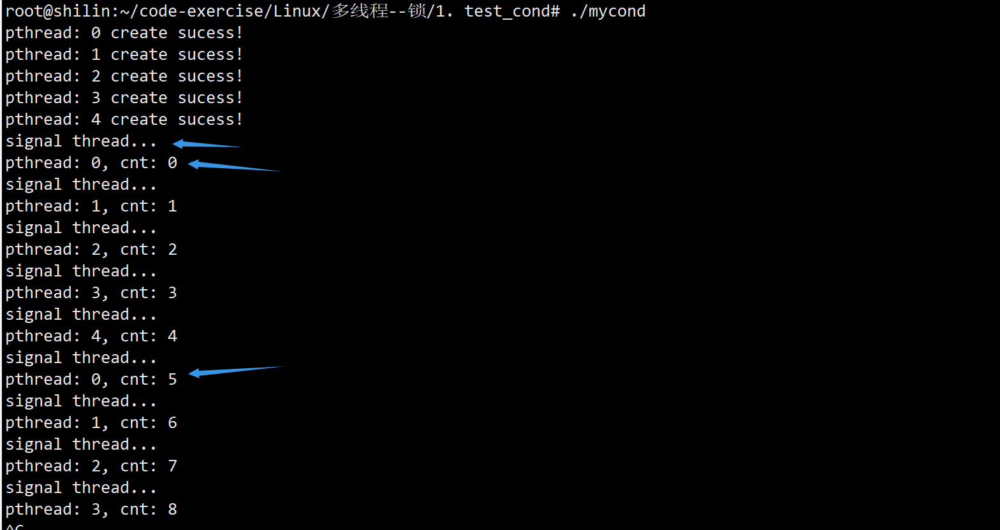

+ 也还可以唤醒多个线程

```cpp
#include <iostream>
#include <unistd.h>
#include <pthread.h>

// 临界资源
int cnt = 0;

// 初始化
pthread_mutex_t mutex = PTHREAD_MUTEX_INITIALIZER;
pthread_cond_t cond = PTHREAD_COND_INITIALIZER;

void *Count(void *args)
{
    uint64_t number = (uint64_t)args;
    std::cout << "pthread: " << number << " create sucess! " << std::endl;

    while (true)
    {
        // 加锁
        pthread_mutex_lock(&mutex);
        // 你怎么知道临界资源是就绪还是不就绪的？你判断出来的！判断是访问临界资源吗？必须是的，也就是判断必须在加锁之后！！！
        // 必须先加锁后等待
        pthread_cond_wait(&cond, &mutex); // pthread_cond_wait让线程等待的时候，会自动释放锁！

        std::cout << "pthread: " << number << ", cnt: " << cnt++ << std::endl;
        // 解锁
        pthread_mutex_unlock(&mutex);
    }
    // 分离线程
    pthread_detach(pthread_self());
}

int main()
{
    for (uint64_t i = 0; i < 5; i++)
    {
        pthread_t tid;
        pthread_create(&tid, nullptr, Count, (void *)i); // 注意这里细节不能传i的地址
        usleep(1000);                                    // 创建出来的线程打印就保持一致了
    }

    sleep(3);
    std::cout << "main thread ctrl begin: " << std::endl;

    while (true)
    {
        sleep(1);
        // 唤醒多个线程
        pthread_cond_broadcast(&cond);
        std::cout << "boardcast thread..." << std::endl;
    }

    return 0;
}
```

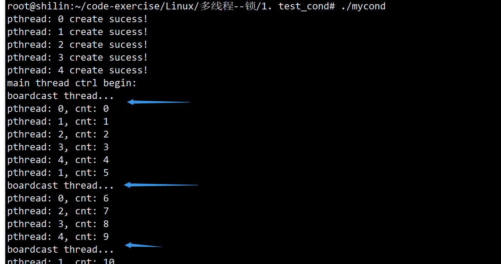

为什么 `pthread_cond_wait`需要**互斥量**?

+ 条件等待是线程间同步的一种手段，如果只有一个线程，条件不满足，一直等下去都不会满足，所以**必须要有一个线程通过某些操作，改变共享变量**，使原先不满足的条件变得满足，并且友好的通知等待在条件变量上的线程。 
+ 条件不会无缘无故的突然变得满足了，必然会牵扯到共享数据的变化。所以一定要用互斥锁来保护。没有互斥锁就无法安全的获取和修改共享数据。

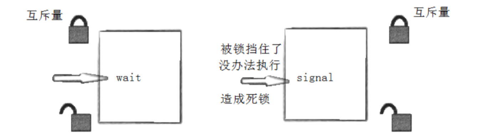

按照上面的说法，我们设计出如下的代码：**先上锁，发现条件不满足，解锁，然后等待在条件变量上不就行了**

+ 由于**解锁和等待不是原子操作**。调用解锁之后， `pthread_cond_wait` 之前，如果已经有其他线程获取到互斥量，摒弃条件满足，发送了信号，那么 `pthread_cond_wait` 将错过这个信号，可能会导致线程永远阻塞在这个 `pthread_cond_wait` 。所以解锁和等待必须是一个**原子操作**。
+ ` int pthread_cond_wait(pthread_cond_ t *cond,pthread_mutex_ t * mutex); `进入该函数后， 会去看条件量等于0不？**等于，就把互斥量变成1**，直到cond_ wait返回，把条件量改成1，把互斥量恢复成原样。

# 封装一下条件变量
```cpp
#ifndef __COND_HPP__
#define __COND_HPP__

#include <pthread.h>
#include "lockGuard.hpp"

class Cond
{
public:
    Cond()
    {
        pthread_cond_init(&_cond, nullptr);
    }

    void Wait(Mutex &mutex)
    {
        pthread_cond_wait(&_cond, &mutex.GetMutex());
    }

    void Notify()
    {
        pthread_cond_signal(&_cond);
    }

    void NotifyAll()
    {
        pthread_cond_broadcast(&_cond);
    }

    ~Cond()
    {
        pthread_cond_destroy(&_cond);
    }

private:
    pthread_cond_t _cond;
};

#endif
```

# 生产者消费者模型
3种关系、2种角色、1个交易场所：

+ 3种关系：生产者和生产者（互斥），消费者和消费者（互斥），生产者和消费者（互斥 / 同步）。
+ 2种角色：生产者、消费者（线程承担）。
+ 1个交易场所：内存中特定的一种内存结构。

生产者消费者模式就是通过一个容器来解决生产者和消费者的强耦合问题。生产者和消费者彼此之间不直接通讯，而**通过阻塞队列**来进行通讯，所以生产者生产完数据之后不用等待消费者处理，直接扔给阻塞队列，消费者不找生产者要数据，而是直接从阻塞队列里取，阻塞队列就相当于一个缓冲区，平衡了生产者和消费者的处理能力。这个阻塞队列就是用来给生产者和消费者解耦的。

**优点：**

1. 支持忙闲不闲
2. 生产和消费进行解耦
3. 支持并发

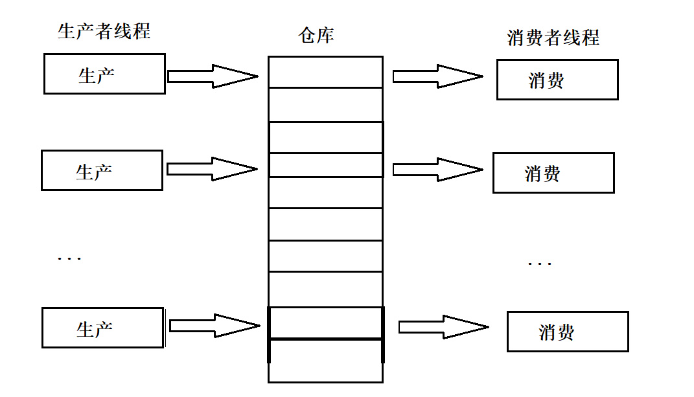

**生产者vs生产者**：互斥

**消费者和消费者**：互斥

**生产者和消费者**：互斥，同步

# 基于BlockingQueue的生产者消费者模型
`BlockingQueue`

在多线程编程中阻塞队列(Blocking Queue)是一种常用于实现生产者和消费者模型的数据结构。其与普通的队列区别在于，当队列为空时，从队列获取元素的操作将会被阻塞，直到队列中被放入了元素；当队列满时，往队列里存放元素的操作也会被阻塞，直到有元素被从队列中取出(以上的操作都是基于不同的线程来说的，线程在对阻塞队列进程操作时会被阻塞)

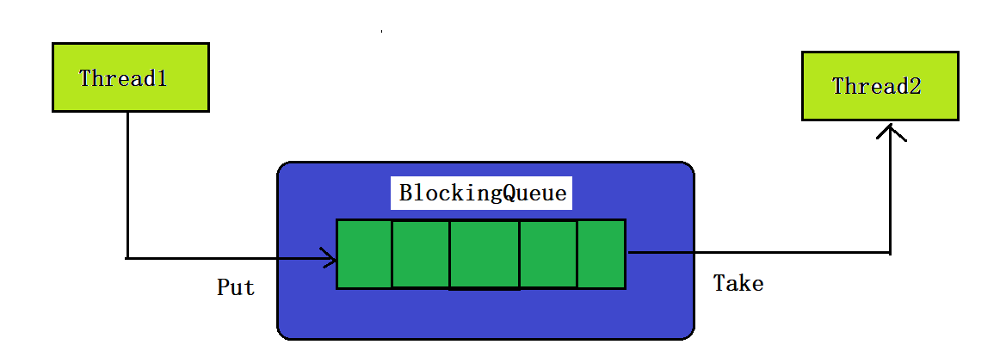

根据前面我们自己封装的编写下面代码：

## BlockQueue.hpp
```cpp
#ifndef __BLOCKQUEUE_HPP__
#define __BLOCKQUEUE_HPP__

#include <iostream>
#include <string>
#include <queue>
#include <pthread.h>
#include "Cond.hpp"
#include "lockGuard.hpp"

template <typename T>
class BlockQueue
{
    const static uint32_t defaultnum = 5;

public:
    BlockQueue(int cap = defaultnum) : _cap(cap), _c_wait_num(0), _p_wait_num(0)
    {
    }

    void Push(const T &in)
    {
        {
            LockGuard lockguard(&_lock);
            while (_q.size() == _cap) // 判断队列是否已满
            {

                _p_wait_num++;
                _p_cond.Wait(_lock); // 阻塞等待
                _p_wait_num--;
            }
            _q.push(in);
            if (_c_wait_num > 0)
                _c_cond.Notify(); // 唤醒消费者
        }
    }

    void Pop(T *out)
    {
        {
            LockGuard lockguard(&_lock);
            while (_q.empty()) // 判断队列是否为空
            {
                _c_wait_num++;
                _c_cond.Wait(_lock);
                _c_wait_num--;
            }
            *out = _q.front();
            _q.pop();
            if (_p_wait_num > 0)
                _p_cond.Notify(); // 唤醒生产者
        }
    }

    ~BlockQueue()
    {
    }

private:
    std::queue<T> _q; // 阻塞队列
    uint32_t _cap;    // 队列容量

    Mutex _lock;  // 锁
    Cond _c_cond; // 消费者条件变量
    Cond _p_cond; // 生产者条件变量

    int _c_wait_num; // 当前消费者等待的个数
    int _p_wait_num; // 当前生产者等待的个数
};

#endif // __BLOCKQUEUE_HPP__
```

## Task.hpp
```cpp
#pragma once
#include <iostream>
#include <string>
#include <sstream>
#include <functional>
#include <map>

std::string opers = "+-*/%";

enum
{
    DivZero = 1,
    ModZero,
    Unknown
};

class Task
{
public:
    Task() : data1_(0), data2_(0), oper_('+'), result_(0), exitcode_(0) 
    {}
    Task(int x, int y, char op)
        : data1_(x), data2_(y), oper_(op)
    {
    }

    void Run()
    {
        std::map<char, std::function<void()>> CmdOp{
            {'+', [this](){ result_ = data1_ + data2_; }},
            {'-', [this](){ result_ = data1_ - data2_; }},
            {'*', [this](){ result_ = data1_ * data2_; }},
            {'/', [this](){ if (data2_ == 0) exitcode_ = DivZero; else result_ = data1_ / data2_; }},
            {'%', [this](){ if (data2_ == 0) exitcode_ = ModZero; else result_ = data1_ % data2_; }}
        };

        // auto it = CmdOp.find(oper_);
        std::map<char, std::function<void()>>::iterator it = CmdOp.find(oper_);
        if (it != CmdOp.end())
            it->second(); // 调用lambda函数
        else
            exitcode_ = Unknown; // 如果没有找到操作，设置错误代码
    }
    void operator()()
    {
        Run();
    }
    std::string GetResult() // 这里可以使用stringstream
    {
        std::stringstream s;
        s << data1_ << oper_ << data2_ << "=" << result_ << " [code: " << exitcode_ << "]";

        std::string r;
        r = s.str();
        return r;
    }
    std::string GetTask()
    {
        std::stringstream s;
        s << data1_ << oper_ << data2_ << "=?";

        std::string r;
        r = s.str();
        return r;
    }
    ~Task()
    {
    }

private:
    int data1_; // 操作数
    int data2_; // 操作数
    char oper_; // 操作符

    int result_;   // 结果
    int exitcode_; // 错误码
};
```

## main.cc
```cpp
#include "BlockQueue.hpp"
#include "Task.hpp"
#include <unistd.h>
#include <ctime>

std::string TOHEX(pthread_t x)
{
    char buffer[128];
    snprintf(buffer, sizeof(buffer), "0x%lx", x);
    return buffer;
}

void *Consumer(void *args)
{
    BlockQueue<Task> *bq = static_cast<BlockQueue<Task> *>(args);

    while (true)
    {
        sleep(1);
        // 消费
        Task t(0, 0, '+'); // 创建一个空任务
        bq->Pop(&t);
        // t.Run(); // 之间调用
        t(); // 仿函数

        std::cout << "处理任务: " << t.GetTask() << " 运算结果是： " << t.GetResult() << " thread id: " << TOHEX(pthread_self()) << std::endl;
    }
}

void *Productor(void *args)
{
    int len = opers.size();
    BlockQueue<Task> *bq = static_cast<BlockQueue<Task> *>(args);
    while (true)
    {
        // 生产
        int data1 = rand() % 10 + 1;
        int data2 = rand() % 10 + 1;
        usleep(10);
        char op = opers[rand() % len];
        Task t(data1, data2, op);
        bq->Push(t); // 入队
        std::cout << "生产了一个任务: " << t.GetTask() << " thread id: " << TOHEX(pthread_self()) << std::endl;
    }
}

int main()
{
    srand(time(nullptr));

    BlockQueue<Task> *bq = new BlockQueue<Task>();
    pthread_t c[3], p[5];
    for (int i = 0; i < 3; i++)
    {
        pthread_create(c + i, nullptr, Consumer, bq);
    }

    for (int i = 0; i < 5; i++)
    {
        pthread_create(p + i, nullptr, Productor, bq);
    }

    for (int i = 0; i < 3; i++)
    {
        pthread_join(c[i], nullptr);
    }
    for (int i = 0; i < 5; i++)
    {
        pthread_join(p[i], nullptr);
    }

    delete bq;
    return 0;
}
```

# POSIX信号量
信号量的本质是一把计数器，那么这把计数器的本质是什么？？

+ 来描述资源数目的，把资源是否就绪放在了临界区之外，申请信号量时，其实就间接的已经在做判断了！
+ `--P`->原子的->申请资源
+ `++V`->原子的->归还资源

信号量申请成功了，就一定保证会拥有一部分临界资源吗？

+ 只要信号量申请成功，就一定会获得指定的资源！
+ 申请mutex，只要拿到了锁，就可以获得临界资源，并且不担心被切换。

临界资源可以当成整体，可不可以看成一小部分一小部分呢？

+ 结合场景，一般是可以的

信号量：

+ `--P`：1->0  ---->加锁
+ `++V`: 0->1 ---->释放锁
+ **这样的叫做二元信号量 == 互斥锁**

## 初始化信号量
```cpp
#include <semaphore.h>
int sem_init(sem_t *sem, int pshared, unsigned int value);
```

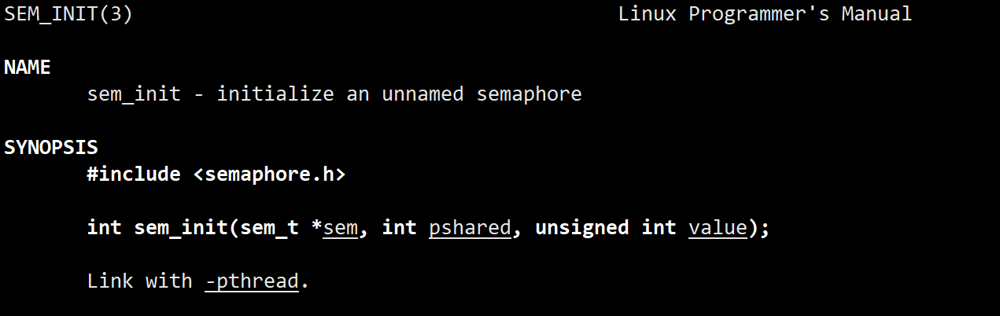

参数：

+ pshared:0表示线程间共享，非零表示进程间共享
+ value：信号量初始值

## 销毁信号量
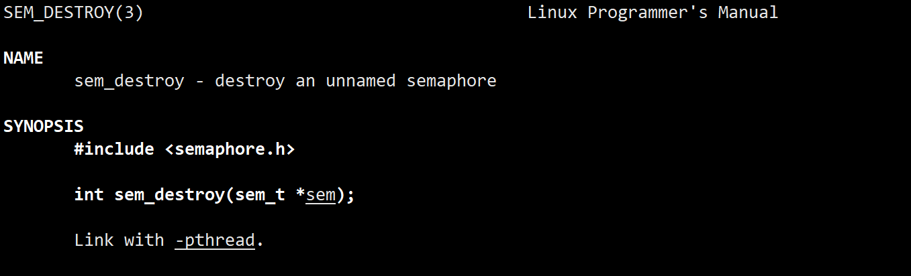

```cpp
int sem_destroy(sem_t *sem);
```

## 等待信号量
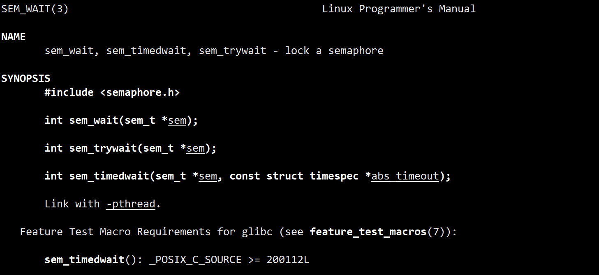

功能：等待信号量，会将信号量的值减1

```cpp

int sem_wait(sem_t *sem); //P()
```

## 发布信号量
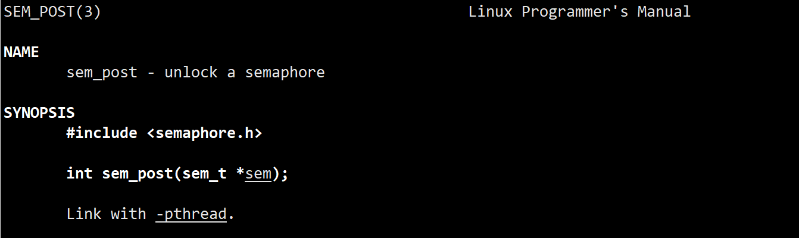

+ 功能：发布信号量，表示资源使用完毕，可以归还资源了。将信号量值加1。

```cpp
int sem_post(sem_t *sem);//V()
```

# 基于环形队列的生产消费模型（代码验证）
环形队列中的生产者和消费者什么时候会访问同一个位置？

+ 当这两个同时指向同一个位置的时候，只有满or空的时候（互斥and同步）
+ 其它时候都指向的是不同的位置（并发）

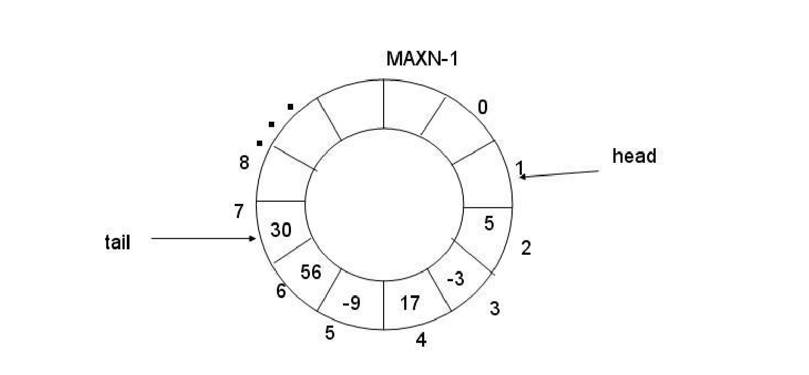

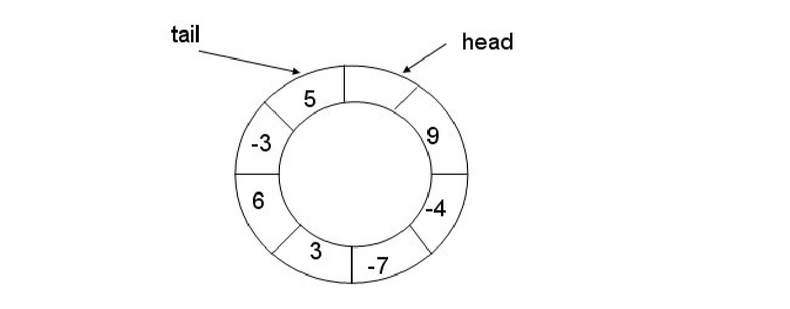

因此，操作的基本原则：

① 空：消费者不能超过生产者 -->生产者先运行

② 满：生产者不能把消费者套一个圈里，继续再往后写入 -->消费者先运行

+ 谁来保证这个基本原则呢？
    - 信号量来保证。
+ 生产者最关心的是什么资源？
    - 空间
+ 消费者最关心的是什么资源？
    - 数据
+ 怎么保证，不同的线程，访问的是临界资源中不同的区域呢？
    - 通过程序员编码保证

## Sem.hpp
```cpp
#ifndef __SEM_HPP__
#define __SEM_HPP__

#include <semaphore.h>

class Sem 
{
public:
    Sem(int value) 
        : _init_value(value) {
        sem_init(&_sem, 0, _init_value);
    }
    
    void P() {
        sem_wait(&_sem);
    }
    
    void V() {
        sem_post(&_sem);
    }
    
    ~Sem() {
        sem_destroy(&_sem);
    }
private:
    sem_t _sem;
    int _init_value;
};

#endif // __SEM_HPP__
```

## RingQueue.hpp
```cpp
#ifndef __RINGQUEUE_HPP__
#define __RINGQUEUE_HPP__

#include <iostream>
#include <pthread.h>
#include <unistd.h>
#include <vector>
#include <semaphore.h>

#include "lockGuard.hpp"
#include "Sem.hpp"

static int default_size = 5; // for debug


template <typename T>
class RingQueue
{
public:
    RingQueue(int size = default_size)
        : _q(size), _size(size), _space_sem(size), _data_sem(0), _p_step(0), _c_step(0)
    {
    }

    void Pop(T *out)
    {
        _data_sem.P(); // 等待数据
        {
            LockGuard lock(&_c_lock); // 锁定消费者锁
            *out = _q[_c_step];
            _c_step = (_c_step + 1) % _size; // 更新消费者步进
        }
        _space_sem.V(); // 释放空间
    }

    void Push(const T &data)
    {
        _space_sem.P(); // 等待空间
        {
            LockGuard lock(&_p_lock); // 锁定生产者锁
            _q[_p_step] = data;
            _p_step = (_p_step + 1) % _size; // 更新生产者步进
        }
        _data_sem.V(); // 释放数据
    }

    ~RingQueue()
    {
    }

private:
    std::vector<T> _q;
    int _size;

    Sem _space_sem;
    Sem _data_sem;

    int _p_step;
    int _c_step;

    Mutex _c_lock;
    Mutex _p_lock;
};

#endif // __RINGQUEUE_HPP__
```

## Task.hpp
```cpp
#pragma once
#include <iostream>
#include <string>
#include <sstream>
#include <functional>
#include <map>

const static std::string opers = "+-*/%";

enum
{
    DivZero = 1,
    ModZero,
    Unknown
};

class Task
{
public:
    Task() : data1_(0), data2_(0), oper_('+'), result_(0), exitcode_(0) 
    {}
    Task(int x, int y, char op)
        : data1_(x), data2_(y), oper_(op)
    {
    }

    void Run()
    {
        std::map<char, std::function<void()>> CmdOp{
            {'+', [this](){ result_ = data1_ + data2_; }},
            {'-', [this](){ result_ = data1_ - data2_; }},
            {'*', [this](){ result_ = data1_ * data2_; }},
            {'/', [this](){ if (data2_ == 0) exitcode_ = DivZero; else result_ = data1_ / data2_; }},
            {'%', [this](){ if (data2_ == 0) exitcode_ = ModZero; else result_ = data1_ % data2_; }}
        };

        // auto it = CmdOp.find(oper_);
        std::map<char, std::function<void()>>::iterator it = CmdOp.find(oper_);
        if (it != CmdOp.end())
            it->second(); // 调用lambda函数
        else
            exitcode_ = Unknown; // 如果没有找到操作，设置错误代码
    }
    void operator()()
    {
        Run();
    }
    std::string GetResult() // 这里可以使用stringstream
    {
        std::stringstream s;
        s << data1_ << oper_ << data2_ << "=" << result_ << " [code: " << exitcode_ << "]";

        std::string r;
        r = s.str();
        return r;
    }
    std::string GetTask()
    {
        std::stringstream s;
        s << data1_ << oper_ << data2_ << "=?";

        std::string r;
        r = s.str();
        return r;
    }
    ~Task()
    {
    }

private:
    int data1_; // 操作数
    int data2_; // 操作数
    char oper_; // 操作符

    int result_;   // 结果
    int exitcode_; // 错误码
};
```

## main.cc
```cpp
#include <iostream>
#include <pthread.h>
#include <ctime>
#include "RingQueue.hpp"
#include "Task.hpp"

using namespace std;

// 创建的线程数量
#define ProductorNum 5
#define ConsumerNum 5

struct ThreadData
{
    RingQueue<Task> *rq;
    std::string threadname;
};

void *Productor(void *args)
{
    ThreadData *td = static_cast<ThreadData *>(args);
    RingQueue<Task> *rq = td->rq;
    std::string name = td->threadname;

    int len = opers.size();
    while (true)
    {
        // 1. 获取数据
        int data1 = rand() % 10 + 1;
        usleep(10);
        int data2 = rand() % 10 + 1;
        char op = opers[rand() % len];
        Task t(data1, data2, op);
        t();

        // 2. 生产数据
        rq->Push(t);
        cout << "Productor task done, task is : " << t.GetTask() << " who: " << name << endl;
        sleep(1);
    }
    return nullptr;
}
void *Consumer(void *args)
{
    ThreadData *td = static_cast<ThreadData *>(args);
    RingQueue<Task> *rq = td->rq;
    std::string name = td->threadname;

    while (true)
    {
        // 消费数据
        Task t;
        rq->Pop(&t);

        t(); // 处理数据
        cout << "Consumer get task, task is : " << t.GetTask() << " who: " << name << " result: " << t.GetResult() << endl;
        // sleep(1);
    }
    return nullptr;
}

int main()
{
    srand(time(nullptr) ^ getpid());
    RingQueue<Task> *rq = new RingQueue<Task>(5);

    pthread_t c[ConsumerNum], p[ProductorNum];

    for (int i = 0; i < ProductorNum; i++)
    {
        ThreadData *td = new ThreadData();
        td->rq = rq;
        td->threadname = "Productor-" + std::to_string(i);

        pthread_create(p + i, nullptr, Productor, td);
    }
    for (int i = 0; i < ConsumerNum; i++)
    {
        ThreadData *td = new ThreadData();
        td->rq = rq;
        td->threadname = "Consumer-" + std::to_string(i);

        pthread_create(c + i, nullptr, Consumer, td);
    }

    for (int i = 0; i < ProductorNum; i++)
    {
        pthread_join(p[i], nullptr);
    }
    for (int i = 0; i < ConsumerNum; i++)
    {
        pthread_join(c[i], nullptr);
    }

    return 0;
}
```

+ 一个线程查看直观一些：

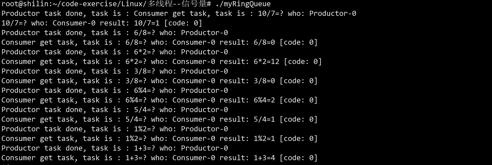

+ 多个线程一起跑，打印就会显示的很乱

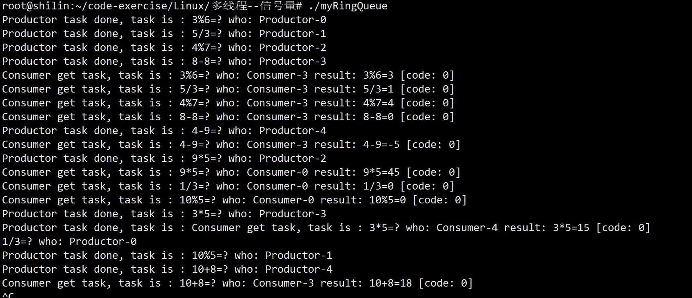

# 日志实现（策略者模式）
```cpp
#ifndef __LOGGER_HPP__
#define __LOGGER_HPP__

#include <iostream>
#include <string>
#include <ctime>
#include <unistd.h>
#include <memory>
#include <sstream>
#include <filesystem>
#include <fstream>

#include "lockGuard.hpp"
// 日志等级

enum class LogLevel
{
    DEBUG,
    INFO,
    WARNING,
    ERROR,
    FATAL
};

std::string Level2String(LogLevel level)
{
    switch (level)
    {
    case LogLevel::DEBUG:
        return "Debug";
    case LogLevel::INFO:
        return "Info";
    case LogLevel::WARNING:
        return "Warning";
    case LogLevel::ERROR:
        return "Error";
    case LogLevel::FATAL:
        return "Fatal";
    default:
        return "Unknown";
    }
}

std::string getCurrentTime()
{
    // 获取当前时间戳
    time_t currtime = time(nullptr);

    // 转换时间
    struct tm t;
    localtime_r(&currtime, &t);

    char timebuffer[64];

    snprintf(timebuffer, sizeof(timebuffer), "%4d-%02d-%02d %02d:%02d:%02d",
             t.tm_year + 1900,
             t.tm_mon + 1,
             t.tm_mday,
             t.tm_hour,
             t.tm_min,
             t.tm_sec);
    return timebuffer;
}

class LogStrategy
{
public:
    virtual ~LogStrategy() = default;
    virtual void SyncLog(const std::string &logmessage) = 0; // 刷新日志
};

class ConsoleLogStrategy : public LogStrategy
{
public:
    ~ConsoleLogStrategy()
    {
    }
    void SyncLog(const std::string &logmessage) override
    {
        {
            LockGuard lockGuard(&_lock);
            std::cout << logmessage << std::endl;
        }
    }

private:
    Mutex _lock;
};

const std::string logdefaultdir = "log";
const static std::string logfilename = "test.log";

class FileLogStrategy : public LogStrategy
{
public:
    FileLogStrategy(const std::string &dir = logdefaultdir, const std::string &logfilename = logfilename)
        : _dir_path_name(dir), _file_name(logfilename)
    {
        {
            LockGuard lockGuard(&_lock);
            if (std::filesystem::exists(_dir_path_name))
            {
                return;
            }
            try
            {
                std::filesystem::create_directories(_dir_path_name);
            }
            catch (const std::filesystem::filesystem_error &e)
            {
                std::cerr << e.what() << "\r\n";
            }
        }
    }
    void SyncLog(const std::string &logmessage) override
    {
        {
            LockGuard lockGuard(&_lock);
            std::string target = _dir_path_name;
            target += "/";
            target += _file_name;
            std::ofstream out(target.c_str(), std::ios::app);
            if (!out.is_open())
            {
                std::cerr << "Failed to open log file: " << target << "\n";
                return;
            }
            out << logmessage << "\n";
            out.close();
        }
    }
    ~FileLogStrategy() {}

private:
    std::string _dir_path_name;
    std::string _file_name;
    Mutex _lock;
};

class Logger
{
public:
    Logger()
    {
        EnableConsoleLogStrategy();
    }

    void EnableConsoleLogStrategy()
    {
        _strategy = std::make_unique<ConsoleLogStrategy>();
    }

    void EnableFileLogStrategy()
    {
        _strategy = std::make_unique<FileLogStrategy>();
    }

    // 一条消息
    class LogMessage
    {
    public:
        LogMessage(LogLevel level, std::string filename, int line, Logger &logger)
            : _curr_time(getCurrentTime()), _level(level), _pid(getpid()), _filename(filename), _line(line), _logger(logger)
        {
            std::stringstream ss;
            ss << "time: [" << _curr_time << "] "
               << "level: [" << Level2String(_level) << "] "
               << "pid: [" << _pid << "] "
               << "filename: [" << _filename << "] "
               << "line: [" << _line << "] "
               << "message:  - ";
            _loginfo = ss.str();
        }

        template <typename T>
        LogMessage &operator<<(const T &info)
        {
            std::stringstream ss;
            ss << info;
            _loginfo += ss.str();
            return *this;
        }

        ~LogMessage()
        {
            // 在析构函数中刷新日志
            if (_logger._strategy)
            {
                _logger._strategy->SyncLog(_loginfo);
            }
        }

    private:
        std::string _curr_time; // 当前时间
        LogLevel _level;        // 告警级别
        pid_t _pid;             // 进程pid
        std::string _filename;  // 文件名字
        int _line;              // 行号

        std::string _loginfo; // 信息主体
        Logger &_logger;      // 提供刷新策略的具体做法
    };

    LogMessage operator()(LogLevel level, std::string filename, int line)
    {
        return LogMessage(level, filename, line, *this);
    }

    ~Logger() {}

private:
    std::unique_ptr<LogStrategy> _strategy;
};

Logger logger; // 全局日志对象

#define LOG(level) logger(level, __FILE__, __LINE__)
#define EnableConsoleLog() logger.EnableConsoleLogStrategy()
#define EnableFileLog() logger.EnableFileLogStrategy()

#endif // __LOGGER_HPP__
```

# 线程池
一种线程使用模式。线程过多会带来调度开销，进而影响缓存局部性和整体性能。而线程池维护着多个线程，等待着监督管理者分配可并发执行的任务。这避免了在处理短时间任务时创建与销毁线程的代价。线程池不仅能够保证内核的充分利用，还能防止过分调度。可用线程数量应该取决于可用的并发处理器、处理器内核、内存、网络sockets等的数量。

线程池的应用场景：

① 需要大量的线程来完成任务，且完成任务的时间比较短。 WEB服务器完成网页请求这样的任务，使用线程池技术是非常合适的。因为单个任务小，而任务数量巨大，你可以想象一个热门网站的点击次数。 但对于长时间的任务，比如一个Telnet连接请求，线程池的优点就不明显了。因为Telnet会话时间比线程的创建时间大多了。

② 对性能要求苛刻的应用，比如要求服务器迅速响应客户请求。

③ 接受突发性的大量请求，但不至于使服务器因此产生大量线程的应用。突发性大量客户请求，在没有线程池情况下，将产生大量线程，虽然理论上大部分操作系统线程数目最大值不是问题，短时间内产生大量线程可能使内存到达极限，出现错误。

线程池示例：

1. 创建固定数量线程池，循环从任务队列中获取任务对象
2. 获取到任务对象后，执行任务对象中的任务接口

## ThreadPool.hpp
```cpp
#ifndef __THREAD_POOL__
#define __THREAD_POOL__

#include <queue>

#include "lockGuard.hpp"
#include "Thread.hpp"
#include "Cond.hpp"
#include "Logger.hpp"

const static int defaultThreadNum = 3;

template <typename T>
class ThreadPool
{
private:
    bool isEmpty()
    {
        return _q.empty();
    }

    void Routine(const std::string &name)
    {
        for (;;)
        {
            T t; // 获取任务
            {
                LockGuard lockGuard(&_lock);   // 线程过来进行加锁
                while (isEmpty() && _isRuning) // 任务队列为空且线程池正在运行就正在等待
                {
                    _wait_thread_num++;
                    _cond.Wait(_lock);
                    _wait_thread_num--;
                }
                if (isEmpty() && !_isRuning)
                {
                    LOG(LogLevel::INFO) << " 线程池退出 && 任务队列为空, " << name << " 退出";
                    break;
                }
                // 走到这里说明一定有任务了
                t = _q.front();
                _q.pop();
            }
            t(); // 执行任务
            LOG(LogLevel::DEBUG) << name << " handler task: " << t.Result2String();
        }
    }

public:
    ThreadPool(int threadNum = defaultThreadNum)
        : _threadNum(threadNum),
          _wait_thread_num(0),
          _isRuning(false)
    {
        for (int i = 0; i < _threadNum; i++)
        {
            std::string name = "thread-" + std::to_string(i + 1);
            _threads.emplace_back([this](const std::string &name)
                                  { this->Routine(name); }, name);
            LOG(LogLevel::INFO) << "thread pool obj create success";
        }
    }

    void Start()
    {
        if (_isRuning) // 线程池已经在运行了
            return;
        _isRuning = true;
        for (auto &t : _threads)
        {
            t.Start();
        }
        LOG(LogLevel::INFO) << "thread pool running success";
    }

    void Stop()
    {
        if (!_isRuning) // 已经停止了
            return;
        _isRuning = false;
        if (_wait_thread_num > 0)
            _cond.NotifyAll(); // 唤醒所有线程

        LOG(LogLevel::INFO) << "thread pool stop success";
        // 不推荐直接停止线程，因为可能有些线程还在执行任务
    }

    void Wait()
    {
        for (auto &t : _threads)
        {
            t.Join();
        }
        LOG(LogLevel::INFO) << "thread pool wait success";
    }

    void Push(const T &in)
    {
        if (!_isRuning)
            return;
        {
            LockGuard lockGuard(&_lock);
            _q.push(in);
            if (_wait_thread_num > 0)
                _cond.Notify();
        }
    }

    ~ThreadPool() {}

private:
    std::queue<T> _q;             // 任务队列
    std::vector<Thread> _threads; // 多个线程

    int _threadNum;       // 线程个数
    int _wait_thread_num; // 线程等待个数

    Mutex _lock; // 锁
    Cond _cond;  // 条件变量

    bool _isRuning; // 是否在运行
};

#endif
```

## Thread.hpp
```cpp
#ifndef __THREAD_HPP__
#define __THREAD_HPP__

#include <iostream>
#include <functional>
#include <pthread.h>
#include <unistd.h>
#include <sys/syscall.h>
#include "Logger.hpp"

#define get_lwp_id() syscall(SYS_gettid);

using func_t = std::function<void(const std::string& name)>;
const std::string threadNameFault = "None-Name";

class Thread
{
private:
    static void *startRun(void *args) // 这里要使用statis否则会有隐含的this指针
    {
        Thread *self = static_cast<Thread *>(args);
        self->_isRuning = true;
        self->_lwpid = get_lwp_id();
        self->_func(self->_name); // 执行用户提供的函数
        pthread_exit((void *)0);
    }

public:
    Thread(func_t func, const std::string &name = threadNameFault)
        : _func(func), _name(name), _isRuning(false)
    {
    }

    void Start()
    {
        int n = pthread_create(&_tid, nullptr, startRun, this); // 把对象传递过去
        if (!n)
        {
            LOG(LogLevel::INFO) << _name << " running success";
        }
    }

    void Join()
    {
        if (!_isRuning)
            return;
        int n = pthread_join(_tid, nullptr);
        if (!n)
        {
            LOG(LogLevel::INFO) << _name << " pthread_join success";
        }
    }

    void Stop()
    {
        pthread_cancel(_tid);
    }

    ~Thread()
    {
    }

private:
    func_t _func;
    std::string _name;
    pthread_t _tid;
    pid_t _lwpid;
    bool _isRuning;
};

#endif
```

## lockGuard.hpp
```cpp
#ifndef __LOCK_GUARD_HPP__
#define __LOCK_GUARD_HPP__
#include <pthread.h>
class Mutex
{
public:
    Mutex()
    {
        pthread_mutex_init(&_lock, nullptr);
    }
    void Lock()
    {
        pthread_mutex_lock(&_lock);
    }
    void Unlock()
    {
        pthread_mutex_unlock(&_lock);
    }
    pthread_mutex_t *Get()
    {
        return &_lock;
    }
    ~Mutex()
    {
        pthread_mutex_destroy(&_lock);
    }

private:
    pthread_mutex_t _lock;
};

class LockGuard
{
public:
    LockGuard(Mutex *mutex) : _mutex(mutex)
    {
        _mutex->Lock();
    }
    ~LockGuard()
    {
        _mutex->Unlock();
    }

private:
    Mutex *_mutex;
};
#endif
```

## Logger.hpp
```cpp
#ifndef __LOGGER_HPP__
#define __LOGGER_HPP__

#include <iostream>
#include <string>
#include <ctime>
#include <unistd.h>
#include <memory>
#include <sstream>
#include <filesystem>
#include <fstream>

#include "lockGuard.hpp"
// 日志等级

enum class LogLevel
{
    DEBUG,
    INFO,
    WARNING,
    ERROR,
    FATAL
};

std::string Level2String(LogLevel level)
{
    switch (level)
    {
    case LogLevel::DEBUG:
        return "Debug";
    case LogLevel::INFO:
        return "Info";
    case LogLevel::WARNING:
        return "Warning";
    case LogLevel::ERROR:
        return "Error";
    case LogLevel::FATAL:
        return "Fatal";
    default:
        return "Unknown";
    }
}

std::string getCurrentTime()
{
    // 获取当前时间戳
    time_t currtime = time(nullptr);

    // 转换时间
    struct tm t;
    localtime_r(&currtime, &t);

    char timebuffer[64];

    snprintf(timebuffer, sizeof(timebuffer), "%4d-%02d-%02d %02d:%02d:%02d",
             t.tm_year + 1900,
             t.tm_mon + 1,
             t.tm_mday,
             t.tm_hour,
             t.tm_min,
             t.tm_sec);
    return timebuffer;
}

class LogStrategy
{
public:
    virtual ~LogStrategy() = default;
    virtual void SyncLog(const std::string &logmessage) = 0; // 刷新日志
};

class ConsoleLogStrategy : public LogStrategy
{
public:
    ~ConsoleLogStrategy()
    {
    }
    void SyncLog(const std::string &logmessage) override
    {
        {
            LockGuard lockGuard(&_lock);
            std::cout << logmessage << std::endl;
        }
    }

private:
    Mutex _lock;
};

const std::string logdefaultdir = "log";
const static std::string logfilename = "test.log";

class FileLogStrategy : public LogStrategy
{
public:
    FileLogStrategy(const std::string &dir = logdefaultdir, const std::string &logfilename = logfilename)
        : _dir_path_name(dir), _file_name(logfilename)
    {
        {
            LockGuard lockGuard(&_lock);
            if (std::filesystem::exists(_dir_path_name))
            {
                return;
            }
            try
            {
                std::filesystem::create_directories(_dir_path_name);
            }
            catch (const std::filesystem::filesystem_error &e)
            {
                std::cerr << e.what() << "\r\n";
            }
        }
    }
    void SyncLog(const std::string &logmessage) override
    {
        {
            LockGuard lockGuard(&_lock);
            std::string target = _dir_path_name;
            target += "/";
            target += _file_name;
            std::ofstream out(target.c_str(), std::ios::app);
            if (!out.is_open())
            {
                std::cerr << "Failed to open log file: " << target << "\n";
                return;
            }
            out << logmessage << "\n";
            out.close();
        }
    }
    ~FileLogStrategy() {}

private:
    std::string _dir_path_name;
    std::string _file_name;
    Mutex _lock;
};

class Logger
{
public:
    Logger()
    {
        EnableConsoleLogStrategy();
    }

    void EnableConsoleLogStrategy()
    {
        _strategy = std::make_unique<ConsoleLogStrategy>();
    }

    void EnableFileLogStrategy()
    {
        _strategy = std::make_unique<FileLogStrategy>();
    }

    // 一条消息
    class LogMessage
    {
    public:
        LogMessage(LogLevel level, std::string filename, int line, Logger &logger)
            : _curr_time(getCurrentTime()), _level(level), _pid(getpid()), _filename(filename), _line(line), _logger(logger)
        {
            std::stringstream ss;
            ss << "[" << _curr_time << "] "
               << "[" << Level2String(_level) << "] "
               << "[" << _pid << "] "
               << "[" << _filename << "] "
               << "[" << _line << "] "
               << "- ";
            _loginfo = ss.str();
        }

        template <typename T>
        LogMessage &operator<<(const T &info)
        {
            std::stringstream ss;
            ss << info;
            _loginfo += ss.str();
            return *this;
        }

        ~LogMessage()
        {
            // 在析构函数中刷新日志
            if (_logger._strategy)
            {
                _logger._strategy->SyncLog(_loginfo);
            }
        }

    private:
        std::string _curr_time; // 当前时间
        LogLevel _level;        // 告警级别
        pid_t _pid;             // 进程pid
        std::string _filename;  // 文件名字
        int _line;              // 行号

        std::string _loginfo; // 信息主体
        Logger &_logger;      // 提供刷新策略的具体做法
    };

    LogMessage operator()(LogLevel level, std::string filename, int line)
    {
        return LogMessage(level, filename, line, *this);
    }

    ~Logger() {}

private:
    std::unique_ptr<LogStrategy> _strategy;
};

Logger logger; // 全局日志对象

#define LOG(level) logger(level, __FILE__, __LINE__)
#define EnableConsoleLog() logger.EnableConsoleLogStrategy()
#define EnableFileLog() logger.EnableFileLogStrategy()

#endif // __LOGGER_HPP__

```

## Cond.hpp
```cpp
#ifndef __COND_HPP__
#define __COND_HPP__

#include <pthread.h>
#include "lockGuard.hpp"

class Cond
{
public:
    Cond()
    {
        pthread_cond_init(&_cond, nullptr);
    }

    void Wait(Mutex &mutex)
    {
        pthread_cond_wait(&_cond, mutex.Get());
    }

    void Notify()
    {
        pthread_cond_signal(&_cond);
    }

    void NotifyAll()
    {
        pthread_cond_broadcast(&_cond);
    }

    ~Cond()
    {
        pthread_cond_destroy(&_cond);
    }

private:
    pthread_cond_t _cond;
};

#endif
```

## Task.hpp
```cpp
#pragma once
#include <iostream>
#include <string>
#include <sstream>
#include <functional>
#include <map>

std::string opers = "+-*/%";

enum
{
    NorMal = 0,
    DivZero,
    ModZero,
    Unknown
};

class Task
{
public:
    Task()
    {}
    
    Task(int x, int y, char op)
        : data1_(x), data2_(y), oper_(op)
    {
    }

    void Run()
    {
        std::map<char, std::function<void()>> CmdOp{
            {'+', [this](){ result_ = data1_ + data2_; exitcode_ = NorMal; }},
            {'-', [this](){ result_ = data1_ - data2_; exitcode_ = NorMal; }},
            {'*', [this](){ result_ = data1_ * data2_; exitcode_ = NorMal; }},
            {'/', [this](){ if (data2_ == 0) exitcode_ = DivZero; else result_ = data1_ / data2_; }},
            {'%', [this](){ if (data2_ == 0) exitcode_ = ModZero; else result_ = data1_ % data2_; }}
        };

        // auto it = CmdOp.find(oper_);
        std::map<char, std::function<void()>>::iterator it = CmdOp.find(oper_);
        if (it != CmdOp.end())
            it->second(); // 调用lambda函数
        else
            exitcode_ = Unknown; // 如果没有找到操作，设置错误代码
    }
    void operator()()
    {
        Run();
    }
    std::string GetResult() // 这里可以使用stringstream
    {
        std::stringstream s;
        s << data1_ << oper_ << data2_ << "=" << result_ << " [code: " << exitcode_ << "]";

        std::string r;
        r = s.str();
        return r;
    }
    std::string GetTask()
    {
        std::stringstream s;
        s << data1_ << oper_ << data2_ << "=?";

        std::string r;
        r = s.str();
        return r;
    }
    
    std::string Result2String()
    {
        std::stringstream ss;
        ss << data1_ << oper_ << data2_ << "=" << result_;
        return ss.str();
    }

    ~Task()
    {
    }

private:
    int data1_; // 操作数
    int data2_; // 操作数
    char oper_; // 操作符

    int result_;   // 结果
    int exitcode_; // 错误码
};
```

## main.cc
```cpp
#include "ThreadPool.hpp"
#include "Task.hpp"

#include <memory>

int main()
{
    srand(time(nullptr) ^ getpid());

    // 创建线程池
    std::unique_ptr<ThreadPool<Task>> tp = std::make_unique<ThreadPool<Task>>();
    tp->Start(); // 开始线程池

    int cnt = 10;
    while (cnt--)
    {
        int data1 = rand() % 10 + 1;
        int data2 = rand() % 10 + 1;
        usleep(10);
        char op = opers[rand() % opers.size()];
        Task t(data1, data2, op);
        tp->Push(t);
        std::cout << "生产了一个任务: " << t.GetTask() << std::endl;
        sleep(1);
    }

    tp->Stop();
    tp->Wait();

    return 0;
}
```

## 测试
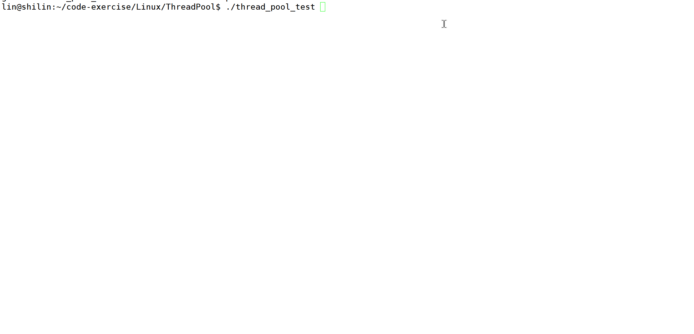

# 基于单例模式（懒汉模式）来创建的线程池
1. 在创建线程池的时候需要加锁
2. 双重if判定，避免不必要的锁竞争

## ThreadPool.hpp
```cpp
#ifndef __THREAD_POOL__
#define __THREAD_POOL__

#include <queue>

#include "lockGuard.hpp"
#include "Thread.hpp"
#include "Cond.hpp"
#include "Logger.hpp"

const static int defaultThreadNum = 3;

template <typename T>
class ThreadPool
{
private:
    bool isEmpty()
    {
        return _q.empty();
    }

    void Routine(const std::string &name)
    {
        for (;;)
        {
            T t; // 获取任务
            {
                LockGuard lockGuard(&_lock);   // 线程过来进行加锁
                while (isEmpty() && _isRuning) // 任务队列为空且线程池正在运行就正在等待
                {
                    _wait_thread_num++;
                    _cond.Wait(_lock);
                    _wait_thread_num--;
                }
                if (isEmpty() && !_isRuning)
                {
                    LOG(LogLevel::INFO) << " 线程池退出 && 任务队列为空, " << name << " 退出";
                    break;
                }
                // 走到这里说明一定有任务了
                t = _q.front();
                _q.pop();
            }
            t(); // 执行任务
            LOG(LogLevel::DEBUG) << name << " handler task: " << t.Result2String();
        }
    }
    std::unique_ptr<ThreadPool<T>> &operator=(const std::unique_ptr<ThreadPool<T>> &) = delete; // 赋值重载禁用掉
    ThreadPool(const std::unique_ptr<ThreadPool<T>> &) = delete;                                // 拷贝构造禁用掉

public:
    ThreadPool(int threadNum = defaultThreadNum)
        : _threadNum(threadNum),
          _wait_thread_num(0),
          _isRuning(false)
    {
        for (int i = 0; i < _threadNum; i++)
        {
            std::string name = "thread-" + std::to_string(i + 1);
            _threads.emplace_back([this](const std::string &name)
                                  { this->Routine(name); }, name);
            LOG(LogLevel::INFO) << "thread pool obj create success";
        }
    }
    static std::string ToHex(ThreadPool<T>* addr)
    {
        char buffer[64];
        snprintf(buffer, sizeof(buffer), "%p", addr);
        return buffer;
    }

    static ThreadPool<T>* getInstance()
    {
        if (!_instance)
        {
            LockGuard lockGuard(&_singleton_lock);
            if (!_instance)
            {
                _instance = std::make_unique<ThreadPool<T>>();
                LOG(LogLevel::DEBUG) << "线程池单例首次被使用，创建并初始化, addr: " << ToHex(_instance.get());
                _instance->Start();
            }
        }
        else
            LOG(LogLevel::DEBUG) << "线程池单例已经存在,直接获取, addr: " << ToHex(_instance.get());

        return _instance.get();
    }

    void Start()
    {
        if (_isRuning) // 线程池已经在运行了
            return;
        _isRuning = true;
        for (auto &t : _threads)
        {
            t.Start();
        }
        LOG(LogLevel::INFO) << "thread pool running success";
    }

    void Stop()
    {
        if (!_isRuning) // 已经停止了
            return;
        _isRuning = false;
        if (_wait_thread_num > 0)
            _cond.NotifyAll(); // 唤醒所有线程

        LOG(LogLevel::INFO) << "thread pool stop success";
        // 不推荐直接停止线程，因为可能有些线程还在执行任务
    }

    void Wait()
    {
        for (auto &t : _threads)
        {
            t.Join();
        }
        LOG(LogLevel::INFO) << "thread pool wait success";
    }

    void Push(const T &in)
    {
        if (!_isRuning)
            return;
        {
            LockGuard lockGuard(&_lock);
            _q.push(in);
            if (_wait_thread_num > 0)
                _cond.Notify();
        }
    }

    ~ThreadPool() {}

private:
    std::queue<T> _q;             // 任务队列
    std::vector<Thread> _threads; // 多个线程

    int _threadNum;       // 线程个数
    int _wait_thread_num; // 线程等待个数

    Mutex _lock; // 锁
    Cond _cond;  // 条件变量

    bool _isRuning; // 是否在运行

    static Mutex _singleton_lock;                    // 单例模式锁
    static std::unique_ptr<ThreadPool<T>> _instance; // 单例模式指针
};

template <typename T>
std::unique_ptr<ThreadPool<T>> ThreadPool<T>::_instance = nullptr;

template <typename T>
Mutex ThreadPool<T>::_singleton_lock; // 初始化锁
#endif
```

## main.cc
```cpp
#include "ThreadPool_singleton-pattern.hpp"
#include "Task.hpp"

#include <memory>

int main()
{
    srand(time(nullptr) ^ getpid());

    int cnt = 10;
    while (cnt--)
    {
        int data1 = rand() % 10 + 1;
        int data2 = rand() % 10 + 1;
        usleep(10);
        char op = opers[rand() % opers.size()];
        Task t(data1, data2, op);
        ThreadPool<Task>::getInstance()->Push(t);
        std::cout << "生产了一个任务: " << t.GetTask() << std::endl;
        sleep(1);
    }

    ThreadPool<Task>::getInstance()->Stop();
    ThreadPool<Task>::getInstance()->Wait();

    return 0;
}

```

## 测试
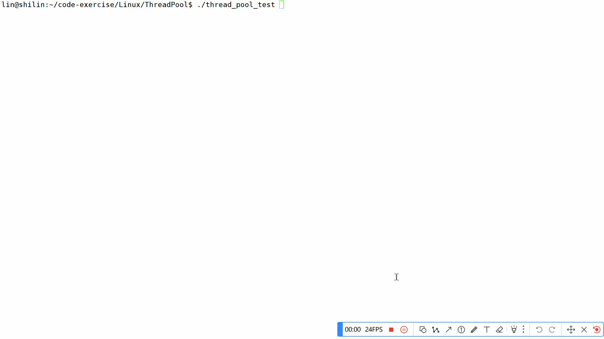


# 可重入VS线程安全
## 概念
+ 线程安全：多个线程并发同一段代码时，不会出现不同的结果。常见对全局变量或者静态变量进行操作， 并且没有锁保护的情况下，会出现该问题。 
+ 重入：同一个函数被不同的执行流调用，当前一个流程还没有执行完，就有其他的执行流再次进入，我们 称之为重入。一个函数在重入的情况下，运行结果不会出现任何不同或者任何问题，则该函数被称为可重 入函数，否则，是不可重入函数。

## 常见的线程不安全的情况
+ 不保护共享变量的函数
+ 函数状态随着被调用，状态发生变化的函数 
+ 返回指向静态变量指针的函数
+ 调用线程不安全函数的函数

## 常见的线程安全的情况
+ 每个线程对全局变量或者静态变量只有读取的权限，而**没有写入的权限**，一般来说这些线程是安全的 
+ 类或者接口对于线程来说都是原子操作 
+ 多个线程之间的切换不会导致该接口的执行结果存在二义性

## 常见不可重入的情况
+ 调用了malloc/free函数，因为malloc函数是用全局链表来管理堆的 
+ 调用了标准I/O库函数，标准I/O库的很多实现都以不可重入的方式使用全局数据结构 
+ 可重入函数体内使用了静态的数据结构

## 常见可重入的情况
+ 不使用全局变量或静态变量 
+ 不使用用malloc或者new开辟出的空间 
+ 不调用不可重入函数
+ 不返回静态或全局数据，所有数据都有函数的调用者提供 
+ 使用本地数据，或者通过制作全局数据的本地拷贝来保护全局数据

## 可重入与线程安全联系
+ **函数是可重入的，那就是线程安全的 **
+ 函数是不可重入的，那就不能由多个线程使用，有可能引发线程安全问题
+ **如果一个函数中有全局变量，那么这个函数既不是线程安全也不是可重入的。**

## 可重入与线程安全区别
+ 可重入函数是线程安全函数的一种 
+ 线程安全不一定是可重入的，而可重入函数则一定是线程安全的。 
+ 如果将对临界资源的访问加上锁，则这个函数是线程安全的，但如果这个重入函数若锁还未释放则会产生死锁，因此是不可重入的。

---

如果不考虑**信号**导致一个执行流重复进入函数这种重入情况，线程安全和重入在安全角度不做区分

+ 但是线程安全侧重说明线程访问公共资源的安全情况，表现的是并发线程的特点
+ 可重入描述的是一个函数是否能被重复进入，表示的是函数的特点

# 常见锁概念
## 死锁
死锁是指在一组进程中的各个进程均占有不会释放的资源，但因互相申请被其他进程所站用不会释放的资源而处于的一种永久等待状态。

## 死锁四个必要条件
+ **互斥条件**：一个资源每次只能被一个执行流使用
+ **请求与保持条件**：一个执行流因请求资源而阻塞时，对已获得的资源保持不放 
+ **不剥夺条件**：一个执行流已获得的资源，在末使用完之前，不能强行剥夺 
+ **循环等待条件**：若干执行流之间形成一种头尾相接的循环等待资源的关系

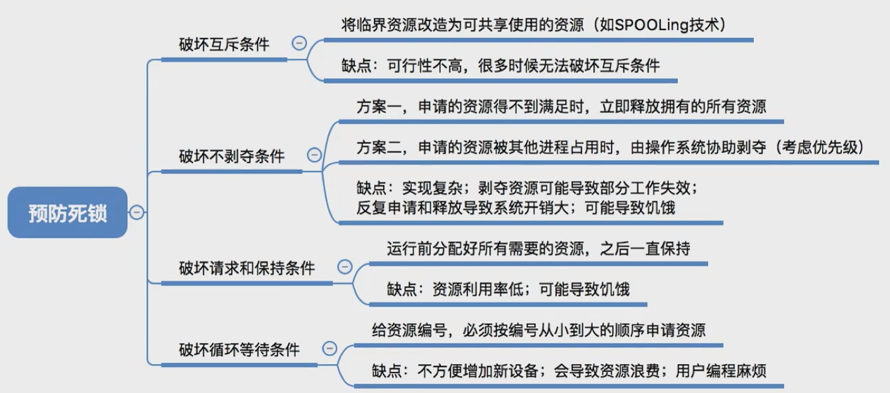

## 避免死锁
+ 破坏死锁的四个必要条件 
+ 加锁顺序一致 
+ 避免锁未释放的场景 
+ 资源一次性分配

可以使用`std::lock()`同时锁定两个互斥锁

## 避免死锁算法
+ 死锁检测算法
+ 银行家算法

# STL、智能指针和线程安全
STL中的容器不是线程安全的

原因：

+ STL 的设计初衷是将性能挖掘到极致, 而一旦涉及到加锁保证线程安全, 会对性能造成巨大的影响。
+ 而且对于不同的容器, 加锁方式的不同, 性能可能也不同(例如hash表的锁表和锁桶)。
+ 因此 STL 默认不是线程安全. 如果需要在多线程环境下使用, 往往需要调用者自行保证线程安全。

智能指针是否是线程安全的

+ 对于`unique_ptr`, 由于只是在当前代码块范围内生效, 因此不涉及线程安全问题.
+ 对于`shared_ptr`, 多个对象需要共用一个引用计数变量, 所以会存在线程安全问题. 但是标准库实现的时候考虑到了这个问题, 基于原子操作(CAS)的方式保证`shared_ptr`能够高效, 原子的操作引用计数。

# 常见的锁
+ 悲观锁：在每次取数据时，总是担心数据会被其他线程修改，所以会在取数据前先加锁（读锁，写锁，行锁等），当其他线程想要访问数据时，被阻塞挂起。
+ 乐观锁：每次取数据时候，总是乐观的认为数据不会被其他线程修改，因此不上锁。但是在更新数据前，会判断其他数据在更新前有没有对数据进行修改。主要采用两种方式：版本号机制和CAS操作。
+ CAS操作：当需要更新数据时，判断当前内存值和之前取得的值是否相等。如果相等则用新值更新。若不等则失败，失败则重试，一般是一个自旋的过程，即不断重试。
+ 挂起等待锁：当某个线程没有申请到锁的时候，此时该线程会被挂起，即加入到等待队列等待。当锁被释放的时候，就会被唤醒，重新竞争锁。当临界区运行的时间较长时，我们一般使用挂起等待锁。我们先让线程PCB加入到等待队列中等待，等锁被释放时，再重新申请锁。

> 之前所学的互斥锁就是**挂起等待锁** 
>

+ 自旋锁：当某个线程没有申请到锁的时候，该线程不会被挂起，而是每隔一段时间检测锁是否被释放。如果锁被释放了，那就竞争锁；如果没有释放，过一会儿再来检测。如果这里使用挂起等待锁，可能线程刚加入等待队列，锁就被释放了，因此，当**临界区运行的时间较短**时，我们一般使用**自旋锁**。

```cpp
pthread_spin_lock();
```

+ 自旋锁只需要把`mutex`变成`spin`。

# 读者写者问题
在编写多线程的时候，有一种情况是十分常见的。那就是，有些公共数据修改的机会比较少。相比较改写，它们读的机会反而高的多。通常而言，在读的过程中，往往伴随着查找的操作，中间耗时很长。给这种代码段加锁，会极大地降低我们程序的效率。那么有没有一种方法，可以专门处理这种多读少写的情况呢？ 有，那就是**读写锁**。


+ 3种关系：写者和写者（互斥），读者和读者（没有关系），读者和写者（互斥关系）
+ 2种角色：读者、写者
+ 1个交易场所：读写场所

---

+ 读者写者 vs 生产者消费者

本质区别：**消费者会把数据拿走，而读者不会**

---

初始化：

```cpp
int pthread_rwlock_init(pthread_rwlock_t *restrict rwlock, const pthread_rwlockattr_t *restrict attr);
```

销毁：

```cpp
int pthread_rwlock_destroy(pthread_rwlock_t *rwlock);
```

加锁和解锁：

```cpp
int pthread_rwlock_rdlock(pthread_rwlock_t *rwlock);  // 读者加锁
int pthread_rwlock_wrlock(pthread_rwlock_t *rwlock); // 写者加锁

int pthread_rwlock_unlock(pthread_rwlock_t *rwlock); // 读写者解锁
```

+ 设置读写优先：
    - 分为读者优先和写者优先。
+ 读者写者进行操作的时候，读者非常多，频率特别高，写者比较少，频率不高
+ 存在写者饥饿的情况，但是很少出现

## 代码实现的较为简单的读者写者问题
```cpp
struct rwlock_t
{
    int readers = 0;
    int who;
    mutex_t mutex;
}
```

读者：

```cpp
ptjread_rwlock_rdlock()
lock(mutex)
readers++
(unlock)mutex
```

read操作：

```cpp
lock(mutex)
readers--;
unlock(mutex) 
```

写者：

```cpp
pthread_rwlock_wrlock()
lock(mutex)
while(readers > 0) 释放锁, wait
```

write操作：

```cpp
unlock(mutex)
```

```cpp
#include <iostream>
#include <pthread.h>
#include <unistd.h>
#include <vector>
#include <cstdlib>
#include <ctime>

// 共享资源
int shared_data = 0;

// 读写锁
pthread_rwlock_t rwlock;

// 读者线程函数
void *Reader(void *arg)
{
    // sleep(1); //读者优先，一旦读者进入&&读者很多，写者基本就很难进入了
    int number = *(int *)arg;
    while (true)
    {
        pthread_rwlock_rdlock(&rwlock); // 读者加锁
        std::cout << "读者-" << number << " 正在读取数据, 数据是: " << shared_data << std::endl;
        pthread_rwlock_unlock(&rwlock); // 解锁
        sleep(1);                       // 模拟读取操作
    }
    delete (int *)arg;
    return NULL;
}

// 写者线程函数
void *Writer(void *arg)
{
    int number = *(int *)arg;
    while (true)
    {
        pthread_rwlock_wrlock(&rwlock); // 写者加锁
        shared_data = rand() % 100;     // 修改共享数据
        std::cout << "写者- " << number << " 正在写入. 新的数据是: " << shared_data << std::endl;
        sleep(2);                       // 模拟写入操作
        pthread_rwlock_unlock(&rwlock); // 解锁
    }
    delete (int *)arg;
    return NULL;
}

int main()
{
    srand(time(nullptr) ^ getpid());
    pthread_rwlock_init(&rwlock, NULL); // 初始化读写锁

    // 可以更高读写数量配比，观察现象
    const int reader_num = 2;
    const int writer_num = 2;
    const int total = reader_num + writer_num;
    pthread_t threads[total]; // 假设读者和写者数量相等

    // 创建读者线程
    for (int i = 0; i < reader_num; ++i)
    {
        int *id = new int(i);
        pthread_create(&threads[i], NULL, Reader, id);
    }

    // 创建写者线程
    for (int i = reader_num; i < total; ++i)
    {
        int *id = new int(i - reader_num);
        pthread_create(&threads[i], NULL, Writer, id);
    }

    // 等待所有线程完成
    for (int i = 0; i < total; ++i)
    {
        pthread_join(threads[i], NULL);
    }

    pthread_rwlock_destroy(&rwlock); // 销毁读写锁

    return 0;
}

```

## 读者优先（Reader-Preference）
在这种策略中，系统会尽可能多地允许多个读者同时访问资源（比如共享文件或数据），而不会优先考虑写者。这意味着当有读者正在读取时，新到达的读者会立即被允许进入读取区，而写者则会被阻塞，直到所有读者都离开读取区。读者优先策略可能会导致写者饥饿（即写者长时间无法获得写入权限），特别是当读者频繁到达时。

## 写者优先（Writer-Preference）
在这种策略中，**系统会优先考虑写者**。当写者请求写入权限时，系统会尽快地让写者进入写入区，即使此时有读者正在读取。这通常意味着一旦有写者到达，所有后续的读者都会被阻塞，直到写者完成写入并离开写入区。写者优先策略可以减少写者等待的时间，但可能会导致读者饥饿（即读者长时间无法获得读取权限），特别是当写者频繁到达时。

# 自旋锁
自旋锁是一种多线程同步机制，用于保护共享资源免受并发访问的影响。在多个线程尝试获取锁时，它们会持续自旋（即在一个循环中不断检查锁是否可用）而不是立即进入休眠状态等待锁的释放。这种机制减少了线程切换的开销，适用于短时间内锁的竞争情况。但是不合理的使用，可能会造成CPU的浪费。


原理：

自旋锁通常使用一个共享的标志位（如一个布尔值）来表示锁的状态。当标志位为true时，表示锁已被某个线程占用；当标志位为false时，表示锁可用。当一个线程尝试获取自旋锁时，它会不断检查标志位：

+ 如果标志位为false，表示锁可用，线程将设置标志位为true，表示自己占用了锁，并进入临界区。
+ 如果标志位为true（即锁已被其他线程占用），线程会在一个循环中不断自旋等待，直到锁被释放。

自旋锁实现伪代码：

```cpp
#include <stdio.h>
#include <stdatomic.h>
#include <pthread.h>
#include <unistd.h>
// 使用原子标志来模拟自旋锁
atomic_flag spinlock = ATOMIC_FLAG_INIT; // ATOMIC_FLAG_INIT 是 0
// 尝试获取锁
void spinlock_lock() {
    while (atomic_flag_test_and_set(&spinlock)) {
        // 如果锁被占用，则忙等待
    }
}
// 释放锁
void spinlock_unlock() {
    atomic_flag_clear(&spinlock);
}
```

```cpp
typedef _Atomic struct
{
#if __GCC_ATOMIC_TEST_AND_SET_TRUEVAL == 1
_Bool __val;
#else
unsigned char __val;
#endif
} atomic_flag;
```

样例代码：

```cpp
#include <stdio.h>
#include <stdlib.h>
#include <string.h>
#include <unistd.h>
#include <pthread.h>

int ticket = 1000;
pthread_spinlock_t lock;

void *route(void *arg)
{
    char *id = (char *)arg;
    while (1)
    {
        pthread_spin_lock(&lock);
        if (ticket > 0)
        {
            usleep(1000);
            printf("%s sells ticket:%d\n", id, ticket);
            ticket--;
            pthread_spin_unlock(&lock);
        }
        else
        {
            pthread_spin_unlock(&lock);
            break;
        }
    }
    return nullptr;
}

int main(void)
{
    pthread_spin_init(&lock, PTHREAD_PROCESS_PRIVATE);
    pthread_t t1, t2, t3, t4;

    pthread_create(&t1, NULL, route, (void *)"thread 1");
    pthread_create(&t2, NULL, route, (void *)"thread 2");
    pthread_create(&t3, NULL, route, (void *)"thread 3");
    pthread_create(&t4, NULL, route, (void *)"thread 4");

    pthread_join(t1, NULL);
    pthread_join(t2, NULL);
    pthread_join(t3, NULL);
    pthread_join(t4, NULL);

    pthread_spin_destroy(&lock);
    return 0;
}
```

在使用自旋锁时，需要确保锁被释放的时间尽可能短，以避免CPU资源的浪费。

在多CPU环境下，自旋锁可能不如其他锁机制高效，因为它可能导致线程在不同的CPU上自旋等待。


所以自旋锁是一种适用于短时间内锁竞争情况的同步机制，它通过减少线程切换的开销来提高锁操作的效率。然而，它也存在CPU资源浪费和可能引起活锁等缺点。在使用自旋锁时，需要根据具体的应用场景进行选择，并确保锁被释放的时间尽可能短。


