# Linux多线程【线程控制】
# Linux中线程如何理解
线程：**是进程内的一个执行分支，线程的执行粒度，要比进程细。**

+ 在一个程序里的一个执行路线就叫做线程（**thread**）。更准确的定义是：线程是“**一个进程内部的控制序列**”一个进程至少都有一个执行线程
+ **线程在进程内部运行**，本质是在进程地址空间内运行
+ 在Linux系统中，在CPU眼中，看到的PCB都要比传统的进程更加**轻量化。**
+ 透过进程虚拟地址空间，可以看到进程的大部分资源，将进程资源合理分配给每个执行流，就形成了**线程执行流。**

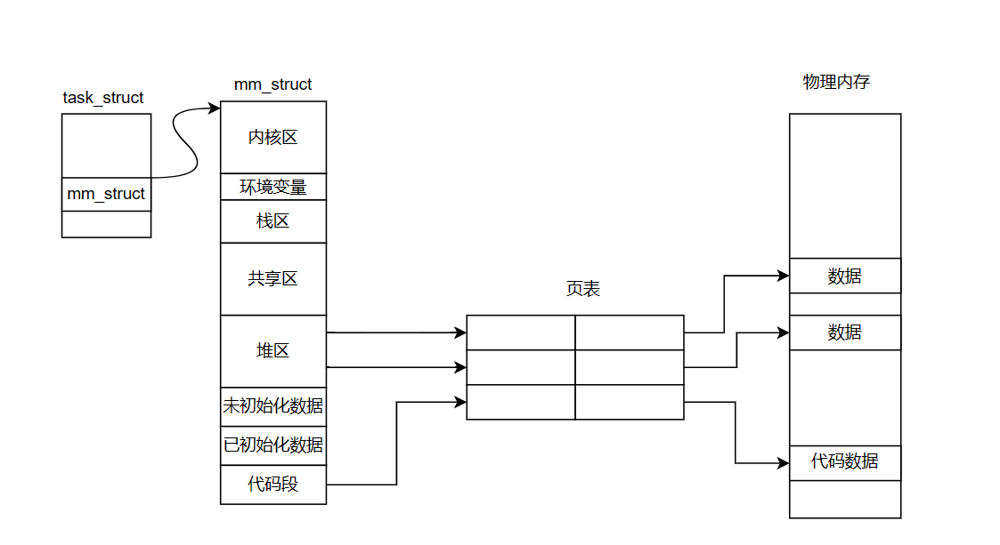

## 如何理解线程？
在Linux系统下，并没有真正意义上的线程。因为在Linux系统下，线程没有属于自己的数据结构。而windows操作系统是为线程设定了指定的数据结构。而**在Linux系统下，线程复用了进程的PCB**。也就是说，描述线程和进程的结构体都是`task_struct`。 而这些PCB都共享同一块进程地址空间，共享同一块页表…以及其他的资源。

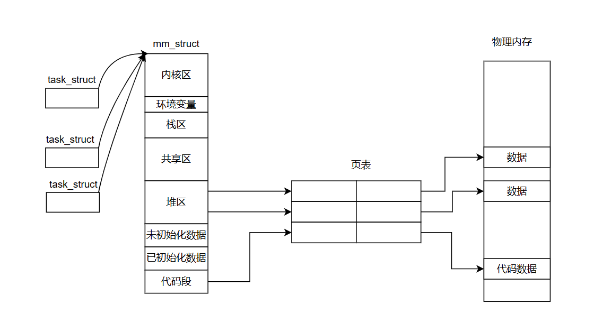

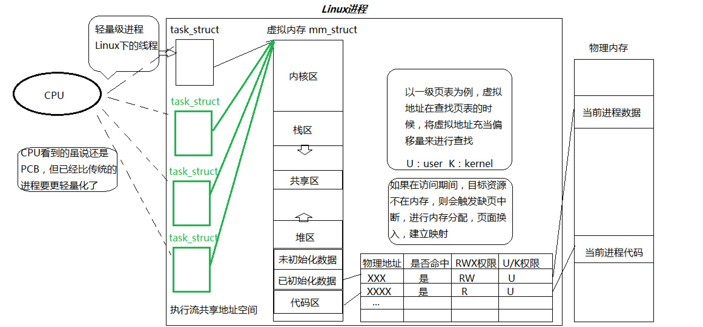

进程就不仅仅是一个PCB了，而是**多个PCB + 当前进程的资源 = 进程**。而每一个PCB都是一个执行流，无论是线程还是进程，CPU都不关心。因为**CPU只负责调度PCB**。而通过一定的技术手段，可以将进程的"资源"以一定的方式分配给不同的`task_struct`。

+ Linux中，一个线程：线程在进程的虚拟地址空间中运行

如何做到？

+ 让不同的线程未来执行不同的入口函数即可！

解释：进程页表的本质是什么？是进程看到资源的"窗口"，所以：谁拥有更多的虚拟地址，谁就拥有更多的物理内存资源，对函数进行编址，让不同的执行流，执行不同的函数函数是虚拟地址的集合！让不同的线程，执行不同的函数，本质是让不同的线程，通过拥有不同区域的虚拟地址，拥有不同的资源！

通过**函数编译（虚拟地址空间的划分）**的方式，也就进行了进程内部的“资源划分”

## 重新定义线程和进程
在之前的认知中，我们都认为一个进程就是一个PCB + 程序的代码和数据。 但是现在我们要重新认识进程了。当进程内部**只有一个执行流的时候， 进程 = PCB + 程序的代码和数据**。 当进程内部有多个执行流的时候 ，那么**进程 = 多个PCB + 程序的代码和数据**。

在CPU的视角中，**CPU其实根本不关心当前调用的是进程还是线程**，因为它**只认PCB**，也就是`task_struct`。所以在linux系统下， **PCB <= 其他OS内的PCB**。因为当Linux下的进程包含多个执行流的时候，那么多个PCB其实共享了大部分资源，那么此时的PCB就会小于其他OS内的PCB。因为其他的OS，进程和线程都有属于各自的数据结构。

> 得出结论：
>

1. 进程 = **多个PCB（**`task_struct`**） + 程序的代码和数据**
2. 进程是**承担操作系统分配资源的基本实体**。
3. 线程是在**进程**的**内部**的**执行流资源**。因为它们**共享同一块进程地址空间以及其他资源**。
4. 线程是**CPU调度的基本单元。**

## 总结
+ 进程是程序的一次执行，而线程可以理解为程序中运行的一个片段
+ 由于**线程没有独立的地址空间**，因此同一个进程的一组线程可以共享访问该进程大部分资源, 这些线程之间的通信也很高效
+ 线程之间的通信简单(共享地址空间和页表信息，因此传参以及全局数据都可以实现通信)。而不同进程之间的通信更为复杂，通常需要调用内核实现。
+ **线程并没有独立的虚拟地址空间**，**只是在进程虚拟地址空间中拥有相对独立的一块空间。**
+ 不管系统中是否有线程，**进程都是拥有资源的独立单位**

---

+ **多进程之间的数据共享比多线程编程复杂**，因为线程之间共享地址空间，因此通信更加方便，全局数据以及函数传参都可以实现，而进程间则需要系统调用来完成。
+ **多线程的创建，切换，销毁速度快于多进程**，因为线程之间共享了进程中的大部分资源，因此共享的数据不需要重新创建或销毁，因此消耗上低于进程，反之也就是速度快于进程。
+ 大量的计算使用多进程和多线程都可以实现并行/并发处理，而**线程的资源消耗小于多进程**，而**稳定向较多进程有所不如**。
+ **多线程没有内存隔离**，**单个线程崩溃会导致整个应用程序的退出**，其实不仅仅是内存隔离的问题，还有就是异常针对的是整个进程，因此单个线程的崩溃会导致异常针对进程触发，最终退出整个进程。
+ 一个程序至少有一个进程，一个进程至少有一个线程，这是**错的**，**程序是静态的**，不涉及进程，进程是程序运行时的实体，是一次程序的运行。
+ 操作系统的**最小调度单位是线程**
+ 进程是资源的**分配单位**，所以线程并**不拥有系统资源**，而是**共享使用进程的资源**，进程的**资源由系统进行分配**。
+ **任何一个线程都可以创建或撤销另一个线程**

---

+ 多进程里，子进程可复制父进程的所有堆和栈的数据；而线程会与同进程的其他线程共享数据，但拥有自己的栈空间
+ 线程拥有自己的栈空间且共享数据没错，但是资源消耗更小，且便于进程内线程间的资源管理和保护，否则会造成栈混乱。
+ **线程的通信速度更快，切换更快**，因为他们在同一地址空间内，且还共享了很多其他的进程资源，比如页表指针这些是不需要切换的
+ 线程使用公共变量/内存时需要使用同步机制，因为他们在同一地址空间内
+ **进程因为每个都有独立的虚拟地址空间**，因此通信麻烦，需要**调用内核接口实现**。而**线程间共用同一个虚拟地址空间，通过全局变量以及传参就可实现通信**，因此更加灵活方便。

---

+ 每个线程有自己独立的地址空间，这是错误的，**线程只是在进程虚拟地址空间中拥有相对独立的一块空间，但是本质上说用的是同一个地址空间**
+ 耗时的操作使用线程，提高应用程序响应，**使用多线程可以更加充分利用cpu资源**，使任务处理效率更高，进而提高程序响应
+ 对于多核心cpu来说，每个核心都有一套独立的寄存器用于进行程序处理，因此可以同时将多个执行流的信息加载到不同核心上并行运行，充分利用cpu资源提高处理效率
+ 线程包含cpu线程，但是线程只是进程中的一个执行流，执行的是程序中的一个片段代码，多个线程完整整体程序的运行

---

+ 在linux中，进程比线程安全的原因是进程之间不会共享数据，错误，**进程比线程安全的原因是每个进程有独立的虚拟地址空间**，**有自己独有的数据，具有独立性**，不会数据共享这个太过宽泛与片面
+ **进程有独立的地址空间，线程没有单独的地址空间**（同一进程内的线程共享进程的地址空间）
+ **进程**——资源分配的最小单位，**线程**——程序执行的最小单位

# 分页式存储管理
把物理内存按照一个固定的长度的页框进行分割，有时叫做物理页。每个页框包含一个物理页（page）。一个页的大小等于页框的大小。大多数32位体系结构支持4KB的页，而64位体系结构一般会支持8KB的页。区分一页和一个页框是很重要的：

+ **页框**是一个存储区域；
+ 而**页**是一个数据块，可以存放在任何页框或磁盘中。

有了这种机制，CPU便并非是直接访问物理内存地址，而是通过虚拟地址空间来间接的访问物理内存地址。所谓的虚拟地址空间，是操作系统为每一个正在执行的进程分配的一个逻辑地址，在32位机上，其范围从0 ~ 4G。

操作系统通过将虚拟地址空间和物理内存地址之间建立映射关系，也就是页表，这张表上记录了每一对页和页框的映射关系，能让CPU间接的访问物理内存地址。

总结：其思想是**将虚拟内存下的逻辑地址空间分为若干页，将物理内存空间分为若干页框，通过页表便能把连续的虚拟内存，映射到若干个不连续的物理内存页**。这样就解决了使用连续的物理内存造成的碎片问题。

---

假设一个可用的物理内存有 4GB 的空间。按照一个页框的大小 4KB 进行划分， 4GB的空间就是`4GB/4KB = 1048576`个页框。有这么多的物理页，操作系统肯定是要将其管理起来的，操作系统需要知道哪些页正在被使用，哪些页空闲等等（flag参数）。

内核用`struct page`结构表示系统中的每个物理页，出于节省内存的考虑，`struct page`中使用了大量的联合体union。

```c
/*
 * Each physical page in the system has a struct page associated with
 * it to keep track of whatever it is we are using the page for at the
 * moment. Note that we have no way to track which tasks are using
 * a page.
 */
struct page {
	unsigned long flags;		/* Atomic flags, some possibly
					 * updated asynchronously */
	atomic_t _count;		/* Usage count, see below. */
	atomic_t _mapcount;		/* Count of ptes mapped in mms,
					 * to show when page is mapped
					 * & limit reverse map searches.
					 */
	union {
	    struct {
		unsigned long private;		/* Mapping-private opaque data:
					 	 * usually used for buffer_heads
						 * if PagePrivate set; used for
						 * swp_entry_t if PageSwapCache;
						 * indicates order in the buddy
						 * system if PG_buddy is set.
						 */
		struct address_space *mapping;	/* If low bit clear, points to
						 * inode address_space, or NULL.
						 * If page mapped as anonymous
						 * memory, low bit is set, and
						 * it points to anon_vma object:
						 * see PAGE_MAPPING_ANON below.
						 */
	    };
#if NR_CPUS >= CONFIG_SPLIT_PTLOCK_CPUS
	    spinlock_t ptl;
#endif
	};
	pgoff_t index;			/* Our offset within mapping. */
	struct list_head lru;		/* Pageout list, eg. active_list
					 * protected by zone->lru_lock !
					 */
	/*
	 * On machines where all RAM is mapped into kernel address space,
	 * we can simply calculate the virtual address. On machines with
	 * highmem some memory is mapped into kernel virtual memory
	 * dynamically, so we need a place to store that address.
	 * Note that this field could be 16 bits on x86 ... ;)
	 *
	 * Architectures with slow multiplication can define
	 * WANT_PAGE_VIRTUAL in asm/page.h
	 */
#if defined(WANT_PAGE_VIRTUAL)
	void *virtual;			/* Kernel virtual address (NULL if
					   not kmapped, ie. highmem) */
#endif /* WANT_PAGE_VIRTUAL */
};
```

其中比较重要的几个参数：

1. `flags`：用来存放页的状态。这些状态包括页是不是脏的，是不是被锁定在内存中等。flag的每一位单独表示一种状态，所以它至少可以同时表示出32种不同的状态。这些标志定义在`<linux/page-flags.h>`中。其中一些比特位非常重要，如`PG_locked`用于指定页是否锁定，`PG_uptodate`用于表示页的数据已经从块设备读取并且没有出现错误。

```c
#define L_PTE_PRESENT		(1 << 0)
#define L_PTE_FILE		(1 << 1)	/* only when !PRESENT */
#define L_PTE_YOUNG		(1 << 1)
#define L_PTE_BUFFERABLE	(1 << 2)	/* matches PTE */
#define L_PTE_CACHEABLE		(1 << 3)	/* matches PTE */
#define L_PTE_USER		(1 << 4)
#define L_PTE_WRITE		(1 << 5)
#define L_PTE_EXEC		(1 << 6)
#define L_PTE_DIRTY		(1 << 7)
#define L_PTE_COHERENT		(1 << 9)	/* I/O coherent (xsc3) */
#define L_PTE_SHARED		(1 << 10)	/* shared between CPUs (v6) */
#define L_PTE_ASID		(1 << 11)	/* non-global (use ASID, v6) */
```

2. `_mapcount`：表示在页表中有多少项指向该页，也就是这一页被引用了多少次。当计数值变为-1时，就说明当前内核并没有引用这一页，于是在新的分配中就可以使用它。
3. `virtual`：是页的虚拟地址。通常情况下，它就是页在虚拟内存中的地址。有些内存（即所谓的高端内存）并不永久地映射到内核地址空间上。在这种情况下，这个域的值为NULL，需要的时候，必须动态地映射这些页。

要注意的是`struct page`与物理页相关，而并非与虚拟页相关。而系统中的每个物理页都要分配一个这样的结构体，让我们来算算对所有这些页都这么做，到底要消耗掉多少内存。

+ 算`struct page`占40个字节的内存吧，假定系统的物理页为4KB大小，系统有4GB 物理内存。那么系统中共有页面`1048576`个（1兆个），所以描述这么多页面的page结构体消耗的内存只不过40MB ，相对系统4GB内存而言，仅是很小的一部分罢了。因此，要管理系统中这么多物理页面，这个代价并不算太大。
+ 要知道的是，页的大小对于内存利用和系统开销来说非常重要，页太大，页必然会剩余较大不能利用的空间（页内碎片）。页太小，虽然可以减小页内碎片的大小，但是页太多，会使得页表太长而占用内存，同时系统频繁地进行页转化，加重系统开销。因此，页的大小应该适中，通常为`512B-8KB` ，windows系统的页框大小为`4KB`。

---

**整体结构如下：**

前置知识：我们先要知道在C/C++编译后会有虚拟地址（逻辑地址），在一个虚拟地址（这里以32位为例）首先要进行`10 + 10 + 12` 的方式进行分割，**前10个比特位**是对页目录里的项表进行定位找到二级页表中的页表表项，**中间的10个比特位**是对二级页表的表项进行定位找到对应的物理地址，然后：**后12比特位**是对对应的**起始地址 + 偏移量**就找到了对应的物理地址。

页目录的物理地址被CR3寄存器指向，这个寄存器中：保存了当前正在执行任务的页目录地址。

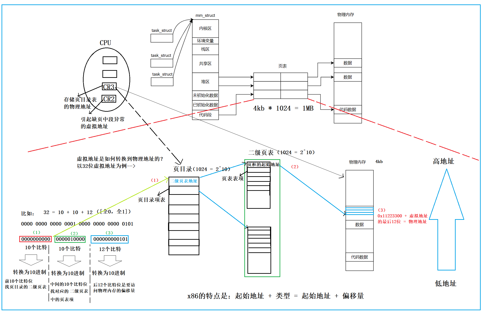

1. 在32位处理器中，采用4KB的页大小，则虚拟地址中低12位为页偏移，剩下高20位给页表，分成两级，每个级别占10个bit（10+10）。
2. CR3 寄存器读取页目录起始地址，再根据一级页号查页目录表，找到下一级页表在物理内存中存放位置。
3. 根据二级页号查表，找到最终想要访问的内存块号。
4. 结合页内偏移量得到物理地址。
5. 注：一个物理页的地址一定是4KB对齐的(最后的12位全部为0 )，所以其实只需要记录物理页地址的高 20 位即可。
6. 以上其实就是`MMU`的工作流程。MMU(Memory Manage Unit)是一种硬件电路，其速度很快，主要工作是进行内存管理，地址转换只是它承接的业务之一。

MMU要先进行两次页表查询确定物理地址，在确认了权限等问题后，MMU再将这个物理地址发送到总线，内存收到之后开始读取对应地址的数据并返回。那么当页表变为N级时，就变成了N次检索+1次读写。可见，页表级数越多查询的步骤越多，对于CPU来说等待时间越长，效率越低。

+ 其实在C语言和C++中取地址只有一个地址，是取的第一个的**起始地址（最小的）**
+ C++中的空类的大小也是一个字节，也就是一个字节，因为要知道这个空类在哪。

```cpp
#include<iostream>
using namespace std;

class A
{};

int main()
{
    cout << sizeof(A) << endl;
    return 0;
}

```

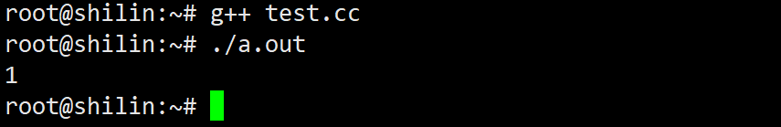

所以操作系统在加载用户程序的时候，不仅仅需要为程序内容来分配物理内存，还需要为用来保存程序的页目录和页表分配物理内存。

总结一下：单级页表对连续内存要求高，于是引入了多级页表，但是多级页表也是一把双刃剑，在减少连续存储要求且减少存储空间的同时降低了查询效率。

有没有提升效率的办法呢？计算机科学中的所有问题，都可以通过添加一个中间层来解决。MMU引入了新武器，江湖人称快表的TLB （其实，就是缓存）当CPU给MMU 传新虚拟地址之后， MMU先去问TLB 那边有没有，如果有就直接拿到物理地址发到总线给内存。但TLB容量比较小，难免发生`Cache Miss`，这时候MMU还有保底的老武器页表，在页表中找到之后MMU除了把地址发到总线传给内存，还把这条映射关系给到TLB，让它记录一下刷新缓存。

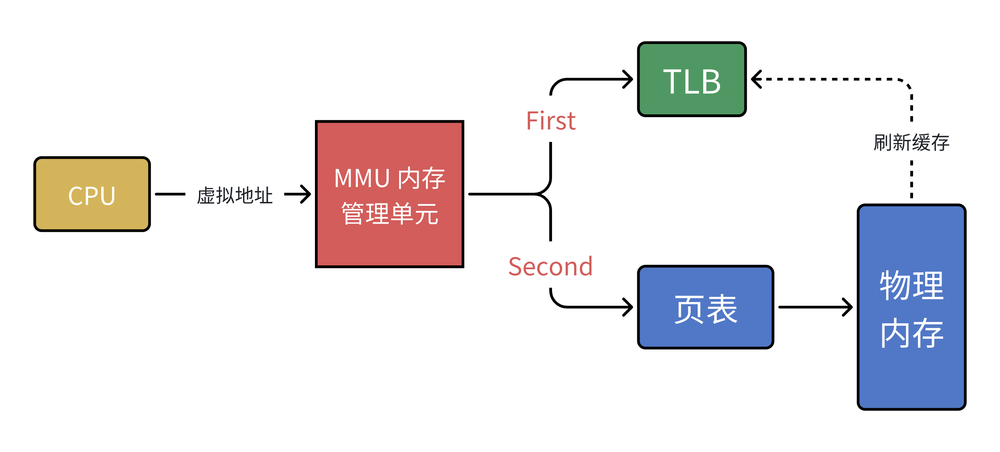

# 缺页异常
设想，CPU 给 MMU 的虚拟地址，在TLB 和页表都没有找到对应的物理页，该怎么办呢？其实这就是缺页异常`Page Fault`，它是一个由**硬件中断触发**的可以由软件逻辑纠正的错误。

假如目标内存页在物理内存中没有对应的物理页或者存在但无对应权限，CPU 就无法获取数据，这种情况下CPU就会报告一个缺页错误。

由于 CPU 没有数据就无法进行计算，CPU罢工了用户进程也就出现了缺页中断，进程会从用户态切换到内核态，并将缺页中断交给内核的`Page Fault Handler`处理。

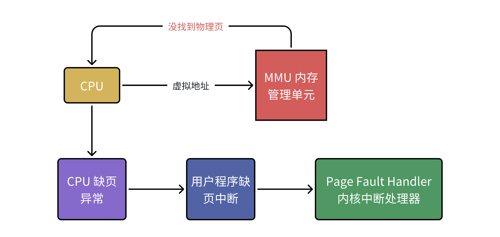

缺页中断会交给`PageFaultHandler`处理，其根据缺页中断的不同类型会进行不同的处理：

+ `Hard Page Fault`也被称为`Major Page Fault`，翻译为硬缺页错误/主要缺页错误，这时物理内存中没有对应的物理页，需要CPU打开磁盘设备读取到物理内存中，再让MMU建立虚拟地址和物理地址的映射。
+ `Soft Page Fault`也被称为`Minor Page Fault`，翻译为软缺页错误/次要缺页错误，这时物理内存中是存在对应物理页的，只不过可能是其他进程调入的，发出缺页异常的进程不知道而已，此时MMU只需要建立映射即可，无需从磁盘读取写入内存，一般出现在多进程共享内存区域。
+ `Invalid Page Fault`翻译为无效缺页错误，比如进程访问的内存地址越界访问，又比如对空指针解引用内核就会报`segment fault`错误中断进程直接挂掉。

# 线程一些周边概念
+ 在CPU内部是有一个`cache`的缓存里面是存放的热数据
+ `cache`缓存工作的基本原理是通过将部分主存中的数据复制到更快速但容量较小的缓存中，以便 CPU 在需要时能够更快地获取数据。当 CPU 需要访问数据时，首先检查缓存中是否存在该数据。如果存在（命中），则可以直接从缓存读取，避免了从主存中读取的延迟。如果不存在（未命中），则需要从主存中加载到缓存，并且通常会**替换**掉缓存中的某些旧数据。
+ 而线程内的切换不需要重新加载cache数据，所以更加轻量化~~

但是地址空间和页表切换并没有太大的消耗。线程切换成本更低的本质原因是因为CPU内部有`L1~L3 cache`。

我们都知道，CPU处理指令是一条一条处理的。但如果每次CPU都去内存读一条指令，那么速度是非常非常慢的。所以CPU**内部有个缓冲区**。会先把内存中的指令放进CPU内部缓冲区。也就是预读代码，这样CPU就不用频繁的去内存中读取指令。而是直接在内部缓冲区里读，这样子速度是非常快的。而线程切换，cache不会失效。但如果是进程切换，那么cache就会立马失效，只能重新缓冲。所以这才是线程切换更快的本质原因，因为线程切换，CPU内部的缓冲区不用重新缓存。

### 线程的优点
+ 创建一个新线程的代价要比创建一个新进程小得多
    - **进程内的多线程切换，cache缓存不用更新，但是进程间切换，就要重新把cache缓冲区“热起来"**
+ 与进程之间的切换相比，线程之间的切换需要操作系统做的工作要少很多
    - 最主要的区别是线程的切换虚拟内存空间依然是相同的，但是进程切换是不同的。这两种上下文切换的处理都是通过操作系统内核来完成的。内核的这种切换过程伴随的最显著的性能损耗是将寄存器中的内容切换出。
    - 另外一个隐藏的损耗是上下文的切换会扰乱处理器的缓存机制。简单的说，一旦去切换上下文，处理器中所有已经缓存的内存地址一瞬间都作废了。还有一个显著的区别是当你改变虚拟内存空间的时候，处理的页表缓冲TLB （快表）会被全部刷新，这将导致内存的访问在一段时间内相当的低效。但是在线程的切换中，不会出现这个问题，当然还有硬件cache。
        * TLB：采用物理寻址的缓存的一种常见优化，是并行的进行 TLB 查寻和缓存的访问。所有虚拟地址的较低比特（例如，在虚拟内存系统中具有 4KB 标签页时，虚拟地址中较低的那 12 比特）代表的是所请求的地址在分页内部的地址偏移量（页内地址），且这些比特不会在虚拟地址转换到物理地址的过程中发生改变。访问CPU缓存的过程包含两步：使用一条索引去寻找CPU缓存的资料存储区中的相应条目，然后比较找到的CPU缓存条目的相应标记。如果缓存是用虚实地址转译过程中不变的页内地址来索引组织起来的，则可并行地执行TLB上虚实地址的较高比特(即分页的页间地址／页号）的转换与CPU缓存的“索引”操作。然后，从 TLB 获得的的物理地址的页号会发送给CPU缓存。CPU缓存会对页号标记进行比较，以决定此次访问是寻中或是缺失。它也有可能并行的进行 TLB 查寻和CPU缓存访问，即使CPU缓存必须使用某些可能会在地址转译后发生改变的比特；
+ 能充分利用多处理器的可并行数量
+ 在等待慢速I/O操作结束的同时，程序可执行其他的计算任务
+ 计算密集型应用，为了能在多处理器系统上运行，将计算分解到多个线程中实现
+ I/O密集型应用，为了提高性能，将I/O操作重叠。线程可以同时等待不同的I/O操作。

### 线程的缺点
1. 编程复杂性高

多线程需处理同步问题（如死锁、竞态条件），需使用锁、信号量等机制，代码逻辑复杂且调试困难。例如，共享变量的并发访问可能导致不可预测的结果。

2. 稳定性风险

线程共享进程资源，一个线程崩溃可能引发整个进程终止，缺乏进程间的隔离性。相比之下，进程崩溃仅影响自身，对系统稳定性更友好。

3. 性能瓶颈

线程过多会导致频繁的上下文切换开销，尤其在计算密集型任务中，线程数超过CPU核心数时，性能反而下降。此外，线程切换会扰乱处理器缓存机制，增加额外开销。

# Linux进程VS线程
## 进程和线程
进程是资源分配的基本单位

线程是调度的基本单位

线程共享进程数据，但也拥有自己的一部分数据：

> 线程ID
>
> **一组寄存器**（重要）
>
> **栈**（重要）
>
> errno
>
> 信号屏蔽字
>
> 调度优先级
>

## 进程的多个线程共享
同一地址空间，因此Text Segment、Data Segment都是共享的，如果定义一个函数，在各线程中都可以调用，如果定义一个全局变量，在各线程中都可以访问到，除此之外，各线程还共享以下进程资源和环境:

+ 文件描述符表
+ 每种信号的处理方式(SIG_ IGN、SIG_ DFL或者自定义的信号处理函数) 当前工作目录 
+ 用户id和组id

## Linux线程控制
+ 内核中没有明确的线程的概念，有**轻量级进程的概念。**
+ 这也就意味着Linux并**不能直接给我们提供线程相关的接口**，只能提供**轻量级进程接口**。以库的方式提供给了用户进行使用，那就是`pthread`线程库（在应用层），为用户提供直接创建线程的接口，也叫**原生线程库**。

### 创建线程
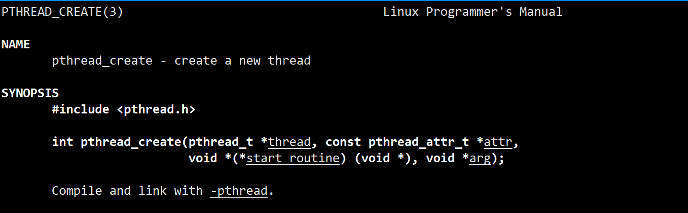

```cpp
int pthread_create(pthread_t *thread, const pthread_attr_t *attr,
                   void *(*start_routine) (void *), void *arg);
```

+ 第一个参数：是一个输出型参数，是线程的tid。
    - 这个“ID”是 pthread 库给每个线程定义的进程内**唯一标识**，是 pthread 库维持的。
    - 由于每个进程有自己独立的内存空间，故此“ID”的作用域是进程级而非系统级（内核不认识）。
    - 其实 pthread 库也是通过内核提供的系统调用（例如clone）来创建线程的，而内核会为每个线程创建系统全局唯一的“ID”来唯一标识这个线程。
+ 第二个参数：线程的属性，一般设置位`nullptr`
+ 第三个参数：一个函数指针，为线程的执行函数
+ 第四个参数：创建线程成功后，新线程回调线程函数的时候，需要参数，这个参数就是给线程函数传递的

**成功返回**： 如果线程创建成功，`pthread_create`函数将返回 0。

**失败返回**： 如果线程创建失败，`pthread_create`函数将返回一个非零的错误码。这个错误码可以用来判断失败的原因，例如 `EAGAIN` 表示系统资源不足以创建新线程，`EINVAL` 表示提供的属性值无效，`EPERM` 表示调用进程没有足够的权限等。

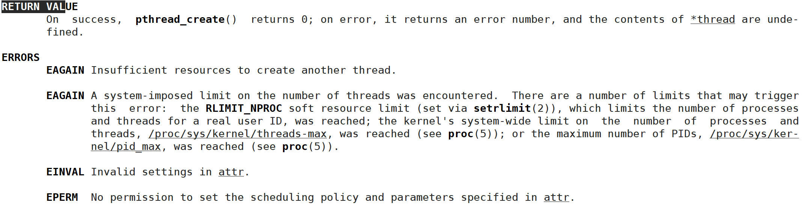

测试代码：

**makefile：**

+ 在编译的时候加上一个`-lpthread`选项，否则无法编译通过，因为原生线程库并不属于C/C++库，这是一个第三方库

```bash
mythread:mythread.cc
	g++ -o $@ $^ -std=c++11 -lpthread
.PHONY:clean
clean:
	rm -rf mythread
```

**mythread.cc：**

```cpp
#include <iostream>
#include <string>
#include <pthread.h>
#include <unistd.h>
using namespace std;

void *ThreadRun(void *args)
{
    const char *name = (const char *)args;
    while (true)
    {
        printf("%s,  pid: %d\n", name, getpid());
        sleep(1);
    }

    return (void *)name; // 返回线程名称作为退出值
}

int main()
{
    pthread_t tids[5];
    for (size_t i = 0; i < 5; i++)
    {
        std::string name = "Thread ";
        name += std::to_string(i);
        pthread_create(&tids[i], nullptr, ThreadRun, (void *)name.c_str());
        printf("Thread main, pid: %d\n", getpid());
        sleep(1);
    }
    sleep(5);
    std::cout << "Main thread exiting.\n";
    return 0;
}
```

然后运行后我们发现。5个线程 + 一个主线程，它们打印出来的进程pid都是一样的

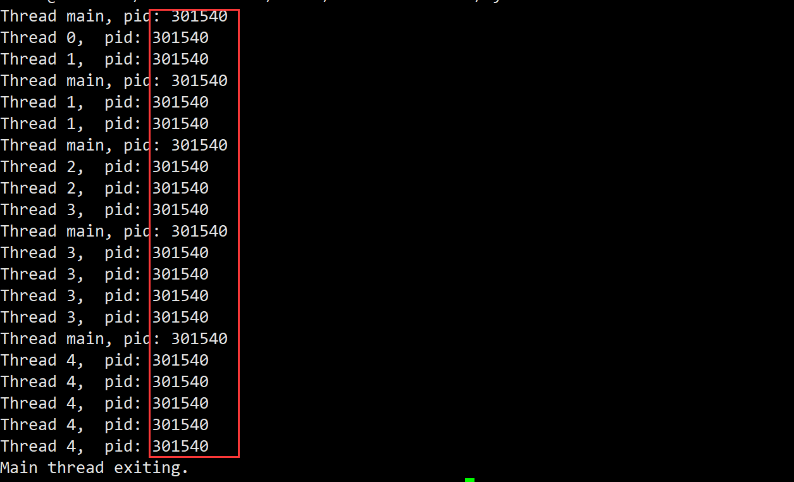

循环检测命令：

```cpp
while :; do ps -axj | head -1 && ps -axj | grep -i mythread | grep -v grep; sleep 1; done;
```

+ 可以看到在运行的时候始终只有一个进程

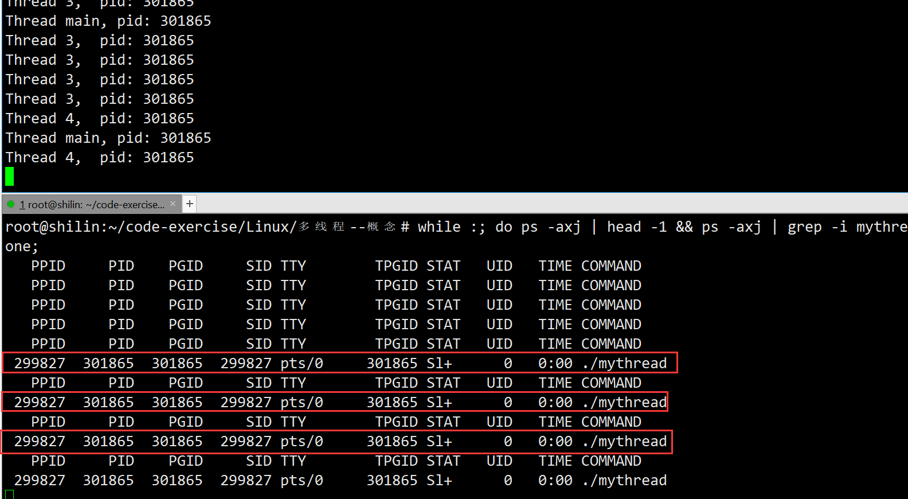

+ 因为线程是**进程内部执行的**！所以我们无法看到线程

## LWP
+ 如果想看线程，我们可以用`ps -aL`即可查看当前进程下的线程。
+ -L 选项：打印线程信息

```cpp
while :; do ps -aL | head -1 && ps -aL | grep -i mythread | grep -v grep; sleep 1; done;
```

+ 我们可以看到这个进程中有**6个线程，一个主线程**。剩下的**5个创建的线程**。 我们可以发现它们的**PID都是一样的**。但是**LWP（L**ight** W**eight** P**rocess**）是不一样的！ 所以，CPU调度看的是LWP，因为线程是CPU调度的基本单元**。如果是根据PID进行调度，那么这么多线程的PID都一样，就会产生歧义。所以**CPU调度实际是根据LWP字段调度的**！！！
+ LWP是轻量级进程，在Linux下进程是资源分配的基本单位，线程是cpu调度的基本单位，而线程使用进程pcb描述实现，并且同一个进程中的所有pcb共用同一个虚拟地址空间，因此相较于传统进程更加的轻量化
+ 在`ps -aL`得到的线程ID，有一个线程ID和进程ID相同，这个线程就是主线程，主线程的栈在虚拟地址空间的栈上，而其他线程的栈在是在共享区（堆栈之间），因为pthread系列函数都是pthread库提供给我们的。而pthread库是在共享区的。所以除了主线程之外的其他线程的栈都在共享区。

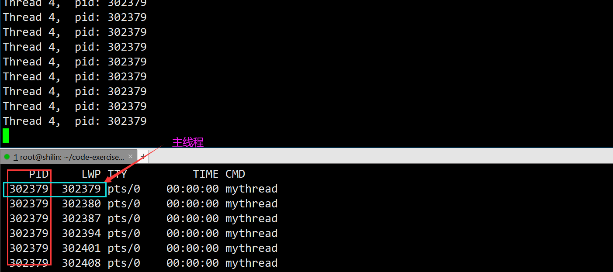

轻量级进程ID与进程ID之间的区别：

+ Linux下的轻量级进程是一个pcb，每个轻量级进程都有一个自己的轻量级进程ID（pcb中的pid），而同一个程序中的轻量级进程组成线程组，拥有一个共同的线程组ID

**此外：我们还可以查看每个线程的CPU占用率**

+ 使用`top`查看的是进程视角
+ 使用`top -H`查看的是线程视角

# 验证线程之间共享地址空间
+ 我们只需要在全局上创建一个变量，让新的线程进行修改，然后再进行观察

代码验证：

```cpp
#include <iostream>
#include <string>
#include <pthread.h>
#include <unistd.h>
using namespace std;

int g_val = 100;

void *ThreadRun(void *args)
{
    const char *name = (const char *)args;
    while (true)
    {
        printf("%s,  pid: %d, g_val: %d, &g_val: 0x%p\n", name, getpid(), g_val, &g_val);
        g_val++;
        sleep(1);
    }

    return (void *)name; // 返回线程名称作为退出值
}

int main()
{
    pthread_t tid;
    pthread_create(&tid, nullptr, ThreadRun, (void *)"Thread new");
    while (true)
    {
        printf("Thread main,  pid: %d, g_val: %d, &g_val: 0x%p\n", getpid(), g_val, &g_val);
        sleep(1);
    }
    sleep(5);
    std::cout << "Main thread exiting.\n";
    return 0;
}
```

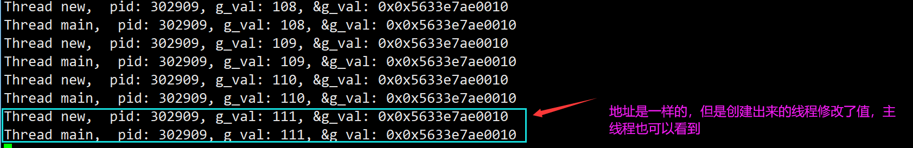

+ 地址是一样的，但是创建出来的线程修改了值，主线程也可以看到，说明共享了地址空间！
+ 如果其中一个线程出错了也会影响其他线程
+ 比如在代码中出现了除0错误，会直接导致进程退出

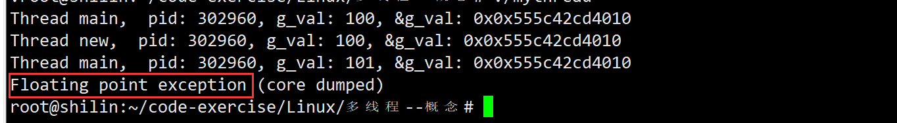

## 线程中独立的资源
线程共享进程数据，但也拥有自己的一部分数据，比如：

+ **线程id（重要）**
+ **一组寄存器(相当于上下文)（重要）**
+ **栈(每个线程有独立的栈结构，让线程与线程之间独立)（重要）**
+ errno
+ 信号屏蔽字
+ 调度优先级

测试代码：

```cpp
#include <iostream>
#include <string>
#include <vector>
#include <pthread.h>
#include <unistd.h>
using namespace std;

void *ThreadRun(void *args)
{
    const char *name = static_cast<const char *>(args);
    while (true)
    {
        printf("%s,  pid: %d\n", name, getpid());
        sleep(1);
    }

    return (void *)name; // 返回线程名称作为退出值
}

int main()
{
    std::vector<pthread_t> tids;
    for (size_t i = 0; i < 5; i++)
    {
        pthread_t tid;
        char idbuffer[64];
        snprintf(idbuffer, 64, "thread-%ld", i + 1); // 更新名字
        pthread_create(&tid, nullptr, ThreadRun, idbuffer);
        tids.push_back(tid);
        // sleep(1);
        printf("Thread main, pid: %d\n", getpid());
    }

    for (auto &tid : tids)
        printf("main create a new thread, new thread id is : 0x%lx\n", tid);

    sleep(5);
    std::cout << "Main thread exiting.\n";
    return 0;
}
```

+ 在运行后发现这里的id怎么有好多都是一样的

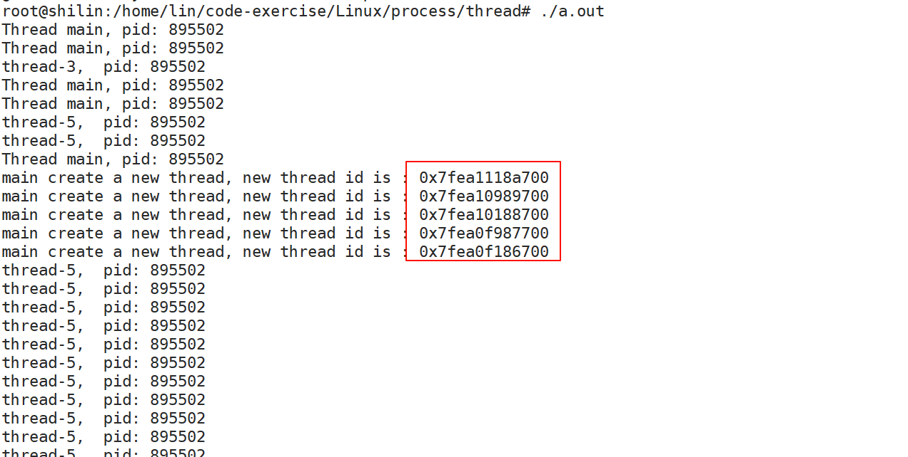

+ 由于这的idbuffer是局部变量，随时都能被当前作用域进行更改

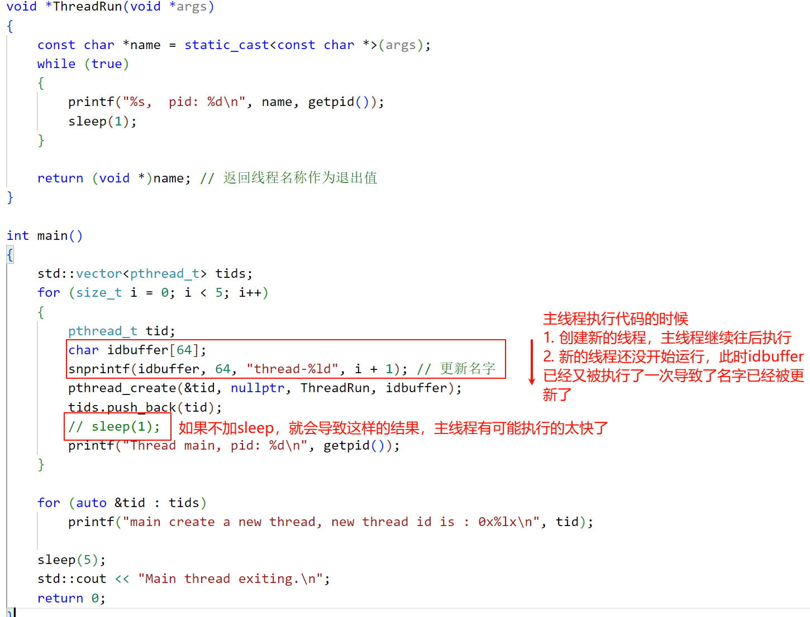

+ 这个时候就需要进行每个线程自己的空间

```cpp
#include <iostream>
#include <string>
#include <vector>
#include <pthread.h>
#include <unistd.h>
using namespace std;

void *ThreadRun(void *args)
{
    const char *name = static_cast<const char *>(args);
    while (true)
    {
        printf("%s,  pid: %d\n", name, getpid());
        sleep(1);
    }

    return (void *)name; // 返回线程名称作为退出值
}

int main()
{
    std::vector<pthread_t> tids;
    for (size_t i = 0; i < 5; i++)
    {
        pthread_t tid;
        // char idbuffer[64];
        char *name = new char[64];
        snprintf(name, 64, "thread-%ld", i + 1); // 更新名字
        pthread_create(&tid, nullptr, ThreadRun, name);
        tids.push_back(tid);
        // sleep(1);
        printf("Thread main, pid: %d\n", getpid());
    }
    for (auto &tid : tids)
        printf("main create a new thread, new thread id is : 0x%lx\n", tid);

    sleep(5);
    std::cout << "Main thread exiting.\n";
    return 0;
}
```

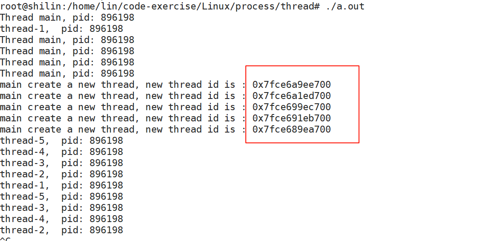

## 线程等待
```cpp
int pthread_join(pthread_t thread, void **retval);
```

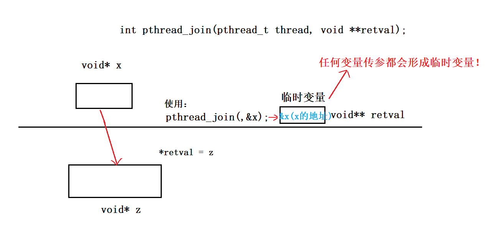

1. 如果`thread`线程通过`return`返回，`value_ ptr`所指向的单元里存放的是`thread`线程函数的返回值。 
2. 如果thread线程被别的线程调用`pthread_ cancel`异常终掉，`value_ ptr`所指向的单元里存放的是常数`PTHREAD_ CANCELED`。
3. 如果thread线程是自己调用`pthread_exit`终止的，`value_ptr`所指向的单元存放的是传给`pthread_exit`的参数。 
4. 如果对`thread`线程的终止状态不感兴趣，可以传NULL给`value_ ptr`参数。

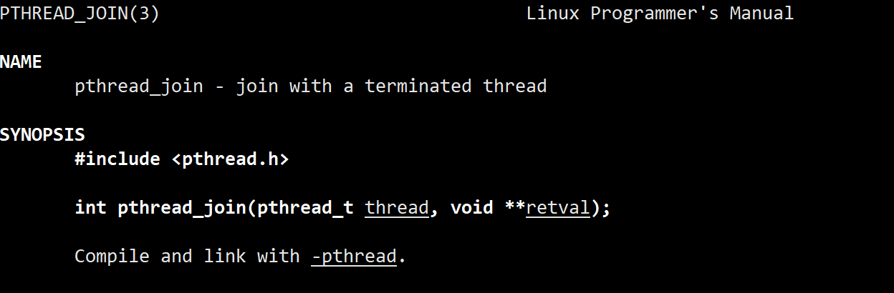

```cpp
void *ThreadRun(void *args)
{
    const char *name = (const char *)args;
    int cnt = 5;
    while (cnt)
    {
        printf("%s, cnt: %d\n", name, cnt);
        sleep(1);
        cnt--;
    }
    return (void *)name; // 返回线程名称作为退出值
}

int main()
{
    pthread_t tid;
    pthread_create(&tid, nullptr, ThreadRun, (void *)"Thread new");

    void *retval;
    pthread_join(tid, &retval);
    printf("Joined with \"%s\"\n", (char *)retval);
    std::cout << "Main thread exiting.\n";
    return 0;
}
```

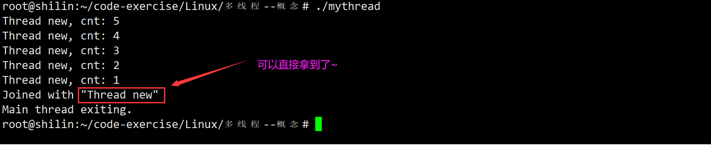

在学习进程的时候需要考虑进程出异常，而**线程为什么不需要考虑异常**？

+ 因为做不到，子线程出异常，主线程也会出异常，异常问题是进程考虑的

---

+ 这里的新线程执行完成后直接使用`exit`退出

```cpp
void *ThreadRun(void *args)
{
    const char *name = (const char *)args;
    int cnt = 5;
    while (cnt)
    {
        printf("%s, cnt: %d\n", name, cnt);
        sleep(1);
        cnt--;
    }
    exit(11); // 直接退出
    // return (void *)name; // 返回线程名称作为退出值
}
```

+ **exit是用来终止进程的不能用来终止线程**！

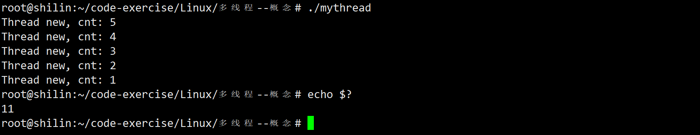

## 终止线程
```cpp
void pthread_exit(void *retval);
```

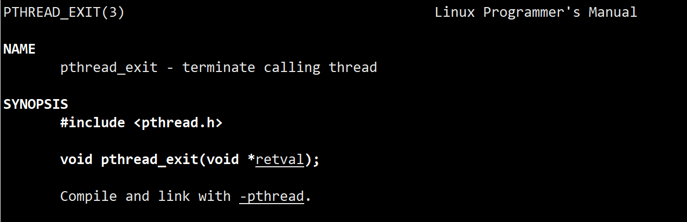

+ 这样可以看到正常终止了

```cpp
void *ThreadRun(void *args)
{
    const char *name = (const char *)args;
    int cnt = 5;
    while (cnt)
    {
        printf("%s, cnt: %d\n", name, cnt);
        sleep(1);
        cnt--;
    }
    pthread_exit((char *)name);
    // exit(11); // 直接退出
    // return (void *)name; // 返回线程名称作为退出值
}
```

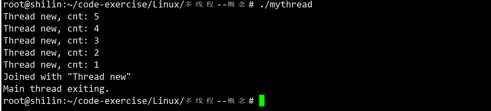

## 取消线程
```cpp
int pthread_cancel(pthread_t thread);
```

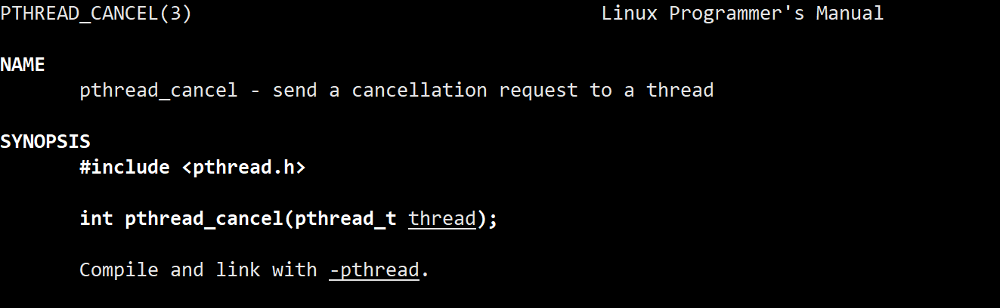

```cpp
void *ThreadRun(void *args)
{
    const char *name = (const char *)args;
    int cnt = 5;
    while (cnt)
    {
        printf("%s, cnt: %d\n", name, cnt);
        sleep(1);
        cnt--;
    }
}

int main()
{
    pthread_t tid;
    pthread_create(&tid, nullptr, ThreadRun, (void *)"Thread new");

    sleep(1);            // 保证新线程已经启动
    pthread_cancel(tid); // 取消线程

    void *retval;
    pthread_join(tid, &retval);
    printf("Joined with \"%d\"\n", (int*)retval);

    std::cout << "Main thread exiting.\n";
    return 0;
}
```

+ 这里首先取消了线程，然后`join`进行等待，发现已经取消了就返回`-1`，其实是一个宏：`PTHREAD_CANCELED`

```cpp
#define PTHREAD_CANCELED ((void *) -1)
```

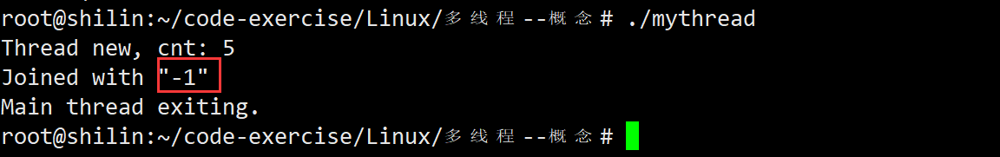

创建一个新的线程，在新线程代码中执行`pthread_cancel`取消自己

```cpp
pthread_t pthread_self(void);
```

+ 该函数返回自己线程的tid

测试代码：

```cpp
#include <iostream>
#include <string>
#include <pthread.h>
#include <unistd.h>
using namespace std;

void *ThreadRun(void *args)
{
    const char *name = (const char *)args;
    int cnt = 5;
    while (cnt)
    {
        printf("%s, cnt: %d\n", name, cnt);
        sleep(1);
        cnt--;
    }
    pthread_cancel(pthread_self()); // 取消线程
    printf("Thread new quit!\n");
}

int main()
{
    pthread_t tid;
    pthread_create(&tid, nullptr, ThreadRun, (void *)"Thread new");

    sleep(1);            // 保证新线程已经启动

    void *retval;
    pthread_join(tid, &retval);
    printf("Joined with \"%d\"\n", (int*)retval);

    std::cout << "Main thread exiting.\n";
    return 0;
}
```

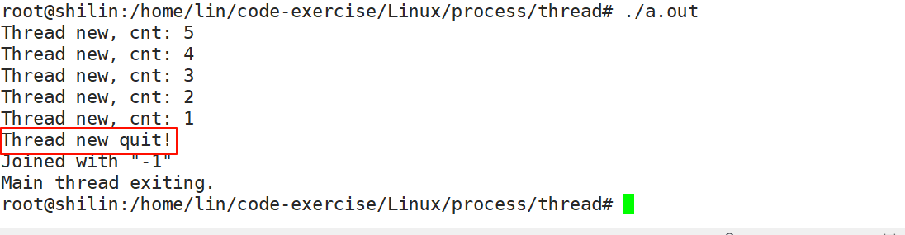

---

线程终止是可以用下面这几个方式：

1. return
2. 使用exit
3. pthread_exit
4. pthread_cancel

### 主线程创建出一个新线程，主线程执行pthread_exit()，新的线程会退出吗？
```cpp
void *PthreadRun(void *args)
{
    int cnt = 0;
    while (true)
    {
        cout << "new Thread, cnt = " << cnt << endl;
        cnt++;
        sleep(1);
    }
    return nullptr;
}

int main()
{
    pthread_t tid;
    pthread_create(&tid, nullptr, PthreadRun, nullptr);

    sleep(5);
    pthread_exit(nullptr);
    return 0;
}
```

+ 我们观察到，主线程执行`pthread_exit()`后，变成僵尸进程了

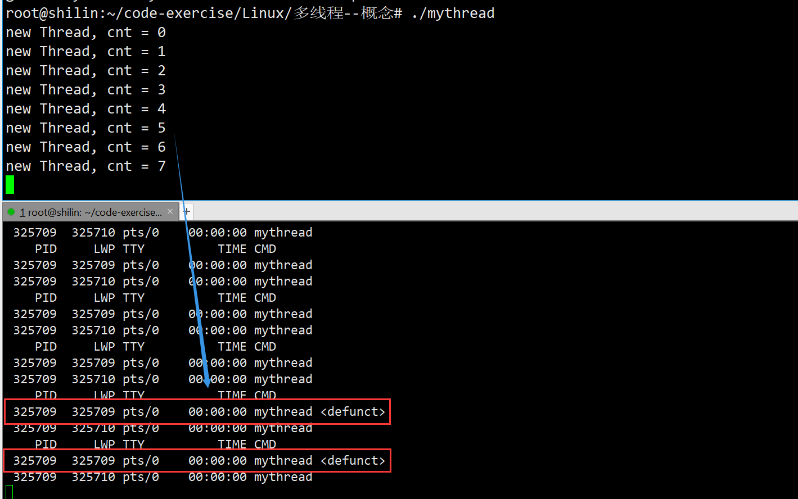

+ `Z`代表僵尸进程，`l`代表是一个多线程状态，`+`代表前台进程

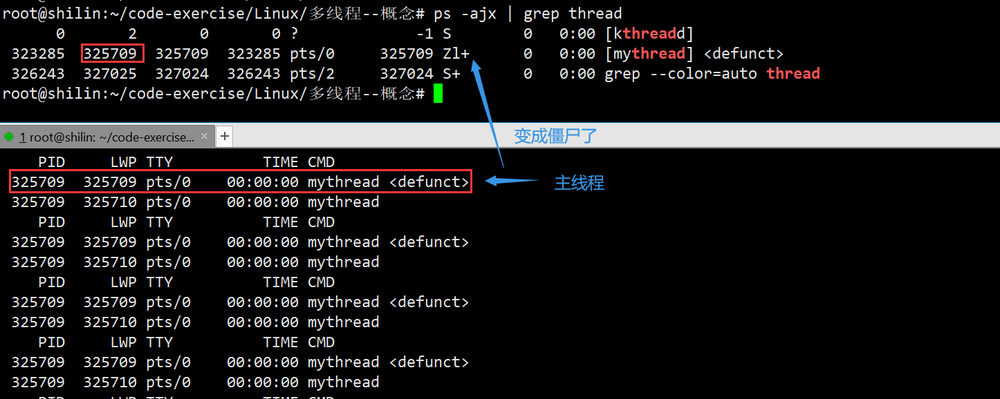

# 重谈线程的参数和返回值
+ 线程的参数和返回值，不仅仅可以用来进行传递一般参数，也可以传递对象！！

```cpp
#include <iostream>
#include <string>
#include <pthread.h>
#include <unistd.h>
using namespace std;

class Request
{
public:
    Request(int start, int end, const string &threadname)
        : start_(start), end_(end), threadname_(threadname)
    {
    }

public:
    int start_;
    int end_;
    string threadname_;
};

class Response
{
public:
    Response(int result, int exitcode) : result_(result), exitcode_(exitcode)
    {
    }

public:
    int result_;   // 计算结果
    int exitcode_; // 计算结果是否可靠
};

void *sumCount(void *args) // 线程的参数和返回值，不仅仅可以用来进行传递一般参数，也可以传递对象！！
{
    Request *rq = static_cast<Request *>(args); //  Request *rq = (Request*)args
    Response *rsp = new Response(0, 0);
    for (int i = rq->start_; i <= rq->end_; i++)
    {
        cout << rq->threadname_ << " is runing, caling..., " << i << endl;
        rsp->result_ += i;
        usleep(100000);
    }
    delete rq;
    return rsp;
}

int main()
{
    pthread_t tid;
    Request *rq = new Request(1, 100, "thread 1"); // 计算1到100的和
    pthread_create(&tid, nullptr, sumCount, rq);   // 创建线程

    void *ret;
    pthread_join(tid, &ret);
    Response *rsp = static_cast<Response *>(ret);
    cout << "rsp->result: " << rsp->result_ << ", exitcode: " << rsp->exitcode_ << endl;

    delete rsp;
    return 0;
}
```

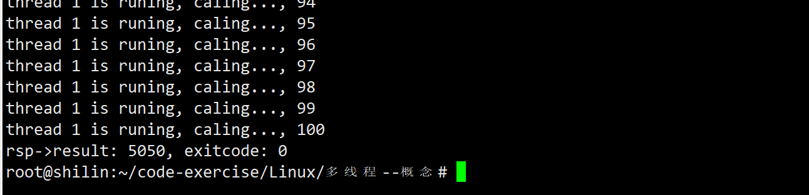

+ 目前，我们的原生线程-->**pthread库，原生线程库**
+ `C++11`语言本身也已经支持多线程了vs原生线程库

```cpp
#include <thread>

void threadrun()
{
    while (true)
    {
        cout << "I am a new thead for C++" << endl;
        sleep(1);
    }
}

int main()
{
    thread t1(threadrun);

    t1.join();
    return 0;
}
```

+ 在编译的时候如果不加`-lpthread`是编译不通过的。
+ 其实**C++11的多线程本质，就是对原生线程库接口的封装**

## 线程ID及进程地址空间布局
+ `pthread_ create`函数会产生一个线程ID，存放在第一个参数指向的地址中。该线程ID和前面说的线程ID不是一回事。
+ 线程ID属于进程调度的范畴。因为线程是轻量级进程，**是操作系统调度器的最小单位**，所以需要 一个数值来唯一表示该线程。 
+ pthread_ create函数第一个参数指向一个虚拟内存单元，该内存单元的地址即为新创建线程的线程ID， 属于`NPTL`线程库的范畴。线程库的后续操作，就是根据该线程ID来操作线程的。
+ `线程库NPTL`提供了`pthread_ self`函数，可以获得线程自身的ID。

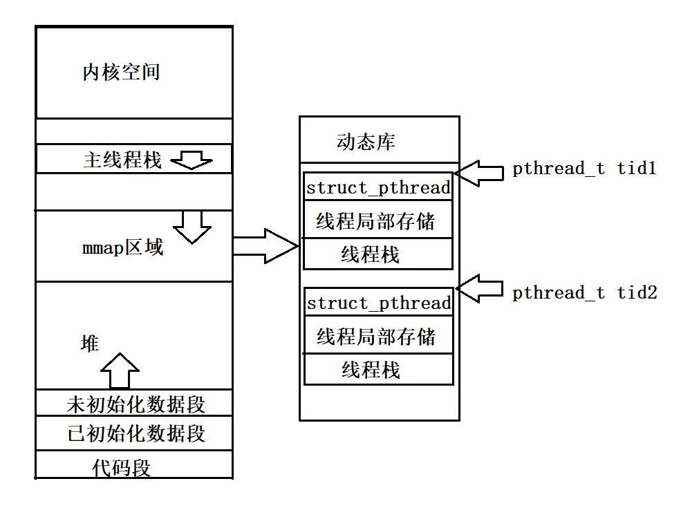

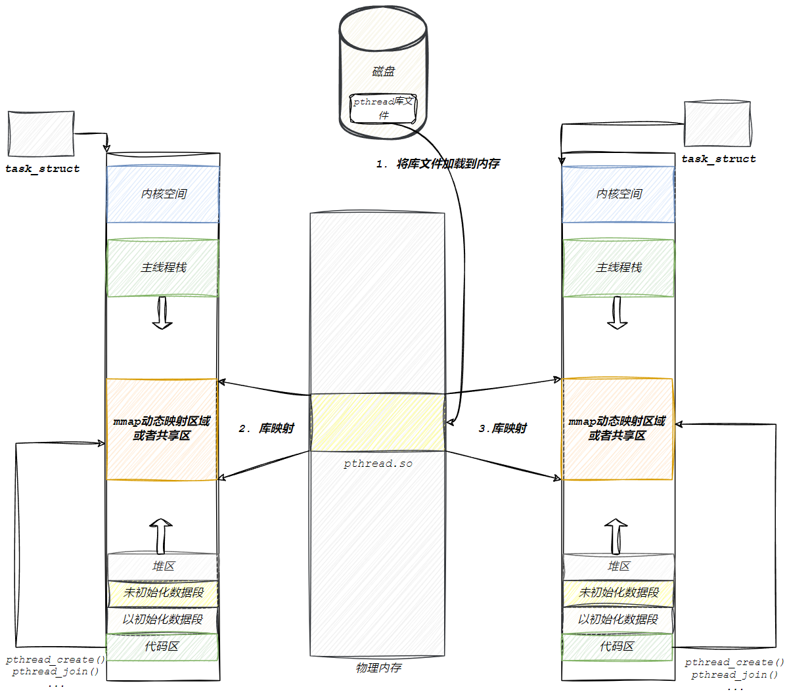

+ 每一个线程的库级别的tcb的起始地址，叫做线程的tid
+ 除了主线程，所有其他线程的独立栈，**都在共享区**，**具体来说是在pthread，tid指向的用户tcb中，在动态库中统一管理的！！！**
+ 也就是说，加载动态库是给整个系统加载的！！！

```cpp
pthread_t pthread_self(void);
```

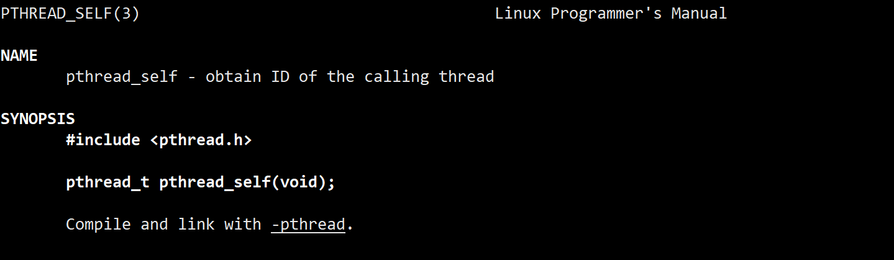

`pthread_t`到底是什么类型呢？

+ 取决于实现。对于Linux目前实现的`NPTL`实现而言，`pthread_t`类型的线程ID，本质就**是一个进程地址空间上的一个地址**。

```cpp
// 转换成十六进制
string toHex(pthread_t tid)
{
    char hex[64];
    snprintf(hex, sizeof(hex), "%p", tid);
    return hex;
}

void *threadRun(void *args)
{
    while (true)
    {
        cout << "Thread id: " << toHex(pthread_self()) << endl;
        sleep(1);
    }
}

int main()
{
    pthread_t tid;
    pthread_create(&tid, nullptr, threadRun, (void *)"Thread 1");

    cout << "main thread create thead done, new thread id : " << toHex(tid) << endl;
    pthread_join(tid, nullptr);
    return 0;
}
```

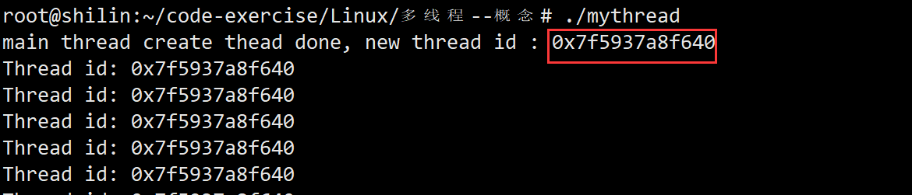

---

+ 创建一个**轻量级子进程**，这个接口我们一般不会用，接口很多

```cpp
int clone(int (*fn)(void *), void *stack, int flags, void *arg, ...
                 /* pid_t *parent_tid, void *tls, pid_t *child_tid */ );
```

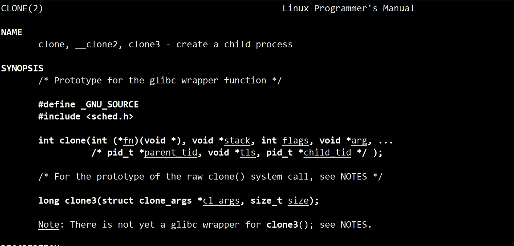

+ 这个`clone`接口被线程库封装了！

---

+ 在线程库中有线程控制块，而clone被封装成了`pthread_create`之类的接口，然后通过`clone`（回到函数，独立栈）进行操作`OS`
+ 线程的概念是库给我们维护的：**线程库要维护线程概念，不用维护线程的执行流**，
+ 线程库要维护线程概念，线程库注定了要维护多个线程属性集合，线程库也需要管理这些线程，怎么管理？**先描述，再组织**！
+ 用的原生线程库，需要加载到内存中。

## 创建多线程
```cpp
#include <iostream>
#include <string>
#include <vector>
#include <pthread.h>
#include <unistd.h>
using namespace std;

#define NUM 10

struct threadData
{
    string threadname;
};

string toHex(pthread_t tid)
{
    char buffer[128];
    snprintf(buffer, sizeof(buffer), "%#lx", tid);
    return buffer;
}

void InitThreadData(threadData *td, int number)
{
    td->threadname = "thread-" + to_string(number); // thread-0
}

// 所有的线程，执行的都是这个函数
void *threadRoutine(void *args)
{

    // 每个线程的test_i都是独立的，互不干扰的
    int test_i = 0;
    threadData *td = static_cast<threadData *>(args);


    int i = 0;
    while (i < 10)
    {
        printf("pid: %d, tid:%s, threadname: %s, test_i: %d, &test_i: %p\n", getpid(), toHex(pthread_self()).c_str(), td->threadname.c_str(), test_i, &test_i);
        test_i++;
        sleep(1);
        i++;
    }

    delete td;
    return nullptr;
}
int main()
{
    // 创建多线程
    vector<pthread_t> tids;
    for (int i = 0; i < NUM; i++)
    {
        pthread_t tid;
        // 线程名字
        threadData *td = new threadData; // 这里使用new，在堆上开空间，每个线程独享
        // 初始化线程id
        InitThreadData(td, i);

        // 创建
        pthread_create(&tid, nullptr, threadRoutine, td);
        tids.push_back(tid); // 将每个线程使用vector管理起来
        sleep(1);
    }
    sleep(1); // 确保复制成功
    return 0;
}
```

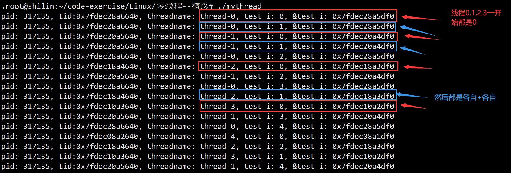

+ 还可以对指定thread进行捕捉

```cpp
#define NUM 10
int *p = NULL;
struct threadData
{
    string threadname;
};

string toHex(pthread_t tid)
{
    char buffer[128];
    snprintf(buffer, sizeof(buffer), "%#lx", tid);
    return buffer;
}

void InitThreadData(threadData *td, int number)
{
    td->threadname = "thread-" + to_string(number); // thread-0
}

// 所有的线程，执行的都是这个函数
void *threadRoutine(void *args)
{
    // 每个线程的test_i都是独立的，互不干扰的
    int test_i = 0;
    threadData *td = static_cast<threadData *>(args);
    if(td->threadname == "thread-2") p = &test_i;

    int i = 0;
    while (i < 10)
    {

        printf("pid: %d, tid:%s, threadname: %s, test_i: %d, &test_i: %p\n", getpid(), toHex(pthread_self()).c_str(), td->threadname.c_str(), test_i, &test_i);
        test_i++;
        sleep(1);
        i++;
    }

    delete td;
    return nullptr;
}
int main()
{
    // 创建多线程
    vector<pthread_t> tids;
    for (int i = 0; i < NUM; i++)
    {
        pthread_t tid;
        // 线程名字
        threadData *td = new threadData; // 这里使用new，在堆上开空间，每个线程独享
        // 初始化线程id
        InitThreadData(td, i);

        // 创建
        pthread_create(&tid, nullptr, threadRoutine, td);
        tids.push_back(tid); // 将每个线程使用vector管理起来
        // sleep(1);
    }
    sleep(1); // 确保复制成功

    cout << "main thread get a thread local value, val: " << *p << ", &val: " << p << endl;
    return 0;
}
```

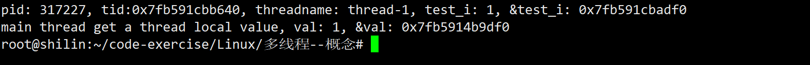

+ 每一个线程都会有自己的独立的栈结构
+ 其实线程和进程之间，几乎没有秘密
+ 线程的栈上的数据，也是可以被其他线程看到并访问的
+ 全局变量是被所有的线程同时看到并访问的

```cpp
#define NUM 3
int g_val = 100;
struct threadData
{
    string threadname;
};

string toHex(pthread_t tid)
{
    char buffer[128];
    snprintf(buffer, sizeof(buffer), "%#lx", tid);
    return buffer;
}

void InitThreadData(threadData *td, int number)
{
    td->threadname = "thread-" + to_string(number); // thread-0
}

// 所有的线程，执行的都是这个函数
void *threadRoutine(void *args)
{
    // 每个线程的test_i都是独立的，互不干扰的
    threadData *td = static_cast<threadData *>(args);

    int i = 0;
    while (i < 10)
    {
        printf("pid: %d, tid:%s, threadname: %s, g_val: %d, &g_val: %p\n", getpid(), toHex(pthread_self()).c_str(), td->threadname.c_str(), g_val, &g_val);
        g_val++;
        sleep(1);
        i++;
    }

    delete td;
    return nullptr;
}
int main()
{
    // 创建多线程
    vector<pthread_t> tids;
    for (int i = 0; i < NUM; i++)
    {
        pthread_t tid;
        // 线程名字
        threadData *td = new threadData; // 这里使用new，在堆上开空间，每个线程独享
        // 初始化线程id
        InitThreadData(td, i);

        // 创建
        pthread_create(&tid, nullptr, threadRoutine, td);
        tids.push_back(tid); // 将每个线程使用vector管理起来
        sleep(1);
    }
    sleep(1); // 确保复制成功
    return 0;
}
```

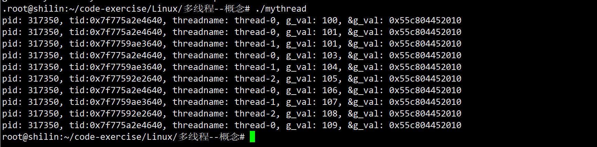

### 线程局部存储
+ 想要一个私有的全局变量就要在全局变量之前加一个`__thread`，让他变成线程的局部存储，这个修饰符是一个编译选项，只能定义内置类型，不能用来修饰自定义类型

```cpp
__thread int g_val = 100;
```

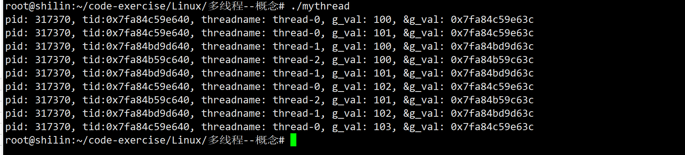

+ 使用这个可以这样，每个线程都有自己独立的number和pid，直接调用即可

```cpp
#define NUM 3
__thread unsigned int number = 0;
__thread int pid = 0;

struct threadData
{
    string threadname;
};

string toHex(pthread_t tid)
{
    char buffer[128];
    snprintf(buffer, sizeof(buffer), "%#lx", tid);
    return buffer;
}

void InitThreadData(threadData *td, int number)
{
    td->threadname = "thread-" + to_string(number); // thread-0
}

// 所有的线程，执行的都是这个函数
void *threadRoutine(void *args)
{
    threadData *td = static_cast<threadData *>(args);
    // if (td->threadname == "thread-2")
    //     p = &test_i;
    string tid = toHex(pthread_self());
    int pid = getpid();

    int i = 0;
    while (i < 10)
    {
        cout << "tid: " << tid << ", pid: " << pid << endl;
        sleep(1);
        i++;
    }

    delete td;
    return nullptr;
}
int main()
{
    // 创建多线程
    vector<pthread_t> tids;
    for (int i = 0; i < NUM; i++)
    {
        pthread_t tid;
        // 线程名字
        threadData *td = new threadData; // 这里使用new，在堆上开空间，每个线程独享
        // 初始化线程id
        InitThreadData(td, i);

        // 创建
        pthread_create(&tid, nullptr, threadRoutine, td);
        tids.push_back(tid); // 将每个线程使用vector管理起来
        sleep(1);
    }
    sleep(1); // 确保复制成功
    return 0;
}
```

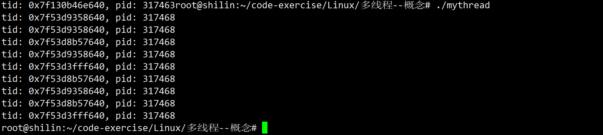

## 分离线程
+ 默认情况下，新创建的线程是`joinable`的，线程退出后，需要对其进行`pthread_join`操作，否则无法释放资源，从而造成系统泄漏。
+ 如果不关心线程的返回值，`join`是一种负担，这个时候，我们可以告诉系统，当线程退出时，自动释放线程资源。

```cpp
int pthread_detach(pthread_t thread);
```

+ 可以是线程组内其他线程对目标线程进行分离，也可以是线程自己分离:

```cpp
pthread_detach(pthread_self());
```

+ `joinable`和分离是冲突的，一个线程不能既是`joinable`又是分离的。

正常主线程分离

```cpp
int main()
{
    // 创建多线程
    vector<pthread_t> tids;
    for (int i = 0; i < NUM; i++)
    {
        pthread_t tid;
        // 线程名字
        threadData *td = new threadData; // 这里使用new，在堆上开空间，每个线程独享
        // 初始化线程id
        InitThreadData(td, i);

        // 创建
        pthread_create(&tid, nullptr, threadRoutine, td);
        tids.push_back(tid); // 将每个线程使用vector管理起来
        sleep(1);
    }
    sleep(1); // 确保复制成功

    // 分离线程
    for (auto i : tids)
    {
        pthread_detach(i);
    }
    return 0;
}
```

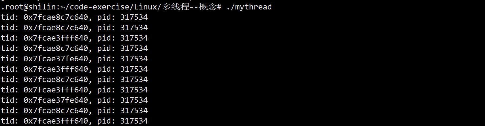

+ 在分离线程后，再进行等待会报`22`错误

```cpp
int main()
{
    // 创建多线程
    vector<pthread_t> tids;
    for (int i = 0; i < NUM; i++)
    {
        pthread_t tid;
        // 线程名字
        threadData *td = new threadData; // 这里使用new，在堆上开空间，每个线程独享
        // 初始化线程id
        InitThreadData(td, i);

        // 创建
        pthread_create(&tid, nullptr, threadRoutine, td);
        tids.push_back(tid); // 将每个线程使用vector管理起来
        sleep(1);
    }
    sleep(1); // 确保复制成功

    // 分离线程
    for (auto i : tids)
    {
        pthread_detach(i);
    }
    // pthread_detach后再pthread_join会出错
    for (int i = 0; i < tids.size(); i++)
    {
        int n = pthread_join(tids[i], nullptr);
        printf("n = %d, who = 0x%lx, why: %s\n", n, tids[i], strerror(n));
    }

    return 0;
}
```

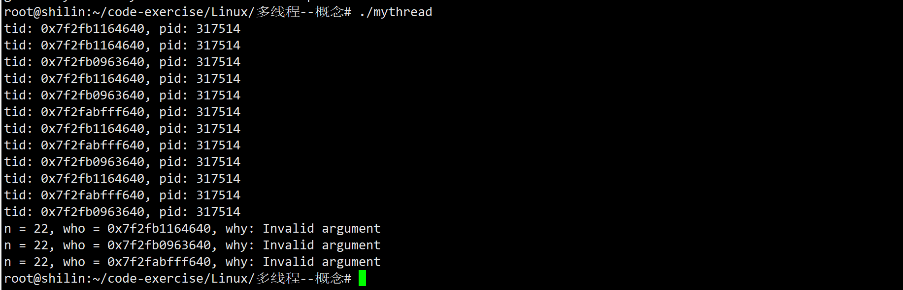

+ 线程主动分离

```cpp
// 所有的线程，执行的都是这个函数
void *threadRoutine(void *args)
{
    // 自己把自己分离
    pthread_detach(pthread_self());
    threadData *td = static_cast<threadData *>(args);
    string tid = toHex(pthread_self());
    int pid = getpid();

    int i = 0;
    while (i < 10)
    {
        cout << "tid: " << tid << ", pid: " << pid << endl;
        sleep(1);
        i++;
    }
    delete td;
    return nullptr;
}
```

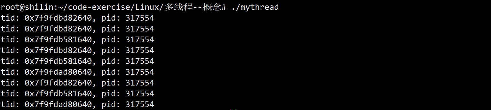

+ 如果主线程再主动等待也是会报错误的

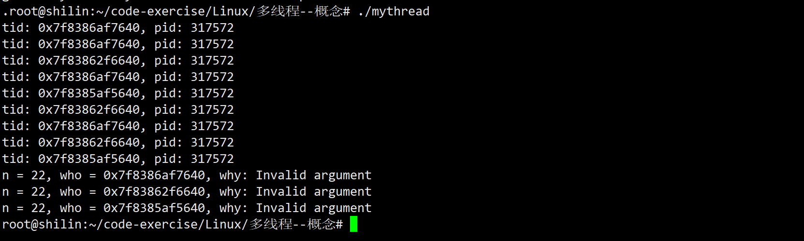

### 一道例题
两个线程并发执行以下代码，假设a是全局变量，初始为1，那么以下输出______是可能的？[多选] 

```cpp
void foo(){
    a=a+1;
    printf("%d ",a);
}
```

A.3 2           B.2 3              C.3 3             D.2 2

当函数内的操作非原子时因为竞态条件造成的数据二义，a=a+1 和 printf("%d", a) 之间有可能会被打断

+ a初始值为1
+ 当A线程执行完a=a+1后a是2，这时候打印会打印2， 线程B执行时+1打印3
+ 当A线程执行完a=a+1后a是2，这时候时间片轮转到B线程，进行+1打印3， 然后时间片轮转回来也打印3

这两个是比较显而易见的，但是还有一些特殊情况需要注意

1. printf函数实际上并不是直接输出，而是把数据放入缓冲区中，因此有可能A线程将打印的2放入缓冲区中，还没来得及输出，这时候B线程打印了3，时间片轮转回来就会后打印2
2. a=a+1本身就不是原子操作因此有可能同时进行操作，都向寄存器中加载1进去，然后进行+1后，将2放回内存，因此有可能会打印2和2

> 所以四个选项皆有可能！
>

## 获取线程自己的lwp，使用系统调用
线程局部存储的最佳实践：

```cpp
#include <iostream>
#include <string>
#include <pthread.h>
#include <unistd.h>
#include <sys/syscall.h>
using namespace std;

#define get_lwp_id() syscall(SYS_gettid)

__thread int lwpid;

void *PthreadRun(void *args)
{
    lwpid = get_lwp_id();
    int cnt = 0;
    while (true)
    {
        cout << "new Thread, cnt = " << cnt << " lwpid: " << lwpid << endl;
        cnt++;
        sleep(1);
    }
    return nullptr;
}

int main()
{
    lwpid = get_lwp_id();

    pthread_t tid;
    pthread_create(&tid, nullptr, PthreadRun, nullptr);
    sleep(1);
    cout << "main Thread, lwpid: " << lwpid << endl;

    pthread_join(tid, nullptr); // 等待线程
    return 0;
}
```

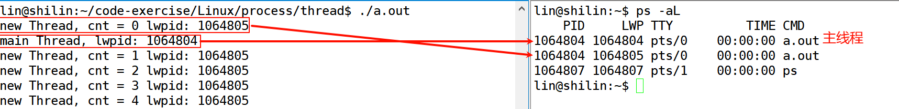

# 源码阅读，理解线程
+ 源码使用的是glibc2.4版本

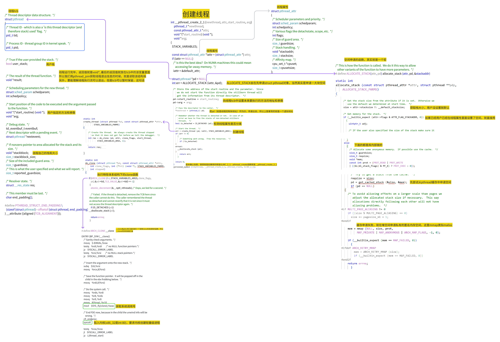

+ 所以，在创建线程的时候，其实就是在pthread库内部，创建好描述线程的结构体对象，填充属性。
+ 第二步就是调用clone，让内核创建轻量级进程，并执行传入的回调函数和参数。
+ 其实，库提供的无非就是未来操作线程的API，通过属性设置线程的优先级之类，而真正调度的过程，还是内核来的。
+ 但是如果我们自己在上层，设计一些让线程暂停出让CPU，然后我们上次自定义队列，让线程的tcb进行排队那么我们其实也可以基于内核，在用户层实现线程的调度，很多更高级的语言，可能会做这个工作。

# 线程栈
虽然 Linux 将线程和进程不加区分的统一到了`task_struct`，但是对待其地址空间的stack还是有些区别的。

+ 对于 Linux 进程或者说主线程，简单理解就是main函数的栈空间，在fork的时候，实际上就是复制了父亲的`stack`空间地址，然后写时拷贝(cow)以及动态增长。如果扩充超出该上限则栈溢出会报段错误（发送段错误信号给该进程）。进程栈是唯一可以访问未映射页而不一定会发生段错误——超出扩充上限才报。
+ 然而对于主线程生成的子线程而言，其`stack`将不再是向下生长的，而是事先固定下来的。线程栈一般是调用`glibc/uclibc`等的`pthread`库接口`pthread_create`创建的线程，在文件映射区（或称之为共享区）。其中使用`mmap`系统调用，这个可以从glibc的`nptl/allocatestack.c`中的`allocate_stack`函数中看到：

```c
mem = mmap (NULL, size, prot, MAP_PRIVATE | MAP_ANONYMOUS | MAP_STACK, -1, 0);
```

此调用中的`size`参数的获取很是复杂，你可以手工传入`stack`的大小，也可以使用默认的，一般而言就是默认的`8M` 。这些都不重要，重要的是，这种`stack`不能动态增长，一旦用尽就没了，这是和生成进程的fork不同的地方。在`glibc`中通过`mmap`得到了`stack`之后，底层将调用`sys_clone`系统调用：

```c
int sys_clone(struct pt_regs *regs)
{
    unsigned long clone_flags;
    unsigned long newsp;
    int __user *parent_tidptr, *child_tidptr;
    clone_flags = regs->bx;
    //获取了mmap得到的线程的stack指针
    newsp = regs->cx;
    parent_tidptr = (int __user *)regs->dx;
    child_tidptr = (int __user *)regs->di;
    if (!newsp)
    newsp = regs->sp;
    return do_fork(clone_flags, newsp, regs, 0, parent_tidptr, child_tidptr);
}
```

因此，对于子线程的`stack`，它其实是在进程的地址空间中map出来的一块内存区域，原则上是线程私有的，但是同一个进程的所有线程生成的时候，是会浅拷贝生成者的`task_struct`的很多字段，如果愿意，其它线程也还是可以访问到的，于是一定要注意。

# 线程封装
```cpp
#ifndef __THREAD_HPP__
#define __THREAD_HPP__

#include <iostream>
#include <functional>
#include <pthread.h>
#include <unistd.h>
#include <sys/syscall.h>

#define get_lwp_id() syscall(SYS_gettid);

using func_t = std::function<void()>;
const std::string threadNameFault = "None-Name";

class Thread
{
private:
    static void *startRun(void *args) // 这里要使用statis否则会有隐含的this指针
    {
        Thread *self = static_cast<Thread *>(args);
        self->_isRuning = true;
        self->_lwpid = get_lwp_id();
        self->_func(); // 执行用户提供的函数
        pthread_exit((void *)0);
    }

public:
    Thread(func_t func, const std::string &name = threadNameFault)
        : _func(func), _name(name), _isRuning(false)
    {
    }

    void Start()
    {
        int n = pthread_create(&_tid, nullptr, startRun, this); // 把对象传递过去
        if (!n)
        {
            std::cout << "run thread success" << std::endl;
        }
    }

    void Join()
    {
        if (!_isRuning)
            return;
        int n = pthread_join(_tid, nullptr);
        if (!n)
        {
            std::cout << "pthread_join success" << std::endl;
        }
    }

    void Stop()
    {
        pthread_cancel(_tid);
    }

    ~Thread()
    {
    }

private:
    func_t _func;
    std::string _name;
    pthread_t _tid;
    pid_t _lwpid;
    bool _isRuning;
};

#endif
```


