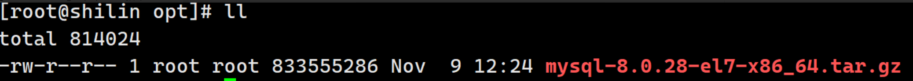
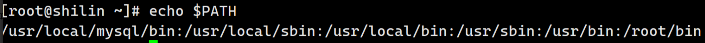
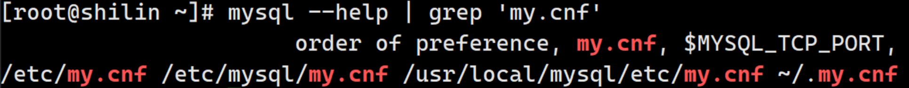
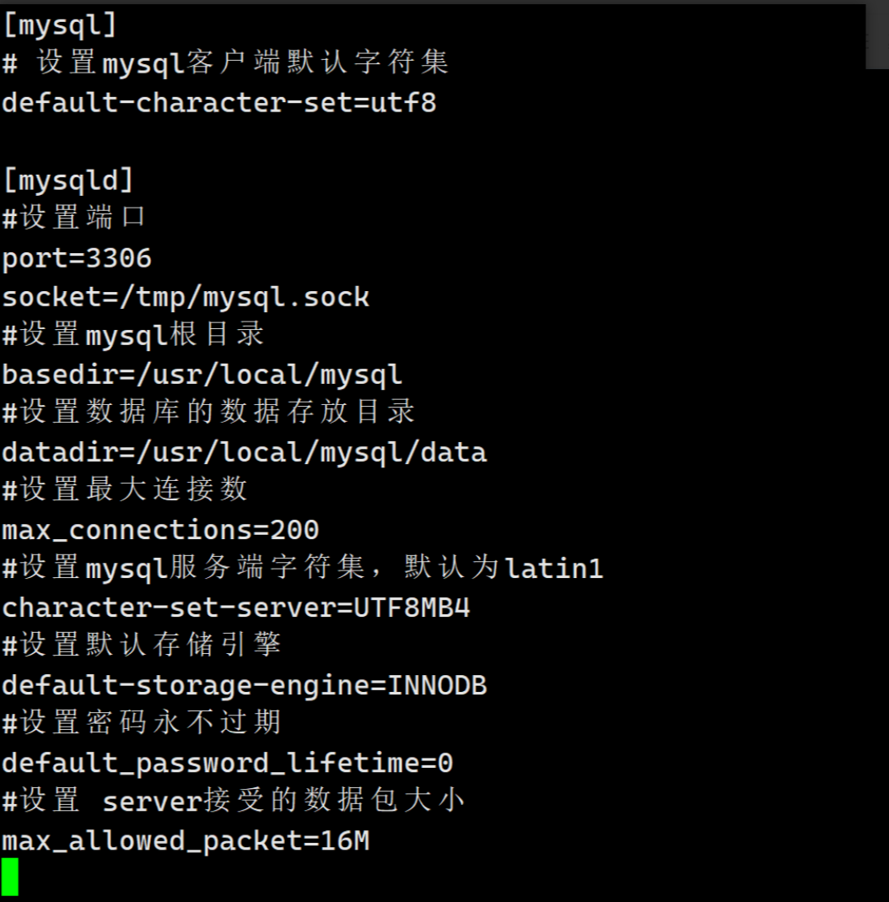
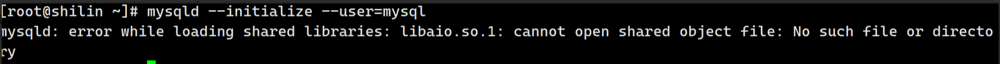
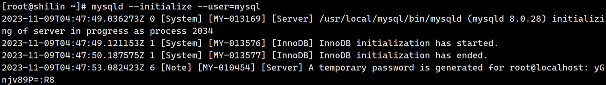

# Linux安装MySQL8.0服务
## 一、卸载
首先第一步就是卸载`mariadb`

### 1.1 查看mariadb
```shell
rpm -qa | grep mariadb
```

### 1.2 卸载
```shell
rpm -e --nodeps mariadb-libs-5.5.60-1.el7_5.x86_64
```

## 二、安装
### 2.1 下载
下载地址：[https://mirrors.aliyun.com/mysql/MySQL-8.0/mysql-8.0.28-el7-x86_64.tar.gz?spm=a2c6h.25603864.0.0.76a070b2JJfVQh](https://mirrors.aliyun.com/mysql/MySQL-8.0/mysql-8.0.28-el7-x86_64.tar.gz?spm=a2c6h.25603864.0.0.76a070b2JJfVQh)

### 2.2 上传
将mysql-5.7.30-el7-x86_64.tar.gz压缩文件上传至/opt目录

```shell
cd /opt
```



### 2.3 解压
将MySQL压缩文件解压至/usr/local目录

```shell
tar -zxvf /opt/mysql-8.0.28-el7-x86_64.tar.gz -C /usr/local
```

### 2.4 重命名
将MySQL根目录重命名为mysql

```shell
cd 
mv /usr/local/mysql-8.0.28-el7-x86_64 /usr/local/mysql
```

**注意**：必须重命名为mysql，否则无法启动

### 2.5 删除
**删除压缩文件**

```shell
rm -f /opt/mysql-8.0.28-el7-x86_64.tar.gz
```

### 2.6 创建目录
/usr/local/mysql根目录下创建data文件夹

```shell
mkdir /usr/local/mysql/data
```

### 2.7 环境变量
编辑/etc/profile文件，内容如下：

```bash
export PATH=/usr/local/mysql/bin:$PATH
```

重载/etc/profile文件

```bash
source /etc/profile
```

查看PATH值

```bash
echo $PATH
```



### 2.8 修改配置
查找mysql配置路径

```bash
mysql --help | grep 'my.cnf'
```



执行

```bash
vi /etc/my.cnf
```

### 2.9 配置文件
点击`i`键，复制并粘贴如下配置：

```bash
[mysql]
# 设置mysql客户端默认字符集
default-character-set=utf8

[mysqld]
#设置端口
port=3306
socket=/tmp/mysql.sock
#设置mysql根目录
basedir=/usr/local/mysql
#设置数据库的数据存放目录
datadir=/usr/local/mysql/data
#设置最大连接数
max_connections=200
#设置mysql服务端字符集，默认为latin1
character-set-server=UTF8MB4
#设置默认存储引擎
default-storage-engine=INNODB
#设置密码永不过期
default_password_lifetime=0
#设置 server接受的数据包大小
max_allowed_packet=16M
```



再按esc`:wq`（英文模式下）

### 2.9 用户与用户组
添加 mysql 组

```bash
groupadd mysql
```

添加 mysql 用户

```bash
useradd -r -g mysql mysql
```

变更用户和用户组

```bash
chown -R mysql:mysql /usr/local/mysql
```

### 2.10 初始化
```bash
mysqld --initialize --user=mysql
```

有的人可以会遇到这种错误



我们安装一下就可以了

```bash
yum install -y libaio
```

再来尝试，可以看到成功了

```bash
mysqld --initialize --user=mysql
```



说明：`yGnjv89P=:R8`为临时密码

### 2.11 其它
安装SSL

```bash
mysql_ssl_rsa_setup --datadir=/usr/local/mysql/data
```

添加权限

```bash
chmod -R a+r /usr/local/mysql/data/server-key.pem
```

**开机启动**

复制启动脚本到资源目录

```bash
cp /usr/local/mysql/support-files/mysql.server /etc/rc.d/init.d/mysqld
```

mysqld文件添加执行权限

```bash
chmod +x /etc/rc.d/init.d/mysqld
```

mysqld服务添加至系统服务

```bash
chkconfig --add mysqld
```

查询mysqld服务

```bash
chkconfig --list mysqld
```

```bash
注：该输出结果只显示 SysV 服务，并不包含
原生 systemd 服务。SysV 配置数据
可能被原生 systemd 配置覆盖。 
      要列出 systemd 服务，请执行 'systemctl list-unit-files'。
      查看在具体 target 启用的服务请执行
      'systemctl list-dependencies [target]'。

mysqld          0:关    1:关    2:开    3:开    4:开    5:开    6:关
```

启动 mysqld服务

```bash
service mysqld start
```

开放端口  
添加端口

```bash
firewall-cmd --zone=public --add-port=3306/tcp --permanent
```


重新加载

```bash
firewall-cmd --reload
```


修改密码  
初次登录MySQL数据库需要重置密码才能继续后面的数据库操作，步骤如下：

```bash
mysql -uroot -p
```


允许远程连接  
MySQL数据库默认不允许远程连接，可通过如下步骤允许远程连接：

```bash
mysql -uroot -p
```

```sql
use mysql;
```

```sql
update user set host = '%' where user = 'root';
```

```sql
flush privileges;
```

```sql
quit
```

## 三、开启远程连接MySQL
```bash
alter user 'root'@'%' identified with mysql_native_password by '123456';
```

