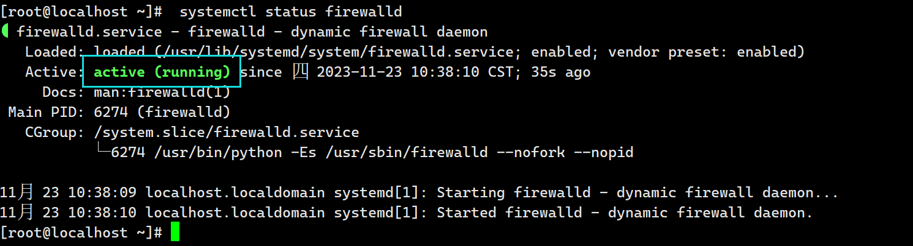
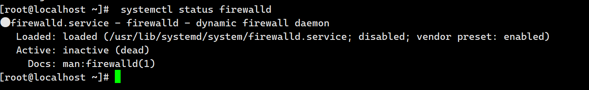
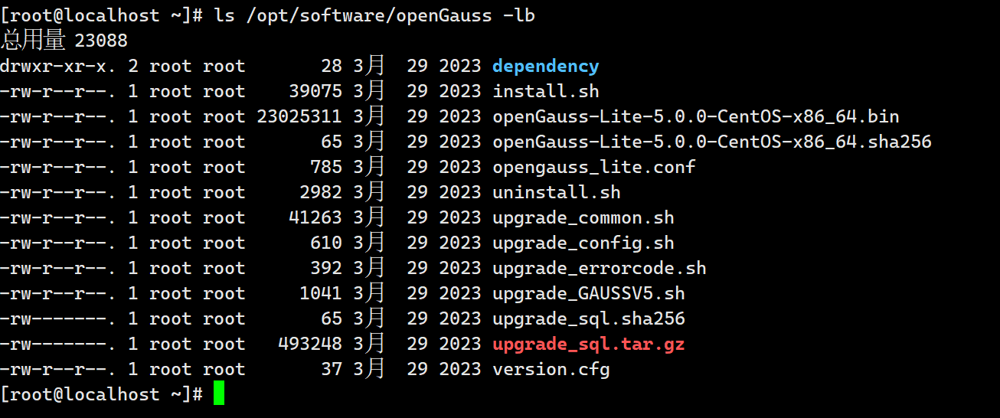
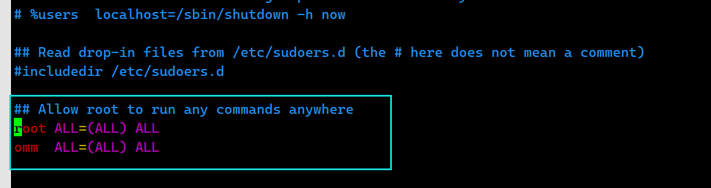
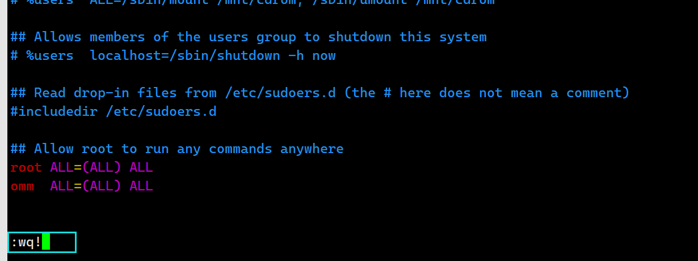
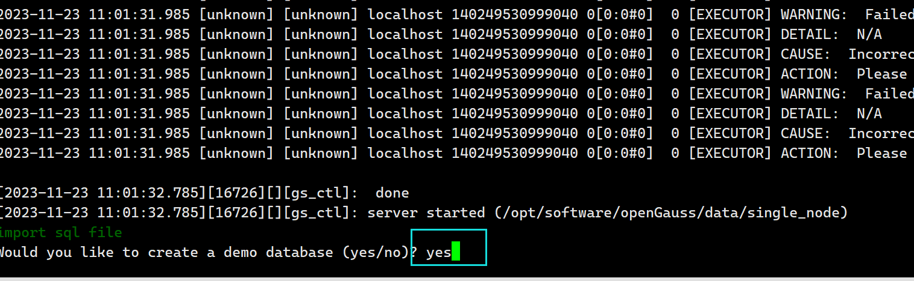
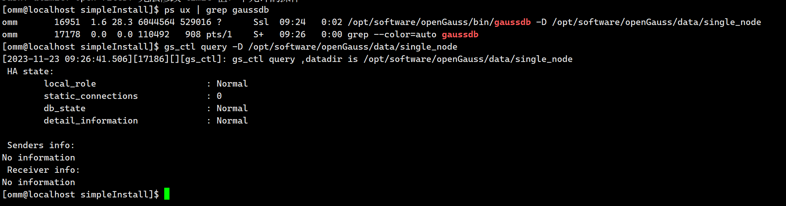

# Linux安装openGauss数据库【极简版】
## 一、安装前准备工作
+ 安装依赖包

```shell
yum install bzip2  wget vim python3 libaio-devel flex bison ncurses-devel glibc-devel patch redhat-lsb-core readline-devel libnsl -y
```

+ 检查防火墙是否关闭

```bash
systemctl status firewalld
```

+ 然后执行

```bash
systemctl stop firewalld.service
```

+ 如果显示这样说明没有成功



+ 没有成功的话就执行下面的命令

```bash
systemctl disable firewalld
```

或者

```bash
chkconfig iptables off
```

+ 再次重启

```bash
reboot
```

+ 然后查看

```bash
systemctl status firewalld
```



## 二、下载安装包
+ 下载安装包

```shell
wget https://opengauss.obs.cn-south-1.myhuaweicloud.com/5.0.0/x86/openGauss-5.0.0-CentOS-64bit.tar.bz2
```

+ 解压到指定目录

```bash
mkdir -p /opt/software/openGauss && tar -jxf openGauss-5.0.0-CentOS-64bit.tar.bz2 -C /opt/software/openGauss
```

+ 检查安装目录及文件是否齐全检查安装目录及文件是否齐全

```bash
ls /opt/software/openGauss -lb
```



## 三、安装
+ 以下命令都用root用户执行
+ 创建安装用户和组

```bash
groupadd dbgrp && adduser omm -p 123456 -g dbgrp
```

+ 将omm设置为sudoer

```bash
vim /etc/sudoers
```

+ 修改 /etc/sudoers 文件，找到下面一行，在 root 下面添加一行，如下所示：

```bash
## Allow root to run any commands anywhere
root ALL=(ALL) ALL
omm  ALL=(ALL) ALL
```

+ **注意：** 这里的最后两行前面不能有`#`，`#`代表注释，注释了就不执行了



这里因为是修改的只读文件，所以要强制保存退出



+ 为omm用户赋予软件目录权限

```bash
chmod -R 777 /opt/software/
```

+ 修改kernel.sem值(用轻量安装里的方法也可以)

```bash
sysctl -w kernel.sem="250 85000 250 330" 
```

+ 使设置生效

```bash
sysctl -p
```

+ 进入解压目录

```bash
cd /opt/software/openGauss/simpleInstall
```

+ 切换用户

```bash
su omm
```

+ 执行install.sh脚本安装openGauss极简版安装包
    - 单节点安装

```bash
sh install.sh  -w "openGauss@123" && source ~/.bashrc
```

+ 这里提示就输入`yes`



## 四、验证
+ 安装执行完成后，使用ps和gs_ctl查看进程是否正常

```bash
ps ux | grep gaussdb 
```

```bash
gs_ctl query -D /opt/software/openGauss/data/single_node
```

+ 连接到postgres数据库【数据库端口默认5432】

```bash
gsql -d postgres
```



