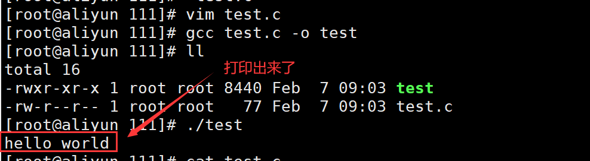
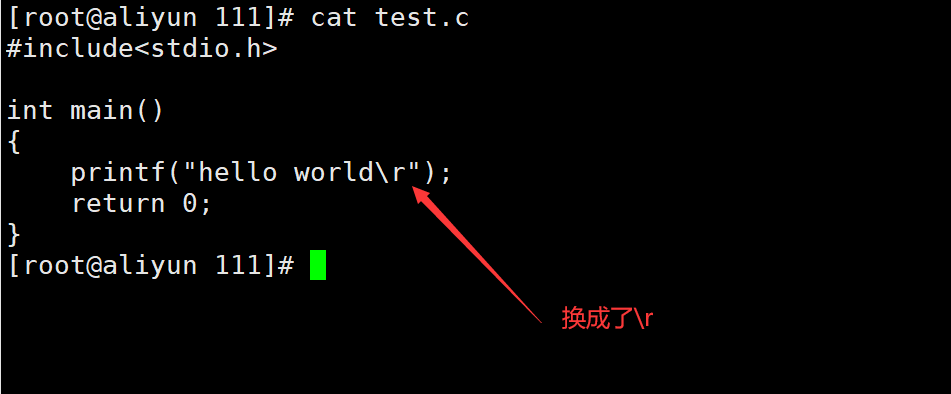
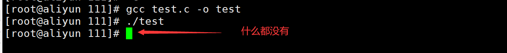
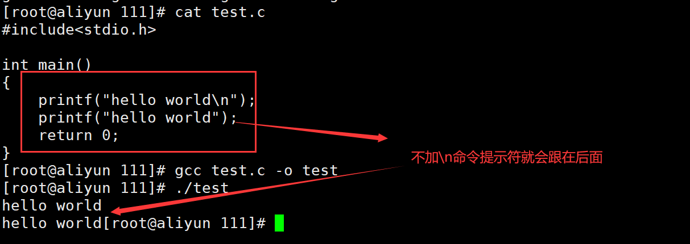
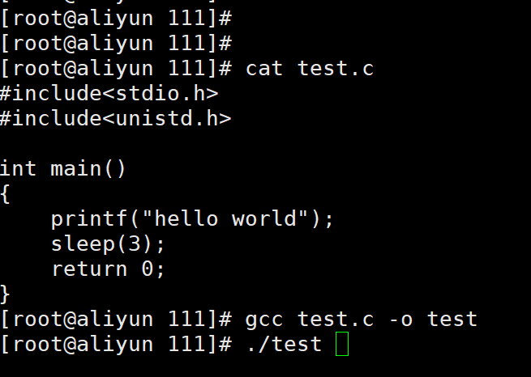
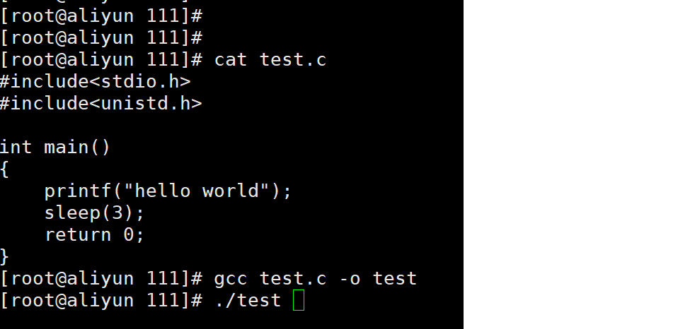
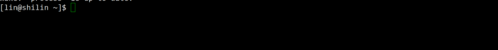
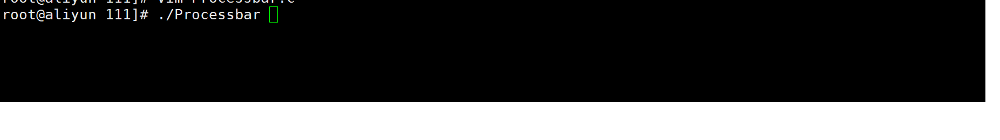

# Linux实现打印彩色进度条
## 预备知识
### 一、理解回车换行 
+ 在我们熟悉的C语言中，换行就可以跳转的下一行开头 ，但其实这一操作有两个步骤，**\r** （回车）和 **\n**（换行）

也就是先**回到开头**，再进行**换行**

> **\r** 回车就是回到这一行开头
**\n** 换行就是另起一行

### 二、认识行缓冲
+ 在内存中预留了一块空间，用来缓冲输入或输出的数据，这个保留的空间被称为**缓冲区**。
+ 下面我们通过几个代码来理解一下：

### 1、回车换行理解
```c
#include<stdio.h>

int main()
{
    printf("hello world\n");
    return 0;
}
```



+ 那我将这个`\n`换成了`\r`，再次打印会出现什么情况？

```c
#include<stdio.h>

int main()
{
    printf("hello world\r");
    return 0;
}
```





+ 发现 **\n** 可以打印出来，而 **\r**，不能打印出来，因为**显示器模式是行刷新缓冲区是按行缓冲的**，没有\n，就不能立即刷新。 **\r 回到行首后，会进行覆盖写**，shell 提示符会覆盖掉之前写的 “hello world”，如果我们在 “hello world” 不加 \r，则不会进行覆盖写，shell提示符会顺着 “hello world” 往后写

如下：



### 2、sleep函数和ffush函数理解
+ 行缓冲是缓冲区刷新策略的一种，在行缓冲模式下，当输入和输出中遇到 ‘\n’ 换行时，就会刷新缓冲区，下面我们认识头文件`<unistd.h>`的三个函数

> sleep：Linux 下的休眠函数，单位是秒
usleep：和sleep 一样，单位ms（即10-6 m) 
fflush ：刷新缓冲区

```c
#include<stdio.h>
#include<unistd.h>

int main()
{
    printf("hello world");
    sleep(3);
    return 0;
}
```



+ 我们写的这个C语言程序是从上到下依次执行的，而我们看到的是先休眠后打印
+ 这是因为数据保存在缓冲区中，没有主动刷新。当程序退出后，保存在缓冲区中的数据被自动刷新出来了，如果我们想提前刷新，便可以调用`fflush`函数来刷新缓冲区

```c
#include <stdio.h>
#include <unistd.h>                                                                                                     
int main()
{
    printf("hello world");
    fflush(stdout);
    printf("\n");
    sleep(3);
    return 0;
}
```



+ 这次 “hello world” 被直接打印出来，我们加`**\n**`避免shell 提示符出现在 “hello world” 后面

## 三、简单倒计时
```c
#include <stdio.h>
#include <unistd.h>

void process(){    
    const char *s = "|/-\\";    
    size_t s_len = strlen(s);    
    
    char bar[LENGTH];    
    memset(bar,'\0',sizeof(bar));    
    int cnt = 0;    
    while(cnt <= 100){    
        printf("[%-100s][%d%%][%c]\r",bar,cnt,s[cnt%s_len]);    
        fflush(stdout);    
        bar[cnt++] = LABLE;    
        usleep(50000);    
    }    
    printf("\n");    
} 

int main()
{
    process();
    return 0;
}
```



## 四、进度条
> 改进版本：
>

### 1、效果展示


### 2、实现过程分析
#### 进度条实现样式
**进度条样式 ：**

+ 进度条的主要内容是两个中括号包裹，中间进度显示以=>的方式进行推进呈现

**进度条百分比：**

+ 显示当前进度百分比，随着进度不断推进，百分比也在增加

**进度条旋转字符：**

+ 显示加载样式，可以利用一个旋转的字符，例如`[]`的样式，顺时针不断旋转，依次为`| / - \`，注意`\`也是转义字符，因此需要两个`\\`

**进度条颜色：**
我们可以根据自己的喜好给进度条上色，在此我们找到颜色参照表 [c语言颜色参考](https://blog.csdn.net/wuquan_1230/article/details/106077560)

#### 进度条实现方法
+ 预留进度条大小为 100 个 **=** ，外加 1 个 **>** ，加上保存 **\0** 的位置，定义一个102个单位的长度的`bar`数组。
+ 如果将打印放在循环中的话，在打印的时候会变得卡卡的，我们可以将打印放到循环外面，等数组放上`=>`后，在一起打印，这样更好
+ 我们又实现了一个函数`download()`，把`ProcBar()`，作为参数传递给`download()`，用**usleep**函数模拟下载时间，然后循环起来**回调processbar()函数**，便实现了进度条
+ 最后考虑到第二次下载，**bar数组满了**，我们再每次调用**download()函数**时，清空**bar数组**，完成实现

这就实现了我们最终的效果



### 3、进度条代码
#### makefile
```shell
BIN=process               # 定义变量    
CC=gcc
SRC=$(wildcard *.c)       # 使用 wildcard 函数，获取当前所有.c文件名    
OBJ=$(SRC:.c=.o)          # 将SRC的所有同名.c 替换成为.o形成目标文件列表    
LFLAGS=-o                 # 链接选项
CFLAGS=-c                 # 编译选项
RM=rm -f                  # 引入命令
STD=-std=c11

$(BIN):$(OBJ)
	@$(CC) $(LFLAGS) $@ $^ $(STD)   # $@:代表目标文件名 $^:代表依赖文件列表
	@echo "链接$^ 成为 $@"
%.o:%.c                             # %.c 展开当前目录下所有的.c  %.o:同时展开同名.o     
	@$(CC) $(CFLAGS) $< $(STD)      # %<:对展开的依赖.c文件,一个一个的交给gcc    
	@echo "编译$< 成为 $@"          # @:不回显命令

.PHONY:clean
clean: 
	@$(RM) $(OBJ) $(BIN) 
	@echo "清理工程完毕"
```

#### ProcessBar.h
```c
#pragma once
#include <string.h>
#include <unistd.h>
#include <stdio.h>

// 进度条箭头
#define TAIL '>'

// 进度条的数组大小
#define Length 102

// 进度条加载的进度条
#define Style '='

// 重定义函数指针
typedef void (*callback_t)(double, double);

// 进度条的实现
void ProcBar(double total, double current);
```

#### ProcessBar.c
```c
#include "ProcessBar.h"

#define LIGHT_CYAN   "\033[1;36m" // 亮青色
#define NONE "\033[m" 	//截断

// 显示进度
const char* lable = "|/-\\";

void ProcBar(double total, double current)
{
    char bar[Length];
    // 初始化进度条
    memset(bar, '\0', sizeof(bar));
    int len = strlen(lable);

    int cnt = 0;
    double rate = (current * 100.0) / total;
    // 循环次数
    int loop_count = (int)rate;
    while (cnt < loop_count)
    {
        bar[cnt++] = Style;
        if (rate < 100)
            bar[loop_count] = TAIL;
    }
    // 打印显示
    printf(LIGHT_CYAN"[%-100s]"NONE"[%.2lf%%][%c]\r", bar, rate, lable[cnt % len]);
    // 刷新缓冲区
    fflush(stdout);
}
```

#### main.c
```c
#include "ProcessBar.h"

// 网络带宽【1mb】
double bandwidth = 1024 * 1024 * 1.0;

void download(double filesize, callback_t cb)
{
    //  累计下载的数据量
    double current = 0.0;
    printf("download begin, current: %lf\n", current);
    while (current <= filesize)
    {
        // 使用函数指针更新界面
        cb(filesize, current);
        //从网络中获取数据
    //......
    
    // 睡眠
        usleep(100000);

        // 累计下载
        current += bandwidth;
    }
    printf("\ndownload done, filesize: %lf\n", filesize);
}

int main()
{
    // 测试调用
    //download(100 * 1024 * 1024, ProcBar);
    download(2 * 1024 * 1024, ProcBar);
    //download(200*1024*1024,ProcBar);
    //download(400*1024*1024,ProcBar);
    download(50*1024*1024,ProcBar);
    download(10*1024*1024,ProcBar);

    // 测试
    //ProcBar(100.0, 56.9);
    //ProcBar(100.0, 1.0);
    //ProcBar(100.0, 99.9);
    //ProcBar(100.0, 100);
    return 0;
}
```

