# Linux常用命名详解
## 一、安装Linux
### 1.1 方法一：云服务器方式
+ 使用云服务器购买

### 1.2 方法二：虚拟机方式
+ 打开VMware Workstation官网下载VMware Workstation 17 Pro

接下来这里就要打开清华大学开源软件镜像站

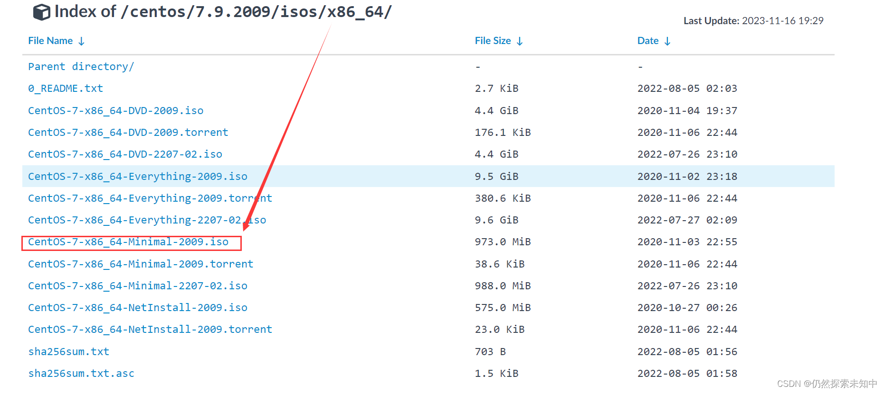

## 二、ls
**语法：**  ls [选项][目录或文件] 
**功能：** 对于目录，该命令列出该目录下的所有子目录与文件。对于文件，将列出文件名以及其他信息。 
**常用选项：**

> -a 列出目录下的所有文件，包括以 . 开头的隐含文件。 
-d **将目录象文件一样显示，而不是显示其下的文件。 如：ls –d 指定目录** 
-i 输出文件的 i 节点的索引信息。 如 ls –ai 指定文件 
-k 以 k 字节的形式表示文件的大小。ls –alk 指定文件 
-l 列出文件的详细信息。 
-n 用数字的 UID,GID 代替名称。 （介绍 UID， GID） 
-F 在每个文件名后附上一个字符以说明该文件的类型，“*”表示可执行的普通文件；“/”表示目录；“@”表 
示符号链接；“|”表示FIFOs；“=”表示套接字(sockets)。（目录类型识别） 
-r 对目录反向排序。  
-t 以时间排序。  
-s 在l文件名后输出该文件的大小。（大小排序，如何找到目录下最大的文件）  
-R 列出所有子目录下的文件。(递归)  
-1 一行只输出一个文件。

```bash
ls
```

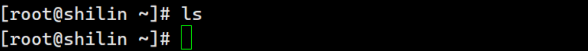

+ 我们运行后发现这里什么都没有显示，那是因为这个目录就没有文件或者文件夹，我们先来创建几个~~
+ **注意命令之间是有空格的！！！**

```bash
mkdir test
touch test.txt
```

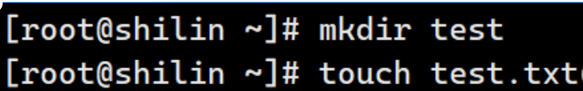

+ 再进行`ls`一下，可以看到已经有文件显示出来了


接下来我们就新学一个命令`ll`

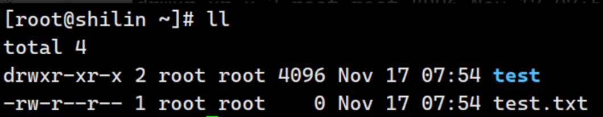

+ 这里命令初学的时候比较特殊，与其不能说是一个命令，它是一个`ls -l`的别名，也就是说给`ls -l`起了个名字叫`ll`，那么口说无凭，怎么证明呢？

## 三、which
```bash
which ll
```

+ 这里的这个which命令先不用管，一会我们再详细了解~~
+ 这里的`alias`就是起别名的意思，**ll='ls -l` 也就是ll等于ls -l**~~

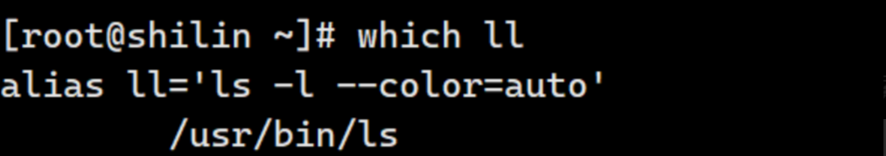

+ 我们再来which一下ls，可以看到也是一样的~~

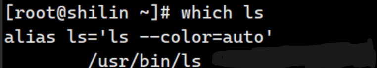

+ 回到刚刚那个话题，为什么会有颜色呢？
+ 注意看，我们这里**ll=ls -l --color=auto** 后面的`--color=auto`就是带颜色的，那么又怎么证明呢？

```bash
alias ls='ls'
```

+ 我们这里像图片中的一样，给它起个别名，但是没有指定颜色，我一执行，它虽然也会打印出来，但是没有颜色

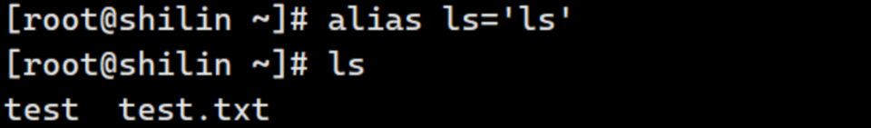

+ 那我又想加回这个颜色怎么办呢？
    - 很好办，直接再起别名改回去就可以了

```bash
alias ls='ls --color=auto'
```

+ 再次进行ls查看，就会有颜色了~~

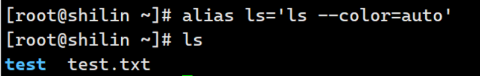

+ 这里的`ls`还可以查看指定目录的文件夹，或者文件，我们来演示一下
+ 我们这里创建了一个文件`a`，我们就可以使用下面这个命令来查看

### 3.1 ls -ld
```bash
ls -ld a
```

+ 其中`-l`列出文件的详细信息，`-d` **将目录象文件一样显示，而不是显示其下的文件**。 
+ 我们这里就可以直接写`ls -ld`就可以了
+ 这里的`mkdir -p` 我们后面会详细来说

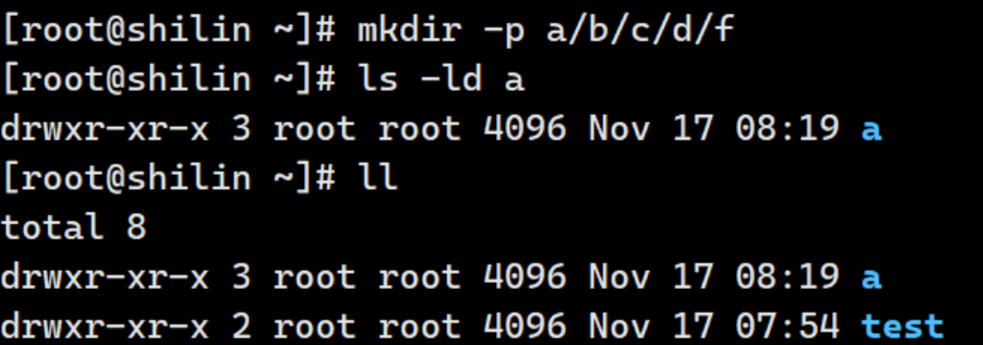

## 四、pwd
**语法:** pwd  
**功能:** 显示用户当前所在的目录

这个命令很简单，直接执行就可以了

```bash
pwd
```

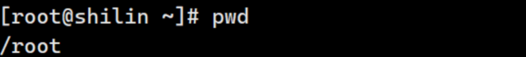

+ 那么这里的显示出来的是什么呢?
    - 其实就是当前用户所在的绝对路径，那我进入到一个目录，再来看一下

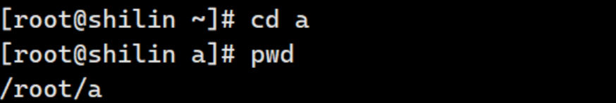

+ 可以看到发生改变了，这个命令就到这里，接下来我们学`cd`

## 五、cd
Linux系统中，磁盘上的文件和目录被组成一棵目录树，每个节点都是目录或文件。

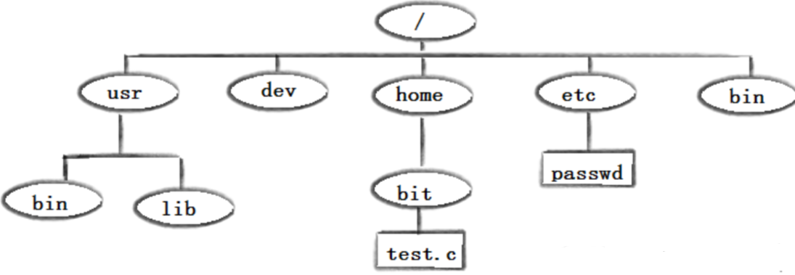

+ 如上图所示，我们这个linux系统就是一个树状文件系统，刚刚上面我们也使用了这个命令，`cd 文件夹`，就进入到了这个文件

**语法:** cd 目录名  
**功能:** 改变工作目录。将当前工作目录改变到指定的目录下。

> cd .. : 返回上级目录  
cd /home/litao/linux/ : 绝对路径  
cd ../day02/ : 相对路径  
cd ~：进入用户家目  
cd -：返回最近访问目录
>

### 5.1 cd ..
```bash
cd ..
```

我们先来了解一下，每个文件夹都是有隐藏文件的，那么怎么看呢，我们可以通过`ls -al`

### 5.2 ls -al
```bash
ls -al
```

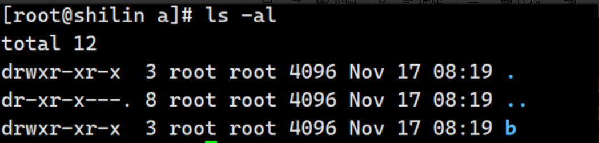

+ 当我们执行这个命令后，就会发现，这里的前面带`.`的文件也显示出来了
+ 那么是不是前面带`.`的就是隐藏文件呢？

我们来验证一下

+ 我们这里创建一个文件和一个文件夹，但是前面分别带有`.`
+ 我们再进行`ls -l`一下，可以看到是打印不出来的，但是`ls -al`可以打印出来的，再一次印证了这个命令是显示隐藏文件的

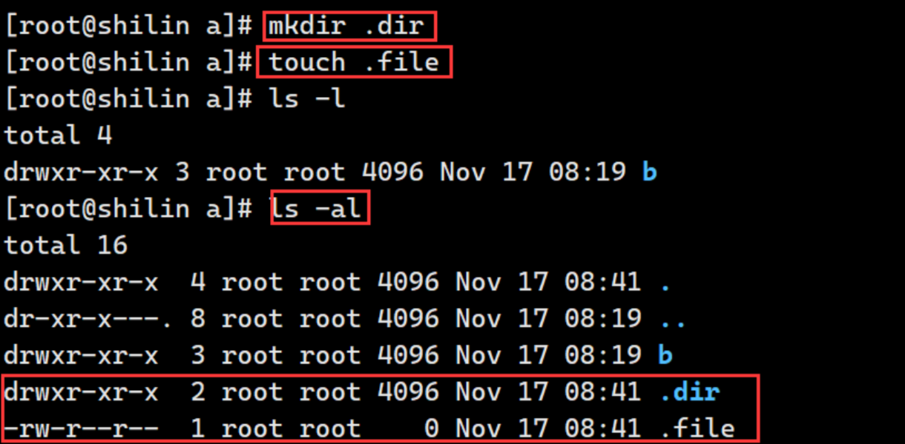

我们再来看第二个命令

```bash
cd /root/a/b/
```

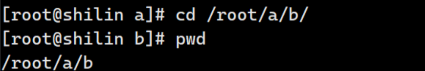

+ 这里`cd`后面跟着的是一个**绝对路径**，什么是绝对路径呢？
    - 也就是从根目录上写路径
+ 还有一个概念：**相对路径**，就是从相对位置写，那么怎么写呢？

```bash
cd c
```

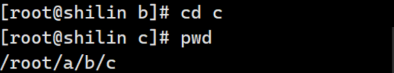

+ 这里直接进入了c目录，这些目录我们前面都创建过了，使用`mkdir -p a/b/c/d/f`，我们这里不再演示
+ 这里不写`/`，就是默认从当前目录下找这个文件夹~~

### 5.3 重新认识命令
+ 接下来我们再返回头再从新认识一下这些命令，我们前面学了which命令，可以查看起别名，但是它下面有这么一行，这个是什么呢？

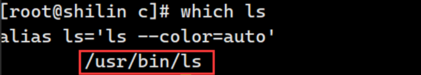

+ 其实这个就是一个路径，绝对路径，我们可以进入再bin目录下有这个命令我们来看一下

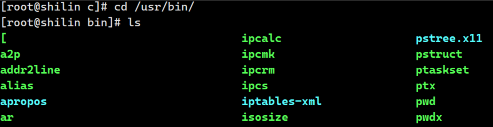

来找一下这个ls命令

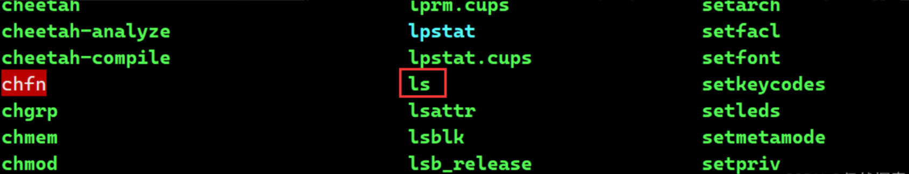

可以看到这里是有的，其他命令也是有的，那它好像是一个文件啊，它其实就是一个可执行文件，我们可以直接输入这个路径进行执行

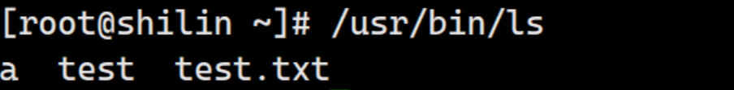

+ 这里可以看到我们执行后也会显示出来，但是没有颜色

这里其实是给起了个别名

```bash
/usr/bin/ls --color=auto
```

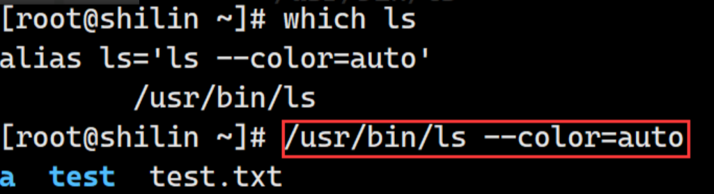

我们回过头来看这个相对路径

+ 刚刚我们执行了`ls -al`命令，刚刚执行的是在一个空文件夹里，那为什么会有两个文件一个`.`一个`..`呢？

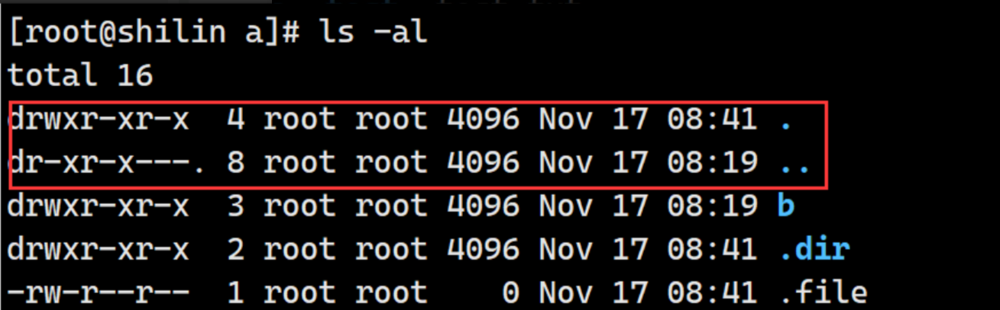

**其实这个**`**.**`**就是代表当前路径，**`**..**`**代表上一个路径**

### 5.4 . 和 ..
+ 这里的`.`代表当前路径，我们来看下面进行演示一下

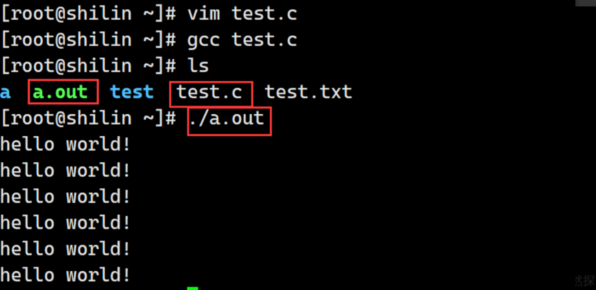

+ 这里可以看到我们通过这个`./`来执行这个可执行文件就是从当前路径来找到这个文件来执行

```bash
cd ../a.out
```

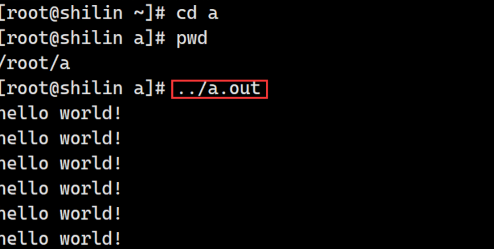

+ 这个意思就是从上一级目录下找到这个`a.out`文件进行执行
+ 那么`cd ..`是不是就可以回到上一级目录里了，我们来验证一下

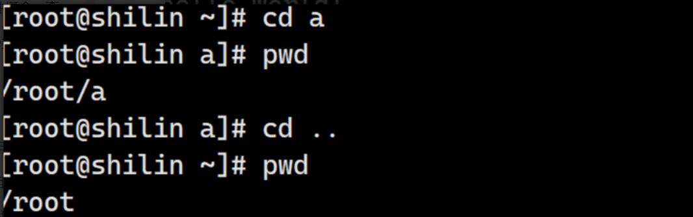

+ 我们可以看到已经回退了
+ 我们继续回退，一直退到不能退位置

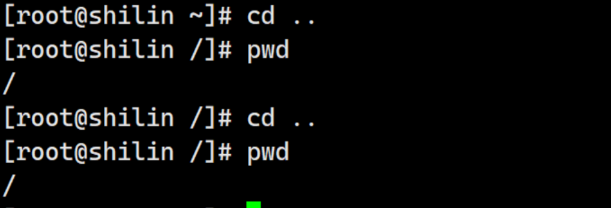

+ 可以看到我们退到`/`位置就不能回退了，由此证明`/`是系统的根目录~~

我们这里还要有一个概念就是用户的概念

+ 我这里目前是使用的root用户，**root**用户是什么呢？>>>是超级管理员的意思~~也就是`最高`权限的意思
+ 既然有用户就有普通用户，普通用户就是在`/home`目录下
+ 这里我们切换到普通用户来看看
+ 这里了解一下用户的概念，后面我们会详细讲


那么这个`cd ~`是进入**用户**的家目录

### 5.5 whoami
+ 这里再教大家一个查询当前是登录的哪个用户

```bash
whoami
```

+ 在**普通**用户下执行：


+ 在**root**用户下执行：

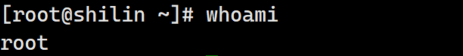

+ 当我有一次进入到了一个很深的文件夹，我想一下回退到自己的家目录，怎么办呢，可以执行这个操作

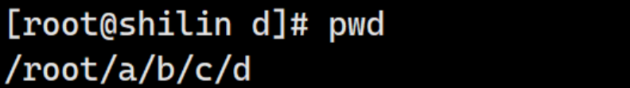

+ 我们进入了四次问价夹，我们就需要执行四次`../`

```bash
cd ../../../../
```

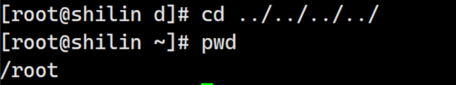

+ 那么有没有办法直接一次性回退到家目录呢？
+ 那就是执行下面这个命令

```bash
cd ~
```

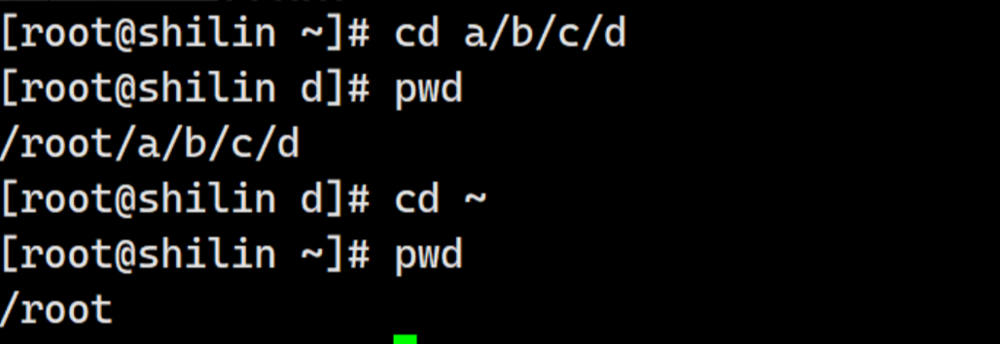

接下来还有一个

```bash
cd -
```

+ 这个是什么呢？
+ 如果我想在两个目录来回切换就需要手动敲目录，有一个好的办法来解决这个麻烦，这个其实就是直接回退到刚刚那个目录，**一键回退**

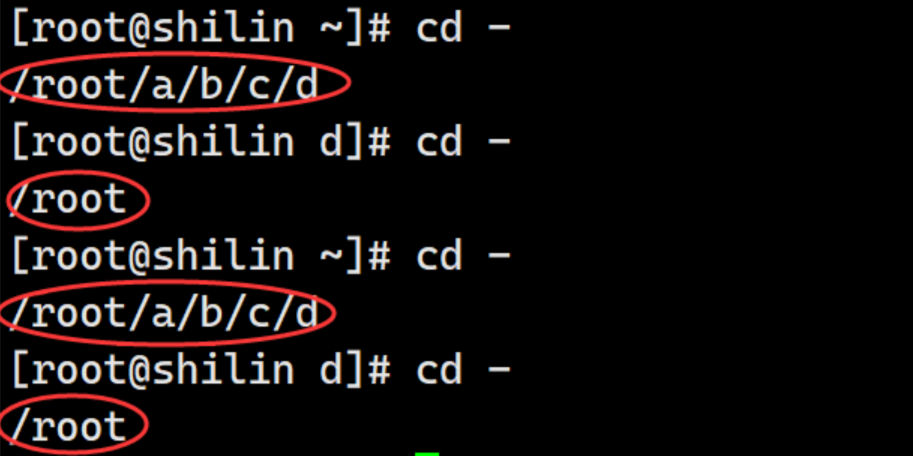

## 六、touch
**语法：** touch [选项]... 文件...  
**功能：** touch命令参数可更改文档或目录的日期时间，包括存取时间和更改时间，或者新建一个不存在的文件。  
**常用选项：**

> -a 或--time=atime或--time=access或--time=use只更改存取时间。  
-c 或--no-create 不建立任何文档。  
-d 使用指定的日期时间，而非现在的时间。  
-f 此参数将忽略不予处理，仅负责解决BSD版本touch指令的兼容性问题。  
-m 或--time=mtime或--time=modify 只更改变动时间。  
-r 把指定文档或目录的日期时间，统统设成和参考文档或目录的日期时间相同。  
-t 使用指定的日期时间，而非现在的时间。
>

+ touch 简单来说就是创建文件，单不能创建目录，创建目录有创建目录的命令

```bash
touch 文件名
```

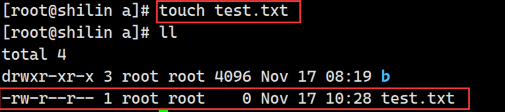

+ 这里没有什么可说的就是简单的创建文件，但是我在这里补充一个命令，我想查看这个文件的详细属性，怎么查看呢？

### 6.1 stat
```bash
stat 文件名
```

+ 查看文件具体属性

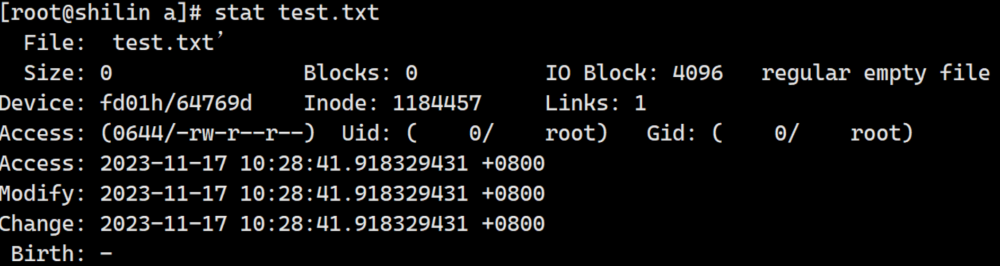

## 七、mkdir指令【重要】
**语法：** mkdir [选项] dirname...  
**功能：** 在当前目录下创建一个名为 “dirname”的目录  
**常用选项：**

> -p, --parents 可以是一个路径名称。此时若路径中的某些目录尚不存在,加上此选项后,系统将自动建立好那些尚不存在的目录,即一次可以建立多个目录;
>

```bash
mkdir 目录
```

+ 这里前面的d是代表目录的意思

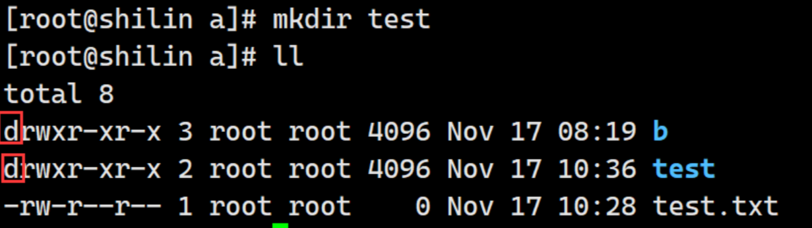

+ 这里我们基本要用的就是 `-p` 指令，就是递归建立多个目录
+ 命令直接要有空格

```bash
mkdir -p aaa/bbb/ccc/ddd/eee
```

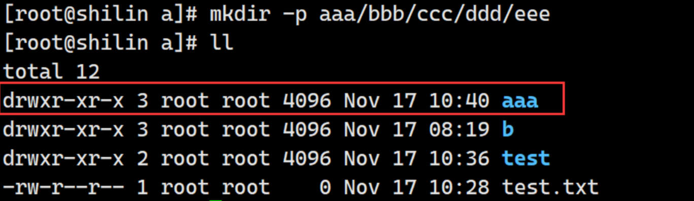

+ 这样看不好观察创建成功了没有，我们可以使用一个命令tree

### 7.1 tree
```bash
tree 目录
```

+ 有的人可能使用这个tree使用不了，它是需要安装的，执行以下命令：

```bash
yum install -y tree
```

+ 然后再执行

```bash
tree ./
```

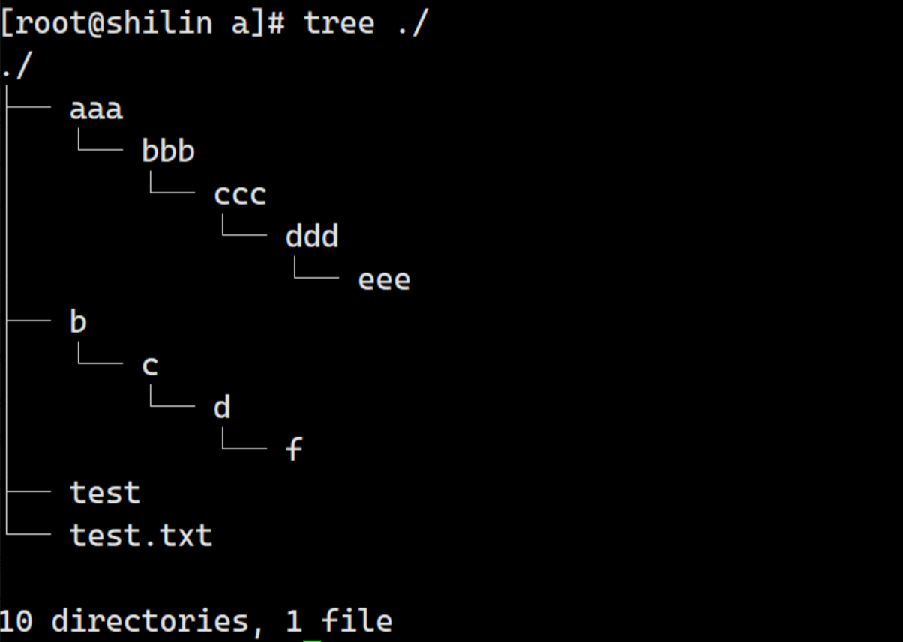

+ 那我要是执行一下`tree /`，会执行这么一长串，“根本停不下来”

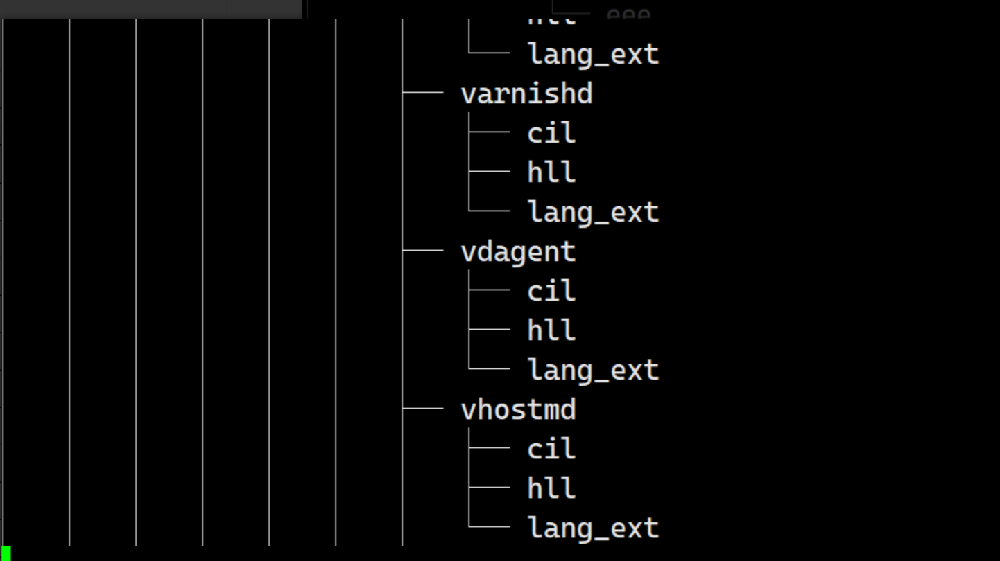

+ 这个时候我们就要按下`ctrl + c`就可以强制停止执行了

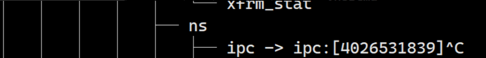

## 八、rmdir指令 && rm 指令（重要）
**rmdir是一个与mkdir相对应的命令。mkdir是建立目录，而rmdir是删除命令。**  
**语法：** rmdir [-p][dirName]  
**适用对象：** 具有当前目录操作权限的所有使用者  
**功能：** 删除空目录  
**常用选项：**

> + -p 当子目录被删除后如果父目录也变成空目录的话，就连带父目录一起删除。
>

**rm命令可以同时删除文件或目录**  
**语法：** rm [-f-i-r-v][dirName/dir]  
**适用对象：** 所有使用者  
**功能：** 删除文件或目录

**常用选项：**

> -f 即使文件属性为只读(即写保护)，亦直接删除  
-i 删除前逐一询问确认  
-r 删除目录及其下所有文件
>

+ 有了新增文件和文件夹，那么就有删除~~
+ 这里也是要区分删除文件【rm】和文件夹【rmdir】

### 8.1 rm
```bash
rm 文件名
```

+ 这里删除文件的时候会提示是否要删除？这里输入`n`不要删除，输入`y`就删除了，这里的删除就是真正的删除了，没有什么windows的回收站什么的

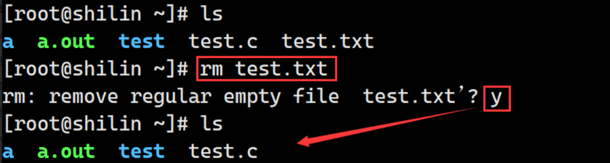

### 8.2 rm -f
+ 那这样删除文件的话每次都要问是否要删除，是不是很麻烦，我们可以加一个选项`-f`，就不会提示，直接删除

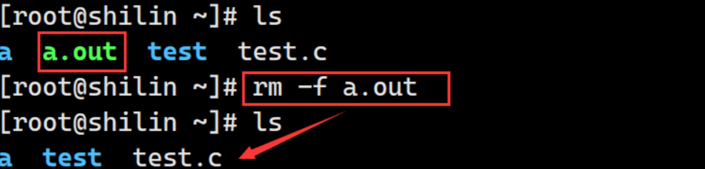

+ 但是这个命令是删除不了文件夹的

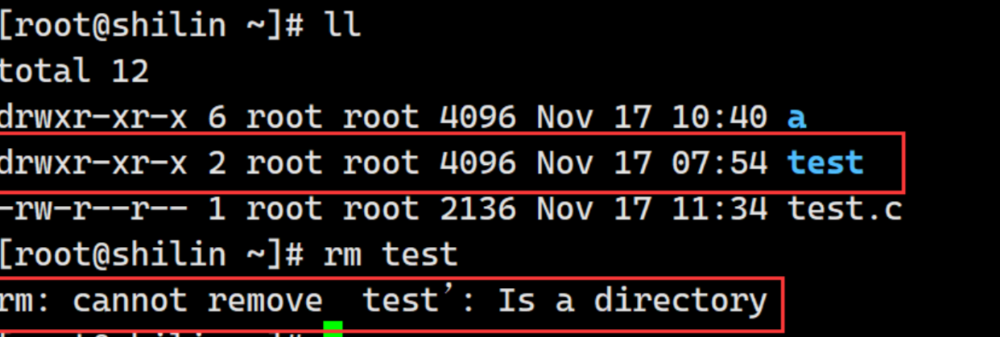

+ 那么我们就要学下一个命令了

### 8.3 rmdir
```bash
rmdir 文件夹
```

+ 这里删除单个文件夹，文件夹里面是空，什么都没有那么它是可以删除的

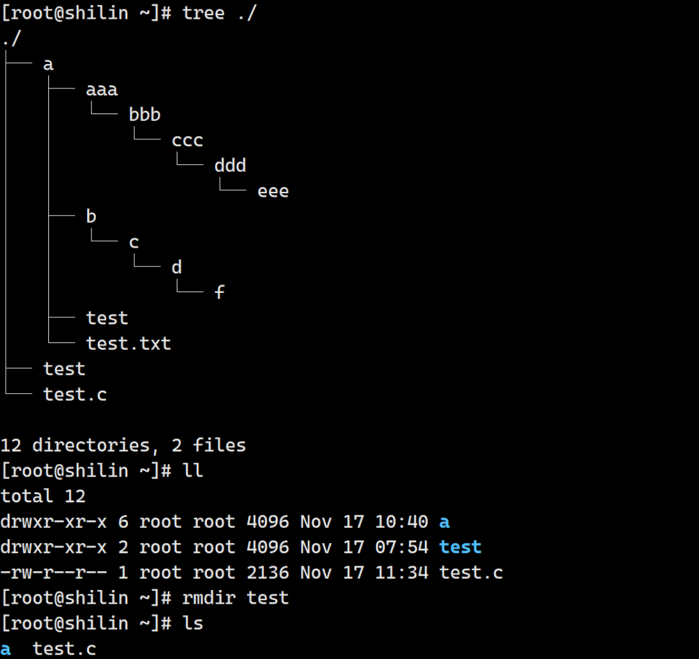

+ 那么这个文件夹不为空，可以直接删除吗？

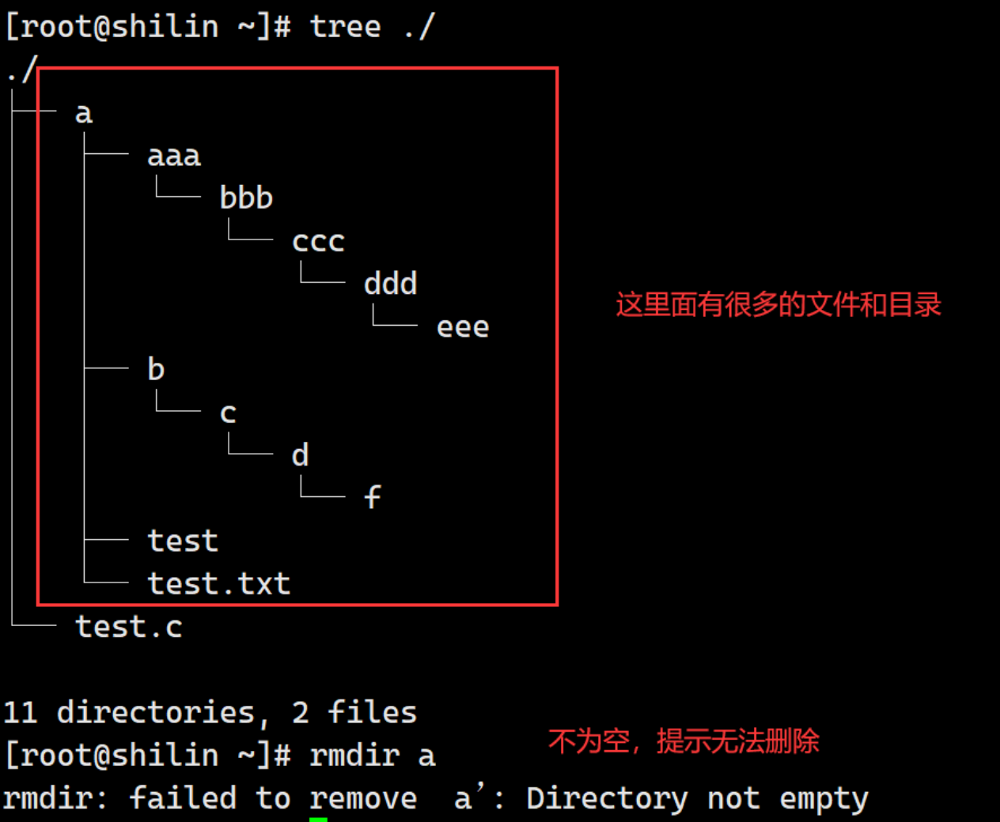

+ 那么怎么办呢？总不能进入文件夹一个一个删除吧，这个时候就要用到`-r`选项了
+ 这个-r就是递归删除

```bash
rm -r 名字
```

+ 但是这里删除的时候有提示是否删除，刚刚学了`-f`选项，可以直接再加上`-f`选项，直接删除

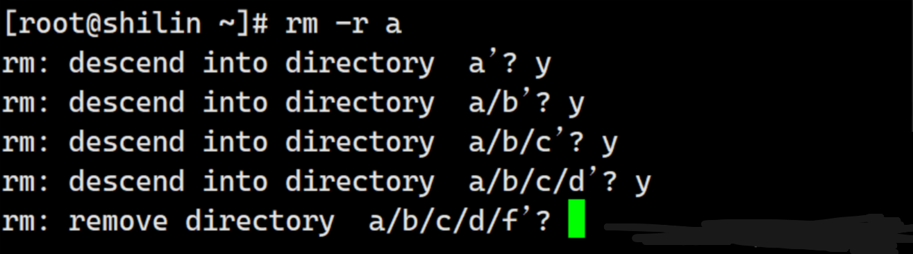

### 8.4 rm -rf
```bash
rm -r -f 名字
```

+ 可以看到这里就直接删除了~~
+ 这里的`rm -r -f`也可以写成`rm -rf`它们是等价的

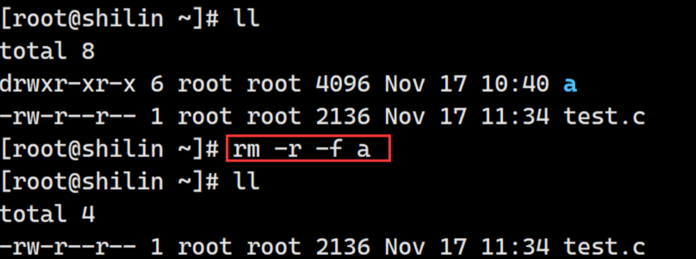

+ **但是这里要注意的一点就是，千万不要执行**`rm -rf /`**，这会删除根目录下所有文件，系统会崩溃，所以删除命令操作谨慎！！！！！！**

## 九、man指令【重要】
Linux的命令有很多参数，我们不可能全记住，我们可以通过查看联机手册获取帮助。访问Linux手册页的命令是man   
**语法：** man [选项] 命令

> + -k 根据关键字搜索联机帮助  
num 只在第num章节找
> + -a 将所有章节的都显示出来，比如 man printf 它缺省从第一章开始搜索，知道就停止，用a选项，当按下q退出，他会继续往后面搜索，直到所有章节都搜索完毕。
>

解释一下,面手册分为8章  
1 是普通的命令  
2 是系统调用,如open,write之类的(通过这个，至少可以很方便的查到调用这个函数，需要加什么头文件)  
3 是库函数,如printf,fread4是特殊文件,也就是/dev下的各种设备文件  
5 是指文件的格式,比如passwd, 就会说明这个文件中各个字段的含义  
6 是给游戏留的,由各个游戏自己定义  
7 是附件还有一些变量,比如向environ这种全局变量在这里就有说明  
8 是系统管理用的命令,这些命令只能由root使用,如ifconfig

+ 我们可以执行下面的命令

```bash
man man
```

+ 进入到这个界面后，按键盘上的上下键就可以上下滚动了

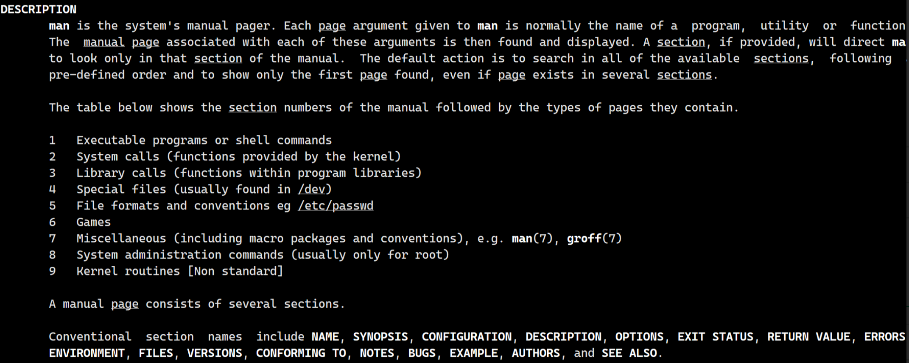

+ 退出的话在英文模式下按键盘上的`q`
+ 这个命令就是想查看哪个命令，就查看哪个命令，会显示出帮助文档
+ 如果说我想查看ls的帮助文档，就执行以下命令：

```bash
man ls
```

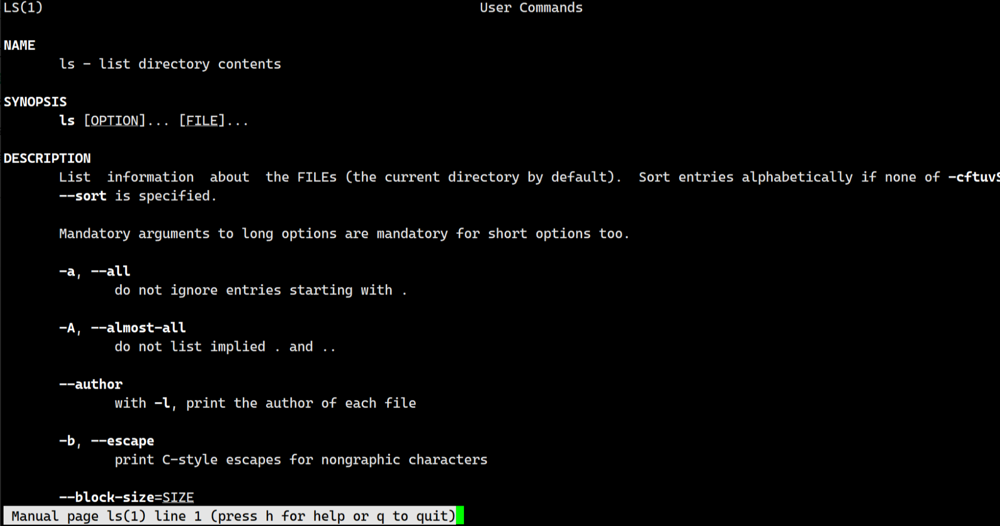

+ 那我想查看C语言中的函数呢？怎么查看呢？

```bash
man printf
```

+ 如果执行就报错了
+ 我们执行以下命令

```bash
yum install -y man-pages
```

+ 再次执行`man printf`
+ 就可以查看这个函数的用法了

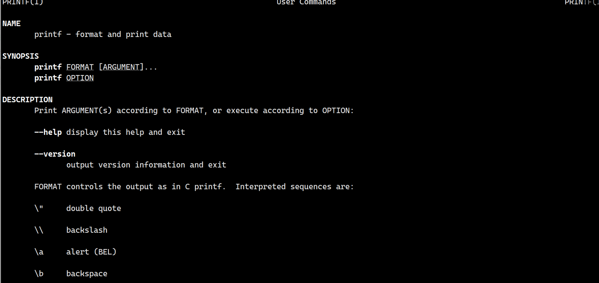

+ 那我想查看这个库函数怎么查看呢？
+ 我们执行下面命令

```bash
man 3 printf
```

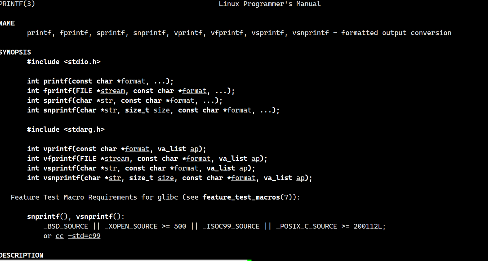

## 十、cp指令【重要】
**语法：** cp [选项] 源文件或目录 目标文件或目录  
**功能：** 复制文件或目录  
**说明：**cp指令用于复制文件或目录，如同时指定两个以上的文件或目录，且最后的目的地是一个已经存在的目录，则它会把前面指定的所有文件或目录复制到此目录中。若同时指定多个文件或目录，而最后的目的地并非一个已存在的目录，则会出现错误信息  
**常用选项：**

> + -f 或 --force 强行复制文件或目录， 不论目的文件或目录是否已经存在
> + -i 或 --interactive 覆盖文件之前先询问用户
> + -r递归处理，将指定目录下的文件与子目录一并处理。若源文件或目录的形态，不属于目录或符号链接，则一律视为普通文件处理
> + -R 或 --recursive递归处理，将指定目录下的文件及子目录一并处理
>

+ 我们可以将一个文件或者目录拷贝到另一个地方，但是**相同目录下不能有相同名称的文件**

```bash
cp src dst
```

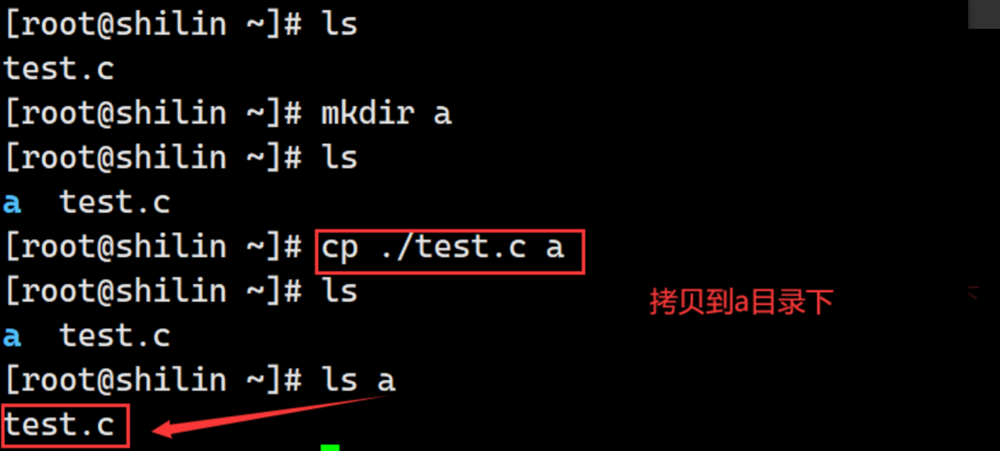

+ 那我想要将一个目录下的有多个文件也拷贝过去怎么拷贝呢？
+ 直接拷贝可以吗？

```bash
cp aaa a
```

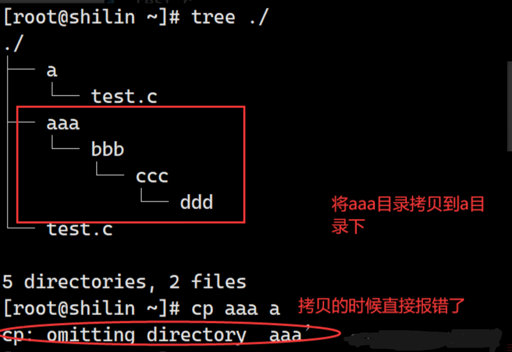

### cp -r
+ 这个时候就需要加上`-r`选项【递归处理，将指定目录下的文件与子目录一并处理。若源文件或目录的形态，不属于目录或符号链接，则一律视为普通文件处理】

```bash
cp -r aaa a
```

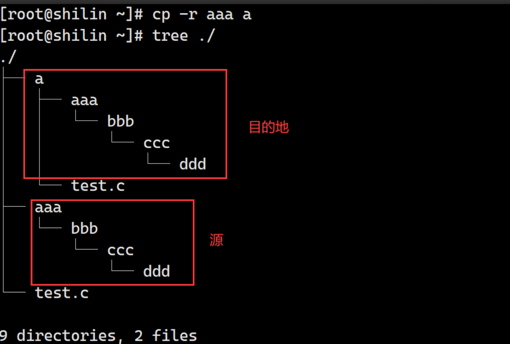

## 十一、mv指令【重要】
mv命令是move的缩写，可以用来移动文件或者将文件改名（move (rename) files），是Linux系统下常用的命令，经常用来备份文件或者目录。  
**语法：** mv [选项] 源文件或目录 目标文件或目录  
**功能：**

1. 视mv命令中第二个参数类型的不同（是目标文件还是目标目录），mv命令将文件重命名或将	其移至一个新的目录中。
2. 当第二个参数类型是文件时，mv命令完成文件重命名，此时，源文件只能有一个（也可以是源目录名），它将所给的源文件或目录重命名为给定的目标文件名。
3. 当第二个参数是已存在的目录名称时，源文件或目录参数可以有多个，mv命令将各参数指定的源文件均移至  
目标目录中。

**常用选项：**

> + -f ：force 强制的意思，如果目标文件已经存在，不会询问而直接覆盖
> + -i ：若目标文件 (destination) 已经存在时，就会询问是否覆盖！
>

+ 这个和前面那个拷贝相似

```bash
mv src dst
```

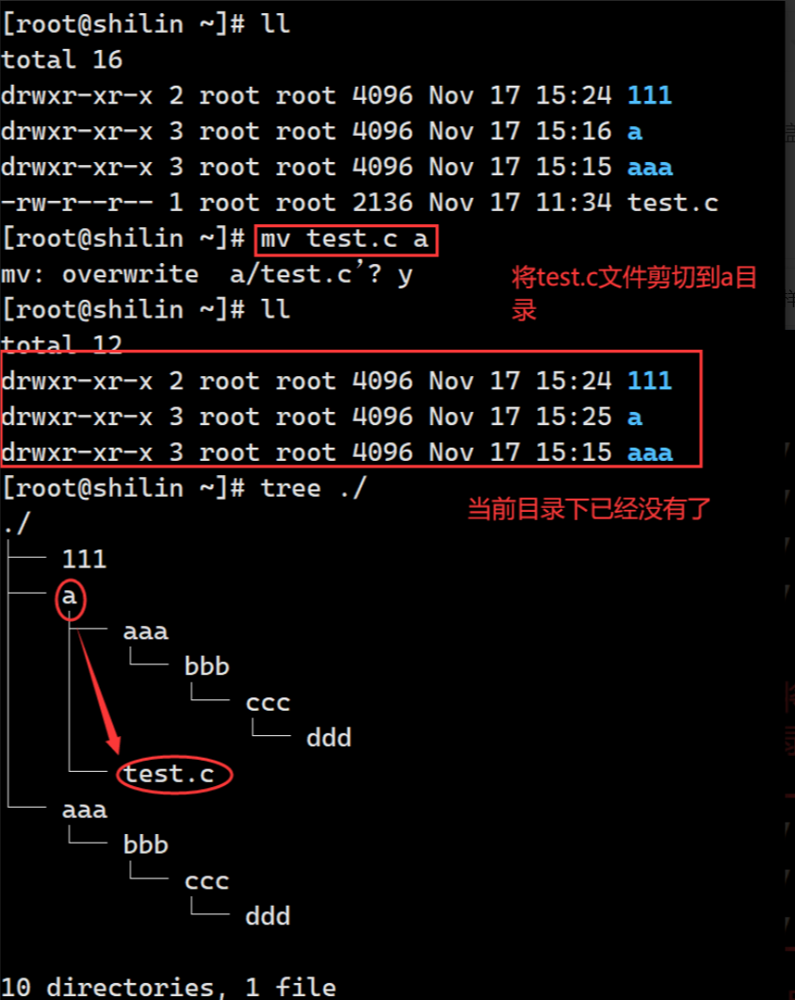

### mv -f
+ 将刚刚拷贝的文件再拷贝回来，这里我们可以使用那个`-f`选项强制拷贝

```bash
mv -f a/test.c ./
```

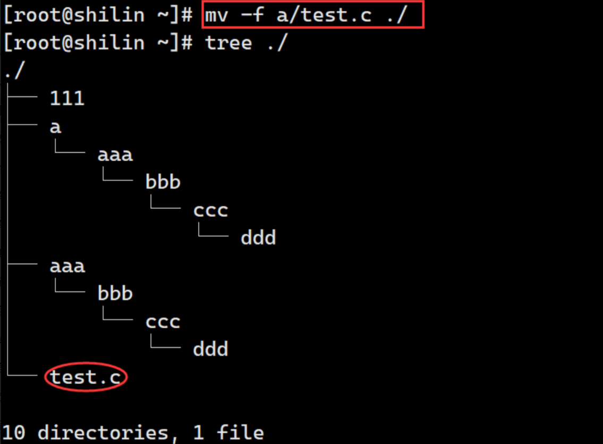

## 十二、cat
**语法：** cat [选项][文件]  
**功能：**  查看目标文件的内容  
**常用选项：**

> + -b 对非空输出行编号
> + -n 对输出的所有行编号
> + -s 不输出多行空行
>

+ cat这个命令很简单，我们来看

```bash
cat 文件名
```

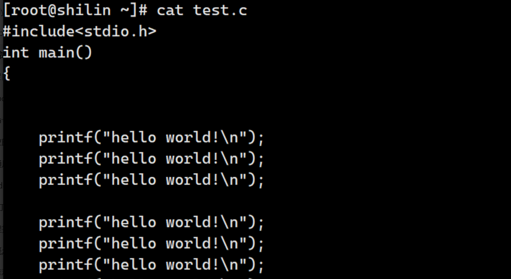

### cat -n
+ 输出带行号，空行也带行号，照样输出

```bash
cat -n test.c
```

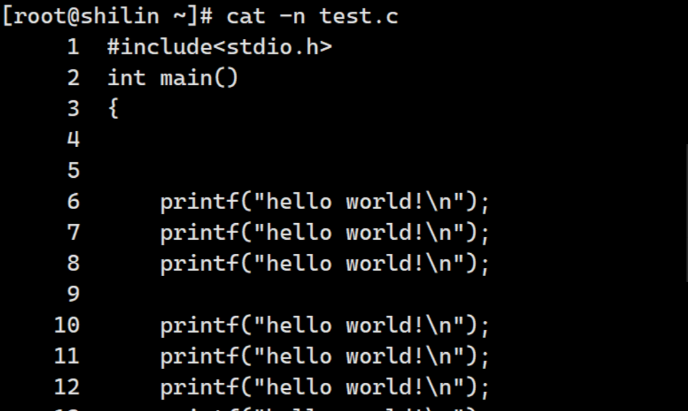

### cat -b
+ 针对空行不进行编号，非空行进行编号

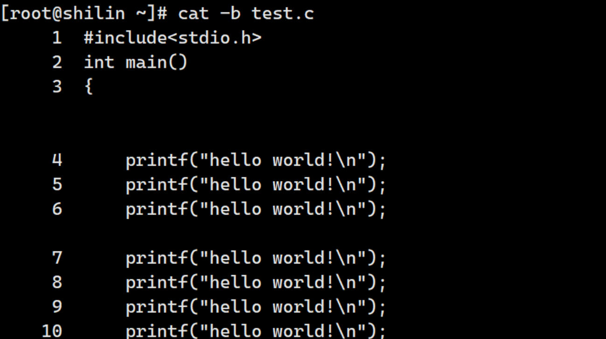

### tac
```bash
tac 文件名
```

+ 猫倒过来了，所以就倒着输出

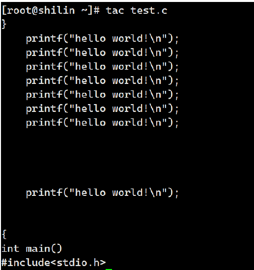

## 十三、关于rzsz
> 这个工具用于 windows 机器和远端的 Linux 机器通过 XShell 传输文件  
安装完毕之后可以通过拖拽的方式将文件上传过去
>

+ 首先看一下我们的机器可以使用网络吗？
+ 可以通过`ping`指令验证【**如果使用的云服务器的话无视这步**】

```bash
ping -c 5 www.baidu.com
```

+ 出现了有ip地址和毫秒数就可以了

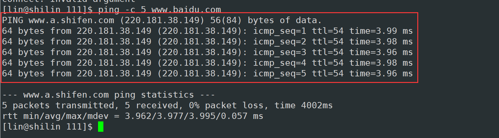

+ 通过 `yum list` 命令可以罗列出当前一共有哪些软件包. 由于包的数目可能非常之多, 这里我们需要使用 `grep` 命令只筛选出我们关注的包，我们要使用rzsz命令，我们就搜索一下

```bash
yum list | grep rzsz
```

+ 可以看到搜索出来了，然后安装

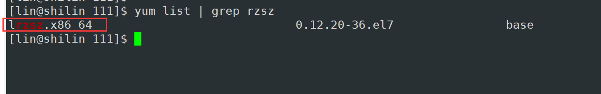

### 安装软件
+ 这里安装的时候可以直接跟上软件名字，或者全程也可以

```bash
sudo yum install -y lrzsz.x86_64
```

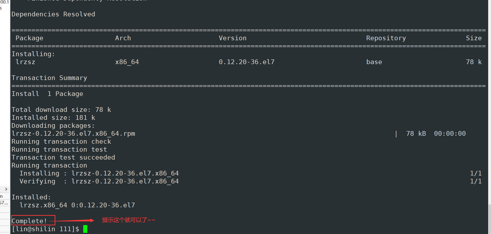

### 使用命令
使用sz下载到本地

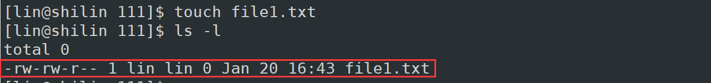

```bash
sz file1.txt
```

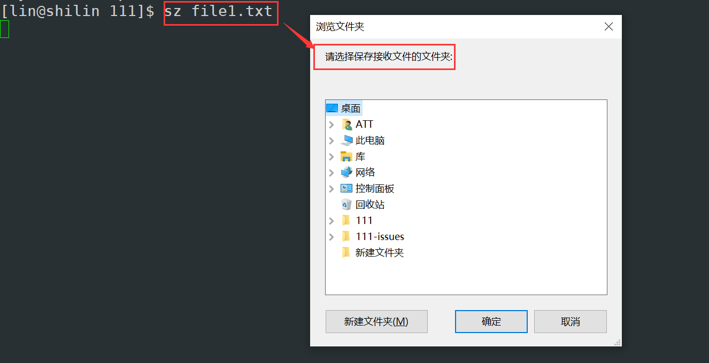

> 上传文件
>

### 方法一：直接拖拽
+ 就是直接将文件拖拽到终端就可以了

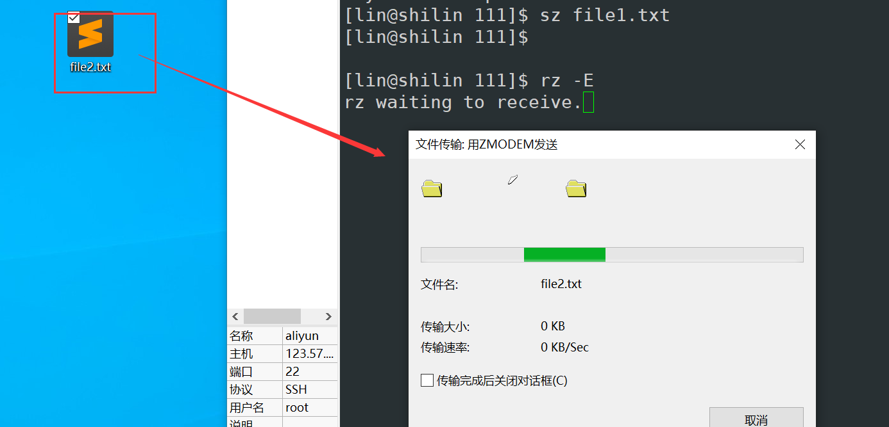

### 方法二：直接在终端输入rz
```bash
rz
```

> 在弹出的窗口中选择文件即可
>

