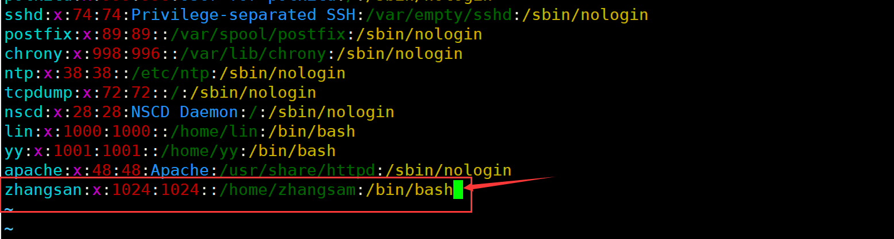
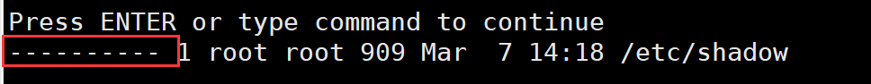
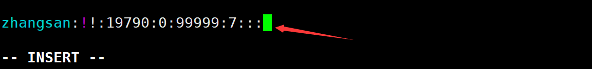
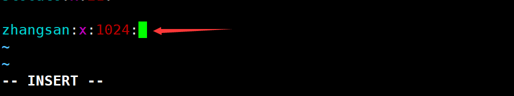
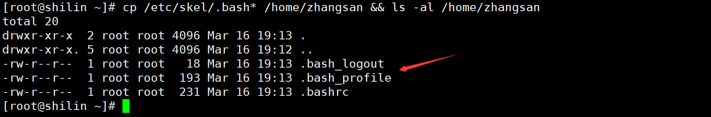
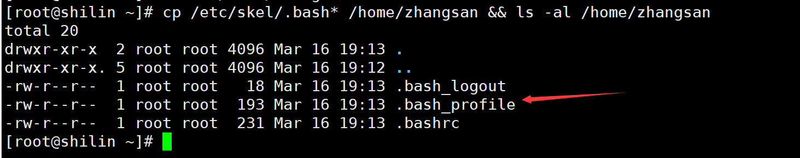
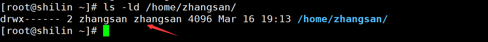
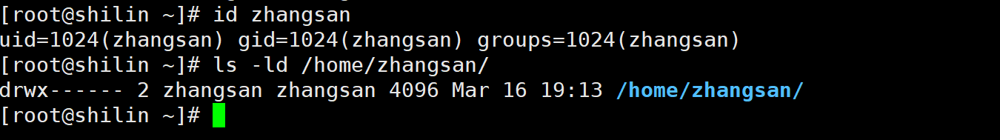

# Linux手动创建用户不使用useradd【七步走完成】
+ **环境：** CentOS7.6
+ **需求：** 手动新建一个用户，用户名为zhangsan，uid设置为1024（前提是这个uid没有被占用），gid也设置为1024，组名与用户名同名，家目录在/home/zhangsan，默认shell为/bin/bash

---

**注意：以下步骤都是使用root用户进行，部分命令和操作只有root用户才有权限。**

### 第一步：修改 /etc/passwd 文件
+ vim 打开 **/etc/passwd** 文件追加一行信息



/etc/passwd文件的每一行代表一个用户的信息，用冒号分隔的每一个字段分别代表不同的含义。

+ 第一个字段：用户名
+ 第二个字段：密码，这里的 **x** 仅仅是一个标识，真正的密码加密保存在 /etc/shadow 中
+ 第三个字段：UID
+ 第四个字段：GID
+ 第五个字段：用户描述信息，可不填
+ 第六个字段：用户家目录位置
+ 第七个字段：默认shell

修改完成，`:wq`保存退出。

### 第二步：修改 /etc/shadow 文件
+ 用 vim 打开`/etc/shadow`文件，打开会提示正在修改一个只读文件

可以看一下，shadow 文件啥权限啥也没有



+ 在 shadow 文件的最后追加一行信息。



+ 修改完毕，使用 **wq!** 保存退出，不然又会给出警告，无法保存。

shadow文件同样是一行一个用户的信息，每个字段有不同含义。

+ 第一个字段：用户名
+ 第二个字段：密码。有密码的用户在这里都是一串加密过的字符。这里我填了两个叹号，表示没有密码。
+ 第三个字段：从1970/01/01到最近一次密码修改经过的时间，以天为单位。
+ 第四个字段：密码过多久可以被修改，0表示随时可改。
+ 第五个字段：密码的有效期
+ 第六个字段：密码要过期前多少天提醒用户，7就是提前一周提醒。
+ 第七个字段：密码过期后多少天之内还能登录，但是要登录必须改密码。
+ 第八个字段：密码的最长使用期限
+ 第九个字段：系统保留字段

### 第三步：修改 /etc/group 文件
+ 在最后追加如下信息



group 文件一行有四个字段

+ 第一个字段是组名
+ 第二个字段是组密码，这里的 **x** 和 /etc/passwd 的密码字段差不多。
+ 第三个字段就是GID
+ 第四个字段是组中的用户，如果该组是某个用户的主要组，那么这个用户不会显示在这个字段里，因此这里我空着。

### 第四步：新建用户家目录
```plain
mdkir /home/zhangsan
```

### 第五步：复制/etc/skel目录下的环境变量配置文件到家目录下
```bash
cp /etc/skel/.bash* /home/zhangsan && ls -al /home/zhangsan
```



### 第六步：修改家目录的权限和属主
+ 到现在为止，用户 zhangsan 的家目录和其中的所有文件都是root用户的



+ 将这些文件的归属权给 zhangsan，并修改文件权限
+ 将用户 zhangsan 的家目录 /home/zhangsan 的属主和组修改为 zhangsan

```bash
chown -R zhangsan:zhangsan /home/zhangsan
```

+ 修改文件的权限，只允许属主有读写权限，其他用户和组没有任何权限

```bash
chmod 700 /home/zhangsan
```

+ 修改后的结果如下



### 第七步：创建邮箱文件
+ 创建邮箱文件

```bash
touch /var/spool/mail/zhangsan
```

+ 同样需要修改邮箱的所有者

```bash
chown zhangsan:zhangsan /var/spool/mail/zhangsan
```

+ 同样需要修改邮箱的所有者

```bash
chown zhangsan:zhangsan /var/spool/mail/zhangsan
```

### 确认用户创建成功


