# Linux文件操作
## 前言
> 我们在平时使用的C/C++/Java的时候，我们所用的文件操作都是封装系统接口来进行供我们操作，我们在使用这些接口，本质上就是在访问硬件，也就**是磁盘**
>

一个硬件设备是如何被函数接口的调用访问到的呢？

**当然是通过操作系统，操作系统是管理硬件设备的**，在我们学的C/C++/Java等等语言所封装的文件操作接口，都必须通过操作系统的允许，才可以访问到磁盘这个硬件设备，而操作系统是不相信任何用户的，所以为了能够得到操作系统的允许，我们又必须提供一些系统调用接口，供操作系统和用户打交道

> 当我们在语言层面所使用的文件操作函数接口，本质要访问物理硬件设备磁盘，而访问该磁盘时候，必须要操作系统进行管理，同时操作系统会提供一系列的系统调用供用户去访问操作系统，而这些系统调用接口有很多，我们这里所说的系统调用接口是于文件操作相关的系统调用接口；
>

## 一、文件相关概念与操作
**文件=文件内容+文件属性**

当一个文件的文件内容为空时, 此文件是否占用磁盘空间？

+ 这个答案是**肯定的**, **即使文件的内容为空, 其实此文件也是占用磁盘空间的, 因为文件并不只有内容, 文件还有属性**

### 1.1 open()
+ 函数原型

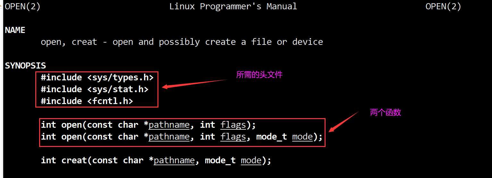

函数参数解析

+ `pathname` 所需打开文件的所在路径
+ `flags`需要传入的就是打开文件的选项
+ `mode`这个参数指的是打开文件需要修改成什么权限的数值，在我们之前学的权限的时候知道，在Linux下创建文件, 系统会根据`umask`值来赋予新创建的文件一个默认的文件权限，所以这个`mode`就是通过mode修改权限
+ 而`open()`接口的返回值, 被称为文件描述符`fd`, 可以看作表示一个打开的文件

open 函数具体使用哪个，和具体应用场景相关，如**目标文件不存在，需要open创建，则第三个参数，表示创建文件的默认权限**，否则，使用两个参数的open。

`flag`的参数

> `O_RDONLY`: 只读打开
`O_WRONLY`: 只写打开
`O_RDWR`: 读，写打开
`O_CREAT` : 若文件不存在，则创建它。需要使用mode选项，来指明新文件的访问权限
`O_APPEND`: 追加写
`O_TRONC`:文件以只读或者只写打开是，清空文件内容
`mode_t`:打开文件的权限，以八进制形式写

要实现一个参数实现多个功能就需要**位图**，flags参数其实需要采用位图的方式传参，也就是说,：Linux操作系统为`flags`参数提供的各种选项其实是表示一个整数二进制不同的位. **一个整数的比特位表示**`flags`**参数中某个选项是否被选中**

+ 我们可以打开`fcntl.h`来查看定义

```bash
vim /usr/include/asm-generic/fcntl.h
```

`open`的使用：

```c
#include<stdio.h>
#include<sys/types.h>
#include<sys/stat.h>
#include<fcntl.h>
#include<stdlib.h>
#include<unistd.h>

int main()
{
    // O_WRONLY 代表只写，如果没有该文件就创建，O_CREAT代表创建文件
    // 如果不指定创建文件的权限就会乱码
    int fd = open("log.txt", O_WRONLY | O_CREAT);
    if(fd < 0)
    {
        printf("fopen fail!\n");
        exit(1);
    }

    close(fd);
    return 0;
}
```

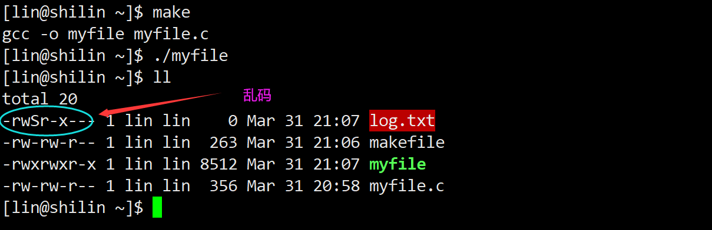

正确的使用方式是加上第三个参数：

```c
int main()
{
    int fd = open("log.txt", O_WRONLY | O_CREAT, 0666);
    if(fd < 0)
    {
        printf("fopen fail!\n");
        exit(1);
    }
    close(fd);
    return 0;
}
```

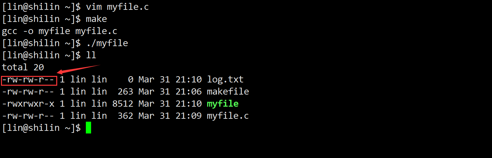

+ 这里虽然加上权限了但是怎么不对?少了个w，这是`umask`在起作用

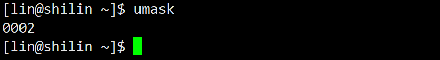

+ 在创建文件的时候，OS会将`指定的权限 & (~umask)`作为实际权限
+ 我们可以在程序的前面加上`umask(0)`即可解决

```c
int main()
{
    umask(0);
    int fd = open("log.txt", O_WRONLY | O_CREAT, 0666);
    if(fd < 0)
    {
        printf("fopen fail!\n");
        exit(1);
    }
    close(fd);
    return 0;
}
```

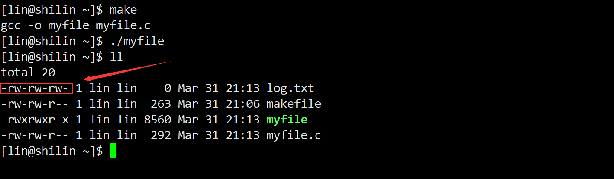

### 1.2 close()
+ 函数原型

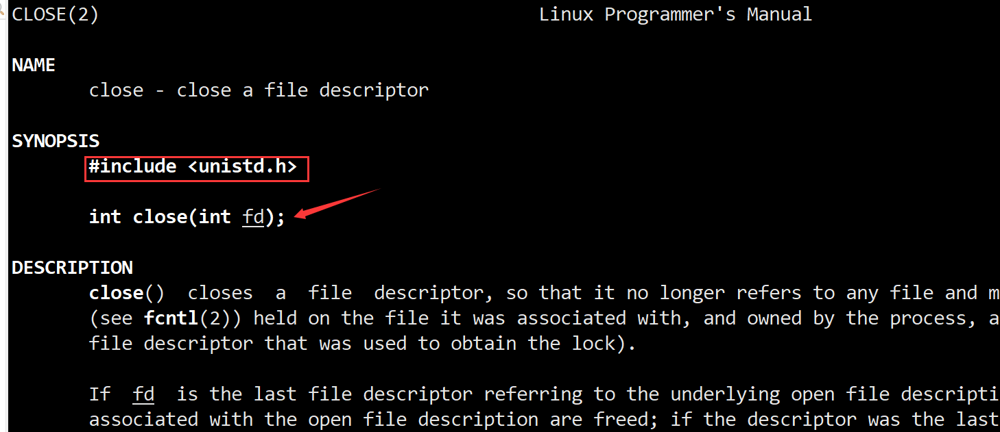

+ 函数参数解读
    - fd为传入一个**文件描述符**

### 1.3 write()
+ 函数原型

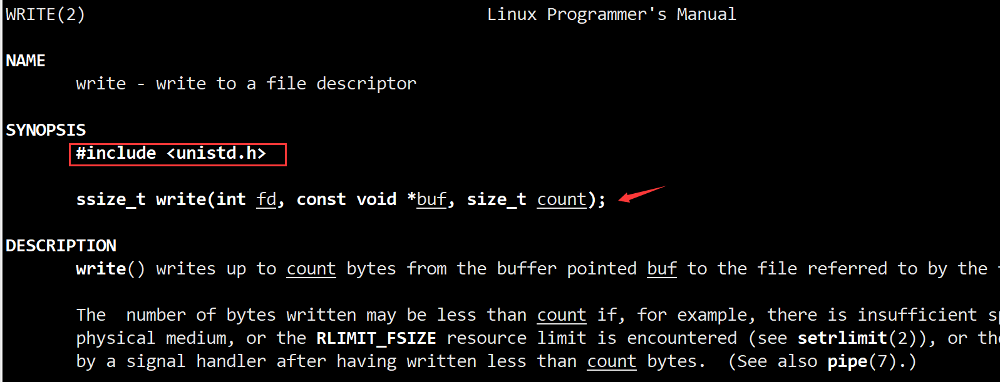

+ 返回值
    - 写入成功返回写入成功的字节数，返回0为什么也没有写入，返回-1为写入失败  
    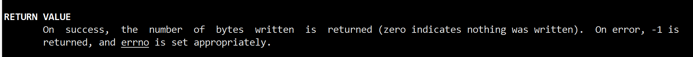
+ 函数参数解读：
    - 第一个参数为要传入的文件描述符
    - 第二个参数为要传入的字符串
    - 第三个参数为要写入的长度
+ 函数使用

```c
int main()
{
    umask(0);
    int fd = open("log.txt", O_WRONLY | O_CREAT, 0666);
    if(fd < 0)
    {
        printf("fopen fail!\n");
        exit(1);
    }
    const char* buffer = "hello world\n";
    int cnt = 5;
    while (cnt--) {
        write(fd, buffer, strlen(buffer));
    }

    close(fd);
    return 0;
}
```

+ 已经写入指定文件成功

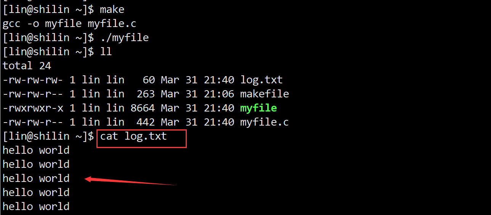

### 1.4 read()
+ 函数原型

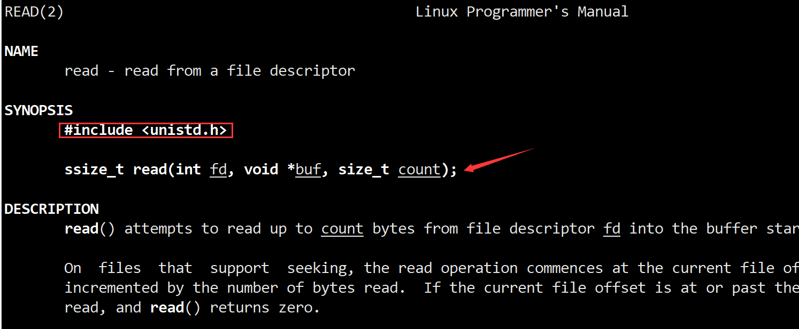

+ 函数参数解读：

> 从文件描述符中读取`const`的字节的数据存入`buf`中
>

```c
int main()
{
    umask(0);
    int fd = open("log.txt", O_RDONLY);
    if(fd < 0)
    {
        printf("fopen fail!\n");
        exit(1);
    }

    char buffer[128] = { 0 };
    // 从文件中读取内容写入buffer, 并输出
    read(fd, buffer, sizeof(buffer) - 1);
    printf("%s",buffer);

    close(fd);
    return 0;
}
```

+ 从文件中读取内容写入buffer, 并输出

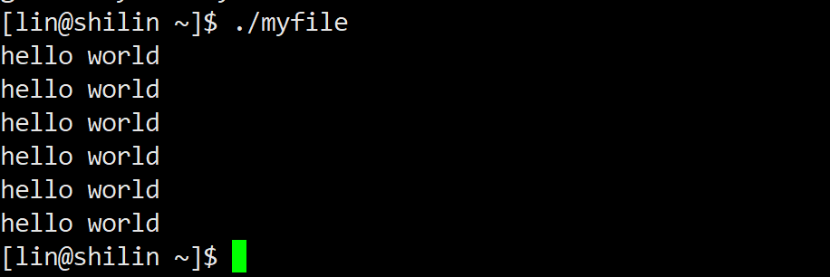

### 1.4 写入的时候先清空文件内容再写入
+ `O_TRUNC`的作用就是：打开文件时, 先清空文件内容

```c
int main()
{
    umask(0);
    // 先清空再写入
    int fd = open("log.txt", O_CREAT | O_RDWR | O_TRUNC, 0666); 
    if(fd < 0)
    {
        printf("fopen fail!\n");
        exit(1);
    }

    const char* buffer = "hello linux\n";
    write(fd, buffer, strlen(buffer));

    close(fd);
    return 0;
}

```

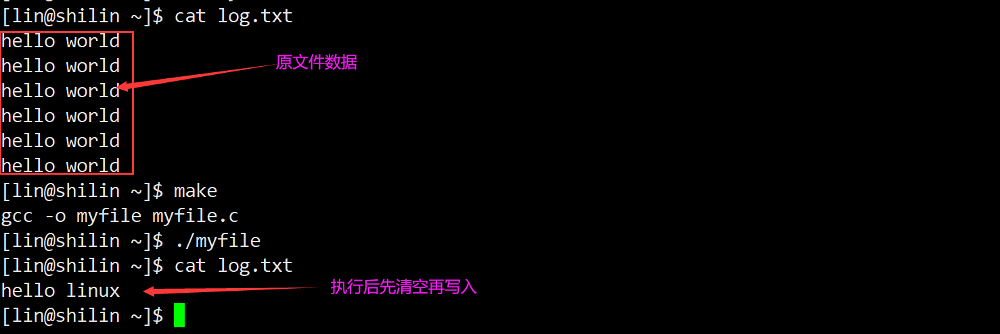

### 1.5 追加（a && a+）
+ 使用`O_APPEND`即可完成文件的追加

```c
int main()
{
    umask(0);
    // 先清空再写入
    int fd = open("log.txt", O_CREAT | O_WRONLY | O_APPEND, 0666); 
    if(fd < 0)
    {
        printf("fopen fail!\n");
        exit(1);
    }

    const char* buffer = "hello linux~~\n";
    write(fd, buffer, strlen(buffer));

    close(fd);
    return 0;
}
```

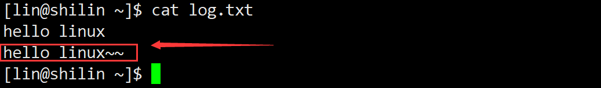

> 只传入 `O_APPEND` 选项, 不传入 `O_WRONLY` 或 `O_RDWR` 是无法追加写入的, 因为没有写入打开
>

## 二、文件描述符
多次打开文件，查看**open返回值**

```c
int main()
{
    umask(0);
    int fd1 = open("log.txt", O_RDWR | O_CREAT, 0666); 
    int fd2 = open("log.txt", O_RDWR | O_CREAT, 0666); 
    int fd3 = open("log.txt", O_RDWR | O_CREAT, 0666); 

    printf("fd1: %d\n", fd1);
    printf("fd2: %d\n", fd2);
    printf("fd3: %d\n", fd3);

    close(fd1);
    close(fd2);
    close(fd3);
    return 0;
}
```

+ 这里我们看到返回值是从3开始的，并且递增连续

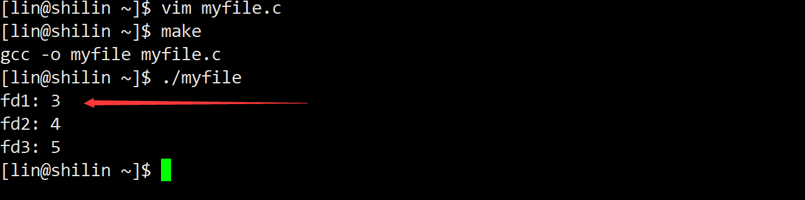

+ 那么为什么从3开始，0,1,2呢？
+ 其实在一个进程运行起来的时候默认会给我们打开3个文件流：
    - fd 0：标准输入 –> 键盘
    - fd 1：标准输出 –> 显示器
    - fd 2：标准错误 –> 显示器

### 2.1 文件描述符 fd 0 1 2 的理解
+ 当我们的程序运行起来后，编程了进程之后，默认情况下，OS会帮我们打开三个标准输入输出~
+ 其中在Linux上：

> 0：标准输入，键盘  
1：标准输出，显示器  
2：标准错误，显示器
>

+ 在C语言上：

> stdin：标准输入，键盘  
stdout：标准输出，显示器  
stderr：标准错误，显示器
>

+ 在stdio.h头文件就可以看到声明

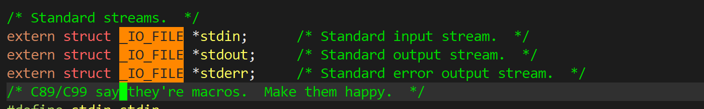

+ 本质是 `stdin` 和 `stdout` `stderr `就是一个变量名，类型为` FILE*` 而这个`FILE` 结构体里面有个成员就是` fd`，文件描述符；
+ 就是C语言的 `stdin`和`stdout` `stderr` 包含 系统的 0 1 2；

> 不只是C语言，其他语言都有自己的封装
>

+ 我们也可以验证一下：

```c
int main() {
    // C语言会默认打开 stdin, stdout, stderr
    printf("stdin-fd: %d\n", stdin->_fileno);
    printf("stdout-fd: %d\n", stdout->_fileno);
    printf("stderr-fd: %d\n", stderr->_fileno);
    return 0;
}
```

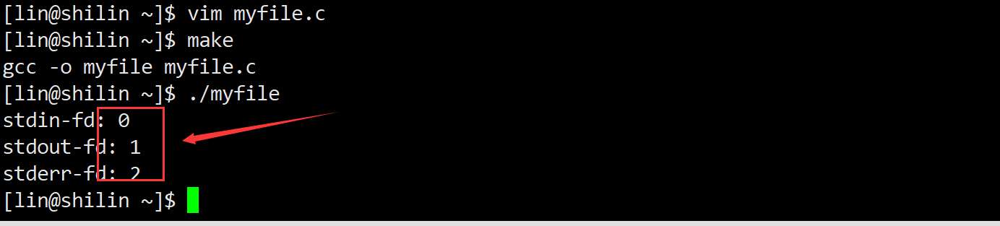

### 2.2 FILE结构体的源代码
```c
typedef struct _IO_FILE FILE; //在/usr/include/stdio.h
struct _IO_FILE {
    int _flags; /* High-order word is _IO_MAGIC; rest is flags. */
#define _IO_file_flags _flags
    //缓冲区相关
    /* The following pointers correspond to the C++ streambuf protocol. */
    /* Note: Tk uses the _IO_read_ptr and _IO_read_end fields directly. */
    char* _IO_read_ptr; /* Current read pointer */
    char* _IO_read_end; /* End of get area. */
    char* _IO_read_base; /* Start of putback+get area. */
    char* _IO_write_base; /* Start of put area. */
    char* _IO_write_ptr; /* Current put pointer. */
    char* _IO_write_end; /* End of put area. */
    char* _IO_buf_base; /* Start of reserve area. */
    char* _IO_buf_end; /* End of reserve area. */
    /* The following fields are used to support backing up and undo. */
    char *_IO_save_base; /* Pointer to start of non-current get area. */
    char *_IO_backup_base; /* Pointer to first valid character of backup area */
    char *_IO_save_end; /* Pointer to end of non-current get area. */
    struct _IO_marker *_markers;
    struct _IO_FILE *_chain;
    int _fileno; //封装的文件描述符
#if 0
    int _blksize;
#else
    int _flags2;
#endif
    _IO_off_t _old_offset; /* This used to be _offset but it's too small. */
#define __HAVE_COLUMN /* temporary */
    /* 1+column number of pbase(); 0 is unknown. */
    unsigned short _cur_column;
    signed char _vtable_offset;
    char _shortbuf[1];
    /* char* _save_gptr; char* _save_egptr; */
    _IO_lock_t *_lock;
#if
```

## 三、深入理解文件描述符
+ 前面我们有一个代码是打开多个文件，它返回的`fd`值是连续递增的，其实本质上就是数组的下标，所以**本质上是文件描述符实际上就是某个数组的下标**
+ 一个进程是可以打开多个文件的. 而操作系统中又存在着许多的进程, 其实也就意味着**操作系统中存在的大量的被打开的文件**
+ **操作系统会对这些大量的被打开的文件进行统一的管理**, 会将文件的所有属性描述在一个结构体中, 并将所有的描述着打开文件属性的结构体组织在一起进行管理. 就像管理进程，实际上实在管理进程PCB一样,
+ 在Linux系统中, 描述的打开文件**属性的结构体**叫做：`struct file{};`，每一个打开的文件都由这样一个结构体维护着, 且结构体之间会构成一个数据结构, 方便操作系统进行管理即打开的文件在操作系统中, 实际上都在一个数据结构中维护着若操作系统将这些数据结构以链表的形式连接起来维护, 那么就会存在这样一个维护打开文件的数据结构

```c
struct task_struct {
	volatile long state;	/* -1 unrunnable, 0 runnable, >0 stopped */
	struct thread_info *thread_info;
	atomic_t usage;
	unsigned long flags;	/* per process flags, defined below */
//............
/* filesystem information */
	struct fs_struct *fs;
/* open file information */
	struct files_struct *files;
//............
};
```

+ 其中`file`指针指向一个 `struct file_struct` 结构体变量，而此结构体变量中存储着一个 `struct file* fd_array[]`指针数组

```c
/*
 * Open file table structure
 */
struct files_struct {
  /*
   * read mostly part
   */
	atomic_t count;
	struct fdtable *fdt;
	struct fdtable fdtab;
  /*
   * written part on a separate cache line in SMP
   */
	spinlock_t file_lock ____cacheline_aligned_in_smp;
	int next_fd;
	struct embedded_fd_set close_on_exec_init;
	struct embedded_fd_set open_fds_init;
	struct file * fd_array[NR_OPEN_DEFAULT];
};
```

+ `fd_array[] `指针数组中的每一个空间都存储着一个`struct file*`结构体指针, 指向一个打开的文件
+ 进程的PCB中有一个结构体指针变量指向了一个结构体变量，此结构体变量中存储着`fd_array[]`数组，`fd_array[]`中存储着 描述了打开文件属性的结构体的指针, 其实也就是指向了打开的文件
+ 而 `fd_array[]`数组的下标, 就是`open()`、`close()`等系统接口使用的`fd`文件描述符。文件操作的系统接口可以通过fd, 在`fd_array[]`数组中找到指定下标存储的指针再找到指针指向的文件

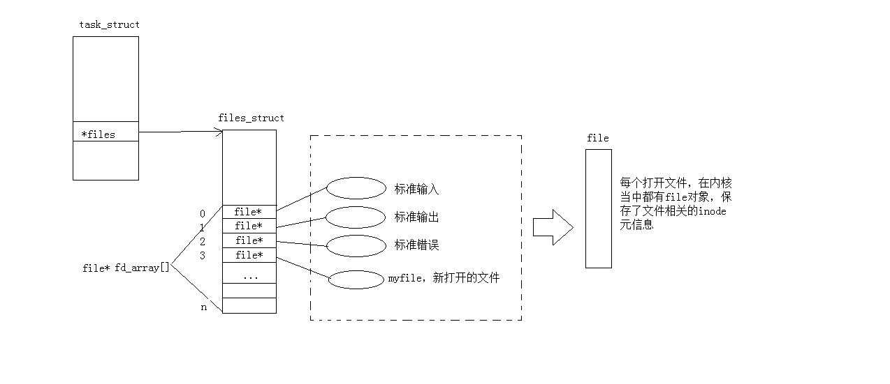

> 也就是说当你在创建一个新的文件时候，那么操作系统就会给你搞一个 `strcut file`, 然后把它存放到 `fd_array[ ]` 数组里，然后把对应的下标返回给上一层用户；那么用户就可以拿到下标，也就是描述符干自己的事了
>

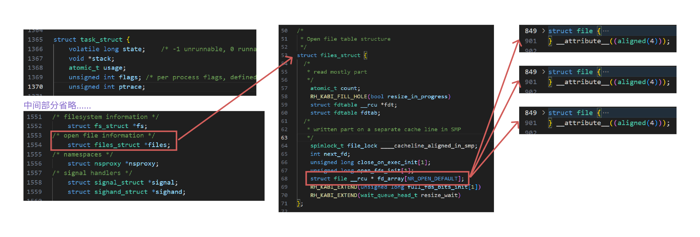

我们知道：**文件=内容+属性**

+ 我们进行任何文件内容的增，删，查，改，都必须把文件的内容，提前预加载到改文件的文件内核缓冲区中
+ write根本就不是写入到文件，而write的本质：是拷贝函数，把数据从用户空间拷贝到对应文件的内核缓冲区中
+ 读文件或者修改文件，只能从文件缓冲区里读
+ 文件内核缓冲区什么时候写入到磁盘文件，由OS自己决定时机，来进行刷新

也就是说：在进程中每打开一个文件，都会创建有相应的文件描述信息struct file，这个描述信息被添加在pcb的`struct files_struct`中，以数组的形式进行管理，随即向用户返回数组的下标作为文件描述符，用于操作文件！

## 四、文件描述符的分配规则
+ 我们可以再次观察下面代码

```c
int main() {
    int fd = open("log.txt", O_RDONLY);
    if(fd < 0)
    {
        perror("open fail!\n");
        exit(-1);
    }

    printf("fd: %d\n",fd);
    close(fd);
    return 0;
}
```

+ 上面也说了，默认是从3开始的012分别被**输入输出错误**占用了

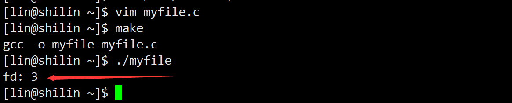

+ 那么我们先关闭0再来看一下，这次分配的fd为什么

```c
int main() {
    close(0); // 关闭0号描述符
    int fd = open("log.txt", O_RDONLY);
    if(fd < 0)
    {
        perror("open fail!\n");
        exit(-1);
    }

    printf("fd: %d\n",fd);
    close(fd);
    return 0;
}
```

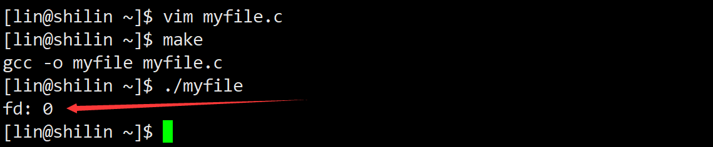

> 可以观察到，文件描述符的分配规则：**在**`files_struct`**数组当中，找到当前没有被使用的最小的一个下标，作为新的文件描述符。**
>

## 五、重定向原理
+ 那么我们先关闭1也就是**输出**

```c
int main() {
    umask(0);
    close(1);
    int fd = open("log.txt", O_WRONLY | O_CREAT | O_TRUNC, 0666);
    if(fd < 0)
    {
        perror("open fail!\n");
        exit(-1);
    }
    printf("fd: %d\n",fd);
    const char* str = "hello world\n";
    write(fd, str, strlen(str));
    close(fd);
    return 0;
}
```

+ 本来要打印到屏幕上的被写入到了文件中

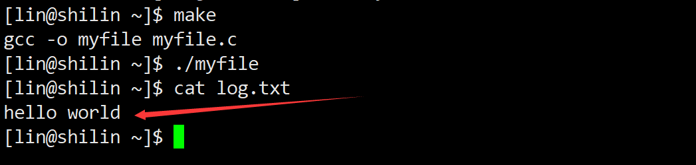

当我们关闭了 1号文件描述符，断开了`fd_arrary`数组元素1号位置，也就是断开了标准输入`struct file`的联系，而当我们再次用`open`函数打开一个文件为 `log.txt`时候，文件描述符分配原则告诉我们，就会分配一个数组 `1`号位置给该文件`log.txt;`

一旦我们使用`printf`输出时候，就不会显示到屏幕了，而显示到文件；这是因为`printf`默认是往标准输入输出内容的，而`printf`的标准输入就是`stdout`这个变量，而`stdout`这个变量就是一个`FILE`类型的结构体指针，而这个结构体指针里面有一个成员就是文件描述符`fd`，而fd就是1号，而这个1号就是指向`struct file` 这个结构体，这个结构体就是标准输入。

## 六、dup2–重定向函数
函数原型

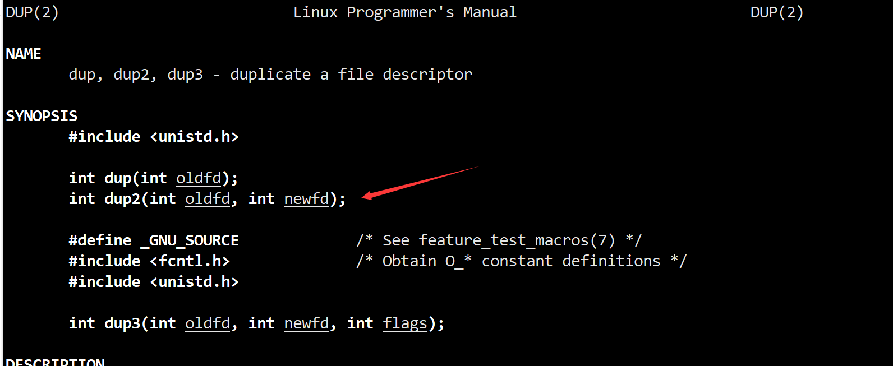

+ 函数参数解读
    - 主要功能是文件描述符的复制
    - 成功返回新文件描述符，失败返回-1
+ oldfd：原先的文件描述符
+ newfd：新的文件描述符
+ 由dup返回的新文件描述符一定是**当前可用文件描述符中的最小数值**。
+ 用`dup2`则可以用`newfd`参数指定新描述符的数值，如果newfd已经打开，**则先将其关闭，如若oldfd等于**，**则dup2返回newfd**，而不关闭它在进程间通信时可用来改变进程的标准输入和标准输出设备

函数功能为将newfd描述符重定向到oldfd描述符，相当于重定向完毕后都是操作oldfd所操作的文件，但是在过程中如果newfd本身已经有对应打开的文件信息，则会先关闭文件后再重定向（否则会资源泄露）

### 6.1 使用dup2完成重定向功能
```c
int main() 
{
    int fd = open("log.txt", O_CREAT | O_WRONLY | O_TRUNC, 0644 );
    if(fd < 0) {
      perror("open error:");
      exit(1);
    }

    dup2(fd, 1); // 本应该输出到1的，输出到了fd中

    printf("printf: hello world\n");
    fprintf(stdout,"fprintf: hello world\n");
    fputs("fputs: hello world\n", stdout);

    close(fd);
    return 0;
}
```

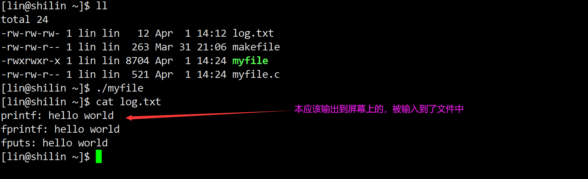

+ 本来应该输出到显示器上的内容，输出到了文件`log.txt`当中，其中，fd＝1。这种现象叫做**输出重定向**。常见的重定向有：`>`, `>>`, `<`
+ 那重定向的本质是什么呢？`int dup2(int oldfd, int newfd);`

原理：把`oldfd`位置的值**复制**给了`newfd`位置的值

+ 导致`newfd`位置的值和`oldfd`位置值一样，也就是说，`newfd`位置的值，不再指向原来的`struct file`，而是指向了`oldfd`的`struct file`

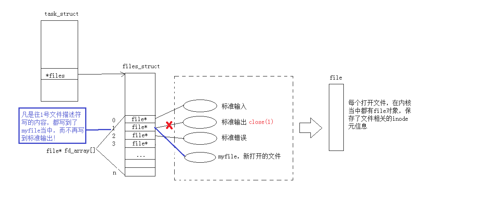

也就是说：每个文件描述符都是一个内核中文件描述信息数组的下标，对应有一个文件的描述信息用于操作文件，而重定向就是在不改变所操作的文件描述符的情况下，通过改变描述符对应的文件描述信息进而实现改变所操作的文件

### 6.2 两个问题
1. 有了重定向的概念和本质理解，那么如果我们**创建子进程，子进程是如何看待父进程打开的文件的**？

在创建子进程中，子进程会继承父进程同时`files_struct`也会被拷贝一份，也就是说，子进程的fd还指向着父进程的文件，子进程不就默认打开了标准输入、标准输出、标准错误。

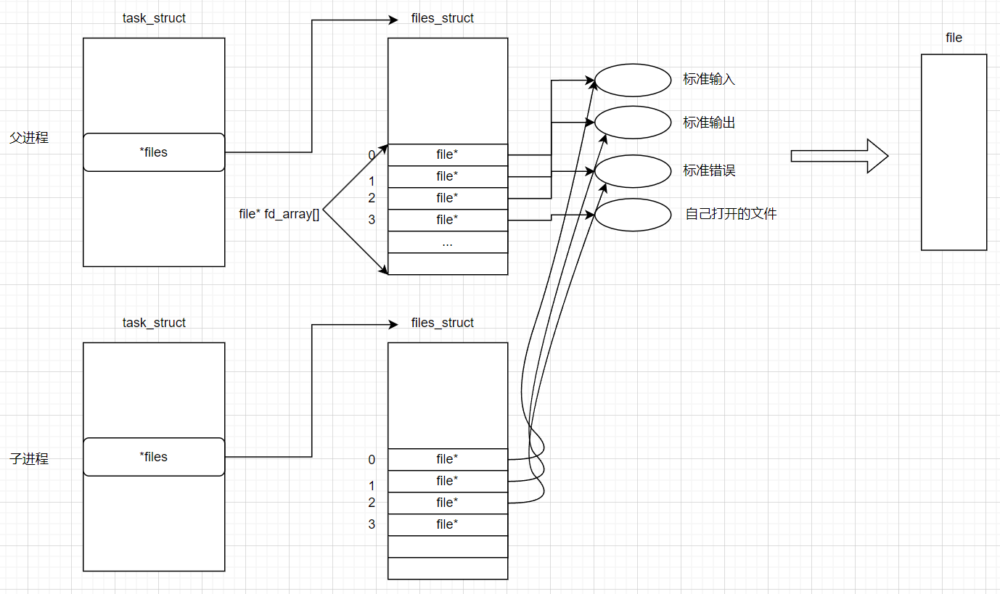

如果我父进程关闭了标准输出，而子进程不会受影响，**这是因为在file结构体中有个引用计数**！！！

```c
struct file {
	/*
	 * fu_list becomes invalid after file_free is called and queued via
	 * fu_rcuhead for RCU freeing
	 */
	union {
		struct list_head	fu_list;
		struct rcu_head 	fu_rcuhead;
	} f_u;
	struct dentry		*f_dentry;
	struct vfsmount         *f_vfsmnt;
	const struct file_operations	*f_op;
	atomic_t		f_count;                // 这个就是引用计数
	unsigned int 		f_flags;
	mode_t			f_mode;
	loff_t			f_pos;
	struct fown_struct	f_owner;
	unsigned int		f_uid, f_gid;
	struct file_ra_state	f_ra;

	unsigned long		f_version;
	void			*f_security;

	/* needed for tty driver, and maybe others */
	void			*private_data;

#ifdef CONFIG_EPOLL
	/* Used by fs/eventpoll.c to link all the hooks to this file */
	struct list_head	f_ep_links;
	spinlock_t		f_ep_lock;
#endif /* #ifdef CONFIG_EPOLL */
	struct address_space	*f_mapping;
};
```

例如：父进程关闭了标准输出，子进程还在一直打印

```cpp
#include <stdio.h>
#include <unistd.h>
#include <sys/types.h>
#include <sys/wait.h>

int main()
{
    pid_t id = fork();
    if(id == 0)
    {
        while(1)
        {
            // child
            printf("我是子进程\n");
            sleep(1);
        }
    }
    else 
    {
        sleep(2);
        // parent
        printf("parent马上要关闭了标准输出\n");
        close(1);
        printf("父进程就看不到这句话了，但是子进程还是不影响\n");
        pid_t rid = waitpid(id, NULL, 0);
        if(rid > 0)
        {
            printf("等待成功\n");
        }
    }
    return 0;
}
```

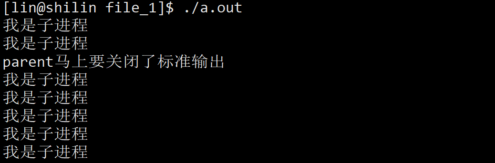

2. 如果我们做exec程序替换，不会创建新进程，会影响历史打开的文件吗？

> 不影响重定向

```c
#include <stdio.h>
#include <unistd.h>
#include <sys/stat.h>
#include <fcntl.h>

int main()
{
    // 1. 打开目标文件
    int fd = open("log.txt", O_CREAT | O_WRONLY, 0666);
    
    // 2. 输出重定向
    dup2(fd, 1);

    // 3. exec*替换，不影响重定向
    execl("/usr/bin/ls", "ls","-al", NULL);

    return 0;
}
```

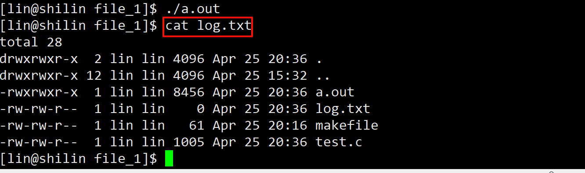

## 七、极简shell增加重定向的功能
```c
char *checkDir(char commandstr[], enum redir* redir_type)
{
    char* start = commandstr;
    char* end = commandstr + strlen(commandstr);
    //1. 检测commandstr内部是否有 > >> <
    while(start < end)
    {
      if(*start == '>')
      {
        if(*(start + 1) == '>')
        {                                                                                                                                                                                     
          *redir_type = REDIR_APPEND;
          //细节处理为后续命令行分割做铺垫
          *start = '\0';
          return start + 2;
        }
        else
        {
          *redir_type = REDIR_OUTPUT;
          //细节处理为后续命令行分割做铺垫
          *start = '\0';
          return start + 1;
        }
      }
      else if(*start  == '<')
      {
        *redir_type = REDIR_INPUT;
        //细节处理为后续命令行分割做铺垫
        *start = '\0';
        return start + 1;
      }
      start++;
    }
    return NULL;
}
```

+ 主函数

```c
char *filename = checkDir(commondstr, &redir_type);
```

+ 子进程的部分：

注意这里一定要将权限先置成0666在执行，要不然可能会出现权限不够写入错误的问题

```c
if(id == 0)
{
  int fd = -1;
  if(redir_type != REDIR_NONE)
  {
    //表示找到了文件，并且重定向类型确定
    if(redir_type == REDIR_INPUT)
    {
      fd = open(filename , O_RDONLY);
      dup2(fd, 0);
    }
    else if(redir_type == REDIR_OUTPUT)
    {
      fd = open(filename , O_CREAT | O_TRUNC | O_WRONLY, 0666);
      dup2(fd, 1);
    }
    else
    {
      fd = open(filename , O_CREAT | O_APPEND | O_WRONLY, 0666);
      dup2(fd, 1);
    }
  }
  //child
  execvp(argv[0], argv);
  exit(0);
}
```

### C语言实现简易shell全部源码
```c
#include <stdio.h>
#include <stdlib.h>
#include <string.h>
#include <errno.h>
#include <ctype.h>
#include <unistd.h>
#include <sys/types.h>
#include <sys/wait.h>
#include <sys/stat.h>
#include <fcntl.h>

#define SIZE 512
#define ZERO '\0'
#define SEP " "
#define NUM 32
#define SkipPath(p) do{ p += (strlen(p)-1); while(*p != '/') p--; }while(0)
#define SkipSpace(cmd, pos) do{\
    while(1){\
        if(isspace(cmd[pos]))\
            pos++;\
        else break;\
    }\
}while(0)

#define None_Redir 0
#define In_Redir   1
#define Out_Redir  2
#define App_Redir  3

int redir_type = None_Redir;
char *filename = NULL;

char cwd[SIZE*2];
char *gArgv[NUM];
int lastcode = 0;

void Die()
{
    exit(1);
}

const char *GetHome()
{
    const char *home = getenv("HOME");
    if(home == NULL) return "/";
    return home;
}

const char *GetUserName()
{
    const char *name = getenv("USER");
    if(name == NULL) return "None";
    return name;
}
const char *GetHostName()
{
    const char *hostname = getenv("HOSTNAME");
    if(hostname == NULL) return "None";
    return hostname;
}

const char *GetCwd()
{
    const char *cwd = getenv("PWD");
    if(cwd == NULL) return "None";
    return cwd;
}

void MakeCommandLineAndPrint()
{
    char line[SIZE];
    const char *username = GetUserName();
    const char *hostname = GetHostName();
    const char *cwd = GetCwd();

    SkipPath(cwd);
    snprintf(line, sizeof(line), "[%s@%s %s]> ", username, hostname, strlen(cwd) == 1 ? "/" : cwd+1);
    printf("%s", line);
    fflush(stdout);
}

int GetUserCommand(char command[], size_t n)
{
    char *s = fgets(command, n, stdin);
    if(s == NULL) return -1;
    command[strlen(command)-1] = ZERO;
    return strlen(command); 
}


void SplitCommand(char command[], size_t n)
{
    (void)n;
    // "ls -a -l -n" -> "ls" "-a" "-l" "-n" 
    gArgv[0] = strtok(command, SEP);
    int index = 1;
    // 写成=,表示先赋值，在判断. 分割之后，strtok会返回NULL，
    // 刚好让gArgv最后一个元素是NULL, 并且while判断结束
    while((gArgv[index++] = strtok(NULL, SEP))); 
}

void ExecuteCommand()
{
    pid_t id = fork();
    if(id < 0) Die();
    else if(id == 0)
    {
        //重定向设置
        if(filename != NULL){
            if(redir_type == In_Redir)
            {
                int fd = open(filename, O_RDONLY);
                dup2(fd, 0);
            }
            else if(redir_type == Out_Redir)
            {
                int fd = open(filename, O_WRONLY | O_CREAT | O_TRUNC, 0666);
                dup2(fd, 1);
            }
            else if(redir_type == App_Redir)
            {
                int fd = open(filename, O_WRONLY | O_CREAT | O_APPEND, 0666);
                dup2(fd, 1);
            }
            else
            {}
        }

        // child
        execvp(gArgv[0], gArgv);
        exit(errno);
    }
    else
    {
        // fahter
        int status = 0;
        pid_t rid = waitpid(id, &status, 0);
        if(rid > 0)
        {
            lastcode = WEXITSTATUS(status);
            if(lastcode != 0) printf("%s:%s:%d\n", gArgv[0], strerror(lastcode), lastcode);
        }
    }
}

void Cd()
{
    const char *path = gArgv[1];
    if(path == NULL) path = GetHome();
    // path 一定存在
    chdir(path);

    // 刷新环境变量
    char temp[SIZE*2];
    getcwd(temp, sizeof(temp));
    snprintf(cwd, sizeof(cwd), "PWD=%s", temp);
    putenv(cwd);
}

int CheckBuildin()
{
    int yes = 0;
    const char *enter_cmd = gArgv[0];
    if(strcmp(enter_cmd, "cd") == 0)
    {
        yes = 1;
        Cd();
    }
    else if(strcmp(enter_cmd, "echo") == 0 && strcmp(gArgv[1], "$?") == 0)
    {
        yes = 1;
        printf("%d\n", lastcode);
        lastcode = 0;
    }
    return yes;
}

void CheckRedir(char cmd[])
{
    int pos = 0;
    int end = strlen(cmd);

    while(pos < end)
    {
        if(cmd[pos] == '>')
        {
            if(cmd[pos+1] == '>')
            {
                cmd[pos++] = 0;
                pos++;
                redir_type = App_Redir;
                SkipSpace(cmd, pos);
                filename = cmd + pos;
            }
            else
            {
                cmd[pos++] = 0;
                redir_type = Out_Redir;
                SkipSpace(cmd, pos);
                filename = cmd + pos;
            }
        }
        else if(cmd[pos] == '<')
        {
            cmd[pos++] = 0;
            redir_type = In_Redir;
            SkipSpace(cmd, pos);
            filename = cmd + pos;
        }
        else
        {
            pos++;
        }
    }
}

int main()
{
    int quit = 0;
    while(!quit)
    {
        // 0. 重置
        redir_type = None_Redir;
        filename = NULL;
        // 1. 我们需要自己输出一个命令行
        MakeCommandLineAndPrint();

        // 2. 获取用户命令字符串
        char usercommand[SIZE];
        int n = GetUserCommand(usercommand, sizeof(usercommand));
        if(n <= 0) return 1;

        // 2.1 checkredir
        CheckRedir(usercommand);

        // 3. 命令行字符串分割. 
        SplitCommand(usercommand, sizeof(usercommand));

        // 4. 检测命令是否是内建命令
        n = CheckBuildin();
        if(n) continue;
        // 5. 执行命令
        ExecuteCommand();
    }
    return 0;
}
```

## 八、理解一切皆文件
+ 我们的计算机中, 有着非常多的I/O硬件设备：磁盘、键盘、显示器、网卡……

这些I/O设备想要与操作系统交换数据, 一定有它们自己的读写方式，并且每种硬件的读写方式是独属于此硬件的，各硬件之间的结构不同, 读写方式当然不可能完全相同。

每种硬件都有其自己的读写方式, 那么当操作系统需要向这些I/O设备写入数据或需要从这些I/O设备中读取数据时, 操作系统会怎么做呢？

开发者仅需要使用一套`API`和`开发工具`，即可调取 Linux 系统中绝大部分的资源。举个简单的例子，Linux 中几乎所有读（读文件，读系统状态，读PIPE）的操作都可以用`read`函数来进行；几乎所有更改（更改文件，更改系统参数，写 PIPE）的操作都可以用`write`函数来进行。

这些打开的I/O设备, 在操作系统中也会以`struct file{} `结构体的形式维护着, 并且不同硬件的结构体中还会存在函数指针指向此硬件的各种方法：

当打开一个文件时，操作系统为了管理所打开的文件，都会为这个文件创建一个file结构体，该结构体定义在`linux-2.6.18\include\linux\fs.h`

```c
struct file {
    //...
    struct inode* f_inode; /* cached value */
    const struct file_operations* f_op;
    //...
    atomic_long_t f_count; // 表示打开文件的引用计数，如果有多个文件指针指向它，就会增加f_count的值。
    unsigned int f_flags; // 表示打开文件的权限
    fmode_t f_mode; // 设置对文件的访问模式,例如：只读，只写等。所有的标志在头文件<fcntl.h> 中定义
    loff_t f_pos; // 表示当前读写文件的位置
    //...
} __attribute__((aligned(4))); /* lest something weird decides that 2 is OK */
```

其中`struct file`中的`f_op`指针指向了一个`file_operations`结构体，这个结构体中的成员除了`struct module* owner`其余都是函数指针，该结构和`struct file`都在`fs.h`下。

```c
struct file_operations {
    struct module* owner;
    //指向拥有该模块的指针；
    loff_t(*llseek) (struct file*, loff_t, int);
    //llseek 方法用作改变文件中的当前读/写位置, 并且新位置作为(正的)返回值.
    ssize_t(*read) (struct file*, char __user*, size_t, loff_t*);
    //用来从设备中获取数据. 在这个位置的一个空指针导致 read 系统调用以 -EINVAL("Invalid argument") 失败.一个非负返回值代表了成功读取的字节数(返回值是一个"signed size" 类型, 常常是目标平台本地的整数类型).
    ssize_t(*write) (struct file*, const char __user*, size_t, loff_t*);
    //发送数据给设备. 如果 NULL, -EINVAL 返回给调用 write 系统调用的程序. 如果非负, 返回值代表成功写的字节数.
    ssize_t(*aio_read) (struct kiocb*, const struct iovec*, unsigned long, loff_t);
    //初始化一个异步读 -- 可能在函数返回前不结束的读操作.
    ssize_t(*aio_write) (struct kiocb*, const struct iovec*, unsigned long, loff_t);
    //初始化设备上的一个异步写.
    int (*readdir) (struct file*, void*, filldir_t);
    //对于设备文件这个成员应当为 NULL; 它用来读取目录, 并且仅对**文件系统**有用.
    unsigned int (*poll) (struct file*, struct poll_table_struct*);
    int (*ioctl) (struct inode*, struct file*, unsigned int, unsigned long);
    long (*unlocked_ioctl) (struct file*, unsigned int, unsigned long);
    long (*compat_ioctl) (struct file*, unsigned int, unsigned long);
    int (*mmap) (struct file*, struct vm_area_struct*);
    //mmap 用来请求将设备内存映射到进程的地址空间. 如果这个方法是 NULL, mmap 系统调用返回 - ENODEV.
    int (*open) (struct inode*, struct file*);
    //打开一个文件
    int (*flush) (struct file*, fl_owner_t id);
    //flush 操作在进程关闭它的设备文件描述符的拷贝时调用;
    int (*release) (struct inode*, struct file*);
    //在文件结构被释放时引用这个操作. 如同 open, release 可以为 NULL.
    int (*fsync) (struct file*, struct dentry*, int datasync);
    //用户调用来刷新任何挂着的数据.
    int (*aio_fsync) (struct kiocb*, int datasync);
    int (*fasync) (int, struct file*, int);
    int (*lock) (struct file*, int, struct file_lock*);
    //lock 方法用来实现文件加锁; 加锁对常规文件是必不可少的特性, 但是设备驱动几乎从不实现它.
    ssize_t(*sendpage) (struct file*, struct page*, int, size_t, loff_t*, int);
    unsigned long (*get_unmapped_area)(struct file*, unsigned long, unsigned long, unsigned long, unsigned long);
    int (*check_flags)(int);
    int (*flock) (struct file*, int, struct file_lock*);
    ssize_t(*splice_write)(struct pipe_inode_info*, struct file*, loff_t*, size_t, unsigned int);
    ssize_t(*splice_read)(struct file*, loff_t*, struct pipe_inode_info*, size_t, unsigned int);
    int (*setlease)(struct file*, long, struct file_lock**);
};
```

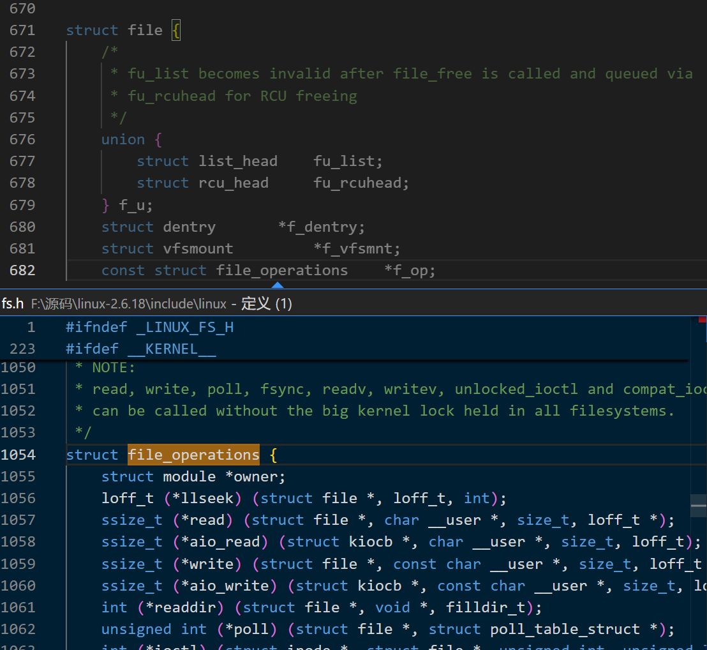

`file_operation`就是把系统调用和驱动程序关联起来的关键数据结构，这个结构的每一个成员都对应着一个系统调用。读取`file_operation`中相应的函数指针，接着把控制权转交给函数，从而完成了Linux设备驱动程序的工作。

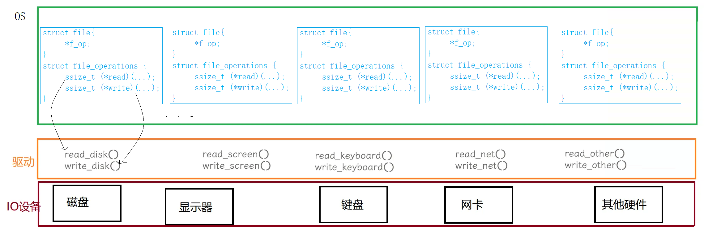

> Linux操作系统的内存文件系统会对所有设备和打开的文件以一个统一的视角进行组织和管理, 这就是**Linux下一切皆文件**
>

+ Linux这种将一切设备和文件都以一个统一的视角(**file结构体**) 进行组织和管理的做法, 被称为**拟文件系统(VFS)**

计算机里面的一切问题，都可以通过添加一层软件层，这也就是C语言实现多态！

## 九、缓冲区
### 9.1 什么是缓冲区
缓冲区是内存空间的一部分。也就是说，在内存空间中预留了一定的存储空间，这些存储空间用来缓冲输入或输出的数据，这部分预留的空间就叫做缓冲区。缓冲区根据其对应的是输入设备还是输出设备，分为输入缓冲区和输出缓冲区。

### 9.2 为什么要引入缓冲区机制
读写文件时，如果不会开辟对文件操作的缓冲区，直接通过系统调用对磁盘进行操作(读、写等)，那么每次对文件进行一次读写操作时，都需要使用读写系统调用来处理此操作，即需要执行一次系统调用，执行一次系统调用将涉及到CPU状态的切换，即从用户空间切换到内核空间，实现进程上下文的切换，这将损耗一定的CPU时间，频繁的磁盘访问对程序的执行效率造成很大的影响。

为了减少使用系统调用的次数，提高效率，我们就可以采用缓冲机制。比如我们从磁盘里取信息，可以在磁盘文件进行操作时，可以一次从文件中读出大量的数据到缓冲区中，以后对这部分的访问就不需要再使用系统调用了，等缓冲区的数据取完后再去磁盘中读取，这样就可以减少磁盘的读写次数，再加上计算机对缓冲区的操作大大快于对磁盘的操作，故应用缓冲区可大大提高计算机的运行速度。

又比如，我们使用打印机打印文档，由于打印机的打印速度相对较慢，我们先把文档输出到打印机相应的缓冲区，打印机再自行逐步打印，这时我们的CPU可以处理别的事情。可以看出，缓冲区就是一块内存区，它用在输入输出设备和CPU之间，用来缓存数据。它使得低速的输入输出设备和高速的CPU能够协调工作，避免低速的输入输出设备占用CPU，解放出CPU，使其能够高效率工作。

当时我们在写进度条的时候也提到了缓冲区--->**输出缓冲区**，那么这个缓冲区在哪里？为什么要存在？和**struct file[缓冲区]**，两个是一回事吗？

### 9.3 缓冲类型
标准I/O提供了3种类型的缓冲区。

+ 全缓冲区：这种缓冲方式要求填满整个缓冲区后才进行I/O系统调用操作。对于磁盘文件的操作通常使用全缓冲的方式访问。
+ 行缓冲区：在行缓冲情况下，当在输入和输出中遇到换行符时，标准I/O库函数将会执行系统调用操作。当所操作的流涉及一个终端时（例如标准输入和标准输出），使用行缓冲方式。因为标准I/O库每行的缓冲区长度是固定的，所以只要填满了缓冲区，即使还没有遇到换行符，也会执行I/O系统调用操作，默认行缓冲区的大小为1024。
+ 无缓冲区：无缓冲区是指标准I/O库不对字符进行缓存，直接调用系统调用。标准出错流stderr通常是不带缓冲区的，这使得出错信息能够尽快地显示出来。

除了上述列举的默认刷新方式，下列特殊情况也会引发缓冲区的刷新：

1. 缓冲区满时；
2. 执行flush语句；

```c
#include <stdio.h>
#include <string.h>
#include <sys/types.h>
#include <sys/stat.h>
#include <fcntl.h>
#include <unistd.h>
int main() 
{
    close(1);
    int fd = open("log.txt", O_WRONLY | O_CREAT | O_TRUNC, 0666);
    if (fd < 0) {
        perror("open");
        return 0;
    }
    printf("hello world: %d\n", fd);
    close(fd);
    return 0;
}
```

我们本来想使用重定向思维，让本应该打印在显示器上的内容写到“log.txt”文件中，但我们发现，程序运行结束后，文件中并没有被写入内容：

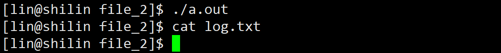

这是由于我们将**1号描述符重定向到磁盘文件后**，**缓冲区的刷新方式成为了全缓冲**。而我们写入的内容并没有填满整个缓冲区，导致并不会将缓冲区的内容刷新到磁盘文件中。怎么办呢？可以使用fflush强制刷新下缓冲区。

```c
#include <stdio.h>
#include <string.h>
#include <sys/types.h>
#include <sys/stat.h>
#include <fcntl.h>
#include <unistd.h>
int main() 
{
    close(1);
    int fd = open("log.txt", O_WRONLY | O_CREAT | O_TRUNC, 0666);
    if (fd < 0) {
        perror("open");
        return 0;
    }
    printf("hello world: %d\n", fd);
    fflush(stdout);  // 刷新缓冲区
    close(fd);
    return 0;
}
```

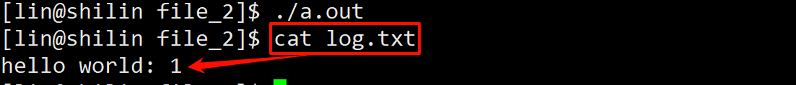

还有一种解决方法，刚好可以验证一下stderr是不带缓冲区的，代码如下：

```c
#include <stdio.h>
#include <string.h>
#include <sys/types.h>
#include <sys/stat.h>
#include <fcntl.h>
#include <unistd.h>
int main() 
{
    close(2);
    int fd = open("log.txt", O_WRONLY | O_CREAT | O_TRUNC, 0666);
    if (fd < 0) {
        perror("open");
        return 0;
    }
    
    perror("hello world");
    close(fd);
    return 0;
}
```

这种方式便可以将2号文件描述符重定向至文件，由于stderr没有缓冲区，“hello world”不用`fflash`就可以写入文件：


### 9.4 再次理解缓冲区
我们可以再次写下代码观察：

```c
#include <stdio.h>
#include <unistd.h>
#include <string.h>

int main()
{
    const char* s1 = "hello printf\n";
    printf(s1);
    const char* s2 = "hello fprintf\n";
    fprintf(stdout, s2);
    const char* s3 = "hello fwrite\n";
    fwrite(s3, strlen(s3), 1, stdout);

    const char* s4 = "hello write[syscall]\n";
    write(1, s4, strlen(s4));

    fork();

    return 0;
}
```

+ 分别执行了两次，一次是直接输出，第二次是重定向到了文件里，再查看文件里的内容

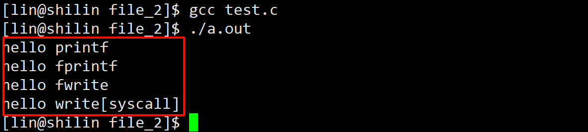

```shell
./a.out > log.txt
```

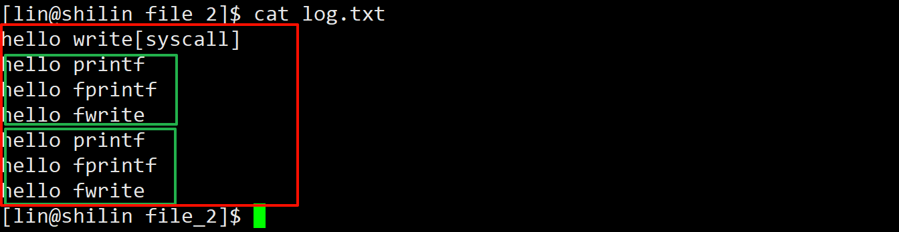

+ 我们发现了奇怪的一幕，为什么通过stdout向屏幕输出的内容在文件中显示了两次，而直接采用文件描述符的方式只有一次？

我们发现`printf`和`fwrite`（库函数）都输出了2次，而`write`只输出了一次（系统调用）。为什么呢？肯定和`fork`有关 。

1. 一般C库函数写入文件时是**全缓冲**的，而写入显示器是**行缓冲**
2. `printf` `fwrite` 库函数会自带缓冲区（进度条例子就可以说明），当发生重定向到普通文件时，数据的缓冲方式**由行缓冲变成了全缓冲**
3. 而我们放在缓冲区中的数据，就不会被立即刷新，**甚至fork之后**
4. 但是进程退出之后，会统一刷新，写入文件当中
5. 但是fork的时候，子进程继承下来父子的数据，所以当你父进程准备刷新的时候，本质上就是清空缓冲区，父子进程同时对一块缓冲区进行写，就会发生写时拷贝！所以子进程也就有了同样的一份数据，随即产生两份数据，而`write`没有变化，说明没有所谓的缓冲。

综上： `printf fwrite` 库函数会自带缓冲区，而 `write` 系统调用没有带缓冲区。另外，我们这里所说的缓冲区，都是**用户级缓冲区**。其实为了提升整机性能，OS也会提供相关**内核级缓冲区**。

那这个缓冲区谁提供呢？ `printf``fwrite`是库函数， `write`是系统调用，库函数在系统调用的“上层”， 是对系统调用的“封装”，但是write没有缓冲区，而 printf fwrite 有，足以说明，该缓冲区是二次加上的，又因为是C，所以由C标准库提供。

+ 其实缓冲区就在FILE结构体中

> FILE结构体的代码：`/usr/include/libio.h`
>

```c
struct _IO_FILE {
  int _flags;       /* High-order word is _IO_MAGIC; rest is flags. */
#define _IO_file_flags _flags

  /* The following pointers correspond to the C++ streambuf protocol. */
  /* Note:  Tk uses the _IO_read_ptr and _IO_read_end fields directly. */
  char* _IO_read_ptr;   /* Current read pointer */
  char* _IO_read_end;   /* End of get area. */
  char* _IO_read_base;  /* Start of putback+get area. */                                                                 
  char* _IO_write_base; /* Start of put area. */
  char* _IO_write_ptr;  /* Current put pointer. */
  char* _IO_write_end;  /* End of put area. */
  char* _IO_buf_base;   /* Start of reserve area. */
  char* _IO_buf_end;    /* End of reserve area. */
  /* The following fields are used to support backing up and undo. */
  char *_IO_save_base; /* Pointer to start of non-current get area. */
  char *_IO_backup_base;  /* Pointer to first valid character of backup area */
  char *_IO_save_end; /* Pointer to end of non-current get area. */

  struct _IO_marker *_markers;

  struct _IO_FILE *_chain;

  int _fileno; // 封装的文件描述符
#if 0
  int _blksize;
#else                                                                                                                    
  int _flags2;
#endif
  _IO_off_t _old_offset; /* This used to be _offset but it's too small.  */

#define __HAVE_COLUMN /* temporary */
  /* 1+column number of pbase(); 0 is unknown. */
  unsigned short _cur_column;
  signed char _vtable_offset;
  char _shortbuf[1];

  /*  char* _save_gptr;  char* _save_egptr; */

  _IO_lock_t *_lock;
#ifdef _IO_USE_OLD_IO_FILE
};
```

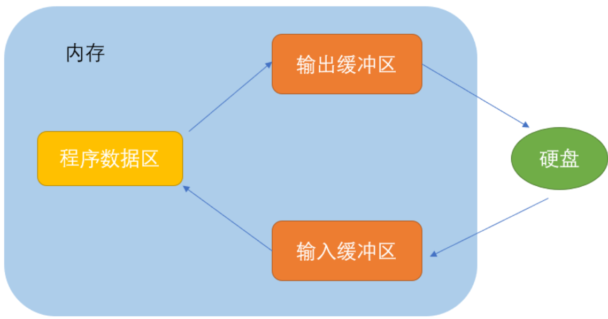

对于缓冲区的理解：

1. 用户级缓冲区
    1. 解耦
    2. 提高效率（提高使用者的效率，提高IO的效率）
2. 内核级缓冲区

是什么：缓冲区就是一段内存空间

为什么：为上层提高高效的IO体验，间接提高整体效率

怎么办？

> 刷新策略
>

1. 立即刷新(fflush(stdout)，int fsync(int fd))
2. 行刷新(显示器)
3. 全缓冲。（缓冲区写满，才刷新--->普通文件）

特殊情况

+ 进程退出，系统自动刷新
+ 强制刷新

> 内核策略并不关心用户
>

### 9.5 内核级缓冲区
**内核级缓冲区一般而言是全缓冲，单独的执行流，根据内存的使用情况来动态刷新，基本刷新条件不满足就刷新了**

我们也可以使用系统调用来强制让**内核级缓冲区**进行刷新

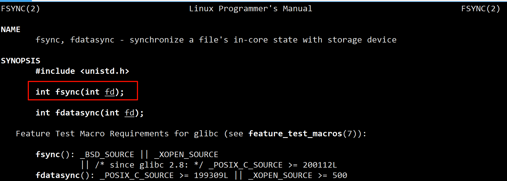

## 十、理解fd-->2（标准错误）
前面我们没有谈到2号描述符有什么作用，我们接下来就来谈一下

```c
int main()
{
    perror("error!!!!!!");// 打印错误信息
    fprintf(stdout, "hello fprintf stdout\n");
    fprintf(stderr, "hello fprintf stderr\n");
    fprintf(stdout, "hello fprintf stdout\n");
    fprintf(stderr, "hello fprintf stderr\n");
    fprintf(stdout, "hello fprintf stdout\n");
    fprintf(stderr, "hello fprintf stderr\n");
    fprintf(stdout, "hello fprintf stdout\n");
    fprintf(stderr, "hello fprintf stderr\n");
    fprintf(stdout, "hello fprintf stdout\n");
    fprintf(stderr, "hello fprintf stderr\n");
    fprintf(stdout, "hello fprintf stdout\n");
    fprintf(stderr, "hello fprintf stderr\n");
    return 0;
}
```

+ 观察到我们重定向的时候只将标准输出重定向到了文件中了，错误没有

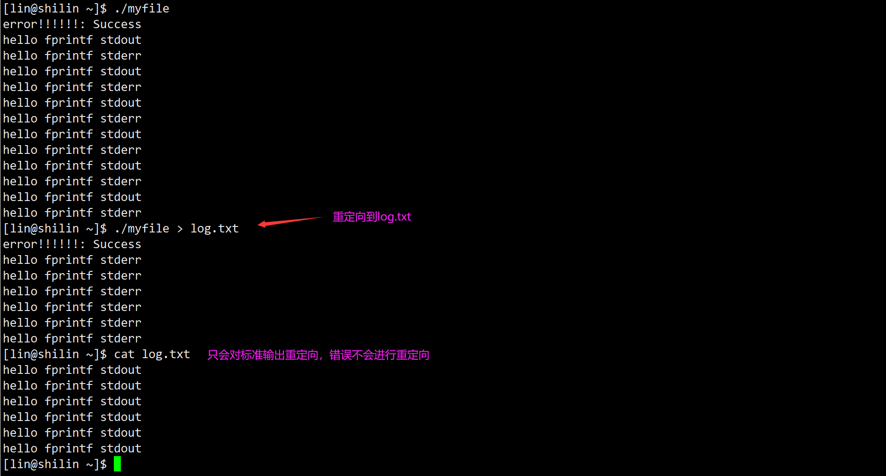

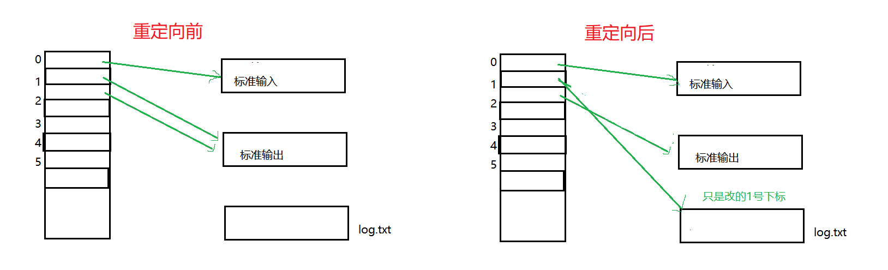

+ 那么我们想讲1和2分别重定向到一个文件中，一个为`ok.txt`一个为`err.txt`
1. 重定正确写法

```bash
./myfile 1>ok.txt
```

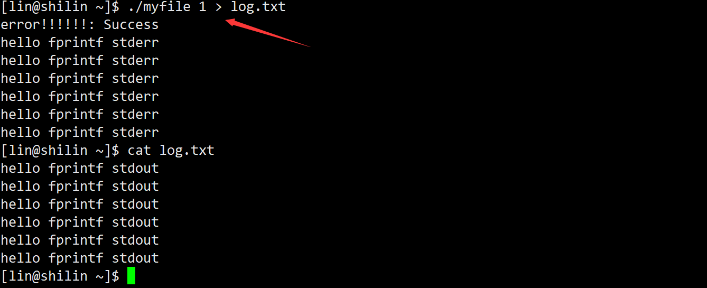

2. 分别重定向到两个文件

```bash
./myfile 1>ok.log  2>err.log
```

+ 将正确的和错误的分开了

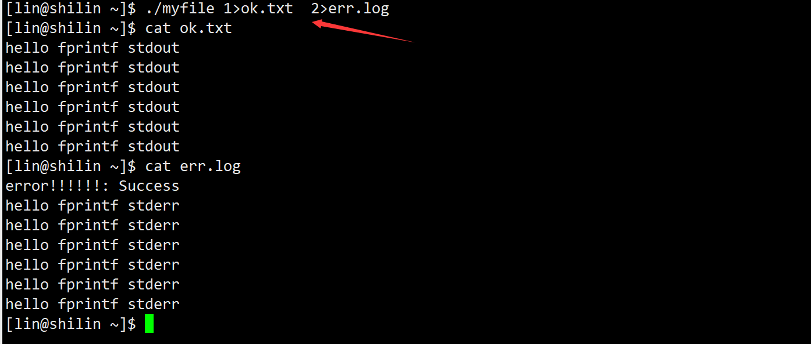

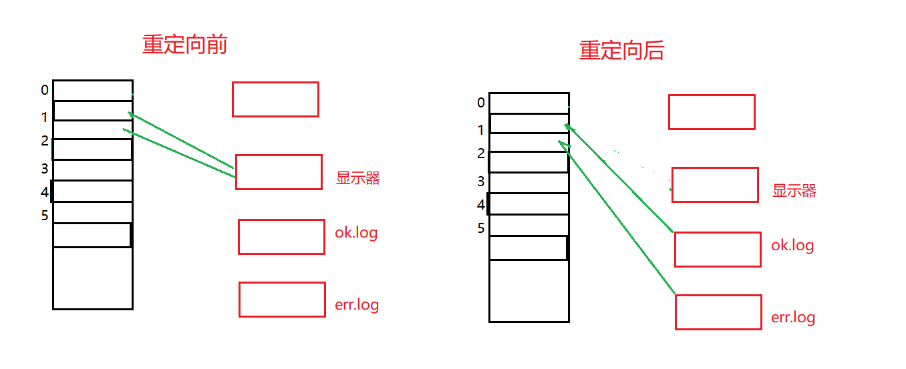

3. 那么我们可以将全部的信息重定向到一个文件中

```bash
./myfile 1>all.log 2>&1
```

+ 首先将`1`里面的内容变成`all.log`，然后再将这里的`2&1`也写到`2`里面

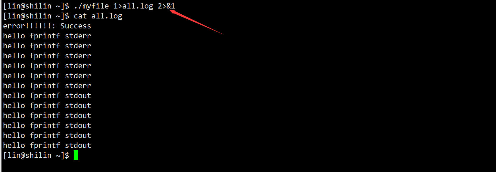

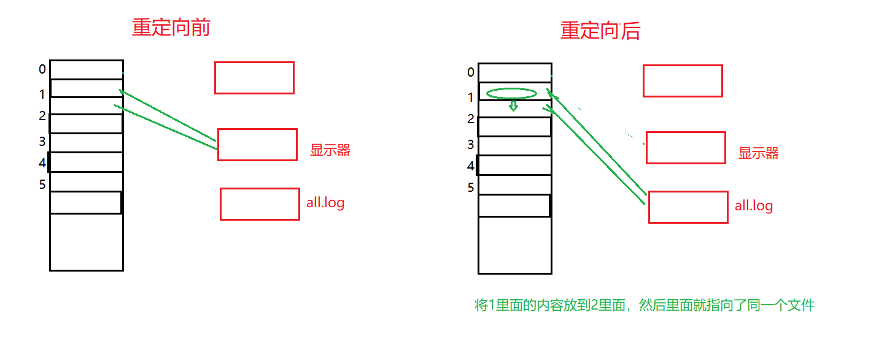

> 有这个标准错误就是为了能将正确信息和错误信息分开，方便我们`debug`
>

例如：

+ bash中，如果需要将脚本demo.sh的标准输出和标准错误输出重定向至文件demo.log，我们可以使用以下命令：

> 在命令的重定向中， >表示冲定性，0表示标准输入，1表示标准输出，2表示标准错误 
>
> 如果需要将标准输出和标准错误输出重定向至文件demo.log；
>
> 比较典型的方式是：bash demo.sh 1>demo.log 2>&1
>
> 先将标准输出重定向到demo.log文件，然后将标准错误重定向到标准输出（这时候的标准输出已经是指向文件了，所以也就是将标准错误重定向到文件）
>

1. bash demo.sh &>demo.log

> command &> file 表示将标准输出stdout和标准错误输出stderr重定向至指定的文件file中。
>

2. bash demo.sh >&demo.log

> 这个也与上面的一样
>

3. bash demo.sh >demo.log 2>&1

> 比较典型的写法，将标准输出和标准错误都重定向到文件， >demo.log是一种把前边的标准输出1忽略的写法
>

4. bash demo.sh 2>demo.log 1>demo.log

> 比较直观的一种写法，直观的将标准输入和标准错误分别重定向到文件
>

## 十一、封装一个简单的文件接口库
### myFile.h
```c
#ifndef __MYSTDIO_H__
#define __MYSTDIO_H__

#include <stdio.h>
#include <stdlib.h>
#include <string.h>
#include <sys/types.h>
#include <sys/stat.h>
#include <fcntl.h>
#include <unistd.h>

#define SIZE 1024
#define MODE 0666

// 缓冲区模式
enum FLUSH
{
    FLUSH_NONE,
    FLUSH_LINE,
    FLUSH_FULL,
    IS_FLUSH_FORCE,
    IS_FLUSH_NORMAL
};

typedef struct My_FILE
{
    int fileno;             // 文件描述符
    unsigned int flags;      // 缓冲区模式 
    char cache[SIZE];
    int cap;               // 容量
    int curr;              // 当前位置
} myFILE;

// 打开文件
myFILE* my_fopen(const char* filename, const char* mode);

// 刷新缓冲区
void my_fflush(myFILE* fp);
// 写
ssize_t my_write(const char* s, int size, myFILE* fp);

// 关闭文件
void my_close(myFILE* fp);

#endif
```

### myFile.c
```c
#include "myFile.h"

myFILE* my_fopen(const char* filename, const char* mode)
{
    int flag = 0;
    int iscreate = 0;
    if(strcmp(mode, "r") == 0)
    {
        flag = (O_RDONLY);
    }
    else if(strcmp(mode, "w") == 0)
    {
        flag = (O_WRONLY | O_CREAT | O_TRUNC);
        iscreate = 1;
    }
    else if(strcmp(mode, "a") == 0)
    {
        flag = (O_WRONLY | O_CREAT | O_APPEND);
        iscreate = 1;
    }
    else
    {}

    int fd = 0;
    if(iscreate)
        fd = open(filename, flag, MODE);
    else
        fd = open(filename, flag);

    if(fd < 0)
        return NULL;
    // 创建FILE
    myFILE* fp = (myFILE*)malloc(sizeof(myFILE)); 
    if(!fp) return NULL; 

    fp->fileno = fd;
    fp->flags = FLUSH_LINE;
    fp->curr = 0;
    fp->cap = SIZE;
    
    return fp;
}

static void my_fflush_core(myFILE* fp, int is_flush)
{
    if(fp->curr < 0)
        return;
    // 强制刷新
    if(is_flush == IS_FLUSH_FORCE)
    {
        write(fp->fileno, fp->cache, fp->curr);
        fp->curr = 0;
    }
    else 
    {
        if(fp->flags == FLUSH_LINE && fp->cache[fp->curr - 1] == '\n')
        {
            write(fp->fileno, fp->cache, fp->curr);
            fp->curr = 0;
        }
        else if(fp->flags == FLUSH_FULL && fp->curr == fp->cap)
        {
            write(fp->fileno, fp->cache, fp->curr);
            fp->curr = 0;
        }
        else 
        {}
    }
}

void my_fflush(myFILE* fp)
{
    my_fflush_core(fp, IS_FLUSH_FORCE);
}

ssize_t my_write(const char* s, int size, myFILE* fp)
{
    memcpy(fp->cache + fp->curr, s, size);
    fp->curr += size;
    my_fflush_core(fp, IS_FLUSH_NORMAL);
    return size;
}

void my_close(myFILE* fp)
{
    if(fp->fileno >= 0)
    {
        my_fflush(fp);
        fsync(fp->fileno);
        close(fp->fileno);
        free(fp);
    }
}
```

### main.c
```c
#include "myFile.h"

int main()
{
    myFILE *fp = my_fopen("log.txt", "w");
    if(!fp) return 1;
    
    char buffer[128];
    const char* s = "hello Linux";
    int cnt = 10;
    while(cnt--)
    {
        snprintf(buffer, sizeof(buffer),"%s:%d\n", s, cnt);
// #define DEBUG
#ifdef DEBUG
        printf("%s", buffer);
        sleep(1);
#endif
        my_write(buffer, strlen(buffer), fp);
    }
    my_close(fp);
    return 0;
}
```

