# Linux文件系统
# 文件背景知识
+ 在我们平时学习Linux系统的时候，我们都知道在语言级，系统级，Linux一切皆文件，我们所操作的都是被打开的文件
+ 其本质上是：**一个文件被加载到系统当中，操作系统就把该文件管理起来了。**
+ 那么我们没有被打开的文件在哪呢？--->**磁盘**

# 磁盘文件
操作系统作为管理者，硬盘级文件没有被打开，就是由系统在磁盘上统一管理的。

+ 单个文件角度：这个文件在哪里，这个文件多大，这个文件的其他属性是什么?
+ 在系统角度：一共有多少个文件？各自属性在哪里，如何快速找到，还可以存储多少个文件？如何让快速找到指定的文件等等，对于这一系列问题，可以转化成 如何对磁盘文件进行分门别类的存储，以便更好地进行存储。

## 磁盘物理结构
+ 内存：掉电易失存储介质
+ 磁盘：永久性存储介质  (还有SSD,U盘，光盘，磁带等)
+ 磁盘是一个外设 + 计算机中唯一的机械设备。磁盘结构：磁盘盘片、磁头、伺服系统、音圈马达……

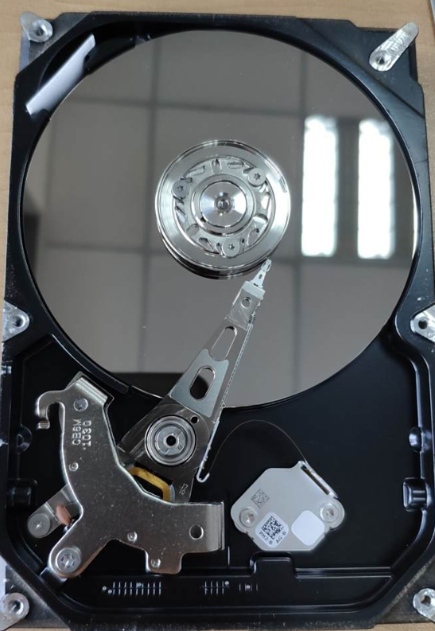


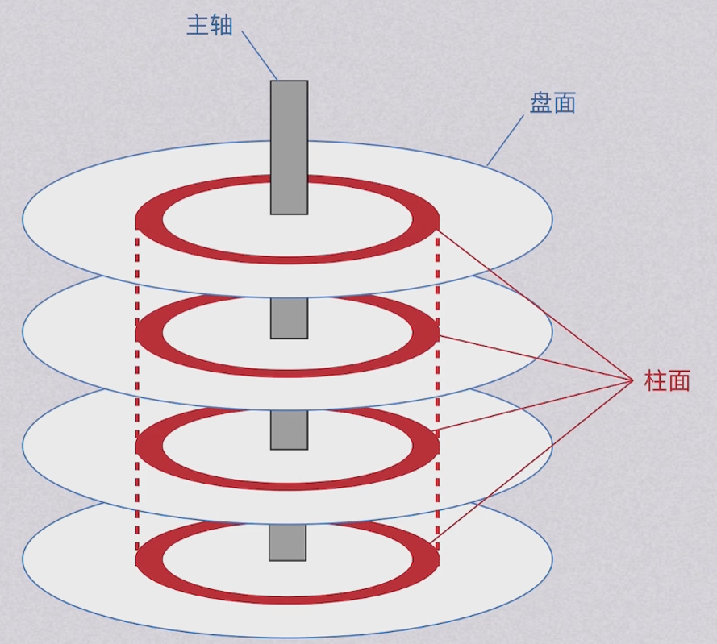

+ 其中，大多数**盘面是多层结构的**，两面可读写数据

## 磁盘存储结构
磁盘所采用的是[CHS](https://baike.baidu.com/item/CHS/3794705?fr=ge_ala)：Cylinder Head Sector的简称，是FDISK在分区期间所需磁盘信息。

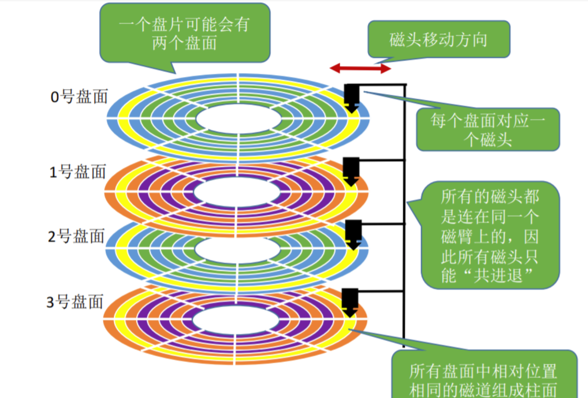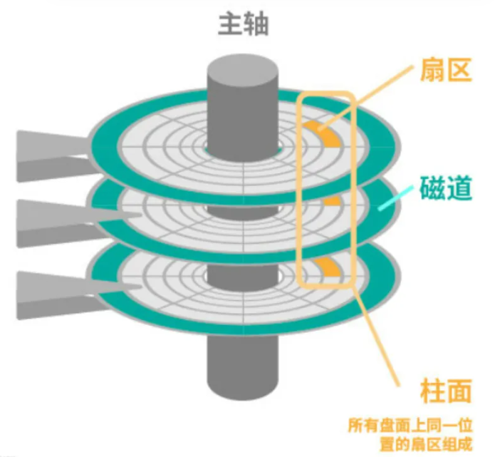

可以使用CHS定址法来找到一个指定位置的扇区

+ 首先找到指定的磁头（header）
+ 再找到指定的磁道（柱面）（cylinder）
+ 最后定位指定的扇区（sector）

文件本质上就是在磁盘中占有几个扇区的的问题

## CHS地址定位
扇区是从磁盘读出和写入信息的最小单位，通常大小为`512`字节。

> 磁头（head）数：每个盘片一般有上下两面，分别对应1个磁头，共2个磁头
>
> 磁道（track）数：磁道是从盘片外圈往内圈编号0磁道，1磁道...，靠近主轴的同心圆用于停靠磁头，不存储数据
>
> 柱面（cylinder）数：磁道构成柱面，数量上等同于磁道个数
>
> 扇区（sector）数：每个磁道都被切分成很多扇形区域，每道的扇区数量相同
>
> 圆盘（platter）数：就是盘片的数量
>

磁盘容量 = **磁头数 × 磁道(柱面)数 × 每道扇区数 × 每扇区字节数**

**传动臂上的磁头是共进退的，是以柱面进行抽象的**

**柱面是一个逻辑上的概念，其实就是每一面上，相同半径的磁道逻辑上构成柱面。**


柱面（cylinder），磁头（head），扇区（sector），显然可以定位数据了，这就是数据定位(寻址)方式之一--->`CHS寻址方式`。

**CHS寻址**对早期的磁盘非常有效，知道用哪个磁头，读取哪个柱面上的第几扇区就可以读到数据了。但是CHS模式支持的硬盘容量有限，因为系统用8bit来存储磁头地址，用10bit来存储柱面地址，用6bit来存储扇区地址，而一个扇区共有512Byte，这样使用CHS寻址一块硬盘最大容量为256 * 1024 * 63 * 512B = 8064 MB(1MB = 1048576B)（若按1MB=1000000B来算就是8.4GB）

## 对磁盘的存储进行逻辑抽象
+ 为什么操作系统要用**CHS**，耦合度太高，**为了方便实现内核磁盘管理。**

磁盘的盘面结构（圆形结构）-> 磁带的线性结构。我们可以将磁盘盘面根据磁带的原理拉伸成一个数组，磁盘的扇区是存储数据的基本单位。

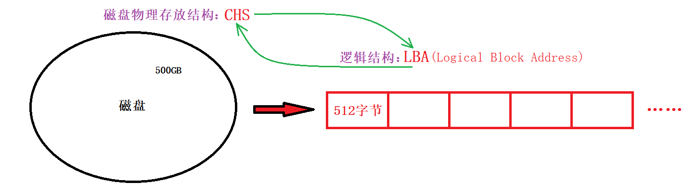

操作系统就需要对500G的磁盘进行管理，但是500G的数据量是巨大的，如果整体管理就是低效的。操作系统采取的是**分治**的方式，对磁盘的管理 **--->** 对一个小分区的管理。

逻辑结构


再将这几个区再次进行细分：

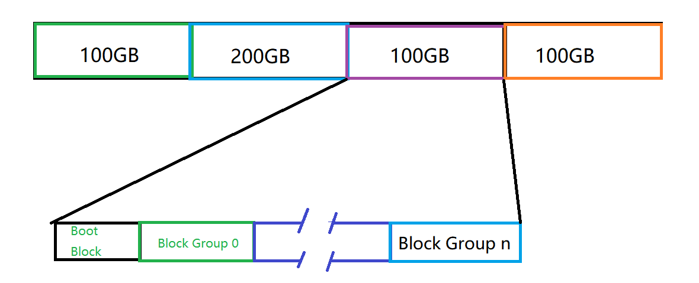

+ 所以只要管理好一组，就能管理好每一个组
+ 此时划分后的每一块叫做块组。每个块组的结构又如下：

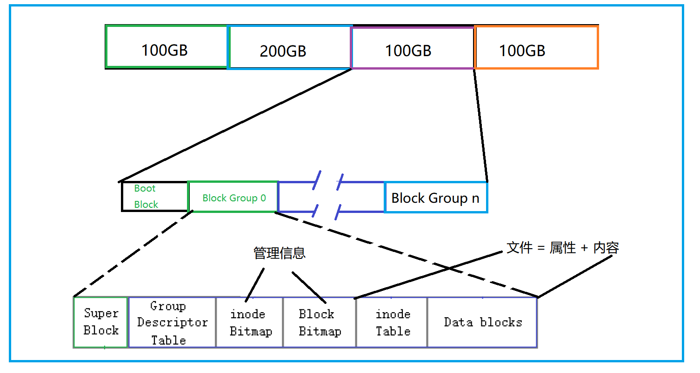

**其实Linux在磁盘上存储文件的时候，将内容和属性是分开存储的**

## 磁盘的真实情况
> 磁道：
>

某一盘面的某一个磁道展开：


即：一维数组

> 柱面：
>

整个磁盘所有盘面的同一个磁道，即柱面展开：

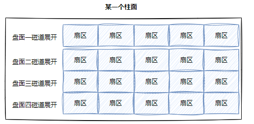

柱面上的每个磁道，扇区个数是一样的，即二维数组

> 整盘：
>

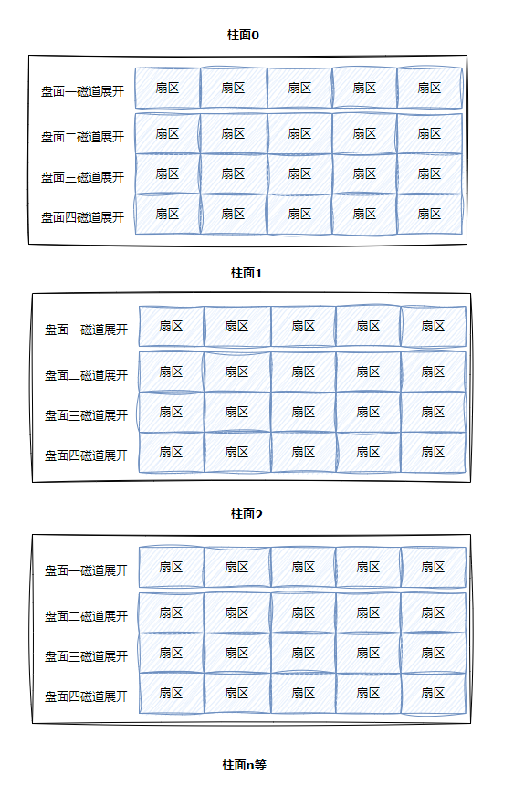

整个磁盘不就是多张二维的扇区数组表（三维数组？）

所有，寻址一个扇区：先找到哪一个柱面(Cylinder) ,在确定柱面内哪一个磁道(其实就是磁头位置，Head)，在确定扇区（Sector），所以就有了CHS。

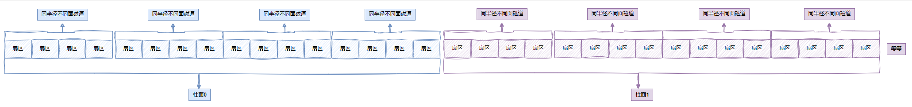

所以，每一个扇区都有一个下标，我们叫做LBA(Logical Block Address)地址,其实就是线性地址。所以怎么计算得到这个LBA地址呢？

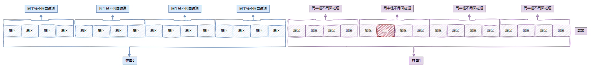

LBA，1000，CHS 必须要！ LBA地址转成CHS地址，CHS如何转换成为LBA地址。

OS只需要使用LBA就可以了！！LBA地址转成CHS地址，CHS如何转换成为LBA地址。磁盘自己来做转换！固件(硬件电路，伺服系统)

## CHS && LBA地址
**CHS转成LBA**：

+ 磁头数*每磁道扇区数 = 单个柱面的扇区总数
+ LBA = 柱面号C*单个柱面的扇区总数 + 磁头号H*每磁道扇区数 + 扇区号S - 1
+ 即：LBA = 柱面号C*(磁头数*每磁道扇区数) + 磁头号H*每磁道扇区数 + 扇区号S - 1
+ 扇区号通常是从1开始的，而在LBA中，地址是从0开始的
+ 柱面和磁道都是从0开始编号的
+ 总柱面，磁道个数，扇区总数等信息，在磁盘内部会自动维护，上层开机的时候，会获取到这些参数。

**LBA转成CHS**：

+ 柱面号C = LBA // (磁头数*每磁道扇区数)【就是单个柱面的扇区总数】
+ 磁头号H = (LBA % (磁头数*每磁道扇区数)) // 每磁道扇区数
+ 扇区号S = (LBA % 每磁道扇区数) + 1
+ "//": 表示除取整

在磁盘使用者看来，根本就不关心**CHS**地址，而是直接使用**LBA**地址，磁盘内部自己转换

磁盘就是一个元素为扇区的一维数组，数组的下标就是每一个扇区的LBA地址。OS使用磁盘，就可以用一个数字访问磁盘扇区了。

# 文件系统
其实硬盘是典型的“块”设备，操作系统读取硬盘数据的时候，其实是不会一个个扇区地读取，这样效率太低，而是一次性连续读取多个扇区，即一次性读取一个”块”（block）。

硬盘的每个分区是被划分为一个个的”块”。一个”块”的大小是由格式化的时候确定的，并且不可以更改，最常见的是4KB，即连续八个扇区组成一个 ”块”。”块”是文件存取的最小单位。

注意：

磁盘就是一个三维数组，我们把它看待成为一个"一维数组"，数组下标就是LBA，每个元素都是扇区

+ 每个扇区都有LBA，那么8个扇区一个块，每一个块的地址我们也能算出来。
+ 知道LBA：块号 = LBA/8
+ 知道块号：LAB=块号*8 + n. (n是块内第几个扇区)

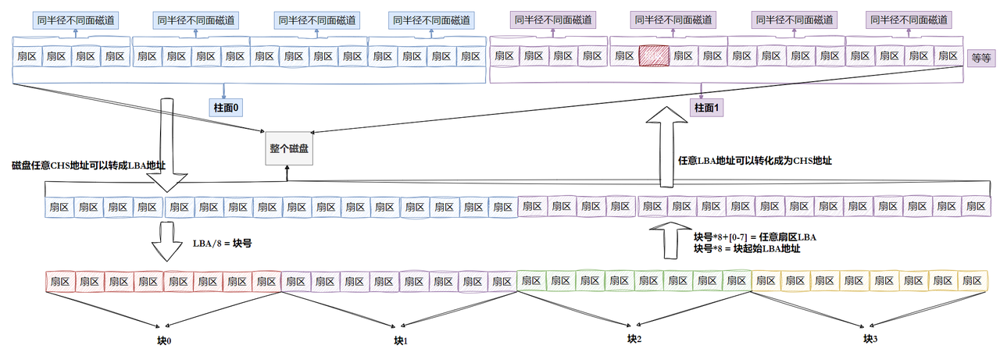

# 分区
其实磁盘是可以被分成多个分区（partition）的，以Windows观点来看，你可能会有一块磁盘并且将它分区成C,D,E盘。那个C,D,E就是分区。分区从实质上说就是对硬盘的一种格式化。但是Linux的设备都是以文件形式存在，那是怎么分区的呢？

柱面是分区的最小单位，我们可以利用参考柱面号码的方式来进行分区，其本质就是设置每个区的起始柱面和结束柱面号码。 此时我们可以将硬盘上的柱面（分区）进行平铺，将其想象成一个大的平面，如下图所示：


注意：

柱面大小一致，扇区个位一致，那么其实只要知道每个分区的起始和结束柱面号，知道每一个柱面多少个扇区，那么该分区多大，其实和解释LBA是多少也就清楚了。

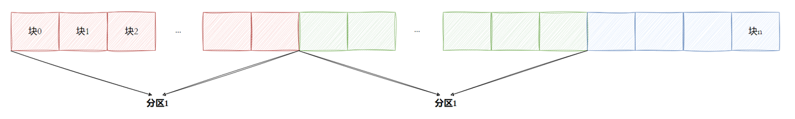

# ext2文件系统
我们想要在硬盘上储文件，必须先把硬盘格式化为某种格式的文件系统，才能存储文件。文件系统的目的就是组织和管理硬盘中的文件

ext2文件系统将整个分区划分成若干个同样大小的块组 (Block Group)，只要能管理一个分区就能管理所有分区，也就能管理所有磁盘文件。

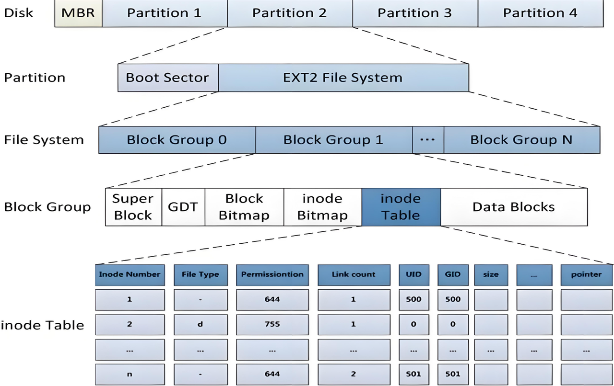

上图中启动块（Boot Block/Sector）的大小是确定的，为1KB，由PC标准规定，用来存储磁盘分区信息和启动信息，任何文件系统都不能修改启动块。启动块之后才是ext2文件系统的开始。

## 块组内部构成
### Super block
超级块（Super Block）是磁盘块组中的一个特殊数据结构，包含了文件系统的元数据信息，让操作系统能够理解和操作文件系统。它记录了文件系统的整体信息，包括文件系统的类型、大小、块位图和inode位图的位置等重要信息。

超级块通常是**每隔几个分组有一个**，它在文件系统格式化时被创建并初始化。超级块记录了文件系统的整体信息，以便操作系统可以理解和操作文件系统。

```c
struct ext2_super_block {
	__le32	s_inodes_count;		/* Inodes count */
	__le32	s_blocks_count;		/* Blocks count */
	__le32	s_r_blocks_count;	/* Reserved blocks count */
	__le32	s_free_blocks_count;	/* Free blocks count */
	__le32	s_free_inodes_count;	/* Free inodes count */
	__le32	s_first_data_block;	/* First Data Block */
	__le32	s_log_block_size;	/* Block size */
	__le32	s_log_frag_size;	/* Fragment size */
	__le32	s_blocks_per_group;	/* # Blocks per group */
	__le32	s_frags_per_group;	/* # Fragments per group */
	__le32	s_inodes_per_group;	/* # Inodes per group */
	__le32	s_mtime;		/* Mount time */
	__le32	s_wtime;		/* Write time */
	__le16	s_mnt_count;		/* Mount count */
	__le16	s_max_mnt_count;	/* Maximal mount count */
	__le16	s_magic;		/* Magic signature */
	__le16	s_state;		/* File system state */
	__le16	s_errors;		/* Behaviour when detecting errors */
	__le16	s_minor_rev_level; 	/* minor revision level */
	__le32	s_lastcheck;		/* time of last check */
	__le32	s_checkinterval;	/* max. time between checks */
	__le32	s_creator_os;		/* OS */
	__le32	s_rev_level;		/* Revision level */
	__le16	s_def_resuid;		/* Default uid for reserved blocks */
	__le16	s_def_resgid;		/* Default gid for reserved blocks */
	/*
	 * These fields are for EXT2_DYNAMIC_REV superblocks only.
	 *
	 * Note: the difference between the compatible feature set and
	 * the incompatible feature set is that if there is a bit set
	 * in the incompatible feature set that the kernel doesn't
	 * know about, it should refuse to mount the filesystem.
	 * 
	 * e2fsck's requirements are more strict; if it doesn't know
	 * about a feature in either the compatible or incompatible
	 * feature set, it must abort and not try to meddle with
	 * things it doesn't understand...
	 */
	__le32	s_first_ino; 		/* First non-reserved inode */
	__le16   s_inode_size; 		/* size of inode structure */
	__le16	s_block_group_nr; 	/* block group # of this superblock */
	__le32	s_feature_compat; 	/* compatible feature set */
	__le32	s_feature_incompat; 	/* incompatible feature set */
	__le32	s_feature_ro_compat; 	/* readonly-compatible feature set */
	__u8	s_uuid[16];		/* 128-bit uuid for volume */
	char	s_volume_name[16]; 	/* volume name */
	char	s_last_mounted[64]; 	/* directory where last mounted */
	__le32	s_algorithm_usage_bitmap; /* For compression */
	/*
	 * Performance hints.  Directory preallocation should only
	 * happen if the EXT2_COMPAT_PREALLOC flag is on.
	 */
	__u8	s_prealloc_blocks;	/* Nr of blocks to try to preallocate*/
	__u8	s_prealloc_dir_blocks;	/* Nr to preallocate for dirs */
	__u16	s_padding1;
	/*
	 * Journaling support valid if EXT3_FEATURE_COMPAT_HAS_JOURNAL set.
	 */
	__u8	s_journal_uuid[16];	/* uuid of journal superblock */
	__u32	s_journal_inum;		/* inode number of journal file */
	__u32	s_journal_dev;		/* device number of journal file */
	__u32	s_last_orphan;		/* start of list of inodes to delete */
	__u32	s_hash_seed[4];		/* HTREE hash seed */
	__u8	s_def_hash_version;	/* Default hash version to use */
	__u8	s_reserved_char_pad;
	__u16	s_reserved_word_pad;
	__le32	s_default_mount_opts;
 	__le32	s_first_meta_bg; 	/* First metablock block group */
	__u32	s_reserved[190];	/* Padding to the end of the block */
};
```

### Group Descriptor Table
Group Descriptor Table(GDT)叫做块组描述符.

它用来记录这个块组多大，已经使用了多少，有多少个inode，已经占用了多少，还剩多少，一共有多少个block，使用了多少...等等

通过将整个磁盘划分为：**大分区  ->  小分区  ->  Boot Block + n个块组  ->  块组  ->  6个区域。通过此方式，将快组分割成如此，并且写入相关的管理数据  ->  每一个块组都这么干  ->  整个分区就被写入了文件系统信息（格式化）。**

> 一个文件只能有一个inode，和一个inode编号。
>

我们知道，DataBlocks中是通过每个block存储内容的，那么一个文件可以有多个block吗？答案是肯定可以的，如果只有一个的话，那么每个文件只能存储4KB大小，这也不切合实际。

在文件属性inode中，会有文件的各种属性，其中就包括了一个**blocks数组**，里面保存了每个block的位置.

+ 对于数据量小的文件：

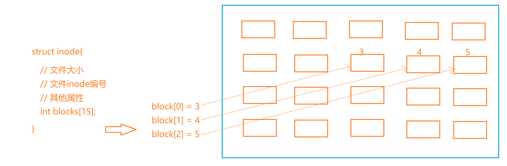

> 那么如果一个文件特别大，有很多block，blocks数组容不下了，此时如何找到每个block呢？
>

+ 其实我们要知道，一个block块里不仅可以存储文件内容，也可以存储其**它块的块号**！
+ 比如blocks[在文件属性inode中]只有15个元素大小，我们可以前12个对应的block[磁盘结构中]存储文件内容（直接映射），后3个对应的block存储的其它block的位置（间接）。
+ 一个block是4KB=4096字节大小，存储一个位置只需要4/8字节(32/64位平台)，这样**一个block就可以存储1000个其它block的位置**，如果还是不够，可以取前**997个**存储内容，后3个存储block的位置，以此类推...

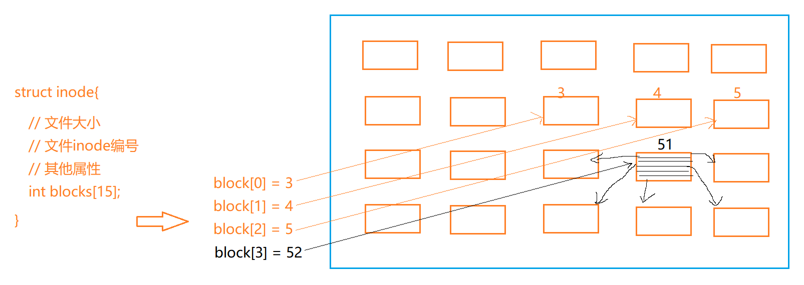

```c
/*
 * Structure of a blocks group descriptor
 */
struct ext2_group_desc
{
	__le32	bg_block_bitmap;		/* Blocks bitmap block */
	__le32	bg_inode_bitmap;		/* Inodes bitmap block */
	__le32	bg_inode_table;		/* Inodes table block */
	__le16	bg_free_blocks_count;	/* Free blocks count */
	__le16	bg_free_inodes_count;	/* Free inodes count */
	__le16	bg_used_dirs_count;	/* Directories count */
	__le16	bg_pad;
	__le32	bg_reserved[3];
};
```

### BlcokBitmap
- 回想刚才的data blocks，有那么多的block，我们怎么知道哪一个被占用，哪一个没有被占用呢？

这个时候便用到了**BlockBitmap**，它的内部是一个**位图**，它的每一个比特位和特定的block是一一对应的，对应的bit位位1， 表示该block已经被占用，否则表示空闲可用。

通过块位图，操作系统可以快速了解文件系统上哪些块是可用的，从而进行块的分配和释放。当需要分配一个块给新的文件或目录时，操作系统会查找位图中的空闲位，并将其设置为已分配状态，然后返回该块的地址给请求的进程。

### inode Bitmap
+ 有那么多的inode，怎么标识哪个被占用，哪个没有被占用呢？还是用inode Bitmap

它的内部也是一个位图，每一个比特位和特定的inode是一一对应的，如果该比特位为1，说明该inode已经被占用，否则表示空闲可用。

假设有10000+的inode，那么就有10000+的比特位，分别一一对应，然后用0和1表示未被占用和已占用的两种状态.

```c
struct inode {
	struct hlist_node	i_hash;
	struct list_head	i_list;
	struct list_head	i_sb_list;
	struct list_head	i_dentry;
	unsigned long		i_ino;
	atomic_t		i_count;
	umode_t			i_mode;
	unsigned int		i_nlink;
	uid_t			i_uid;
	gid_t			i_gid;
	dev_t			i_rdev;
	loff_t			i_size;
	struct timespec		i_atime;
	struct timespec		i_mtime;
	struct timespec		i_ctime;
	unsigned int		i_blkbits;
	unsigned long		i_blksize;
	unsigned long		i_version;
	blkcnt_t		i_blocks;
	unsigned short          i_bytes;
	spinlock_t		i_lock;	/* i_blocks, i_bytes, maybe i_size */
	struct mutex		i_mutex;
	struct rw_semaphore	i_alloc_sem;
	struct inode_operations	*i_op;
	const struct file_operations	*i_fop;	/* former ->i_op->default_file_ops */
	struct super_block	*i_sb;
	struct file_lock	*i_flock;
	struct address_space	*i_mapping;
	struct address_space	i_data;
#ifdef CONFIG_QUOTA
	struct dquot		*i_dquot[MAXQUOTAS];
#endif
	/* These three should probably be a union */
	struct list_head	i_devices;
	struct pipe_inode_info	*i_pipe;
	struct block_device	*i_bdev;
	struct cdev		*i_cdev;
	int			i_cindex;

	__u32			i_generation;

#ifdef CONFIG_DNOTIFY
	unsigned long		i_dnotify_mask; /* Directory notify events */
	struct dnotify_struct	*i_dnotify; /* for directory notifications */
#endif

#ifdef CONFIG_INOTIFY
	struct list_head	inotify_watches; /* watches on this inode */
	struct mutex		inotify_mutex;	/* protects the watches list */
#endif

	unsigned long		i_state;
	unsigned long		dirtied_when;	/* jiffies of first dirtying */

	unsigned int		i_flags;

	atomic_t		i_writecount;
	void			*i_security;
	union {
		void		*generic_ip;
	} u;
#ifdef __NEED_I_SIZE_ORDERED
	seqcount_t		i_size_seqcount;
#endif
};
```

### Inode Table
> inode是一个**大小为128**字节的空间，保存的是对应特定文件的属性，该块组内，所有文件的inode空间的集合，需要标识唯一性，每一个inode块，都要有一个inode编号。一般而言一个文件，一个**inode**，一个**inode编号**。inode编号以分区为单位，整体划分，不可跨分区。
>

+ 可以使用`ls -li`来查看**inode**编号

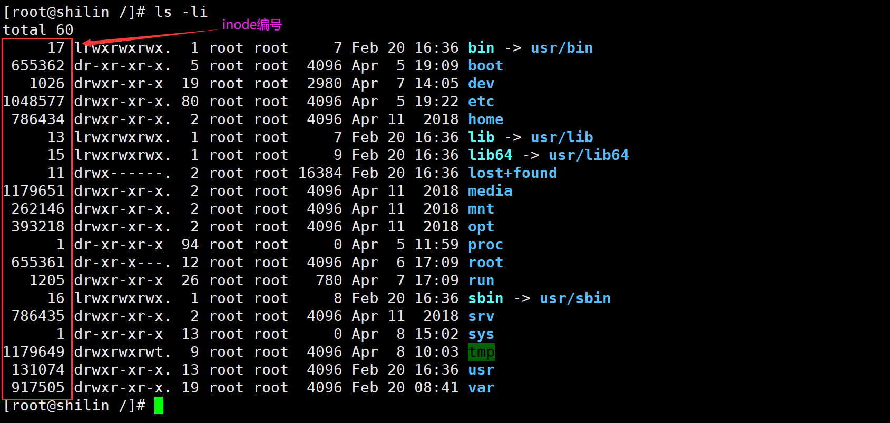

相对应的，**文件的属性与内容是分开管理的**，并且一个块组内的为文件个数也是很多的，因此对于文件的属性与内容我们也需要进行管理。此处的管理方式**是位图**。

### Data blocks
+ 磁盘的基本单位是扇区(512字节)，但是操作系统(文件系统)和磁盘进行IO的基本单位是**4KB**(8*512字节).
+ 就算OS想从磁盘中读取一个字节的数据，那么最少也必须读取4KB的数据。至于为什么是4KB，这是经过一些科学的计算最终得出的结论，4KB是最合适的。

如果使用512KB，可能会进行更多次数的IO，造成效率降低，而且如果操作系统使用和磁盘一样的大小，万一磁盘基本大小变化了，OS的源代码也需要改变，所以OS有自己一套的规定，这样就完成了软件和硬件的解耦。

+ 操作系统与磁盘 IO的基本单位是4KB，这也**是一个block大小**，所以磁盘也一般叫做**块设备**。

**所以Data blocks可以理解为：**

1. 多个4KB(8*扇区)大小的集合。
2. **Data blocks里保存的都是特定文件的内容**
3. Block 号按照分区划分，不可跨分区

### Boot Block
一个分区有一个启动块，开机的属性信息等，每个分区可能存在一份，主要是为了备份，有时候计算机有可能无法成功启动。windows说要不要恢复，也就是可能其中的一个分区的启动块出问题了，恢复也就是找其他分区的启动块，将数据备份一份过去。

## 文件名和inode编号
找到文件：先找到文件inode编号 ---> 找到分区特定的blcok group ---> 找到inode --->相当于知道了属性 --->根据属性便可以找到文件内容。

> 可问题是我们怎么知道inode编号呢？我们平时用的都是文件名进行操作，比如创建或删除等，所以我们此时需要弄清楚文件名和inode编号之间的关系。
>

+ **linux中，inode属性里面，没有文件名这一说法！只根据inode编号辨识文件**

> 有下面两种场景：
>

1. 在同一个目录下，可以保存很多的文件，但是文件名不能重复.
2. 目录是文件，也有自己的inode，也有自己的data block，但问题是目录data block里面存储的是什么呢？

> 虽然说linux下是按inode编号来识别文件的，但是我们看到就是文件名啊，这些文件名也一定是被管理的。
>

这里直接说结论： 目录里的data block存储的是`inode 编号` 和`文件名的映射关系`**。**

### inode和datablock映射
inode内部存在`__le32 i_block[EXT2_N_BLOCKS];/* Pointers to blocks */`,`EXT2_N_BLOCKS =15`,就是用来进行inode和block映射的

```c
struct ext2_inode {
	__le16	i_mode;		/* File mode */
	__le16	i_uid;		/* Low 16 bits of Owner Uid */
	__le32	i_size;		/* Size in bytes */
	__le32	i_atime;	/* Access time */
	__le32	i_ctime;	/* Creation time */
	__le32	i_mtime;	/* Modification time */
	__le32	i_dtime;	/* Deletion Time */
	__le16	i_gid;		/* Low 16 bits of Group Id */
	__le16	i_links_count;	/* Links count */
	__le32	i_blocks;	/* Blocks count */
	__le32	i_flags;	/* File flags */
	union {
		struct {
			__le32  l_i_reserved1;
		} linux1;
		struct {
			__le32  h_i_translator;
		} hurd1;
		struct {
			__le32  m_i_reserved1;
		} masix1;
	} osd1;				/* OS dependent 1 */
	__le32	i_block[EXT2_N_BLOCKS];/* Pointers to blocks */
	__le32	i_generation;	/* File version (for NFS) */
	__le32	i_file_acl;	/* File ACL */
	__le32	i_dir_acl;	/* Directory ACL */
	__le32	i_faddr;	/* Fragment address */
	union {
		struct {
			__u8	l_i_frag;	/* Fragment number */
			__u8	l_i_fsize;	/* Fragment size */
			__u16	i_pad1;
			__le16	l_i_uid_high;	/* these 2 fields    */
			__le16	l_i_gid_high;	/* were reserved2[0] */
			__u32	l_i_reserved2;
		} linux2;
		struct {
			__u8	h_i_frag;	/* Fragment number */
			__u8	h_i_fsize;	/* Fragment size */
			__le16	h_i_mode_high;
			__le16	h_i_uid_high;
			__le16	h_i_gid_high;
			__le32	h_i_author;
		} hurd2;
		struct {
			__u8	m_i_frag;	/* Fragment number */
			__u8	m_i_fsize;	/* Fragment size */
			__u16	m_pad1;
			__u32	m_i_reserved2[2];
		} masix2;
	} osd2;				/* OS dependent 2 */
};
```

**其中：**`EXT2_N_BLOCKS`**也就是15**

```c
/*
 * Constants relative to the data blocks
 */
#define	EXT2_NDIR_BLOCKS		12
#define	EXT2_IND_BLOCK			EXT2_NDIR_BLOCKS
#define	EXT2_DIND_BLOCK			(EXT2_IND_BLOCK + 1)
#define	EXT2_TIND_BLOCK			(EXT2_DIND_BLOCK + 1)
#define	EXT2_N_BLOCKS			(EXT2_TIND_BLOCK + 1)
```

---

+ 它们互为key值的，也就是说即可用inode编号做key值，也可以用文件名做key值.

这也可以理解为什么创建文件，需要目录有写权限，因为目录保存的是文件名与 inode编号映射关系，只有目录有了写权限，才能将这个映射关系写到磁盘，才能创建成功.

回想对于目录的权限操作：

进入文件需要**x（可执行）权限**。

创建文件需要**w（可写）权限**。

+ 因为，需要将文件名与inode编号的映射关系写入到目录的data block中。

显示文件名与属性**需要r（可读）** 权限。

+ 因为，需要显示文件名，但是文件名存储在目录中，需要文件名就需要在目录中查找；显示文件属性，就需要查找到文件，就需要依托于目录中文件名与inode编号的映射关系。

正是因为，查找inode编号是依托于**目录结构**，所以Linux下查找文件需要绝对路径或相对路径。

### 创建文件
通过我们传入的路径，找到对应的分区、块组，然后在该块组内通过对**inode Bitmap**的遍历，查找0的同时，使用计数器计算inode编号。以**inode Bitmap**中0说所对应的位置开辟inode，将属性存储，再根据文件内容，调整其中的block数组（如果没数据就清空，有数据根据Black Bitmap分配Data block）。至此文件系统将空间分配，相关数据存储并给出了新建文件的inode编号。再根据该文件处于的目录名，找到目录的inode属性信息，再以属性信息找到目录对应的Data black将用户给予的文件名与文件系统给予的inode标号，存储构建映射。

以目录的文件名，找到目录相关数据：Linux内核中会将常用的目录结构构建成一颗树，其内部帮我们构建了文件名与其目录的inode编号的映射关系。本质上：也就是只要你拿到了文件名它的inode，最后就能通过文件目录找到目录的inode，进而找到目录的data block将新建的文件名与其inode标号写进去。

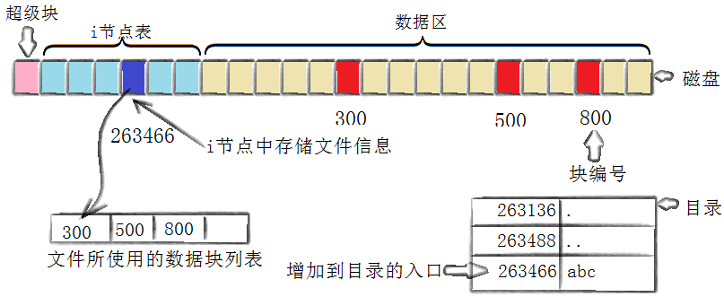

> 创建一个新文件主要有以下4个操作：
>

1. 存储属性
  内核先找到一个空闲的inode节点（这里是263466）。内核把文件信息记录到其中。

2. 存储数据
  该文件需要存储在三个磁盘块，内核找到了三个空闲块：300，500，800。将内核缓冲区的第一块数据复制到300，下一块复制到500，以此类推。

3. 记录分配情况 
  文件内容按顺序300,500,800存放。内核在inode上的磁盘分布区记录了上述块列表。

4. 添加文件名到目录

   假设新的文件名abc。linux如何在当前的目录中记录这个文件？内核将入口（263466，abc）添加到目录文件。文件名和inode之间的对应关系将文件名和文件的内容及属性连接起来。

### 删除文件
删除文件，即通过传入文件名，以此找到对应的目录与目录的inode，以此在目录的data black中根据映射关系，找到文件名对应的inode标号，以此找到文件的inode，然后将该文件的inode Bitmap与black Bitmap进行置0。

> 这也正是：为什么拷贝（下载）文件的时候很慢，而删除文件的时候很快的原因。
>

正是由于拷贝（下载）文件，需要对inode的分配，data block的分配。并覆盖式的一一写入数据。而删除文件只需将标识inode与data block是否有效的Bitmap置0即可。

### 查找文件
根据文件名，在其处于的目录的data block中查找到映射的文件inode编号，以此找到文件的inode。

当重装操作系统的时候：

1. 需要你对磁盘进行分区，就是电脑中的A、B、C……盘。
2. 首先需要进行格式化，在磁盘写入文件系统，也就是从哪到哪是一个Block group块的区域的划分、块中的Data block区域划分、inode Table区域的划分、Bitmap区域的划分以及清0、……。（格式化也很简单，就是重写文件系统，清空数据本质上：将Super Bloack、Group Rescriptor Table、两个Bitmap的4个区域全部清0）
3. 由于inode是固定的，data block是固定的。所以有时可能出现，其中一个还有空间但是另一个没空间了。于是就会出现系统里还有空间，但是创建文件老是失败的问题。

# 目录与文件名
目录也是文件，但是磁盘上没有目录的概念，只有文件属性+文件内容的概念。

目录属性内容保存的是：**文件名和Inode号的映射关系。**

访问文件，**必须打开当前目录，根据文件名，获得对应的inode号**，然后进行文件访问

访问文件必须要知道当前工作目录，**本质是必须能打开当前工作目录文件，查看目录文件的内容**！

总结一下：

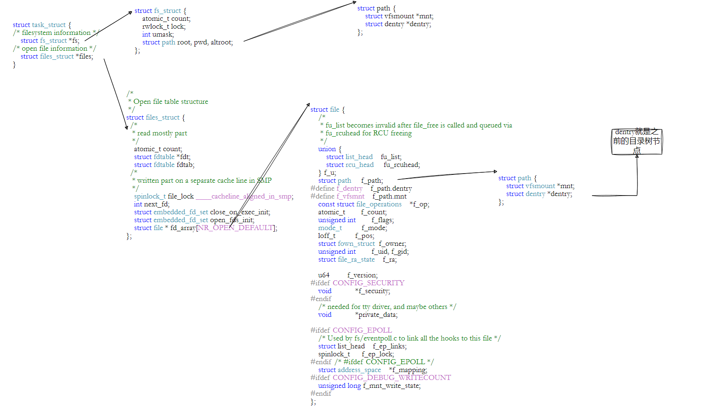

## 路径解析
打开当前工作目录文件，查看当前工作目录文件的内容？当前工作目录不也是文件吗？我们访问当前工作目录不也是只知道当前工作目录的文件名吗？要访问它，不也得知道当前工作目录的inode吗？

> 答案是：需要把路径中所有的目录全部解析，出口是"/"根目录
>

+ 一切都要从根目录开始，依次打开每一个目录，根据目录名，依次访问每个目录下指定的目录，直到访问到文件。这个过程叫做Linux路径解析。

**访问文件必须要有目录+文件名=路径**的原因，根目录固定文件名，inode号，无需查找，系统开机之后就必须知道。

可是路径谁提供？

+ 你访问文件，都是指令/工具访问，本质是进程访问，进程有CWD！进程提供路径。
+ open文件，提供了路径

可是最开始的路径从哪里来？

+ 所以Linux为什么要有根目录, 根目录下为什么要有那么多缺省目录？
+ 为什么要有家目录，自己可以新建目录？

上面所有行为：本质就是在磁盘文件系统中，新建目录文件。而你新建的任何文件，都在你或者系统指定的目录下新建，这不就是天然就有路径了嘛！

**系统+用户共同构建Linux路径结构**

## 路径缓存
问题1：Linux磁盘中，存在真正的目录吗？

答案：不存在，只有文件。只保存**文件属性+文件内容**

问题2：访问任何文件，都要从`/`目录开始进行路径解析？

答案：原则上是，但是这样太慢，所以**Linux会缓存历史路径结构**

问题3：Linux目录的概念，怎么产生的？

答案：打开的文件是目录的话，由OS自己在内存中进行路径维护

---

文件系统的部分数据结构，未来在开机的时候，就直接加载到内核中了，然后在内核中对数据做操作，做管理，然后刷新到磁盘对应的分区的对应的分组

Linux系统中，当用户访问指定路径下的文件（包括路上目录，最终的目标文件在内）

Linux会在你进行路径解析的过程中，在内核中形成目录树和路径缓存，目录结构是内存级的

Linux中，在内核中维护树状路径结构的内核结构体叫做：`struct dentry`

```c
struct dentry {
	atomic_t d_count;
	unsigned int d_flags;		/* protected by d_lock */
	spinlock_t d_lock;		/* per dentry lock */
	struct inode *d_inode;		/* Where the name belongs to - NULL is
					 * negative */
	/*
	 * The next three fields are touched by __d_lookup.  Place them here
	 * so they all fit in a cache line.
	 */
	struct hlist_node d_hash;	/* lookup hash list */
	struct dentry *d_parent;	/* parent directory */
	struct qstr d_name;

	struct list_head d_lru;		/* LRU list */
	/*
	 * d_child and d_rcu can share memory
	 */
	union {
		struct list_head d_child;	/* child of parent list */
	 	struct rcu_head d_rcu;
	} d_u;
	struct list_head d_subdirs;	/* our children */
	struct list_head d_alias;	/* inode alias list */
	unsigned long d_time;		/* used by d_revalidate */
	struct dentry_operations *d_op;
	struct super_block *d_sb;	/* The root of the dentry tree */
	void *d_fsdata;			/* fs-specific data */
#ifdef CONFIG_PROFILING
	struct dcookie_struct *d_cookie; /* cookie, if any */
#endif
	int d_mounted;
	unsigned char d_iname[DNAME_INLINE_LEN_MIN];	/* small names */
};
```

注意：

+ 每个文件其实都要有对应的`dentry`结构，包括普通文件。这样所有被打开的文件，就可以在内存中形成整个树形结构
+ 整个树形节点也同时会隶属于LRU(Least Recently Used，最近最少使用)结构中，进行节点淘汰
+ 整个树形节点也同时会隶属于Hash，方便快速查找
+ 更重要的是，这个树形结构，整体构成了Linux的路径缓存结构，打开访问任何文件，都在先在这棵树下根据路径进行查找，找到就返回属性inode和内容，没找到就从磁盘加载路径，添加dentry结构，缓存新路径

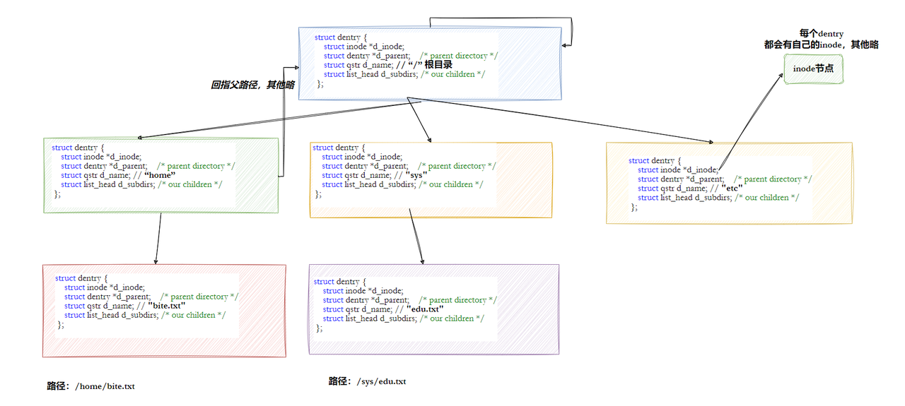


## 挂载分区
inode不是不能跨分区吗？Linux不是可以有多个分区吗？我怎么知道我在哪一个分区？

+ 制作一个大的磁盘块，就当做一个分区

```shell
dd if=/dev/zero of=./disk.img bs=1M count=5
```

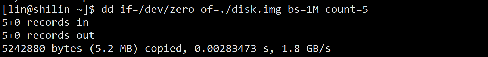

+ 格式化写入文件系统

```shell
mkfs.ext4 disk.img
```

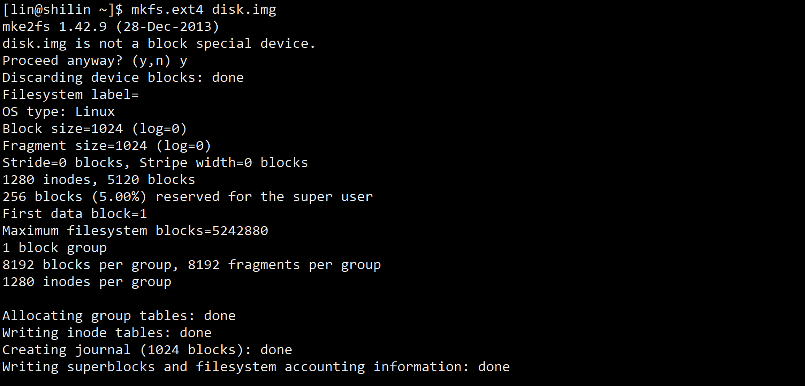

+ 创建新目录

```shell
sudo mkdir /mnt/mydisk
```

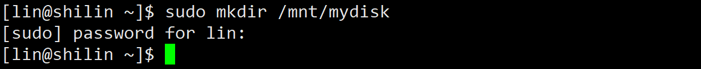

+ 查看可以使用的分区

```shell
df -h
```

现在还是没有的，需要将分区挂载到指定的目录

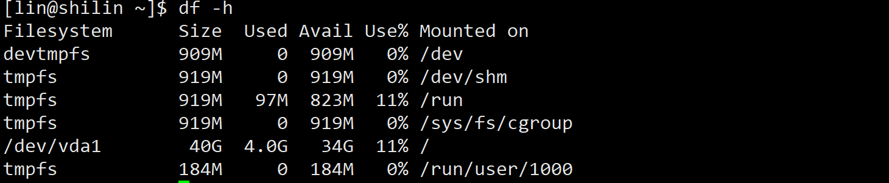

+ 挂载分区

```shell
sudo mount -t ext4 ./disk.img /mnt/mydisk/
```

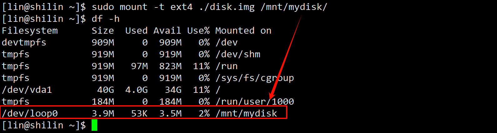

+ 其中`loop0`在Linux系统中代表第一个循环设备（loop device）。循环设备，也被称为回环设备或者loopback设备，是一种伪设备（pseudo-device），它允许将文件作为块设备（block device）来使用。这种机制使得可以将文件（比如ISO镜像文件）挂载（mount）为文件系统，就像它们是物理硬盘分区或者外部存储设备一样

```shell
/dev/loop0      3.9M   53K  3.5M   2% /mnt/mydisk
```

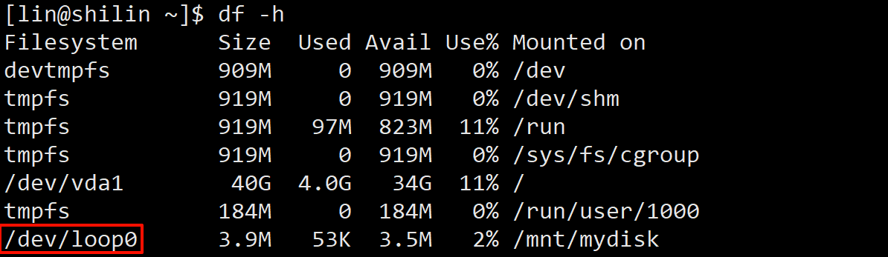

+ 卸载分区

```shell
sudo umount /mnt/mydisk
```

删除文件后，进行卸载分区

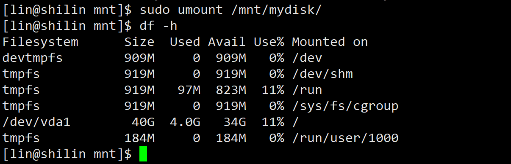

所以得出结论：分区也有路径，路径前面带有路径前缀，进行前导解析，也就是说，打开一个文件，就这个文件在系统层面上一定会转换出路径来，才能拿到路径解析，才能确定是在哪一个分区下，哪个分组下的inode

总结：


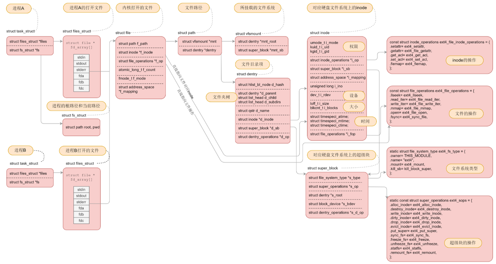

## 软硬链接

为解决文件的共享使用，Linux 系统引入了两种链接：硬链接 (hard link) 与软链接(又称**符号链接**，即 soft link 或 symbolic link)。链接为Linux系统解决了文件的共享使用，还带来了隐藏文件路径、增加权限安全及节省存储等好处。

创建软链接

```bash
ln -s src dest
```

创建硬链接

```bash
ln src dest
```

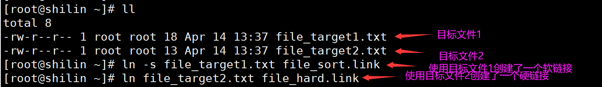

+ 我们观察到硬链接的`inode`一样，而这里有两个**2**代表的是**引用计数**。
+ 我们观察到**软链接**，又叫做**符号链接**，软链接文件相对于源文件来说是一个**独立的文件**，该文件有自己的`inode`号，但是该文件只包含了**源文件的路径名**，所以软链接文件的大小要比源文件小。**软链接就类似于Windows操作系统当中的快捷方式**。

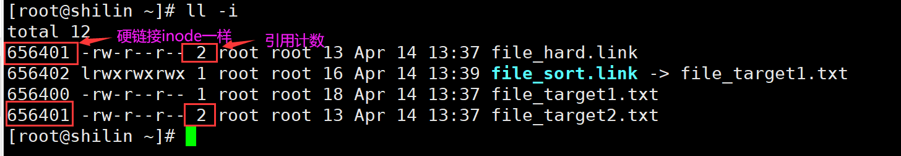

### 软链接
+ 使用快捷方式打印和使用源文件打印都是可以的


+ 但是软链接文件只是其源文件的一个标记，当删除了源文件后，链接文件不能独立存在，虽然仍保留文件名，但却不能执行或是查看软链接的内容了。

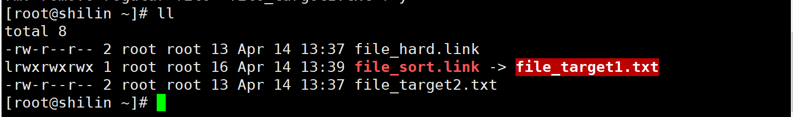

### 硬链接
通过`ls -i -l`命令我们可以看到，硬链接文件的`inode`号与源文件的`inode`号是相同的，并且硬链接文件的大小与源文件的大小也是相同的，特别注意的是，当创建了一个硬链接文件后，该硬链接文件和源文件的硬链接数都变成了2。

+ 我们删除源文件后，计数变为1了

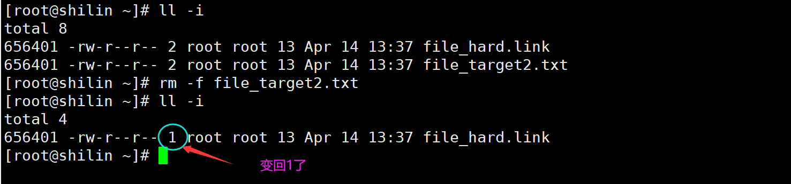

+ 这里面的文件内容还是可以访问，也就是相当于**重命名**了一下


+ 所以硬链接不是一个独立的文件，因为没有独立的`inode`，使用的是目标文件的`inode`，在属性列中有一列就是硬链接数
+ **文件的磁盘引用计数**：有多少个文件名字字符串通过inode指向我就是多少

---

所以定位一个文件有两种方式：

1. 通过路径
2. 直接找到目标文件的inode

两者都是最终还是要通过`inode`

**简单的来说硬链接就是一个文件名和`inode`的映射关系，建立硬链接，就是在指定目录下，添加一个新的文件名和inode的映射关系，并没有在系统层面创建新文件！**

---

那么以上两者都有什么作用呢?

+ 其实在我们`linux`机器上有很多的软硬链接
+ 就比如`/`目录下就有很多软硬链接

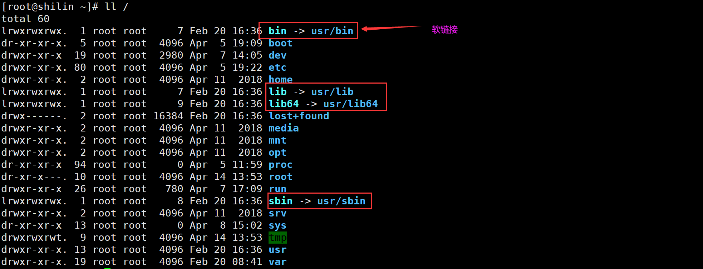

+ 硬链接的场景也有很多，比如平时我们创建一个文件夹默认的计数就是2，因为里文件夹里面默认有`.`和`..`

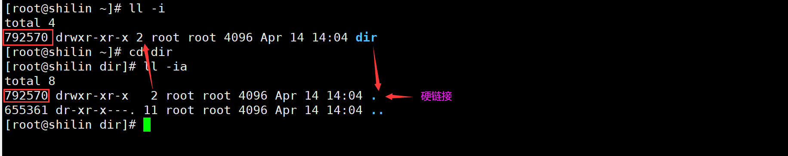

+ 当再次向这个目录里面新建目录

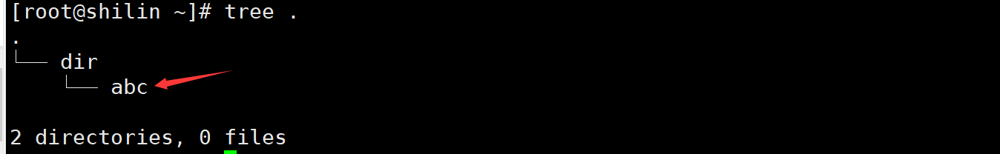

+ 计数+1

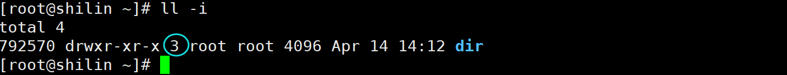

+ 任何一个目录，刚开始建立的时候，引用计数一定是2

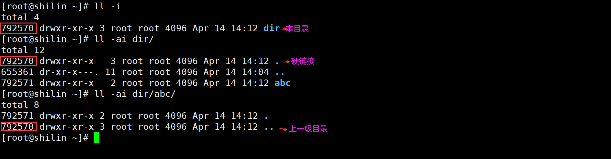

+ 在目录A内部新建立一个目录，会让A目录`i`引用计数自动+1

在Linux系统中，不允许给目录建立硬链接，这会引起路径环路问题。

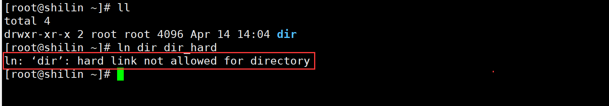

例如：我给当前目录的父目录建立了一个硬链接，而我要find一个文件，要对该目录进行深度优先的搜索，进行路径解析，解析到了当前目录后，找到了这个硬链接，而又去链接的硬链接中去找了，又回来了，这就引起路径环路问题了

---

其实在linux源码中，在解析路径的时候就需要特殊处理一下，需要跳过`.`和`..`

例如：在`linux-2.6.18\fs\namei.c`中`__link_path_walk`

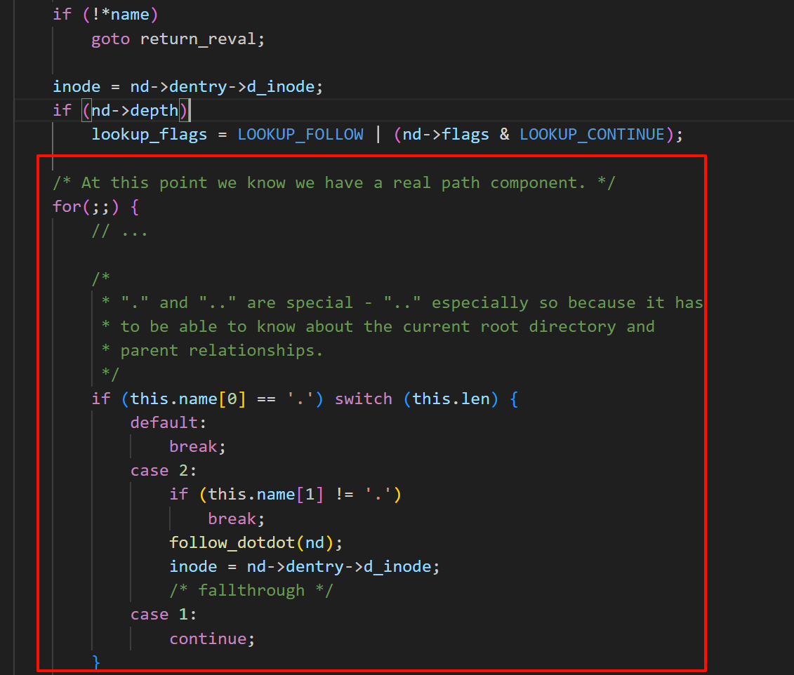

```c
for (;;) {
    // ... 路径解析初始化 ...

    /*
     * "." and ".." are special - ".." especially so because it has
     * to be able to know about the current root directory and
     * parent relationships.
     */
    // 处理当前路径组件
    if (this.name[0] == '.')
        switch (this.len) {
            default:
                break;
            case 2:
                if (this.name[1] != '.')
                    break;
                follow_dotdot(nd);
                inode = nd->dentry->d_inode;
                /* fallthrough */
            case 1:
                continue;
        }
    
    // ... 处理普通目录/文件 ...
}
```

源码解析：

1. 检查是否以.开头：`this.name[0] == '.'`
2. 根据长度判断：
    1. 长度`> 2`：按普通目录处理（default分支）
    2. 长度`== 2`：进一步检查第二个字符是否为.
        1. 若为`..`，调用`follow_dotdot(nd)`处理父目录逻辑
        2. 然后通过`fallthrough`继续执行`case 1`	
    3. 长度`== 1`（即.）：直接跳过当前组件（continue）
+ `.`：直接跳过，不改变当前目录
+ `..`：
+ `follow_dotdot()`函数会：
    - 更新当前目录为父目录
    - 处理挂载点边界情况（如根目录的父目录仍为根目录）
    - 处理容器环境中的命名空间限制
+ 执行后通过`fallthrough`继续跳过当前组件

### 查看文件信息stat命令
在Linux当中，我们可以使用命令`stat`文件名来查看对应文件的信息。

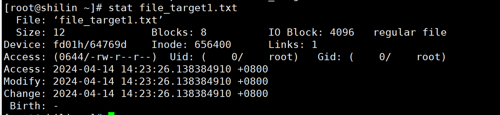

这其中包含了文件的三个时间信息：

**Access**： 文件最后被访问的时间。  
**Modify**： 文件内容最后的修改时间。  
**Change**： 文件属性最后的修改时间。

+ 当我们修改文件内容时，文件的大小一般也会随之改变，所以一般情况下Modify的改变会带动Change一起改变，但修改文件属性一般不会影响到文件内容，所以一般情况下Change的改变不会带动Modify的改变。
+ 我们若是想将文件的这三个时间都更新到最新状态，可以使用命令`touch`文件名来进行时间更新。

注意： 当某一文件存在时使用touch命令，此时touch命令的作用变为更新文件信息。

### 取消软硬链接unlink
+ 直接使用该命令即可

```bash
unlink 文件名
```

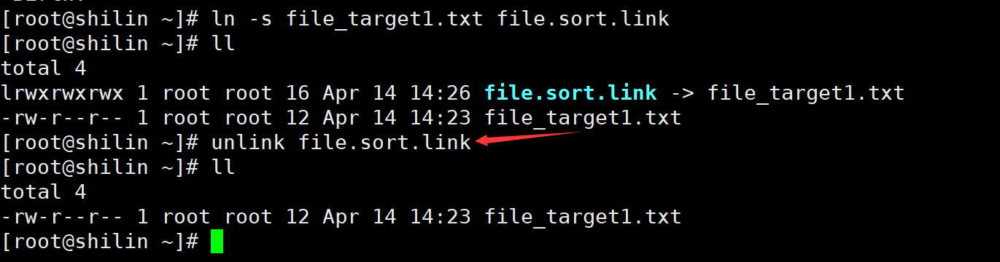

