# Linux权限命令详解以及粘滞位
## 一、什么是权限？
权限就是通过一定的条件，拦住一部分人，给另一部分人权利，来访问某种资源，比如vip，门禁之类的

## 二、权限的本质
权限和人有关，权限和事物的属性有关

权限=人+事物属性有关【人也就是相当于角色】

## 三、Linux中的用户
+ linux有root用户【超级管理员用户】，普通用户，那么我们怎么切换这两种用户呢？

切换root用户

```bash
su -
```

切换普通用户就是su后面加个用户名

```bash
su 用户名
```

在linux中有三种“人”【角色】：**拥有者，所属组，other**

+ 其中第一个lin就是**拥有者**，第二个是**所属组**，其他就是**other**

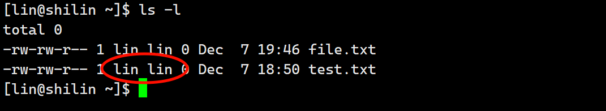

+ su用户名，是从root变成普通用户，刚刚上面也说了
+ 但是我不想直接变成root，但是我想以root的身份执行一个工作，怎么做呢？
    - 在执行命令前加上一个**sudo**

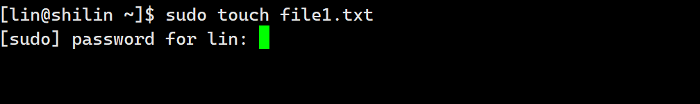

1. 那么为什么sudo对指令进行提权的时候，输入的是我们自己密码？那样不是很不安全，用root身份想干啥干啥
2. 默认普通目前无法执行sudo，需要到`/etc/sudoers`文件添加`lin     ALL=(ALL)       ALL`

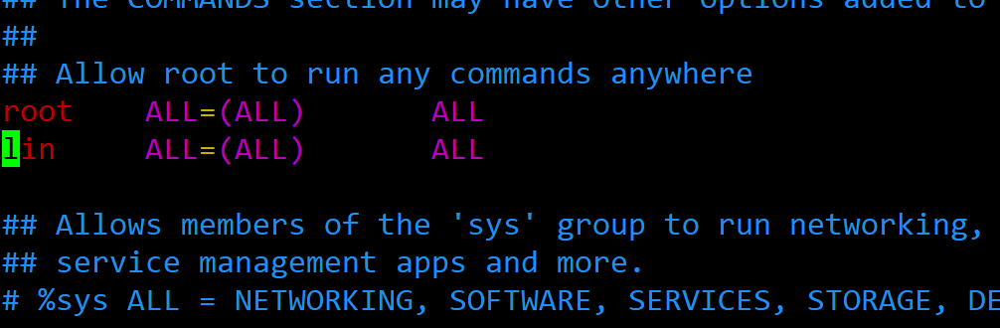

## 四、linux中文件的权限
### 4.1 文件访问者的分类（人）
> + 文件和文件目录的所有者：u---User
> + 文件和文件目录的所有者所在的组的用户：g---Group
> + 其它用户：o---Others
>

### 4.2 文件类型和访问权限（事物属性）
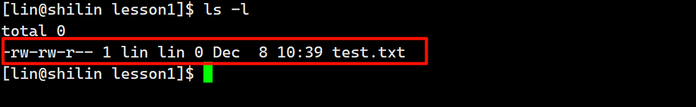

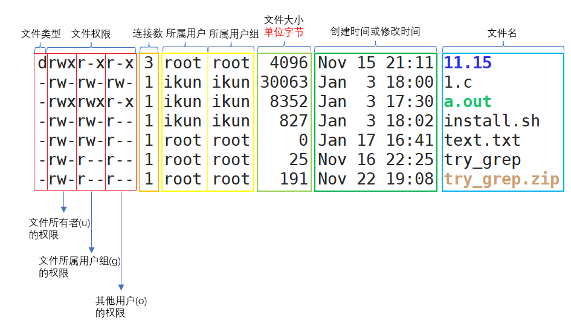

文件的属性权限一般有三种

> r，读
>

> w，写
>

> x，可执行权限
>

```bash
[lin@shilin lesson1]$ ls -l
total 0
-rw-rw-r-- 1 lin lin 0 Dec  8 10:39 test.txt
[lin@shilin lesson1]$ 
```

+ 其中`-rw-rw-r--`是七个字符，我们先不管第一个字符
+ 来看后6个，33为一组，分别对应：拥有者，所属组，other
    - 第一个字符：是否具有读权限，【如果是，就r，否则，就是-】
    - 第二个字符：是否具有写权限，【如果是，就是w，否则，就是-】 
    - 第二个字符：是否具有可执行权限，【如果是，就是x，否则，就是-】

## 五、快速掌握修改权限的做法【第一种】
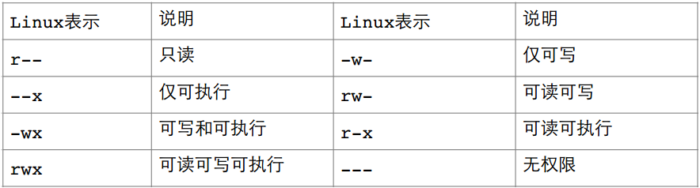

一个文件的权限，谁能修改？

+ 文件的拥有者
+ root

### 5.1 修改拥有者的权限
> 减拥有者的权限
>

```bash
chmod u-w test.txt
```

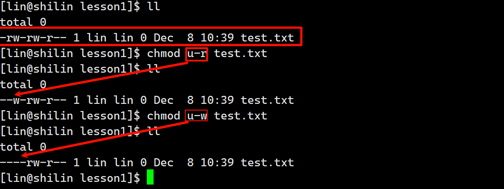

> 加拥有者的权限
>

```bash
chmod u+rw test.txt
```

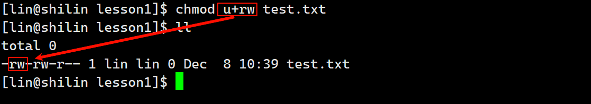

### 5.2 修改所属组的权限
> 减所属组的权限
>

```bash
chmod g-rw test.txt
```

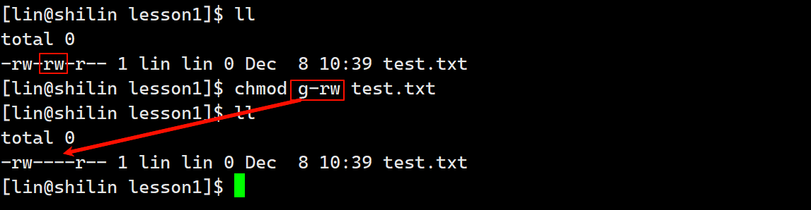

> 加所属组的权限
>

```bash
chmod g+rw test.txt
```

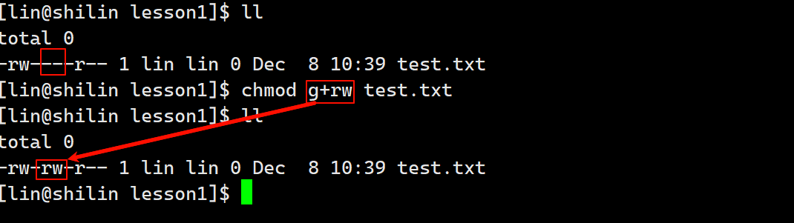

### 5.3 修改other的权限
> 减other的权限
>

```bash
chmod o-rw test.txt
```

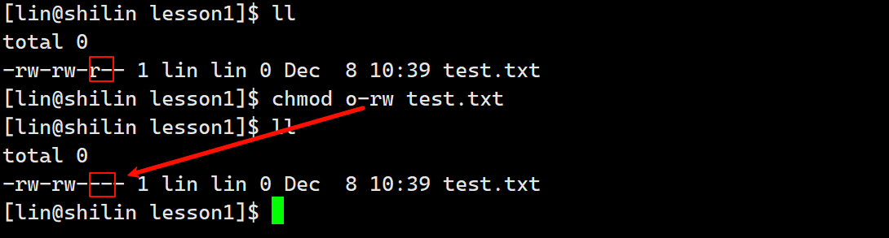

> 加other的权限
>

```bash
chmod o+r test.txt
```

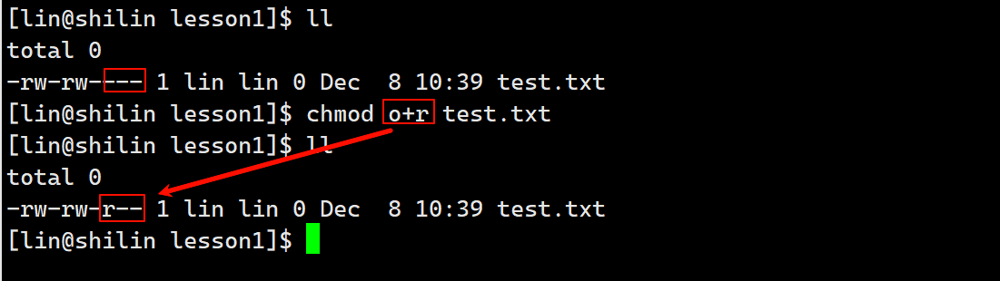

### 5.4 修改多个角色的权限
> 那我想更改多个"人"【角色】的权限，怎么修改呢？  
多个权限之间价格逗号即可~~【注意：一定是英文的！】
>

> 批量减少权限
>

```bash
chmod u-w,g-w test.txt
```

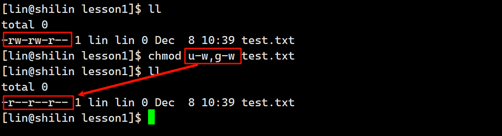

> 批量添加权限
>

```bash
chmod u+w,g+w,o+w test.txt
```

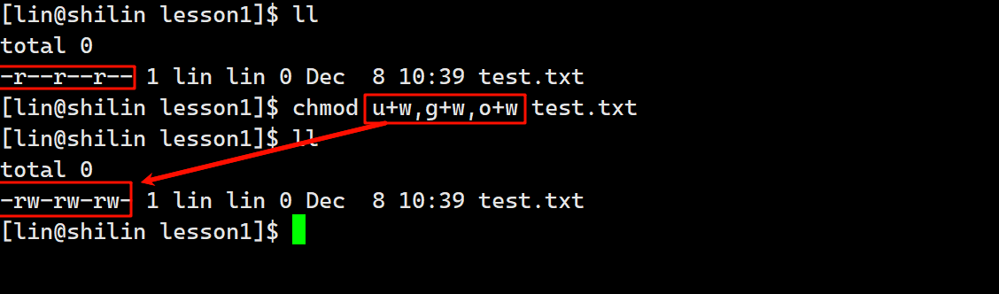

> 删除所有权限
>

```bash
chmod u-rw,g-rw,o-rw test.txt
```

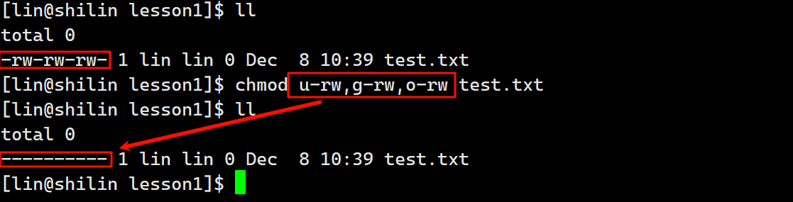

### 5.5 一键添加或删除所有权限
+ 这里的`a`就是`all`的意思【所有】

> 添加所有权限
>

```bash
chmod a+r test.txt
```

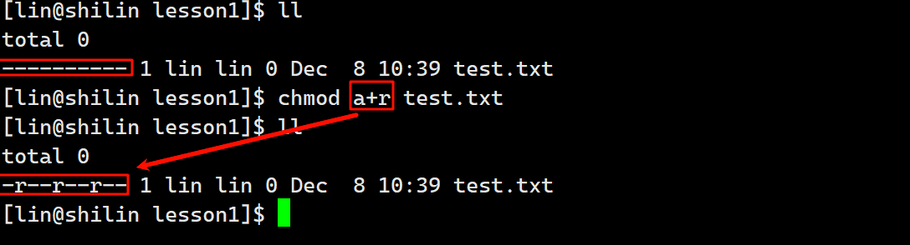

> 删除所有权限
>

```bash
chmod a-r test.txt
```

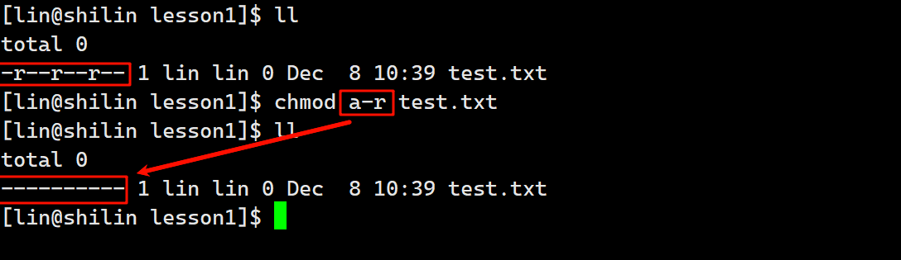

+ 对于普通用户，自身要受到对应权限的约束，即使这个文件是自己的！

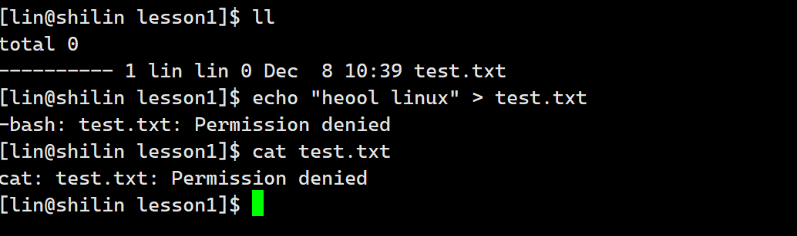

+ 对于root用户，不受权限约束的！

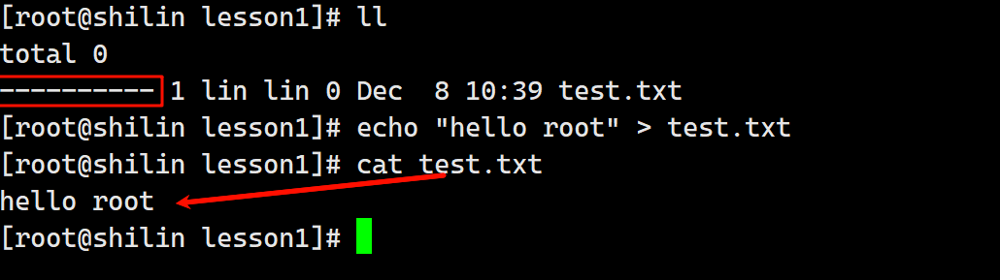

+ 对于其他用户，文件对应的是other选项，这个选项是没有读和写权限的

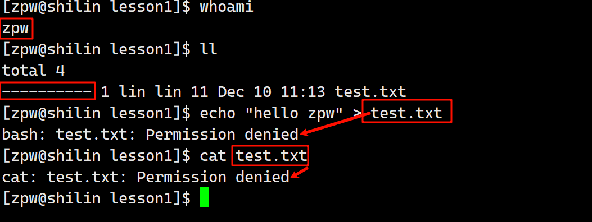

**注意：对于文件的拥有者，如果删除了文件的拥有者权限，但是所属组的没有删除，它也会禁止读写操作**

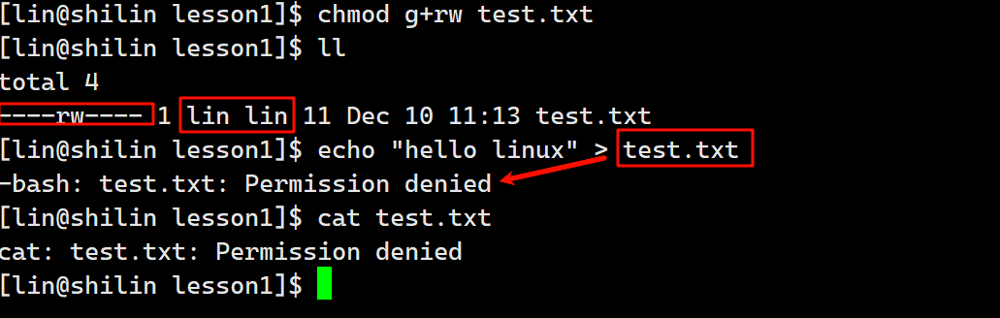

就是当匹配成功拥有者后，查看是否有权限，如果没有就失败

### 5.6 更改文件的拥有者
```bash
chown root test.txt
```

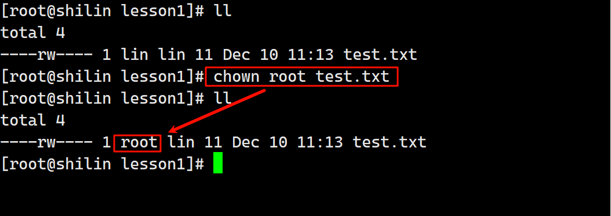

> 我们回到上面的那里
>

+ 这个时候我们把拥有者的改成root用户，但是所属组还是原来的，可以看到还是可以写入的，因为可以匹配到所属组是lin，具有`rw`权限

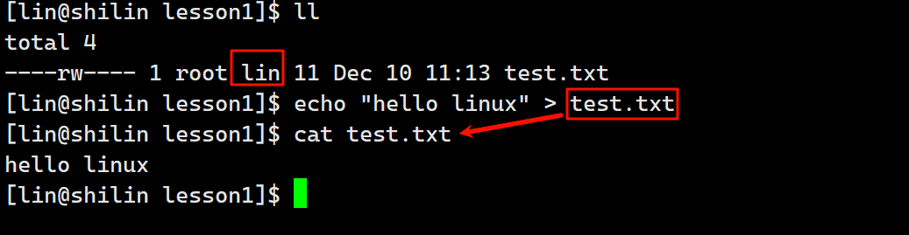

+ 如果我将拥有者的权限全部去掉，但是所属组还有rw权限，我再次写入文件，可以看到不能写入了，这是为什么，既然所属组有权限，就应该是可以写的

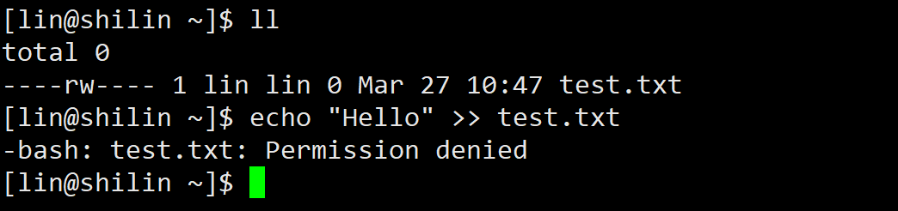

所以就得出结论：

> 结论：身份匹配，只会从拥有者，所属组，other的顺序匹配成功一次！
>

### 5.7 更改文件的所属组
```bash
chgrp root test.txt
```

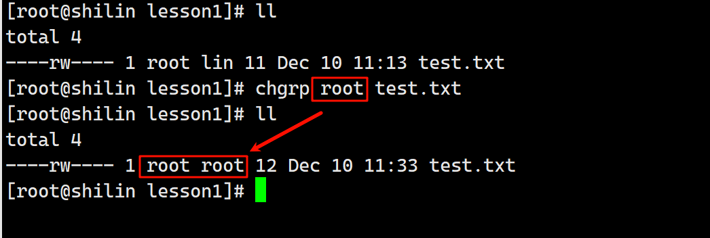

> 这个时候文件也就普通用户都不属于了
>

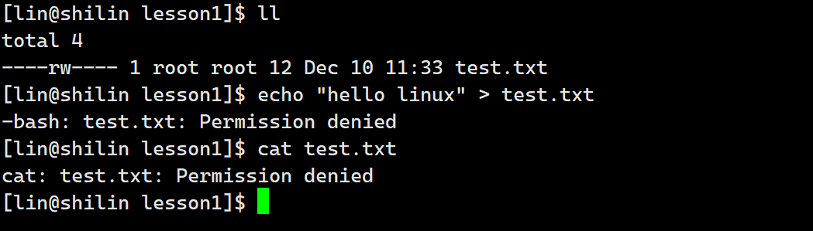

> 这里如果再加上other的读和写的权限，就又可以了
>

```bash
chmod o+rw test.txt
```

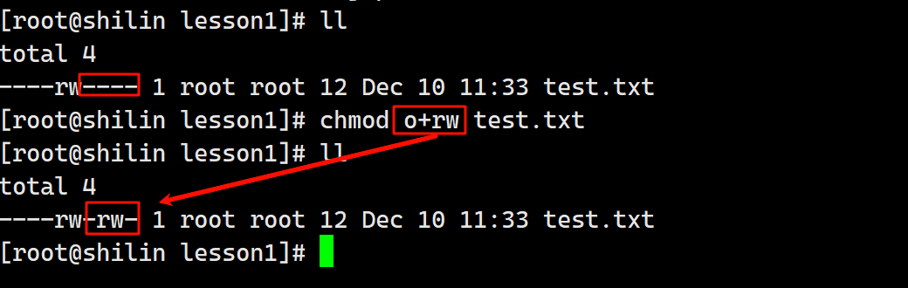

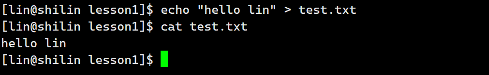

### 5.8 同时更改拥有者和所属组
```bash
chown lin:lin test.txt
```

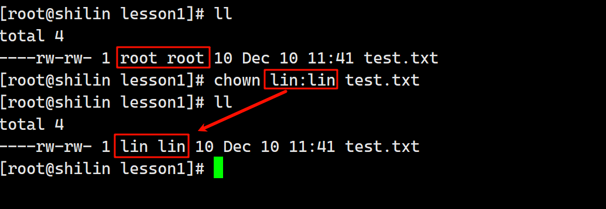

> 那么怎么没有修改other的指令呢？
>

因为没必要，更改了拥有者和所属组other也就变了

## 六、快速掌握修改权限的做法【第二种】
### 6.1 八进制
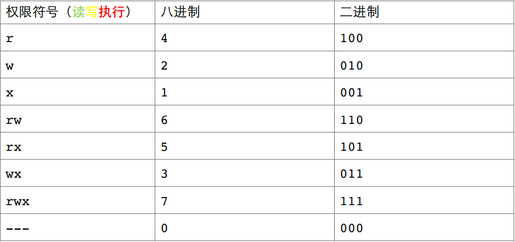

+ 如上图所示，如果有一个字符就代表`1`，如果是`-`就代表0

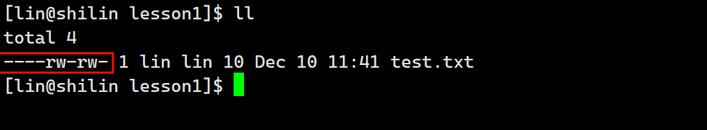

> 我们想去掉所有人的所有权限可以这样做
>

```bash
chmod 000 test.txt
```

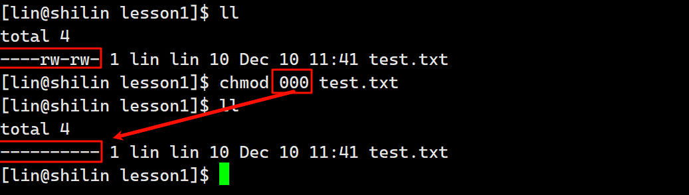

> 赋予所有权限就是下面这条命令
>

```bash
chmod 777 test.txt
```

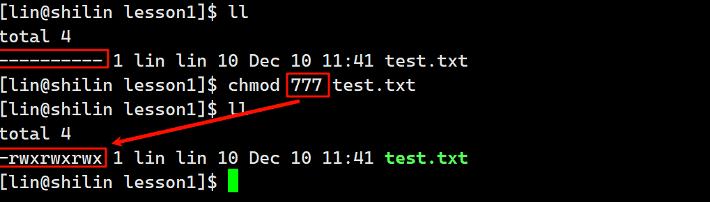

> 保留拥有者的读写权限
>

```bash
chmod 600 test.txt
```

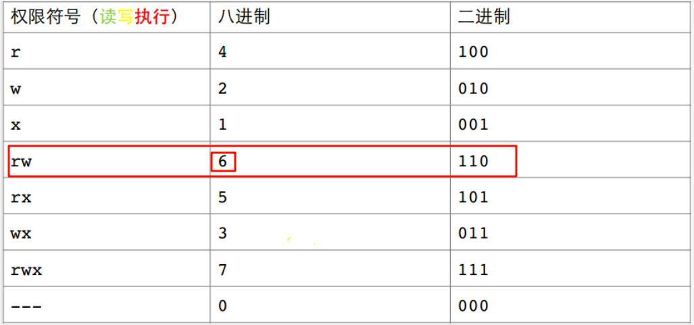

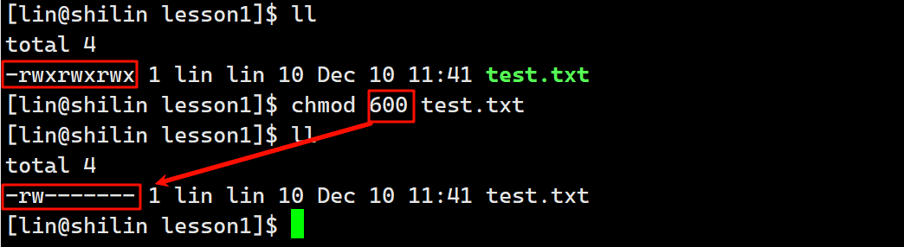

## 七、文件类型
> 在windows使用的是后缀名来区分文件类型的  
而在linux中是不通过后缀区分文件类型【不是linux不用后缀】
>

那么通过什么区分呢？

+ `ls -l`第一个属性列

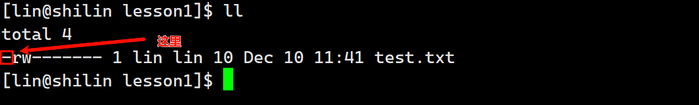

> + -：普通文件，文本文件，可执行程序，库等都叫做普通文件
> + d：目录文件
> + b：块设备文件
> + c：字符设备文件
> + p：管道文件
> + l：链接文件
>

+ 第一个`-`普通文件

平时创建的文件就是普通文件

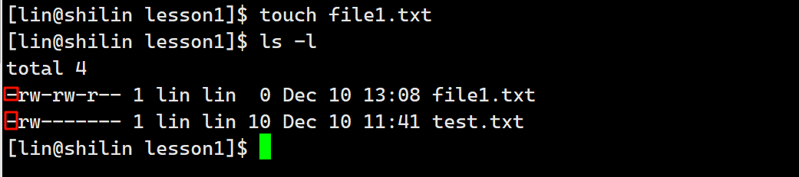

+ 第二个`d`目录文件

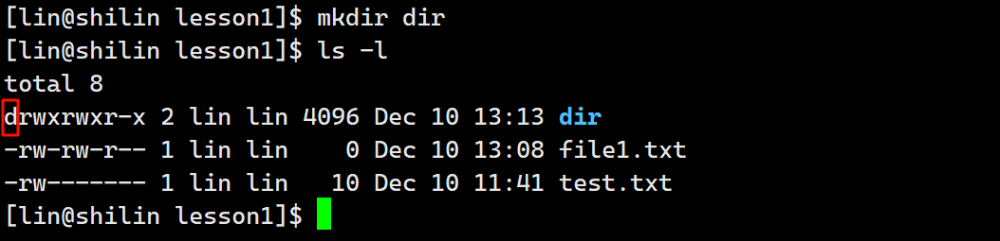

+ 第三个`b`块设备文件

> 这个典型的代表就是磁盘
>

```bash
ls -l /dev/vda
```

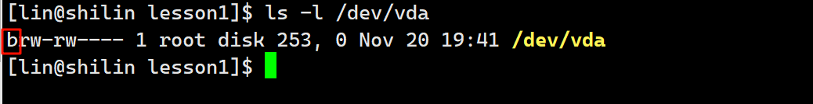

+ 第四个`c`字符文件

```bash
ls -l /dev/pts/
```

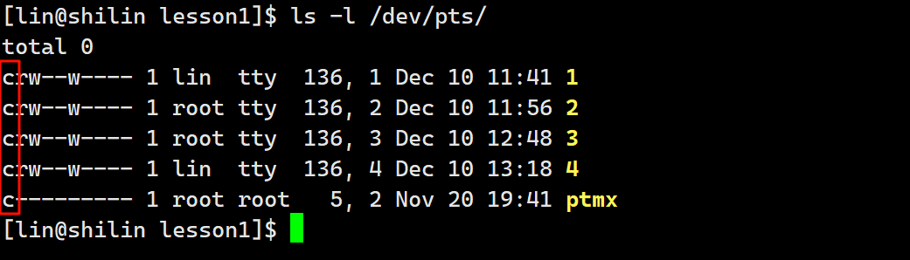

+ 第五个`p`管道文件

我们创建一个管道文件

```bash
mkfifo pipe
```

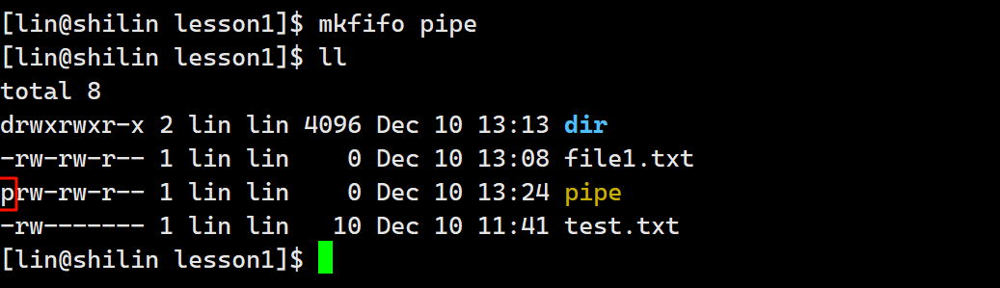

+ 这里就可以通过管道文件来进行输出

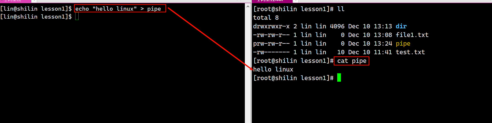

+ 第六个`l`链接文件

```bash
ln -s /home/lin/lesson1/test.txt xx.link
```

这个链接文件也就是相当于创建了一个快捷方式，直接指向了这个文件

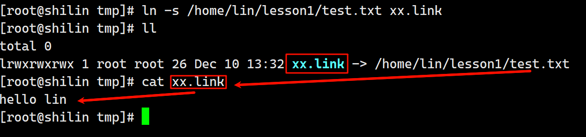

+ 如果删除了源文件，那么这个快捷方式也就不能用了

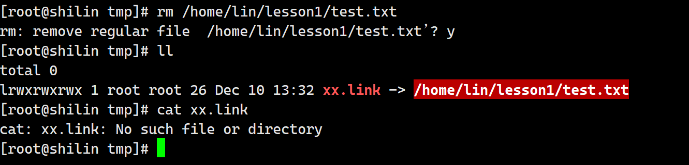

+ 比如linux的根目录就有很多的链接文件

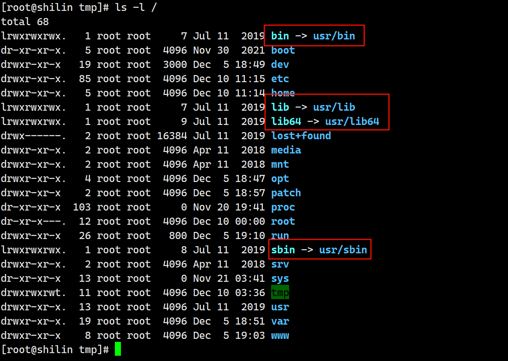

## 八、可执行权限
> 我们了解了读权限，写权限，那么可执行权限是什么呢？如何理解？
>

是一个可执行的文件，也有可执行权限，才能执行

> 能执行 = **具有可执行权限** + **一个可执行文件**
>

+ 如果我们要进入一个目录，需要什么权限？  ----> `进入一个目录，需要x权限`

**我们来验证一下：**

+ 第一种情况：

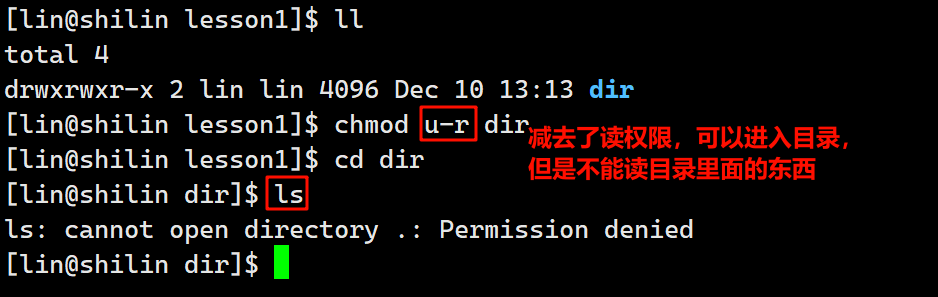

+ 第二种情况：

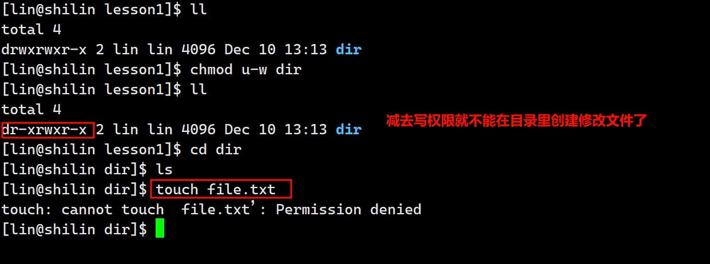

+ 第三种情况：

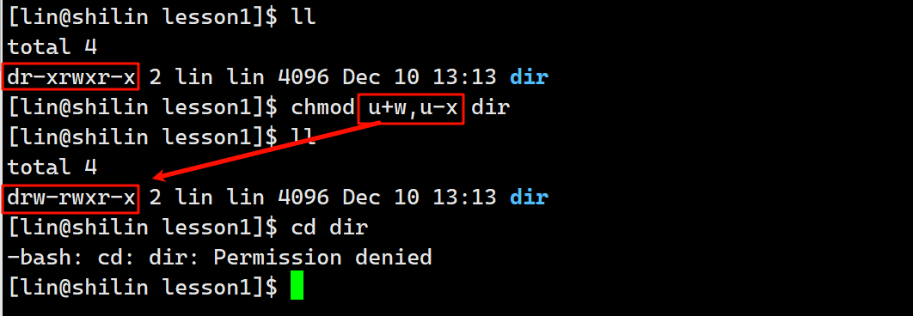

+ 可以看到去掉x权限就不能进入目录了

**小结一下：**

+ **进入一个目录需要x权限**
+ **目录的r权限：用户能否查看指定目录的文件信息**
+ **目录的w权限：决定用户是否能在指定的目录内新建，修改，删除文件**

## 九、创建文件的默认权限
> linux创建文件的时候，为什么好像有默认权限？为什么是我们看到的样子？
>

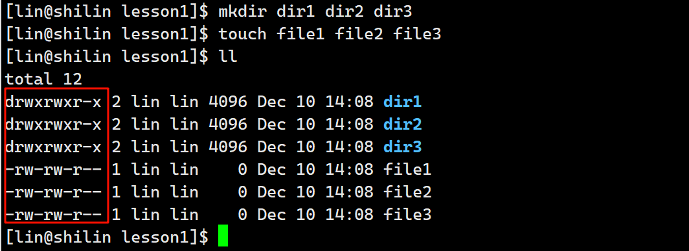

+ Linux创建的普通文件，起始权限是：0666，去掉x的
+ Linux创建的目录文件，起始权限是：0777，包含x的

我们的创建的普通文件也不是666，而是664，目录文件也不是777，而是775

### 9.1 权限掩码
```bash
umask
```

+ 在创建文件的时候，要在起始权限中，过滤掉（不是简单的减法）再umask中出现的权限

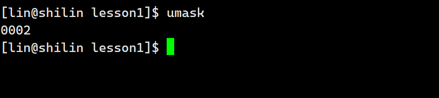

### 9.2 修改umask
```bash
umask 0000
```

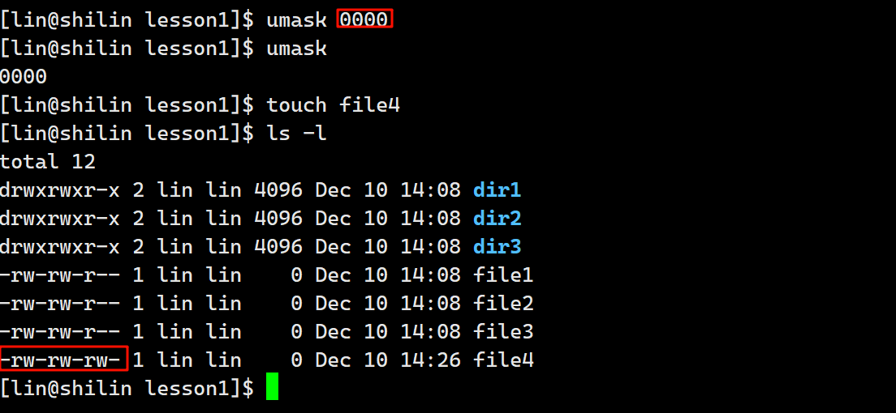

+ 修改了umask后，创建出来的文件权限也发生了改变，所以是uamsk影响了我们的默认权限

**最终权限 = 起始权限 & (~umask)**

> umask：Linux中的权限掩码！
>

## 十、目录的权限
r：是否运行用户查看

+ 为什么我们普通人竟然可以删除别人的文件（包括root）合理吗？

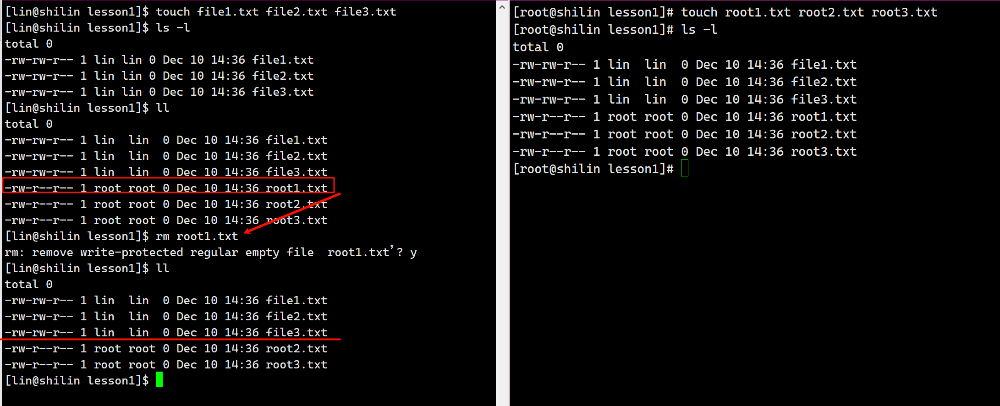

+ 删除一个文件和目标文件有关系吗？ ---->没有关系！！！
+ 那么和谁有关系呢？ ---- >和我所在的目录有关系！！！

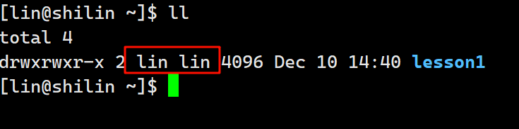

+ 这个目录是这个用户的拥有者，在我自己的目录里创建文件就要受到我管束~~

> 所以删除文件是由这个目录的拥有者来管理，删除一个文件的本质就是修改这个目录的内容
>

+ 所以创建一个目录的时候是默认去掉写权限的，一个外来用户进入到这个目录是不能进行创建文件的

那么root用户在我普通用户下创建的文件既然是不能写入的

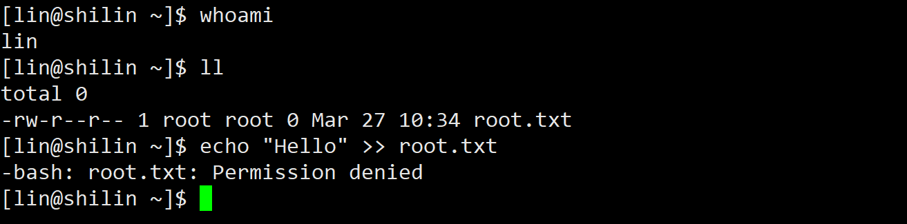

+ 我们为什么普通用户就可以删除root用户创建的文件呢？

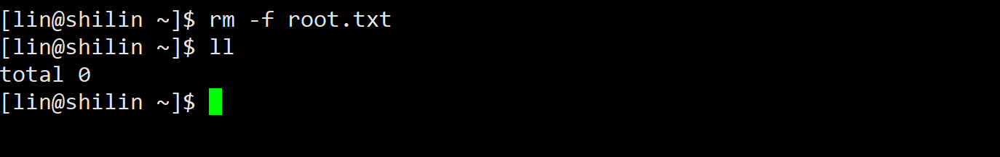

**因为一个文件被删，权限是依赖所处的目录的**，文件的拥有者是具有x权限，所以，该目录下的文件是可以被新增加或者删除！！

## 十一、粘滞位
> 粘滞位（Stickybit），或粘着位，是Unix文件系统权限的一个旗标。最常见的用法在目录上设置粘滞位，如此以来，只有目录内文件的所有者或者root才可以删除或移动该文件。如果不为目录设置粘滞位，任何具有该目录写和执行权限的用户都可以删除和移动其中的文件。实际应用中，粘滞位一般用于/tmp目录，以防止普通用户删除或移动其他用户的文件。--->来自[百度百科](https://baike.baidu.com/item/%E7%B2%98%E6%BB%9E%E4%BD%8D/15576416?fr=ge_ala)
>

### 11.1 如何理解？
+ 在linux系统中，比如我们想要共享一个文件夹，我们就要在一个非用户目录下新建文件，但是我们linux系统中有很多用户，那个文件夹就可以被任何用户访问，而且可以被**删除**，这样共享是很不方便的，我们我们可以演示一下：

我们要知道所有**普通用户**的家目录都是在`/home`目录下的，而且这个home目录是属于`root`的

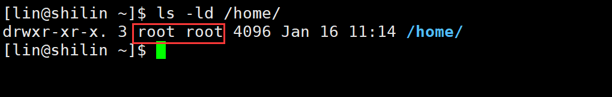

+ 然后我们再来看里面的用户

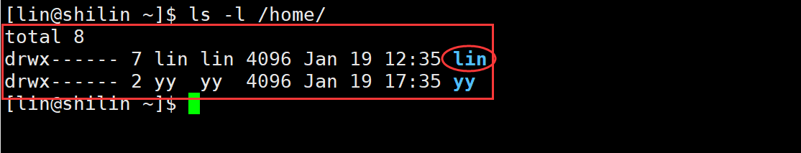

+ 我们来看，我现在登录的是lin这个用户，然后我在我自己的家目录创建的文件就是有rwx的所有权限，因为是我创建的文件。
+ 对于其他用户，想访问我这个家里的东西是没有权限的，可以看到图片上的other，是没有权限的。连大门都进不来就更别提看我家里的文件了
+ 那我现在有一个文件，需要和别的用户进行共享，我这个文件放在我自己的家目录的话，别人也访问不了啊，所以我们不能放到家目录下，只能放到别的目录下
+ 这就需要共享了，在linux中，这个需要共享的目录，放在`非home`目录下,只要root把权限都放开，那么所有用户都可以访问到了，这就达到了共享的目的
+ 首先创建一个共享文件夹，【要使用root用户创建，因为/也是root用户的，不能在/下随便创建】

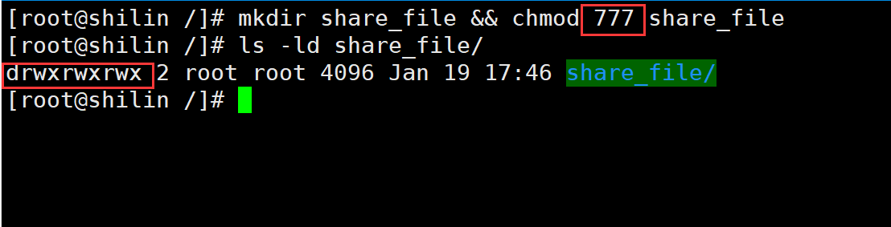

+ 可以看到我已经创建成功了，并且将权限都放开了【包括other】，也就是可以让任何用户都可以访问

那么我现在就切换回`lin`这个普通用户，来往里面进行放文件

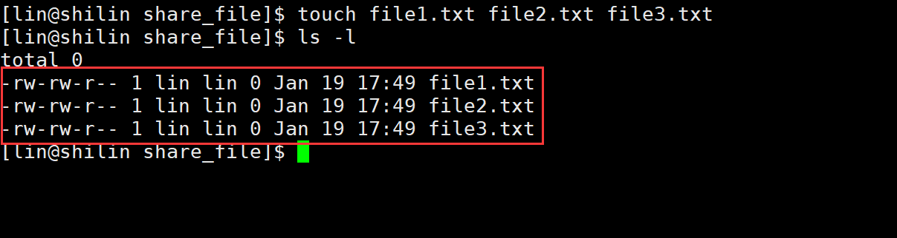

+ 这个时候就可以往里面进行写数据了，进行共享

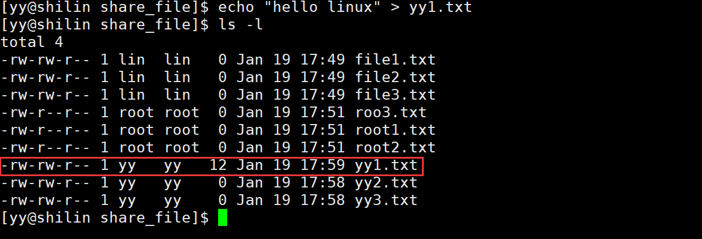

+ 其他用户也是可以访问的

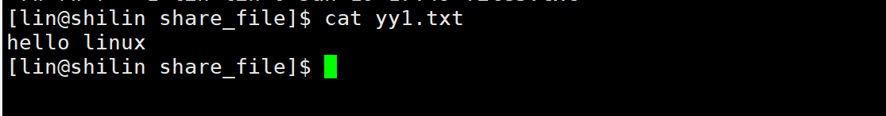

+ 那么这个时候就有新的问题来了，突然有一天yy用户不想给我看里面的内容了，他就这样做，不让别人看了

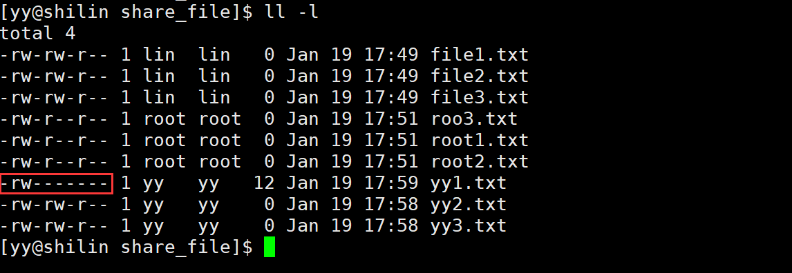

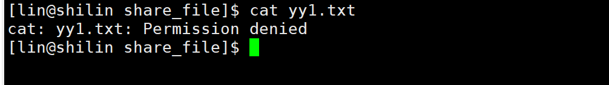

+ 那我别的用户就有点生气，你不让我看，就就给你删除了！

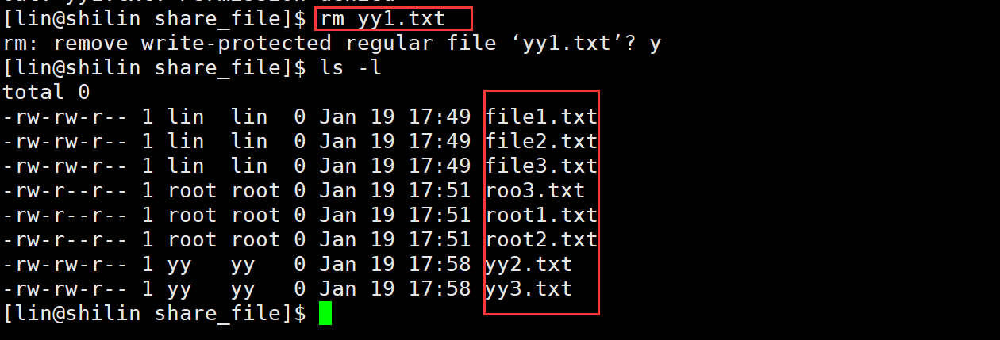

+ 可以看到，我这为什么yy用户建立的文件lin用户就能删除？
+ 删除一个文件不看这个文件是啥，要看这个文件放的目录是否有**写权限**，有写权限就可以删除

### 11.2 粘滞位的操作
**粘滞位**就可以解决这个问题

+ 我们可以这样操作`chmod +t 目录名`【当然是要在root用户下执行的】

```bash
chmod +t share_file/
```

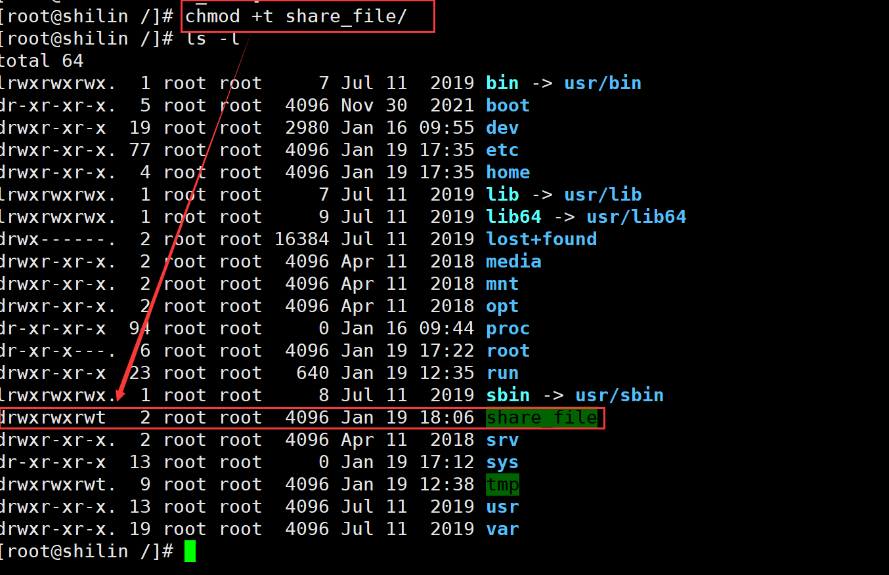

+ 我们可以看到，这个目录的最后一位从`x`变成了`t`，这就是**粘滞位**
+ 再来尝试，普通用户`lin`还可以删除`yy`用户的文件吗？

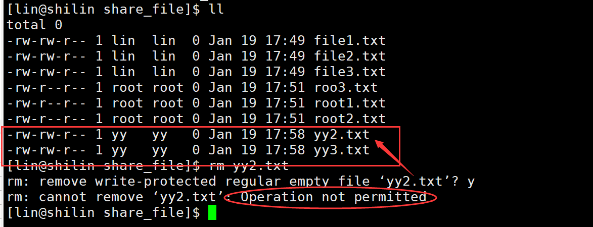

也见证到了，是不可以的删除的

那么谁可以删除呢？ ->**自己建立的文件只能被自己和root用户删除，其他用户是不能删除的**

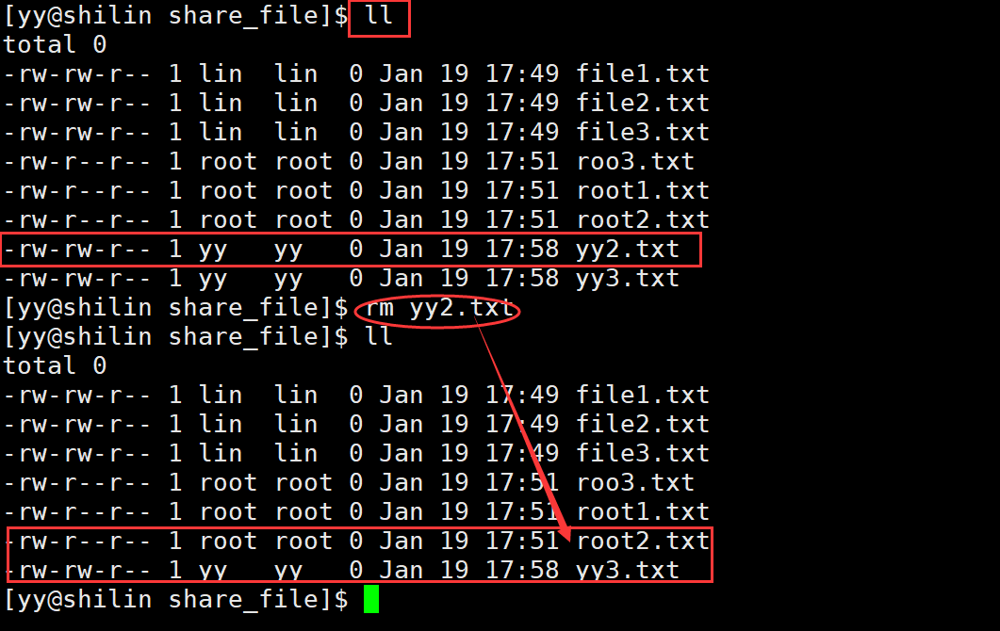

那么我们为什么不直接把目录的w权限去掉，不就可以阻止用户删除别人的文件了吗？  
	这样操作也是可以的，但是去掉后，普通用户也就不能在改目录下创建文件了  
	那对于这个共享不是是不可取的，所以还是要用到**粘滞位**

### 11.3 最后总结一下
+ 在共享一个文件夹里面的文件的时候，我们创建的文件不想被其他用户删除，【毕竟是共享的】，所以我们就需要用到**粘滞位**，粘滞位就可以很好的解决这个问题，被**粘滞位**赋予的目录权限中的文件：是谁的文件只能被谁删除或者root。

> 一、超级管理员删除【root】  
二、该目录的所有者删除  
三、该文件的所有者删除
>

## 十二、sudo使用
在使用Linux的过程中我们**普通用户使用sudo**可能遇到这样的提示**pp is not in the sudoers file.  This incident will be reported.**

+ **这一问题原因是因为**`etc`**文件中的**`sudoers`**这个文件中没有这个用户**
+ 我们可以按照下面操作进行修改【**以下操作都用英文模式下操作，切记**】
1. 使用root用户登录进来

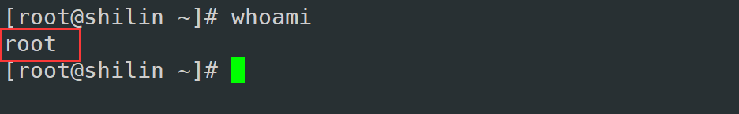

2. 打开`/etc/sudoers`

```bash
vi /etc/sudoers
```

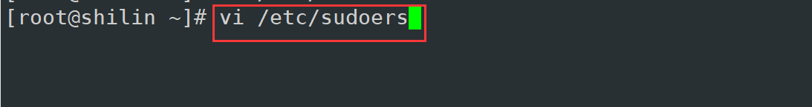

3. 然后按键盘上的`i`
4. 然后继续按键盘的上下键，找到带有下图显示的这样

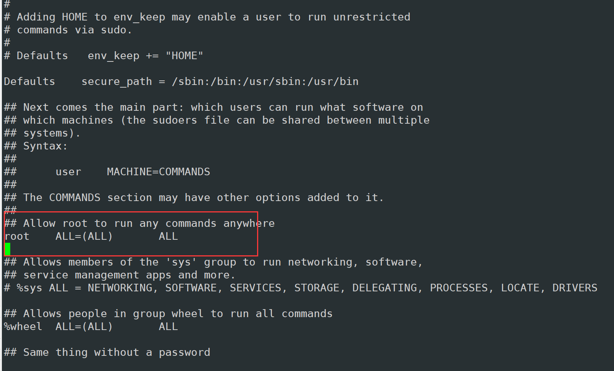

5. 然后手动输入

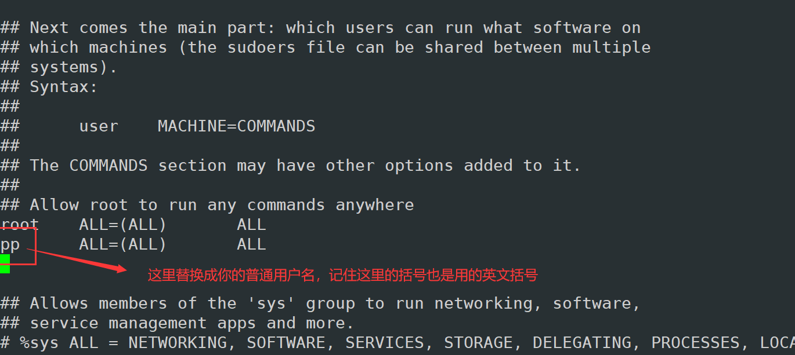

6. 这一步就需要注意了，退出的时候按下键盘上的`Esc`【就是左上角的那个按键】，然后在英文模式下按键盘的`:wq!`【这里的意思也就是强制保存并退出】

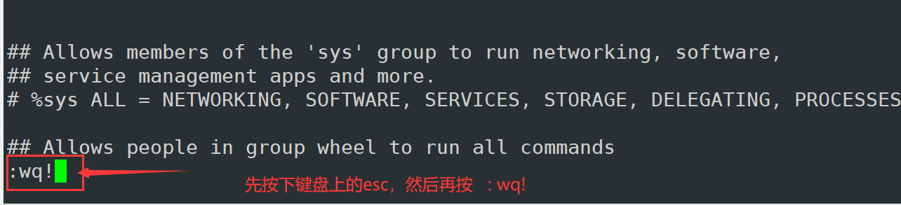

+ 可以看到已经成功了，这里要注意，需要输入**普通用户**的密码，而**不是root用户的密码**，不要输入错了，输入的时候也是**不会显示到屏幕**上的，输入完成后回车就可以

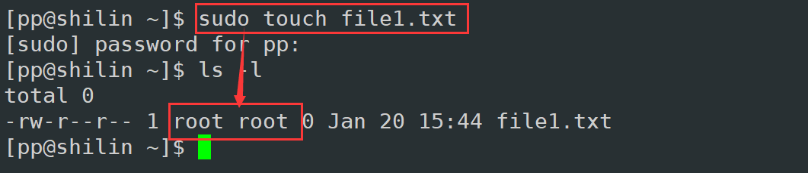

