# Linux编辑器之vim的使用
## 一、vim简介
Vim是一个类似于Vi的高度可定制的文本编辑器，在Vi的基础上改进和增加了很多特性。Vim是自由软件。Vim普遍被推崇为类Vi编辑器中最好的一个，事实上真正的劲敌来自Emacs的不同变体。1999 年Emacs被选为Linuxworld文本编辑分类的优胜者，Vim屈居第二。但在2000年2月Vim赢得了Slashdot Beanie的最佳开放源代码文本编辑器大奖，又将Emacs推至二线。 -->[来自百度百科](https://baike.baidu.com/item/Vim/60410?fr=ge_ala)

## 二、vim的基本概念
+ 基本上 vi/vim 共分为三种模式，命令模式（Command Mode）、输入模式（Insert Mode）和命令行模式（Command-Line Mode）。
+ 正常/普通/命令模式(Normal mode)

> 控制屏幕光标的移动，字符、字或行的删除，移动复制某区段及进入Insert mode下，或者到 last line mode
>

+ 插入模式(Insert mode)

> 只有在Insert mode下，才可以做文字输入，按「ESC」键可回到命令行模式。该模式是我们后面用的最频繁的编辑模式。
>

+ 末行模式(last line mode)

> 文件保存或退出，也可以进行文件替换，找字符串，列出行号等操作。 在命令模式下，shift+: 即可进入该模式。要查看你的所有模式：打开vim，底行模式直接输入`:help vim-modes`
>


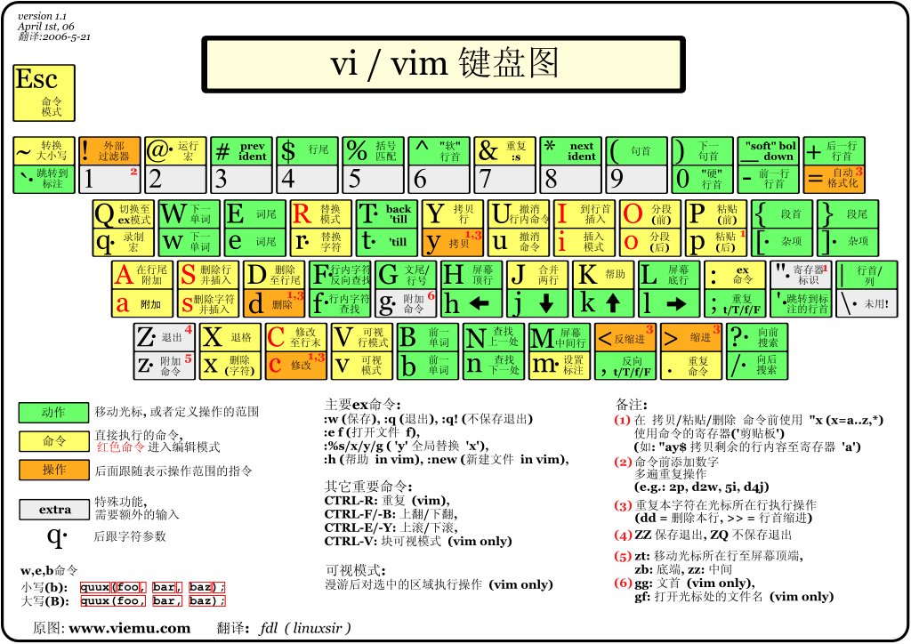

## 三、vim的基本操作
我们最一开始的输入`vim test.c `的时候就是**命令模式**

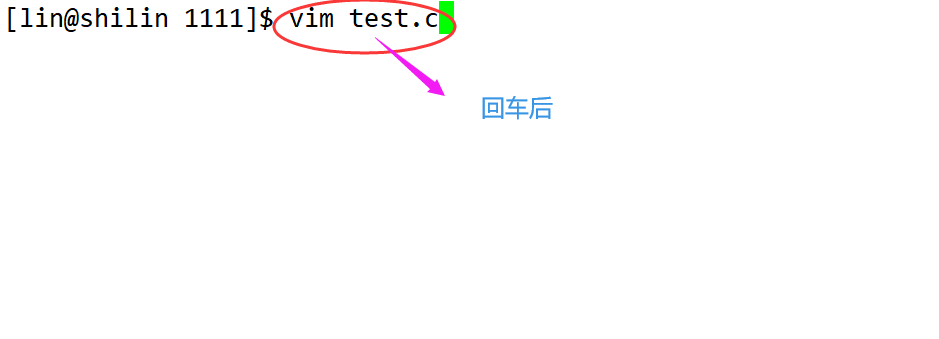

+ 回车后进入了这个界面，这个界面就是**命令模式**

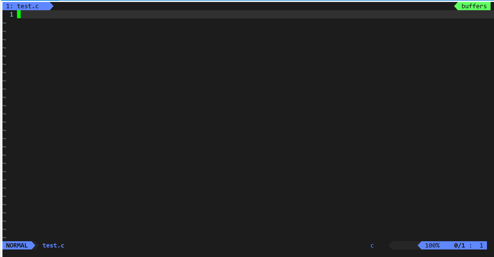

这里我的界面是这样的，大家可以看[VimForCpp](https://gitee.com/HGtz2222/VimForCpp)来配置一下自己vim，最后我会讲这个如何简单的自己配置一下

+ 在这个状态下按下键盘会被 `vim` 识别为命令
+ 比如我们此时按下` i `，并不会输入一个字符，` i `被当作了一个命令。就会进入**插入模式**
+ 这个时候`insert`会亮起，这个时候就可以随便输入文字了

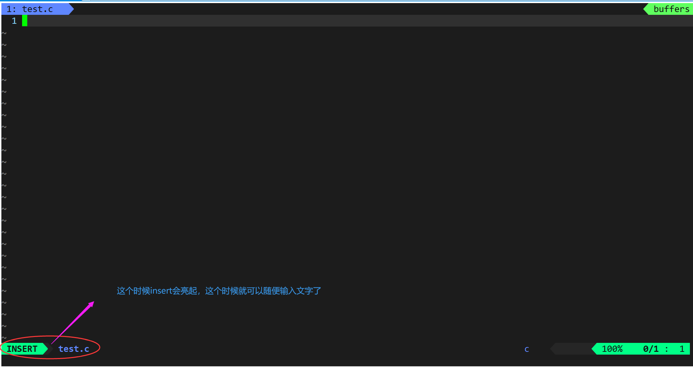

+ 那么我们退出的时候按下键盘上的`Esc`，在键盘上按下`:wq`【这里的操作一定是在英文模式下！】，然后回车
+ 这里的输入的模式叫做**底行模式**

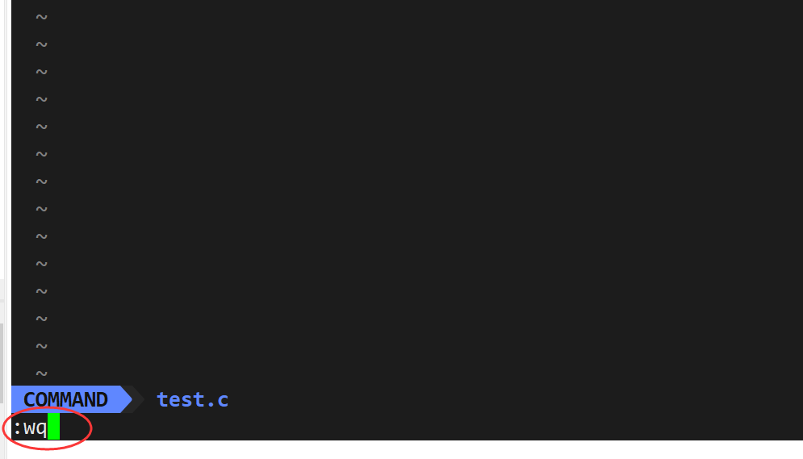

+ 上面这三种方式就可以用下面的图来表示：

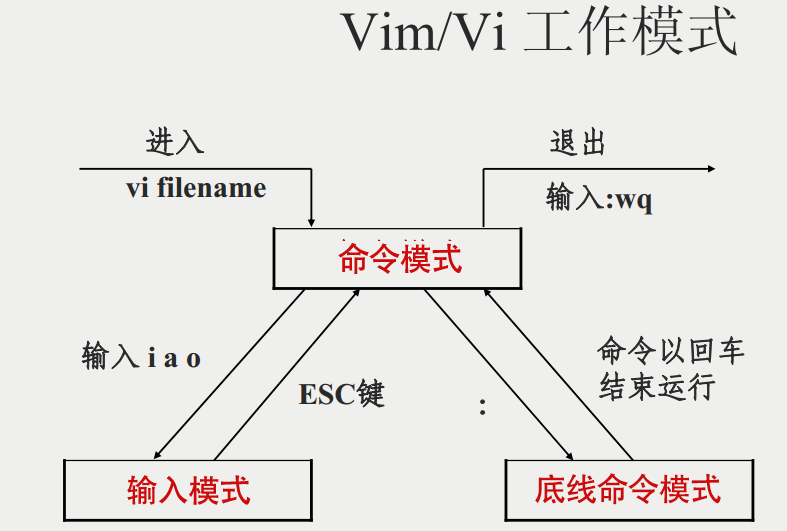

## 四、vim正常模式命令集
+ 首先用vim打开一个文件，这里我就打开一个以`.c`为后缀的文件

```bash
vim test.c
```

+ 按下`i`，就进入到插入模式了，这个时候就可以写任何想写的东西了

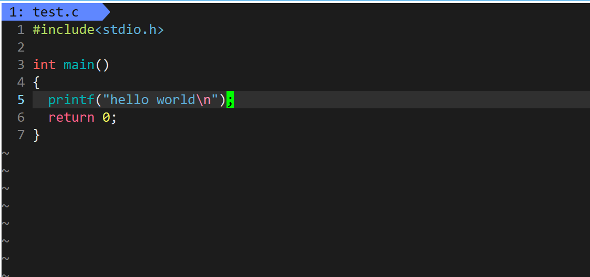

+ 这个时候我按下键盘上的`Esc`就进入到了命令模式

> 我们来开始学习命令模式：
>

### 移动光标
> vim可以直接用键盘上的光标来上下左右移动，但正规的vim是用小写英文字母 **「h」、「j」、「k」、「l」** ，分别控制光标左、下、上、右移一格
>

+ 按**shift+g**：移动到文章的最后。也就是「G」
+ 按**shift+4**：移动到光标所在行的“行尾”。也就是「$」
+ 按**shift+4**：移动到光标所在行的“行首”。也就是「^」
+ 按「w」：光标跳到下个字的开头
+ 按「e」：光标跳到下个字的字尾
+ 按「b」：光标回到上个字的开头
+ 按「#l」：光标移到该行的第#个位置，如：5l,56l
+ 按［gg］：进入到文本开始
+ 按「ctrl」+「b」：屏幕往“后”移动一页
+ 按「ctrl」+「f」：屏幕往“前”移动一页
+ 按「ctrl」+「u」：屏幕往“后”移动半页
+ 按「ctrl」+「d」：屏幕往“前”移动半页

### 删除文字
+ 「x」：每按一次，删除光标所在位置的一个字符
+ 「#x」：例如，「6x」表示删除光标所在位置的“后面（包含自己在内）”6个字符
+ 「X」：大写的X，每按一次，删除光标所在位置的“前面”一个字符
+ 「#X」：例如，「20X」表示删除光标所在位置的“前面”20个字符
+ 「dd」：删除光标所在行
+ 「#dd」：从光标所在行开始删除#行

### 复制
+ 「yw」：将光标所在之处到字尾的字符复制到缓冲区中。
+ 「#yw」：复制#个字到缓冲区
+ 「yy」：复制光标所在行到缓冲区。
+ 「#yy」：例如，「6yy」表示拷贝从光标所在的该行“往下数”6行文字。
+ 「p」：将缓冲区内的字符贴到光标所在位置。注意：所有与“y”有关的复制命令都必须与“p”配合才能完成复制与粘贴功能。

### 替换
+ 「r」：替换光标所在处的字符。
+ 「R」：替换光标所到之处的字符，直到按下「ESC」键为止。

### 撤销上一次操作
+ 「u」：如果您误执行一个命令，可以马上按下「u」，回到上一个操作。按多次“u”可以执行多次回复。「ctrl + r」: 撤销的恢复

### 更改
+ 「cw」：更改光标所在处的字到字尾处
+ 「c#w」：例如，「c3w」表示更改3个字

### 跳至指定的行
+ 「ctrl」+「g」列出光标所在行的行号。
+ 「#G」：例如，「15G」，表示移动光标至文章的第15行行首	

## 五、vim末行模式命令集
> 在使用末行模式之前，请记住先按「ESC」键确定您已经处于正常模式，再按**「:」**冒号即可进入末行模式。
>

### 列出行号
+ 「set nu」: 输入「set nu」后，会在文件中的每一行前面列出行号。

### 跳到文件中的某一行
+ 「#」:「#」号表示一个数字，在冒号后输入一个数字，再按回车键就会跳到该行了，如输入数字15，再回车，就会跳到文章的第15行。

### 查找字符
+ 「/关键字」: 先按「/」键，再输入您想寻找的字符，如果第一次找的关键字不是您想要的，可以一直按「n」会往后寻找到您要的关键字为止。
+ 「?关键字」：先按「?」键，再输入您想寻找的字符，如果第一次找的关键字不是您想要的，可以一直按「n」会往前寻找到您要的关键字为止。

### 保存文件
+ 「w」: 在冒号输入字母「w」就可以将文件保存起来

### 离开vim
+ 「q」：按「q」就是退出，如果无法离开vim，可以在「q」后跟一个「!」强制离开vim。
+ 「wq」：一般建议离开时，搭配「w」一起使用，这样在退出的时候还可以保存文件。

## 六、进阶vim玩法
### 打开文件
同时打开多个文件

```bash
vim file1 file2 file3 ...
```

在vim窗口中打开一个新文件

```bash
:open file
```

在新窗口中打开文件

```bash
:split file
```

切换到下一个文件

```bash
:bn
```

切换到上一个文件

```bash
:bp
```

查看当前打开的文件列表，当前正在编辑的文件会用[]括起来。

```bash
:args
```

打开远程文件，比如ftp或者share folder

```bash
:e ftp://192.168.10.76/abc.txt
:e \\qadrive\test\1.txt
```

### 批量注释代码
+ 我写了一些代码，但是我想注释掉，但是一行一行的注释很麻烦，如何批量注释呢？

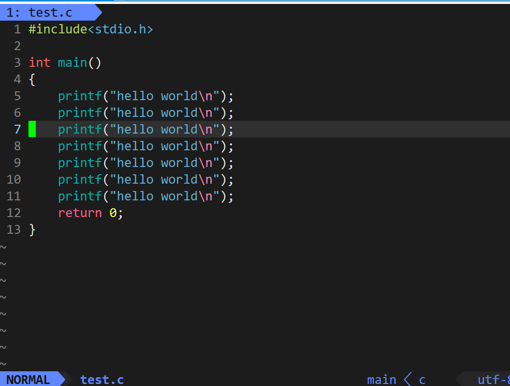

+ 首先按下键盘上的`ctrl+v`，进入到这个视图

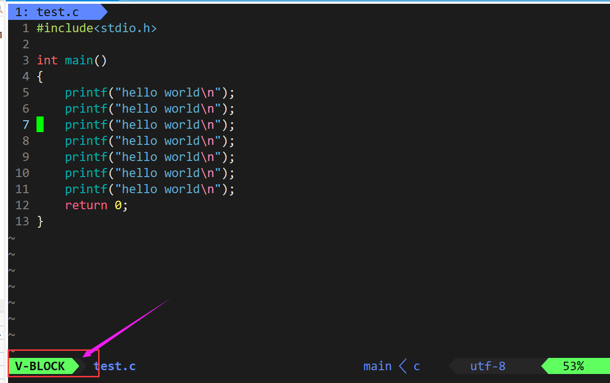

+ 然后再按键盘上的`j`也就是光标往下走了，选中

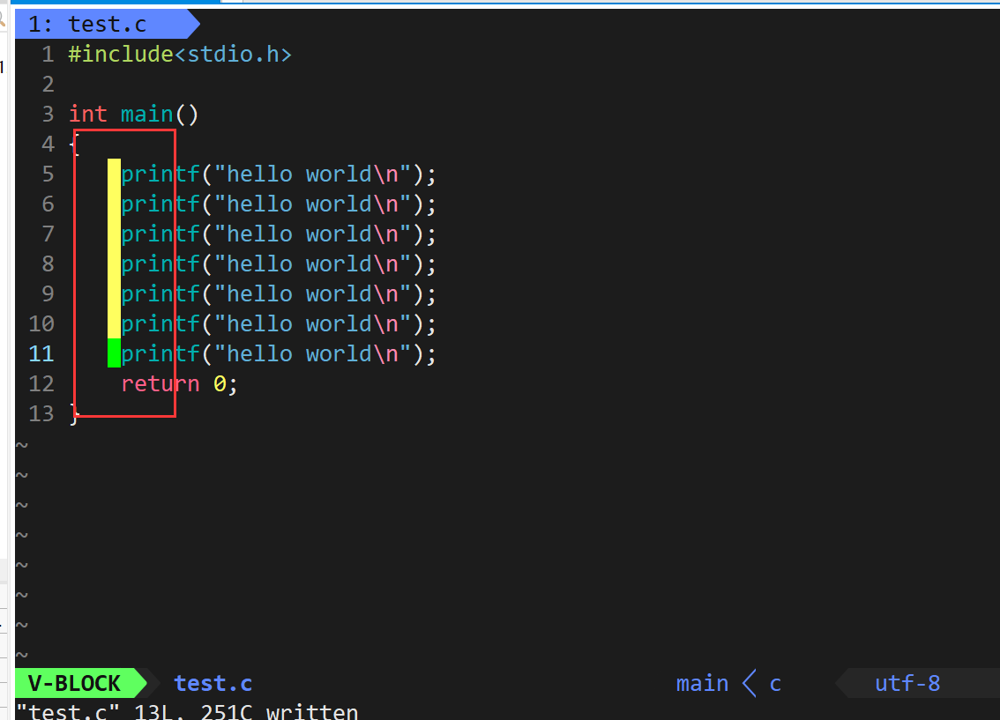

+ 继续按键盘上的`shit+i`也就是`I`，输入两个`//`

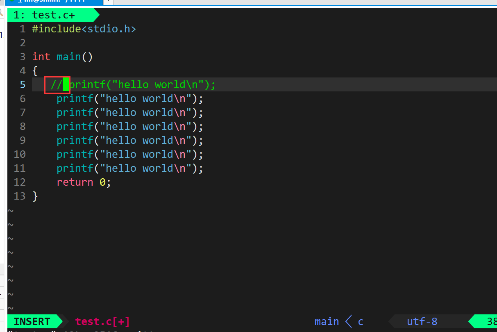

+ 最后再按`Esc`，就大功告成了

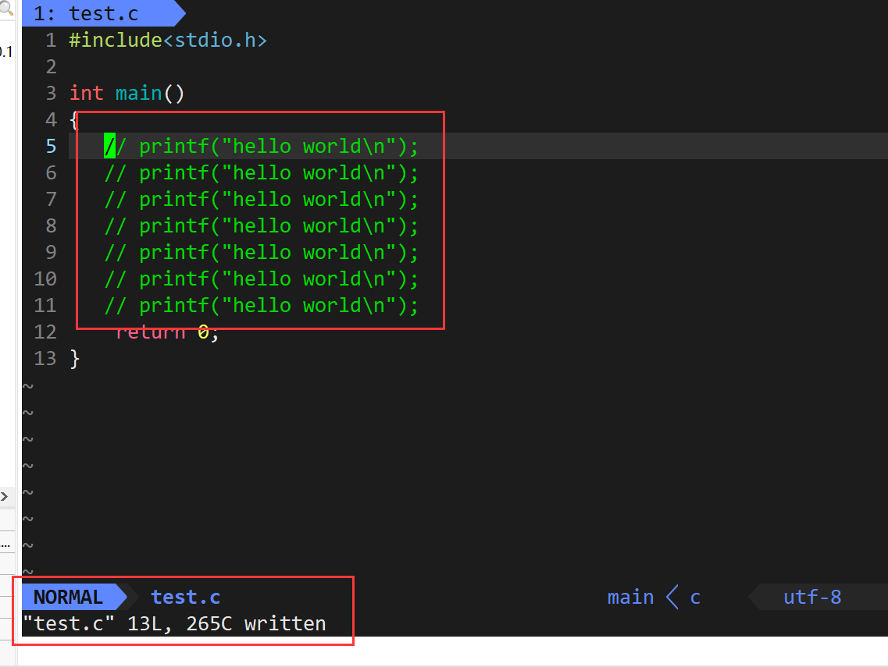

### 执行shell命令
+ 直接在底行模式输入`:!`+命令

### 指定注释
> 下面的`#`可以替换成需要注释的字符
>

注释第3-5行

```bash
3,5 s/^/#/g 
```

解除3-5行的注释

```bash
3,5 s/^#//g
```

注释整个文档

```bash
1,$ s/^/#/g
```

注释整个文档，此法更快

```bash
:%s/^/#/g
```

这里教大家一个常用的命令

+ 其中 前面的%s是通配，然后跟上要匹配的字符，再跟上要替换的字符，**g** 表示全局范围内，**s/printf/PRINTF/g** 是替换的命令格式

```bash
:%s/printf/PRINTF/g 
```

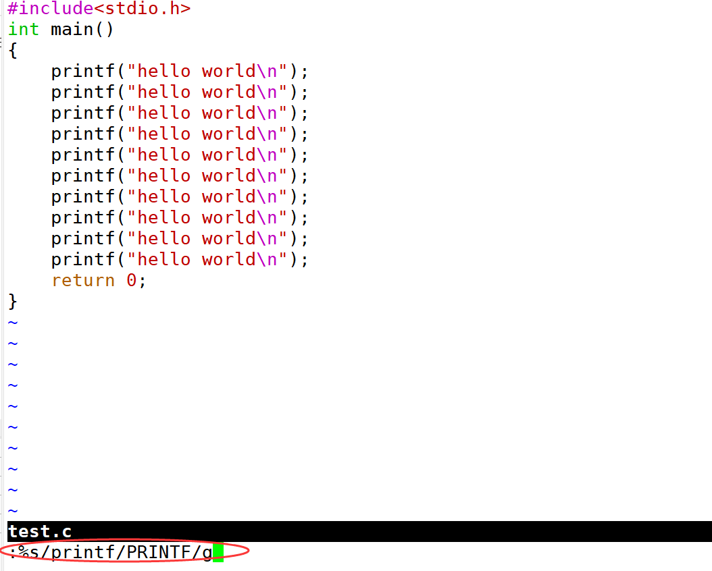

+ 最后直接替换成功了~~

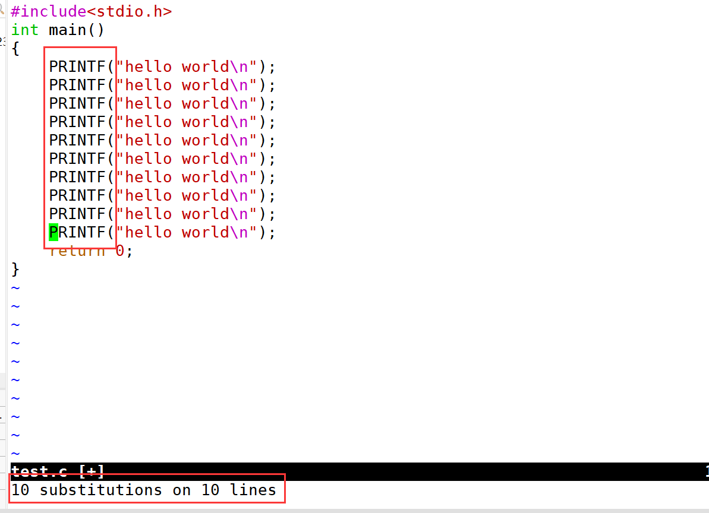

### 窗口命令
打开一个新窗口，光标停在顶层的窗口上

```bash
:split或new 
```

用新窗口打开文件

```bash
:split file或:new file 
```

打开的窗口都是横向的，使用vsplit可以纵向打开窗口

```bash
split
```

移动到下一个窗口

```bash
Ctrl+ww 
```

移动到下方的窗口

```bash
Ctrl+wj 
```

移动到上方的窗口

```bash
Ctrl+wk 
```

### 退出命令
保存并退出

```bash
:wq 
```

保存并退出

```bash
ZZ 
```

强制退出并忽略所有更改

```bash
:q! 
```

放弃所有修改，并打开原来文件。

```bash
:e! 
```

## 六、简单vim配置
### 配置文件的位置
+ 在目录 **/etc/** 下面，有个名为**vimrc**的文件，这是系统中公共的**vim**配置文件，对所有用户都有效。而在每个用户的主目录下，都可以自己建立私有的配置文件，命名为：“**.vimrc**”。
+ 例如，/root目录下，通常已经存在一个**.vimrc**文件，如果不存在，则创建之。 
切换用户成为自己执行 su ，进入自己的主工作目录,执行 cd ~ 
打开自己目录下的`.vimrc`文件：执行 `vim .vimrc`

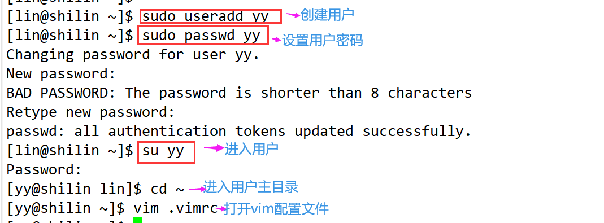

### 常用配置选项,用来测试
设置语法高亮: **syntax on** 
显示行号: **set nu** 
设置缩进的空格数为4: **set shiftwidth=4**

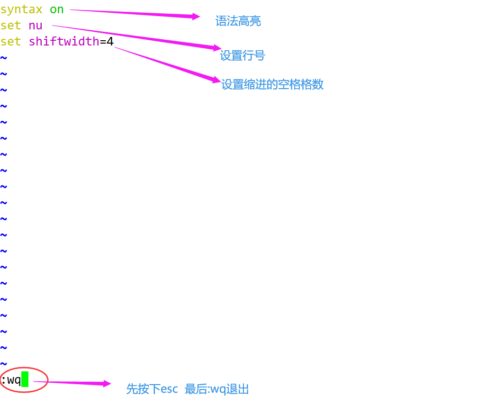

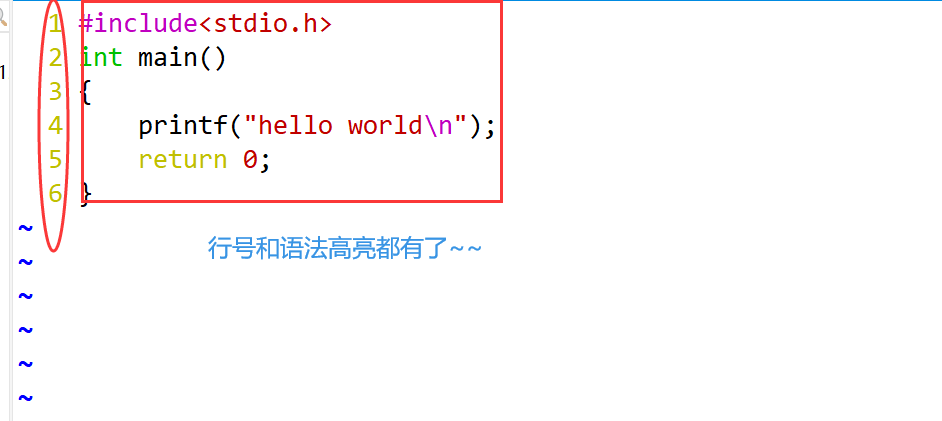
