# Linux进程信号
# 信号的概念
我们生活中的下课铃声，红绿灯，快递发短信取件码等。。。都是信号

如何认识信号：

1. 识别信号（知道信号的处理方法）
2. 即使是我们现在没有产生信号，我也知道信号产生之后干什么？
3. 信号产生了，我们可能不立即处理这个信号，在合适的时候处理，因为我们可能正在做更重要的事情，所以信号产生后，有一个时间窗口，在信号处理时，在这个时间窗口就必须记住信号的到来

**上面所说的信号**：

1. 进程必须识别 + 能够处理信号，如果信号没有产生，也要具备处理信号的能力（处理信号的能力，属于进程内置功能的一部分）。
2. 进程即便是没有收到信号，也能知道哪些信号该怎么处理。
3. 当进程真的收到一个具体的信号的时候，进程可能并不会立即处理这个信号，在**合适的时候**进行处理（这里的在合适的时候有三种方式：**1. 默认动作。2. 忽略。3. 自定义动作（比如信号的捕捉）**）。
4. 一个进程必须当信号产生，到信号开始处理，就一定有时间窗口，**进程具有临时保存哪些信号**已经发生了的能力。

---

+ 如何理解给进程发送信号？

只需要修改目标进程的task_struct信号位图的指定位置改成1即可，本质就是**操作系统**向目标进行写信号！！！

+ 进程如何部分识别信号？

通过位图对应的位置，是0还是1。

结论：**无论信号发送的方式有多少种，最终，全部都是通过OS向目标进程发送信号的！！！**

---

+ 当一个进程运行起来的时候，我们按下键盘上的`ctrl + c`，**本质是被进程解释成为了收到了信号**（ **2号信号** ）

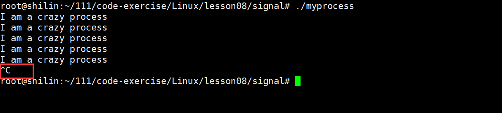

我们可以输入`kill -l`来查看所有的信号

+ 1 ~ 31是普通信号（后面要学一些）
+ 34 ~ 64 是实时信号（我们不关注）
+ 每个信号都有一个编号和一个宏定义名称，这些宏定义可以在`signal.h`中找到
+ 编号34以上的是实时信号，本章只讨论编号34以下的信号，不讨论实时信号。这些信号各自在什么条件下产生，默认的处理动作是什么，在`signal(7)`中都有详细说明: `man 7 signal`

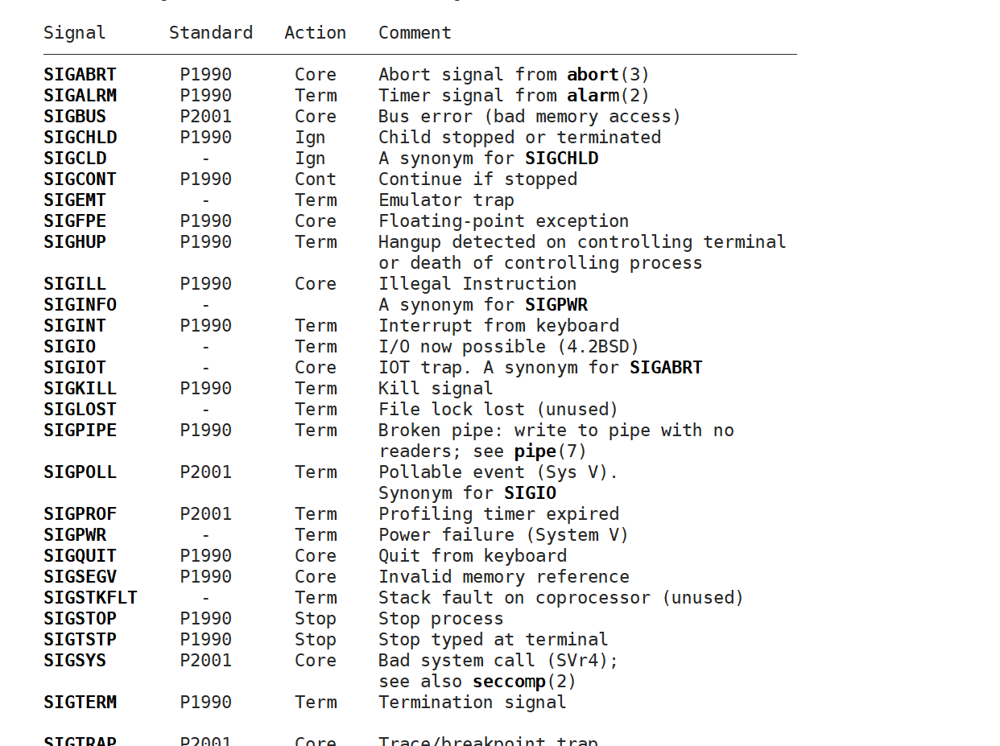

+ Linux中，一次登录中，一个终端，一般配上一个`bash`，每一个登录，只允许一个进程是前台进程，但是可以允许多个进程是后台进程
+ 也就是是说刚刚的程序是比bash更前，bash变成后台进程了，在按下`ctrl + c`后，进程收到了2号信号后就退出了，但是我们平时使用的bash按下`ctrl + c`后为什么bash不会退出呢？这是因为bash对`ctrl + c`做了**特殊处理。**
+ 我们也可以将进程运行到后台，后面加一个`&`

```bash
./myprocess &
```

+ 我们可以**自定义收到指定信号**的动作：

```cpp
sighandler_t signal(int signum, sighandler_t handler);
```

+ 第一个参数是要收到的信号
+ 第二个参数是收到这个参数后该执行的方法

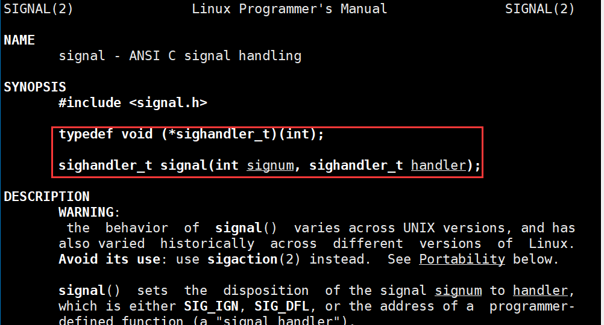

+ 信号的产生，和我们自己的代码运行是**异步**的，属于**软中断**。
+ 信号的本质是仿照硬件的**中断**的行为。

## 收到信号的动作
当进程真的收到一个具体的信号的时候，进程可能并不会立即处理这个信号，在**合适的时候**进行处理（这里的在合适的时候有三种方式：**1. 默认动作。2. 忽略。3. 自定义动作（比如信号的捕捉）**）

1. 默认动作

```cpp
#include <iostream>
#include <signal.h>
#include <unistd.h>


int main()
{
    signal(SIGINT, SIG_DFL);

    while (true)
    {
        std::cout << "I am a process, " << getpid() << std::endl;
        sleep(1);
    }

    return 0;
}
```

+ 执行默认动作，杀掉进程

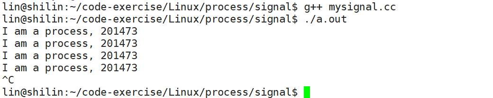

2. 忽略

```cpp
#include <iostream>
#include <signal.h>
#include <unistd.h>


int main()
{
    signal(SIGINT, SIG_IGN);

    while (true)
    {
        std::cout << "I am a process, " << getpid() << std::endl;
        sleep(1);
    }

    return 0;
}
```

+ 当我们按下`ctrl + c`的时候无反应

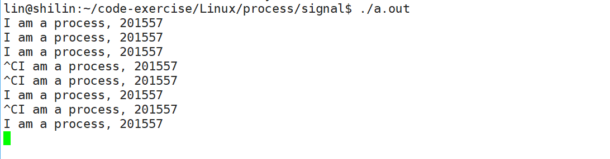

3. 自定义动作

```cpp
#include <iostream>
#include <signal.h>
#include <unistd.h>

void myhandler(int sig)
{
    std::cout << "process get a signal " << sig << std::endl;
}

int main()
{
    // 只要设置了一次，后面都有效
    signal(SIGINT, myhandler);
    // 信号的产生，和我们自己的代码运行是异步的
    while (true)
    {
        std::cout << "I am a crazy process" << std::endl;
        sleep(1);
    }
    return 0;
}
```

+ 按下`ctrl + c`后，收到了2号信号后，执行该方法

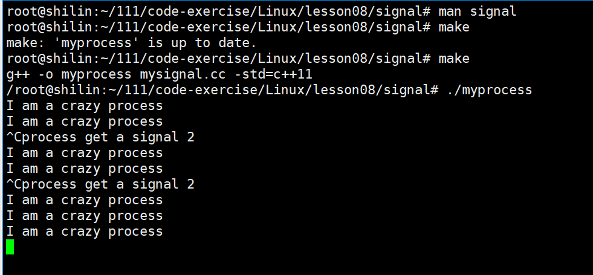

## 谈谈硬件
键盘数据是如何输入给内核的，`ctrl + c`又是如何变成信号的？

+ 键盘被按下，肯定是OS先知道
+ OS怎么知道键盘上有数据了？

**键盘是由中断来工作的**

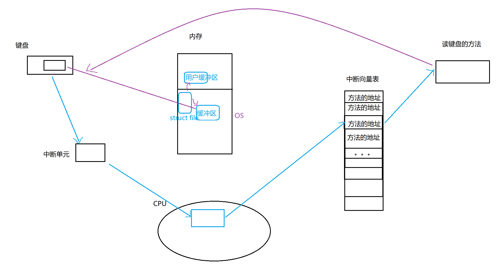


# 信号的产生
信号的产生方式有很多，但最终，给进程发信号(写信号)的一定是操作系统！

## 1. 键盘组合键
+ 键盘产生信号，ctrl+c--->OS识别--->SIGINT--->目标进程发送信号
+ OS怎么知道键盘这个外设上面有数据了！

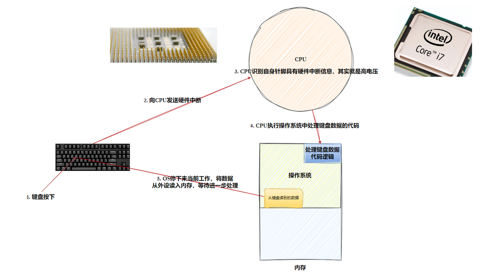

几乎每一种设备，都要在内核中，内置一些处理方法，来进行处理中断的请求：**中断向量表**

里面有键盘的处理方法、磁盘的处理方法、。。。

这个是操作系统的一部分！

+ **不是所有的信号会被捕捉的**

```cpp
#include <iostream>
#include <signal.h>
#include <unistd.h>

void myhandler(int sig)
{
    std::cout << "process get a signal " << sig << std::endl;
}

int main()
{
    // 看看哪个信号可以被捕捉
    for (int i = 0; i < 31; i++)
    {
        signal(i, myhandler);
    }

    while (true)
    {
        std::cout << "I am a crazy process : " << getpid() << std::endl;
        sleep(1);
    }
    return 0;
}
```

经过测试：

+ 只有`9`（杀进程）和`19`（暂停）号信号不能被捕捉，其他全部都可以！！！

## 2. kill命令
```bash
kill [options] <pid>
```

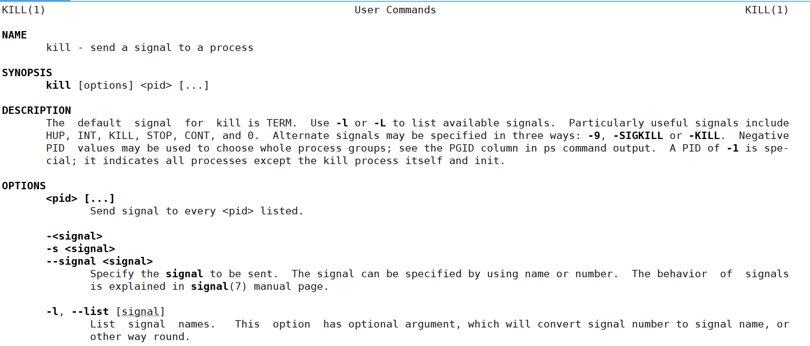

## 3. 系统调用
```c
int kill(pid_t pid, int sig);
```

+ 给pid，发送指定信号

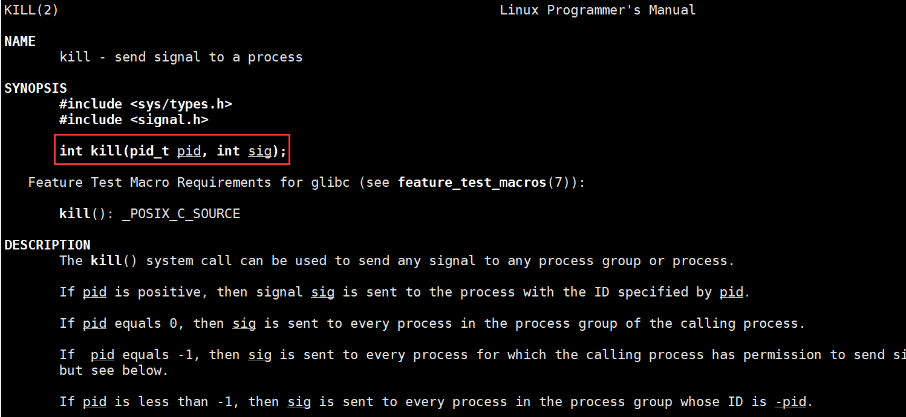

### 自己实现一个kill命令
```cpp
#include <iostream>
#include <cstdio>
#include <signal.h>
#include <unistd.h>

// mykill signal pid
int main(int argc, char *argv[])
{
    if (argc != 3)
    {
        std::cout << "Usage: " << argv[0] << "-signum pid\n" << std::endl;
        exit(-1);
    }

    int signum = atoi(argv[1] + 1); // 去除-
    pid_t pid = atoi(argv[2]);

    int n = kill(pid, signum);
    if (n < 0)
    {
        perror("kill");
        exit(-2);
    }

    return 0;
}
```

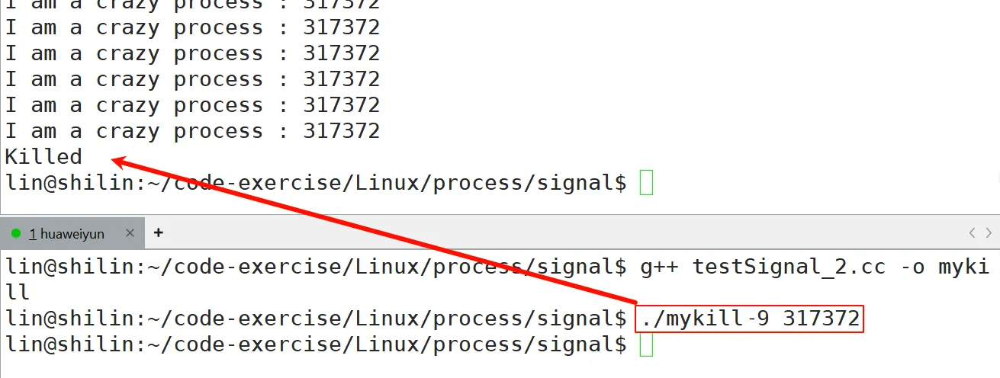

### raise（给自己发送信号）
```cpp
int raise(int sig);
```

这个函数给自己发送信号

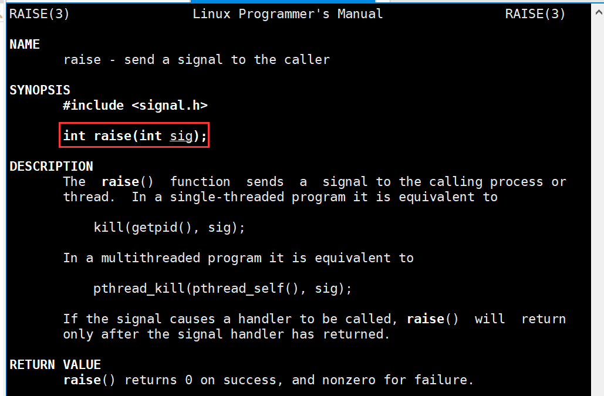

```c
#include <iostream>
#include <cstdlib>
#include <signal.h>
#include <unistd.h>

void handler(int signumber)
{
    std::cout << "获取了一个信号: " << signumber << std::endl;
}

int main()
{
    signal(2, handler); // 先对2号信号进行捕捉
    // 每隔1S，自己给自己发送2号信号
    while (true)
    {
        sleep(1);
        raise(2);
    }
}
```


### abort（正常的进程直接终止）
引起一个正常的进程直接终止

```cpp
void abort(void);
```

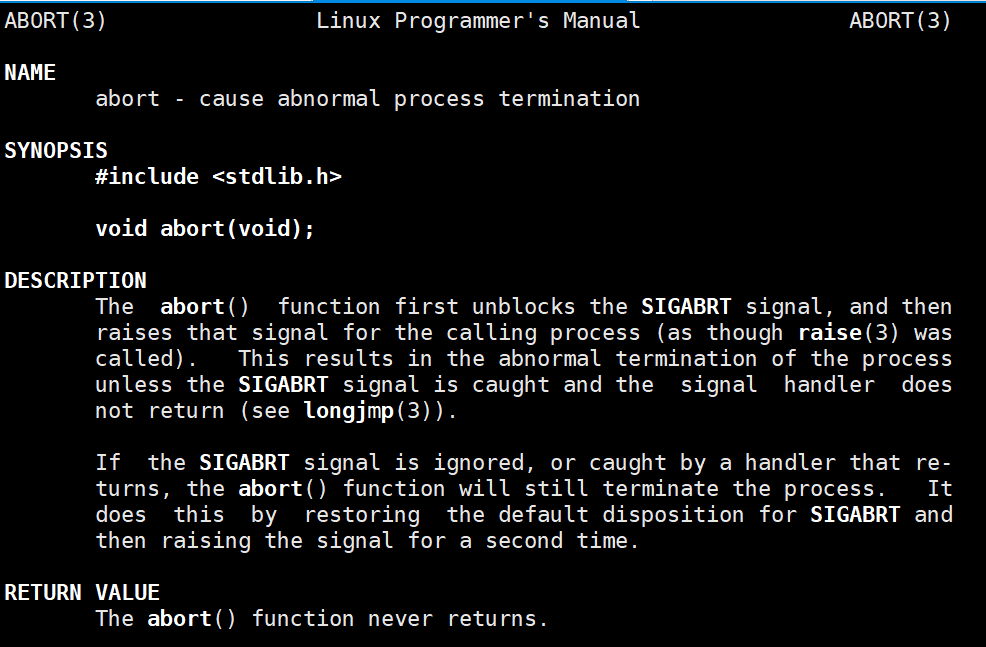

`abort();`这个发送6号信号，然后会自己退出，相当于`kill(getpid(), 6);`

如果自己手动发送6号信号的话，就不会退出

```cpp
#include <iostream>
#include <cstdlib>
#include <signal.h>
#include <unistd.h>

void myhandler(int sig)
{
    std::cout << "process get a signal " << sig << std::endl;
}

int main()
{
    signal(SIGABRT/*6*/, myhandler);
    int cnt = 0;
    while (true)
    {
        std::cout << "I am a process, pid: " << getpid() << std::endl;
        cnt++;
        if (cnt % 2 == 0)
        {
            // kill(getpid(), 2);
            // raise(2); // 给自己发信号
            abort();
        }
        sleep(1);
    }

    return 0;
}
```

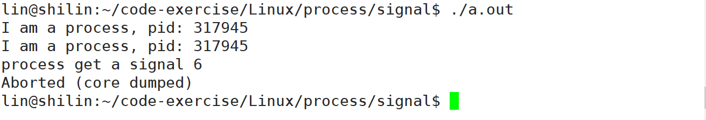

+ 还会继续运行

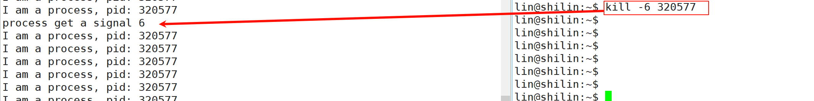

## 4. 由硬件异常产生信号（异常）
```cpp
#include <iostream>
#include <cstdlib>
#include <signal.h>
#include <unistd.h>

using namespace std;

// 信号为什么会一直被触发？？
void handler(int signo)
{
    cout << "...get a sig, pid: "<< getpid() << " number: " << signo << endl; // 只是打印了消息
    sleep(1);
}

int main()
{
    signal(SIGFPE /*8*/, handler);
    signal(SIGSEGV /*11*/, handler);
    cout << "point error before" << endl;

    int *p = nullptr;
    *p = 100; // 野指针

    // int a = 10;
    // a /= 0; // 异常

    cout << "point error before" << endl;
    sleep(1);

    return 0;
}
```

一直会被触发：

+ 这是因为进程没有退出，一直被OS进行调度！
    - 当调度执行一个进程的时候，CPU内部的寄存器本质是：当前进程的硬件上下文
    - 进程一旦默认被杀，当前进程的硬件上下文就不存在了。
    - CPU的报错就没有了，进程默认被杀掉是为了恢复CPU的正常工作。

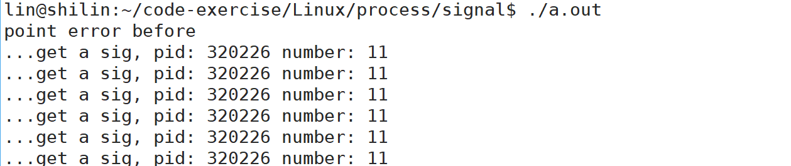

由此可以确认，我们在C/C++当中除零，内存越界等异常，在系统层面上，是被当成信号处理的。

OS 会检查应用程序的异常情况，其实在CPU中有一些控制和状态寄存器，主要用于控制处理器的操作，通常由操作系统代码使用。状态寄存器可以简单理解为一个位图，对应着一些状态标记位、溢出标记位。OS 会检测是否存在异常状态，有异常存在就会调用对应的异常处理方法。

除零异常后，我们并没有清理内存，关闭进程打开的文件，切换进程等操作，所以CPU中还保留上下文数据以及寄存器内容，除零异常会一直存在，就有了我们看到的一直发出异常信号的现象。

+ 在使用man手册查看这里提示这个错误是**段错误**

```bash
man 7 signal
```

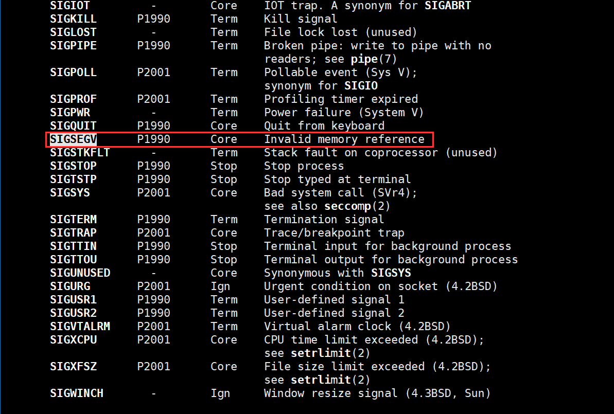

硬件异常被硬件以某种方式被硬件检测到并通知内核，然后内核向当前进程发送适当的信号。例如当前进程执行了除以0的指令，**CPU的运算单元会产生异常**，**内核将这个异常解释为SIGFPE信号**发送给进程。再比如**当前进程访问了非法内存地址,，MMU会产生异常，内核将这个异常解释为SIGSEGV信号发送给进程**。

指定发送某种信号的kill 命令可以有多种写法,上面的命令还可以写成`kill -11 pid`, 11是信号`SIGSEGV`的编号。以往遇到的段错误都是由非法内存访问产生的，而这个程序本身没错,给它发`SIGSEGV`也能产生段错误。

## 5. 由软件异常产生信号（alarm）
`SIGPIPE`是一种由软件条件产生的信号，在“管道”中已经提现了。这里要介绍`alarm`函数 和`SIGALRM`信号。

```cpp
unsigned int alarm(unsigned int seconds);
```

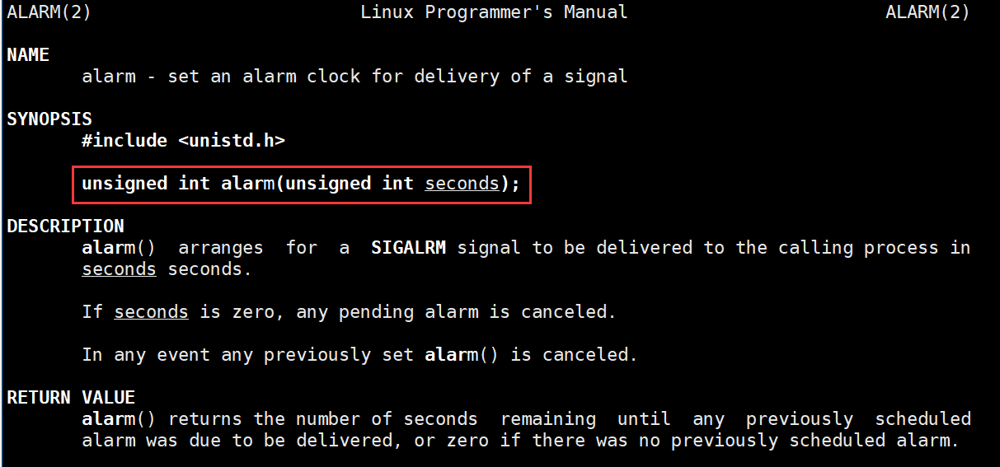

这个函数的返回值是0或者是以前设定的闹钟时间还余下的秒数。打个比方，某人要小睡一觉,设定闹钟为30分钟之后响，20分钟后被人吵醒了，还想多睡一会儿，于是重新设定闹钟为15分钟之后响,“以前设定的闹钟时间还余下的时间”就是10分钟。如果seconds值为0，表示取消以前设定的闹钟，函数的返回值仍然是以前设定的闹钟时间还余下的秒数

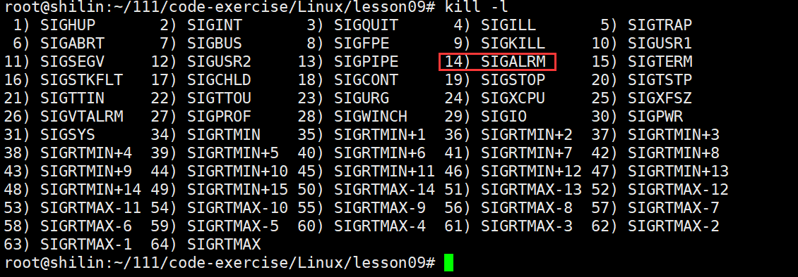

+ 代码测试：

```cpp
void handler(int signo)
{
    sleep(1);
    cout << "...get a sig, number: " << signo << endl;
}

int main()
{
    signal(SIGALRM, handler); // 14号信号
    int n = alarm(5);         // 设置闹钟，5秒之后会响

    while (1)
    {
        cout << "proc is running..., pid: " << getpid() << endl;
        sleep(1);
    }
}
```

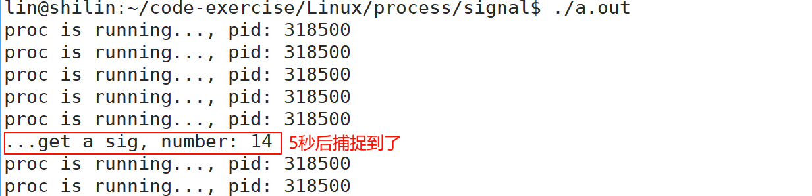

+ 这里的闹钟为什么只响了一次？因为只设置了一次，而且这个闹钟不是异常

```cpp
void work()
{
    cout << "print log..." << endl;
}

void handler(int signo)
{
    work();
    sleep(1);
    cout << "...get a sig, number: " << signo << endl; 
    int n = alarm(5);
    cout << "剩余时间：" << n << endl;
}

int main()
{
    signal(SIGALRM, handler); // 14号信号
    int n = alarm(50);         // 设置闹钟，50秒之后会响

    while (1)
    {
        cout << "proc is running..., pid: " << getpid() << endl;
        sleep(1);
    }
}
```

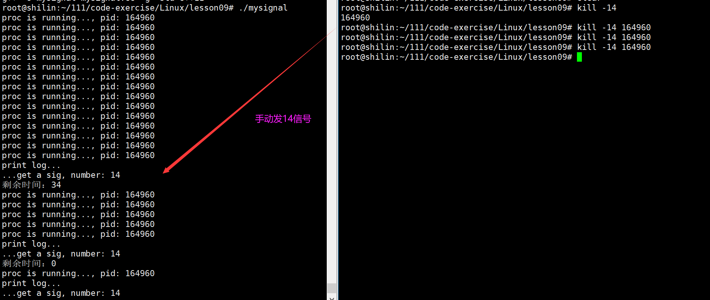

+ `alarm(0)`是取消闹钟
+ 现在我们有5大特征可以产生信号

**信号的产生方式，但是无论信号如何产生，最终一定是谁发送给进程的？OS，因为OS是进程的管理者。**

### io效率问题
+ **这里就可以测试出io效率**

```c
#include <iostream>
#include <unistd.h>
#include <signal.h>

int main()
{
    int count = 0;
    alarm(1);
    while (true)
    {
        std::cout << "count : " << count << std::endl;
        count++;
    }
    return 0;
}
```

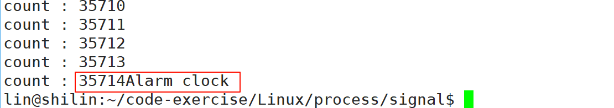

+ **可以看出相差甚远**

```c
#include <iostream>
#include <unistd.h>
#include <signal.h>

long long count = 0;
void handler(int signumber)
{
    std::cout << "count : " << count << std::endl;
    exit(0);
}
int main()
{
    signal(SIGALRM, handler);
    alarm(1);
    while (true)
    {
        count++;
    }
    return 0;
}
```

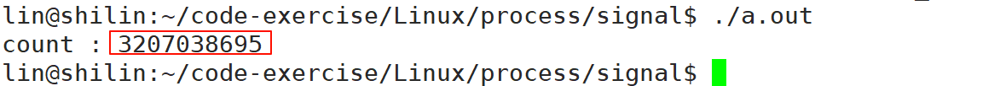

**结论：**

1. **闹钟会响一次，默认终止进程**
2. **有IO效率低**

### 设置重复闹钟
```cpp
#include <iostream>
#include <vector>
#include <functional>
#include <csignal>
#include <unistd.h>

using namespace std;

// 定义回调函数类型
using func_t = std::function<void()>;
vector<func_t> cb; // 回调函数列表
unsigned int interval = 3; // 闹钟间隔时间（秒），默认3秒

// 信号处理函数（实现重复闹钟）
void handler(int signo) {
    // 执行所有注册的回调函数
    for (auto& f : cb) {
        f();
    }

    // 重新设置闹钟（实现重复触发）
    unsigned int remaining = alarm(interval); // 返回上一次闹钟剩余时间（若无则为0）
    cout << "===== 信号捕捉函数被调用 =====" << endl
         << "剩余时间：" << remaining << " 秒" << endl
         << "下次触发时间：" << interval << " 秒后" << endl << endl;

    (void)signo; // 避免未使用参数警告
}

// 刷盘操作
void FlushDisk() {
    cout << "【刷盘操作】数据已写入磁盘" << endl;
}

// 进程调度操作
void sched() {
    cout << "【进程调度】正在进行任务调度..." << endl;
}

// 自定义回调函数示例（可扩展）
void customTask() {
    cout << "【自定义任务】这是一个额外的回调函数" << endl;
}

int main() {
    // 注册回调函数
    cb.push_back(FlushDisk);
    cb.push_back(sched);
    // 可添加更多任务：cb.push_back(customTask);

    // 设置信号处理函数
    if (signal(SIGALRM, handler) == SIG_ERR) {
        cerr << "信号注册失败" << endl;
        return 1;
    }

    // 首次设置闹钟
    alarm(interval); // 从现在开始，每`interval`秒触发一次

    cout << "===== 重复闹钟调度程序启动 =====" << endl
         << "当前间隔时间：" << interval << " 秒" << endl
         << "已注册任务数量：" << cb.size() << " 个" << endl << endl;

    // 保持程序运行（等待信号）
    while (true) {
        pause(); // 阻塞进程，直到收到信号
        // 每次信号触发后，`handler`会重新设置闹钟，因此无需手动处理
    }

    return 0;
}
```

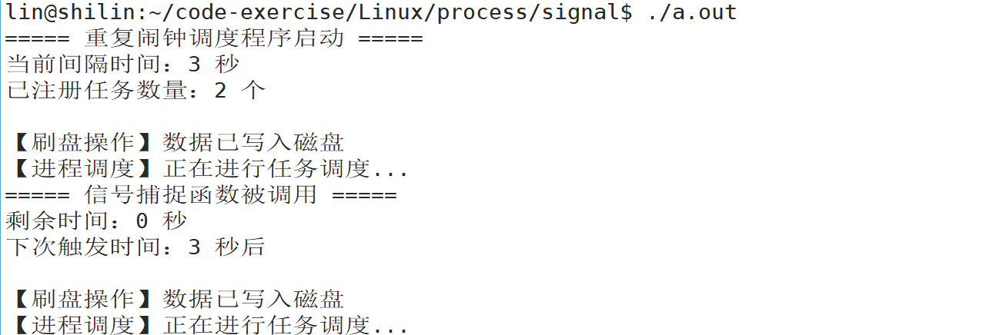

## 理解软件条件
在操作系统中，信号的软件条件指的是由软件内部状态或特定软件操作触发的信号产生机制。这些条件包括但不限于定时器超时（如alarm函数设定的时间到达）、软件异常（如向已关闭的管道写数据产生的SIGPIPE信号）等。当这些软件条件满足时，操作系统会向相关进程发送相应的信号，以通知进程进行相应的处理。简而言之，软件条件是因操作系统内部或外部软件操作而触发的信号产生。

## 理解系统闹钟
系统闹钟，其实本质是OS必须自身具有定时功能，并能让用户设置这种定时功能，才可能实现闹钟这样的技术。

现代Linux是提供了定时功能的，定时器也要被管理：先描述，在组织。内核中的定时器数据结构是：

```c
struct timer_list {
    struct list_head entry;
    unsigned long expires;
    void (*function)(unsigned long);
    unsigned long data;
    struct tvec_t_base_s *base;
};
```

我们可以看到：定时器超时时间`expires`和处理方法`function`。

操作系统管理定时器，采用的是**时间轮**的做法，但为了简单理解，可以把它在组织成为"堆结构"。

## Core Dump
首先解释什么是Core Dump：当一个进程要异常终止时，可以选择把进程的用户空间内存数据全部保存到磁盘上，文件名通常是core，这叫做Core Dump。

进程异常终止通常是因为有Bug，比如非法内存访问导致段错误，事后可以用调试器检查core文件以查清错误原因，这叫做Post-mortem Debug（事后调试）。

一个进程允许产生多大的core文件取决于进程的`Resource Limit`(这个信息保存 在PCB中)。默认是不允许产生core文件的，因为core文件中可能包含用户密码等敏感信息，不安全。

在开发调试阶段可以用`ulimit`命令改变这个限制，允许产生`core`文件。 首先用`ulimit`命令改变Shell进程的`Resource Limit`，允许`core`文件最大为`1024K`：`ulimit -c 1024`

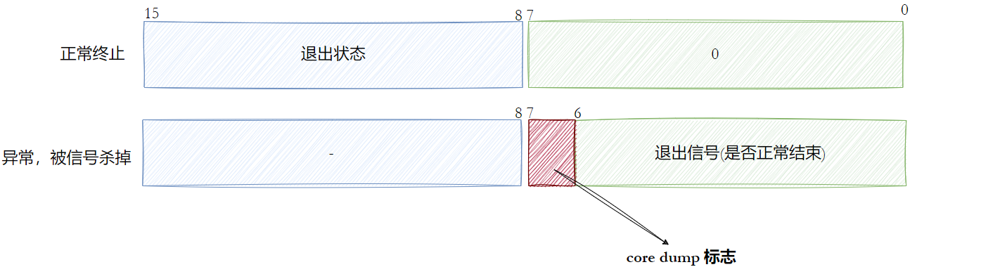

代码样例：

```cpp
int main()
{
    pid_t id = fork();
    if (id == 0)
    {
        // child
        int cnt = 500;
        while (cnt)
        {
            cout << "I am child process, pid " << getpid() << "cnt:" << cnt << endl;
            sleep(1);
            cnt--;
        }
    }

    // father
    int status = 0;
    pid_t rid = waitpid(id, &status, 0);
    if (rid == id)
    {
        cout << "child quit info, rid: " << rid << " exit code: " << ((status >> 8) & 0xFF) << " exit signal: " << (status & 0x7F) << " core dump: " << ((status >> 7) & 1) << endl;
    }
    return 0;
}
```

+ 发送2号信号

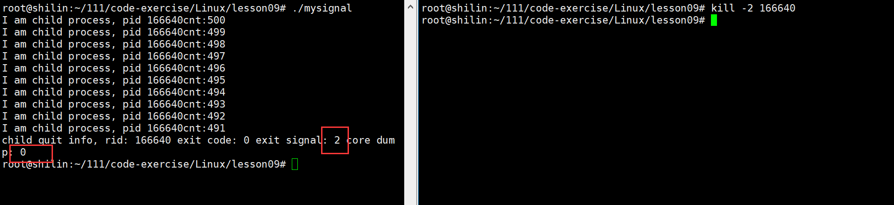

+ 发送8号信号

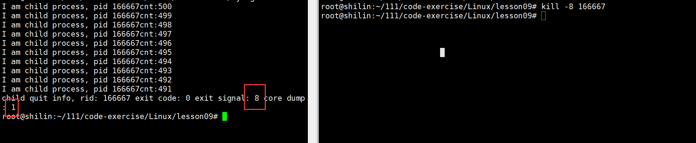

+ 如果查看不到的话我们需要打开

查看：

```bash
ulimit -a
```

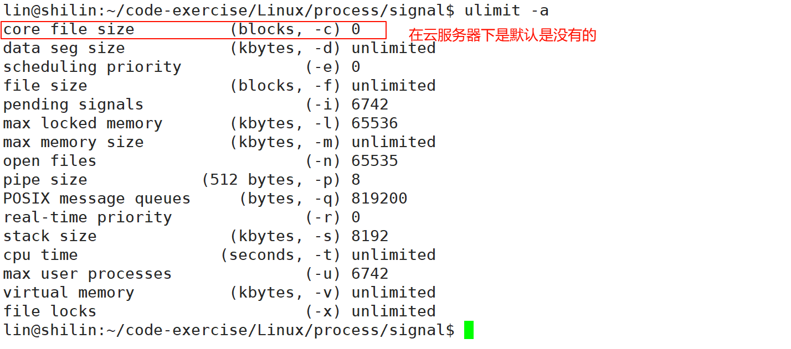

设置：

```bash
ulimit -c 1024
```

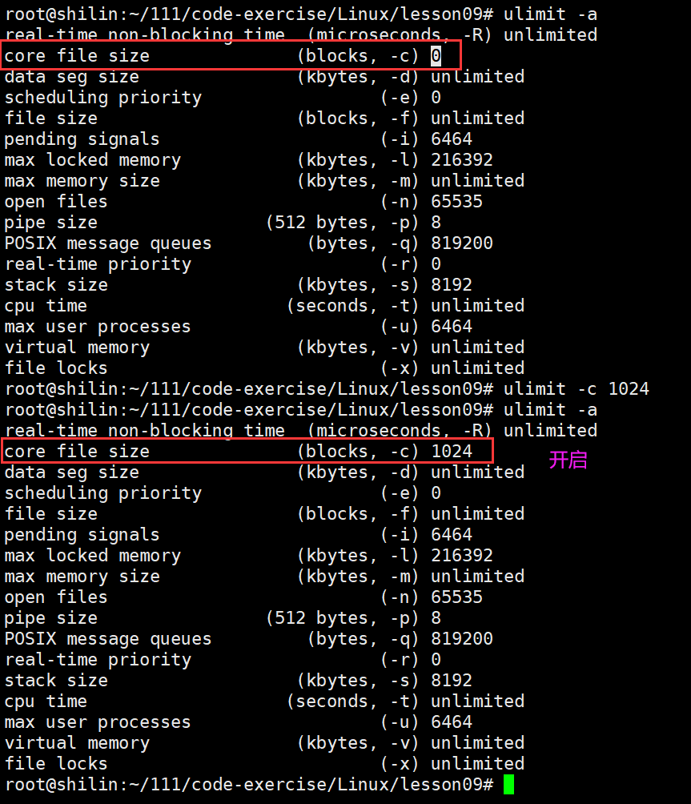

+ 打开系统的core dump功能，一旦进程出现异常，OS会将进程出异常，OS会将进程在内存中的运行信息，给我dump（转储）到进程的当前目录（磁盘），形成**core.pid**文件：**核心转储**（**core dump**），这是一种运行时错误，直接复现问题之后，**直接定位到出错行**，先运行，**在core-file**：**事后调试**。
+ 如果没有在当前目录发现`core`文件，可能是默认的核心转储功能位置不在当前目录。

```bash
sysctl -w kernel.core_pattern=/你的目录/core.%e.%p.%h.%t
```

+ 其中`%e`表示程序名，`%p`表示进程pid，`%t`表示时间戳。生成的core文件后缀就是`.%e.%p.%t`，格式

还可以使用gdb加载core文件进行调试，在gdb种施用`core-file`指令可以加载`core`文件

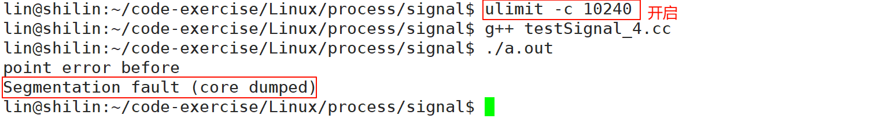

对于普通信号而言，对于进程而言，自己有还是没有收到哪一个信号，是给进程的PCB发的

+ `task_struct`里有一个`int signal`：是**位图**管理
1. 比特位的内容是0还是1，表明是否收到
2. 比特位的位置（第几个），表示信号的编号
3. 所谓的**发信号**，本质就是OS去修改`task_struct`的信号位图对应的比特位，也就是**写信号**
+ 意味着OS是进程的管理者，只有它有资格才能修改`task_struct`内部的属性！！！


# 信号的保存
+ 实际执行信号的处理动作称为信号**递达(Delivery)。**
+ 信号从产生到递达之间的状态,称为信号**未决(Pending)**。
+ 进程可以选择**阻塞(Block)**某个信号。
+ 被阻塞的信号产生时将保持在未决状态,直到进程解除对此信号的阻塞,才执行递达的动作.
+ 注意，阻塞和忽略是不同的,只要信号被阻塞就不会递达,而忽略是在递达之后可选的一种处理动作。
+ 进程收到信号后，可能不会立即处理这个信号，信号不会被处理，就要有一个**时间窗口**。
+ 信号的范围【1,64】，每一种信号都要有自己的一种处理方法【handler表】，这个表是一个函数指针类型，是一个函数指针数组

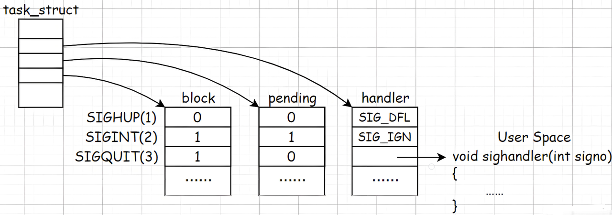

其中：

+ pending：记录是否收到了信号以及哪些信号
+ block：记录特定型号是否被屏蔽
+ handler：记录的是每种信号所对应的**处理关系**和**处理方法**

> **两张位图+一张函数指针数组表**对信号的管理
>

---

+ 每个信号都有两个标志位分别表示阻塞(block)和未决(pending),还有一个函数指针表示处理动作。信号产生时，内核在进程控制块中设置该信号的未决标志，直到信号递达才清除该标志。`SIGHUP`信号未阻塞也未产生过，当它递达时执行默认处理动作。
+ SIGINT信号产生过，但正在被阻塞，所以暂时不能递达。虽然它的处理动作是忽略，但在没有解除阻塞之前不能忽略这个信号，因为进程仍有机会改变处理动作之后再解除阻塞。
+ SIGQUIT信号未产生过，一旦产生SIGQUIT信号将被阻塞，它的处理动作是用户自定义函数sighandler。
+ 如果在进程解除对某信号的阻塞之前这种信号产生过多次，将如何处理?`POSIX.1`允许系统递送该信号一次或多次。
    - Linux是这样实现的：常规信号在递达之前产生多次只计一次，而实时信号在递达之前产生多次可以依次放在一个队列里。

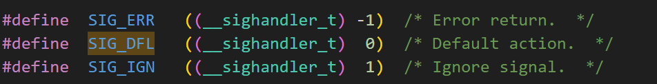

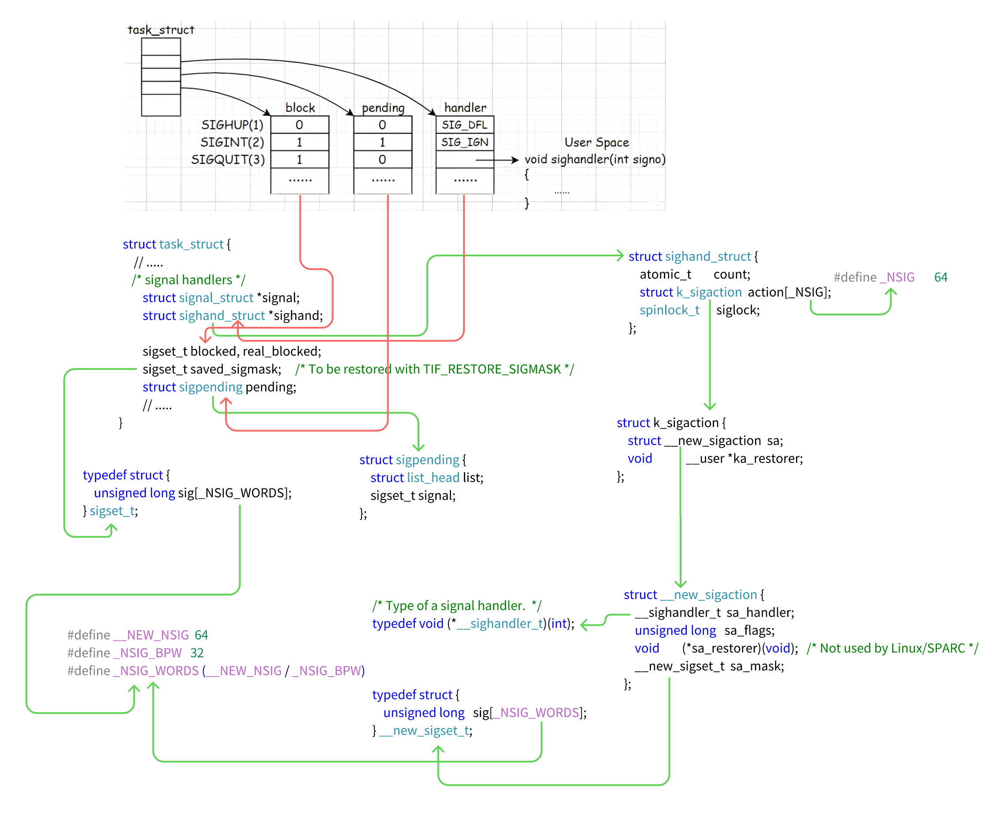

```cpp
#include <iostream>
#include <signal.h>
#include <unistd.h>

int main()
{
    signal(2, SIG_IGN);// 对2号信号忽略

    while(true)
    {
        std::cout << "hello" << std::endl;
        sleep(1);
    }
    return 0;
}
```

+ 忽略：

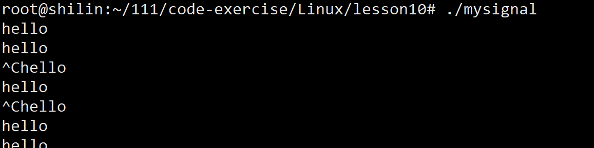

```cpp
int main()
{
    signal(2, SIG_ERR); // 出错返回

    while(true)
    {
        std::cout << "hello" << std::endl;
        sleep(1);
    }

    return 0;
}
```

+ 终止：

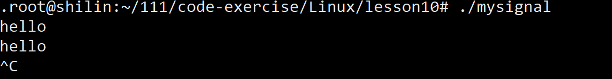

## sigset_t
+ 每个信号只有一个bit的未决标志，非0即1，不记录该信号产生了多少次，阻塞标志也是这样表示的。

因此，未决和阻塞标志可以用相同的数据类型`sigset_t`来存储，`sigset_t`称为**信号集**，这个类型可以表示每个信号的“有效”或“无效”状态,在阻塞信号集中“有效”和“无效”的含义是该信号是否被阻塞，而在未决信号集中“有效”和“无效”的含义是该信号是否处于未决状态。

阻塞信号集也叫做当前进程的信号屏蔽字(Signal Mask),这里的“屏蔽”应该理解为阻塞而不是忽略。

## 信号集操作函数
`sigset_t`类型对于每种信号用一个bit表示“有效”或“无效”状态，至于这个类型内部如何存储这些bit则依赖于系统实现，从使用者的角度是不必关心的，使用者只能调用以下函数来操作`sigset_ t`变量,而不应该对它的内部数据做任何解释，比如用printf直接打印sigset_t变量是没有意义的

```c
#include <signal.h>
int sigemptyset(sigset_t *set);                   // 清空
int sigfillset(sigset_t *set);                    // 设置
int sigaddset(sigset_t *set, int signo);          // 添加特定的信号
int sigdelset(sigset_t *set, int signo);          // 删除一个信号
int sigismember(const sigset_t *set, int signo);  // 判断一个信号是否在
```

+ 函数sigemptyset初始化set所指向的信号集,使其中所有信号的对应bit清零，表示该信号集不包含任何有效信号。
+ 函数sigfillset初始化set所指向的信号集,使其中所有信号的对应bit置位，表示该信号集的有效信号包括系统支持的所有信号。
+ 在使用sigset_t类型的变量之前，一定要调用`sigemptyset`或`sigfillset`做初始化，使信号集处于确定的状态。初始化`sigset_t`变量之后就可以在调用`sigaddset`和`sigdelset`在该信号集中添加或删除某种有效信号。

这四个函数都是**成功返回0，出错返回-1**。`sigismember`是一个布尔函数，用于判断一个信号集的有效信号中是否包含某种信号，若包含则返回1，不包含则返回0，出错返回-1。

## sigprocmask（阻塞信号集）
+ 调用函数`sigprocmask`可以**读取或更改进程的信号屏蔽字**(阻塞信号集)。
+ 信号阻塞就是可以继续接受信号，但是暂时不处理指定信号，实现原理就是在block阻塞信号集合中标记指定的信号，被标记的信号收到后暂时不处理

```cpp
#include <signal.h>
int sigprocmask(int how, const sigset_t *set, sigset_t *oset);
```

**返回值：若成功则为0，若出错则为-1**

如果oset是非空指针，则读取进程的当前信号屏蔽字通过oset参数传出。如果set是非空指针，则更改进程的信号屏蔽字，参数how指示如何更改。如果oset和set都是非空指针,则先将原来的信号屏蔽字备份到oset里，然后根据set和how参数更改信号屏蔽字。假设当前的信号屏蔽字为mask,下表说明了how参数的可选值。

| SIG_BLOCK | set包含了我们希望**添加到当前信号屏蔽字的信号**，相当于`mask=mask|set` |
| --- | --- |
| SIG_UNBLOCK | set包含了我们希望从当前信号屏蔽字中**解除阻塞**的信号，相当于`mask=mask&~set` |
| SIG_SETMASK | 设置当前信号屏蔽字为set所指向的值，相当于`mask=Set` |


如果调用`sigprocmask`解除了对当前若干个未决信号的阻塞，则在`sigprocmask`返回前，至少将其中一个信号递达。

## sigpending	
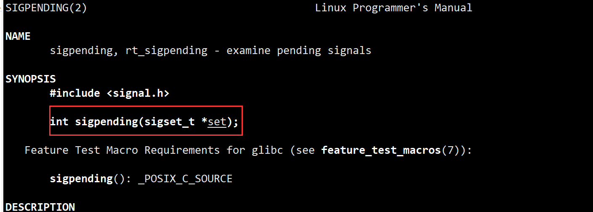

+ 如果一个信号被blook了，即使收到了对应的信号，不能被递达，直到解除屏蔽，才能被递达。
+ 读取当前进程的**未决信号集**，通过set参数传出。**调用成功则返回0,出错则返回-1**。 

```cpp
void handler(int signo)
{
    cout << "catch a signo: " << signo << endl;
}

void PrintPending(sigset_t &pending)
{
    for (int signo = 31; signo >= 1; signo--)
    {
        if (sigismember(&pending, signo))
        {
            cout << "1";
        }
        else
        {
            cout << "0";
        }
    }
    cout << " I am pid: " << getpid();
    cout << endl;
}

int main()
{
    // 1. 对2号信号进行捕捉
    signal(2, handler);

    // 2. 对信号进行屏蔽
    sigset_t bset, oset;
    sigemptyset(&bset);
    sigemptyset(&oset);
    sigaddset(&bset, 2); // 将2号信号添加

    // 3. 使用系统调用，将数据设置进内核
    sigprocmask(SIG_SETMASK, &bset, &oset);

    // 4. 重复打印当前进程的pending
    sigset_t pending;
    int cnt = 0;
    while (true)
    {
        int n = sigpending(&pending);
        if (n < 0)
            continue;
        // 4.1 打印
        PrintPending(pending);
        sleep(1);
        cnt++;

        // 4.2 解除阻塞
        if (cnt == 20)
        {
            cout << "unblock 2 signo" << endl;
            sigprocmask(SIG_SETMASK, &oset, nullptr);
        }
    }

    return 0;
}
```

+ 在发送2号信号后，比特位变成了1

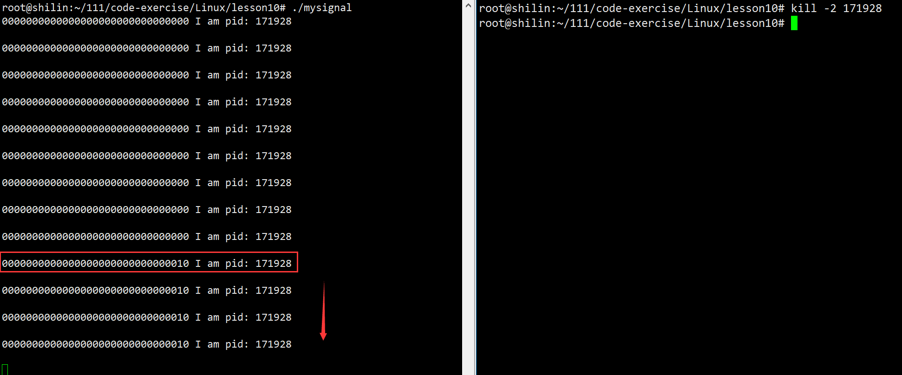

+ 在解除屏蔽后：比特位变成了0
+ 一旦解除了二号的信号的屏蔽，那么就会执行hander方法！

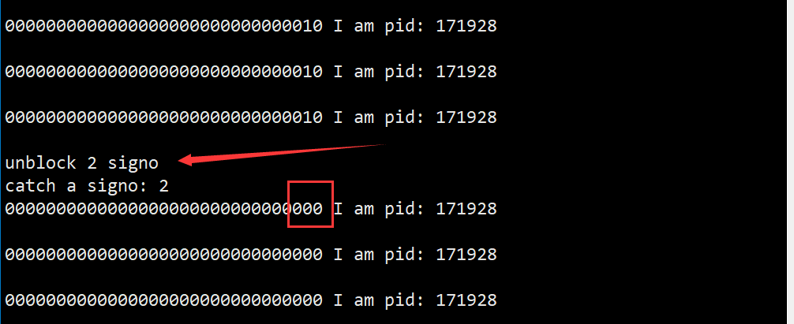

+ 一定有一些是不会被屏蔽

```cpp
void PrintPending(sigset_t &pending)
{
    for (int signo = 31; signo >= 1; signo--)
    {
        if (sigismember(&pending, signo))
        {
            cout << "1";
        }
        else
        {
            cout << "0";
        }
    }
    cout << " I am pid: " << getpid();
    cout << endl
         << endl;
}

int main()
{
    // 尝试将所有信号进行屏蔽
    sigset_t bset, oset;
    sigemptyset(&bset);
    sigemptyset(&oset);
    for (size_t i = 1; i <= 31; i++)
    {
        sigaddset(&bset, i);
    }
    sigprocmask(SIG_SETMASK, &bset, &oset);

    // 打印
    sigset_t pending;
    while (true)
    {
        int n = sigpending(&pending);
        if (n < 0)
            continue;
        PrintPending(pending);
        sleep(1);
    }

    return 0;
}
```

+ 经过测试：`9`和`19`号信号不可被屏蔽，和**当时测试的捕捉的测试一样！！！**

## pending位图，什么时候从1->0？
非可靠信号在进行注册时，会查看是否已经有相同信号添加到未决集合中，如果有则什么都不做，因此非可靠信号只会添加一次，因此处理完毕后会直接移除（准确来说是先移除，后处理）。而可靠信号会重复添加信号信息到sigqueue链表中，相当于可靠信号可以重复添加，处理完毕后，因为有可能还有相同的信号信息待处理，因此并不会直接移除，而是检测没有相同信号信息后才会从pending集合中移除。

```cpp
void handler(int signo)
{
    cout << "catch a signo: " << signo << endl;
    // 在这里再打印pending
        sigset_t pending;
    sigemptyset(&pending);
    // 2.1 获取当前进程的pending信号集
    sigpending(&pending);

    // 2.2 不断打印所有的pending信号集中的信号
    std::cout << "###########################" << std::endl;
    PrintPending(pending);
    std::cout << "###########################" << std::endl;
}

void PrintPending(sigset_t &pending)
{
    for (int signo = 31; signo >= 1; signo--)
    {
        if (sigismember(&pending, signo))
        {
            cout << "1";
        }
        else
        {
            cout << "0";
        }
    }
    cout << " I am pid: " << getpid();
    cout << endl;
}

int main()
{
    // 1. 对2号信号进行捕捉
    signal(2, handler);

    // 2. 对信号进行屏蔽
    sigset_t bset, oset;
    sigemptyset(&bset);
    sigemptyset(&oset);
    sigaddset(&bset, 2); // 将2号信号添加

    // 3. 使用系统调用，将数据设置进内核
    sigprocmask(SIG_SETMASK, &bset, &oset);

    // 4. 重复打印当前进程的pending
    sigset_t pending;
    int cnt = 0;
    while (true)
    {
        int n = sigpending(&pending);
        if (n < 0)
            continue;
        // 4.1 打印
        PrintPending(pending);
        sleep(1);
        cnt++;

        // 4.2 解除阻塞
        if (cnt == 20)
        {
            cout << "unblock 2 signo" << endl;
            sigprocmask(SIG_SETMASK, &oset, nullptr);
        }
    }

    return 0;
}
```

+ 由此看出执行信号捕捉方法之前，**先清0，在调用**。

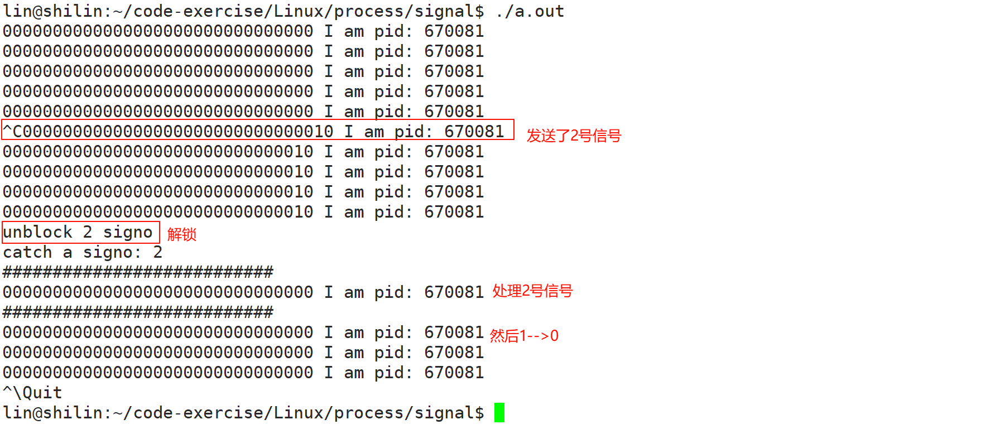

# 信号的捕捉
如果信号的处理动作是用户自定义函数，在信号递达时就调用这个函数，这称为捕捉信号。

什么时候被处理？

+ 进程从内核态切换回用户态的时候，OS会检测当前进程的三张表，决定要不要处理信号，也就是说**当进程从内核态返回到用户态的时候，进行信号的检测和处理**！
+ 调用系统调用，操作系统是会自动会做“身份”切换的，用户的身份变成内核身份，或者反着来

**int 80**  ---> 从用户态陷入内核态

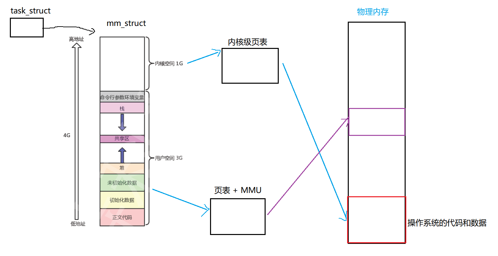

+ 用户级页表有几份？
    - **有几个进程就有几份用户级页表**，因为进程具有独立性
+ 内核级页表有几份？
    - 每个进程看到的`3 ~ 4GB`的东西都是一样的，在整个系统里，进程再怎么切换，`3 ~4GB`的内容是不变的
1. 站在进程视角：我们调用系统中的方法，就是在我自己的地址空间中进行执行的
2. 站在操作系统角度：任何一个时刻都会有进程在执行，我们想执行操作系统的代码，就可以随时执行
+ 操作系统的本质是一个基于时钟中断的一个死循环
+ 在计算机硬件中，有一个时钟芯片，每隔很短的时间，向计算机发送时钟中断

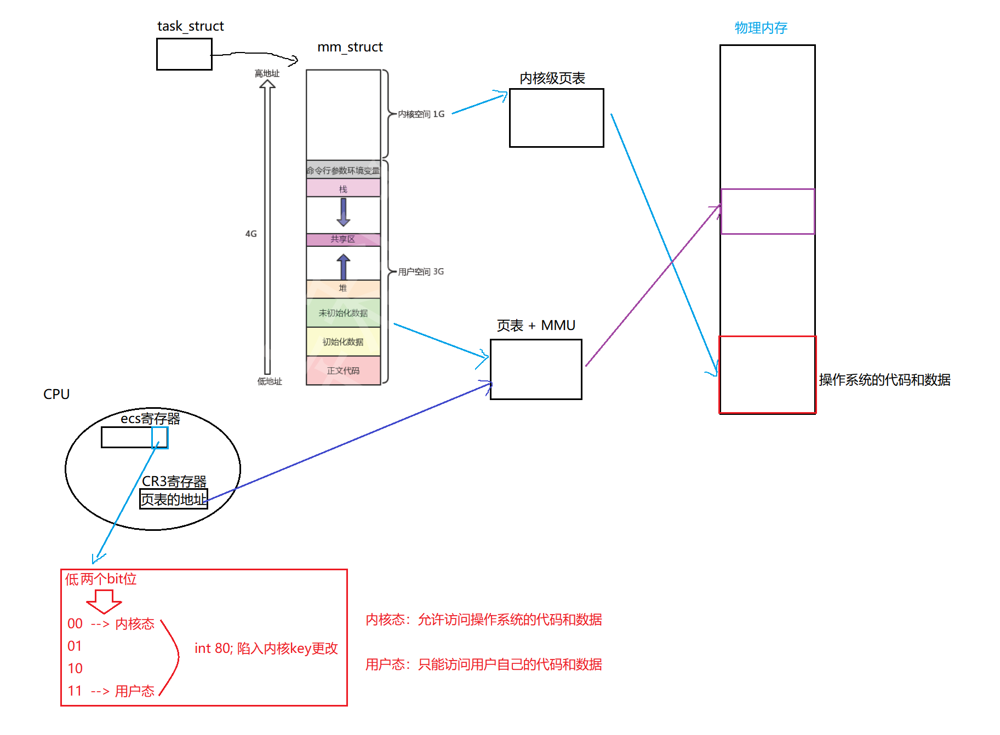

+ 内核态：允许访问操作系统的代码和数据
+ 用户态：只能访问用户自己的代码和数据

进程是会被调度的！！！

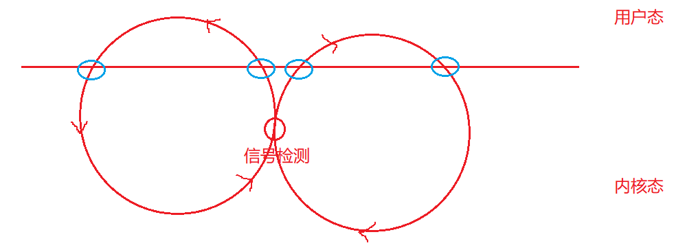

+ 这里要注意**库函数并不会引起运行态的切换**

## sigaction
```cpp
int sigaction(int signum, const struct sigaction *act, struct sigaction *oldact);
```

+ sigaction函数可以读取和修改与指定信号相关联的处理动作。
+ 调用成功则返回0，出错则返回 -1。
+ signo是指定信号的编号。若act指针非空，则根据act修改该信号的处理动作。若oact指针非空，则通过oact传出该信号原来的处理动作。act和oact指向sigaction结构体:
+ 将`sa_handler`赋值为**常数SIG_IGN**传给sigaction表示忽略信号
+ **赋值为常数SIG_DFL表示执行系统默认动作**
+ 赋值为一个**函数指针表示用自定义函数捕捉信号**，或者说向内核注册了一个信号处理函数，该函数返回值为void，可以带一个int参数，通过参数可以得知当前信号的编号，这样就可以用同一个函数处理多种信号。
+ 这也是一个回调函数，**不是被main函数调用，而是被系统所调用**。

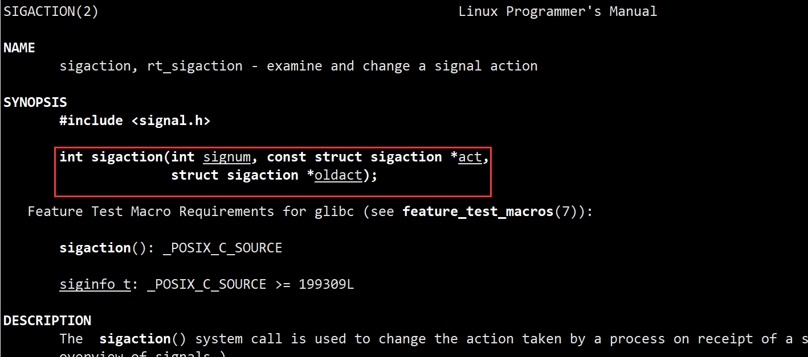

+ 我们只需要关心这两个：

```cpp
struct sigaction {
               void     (*sa_handler)(int); // 处理方法 
               sigset_t   sa_mask;
           };
```

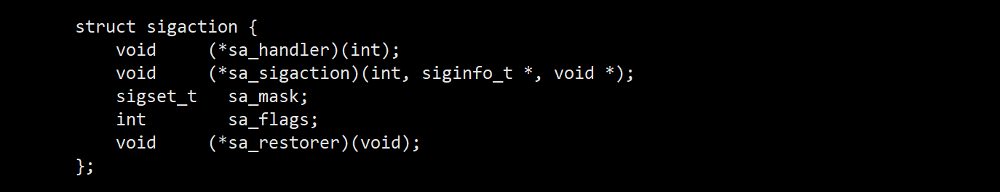

代码测试：

```cpp
#include <iostream>
#include <signal.h>
#include <string.h>
#include <unistd.h>
#include <sys/wait.h>

using namespace std;

void PrintPending()
{
    sigset_t pending;
    sigpending(&pending);

    for (int signo = 31; signo >= 1; signo--)
    {
        if (sigismember(&pending, signo))
            std::cout << "1";
        else
            std::cout << "0";
    }
    std::cout << std::endl;
}

void handler(int signo)
{
    std::cout << "catch a signal, signal number" << signal << std::endl;
    while (true)
    {
        PrintPending();
        sleep(1);
    }
}

int main()
{
    struct sigaction act, oact;
    memset(&act, 0, sizeof(act));
    memset(&oact, 0, sizeof(oact));

    act.sa_handler = handler;
    act.sa_flags = 0;
    sigemptyset(&(act.sa_mask));

    
    sigaction(2, &act, &oact); // 将2号信号的捕捉方法，设置到内核中！

    while (true)
    {
        std::cout << "I am a process " << getpid() << std::endl;
        sleep(1);
    }

    return 0;
}
```

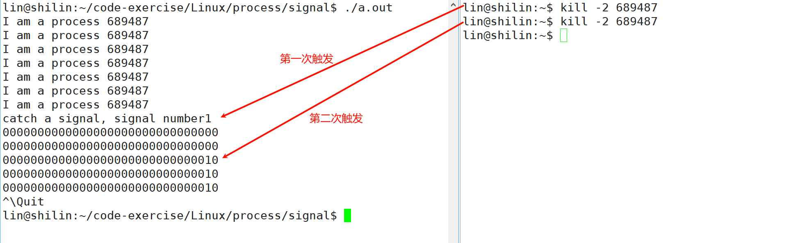

+ 我们再来看看`sa_mask`字段：
+ 这个字段很简单，也就是**在处理一个信号的时候，同时也要屏蔽多个信号就可以使用这个字段添加进去**

```cpp
int main()
{
    struct sigaction act, oact;
    memset(&act, 0, sizeof(act));
    memset(&oact, 0, sizeof(oact));

    sigemptyset(&act.sa_mask);
    // 将1 3 4 信号也同时屏蔽
    sigaddset(&act.sa_mask, 1);
    sigaddset(&act.sa_mask, 3);
    sigaddset(&act.sa_mask, 4);

    
    act.sa_handler = handler;
    sigaction(2, &act, &oact); // 捕捉2号

    while (true)
    {
        std::cout << "I am a process " << getpid() << std::endl;
        sleep(1);
    }
    return 0;
}
```

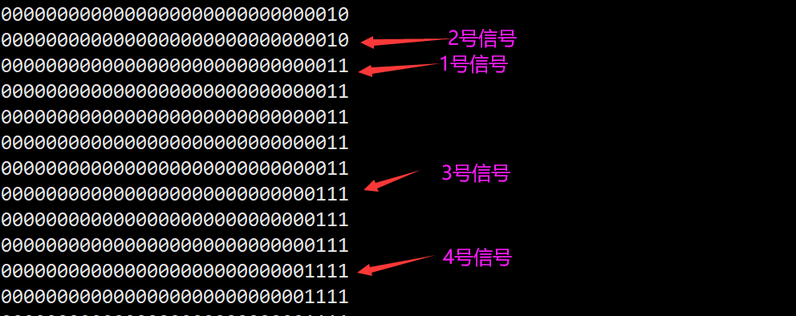

**当某个信号的处理函数被调用时，内核自动将当前信号加入进程的信号屏蔽字，当信号处理函数返回时自动恢复原来的信号屏蔽字**，这样就保证了在处理某个信号时，如果这种信号再次产生，那么它会被阻塞到当前处理结束为止。 如果在调用信号处理函数时，除了当前信号被自动屏蔽之，,还希望自动屏蔽另外一些信号，则用sa_mask字段说明这些需要额外屏蔽的信号，当信号处理函数返回时自动恢复原来的信号屏蔽字。 

# 操作系统是怎么运行的
## 硬件中断
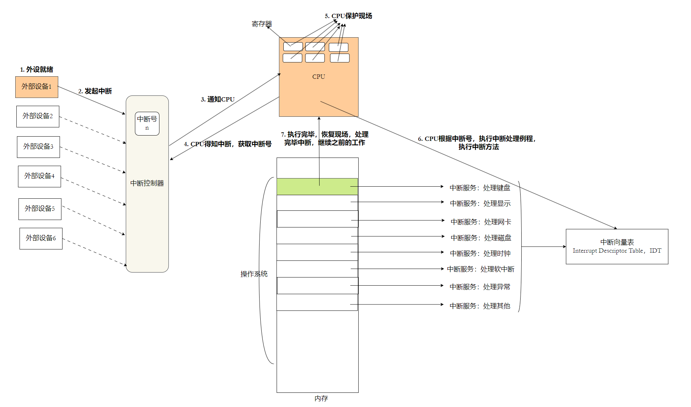

中断向量表就是操作系统的一部分，启动就加载到内存中了

通过外部硬件中断，操作系统就不需要对外设进行任何周期性的检测或者轮询

外部中断的产生，和CPU执行自己的代码，是**异步**的，由外部设备触发的，中断系统运行流程，叫做硬件中断

硬件中断和信号，没有任何关系，是两套技术体系，信号是一种软件方式，模拟中断行为

Linux内核0.11源码：

```c
void trap_init(void)
{
	int i;

	set_trap_gate(0,&divide_error);
	set_trap_gate(1,&debug);
	set_trap_gate(2,&nmi);
	set_system_gate(3,&int3);	/* int3-5 can be called from all */
	set_system_gate(4,&overflow);
	set_system_gate(5,&bounds);
	set_trap_gate(6,&invalid_op);
	set_trap_gate(7,&device_not_available);
	set_trap_gate(8,&double_fault);
	set_trap_gate(9,&coprocessor_segment_overrun);
	set_trap_gate(10,&invalid_TSS);
	set_trap_gate(11,&segment_not_present);
	set_trap_gate(12,&stack_segment);
	set_trap_gate(13,&general_protection);
	set_trap_gate(14,&page_fault);
	set_trap_gate(15,&reserved);
	set_trap_gate(16,&coprocessor_error);
	for (i=17;i<48;i++)
		set_trap_gate(i,&reserved);
	set_trap_gate(45,&irq13);
	outb_p(inb_p(0x21)&0xfb,0x21);
	outb(inb_p(0xA1)&0xdf,0xA1);
	set_trap_gate(39,&parallel_interrupt);
}

// 初始化串行中断程序和串行接口
void rs_init(void)
{
	set_intr_gate(0x24,rs1_interrupt);
	set_intr_gate(0x23,rs2_interrupt);
	init(tty_table[1].read_q.data);
	init(tty_table[2].read_q.data);
	outb(inb_p(0x21)&0xE7,0x21);
}
```

## 时钟中断
进程可以在操作系统的指挥下，被调度，被执行，那么操作系统自己被谁指挥，被谁推动执行呢？

外部设备可以触发硬件中断，但是这个是需要用户或者设备自己触发，有没有自己可以定期触发的设备?

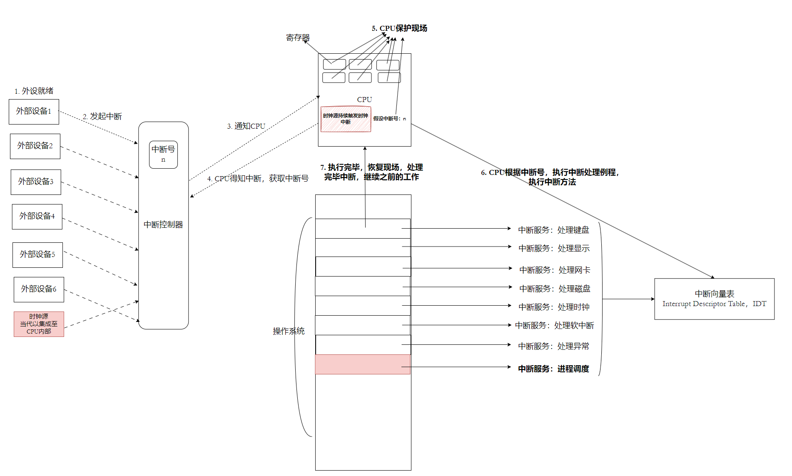

源码分析：

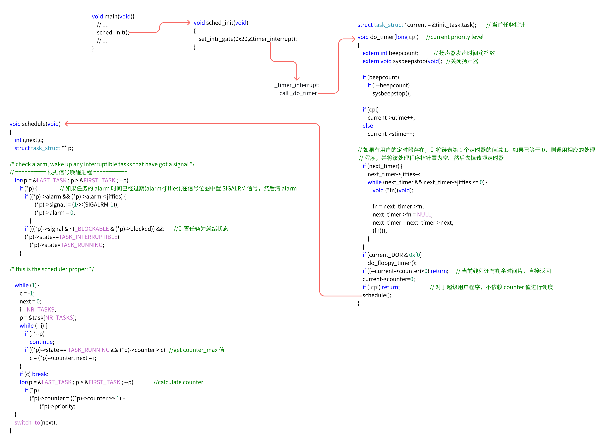

**OS核心就是中断向量表**

结论：OS的运行，是在**时钟源**的中断下，一直触发中断处理，执行的操作系统代码。

当代CPU计算机，没有外部的时钟源了，被集成到了CPU内部

CPU主频，CPU固定频率收到对应的中断，每触发一次时钟中断，时间就是固定的

时钟中断被触发的次数（jiffies++） * 中断触发的时间间隔=时间

> 什么叫做进程的时间片？
>
> + 其实是一个计数器（counter）
>

> 每隔一段时间，触发一次时钟中断，那什么时候运行进程自己的代码
>
> + 每隔一段时间的间隙是空闲的，那么这个时候就可以运行进程自己的代码了
>

OS一般是一种什么软件？

> 操作系统，可以是一种什么都不做的软件，只需要是一个死循环即可
>

```c
void main(void)		/* This really IS void, no error here. */
{			/* The startup routine assumes (well, ...) this */
    // .......
/*
 *   NOTE!!   For any other task 'pause()' would mean we have to get a
 * signal to awaken, but task0 is the sole exception (see 'schedule()')
 * as task 0 gets activated at every idle moment (when no other tasks
 * can run). For task0 'pause()' just means we go check if some other
 * task can run, and if not we return here.
 */
	for(;;) pause();
}
```

OS是一个躺平在中断上的软件集合！

## 软中断
为了让操作系统支持进行系统调用，CPU也设计了对应的汇编指令(int或者 syscall)，可以让CPU内部触发中断逻辑。

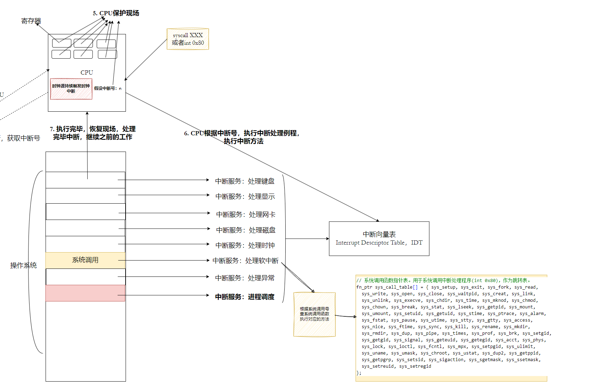

用户层怎么把系统调用号给操作系统？寄存器(比如EAX)

操作系统怎么把返回值给用户？- 寄存器或者用户传入的缓冲区地址

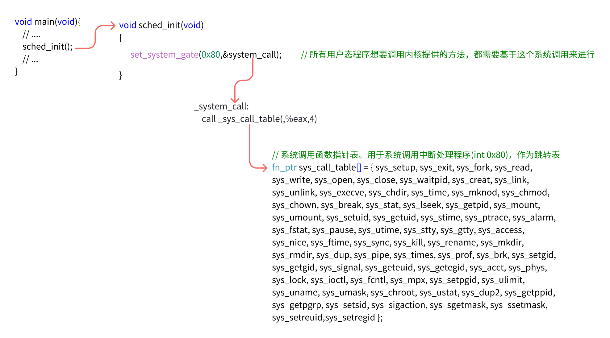

系统调用的过程，其实就是先`int 0x80、syscall`陷入内核，本质就是触发软中断，CPU就会自动执行系统调用的处理方法，而这个方法会根据系统调用号，自动查表，执行对应的方法。

系统调用号的本质：数组下标！

```c
// 系统调用函数指针表。用于系统调用中断处理程序(int 0x80)，作为跳转表
fn_ptr sys_call_table[] = { sys_setup, sys_exit, sys_fork, sys_read,
sys_write, sys_open, sys_close, sys_waitpid, sys_creat, sys_link,
sys_unlink, sys_execve, sys_chdir, sys_time, sys_mknod, sys_chmod,
sys_chown, sys_break, sys_stat, sys_lseek, sys_getpid, sys_mount,
sys_umount, sys_setuid, sys_getuid, sys_stime, sys_ptrace, sys_alarm,
sys_fstat, sys_pause, sys_utime, sys_stty, sys_gtty, sys_access,
sys_nice, sys_ftime, sys_sync, sys_kill, sys_rename, sys_mkdir,
sys_rmdir, sys_dup, sys_pipe, sys_times, sys_prof, sys_brk, sys_setgid,
sys_getgid, sys_signal, sys_geteuid, sys_getegid, sys_acct, sys_phys,
sys_lock, sys_ioctl, sys_fcntl, sys_mpx, sys_setpgid, sys_ulimit,
sys_uname, sys_umask, sys_chroot, sys_ustat, sys_dup2, sys_getppid,
sys_getpgrp, sys_setsid, sys_sigaction, sys_sgetmask, sys_ssetmask,
sys_setreuid,sys_setregid };
```

系统调用号：

```c
#define __NR_restart_syscall      0 /* Linux Specific				   */
#define __NR_exit                 1 /* Common                                      */
#define __NR_fork                 2 /* Common                                      */
#define __NR_read                 3 /* Common                                      */
#define __NR_write                4 /* Common                                      */
#define __NR_open                 5 /* Common                                      */
#define __NR_close                6 /* Common                                      */
#define __NR_wait4                7 /* Common                                      */
#define __NR_creat                8 /* Common                                      */
#define __NR_link                 9 /* Common                                      */
#define __NR_unlink              10 /* Common                                      */
#define __NR_execv               11 /* SunOS Specific                              */
#define __NR_chdir               12 /* Common                                      */
#define __NR_chown		 13 /* Common					   */
#define __NR_mknod               14 /* Common                                      */
#define __NR_chmod               15 /* Common                                      */
#define __NR_lchown              16 /* Common                                      */
#define __NR_brk                 17 /* Common                                      */
#define __NR_perfctr             18 /* Performance counter operations              */
#define __NR_lseek               19 /* Common                                      */
#define __NR_getpid              20 /* Common                                      */
// ........
```

进程来讲，每一个进程都要有自己的用户级页表，但是，对每一个进程来讲，公用一个内核级页表。

无论进程怎么切换，怎么调度，每一个进程都可以找到同一个内核

用户要访问OS，只有一种途径，就是系统调用，通过虚拟地址空间

所有的函数调用，未来全部都可以理解成为在我自己的虚拟地址空间完成✅

我们可什么都没有做，我们就只调用了一次open，fork这样的系统调用，上面所述的工作，谁做的？

> OS提供的真正的系统调用，不是C风格的，而是：系统调用号，约定寄存器，`int 0x80`等技术-->提供的系统调用
>
> Linux内核的设计者，就用C语言给我们封装起来了
>
> C语言帮我们进行函数名->系统调用号->int0x80->n->eax！!
>

如果我们要访问内核空间，就必须要改CPL

## 缺页中断？内存碎片处理？除零野指针错误？
```c
// 下面是异常（陷阱）中断程序初始化子程序。设置它们的中断调用门（中断向量）。 
 // set_trap_gate()与 set_system_gate()的主要区别在于前者设置的特权级为 0，后者是 3。因此 
 // 断点陷阱中断 int3、溢出中断 overflow 和边界出错中断 bounds 可以由任何程序产生。 
 // 这两个函数均是嵌入式汇编宏程序(include/asm/system.h,36,39)。
void trap_init(void)
{
	int i;

	set_trap_gate(0,&divide_error);
	set_trap_gate(1,&debug);
	set_trap_gate(2,&nmi);
	set_system_gate(3,&int3);	/* int3-5 can be called from all */
	set_system_gate(4,&overflow);
	set_system_gate(5,&bounds);
	set_trap_gate(6,&invalid_op);
	set_trap_gate(7,&device_not_available);
	set_trap_gate(8,&double_fault);
	set_trap_gate(9,&coprocessor_segment_overrun);
	set_trap_gate(10,&invalid_TSS);
	set_trap_gate(11,&segment_not_present);
	set_trap_gate(12,&stack_segment);
	set_trap_gate(13,&general_protection);
	set_trap_gate(14,&page_fault);
	set_trap_gate(15,&reserved);
	set_trap_gate(16,&coprocessor_error);
	for (i=17;i<48;i++)
		set_trap_gate(i,&reserved);
	set_trap_gate(45,&irq13);
	outb_p(inb_p(0x21)&0xfb,0x21);
	outb(inb_p(0xA1)&0xdf,0xA1);
	set_trap_gate(39,&parallel_interrupt);
}
```

缺页中断？内存碎片处理？除零野指针错误？这些问题，全部都会被转换成为**CPU内部的软中断**，然后走中断处理例程，完成所有处理。有的是进行申请内存，填充页表，进行映射的。有的是用来处理内存碎片的，有的是用来给目标进行发送信号，杀掉进程等等。

结论：

+ 操作系统就是躺在中断处理例程上的代码块！
+ CPU内部的软中断，比如`int 0x80`或者`syscall`，我们叫做“陷阱”，比如除零/野指针等，我们叫做**异常**。

## 理解内核态和用户态
CPU 指令集：是 CPU 实现软件指挥硬件执行的媒介，具体来说每一条汇编语句都对应了一条CPU 指令，而非常非常多的 CPU 指令 在一起，可以组成一个、甚至多个集合，指令的集合叫 CPU 指令集。

CPU指令集有权限分级，大家试想，CPU指令集可以直接操作硬件的，要是因为指令操作的不规范，造成的错误会影响整个计算机系统的。好比你写程序，因为对硬件操作不熟悉，导致操作系统内核、及其他所有正在运行的程序，都可能会因为操作失误而受到不可挽回的错误，最后只能重启计算机才行。

针对上面的需求，硬件设备商直接提供硬件级别的支持，做法就是对 CPU 指令集设置了权限，不同级别权限能使用的CPU 指令集是有限的，以Inter CPU为例，Inter把CPU指令集操作的权限由高到低划为4级：

+ ring 0：权限最高，可以使用所有 CPU 指令集
+ ring 1
+ ring 2
+ ring 3：权限最低，仅能使用常规 CPU 指令集，不能使用操作硬件资源的 CPU 指令集，比如 IO 读写、网卡访问、申请内存都不行

Linux系统仅采用`ring 0`和`ring 3`这2个权限。CPU中有一个标志字段，标志着线程的运行状态，**用户态为3，内核态为0**。

> ring 0被叫做内核态，完全在操作系统内核中运行
>

+ 执行内核空间的代码，具有ring 0保护级别，有对硬件的所有操作权限，可以执行所有CPU指令集，访问任意地址的内存，在内核模式下的任何异常都是灾难性的，将会导致整台机器停机。

> ring 3被叫做用户态，在应用程序中运行
>

+ 在用户模式下，具有ring 3保护级别，代码没有对硬件的直接控制权限，也不能直接访问地址的内存，程序是通过调用系统接口(System Call APIs)来达到访问硬件和内存，在这种保护模式下，即时程序发生崩溃也是可以恢复的，在电脑上大部分程序都是在，用户模式下运行的

低权限的资源范围较小，高权限的资源范围更大，所以用户态与内核态的概念就是CPU 指令集权限的区别。

我们通过指令集权限区分用户态和内核态，还限制了内存资源的使用，操作系统为用户态与内核态划分了两块内存空间，给它们对应的指令集使用。

在内存资源上的使用，操作系统对用户态与内核态也做了限制，每个进程创建都会分配虚拟空间地址，以Linux32位操作系统为例，它的寻址空间范围是 4G （2的32次方），而操作系统会把虚拟控制地址划分为两部分，一部分为内核空间，另一部分为用户空间，高位的 1G （从虚拟地址0xC0000000 到 0xFFFFFFFF）由内核使用，而低位的 3G （从虚拟地址 0x00000000 到0xBFFFFFFF）由各个进程使用。

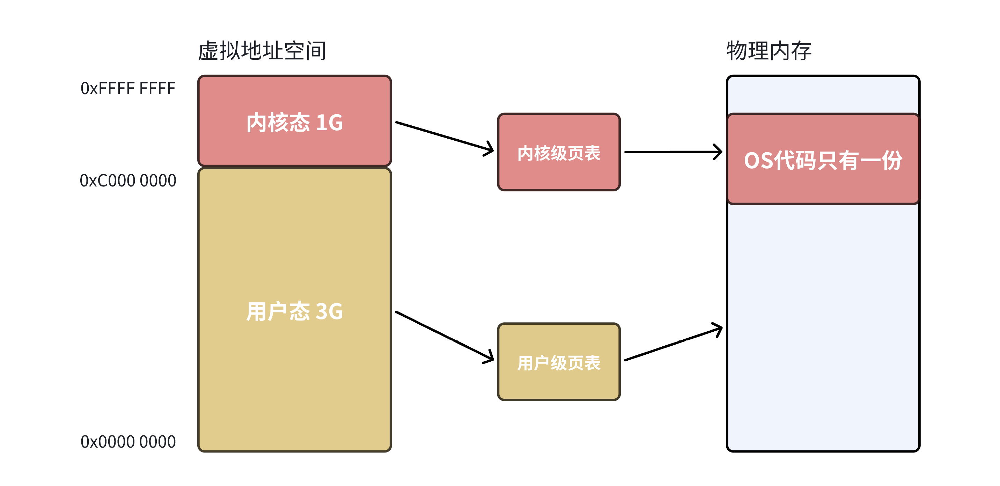

+ 用户态：只能操作 0-3G 范围的低位虚拟空间地址
+ 内核态： 0-4G 范围的虚拟空间地址都可以操作，尤其是对 3-4G 范围的高位虚拟空间地址必须由内核态去操作
+ 3G-4G 部分大家是共享的（指所有进程的内核态逻辑地址是共享同一块内存地址），是内核态的地址空间，这里存放在整个内核的代码和所有的内核模块，以及内核所维护的数据。
+ 在内核运行的过程中，会涉及内核栈的分配，内核的进程管理的代码会将内核栈创建在内核空间中，当然相应的页表也会被创建。

结论：

操作系统无论怎么切换进程，都能找到同一个操作系统！换句话说操作系统系统调用方法的执行，是在进程的地址空间中执行的！

+ 用户态就是执行用户[0,3]GB时所处的状态
+ 内核态就是执行内核[3,4]GB时所处的状态
+ 区分就是按照CPU内的CPL决定，CPL的全称是Current Privilege Level，即当前特权级别。
+ 一般执行 int 0x80 或者syscall软中断，CPL会在校验之后自动变更。

### 用户态与内核态的切换
1. 系统调用 ：用户态进程主动切换到内核态的方式，用户态进程通过系统调用向操作系统申请资源完成工作，例如`fork()`就是一个创建新进程的系统调用。
    1. 操作系统提供了中断指令`int 0x80`来主动进入内核，这是用户程序发起的调用访问内核代码的唯一方式。调用系统函数时会通过内联汇编代码插入int 0x80的中断指令，内核接收到`int 0x80`中断后，查询中断处理函数地址，随后进入系统调用。
2. 异常：当CPU在执行用户态的进程时，发生了一些没有预知的异常，这时当前运行进程会切换到处理此异常的内核相关进程中，也就是切换到了内核态，如缺页异常
3. 中断：当 CPU 在执行用户态的进程时，外围设备完成用户请求的操作后，会向 CPU 发出相应的中断信号，这时 CPU 会暂停执行下一条即将要执行的指令，转到与中断信号对应的处理程序去执行，也就是切换到了内核态。如硬盘读写操作完成，系统会切换到硬盘读写的中断处理程序中执行后边的操作等。

切换时 CPU 需要做什么？？

+ 当某个进程中要读写 IO ，必然会用到 ring 0 级别的 CPU 指令集。而此时 CPU 的指令集操作权限只有 ring 3，为了可以操作ring 0 级别的 CPU 指令集， CPU 切换指令集操作权限级别为ring 0（可称之为提权），CPU再执行相应的ring 0 级别的 CPU 指令集（内核代码）。
+ 代码发生提权时，CPU 是需要切换栈的！！前面我们提到过，内核有自己的内核栈。CPU 切换栈是需要栈段描述符（ss寄存器）和栈顶指针（esp寄存器），这两个值从哪里来？
    - CPU通过一个段寄存器（tr）确定 TSS（任务状态段，struct TSS） 的位置。在TSS结构中存在这么一个 SS0 和 ESP0。提权的时候，CPU就从这个TSS里把SS0和ESP0取出来，放到 ss 和 esp 寄存器中。

切换流程

1. 从用户态切换到内核态时，首先用户态可以直接读写寄存器，用户态操作CPU，将寄存器的状态保存到对应的内存中，然后调用对应的系统函数，传入对应的用户栈地址和寄存器信息，方便后续内核方法调用完毕后，恢复用户方法执行的现场。
2. 从用户态切换到内核态需要提权，CPU 切换指令集操作权限级别为 ring 0。
3. 提权后，切换内核栈。然后开始执行内核方法，相应的方法栈帧时保存在内核栈中。
4. 当内核方法执行完毕后，CPU切换指令集操作权限级别为 ring 3，然后利用之前写入的信息来恢  
复用户栈的执行。

# 可重入函数
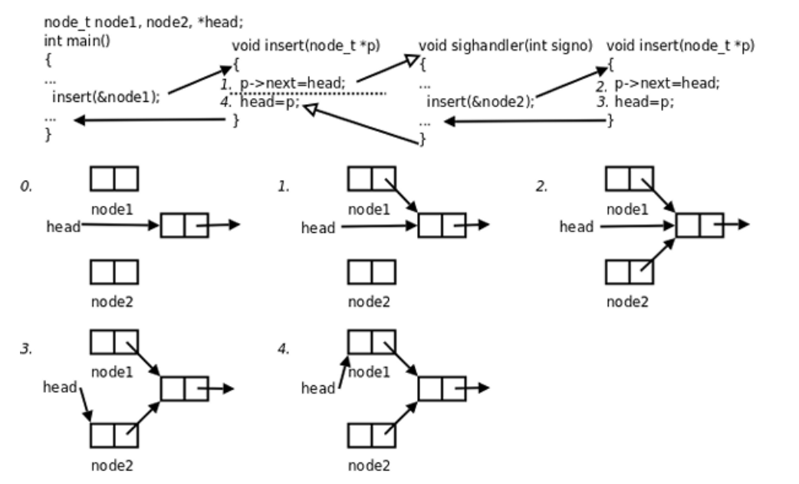

main函数调用insert函数向一个链表head中插入节点node1，插入操作分为两步，刚做完第一步的时候，因为硬件中断使进程切换到内核，再次回用户态之前检查到有信号待处理，于是切换到sighandler函数，sighandler也调用insert函数向同一个链表head中插入节点node2，插入操作的两步都做完之后从sighandler返回内核态，再次回到用户态就从main函数调用的insert函数中继续往下执行，先前做第一步之后被打断，现在继续做完第二步。结果是：main函数和sighandler先后向链表中插入两个节点，而最后只有一个节点真正插入链表中了。

像上例这样，**insert函数被不同的控制流程调用，有可能在第一次调用还没返回时就再次进入该函数，这称为重入，insert函数访问一个全局链表，有可能因为重入而造成错乱，像这样的函数称为不可重入函数，反之，如果一个函数只访问自己的局部变量或参数，则称为可重入(Reentrant) 函数**。为什么两个不同的控制流程调用同一个函数，访问它的同一个局部变量或参数就不会造成错乱?

如果一个函数符合以下条件之一则是不可重入的：

+ 调用了malloc或free，因为malloc也是用全局链表来管理堆的。
+ 调用了标准I/O库函数。标准I/O库的很多实现都以不可重入的方式使用全局数据结构。

函数是否可重入的关键在于函数内部**是否对全局数据进行了不受保护的非原子操作**，其中原子操作指的是一次完成，中间不会被打断的操作，表示操作过程是安全的，因此如果一个函数中如果对全局数据进行了原子操作，但是因为原子操作本身是不可被打断的，因此他是可重入的

---

+ 函数的重入对局部变量并无影响
+ 在一个函数中若对全局变量进行了原子操作，则这个函数一定是可重入的

---

**函数的重入指的是一个函数在不同执行流中同时进入运行，其中不可重入指的是一旦重入就有可能会出问题，而可重入就是不管怎么重入都不会有特殊影响**

+ 函数不可重入指的是函数中可以在不同的执行流中调用函数会出现数据二义问题
+ 函数可重入指的是函数中可以在不同的执行流中调用函数而不会出现数据二义问题

# volatile
正常情况下，键入CTRL+C，2号信号被捕捉，执行自定义动作，修改flag＝1，while条件不满足，退出循环，进程退出。

```cpp
int flag = 0;

void handler(int signo)
{
    std::cout << "catch a signal: " << signo << std::endl;
    flag = 1;
}

int main()
{

    signal(2, handler);

    while (!flag)
        ; // 真
    std::cout << "process quit normal" << std::endl;

    return 0;
}
```

+ 优化级别位O1，可以在`man g++`里面查看优化级别

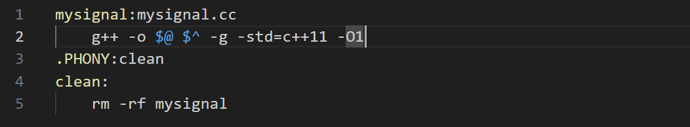

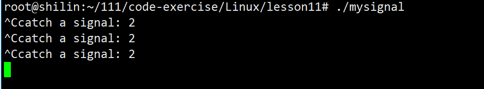

优化情况下，键入CTRL-C，2号信号被捕捉，执行自定义动作，修改flag＝1，但是while条件依旧满足，进程继续运行！但是很明显flag肯定已经被修改了，但是为何循环依旧执行？while循环检查的flag，并不是内存中最新的flag，这就存在了数据二异性的问题。while检测的flag其实已经因为优化，被放在了CPU寄存器当中。这就需要一个关键字：**volatile**

```cpp
volatile int flag = 0;

void handler(int signo)
{
    std::cout << "catch a signal: " << signo << std::endl;
    flag = 1;
}

int main()
{

    signal(2, handler);

    while (!flag)
        ; // 真
    std::cout << "process quit normal" << std::endl;

    return 0;
}
```

`volatile` 作用：**保持内存的可见性，告知编译器，被该关键字修饰的变量，不允许被优化，对该变量的任何操作，都必须在真实的内存中进行操作。**

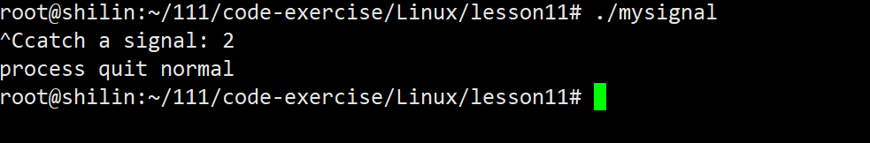

# SIGCHLD信号
`wait`和`waitpid`函数清理僵尸进程，父进程可以阻塞等待子进程结束，也可以非阻塞地查询是否有子进程结束等待清理(也就是轮询的方式)。采用第一种方式，父进程阻塞了就不能处理自己的工作了。

采用第二种方式，父进程在处理自己的工作的同时还要记得时不时地轮询一 下，程序实现复杂。

其实，子进程在终止时会给父进程发`SIGCHLD(17)`信号，该信号的**默认**处理动作是**忽略（SIG_DEL(SIG_IGN)）**，父进程可以自定义`SIGCHLD`信号的处理函数，这样父进程只需专心处理自己的工作，不必关心子进程了，子进程终止时会通知父进程，父进程在信号处理函数中调用`wait`清理子进程即可。

父进程fork出子进程，子进程调用exit(2)终止，父进程自定义`SIGCHLD`信号的处理函数，在其中调用`wait`获得子进程的退出状态并打印。

代码实现：

```cpp
#include <iostream>
#include <signal.h>
#include <unistd.h>
#include <sys/wait.h>

using namespace std;

void handler(int signo)
{
    sleep(5);
    pid_t rid;
    while ((rid = waitpid(-1, nullptr, WNOHANG)) > 0) // 等待任意子进程
    {
        cout << "I am proccess: " << getpid() << " catch a signo: " << signo << "child process quit: " << rid << endl;
    }
}

int main()
{
    signal(SIGCHLD /*17*/, handler);
    for (int i = 0; i < 10; i++)
    {
        pid_t id = fork();
        if (id == 0)
        {
            while (true)
            {
                cout << "I am child process: " << getpid() << ", ppid: " << getppid() << endl;
                sleep(5);
                break;
            }
            cout << "child quit!!!" << endl;
            exit(2);
        }
        sleep(1);
    }
    // father
    while (true)
    {
        cout << "I am father process: " << getpid() << endl;
        sleep(1);
    }

    return 0;
}
```

检测：

```bash
while :; do ps -axj | head -1 ; ps -axj | grep mysignal | grep -v grep; sleep 1; done
```

事实上，由于UNIX的历史原因，要想不产生僵尸进程还有另外一种办法：父进程调用sigaction将`SIGCHLD`的处理动作置为`SIG_IGN`，这样fork出来的子进程在终止时会自动清理掉，不会产生僵尸进程，也不会通知父进程。系统默认的忽略动作和用户用sigaction函数自定义的忽略通常是没有区别的，但这是一个特例。此方法对于Linux可用，但不保证在其它UNIX系统上都可用。

```cpp
int main()
{
    signal(SIGCHLD /*17*/, SIG_IGN); // SIG_DFL -> action -> IGN
    for (int i = 0; i < 10; i++)
    {
        pid_t id = fork();
        if (id == 0)
        {
            while (true)
            {
                cout << "I am child process: " << getpid() << ", ppid: " << getppid() << endl;
                sleep(5);
                break;
            }
            cout << "child quit!!!" << endl;
            exit(2);
        }
        //sleep(rand()%5+3);
        sleep(1);
    }
    // father
    while (true)
    {
        cout << "I am father process: " << getpid() << endl;
        sleep(1);
    }
    return 0;
}
```

