# Linux进程地址空间详解
> C/C++的时候用到的地址是什么地址呢？虚拟地址？物理地址？
>

# 一、程序地址空间
程序地址空间的空间布局图：

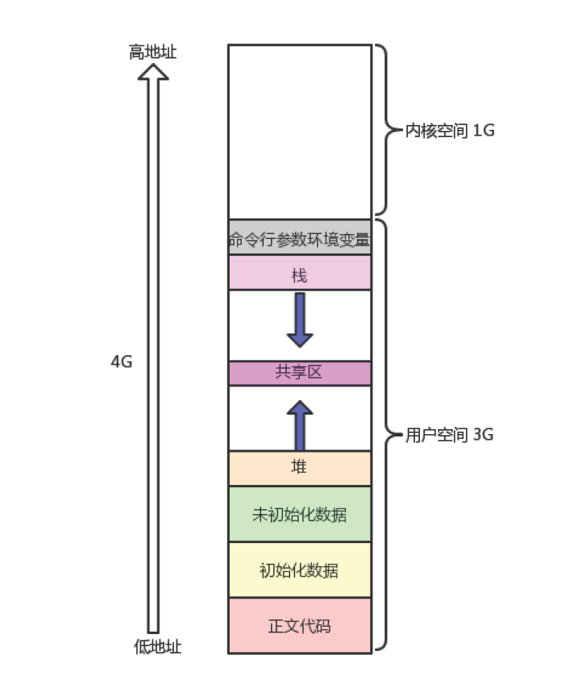

从上面的图我们可以看出，程序地址空间中存在一些相关的区域：正文代码，初始化数据，未初始化数据，堆，共享区，栈，命令行和环境变量，内核空间，除了内核空间，其他空间都属于用户空间，所占的空间大小是3G

其中用户空间：

+ 程序员可以直接用地址来进行访问

其中内核空间：

+ 要访问内核空间，**<font style="color:#DF2A3F;background-color:#FBDE28;">必须要用系统调用</font>**

从下面的代码可以看到：

```c
#include <stdio.h>
#include <unistd.h>
#include <stdlib.h>

int g_unval;
int g_val = 100;

int main(int argc, char* argv[], char* env[])
{
	const char* str = "helloworld";
	printf("code addr: %p\n", main);
	printf("init global addr: %p\n", &g_val);
	printf("uninit global addr: %p\n", &g_unval);
	static int test = 10;
	char* heap_mem = (char*)malloc(10);
	char* heap_mem1 = (char*)malloc(10);
	char* heap_mem2 = (char*)malloc(10);
	char* heap_mem3 = (char*)malloc(10);
	printf("heap addr: %p\n", heap_mem); //heap_mem(0), &heap_mem(1)
	printf("heap addr: %p\n", heap_mem1); //heap_mem(0), &heap_mem(1)
	printf("heap addr: %p\n", heap_mem2); //heap_mem(0), &heap_mem(1)
	printf("heap addr: %p\n", heap_mem3); //heap_mem(0), &heap_mem(1)
	printf("test static addr: %p\n", &test); //heap_mem(0), &heap_mem(1)
	printf("stack addr: %p\n", &heap_mem); //heap_mem(0), &heap_mem(1)
	printf("stack addr: %p\n", &heap_mem1); //heap_mem(0), &heap_mem(1)
	printf("stack addr: %p\n", &heap_mem2); //heap_mem(0), &heap_mem(1)
	printf("stack addr: %p\n", &heap_mem3); //heap_mem(0), &heap_mem(1)
	printf("read only string addr: %p\n", str);
	int i;
	for (i = 0;i < argc; i++)
	{
		printf("argv[%d]: %p\n", i, argv[i]);
	}

	for (i = 0; env[i]; i++)
	{
		printf("env[%d]: %p\n", i, env[i]);
	}
	return 0;
}
```

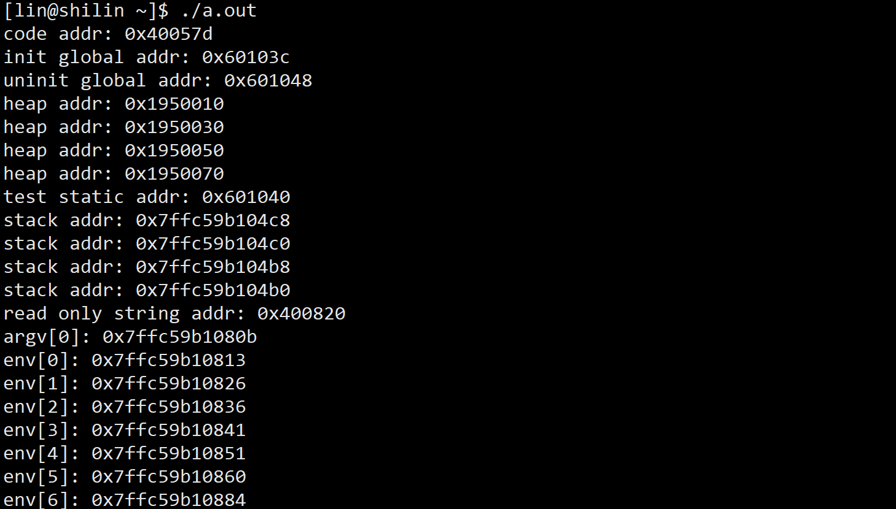

# 二、感受虚拟地址的存在
我们可以用fork进程创建一个子进程，然后再定义一个全局变量，然后父进程和子进程同时访问全局变量然后进行同时观察地址

```c
#include<stdio.h>
#include<string.h>
#include<unistd.h>
#include<stdlib.h>
#include<sys/types.h>

int g_val = 100;

int main(){
  pid_t id = fork();
  if(id < 0){
    perror("fork");
    exit(-1);
}
  else if(id == 0){
    // child
    printf("This is child[%d],%d：%p",getpid(), g_val, &g_val);
}
  else{
    // parent
    printf("This is parent[%d],%d：%p",getpid(), g_val, &g_val);
}
  sleep(1);

  return 0;
}
```

+ 可以观察到父进程和子进程的访问的地址和值是一样的，所以子进程和父进程共享同一个数据


再来观察一个现象

```c
#include<stdio.h>
#include<string.h>
#include<unistd.h>
#include<stdlib.h>
#include<sys/types.h>

int g_val = 50;

int main(){
  pid_t id = fork();
  if(id < 0){
    perror("fork");
  return 0;
}
else if(id == 0){
  g_val = 100;
    printf("child[%d]: %d : %p\n", getpid(), g_val, &g_val);
  }
  else{
    sleep(3);
    printf("parent[%d]: %d : %p\n", getpid(), g_val, &g_val);
  }
  sleep(1);
  return 0;
}
```

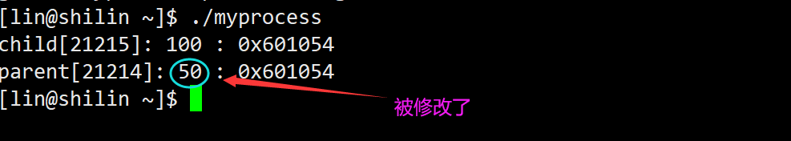

+ 我们发现，父子进程，输出地址是一致的，但是变量内容不一样！

**<font style="color:#DF2A3F;background-color:#FBDE28;">其实这里的地址是虚拟地址，不是真正的物理地址</font>**

变量内容不一样，所以父子进程输出的变量绝对不是同一个变量

+ 但地址值是一样的，说明，该地址绝对不是物理地址！
+ 在Linux地址下，这种地址叫做虚拟地址
+ 我们在用C/C++语言所看到的地址，全部都是虚拟地址！物理地址，用户一概看不到，由OS统一管理

**<font style="color:#DF2A3F;background-color:#FBDE28;">OS</font>**必须负责将**<font style="color:#DF2A3F;background-color:#FBDE28;">虚拟地址转化成物理地址</font>**。

进程在进行访问内存的时候，要先进行虚拟地址到物理地址的映射，找到物理内存，多然后才可以访问数据

+ 这是因为底层的物理地址已经被写时拷贝进行修改了，虚拟地址没有被修改
+ 本质是因为这个变量的虚拟地址是一样的，但是会有不同的物理地址。

# 三、进程地址空间
**分页&虚拟地址空间**

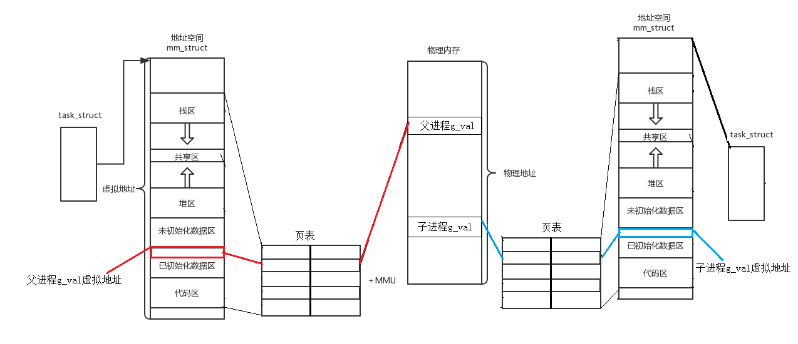

**<font style="color:#DF2A3F;">同一个变量，地址相同，其实是虚拟地址相同，内容不同其实是被映射到了不同的物理地址！</font>**

1. 其实在每一个进程建立的时候，操作系统不仅会为进程创建一个PCB，同时还会为每一个进程创建一个进程地址空间。
2. 每一个进程都有自己独立的进程地址空间，那么这样系统中的进程地址空间就会非常多，操作系统就需要对这些进程地址空间进行管理和控制，而**管理的本质就是先描述再组织**，描述的意思就是为进程地址空间创建一个结构体。
3. 在Linux系统中，有一个结构体叫做：**<font style="color:#DF2A3F;">mm_struct</font>**，每一个进程都是相对独立，互不影响的，每一个进程中的**PCB**和**mm_struct**都是相互独立的，这就是进程的独立性。
4. 进程地址空间中的结构和前面讲的程序地址空间的结构一样，其中都包含正文代码，初始化数据，未初始化数据，堆区，共享区和栈区，还有命令行参数和环境变量。
5. 在实际中，每个区域都每一个区域都是由对应的`start`和`end`来维护的，如果我们想改变对应区域的大小，我们可以通过设置对应区域的start和end进行修改即可，在每一个区域的start和end中会包含很多的地址，这个地址就是所谓的虚拟地址，不是物理地址，物理地址是存在于内存中的，不是存在进程地址空间的。

# 四、mm_struct
描述linux下进程的地址空间的所有的信息的结构体是`mm_struct`（内存描述符）。每个进程只有一个`mm_struct`结构，在每个进程的`task_struct`结构中，有一个指向`mm_struct`该进程的结构指针。

```c
struct task_struct
{
    /*...*/
    struct mm_struct *mm; //对于普通的用户进程来说该字段指向他的
    虚拟地址空间的用户空间部分，对于内核线程来说这部分为NULL。
    struct mm_struct *active_mm; // 该字段是内核线程使用的。当该
    进程是内核线程时，它的mm字段为NULL，表示没有内存地址空间，可也并不是真正的没有，这是因为所
    有进程关于内核的映射都是一样的，内核线程可以使用任意进程的地址空间。
    /*...*/
}
```

可以说，`mm_struct`结构是对整个用户空间的描述。每一个进程都会有自己独立的`mm_struct`，这样每一个进程都会有自己独立的地址空间才能互不干扰。先来看看由`task_struct`到`mm_struct`，进程的地址空间的分布情况：

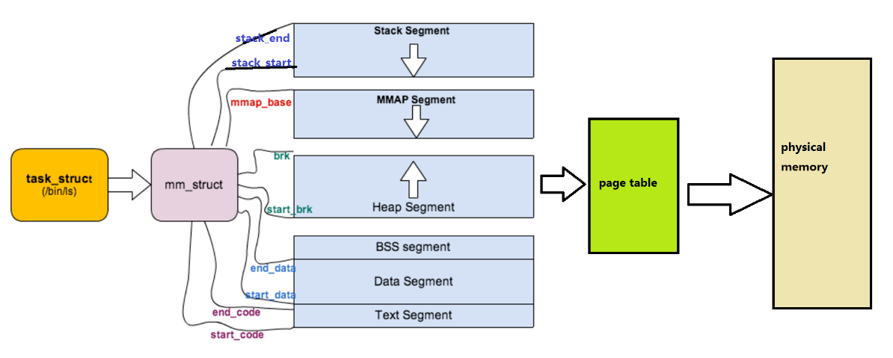

定位`mm_struct`文件所在位置和`task_struct`所在路径是一样的，不过他们所在文件是不一样的，`mm_struct`所在的文件是`mm_types.h`。

```c
struct mm_struct
{
    /*...*/
    struct vm_area_struct *mmap; /* 指向虚拟区间(VMA)链表 */
    struct rb_root mm_rb; /* red_black树 */
    unsigned long task_size; /*具有该结构体的进程的虚拟地址空间的大小*/
    /*...*/
    // 代码段、数据段、堆栈段、参数段及环境段的起始和结束地址。
    unsigned long start_code, end_code, start_data, end_data;
    unsigned long start_brk, brk, start_stack;
    unsigned long arg_start, arg_end, env_start, env_end;
    /*...*/
}
```

那既然每一个进程都会有自己独立的`mm_struct`，操作系统肯定是要将这么多进程的`mm_struct`组织起来的！虚拟空间的组织方式有两种：

1. 当虚拟区较少时采取单链表，由`mmap`指针指向这个链表；
2. 当虚拟区间多时采取**红黑树**进行管理，由`mm_rb`指向这棵树。

linux内核使用 `vm_area_struct` 结构来表示一个独立的虚拟内存区域(VMA)，由于每个不同质的虚拟内存区域功能和内部机制都不同，因此一个进程使用多个`vm_area_struct`结构来分别表示不同类型的虚拟内存区域。上面提到的两种组织方式使用的就是vm_area_struct结构来连接各个VMA，方便进程快速访问。

```c
struct vm_area_struct {
	unsigned long vm_start; //虚存区起始
	unsigned long vm_end; //虚存区结束
	struct vm_area_struct* vm_next, * vm_prev; //前后指针
	struct rb_node vm_rb; //红黑树中的位置
	unsigned long rb_subtree_gap;
	struct mm_struct* vm_mm; //所属的 mm_struct
	pgprot_t vm_page_prot;
	unsigned long vm_flags; //标志位
	struct {
		struct rb_node rb;
		unsigned long rb_subtree_last;
	} shared;
	struct list_head anon_vma_chain;
	struct anon_vma* anon_vma;
	const struct vm_operations_struct* vm_ops; //vma对应的实际操作
	unsigned long vm_pgoff; //文件映射偏移量
	struct file* vm_file; //映射的文件
	void* vm_private_data; //私有数据
	atomic_long_t swap_readahead_info;
#ifndef CONFIG_MMU
	struct vm_region* vm_region; /* NOMMU mapping region */
#endif
#ifdef CONFIG_NUMA
	struct mempolicy* vm_policy; /* NUMA policy for the VMA */
#endif
	struct vm_userfaultfd_ctx vm_userfaultfd_ctx;
} __randomize_layout;
```

所以我们可以对上图在进行更细致的描述，如下图所示：

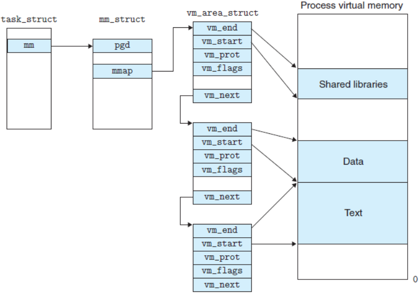

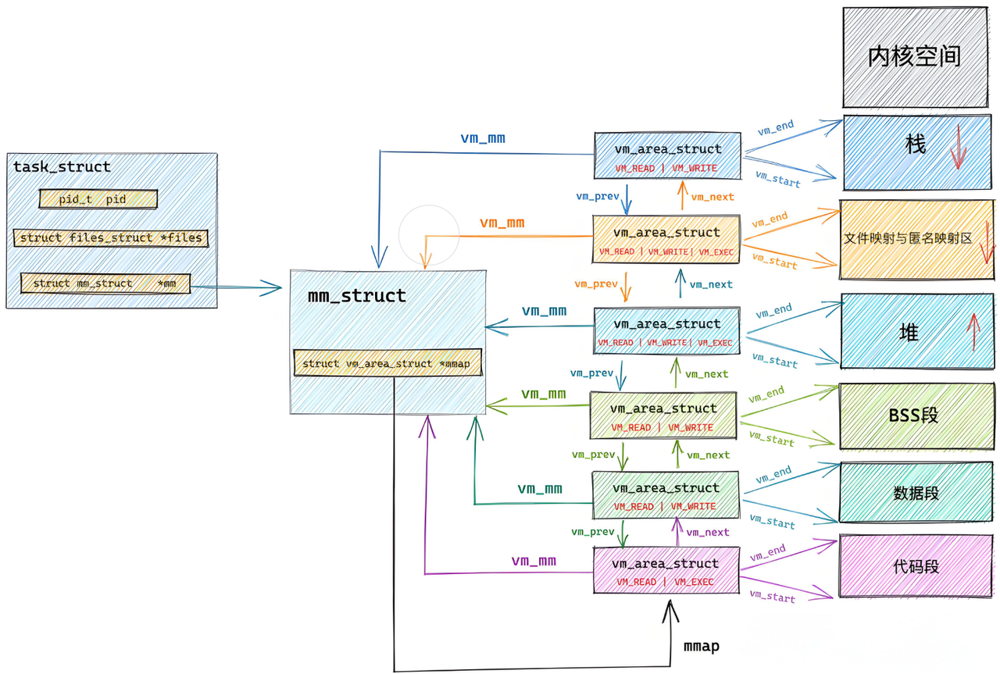

# 五、程序从磁盘加载到内存的过程
> 程序被编译但还没有被加载到内存时程序内部是否存在地址？
>

+ <font style="color:#DF2A3F;background-color:#FBDE28;">代码被编译形成可执行程序之后是存在对应的地址的，也就是说程序中的每一段代码在程序中的位置已经确定，这个地址是代码在程序中的地址，与内存中的虚拟地址是没有任何关系的</font>

> 程序被编译但还没有被加载到内存时程序内部是否存在区域？
>

+ <font style="color:#DF2A3F;background-color:#FBDE28;">代码被编译成可执行程序之后，在可执行程序中是存在相关区域的，存在的区域有：正文代码，初始化数据区，未初始化数据区，命令行参数和环境变量，这时需要注意：并不存在栈区和堆区，栈区和堆区是要等程序加载到内存中才存在的</font>

## 物理地址和虚拟地址的区别
物理地址是在代码在真正的内存中存在的地址（位置）

+ 虚拟地址是指CPU直接能够访问到的地址，并不是相关代码在内存中的真实地址，这个虚拟地址的作用就是能够通过页表相关的映射关系转化成代码在内存中的物理地址
+ 因此，我们一旦有一个代码的虚拟地址还有页表的映射关系，其实就相当于我们有了代码在内存中的物理地址，虚拟地址和物理地址是通过**<font style="color:#DF2A3F;background-color:#FBDE28;">页表</font>**建立联系的


+ 当一个进程运行起来的时候，每个进程都会分别创建`PCB`和`mm_struct`，每一个进程都独自拥有一个进程地址空间。
+ 而**<font style="color:#DF2A3F;background-color:#FBDE28;">页表</font>**是进程地址空间和物理内存之间存在的一个工具，主要作用就是负责利用其中虚拟地址和物理地址的映射关系实现虚拟地址和物理地址之间的相互转化，也就是说有了虚拟地址和页表，我就可以找到对应的物理地址，也就是相当于对应映射。

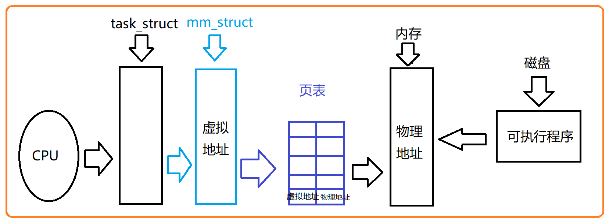

+ 上面的图就足矣说名问题，同一个变量，地址相同，其实是虚拟地址相同，内容不同其实是被映射到了不同的物理地址

# 六、写时拷贝
+ 写时拷贝是指当数据被修改的时候，系统会在内存中重新为该数据开辟一块新空间，将该数据原来的内存拷贝放到新空间，然后再在新空间对该数据进行修改
+ 在我们前面的`感受虚拟地址的存在`的时候知道，父子进程访问同一个数据出现两个结果是因为有虚拟地址的存在，那么我们可以近一步讨论一下这个问题

当系统识别到子进程想要修改该数据的时候，系统会为子进程在内存的另一个地方开辟一块新的空间，然后将该**数据原来的值拷贝放到新空间**，然后再在新空间对数据进行修改，这个新空间就是该变量在内存中实际存在的物理地址空间，此时**操作系统会更新子进程中的页表映射关系**，其中**改变的是页表中原先映射关系的物理地址**，让原先的物理地址更新为更改后的物理地址，

+ 因此，我们会发现，父子进程的页表中对该变量的虚拟地址是一样的，但是在子进程对该数据进行修改之后，子进程的页表被重新更新，更新之后映射出的物理地址就是不一样的，此时父子进程访问的其实是两个不同的物理空间中的内容，所以结果就会出现父子进程访问同一个虚拟地址出现不同的结果

在只读的情况下：

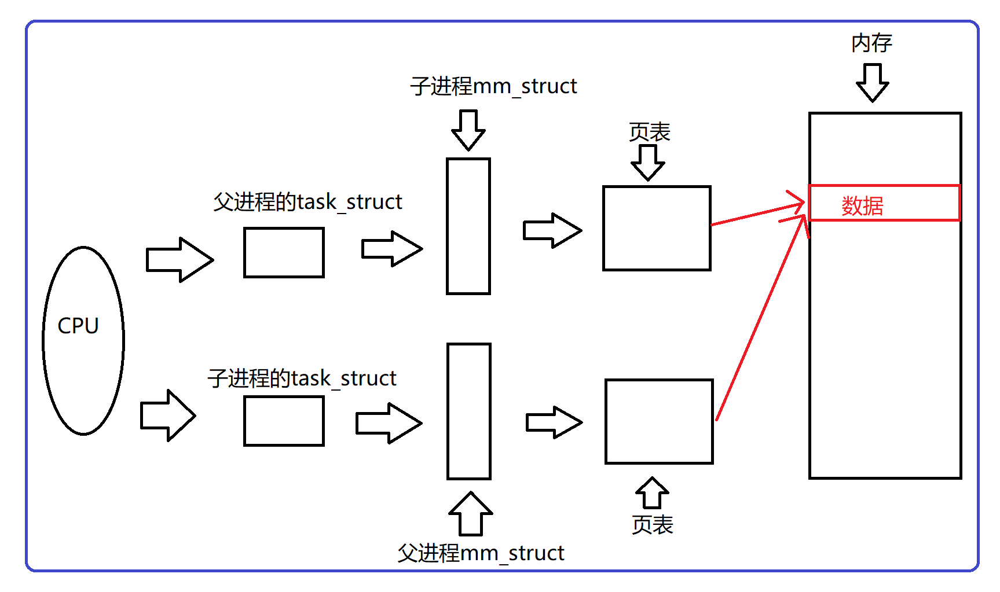

在写入的时候，进行写时拷贝：

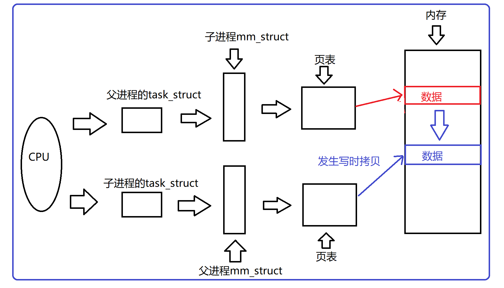

## 解释fork()函数有两个返回值
`pid_d id`是属于父进程栈空间的变量，`fork()`函数内部return会被执行两次，`return`的本质**就是将保存在寄存器上的值写入到接收返回值的变量中**， 当`id = fork();`的时候，谁先返回，谁就要发生写时拷贝，所以，**<font style="color:#DF2A3F;background-color:#FBDE28;">同一个变量，会有不同的内容，本质是因为这个变量的虚拟地址是一样的，但是会有不同的物理地址</font>**。

## 解释定义全局变量为什么有一直有效，字符串常量为什么是只读以及子进程为什么可以访问命令行参数？
> 通过上面的了解，我们得知：
>

1. 定义全局变量，全局有效，地址空间只要存在，那么全局数据区就要存在，所以全局变量会一直存在，包括static静态变量！
2. 字符串常量，其实和代码是编译在一起的，都是只读的。（因为代码就是只读的！），因为字**符常量区，被页表映射的时候，有权限约束，不让写入操作进行转换。**
    1. **而在我们之前写代码的时候写的const，其实就是在约束编译器，让编译器进行写入检查，如果有，就报错！！！**
3. 命令行参数和环境变量属于父进程的地址空间内的数据资源，和代码区数据区一样子进程会继承父进程的地址空间。所以，子进程也能看到命令行参数和环境变量！！

# 七、为什么要有虚拟地址空间
> 这个问题其实可以转化为：如果程序直接可以操作物理内存会造成什么问题？
>

在早期的计算机中，要运行一个程序，会把这些程序全都装入内存，程序都是直接运行在内存上的，也就是说程序中访问的内存地址都是实际的物理内存地址。当计算机同时运行多个程序时，必须保证这些程序用到的内存总量要小于计算机实际物理内存的大小。

那当程序同时运行多个程序时，操作系统是如何为这些程序分配内存的呢？例如某台计算机总的内存大小128M，现在同时运行两个程序A和B，A需占用内存10M，B需占用内存110。计算机在给程序分配内存时会采取这样的方法：先将内存中的前10M分配给程序A，接着再从内存中剩余的118M中划分出110M分配给程序B。

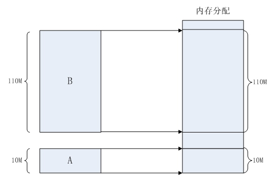

> 这种分配方法可以保证程序A和程序B都能运行，但是这种简单的内存分配策略问题很多。
>

1. 安全风险
    1. 每个进程都可以访问任意的内存空间，这也就意味着任意一个进程都能够去读写系统相关内存区域，如果是一个木马病毒，那么他就能随意的修改内存空间，让设备直接瘫痪。
2. 地址不确定
    1. 众所周知，编译完成后的程序是存放在硬盘上的，当运行的时候，需要将程序搬到内存当中去运行，如果直接使用物理地址的话，我们无法确定内存现在使用到哪里了，也就是说拷贝的实际内存地址每一次运行都是不确定的，比如：第一次执行a.out时候，内存当中一个进程都没有运行，所以搬移到内存地址是0x00000000，但是第二次的时候，内存已经有10个进程在运行了，那执行a.out的时候，内存地址就不一定了
3. 效率低下
    1. 如果直接使用物理内存的话，一个进程就是作为一个整体（内存块）操作的，如果出现物理内存不够用的时候，我们一般的办法是将不常用的进程拷贝到磁盘的交换分区中，好腾出内存，但是如果是物理地址的话，就需要将整个进程一起拷走，这样，在内存和磁盘之间拷贝时间太长，效率较低。

> 存在这么多问题，有了虚拟地址空间和分页机制就能解决了吗？当然！
>

1. 地址空间和页表是OS创建并维护的！是不是也就意味着，凡是想使用地址空间和页表进行映射，也一定要在OS的监管之下来进行访问！！也顺便保护了物理内存中的所有的合法数据，包括各个进程以及内核的相关有效数据！
2. 因为有地址空间的存在和页表的映射的存在，我们的物理内存中可以对未来的数据进行任意位置的加载！物理内存的分配和进程的管理就可以做到没有关系，进程管理模块和内存管理模块就完成了解耦合。
    1. 因为有地址空间的存在，所以我们在C、C++语言上new, malloc空间的时候，其实是在地址空间上申请的，**物理内存可以甚至一个字节都不给你**。而当你真正进行对物理地址空间访问的时候，才执行内存的相关管理算法，帮你申请内存，构建页表映射关系（延迟分配），这是由操作系统自动完成，用户包括进程完全0感知！！
3. 因为页表的映射的存在，程序在物理内存中理论上就可以任意位置加载。它可以将地址空间上的虚拟地址和物理地址进行映射，在进程视角所有的内存分布都可以是有序的。

