# Linux进程控制&&进程等待&&程序替换&&实现minishell
## 一、进程创建
### 1.1 fork的使用
我们可以使用man指令来查看一下

```bash
man 2 fork
```

子进程会复制父进程的PCB，之间代码共享，数据独有，拥有各自的进程虚拟地址空间。

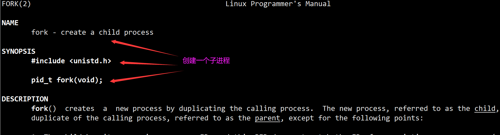

这里就有一个代码共享，并且子进程是拷贝了父进程的PCB，虽然他们各自拥有自己的进程虚拟地址空间，数据是拷贝过来的，通过页表映射到同一块物理内存中。

大概流程可以看一下下图：

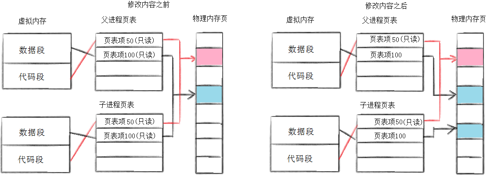

在上图中我们还可以看到返回类型是`pid_t`，**如果创建子进程失败，会返回小于0的数字，而如果创建子进程成功，该函数则会返回俩个值。它会给子进程返回0值，而给父进程返回子进程的pid（一个大于0的数）**，创建成功后我们可以对此进行使用`if`语句进行分流

下面简单验证再来验证一下：

```c
#include <stdio.h>
#include <stdlib.h>
#include <unistd.h>

int g_val = 100;

int main()
{
    pid_t pid = fork();
    if(pid < 0) {
        printf("fork error!\n");
        exit(-1); 
    }
    else if(pid == 0) {
        //child
        g_val = 200;
        printf("This is Child! g_val = %d, p = %p\n",g_val,&g_val);
    }
    else {
        //parent
        sleep(1);
        printf("This is Parent! g_val = %d, p = %p\n",g_val,&g_val);
    }
    return 0;
}
```

很显而易见，这里的地址是虚拟的地址空间，真正的值是存储在物理内存中的。而这时通过页表的映射，本质上内存中已经是指向了不同的物理地址

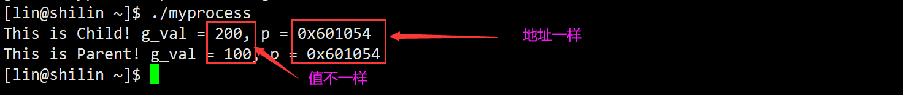

## 二、进程终止
### 2.1 终止是在做什么？
释放内核数据结构--->task_struct：Z（僵尸状态）

### 2.2 终止的3种情况&&退出码的理解
1. 代码运行完毕，结果正确
2. 代码运行完毕，结果不正确
3. 代码异常终止

---

在上面的1和2中可通过退出码进行决定，这里什么是退出码呢？我们在C语言每次写的时候为什么最后写一个`return 0`呢？这里我们可以实验一下：

```c
#include <stdio.h>
int main()
{
    return 1;
}
```

这里我们还要了解一个命令

```bash
echo $?
```

作用是打印出上一次进程的退出码，而我们C语言刚刚最后写的退出码是1，最后记录了刚刚的退出码，所以打印的是`1`

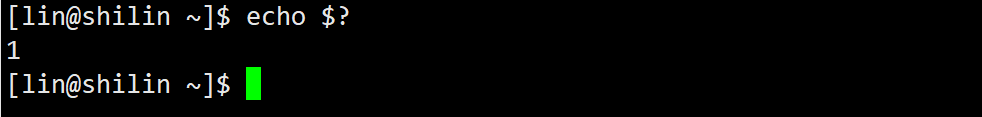

---

+ 第三个是代码执行的时候出现了异常，被提前退出了，我们可以再来验证一下：
+ 下面这个代码很明显是野指针的访问：

```c
int main()
{
    int* p = NULL;
    *p = 10;
    return 0;
}
```

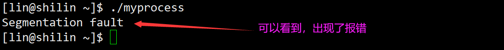

+ 在编译运行的时候，出现了异常，提前退出了，操作系统发现了不该做的事情，OS杀死了进程
+ **一旦出现了异常，退出码也就没有意义了**，那么为什么出现了异常，是**因为进程收到了OS发给进程的信号**

在Linux中，可以使用`kill -l`查看所表示的信号，可以看到0表示成功~，所以一般正常运行完成之后退出码就写成0，非0表示失败

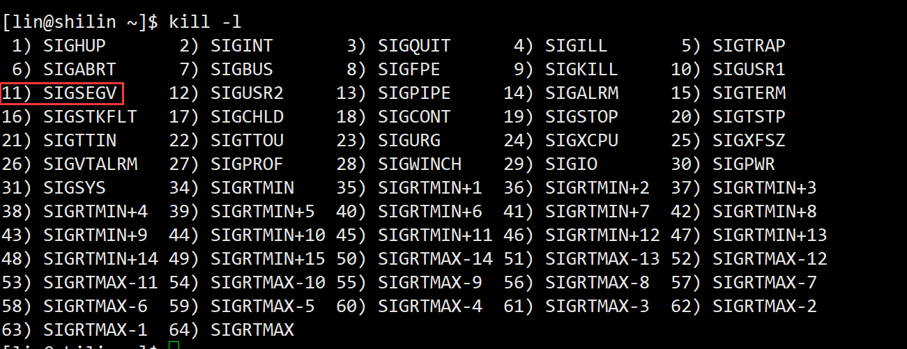

退出码（退出状态）可以告诉我们最后一次执行的命令的状态。在命令结束以后，我们可以知道命令是成功完成的还是以错误结束的。其基本思想是，程序返回退出代码 0 时表示执行成功，没有问题。代码1或0以外的任何代码都被视为不成功。

Linux Shell 中的主要退出码：

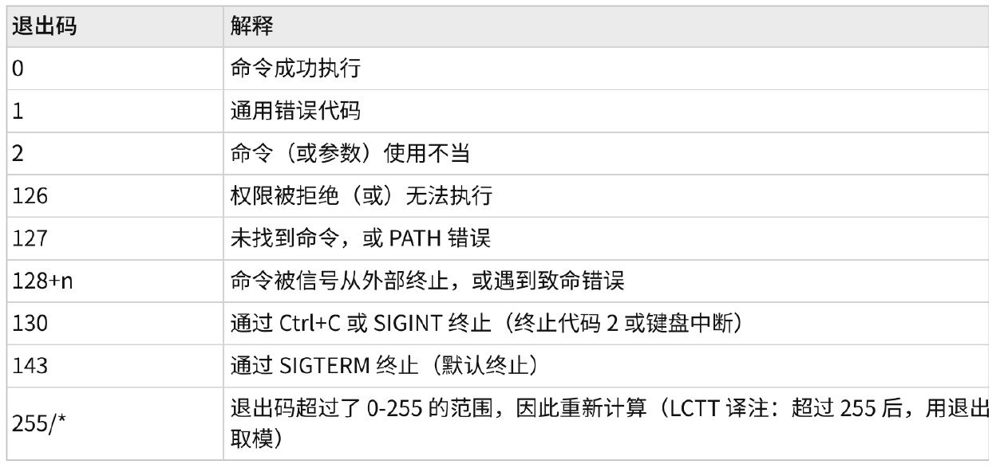

+ 退出码 0 表示命令执行无误，这是完成命令的理想状态。
+ 退出码 1 我们也可以将其解释为 “不被允许的操作”。例如在没有 sudo 权限的情况下使用yum；再例如除以 0 等操作也会返回错误码 1 ，对应的命令为`let a=1/0`
+ `130`（`SIGINT`或 `^C` ）和`143`（`SIGTERM`）等终止信号是非常典型的，它们属于`128+n`信号，其中 n 代表终止码。
+ 可以使用strerror函数来获取退出码对应的描述。

### 2.3 进程常见退出方法
1. 正常退出
    1. 从main函数返回
    2. 调用exit函数
    3. 调用_exit函数
2. 异常退出
3. Ctrl+C，信号终止等

在我们平时使用的kill -9就是给OS发送一个信号，对程序做出动作

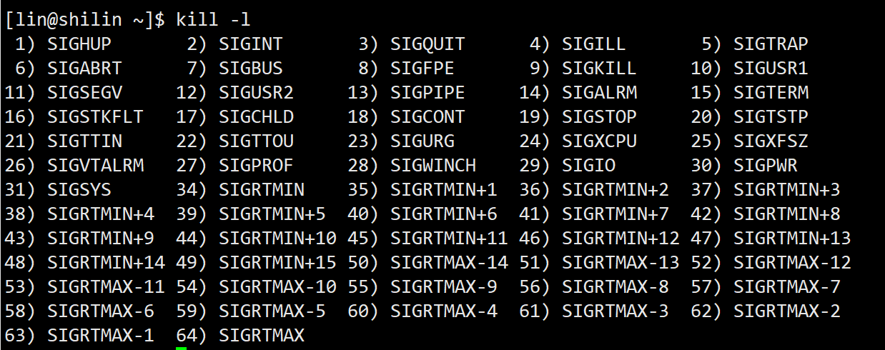

+ 例如，使用-9信号杀死进程

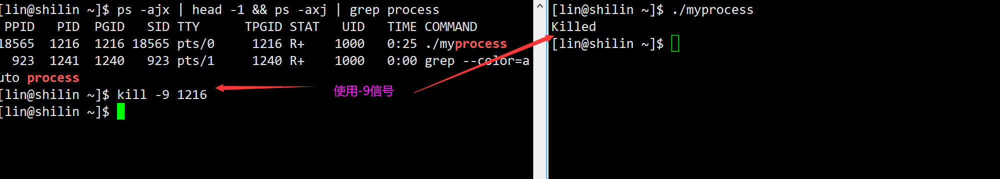

+ 刚刚上面的段错误就可以发送11
+ 每个对应的编号都有对应的错误描述

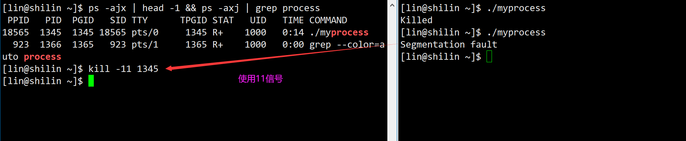

#### exit退出函数和_exit退出函数：
可以使用man手册来查看

> stauts定义了进程的终止状态，由用户自己传递，父进程可以通过wait来获取该值
>
> 说明：虽然status是int，但是仅有`低8位`可以被父进程所用。所以`_exit(-1)`时，在终端执行`$?`发现返回值是255。
>

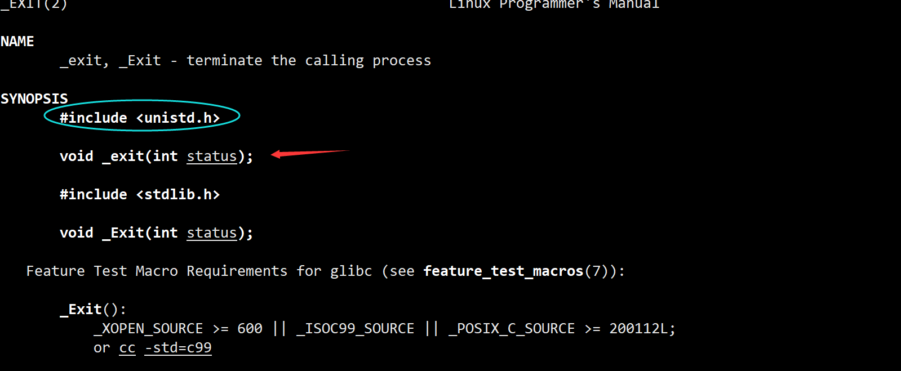

+ exit是库函数，_exit是系统调用函数，而库函数内部封装了系统调用。 也就是说，调用exit函数最终也会调用_exit来使进程退出，只不过在其调用_exit之前，还做了其他工作：
1. 执行用户通过 atexit或on_exit定义的清理函数。
2. 关闭所有打开的流，所有的缓存数据均被写入
3. 调用_exit

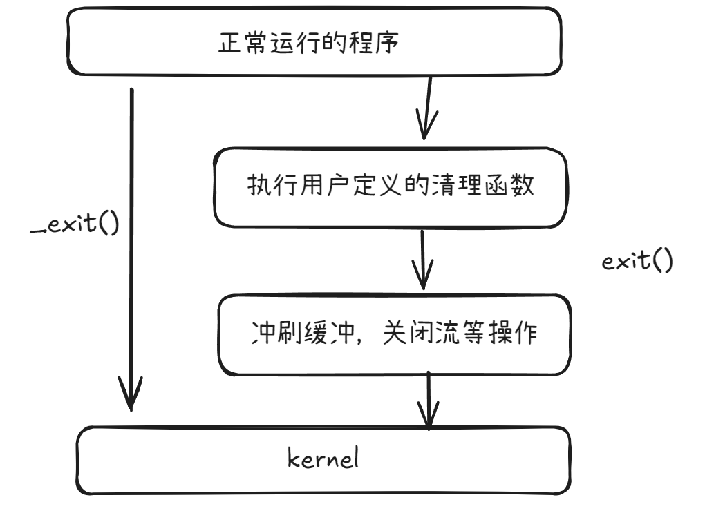

> return退出
>

+ return是一种更常见的退出进程方法。执行`return n`等同于执行`exit(n)`,因为调用main的运行时函数会将main的返 回值当做`exit`的参数。

也就是说衡量一个进程退出，我们只需要两个数字：**退出码**和**退出信号**

## 三、进程等待
### 3.1 为什么要进行进程等待？
如果子进程先于父进程退出，而父进程并没有关心子进程的退出状况，从而无法回收子进程的资源，就会导致子进程变成僵尸进程，这里的僵尸状态使用kill也杀不掉，会导致内存泄露

如果想要解决这个僵尸状态就要进行进程等待，等待父进程回收子进程的资源，获取子进程的退出状态

在父进程中，使用**wait或waitpid接口**来完成进程等待。

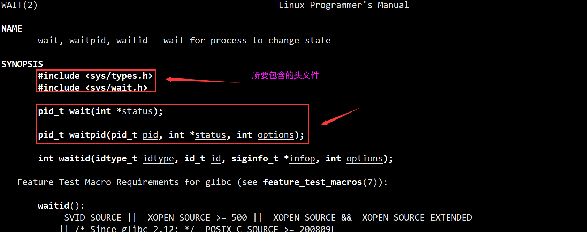

这里的参数是一级指针`status`，它其实**是个输出型参数**，用于获取子进程的退出状态，如果不关心则可以设置为NULL

**成功会返回被等待进程的pid，失败则会返回-1**

```c
#include <stdio.h>
#include <unistd.h>
#include <stdlib.h>
#include <string.h>
#include <sys/types.h>
#include <sys/wait.h>
int main()                                                
{
    pid_t id=fork();
    if(id==0)
    {
        // child process
        int cnt=10;
        while(cnt)
        {
            printf("我是子进程:%d，父进程:%d,cnt:%d\n",getpid(),getppid(),cnt--);
            sleep(1);
        }
        exit(0);// 子进程退出
    }
    sleep(15);
    pid_t ret=wait(NULL);
    if(ret>0)
    {
        printf("wait success:%d!\n",ret);
    }
    sleep(5);
    return 0;
}
```

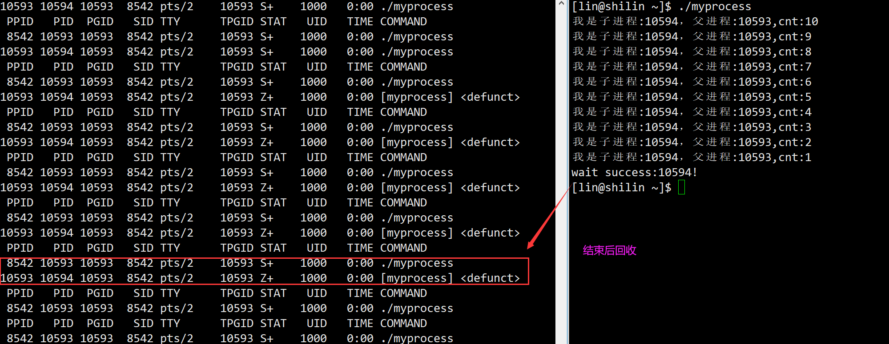

> waitpid：
>

参数：

+ pid，设置成-1则表示等待任意一个子进程，同wait；如果>0则表示等待一个指定的子进程，pid就是被等待子进程的进程号
+ status，获取子进程的退出状态，同**wait**
+ options，**可以设置为0或WNOHANG**。设置为0则与wait一样，如果没有等待到子进程退出会一直阻塞；而设置为`WNOHANG`则表示非阻塞，如果被等待的子进程未退出，则会返回0值，成功等待到子进程则会返回被等待子进程的pid

### 3.2 取子进程退出信息status
+ 我们已经知道status是一个出参，由操作系统为其赋值，用户可以传递NULL值表示不关心，而如果传入参数，操作系统就会根据该参数，将子进程的退出信息反馈给父进程，由status最终被赋予的值来体现。

如何通过status来获取子进程的退出信息呢？

+ status是一个int类型的值，意味着它应该有32个比特位，但它又不能被当初普通的整形来看待，因为其**高16位的值并不被使用**，而**<font style="color:#DF2A3F;background-color:#FBDE28;">只使用其低16个比特位</font>**：

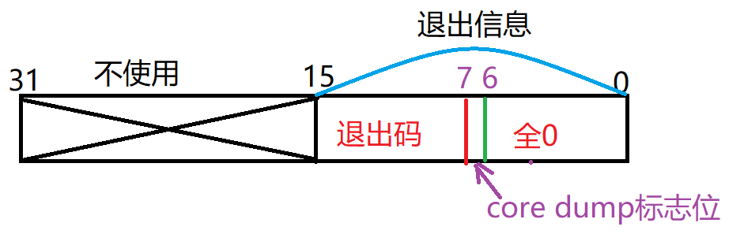

不论是正常退出还是异常退出，status的高8个比特位（只讨论低16个比特位）都表示子进程的退出码，而这个退出码一般是return的返回值或者exit的参数；正常退出时，status的低8个比特位为全0；而异常退出时，其第8个比特位则为core dump标志位，用来标志是否会有core dump文件产生，而低7个比特位则是退出信号。

> 退出码：**(status >> 8) & 0xFF**
>

**低7位**（检测子进程是否异常退出）：**status & 0x7F**

+ 结果为0则表示正常退出
+ 不为0则说明是异常退出，因为有终止信号
+ core dump标志位：`(status >> 7) & 0x1`
+ 结果为0则表示没有core dump产生
+ 等于1则说明有core dump产生

```c
#include <unistd.h>
#include <stdlib.h>
#include <string.h>
#include <sys/types.h>
#include <sys/wait.h>
int main()                                                
{
    pid_t id=fork();
    if(id==0)
    {
        // child process
        int cnt=10;
        while(cnt)
        {
            printf("我是子进程:%d，父进程:%d,cnt:%d\n",getpid(),getppid(),cnt--);
            sleep(1);
        }
        exit(6);// 子进程退出，故意写退出码为6
    }
    sleep(15);
    int status = 0;
    pid_t ret=waitpid(id, &status, 0);
    if(ret>0)
    {
        printf("wait success:%d!\n",ret);
        printf("status:%d,退出码是%d,退出信号是%d\n",status,(status>>8)&0xFF,status&0x7F);
    }
    sleep(5);
    return 0;
}
```

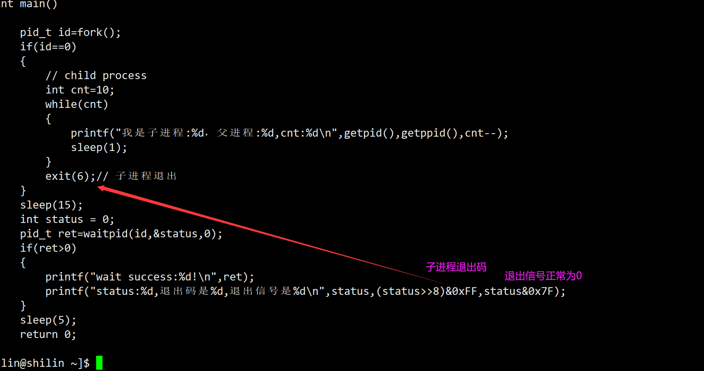

+ 执行结果

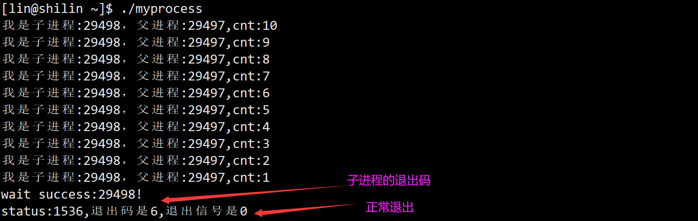

我们还可以演示一下异常退出

+ 我们在子进程里写一个野指针访问

```c
int* p = NULL;
*p = 100; 
```

+ 这里也就很显而易见了，退出信号就是11，而退出码就无用了


### 3.3 宏WIFEXITED和WEXITSTATUS（获取进程终止情况和退出码）
+ WIFEXITED(status)：**若子进程是正常终止，则返回结果为真，用于查看进程是否正常退出。**
+ WEXITSTATUS(status)：**若进程正常终止，也就是进程终止信号为0，这时候会返回子进程的退出码。**

> 下面我们可以写一个代码来演示一下
>

```c
#include <stdio.h>
#include <sys/types.h>
#include <sys/wait.h>
#include <unistd.h>
#include <stdlib.h>
#include <assert.h>
int main()
{
    pid_t id = fork();
    assert(id != -1);
    if(id == 0)
    {
        // child 
        int cnt = 10;
        while(cnt)
        {
            printf("child process running，pid:%d，ppid:%d，cnt:%d\n",getpid(),getppid(),cnt--);
            sleep(1);
        }
        exit(10); // 故意写退出码为10
    }

    // 等待子进程
    int status=0;
    int ret = waitpid(id,&status,0);
    if(ret > 0)
    {
        if(WIFEXITED(status)) // 如果正常退出返回结果为真，然后查看退出码
            printf("child process exit normally，exit code:%d\n",WEXITSTATUS(status));
        else
            printf("child process don't exit normally\n");
    }
    return 0;
}
```

+ 正常退出

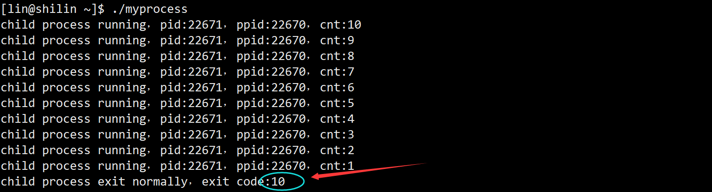

+ 异常退出

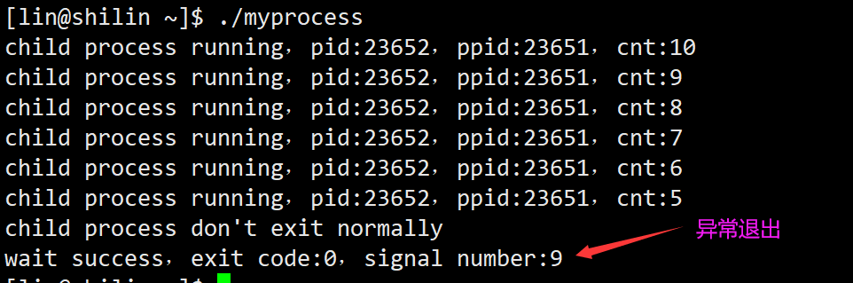

### 3.4 进程的阻塞和非阻塞等待
当子进程还没有死的时候，也就是没有退出的时候，父进程调用的wait或waitpit需要等待子进程退出，系统调用接口也不返回，这段时间父进程什么都没做，就一直等待子进程退出，这样的等待方式，称之为阻塞式等待。

非阻塞式等待就是不停的检测子进程状态，每一次检测之后，系统调用**立即返回**，在waitpid中的第三个参数设置为**WNOHANG**，即为**父进程非阻塞式等待**。

如果等待的子进程状态没有发生变化，则waitpid会返回0值。多次非阻塞等待子进程，直到子进程退出，这样的等待方式又称之为**轮询**。如果等待的进程不是当前父进程的子进程，则waitpid会调用失败。

```c
#include <stdio.h>
#include <sys/types.h>
#include <sys/wait.h>
#include <unistd.h>
#include <stdlib.h>
#include <assert.h>
int main()
{
    pid_t id = fork();
    assert(id!=-1);
    if(id==0)
    {
        // child process
        int cnt=5;
        while(cnt)
        {
            printf("child process running，pid:%d，ppid:%d，cnt:%d\n",getpid(),getppid(),cnt--);
            sleep(3);                                                                                                                                                                                          
        }
        exit(10);
    }
    int status=0;
    while(1)
    {
        // WNOHANG是非阻塞等待，子进程没有退出，父进程检测一次之后，立即返回
        pid_t ret=waitpid(id,&status,WNOHANG);
        if(ret == 0)
        {
            // waitpid调用成功，子进程没有退出
            printf("Wait for success，but the child process is still running\n");
        }
        else if(ret == id)
        {
            // waitpid调用成功，子进程退出
            printf("wait success，exit code:%d，signal number:%d\n",(status >> 8) & 0xFF, status & 0x7F);
            break;
        }
        else
        {
            // waitpid调用失败，例如等待了一个不属于该父进程的子进程
            printf("The waitpid call failed\n");
            break;
        }
        sleep(1);
    }
    return 0;
}
```

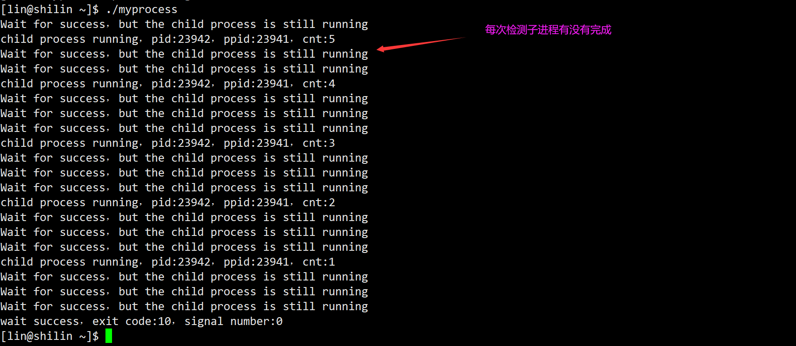

非阻塞等待有一个好处就是，不会像阻塞式等待一样，父进程什么都做不了，而是在**轮询**期间，父进程还可以做其他的事情。

下面代码中，利用了**回调函数**的方式，来让**父进程轮询等待子进程期间，还可以处理其他任务**。

```c
#include <stdio.h>
#include <sys/types.h>
#include <sys/wait.h>
#include <unistd.h>
#include <stdlib.h>
#include <assert.h>
#include <string.h>
void task1()
{
    printf("Process task1\n");
}
void task2()
{
    printf("Process task2\n");
}
void task3()
{
    printf("Process task3\n");
}
typedef void (*func_t)();   // 定义一个函数指针类型

func_t Process_task[10];

void loadtask()
{
    memset(Process_task,0, sizeof(Process_task));
    Process_task[0]=task1;
    Process_task[1]=task2;
    Process_task[2]=task3;
}

int main()
{
    pid_t id = fork();
    assert(id!=-1);
    if(id==0)
    {
        // child process
        int cnt=5;
        while(cnt)
        {               
            printf("child process running，pid:%d，ppid:%d，cnt:%d\n",getpid(),getppid(),cnt--);
            sleep(1);                                                                                                                                                                                          
        }
        exit(10);                                                                               
    }                
    loadtask();// 加载任务到函数指针数组里面
    int status=0;
    while(1)
    {                                         
        pid_t ret=waitpid(id,&status,WNOHANG);// WNOHANG是非阻塞等待，子进程没有退出，父进程检测一次之后，立即返回
        if(ret == 0) 
        {
            // waitpid调用成功，子进程没有退出
            printf("Wait for success，but the child process is still running\n");
            for(int i=0; Process_task[i]!=NULL; i++)
            {
                Process_task[i]();// 回调函数的方式，让父进程在轮询期间，做其他事情
            }
        }
        else if(ret == id)
        {
            // waitpid调用成功，子进程退出
            printf("wait success，exit code:%d，signal number:%d\n",(status>>8)&0xFF,status & 0x7F);
            break;
        }
        else 
        {
            // waitpid调用失败，例如等待了一个不属于该父进程的子进程
            printf("The waitpid call failed\n");
            break;
        }
        sleep(1);
    }
    return 0;
}
```

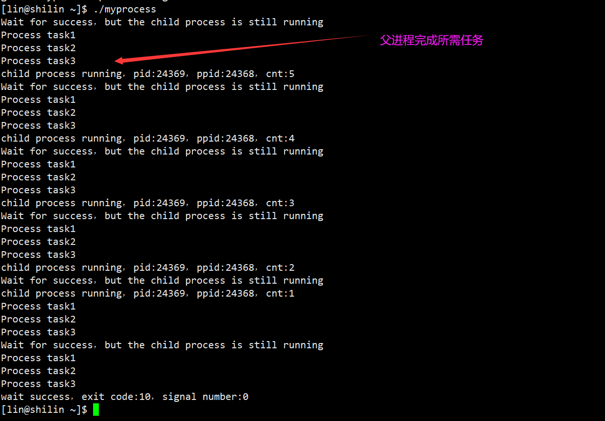

或者可以使用C和C++混编的方来写

1. 创建任务`Task.hpp`

```cpp
#pragma once

#include <iostream>

void DownLoad()
{
    std::cout << "我是一个下载任务" <<std::endl;
}

void PrintLog()
{
    std::cout << "我是一个打印日志的任务" << std::endl;
}

void FlushData()
{
    std::cout << "我是一个刷新数据的任务" << std::endl;
}
```

2. `Tool.hpp`

```cpp
#pragma once

#include <iostream>
#include <vector>
#include <functional>

using func_t = std::function<void()>; 

class Tool
{
public:
    void pushFunc(func_t f)
    {
        _funcs.push_back(f);
    }

    void Execute()
    {
        for(auto& f : _funcs)
        {
            f();
        }
    }

private:
    std::vector<func_t> _funcs;
};

```

3. 代码实现：父进程循环执行任务

```cpp
#include <stdio.h>
#include <string.h>
#include <unistd.h>
#include <stdlib.h>
#include <sys/types.h>
#include <sys/wait.h>
#include <iostream>
#include <assert.h>
#include "Task.hpp"
#include "Tool.hpp"


int main()
{
    Tool tool;
    tool.pushFunc(DownLoad);
    tool.pushFunc(PrintLog);
    tool.pushFunc(FlushData);

    pid_t id = fork();
    assert(id!=-1);
    if(id==0)
    {
        // child process
        int cnt=5;
        while(cnt)
        {
            printf("child process running，pid:%d，ppid:%d，cnt:%d\n",getpid(),getppid(),cnt--);
            sleep(1);
        }
        exit(10);
    }
    int status = 0;
    while(1)
    {
        // WNOHANG是非阻塞等待，子进程没有退出，父进程检测一次之后，立即返回
        pid_t ret=waitpid(id,&status,WNOHANG);
        if(ret == 0)
        {
            // waitpid调用成功，子进程没有退出
            printf("Wait for success，but the child process is still running\n");

            // 父进程做其他事情
            tool.Execute();
            sleep(1);
        }
        else if(ret == id)
        {
            // waitpid调用成功，子进程退出
            printf("wait success，exit code:%d，signal number:%d\n",(status >> 8) & 0xFF, status & 0x7F);
            break;
        }
        else
        {
            // waitpid调用失败，例如等待了一个不属于该父进程的子进程
            printf("The waitpid call failed\n");
            break;
        }
        sleep(1);
    }
    return 0;
}
```

waitpid本质是获取子进程`task_struct`内的属性数据，和`getpid`没区别，它调用完毕的时候，也会让os释放目标`task_struct`

每个task_struct里有`exit_code, exit_signal`，是要保存下来退出码和退出状态

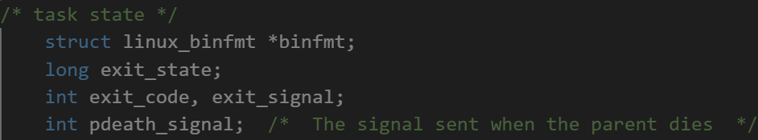

这就是为什么子进程退出，Z状态，不能释放task_struct，要让父进程进行读取


## 四、进程的程序替换
### 4.1 创建子进程的目的？
创建子进程一般两个目的：

1. 让子进程执行父进程代码的一部分，也就是执行父进程对应的磁盘上的代码和数据的一部分。
2. 让子进程加载磁盘上指定的程序到内存中，使其执行新的程序的代码和数据，这就是进程的程序替换。

### 4.2 进程的程序替换
#### 4.2.1 单个进程的程序替换
下面函数参数是**可变参数列表**，可以给C语言函数传递不同个数的参数。

```c
int execl(const char* path，const char* arg，...);  
```

通过man指令可以查看

```bash
man execl
```

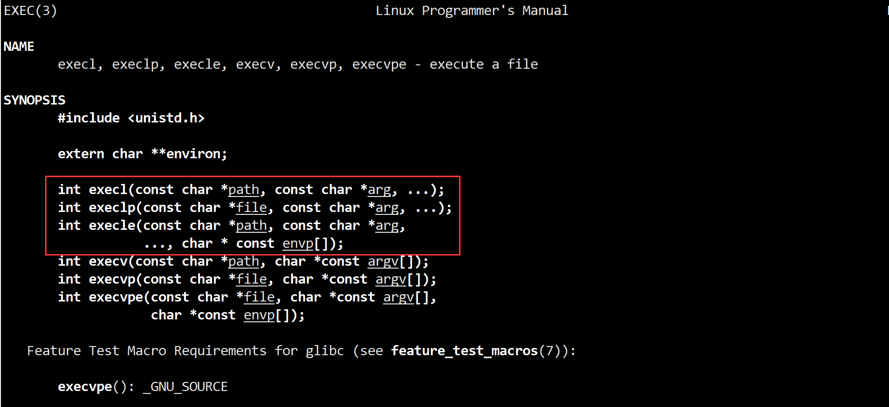

要执行一个程序，首先就是找到这个程序，然后在执行这个程序，执行程序的时候，也拥有不同的执行方式，通过执行选项的不同便可以使得程序以多种不同的方式执行。

例如：

```c
#include <stdio.h>
#include <unistd.h>

int main()
{
    // .c --> .exe --> load into memory --> process --> running
    printf("The process is running...\n");
    // 传参以NULL结尾，来表示传参结束                                                        
    execl("/usr/bin/ls","ls","-a","-l","--color=auto",NULL);

    printf("The process finishes running...\n");
    return 0;
}
```

+ 可以看到只打印了一行run，紧接着是执行后面替换的程序

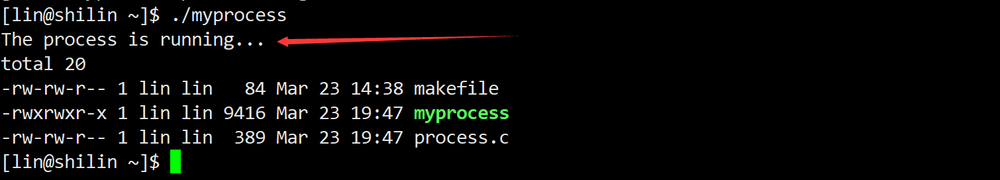

+ **exec系列**的函数只有在**调用失败的时候才有返回值，这个返回值是-1**，那为什么exec系列的函数没有调用成功时的返回值呢？

答案：没有必要，因为exec系列函数调用结束之后，代码就全都被替换了，就算给你返回值你也使用不了，因为代码全都替换为指定程序的代码了，所以**只要exec系列函数返回，那就一定发生调用错误了。**

例如：随便写一个命令，这个命令是不在这个目录里的

```c
#include <stdio.h>
#include <unistd.h>

int main()
{
    // .c --> .exe --> load into memory --> process --> running
    printf("The process is running...\n");
    // 传参以NULL结尾，来表示传参结束                                                        
    execl("/usr/bin/lsss","ls","-l","--color=auto",NULL);

    printf("The process finishes running...\n");
    return 0;
}
```

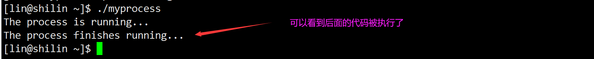

#### 4.2.2 父进程派生子进程的程序替换
子进程被替换为ls进程，不会影响父进程，因为进程具有独立性。

```c
#include <stdio.h>
#include <unistd.h>
#include <stdlib.h>
#include <assert.h>
#include <sys/types.h>
#include <sys/wait.h>
int main()
{
    printf("The process is running...\n");
    pid_t id = fork();
    assert(id != -1);
    if(id==0)
    {
        //child process
        sleep(1);
        execl("/usr/bin/ls","ls","-l",NULL);
        exit(1);// 如果调用失败，直接让子进程退出
    }
    int status = 0;
    pid_t ret = waitpid(id,&status,0);
    if(ret == id)
    {
        printf("wait success, exit code:%d , signal number:%d\n",(status>>8)&0xFF,status&0x7F);
    }
    return 0;
}
```

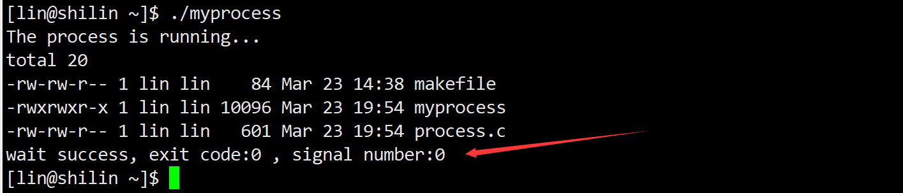

### 4.3 进程替换原理
用fork创建子进程后执行的是和父进程相同的程序(但有可能执行不同的代码分支),子进程往往要调用一种exec函数以执行另一个程序。当进程调用一种exec函数时,该进程的用户空间代码和数据完全被新程序替换,从新程序的启动例程开始执行。调用exec并**不创建新进程**所以调用exec前后该进程的id并未改变。


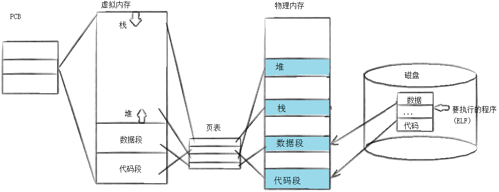


当父进程派生的子进程发生程序替换时，防止父子进程原先共享的代码段和数据段被修改，操作系统会进行**写时拷贝**，将代码段和数据段重新复制一份给子进程，让子进程程序替换之后，不会影响父进程。这就是进程之间的独立性。

虚拟地址空间和页表可以保证进程之间的独立性，一旦有执行流要改变代码或数据，就会发生写时拷贝。**所以不是只有数据可能发生写入，代码也是有可能发生写入的，这两种情况都会发生写时拷贝。**

通过上面认识知道：在我们用命令行使用ls之类的命令，父进程bash`fork`出一个子进程，然后调用exec*，父进程wait就可以了！

## 五、替换函数
```c
#include <unistd.h>

int execl(const char *path, const char *arg, ...);
int execlp(const char *file, const char *arg, ...);
int execle(const char *path, const char *arg, ..., char * const envp[]);
int execv(const char *path, char *const argv[]);
int execvp(const char *file, char *const argv[]);
int execvpe(const char *file, char *const argv[], char *const envp[]);
```

+ l代表list，指的是将参数一个一个的传入`execl`函数

> int execl(const char *path, const char *arg, ...);
>

```c
int main()
{
  pid_t id = fork();
  if(id == 0){
    // child
    execl("/usr/bin/ls", "ls", "-l", NULL);
    // 如果执行到这里说明替换失败,让子进程退出
    exit(-1);
  }
  // parent
  return 0;
}
```

+ p是指path，不用传程序的路径，只需要传程序的名字就够了，此函数会自动在PATH环境变量的路径下面去查找对应的程序。
+ execlp中的两个ls是不重复的，**一个是告诉操作系统要执行什么程序（无论是Python脚本，还是shell语言脚本等等都可以执行！！！），一个是告诉操作系统怎么执行程序**。

> int execlp(const char *file, const char *arg, ...);
>

```c
int main()
{
  pid_t id = fork();
  if(id == 0){
    // child
    execlp("ls", "ls", "-l", "--color=auto", NULL);
    // 如果执行到这里说明替换失败,让子进程退出
    exit(-1);
  }
  // parent
  return 0;
}
```

+ v是指vector，指的是该函数可以将所有的执行参数放到数组里面，统一进行传参，而不是使用可变参数列表的方式，来一个一个的传执行参数。

> int execv(const char *path, char *const argv[]);
>

```c
int main()
{
  pid_t id = fork();
  if(id == 0){
    // child
    char* const argv[] = {(char*)"ls", (char*)"-l", (char*)"--color=auto", NULL};
    execv("/usr/bin/ls", argv);
    // 如果执行到这里说明替换失败,让子进程退出
    exit(-1);
  }
  // parent
  return 0;
}
```

+ PATH和vector，指的是不用传程序路径，默认在环境变量中进行查找并且可以将执行参数放到数组里面，统一进行传参

> int execvp(const char *file, char *const argv[]);
>

```c
int main()
{
  pid_t id = fork();
  if(id == 0){
    // child
    char* const argv[] = {(char*)"ls", (char*)"-l", (char*)"--color=auto", NULL};
    execvp("ls", argv);
    // 如果执行到这里说明替换失败,让子进程退出
    exit(-1);
  }
  // parent
  return 0;
}
```

+ execle中的e代表自定义环境变量。
+ 下面定义的env指针数组就是自定义环境变量，也就意味着，程序替换的时候，不用系统环境变量，用自己定义的环境变量。

> int execle(const char *path, const char *arg,..., char * const envp[]);
>

```c
int main()
{
  pid_t id = fork();
  if(id == 0){
    // child
    char* const env[] = {(char*)"HELLO=123456789",NULL};
    execle("./mybin","mybin", NULL, env);
    // 如果执行到这里说明替换失败,让子进程退出
    exit(-1);
  }
  // parent
  return 0;
}
```

+ 也可以不传自定义环境变量，而用系统的环境变量传给子进程替换的程序，只不过替换的程序mybin.c没有打印出来全部的环境变量，而是只打印了PATH和PWD的值。

```c
int main()
{
  pid_t id = fork();
  if(id == 0){
    // child
    extern char** environ;
    execle("./mybin","mybin", NULL, environ);
    // 如果执行到这里说明替换失败,让子进程退出
    exit(-1);
  }
  // parent
  return 0;
}
```

其实上面那些函数都不在2号手册

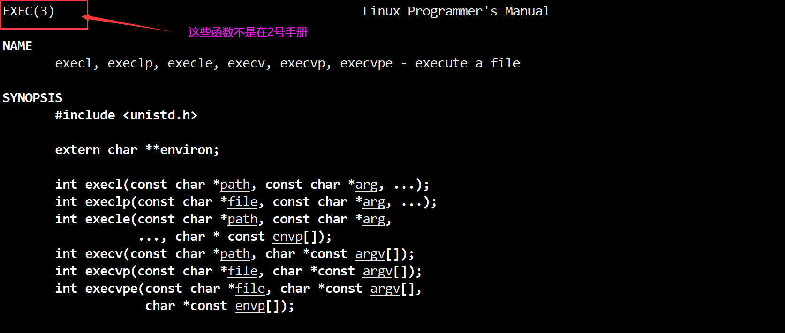

> int execvpe(const char *file, char *const argv[],char *const envp[]);
>

+ **execvpe**其实就是`vector+PATH+env`，我们需要自己传环境变量，并且不用可变参数列表的方式传执行参数，而是用指针数组的方式来一并将执行参数传递，传程序名时可以不带程序路径，系统会帮我们找。
+ 带e的函数都需要自己组装环境变量，可以选择自己的、或系统的、或系统和自己的环境变量。
+ **传递环境变量表，默认是摒弃老的环境变量，使用你自己设置的全新的环境变量表。如果你要用系统提供的，你就传入系统的环境变量表**

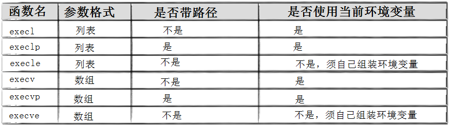

+ 真正执行程序替换的其实只有execve这一个系统调用接口，其他的6个都是在**execve**的基础上封装得来的。只有**execve在man2号手册，其他都在3号手册。**

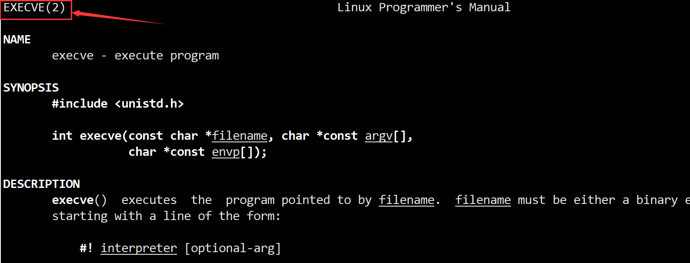

下图exec函数族，一个完整的例子：

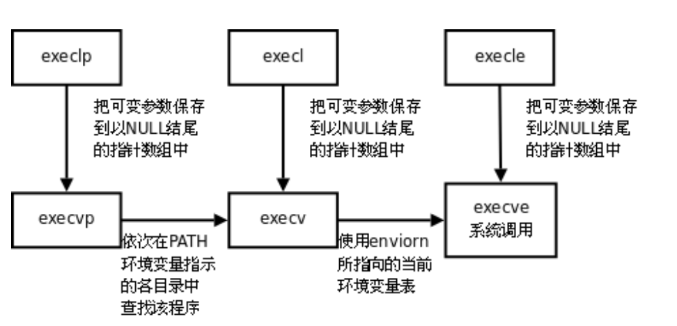

+ 其中`l`和`v`的区别在于**程序运行参数的赋予方式不同**，**l是通过函数参数逐个给与**，最终以**NULL结尾**，**而v是通过字符指针数组一次性给与**。
+ 其中有没有`**p**`**的区别在于程序是否需要带路径**，也就是是否会默认到path环境变量指定的路径下寻找程序，没有`p`的需要指定路径，有p的会默认到path环境变量指定路径下寻找
+ 其中有**没有**`**e**`**的区别在于程序是否需要自定义环境变量**，**没有e则默认使用父进程环境变量**，有e则自定义环境变量。

最后在写makefile的时候我们想让两个源文件进行编译，我们可以在makefile中添加一个：

```bash
.PHONY:all
all:mybin myprocess

mybin:myexec.c
    gcc -o $@ $^ -std=c99

myprocess:process.c
    gcc -o $@ $^ -std=c99

.PHONY:clean
clean:
    rm -rf myprocess mybin 
```

exec函数族代码示例：

```c
int main()
{
  char *const argv[] = {"ps", "-ef", NULL};
  char *const envp[] = {"PATH=/bin:/usr/bin", "TERM=console", NULL};
  execl("/bin/ps", "ps", "-ef", NULL);
  // 带p的，可以使用环境变量PATH，无需写全路径
  execlp("ps", "ps", "-ef", NULL);
  // 带e的，需要自己组装环境变量
  execle("ps", "ps", "-ef", NULL, envp);
  execv("/bin/ps", argv);
  // 带p的，可以使用环境变量PATH，无需写全路径
  execvp("ps", argv);
  // 带e的，需要自己组装环境变量
  execve("/bin/ps", argv, envp);
  exit(0);
}
```

## 六、自己实现简易shell
要写一个shell，需要循环以下过程:

1. 获取命令行
2. 解析命令行
3. 建立一个子进程（fork）
4. 替换子进程（execvp）
5. 父进程等待子进程退出（wait）

### 6.1 shell代码使用C实现
```c
#include <stdio.h>
#include <stdlib.h>
#include <string.h>
#include <errno.h>
#include <unistd.h>
#include <sys/types.h>
#include <sys/wait.h>

#define SIZE 512
#define ZERO '\0'
#define SEP " "
#define NUM 32
#define SkipPath(p) do{ p += (strlen(p)-1); while(*p != '/') p--; }while(0)

char cwd[SIZE*2];
char *gArgv[NUM];
int lastcode = 0;

void Die()
{
    exit(1);
}

const char *GetHome()
{
    const char *home = getenv("HOME");
    if(home == NULL) return "/";
    return home;
}

const char *GetUserName()
{
    const char *name = getenv("USER");
    if(name == NULL) return "None";
    return name;
}
const char *GetHostName()
{
    const char *hostname = getenv("HOSTNAME");
    if(hostname == NULL) return "None";
    return hostname;
}
const char *GetCwd()
{
    const char *cwd = getenv("PWD");
    if(cwd == NULL) return "None";
    return cwd;
}

void MakeCommandLineAndPrint()
{
    char line[SIZE];
    const char *username = GetUserName();
    const char *hostname = GetHostName();
    const char *cwd = GetCwd();

    SkipPath(cwd);
    snprintf(line, sizeof(line), "[%s@%s %s]> ", username, hostname, strlen(cwd) == 1 ? "/" : cwd+1);
    printf("%s", line);
    fflush(stdout);
}

int GetUserCommand(char command[], size_t n)
{
    char *s = fgets(command, n, stdin);
    if(s == NULL) return -1;
    command[strlen(command)-1] = ZERO;
    return strlen(command); 
}

void SplitCommand(char command[], size_t n)
{
    (void)n;
    gArgv[0] = strtok(command, SEP);
    int index = 1;
    while((gArgv[index++] = strtok(NULL, SEP))); 
}

void ExecuteCommand()
{
    pid_t id = fork();
    if(id < 0) Die();
    else if(id == 0)
    {
        // child
        execvp(gArgv[0], gArgv);
        exit(errno);
    }
    else
    {
        // fahter
        int status = 0;
        pid_t rid = waitpid(id, &status, 0);
        if(rid > 0)
        {
            lastcode = WEXITSTATUS(status);
            if(lastcode != 0) printf("%s:%s:%d\n", gArgv[0], strerror(lastcode), lastcode);
        }
    }
}

void Cd()
{
    const char *path = gArgv[1];
    if(path == NULL) path = GetHome();
    // path 一定存在
    chdir(path);

    // 刷新环境变量
    char temp[SIZE * 2];
    getcwd(temp, sizeof(temp));
    snprintf(cwd, sizeof(cwd), "PWD=%s", temp);
    putenv(cwd);
}

int CheckBuildin()
{
    int yes = 0;
    const char *enter_cmd = gArgv[0];
    if(strcmp(enter_cmd, "cd") == 0)
    {
        yes = 1;
        Cd();
    }
    else if(strcmp(enter_cmd, "echo") == 0 && strcmp(gArgv[1], "$?") == 0)
    {
        yes = 1;
        printf("%d\n", lastcode);
        lastcode = 0;
    }
    return yes;
}

int main()
{
    int quit = 0;
    while(!quit)
    {
        // 1. 我们需要自己输出一个命令行
        MakeCommandLineAndPrint();

        // 2. 获取用户命令字符串
        char usercommand[SIZE];
        int n = GetUserCommand(usercommand, sizeof(usercommand));
        if(n <= 0) return 1;

        // 3. 命令行字符串分割. 
        SplitCommand(usercommand, sizeof(usercommand));

        // 4. 检测命令是否是内建命令
        n = CheckBuildin();
        if(n) continue;
        // 5. 执行命令
        ExecuteCommand();
    }
    return 0; 
}
```

### 6.2 什么是当前路径？（当前进程的工作目录 && cd底层实现用chdir）
+ 查看进程的指令：

```bash
ls /proc/进程id
```

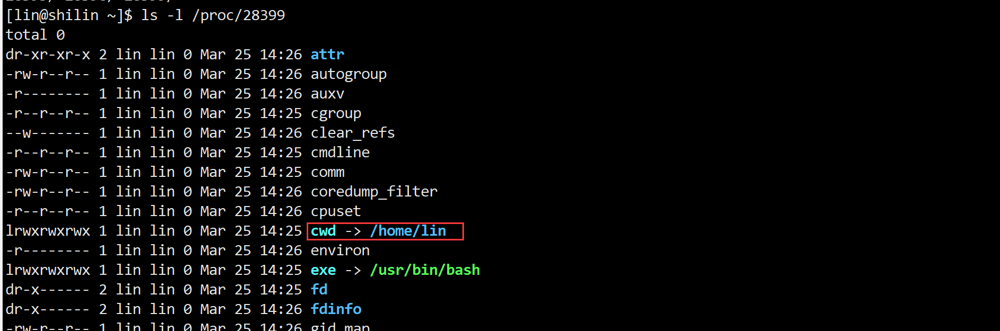

+ 可以看到进程有两个路径，一个是cwd一个是exe，exe路径代表当前进程执行的是磁盘上的哪个路径下的程序，可以看到执行的是myproc二进制可执行程序，cwd代表**current work directory**，代表当前进程的工作目录，所以实际上当前路径就是当前进程的工作目录。
+ 在模拟shell的实现代码中，cd到其他目录，pwd之后的路径实际上是没有变化的，因为pwd实际上pwd的是父进程shell的路径，而父进程的cwd路径始终是未改变的，而执行cd命令的是子进程，所以子进程的cwd路径是会改变的。
+ 系统给我们提供了一个系统调用接口叫做`chdir`，用于改变当前进程的工作目录cwd路径，实际上cd能够进入指定路径下的目录，底层实现上就是改变了shell（bash）进程的cwd路径，所以pwd时，随时随地打印出来的就是shell进程的工作目录。
+ 所以如果我们模拟实现的shell也想实现cd改变路径的功能，实际上是不可以创建子进程的，**因为子进程程序替换执行cd，父进程的工作目录是没有改变的**，所以直接将这一种情况单独拿出来进行判断，在这种情况下，直接让父进程执行cd命令，修改父进程的工作目录即可。

### 6.3 shell内建/内置命令（shell自己执行的命令，而不是派生子进程进行程序替换来执行）
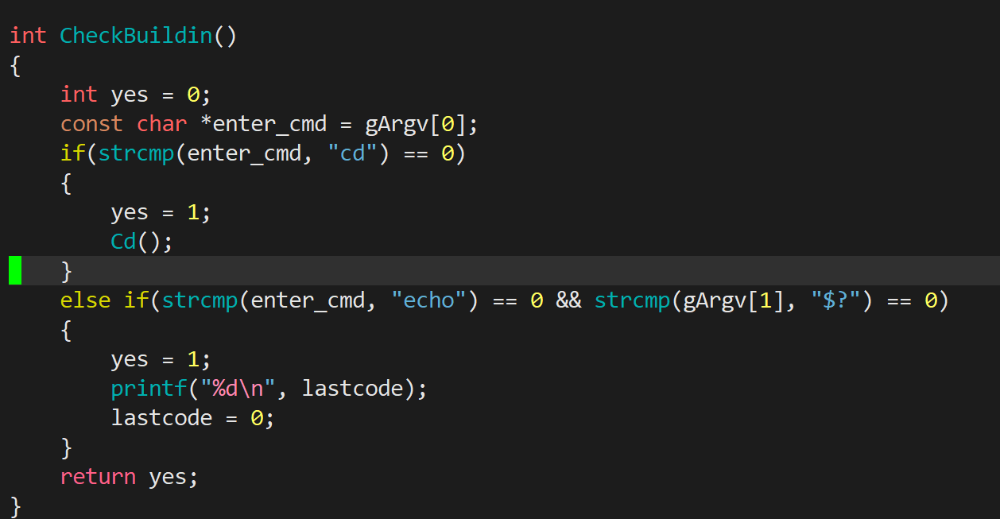

+ 像上面的cd命令实际上就是shell的内建命令，因为这样的命令不需要派生子进程来进行程序替换执行，直接让父进程执行就ok，这样的指令就是shell自带的命令，我们称之为**内建命令或内置命令。**
+ 这也就能解释为什么echo能够打印本地变量了，我们之前将echo理解为一个可执行程序，也就是shell的子进程，但是我们说子进程只能继承父进程的环境变量，而不能继承本地变量，所以当时就陷入echo为什么能够打印出本地变量的疑问当中，因为如果echo是子进程的话，他是没有继承本地变量的。
+ 但现在我们就知道原因了，echo实际上不是shell的子进程，而是shell的内建命令，是shell自己来执行的指令，shell当然拥有本地变量了，当然也就能够打印本地变量。

### 6.4 shell代码使用C和C++混编实现
1. makefile

```makefile
myshell:main.cc myshell.cc 
	g++ -o $@ $^ -std=c++11
.PHONY:clean
clean:
	rm -rf myshell
```

2. main.cc

```cpp
#include "myshell.h"


int main()
{
    char commandstr[SIZE];

    while(true)
    {
        // 0. 初始化操作
        InitGlobal(); 
        
        // 1. 输出命令行提示符
        PrintCommand();
        
        // 2. 获取用户输入的命令
        if(!GetCommandStr(commandstr,SIZE))
            continue;
        // 对命令字符串，进行解析 -> 命令行参数表
        ParseCommandStr(commandstr); 
        // 4. 检测命令，内键命令，要让shell自己执行！
        if(BuiltInCommandExec())
            continue;

        // 5.执行命令, 让子进程来进行执行
        ForkAndExec();
    }

    return 0;
}

```

3. myshell.h

```cpp
#pragma once


#include <cstdio>
#include <iostream>
#include <unistd.h>
#include <string.h>
#include <sys/types.h>
#include <sys/wait.h>

#define SIZE 1024

void InitGlobal();
void PrintCommand();
bool GetCommandStr(char *cmd, int len);
void ParseCommandStr(char *cmd);
bool BuiltInCommandExec();
void ForkAndExec();
```

4. myshell.h

```cpp
#include "myshell.h"

// 保存shell的当前路径
char pwd[SIZE];

// 命令行参数
#define ARGS 64
char *gargv[ARGS] = {NULL};
int argc = 0;

// 退出码
int lastcode = 0;

// 初始化命令行
void InitGlobal()
{
    argc = 0;
    memset(gargv, 0, sizeof(gargv));
}

// 获取用户名
static std::string GetUserName()
{
    std::string username = getenv("USER");
    return username.empty() ? "None" : username;
}

// 获取主机名
static std::string GetHostName()
{
    std::string hostname= getenv("HOSTNAME");
    return hostname.empty() ? "None" : hostname;
}

// 获取家目录
static std::string GetHomePath()
{
    std::string homepath= getenv("HOME");
    return homepath.empty() ? "/" : homepath;
}

// 获取当前路径
static std::string GetPwd()
{
    char temp[1024];
    getcwd(temp,sizeof(temp));
    // 更新一下shell自己的环境变量
    snprintf(pwd, sizeof(pwd), "PWD=%s", temp);
    putenv(pwd);
    
    // 拆分
    std::string pwd_lable = temp;
    const std::string pathsep = "/";
    auto pos = pwd_lable.rfind(pathsep);
    if(pos == std::string::npos)
    {
        return "None";
    }

    // 去掉/
    pwd_lable = pwd_lable.substr(pos + 1);
    return pwd_lable.empty() ? "/" : pwd_lable;
}

// 打印命令行
void PrintCommand()
{
    std::string user = GetUserName();
    std::string hostname = GetHostName();
    std::string pwd = GetPwd();
    printf("[%s@%s %s]&", user.c_str(), hostname.c_str(), pwd.c_str());
}

// 获得命令行字符串
bool GetCommandStr(char *cmd, int len)
{
    if(cmd == NULL || len <= 0)
        return false;

    char *res = fgets(cmd, len, stdin);
    if(res == NULL)
        return false;
    // 最后的位置-1放\0, 否则会有\n
    cmd[strlen(res) - 1] = 0;
    
    return strlen(cmd) == 0 ? false : true;
}

// 拆分命令行的字符串
void ParseCommandStr(char *cmd)
{
    if(cmd == NULL)
        return;
    gargv[argc++] = strtok(cmd, " ");
    while((bool)(gargv[argc++] = strtok(NULL, " ")));
    
    // 回退一次
    argc--;
}

// 内建命令执行
bool BuiltInCommandExec()
{
    std::string cmd = gargv[0];
    bool ret = false;
    if(cmd == "cd")
    {
        if(argc == 2)
        {
            std::string target = gargv[1];
            if(target == "~")
            {
                ret = true;
                chdir(GetHomePath().c_str());
            }
            else
            {
                ret = true;
                chdir(gargv[1]);
            }
        }
        else if(argc == 1)
        {
            ret = true;
            chdir(GetHomePath().c_str());
        }
    }
    else if(cmd == "echo") 
    {
        if(argc == 2)
        {
            std::string args = gargv[1];
            if(args[0] == '$')
            {
                if(args[1] == '?')
                {
                    printf("lastcode: %d\n",lastcode);
                    lastcode = 0;
                    ret = true;
                }
                else 
                {
                    const char *name = &args[1];
                    printf("%s\n",getenv(name));
                    lastcode = 0;
                    ret = true;
                }
            }   
            else 
            {
                printf("%s\n",args.c_str());
                ret = true;
            }
        }
    }
    else
    {
        
    }

    return ret;
}


// 执行命令
void ForkAndExec()
{
    pid_t id = fork();
    if(id < 0)
    {
        perror("fork fail!");
        return;
    }
    else if(id == 0)
    {
        // 子进程
        execvp(gargv[0], gargv);
        exit(0);
    }
    else
    {
        // 父进程等待子进程，非阻塞等待
        int status;
        pid_t rid = waitpid(id, &status, 0);
        if(rid > 0) // 等待成功
        {
            // 获得退出码
            lastcode = WEXITSTATUS(status);
        }
    }
}
```


