# Linux进程概念&&进程状态&&进程优先级&&内核调度队列
## 一、认识冯诺依曼系统
我们常见的计算机，如笔记本。我们不常见的计算机，如服务器，大部分都遵守冯诺依曼体系。

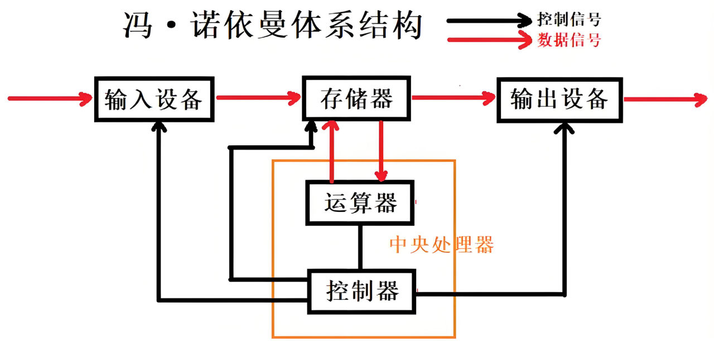

这里的存储器指的是内存

+ 不考虑缓存情况，这里的CPU能且只能对内存进行读写，不能访问外设(输入或输出设备)
+ 外设(输入或输出设备)要输入或者输出数据，也只能写入内存或者从内存中读取。
+ 一句话，所有设备都只能直接和内存打交道。

那么C/C++->可执行程序->必须得先加载到内存->为什么？？

+ 先加载到内存，这是由体系结构决定的！
+ CPU在数据层面，不和外设打交道，只会和内存打交道！外设不和CPU直接打交道，只和内存直接打交道
+ 内存的本质：是外设和CPU的缓存----计算机效率，以内存的速度为主！！
+ 引入内存使用冯诺依曼结构可以让用户已不怎么高的成本获得一台效率不错的计算机内存让计算机更有“性价比”！

**数据流动的本质**：<font style="color:#DF2A3F;background-color:#FBDE28;">拷贝</font>！

+ 计算机的整体效率，本质就是在设备间拷贝的效率！
+ 发送消息的本质：是基于冯诺依曼结构，从我的键盘文件拷贝数据到对方的显示器文件！！！

## 二、操作系统(Operator System)
任何计算机系统都包含一个基本的程序集合，称为操作系统(OS)。

+ 内核（进程管理，内存管理，文件管理，驱动管理）
+ 其他程序（例如函数库，shell程序等等）

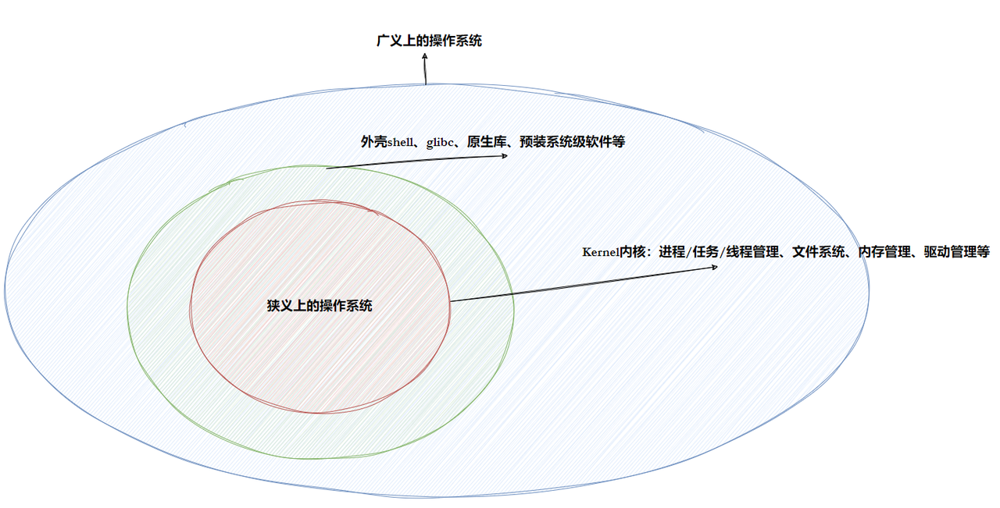

> 设计OS的目的：
>

对上：为用户程序（应用程序）提供一个良好的执行环境

对下：与硬件交互，管理所有的软硬件资源

+ 任何计算机问题，都可以通过添加一层软件层来解决
+ 软硬件体系结构：本质是层状的

我们使用计算机，大部分情况是在使用计算机的什么呢？

通过软件，访问计算机的硬件资源！！ (有限的！)，所以就必须把硬件资源管理好！！！

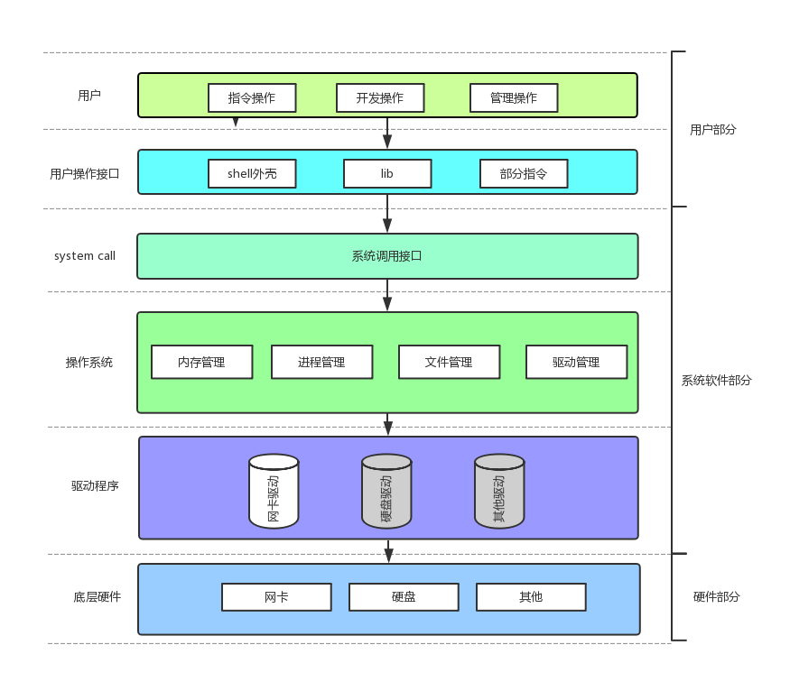

在整个计算机软硬件架构中，操作系统的定位是：一款纯正的“**搞管理**”的软件

> 描述被管理对象
>
> 组织被管理对象
>

**总结**  
计算机管理硬件

1. 描述起来，用struct结构体
2. 组织起来，用链表或其他高效的数据结构

在开发角度，操作系统对外会表现为一个整体，但是会暴露自己的部分接口，供上层开发使用，这部分由操作系统提供的接口，叫做系统调用。

系统调用在使用上，功能比较基础，对用户的要求相对也比较高，所以，有心的开发者可以对部分系统调用进行适度封装，从而形成库，有了库，就很有利于更上层用户或者开发者进行二次开发。

+ 管理的本质是对数据进行管理，管理的做法：**<font style="color:#DF2A3F;">先描述在组织</font>**！

---

<font style="background-color:#FBDE28;">操作系统是用什么语言写的？？C语言</font>

<font style="background-color:#FBDE28;">描述事物：struct</font>

<font style="background-color:#FBDE28;">操作系统内部一定存在大量的数据结构！！！</font>

<font style="background-color:#FBDE28;">学习好操作系统必须要能了解OS内的各种数据结构！！</font>

## 三、什么是进程
**课本概念**：程序的一个执行实例，正在执行的程序等

**内核观点**：担当分配系统资源（CPU时间，内存）的实体。

进程信息被放在一个叫做进程控制块的数据结构中，可以理解为进程属性的集合。课本上称之为**PCB（process control block）**，Linux操作系统下的PCB是: `task_struct`，也就是`task_struct`是`PCB`的一种，在Linux中描述进程的结构体叫做`task_struct`。`task_struct`是Linux内核的一种数据结构，它会被装载到RAM(内存)里并且包含着进程的信息。

### 查看进程
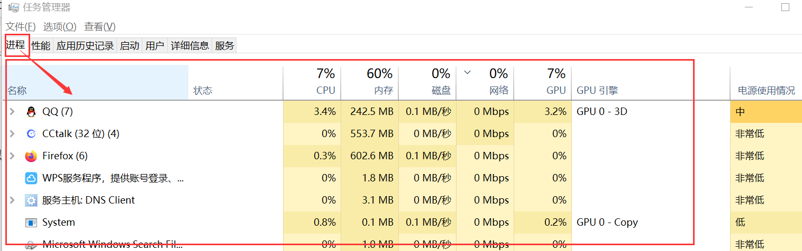

+ 运行一个进程是需要占用CPU和内存的
+ 在我们平时运行一个进程的时候（Windows）直接双击后，系统将磁盘里的exe文件加载到内存当中，这个时候就当**运行起来的时候就开启了一个进程**，这里要注意，加载到内存中中是不算进程的，只有当运行起来后才算是进程 -->**进程 = PCB（内核数据结构） + 自己的代码和数据**
+ 对应的每一个进程都有一个PCB结构体，操作系统需要通过此结构体找对应的二进制
+ 当有多个进程被运行起来的时候，就会产生多个PCB结构体，这个时候需要组织（可以是链表或者其他更高效的数据结构）起来进行管理，这就产生一个重要的概念------->**先描述，再组织**

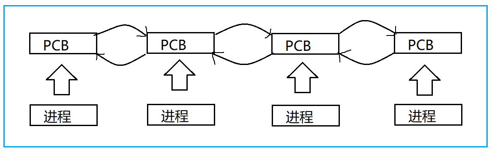

+ 每个进程都对应的每个PCB结构体，当运行的时候需要进行排队，CPU就可以通过PCB找到原代码，再把代码交给CPU运行

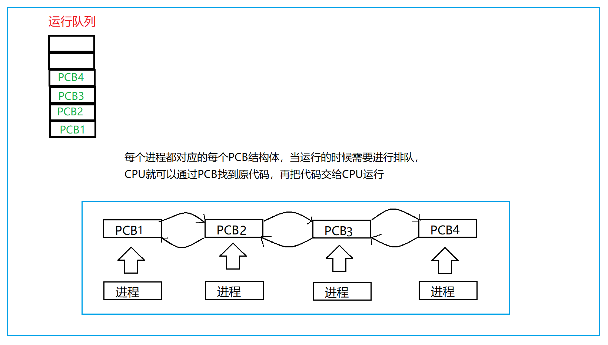

**<font style="color:#DF2A3F;">进程排队，本质其实就是让你的pcb节点，进行排队，换句话说就是从一个数据结构，把节点拿走，放入新的队列数据结构中！！</font>**

---

#### 进程的信息可以通过/proc 系统文件夹查看
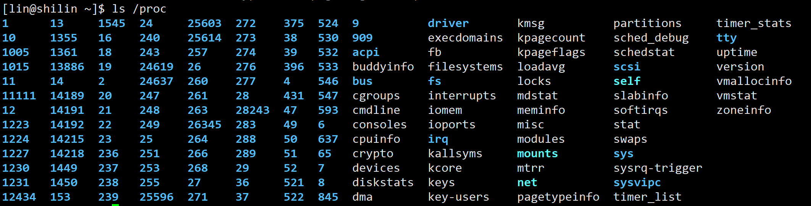

如：要获取PID为1的进程信息，你需要查看`/proc/1`这个文件夹。

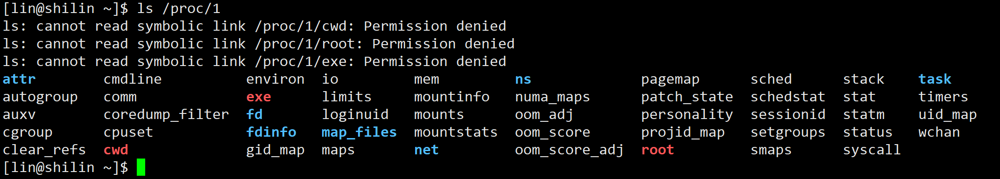

+ 对于进程理解来说，在Windows上是也可以观察到的，右键状态栏的任务管理器就可以看到

#### 大多数进程信息同样可以使用`top`和`ps`这些用户级工具来获取
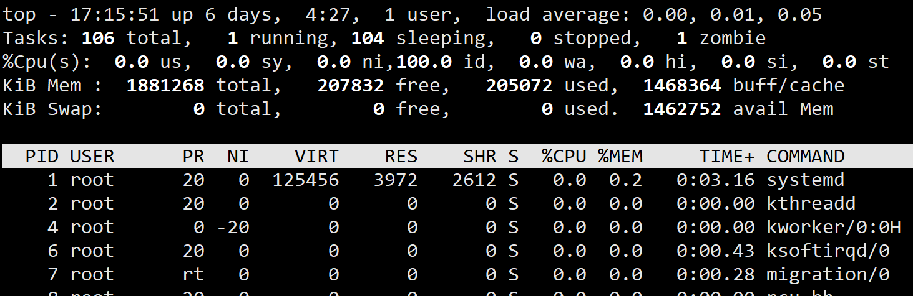

```shell
ps axj | head -1 && ps axj | grep a.out | grep -v grep
```

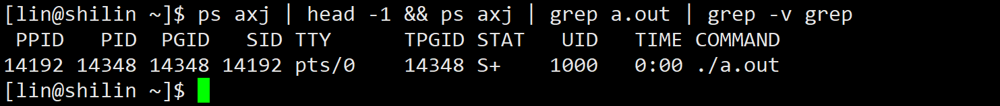

具体在Linux下，我们叫做：`struct task_struct`

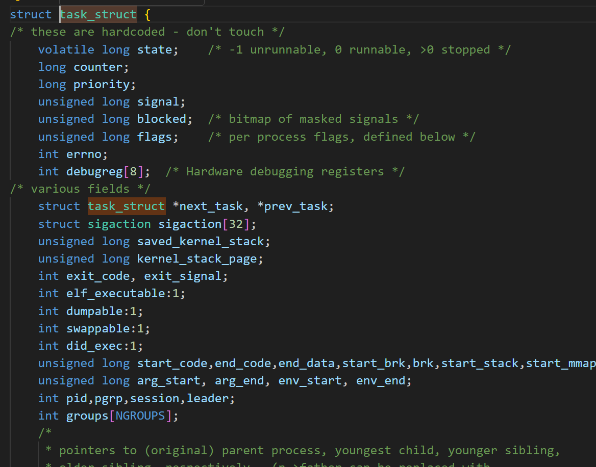

内容分类

+ 标示符: 描述本进程的唯一标示符，用来区别其他进程。
    - 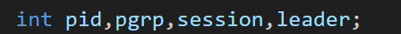
+ 状态: 任务状态，退出代码，退出信号等。
    - 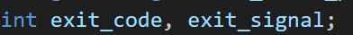
+ 优先级: 相对于其他进程的优先级。
+ 程序计数器: 程序中即将被执行的下一条指令的地址。
+ 内存指针: 包括程序代码和进程相关数据的指针，还有和其他进程共享的内存块的指针
+ **上下文数据**: 进程执行时处理器的寄存器中的数据，硬件上下文的保存与恢复
    - 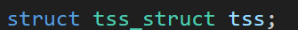
    - 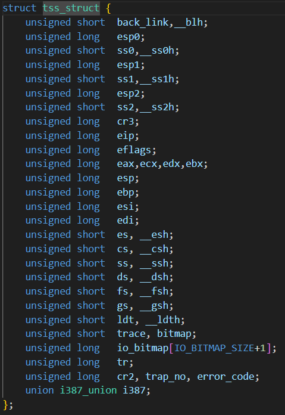
+ I／O状态信息: 包括显示的I/O请求,分配给进程的I／O设备和被进程使用的文件列表。
+ 记账信息: 可能包括处理器时间总和，使用的时钟数总和，时间限制，记账号等。

### 通过系统调用获取进程标识符
> 进程id：（pid）
>
> 父进程id：（ppid）
>

+ 通过`man 2 getpid`即可查看

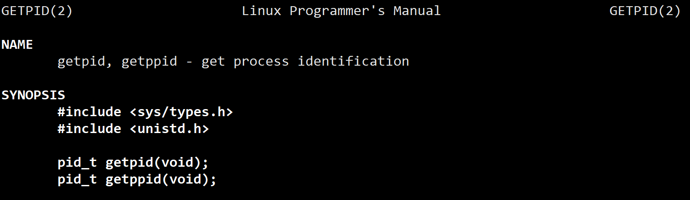

```c
#include <stdio.h>
#include <unistd.h>
#include <sys/types.h>

int main() {
    while(1) {
        printf("I am a process,pid:%d, 父进程id:%d\n",getpid(),getppid());
        sleep(1);
    }
    return 0;
}
```

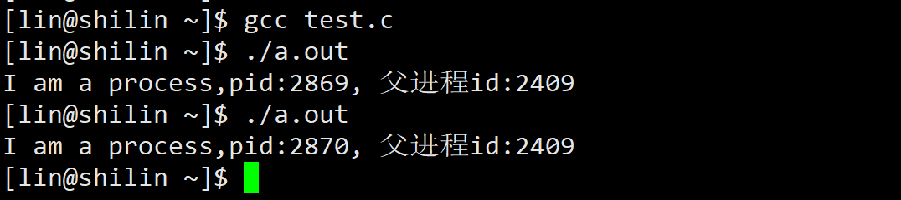

通过查看，pid是一直在变化的，而父进程id是不变的

其实这个父进程就是bash，可以通过

```shell
ps axj | head -1 && ps axj | grep a.out | grep -v grep
```

```shell
ps axj | head -1 && ps axj | grep 2409 | grep -v grep
```

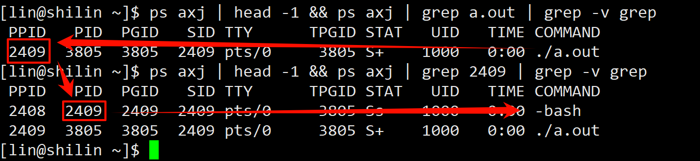

+ Linux系统，增多进程，是通过父进程创建子进程的方式，让Linux系统中的进程变多的

也就是说**<font style="color:#DF2A3F;background-color:#FBDE28;">我们执行命令行中，启动命令/程序的时候都会变成进程该进程的父进程是bash</font>**，由子进程执行我们的代码

我们可以通过fork来创建子进程

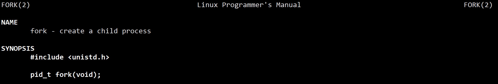

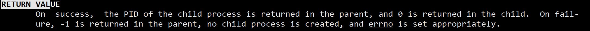

在上图中我们还可以看到返回类型是`pid_t`

+ **<font style="color:#DF2A3F;">如果创建子进程失败，会返回小于0的数字</font>**
+ **<font style="color:#DF2A3F;">创建子进程成功，该函数则会返回俩个值。</font>**
+ **<font style="color:#DF2A3F;">它会给子进程返回0值，而给父进程返回子进程的pid（一个大于0的数）</font>**，创建成功后我们可以对此进行使用if语句进行分流

```c
#include <stdio.h>
#include <unistd.h>
#include <stdlib.h>
#include <sys/types.h>

int main(){
    pid_t pid = fork();
       if(pid < 0) {
        printf("fork error!\n");
        exit(-1); 
    }
    else if(pid == 0) {
        //child
        while(1){
            printf("This is Child! My pid:%d,ppid:%d\n",getpid(),getppid());
            printf("child: pid:%d\n",pid);
            sleep(1);
        }
    }
    else {
        //parent
        while(1){
            sleep(1);
            printf("This is Parent! My pid:%d,ppid:%d\n",getpid(),getppid());
            printf("parent: pid:%d\n",pid);
        }
    } 
    
    return 0;
}
```

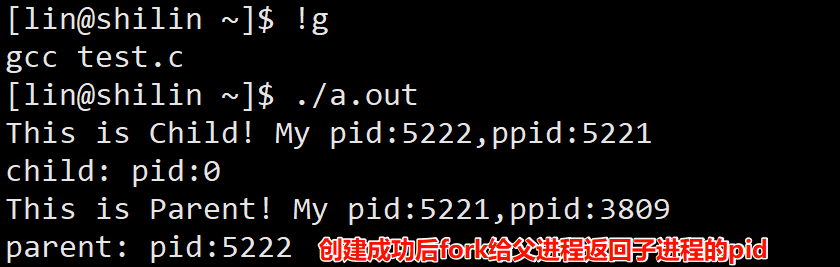

+ 在Linux中，创建一个新的子进程，子进程的task_struct,也要被初始化，以父进程为模版，fork创建的子进程，该子进程默认好像没有自己要执行的代码和数据，其实是**默认共享父进程的代码和数据**，进程在数据层面上要**保护数据的独立性**（写时拷贝）

## 二、进程的状态
+ 每个进程都有自己的一个状态，告诉操作系统正在干什么，将来要干什么？也就是说，**进程的多种状态，本质都是为了满足未来的某种使用场景。**
+ 就比如Windows上的任务管理器也有显示进程的状态

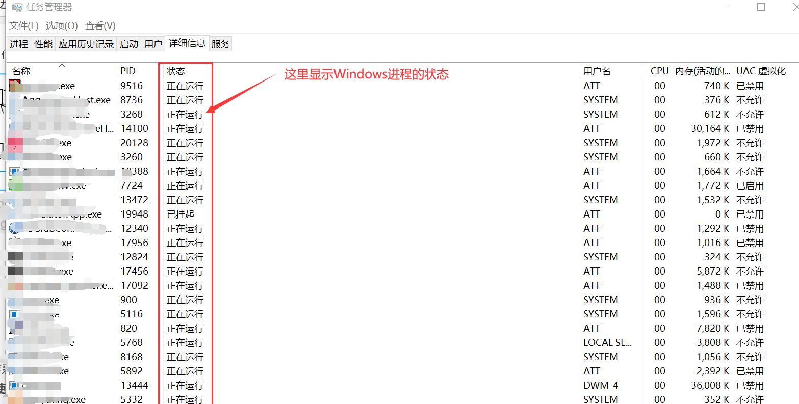

在操作系统上有**三种**状态

> 运行状态
>

+ 运行状态：从计算机的硬件出发，我们所写的代码在硬盘中，要让程序运行起来就要加载到内存当中， 每一个程序（进程）都会有一个属于自己的PCB，通过PCB来进行排队，等待CPU的调度，为了方便调度管理，操作系统会维护一个运行队列，所有就绪状态的进程的PCB会被加入到这个队列当中， CPU在调度执行时就会通过这个运行队列拿到进程的PCB，进而调度执行该进程，在排队的时候就是运行状态。

> 挂起状态
>

+ 挂起状态：内存满负荷时，又要增加新的进程显然是不行的。所以操作系统会观察内存中的哪些进程没有被放在任何一个队列里面(在内存里面啥也不干)，找到以后就把此进程的代码和数据短期内置换到磁盘上，仅保留此进程的PCB。腾出的这一块空间供新的进程使用。针对于这种情况，操作系统会将阻塞进程的代码和数据置换到外设，此时该进程的状态就被称为挂起状态；
    - 其中阻塞进程的代码和数据一般会存放在磁盘的swap分区，当进程被操作系统调度时，被置换到外设的代码和数据又会重新加载到内存；
    - 一般情况下，swap分区的大小不会太大，大概等于内存的大小，过大的swap分区会导致操作系统过于依赖swap分区，导致效率变低；

> 阻塞状态
>

+ 阻塞状态：在CPU执行一个进程的时候，可能会需要访问系统的某些资源，就比如在C语言中写的scanf()，在使用这个函数的时候，需要调用键盘，等待键盘输入数据，当进程需要键盘资源的时候，会将进程的PCB加入到硬件设备结构描述的等待队列当中，并且把PCB设置为阻塞状态，当PCB在这个等待队列中等待数据资源时，这个状态就叫做阻塞状态；

## 三、Linux是如何做的？
+ 在Linux内核中是这样定义的：

```c
/*
 * The task state array is a strange "bitmap" of
 * reasons to sleep. Thus "running" is zero, and
 * you can test for combinations of others with
 * simple bit tests.
 */
static const char *task_state_array[] = {
	"R (running)",		/*  0 */
	"S (sleeping)",		/*  1 */
	"D (disk sleep)",	/*  2 */
	"T (stopped)",		/*  4 */
	"T (tracing stop)",	/*  8 */
	"Z (zombie)",		/* 16 */
	"X (dead)"		/* 32 */
};
```

+ 先简单描述一下这些状态：
    - R (Running)：该进程正在运行中。
    - S (Sleep)：该进程目前正在睡眠状态，但可以被唤醒。
    - D：不可被唤醒的睡眠状态，通常这个进程可能在等待I/O的情况。
    - T：停止状态，发送一个暂停信号给进程，进程就暂停了。
    - t：追踪停止状态，通常在断点调试时，进程处于此状态。
    - X：死亡状态，这个状态是用来告诉操作系统的，所以我们观察不到此状态。
    - Z (Zombie)：僵尸状态，进程已经死亡，但是却无法被删除至内存外。

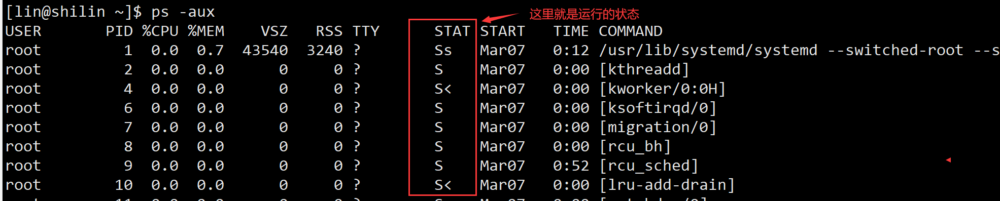

+ 这里我们还需要了解一个概念，进程是有依赖的，就比如我运行这个C语言程序，其父进程是bash，pid是本进程的id，ppid是父进程的id

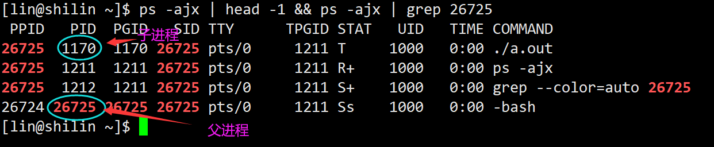

### 3.1 R状态
+ 下面我们编写这样一段代码，是一个死循环，这样可以观察到进程

```c
#include<stdio.h>
#include<unistd.h>
int main()
{
  while(1);
  return 0;
}

```

+ 普通查看进程可以这样查看

```bash
ps -aux | head -1 &&ps -aux | grep a.out
```

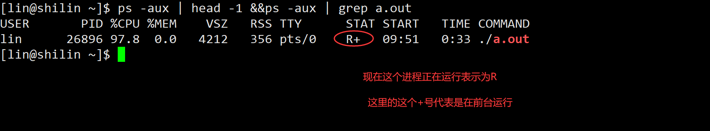

+ 我们还可以用shell命令来一直刷新观察

```bash
while :; do ps -axj | head -1 && ps -axj | grep a.out | grep -v grep;sleep 1;done
```

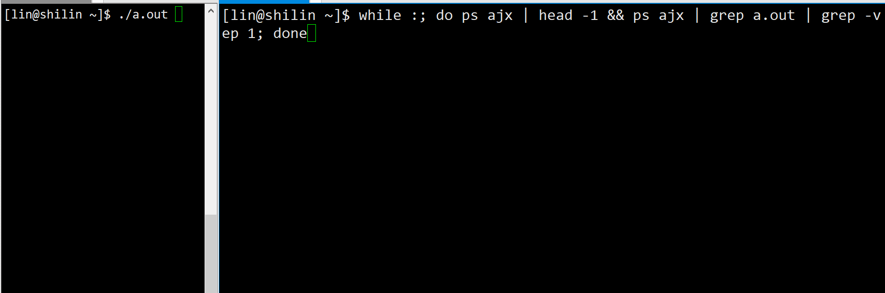

+ 这里看到是R+是代表在前台运行，在运行的时候可以使用ctrl+c进行中断，中断后进程也就退出了
+ 我们可以让此程序到后台运行
    - 在命令后面加“&”符号
    - 这里的pid进程id是唯一的，标识此进程，ppid代表父进程

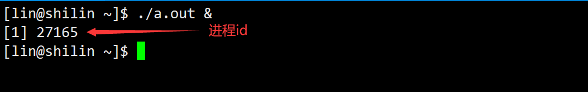

+ 在运行起来后看到那个+号就没有了，说明是在后台运行中


+ 想要杀死这个程序就需要使用kill命令来进行杀死

```bash
kill -9 27165
```

+ 这里使用kill -9命令比较麻烦需要找到进程的id，我们还有一个命令

```bash
killall -9 a.out
```

+ 这样就可以不用输入进程id输入此进程的名字即可

我们再补充一个概念，每一个进程运行起来的时候都有一个文件被创建

在根目录下的proc

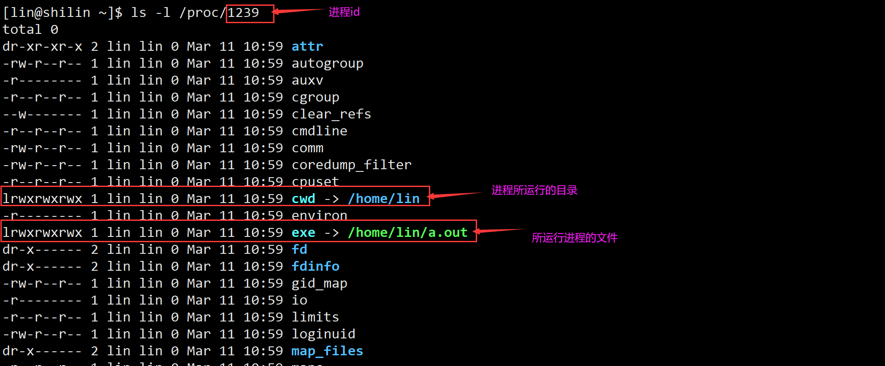

这里的cwd就是<font style="color:rgba(0, 0, 0, 0.85);">进程当前的工作目录</font>

+ <font style="color:rgba(0, 0, 0, 0.85);">这也就是说在写c语言的时候fopen新建文件的目录默认就是在当前进程工作目录</font>
+ <font style="color:rgba(0, 0, 0, 0.85);">这个工作目录也可以修改，使用chdir</font>
+ 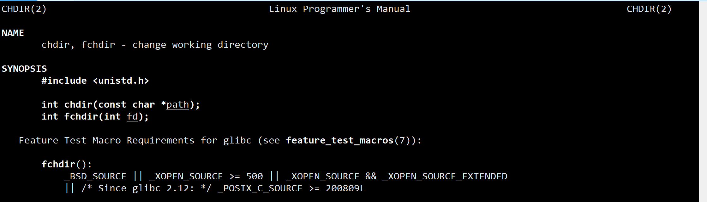

通过chdir修改就可以看到

```c
#include<stdio.h>
#include<unistd.h>
#include<sys/types.h>
#include<stdlib.h>

int main()
{
    chdir("/home/lin/code-exercise/Linux/process/status/dir");
    FILE* fp = fopen("hello.txt","w");
    if(!fp)
    {
        perror("fopen fail!\n");
        exit(-1);
    }
    printf("pid:%d\n",getpid()); 

    while(1);
    fclose(fp);
    return 0;
}

```

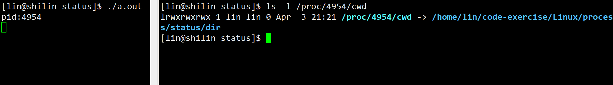

### 3.2 S状态
+ 这个状态表示此进程正在睡眠，但是可以被唤醒
+ 下面可以进行演示一下：

```c
#include<stdio.h>
#include<unistd.h>
int main()
{
  while(1){
    printf("hello world\n");
  }
  return 0;
}

```

+ 在上面的那段代码中添加了一个printf打印函数，同样是运行，但是这里为什么是S状态呢？

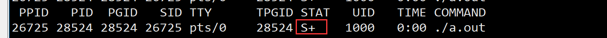

+ 这是因为CPU运行的速度很快，一直需要请求显示器响应，CPU多数的时候是在等待，所以就显示S
+ 这里我使用了实体机器的ubuntu验证了一下，是对的，一遍在疯狂的打印helloword，由于打印的速度也很快，CPU的速度也很快，所以有再看进程有的时候就会显示R状态，有的时候显示S状态~~

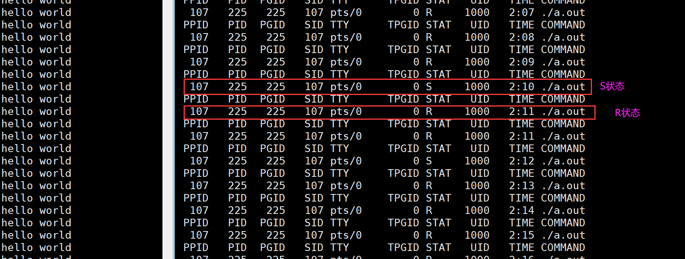

### 3.3 D状态
+ 此状态是深度休眠状态，不可被唤醒，是为磁盘准备的
+ 当进程需要大量的数据写入磁盘的时候，等待磁盘写入的进程状态就是休眠，上面也将过了，
+ 在内存严重不足的情况下，操作系统没办法时会通过杀死进程的方式来节省资源；如果在等待的过程中进程被操作系统杀掉，并且磁盘写入数据失败，那么就会导致数据无法再加载（数据丢失）；为了避免这种情况，就可以把等待数据写入的进程状态设为D状态；
+ D状态无法被杀掉（OS也不行），只能等待执行完毕后状态转换；

```c
#include <stdio.h>
#include <fcntl.h>
#include <unistd.h>
#include <string.h>
#define BUFFER_SIZE 1024 * 1024
#define WRITE_TIMES 100
int main() {
    int fd;
    char buffer[BUFFER_SIZE];
    memset(buffer, 'a', BUFFER_SIZE);
    // 打开一个文件用于写入
    fd = open ("large_file.txt", O_WRONLY | O_CREAT | O_TRUNC, 0644);
    if (fd == -1) {
        perror ("open");
        return 1;
    }
    // 循环写入大量数据，这可能会让进程进入 D 状态
    int i;
    for (i = 0; i < WRITE_TIMES; i++) {
        ssize_t bytes_written = write(fd, buffer, BUFFER_SIZE);
        if (bytes_written == -1) {
            perror ("write");
            break;
        }
    }
    close(fd);
    return 0;
}

```

```shell
while :; do ps -axj | head -1 && ps -axj | grep -i myfile | grep -v grep; sleep 1; done;
```

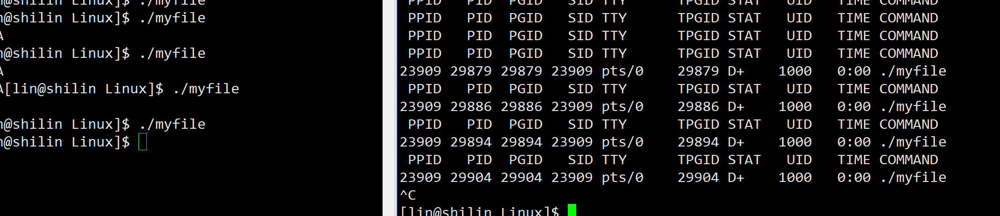

### 3.4 T状态
+ 此状态是停止状态，可以通过发送 SIGSTOP 信号给进程来停止（T）进程。这个被暂停的进程可以通过发送 SIGCONT 信号让进程继续运行

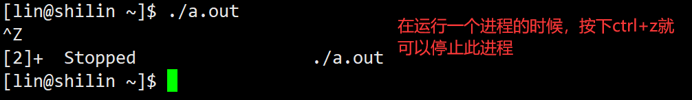

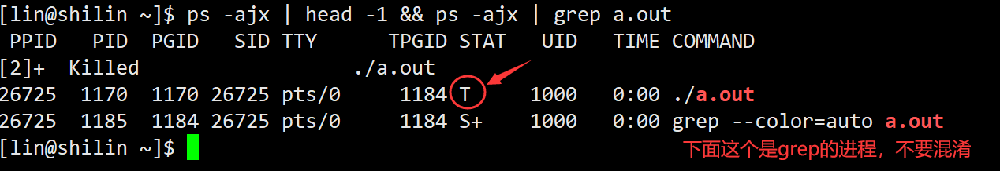

+ 可以使用kill -l命令查看一下发送信号的类型

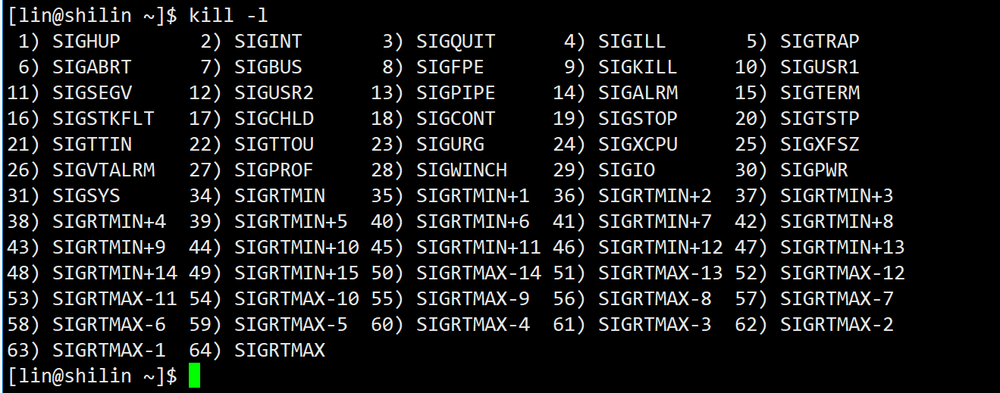

### 3.5 t状态
+ 这个小写的t状态也是停止状态

主要出现在程序Debug时，在Debug的时候，遇到断点，进程就暂停，此时就是t状态

D状态、T状态、t状态其实都是阻塞状态，阻塞可以等待硬件资源也可以等待软件资源

通过使用gdb工具给程序打断点，当程序运行到了断点处就停下来了，可以看到程序的状态就是t

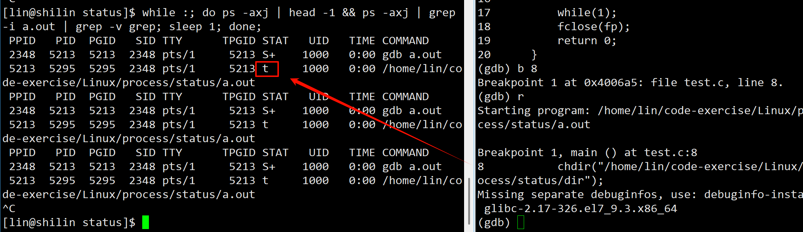

### 3.6 X状态
+ X状态（死亡状态），就是我们常说的终止状态，它是一个瞬时状态，不会在任务列表里看到这个状态

### 3.7 Z状态
+ 最后就是Z（zombie）僵尸状态，僵尸状态较为复杂，Linux系统中的僵尸进程状态也是一种特殊的进程状态，通常是指一个子进程已经结束运行，但其父进程还未对其进行善后处理。如果不及时清理僵尸进程，会导致系统资源泄漏，影响系统性能甚至造成系统崩溃；

> 还有一些其他的状态：
>

+ I：空闲状态
+ P：等待交换页
+ W：没有足够的内存分页可分配
+ < ：高优先级的进程
+ N：低优先级的进程

## 四、僵尸进程
+ 当有一个进程要退出的时候，它是直接原地消失、释放空间的吗？

当进程退出的时候，它是不会立即释放空间的，它的PCB会保存一段时间让父进程或者操作系统读取，让父进程或操作系统知道这个进程即将退出了，然后父进程或者操作系统释放掉进程占用的资源和空间。一般情况下，清理进程资源空间的操作都是父进程。

那么僵尸进程，指的是什么呢？就是进程退出时，依然会在内存里面待一段时间，**如果父进程没有能力将此进程完整地释放掉，造成这个进程一直在内存里面，此时这个进程就是僵尸进程**。

下面我们创建一个子进程来看一看

```c
#include<stdio.h>
#include <sys/types.h>
#include <unistd.h>
int main()
{
    pid_t id = fork();       
    while(1){
      if(id == 0){
          printf("我是子进程,pid:%d,ppid:%d\n",getpid(),getppid());
          sleep(1);
      }
      else if(id > 0){
          printf("我是父进程,pid:%d,ppid:%d\n",getpid(),getppid());
          sleep(2);
      }
    }                                                                                  
    return 0;
}
```

+ 使用man的2号手册可以看到fork的用法，fork有两个返回值
+ 父子进程代码共享，数据各自开辟空间，私有一份（采用写时拷贝）

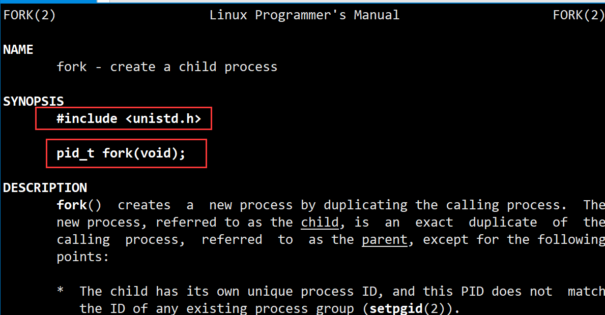

+ 在`return val`这里可以看到返回值，如果成功返回0，失败返回-1，

在程序上面的那个程序的时候，杀死子进程后，子进程的状态就变成了僵尸进程

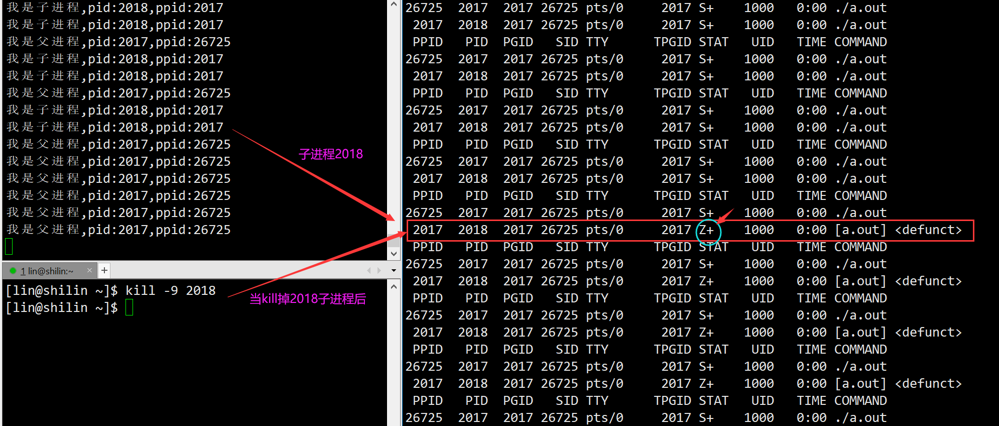

+ 僵尸进程通常是无法再进行管理的，所以我们不能直接杀kill掉它，而是交给操作系统来处理这个进程。

### 4.1 僵尸进程危害
+ 进程的退出状态必须被维持下去，因为他要告诉关心它的进程（父进程），你交给我的任务，我办的怎么样了。可父进程如果一直不读取，那子进程就一直处于Z状态。
+ 维护退出状态本身就是要用数据维护，也属于进程基本信息，所以保存在`task_struct(PCB)`中，换句话说，Z状态一直不退出，PCB一直都要维护。
+ 那一个父进程创建了很多子进程，就是不回收，是不是就会造成内存资源的浪费？是的！因为数据结构对象本身就要占用内存，想想C中定义一个结构体变量（对象），是要在内存的某个位置进行开辟空间！

## 五、孤儿进程
孤儿进程，顾名思义，没有父亲的进程就是孤儿进程，也就是，父进程创建了一个子进程，而父进程先退出了，就留下了子进程，这个时候这个进程就叫做孤儿进程

我们再用上面的代码可以演示一下，运行起来后，杀死父进程，就留下一个子进程

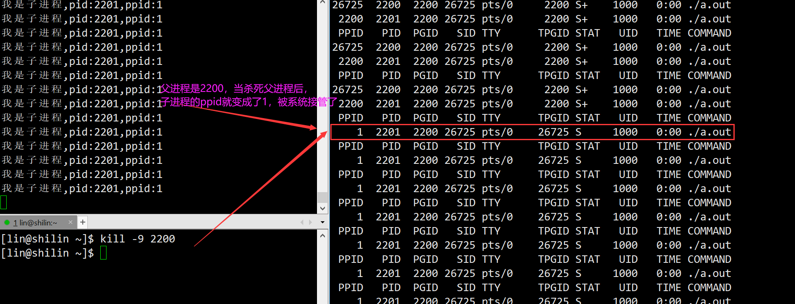

父进程是2200，当杀死父进程后，子进程的ppid就变成了1，就被**操作系统**接管了

## 六、进程的优先级
+ 什么是优先级？
    - 指定一个进程获取某种资源的先后顺序
    - 本质是进程获取cpu资源的优先顺序
+ 为什么要有优先级
    - 进程访问的资源（CPU）是有限的

操作系统关于调度和优先级的原则：分时操作系统，基本的公平，如果进程因为长时间不被调整，就造成了**饥饿问题**

+ Linux的优先级特点以及查看方式

查看进程的优先级

```bash
ps -lA
```

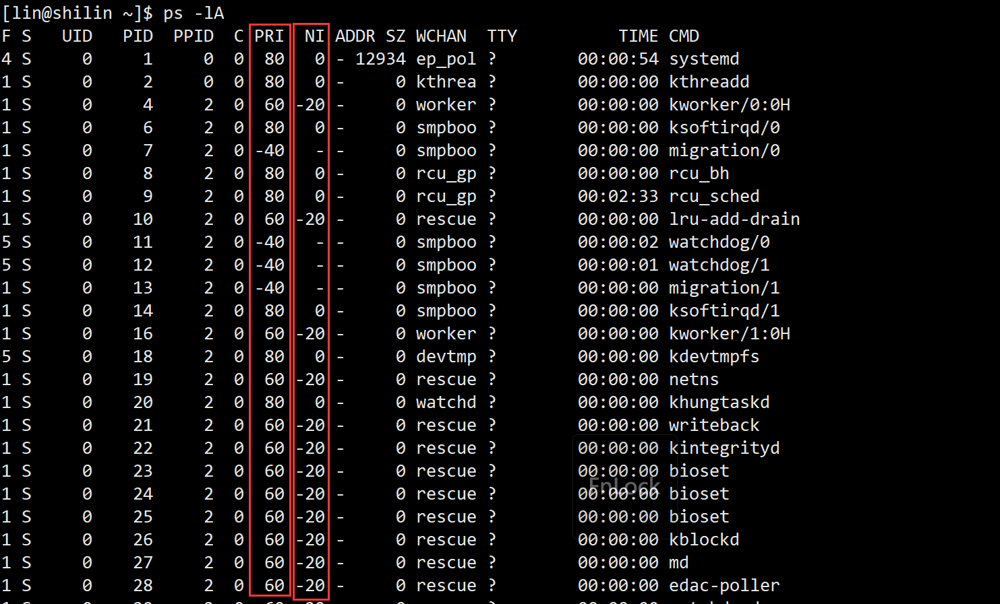

> UID : 代表执行者的身份
>

> PID : 代表这个进程的代号
>

> PPID ：代表这个进程是由哪个进程发展衍生而来的，亦即父进程的代号
>

> PRI ：代表这个进程可被执行的优先级，其值越小越早被执行
>

> NI ：代表这个进程的nice值
>

### PRI and NI
PRI也还是比较好理解的，即进程的优先级，或者通俗点说就是程序被CPU执行的先后顺序，此值越小进程的优先级别越高

因为PRI值是由操作系统内核动态调整的，我们无法直接去调整这个值，所以我们必须通过**nice**值去调整它。nice值就是上图PRI后面NI。

因为PRI是系统内核去动态调整的，我们修改后需要经过内核的允许，如果这个PRI值超过了内核的最大限度，那么这个值就会保留在**临界值**。

我们的计算公式为：**新的PRI = 进程默认PRI + nice值**，这个nice值有正负数，我们可以举一个例子：一个进程的PRI为80，我们给NI值为-10，再根据上面的公式得出新的PRI为70

nice其取值范围是-20至19，一共40个级别。

写一个代码来看一下：

```c
#include<stdio.h>
int main()
{
  while(1){
  }
  return 0;
}

```

+ 我们可以查看它的PRI和NI值

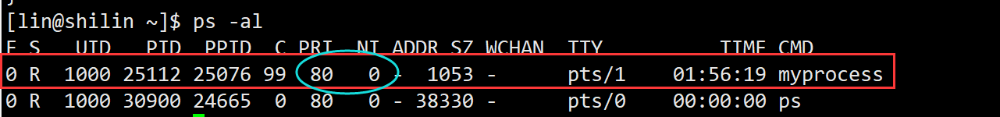

+ 我们可以通过下面的命令进行修改

number为想要的nice值，PID为要操作的进程

```bash
renice [number] [PID]               
```

首先查看一下该进程的id

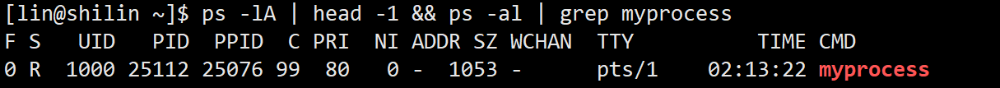

然后进行修改

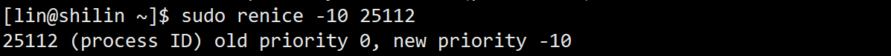

修改后就变成了PRI是`70`，NI是`-10`

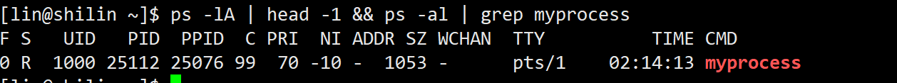

## 七、进程的四个重要概念
+ 竞争性：因为cpu资源优先，所以进程难免会存在竞争行为，具体体现在优先级上。
+ 独立性：进程运行期间，各个进程是不会相互干扰的，即使是父子进程。
+ 并行：当有多个cpu时，这些cpu同时处理多个进程的行为叫做并行。
+ 并发：在一段时间内，每个进程都可以被cpu处理一部分指令，这种行为称为并发。

假设cpu处理一个进程的时间为1秒，那么1个cpu处理99个进程的时间就是99秒。但是当有一台拥有3个cpu的计算机处理这99个进程时，只需要33秒。这就是并行，多个cpu同时处理多个进程。

## 八、上下文切换&&进程切换
CPU上下文切换：其实际含义是任务切换, 或者CPU寄存器切换。当多任务内核决定运行另外的任务时, 它保存正在运行任务的当前状态, 也就是CPU寄存器中的全部内容。这些内容被保存在任务自己的堆栈中, 入栈工作完成后就把下一个将要运行的任务的当前状况从该任务的栈中重新装入CPU寄存器，并开始下一个任务的运行, 这一过程就是context switch。

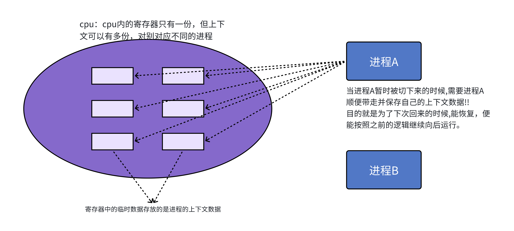

+ 每个任务运行前，CPU都需要知道任务从哪里加载、又从哪里开始运行，这就涉及到 CPU 寄存器 和 程序计数器（PC）：

如何切换？

+ 将前一个 CPU 的上下文（也就是 CPU 寄存器和程序计数器里边的内容）保存起来；
+ 然后加载新任务的上下文到寄存器和程序计数器；
+ 最后跳转到程序计数器所指的新位置，运行新任务。

被保存起来的上下文会存储到系统内核中，等待任务重新调度执行时再次加载进来。

CPU 的上下文切换分三种：**<font style="color:#DF2A3F;background-color:#FBDE28;">进程上下文切换、线程上下文切换、中断上下文切换</font>****。**

**把****<font style="color:#DF2A3F;background-color:#FBDE28;">临时数据转存到操作系统的行为叫做上下文保护，把临时数据写回寄存器内的行为叫做上下文恢复。</font>**

### Linux内核0.11代码
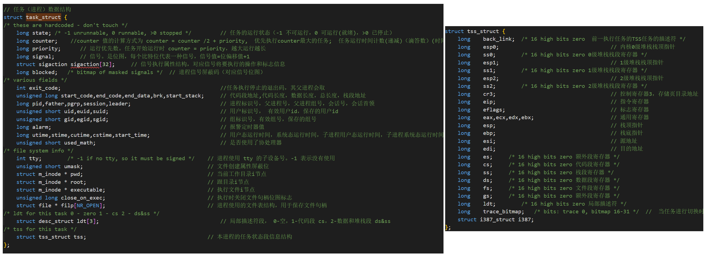

**时间片：****<font style="color:#DF2A3F;background-color:#FBDE28;">当代计算机都是分时操作系统，没有进程都有它合适的时间片(其实就是一个计数器)。时间片到达，进程就被操作系统从CPU中剥离下来。</font>**

## 五、Linux2.6内核进程调度队列
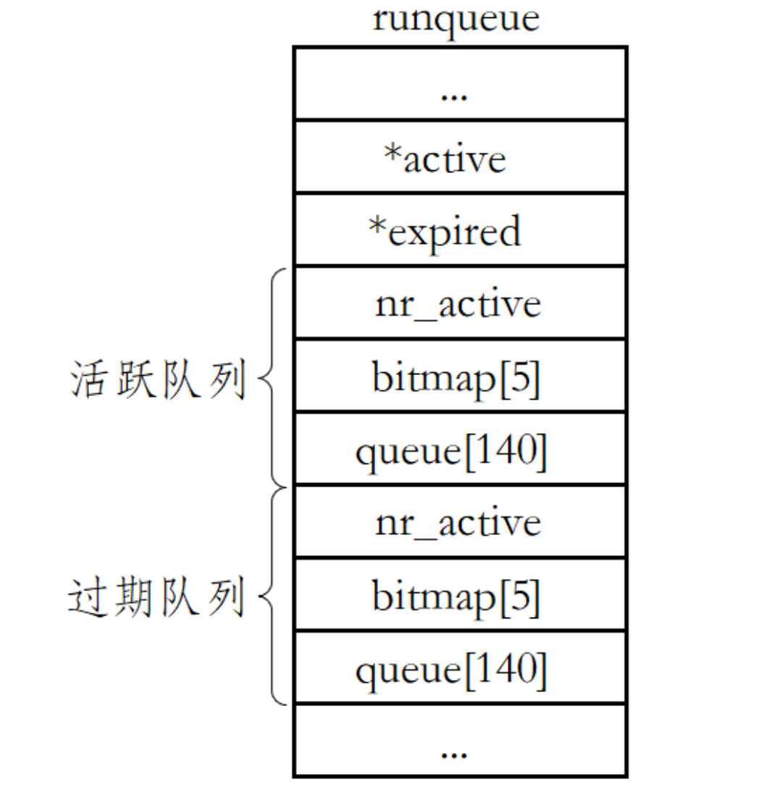

在Linux内核源码`linux-2.6.18`中可以看到：

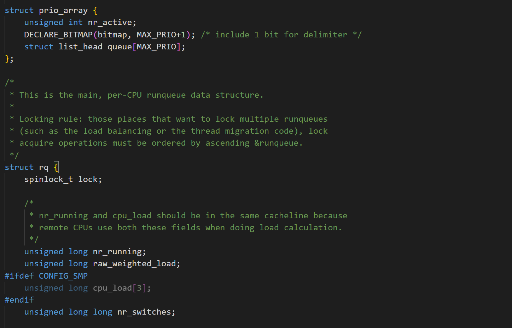

### 一个CPU拥有一个runqueue
如果有多个CPU就要考虑进程个数的父子均衡问题。

### 优先级
queue下标说明：

+ 普通优先级：100~139。
+ 实时优先级：0~99。

我们进程的都是普通的优先级，前面说到nice值的取值范围是-20~19，共40个级别，依次对应queue当中普通优先级的下标100~139。

注意： 实时优先级对应实时进程，实时进程是指先将一个进程执行完毕再执行下一个进程，现在基本不存在这种机器了，所以对于queue当中下标为0~99的元素我们不关心。

### 活动队列
时间片还没有结束的所有进程都按照优先级放在活动队列当中，其中nr_active代表总共有多少个运行状态的进程，而queue[140]数组当中的一个元素就是一个进程队列，相同优先级的进程按照FIFO规则进程排队调度。

调度过程如下：

1. 从0下标开始遍历queue[140]。
2. 找到第一个非空队列，该队列必定为优先级最高的队列。
3. 拿到选中队列的第一个进程，开始运行，调度完成。
4. 接着拿到选中队列的第二个进程进行调度，直到选中进程队列当中的所有进程都被调度。
5. 继续向后遍历queue[140]，寻找下一个非空队列。

bitmap[5]:一共140个优先级，一共140个进程队列，为了提高查找非空队列的效率，就可以用5*32个比特位表示队列是否为空，这样，便可以大大提高查找效率！


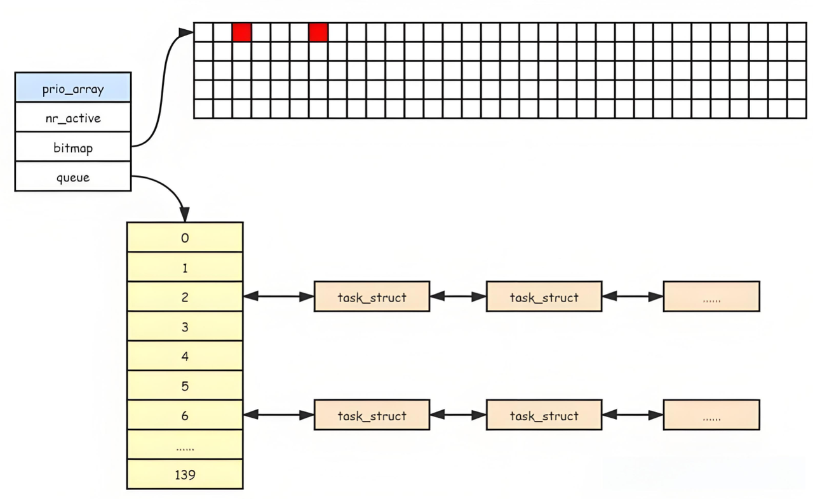

### 过期队列
+ **<font style="color:#DF2A3F;">过期队列和活动队列的结构相同。</font>**
+ **<font style="color:#DF2A3F;">过期队列上放置的进程都是时间片耗尽的进程。</font>**
+ **<font style="color:#DF2A3F;">当活动队列上的进程被处理完毕之后，对过期队列的进程进行时间片重新计算。</font>**

### active指针和expired指针
+ active指针永远指向活动队列。
+ expired指针永远指向过期队列。

由于活动队列上时间片未到期的进程会越来越少，而过期队列上的进程数量会越来越多（新创建的进程都会被放到过期队列上），那么总会出现活动队列上的全部进程的时间片都到期的情况，这时将active指针和expired指针的内容交换，就相当于让过期队列变成活动队列，活动队列变成过期队列，就相当于又具有了一批新的活动进程，如此循环进行即可。

**总结：** <font style="color:#DF2A3F;background-color:#FBDE28;">在系统当中查找一个最合适调度的进程的时间复杂度是一个常数，不会随着进程增多而导致时间成本增加，我们称之为</font>**<font style="color:#DF2A3F;background-color:#FBDE28;">进程调度的O(1)算法</font>**。

